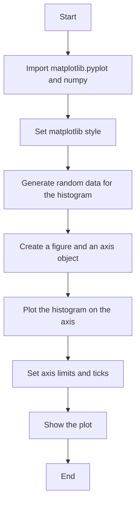
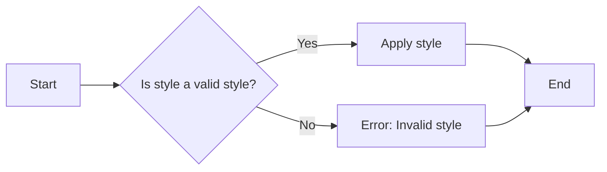
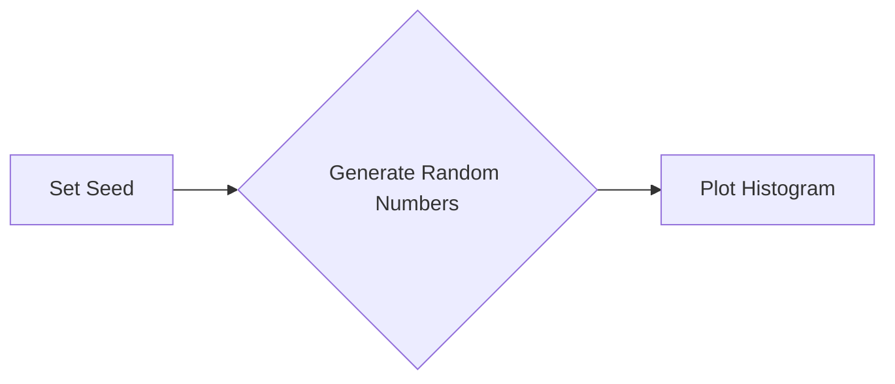
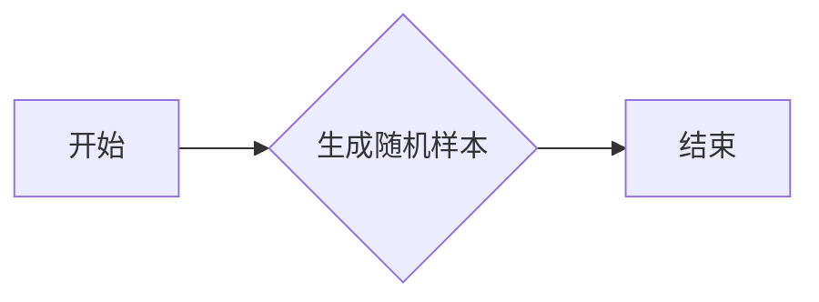
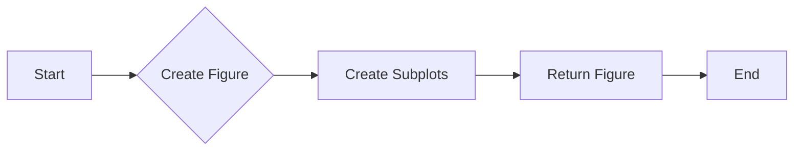
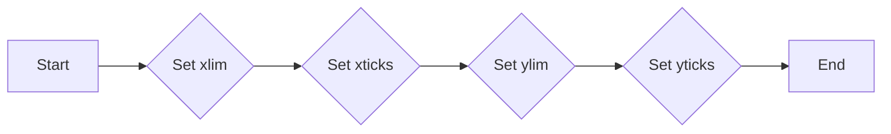
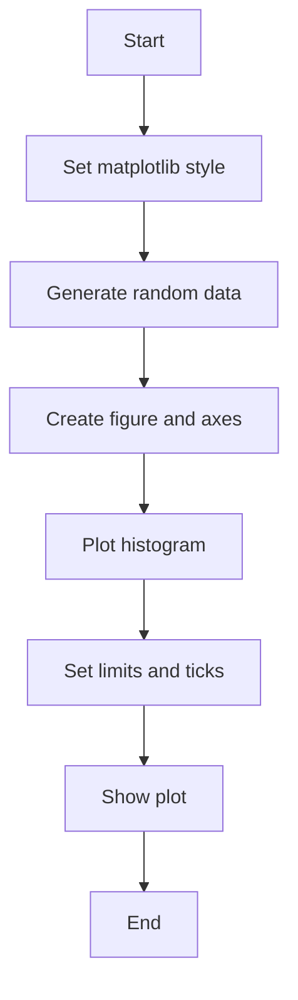
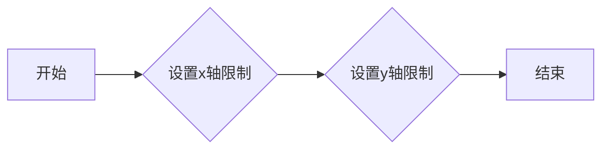
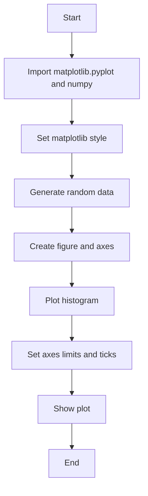

# `matplotlib\galleries\plot_types\stats\hist_plot.py` 详细设计文档

This code computes and plots a histogram of a given dataset using matplotlib and numpy.

## 整体流程



## 类结构

```
HistogramPlotter
```

## 全局变量及字段


### `plt`
    
Matplotlib's pyplot module for plotting.

类型：`module`
    


### `np`
    
NumPy module for numerical operations.

类型：`module`
    


### `x`
    
Array of random numbers used for plotting the histogram.

类型：`numpy.ndarray`
    


### `fig`
    
Figure object created for plotting.

类型：`matplotlib.figure.Figure`
    


### `ax`
    
Axes object on which the histogram is plotted.

类型：`matplotlib.axes._subplots.AxesSubplot`
    


### `HistogramPlotter.fig`
    
Figure object that contains the axes where the histogram is drawn.

类型：`matplotlib.figure.Figure`
    


### `HistogramPlotter.ax`
    
Axes object where the histogram is plotted.

类型：`matplotlib.axes._subplots.AxesSubplot`
    
    

## 全局函数及方法


### plt.style.use

`plt.style.use` 是一个全局函数，用于设置 Matplotlib 的样式。

参数：

- `style`：`str`，指定要使用的样式名称。

返回值：无

#### 流程图



#### 带注释源码

```
plt.style.use('_mpl-gallery')
```

该函数调用 `plt.style.use` 并传入一个字符串参数 `_mpl-gallery`，这会应用 Matplotlib 的 `_mpl-gallery` 样式，该样式通常用于创建美观的图表，适合用于演示和出版物。


### np.random.seed

设置NumPy随机数生成器的种子，确保每次运行代码时生成的随机数序列相同。

参数：

- `seed`：`int`，用于初始化随机数生成器的种子值。

返回值：无

#### 流程图



#### 带注释源码

```python
# 设置随机数生成器的种子
np.random.seed(1)
```


### np.random.normal

生成符合高斯分布的随机样本。

参数：

- `loc`：`float`，高斯分布的均值，默认为0。
- `scale`：`float`，高斯分布的标准差，默认为1。
- `size`：`int`或`tuple`，输出的形状，默认为None，表示生成一个样本。

返回值：`numpy.ndarray`，一个符合高斯分布的随机样本数组。

#### 流程图



#### 带注释源码

```python
import numpy as np

# 设置随机种子
np.random.seed(1)

# 生成符合高斯分布的随机样本
x = 4 + np.random.normal(0, 1.5, 200)
```


### plt.subplots

`plt.subplots` 是一个用于创建一个包含一个或多个子图的matplotlib.figure.Figure对象的函数。

参数：

- `nrows`：`int`，可选，指定子图行数。
- `ncols`：`int`，可选，指定子图列数。
- `sharex`：`bool`，可选，指定是否共享x轴。
- `sharey`：`bool`，可选，指定是否共享y轴。
- `figsize`：`tuple`，可选，指定整个Figure的大小。
- `dpi`：`int`，可选，指定图像的分辨率。
- `gridspec_kw`：`dict`，可选，用于GridSpec的额外关键字参数。

参数描述：
- `nrows` 和 `ncols`：指定子图的行数和列数。
- `sharex` 和 `sharey`：如果为True，则所有子图将共享x轴或y轴。
- `figsize`：指定整个Figure的大小，单位为英寸。
- `dpi`：指定图像的分辨率，单位为点每英寸。

返回值类型：`matplotlib.figure.Figure`
返回值描述：返回一个包含子图的Figure对象。

#### 流程图



#### 带注释源码

```
fig, ax = plt.subplots()
```

在这段代码中，`plt.subplots()` 被调用以创建一个包含一个子图的Figure对象。`fig` 是返回的Figure对象，而 `ax` 是子图对象，可以用来绘制图形。这里没有指定任何参数，因此默认创建一个包含一个子图的Figure对象。


### ax.hist

该函数用于计算并绘制直方图。

参数：

- `x`：`numpy.ndarray`，输入数据，用于计算直方图。
- `bins`：`int` 或 `sequence`，直方图的条形数或条形边界。
- `linewidth`：`float`，条形的线宽。
- `edgecolor`：`str`，条形的边缘颜色。

返回值：`numpy.ndarray`，直方图的条形计数。

#### 流程图


#### 带注释源码

```python
"""
Compute and plot a histogram.

See `~matplotlib.axes.Axes.hist`.
"""
import matplotlib.pyplot as plt
import numpy as np

plt.style.use('_mpl-gallery')

# make data
np.random.seed(1)
x = 4 + np.random.normal(0, 1.5, 200)

# plot:
fig, ax = plt.subplots()

# Compute and plot histogram
ax.hist(x, bins=8, linewidth=0.5, edgecolor="white")

# Set axes limits and ticks
ax.set(xlim=(0, 8), xticks=np.arange(1, 8),
       ylim=(0, 56), yticks=np.linspace(0, 56, 9))

# Show the plot
plt.show()
```


### ax.set

`ax.set` 是一个方法，用于设置matplotlib图形轴（Axes）的属性。

参数：

- `xlim`：`tuple`，设置x轴的显示范围。
- `xticks`：`array`，设置x轴的刻度。
- `ylim`：`tuple`，设置y轴的显示范围。
- `yticks`：`array`，设置y轴的刻度。

返回值：`None`，该方法不返回任何值。

#### 流程图



#### 带注释源码

```
ax.set(xlim=(0, 8), xticks=np.arange(1, 8),
       ylim=(0, 56), yticks=np.linspace(0, 56, 9))
```


### plt.show()

显示当前图形。

参数：

- 无

返回值：无

#### 流程图


#### 带注释源码

```python
"""
显示当前图形。
"""
import matplotlib.pyplot as plt
import numpy as np

plt.style.use('_mpl-gallery')

# make data
np.random.seed(1)
x = 4 + np.random.normal(0, 1.5, 200)

# plot:
fig, ax = plt.subplots()

ax.hist(x, bins=8, linewidth=0.5, edgecolor="white")

ax.set(xlim=(0, 8), xticks=np.arange(1, 8),
       ylim=(0, 56), yticks=np.linspace(0, 56, 9))

plt.show()
```


### HistogramPlotter.__init__

初始化HistogramPlotter类，设置绘图风格，生成随机数据，并创建一个用于绘图的子图和坐标轴。

参数：

- `self`：`HistogramPlotter`，当前类的实例

返回值：无

#### 流程图



#### 带注释源码

```python
"""
=======
hist(x)
=======
Compute and plot a histogram.

See `~matplotlib.axes.Axes.hist`.
"""
import matplotlib.pyplot as plt
import numpy as np

plt.style.use('_mpl-gallery')

# make data
np.random.seed(1)
x = 4 + np.random.normal(0, 1.5, 200)

# plot:
fig, ax = plt.subplots()

ax.hist(x, bins=8, linewidth=0.5, edgecolor="white")

ax.set(xlim=(0, 8), xticks=np.arange(1, 8),
       ylim=(0, 56), yticks=np.linspace(0, 56, 9))

plt.show()
```


### HistogramPlotter.plot

该函数用于计算并绘制一个直方图。

参数：

- `x`：`numpy.ndarray`，输入数据，用于计算直方图。
- ...

返回值：`None`，该函数不返回任何值，直接在屏幕上显示直方图。

#### 流程图


#### 带注释源码

```python
"""
Compute and plot a histogram.

See `~matplotlib.axes.Axes.hist`.
"""
import matplotlib.pyplot as plt
import numpy as np

plt.style.use('_mpl-gallery')

# make data
np.random.seed(1)
x = 4 + np.random.normal(0, 1.5, 200)

# plot:
fig, ax = plt.subplots()

ax.hist(x, bins=8, linewidth=0.5, edgecolor="white")

ax.set(xlim=(0, 8), xticks=np.arange(1, 8),
       ylim=(0, 56), yticks=np.linspace(0, 56, 9))

plt.show()
```


### HistogramPlotter.set_limits

设置直方图的可视化限制。

参数：

- `xlim`：`tuple`，指定x轴的显示范围。
- `ylim`：`tuple`，指定y轴的显示范围。

返回值：`None`，此方法不返回任何值。

#### 流程图



#### 带注释源码

```python
ax.set(xlim=(0, 8), xticks=np.arange(1, 8),
       ylim=(0, 56), yticks=np.linspace(0, 56, 9))
```


### HistogramPlotter.show

展示一个直方图。

参数：

- 无参数

返回值：无返回值

#### 流程图



#### 带注释源码

```python
"""
=======
hist(x)
=======
Compute and plot a histogram.

See `~matplotlib.axes.Axes.hist`.
"""
import matplotlib.pyplot as plt
import numpy as np

plt.style.use('_mpl-gallery')

# make data
np.random.seed(1)
x = 4 + np.random.normal(0, 1.5, 200)

# plot:
fig, ax = plt.subplots()

ax.hist(x, bins=8, linewidth=0.5, edgecolor="white")

ax.set(xlim=(0, 8), xticks=np.arange(1, 8),
       ylim=(0, 56), yticks=np.linspace(0, 56, 9))

plt.show()
```


## 关键组件


### 张量索引

张量索引用于访问和操作多维数组中的元素。

### 惰性加载

惰性加载是一种延迟计算的技术，它只在需要时才计算数据，从而提高性能和减少内存使用。

### 反量化支持

反量化支持允许在量化过程中对某些操作进行反量化处理，以保持精度。

### 量化策略

量化策略定义了如何将浮点数转换为固定点数，以减少模型大小和提高推理速度。


## 问题及建议


### 已知问题

-   {问题1}：代码中使用了全局变量 `plt` 和 `np`，这可能导致代码的可重用性和可维护性降低，因为全局变量可能会在代码的其他部分被意外修改。
-   {问题2}：代码没有错误处理机制，如果 `matplotlib` 或 `numpy` 库未正确安装或配置，程序可能会抛出异常。
-   {问题3}：代码没有提供任何参数化选项，例如自定义 `bins` 数量或 `xlim` 范围，这限制了用户对图表的定制能力。
-   {问题4}：代码没有使用任何日志记录或调试信息，这可能会在调试复杂问题时变得困难。

### 优化建议

-   {建议1}：将全局变量封装在类中，以提高代码的可重用性和可维护性。
-   {建议2}：添加异常处理来捕获并处理可能发生的错误，例如使用 `try-except` 块来捕获 `ImportError`。
-   {建议3}：为函数添加参数，允许用户自定义图表的各个方面，如 `bins`、`xlim` 和 `ylim`。
-   {建议4}：引入日志记录，以便在开发和维护过程中跟踪代码的执行情况。
-   {建议5}：考虑使用面向对象编程原则，将绘图逻辑封装在类中，以便更好地管理状态和行为。
-   {建议6}：如果代码将作为库的一部分，考虑添加文档字符串和示例代码，以帮助用户理解如何使用该函数。


## 其它


### 设计目标与约束

- 设计目标：实现一个简单的直方图绘制功能，用于展示数据分布。
- 约束条件：使用matplotlib库进行绘图，不使用额外的绘图库。

### 错误处理与异常设计

- 错误处理：代码中未包含异常处理机制，但应考虑在数据输入或绘图过程中可能出现的异常，如matplotlib库无法正常加载等。
- 异常设计：应设计相应的异常处理机制，确保程序在遇到错误时能够优雅地处理并给出错误提示。

### 数据流与状态机

- 数据流：程序从生成随机数据开始，经过绘图处理，最终展示直方图。
- 状态机：程序没有明确的状态转换，但可以认为存在以下状态：
  - 初始化状态：程序开始执行。
  - 数据生成状态：生成随机数据。
  - 绘图状态：绘制直方图。
  - 展示状态：显示直方图。

### 外部依赖与接口契约

- 外部依赖：程序依赖于matplotlib和numpy库。
- 接口契约：matplotlib库提供绘图接口，numpy库提供数据生成和处理接口。


    