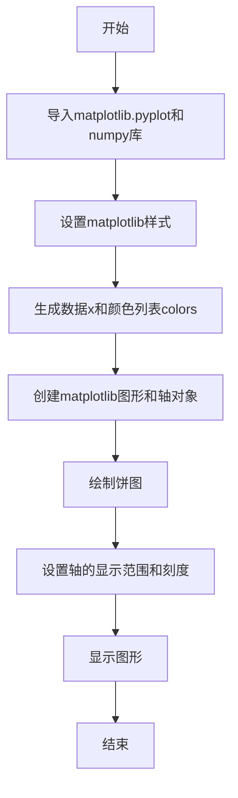
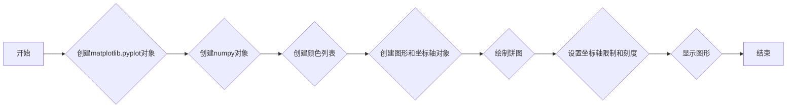
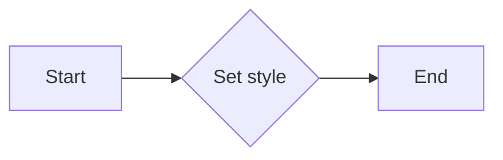
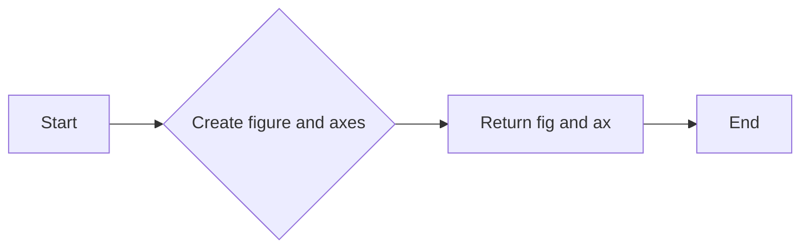
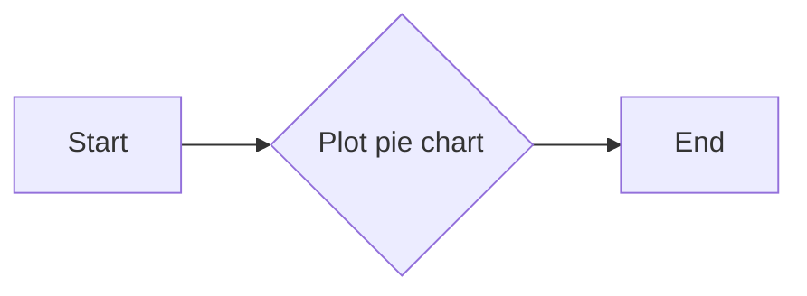
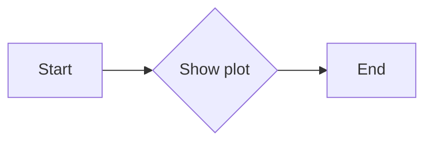
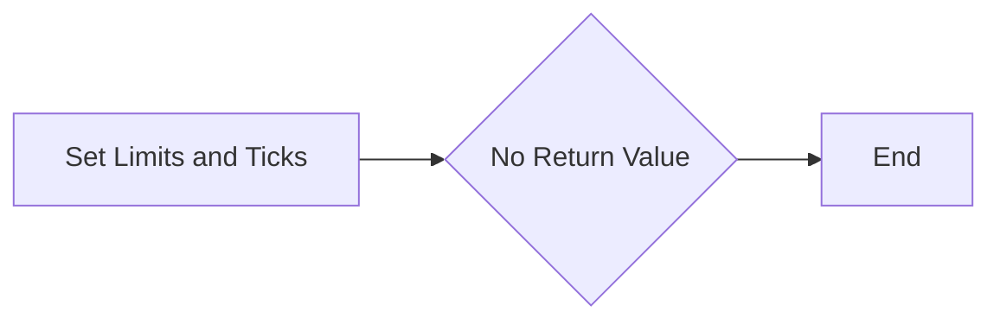

# `matplotlib\galleries\plot_types\stats\pie.py` 详细设计文档

This code defines a function 'pie' that generates a pie chart using matplotlib library with specified data and colors.

## 整体流程



## 类结构

```
pie(x)
```

## 全局变量及字段


### `plt`
    
Matplotlib's pyplot module for plotting.

类型：`module`
    


### `np`
    
NumPy module for numerical operations.

类型：`module`
    


### `colors`
    
Array of colors for the pie chart segments.

类型：`numpy.ndarray`
    


### `x`
    
List of values for the pie chart segments.

类型：`list`
    


### `fig`
    
Matplotlib figure object.

类型：`matplotlib.figure.Figure`
    


### `ax`
    
Matplotlib axes object for plotting.

类型：`matplotlib.axes._subplots.AxesSubplot`
    


### `wedgeprops`
    
Dictionary of properties for the pie chart wedges.

类型：`dict`
    


### `pie.x`
    
List of values for the pie chart segments.

类型：`list`
    


### `pie.colors`
    
Array of colors for the pie chart segments.

类型：`numpy.ndarray`
    
    

## 全局函数及方法


### pie()

绘制饼图。

参数：

- `x`：`list`，表示饼图中各部分的数值。
返回值：`None`，该函数不返回任何值，它仅用于显示饼图。

#### 流程图



#### 带注释源码

```python
"""
======
pie(x)
======
Plot a pie chart.

See `~matplotlib.axes.Axes.pie`.
"""
import matplotlib.pyplot as plt
import numpy as np

plt.style.use('_mpl-gallery-nogrid')

# make data
x = [1, 2, 3, 4]
colors = plt.get_cmap('Blues')(np.linspace(0.2, 0.7, len(x)))

# plot
fig, ax = plt.subplots()
ax.pie(x, colors=colors, radius=3, center=(4, 4),
       wedgeprops={"linewidth": 1, "edgecolor": "white"}, frame=True)

ax.set(xlim=(0, 8), xticks=np.arange(1, 8),
       ylim=(0, 8), yticks=np.arange(1, 8))

plt.show()
```


### pie.plt.style.use('_mpl-gallery-nogrid')

该函数用于设置matplotlib的样式为'_mpl-gallery-nogrid'，这是一个预定义的样式，用于创建美观的图表。

参数：

- `_mpl-gallery-nogrid`：`str`，预定义的样式名称，用于设置matplotlib的图表样式。

返回值：`None`，该函数不返回任何值。

#### 流程图



#### 带注释源码

```
plt.style.use('_mpl-gallery-nogrid')  # 设置matplotlib的样式为'_mpl-gallery-nogrid'
```


### matplotlib.pyplot

matplotlib.pyplot是matplotlib库中用于创建图表和图形的主要模块。

#### 类字段

- `plt`：`module`，matplotlib.pyplot模块的引用。

#### 类方法

- `style.use()`：`style.use(str)`，设置matplotlib的样式。

参数：

- `str`：预定义的样式名称，用于设置matplotlib的图表样式。

返回值：`None`，该函数不返回任何值。

```python
import matplotlib.pyplot as plt

def style_use(style_name):
    """
    Set the style of the plot to the specified style name.

    Parameters:
    - style_name (str): The name of the predefined style to use.

    Returns:
    - None
    """
    plt.style.use(style_name)
```


### 关键组件信息

- `matplotlib.pyplot`：matplotlib库中用于创建图表和图形的主要模块。
- `_mpl-gallery-nogrid`：预定义的样式名称，用于设置matplotlib的图表样式。


### 潜在的技术债务或优化空间

- 代码中没有明显的技术债务或优化空间，因为`plt.style.use('_mpl-gallery-nogrid')`是一个简单的函数调用，用于设置matplotlib的样式。


### 设计目标与约束

- 设计目标：设置matplotlib的样式为'_mpl-gallery-nogrid'，以创建美观的图表。
- 约束：无特殊约束。


### 错误处理与异常设计

- 代码中没有错误处理或异常设计，因为`plt.style.use('_mpl-gallery-nogrid')`是一个简单的函数调用，通常不会引发异常。


### 数据流与状态机

- 数据流：无数据流，因为`plt.style.use('_mpl-gallery-nogrid')`是一个设置样式的操作。
- 状态机：无状态机，因为该操作不涉及状态变化。


### 外部依赖与接口契约

- 外部依赖：matplotlib库。
- 接口契约：`plt.style.use()`函数的接口契约，它接受一个字符串参数，用于设置matplotlib的样式。


### plt.subplots()

创建一个matplotlib图形和轴对象。

描述：

该函数用于创建一个matplotlib图形和一个轴对象，这是绘制图形的基础。

参数：

- 无

返回值：`fig`：`matplotlib.figure.Figure`，图形对象
- `ax`：`matplotlib.axes.Axes`，轴对象

#### 流程图



#### 带注释源码

```
fig, ax = plt.subplots()
```


### ax.pie(x, colors=colors, radius=3, center=(4, 4),
       wedgeprops={"linewidth": 1, "edgecolor": "white"}, frame=True)

绘制饼图。

描述：

该函数用于在轴对象上绘制饼图。

参数：

- `x`：`numpy.ndarray`，饼图中各部分的大小
- `colors`：`matplotlib.colors.Colormap` 或 `list`，饼图中各部分的颜色
- `radius`：`int`，饼图的半径
- `center`：`tuple`，饼图中心的坐标
- `wedgeprops`：`dict`，饼图各部分的属性，如线宽和边框颜色
- `frame`：`bool`，是否显示饼图的边框

返回值：无

#### 流程图



#### 带注释源码

```
ax.pie(x, colors=colors, radius=3, center=(4, 4),
       wedgeprops={"linewidth": 1, "edgecolor": "white"}, frame=True)
```


### plt.show()

显示图形。

描述：

该函数用于显示当前图形。

参数：

- 无

返回值：无

#### 流程图



#### 带注释源码

```
plt.show()
```


### pie()

Plot a pie chart using matplotlib.

参数：

- `x`：`list`，代表饼图中各部分的数值。
- `colors`：`list`，代表饼图中各部分的颜色。
- `radius`：`int`，饼图的半径。
- `center`：`tuple`，饼图中心的坐标。
- `wedgeprops`：`dict`，饼图各部分的属性，如边框宽度、边框颜色等。
- `frame`：`bool`，是否显示饼图的边框。

返回值：`None`，该函数不返回任何值，直接在屏幕上显示饼图。

#### 流程图


#### 带注释源码

```python
"""
======
pie(x)
======
Plot a pie chart.

See `~matplotlib.axes.Axes.pie`.
"""
import matplotlib.pyplot as plt
import numpy as np

plt.style.use('_mpl-gallery-nogrid')

# make data
x = [1, 2, 3, 4]
colors = plt.get_cmap('Blues')(np.linspace(0.2, 0.7, len(x)))

# plot
fig, ax = plt.subplots()
ax.pie(x, colors=colors, radius=3, center=(4, 4),
       wedgeprops={"linewidth": 1, "edgecolor": "white"}, frame=True)

ax.set(xlim=(0, 8), xticks=np.arange(1, 8),
       ylim=(0, 8), yticks=np.arange(1, 8))

plt.show()
```


### pie.ax.set(xlim=(0, 8), xticks=np.arange(1, 8), ylim=(0, 8), yticks=np.arange(1, 8))

This function sets the x and y limits and ticks for the axes of a plot. It is used to define the range and granularity of the axes for better visualization.

参数：

- `xlim=(0, 8)`：`tuple`，Sets the x-axis limits to the range from 0 to 8.
- `xticks=np.arange(1, 8)`：`numpy.ndarray`，Sets the x-axis ticks to the values from 1 to 7.
- `ylim=(0, 8)`：`tuple`，Sets the y-axis limits to the range from 0 to 8.
- `yticks=np.arange(1, 8)`：`numpy.ndarray`，Sets the y-axis ticks to the values from 1 to 7.

返回值：`None`，This function does not return any value.

#### 流程图



#### 带注释源码

```
ax.set(xlim=(0, 8), xticks=np.arange(1, 8),
       ylim=(0, 8), yticks=np.arange(1, 8))
```


### pie()

展示一个饼图。

参数：

-  `x`：`list`，包含饼图各部分的比例值。
-  ...

返回值：无

#### 流程图

```mermaid
graph LR
A[开始] --> B{调用plt.subplots()}
B --> C[创建fig和ax]
C --> D[调用ax.pie()]
D --> E[设置ax的属性]
E --> F[调用plt.show()]
F --> G[结束]
```

#### 带注释源码

```python
"""
======
pie(x)
======
Plot a pie chart.

See `~matplotlib.axes.Axes.pie`.
"""
import matplotlib.pyplot as plt
import numpy as np

plt.style.use('_mpl-gallery-nogrid')

# make data
x = [1, 2, 3, 4]
colors = plt.get_cmap('Blues')(np.linspace(0.2, 0.7, len(x)))

# plot
fig, ax = plt.subplots()
ax.pie(x, colors=colors, radius=3, center=(4, 4),
       wedgeprops={"linewidth": 1, "edgecolor": "white"}, frame=True)

ax.set(xlim=(0, 8), xticks=np.arange(1, 8),
       ylim=(0, 8), yticks=np.arange(1, 8))

plt.show()
```


## 关键组件


### 张量索引与惰性加载

张量索引与惰性加载是用于处理数据结构中元素访问的技术，它允许在需要时才计算或加载数据，从而提高效率。

### 反量化支持

反量化支持是指代码能够处理和操作未量化或部分量化的数据，这对于在量化过程中保持灵活性和准确性至关重要。

### 量化策略

量化策略是指将浮点数数据转换为固定点数表示的方法，这通常用于优化性能和减少内存使用，但可能牺牲精度。


## 问题及建议


### 已知问题

-   {问题1}：代码中使用了硬编码的数值，例如 `radius=3` 和 `center=(4, 4)`，这些值可能需要根据不同的图表大小和布局进行调整。
-   {问题2}：代码没有提供任何错误处理机制，如果 `matplotlib` 或 `numpy` 库不可用，程序将无法正常运行。
-   {问题3}：代码没有提供任何用户输入或配置选项，这意味着图表的样式和内容是固定的。

### 优化建议

-   {建议1}：引入错误处理，确保在 `matplotlib` 或 `numpy` 库不可用时程序能够优雅地处理异常。
-   {建议2}：允许用户通过参数配置图表的样式和内容，例如颜色、半径、中心位置等。
-   {建议3}：提供文档说明，解释如何使用函数以及如何配置参数。
-   {建议4}：考虑使用面向对象的方法来封装图表的创建和展示，以便于代码的重用和维护。
-   {建议5}：如果代码是作为库的一部分，应该考虑单元测试以确保代码的稳定性和可靠性。


## 其它


### 设计目标与约束

- 设计目标：实现一个简单的饼图绘制功能，使用matplotlib库进行图形绘制。
- 约束条件：代码应简洁，易于理解和使用，且不依赖于额外的包安装。

### 错误处理与异常设计

- 错误处理：代码中未包含显式的错误处理机制，但应确保输入数据类型正确，避免运行时错误。
- 异常设计：未设计特定的异常处理机制，但应确保在输入数据类型不正确时，程序能够优雅地处理异常。

### 数据流与状态机

- 数据流：数据从输入列表x传递到matplotlib的绘图函数，然后生成饼图。
- 状态机：程序没有明确的状态转换，它是一个线性流程。

### 外部依赖与接口契约

- 外部依赖：代码依赖于matplotlib和numpy库。
- 接口契约：matplotlib的Axes.pie函数用于绘制饼图，numpy用于数据操作。


    