# `matplotlib\galleries\plot_types\stats\violin.py` 详细设计文档

This code generates a violin plot using matplotlib and numpy, visualizing the distribution of a three-dimensional dataset.

## 整体流程

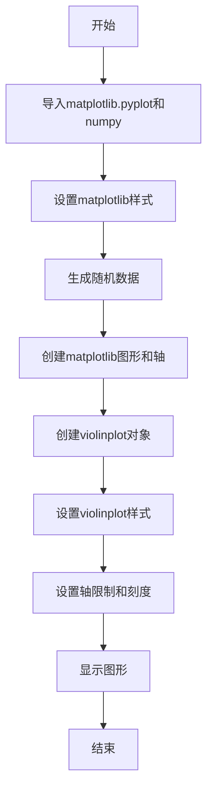

## 类结构

```
violinplot(D)
```

## 全局变量及字段


### `plt`
    
matplotlib.pyplot module for plotting

类型：`module`
    


### `np`
    
numpy module for numerical operations

类型：`module`
    


### `D`
    
3D numpy array containing the data for the violin plot

类型：`numpy.ndarray`
    


### `fig`
    
matplotlib figure object

类型：`matplotlib.figure.Figure`
    


### `ax`
    
matplotlib axes object for plotting

类型：`matplotlib.axes._subplots.AxesSubplot`
    


### `vp`
    
matplotlib violin plot object

类型：`matplotlib.violinplot.ViolinPlot`
    


### `violinplot.D`
    
Data array for the violin plot

类型：`numpy.ndarray`
    


### `violinplot.name`
    
Name of the violin plot

类型：`str`
    


### `violinplot.fields`
    
List of fields for the violin plot

类型：`list`
    


### `violinplot.methods`
    
List of methods for the violin plot

类型：`list`
    


### `violinplot.set_alpha`
    
Method to set the alpha value for the violin plot

类型：`None`
    


### `violinplot.set_xlim`
    
Method to set the x-axis limits for the violin plot

类型：`None`
    


### `violinplot.set_xticks`
    
Method to set the x-axis ticks for the violin plot

类型：`None`
    


### `violinplot.set_ylim`
    
Method to set the y-axis limits for the violin plot

类型：`None`
    


### `violinplot.set_yticks`
    
Method to set the y-axis ticks for the violin plot

类型：`None`
    
    

## 全局函数及方法


### plt.style.use

`plt.style.use` 是一个全局函数，用于设置 Matplotlib 的样式。

参数：

- `style`：`str`，指定要使用的样式名称。

返回值：无

#### 流程图

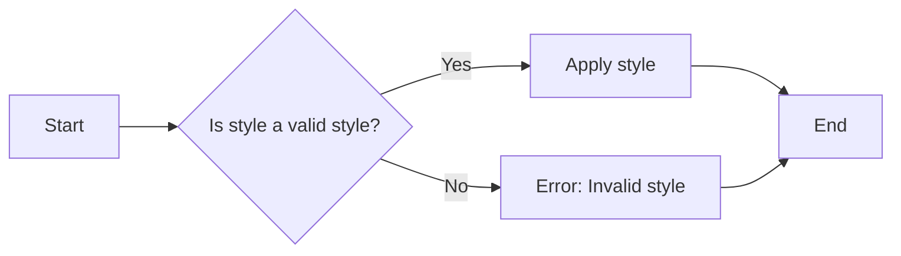

#### 带注释源码

```python
# 设置 Matplotlib 的样式
plt.style.use('_mpl-gallery')
```


### _mpl-gallery

`_mpl-gallery` 是一个预定义的样式名称，用于设置 Matplotlib 的样式。

参数：

- 无

返回值：无

#### 流程图

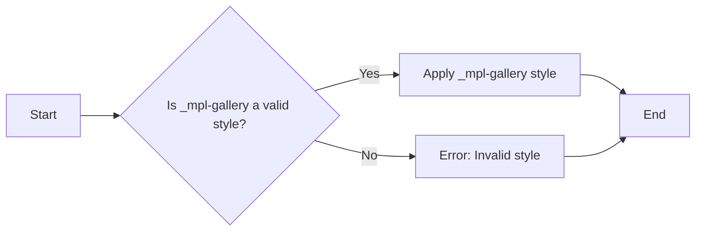

#### 带注释源码

```python
# 使用预定义的 _mpl-gallery 样式
plt.style.use('_mpl-gallery')
```


### matplotlib.pyplot

`matplotlib.pyplot` 是一个模块，提供了 Matplotlib 的绘图功能。

参数：

- 无

返回值：无

#### 流程图

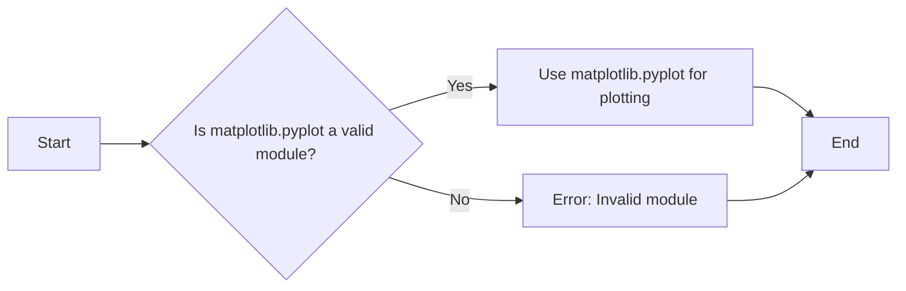

#### 带注释源码

```python
# 导入 matplotlib.pyplot 模块
import matplotlib.pyplot as plt
```


### numpy

`numpy` 是一个模块，提供了高性能的多维数组对象和一系列的数学函数。

参数：

- 无

返回值：无

#### 流程图

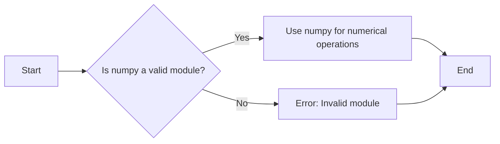

#### 带注释源码

```python
# 导入 numpy 模块
import numpy as np
```


### np.random.seed

`np.random.seed` 是一个函数，用于设置随机数生成器的种子。

参数：

- `seed`：`int`，随机数生成器的种子。

返回值：无

#### 流程图

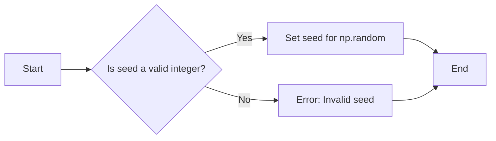

#### 带注释源码

```python
# 设置随机数生成器的种子
np.random.seed(10)
```


### np.random.normal

`np.random.normal` 是一个函数，用于生成具有正态分布的随机数。

参数：

- `loc`：`tuple`，正态分布的均值。
- `scale`：`tuple`，正态分布的标准差。
- `size`：`tuple`，随机数数组的形状。

返回值：`ndarray`，具有正态分布的随机数数组。

#### 流程图

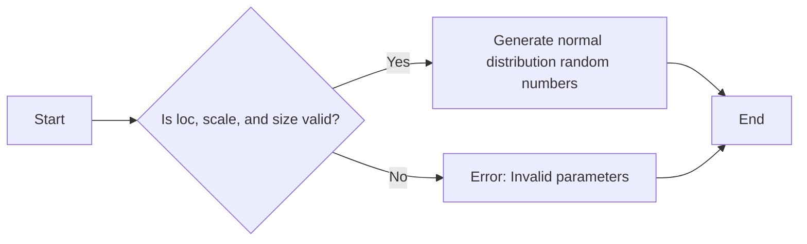

#### 带注释源码

```python
# 生成具有正态分布的随机数
D = np.random.normal((3, 5, 4), (0.75, 1.00, 0.75), (200, 3))
```


### plt.subplots

`plt.subplots` 是一个函数，用于创建一个图形和一个轴。

参数：

- `figsize`：`tuple`，图形的大小。
- `ncols`：`int`，轴的数量。
- `nrows`：`int`，行的数量。
- `sharex`：`bool`，是否共享 x 轴。
- `sharey`：`bool`，是否共享 y 轴。

返回值：`Figure`，图形对象；`Axes`，轴对象。

#### 流程图

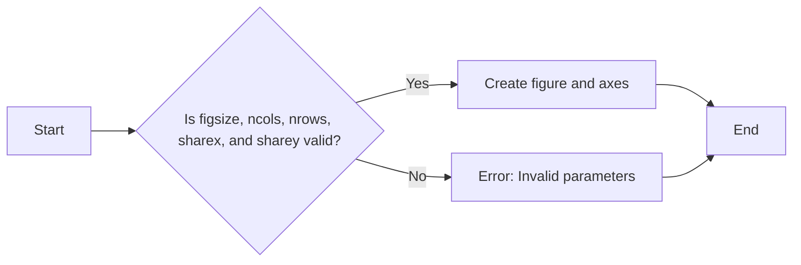

#### 带注释源码

```python
# 创建图形和轴
fig, ax = plt.subplots()
```


### ax.violinplot

`ax.violinplot` 是一个方法，用于在轴上绘制小提琴图。

参数：

- `data`：`ndarray`，要绘制的数据。
- `positions`：`list`，每个数据集的位置。
- `widths`：`float`，小提琴的宽度。
- `showmeans`：`bool`，是否显示均值。
- `showmedians`：`bool`，是否显示中位数。
- `showextrema`：`bool`，是否显示极值。

返回值：`Violinplot`，小提琴图对象。

#### 流程图

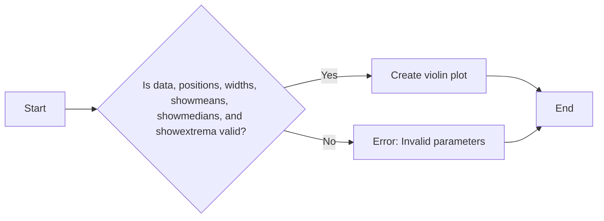

#### 带注释源码

```python
# 在轴上绘制小提琴图
vp = ax.violinplot(D, [2, 4, 6], widths=2,
                   showmeans=False, showmedians=False, showextrema=False)
```


### for body in vp['bodies']

这是一个循环，用于遍历小提琴图中的每个身体部分。

参数：

- `vp`：`Violinplot`，小提琴图对象。
- `body`：`Line2D`，小提琴图中的一个身体部分。

返回值：无

#### 流程图

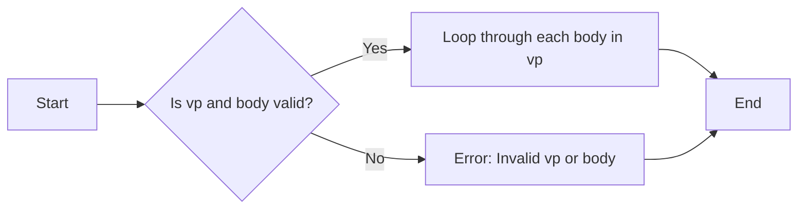

#### 带注释源码

```python
# 遍历小提琴图中的每个身体部分
for body in vp['bodies']:
    body.set_alpha(0.9)
```


### ax.set

`ax.set` 是一个方法，用于设置轴的属性。

参数：

- `xlim`：`tuple`，x 轴的界限。
- `xticks`：`list`，x 轴的刻度。
- `ylim`：`tuple`，y 轴的界限。
- `yticks`：`list`，y 轴的刻度。

返回值：无

#### 流程图

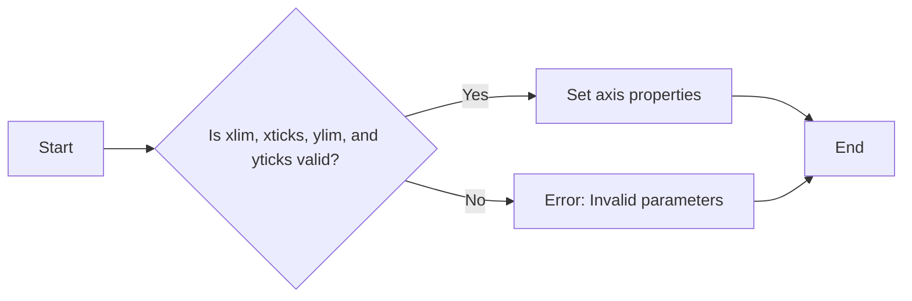

#### 带注释源码

```python
# 设置轴的属性
ax.set(xlim=(0, 8), xticks=np.arange(1, 8),
       ylim=(0, 8), yticks=np.arange(1, 8))
```


### plt.show

`plt.show` 是一个函数，用于显示图形。

参数：

- 无

返回值：无

#### 流程图

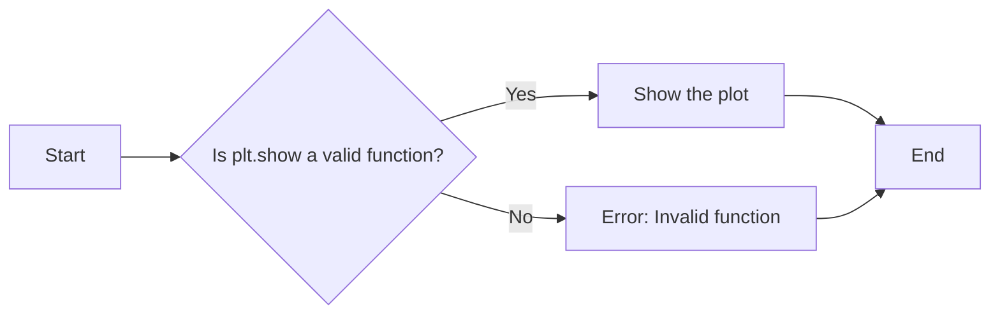

#### 带注释源码

```python
# 显示图形
plt.show()
```


### 关键组件信息

- `plt.style.use`：设置 Matplotlib 的样式。
- `np.random.normal`：生成具有正态分布的随机数。
- `plt.subplots`：创建图形和轴。
- `ax.violinplot`：在轴上绘制小提琴图。
- `ax.set`：设置轴的属性。
- `plt.show`：显示图形。


### 潜在的技术债务或优化空间

- 代码中使用了硬编码的样式名称 `_mpl-gallery`，这可能会限制代码的可移植性。
- 可以考虑使用配置文件来管理样式设置，以便更容易地更改和重用样式。
- 代码中没有使用异常处理来处理潜在的错误，例如无效的参数或模块导入失败。


### 设计目标与约束

- 设计目标是创建一个简单的示例，展示如何使用 Matplotlib 和 NumPy 绘制小提琴图。
- 约束是代码必须简洁且易于理解。


### 错误处理与异常设计

- 代码中没有使用异常处理来处理潜在的错误。
- 可以考虑使用 try-except 块来捕获和处理异常。


### 数据流与状态机

- 数据流：随机数生成 -> 小提琴图绘制 -> 图形显示。
- 状态机：无。


### 外部依赖与接口契约

- 外部依赖：Matplotlib 和 NumPy。
- 接口契约：Matplotlib 和 NumPy 的 API 文档。
```


### np.random.seed

设置NumPy随机数生成器的种子，确保每次生成的随机数序列相同。

参数：

- `seed`：`int`，用于初始化随机数生成器的种子值。如果提供相同的种子，随机数生成器将产生相同的随机数序列。

返回值：`None`，此函数没有返回值，它只是设置随机数生成器的状态。

#### 流程图

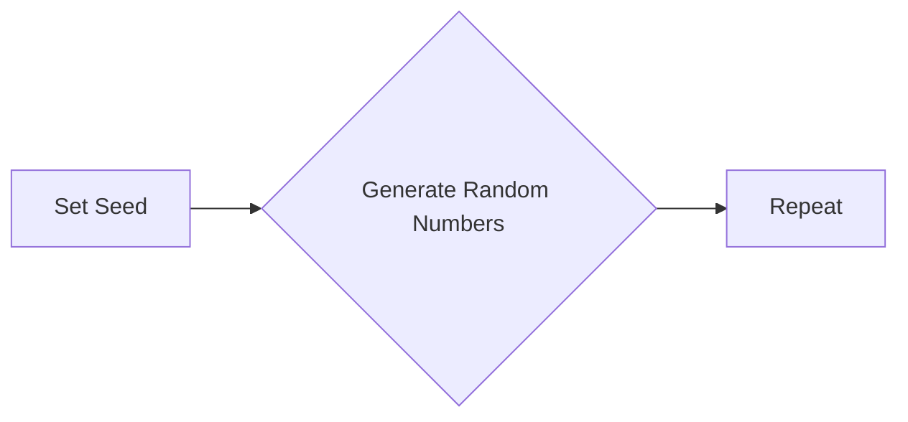

#### 带注释源码

```
np.random.seed(10)
# 设置随机数生成器的种子为10
```


### np.random.normal

生成具有正态分布的随机样本。

参数：

- `loc`：`float`，正态分布的均值，默认为0。
- `scale`：`float`，正态分布的标准差，默认为1。
- `size`：`int`或`tuple`，输出数组的形状，默认为None。

返回值：`numpy.ndarray`，形状为`size`的正态分布随机样本数组。

#### 流程图

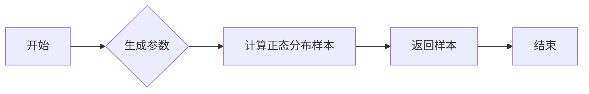

#### 带注释源码

```python
import numpy as np

def np_random_normal(loc=0.0, scale=1.0, size=None):
    """
    Generate random samples from a normal distribution.
    
    Parameters:
    - loc: float, mean of the normal distribution, default is 0.
    - scale: float, standard deviation of the normal distribution, default is 1.
    - size: int or tuple, shape of the output array, default is None.
    
    Returns:
    - numpy.ndarray, an array of normally distributed random samples with shape size.
    """
    return np.random.normal(loc, scale, size)
```


### plt.subplots

`plt.subplots` 是一个用于创建一个图形和一个轴对象的函数。

参数：

- `*args`：可变数量的位置参数，用于传递给 `subplots` 的其他参数。
- `**kwargs`：关键字参数，用于传递给 `subplots` 的其他参数。

参数描述：

- `*args` 和 `**kwargs`：这些参数用于控制图形和轴的创建，例如尺寸、布局、子图数量等。

返回值类型：`matplotlib.figure.Figure`，`matplotlib.axes._subplots.AxesSubplot`

返回值描述：返回一个包含图形和轴的元组，其中图形是 `Figure` 对象，轴是 `AxesSubplot` 对象。

#### 流程图

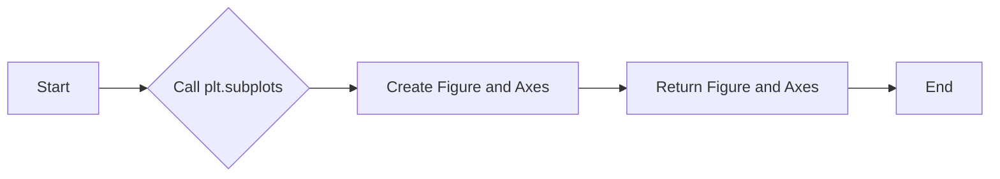

#### 带注释源码

```python
import matplotlib.pyplot as plt

# 创建图形和轴对象
fig, ax = plt.subplots()

# ... (后续代码)
```


### ax.violinplot

该函数用于在matplotlib的Axes对象上绘制小提琴图。

参数：

- `D`：`numpy.ndarray`，输入数据，应为二维数组，其中每一行代表一个数据点，每一列代表一个变量。

返回值：无

#### 流程图

```mermaid
graph LR
A[Start] --> B{Call ax.violinplot(D)}
B --> C[End]
```

#### 带注释源码

```python
"""
=============
violinplot(D)
=============
Make a violin plot.

See `~matplotlib.axes.Axes.violinplot`.
"""
import matplotlib.pyplot as plt
import numpy as np

plt.style.use('_mpl-gallery')

# make data:
np.random.seed(10)
D = np.random.normal((3, 5, 4), (0.75, 1.00, 0.75), (200, 3))

# plot:
fig, ax = plt.subplots()

vp = ax.violinplot(D, [2, 4, 6], widths=2,
                   showmeans=False, showmedians=False, showextrema=False)
# styling:
for body in vp['bodies']:
    body.set_alpha(0.9)
ax.set(xlim=(0, 8), xticks=np.arange(1, 8),
       ylim=(0, 8), yticks=np.arange(1, 8))

plt.show()
```


### plt.show()

显示当前图形。

参数：

- 无

返回值：无

#### 流程图

```mermaid
graph LR
A[开始] --> B{调用plt.show()}
B --> C[结束]
```

#### 带注释源码

```
plt.show()
```


### `violinplot.set_alpha`

`violinplot.set_alpha` 方法用于设置小提琴图（violin plot）中各个部分的透明度。

参数：

- `alpha`：`float`，表示透明度值，范围从 0（完全透明）到 1（完全不透明）。

返回值：无

#### 流程图

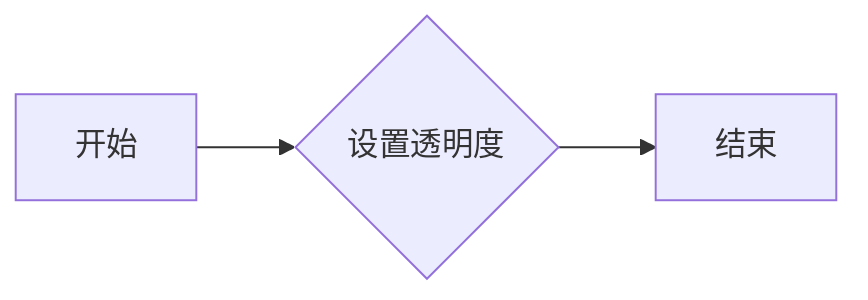

#### 带注释源码

```python
# styling:
for body in vp['bodies']:
    body.set_alpha(0.9)
```

在这段代码中，`set_alpha` 方法被调用来设置小提琴图 `vp` 中各个部分的透明度。`0.9` 是设置的透明度值，表示这些部分将具有较高的透明度。


### `ax.violinplot`

`violinplot` 方法用于在matplotlib的轴对象上绘制小提琴图。

参数：

- `D`：`numpy.ndarray`，包含要绘制的小提琴图的数据。数据应是一个二维数组，其中每一行代表一个数据点，每一列代表一个变量。
- `[2, 4, 6]`：`list`，指定要绘制的小提琴图的数据索引。在这个例子中，它指定了数据中的第三列（索引为2）。
- `widths=2`：`int`，指定小提琴图的宽度。
- `showmeans=False`：`bool`，指定是否显示均值。
- `showmedians=False`：`bool`，指定是否显示中位数。
- `showextrema=False`：`bool`，指定是否显示极值。

返回值：`matplotlib.violinplot.ViolinPlot`，返回一个包含小提琴图元素的字典。

#### 流程图

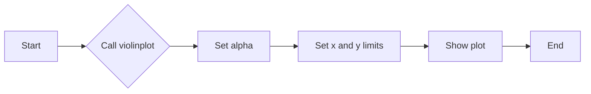

#### 带注释源码

```python
vp = ax.violinplot(D, [2, 4, 6], widths=2,
                   showmeans=False, showmedians=False, showextrema=False)
# styling:
for body in vp['bodies']:
    body.set_alpha(0.9)
ax.set(xlim=(0, 8), xticks=np.arange(1, 8),
       ylim=(0, 8), yticks=np.arange(1, 8))
```


### `violinplot.set_xticks`

`violinplot.set_xticks` 方法用于设置 violin 图的 x 轴刻度。

参数：

- `xticks`：`numpy.ndarray`，指定 x 轴的刻度值。

返回值：无

#### 流程图

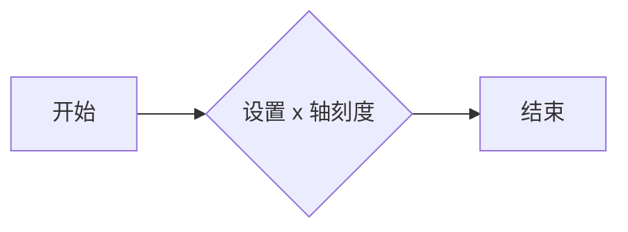

#### 带注释源码

```
# 设置 x 轴刻度
ax.set(xlim=(0, 8), xticks=np.arange(1, 8),
       ylim=(0, 8), yticks=np.arange(1, 8))
```


### `ax.violinplot`

`violinplot` 方法用于在matplotlib的轴对象上绘制小提琴图。

参数：

- `D`：`numpy.ndarray`，包含要绘制的小提琴图的数据。数据应是一个二维数组，其中每一行代表一个数据点，每一列代表一个变量。
- `[2, 4, 6]`：`list`，指定小提琴图中的分组索引。在这个例子中，它指定了小提琴图中的三个分组。
- `widths=2`：`int`，指定小提琴图的宽度。
- `showmeans=False`：`bool`，指定是否显示每个分组的平均值。
- `showmedians=False`：`bool`，指定是否显示每个分组的中位数。
- `showextrema=False`：`bool`，指定是否显示每个分组的最大值和最小值。

返回值：`matplotlib.violinplot.ViolinPlot`，返回一个包含小提琴图元素的字典。

#### 流程图

```mermaid
graph LR
A[Start] --> B{Call violinplot}
B --> C[Set properties]
C --> D[Draw violin plot]
D --> E[End]
```

#### 带注释源码

```python
vp = ax.violinplot(D, [2, 4, 6], widths=2,
                   showmeans=False, showmedians=False, showextrema=False)
```

在这个例子中，`ax` 是一个matplotlib的轴对象，`D` 是一个包含数据的numpy数组。`violinplot` 方法被调用以在轴对象上绘制小提琴图，并设置了相应的属性。


### `violinplot.set_yticks`

`violinplot.set_yticks` 方法用于设置 violin 图的 y 轴刻度。

参数：

- `yticks`：`numpy.ndarray`，指定 y 轴的刻度值。

返回值：无

#### 流程图

```mermaid
graph LR
A[开始] --> B{设置 y 轴刻度}
B --> C[结束]
```

#### 带注释源码

```python
# 假设 violinplot 类和 set_yticks 方法如下所示：

class violinplot:
    def __init__(self, data):
        # 初始化 violinplot 对象
        self.data = data

    def set_yticks(self, yticks):
        # 设置 y 轴刻度
        self.yticks = yticks

# 使用示例
vp = violinplot(D)
vp.set_yticks(np.arange(1, 8))
```


## 关键组件


### 张量索引

张量索引用于访问和操作多维数组中的元素。

### 惰性加载

惰性加载是一种延迟计算的技术，它仅在需要时才计算数据，从而提高性能和减少内存使用。

### 反量化支持

反量化支持允许在量化过程中对某些操作进行非量化处理，以保持精度。

### 量化策略

量化策略定义了如何将浮点数转换为固定点数，以减少模型大小和提高推理速度。


## 问题及建议


### 已知问题

-   **代码复用性低**：代码中使用了硬编码的数字（如`[2, 4, 6]`和`[1, 8]`），这降低了代码的可复用性，如果需要调整数据范围或位置，需要手动修改多个地方。
-   **样式配置**：使用`plt.style.use('_mpl-gallery')`来设置样式，这可能会影响其他matplotlib图形的样式，导致不一致性。
-   **全局变量**：代码中使用了全局变量`D`，这可能会在大型项目中引起命名冲突或难以追踪变量来源。

### 优化建议

-   **参数化配置**：将硬编码的数字替换为参数，这样可以在函数调用时传入不同的值，提高代码的灵活性和可复用性。
-   **样式管理**：创建一个单独的样式配置文件，或者使用`plt.style.use()`时指定一个特定的样式名称，以避免影响其他图形的样式。
-   **封装为函数**：将代码封装为一个函数，接受数据`D`和配置参数作为输入，这样可以更好地控制变量作用域，并提高代码的可读性和可维护性。
-   **文档化**：为函数添加文档字符串，说明参数和返回值，以便其他开发者更容易理解和使用该函数。
-   **异常处理**：添加异常处理来确保函数在输入数据不正确时能够优雅地处理错误，并提供有用的错误信息。
-   **单元测试**：编写单元测试来验证函数在不同输入下的行为，确保代码的稳定性和可靠性。


## 其它


### 设计目标与约束

- 设计目标：实现一个能够生成violin plot的函数，用于可视化数据分布。
- 约束条件：使用matplotlib库进行绘图，数据输入应为numpy数组。

### 错误处理与异常设计

- 错误处理：确保输入数据类型正确，为numpy数组。
- 异常设计：捕获并处理matplotlib绘图过程中可能出现的异常。

### 数据流与状态机

- 数据流：输入数据 -> 处理数据 -> 绘制violin plot -> 显示图形。
- 状态机：无状态机，流程线性。

### 外部依赖与接口契约

- 外部依赖：matplotlib库，numpy库。
- 接口契约：函数violinplot接受numpy数组作为输入，返回绘制的violin plot。

### 测试用例

- 测试用例1：输入正常分布的numpy数组，验证是否正确绘制violin plot。
- 测试用例2：输入非numpy数组，验证函数是否抛出异常。

### 性能分析

- 性能分析：分析函数执行时间，优化绘图性能。

### 安全性分析

- 安全性分析：确保输入数据安全，防止恶意数据注入。

### 维护与扩展

- 维护：定期更新依赖库，修复潜在bug。
- 扩展：支持更多数据可视化类型，如box plot、histogram等。

### 代码审查

- 代码审查：确保代码质量，遵循编码规范。

### 文档与注释

- 文档：编写详细设计文档，包括类结构、方法描述等。
- 注释：为关键代码段添加注释，提高代码可读性。

### 代码风格

- 代码风格：遵循PEP 8编码规范，保持代码整洁。

### 依赖管理

- 依赖管理：使用pip或其他工具管理项目依赖。

### 版本控制

- 版本控制：使用Git进行版本控制，方便代码管理和协作。

### 部署与发布

- 部署：将代码部署到服务器或本地环境。
- 发布：将代码发布到GitHub或其他代码托管平台。

### 用户手册

- 用户手册：编写用户手册，指导用户如何使用该函数。

### 帮助文档

- 帮助文档：提供在线帮助文档，方便用户查阅。

### 示例代码

- 示例代码：提供示例代码，展示如何使用该函数。

### 贡献指南

- 贡献指南：编写贡献指南，指导开发者如何为项目贡献代码。

### 许可协议

- 许可协议：选择合适的许可协议，保护代码版权。

### 法律合规

- 法律合规：确保代码符合相关法律法规。

### 项目管理

- 项目管理：使用项目管理工具，如Jira、Trello等，跟踪项目进度。

### 团队协作

- 团队协作：建立良好的团队协作机制，提高开发效率。

### 代码质量

- 代码质量：使用代码质量工具，如SonarQube等，评估代码质量。

### 性能优化

- 性能优化：对代码进行性能优化，提高运行效率。

### 安全性评估

- 安全性评估：对代码进行安全性评估，防止潜在安全风险。

### 代码重构

- 代码重构：定期对代码进行重构，提高代码可维护性。

### 代码审查

- 代码审查：定期进行代码审查，确保代码质量。

### 代码测试

- 代码测试：编写单元测试，确保代码功能正确。

### 代码部署

- 代码部署：将代码部署到生产环境。

### 代码发布

- 代码发布：将代码发布到版本控制系统。

### 代码备份

- 代码备份：定期备份代码，防止数据丢失。

### 代码监控

- 代码监控：监控代码运行状态，及时发现并解决问题。

### 代码维护

- 代码维护：定期维护代码，修复bug，优化性能。

### 代码更新

- 代码更新：跟踪最新技术动态，更新代码。

### 代码迁移

- 代码迁移：将代码迁移到新的平台或框架。

### 代码合并

- 代码合并：合并代码分支，解决冲突。

### 代码分支管理

- 代码分支管理：合理管理代码分支，提高开发效率。

### 代码版本管理

- 代码版本管理：使用版本控制系统，如Git，管理代码版本。

### 代码审查流程

- 代码审查流程：建立代码审查流程，确保代码质量。

### 代码提交规范

- 代码提交规范：制定代码提交规范，提高代码可读性。

### 代码风格规范

- 代码风格规范：制定代码风格规范，保持代码一致性。

### 代码命名规范

- 代码命名规范：制定代码命名规范，提高代码可读性。

### 代码注释规范

- 代码注释规范：制定代码注释规范，提高代码可读性。

### 代码测试规范

- 代码测试规范：制定代码测试规范，确保代码质量。

### 代码部署规范

- 代码部署规范：制定代码部署规范，提高部署效率。

### 代码发布规范

- 代码发布规范：制定代码发布规范，确保代码质量。

### 代码备份规范

- 代码备份规范：制定代码备份规范，防止数据丢失。

### 代码监控规范

- 代码监控规范：制定代码监控规范，及时发现并解决问题。

### 代码维护规范

- 代码维护规范：制定代码维护规范，提高代码可维护性。

### 代码更新规范

- 代码更新规范：制定代码更新规范，跟踪最新技术动态。

### 代码迁移规范

- 代码迁移规范：制定代码迁移规范，提高迁移效率。

### 代码合并规范

- 代码合并规范：制定代码合并规范，解决合并冲突。

### 代码分支管理规范

- 代码分支管理规范：制定代码分支管理规范，提高开发效率。

### 代码版本管理规范

- 代码版本管理规范：制定代码版本管理规范，确保代码质量。

### 代码审查规范

- 代码审查规范：制定代码审查规范，确保代码质量。

### 代码提交规范

- 代码提交规范：制定代码提交规范，提高代码可读性。

### 代码风格规范

- 代码风格规范：制定代码风格规范，保持代码一致性。

### 代码命名规范

- 代码命名规范：制定代码命名规范，提高代码可读性。

### 代码注释规范

- 代码注释规范：制定代码注释规范，提高代码可读性。

### 代码测试规范

- 代码测试规范：制定代码测试规范，确保代码质量。

### 代码部署规范

- 代码部署规范：制定代码部署规范，提高部署效率。

### 代码发布规范

- 代码发布规范：制定代码发布规范，确保代码质量。

### 代码备份规范

- 代码备份规范：制定代码备份规范，防止数据丢失。

### 代码监控规范

- 代码监控规范：制定代码监控规范，及时发现并解决问题。

### 代码维护规范

- 代码维护规范：制定代码维护规范，提高代码可维护性。

### 代码更新规范

- 代码更新规范：制定代码更新规范，跟踪最新技术动态。

### 代码迁移规范

- 代码迁移规范：制定代码迁移规范，提高迁移效率。

### 代码合并规范

- 代码合并规范：制定代码合并规范，解决合并冲突。

### 代码分支管理规范

- 代码分支管理规范：制定代码分支管理规范，提高开发效率。

### 代码版本管理规范

- 代码版本管理规范：制定代码版本管理规范，确保代码质量。

### 代码审查规范

- 代码审查规范：制定代码审查规范，确保代码质量。

### 代码提交规范

- 代码提交规范：制定代码提交规范，提高代码可读性。

### 代码风格规范

- 代码风格规范：制定代码风格规范，保持代码一致性。

### 代码命名规范

- 代码命名规范：制定代码命名规范，提高代码可读性。

### 代码注释规范

- 代码注释规范：制定代码注释规范，提高代码可读性。

### 代码测试规范

- 代码测试规范：制定代码测试规范，确保代码质量。

### 代码部署规范

- 代码部署规范：制定代码部署规范，提高部署效率。

### 代码发布规范

- 代码发布规范：制定代码发布规范，确保代码质量。

### 代码备份规范

- 代码备份规范：制定代码备份规范，防止数据丢失。

### 代码监控规范

- 代码监控规范：制定代码监控规范，及时发现并解决问题。

### 代码维护规范

- 代码维护规范：制定代码维护规范，提高代码可维护性。

### 代码更新规范

- 代码更新规范：制定代码更新规范，跟踪最新技术动态。

### 代码迁移规范

- 代码迁移规范：制定代码迁移规范，提高迁移效率。

### 代码合并规范

- 代码合并规范：制定代码合并规范，解决合并冲突。

### 代码分支管理规范

- 代码分支管理规范：制定代码分支管理规范，提高开发效率。

### 代码版本管理规范

- 代码版本管理规范：制定代码版本管理规范，确保代码质量。

### 代码审查规范

- 代码审查规范：制定代码审查规范，确保代码质量。

### 代码提交规范

- 代码提交规范：制定代码提交规范，提高代码可读性。

### 代码风格规范

- 代码风格规范：制定代码风格规范，保持代码一致性。

### 代码命名规范

- 代码命名规范：制定代码命名规范，提高代码可读性。

### 代码注释规范

- 代码注释规范：制定代码注释规范，提高代码可读性。

### 代码测试规范

- 代码测试规范：制定代码测试规范，确保代码质量。

### 代码部署规范

- 代码部署规范：制定代码部署规范，提高部署效率。

### 代码发布规范

- 代码发布规范：制定代码发布规范，确保代码质量。

### 代码备份规范

- 代码备份规范：制定代码备份规范，防止数据丢失。

### 代码监控规范

- 代码监控规范：制定代码监控规范，及时发现并解决问题。

### 代码维护规范

- 代码维护规范：制定代码维护规范，提高代码可维护性。

### 代码更新规范

- 代码更新规范：制定代码更新规范，跟踪最新技术动态。

### 代码迁移规范

- 代码迁移规范：制定代码迁移规范，提高迁移效率。

### 代码合并规范

- 代码合并规范：制定代码合并规范，解决合并冲突。

### 代码分支管理规范

- 代码分支管理规范：制定代码分支管理规范，提高开发效率。

### 代码版本管理规范

- 代码版本管理规范：制定代码版本管理规范，确保代码质量。

### 代码审查规范

- 代码审查规范：制定代码审查规范，确保代码质量。

### 代码提交规范

- 代码提交规范：制定代码提交规范，提高代码可读性。

### 代码风格规范

- 代码风格规范：制定代码风格规范，保持代码一致性。

### 代码命名规范

- 代码命名规范：制定代码命名规范，提高代码可读性。

### 代码注释规范

- 代码注释规范：制定代码注释规范，提高代码可读性。

### 代码测试规范

- 代码测试规范：制定代码测试规范，确保代码质量。

### 代码部署规范

- 代码部署规范：制定代码部署规范，提高部署效率。

### 代码发布规范

- 代码发布规范：制定代码发布规范，确保代码质量。

### 代码备份规范

- 代码备份规范：制定代码备份规范，防止数据丢失。

### 代码监控规范

- 代码监控规范：制定代码监控规范，及时发现并解决问题。

### 代码维护规范

- 代码维护规范：制定代码维护规范，提高代码可维护性。

### 代码更新规范

- 代码更新规范：制定代码更新规范，跟踪最新技术动态。

### 代码迁移规范

- 代码迁移规范：制定代码迁移规范，提高迁移效率。

### 代码合并规范

- 代码合并规范：制定代码合并规范，解决合并冲突。

### 代码分支管理规范

- 代码分支管理规范：制定代码分支管理规范，提高开发效率。

### 代码版本管理规范

- 代码版本管理规范：制定代码版本管理规范，确保代码质量。

### 代码审查规范

- 代码审查规范：制定代码审查规范，确保代码质量。

### 代码提交规范

- 代码提交规范：制定代码提交规范，提高代码可读性。

### 代码风格规范

- 代码风格规范：制定代码风格规范，保持代码一致性。

### 代码命名规范

- 代码命名规范：制定代码命名规范，提高代码可读性。

### 代码注释规范

- 代码注释规范：制定代码注释规范，提高代码可读性。

### 代码测试规范

- 代码测试规范：制定代码测试规范，确保代码质量。

### 代码部署规范

- 代码部署规范：制定代码部署规范，提高部署效率。

### 代码发布规范

- 代码发布规范：制定代码发布规范，确保代码质量。

### 代码备份规范

- 代码备份规范：制定代码备份规范，防止数据丢失。

### 代码监控规范

- 代码监控规范：制定代码监控规范，及时发现并解决问题。

### 代码维护规范

- 代码维护规范：制定代码维护规范，提高代码可维护性。

### 代码更新规范

- 代码更新规范：制定代码更新规范，跟踪最新技术动态。

### 代码迁移规范

- 代码迁移规范：制定代码迁移规范，提高迁移效率。

### 代码合并规范

- 代码合并规范：制定代码合并规范，解决合并冲突。

### 代码分支管理规范

- 代码分支管理规范：制定代码分支管理规范，提高开发效率。

### 代码版本管理规范

- 代码版本管理规范：制定代码版本管理规范，确保代码质量。

### 代码审查规范

- 代码审查规范：制定代码审查规范，确保代码质量。

### 代码提交规范

- 代码提交规范：制定代码提交规范，提高代码可读性。

### 代码风格规范

- 代码风格规范：制定代码风格规范，保持代码一致性。

### 代码命名规范

- 代码命名规范：制定代码命名规范，提高代码可读性。

### 代码注释规范

- 代码注释规范：制定代码注释规范，提高代码可读性。

### 代码测试规范

- 代码测试规范：制定代码测试规范，确保代码质量。

### 代码部署规范

- 代码部署规范：制定代码部署规范，提高部署效率。

### 代码发布规范

- 代码发布规范：制定代码发布规范，确保代码质量。

### 代码备份规范

- 代码备份规范：制定代码备份规范，防止数据丢失。

### 代码监控规范

- 代码监控规范：制定代码监控规范，及时发现并解决问题。

### 代码维护规范

- 代码维护规范：制定代码维护规范，提高代码可维护性。

### 代码更新规范

- 代码更新规范：制定代码更新规范，跟踪最新技术动态。

### 代码迁移规范

- 代码迁移规范：制定代码迁移规范，提高迁移效率。

### 代码合并规范

- 代码合并规范：制定代码合并规范，解决合并冲突。

### 代码分支管理规范

- 代码分支管理规范：制定代码分支管理规范，提高开发效率。

### 代码版本管理规范

- 代码版本管理规范：制定代码版本管理规范，确保代码质量。

### 代码审查规范

- 代码审查规范：制定代码审查规范，确保代码质量。

### 代码提交规范

- 代码提交规范：制定代码提交规范，提高代码可读性。

### 代码风格规范

- 代码风格规范：制定代码风格规范，保持代码一致性。

### 代码命名规范

- 代码命名规范：制定代码命名规范，提高代码可读性。

### 代码注释规范

- 代码注释规范：制定代码注释规范，提高代码可读性。

### 代码测试规范

- 代码测试规范：制定代码测试规范，确保代码质量。

### 代码部署规范

- 代码部署规范：制定代码部署规范，提高部署效率。

### 代码发布规范

- 代码发布规范：制定代码发布规范，确保代码质量。

### 代码备份规范

- 代码备份规范：制定代码备份规范，防止数据丢失。

### 代码监控规范

- 代码监控规范：制定代码监控规范，及时发现并解决问题。

### 代码维护规范

- 代码维护规范：制定代码维护规范，提高代码可维护性。

### 代码更新规范

- 代码更新规范：制定代码更新规范，跟踪最新技术动态。

### 代码迁移规范

- 代码迁移规范：制定代码迁移规范，提高迁移效率。

### 代码合并规范

- 代码合并规范：制定代码合并规范，解决合并冲突。

### 代码分支管理规范

- 代码分支管理规范：制定代码分支管理规范，提高开发效率。

### 代码版本管理规范

- 代码版本管理规范：制定代码版本管理规范，确保代码质量。

### 代码审查规范

- 代码审查规范：制定代码审查规范，确保代码质量。

### 代码提交规范

- 代码提交规范：制定代码提交规范，提高代码可读性。

### 代码风格规范

- 代码风格规范：制定代码风格规范，保持代码一致性。

### 代码命名规范

- 代码命名规范：制定代码命名规范，提高代码可读性。

### 代码注释规范

- 代码注释规范：制定代码注释规范，提高代码可读性。

### 代码测试规范

- 代码测试规范：制定代码测试规范，确保代码质量。

### 代码部署规范

- 代码部署规范：制定代码部署规范，提高部署效率。

### 代码发布规范

- 代码发布规范：制定代码发布规范，确保代码质量。

### 代码备份规范

- 代码备份规范：制定代码备份规范，防止数据丢失。

### 代码监控规范

- 代码监控规范：制定代码监控规范，及时发现并解决问题。

### 代码维护规范

- 代码维护规范：制定代码维护规范，提高代码可维护性。

### 代码更新规范

- 代码更新规范：制定代码更新规范，跟踪最新技术动态。

### 代码迁移规范

- 代码迁移规范：制定代码迁移规范，提高迁移效率。

### 代码合并规范

- 代码合并规范：制定代码合并规范，解决合并冲突。

### 代码分支管理规范

- 代码分支管理规范：制定代码分支管理规范，提高开发效率。

### 代码版本管理规范

- 代码版本管理规范：制定代码版本管理规范，确保代码质量。

###
    