# `matplotlib\galleries\plot_types\unstructured\tricontour.py` 详细设计文档

该代码是一个 matplotlib 可视化示例，演示如何使用 tricontour 函数在非结构化三角网格上绘制等高线图。它通过生成随机数据点，计算基于数学函数的 z 值，然后使用三角剖分算法绘制等高线。

## 整体流程

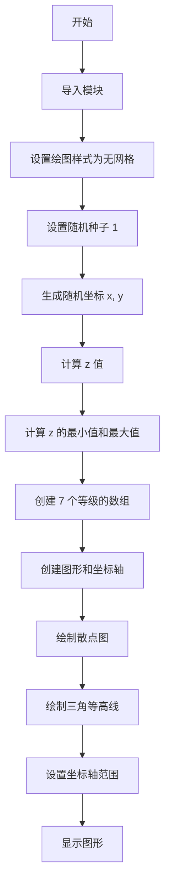

## 类结构

```
无类定义 - 脚本式代码
主要使用 matplotlib.axes.Axes 实例方法
```

## 全局变量及字段


### `x`
    
随机生成的 x 坐标数组，用于定义三角网格的顶点位置

类型：`np.ndarray`
    


### `y`
    
随机生成的 y 坐标数组，用于定义三角网格的顶点位置

类型：`np.ndarray`
    


### `z`
    
基于数学函数计算的 z 值数组，对应每个 (x, y) 坐标点的高度值

类型：`np.ndarray`
    


### `levels`
    
等高线等级数组，定义了要绘制的等高线的数值层级

类型：`np.ndarray`
    


### `fig`
    
图形对象，表示整个 matplotlib figure 容器

类型：`matplotlib.figure.Figure`
    


### `ax`
    
坐标轴对象，用于添加图形元素和设置坐标轴属性

类型：`matplotlib.axes.Axes`
    


    

## 全局函数及方法


### `np.random.uniform`

从均匀分布中抽取随机样本，生成指定范围内服从均匀分布的随机数数组。

参数：

- `low`：`float` 或 `array_like`，可选，默认 0.0，下边界（包含）
- `high`：`float` 或 `array_like`，可选，默认 1.0，上边界（不包含）
- `size`：`int` 或 `tuple`，可选，默认 None，输出数组的形状

返回值：`ndarray`，随机值数组

#### 流程图

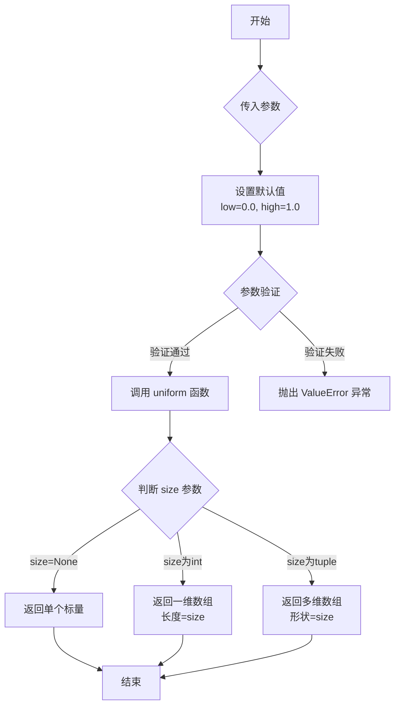

#### 带注释源码

```python
# numpy.random.uniform 源码分析

# 函数调用示例（在给定代码中）
x = np.random.uniform(-3, 3, 256)
# 参数说明：
#   -3   : low 参数，下边界（包含），类型 float
#    3   : high 参数，上边界（不包含），类型 float
#   256  : size 参数，输出数组长度，类型 int

# 返回值说明：
# 返回一个包含256个随机数的numpy数组
# 每个随机数服从均匀分布 U(-3, 3)
# 即从区间 [-3, 3) 中等概率随机抽取

# 函数内部逻辑简述：
# 1. 验证 low <= high，若不满足则抛出 ValueError
# 2. 生成 [0, 1) 范围内的均匀分布随机数
# 3. 通过变换得到 [low, high) 范围内的随机数: result = low + (high - low) * random
# 4. 根据 size 参数确定输出形状并返回数组
```


### `np.random.seed`

设置 NumPy 随机数生成器的种子值，确保后续生成的随机数序列可重现。

参数：

- `seed`：`int` 或 `None`，随机种子值，用于初始化随机数生成器的内部状态，传入相同种子将产生相同的随机数序列

返回值：`None`，该函数无返回值，直接修改全局随机数生成器的内部状态

#### 流程图

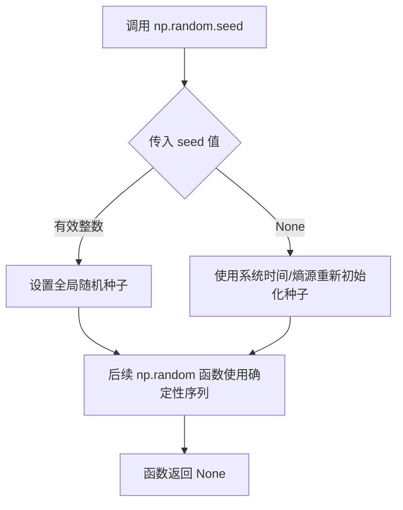

#### 带注释源码

```python
# 设置随机数生成器的种子值为 1
# 这确保后续所有 np.random 调用产生可重现的随机数序列
# 相同种子值将产生完全相同的随机数序列
np.random.seed(1)

# 示例：使用种子后生成随机数组
x = np.random.uniform(-3, 3, 256)  # 生成 256 个 [-3, 3) 范围内的随机数
y = np.random.uniform(-3, 3, 256)  # 每次调用都会产生确定性的序列

# 注意：seed(1) 会影响整个程序的随机数生成
# 任何后续的 np.random 函数调用都将基于这个种子
```

#### 详细说明

| 属性 | 值 |
|------|-----|
| **函数名称** | `np.random.seed` |
| **所属模块** | `numpy.random` |
| **调用方式** | 全局函数调用 |
| **作用范围** | 影响当前进程的所有后续随机数生成 |

**技术债务与优化建议**：
- `np.random.seed()` 是全局状态修改，在大型项目中可能导致意外的副作用
- 现代 NumPy 推荐使用 `np.random.Generator` 和 `np.random.default_rng()` 创建独立的随机数生成器实例，避免全局状态污染
- 示例：`rng = np.random.default_rng(1); x = rng.uniform(-3, 3, 256)`

**可重现性设计**：
- 该代码通过固定种子 `1` 确保每次运行产生完全相同的数据，便于调试和结果验证
- 在生产环境中，若需真正随机性，应移除种子设置或使用时间作为种子


### `plt.style.use`

设置 Matplotlib 的绘图样式（Style），用于统一图表的视觉主题，包括颜色、字体、线条样式、网格等外观属性。

参数：

- `name`：`str`、`Path` 或 `str/Path 的序列`，样式名称、内置样式关键字（如 'ggplot'、'dark_background'）或自定义样式文件的路径，可传入单个样式或多个样式的列表

返回值：`None`，无返回值，直接修改 Matplotlib 的全局 rcParams 配置

#### 流程图

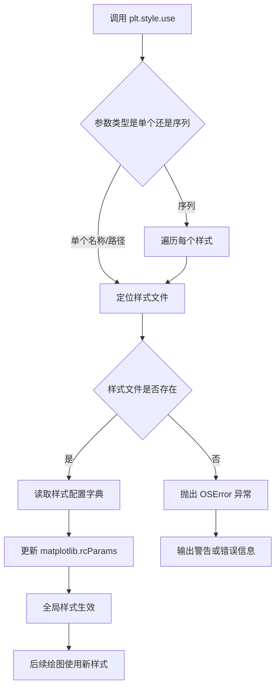

#### 带注释源码

```python
# plt.style.use 源码示例（基于 matplotlib 3.7+ 实现逻辑简化）

def use(style):
    """
    设置 matplotlib 的全局绘图样式。
    
    参数:
        style: str, Path, 或 str/Path 序列
            - 内置样式: 'default', 'ggplot', 'bmh', 'dark_background', 
                       'fivethirtyeight', 'grayscale', 'seaborn' 等
            - 自定义样式文件路径（.mplstyle 后缀）
            - 多个样式的组合（后面的优先级高）
    """
    
    # 样式查找路径列表
    # 1. 绝对路径直接使用
    # 2. 相对于当前目录
    # 3. 相对于用户样式目录 ~/.matplotlib/stylelib/
    # 4. 相对于 Matplotlib 安装目录的样式库 mpl-data/stylelib/
    
    if isinstance(style, (str, os.PathLike)):
        # 单个样式处理
        style = [style]
    
    # 遍历每个样式文件，依次加载
    for style_path in style:
        # 解析样式文件路径
        style_path = _load_style_file(style_path)
        
        # 读取样式配置（类似字典格式）
        # 支持 key: value 格式的配置项
        # 示例: lines.linewidth: 2
        #        axes.grid: True
        #        font.family: sans-serif
        rc = read_style_file(style_path)
        
        # 关键：将配置应用到全局 rcParams
        # rcParams 是 matplotlib 的全局配置字典
        # 修改后会影响后续所有图表的默认外观
        rcdefaults()
        RcParams.update(rc)
    
    # 无返回值，直接修改全局状态
    return None

# 样式文件示例（ggplot.mplstyle）:
# # 主题配置
# axes.facecolor: white
# axes.edgecolor: bcbcbc
# axes.linewidth: 1.0
# axes.grid: True
# grid.color: b0b0b0
# lines.linewidth: 1.5
# font.family: sans-serif
```


### `plt.subplots`

`plt.subplots` 是 matplotlib 库中的函数，用于创建一个新的图形窗口（Figure）以及一个或多个子坐标轴（Axes），返回一个包含图形和坐标轴对象的元组，是创建多子图布局的标准方式。

参数：

- `nrows`：`int`，默认值为 1，表示子图的行数。
- `ncols`：`int`，默认值为 1，表示子图的列数。
- `sharex`：`bool` 或 `str`，默认值为 False，如果为 True，则所有子图共享 x 轴；如果为 'row'，则每行子图共享 x 轴。
- `sharey`：`bool` 或 `str`，默认值为 False，如果为 True，则所有子图共享 y 轴；如果为 'col'，则每列子图共享 y 轴。
- `squeeze`：`bool`，默认值为 True，如果为 True，则返回的 Axes 对象数组维度会压缩：对于单行或单列情况返回一维数组。
- `width_ratios`：`array-like`，可选，表示每列的宽度比例。
- `height_ratios`：`array-like`，可选，表示每行的高度比例。
- `subplot_kw`：字典，可选，用于传递给 `add_subplot` 的关键字参数。
- `gridspec_kw`：字典，可选，用于指定网格规格（GridSpec）的关键字参数。
- `**fig_kw`：额外关键字参数，将传递给 `Figure` 构造函数。

返回值：`tuple(Figure, Axes or array of Axes)`，返回两个元素的元组：第一个是 Figure 对象（整个图形窗口），第二个是 Axes 对象（单个坐标轴）或 Axes 数组（多个子图）。

#### 流程图

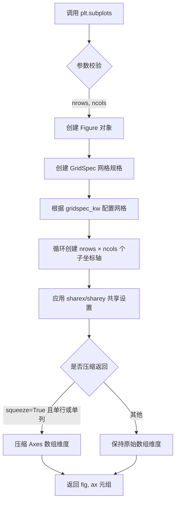

#### 带注释源码

```python
def subplots(nrows=1, ncols=1, sharex=False, sharey=False, 
             squeeze=True, width_ratios=None, height_ratios=None,
             subplot_kw=None, gridspec_kw=None, **fig_kw):
    """
    创建一个包含子图的图形及其坐标轴。
    
    参数:
        nrows: 子图行数，默认1
        ncols: 子图列数，默认1
        sharex: 是否共享x轴，可为bool或'row'
        sharey: 是否共享y轴，可为bool或'col'  
        squeeze: 是否压缩返回的Axes数组维度
        width_ratios: 每列宽度比例
        height_ratios: 每行高度比例
        subplot_kw: 传递给add_subplot的关键字参数
        gridspec_kw: GridSpec配置关键字参数
        **fig_kw: 传递给Figure的关键字参数
    
    返回:
        fig: Figure对象，整个图形窗口
        ax: Axes对象或Axes数组，子坐标轴
    """
    # 1. 创建Figure对象，传入额外的fig_kw参数
    fig = Figure(**fig_kw)
    
    # 2. 创建GridSpec网格规格对象
    gs = GridSpec(nrows, nrows, 
                  width_ratios=width_ratios,
                  height_ratios=height_ratios,
                  **gridspec_kw)
    
    # 3. 创建子坐标轴数组
    ax_array = np.empty((nrows, ncols), dtype=object)
    
    # 4. 遍历每个子图位置创建坐标轴
    for i in range(nrows):
        for j in range(ncols):
            # 使用subplot_kw创建子坐标轴
            ax = fig.add_subplot(gs[i, j], **subplot_kw)
            ax_array[i, j] = ax
            
            # 配置坐标轴共享
            if sharex and i > 0:
                ax.sharex(ax_array[0, j])
            if sharey and j > 0:
                ax.sharey(ax_array[i, 0])
    
    # 5. 根据squeeze参数处理返回结果
    if squeeze:
        # 压缩维度：单行返回一维数组，单列返回一维数组
        if nrows == 1 and ncols == 1:
            ax = ax_array[0, 0]
        elif nrows == 1 or ncols == 1:
            ax = ax_array.ravel()
        else:
            ax = ax_array
    else:
        ax = ax_array
    
    # 6. 返回(fig, ax)元组
    return fig, ax
```


### `Axes.plot`

该方法用于在Axes对象上绘制散点图或线图，通过指定格式字符串'o'来绘制散点图 markersize参数控制点的大小，color参数控制点的颜色。

参数：

- `x`：array-like，数据点的x坐标
- `y`：array-like，数据点的y坐标  
- `fmt`：str，格式字符串（如'o'表示圆点标记），可选
- `markersize`：int，标记的大小，可选
- `color`：str，标记的颜色，可选
- `**kwargs`：其他关键字参数，用于传递给Line2D属性

返回值：`list[matplotlib.lines.Line2D]`，返回创建的Line2D对象列表

#### 流程图

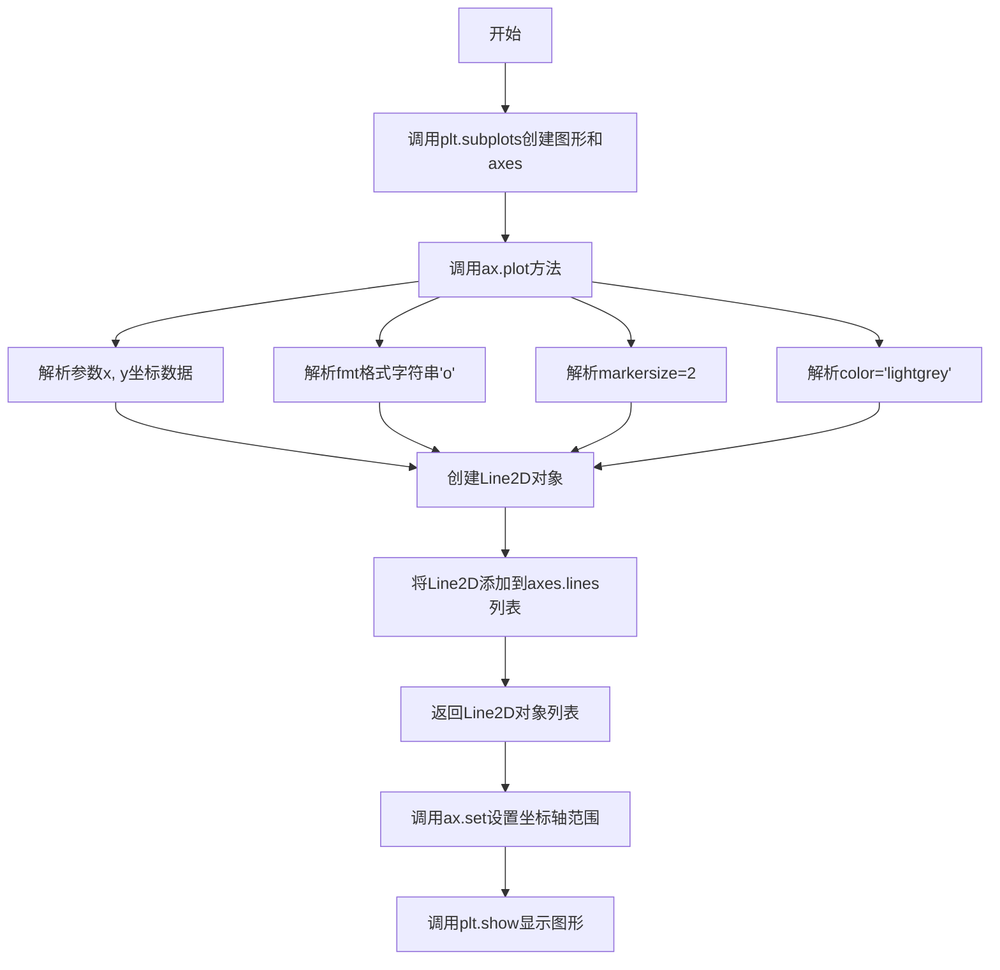

#### 带注释源码

```python
# 导入必要的库
import matplotlib.pyplot as plt
import numpy as np

# 使用matplotlib的内置样式（无网格）
plt.style.use('_mpl-gallery-nogrid')

# 设置随机种子以确保可重复性
np.random.seed(1)

# 生成随机数据点
# x: 256个均匀分布在[-3, 3]范围内的随机数
x = np.random.uniform(-3, 3, 256)
# y: 256个均匀分布在[-3, 3]范围内的随机数
y = np.random.uniform(-3, 3, 256)
# z: 使用数学公式计算高度值
z = (1 - x/2 + x**5 + y**3) * np.exp(-x**2 - y**2)

# 计算等高线级别：从z的最小值到最大值均匀分成7个级别
levels = np.linspace(z.min(), z.max(), 7)

# 创建图形和axes对象
fig, ax = plt.subplots()

# 绘制散点图
# x: x坐标数据
# y: y坐标数据
# 'o': 格式字符串，表示使用圆点标记
# markersize=2: 标记大小为2
# color='lightgrey': 标记颜色为浅灰色
ax.plot(x, y, 'o', markersize=2, color='lightgrey')

# 绘制等高线
# x, y: 坐标数据
# z: 高度数据
# levels=levels: 等高线级别
ax.tricontour(x, y, z, levels=levels)

# 设置坐标轴范围
# xlim=(-3, 3): x轴范围
# ylim=(-3, 3): y轴范围
ax.set(xlim=(-3, 3), ylim=(-3, 3))

# 显示图形
plt.show()
```


### `Axes.tricontour`

在非结构化三角网格上绘制等高线。该方法接受x、y坐标和对应的z值，计算并绘制指定层级的等高线，返回一个`TriContourSet`对象。

参数：

- `x`：`numpy.ndarray`，一维数组，表示采样点的x坐标
- `y`：`numpy.ndarray`，一维数组，表示采样点的y坐标
- `z`：`numpy.ndarray`，一维数组，表示每个采样点对应的标量值，用于计算等高线
- `levels`：`int or array-like`，可选，整数表示等高线数量，或直接指定等高线的值数组

返回值：`matplotlib.contour.TriContourSet`，等高线集合对象，包含所有绘制的等高线及其属性

#### 流程图

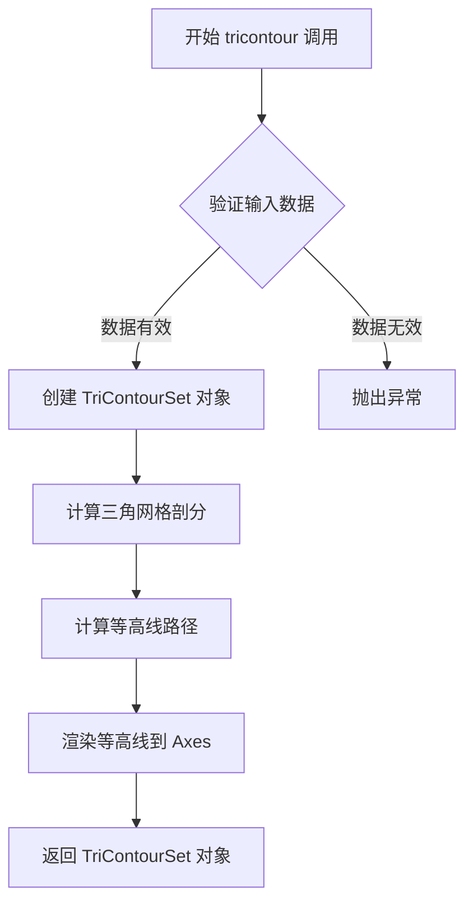

#### 带注释源码

```python
# 示例代码展示 tricontour 的完整使用流程

# 导入必要的库
import matplotlib.pyplot as plt
import numpy as np

# 设置绘图风格（无网格）
plt.style.use('_mpl-gallery-nogrid')

# 生成随机采样数据
np.random.seed(1)
x = np.random.uniform(-3, 3, 256)  # x坐标：256个均匀分布的随机点
y = np.random.uniform(-3, 3, 256)  # y坐标：256个均匀分布的随机点
# 计算z值：使用数学公式生成具有多个峰谷的函数值
z = (1 - x/2 + x**5 + y**3) * np.exp(-x**2 - y**2)

# 设置等高线层级：从z的最小值到最大值，平均分成7个层级
levels = np.linspace(z.min(), z.max(), 7)

# 创建图形和坐标轴对象
fig, ax = plt.subplots()

# 绘制散点图（灰色小点），显示数据采样点位置
ax.plot(x, y, 'o', markersize=2, color='lightgrey')

# 调用核心方法：在非结构化三角网格上绘制等高线
# 参数：x坐标、y坐标、z值、等高线层级
# 返回：TriContourSet对象，包含所有等高线数据
ax.tricontour(x, y, z, levels=levels)

# 设置坐标轴范围
ax.set(xlim=(-3, 3), ylim=(-3, 3))

# 显示图形
plt.show()
```


### `Axes.set`

设置坐标轴的属性，包括坐标轴范围（xlim、ylim）、标题（title）、轴标签（xlabel、ylabel）等。这是Matplotlib中Axes对象的核心方法，用于配置图表的各种视觉属性。

参数：

-   `**kwargs`：关键字参数，接受多种坐标轴属性设置，常见的参数包括：
    -   `xlim`：tuple/list，x轴的范围，格式为 (xmin, xmax)
    -   `ylim`：tuple/list，y轴的范围，格式为 (ymin, ymax)
    -   `title`：str，图表的标题
    -   `xlabel`：str，x轴的标签
    -   `ylabel`：str，y轴的标签
    -   `aspect`：str/float，设置坐标轴的纵横比
    -   ` adjustable`：str，设置如何调整axes以适应数据

返回值：`self`（Axes对象），返回调用自身的Axes对象，支持链式调用。

#### 流程图

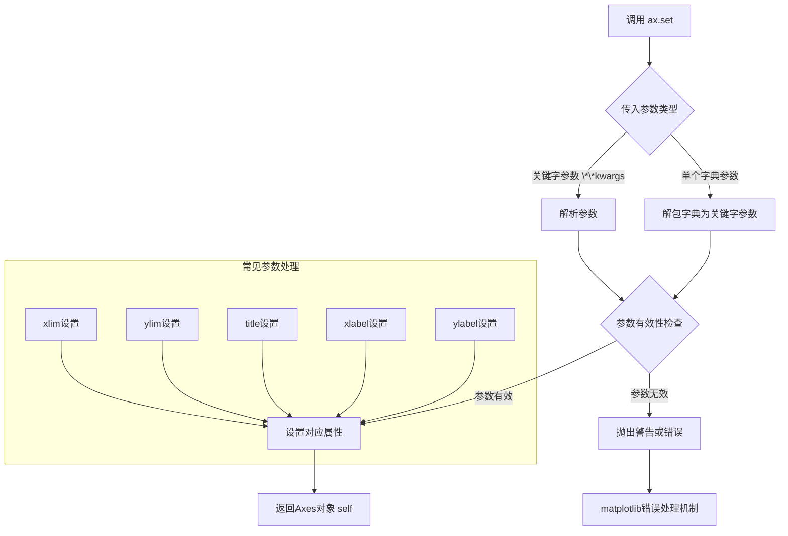

#### 带注释源码

```python
# 代码示例来源：matplotlib Axes.set 方法的典型使用模式
# 在给定代码中的实际调用：
ax.set(xlim=(-3, 3), ylim=(-3, 3))

# 等价于分别调用：
ax.set_xlim(-3, 3)  # 设置x轴范围
ax.set_ylim(-3, 3)  # 设置y轴范围

# set 方法的内部实现逻辑（简化版）：
def set(self, **kwargs):
    """
    设置 Axes 的多个属性。
    
    参数:
        **kwargs: 关键字参数，可包含：
            - xlim: (left, right) x轴范围
            - ylim: (bottom, top) y轴范围  
            - title: 图表标题
            - xlabel: x轴标签
            - ylabel: y轴标签
            - 等等其他Axes属性
    """
    # 1. 解析所有传入的关键字参数
    for attr, value in kwargs.items():
        # 2. 查找对应的setter方法（如 xlim -> set_xlim）
        setter_method = f'set_{attr}'
        if hasattr(self, setter_method):
            # 3. 调用对应的setter方法设置属性
            getattr(self, setter_method)(value)
        else:
            # 4. 如果没有对应的setter，尝试直接设置属性
            if hasattr(self, attr):
                setattr(self, attr, value)
            else:
                # 5. 未知属性时发出警告
                warnings.warn(f'Unknown property: {attr}')
    
    # 6. 返回self以支持链式调用
    return self
```


### `plt.show`

`plt.show` 是 matplotlib 库中的全局函数，用于显示当前所有打开的图形窗口并进入事件循环。在本代码中，它负责将前面通过 `ax.plot()` 和 `ax.tricontour()` 创建的可视化图形渲染到屏幕供用户查看。

参数：

-  `block`：可选的 `bool` 类型参数，控制是否阻塞程序执行直到窗口关闭，默认为 `True`

返回值：`None`，无返回值

#### 流程图

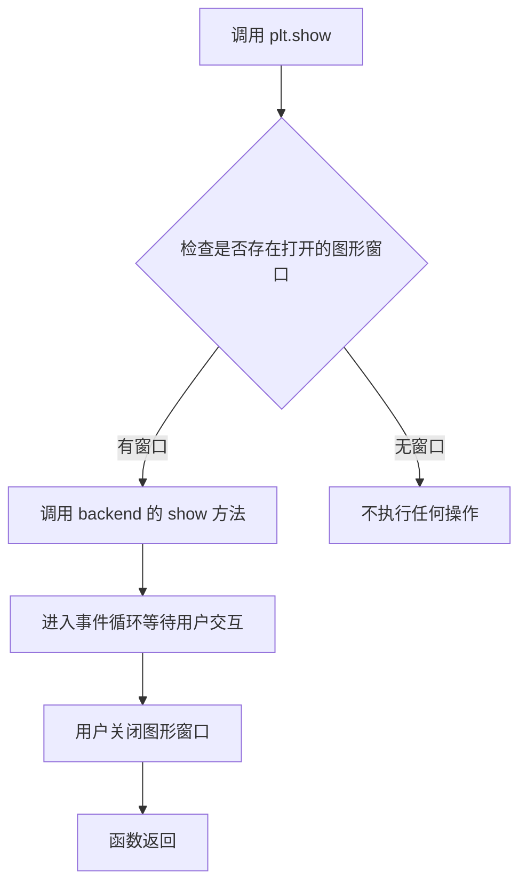

#### 带注释源码

```python
"""
===================
tricontour(x, y, z)
===================
Draw contour lines on an unstructured triangular grid.

See `~matplotlib.axes.Axes.tricontour`.
"""
import matplotlib.pyplot as plt
import numpy as np

# 使用预定义的无网格绘图样式
plt.style.use('_mpl-gallery-nogrid')

# 设置随机种子以确保结果可复现
np.random.seed(1)
# 生成256个随机坐标点，范围在[-3, 3]
x = np.random.uniform(-3, 3, 256)
y = np.random.uniform(-3, 3, 256)
# 使用数学公式生成z值，形成复杂的等高线图案
z = (1 - x/2 + x**5 + y**3) * np.exp(-x**2 - y**2)
# 创建7个等间距的等高线级别
levels = np.linspace(z.min(), z.max(), 7)

# 创建图形和坐标轴对象
fig, ax = plt.subplots()

# 绘制散点图，显示数据点的分布位置
ax.plot(x, y, 'o', markersize=2, color='lightgrey')
# 绘制三角网格等高线图
ax.tricontour(x, y, z, levels=levels)

# 设置坐标轴的显示范围
ax.set(xlim=(-3, 3), ylim=(-3, 3))

# 【核心功能】显示图形窗口并进入事件循环
# 调用matplotlib后端将所有绑定的Figure对象渲染到屏幕
plt.show()
```


### `numpy.ndarray.min`（或代码中的 `z.min`）

获取数组中的最小元素。该方法返回数组在指定轴上的最小值，若未指定轴，则返回数组所有元素的最小值。

参数：

-  无（代码中以无参数形式调用 `z.min()`）

返回值：`numpy scalar`，返回数组中的最小值。

#### 流程图

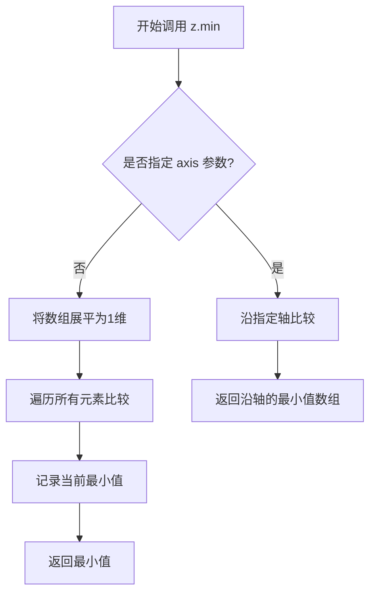

#### 带注释源码

```python
# 注意：以下为简化的 Python 伪代码，实际 numpy 使用 C 实现以提高性能
def min(self, axis=None, out=None, keepdims=False):
    """
    返回数组的最小值或沿轴的最小值。
    
    参数:
        axis: 指定沿哪个轴计算最小值，None 表示展平数组。
        out: 用于放置结果的数组。
        keepdims: 是否保持维度。
    """
    # 简化实现：直接使用 Python 内置 min 函数
    if axis is None:
        # 展平数组并找最小值
        return min(self.flatten())
    else:
        # 沿指定轴计算（简化处理）
        result = []
        for idx in range(self.shape[axis]):
            result.append(min(self.take(idx, axis=axis)))
        return np.array(result)
```


### `numpy.ndarray.max`

返回数组中的最大值。

参数：

-  无参数（为 numpy.ndarray 的成员方法）

返回值：`numpy.ndarray` 的标量类型（如 `float`），返回数组中的最大值

#### 流程图

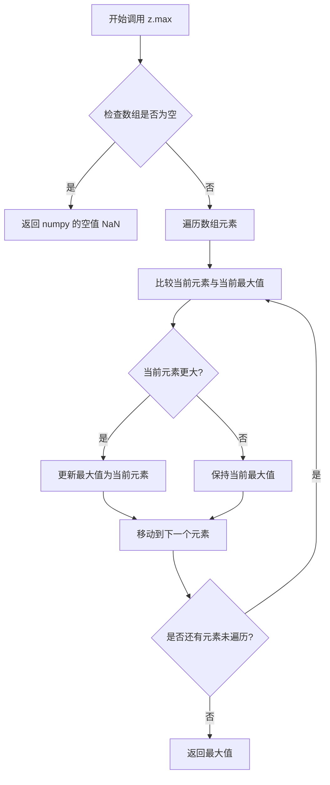

#### 带注释源码

```python
# z 是一个通过数学公式生成的 numpy 数组
z = (1 - x/2 + x**5 + y**3) * np.exp(-x**2 - y**2)

# z.max() 是 numpy.ndarray 的成员方法
# 用于获取数组中的最大元素值
# 等效于 np.max(z) 或 max(z.flatten())
levels = np.linspace(z.min(), z.max(), 7)
#        ↑              ↑
#     最小值           最大值
#     (z.min())       (z.max())
#     
# 功能：计算 z 数组中的最大值
# 返回值类型：float（标量）
# 在此代码中用于确定等高线图的值域范围
```

#### 补充说明

在代码中的实际使用：

```python
# z 是 numpy.ndarray 类型，通过以下方式生成
x = np.random.uniform(-3, 3, 256)  # 256个随机x坐标
y = np.random.uniform(-3, 3, 256)  # 256个随机y坐标
z = (1 - x/2 + x**5 + y**3) * np.exp(-x**2 - y**2)  # 256个z值

# z.max() 调用流程：
# 1. numpy 数组对象 z 调用其 max() 方法
# 2. 方法内部遍历所有 256 个元素
# 3. 比较找出最大的那个值
# 4. 返回该最大值（float 类型）
levels = np.linspace(z.min(), z.max(), 7)
# 在此处 z.max() 用于确定等高线 levels 的上界
```

**类型信息**：
- `z` 的类型：`numpy.ndarray`（形状为 (256,) 的一维数组）
- `z.max` 的类型：`numpy.ndarray` 的成员方法
- 返回值类型：`numpy.float64`（或数组元素对应的标量类型）


### `np.linspace`

创建等差数列，用于生成指定范围内的等间隔数值序列。

参数：

- `start`：`float`，序列的起始值（代码中为 `z.min()`）
- `stop`：`float`，序列的结束值（代码中为 `z.max()`）
- `num`：`int`，要生成的样本数量（代码中为 `7`）
- `endpoint`：`bool`，可选，是否包含结束值，默认为 `True`
- `retstep`：`bool`，可选，是否返回步长，默认为 `False`
- `dtype`：`dtype`，可选，输出数组的数据类型
- `axis`：`int`，可选，输出数组中轴的方向

返回值：`ndarray`，等差数列数组

#### 流程图

```mermaid
flowchart TD
    A[开始] --> B{验证参数}
    B -->|有效| C[计算步长 step = (stop - start) / (num - 1)]
    C --> D[生成等差数列数组]
    D --> E{retstep=True?}
    E -->|是| F[返回数组和步长]
    E -->|否| G[仅返回数组]
    F --> H[结束]
    G --> H
    B -->|无效| I[抛出异常]
    I --> H
```

#### 带注释源码

```python
def linspace(start, stop, num=50, endpoint=True, retstep=False, dtype=None, axis=0):
    """
    创建等差数列
    
    参数:
        start: 序列起始值
        stop: 序列结束值
        num: 样本数量，默认为50
        endpoint: 是否包含结束值，默认为True
        retstep: 是否返回步长，默认为False
        dtype: 输出数据类型
        axis: 轴方向
    
    返回:
        ndarray: 等差数列
    """
    # 验证参数有效性
    if num < 0:
        raise ValueError("Number of samples must be non-negative")
    
    # 计算步长
    # 如果endpoint为True，步长 = (stop - start) / (num - 1)
    # 否则步长 = (stop - start) / num
    if endpoint:
        step = (stop - start) / (num - 1) if num > 1 else 0
    else:
        step = (stop - start) / num
    
    # 生成数组：start, start+step, start+2*step, ..., stop
    # 使用浮点数计算确保精度
    y = np.arange(num, dtype=dtype) * step + start
    
    # 处理endpoint边界情况
    if endpoint and num > 1:
        y[-1] = stop  # 确保最后一个值精确等于stop
    
    # 根据retstep决定返回值
    if retstep:
        return y, step
    else:
        return y
```

## 关键组件


### 数据生成模块

使用 numpy 生成均匀分布的随机坐标点 x 和 y，并通过数学公式 (1 - x/2 + x**5 + y**3) * exp(-x**2 - y**2) 计算对应的 z 值，形成三维数据点集合。

### 量化策略模块

使用 np.linspace 从 z 的最小值到最大值线性划分 7 个等高线等级，实现数据的离散化分级处理。

### 反量化支持模块

levels 数组通过线性插值从 z.min() 到 z.max()，将连续的 z 值映射到离散的等高线层级，支持等高线的绘制。

### 可视化渲染模块

使用 matplotlib 的 ax.tricontour() 函数在非结构化三角形网格上绘制等高线，同时用 ax.plot() 绘制散点图作为背景参考。

### 坐标轴配置模块

通过 ax.set() 设置 x 和 y 轴的显示范围为 (-3, 3)，确保图形展示区域的一致性。


## 问题及建议


### 已知问题

-   **硬编码的随机种子**：使用 `np.random.seed(1)` 导致每次运行生成完全相同的数据，失去了随机性，不适合作为通用示例
-   **缺乏输入数据验证**：未验证 x、y、z 数组长度是否一致，可能导致运行时错误
-   **魔法数字**：levels 数量（7）、样本点数（256）、坐标范围（-3 到 3）均为硬编码，缺乏可配置性
-   **缺少异常处理**：如果输入数据包含 NaN 或 Inf，数学运算可能产生意外结果或警告
-   **无类型注解**：代码缺乏类型提示，降低了可读性和可维护性
-   **文档不完整**：数学公式 `(1 - x/2 + x**5 + y**3) * np.exp(-x**2 - y**2)` 没有任何注释说明其用途
-   **未使用的返回值**：未使用 `plt.subplots()` 返回的 fig 对象，可能导致资源未正确释放
-   **平台兼容性**：`plt.show()` 在某些后端环境下可能无法正常工作

### 优化建议

-   **移除随机种子或使其可选**：移除 `np.random.seed(1)` 或将其作为可选参数，允许每次生成不同数据
-   **添加数据验证**：在计算前验证 x、y、z 数组长度一致性和数据有效性
-   **参数化配置**：将硬编码的数值提取为顶层常量或函数参数，提高代码灵活性
-   **添加异常处理**：使用 try-except 包装可能失败的代码段，添加数据清洗逻辑处理 NaN/Inf
-   **添加类型注解**：为函数参数和变量添加类型提示
-   **完善文档**：添加详细的文档字符串，解释数学公式的物理意义
-   **正确管理资源**：显式使用 `fig.savefig()` 保存或显式关闭图形资源
-   **考虑跨平台**：在需要时添加图形后端选择逻辑


## 其它


### 设计目标与约束

本代码示例旨在演示如何使用matplotlib的tricontour函数在非结构化三角网格上绘制等值线图。设计目标包括：生成具有视觉吸引力的等值线可视化效果，支持自定义等值线级别，以及展示三角网格等值线绘制的基本用法。约束条件包括：依赖matplotlib和numpy库，需要预先安装；数据点数量（256个）适中，适合演示目的；使用预定义的数学公式生成z值。

### 错误处理与异常设计

代码中未显式实现错误处理机制。在实际应用中，应考虑添加以下错误处理：数据点数量不匹配时抛出ValueError；z值全为常数时警告用户可能导致等值线绘制失败；np.random.uniform和np.exp可能产生的数值溢出警告处理；plt.show()可能出现的显示环境异常捕获。

### 数据流与状态机

数据流处理流程如下：首先通过numpy生成256个随机x坐标和y坐标，范围为[-3, 3]；然后使用给定数学公式计算对应的z值；接着根据z值的最小值和最大值生成7个等值线级别；最后通过ax.tricontour()函数在三角网格上进行插值并绘制等值线。状态机转换：初始化状态（随机种子设置）→ 数据生成状态（x, y, z计算）→ 参数计算状态（levels生成）→ 绘图状态（图形创建和渲染）→ 显示状态（plt.show()）。

### 外部依赖与接口契约

主要外部依赖包括：matplotlib.pyplot模块，提供绘图API；numpy模块，提供数值计算功能。接口契约说明：tricontour(x, y, z, levels)接收三个必要参数（x, y为位置坐标数组，z为对应值数组）和一个可选参数levels（等值线级别数组或数量）；返回TriContourSet对象，可用于进一步定制等值线外观；ax.plot()用于绘制底层散点，接收位置数据和样式参数。

### 性能考虑

当前实现使用256个数据点，性能表现良好。潜在优化方向：对于大规模数据点（>10000），可考虑使用scipy.spatial.Delaunay进行三角剖分优化；等值线级别数量影响渲染性能，7个级别为合理默认值；如需实时更新，可考虑使用matplotlib.animation模块优化重绘逻辑。

### 配置参数说明

关键配置参数包括：np.random.seed(1)确保结果可复现；z公式中的系数（1, -1/2, 1, 1）控制等值线形态；levels数量（7）决定等值线密度；markersize=2和color='lightgrey'控制散点图视觉效果；xlim和ylim设置为(-3, 3)匹配数据生成范围。

### 可扩展性分析

代码具有良好的基础架构可扩展性：可增加更多数据点数量以提高分辨率；可调整levels参数改变等值线密度和范围；可添加颜色映射（cmap参数）实现彩色等值线；可添加填充效果（tricontourf）增强可视化；可自定义等值线标签和线型；可集成到Web应用或报告生成系统中。

### 测试策略建议

建议添加以下测试用例：验证输入数组维度一致性；验证z值计算正确性；验证levels范围与z值范围匹配；验证空数组或单点数据的边界情况；验证图形对象创建成功；验证坐标轴范围设置正确。

    