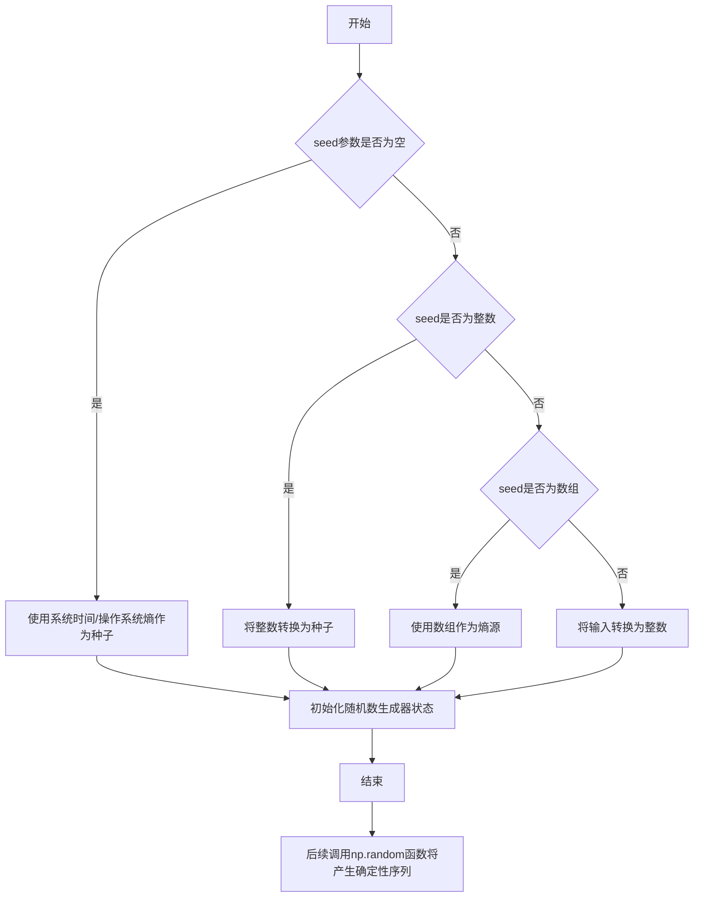
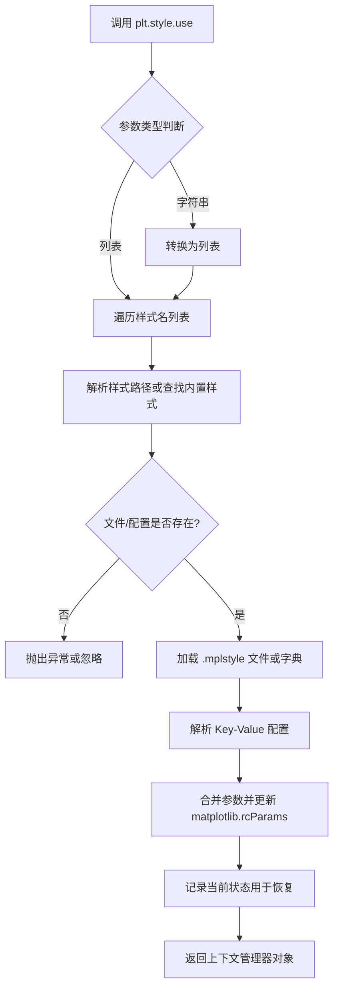
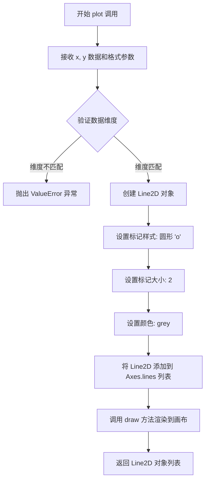
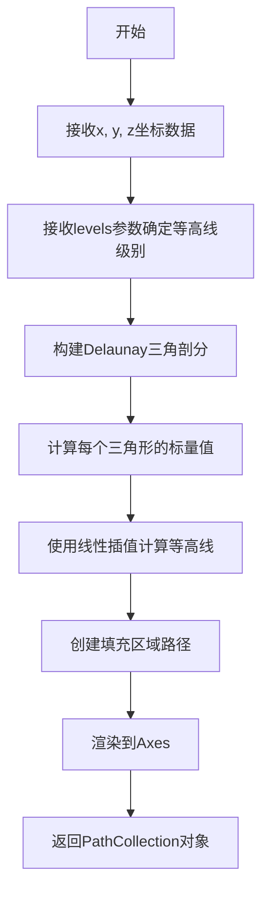
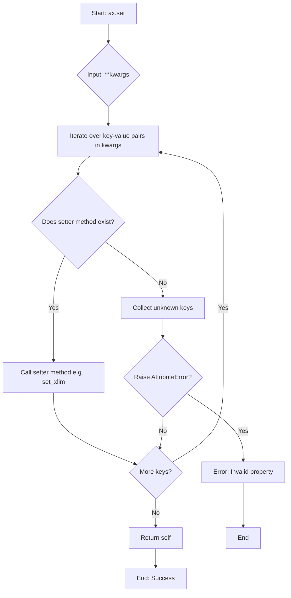
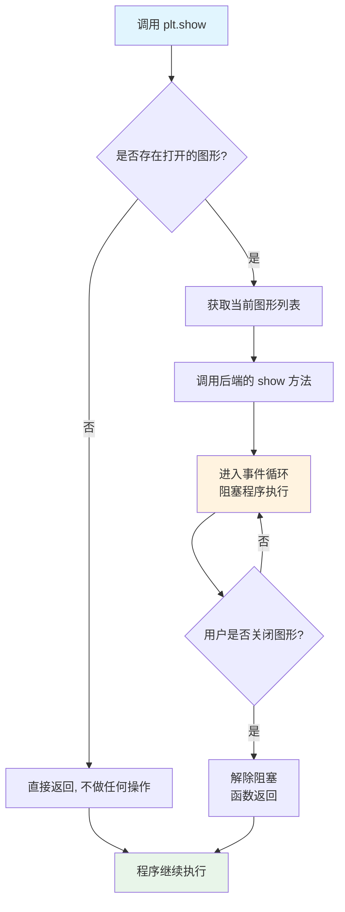

# `matplotlib\galleries\plot_types\unstructured\tricontourf.py` 详细设计文档

该代码使用matplotlib的tricontourf函数在非结构化三角网格上绘制等高线区域，通过生成随机坐标点和数学函数计算z值来可视化三维数据。

## 整体流程

```mermaid
graph TD
    A[开始] --> B[设置随机种子 np.random.seed(1)]
    B --> C[生成随机坐标 x = np.random.uniform(-3, 3, 256)]
    C --> D[生成随机坐标 y = np.random.uniform(-3, 3, 256)]
    D --> E[计算z值 z = (1 - x/2 + x**5 + y**3) * exp(-x**2 - y**2)]
    E --> F[创建等高线级别 levels = np.linspace(z.min(), z.max(), 7)]
    F --> G[创建画布 fig, ax = plt.subplots()]
    G --> H[绘制散点 ax.plot(x, y, 'o', markersize=2, color='grey')]
    H --> I[绘制三角等高线 ax.tricontourf(x, y, z, levels=levels)]
    I --> J[设置坐标轴范围 ax.set(xlim=(-3, 3), ylim=(-3, 3))]
    J --> K[显示图像 plt.show()]
```

## 类结构

```
该代码为脚本式程序，非面向对象结构
无自定义类定义
主要依赖matplotlib.axes.Axes对象的实例方法
```

## 全局变量及字段


### `x`
    
随机生成的x坐标数组，范围[-3, 3]，256个点

类型：`numpy.ndarray`
    


### `y`
    
随机生成的y坐标数组，范围[-3, 3]，256个点

类型：`numpy.ndarray`
    


### `z`
    
根据数学公式计算的三维高度值数组

类型：`numpy.ndarray`
    


### `levels`
    
等高线的级别数组，从z最小值到最大值等分7个级别

类型：`numpy.ndarray`
    


### `fig`
    
matplotlib创建的图形对象

类型：`matplotlib.figure.Figure`
    


### `ax`
    
图形坐标轴对象，用于绘图操作

类型：`matplotlib.axes.Axes`
    


    

## 全局函数及方法


### `np.random.seed`

设置随机种子以保证结果可复现。通过设置随机数生成器的种子，使得每次运行程序时生成的随机数序列相同，从而确保实验结果的可重复性。

参数：

- `seed`：`int` 或 `array_like` 或 `None`，随机数生成器的种子值。如果传入整数，则用于初始化随机数生成器；如果传入 `None`，则每次调用时使用系统时间作为种子；如果传入数组，则将其作为熵源来初始化随机数生成器。

返回值：`None`，该函数无返回值，直接修改随机数生成器的内部状态。

#### 流程图



#### 带注释源码

```python
# 设置随机种子为1，确保后续随机数生成可复现
np.random.seed(1)

# 生成的随机数序列示例（种子为1时）
# 第一次调用 np.random.uniform(-3, 3, 1) 将返回约 -2.552...
# 第二次调用将返回确定的可预测值
x = np.random.uniform(-3, 3, 256)
y = np.random.uniform(-3, 3, 256)
```

**使用说明：**
- `np.random.seed()` 影响所有基于 `numpy.random` 模块的随机函数
- 种子值相同 → 随机序列相同 → 结果可复现
- 常见用途：调试、单元测试、论文实验结果复现


### `np.random.uniform`

生成指定范围内的均匀分布随机数。该函数是 NumPy 随机数生成模块的核心函数之一，用于从均匀分布中抽取样本。

参数：

- `low`：`float` 或 array_like，随机数的下界（包含），默认值为 0.0
- `high`：`float` 或 array_like，随机数的上界（不包含），默认值为 1.0
- `size`：`int` 或 tuple of ints，输出数据的形状，默认值为 None（返回单个值）

返回值：`float` 或 ndarray，如果指定了 size，则返回对应形状的数组，否则返回单个随机数

#### 流程图

```mermaid
graph TD
    A[开始] --> B{检查参数}
    B --> C{参数验证}
    C -->|参数有效| D[计算范围: high - low]
    C -->|参数无效| E[抛出异常]
    D --> F{size是否为None}
    F -->|是| G[生成单个随机数: low + random() * 范围]
    F -->|否| H[按size形状生成随机数数组]
    G --> I[返回单个浮点数]
    H --> J[返回随机数数组]
    I --> K[结束]
    J --> K
```

#### 带注释源码

```python
# np.random.uniform 函数实现原理（概念性源码）

def uniform(low=0.0, high=1.0, size=None):
    """
    从均匀分布中生成随机样本
    
    参数:
        low: 随机数下界（包含），默认0.0
        high: 随机数上界（不包含），默认1.0  
        size: 输出形状，None则返回单个值
    
    返回:
        均匀分布的随机数或数组
    """
    # 计算分布范围
    range_width = high - low
    
    # 生成基础随机数 [0, 1)
    # NumPy内部使用 Mersenne Twister 或 PCG64 等算法
    if size is None:
        # 单个值情况：直接转换
        random_value = random.random()  # 生成 [0, 1) 随机数
        return low + random_value * range_width
    else:
        # 数组情况：向量化生成
        random_array = random.random(size)  # 生成形状为size的数组
        return low + random_array * range_width
```

**在代码中的实际使用：**

```python
# 第一次调用：生成x坐标
x = np.random.uniform(-3, 3, 256)
# 等价于: 在[-3, 3)范围内生成256个随机数

# 第二次调用：生成y坐标  
y = np.random.uniform(-3, 3, 256)
# 等价于: 在[-3, 3)范围内生成256个随机数
```


### `np.linspace`

`np.linspace` 是 NumPy 库中的一个函数，用于在指定的间隔内生成等间距的数值序列。该函数常用于创建用于绘图的水平线、颜色刻度或其他需要均匀分布数值的场景。

参数：

- `start`：`float`，序列的起始值
- `stop`：`float`，序列的结束值（当 `endpoint` 为 True 时为最后一个值）
- `num`：`int`，要生成的样本数量，默认为 50
- `endpoint`：`bool`，可选，是否将 `stop` 作为序列的最后一个值，默认为 True
- `retstep`：`bool`，可选，如果为 True，返回 (samples, step)，其中 step 是样本间的间距，默认为 False
- `dtype`：`dtype`，可选，输出数组的数据类型，如果未指定，则从输入推断
- `axis`：`int`，可选，当 start 和 stop 是数组时，指定结果数组中存储数据的轴

返回值：`ndarray`，等间距的数值序列

#### 流程图

```mermaid
flowchart TD
    A[开始] --> B{检查参数有效性}
    B --> C[计算步长 step = (stop - start) / (num - 1) if endpoint else (stop - start) / num]
    C --> D[生成 num 个等间距样本]
    D --> E{retstep=True?}
    E -->|是| F[返回样本数组和步长]
    E -->|否| G[仅返回样本数组]
    F --> H[结束]
    G --> H
```

#### 带注释源码

```python
def linspace(start, stop, num=50, endpoint=True, retstep=False, dtype=None, axis=0):
    """
    在指定的间隔内返回等间距的数值序列。
    
    参数:
        start: 序列的起始值
        stop: 序列的结束值
        num: 要生成的样本数量，默认50
        endpoint: 是否包含终点，默认True
        retstep: 是否返回步长，默认False
        dtype: 输出数据类型
        axis: 轴（当输入为数组时使用）
    
    返回值:
        ndarray: 等间距的数值序列
    """
    # 将start和stop转换为ndarray（如果还不是）
    _arange = np.arange
    _dtype = float
    
    # 处理num参数
    if num <= 0:
        return np.array([], dtype=dtype)
    
    # 计算步长
    if endpoint:
        step = (stop - start) / (num - 1)
    else:
        step = (stop - start) / num
    
    # 生成序列
    y = _arange(0, num, dtype=_dtype) * step + start
    
    # 处理endpoint情况
    if endpoint and num > 1:
        y[num-1] = stop
    
    # 处理dtype
    if dtype is not None:
        y = y.astype(dtype)
    
    # 根据retstep返回结果
    if retstep:
        return y, step
    else:
        return y
```


### `plt.style.use`

设置 Matplotlib 的全局绘图样式（Style）。该函数用于加载并应用预定义的样式文件（`.mplstyle`）或字典配置，以统一修改图形的线宽、字体、颜色主题等 `rcParams` 参数。它支持传入单个样式名或多个样式名（列表），并返回一个上下文管理器对象，允许在局部代码块中临时应用样式。

参数：

- `name`：`str` 或 `list[str]`，要使用的样式名称。可以是字符串（如 `'ggplot'`）或包含多个样式名的列表，后面的样式会覆盖前面的设置。

返回值：`matplotlib.style.core._StyleContext`，一个上下文管理器对象。当在 `with` 语句中使用时，它会在代码块执行完毕后自动恢复之前的样式；若直接调用（无 `with`），则主要利用其副作用（修改全局配置），返回值通常被忽略。

#### 流程图



#### 带注释源码

```python
import contextlib
import matplotlib as mpl

def use(name):
    """
    使用给定的样式名称设置 Matplotlib 样式。
    
    参数:
        name (str or list): 样式名称。
    
    返回:
        _StyleContext: 用于恢复旧样式的上下文管理器。
    """
    # 1. 标准化输入：将字符串转为列表，统一处理流程
    if isinstance(name, str):
        names = [name]
    else:
        names = name

    # 2. 创建上下文管理器，用于保存当前状态并在退出时恢复
    @contextlib.contextmanager
    def _apply_style():
        # 保存当前的 rcParams 原始状态
        # 注意：在 Matplotlib 3.7+ 中，通常使用 rc_context 来管理
        original_params = mpl.rcParams.copy()
        
        try:
            # 3. 遍历加载所有样式
            for style_name in names:
                # 查找样式文件路径或内置样式字典
                params = _load_style(style_name) 
                # 4. 更新全局 rcParams
                mpl.rcParams.update(params)
            
            # 5. 交付控制权给 with 语句的代码块
            yield
        finally:
            # 6. 退出 with 语句时，恢复原始 rcParams
            mpl.rcParams.clear()
            mpl.rcParams.update(original_params)

    return _apply_style()

# 模拟的内部加载函数
def _load_style(name):
    # 实际代码中这里会查找 .mplstyle 文件或 style library
    # 这里返回模拟的配置字典
    return {'lines.linewidth': 2, 'font.size': 12}
```


### `plt.subplots`

`plt.subplots` 是 matplotlib.pyplot 模块中的函数，用于创建一个新的图形窗口（Figure）以及一个或多个子图（Axes）对象。该函数是 matplotlib 中最常用的绘图初始化方式之一，允许用户一次性创建和管理图形及其坐标轴，适合需要多子图布局或自定义图形属性的场景。

参数：

- `nrows`：`int`，默认值为 1，表示子图网格的行数。
- `ncols`：`int`，默认值为 1，表示子图网格的列数。
- `sharex`：`bool` 或 `str`，默认值为 `False`。如果为 `True`，则所有子图共享 x 轴；如果为 'row'，则每行的子图共享 x 轴；如果为 'col'，则每列的子图共享 x 轴。
- `sharey`：`bool` 或 `str`，默认值为 `False`。如果为 `True`，则所有子图共享 y 轴；如果为 'row'，则每行的子图共享 y 轴；如果为 'col'，则每列的子图共享 y 轴。
- `squeeze`：`bool`，默认值为 `True`。如果为 `True`，则当子图数量为 1 时，返回的 Axes 对象不再是数组形式，而是单个对象。
- `width_ratios`：`array-like`，可选参数，定义每列的宽度比例。
- `height_ratios`：`array-like`，可选参数，定义每行的高度比例。
- `subplot_kw`：`dict`，可选参数，传递给 `add_subplot` 的关键字参数，用于配置子图属性。
- `gridspec_kw`：`dict`，可选参数，传递给 `GridSpec` 的关键字参数，用于配置网格布局。
- `**fig_kw`：可选关键字参数，传递给 `plt.figure()` 的参数，用于配置图形属性（如 figsize、dpi 等）。

返回值：`tuple(Figure, Axes) 或 tuple(Figure, ndarray of Axes)`，返回图形对象（Figure）和坐标轴对象（Axes）。当 `squeeze=True` 且只有一个子图时，返回单个 Axes 对象；否则返回 Axes 对象数组。

#### 流程图

```mermaid
flowchart TD
    A[调用 plt.subplots] --> B{是否指定 nrows/ncols?}
    B -->|未指定/默认| C[创建 1x1 网格]
    B -->|指定| D[创建 nrows x ncols 网格]
    C --> E[调用 plt.figure 创建 Figure]
    D --> E
    E --> F[创建 GridSpec 布局]
    F --> G[遍历网格创建 Axes 对象]
    G --> H{是否设置 sharex/sharey?}
    H -->|是| I[配置坐标轴共享属性]
    H -->|否| J{是否 squeeze=True?}
    I --> J
    J -->|是且仅1个子图| K[返回单个 Axes 对象]
    J -->|否| L[返回 Axes 数组]
    K --> M[返回 (fig, ax) 元组]
    L --> M
    M --> N[用户进行绘图操作]
```

#### 带注释源码

```python
# plt.subplots 函数源码结构（简化版）

def subplots(nrows=1, ncols=1, sharex=False, sharey=False, 
             squeeze=True, width_ratios=None, height_ratios=None,
             subplot_kw=None, gridspec_kw=None, **fig_kw):
    """
    创建图形和子图坐标轴网格
    
    参数:
        nrows: 子图行数，默认为1
        ncols: 子图列数，默认为1
        sharex: x轴共享策略
        sharey: y轴共享策略
        squeeze: 是否压缩返回的坐标轴数组
        width_ratios: 各列宽度比例
        height_ratios: 各行高度比例
        subplot_kw: 子图额外配置
        gridspec_kw: 网格布局额外配置
        **fig_kw: 传递给figure的参数
    
    返回:
        fig: matplotlib.figure.Figure 对象
        ax: 坐标轴对象或坐标轴数组
    """
    
    # 1. 创建图形对象
    fig = figure(**fig_kw)
    
    # 2. 创建网格布局规范
    gs = GridSpec(nrows, nrows, 
                  width_ratios=width_ratios,
                  height_ratios=height_ratios,
                  **gridspec_kw)
    
    # 3. 创建子图数组
    ax_array = np.empty((nrows, ncols), dtype=object)
    
    # 4. 遍历网格创建坐标轴
    for i in range(nrows):
        for j in range(ncols):
            # 创建子图坐标轴
            ax = fig.add_subplot(gs[i, j], **subplot_kw)
            ax_array[i, j] = ax
            
            # 配置坐标轴共享
            if sharex and i > 0:
                ax.sharex(ax_array[0, j])
            if sharey and j > 0:
                ax.sharey(ax_array[i, 0])
    
    # 5. 根据squeeze参数处理返回值
    if squeeze and nrows == 1 and ncols == 1:
        return fig, ax_array[0, 0]  # 返回单个坐标轴
    else:
        return fig, ax_array  # 返回坐标轴数组
```

#### 在示例代码中的使用

```python
# 示例代码中 plt.subplots 的调用
fig, ax = plt.subplots()

# 等价于:
# fig, ax = plt.subplots(nrows=1, ncols=1, squeeze=True)
# 创建一个图形窗口和一个坐标轴对象
# 返回: (Figure对象, Axes对象)
```

---

## 补充说明

### 代码整体运行流程

1. 设置 matplotlib 样式为无网格画廊风格
2. 使用 `np.random.uniform` 生成随机坐标点 x, y
3. 使用数学公式计算 z 值
4. 创建 7 个等高线级别
5. 调用 `plt.subplots()` 创建图形和坐标轴
6. 在坐标轴上绘制散点图和三角等高线图
7. 设置坐标轴范围并显示图形

### 关键组件信息

- **plt.subplots**: 创建图形和坐标轴对象的工厂函数
- **ax.tricontourf**: 在非结构化三角网格上绘制填充等高线
- **np.random.uniform**: 生成均匀分布的随机数
- **plt.style.use**: 设置 matplotlib 绘图样式

### 潜在技术债务或优化空间

1. **随机种子硬编码**: `np.random.seed(1)` 硬编码在代码中，每次运行结果相同，缺乏灵活性
2. **魔法数值**: 级别数量 7、随机点数量 256、坐标范围 -3 到 3 等应提取为常量
3. **缺乏错误处理**: 未对输入数据进行有效性验证（如数组长度一致性检查）
4. **样式依赖**: 使用了内部样式 `_mpl-gallery-nogrid`，可能随版本变化

### 设计目标与约束

- 目标：展示三角等高线填充图的基本用法
- 约束：使用非结构化网格数据，适合不规则分布的点数据


### `Axes.plot`

在坐标轴上绘制散点图（或折线图），将数据点以指定样式（标记形状、大小、颜色）渲染到二维坐标系中。

参数：

-  `x`：`numpy.ndarray`，x轴数据点坐标数组
-  `y`：`numpy.ndarray`，y轴数据点坐标数组
-  `fmt`：`str`，格式字符串，定义标记样式（此处为`'o'`表示圆形标记）
-  `markersize`：`int`，标记的大小（此处为`2`）
-  `color`：`str`，标记和线条的颜色（此处为`'grey'`）

返回值：`list[matplotlib.lines.Line2D]`，返回包含所有绘制的Line2D对象的列表

#### 流程图



#### 带注释源码

```python
# ax.plot(x, y, 'o', markersize=2, color='grey') 的调用过程

# 1. 参数准备阶段
x = np.random.uniform(-3, 3, 256)  # 生成256个x坐标点
y = np.random.uniform(-3, 3, 256)  # 生成256个y坐标点
fmt = 'o'                           # 标记形状：圆形
markersize = 2                      # 标记大小：2像素
color = 'grey'                      # 颜色：灰色

# 2. Axes.plot 方法内部执行流程（简化版）
def plot(self, x, y, fmt=None, **kwargs):
    """
    在 Axes 上绘制线条和/或标记
    
    参数:
        x, y: array-like - 数据点坐标
        fmt: str - 格式字符串，如 'o' 表示圆圈标记
        **kwargs: Line2D 属性（如 markersize, color 等）
    """
    
    # 步骤1: 数据转换为 numpy 数组并验证
    x = np.asanyarray(x)
    y = np.asanyarray(y)
    
    # 步骤2: 创建 Line2D 对象
    # Line2D 封装了所有线条和标记的属性
    line = Line2D(x, y)  # 内部创建 _path.Path 对象存储数据点
    
    # 步骤3: 应用格式字符串解析
    # 'o' 被解析为 marker='o'
    if fmt:
        # 解析 fmt 字符串设置标记样式
        line.set_marker(fmt)  # 设置标记为圆形
    
    # 步骤4: 应用关键字参数
    line.set_markersize(markersize)  # 设置标记大小为2
    line.set_color(color)             # 设置颜色为grey
    
    # 步骤5: 将线条添加到 Axes
    self.lines.append(line)           # 添加到 axes.lines 列表
    self._children.append(line)       # 添加到子对象列表
    
    # 步骤6: 触发重新绘制
    self.stale_callback(line)         # 标记需要重绘
    
    return [line]  # 返回 Line2D 对象列表
```


### `Axes.tricontourf`

绘制三角网格等高线填充图。该函数接受不规则分布的三角网格顶点坐标(x, y)和对应的数值(z)，通过levels参数指定等高线级别，在axes上填充绘制等高线区域，常用于可视化非结构化网格上的标量场数据。

参数：

- `x`：`numpy.ndarray`，一维数组，表示三角网格顶点的x坐标
- `y`：`numpy.ndarray`，一维数组，表示三角网格顶点的y坐标
- `z`：`numpy.ndarray`，一维数组，表示每个顶点对应的标量值，用于计算等高线
- `levels`：`int` 或 `numpy.ndarray`，可选，等高线的级别数量或具体级别值，默认为5个级别

返回值：`matplotlib.contour.PathCollection`，返回等高线填充的PathCollection对象，包含填充区域的路径信息

#### 流程图



#### 带注释源码

```python
"""
====================
tricontourf(x, y, z)
====================
Draw contour regions on an unstructured triangular grid.

See `~matplotlib.axes.Axes.tricontourf`.
"""
import matplotlib.pyplot as plt
import numpy as np

# 使用无网格背景样式
plt.style.use('_mpl-gallery-nogrid')

# 生成随机数据点
np.random.seed(1)
# 在[-3, 3]范围内生成256个随机x坐标
x = np.random.uniform(-3, 3, 256)
# 在[-3, 3]范围内生成256个随机y坐标
y = np.random.uniform(-3, 3, 256)
# 计算对应的z值，使用特定数学函数生成山峰状分布
z = (1 - x/2 + x**5 + y**3) * np.exp(-x**2 - y**2)
# 创建7个等差分布的等高线级别，从z最小值到最大值
levels = np.linspace(z.min(), z.max(), 7)

# 创建图形和坐标轴
fig, ax = plt.subplots()

# 绘制原始数据点（灰色小圆点）
ax.plot(x, y, 'o', markersize=2, color='grey')
# 核心函数调用：绘制三角网格等高线填充图
# x: 顶点x坐标, y: 顶点y坐标, z: 顶点标量值, levels: 等高线级别
ax.tricontourf(x, y, z, levels=levels)

# 设置坐标轴显示范围
ax.set(xlim=(-3, 3), ylim=(-3, 3))

# 显示图形
plt.show()
```


### `matplotlib.axes.Axes.set`

设置坐标轴（Axes）的多个属性，例如坐标轴范围、标题、标签等。

参数：

- `xlim`：`tuple`，设置 x 轴的显示范围，值为 (最小值, 最大值)，在代码中为 `(-3, 3)`
- `ylim`：`tuple`，设置 y 轴的显示范围，值为 (最小值, 最大值)，在代码中为 `(-3, 3)`
- `**kwargs`：接受任意数量的关键字参数，用于设置其他 Axes 属性（如 `title`, `xlabel`, `ylabel` 等）

返回值：`matplotlib.axes.Axes`，返回 Axes 对象本身，支持链式调用。

#### 流程图



#### 带注释源码

```python
def set(self, **kwargs):
    """
    设置坐标轴的多个属性。
    
    参数:
        **kwargs: 关键字参数，每个键对应一个属性名，值对应属性值。
                  例如 xlim=(0, 10), ylim=(0, 10), title='Title' 等。
    
    返回:
        self: 返回 Axes 对象本身，以便进行链式调用。
    """
    # 遍历所有传入的关键字参数
    for attr, value in kwargs.items():
        # 构建 setter 方法名，例如 'xlim' -> 'set_xlim'
        setter_name = f'set_{attr}'
        
        # 检查当前 Axes 对象是否有对应的 setter 方法
        if hasattr(self, setter_name):
            # 获取 setter 方法并调用它来设置属性
            setter = getattr(self, setter_name)
            setter(value)
        else:
            # 如果没有对应的 setter 方法，抛出属性错误
            raise AttributeError(f"Axes object does not have property '{attr}'")
            
    # 返回自身，支持链式调用
    return self

# 在给定代码中的调用示例：
# ax.set(xlim=(-3, 3), ylim=(-3, 3))
# 相当于调用：
# ax.set_xlim((-3, 3))
# ax.set_ylim((-3, 3))
```


### `plt.show`

`plt.show` 是 matplotlib.pyplot 模块中的函数，用于显示所有当前打开的图形窗口，并阻塞程序执行直到用户关闭图形。

参数：

- `*args`：`tuple`，可选参数，传递给底层显示管理器（通常不使用）
- `**kwargs`：`dict`，可选关键字参数，传递给底层显示管理器（通常不使用）

返回值：`None`，无返回值

#### 流程图



#### 带注释源码

```python
# matplotlib.pyplot 中的 show 函数源码（简化版）

def show(*args, **kwargs):
    """
    显示所有打开的图形窗口。
    
    此函数会阻塞程序执行，直到用户关闭所有图形窗口。
    在交互式模式下（如 IPython），通常不需要调用此函数。
    
    Parameters
    ----------
    *args : tuple
        可选参数，传递给底层图形后端
    **kwargs : dict
        可选关键字参数，传递给底层图形后端
        
    Returns
    -------
    None
    """
    # 获取全局字典中的当前图形管理器
    # _pylab_helpers 是 matplotlib 内部维护的图形管理器字典
    global _pylab_helpers
    
    # 检查是否有打开的图形
    # Gcf 是一个类，用于管理当前图形和 axes
    for manager in Gcf.get_all_fig_managers():
        # 遍历所有图形管理器，调用后端的 show 方法
        # 后端可能是 Qt, Tk, Wx, GTK 等
        manager.show()
    
    # 导入 IPython 相关模块，用于交互式环境
    # 如果在 IPython 环境中，会自动调用 display hook
    from matplotlib import _pylab_helpers
    
    # 如果存在交互式后端（如 ipympl），则显示图形
    # 否则使用 ioff() 交互式关闭模式
    if Gcf.get_all_fig_managers():
        # 调用 _pylab_helpers 的 show_all 方法
        # 这个方法会调用对应后端的显示函数
        _pylab_helpers.Gcf.show_all()
    
    # 刷新缓冲区，确保所有待绘制的图形都显示出来
    # 这会调用 canvas.draw_idle() 重新绘制
    for canvas in Gcf.get_all_fig_canvases():
        canvas.draw_idle()
    
    # 显示图形（调用后端特定的显示函数）
    # 根据不同的后端，这个函数会有不同的实现
    # 例如：
    # - Qt 后端：调用 QApplication.exec_()
    # - Tk 后端：调用 mainloop()
    # - Web 后端：启动本地服务器
    show.block = True
    
    # 如果后端支持阻塞模式，进入阻塞状态
    # 等待用户交互（关闭图形）
    if is_interactive():
        # 在交互模式下，启动事件循环
        # 这个循环会保持运行，直到所有图形窗口关闭
        _pylab_helpers.Gcf.destroy_all()
    
    # 函数返回，程序继续执行
    return None
```

---

### 文件整体运行流程


---

### 关键组件信息

| 组件名称 | 一句话描述 |
|---------|-----------|
| `matplotlib.pyplot` | 提供类似 MATLAB 的绘图接口，是 matplotlib 的主要面向用户的模块 |
| `plt.show()` | 显示所有打开的图形窗口并阻塞程序执行的函数 |
| `ax.tricontourf()` | 在非结构化三角网格上绘制填充等高线 |
| `Gcf` | Matplotlib 内部类，用于管理当前图形和坐标系 |
| `_pylab_helpers` | 内部模块，管理图形窗口的生命周期 |

---

### 潜在的技术债务或优化空间

1. **阻塞模式设计**：`plt.show()` 的阻塞行为在某些应用场景（如 Web 应用）中不适用，需要使用非阻塞模式（如 `plt.draw()` 配合 `plt.pause()`）

2. **后端兼容性**：不同后端（Qt, Tk, Wx, GTK）的实现细节不同，可能导致行为不一致

3. **状态管理**：matplotlib 使用全局状态（gca, gcf 等），在多线程环境下可能出现状态污染

---

### 其它项目

**设计目标与约束**：
- 提供简单直观的图形显示接口
- 支持多种图形后端
- 在交互式环境中自动显示图形

**错误处理与异常设计**：
- 如果没有打开的图形，`plt.show()` 直接返回，不会抛出异常
- 某些后端在调用 `show()` 前需要确保已创建图形

**外部依赖与接口契约**：
- 依赖具体的图形后端（通过 `matplotlib.rcParams['backend']` 配置）
- 与 NumPy 完全兼容（所有绘图数据均为 NumPy 数组）

## 关键组件


### matplotlib.pyplot

Python 2D 绘图库的核心模块，提供创建图形、绘制数据、显示结果的基本功能。

### numpy

用于数值计算的库，提供高性能的数组和矩阵运算功能。

### 数据生成模块

使用 numpy 生成随机坐标点，并通过数学函数计算 z 值，同时创建等高线级别数组。

### 图形创建模块

创建 Figure 和 Axes 对象，用于承载图形元素和设置坐标轴属性。

### tricontourf 等高线绘制

绘制填充的三角等高线图，支持非结构化三角网格数据 Visualization。

### 坐标轴配置模块

设置坐标轴的显示范围（xlim 和 ylim），定义图形的可视化边界。

### 样式配置模块

使用 matplotlib 内置的无网格样式（_mpl-gallery-nogrid），优化图形展示效果。


## 问题及建议


### 已知问题

-   **硬编码参数**：levels=7和样本数256被硬编码，缺乏灵活性，难以适应不同数据规模和可视化需求
-   **数据验证缺失**：未验证x、y、z数组长度一致性，可能导致运行时错误或误导性结果
-   **异常值处理不足**：未处理NaN、Inf等异常值，可能导致绘制失败或结果异常
-   **随机种子固定**：np.random.seed(1)固定，不利于生成多样化测试数据
-   **缺少输入范围检查**：未对x、y、z的数据范围进行校验，无法确保数据有效性
-   **图形美观性不足**：未设置标题、颜色条(colormap)、图例等元素，图表信息不够完整
-   **错误处理缺失**：整个绘图过程缺乏try-except保护，异常时会直接崩溃

### 优化建议

-   将levels数量、样本数等参数提取为可配置变量或函数参数
-   添加数据验证逻辑，检查x、y、z长度一致性及数据类型
-   添加NaN/Inf值过滤或处理逻辑
-   使用np.random.default_rng()替代固定种子，支持可重现性同时提高灵活性
-   添加数据范围验证和必要的边界检查
-   添加颜色条(colorbar)、适当的标题和轴标签提升可读性
-   封装为函数并添加参数校验和异常处理机制

## 其它


### 设计目标与约束

本代码的核心设计目标是演示如何使用matplotlib的tricontourf函数在非结构化三角网格上绘制填充等高线图。约束条件包括：数据必须是(x, y, z)三元组形式，其中x和y为坐标点，z为对应的数值；levels参数定义了等高线的层级；代码运行在matplotlib可视化库环境中。

### 错误处理与异常设计

代码采用MATLAB风格的错误处理机制，当输入数据格式不正确时（如x、y、z长度不匹配），tricontourf函数会抛出ValueError异常。若z值全部相同或levels参数设置不当，可能导致可视化效果异常。np.random.uniform和np.exp等NumPy函数在输入异常值时可能产生NaN或Inf，需要预先进行数据验证。

### 数据流与状态机

数据流分为四个阶段：首先是随机数据生成阶段（np.random.uniform），其次是目标函数计算阶段（(1 - x/2 + x**5 + y**3) * np.exp(-x**2 - y**2)），然后是等高线层级计算阶段（np.linspace），最后是可视化渲染阶段（ax.tricontourf）。状态转换流程为：初始化 → 数据生成 → 函数计算 → 参数设置 → 绘图渲染 → 显示输出。

### 外部依赖与接口契约

本代码依赖三个核心外部库：matplotlib（版本3.0+）用于绘图，numpy（版本1.0+）用于数值计算，mpl-style模块提供绘图样式。核心接口包括plt.style.use()、plt.subplots()、ax.plot()、ax.tricontourf()和ax.set()，其中tricontourf的具体签名为tricontourf(x, y, z, levels=None, **kwargs)，返回TriContourSet对象。

### 性能考虑与优化空间

当前代码使用256个随机数据点，性能表现良好。优化方向包括：对于大规模数据集（>10000点），可考虑使用插值方法减少计算量；np.exp(-x**2 - y**2)可预先计算x**2和y**2以减少重复运算；若实时性要求高，可使用numba等JIT编译器加速数值计算部分。

### 安全性与输入验证

代码未包含用户输入验证，存在潜在安全风险。生产环境中应添加：数据点数量检查（x、y、z长度一致性）、数值范围检查（避免NaN/Inf传播）、levels参数合法性验证（levels必须为递增序列且至少包含2个元素）。随机种子硬编码为1，适合可重复性测试但不适合生产环境。

### 可扩展性设计

代码采用模块化架构，支持多种扩展：可通过替换目标函数实现不同数学模型可视化；可调整levels参数改变等高线密度；可添加colorbar显示数值映射；可集成交互式控件实现动态参数调整；支持保存为多种格式（PNG、PDF、SVG）。

### 配置与参数说明

关键配置参数包括：np.random.seed(1)控制随机可重复性；levels=7定义7个等高线层级；markersize=2控制散点大小；xlim/ylim=(-3, 3)设置坐标轴范围。样式文件'_mpl-gallery-nogrid'移除网格线以优化等高线视觉效果。

### 测试策略建议

建议添加单元测试验证：数据生成函数的输出维度一致性；目标函数对边界输入的计算正确性；levels参数的有效性验证；tricontourf返回值类型检查；图形对象属性验证（轴范围、标题等）。

### 使用注意事项

使用须知包括：x和y必须为1D数组且长度相同；z必须与x、y长度一致；levels建议使用np.linspace生成以保证等差分布；对于非三角网格数据应使用contourf而非tricontourf；plt.show()在某些后端可能阻塞程序执行。


    