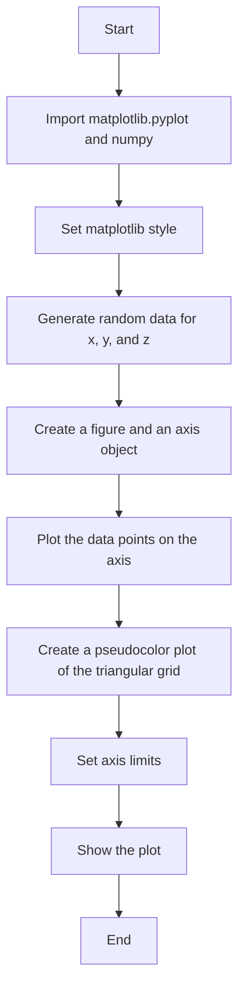
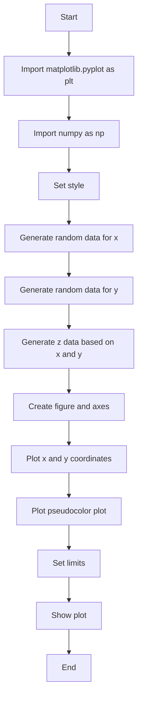

# `matplotlib\galleries\plot_types\unstructured\tripcolor.py` 详细设计文档

This code generates a pseudocolor plot of an unstructured triangular grid using matplotlib and numpy.

## 整体流程



## 类结构

```
matplotlib.pyplot
├── plt
│   ├── style
│   ├── subplots
│   ├── plot
│   └── show
└── numpy
    └── random
```

## 全局变量及字段


### `plt`
    
Module for plotting figures and data.

类型：`module`
    


### `np`
    
Module for numerical operations and array manipulations.

类型：`module`
    


    

## 全局函数及方法


### tripcolor()

创建一个伪彩色图，用于展示一个无结构的三角形网格。

参数：

- `x`：`numpy.ndarray`，x坐标数组，表示网格的x坐标。
- `y`：`numpy.ndarray`，y坐标数组，表示网格的y坐标。
- `z`：`numpy.ndarray`，z坐标数组，表示网格的z坐标。

返回值：`None`，无返回值，函数执行后显示图形。

#### 流程图



#### 带注释源码

```python
"""
==================
tripcolor(x, y, z)
==================
Create a pseudocolor plot of an unstructured triangular grid.

See `~matplotlib.axes.Axes.tripcolor`.
"""
import matplotlib.pyplot as plt
import numpy as np

plt.style.use('_mpl-gallery-nogrid')

# make data:
np.random.seed(1)
x = np.random.uniform(-3, 3, 256)
y = np.random.uniform(-3, 3, 256)
z = (1 - x/2 + x**5 + y**3) * np.exp(-x**2 - y**2)

# plot:
fig, ax = plt.subplots()

ax.plot(x, y, 'o', markersize=2, color='grey')
ax.tripcolor(x, y, z)

ax.set(xlim=(-3, 3), ylim=(-3, 3))

plt.show()
```


## 关键组件


### 张量索引与惰性加载

张量索引与惰性加载是指在处理多维数据时，通过索引操作来访问数据，同时延迟实际数据的加载，以提高效率。

### 反量化支持

反量化支持是指在量化过程中，将量化后的数据恢复到原始精度，以便进行后续处理。

### 量化策略

量化策略是指在量化过程中，选择合适的量化方法，如定点量化、浮点量化等，以优化计算资源消耗和性能。

## 问题及建议


### 已知问题

-   {问题1}：代码中使用了硬编码的随机种子，这可能导致每次运行结果相同。如果需要可重复性，应该保留随机种子；如果需要每次运行都生成不同的结果，应该移除随机种子或使用不同的种子生成策略。
-   {问题2}：代码没有提供任何错误处理机制，如果matplotlib或其他依赖库出现错误，程序可能会崩溃。应该添加异常处理来增强代码的健壮性。
-   {问题3}：代码没有提供任何文档字符串或注释，这不利于其他开发者理解代码的功能和目的。应该添加适当的文档字符串和注释来提高代码的可读性。

### 优化建议

-   {建议1}：为了提高代码的可读性和可维护性，应该添加文档字符串来描述函数`tripcolor`的功能、参数和返回值。
-   {建议2}：应该添加异常处理来捕获可能发生的错误，并给出有用的错误信息，例如`try-except`块来捕获`ImportError`或`ValueError`。
-   {建议3}：可以考虑将绘图代码封装到一个函数中，这样就可以重用代码并在不同的上下文中调用它。
-   {建议4}：如果代码是作为库的一部分，应该考虑使用配置文件或环境变量来设置样式和参数，而不是硬编码在代码中。
-   {建议5}：如果代码需要国际化支持，应该考虑使用本地化库来处理字符串和样式。


## 其它


### 设计目标与约束

- 设计目标：实现一个能够生成伪彩色三角网格图的函数，用于可视化三维数据。
- 约束条件：使用matplotlib库进行绘图，不使用额外的第三方库。

### 错误处理与异常设计

- 错误处理：确保输入参数x、y、z是数值类型，否则抛出TypeError。
- 异常设计：在绘图过程中，如果matplotlib库出现错误，捕获异常并输出错误信息。

### 数据流与状态机

- 数据流：输入参数x、y、z经过计算生成z值，然后使用tripcolor方法绘制图形。
- 状态机：程序从数据生成到绘图，没有复杂的状态转换。

### 外部依赖与接口契约

- 外部依赖：matplotlib库和numpy库。
- 接口契约：tripcolor函数接受三个数值参数，返回一个matplotlib图形对象。

### 测试用例

- 测试用例1：输入合法的x、y、z值，验证是否生成正确的图形。
- 测试用例2：输入非法的x、y、z值，验证是否抛出TypeError。
- 测试用例3：matplotlib库出现异常，验证是否捕获异常并输出错误信息。

### 性能分析

- 性能分析：计算z值和绘图操作的性能，确保在合理的时间内完成。

### 安全性分析

- 安全性分析：确保输入数据类型正确，防止数据注入攻击。

### 维护与扩展

- 维护：定期检查matplotlib库的更新，确保代码兼容性。
- 扩展：考虑添加更多的数据可视化功能，如等高线图、散点图等。


    