# `matplotlib\galleries\plot_types\unstructured\triplot.py` 详细设计文档

This code defines a function `triplot(x, y)` that generates a triangular grid plot using matplotlib and numpy, visualizing a 3D surface defined by a mathematical function.

## 整体流程

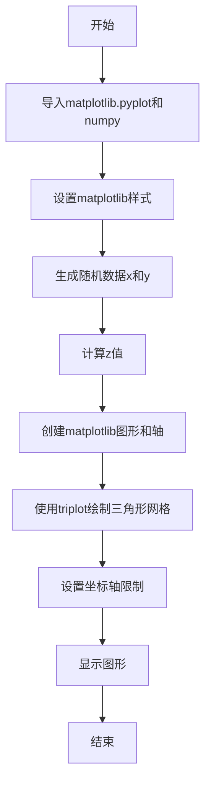

## 类结构

```
triplot(x, y)
```

## 全局变量及字段


### `plt`
    
matplotlib.pyplot module for plotting

类型：`module`
    


### `np`
    
numpy module for numerical operations

类型：`module`
    


### `x`
    
Array of x coordinates for plotting

类型：`numpy.ndarray`
    


### `y`
    
Array of y coordinates for plotting

类型：`numpy.ndarray`
    


### `z`
    
Array of z coordinates calculated from x and y

类型：`numpy.ndarray`
    


### `fig`
    
Figure object for plotting

类型：`matplotlib.figure.Figure`
    


### `ax`
    
Axes object for plotting on the figure

类型：`matplotlib.axes._subplots.AxesSubplot`
    


### `matplotlib.pyplot.fig`
    
Figure object for plotting

类型：`matplotlib.figure.Figure`
    


### `matplotlib.pyplot.ax`
    
Axes object for plotting on the figure

类型：`matplotlib.axes._subplots.AxesSubplot`
    
    

## 全局函数及方法


### triplot(x, y)

绘制一个无结构的三角形网格，以线条和/或标记的形式。

参数：

- `x`：`numpy.ndarray`，x坐标数组，表示三角形的顶点。
- `y`：`numpy.ndarray`，y坐标数组，表示三角形的顶点。

返回值：无，该函数不返回任何值。

#### 流程图

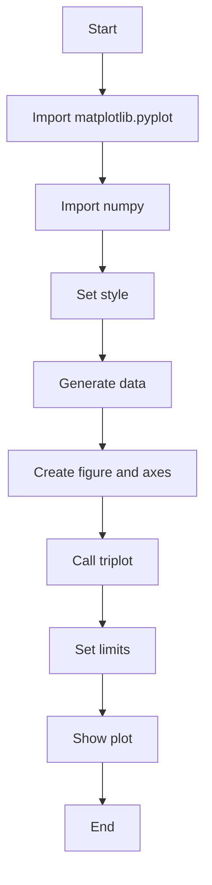

#### 带注释源码

```python
"""
=============
triplot(x, y)
=============
Draw an unstructured triangular grid as lines and/or markers.

See `~matplotlib.axes.Axes.triplot`.
"""
import matplotlib.pyplot as plt
import numpy as np

plt.style.use('_mpl-gallery-nogrid')

# make data:
np.random.seed(1)
x = np.random.uniform(-3, 3, 256)
y = np.random.uniform(-3, 3, 256)
z = (1 - x/2 + x**5 + y**3) * np.exp(-x**2 - y**2)

# plot:
fig, ax = plt.subplots()

# Draw an unstructured triangular grid as lines and/or markers.
ax.triplot(x, y)

ax.set(xlim=(-3, 3), ylim=(-3, 3))

plt.show()
```


### plt.subplots()

该函数用于创建一个matplotlib图形和轴对象。

参数：

- `figsize`：`tuple`，指定图形的大小，默认为(6, 4)。
- `dpi`：`int`，指定图形的分辨率，默认为100。
- `facecolor`：`color`，指定图形的背景颜色，默认为白色。
- `edgecolor`：`color`，指定图形的边缘颜色，默认为白色。
- `frameon`：`bool`，指定是否显示图形的边框，默认为True。
- `num`：`int`，指定要创建的轴的数量，默认为1。
- `gridspec_kw`：`dict`，指定GridSpec的参数，用于创建多个轴。
- `constrained_layout`：`bool`，指定是否启用约束布局，默认为False。

返回值：`Figure`，包含轴对象的图形。

#### 流程图

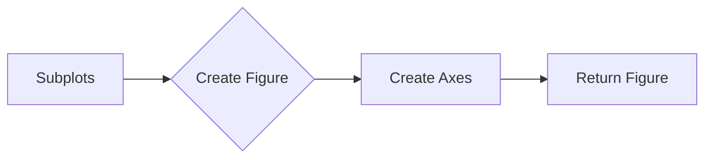

#### 带注释源码

```
import matplotlib.pyplot as plt

fig, ax = plt.subplots()
```


### matplotlib.pyplot.triplot

绘制一个无结构的三角形网格作为线条和/或标记。

参数：

- `x`：`numpy.ndarray`，x坐标数组，表示三角形的顶点。
- `y`：`numpy.ndarray`，y坐标数组，表示三角形的顶点。

返回值：无

#### 流程图

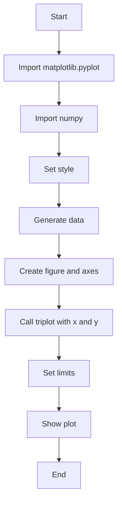

#### 带注释源码

```python
"""
=============
triplot(x, y)
=============
Draw an unstructured triangular grid as lines and/or markers.

See `~matplotlib.axes.Axes.triplot`.
"""
import matplotlib.pyplot as plt
import numpy as np

plt.style.use('_mpl-gallery-nogrid')

# make data:
np.random.seed(1)
x = np.random.uniform(-3, 3, 256)
y = np.random.uniform(-3, 3, 256)
z = (1 - x/2 + x**5 + y**3) * np.exp(-x**2 - y**2)

# plot:
fig, ax = plt.subplots()

# Draw an unstructured triangular grid as lines and/or markers.
ax.triplot(x, y)

ax.set(xlim=(-3, 3), ylim=(-3, 3))

plt.show()
```


### `matplotlib.pyplot.triplot`

`triplot` 方法用于在matplotlib中绘制一个无结构的三角形网格，可以是线或标记。

参数：

- `x`：`numpy.ndarray`，x坐标数组，表示三角形的顶点。
- `y`：`numpy.ndarray`，y坐标数组，表示三角形的顶点。

返回值：`None`，该方法不返回值，它直接在当前的Axes对象上绘制图形。

#### 流程图

```mermaid
graph LR
A[Start] --> B{Call triplot(x, y)}
B --> C[Set x and y limits]
C --> D[Show plot]
D --> E[End]
```

#### 带注释源码

```python
import matplotlib.pyplot as plt
import numpy as np

plt.style.use('_mpl-gallery-nogrid')

# make data:
np.random.seed(1)
x = np.random.uniform(-3, 3, 256)
y = np.random.uniform(-3, 3, 256)
z = (1 - x/2 + x**5 + y**3) * np.exp(-x**2 - y**2)

# plot:
fig, ax = plt.subplots()

# Draw an unstructured triangular grid as lines and/or markers.
ax.triplot(x, y)

# Set x and y limits
ax.set(xlim=(-3, 3), ylim=(-3, 3))

# Show plot
plt.show()
```


### plt.show()

显示当前图形的窗口。

参数：

- 无

返回值：无

#### 流程图


#### 带注释源码

```python
"""
=============
triplot(x, y)
=============
Draw an unstructured triangular grid as lines and/or markers.

See `~matplotlib.axes.Axes.triplot`.
"""
import matplotlib.pyplot as plt
import numpy as np

plt.style.use('_mpl-gallery-nogrid')

# make data:
np.random.seed(1)
x = np.random.uniform(-3, 3, 256)
y = np.random.uniform(-3, 3, 256)
z = (1 - x/2 + x**5 + y**3) * np.exp(-x**2 - y**2)

# plot:
fig, ax = plt.subplots()

ax.triplot(x, y)

ax.set(xlim=(-3, 3), ylim=(-3, 3))

plt.show()
```


### numpy.random.uniform

`numpy.random.uniform(low, high, size=None)` is a function that generates random numbers between a specified range.

参数：

- `low`：`float`，指定随机数的下限。
- `high`：`float`，指定随机数的上限。
- `size`：`int`或`tuple`，指定输出数组的形状，默认为None，表示生成一个随机数。

返回值：`numpy.ndarray`，包含随机数的数组。

#### 流程图

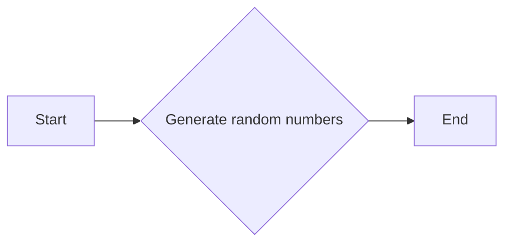

#### 带注释源码

```python
import numpy as np

# Generate random numbers between -3 and 3 with a size of 256
x = np.random.uniform(-3, 3, 256)
```


### numpy.exp

`numpy.exp` 是一个全局函数，用于计算自然指数函数的值。

参数：

- `x`：`numpy.ndarray`，输入数组，计算自然指数函数的值。

返回值：`numpy.ndarray`，输出数组，包含输入数组中每个元素的自然指数。

#### 流程图

```mermaid
graph LR
A[Start] --> B{Is x a numpy.ndarray?}
B -- Yes --> C[Calculate exp(x)]
B -- No --> D[Error: x must be a numpy.ndarray]
C --> E[Return exp(x)]
E --> F[End]
```

#### 带注释源码

```
import numpy as np

def exp(x):
    """
    Calculate the exponential of each element in the input array x.
    
    Parameters:
    x : numpy.ndarray
        Input array to compute the exponential of.
    
    Returns:
    numpy.ndarray
        Output array containing the exponential of each element in x.
    """
    return np.exp(x)
```


### numpy.subtract

`numpy.subtract` 是一个全局函数，用于计算两个数组的元素级减法。

参数：

- `a`：`numpy.ndarray`，第一个输入数组。
- `b`：`numpy.ndarray`，第二个输入数组。

参数描述：`a` 和 `b` 是要进行元素级减法的数组。如果 `a` 和 `b` 的形状不匹配，则它们将被广播以匹配。

返回值类型：`numpy.ndarray`，结果数组。

返回值描述：返回一个新数组，其中包含 `a` 的元素减去 `b` 对应元素的值。

#### 流程图

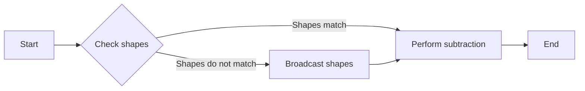

#### 带注释源码

```python
import numpy as np

def subtract(a, b):
    """
    Subtract elements of two arrays element-wise.

    Parameters:
    a : numpy.ndarray
        The first input array.
    b : numpy.ndarray
        The second input array.

    Returns:
    numpy.ndarray
        An array containing the element-wise subtraction of `a` and `b`.
    """
    return a - b
```


### numpy.power

`numpy.power` 是一个全局函数，用于计算数组中每个元素的幂。

参数：

- `x`：`numpy.ndarray`，输入数组。
- `y`：`numpy.ndarray` 或 `int`，幂指数。

参数描述：

- `x`：输入数组，其元素将被提升到幂指数 `y`。
- `y`：幂指数，可以是数组或整数。如果 `y` 是数组，则每个元素都是 `x` 中相应元素的指数。

返回值类型：`numpy.ndarray`

返回值描述：返回一个新数组，其中包含 `x` 中每个元素提升到 `y` 指数的值。

#### 流程图

```mermaid
graph LR
A[Start] --> B{Is y an array?}
B -- Yes --> C[For each element in x, calculate x[i]^y[i]]
B -- No --> D[Calculate x^y]
D --> E[End]
```

#### 带注释源码

```python
import numpy as np

def numpy_power(x, y):
    """
    Calculate the power of each element in the array x raised to the exponent y.
    
    Parameters:
    x : numpy.ndarray
        Input array whose elements are to be raised to the power y.
    y : numpy.ndarray or int
        Exponent to which each element in x is raised.
    
    Returns:
    numpy.ndarray
        An array containing the result of raising each element in x to the power y.
    """
    return np.power(x, y)
```


### `ax.triplot(x, y)`

`triplot` 方法用于在matplotlib的轴对象上绘制一个不规则的三角网格，可以是线或标记。

参数：

- `x`：`numpy.ndarray`，x坐标数组，表示三角形的顶点在x轴上的位置。
- `y`：`numpy.ndarray`，y坐标数组，表示三角形的顶点在y轴上的位置。

返回值：`None`，该方法不返回值，它直接在传入的轴对象上绘制图形。

#### 流程图

```mermaid
graph LR
A[Start] --> B{Call ax.triplot(x, y)}
B --> C[End]
```

#### 带注释源码

```
ax.triplot(x, y)  # 绘制三角网格
```


### `matplotlib.pyplot.subplots()`

`subplots` 函数用于创建一个图形和一个轴对象。

参数：

- 无

返回值：`fig`：`matplotlib.figure.Figure`，图形对象。
- `ax`：`matplotlib.axes.Axes`，轴对象。

#### 流程图

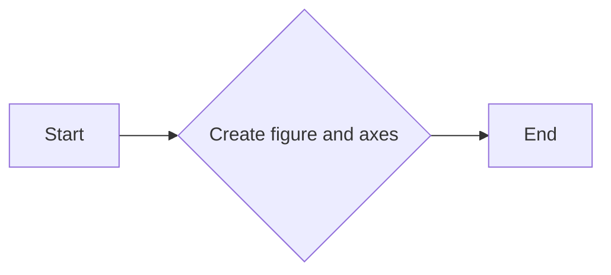

#### 带注释源码

```
fig, ax = plt.subplots()  # 创建图形和轴对象
```


### `plt.show()`

`show` 函数用于显示图形。

参数：

- 无

返回值：无

#### 流程图

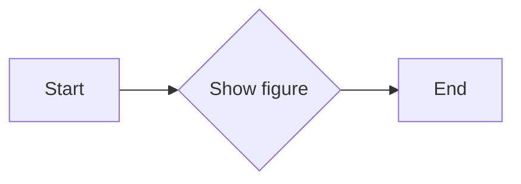

#### 带注释源码

```
plt.show()  # 显示图形
```


### `np.random.uniform(-3, 3, 256)`

`uniform` 函数用于生成一个指定范围内的均匀分布的随机数组。

参数：

- `low`：`float`，随机数的最小值。
- `high`：`float`，随机数的最大值。
- `size`：`int`或`tuple`，输出数组的形状。

返回值：`numpy.ndarray`，生成的随机数组。

#### 流程图

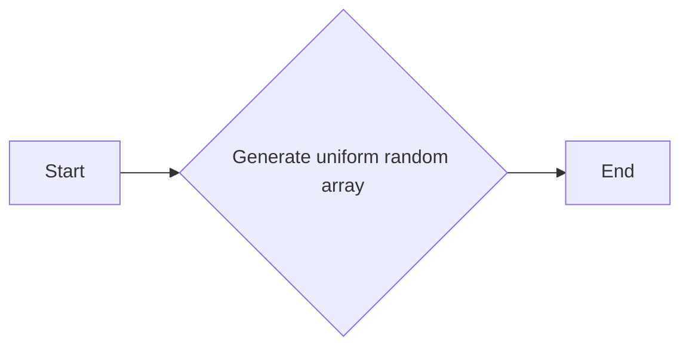

#### 带注释源码

```
x = np.random.uniform(-3, 3, 256)  # 生成x坐标的随机数组
y = np.random.uniform(-3, 3, 256)  # 生成y坐标的随机数组
```


### `np.exp(-x**2 - y**2)`

`exp` 函数用于计算自然指数。

参数：

- `x`：`numpy.ndarray`，输入数组。

返回值：`numpy.ndarray`，计算后的自然指数数组。

#### 流程图

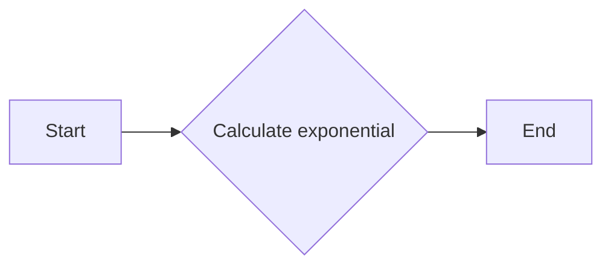

#### 带注释源码

```
z = (1 - x/2 + x**5 + y**3) * np.exp(-x**2 - y**2)  # 计算z坐标
```


### `ax.set(xlim=(-3, 3), ylim=(-3, 3))`

`set` 方法用于设置轴对象的限制。

参数：

- `xlim`：`tuple`，x轴的显示范围。
- `ylim`：`tuple`，y轴的显示范围。

返回值：无

#### 流程图

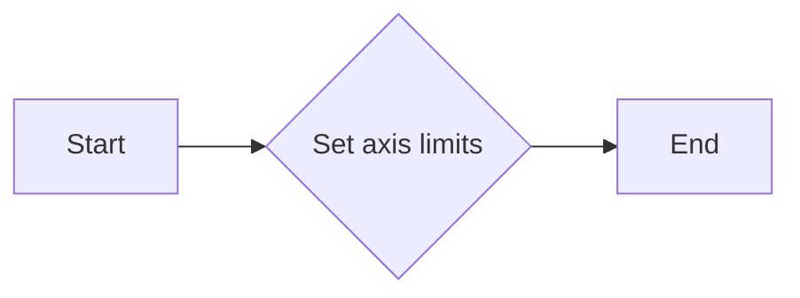

#### 带注释源码

```
ax.set(xlim=(-3, 3), ylim=(-3, 3))  # 设置轴的显示范围
```


### `plt.style.use('_mpl-gallery-nogrid')`

`use` 函数用于设置matplotlib的样式。

参数：

- `style`：`str`，要使用的样式名称。

返回值：无

#### 流程图

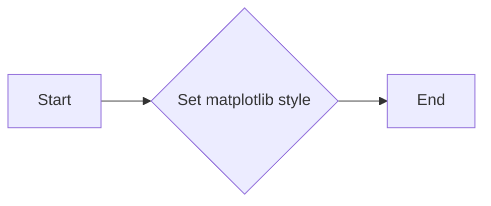

#### 带注释源码

```
plt.style.use('_mpl-gallery-nogrid')  # 设置matplotlib的样式
```


### 关键组件信息

- `matplotlib.pyplot`：用于创建图形和轴对象。
- `numpy`：用于数学计算和数组操作。
- `plt`：matplotlib的pyplot模块的别名。
- `np`：numpy模块的别名。


### 潜在的技术债务或优化空间

- 代码中使用了硬编码的样式名称，这可能会在未来的版本中变得过时。
- 可以考虑使用更复杂的函数来生成数据，以提供更多的灵活性。
- 可以添加更多的注释来提高代码的可读性。


### 设计目标与约束

- 设计目标是创建一个简单的三角网格绘制示例。
- 约束是使用matplotlib和numpy库。


### 错误处理与异常设计

- 代码中没有显式的错误处理或异常设计，因为它是用于演示目的的。


### 数据流与状态机

- 数据流从随机数生成到图形绘制。
- 状态机不适用，因为代码没有循环或状态转换。


### 外部依赖与接口契约

- 代码依赖于matplotlib和numpy库。
- 接口契约由matplotlib和numpy库提供。

## 关键组件


### 张量索引与惰性加载

张量索引与惰性加载是指在处理大型数据集时，只对需要的数据进行索引和加载，以减少内存消耗和提高效率。

### 反量化支持

反量化支持是指代码能够处理非整数类型的量化数据，例如浮点数，以便在量化过程中进行更精确的计算。

### 量化策略

量化策略是指将高精度浮点数转换为低精度整数的过程，以减少模型大小和提高计算效率。


## 问题及建议


### 已知问题

-   {问题1}：代码中使用了硬编码的绘图风格（`plt.style.use('_mpl-gallery-nogrid')`），这可能导致在不同环境中绘图风格不一致。
-   {问题2}：代码没有提供任何错误处理机制，如果绘图过程中出现异常（例如，matplotlib库未安装），程序将无法正常运行并可能崩溃。
-   {问题3}：代码没有提供任何用户输入或配置选项，所有参数都是硬编码的，这限制了代码的灵活性和可重用性。

### 优化建议

-   {建议1}：移除硬编码的绘图风格，改为允许用户自定义或通过配置文件设置。
-   {建议2}：添加异常处理机制，确保在出现错误时程序能够优雅地处理异常，并提供有用的错误信息。
-   {建议3}：增加用户输入或配置选项，允许用户指定数据范围、绘图风格、标记类型等，提高代码的灵活性和可重用性。
-   {建议4}：考虑将绘图功能封装成一个类或函数，以便于在其他程序中重用。
-   {建议5}：如果数据集很大，可以考虑使用更高效的绘图方法，例如使用`matplotlib`的`scatter`方法而不是`triplot`，以减少内存消耗和提高绘图速度。


## 其它


### 设计目标与约束

- 设计目标：实现一个能够绘制无结构三角网格的函数，支持线条和/或标记的绘制。
- 约束条件：使用matplotlib库进行绘图，不使用额外的绘图库。

### 错误处理与异常设计

- 错误处理：函数应能够处理输入数据类型错误的情况，例如输入的x和y不是数组类型。
- 异常设计：应捕获并处理matplotlib绘图过程中可能出现的异常。

### 数据流与状态机

- 数据流：输入数据x和y通过函数处理，生成z值，然后使用matplotlib绘制三角网格。
- 状态机：函数从输入数据开始，经过数据处理，最终到达绘图状态。

### 外部依赖与接口契约

- 外部依赖：matplotlib库和numpy库。
- 接口契约：函数triplot接受两个numpy数组x和y作为输入，返回一个matplotlib图形对象。

### 测试用例

- 测试用例1：输入合法的x和y数组，验证函数能否正确绘制三角网格。
- 测试用例2：输入非法的x或y数组，验证函数是否抛出异常。

### 性能考量

- 性能考量：函数应能够高效处理大量数据，并快速绘制图形。

### 安全性考量

- 安全性考量：确保函数在处理输入数据时不会导致内存泄漏或程序崩溃。

### 维护与扩展性

- 维护：代码应具有良好的可读性和可维护性，便于后续修改和扩展。
- 扩展性：函数应设计为易于添加新的绘图选项，如不同的标记样式或线条样式。

### 代码风格与规范

- 代码风格：遵循PEP 8编码规范，确保代码清晰、易读。
- 规范：使用适当的命名约定和注释，提高代码的可理解性。


    