# `matplotlib\galleries\tutorials\artists.py` 详细设计文档

This code demonstrates the use of Matplotlib's Artist objects to render various graphical elements on a canvas, including lines, histograms, and text annotations. It also covers the customization of Artists' properties and the structure of Matplotlib's object hierarchy.

## 整体流程

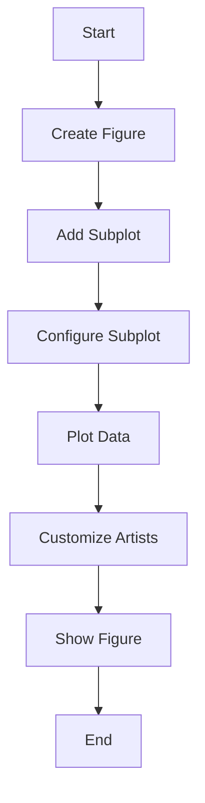

## 类结构

```
Figure (Top-Level Container)
├── Axes (Plotting Area)
│   ├── Lines (Line Plots)
│   ├── Patches (Shapes)
│   ├── Texts (Annotations)
│   ├── Images (Image Data)
│   └── Legends (Legends)
│       └── Legend (Legend Entries)
└── Artists (Customizable Elements)
```

## 全局变量及字段


### `patch`
    
The rectangle that defines the background of the figure.

类型：`matplotlib.patches.Rectangle`
    


### `axes`
    
A list of all the Axes instances in the figure.

类型：`list of matplotlib.axes.Axes`
    


### `images`
    
A list of all the image patches in the figure.

类型：`list of matplotlib.image.AxesImage`
    


### `legends`
    
A list of all the legend instances in the figure.

类型：`list of matplotlib.legend.Legend`
    


### `lines`
    
A list of all the line instances in the figure.

类型：`list of matplotlib.lines.Line2D`
    


### `patches`
    
A list of all the patch instances in the figure.

类型：`list of matplotlib.patches.Patch`
    


### `texts`
    
A list of all the text instances in the figure.

类型：`list of matplotlib.text.Text`
    


### `matplotlib.figure.Figure.patch`
    
The rectangle that defines the background of the figure.

类型：`matplotlib.patches.Rectangle`
    


### `matplotlib.figure.Figure.axes`
    
A list of all the Axes instances in the figure.

类型：`list of matplotlib.axes.Axes`
    


### `matplotlib.figure.Figure.images`
    
A list of all the image patches in the figure.

类型：`list of matplotlib.image.AxesImage`
    


### `matplotlib.figure.Figure.legends`
    
A list of all the legend instances in the figure.

类型：`list of matplotlib.legend.Legend`
    


### `matplotlib.figure.Figure.lines`
    
A list of all the line instances in the figure.

类型：`list of matplotlib.lines.Line2D`
    


### `matplotlib.figure.Figure.patches`
    
A list of all the patch instances in the figure.

类型：`list of matplotlib.patches.Patch`
    


### `matplotlib.figure.Figure.texts`
    
A list of all the text instances in the figure.

类型：`list of matplotlib.text.Text`
    
    

## 全局函数及方法


### matplotlib.pyplot.subplots

创建一个子图或一组子图。

#### 描述

`subplots` 函数用于创建一个子图或一组子图。它返回一个 `Figure` 实例和一个或多个 `Axes` 实例。`Figure` 实例包含整个绘图区域，而 `Axes` 实例包含绘图区域内的轴和轴上的图形元素。

#### 参数

- `nrows`：整数，指定子图行数。
- `ncols`：整数，指定子图列数。
- `sharex`：布尔值，指定是否共享 x 轴。
- `sharey`：布尔值，指定是否共享 y 轴。
- `fig`：`Figure` 实例，指定绘图区域。
- `gridspec_kw`：字典，指定 `GridSpec` 的关键字参数。
- `constrained_layout`：布尔值，指定是否启用约束布局。

#### 返回值

- `fig`：`Figure` 实例，包含子图。
- `axes`：`Axes` 实例数组，包含子图。

#### 流程图

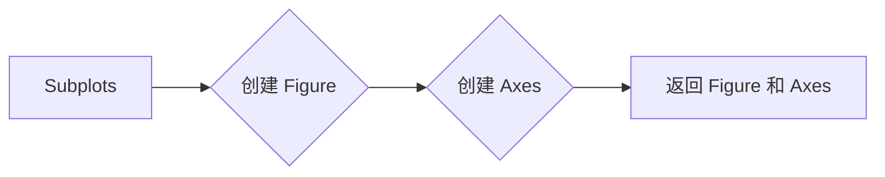

#### 带注释源码

```python
import matplotlib.pyplot as plt

fig, axes = plt.subplots(nrows=2, ncols=1, sharex=True, sharey=True)

# 在第一个子图上绘制图形
axes[0].plot([1, 2, 3], [1, 4, 9])

# 在第二个子图上绘制图形
axes[1].plot([1, 2, 3], [1, 2, 3])

plt.show()
```


### Figure.add_subplot

创建一个子图（Axes）并将其添加到Figure中。

描述：

该函数用于创建一个子图（Axes）并将其添加到指定的Figure中。子图是Figure的一部分，用于绘制图形和图表。

参数：

- `nrows`：`int`，子图所在的行数。
- `ncols`：`int`，子图所在的列数。
- `index`：`int`，子图在行和列中的索引位置。

返回值：`Axes`，创建的子图对象。

#### 流程图

```mermaid
graph LR
A[Figure] --> B{add_subplot(2, 1, 1)}
B --> C[Axes]
```

#### 带注释源码

```python
def add_subplot(self, nrows, ncols, index=1):
    """
    Create an Axes instance and add it to the Figure.

    Parameters
    ----------
    nrows : int
        Number of rows of subplots.
    ncols : int
        Number of columns of subplots.
    index : int, optional
        Index of the subplot in the grid.

    Returns
    -------
    Axes
        The created Axes instance.
    """
    # Create an Axes instance
    ax = self._create_axes(nrows, ncols, index)

    # Add the Axes instance to the Figure
    self.axes.append(ax)

    # Set the current Axes to the newly created one
    self._set_current_axes(ax)

    return ax
```


### Figure.add_axes

`Figure.add_axes` 方法用于在 Matplotlib 图形中添加一个轴（Axes）实例。

参数：

- `loc`：`tuple`，指定轴的位置和大小，格式为 `[left, bottom, width, height]`，值范围为 0 到 1，表示相对于整个图形的相对坐标。
- `ncol`：`int`，指定轴所在的列数。
- `nrows`：`int`，指定轴所在的行数。
- `sharex`：`Axes` 或 `None`，指定与该轴共享 x 轴的轴。
- `sharey`：`Axes` 或 `None`，指定与该轴共享 y 轴的轴。
- `frameon`：`bool`，指定是否显示轴框。
- `adjustable`：`str`，指定轴的调整方式，可选值为 'box' 或 'datalim'。

返回值：`Axes`，返回创建的轴实例。

#### 流程图

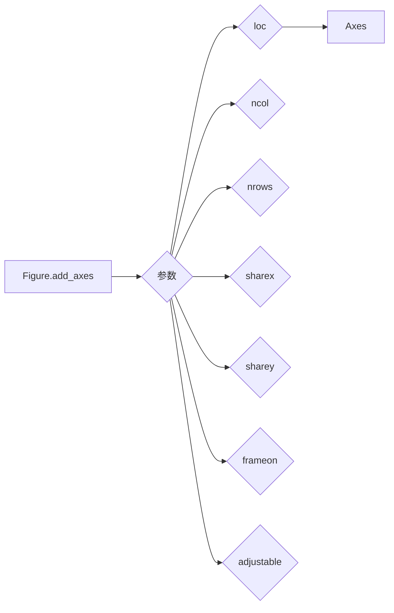

#### 带注释源码

```python
def add_axes(self, loc=None, ncol=1, nrows=1, sharex=None, sharey=None, frameon=True, adjustable='box'):
    """
    Add an Axes to this Figure.

    Parameters
    ----------
    loc : tuple, optional
        The location and size of the axes in figure coordinates, given as a 4-tuple
        `[left, bottom, width, height]`. The values are normalized to the range [0, 1].
    ncol : int, optional
        The number of columns the axes will span.
    nrows : int, optional
        The number of rows the axes will span.
    sharex : Axes or None, optional
        The x-axis to share with this axes. If None, a new x-axis is created.
    sharey : Axes or None, optional
        The y-axis to share with this axes. If None, a new y-axis is created.
    frameon : bool, optional
        If True, draw the frame around the axes.
    adjustable : str, optional
        The adjustable argument controls the size of the axes. It can be 'box' or 'datalim'.
        'box' adjusts the size of the axes by changing the figure size. 'datalim' adjusts the
        size of the axes by changing the data limits.

    Returns
    -------
    Axes
        The newly created axes.
    """
    # ... (省略部分代码)
    return ax
```


### Figure.canvas

`Figure.canvas` 是一个属性，它返回与 `Figure` 实例关联的 `FigureCanvas` 对象。

#### 描述

`Figure.canvas` 属性用于获取与 `Figure` 实例关联的 `FigureCanvas` 对象。`FigureCanvas` 是一个用于绘制 `Figure` 实例内容的容器。

#### 参数

无

#### 返回值

- 返回值类型：`matplotlib.backends.backend_base.FigureCanvasBase` 的子类
- 返回值描述：与 `Figure` 实例关联的 `FigureCanvas` 对象，用于绘制 `Figure` 实例的内容。

#### 流程图

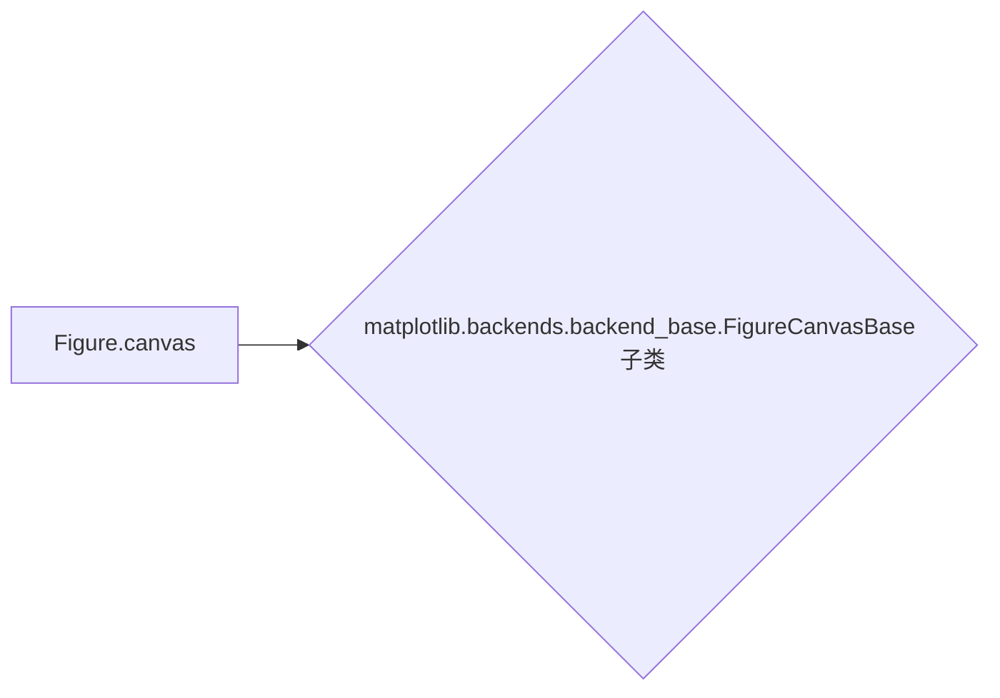

#### 带注释源码

```python
import matplotlib.pyplot as plt

fig = plt.figure()
canvas = fig.canvas  # 获取与 Figure 实例关联的 FigureCanvas 对象
```


### plt.show()

显示图形。

参数：

- 无

返回值：无

#### 流程图

```mermaid
graph LR
A[开始] --> B{调用plt.show()}
B --> C[结束]
```

#### 带注释源码

```python
import matplotlib.pyplot as plt

# ... (之前的绘图代码)

plt.show()  # 显示图形
```


### `Axes.plot`

`Axes.plot` 方法用于在 Matplotlib 的 Axes 对象上绘制二维线图。

参数：

- `x`：`numpy.ndarray` 或 `sequence`，x 轴数据。
- `y`：`numpy.ndarray` 或 `sequence`，y 轴数据。
- `color`：`str` 或 `color`，线条颜色。
- `lw`：`float`，线条宽度。
- ...

返回值：`Line2D`，绘制的线条对象。

#### 流程图

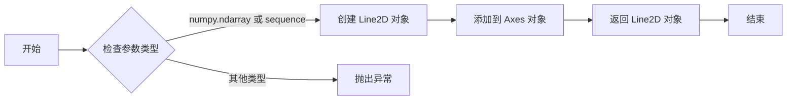

#### 带注释源码

```python
def plot(self, x, y=None, color=None, linewidth=None, linestyle=None, marker=None, markersize=None, markerfacecolor=None, markeredgecolor=None, markeredgewidth=None, markerlinecolor=None, label=None, clip_on=True, **kwargs):
    """
    Plot a line or lines on the Axes.

    Parameters
    ----------
    x : numpy.ndarray or sequence
        x-axis data.
    y : numpy.ndarray or sequence, optional
        y-axis data.
    color : str or color, optional
        Line color.
    linewidth : float, optional
        Line width.
    linestyle : str, optional
        Line style.
    marker : str, optional
        Marker style.
    markersize : float, optional
        Marker size.
    markerfacecolor : str or color, optional
        Marker face color.
    markeredgecolor : str or color, optional
        Marker edge color.
    markeredgewidth : float, optional
        Marker edge width.
    markerlinecolor : str or color, optional
        Marker line color.
    label : str, optional
        Line label.
    clip_on : bool, optional
        Whether to clip the line to the axes.
    **kwargs : dict
        Additional keyword arguments to pass to Line2D constructor.

    Returns
    -------
    Line2D
        Line2D object representing the line plot.
    """
    # 检查参数类型
    if not isinstance(x, (numpy.ndarray, sequence)):
        raise TypeError("x must be a numpy.ndarray or sequence")
    if y is not None and not isinstance(y, (numpy.ndarray, sequence)):
        raise TypeError("y must be a numpy.ndarray or sequence")

    # 创建 Line2D 对象
    line = Line2D(x, y, color=color, linewidth=linewidth, linestyle=linestyle, marker=marker, markersize=markersize, markerfacecolor=markerfacecolor, markeredgecolor=markeredgecolor, markeredgewidth=markeredgewidth, markerlinecolor=markerlinecolor, label=label, clip_on=clip_on, **kwargs)

    # 添加到 Axes 对象
    self.add_line(line)

    # 返回 Line2D 对象
    return line
```


### Axes.scatter

`Axes.scatter` 方法用于在二维坐标系中绘制散点图。

参数：

- `s`：`int` 或 `array_like`，散点的大小。如果为 `int`，则所有散点大小相同；如果为 `array_like`，则每个散点的大小由数组中的值确定。
- `c`：`color` 或 `sequence`，散点的颜色。如果为 `color`，则所有散点颜色相同；如果为 `sequence`，则每个散点的颜色由序列中的值确定。
- `cmap`：`colormap`，颜色映射。默认为 `'viridis'`。
- `vmin` 和 `vmax`：`float`，颜色映射的最小值和最大值。
- `alpha`：`float`，散点的透明度。
- `edgecolors`：`color` 或 `sequence`，散点边缘的颜色。
- `linewidths`：`float` 或 `sequence`，散点边缘的宽度。
- ` marker `：` marker `，散点的标记形状。
- ` markersize `：` float `，散点的标记大小。
- ` markeredgecolor `：` color `，散点标记边缘的颜色。
- ` markeredgewidth `：` float `，散点标记边缘的宽度。
- ` markerfacecolor `：` color `，散点标记的填充颜色。
- ` label `：` str `，散点的标签。
- ` picker `：` bool `，是否启用拾取功能。
- ` zorder `：` float `，散点的绘制顺序。

返回值：`PolyCollection`，散点图的集合。

#### 流程图

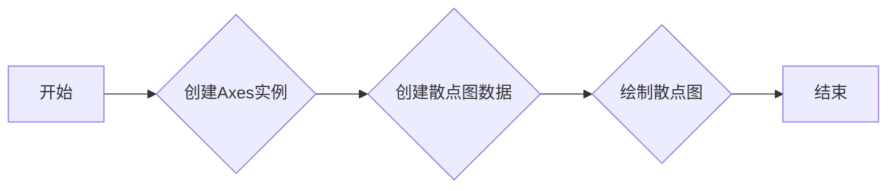

#### 带注释源码

```python
import matplotlib.pyplot as plt
import numpy as np

fig, ax = plt.subplots()
x = np.random.rand(10)
y = np.random.rand(10)
ax.scatter(x, y, s=100, c='red', cmap='viridis', alpha=0.5)
plt.show()
```


### Axes.bar

`Axes.bar` 方法用于在 Matplotlib 的 Axes 对象上绘制条形图。

参数：

- `x`：`numpy.ndarray` 或 `list`，条形图的 x 坐标。
- `y`：`numpy.ndarray` 或 `list`，条形图的 y 坐标。
- `width`：`float`，条形图的宽度。
- `height`：`float`，条形图的高度。
- `bottom`：`float`，条形图的底部位置。
- `align`：`str`，条形图的水平对齐方式，默认为 'center'。

返回值：`BarContainer` 对象，包含绘制的条形图。

#### 流程图

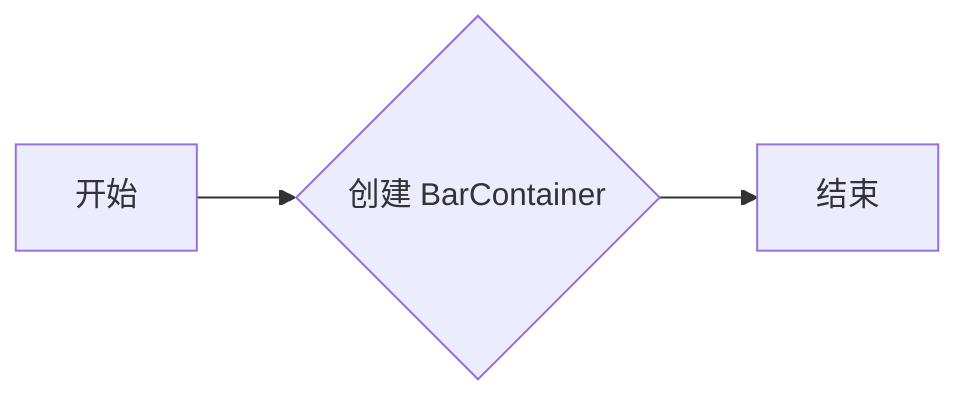

#### 带注释源码

```python
import matplotlib.pyplot as plt
import numpy as np

fig, ax = plt.subplots()

# 创建条形图数据
x = np.arange(5)
y = np.random.rand(5)
width = 0.5
height = y
bottom = 0

# 绘制条形图
bars = ax.bar(x, height, width=width, bottom=bottom)

# 显示图形
plt.show()
```


### `Axes.errorbar`

`Axes.errorbar` 方法用于在 Matplotlib 的 Axes 对象上绘制带有误差线的线图。

参数：

- `x`：`numpy.ndarray` 或 `sequence`，x 轴数据点。
- `y`：`numpy.ndarray` 或 `sequence`，y 轴数据点。
- `yerr`：`numpy.ndarray` 或 `sequence`，y 轴误差线数据点。
- `xerr`：`numpy.ndarray` 或 `sequence`，x 轴误差线数据点。
- `fmt`：`str`，用于指定线型、颜色和标记的字符串。
- `ecolor`：`color`，误差线的颜色。
- `elinewidth`：`float`，误差线的宽度。
- `capsize`：`float`，误差线端点的长度。
- `capthick`：`float`，误差线端点的宽度。
- `alpha`：`float`，透明度。
- `zorder`：`int`，绘制顺序。

返回值：`Line2D`，绘制的线对象。

#### 流程图

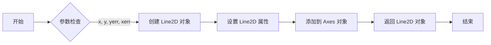

#### 带注释源码

```python
def errorbar(self, x, y, yerr=None, xerr=None, fmt=None, ecolor=None, elinewidth=None, capsize=None, capthick=None, alpha=None, zorder=None):
    """
    Create errorbar plot.

    Parameters
    ----------
    x : array_like
        x data.
    y : array_like
        y data.
    yerr : array_like, optional
        y errorbar data.
    xerr : array_like, optional
        x errorbar data.
    fmt : str, optional
        Line style, color, and marker.
    ecolor : color, optional
        Errorbar color.
    elinewidth : float, optional
        Errorbar line width.
    capsize : float, optional
        Size of the caps on the errorbars.
    capthick : float, optional
        Width of the caps on the errorbars.
    alpha : float, optional
        Transparency of the plot elements.
    zorder : int, optional
        Drawing order of the plot elements.

    Returns
    -------
    line : Line2D
        Line2D object representing the plot.
    """
    # 创建 Line2D 对象
    line = self.plot(x, y, fmt, ecolor, elinewidth, capsize, capthick, alpha, zorder)[0]

    # 设置 Line2D 属性
    if yerr is not None:
        line.set_ydata(y + yerr)
    if xerr is not None:
        line.set_xdata(x + xerr)

    # 添加到 Axes 对象
    self.lines.append(line)

    # 返回 Line2D 对象
    return line
```


### Axes.fill

`Axes.fill` 方法用于在 `Axes` 对象上绘制填充区域。

参数：

- `x`：`numpy.ndarray` 或 `list`，x 坐标值。
- `y`：`numpy.ndarray` 或 `list`，y 坐标值。
- `color`：`str` 或 `tuple`，填充颜色。
- `alpha`：`float`，填充透明度。
- `zorder`：`int`，绘制顺序。

返回值：`Polygon` 实例，表示填充区域。

#### 流程图

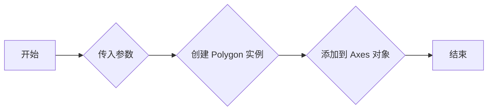

#### 带注释源码

```python
import matplotlib.pyplot as plt
import numpy as np

fig, ax = plt.subplots()

# 创建 x 和 y 坐标值
x = np.linspace(0, 2*np.pi, 100)
y = np.sin(x)

# 绘制填充区域
polygon = ax.fill(x, y, color='blue', alpha=0.5)

plt.show()
```


### Axes.hist

`Axes.hist` 方法用于在 Matplotlib 的 Axes 对象上绘制直方图。

参数：

- `data`：`numpy.ndarray` 或 `pandas.Series`，要绘制直方图的数据。
- `bins`：`int` 或 `sequence`，直方图的条形数或条形宽度。
- `facecolor`：`color`，条形的填充颜色。
- `edgecolor`：`color`，条形的边缘颜色。
- `alpha`：`float`，条形的透明度。
- `orientation`：`{'horizontal', 'vertical'}`，直方图的排列方向。

返回值：

- `n, bins, patches`：直方图的计数、条形边界和条形对象。

#### 流程图

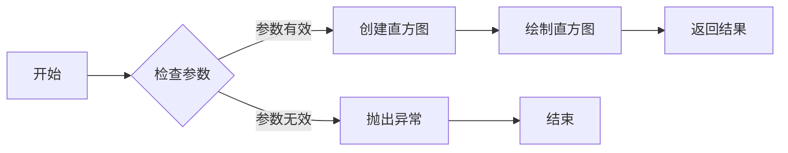

#### 带注释源码

```python
def hist(self, data, bins=10, facecolor='blue', edgecolor='black', alpha=1.0, orientation='vertical'):
    """
    Create a histogram on the Axes.

    Parameters
    ----------
    data : numpy.ndarray or pandas.Series
        The data to plot.
    bins : int or sequence
        The number of bins or the bin edges.
    facecolor : color
        The color of the bars.
    edgecolor : color
        The color of the edges of the bars.
    alpha : float
        The transparency of the bars.
    orientation : {'horizontal', 'vertical'}
        The orientation of the histogram.

    Returns
    -------
    n, bins, patches : tuple
        The histogram counts, bin edges, and bar patches.
    """
    # 检查参数
    if not isinstance(data, (np.ndarray, pd.Series)):
        raise TypeError("data must be a numpy.ndarray or pandas.Series")
    if not isinstance(bins, (int, sequence)):
        raise TypeError("bins must be an int or a sequence")
    if orientation not in ['horizontal', 'vertical']:
        raise ValueError("orientation must be 'horizontal' or 'vertical'")

    # 创建直方图
    n, bins, patches = self._hist(data, bins, facecolor, edgecolor, alpha, orientation)

    # 绘制直方图
    self.axvspan(bins[0], bins[-1], facecolor=facecolor, edgecolor=edgecolor, alpha=alpha)
    self.axhspan(bins[0], bins[-1], facecolor=facecolor, edgecolor=edgecolor, alpha=alpha)

    # 返回结果
    return n, bins, patches
```


### Axes.imshow

`Axes.imshow` 是 Matplotlib 库中 `Axes` 类的一个方法，用于在 `Axes` 对象上显示图像数据。

参数：

- `data`：`numpy.ndarray` 或 `matplotlib.image.AxesImage`，图像数据或图像对象。
- `interpolation`：`str`，插值方法，默认为 `'nearest'`。
- `origin`：`str`，图像的起始位置，默认为 `'upper'`。
- `cmap`：`str` 或 `Colormap`，颜色映射，默认为 `'viridis'`。
- `vmin`：`float`，最小值，默认为 `None`。
- `vmax`：`float`，最大值，默认为 `None`。
- `aspect`：`str` 或 `float`，图像的纵横比，默认为 `'auto'`。
- `extent`：`tuple` 或 `None`，图像的边界，默认为 `None`。
- `shrink`：`float`，图像缩放比例，默认为 `None`。
- `clip`：`bool`，是否裁剪图像，默认为 `True`。
- `resample`：`bool`，是否重新采样图像，默认为 `False`。

返回值：`AxesImage`，图像对象。

#### 流程图

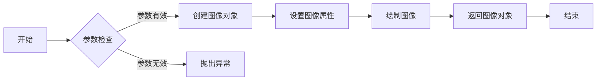

#### 带注释源码

```python
def imshow(self, data, interpolation='nearest', origin='upper', cmap=None, 
           vmin=None, vmax=None, aspect='auto', extent=None, shrink=None, 
           clip=True, resample=False):
    """
    Display an image on the Axes.

    Parameters
    ----------
    data : numpy.ndarray or matplotlib.image.AxesImage
        Image data or image object.
    interpolation : str
        Interpolation method, default is 'nearest'.
    origin : str
        Image origin, default is 'upper'.
    cmap : str or Colormap
        Color map, default is 'viridis'.
    vmin : float
        Minimum value, default is None.
    vmax : float
        Maximum value, default is None.
    aspect : str or float
        Image aspect ratio, default is 'auto'.
    extent : tuple or None
        Image boundary, default is None.
    shrink : float
        Image shrink ratio, default is None.
    clip : bool
        Whether to clip image, default is True.
    resample : bool
        Whether to resample image, default is False.

    Returns
    -------
    AxesImage
        Image object.
    """
    # 参数检查
    if not isinstance(data, (numpy.ndarray, matplotlib.image.AxesImage)):
        raise TypeError("data must be a numpy.ndarray or matplotlib.image.AxesImage")
    
    # 创建图像对象
    image = self._get_image(data, interpolation, origin, cmap, vmin, vmax, aspect, extent, shrink, clip, resample)
    
    # 设置图像属性
    image.set_clim(vmin, vmax)
    image.set_cmap(cmap)
    
    # 绘制图像
    self.canvas.draw_idle()
    
    # 返回图像对象
    return image
```


### Axes.legend

`Axes.legend` 方法用于在 Matplotlib 的 Axes 对象上添加图例。

参数：

- `loc`：`int` 或 `str`，指定图例的位置。例如，`'upper right'` 或 `9`。
- `bbox_to_anchor`：`tuple`，指定图例的锚点位置。
- `ncol`：`int`，指定图例的列数。
- `mode`：`str`，指定图例的显示模式。
- `title`：`str` 或 `None`，指定图例的标题。
- `frameon`：`bool`，指定是否显示图例的边框。
- `fancybox`：`bool`，指定是否显示图例的边框。
- `shadow`：`bool`，指定是否显示图例的阴影。
- `handlelength`：`float`，指定图例手柄的长度。
- `labelspacing`：`float`，指定图例标签之间的间距。
- `borderaxespad`：`float`，指定图例边框与坐标轴之间的间距。
- `columnspacing`：`float`，指定图例列之间的间距。
- `handletextpad`：`float`，指定图例手柄与标签之间的间距。

返回值：`Legend` 对象，表示添加到 Axes 的图例。

#### 流程图

```mermaid
graph LR
A[开始] --> B{调用Axes.legend()}
B --> C{指定参数}
C --> D[创建Legend对象]
D --> E[添加到Axes]
E --> F[结束]
```

#### 带注释源码

```python
import matplotlib.pyplot as plt
import numpy as np

fig, ax = plt.subplots()
line1, = ax.plot([1, 2, 3], [1, 4, 9], label='Line 1')
line2, = ax.plot([1, 2, 3], [1, 2, 3], label='Line 2')

# 添加图例
legend = ax.legend()

plt.show()
```


### `Axes.annotate`

`Axes.annotate` 方法用于在 Matplotlib 的 `Axes` 对象上添加文本注释。

参数：

- `s`：`str`，要添加的注释文本。
- `xy`：`tuple` 或 `list`，指定注释文本的位置，格式为 `(x, y)`。
- `xytext`：`tuple` 或 `list`，指定注释文本相对于 `xy` 的偏移量，格式为 `(dx, dy)`。
- `textcoords`：`str`，指定 `xytext` 的坐标系统，可以是 'offset points' 或 'figure points'。
- `arrowprops`：`dict`，指定箭头的属性，如颜色、宽度等。
- ` annotationprops`：`dict`，指定注释文本的属性，如颜色、字体等。

返回值：`Annotation` 实例，表示添加的注释。

#### 流程图

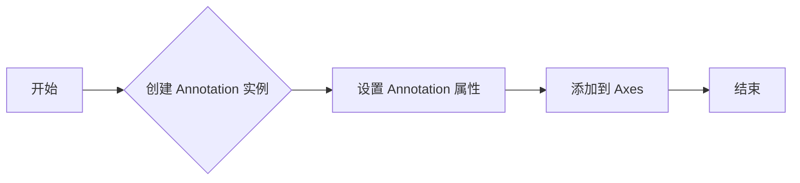

#### 带注释源码

```python
import matplotlib.pyplot as plt
import numpy as np

fig, ax = plt.subplots()
t = np.arange(0.0, 1.0, 0.01)
s = np.sin(2*np.pi*t)
line, = ax.plot(t, s, color='blue', lw=2)

# 添加注释
ax.annotate('sin wave', xy=(0.5, 0.5), xytext=(0, 20),
            textcoords='offset points', arrowprops=dict(facecolor='black', shrink=0.05))

plt.show()
``` 


### Axes.tick_params

`Axes.tick_params` 方法用于配置轴的刻度、刻度标签和轴标签的属性。

参数：

- `axis`：`{'both', 'x', 'y'}`，指定要配置的轴，'both' 表示同时配置 x 轴和 y 轴，'x' 表示仅配置 x 轴，'y' 表示仅配置 y 轴。
- `which`：`{'both', 'major', 'minor'}`，指定要配置的刻度或刻度标签，'both' 表示同时配置刻度和刻度标签，'major' 表示仅配置主刻度，'minor' 表示仅配置副刻度。
- `labelsize`：`int` 或 `float`，指定刻度标签的大小。
- `labelcolor`：`color`，指定刻度标签的颜色。
- `labelweight`：`'normal'` 或 `'bold'`，指定刻度标签的粗细。
- `pad`：`int` 或 `float`，指定刻度标签与轴的距离。
- `width`：`int` 或 `float`，指定刻度线的宽度。
- `length`：`int` 或 `float`，指定刻度线的长度。
- `direction`：`'in'` 或 `'out'`，指定刻度线的方向，'in' 表示刻度线在轴内，'out' 表示刻度线在轴外。
- `gridline_style`：`'solid'` 或 `'dashed'`，指定网格线的样式。
- `which`：`{'both', 'major', 'minor'}`，指定要配置的刻度或刻度标签，'both' 表示同时配置刻度和刻度标签，'major' 表示仅配置主刻度，'minor' 表示仅配置副刻度。

返回值：`None`

#### 流程图

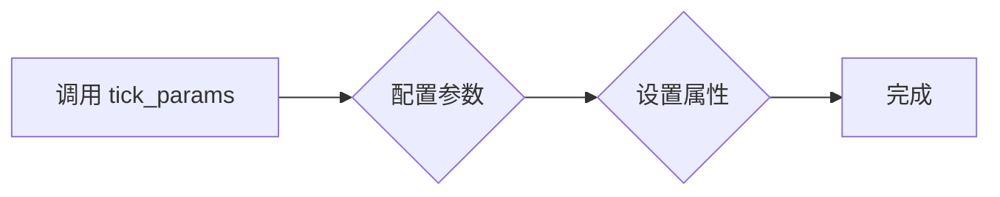

#### 带注释源码

```python
import matplotlib.pyplot as plt
import numpy as np

fig, ax = plt.subplots()

# 设置 x 轴刻度标签的大小为 14，颜色为红色，粗细为正常
ax.tick_params(axis='x', labelsize=14, labelcolor='red', labelweight='normal')

# 设置 y 轴刻度线的宽度为 2
ax.tick_params(axis='y', width=2)

plt.show()
```


### Axes.autoscale_view()

自动调整轴的视图，使其包含所有已添加的艺术家。

#### 描述

`Axes.autoscale_view()` 方法用于自动调整轴的视图，使其包含所有已添加的艺术家。这包括轴的 x 轴和 y 轴。此方法会根据轴上的艺术家自动调整轴的界限。

#### 参数

- 无

#### 返回值

- 无

#### 流程图

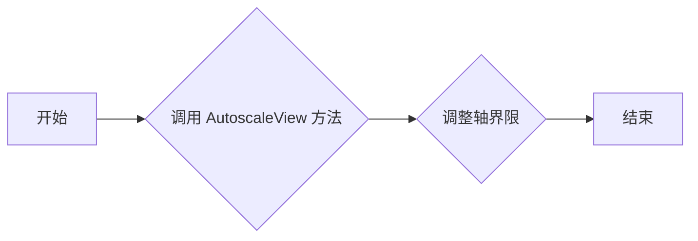

#### 带注释源码

```python
def autoscale_view(self, tight_layout=False, scalex=True, scaley=True):
    """
    Autoscale the view limits of the axes to fit the data of all the artists.

    Parameters
    ----------
    tight_layout : bool, optional
        If True, use the tight_layout method to adjust the position of the
        axes to fit the data.
    scalex : bool, optional
        If True, scale the x-axis to fit the data.
    scaley : bool, optional
        If True, scale the y-axis to fit the data.

    Returns
    -------
    None
    """
    # 调整轴界限
    self.set_xlim(self.get_xlim())
    self.set_ylim(self.get_ylim())
    # 如果启用 tight_layout，则调整布局
    if tight_layout:
        self.figure.tight_layout()
```


### Axes.draw

`Axes.draw` 方法用于绘制 `Axes` 对象及其包含的所有子对象，如线条、文本、形状等。

参数：

- `renderer`: `Renderer` 对象，用于执行绘图操作。

返回值：无

#### 流程图

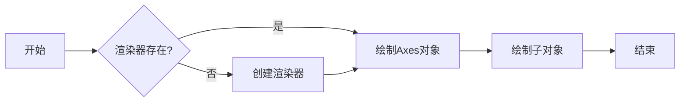

#### 带注释源码

```python
def draw(self, renderer):
    """
    Draw the artist and all its children.

    Parameters
    ----------
    renderer : Renderer
        The renderer to use for drawing.

    Returns
    -------
    None
    """
    if renderer is None:
        raise ValueError("Renderer cannot be None")

    # 绘制Axes对象
    self._render(renderer)

    # 绘制子对象
    for artist in self._get_children():
        artist.draw(renderer)
``` 


### `Line2D.remove`

移除与指定对象关联的Line2D实例。

参数：

- `self`：`Line2D`，当前Line2D实例
- ...

返回值：`None`，无返回值

#### 流程图

```mermaid
graph LR
A[开始] --> B{Line2D.remove() 被调用?}
B -- 是 --> C[移除Line2D实例]
B -- 否 --> D[结束]
C --> D
```

#### 带注释源码

```python
def remove(self):
    """
    Remove the artist from the figure.

    Parameters
    ----------
    self : Line2D
        The current Line2D instance.

    Returns
    -------
    None
    """
    # Remove the Line2D instance from the figure's lines list
    self.figure.lines.remove(self)
``` 


## 关键组件


### 张量索引与惰性加载

张量索引与惰性加载是用于高效处理大型数据集的关键组件。它允许在数据集被完全加载到内存之前，仅对所需的部分进行索引和访问。

### 反量化支持

反量化支持是用于优化模型性能的关键组件。它通过将量化后的模型转换为原始精度，以便进行进一步的分析或处理。

### 量化策略

量化策略是用于优化模型性能的关键组件。它通过减少模型中使用的精度，从而减少模型的存储和计算需求。


## 问题及建议


### 已知问题

-   **代码注释缺失**：代码中缺少详细的注释，这可能导致其他开发者难以理解代码的功能和逻辑。
-   **代码重复**：在代码中存在重复的代码片段，这可能导致维护困难，并增加了出错的可能性。
-   **全局变量使用**：代码中使用了全局变量，这可能导致代码难以测试和重用。
-   **异常处理不足**：代码中缺少异常处理机制，这可能导致程序在遇到错误时崩溃。

### 优化建议

-   **添加代码注释**：为代码添加详细的注释，以帮助其他开发者理解代码的功能和逻辑。
-   **重构代码**：识别并消除代码中的重复片段，以提高代码的可维护性。
-   **避免使用全局变量**：尽量使用局部变量和参数传递，以减少全局变量的使用。
-   **添加异常处理**：在代码中添加异常处理机制，以防止程序在遇到错误时崩溃。
-   **代码格式化**：使用代码格式化工具，如 `black` 或 `autopep8`，以确保代码风格的一致性。
-   **单元测试**：编写单元测试，以确保代码的正确性和稳定性。
-   **文档化**：编写详细的文档，包括代码的功能、使用方法和示例。


## 其它


### 设计目标与约束

- 设计目标：
  - 提供一个灵活且可扩展的绘图API，允许用户创建和配置各种图形元素。
  - 支持多种绘图后端，如wxPython、PostScript、PDF和Gtk+。
  - 提供丰富的图形元素，包括线条、矩形、文本、图像等。
  - 支持交互式绘图和动画。
- 约束：
  - 保持代码的可读性和可维护性。
  - 优化性能，确保绘图操作快速响应。
  - 兼容Python 2和Python 3。

### 错误处理与异常设计

- 错误处理：
  - 使用try-except语句捕获和处理可能发生的异常。
  - 提供清晰的错误消息，帮助用户诊断问题。
- 异常设计：
  - 定义自定义异常类，用于处理特定类型的错误。
  - 异常类应提供足够的信息，以便用户了解错误原因。

### 数据流与状态机

- 数据流：
  - 用户数据通过绘图API传递给图形元素。
  - 图形元素根据用户数据绘制图形。
  - 绘图结果存储在图形元素中，并可用于进一步处理。
- 状态机：
  - 绘图API使用状态机来管理图形元素的创建和配置。
  - 状态机确保图形元素在正确的顺序和条件下创建和配置。

### 外部依赖与接口契约

- 外部依赖：
  - Matplotlib依赖于NumPy、SciPy和matplotlib-base等库。
  - 这些库提供数学运算、科学计算和绘图功能。
- 接口契约：
  - Matplotlib提供一组API接口，用于创建和配置图形元素。
  - API接口应遵循Python编程语言规范和最佳实践。
  - API接口应提供清晰的文档，以便用户了解如何使用它们。


    