# `matplotlib\galleries\tutorials\coding_shortcuts.py` 详细设计文档

这是一个Matplotlib教程文档，展示了如何使用Axes接口的快捷方式来减少绑图代码的冗长度，包括使用set()方法统一设置属性、在创建时定义属性、利用pyplot隐式创建图形等技巧。

## 整体流程

```mermaid
graph TD
    A[开始] --> B[导入 matplotlib.pyplot 和 numpy]
B --> C[创建数据: day数组和hours计算]
C --> D[创建图形和坐标轴: plt.subplots()]
D --> E[绑制曲线: ax.plot()]
E --> F[设置属性: ax.set()]
F --> G[显示图形: plt.show()]
G --> H[替代方案1: plt.figure().add_subplot()]
H --> I[替代方案2: 创建时设置属性]
I --> J[替代方案3: plt.axes()]
J --> K[替代方案4: 链式调用]
```

## 类结构

```
本代码为脚本型教程文档，无面向对象类结构
```

## 全局变量及字段


### `day`
    
365天的日期数组

类型：`numpy.ndarray`
    


### `hours`
    
计算得出的每日日照时长

类型：`numpy.ndarray`
    


### `fig`
    
图形对象

类型：`matplotlib.figure.Figure`
    


### `ax`
    
坐标轴对象

类型：`matplotlib.axes.Axes`
    


### `line`
    
绑制线条对象

类型：`matplotlib.lines.Line2D`
    


    

## 全局函数及方法


### `np.arange`

生成一个指定范围内的均匀间隔数列，通常用于创建数值序列。

参数：

- `start`：`int` 或 `float`，起始值，默认为0
- `stop`：`int` 或 `float`，结束值（不包含）
- `step`：`int` 或 `float`，步长，默认为1
- `dtype`：`dtype`，输出数组的数据类型，可选

返回值：`numpy.ndarray`，包含均匀间隔值的数组

#### 流程图

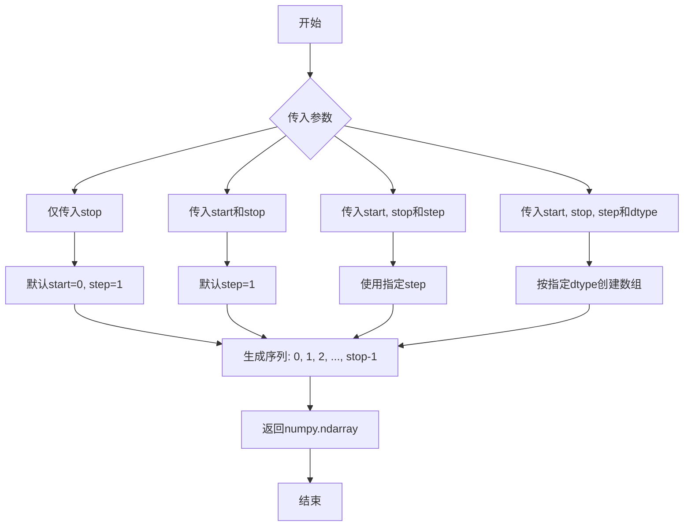

#### 带注释源码

```python
# 从代码中提取的调用示例
day = np.arange(365)  # 生成0到364的整数序列，共365个元素
# 等价于: np.arange(start=0, stop=365, step=1)

# 函数功能说明：
# np.arange() 是 NumPy 库中的函数，用于生成一个有序的数组
# 在本代码中用于创建365个天数索引（0-364）
# 配合正弦函数计算一年中每天的日照时长
hours = 4.276 * np.sin(2 * np.pi * (day - 80)/365) + 12.203
```


### `np.sin`

这是 NumPy 库中的正弦函数，用于计算输入角度（以弧度为单位）的正弦值。在代码中用于计算一年中每天的日照时长。

参数：

-  `x`：`float` 或 `numpy.ndarray`，输入的角度值（弧度制），可以是标量或数组

返回值：`float` 或 `numpy.ndarray`，输入角度的正弦值，类型与输入一致

#### 流程图

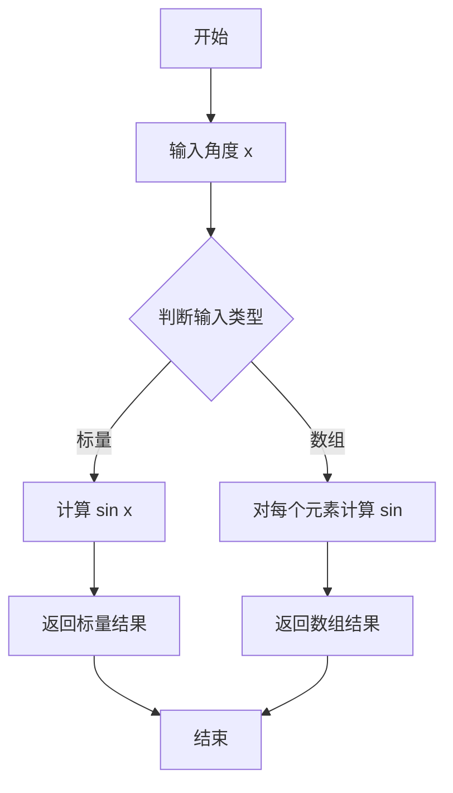

#### 带注释源码

```python
# hours = 4.276 * np.sin(2 * np.pi * (day - 80)/365) + 12.203
#
# 参数说明：
#   - day: numpy.ndarray，一年中的天数（0-364）
#   - (day - 80): 调整相位，80天大约是3月21日（春分）
#   - (day - 80)/365: 归一化到一年
#   - 2 * np.pi * (day - 80)/365: 转换为弧度（0 到 2*pi）
#   - np.sin(...): 计算正弦值
#
# 返回值：
#   - numpy.ndarray，每天日照时长的正弦分量

hours = 4.276 * np.sin(2 * np.pi * (day - 80)/365) + 12.203

# 详细分解：
# step1 = (day - 80)        # 减去80天偏移量
# step2 = step1 / 365       # 归一化
# step3 = 2 * np.pi * step2 # 转换为弧度（0 到 2π）
# step4 = np.sin(step3)     # 计算正弦值（-1 到 1）
# step5 = 4.276 * step4     # 振幅缩放
# hours = step5 + 12.203    # 加上基准日照时长（约12.2小时）
```


### `plt.subplots()`

`plt.subplots()` 是 Matplotlib 库中的一个核心函数，用于创建一个新的图形（Figure）和一个或多个子图（Axes）。它简化了图形和坐标轴的创建过程，支持多种布局配置，是进行数据可视化的常用入口点。

参数：

- `nrows`：`int`，默认值 1，子图的行数
- `ncols`：`int`，默认值 1，子图的列数
- `sharex`：`bool` 或 `{'none', 'all', 'row', 'col'}`，默认值 False，控制子图之间是否共享 x 轴
- `sharey`：`bool` 或 `{'none', 'all', 'row', 'col'}`，默认值 False，控制子图之间是否共享 y 轴
- `squeeze`：`bool`，默认值 True，如果为 True，则压缩返回的坐标轴数组维度
- `width_ratios`：`array-like`，可选，指定每列的宽度比例
- `height_ratios`：`array-like`，可选，指定每行的宽度比例
- `subplot_kw`：字典，可选，创建子图时传递给 `add_subplot` 的关键字参数
- `gridspec_kw`：字典，可选，创建 GridSpec 时使用的关键字参数
- `**fig_kw`：额外关键字参数，用于创建图形（Figure）时传递给 `plt.figure()`

返回值：`tuple(Figure, Axes or array of Axes)`，返回一个元组，包含图形对象和坐标轴对象（或坐标轴对象数组）

#### 流程图

```mermaid
flowchart TD
    A[调用 plt.subplots] --> B{是否指定 nrows/ncols?}
    B -->|否| C[默认创建 1x1 布局]
    B -->|是| D[创建指定行列布局]
    D --> E[创建 Figure 对象]
    E --> F[根据 gridspec_kw 创建 GridSpec]
    F --> G[根据 subplot_kw 创建子图 Axes]
    G --> H{是否 squeeze=True?}
    H -->|是且只有一个子图| I[返回标量 Axes]
    H -->|否或多个子图| J[返回 Axes 数组]
    I --> K[返回 tuple: (fig, ax)]
    J --> K
```

#### 带注释源码

```python
# 从给定的代码中提取的 plt.subplots() 使用示例
import matplotlib.pyplot as plt
import numpy as np

# 创建包含单个子图的图形和坐标轴
# 返回值 fig: Figure 对象 - 整个图形容器
# 返回值 ax: Axes 对象 - 坐标系对象，用于绘制数据
fig, ax = plt.subplots()

# 使用坐标轴对象的 plot 方法绘制数据
# 参数: x轴数据, y轴数据, color关键字参数
ax.plot(day, hours, color="orange")

# 设置坐标轴标签
ax.set_xlabel("day")
ax.set_ylabel("daylight hours")

# 设置图表标题
ax.set_title("London")

# 显示图形（在非Jupyter环境中需要）
plt.show()
```

#### 代码上下文说明

在给定的代码示例中，`plt.subplots()` 被用于创建一个简单的单子图布局。该函数是 Matplotlib 中最常用的图形创建方式之一，它：

1. **自动创建图形容器**：无需手动调用 `plt.figure()`
2. **返回图形和坐标轴**：便于对两者进行独立操作
3. **支持灵活布局**：通过 `nrows` 和 `ncols` 参数可以创建复杂的多子图布局
4. **可配置性强**：通过各种关键字参数可以控制图形和坐标轴的属性


### `plt.figure`

创建新的图形（Figure）对象，并将其作为当前图形返回。

参数：

- `figsize`：`tuple`，图形的宽度和高度（以英寸为单位），例如 (8, 6)
- `dpi`：`int`，图形分辨率（每英寸点数），默认 100
- `facecolor`：`str` 或 `tuple`，图形背景颜色
- `edgecolor`：`str` 或 `tuple`，图形边框颜色
- `num`：`int`、`str` 或 `None`，图形编号或标题，用于标识图形
- `clear`：`bool`，如果为 True 且图形已存在，则清除现有内容
- `frameon`：`bool`，是否绘制图形框架
- `**kwargs`：其他关键字参数，传递给 `matplotlib.figure.Figure` 构造函数

返回值：`matplotlib.figure.Figure`，返回新创建的图形对象

#### 流程图

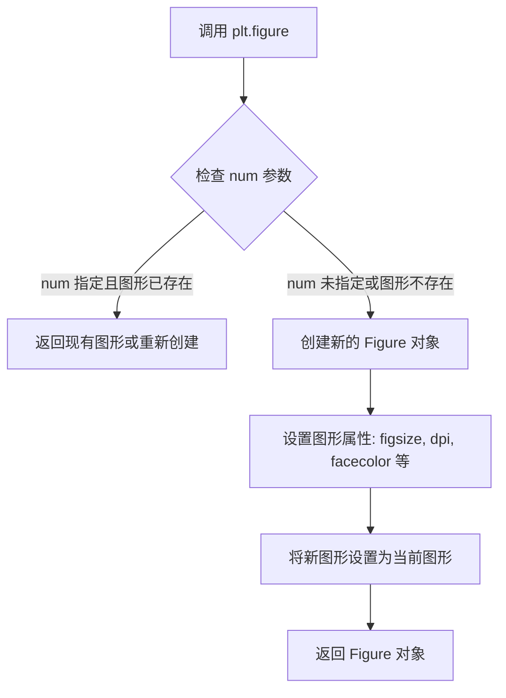

#### 带注释源码

```python
# 示例 1: 创建默认图形
fig = plt.figure()

# 示例 2: 创建带尺寸和背景色的图形
fig = plt.figure(figsize=(10, 6), facecolor="lightgray")

# 示例 3: 创建带标题的图形（num 作为标题）
fig = plt.figure(num="My Plot")

# 示例 4: 在代码中使用的模式 - 创建图形后添加子图
ax = plt.figure().add_subplot()
ax.plot(day, hours, color="orange")

# 内部实现原理（简化版）
# 1. pyplot.figure() 会调用 _pylab_helpers.Gcf.destroy_all() 清理旧图形
# 2. 创建 matplotlib.figure.Figure 实例
# 3. 将图形注册到全局的图形管理器中
# 4. 将新图形设置为当前图形（gcf() 返回此图形）
# 5. 返回 Figure 对象供用户使用
```


### `plt.axes`

`plt.axes` 是 Matplotlib pyplot 模块中的函数，用于在当前图形中创建一个新的坐标轴（Axes）。该函数支持通过关键字参数直接设置坐标轴的属性（如标签、标题等），返回创建的 Axes 对象。

参数：

- `rect`：`tuple` 或 `list`，可选，形式为 `(left, bottom, width, height)`，指定子图在图形中的位置（归一化坐标），默认值为 `(0.1, 0.1, 0.8, 0.8)`
- `polar`：`bool`，可选，指定是否创建极坐标轴，默认值为 `False`
- `projection`：可选，指定坐标轴的投影类型（如 `'3d'`, `'polar'` 等），默认根据 polar 参数自动判断
- `figure`：`Figure` 对象，可选，指定要添加坐标轴的图形，默认为当前图形
- `**kwargs`：关键字参数，可选，用于设置 Axes 的各种属性，如 `xlabel`、`ylabel`、`title`、`position` 等

返回值：`matplotlib.axes.Axes`，返回创建的 Axes 对象

#### 流程图

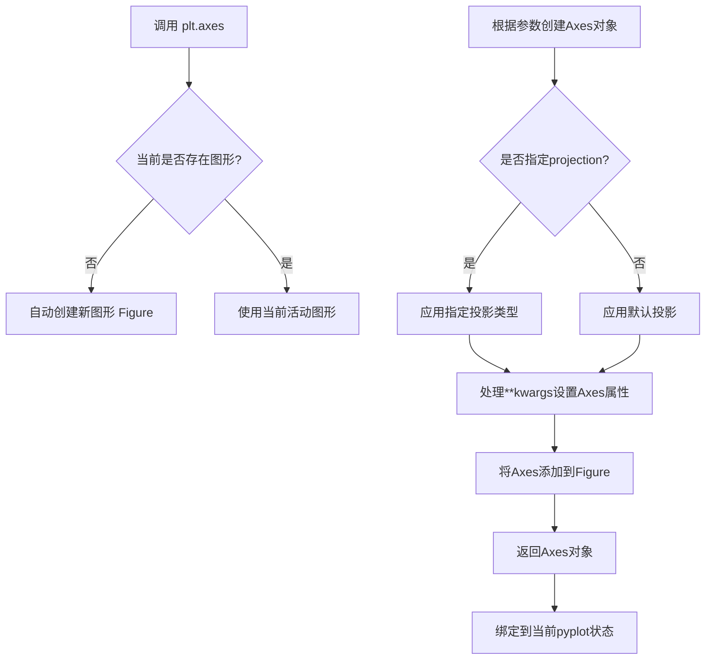

#### 带注释源码

```python
import matplotlib.pyplot as plt
import matplotlib.axes
import numpy as np

# 定义示例数据
day = np.arange(365)
hours = 4.276 * np.sin(2 * np.pi * (day - 80)/365) + 12.203

# 使用 plt.axes() 创建坐标轴
# 参数说明：
# - xlabel: 设置 x 轴标签
# - ylabel: 设置 y 轴标签  
# - title: 设置图表标题
ax = plt.axes(
    xlabel="day",           # x轴标签
    ylabel="daylight hours", # y轴标签
    title="London"          # 图表标题
)

# 绘制数据
ax.plot(day, hours, color="orange")

# 显示图表（在 Jupyter notebook 中可选）
plt.show()
```

#### 技术说明

1. **隐式图形语义**：当使用 `plt.axes()` 时，如果没有现存的图形，pyplot 会自动创建一个新图形；如果已存在图形，则会将坐标轴添加到当前活动图形中。

2. **与 `plt.subplots()` 的区别**：`plt.axes()` 更简洁但隐式操作更多，适合快速绘图；`plt.subplots()` 则提供更显式的控制。

3. **属性设置**：通过 `**kwargs` 可以传递给 Axes 的 `set()` 方法，支持的属性包括但不限于：`xlim`、`ylim`、`xscale`、`yscale`、`xlabel`、`ylabel`、`title`、`position` 等。

4. **返回值的灵活性**：返回的 Axes 对象可以立即用于链式调用，如 `plt.axes().plot(...)`，但需要注意这会创建一个未保存引用的临时 Axes 对象。

#### 潜在优化空间

- 在需要多次操作同一坐标轴的场景下，建议显式保存 Axes 引用而非使用链式调用，以提高代码可读性
- 对于复杂的多子图布局，建议使用 `plt.subplots()` 或 `Figure.add_subplot()` 以获得更精确的控制


### `plt.show`

显示当前所有打开的图形窗口，将图形渲染到屏幕或交互式后端。

参数：

- `block`：`bool`，可选参数。控制是否阻塞程序执行直到图形窗口关闭。在交互模式下默认为 `True`，在非交互模式下默认为 `None`（自动选择）。

返回值：`None`，该函数无返回值，仅用于图形显示。

#### 流程图

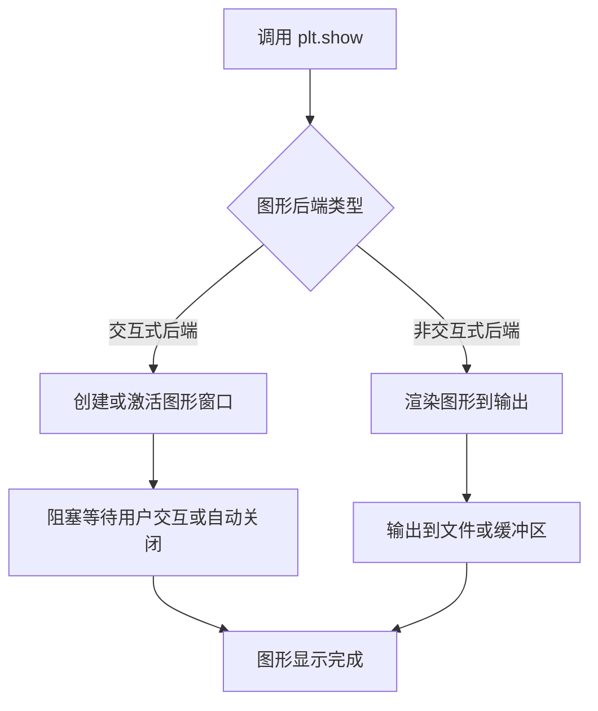

#### 带注释源码

```python
import matplotlib.pyplot as plt
import numpy as np

# 创建数据：一年中的天数和对应的日照时长
day = np.arange(365)
# 使用正弦函数模拟日照时长变化曲线
hours = 4.276 * np.sin(2 * np.pi * (day - 80)/365) + 12.203

# 创建图形和坐标轴对象
fig, ax = plt.subplots()

# 绘制数据曲线，设置颜色为橙色
ax.plot(day, hours, color="orange")

# 设置坐标轴标签和标题
ax.set(xlabel="day", ylabel="daylight hours", title="London")

# 显示图形窗口
# 关键函数：将图形渲染到屏幕
# 参数 block 控制是否阻塞主线程等待用户关闭图形窗口
plt.show()

# 说明：
# 1. 在命令行或脚本中运行时，plt.show() 是必需的，用于显示图形窗口
# 2. 在 Jupyter notebook 中会自动执行，通常可以省略
# 3. 保存图形可使用 fig.savefig("filename.png") 替代 plt.show()
```

#### 关键组件信息

| 组件名称 | 描述 |
|---------|------|
| Figure | 整个图形容器，包含一个或多个 Axes |
| Axes | 坐标系对象，包含数据曲线、轴标签等 |
| Backend | 渲染后端，负责图形实际显示（Qt、Tkinter、Agg 等） |
| Event Loop | 事件循环，处理用户交互（关闭、最小化等） |

#### 潜在技术债务与优化空间

1. **隐式状态管理**：pyplot 使用全局状态，可能导致图形状态意外混淆
2. **阻塞行为依赖运行环境**：block 参数在不同环境下的默认行为不一致，可能导致意外的阻塞或非阻塞
3. **无返回值设计**：无法获取图形对象引用，限制了后续操作的灵活性

#### 其他项目说明

- **设计目标**：提供统一的图形显示接口，屏蔽不同后端的差异
- **约束条件**：必须在有图形后端的环境中运行，否则可能无效果
- **错误处理**：如果无后端可用，可能静默失败或抛出异常
- **外部依赖**：依赖 matplotlib 后端配置（matplotlibrc 中的 backend 设置）


### Figure.savefig

将图形保存到文件系统中，支持多种图像格式（如 PNG、PDF、SVG 等）。该方法是 Matplotlib 中用于将 Figure 对象持久化的核心函数。

参数：

- `fname`：`str` 或 `Path` 或 file-like object，保存文件的路径或文件对象，文件扩展名决定了输出格式
- `format`：`str`，可选，覆盖从 fname 推断的文件格式
- `dpi`：`float`，可选，图像分辨率（每英寸点数）
- `bbox_inches`：`str` 或 `Bbox`，可选，裁剪区域，可设为 `'tight'` 自动裁剪白边
- `pad_inches`：`float`，可选，当 bbox_inches 为 tight 时的边距
- `facecolor`：`color` 或 `None`，可选，图像背景色
- `edgecolor`：`color` 或 `None`，可选，图像边框色
- `transparent`：`bool`，可选，是否使用透明背景
- `metadata`：`dict`，可选，用于 PDF/SVG 的元数据

返回值：`None`，直接写入文件，不返回任何内容

#### 流程图

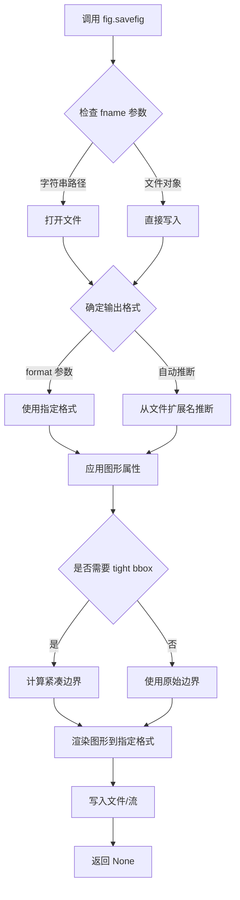

#### 带注释源码

```python
# 示例 1: 基础用法 - 将当前图形保存为 PNG 文件
# fig 是通过 plt.subplots() 创建的 Figure 对象
fig.savefig("daylight.png")  # 将图形保存为 daylight.png，自动根据扩展名确定格式为 PNG

# 示例 2: 从 Axes 获取 Figure 再保存
# 当没有直接保存 fig 引用时，可通过 ax.figure 获取
ax = plt.figure().add_subplot()  # 创建图形和坐标轴
ax.plot(day, hours, color="orange")
ax.set(xlabel="day", ylabel="daylight hours", title="London")
ax.figure.savefig("daylight_hours.png")  # 通过 ax.figure 获取 Figure 对象并保存

# 示例 3: 高级用法 - 带参数的保存
fig.savefig(
    "output.png",
    format="png",           # 显式指定格式
    dpi=300,                # 高分辨率输出
    bbox_inches="tight",   # 裁剪白边
    facecolor="white",      # 白色背景
    transparent=False      # 不透明
)
```


### `Axes.plot`

绘制曲线方法是 Matplotlib Axes 接口的核心方法之一，用于将数据绑定绘制为折线图或曲线图。该方法接受 x 和 y 坐标数据以及可选的格式字符串或关键字参数（如颜色、线型等），并返回一个包含 Line2D 对象的列表。

参数：

- `x`：`array-like`，表示 x 轴坐标数据，即绑制曲线的横坐标值
- `y`：`array-like`，表示 y 轴坐标数据，即绑制曲线的纵坐标值
- `fmt`：`str`，可选，格式字符串，用于快速指定线条颜色、标记和线型（例如 "ro-" 表示红色圆点虚线）
- `**kwargs`：可变关键字参数，用于指定 Line2D 的各种属性，如 `color`、`linewidth`、`linestyle`、`marker` 等

返回值：`list[matplotlib.lines.Line2D]`，返回绑制线条的 Line2D 对象列表，通常第一个元素为绑制的线条对象

#### 流程图

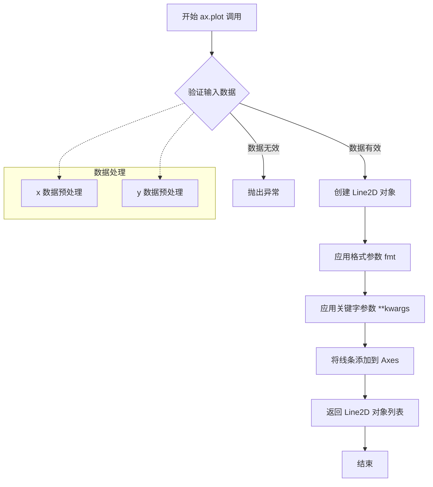

#### 带注释源码

```python
# 导入必要的库
import matplotlib.pyplot as plt
import numpy as np

# 生成示例数据：一年中的天数 (0-364)
day = np.arange(365)
# 计算每天的日照时长，使用正弦函数模拟季节性变化
# 公式：振幅 * sin(2π * (day - 80)/365) + 中心值
hours = 4.276 * np.sin(2 * np.pi * (day - 80)/365) + 12.203

# 创建画布和坐标轴对象
# plt.subplots() 返回 (figure, axes) 元组
fig, ax = plt.subplots()

# 调用 Axes.plot() 方法绑制曲线
# 参数说明：
#   - day: x 轴数据，numpy 数组 [0, 1, 2, ..., 364]
#   - hours: y 轴数据，对应的日照时长数组
#   - color="orange": 关键字参数，指定线条颜色为橙色
line, = ax.plot(day, hours, color="orange")
# 注意：plot() 返回 Line2D 对象列表，解包获取第一个线条对象

# 设置坐标轴标签和标题
ax.set(xlabel="day", ylabel="daylight hours", title="London")

# 可选：保存图片
# fig.savefig("daylight.png")

# 可选：显示图像（在交互式环境或脚本中需要）
# plt.show()
```

#### 额外说明

**设计目标与约束：**
- `plot()` 方法设计为灵活且功能强大，支持多种数据输入格式
- 遵循 Matplotlib 的 Artist 层次结构，Line2D 是 Artist 的子类
- 支持链式调用，因为 Axes 对象返回自身

**数据流与状态机：**
- 输入数据经过验证后转换为内部数据结构
- 线条对象创建后会注册到 Axes 的艺术家集合中
- 状态变化：Idle → Processing → Rendering → Complete

**外部依赖与接口契约：**
- 依赖 NumPy 库进行数组操作
- 返回的 Line2D 对象可进一步自定义（颜色、线宽、标记等）
- 可与 `ax.set()` 方法配合使用进行整体配置

**潜在的技术债务或优化空间：**
- 该示例代码中使用了 `plt.show()` 但在注释中说明在 Jupyter 环境中会自动执行，这可能导致初学者困惑
- `ax.set()` 方法虽然简洁，但不支持复杂参数组合，不如单独调用 `set_title()` 灵活
- 隐式 figure 创建（如 `plt.axes()`）虽然简洁，但可能引入意外行为


### `Axes.set`

`Axes.set` 是 Matplotlib 中 Axes 类的通用批量属性设置方法，允许通过关键字参数一次性设置多个属性，等效于逐个调用对应的 `set_*()` 方法。

参数：

-  `**kwargs`：关键字参数，接受任意数量的键值对，键为属性名（如 `xlabel`、`ylabel`、`title` 等），值为对应的属性值。

返回值：`self`（Axes 对象），返回 Axes 本身以支持方法链式调用。

#### 流程图

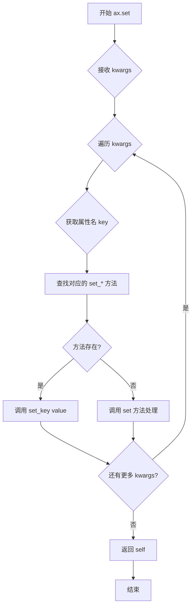

#### 带注释源码

```python
def set(self, **kwargs):
    """
    设置多个属性，使用关键字参数。
    
    等效于逐个调用对应的 set_* 方法，例如：
    ax.set(xlabel="day", ylabel="daylight hours")
    等价于：
    ax.set_xlabel("day")
    ax.set_ylabel("daylight hours")
    
    参数:
        **kwargs: 关键字参数，键为属性名，值为属性值
                 支持的属性包括但不限于:
                 - xlabel: x轴标签
                 - ylabel: y轴标签
                 - title: 图表标题
                 - xlim, ylim: 轴范围
                 - 等等其他Axes属性
    
    返回:
        self: 返回Axes对象本身，支持链式调用
    """
    # 遍历所有传入的关键字参数
    for attr, value in kwargs.items():
        # 尝试调用对应的 set_* 方法
        # 例如: xlabel -> set_xlabel, title -> set_title
        setter_method = f'set_{attr}'
        
        if hasattr(self, setter_method):
            # 如果存在对应的 set_* 方法，调用它
            getattr(self, setter_method)(value)
        else:
            # 如果没有对应的方法，尝试使用通用的 set 方法
            # 这允许设置任意属性
            self.set(**{attr: value})
    
    # 返回 self 以支持链式调用
    return self

# 使用示例（来自文档）:
# ax.set(xlabel="day", ylabel="daylight hours", title="London")
# 等价于:
# ax.set_xlabel("day")
# ax.set_ylabel("daylight hours")
# ax.set_title("London")
```


### `Axes.set_xlabel`

设置 x 轴的标签（xlabel），用于描述 x 轴所代表的数据含义。这是 Matplotlib Axes 对象的核心方法之一，允许用户为图表的横轴添加描述性文本。

参数：

- `xlabel`：`str`，要设置为 x 轴标签的文本内容，例如 "day"、"time" 等
- `fontdict`：`dict`，可选，用于批量设置文本属性的字典，如 {'fontsize': 12, 'fontweight': 'bold'}
- `labelpad`：`float`，可选，标签与坐标轴之间的间距（磅值），默认为 None
- `**kwargs`：可选，关键字参数，用于设置文本的其他属性，如 fontsize、fontweight、color、rotation 等

返回值：`Text`，返回创建的 `Text` 对象，可用于后续进一步自定义标签样式（如设置字体颜色、大小等）

#### 流程图

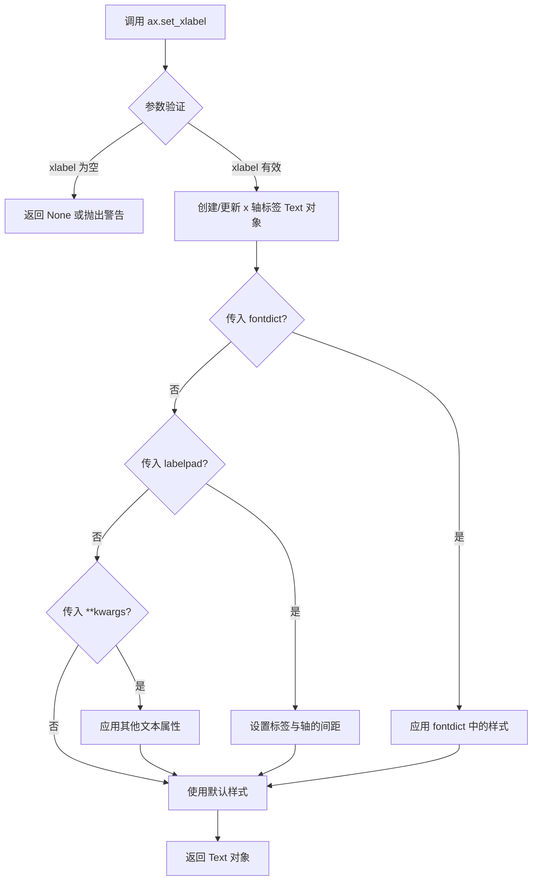

#### 带注释源码

```python
# 在 Matplotlib 中 Axes.set_xlabel 的典型实现逻辑

# 1. 基本调用方式（在代码中使用）
ax.set_xlabel("day")

# 2. 带完整参数的调用方式
ax.set_xlabel(
    xlabel="day",                    # str: x 轴标签文本内容
    fontdict={'fontsize': 12},      # dict: 字体属性字典（可选）
    labelpad=10,                    # float: 标签与轴间距（可选）
    fontsize=14,                    # kwargs: 字体大小
    fontweight='bold',             # kwargs: 字体粗细
    color='blue'                   # kwargs: 文本颜色
)

# 3. 方法返回值的使用示例
text_obj = ax.set_xlabel("day")     # 返回 Text 对象
text_obj.set_color('red')           # 可进一步自定义样式
text_obj.set_rotation(45)           # 设置旋转角度

# 4. 在代码中的实际使用（来自文档）
fig, ax = plt.subplots()
ax.plot(day, hours, color="orange")
ax.set_xlabel("day")                # 设置 x 轴标签为 "day"
ax.set_ylabel("daylight hours")     # 设置 y 轴标签
ax.set_title("London")              # 设置图表标题

# 5. 使用 set() 方法批量设置（文档中推荐的简化写法）
ax.set(xlabel="day", ylabel="daylight hours", title="London")
```


```json
```


### Axes.set_ylabel

设置y轴的标签（y轴名称），用于描述y轴所代表的数据含义。

参数：

- `ylabel`：`str`，要设置的y轴标签文本内容
- `fontdict`：`dict`，可选，用于控制标签外观的字体字典（如字体大小、颜色等）
- `labelpad`：`float`，可选，标签与y轴之间的距离（数值）
- `**kwargs`：可选，其他关键字参数，将传递给底层的`matplotlib.text.Text`对象

返回值：`matplotlib.text.Text`，返回创建的标签文本对象，可用于后续进一步自定义样式

#### 流程图

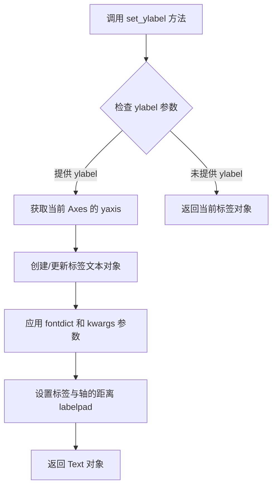

#### 带注释源码

```python
# 代码中的实际调用示例
ax.set_ylabel("daylight hours")

# 等效的通用set方法调用
ax.set(ylabel="daylight hours")

# 在Axes创建时直接指定（通过add_subplot）
ax = plt.figure().add_subplot(ylabel="daylight hours", title="London")

# 在pyplot.axes创建时指定
ax = plt.axes(ylabel="daylight hours", title="London")
```


### `Axes.set_title`

设置Axes对象的标题（Title）。

参数：

- `label`：`str`，要设置的标题文本内容
- `fontdict`：`dict`，可选，用于控制标题样式的字典（如 fontsize、fontweight、color 等）
- `loc`：`str`，可选，标题对齐方式，可选值为 'left'、'center'、'right'，默认为 'center'
- `pad`：`float`，可选，标题与 Axes 顶部边缘的距离（以点为单位）
- `**kwargs`：可选，其他关键字参数，会传递给底层的 `matplotlib.text.Text` 对象，支持的属性包括 color、fontsize、fontweight、fontstyle、rotation 等

返回值：`matplotlib.text.Text`，返回设置后的 Text 对象，便于链式调用或进一步修改

#### 流程图

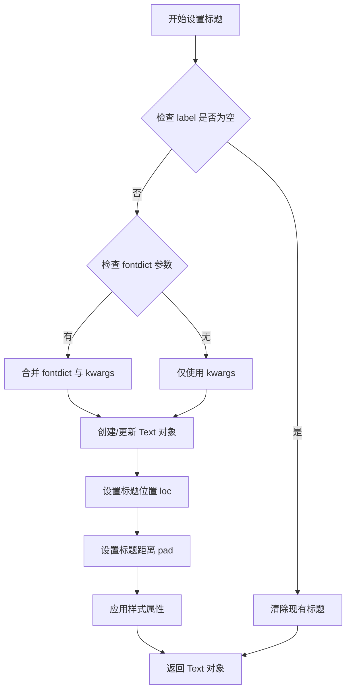

#### 带注释源码

```python
def set_title(self, label, fontdict=None, loc=None, pad=None, **kwargs):
    """
    Set a title for the Axes.
    
    Parameters
    ----------
    label : str
        The title text string.
        
    fontdict : dict, optional
        A dictionary controlling the appearance of the title text,
        e.g., {'fontsize': '16', 'fontweight': 'bold', 'color': 'red'}.
        
    loc : {'left', 'center', 'right'}, default: 'center'
        Alignment of the title relative to the Axes.
        
    pad : float, default: ``rcParams['axes.titlepad']`` (currently 6.0)
        The offset (in points) from the top of the Axes to the title.
        
    **kwargs
        Additional keyword arguments are passed to the `.Text` instance,
        supporting custom text properties like color, fontsize, fontweight,
        fontstyle, rotation, verticalalignment, etc.
        
    Returns
    -------
    `.Text`
        The matplotlib text object representing the title.
        This return value allows for chaining and further customization,
        e.g., ``ax.set_title("Title").set_color("blue")``.
        
    Examples
    --------
    >>> ax.set_title("My Plot")
    >>> ax.set_title("Main Title", fontsize=16, fontweight="bold")
    >>> ax.set_title("Custom Title", fontdict={"color": "red", "fontsize": 14})
    >>> ax.set_title("Right Aligned", loc="right", pad=20)
    """
    # fontdict 的优先级低于直接传入的 kwargs
    # 合并两者，kwargs 覆盖 fontdict 中的相同键
    title_props = {}
    if fontdict is not None:
        title_props.update(fontdict)
    title_props.update(kwargs)
    
    # 获取标题位置对齐方式，默认为 'center'
    if loc is None:
        loc = 'center'
    
    # 获取标题距离，默认为配置参数 axes.titlepad
    if pad is None:
        pad = rcParams['axes.titlepad']
    
    # 调用内部的 _set_title 方法完成实际的设置工作
    return self._set_title(label, loc=loc, pad=pad, **title_props)
```


### `Axes.figure`

获取当前Axes对象所属的Figure（图形）对象。该属性返回包含该Axes的Figure实例，允许用户直接访问和管理图形级别的属性和操作，如保存图形、设置图形属性等。

参数：无需参数

返回值：`matplotlib.figure.Figure`，返回包含该Axes的Figure对象

#### 流程图

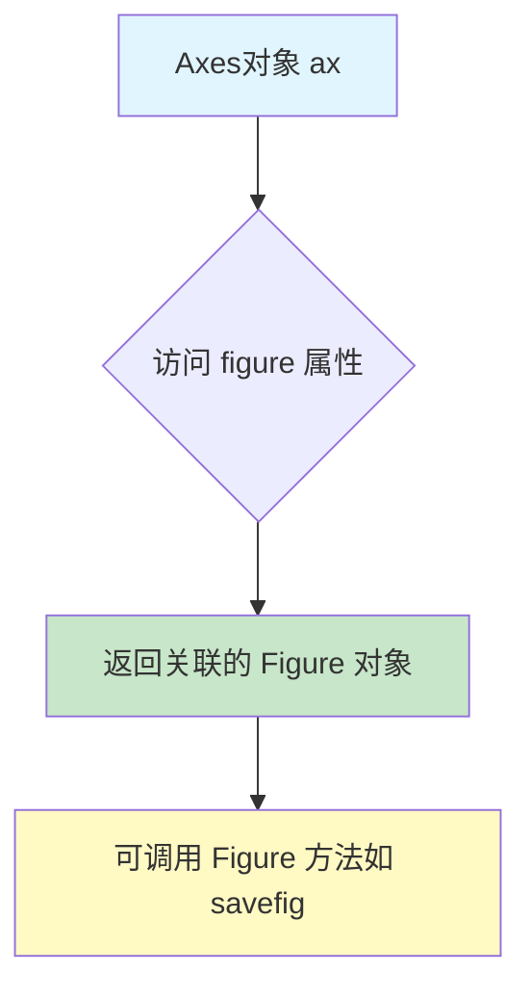

#### 带注释源码

```python
# ax.figure 是 Axes 类的一个只读属性
# 返回当前 Axes 对象所属的 Figure 实例

# 示例1: 获取图形并保存
ax = plt.figure().add_subplot()
ax.plot(day, hours, color="orange")
ax.figure.savefig("daylight_hours.png")  # 通过 ax.figure 获取 Figure 对象并保存

# 示例2: 获取图形设置属性
fig = ax.figure  # 获取所属 Figure
fig.patch.set_facecolor('lightgoldenrod')  # 设置图形背景色

# 示例3: 在链式调用中直接使用
ax.figure.suptitle("London Daylight Hours")  # 设置图形的总标题

# 属性类型说明:
# type(ax.figure) -> matplotlib.figure.Figure
# 该属性是只读的，不能直接赋值，如需更换所属图形需重新创建Axes
```

#### 额外说明

- **属性类型**: 这是一个**属性（property）**而非方法，返回Figure对象
- **使用场景**: 当你需要对图形进行操作（如保存、设置属性）但只有Axes引用时使用
- **关联性**: 与 `Figure.add_subplot()` 方法互为逆操作，`add_subplot` 创建Axes并将其添加到Figure，`figure` 属性则反向查找
- **注意事项**: 如果Axes未绑定到Figure（极少情况），可能返回None


## 关键组件


### plt.subplots()

Matplotlib的工厂函数，用于同时创建Figure对象和Axes对象，返回(fig, ax)元组，是最标准的创建方式。

### ax.plot()

用于在Axes上绑制线图数据的核心方法，接受x、y数据及关键字参数（如color）来设置线条样式。

### ax.set()

Axes的通用属性设置方法，可以一次性通过关键字参数设置多个属性（如xlabel、ylabel、title），等同于分别调用各个set_*()方法。

### plt.figure().add_subplot()

分离图形创建和子图创建的语法，可以将图形创建和坐标轴创建分开，支持链式调用。

### Figure.add_subplot()

Figure对象的方法，用于在指定图形上创建子图，可以接受关键字参数直接在创建时设置Axes属性。

### pyplot.axes()

pyplot模块的函数，利用pyplot的隐式图形机制创建坐标轴，如果不存在图形则自动创建，否则添加到当前图形。

### plt.figure()

用于创建新的Figure对象的pyplot函数，可接受关键字参数设置图形属性（如facecolor）。

### 隐式figure语义

pyplot接口的行为特性，plt.axes()会根据当前状态决定是创建新图形还是重用现有图形，可能导致非预期结果。


## 问题及建议


### 已知问题

-   **内存泄漏风险**：`ax = plt.figure().add_subplot()` 创建了未引用的 Figure 对象，matplotlib 会保留这些对象在内存中，可能导致资源泄漏
-   **隐式行为陷阱**：`plt.axes()` 使用全局状态，如果没有现存的 figure 会创建新的，否则会添加到当前 figure，这种隐式行为可能导致意外的副作用
-   **硬编码魔法数字**：代码中的 `4.276`、`12.203`、`80` 等数值缺乏注释说明，影响代码可读性和可维护性
-   **缺少类型注解**：所有函数和方法都缺少类型注解，不利于静态分析和 IDE 辅助
-   **文档字符串不完整**：顶部的 docstring 只描述了用途，未说明参数、返回值和异常
- **缺乏错误处理**：没有对输入数据（如空数组、NaN 值）进行验证
- **全局状态依赖**：过度依赖 `plt` 的全局状态，降低了代码的可测试性和可移植性

### 优化建议

-   使用 `with plt.style.context():` 来管理绘图样式，避免全局样式污染
-   对于不需要保存 figure 的场景，使用 `plt.close(fig)` 显式关闭图形释放资源
-   将魔法数字提取为具名常量或配置参数，增加代码可读性
-   为函数添加类型注解和完整的文档字符串（使用 Sphinx 格式）
-   添加输入验证逻辑，检查数据有效性
-   考虑使用面向对象方式管理多个图形，避免隐式的全局状态
-   将数据计算部分封装成独立函数，提高代码的可测试性


## 其它


### 设计目标与约束

本教程的设计目标是帮助用户理解并应用Matplotlib的快捷编码方式，减少绘图代码的冗余。核心约束包括：1) 保持与标准Axes接口的功能一致性；2) 不引入额外的外部依赖；3) 代码示例需兼容Python 3.x和Matplotlib 3.x以上版本；4) 教程内容需在Jupyter notebook和命令行环境下均可正常运行。

### 错误处理与异常设计

代码中潜在错误包括：1) 未正确导入matplotlib.pyplot和numpy模块；2) plt.axes()在已有figure存在时可能产生非预期行为（隐式figure语义）；3) add_subplot参数传递错误可能导致子图创建失败。教程通过warning提示用户注意plt.axes()的隐式figure语义，并建议在特定场景下使用subplot_kw参数。

### 数据流与状态机

数据流主要涉及：day数组(365天的序号) -> hours计算(使用正弦函数模拟日照时长) -> ax.plot()绑定数据到图形 -> ax.set()配置元数据。状态机方面：plt.figure()创建新figure -> add_subplot()创建axes -> plot()绑定数据 -> set()配置属性 -> show()或savefig()输出。

### 外部依赖与接口契约

核心依赖包括matplotlib>=3.0和numpy>=1.15。关键接口契约：plt.subplots()返回(fig, ax)元组；ax.set()接受关键字参数并返回Axes对象；ax.plot()返回Line2D对象列表；plt.axes()在无figure时创建新figure，有figure时添加到当前figure；Figure.add_subplot()直接接受axes属性作为关键字参数。

### 性能考虑

代码本身为教学示例，性能影响可忽略。但在实际应用中需注意：频繁调用plt.figure()可能产生内存泄漏，建议显式管理figure生命周期；大量数据绘图时使用numpy向量化操作优于Python循环；savefig()时选择合适的格式和dpi参数。

### 安全性考虑

本教程代码无直接安全风险。建议在实际项目中注意：1) 用户输入避免直接用于文件路径（防止路径遍历）；2) 使用plt.switch_backend()时需验证后端可用性；3) 避免在生产环境使用plt.show()，应使用savefig()或backend渲染。

### 可维护性与扩展性

代码遵循PEP8规范，模块级docstring清晰。扩展建议：1) 可封装常见绘图模式为函数或类；2) 可通过matplotlib.rcParams统一配置样式；3) 复杂图表建议保留fig和ax引用以便后续修改；4) 可使用@decorators实现绘图模板复用。

### 测试策略

由于为教程代码，测试重点应包括：1) 代码片段在Jupyter和命令行环境均可执行；2) 各种plt backend兼容性测试；3) savefig()输出图像完整性验证；4) 不同数据规模的性能基准测试。

### 部署与配置

部署环境要求：Python 3.8+，matplotlib 3.5+，numpy 1.21+。配置建议：通过matplotlibrc文件或matplotlib.rcParams设置全局样式；Jupyter环境建议使用%matplotlib inline或%matplotlib widget魔术命令；无头服务器环境需设置Agg backend。

### 版本兼容性

代码兼容matplotlib 3.x系列。主要兼容性注意点：1) subplot_kw参数在matplotlib 2.2+支持较好；2) 部分set_*方法在旧版本可能返回None而非self；3) facecolor参数在3.0+版本行为有细微变化。建议在requirements.txt中指定matplotlib>=3.0。

### 国际化与本地化

本教程为英文技术文档。扩展建议：1) 图表文本可使用国际化的方式处理（如gettext）；2) set_xlabel/set_title等支持fontfamily参数进行字体配置；3) 中文显示需设置中文字体（如'SimHei'或'Noto Sans CJK'）并正确配置axes.unicode_minus。

### 文档与注释规范

代码遵循Google风格docstring规范，模块级docstring使用reStructuredText格式。图表注释使用# %%实现Jupyter cell分隔。建议：为复杂绘图逻辑添加行内注释；关键配置参数在文档中说明；复杂函数使用numpydoc格式。

### 监控与日志

教程层面无运行时监控需求。生产环境建议：1) 使用logging模块记录绘图操作；2) 性能敏感场景使用time.perf_counter()进行性能监控；3) 异常捕获使用try-except块并记录traceback。

### 错误恢复机制

代码层面的错误恢复包括：1) plt.cla()清除当前axes内容；2) plt.clf()清除当前figure；3) plt.close()释放figure资源；4) 异常情况下可通过保存的fig引用重新渲染。建议：重要图表在修改前保存备份，复杂图表分步骤构建便于定位问题。

### 代码质量度量

代码质量指标：1) 圈复杂度低，无复杂条件分支；2) 代码行数精简，适合教学；3) 命名清晰，遵循matplotlib社区约定；4) 无重复代码块。改进空间：可增加类型提示(type hints)提升代码可读性，可添加单元测试覆盖边界情况。

    