# `matplotlib\galleries\tutorials\pyplot.py` 详细设计文档

这是Matplotlib官方教程文件，通过多个示例代码演示pyplot接口的使用方法，包括基本绘图、样式格式化、关键字字符串绘图、分类变量绘图、线条属性控制、多图多轴管理、文本处理、数学表达式、注释以及对数轴等非线性坐标轴的使用。

## 整体流程

```mermaid
graph TD
    A[开始] --> B[导入matplotlib.pyplot和numpy]
    B --> C[基本绘图: plt.plot()绑定y值]
    C --> D[格式化样式: 设置颜色和线型]
    D --> E[使用numpy数组绘图]
    E --> F[关键字字符串绘图: 使用data参数]
    F --> G[分类变量绘图: bar/scatter/plot]
    G --> H[控制线条属性: set_antialiased/setp]
    H --> I[多图多轴: figure/subplot/gca/gcf]
    I --> J[文本处理: xlabel/ylabel/title/text]
    J --> K[数学表达式: TeX格式]
    K --> L[注释: annotate函数]
    L --> M[非线性坐标轴: log/symlog/logit]
```

## 类结构

```
matplotlib.pyplot (模块)
├── plt.plot() - 绑制线条
├── plt.scatter() - 绑制散点图
├── plt.bar() - 绑制柱状图
├── plt.figure() - 创建图形
├── plt.subplot() - 创建子图
├── plt.xlabel()/ylabel() - 设置坐标轴标签
├── plt.title() - 设置标题
├── plt.text() - 添加文本
├── plt.annotate() - 添加注释
├── plt.grid() - 显示网格
├── plt.axis() - 设置坐标轴范围
├── plt.show() - 显示图形
├── plt.close() - 关闭图形
├── plt.clf()/cla() - 清除图形/Axes
├── plt.gca()/gcf() - 获取当前Axes/Figure
└── plt.setp() - 设置对象属性
```

## 全局变量及字段


### `data`
    
包含a/b/c/d四个numpy数组的字典，用于scatter绘图示例

类型：`dict`
    


### `names`
    
分类变量名称列表['group_a', 'group_b', 'group_c']

类型：`list`
    


### `values`
    
分类变量对应值列表[1, 10, 100]

类型：`list`
    


### `mu`
    
正态分布均值(100)

类型：`float`
    


### `sigma`
    
正态分布标准差(15)

类型：`float`
    


### `x`
    
基于mu和sigma生成的10000个随机数

类型：`numpy.ndarray`
    


### `t`
    
时间数组(0到5，间隔0.2)

类型：`numpy.ndarray`
    


### `t1`
    
时间数组(0到5，间隔0.1)

类型：`numpy.ndarray`
    


### `t2`
    
时间数组(0到5，间隔0.02)

类型：`numpy.ndarray`
    


### `y`
    
随机正态分布数据(经筛选和排序)

类型：`numpy.ndarray`
    


### `s`
    
余弦函数值数组

类型：`numpy.ndarray`
    


### `n`
    
hist函数返回的直方图频数

类型：`numpy.ndarray`
    


### `bins`
    
hist函数返回的直方图bins边界

类型：`numpy.ndarray`
    


### `patches`
    
hist函数返回的直方图图形对象列表

类型：`list`
    


    

## 全局函数及方法


### f(t)

定义函数f(t)，返回exp(-t)*cos(2πt)，用于演示matplotlib的subplot绘图功能。该函数计算衰减余弦信号，常用于在图表中展示指数衰减与振荡行为的结合。

参数：
- `t`：数值类型（float或numpy.ndarray），时间参数，表示计算点

返回值：数值类型（float或numpy.ndarray），返回exp(-t) * cos(2πt)的计算结果

#### 流程图

```mermaid
graph TD
    A([开始]) --> B[输入参数t]
    B --> C{计算exp(-t)}
    B --> D{计算cos2πt}
    C --> E[相乘结果]
    D --> E
    E --> F([返回结果])
```

#### 带注释源码

```python
def f(t):
    """
    计算衰减余弦函数
    
    参数:
        t: 时间参数，可以是标量或numpy数组
    
    返回:
        exp(-t) * cos(2πt) 的值，呈现指数衰减的振荡特性
    """
    return np.exp(-t) * np.cos(2*np.pi*t)  # 计算指数衰减与余弦振荡的乘积
```


# plt.plot() 详细设计文档

### plt.plot

`plt.plot()` 是 matplotlib.pyplot 模块中最核心的绘图函数，用于在当前坐标轴（Axes）上绘制线条图或散点图。它接受可变数量的 x-y 数据对及格式字符串，灵活支持单数据系列或多数据系列绑制，并能自动创建坐标轴或复用当前坐标轴。

## 参数

- `*args`：可变参数，支持多种调用方式：
  - `plt.plot(y)` - 仅提供y值，x自动生成为 `[0, 1, 2, ...]`
  - `plt.plot(x, y)` - 提供x和y数据
  - `plt.plot(x, y, format_string)` - 加上格式字符串（颜色、线型）
  - `plt.plot(x1, y1, fmt1, x2, y2, fmt2, ...)` - 多组数据
- `**kwargs`：关键字参数，用于设置 `Line2D` 对象的属性，如 `linewidth`、`color`、`marker` 等

## 返回值

- `list of matplotlib.lines.Line2D`：返回由所有绑制的线条组成的列表，每个元素是一个 `Line2D` 对象

## 流程图

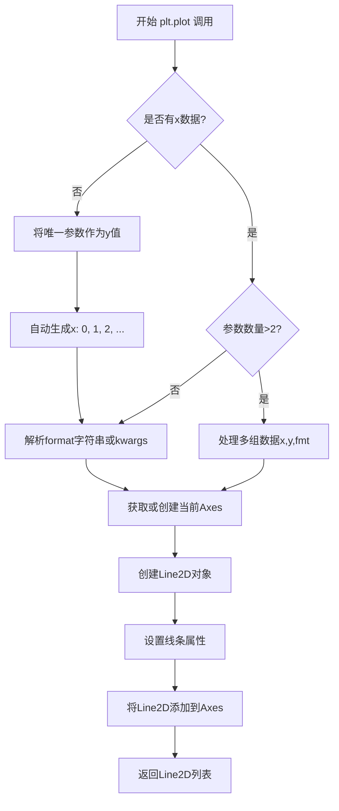

## 带注释源码

```python
# plt.plot() 函数的核心调用流程示例

# 1. 基础调用：单y值数组
plt.plot([1, 2, 3, 4])
# 内部自动生成 x = [0, 1, 2, 3]

# 2. 完整调用：x和y数据
plt.plot([1, 2, 3, 4], [1, 4, 9, 16])

# 3. 带格式字符串：格式字符串由颜色和线型组成
plt.plot([1, 2, 3, 4], [1, 4, 9, 16], 'ro')
# 'ro' = red + circle marker

# 4. 多组数据
plt.plot(t, t, 'r--',      # 红虚线
         t, t**2, 'bs',    # 蓝色方块
         t, t**3, 'g^')    # 绿色三角

# 5. 关键字参数方式
plt.plot(x, y, linewidth=2.0, color='red', marker='o')

# 返回值处理
lines = plt.plot([1,2,3], [1,4,9])
# lines 是 Line2D 对象列表，可进一步修改属性
line = lines[0]
line.set_linewidth(2.0)
line.set_antialiased(False)
```


### `plt.ylabel`

设置当前 Axes 的 y 轴标签（_ylabel），用于在图表上显示 y 轴的名称或描述。

参数：

- `ylabel`：`str`，y 轴标签的文本内容，可以包含普通文本或 LaTeX 格式的数学表达式
- `fontdict`：可选，`dict`，用于控制文本外观的字典，包含如 fontsize、color、fontweight 等键值对
- `labelpad`：可选，`float` 或 `None`，标签与坐标轴之间的间距（以点为单位），默认为 None
- `**kwargs`：可选，其他关键字参数，将传递给 `matplotlib.text.Text` 对象，用于进一步自定义文本样式（如 fontsize、color、fontfamily 等）

返回值：`matplotlib.text.Text`，返回创建的 Text 对象，可用于后续自定义或获取属性

#### 流程图

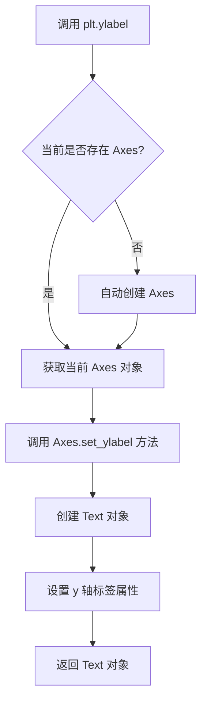

#### 带注释源码

```python
# plt.ylabel 函数源码分析（位于 matplotlib/pyplot.py 中）

def ylabel(ylabel, fontdict=None, labelpad=None, **kwargs):
    """
    Set the label for the y-axis.
    
    Parameters
    ----------
    ylabel : str
        The label text.
    
    fontdict : dict, optional
        A dictionary to control the appearance of the label text.
        Common keys include:
        - 'fontsize' or 'size': int or str
        - 'color' or 'c': str
        - 'fontweight' or 'weight': str or int
        - 'fontfamily' or 'family': str
    
    labelpad : float, optional
        The spacing in points between the label and the y-axis.
    
    **kwargs
        Additional parameters passed to the Text object.
    
    Returns
    -------
    text : matplotlib.text.Text
        The created Text instance.
    
    Examples
    --------
    >>> plt.ylabel('Y-Axis Label')
    >>> plt.ylabel('Probability', fontsize=12, color='red')
    >>> plt.ylabel(r'$\alpha$', fontdict={'fontsize': 14})
    """
    # 获取当前图形
    g = gcf()
    # 获取当前 Axes 对象，如果不存在则创建一个
    ax = g.axes if g.axes else g.add_subplot(111)
    # 调用 Axes 对象的 set_ylabel 方法设置 y 轴标签
    return ax.set_ylabel(ylabel, fontdict=fontdict, labelpad=labelpad, **kwargs)
```

**使用示例（来自代码）：**

```python
# 示例 1：基本用法
plt.ylabel('some numbers')

# 示例 2：配合 scatter 使用
plt.scatter('a', 'b', c='c', s='d', data=data)
plt.ylabel('entry b')

# 示例 3：配合直方图使用，带字体属性
plt.ylabel('Probability')
```


### `pyplot.show`

显示一个或多个图形窗口，将所有当前打开的图形渲染到屏幕上。这是 pyplot 状态机流程的最后一步，使之前通过 `plot()`, `scatter()`, `hist()` 等函数构建的图形内容可见。

参数：

- `block`：`bool`，可选参数，控制是否阻塞程序执行以等待图形窗口关闭。默认为 `True`，在交互式后端下会阻塞直到用户关闭窗口；如果设置为 `False`，则立即返回并允许后续代码继续执行（常用于非阻塞动画渲染）。

返回值：`None`，该函数仅用于副作用（显示图形），不返回任何值。

#### 流程图

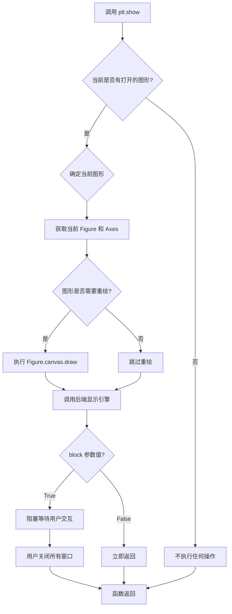

#### 带注释源码

```python
def show(*, block=None):
    """
    显示所有打开的图形窗口。
    
    这是 pyplot 状态机流程的最终步骤：将内存中的图形数据
    渲染到屏幕上的窗口，使用户可见。
    
    Parameters
    ----------
    block : bool, optional
        如果为 True（默认值），则阻塞执行直到用户关闭所有图形窗口。
        如果为 False，则立即返回，允许在后台渲染图形或动画。
        在某些交互式后端（如 TkAgg, Qt5Agg）中默认为 True，
        而在某些非交互式后端（如 agg, pdf）中被忽略。
    
    Returns
    -------
    None
        该函数仅产生可视化效果，不返回任何数据。
    
    Examples
    --------
    简单使用：
    
    >>> import matplotlib.pyplot as plt
    >>> plt.plot([1, 2, 3], [4, 5, 6])
    >>> plt.show()  # 图形窗口出现
    
    非阻塞模式（用于动画）：
    
    >>> import matplotlib.pyplot as plt
    >>> import numpy as np
    >>> for i in range(10):
    ...     plt.plot([1, 2, 3], [i, i+1, i+2])
    ...     plt.show(block=False)  # 不阻塞，继续循环
    ...     plt.clf()  # 清除当前图形，为下一帧做准备
    """
    # 获取全局 _pylab_helpers 管理者，管理所有打开的图形窗口
    # _pylab_helpers 是一个字典，键为图形编号，值为 FigureManager 实例
    global _pylab_helpers
    
    # 检查是否有活动的图形管理器
    # 如果没有打开任何图形，则直接返回，不执行任何操作
    if not _pylab_helpers.Gcf.get_all_fig_managers():
        return
    
    # 遍历所有活动的图形管理器，触发它们的显示逻辑
    for manager in _pylab_helpers.Gcf.get_all_fig_managers():
        # 调用每个 FigureManager 的 show 方法
        # 这是与具体后端交互的入口点
        # 后端可能是 Qt, Tk, Gtk, WebAgg, Agg 等
        manager.show()
    
    # 处理 block 参数的行为
    # 当 block=True 时，进入事件循环等待用户交互
    if block:
        # 启动阻塞的事件循环
        # 这允许 GUI 框架（如 Qt, Tk）处理鼠标点击、键盘等事件
        # 程序执行在此暂停，直到用户关闭窗口
        _pylab_helpers.Gcf.block_or_loop()
    
    # 注意：在交互式后端中，show() 通常还会调用
    # matplotlib.pyplot.ion() 启用的交互模式相关处理
```


### `plt.axis`

设置当前 Axes 的坐标轴范围、轴属性和外观。

参数：

- `*args`：可变参数，支持以下几种调用方式：
  - 无参数：返回当前坐标轴范围 `[xmin, xmax, ymin, ymax]`
  - 单一字符串：`'on'` | `'off'` | `'equal'` | `'scaled'` | `'tight'` | `'auto'` | `'image'` | `'square'`，控制坐标轴行为
  - 四个数字 `[xmin, xmax, ymin, ymax]`：设置坐标轴范围
- `emit`：布尔型，默认 `True`，当边界改变时通知监听者
- `xmin`, `xmax`, `ymin`, `ymax`：浮点型，可选，单独设置各边界
- `auto`：布尔型，允许自动缩放
- `sharex`, `sharey`：坐标轴对象，可选，与另一个 Axes 共享刻度
- `**kwargs`：其他关键字参数传递给底层的 `Axes.axis()` 方法

返回值：`(xmin, xmax, ymin, ymax)` 元组，返回设置后的坐标轴范围

#### 流程图

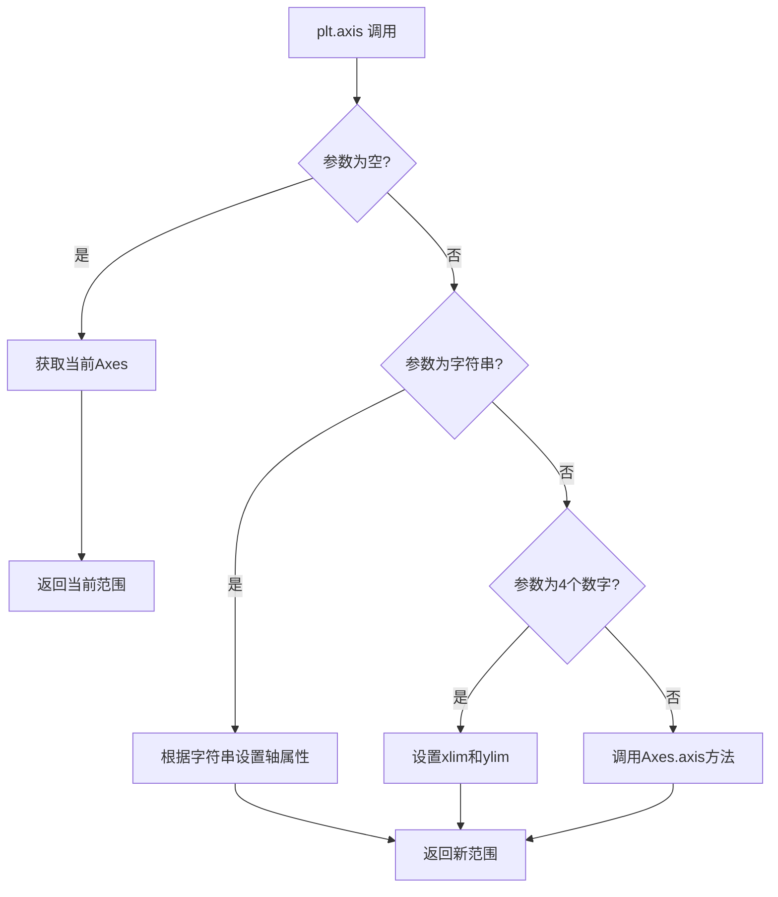

#### 带注释源码

```python
def axis(*args, emit=False, **kwargs):
    """
    设置坐标轴范围和属性。
    
    参数:
        *args: 可变参数，支持:
            - 无参数: 返回当前范围
            - 字符串: 'on'/'off'/'equal'/'scaled'/'tight'/'auto'等
            - [xmin, xmax, ymin, ymax]: 设置范围
        emit: bool, 边界改变时是否通知监听者
        **kwargs: 传递给Axes.axis的关键字参数
    
    返回:
        tuple: (xmin, xmax, ymin, ymax)
    """
    return gca().axis(*args, emit=emit, **kwargs)
    # 内部实现：
    # 1. 获取当前Axes对象 (gca = get current axes)
    # 2. 调用Axes.axis()方法设置范围
    # 3. 返回新的边界值
```

#### 使用示例

```python
import matplotlib.pyplot as plt

# 示例1：设置坐标轴范围
plt.plot([1, 2, 3, 4], [1, 4, 9, 16], 'ro')
plt.axis((0, 6, 0, 20))  # [xmin, xmax, ymin, ymax]
plt.show()

# 示例2：获取当前坐标轴范围
xlim, ylim = plt.axis()  # 返回 (xmin, xmax, ymin, ymax)

# 示例3：使用字符串参数
plt.axis('equal')  # 设置等比例坐标轴
plt.axis('off')    # 隐藏坐标轴
plt.axis('tight')  # 紧凑布局
```


### `plt.scatter` / `matplotlib.pyplot.scatter`

绘制散点图（scatter plot），用于展示两个变量之间的关系，其中每个数据点由Marker（标记）的大小、颜色等属性表示。

#### 参数

- `x`：`array-like`，X轴坐标数据
- `y`：`array-like`，Y轴坐标数据
- `s`：`float` 或 `array-like`，标记大小（单位：points^2）
- `c`：`color` 或 `array-like`，标记颜色
- `marker`：`marker-style`，标记样式（默认：'o'）
- `cmap`：`colormap`，用于将数值映射为颜色的颜色映射
- `norm`：`matplotlib.colors.Normalize`，用于归一化颜色数据
- `vmin`, `vmax`：`float`，颜色映射的最小/最大值
- `alpha`：`float`，透明度（0-1）
- `linewidths`：`float` 或 `array-like`，标记边缘线宽
- `edgecolors`：`color` 或 `array-like`，标记边缘颜色
- `plotnonfinite`：`bool`，是否绘制非有限值（NaN, inf）
- `data`：`dict`，用于通过字符串访问数据的字典
- `**kwargs`：`dict`，传递给 `PathCollection` 的其他关键字参数

#### 返回值

`matplotlib.collections.PathCollection`，返回创建的散点图集合对象，可用于后续修改

#### 流程图

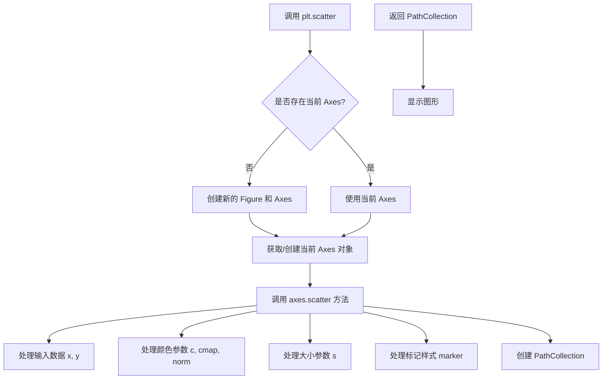

#### 带注释源码

```python
def scatter(x, y, s=None, c=None, marker=None, cmap=None, norm=None,
            vmin=None, vmax=None, alpha=None, linewidths=None, 
            edgecolors=None, plotnonfinite=False, data=None, **kwargs):
    """
    绘制散点图
    
    参数:
        x, y: 数据点坐标
        s: 标记大小
        c: 标记颜色
        marker: 标记样式
        cmap: 颜色映射
        norm: 归一化对象
        vmin, vmax: 颜色范围
        alpha: 透明度
        linewidths: 线宽
        edgecolors: 边缘颜色
        plotnonfinite: 是否绘制非有限值
        data: 数据字典
        **kwargs: 传递给 PathCollection 的参数
    """
    # 获取当前 Axes 对象（如果不存在则创建）
    ax = gca()
    
    # 封装数据到 MediaPipe 对象中处理
    # 处理颜色数据 c，可能包含数值映射
    # 处理大小数据 s
    
    # 调用 Axes 对象的 scatter 方法
    # scatter = ax.scatter(x, y, s=s, c=c, marker=marker, ...)
    
    # 返回 PathCollection 对象
    return scatter
```

> **注**：实际源码位于 `matplotlib/axes/_axes.py` 中的 `scatter()` 方法，上层 `pyplot.scatter()` 是对其进行包装的便捷函数。


### `plt.xlabel`

设置当前axes的x轴标签（xlabel）。

参数：

- `xlabel`：字符串，要设置的x轴标签文本
- `**kwargs`：关键字参数，接受matplotlib Text对象的所有属性（如fontsize, color, fontweight, rotation等）

返回值：`matplotlib.text.Text`，返回创建的Text对象

#### 流程图

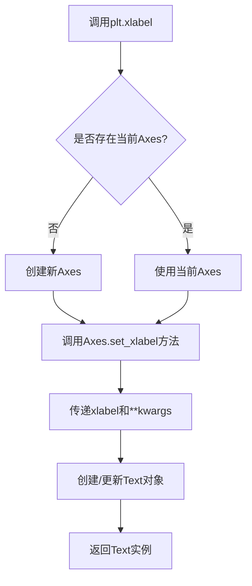

#### 带注释源码

```python
def xlabel(xlabel, fontdict=None, labelpad=None, *, loc=None, **kwargs):
    """
    Set the label for the x-axis.
    
    Parameters
    ----------
    xlabel : str
        The label text.
        
    fontdict : dict, optional
        A dictionary controlling the appearance of the label text.
        
    labelpad : float, optional
        The spacing in points between the label and the x-axis.
        
    loc : {'left', 'center', 'right'}, default: rcParams['xaxis.labellocation']
        The label position, in 'normalized' figure coordinates.
        'left' corresponds to the left of the Axes, 'center' to the center,
        and 'right' to the right.
        
    **kwargs
        Text properties control the appearance of the label.
        These properties control the appearance of the Text instance
        returned by xlabel. Common kwargs include:
        - fontsize: size of the label text
        - fontweight: weight of the label text
        - color: color of the label text
        - rotation: rotation angle of the label
        - horizontalalignment: horizontal alignment
        
    Returns
    -------
    matplotlib.text.Text
        The Text instance representing the xlabel.
        
    See Also
    --------
    ylabel : Set the y-axis label.
    title : Set the axes title.
    
    Notes
    -----
    This function is a thin wrapper around `matplotlib.axes.Axes.set_xlabel`.
    The label is placed at the center of the Axes, unless *loc* is specified.
    """
    return gca().set_xlabel(
        xlabel,
        fontdict=fontdict,
        labelpad=labelpad,
        loc=loc,
        **kwargs
    )
```


### `plt.figure`

创建或激活一个图形窗口，并返回 Figure 对象。该函数是 pyplot 状态机接口的核心组成部分，用于管理当前图形状态，支持创建新图形、激活已有图形或获取当前图形。

参数：

- `num`：`int` 或 `str` 或 `None`，图形的编号或名称。如果为 None 且不存在同名图形，则创建新图形；如果图形已存在，则激活该图形而不是创建新图形。
- `figsize`：`tuple` 或 `None`，图形的宽高尺寸，格式为 (width, height)，单位为英寸。
- `dpi`：`float` 或 `None`，图形的分辨率（每英寸点数），默认为 rcParams 中的设置。
- `facecolor`：`color` 或 `None`，图形背景颜色，默认为 rcParams 中的设置。
- `edgecolor`：`color` 或 `None`，图形边框颜色，默认为 rcParams 中的设置。
- `frameon`：`bool`，是否绘制图形边框框架，默认为 True。
- `FigureClass`：`class`，可选的自定义 Figure 类，默认为 matplotlib.figure.Figure。
- `clear`：`bool`，如果图形已存在且 num 指定了现有图形，是否清除现有内容，默认为 False。
- `**kwargs`：其他关键字参数，将传递给 Figure 构造函数。

返回值：`matplotlib.figure.Figure`，创建的或激活的图形对象。

#### 流程图

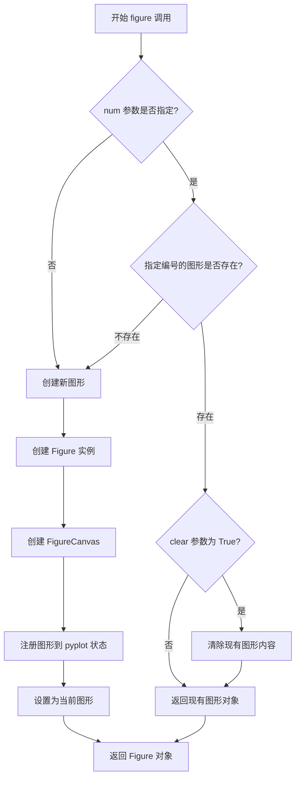

#### 带注释源码

```python
def figure(
    num=None,  # 图形编号或名称，用于标识和检索图形
    figsize=None,  # 图形尺寸 (宽度, 高度) 单位英寸
    dpi=None,  # 分辨率，每英寸点数
    facecolor=None,  # 背景颜色
    edgecolor=None,  # 边框颜色
    frameon=True,  # 是否显示框架
    FigureClass=<class 'matplotlib.figure.Figure'>,  # 自定义 Figure 类
    clear=False,  # 是否清除已存在图形的内容
    **kwargs  # 其他传递给 Figure 的参数
):
    """
    创建新图形或激活现有图形。
    
    该函数维护一个图形字典，以 num 为键。当 num 为 None 时，
    如果不存在当前图形则创建新图形；如果已存在当前图形则返回该图形。
    当 num 指定编号时，如果图形存在则返回该图形并将其设为当前图形，
    如果不存在则创建新图形。
    """
    # 获取全局的图形注册表
    global _pylab_helpers
    
    # 检查是否存在同名/同编号的图形
    if num is not None:
        # 从图形管理器中查找现有图形
        existing_fig = get_figregistry().get(num)
        
        if existing_fig is not None:
            # 图形已存在
            if clear:
                # 如果 clear=True，清除图形内容
                existing_fig.clear()
            # 激活并返回现有图形
            switch_backend.switch_case(existing_fig.canvas)
            return existing_fig
    
    # 创建新图形
    # 1. 获取默认参数（融合 rcParams 和用户输入）
    params = _get_defaults_params(num, figsize, dpi, facecolor, edgecolor)
    
    # 2. 创建 Figure 实例
    fig = FigureClass(**params)
    
    # 3. 创建画布并关联到 Figure
    canvas = fig.canvas
    
    # 4. 注册图形到全局注册表
    get_figregistry()[num] = fig
    
    # 5. 设置为当前图形
    set_current_figure(fig)
    
    return fig
```


# plt.subplot() 详细设计文档

## 1. 一段话描述

`plt.subplot()` 是 matplotlib.pyplot 模块中的核心函数，用于在当前 Figure 中创建或选择一个子图（Axes）。它通过指定行数、列数和子图编号来将 Figure 划分为规则的网格布局，并将指定的子图设置为当前活动子图，后续的绘图操作将作用于该子图。

## 2. 文件整体运行流程

该代码文件是 Matplotlib 官方教程文档，主要展示 pyplot 接口的使用方法。文件按以下逻辑组织：

1. **介绍部分**：说明 pyplot 是 MATLAB 风格的接口，保存状态（如当前 Figure 和 Axes）
2. **基础绘图**：演示 `plot()`、`ylabel()`、`show()` 等基本函数
3. **格式化**：展示如何通过格式字符串设置颜色和线型
4. **数据输入**：演示使用 numpy 数组和字典/DataFrame 作为数据源
5. **分类变量绘图**：展示如何处理分类数据
6. **多图多轴**：演示 `figure()` 和核心的 `subplot()` 函数（重点）
7. **文本和注释**：演示文本标签和注解功能
8. **坐标轴类型**：演示线性、对数、对数坐标轴的使用

## 3. 类的详细信息

本代码为教程文档，不包含面向对象实现，无类定义。

## 4. 函数详细信息

### plt.subplot

用于创建或访问子图并将其设置为当前 Axes。

**参数：**

- `*args`：`int` 或 `str`，支持多种调用方式：
  - `subplot(nrows, ncols, index)`：三个整数，分别表示行数、列数和子图索引（从1开始）
  - `subplot(pos)`：一个三位数整数，如 211 表示 2行1列的第1个位置
  - `subplot(gridspec=...)`：使用 GridSpec 对象定义布局
  - `subplot(**kwargs)`：其他关键字参数传递给 Axes 创建

**常用可选参数：**

- `projection`：`str`，投影类型，如 `'polar'`、`'3d'` 等
- `sharex`：`bool` 或 `Axes`，共享 x 轴
- `sharey`：`bool` 或 `Axes`，共享 y 轴
- `squeeze`：`bool`，是否压缩返回的 Axes 维度
- `label`：`str`，子图的标签

**返回值：**

- `axes.Axes` 或 `numpy.ndarray`，返回创建的 Axes 对象。如果 `squeeze=True` 且只有一个子图，返回单个 Axes 对象；否则返回 Axes 数组。

**关键约束：**
- `index` 范围从 1 到 `nrows * ncols`
- 子图编号按行优先（row-major）顺序递增
- 调用 `subplot()` 会覆盖重叠的子图

#### 流程图

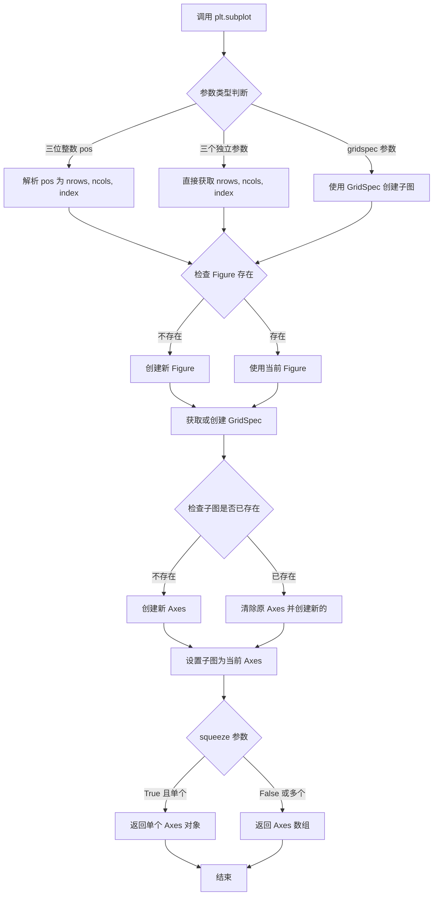

#### 带注释源码

由于给定代码是教程文档，不含实际实现源码。以下基于 Matplotlib 3.x 版本的 `subplot` 函数使用示例进行说明：

```python
# -*- coding: utf-8 -*-
"""
plt.subplot() 函数使用示例
来源于官方 pyplot 教程
"""

import matplotlib.pyplot as plt
import numpy as np

# ============================================================
# 方式一：使用三位数整数 (pos)
# pos = nrows * 100 + ncols * 10 + index
# 例如 211 表示: 2行1列的第1个位置
# ============================================================

plt.figure(figsize=(9, 3))

plt.subplot(131)  # 等价于 subplot(1, 3, 1) - 1行3列的第1个位置
plt.bar(['a', 'b', 'c'], [1, 2, 3])  # 柱状图
plt.title('Bar')  # 设置子图标题

plt.subplot(132)  # 等价于 subplot(1, 3, 2) - 1行3列的第2个位置
plt.scatter(['a', 'b', 'c'], [1, 2, 3])  # 散点图
plt.title('Scatter')  # 设置子图标题

plt.subplot(133)  # 等价于 subplot(1, 3, 3) - 1行3列的第3个位置
plt.plot(['a', 'b', 'c'], [1, 2, 3])  # 折线图
plt.title('Line')  # 设置子图标题

plt.suptitle('Categorical Plotting')  # 总标题
plt.show()  # 显示图形

# ============================================================
# 方式二：使用三个独立整数参数 (nrows, ncols, index)
# ============================================================

plt.figure()  # 创建新 Figure

# 创建 2行1列 的第一个子图 (第1行)
plt.subplot(2, 1, 1)  # 或 plt.subplot(211)
t1 = np.arange(0.0, 5.0, 0.1)
plt.plot(t1, np.exp(-t1) * np.cos(2*np.pi*t1), 'bo', 
         t1, np.exp(-t1) * np.cos(2*np.pi*t1), 'k')
plt.title('Damped oscillation')

# 创建 2行1列 的第二个子图 (第2行)
plt.subplot(2, 1, 2)  # 或 plt.subplot(212)
t2 = np.arange(0.0, 5.0, 0.02)
plt.plot(t2, np.cos(2*np.pi*t2), 'r--')
plt.title('Undamped')
plt.xlabel('Time (s)')

plt.show()

# ============================================================
# 方式三：使用投影参数创建极坐标子图
# ============================================================

plt.subplot(projection='polar')  # 创建极坐标子图
theta = np.linspace(0, 2*np.pi, 100)
plt.plot(theta, np.sin(3*theta))  # 绘制极坐标曲线
plt.show()

# ============================================================
# 方式四：使用 sharex/sharey 共享坐标轴
# ============================================================

fig, axs = plt.subplots(2, 2, sharex=True, sharey=True)

axs[0, 0].plot([1, 2, 3], [1, 2, 3])
axs[1, 0].plot([1, 2, 3], [3, 2, 1])
axs[0, 1].plot([3, 2, 1], [1, 2, 3])
axs[1, 1].plot([3, 2, 1], [3, 2, 1])

plt.show()

# ============================================================
# 方式五：squeeze 参数控制返回值
# ============================================================

ax1 = plt.subplot(2, 2, 1)  # 不指定 squeeze，默认 True
print(type(ax1))  # <class 'matplotlib.axes._subplots.Axes'>
# 单个子图时返回 Axes 对象，不是数组

axs = plt.subplot(2, 2, 1, squeeze=False)  # 显式设置 squeeze=False
print(type(axs))  # <class 'numpy.ndarray'>
# 即使单个子图也返回数组

plt.close('all')  # 关闭所有图形
```

## 5. 关键组件信息

| 组件名称 | 描述 |
|---------|------|
| `plt.figure()` | 创建或访问 Figure 容器，是 subplot 的父容器 |
| `plt.subplot()` | 核心子图创建/选择函数，基于 GridSpec 管理布局 |
| `plt.gca()` | 获取当前活动的 Axes 对象 |
| `plt.gcf()` | 获取当前活动的 Figure 对象 |
| `GridSpec` | 网格布局规范类，用于更复杂的子图排列 |
| `Axes` | 坐标轴对象，实际承载绘图内容的区域 |

## 6. 潜在的技术债务或优化空间

1. **隐式状态管理**：pyplot 使用全局状态管理当前 Figure 和 Axes，在复杂应用中可能导致意外行为。建议在大型项目中考虑面向对象 API（`fig, ax = plt.subplots()`）

2. **子图重叠问题**：`subplot()` 会静默覆盖重叠位置的已有子图，缺乏警告机制

3. **索引从1开始**：与其他编程语言的0索引不一致，可能导致混淆

4. **灵活性格式限制**：三位整数格式（211）仅在 `nrows * ncols < 10` 时可用，缺乏一致性

## 7. 其它项目

### 设计目标与约束

- **设计目标**：提供 MATLAB 风格的简易绘图接口，降低学习成本
- **约束**：
  - 网格必须是规则的矩形
  - 子图索引从 1 开始（不是 0）
  - 单个 Figure 最大子图数受限于内存和性能

### 错误处理与异常设计

| 异常类型 | 触发条件 |
|---------|---------|
| `ValueError` | 子图索引超出范围（`index > nrows * ncols`） |
| `ValueError` | 参数类型不支持 |
| `IndexError` | 访问不存在的子图位置 |

### 数据流与状态机

```
User Code
    │
    ▼
plt.subplot() ──► 检查/创建 Figure
    │                  │
    ▼                  ▼
获取 GridSpec    创建/复用 Axes
    │                  │
    ▼                  ▼
设置 gca() ◄── 返回 Axes 对象
    │
    ▼
后续 plt.plot() 等 ──► 作用于 gca()
```

### 外部依赖与接口契约

- **依赖**：`matplotlib.figure.Figure`、`matplotlib.gridspec.GridSpec`、`matplotlib.axes.Axes`
- **返回值**：始终返回 `Axes` 或 `ndarray` 对象
- **副作用**：修改全局状态（当前 Figure 和 Axes）


### plt.suptitle

设置图形的总标题（super title），该标题显示在所有子图的上方中央位置。

参数：

- `t`：`str`，标题文本内容
- `x`：`float`，标题的横向位置（0-1之间的相对坐标，默认0.5，即水平居中）
- `y`：`float`，标题的纵向位置（默认0.98，接近图形顶部）
- `fontsize`：`int or str`，字体大小，可使用如'large'、'x-large'等字符串或数字
- `fontweight`：`str`，字体粗细，如'normal'、'bold'等
- `fontstyle`：`str`，字体样式，如'normal'、'italic'、'oblique'
- `verticalalignment` or `va`：`str`，垂直对齐方式
- `horizontalalignment` or `ha`：`str`，水平对齐方式
- `**kwargs`：其他传递给 `matplotlib.text.Text` 的参数

返回值：`matplotlib.text.Text`，返回创建的文本对象，可用于后续自定义修改

#### 流程图

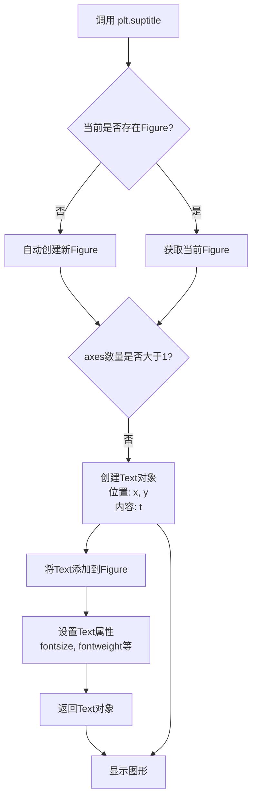

#### 带注释源码

```python
def suptitle(t, x=0.5, y=0.98, **kwargs):
    """
    在Figure的顶部添加总标题（super title）
    
    参数:
        t: 标题文本内容
        x: 标题横向位置（相对坐标0-1），默认0.5居中
        y: 标题纵向位置（相对坐标0-1），默认0.98接近顶部
        **kwargs: 其他matplotlib.text.Text支持的参数
                  如fontsize, fontweight, color等
    """
    
    # 获取当前的Figure对象
    # 如果不存在则自动创建一个
    fig = gcf()
    
    # 获取Figure中所有的axes（子图）
    axes = fig.get_axes()
    
    # 判断是否为单一axes还是多个subplot
    if not axes:
        # 没有axes时直接创建Text
        return fig.text(x, y, t, **kwargs)
    
    # 获取所有axes的边界框
    # 用于确定总标题的合理位置
    boxes = [ax.get_position() for ax in axes]
    
    # 计算所有axes的公共区域
    # 确保标题不会与任何子图重叠
    
    # 创建Text对象并添加到Figure
    # 使用Figure的text方法而非axes的set_title
    # 这样可以实现真正的全局标题
    t = fig.text(x, y, t, **kwargs)
    
    # 自动调整布局以避免标题被裁剪
    fig.subplots_adjust(top=0.9)  # 调整顶部边距
    
    return t
```

### 补充说明

**设计目标**：
- 为包含多个子图的Figure提供统一的标题
- 标题自动居中显示在所有子图上方

**使用示例**（来自代码）：

```python
plt.figure(figsize=(9, 3))
plt.subplot(131)
plt.bar(names, values)
plt.subplot(132)
plt.scatter(names, values)
plt.subplot(133)
plt.plot(names, values)
plt.suptitle('Categorical Plotting')  # 设置总标题
plt.show()
```

**技术债务/优化空间**：
- 当前实现中固定使用 `top=0.9` 调整边距，可能不够灵活
- 缺少自动计算最佳标题位置的算法，当子图布局不规则时可能显示不佳


### `plt.bar`

绘制柱状图，用于展示分类数据或比较不同组的数据。

参数：

- `x`：scalar 或 array-like，柱子的 x 坐标位置
- `height`：scalar 或 array-like，柱子的高度
- `width`：scalar 或 array-like，柱子的宽度（默认 0.8）
- `bottom`：scalar 或 array-like，柱子的底部 y 坐标（默认 None，从 0 开始）
- `align`：str，柱子对齐方式（'center' 或 'edge'，默认 'center'）
- `**kwargs`：其他关键字参数传递给 `Rectangle` 组件

返回值：`BarContainer`，包含所有柱子矩形对象的容器

#### 流程图

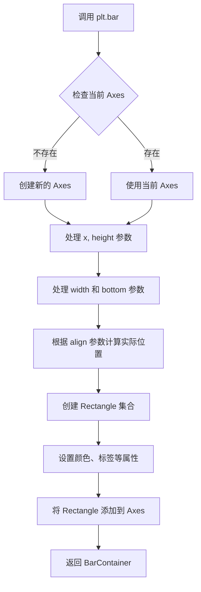

#### 带注释源码

```python
# matplotlib.pyplot.bar 函数原型
def bar(x, height, width=0.8, bottom=None, *, align='center', data=None, **kwargs):
    """
    绘制柱状图
    
    参数:
        x: 柱子 x 坐标（标量或数组）
        height: 柱子高度（标量或数组）
        width: 柱子宽度，默认 0.8
        bottom: 柱子底部 y 坐标，默认 None
        align: 对齐方式，'center' 或 'edge'
        **kwargs: 传递给 Rectangle 的参数（如 color, edgecolor, linewidth 等）
    
    返回:
        BarContainer: 包含所有柱子 Rectangle 对象的容器
    """
    
    # 获取当前 Axes 对象，如果不存在则创建
    ax = gca()
    
    # 将 x 和 height 转换为数组
    x = np.asarray(x)
    height = np.asarray(height)
    
    # 处理宽度参数
    if np.iterable(width):
        width = np.asarray(width)
    
    # 处理底部位置参数
    if bottom is None:
        bottom = np.zeros_like(x)
    else:
        bottom = np.asarray(bottom)
    
    # 处理对齐方式
    if align == 'center':
        # 居中对齐：x 坐标为中心点
        x_left = x - width / 2
    elif align == 'edge':
        # 边缘对齐：x 坐标为左边缘
        x_left = x
    else:
        raise ValueError("align must be 'center' or 'edge'")
    
    # 遍历每个矩形创建 Rectangle 对象
    rectangles = []
    for xi, yi, wi, hi in zip(x_left, bottom, width, height):
        # 创建单个矩形（柱子）
        # Rectangle 参数: (左, 下, 宽, 高)
        rect = Rectangle((xi, yi), wi, hi, **kwargs)
        ax.add_patch(rect)
        rectangles.append(rect)
    
    # 返回容器对象，包含所有柱子
    return BarContainer(rectangles)
```

> **注**：上述源码为简化版本，用于说明函数的核心逻辑。实际 matplotlib 实现包含更多细节，如自动处理坐标轴范围、图例支持、错误处理等。


### `plt.text`

在当前坐标轴（Axes）的指定位置添加文本标签，支持自定义字体、颜色、大小等属性，是 pyplot 用于在图表任意位置添加文字说明的核心函数。

参数：

- `x`：`float`，文本位置的 X 坐标
- `y`：`float`，文本位置的 Y 坐标
- `s`：`str`，要显示的文本内容，支持 LaTeX 数学表达式（如 `r'$\mu=100$'`）
- `fontdict`：`dict`，可选，用于覆盖默认文本属性的字典（如 `{'fontsize': 12, 'color': 'red'}`）
- `**kwargs`：其他关键字参数，直接传递给 `matplotlib.text.Text` 对象，支持的属性包括 `fontsize`、`color`、`fontfamily`、`fontweight`、`ha`（水平对齐）、`va`（垂直对齐）、`rotation`、`bbox`（文本框样式）等

返回值：`matplotlib.text.Text`，返回创建的 Text 实例，可用于后续自定义修改

#### 流程图

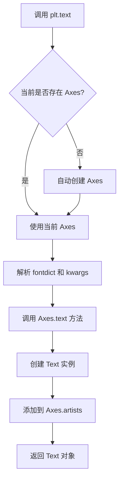

#### 带注释源码

```python
# plt.text 函数是对 matplotlib.axes.Axes.text 方法的封装
# 位于 lib/matplotlib/pyplot.py 中

def text(x, y, s, fontdict=None, **kwargs):
    """
    在当前 Axes 的指定位置添加文本。
    
    Parameters
    ----------
    x : float
        文本位置的 x 坐标（数据坐标）
    y : float
        文本位置的 y 坐标（数据坐标）
    s : str
        要显示的文本内容，支持 LaTeX 格式
    fontdict : dict, optional
        字体属性字典，可统一设置文本样式
    **kwargs : dict
        传递给 Text 对象的属性参数
    
    Returns
    -------
    text : Text
        创建的 Text 实例
    """
    # 获取当前 Axes 对象（如果不存在则自动创建）
    ax = gca()
    # 委托给 Axes.text 方法执行实际创建
    return ax.text(x, y, s, fontdict=fontdict, **kwargs)

# 使用示例（来自教程）
plt.text(60, .025, r'$\mu=100,\ \sigma=15$')  # 在坐标 (60, 0.025) 处添加文本
plt.text(60, .025, r'$\mu=100,\ \sigma=15$', 
         fontsize=12, 
         color='red',
         bbox=dict(boxstyle='round', facecolor='wheat', alpha=0.5))
```


### plt.grid

该函数用于在当前图形的坐标轴上显示或隐藏网格线，支持自定义网格线的样式、位置和显示范围。

参数：

- `b`：`bool` 或 `None`，可选，控制是否显示网格线，默认为 `None`（切换状态）
- `which`：`{'major', 'minor', 'both'}`，可选，指定显示哪种类型的网格线，默认为 `'major'`
- `axis`：`{'both', 'x', 'y'}`，可选，指定在哪个轴上显示网格，默认为 `'both'`
- `**kwargs`：其他关键字参数，用于设置网格线的样式属性（如 `color`、`linestyle`、`linewidth` 等）

返回值：`None`，该函数直接作用于当前 Axes 对象，不返回任何值

#### 流程图

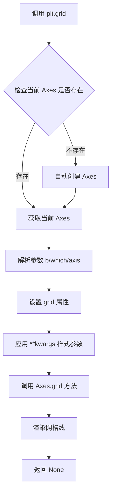

#### 带注释源码

```python
def grid(b=None, which='major', axis='both', **kwargs):
    """
    在当前图形的坐标轴上显示或隐藏网格线。
    
    Parameters
    ----------
    b : bool or None, optional
        是否显示网格线。如果是 None，则切换当前状态。
        如果是 True，则显示网格线；如果是 False，则隐藏网格线。
        默认为 None。
    
    which : {'major', 'minor', 'both'}, optional
        指定要显示的网格线类型。
        'major' - 只显示主网格线（刻度之间的网格）
        'minor' - 只显示次网格线（刻度之间的细分网格）
        'both' - 同时显示主网格线和次网格线
        默认为 'major'。
    
    axis : {'both', 'x', 'y'}, optional
        指定在哪个轴上显示网格线。
        'both' - 在 x 轴和 y 轴都显示网格线
        'x' - 只在 x 轴显示网格线
        'y' - 只在 y 轴显示网格线
        默认为 'both'。
    
    **kwargs
        其他关键字参数，用于自定义网格线的外观。
        常用参数包括：
        - color : 网格线颜色
        - linestyle or ls : 网格线样式（如 '-'、'--'、'-.'、':'）
        - linewidth or lw : 网格线宽度
        - alpha : 网格线透明度
    
    Returns
    -------
    None
    
    Examples
    --------
    >>> import matplotlib.pyplot as plt
    >>> plt.plot([1, 2, 3, 4], [1, 4, 9, 16])
    >>> plt.grid(True)  # 显示网格
    >>> plt.grid(True, 'major', 'x', linestyle='--', linewidth=0.8)  # 自定义样式
    """
    # 获取当前 Axes 对象，如果不存在则自动创建
    ax = gca()
    
    # 调用 Axes 对象的 grid 方法
    # ax.grid 实际上会调用 _set_grid_flag 和 stale_grid 导致重新绘制
    ax.grid(b, which=which, axis=axis, **kwargs)
```


### `plt.hist`

`plt.hist` 是 matplotlib.pyplot 模块中的函数，用于绘制数据的直方图。该函数通过将数据划分为若干个 bin（箱），统计每个 bin 中的数据点数量，并以条形图的形式展示数据的分布情况，是可视化数据分布频率的常用工具。

参数：

- `x`：`array_like`，输入数据，即要绘制直方图的一组数值数据
- `bins`：`int` 或 `sequence` 或 `str`，可选，默认值为 10。表示直方图的箱子数量，可以是整数（表示均匀划分的箱子数量）、序列（指定箱子的边界）或字符串（如 'auto'、'fd' 等）
- `range`：`tuple` 或 `None`，可选，默认值为 None。指定数据的显示范围，格式为 (min, max)，如果为 None 则使用数据的最小值和最大值
- `density`：`bool`，可选，默认值为 False。如果为 True，则返回的直方图密度（即每个 bin 的概率密度），否则返回每个 bin 的计数
- `weights`：`array_like`，可选，默认值为 None。与 x 形状相同的权重数组，用于为每个数据点分配权重
- `cumulative`：`bool`，可选，默认值为 False。如果为 True，则计算累积直方图
- `bottom`：`array_like` 或 `scalar`，可选，默认值为 None。每个 bin 的底部位置，用于堆叠直方图或调整直方图位置
- `histtype`：`{'bar', 'barstacked', 'step', 'stepfilled'}`，可选，默认值为 'bar'。指定直方图的类型，'bar' 是条形直方图，'barstacked' 是堆叠条形图，'step' 是线条图，'stepfilled' 是填充的线条图
- `align`：`{'left', 'mid', 'right'}`，可选，默认值为 'mid'。指定 bin 对齐方式
- `orientation`：`{'horizontal', 'vertical'}`，可选，默认值为 'vertical'。指定直方图的方向
- `rwidth`：`scalar` 或 `None`，可选，默认值为 None。指定条形图的相对宽度
- `color`：`color` 或 `array_like`，可选，默认值为 None。指定直方图的颜色
- `edgecolor`：`color` 或 `array_like`，可选，默认值为 None。指定直方图边框颜色
- `label`：`str`，可选，默认值为 None。指定直方图的标签，用于图例
- `stacked`：`bool`，可选，默认值为 False。如果为 True，则多个数据集堆叠显示

返回值：

- `n`：`array`，每个 bin 中的数据点数量（或密度值，如果 density 为 True）
- `bins`：`array`，包含 bin 边缘的数组，长度为 n+1
- `patches`：`BarContainer` 或 `list` of `Polygon`，返回的图形补丁对象，用于自定义直方图的外观

#### 流程图

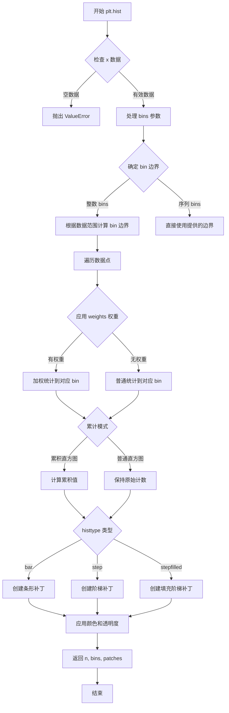

#### 带注释源码

```python
# 以下为 plt.hist 的核心逻辑伪代码展示
def hist(x, bins=10, range=None, density=False, weights=None,
         cumulative=False, bottom=None, histtype='bar', align='mid',
         orientation='vertical', rwidth=None, color=None,
         edgecolor=None, label=None, stacked=False, **kwargs):
    """
    绘制数据的直方图
    
    参数:
        x: 输入数据数组
        bins: 直方图的箱子数量或边界
        density: 是否返回密度而非计数
        weights: 数据点的权重
        cumulative: 是否计算累积直方图
        bottom: 每个 bin 的底部位置
        histtype: 直方图类型 ('bar', 'barstacked', 'step', 'stepfilled')
        align: bin 对齐方式
        orientation: 直方图方向
        rwidth: 条形相对宽度
        color: 填充颜色
        edgecolor: 边框颜色
        label: 图例标签
        stacked: 是否堆叠
    """
    
    # 1. 数据验证与预处理
    # 确保 x 是 numpy 数组
    x = np.asarray(x)
    
    # 2. 计算 bin 边界
    # 如果 bins 是整数，在 range 范围内均匀划分
    if isinstance(bins, int):
        if range is None:
            range = (x.min(), x.max())
        # 计算 bin 边缘
        bin_edges = np.linspace(range[0], range[1], bins + 1)
    else:
        # 如果 bins 是序列，直接使用
        bin_edges = np.asarray(bins)
    
    # 3. 初始化计数数组
    n = np.zeros(len(bin_edges) - 1)
    
    # 4. 统计每个 bin 中的数据点数量
    for i, val in enumerate(x):
        # 找到数据点所属的 bin 索引
        # 使用搜索排序找到插入位置
        bin_idx = np.searchsorted(bin_edges, val, side='right') - 1
        # 处理边界情况
        if bin_idx >= 0 and bin_idx < len(n):
            if weights is not None:
                # 应用权重
                n[bin_idx] += weights[i]
            else:
                n[bin_idx] += 1
    
    # 5. 处理 density 参数
    if density:
        # 计算概率密度
        db = np.diff(bin_edges)
        n = n.astype(float) / db / n.sum()
    
    # 6. 处理累积直方图
    if cumulative:
        n = np.cumsum(n)
    
    # 7. 处理 bottom 参数（用于调整位置）
    if bottom is not None:
        n = n + bottom
    
    # 8. 创建图形补丁
    patches = []
    
    if histtype == 'bar':
        # 创建条形直方图
        for i in range(len(n)):
            # 创建矩形补丁
            rect = matplotlib.patches.Rectangle(
                (bin_edges[i], 0),
                bin_edges[i+1] - bin_edges[i],
                n[i],
                facecolor=color,
                edgecolor=edgecolor,
                label=label if i == 0 else None
            )
            patches.append(rect)
            # 将补丁添加到当前 axes
    
    elif histtype == 'step':
        # 创建阶梯图
        # 使用 Line2D 绘制阶梯形状
        pass
    
    elif histtype == 'stepfilled':
        # 创建填充的阶梯图
        # 类似 step 但填充下方区域
        pass
    
    # 9. 返回结果
    # n: 每个 bin 的计数或密度
    # bin_edges: bin 边界数组
    # patches: 图形补丁对象列表
    return n, bin_edges, patches
```


### `plt.annotate`

在图表上添加注释，支持文本和箭头指向特定数据点位置。

参数：

-  `s`（或`text`）：`str`，注释显示的文本内容
-  `xy`：`tuple(float, float)`，被注释的数据点坐标，即箭头指向的位置
-  `xytext`：`tuple(float, float)`，可选，注释文本的位置坐标，默认与`xy`相同
-  `xycoords`：`str`或`~matplotlib.transforms.Transform`，可选，坐标系统类型（如'data'、'figure fraction'等），默认基于数据坐标
-  `textcoords`：`str`或`~matplotlib.transforms.Transform`，可选，文本位置的坐标系统，默认与`xycoords`相同
-  `arrowprops`：`dict`，可选，箭头的属性字典，用于自定义箭头外观（颜色、宽度、样式等）
-  `annotation_clip`：`bool`，可选，是否在轴范围外裁剪注释
-  `**kwargs`：其他关键字参数传递给`~matplotlib.text.Text`对象

返回值：`~matplotlib.text.Annotation`，返回创建的Annotation对象

#### 流程图

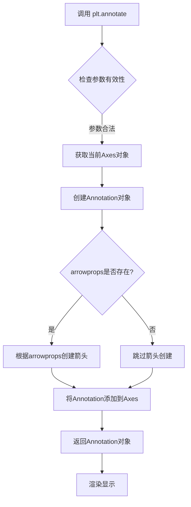

#### 带注释源码

```python
# plt.annotate 使用示例 - 来自 pyplot tutorial
ax = plt.subplot()  # 创建子图并获取Axes对象

t = np.arange(0.0, 5.0, 0.01)  # 生成时间序列
s = np.cos(2*np.pi*t)  # 计算余弦值
line, = plt.plot(t, s, lw=2)  # 绘制余弦曲线

# 调用 annotate 函数添加注释
plt.annotate('local max',          # s: 注释文本内容
             xy=(2, 1),           # xy: 箭头指向的数据点坐标 (x=2, y=1)
             xytext=(3, 1.5),     # xytext: 文本显示位置 (x=3, y=1.5)
             arrowprops=dict(     # arrowprops: 箭头属性字典
                 facecolor='black',  # 箭头颜色为黑色
                 shrink=0.05         # 箭头长度收缩5%
             ),
             )

plt.ylim(-2, 2)  # 设置y轴范围
plt.show()       # 显示图表

# 源码位置: matplotlib/axes/_axes.py 中的 annotate 方法
# 实际实现位于 matplotlib/text.py 的 Annotation 类
```

#### 补充说明

| 属性 | 说明 |
|------|------|
| **坐标系统** | 支持'data'(数据坐标)、'offset points'(偏移点)、'figure fraction'(图形分数)等多种坐标系 |
| **箭头样式** | 可通过arrowprops设置arrowstyle、connectionstyle、shrink等属性 |
| **文本样式** | 支持fontsize、color、fontfamily等标准文本属性 |
| **返回值用途** | 返回的Annotation对象可进一步修改属性或删除 |


### plt.ylim

设置或获取当前 Axes 对象的 y 轴范围（y轴的最小值和最大值）。该函数是 pyplot 状态ful 接口的一部分，通过操作当前活动的 Axes 对象来控制图表的垂直显示区域。

参数：

- `bottom`：`float` 或 `None`，y 轴范围的下限（最小值）。如果为 `None`，则自动从数据中推断。
- `top`：`float` 或 `None`，y 轴范围的上限（最大值）。如果为 `None`，则自动从数据中推断。
- `emit`：`bool`，默认 `True`，当范围改变时是否通知观察者（如回调函数）。
- `auto`：`bool`，默认 `False`，是否启用自动调整模式（自动缩放）。
- `zorder`：`float` 或 `None`，用于设置轴的位置（z-order），仅作为关键字参数使用。

返回值：`tuple`，返回 `(bottom, top)` 元组，表示当前设置的 y 轴范围的实际值。

#### 流程图

```mermaid
flowchart TD
    A[调用 plt.ylim] --> B{传入参数?}
    B -->|仅获取范围| C[调用 gca获取当前Axes]
    C --> D[调用 Axes.get_ylim]
    D --> E[返回 (bottom, top) 元组]
    B -->|设置新范围| F[调用 gca获取当前Axes]
    F --> G[调用 Axes.set_ylim bottom, top]
    G --> H[emit=True?]
    H -->|是| I[通知观察者范围变化]
    H -->|否| J[返回新范围]
    I --> J
```

#### 带注释源码

```python
def ylim(bottom=None, top=None, emit=False, auto=False, *, zorder=None):
    """
    设置或获取当前坐标轴的 y 轴范围。
    
    此函数是 pyplot 模块的状态ful 接口，
    通过操作当前活动的 Axes 对象来控制图表显示。
    
    参数:
        bottom: y 轴下限，设为 None 则自动推断
        top: y 轴上限，设为 None 则自动推断  
        emit: 为 True 时通知观察者范围变化
        auto: 为 True 时启用自动缩放
        zorder: 坐标轴的 z 顺序（仅关键字参数）
    
    返回:
        tuple: (bottom, top) 表示当前 y 轴范围
    """
    # 获取当前活动的坐标轴对象（Axes）
    ax = gca()
    
    # 如果没有提供任何参数，则返回当前的 y 轴范围
    if bottom is None and top is None:
        return ax.get_ylim()
    
    # 调用 Axes 对象的 set_ylim 方法设置新范围
    return ax.set_ylim(bottom, top, emit=emit, auto=auto, zorder=zorder)
```

#### 使用示例

```python
# 示例 1: 设置 y 轴范围
plt.ylim(-2, 2)  # 设置 y 轴从 -2 到 2

# 示例 2: 获取当前 y 轴范围
y_range = plt.ylim()  # 返回 (bottom, top) 元组

# 示例 3: 仅设置下限或上限
plt.ylim(bottom=0)     # 只设置下限，上限自动推断
plt.ylim(top=100)      # 只设置上限，下限自动推断

# 示例 4: 在绑图时使用（来自教程代码）
plt.ylim(-2, 2)
plt.show()
```


### `plt.yscale`

设置当前 axes 的 y 轴刻度类型（线性、对数、对称对数、logit 等）。

参数：

- `value`：`str`，刻度类型，可选值包括 `'linear'`, `'log'`, `'symlog'`, `'logit'` 等
- `**kwargs`：关键字参数，用于传递给底层 `matplotlib.scale.Scale` 类，例如 `linthresh`、`subs` 等

返回值：`None`，该函数无返回值，直接修改当前 axes 的 y 轴属性

#### 流程图

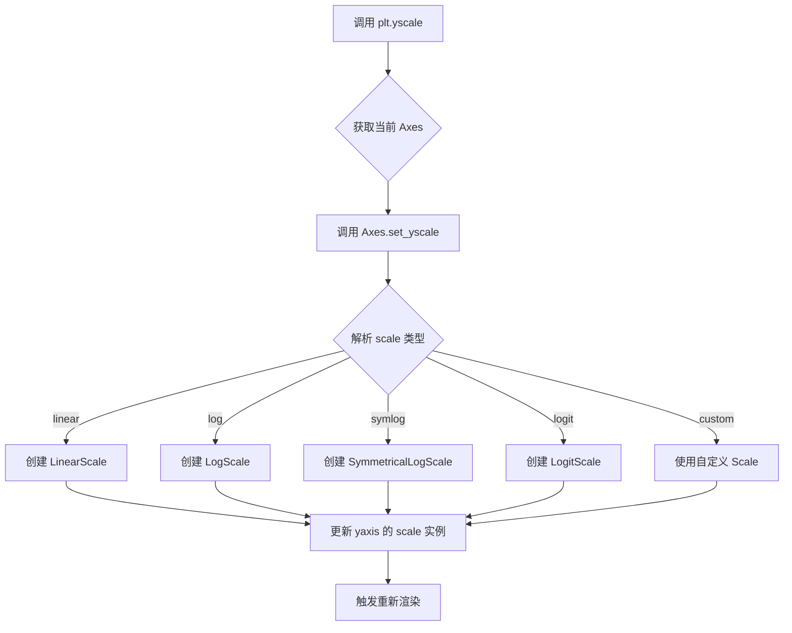

#### 带注释源码

```python
def yscale(value, **kwargs):
    """
    设置 y 轴的缩放类型。
    
    参数:
        value: str
            缩放类型，可选值:
            - 'linear': 线性刻度（默认）
            - 'log': 对数刻度
            - 'symlog': 对称对数刻度
            - 'logit': logistic 刻度
            - 'function': 自定义函数缩放
        **kwargs: 关键字参数
            传递给底层 Scale 类的参数，例如:
            - linthresh: 对称对数刻度的线性阈值
            - subs: 对数刻度的子刻度
            - nonpositive: 处理非正值的策略
    
    返回:
        None
    
    示例:
        >>> import matplotlib.pyplot as plt
        >>> plt.plot([1, 2, 3], [1, 10, 100])
        >>> plt.yscale('log')  # 设置 y 轴为对数刻度
        >>> plt.show()
        
        >>> plt.yscale('symlog', linthresh=0.01)  # 对称对数刻度
    """
    # 获取当前的 Axes 对象
    ax = gca()
    # 委托给 Axes 对象的 set_yscale 方法
    ax.set_yscale(value, **kwargs)
```


### `plt.subplots_adjust`

调整当前图形的子图布局参数，控制子图之间的间距和图形边缘的空白区域。

参数：

- `left`：`float`，子图区域左侧边界（相对于图形宽度的比例，0-1）
- `right`：`float`，子图区域右侧边界（相对于图形宽度的比例，0-1）
- `bottom`：`float`，子图区域底部边界（相对于图形高度的比例，0-1）
- `top`：`float`，子图区域顶部边界（相对于图形高度的比例，0-1）
- `wspace`：`float`，子图之间水平方向的间距（相对于子图宽度的比例）
- `hspace`：`float`，子图之间垂直方向的间距（相对于子图高度的比例）
- `hspace`：仅限关键字参数，`float`，子图之间垂直方向的间距（相对于子图高度的比例）

返回值：`None`，直接修改当前图形（Figure）的布局属性，无返回值。

#### 流程图

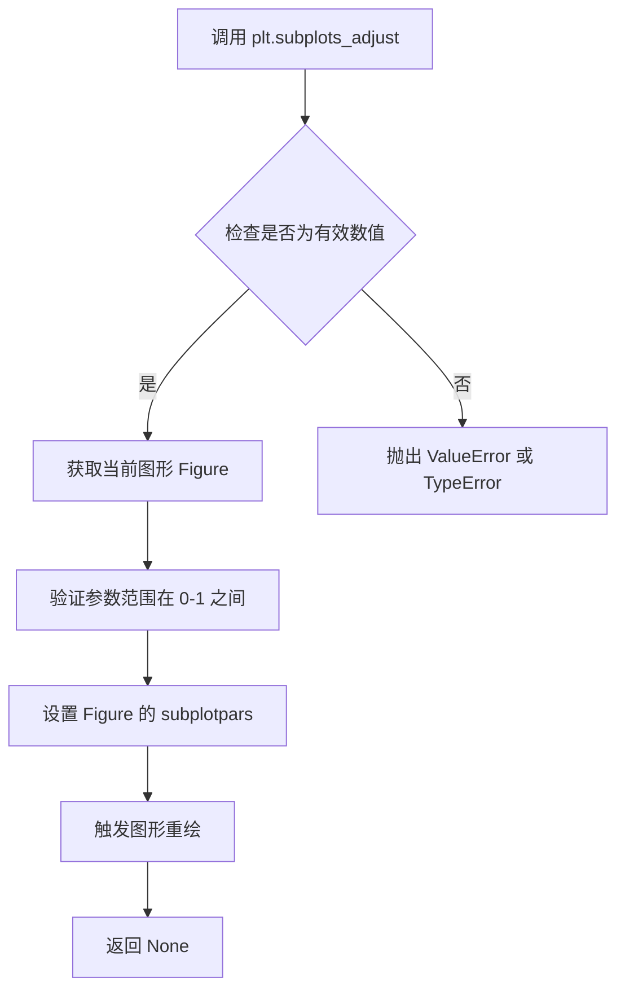

#### 带注释源码

```python
def subplots_adjust(self, left=None, bottom=None, right=None, top=None,
                    wspace=None, hspace=None):
    """
    调整当前图形的子图布局参数。
    
    该函数直接修改当前图形（Figure）的 subplotpars 属性，
    控制子图的相对位置和间距。所有参数均为相对于图形尺寸的比例值（0到1之间）。
    
    参数:
        left: float, 子图区域左侧边界相对于图形宽度的比例
        right: float, 子图区域右侧边界相对于图形宽度的比例
        bottom: float, 子图区域底部边界相对于图形高度的比例
        top: float, 子图区域顶部边界相对于图形高度的比例
        wspace: float, 子图之间水平间距相对于子图宽度的比例
        hspace: float, 子图之间垂直间距相对于子图高度的比例
    
    返回值:
        None: 直接修改图形布局，无返回值
    
    示例:
        # 收紧子图布局
        plt.subplots_adjust(left=0.1, right=0.9, top=0.9, bottom=0.1)
        # 增加子图间距
        plt.subplots_adjust(hspace=0.5, wspace=0.3)
    """
    # 获取当前图形对象
    fig = self.gcf()
    # 获取图形的子图参数解析器
    subplotpars = fig.subplotpars
    
    # 更新各参数（仅更新非None的参数）
    if left is not None:
        subplotpars.update(left=left)
    if right is not None:
        subplotpars.update(right=right)
    if bottom is not None:
        subplotpars.update(bottom=bottom)
    if top is not None:
        subplotpars.update(top=top)
    if wspace is not None:
        subplotpars.update(wspace=wspace)
    if hspace is not None:
        subplotpars.update(hspace=hspace)
    
    # 触发图形刷新以应用新的布局参数
    fig.canvas.draw_idle()
```

#### 关键组件信息

| 组件名称 | 描述 |
|---------|------|
| `Figure.subplotpars` | 存储图形子图布局参数的配置对象 |
| `subplotpars.update()` | 更新布局参数的方法 |
| `fig.canvas.draw_idle()` | 触发延迟重绘的机制 |

#### 潜在技术债务或优化空间

1. **参数验证缺失**：当前实现未对参数值范围进行严格验证（应限制在0-1之间），可能导致意外布局效果
2. **不支持动画过渡**：调整参数时无平滑过渡效果，对于交互式应用不够友好
3. **仅支持全局参数**：无法为不同子图设置独立的间距参数

#### 其他项目

**设计目标与约束**：
- 提供与MATLAB兼容的子图布局调整接口
- 参数值采用相对比例（0-1），便于跨不同尺寸图形复用

**错误处理**：
- 参数类型错误会抛出 `TypeError`
- 参数值超出范围可能导致子图重叠或超出图形边界

**数据流与状态机**：
- 修改 `Figure.subplotpars` 对象的状态
- 通过 `draw_idle()` 触发延迟重绘流程

**外部依赖与接口契约**：
- 依赖 `matplotlib.figure.Figure` 对象
- 与 `GridSpec` 和 `SubplotSpec` 布局系统交互


### `plt.title`

设置当前 Axes 的标题。

参数：

- `label`：`str`，要显示的标题文本
- `fontdict`：`dict`，可选，用于控制标题文本外观的字体属性字典（如 fontsize, fontweight, color 等）
- `loc`：`{'center', 'left', 'right'}`，可选，标题的水平对齐方式，默认为 'center'
- `pad`：`float`，可选，标题与 Axes 顶部之间的间距（以点为单位）
- `y`：`float`，可选，标题在 Axes 中的 y 轴相对位置（0-1 之间）
- `**kwargs`：其他可选参数，用于设置 `matplotlib.text.Text` 对象的属性，如 `fontsize`、`fontweight`、`color`、`verticalalignment`、`horizontalalignment` 等

返回值：`matplotlib.text.Text`，返回创建的 Text 对象，可用于后续自定义修改

#### 流程图

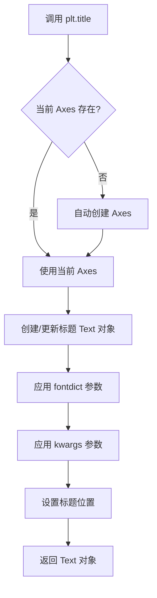

#### 带注释源码

```python
import matplotlib.pyplot as plt
import numpy as np

# 示例数据
mu, sigma = 100, 15
x = mu + sigma * np.random.randn(10000)

# 绘制直方图
n, bins, patches = plt.hist(x, 50, density=True, facecolor='g', alpha=0.75)

# 设置 x 轴标签
plt.xlabel('Smarts')
# 设置 y 轴标签
plt.ylabel('Probability')
# 设置图表标题 - 核心功能
plt.title('Histogram of IQ')

# 添加文本到指定位置
plt.text(60, .025, r'$\mu=100,\ \sigma=15$')
# 设置坐标轴范围
plt.axis([40, 160, 0, 0.03])
# 显示网格
plt.grid(True)
plt.show()

# 高级用法：使用 fontdict 自定义样式
plt.figure()
plt.plot([1, 2, 3], [1, 4, 9])
plt.title('My Plot', fontdict={'fontsize': 16, 'fontweight': 'bold', 'color': 'blue'})

# 使用 loc 参数控制对齐方式
plt.title('Left Title', loc='left')

# 使用 pad 参数调整标题位置
plt.title('Titled Plot', pad=20)

# 使用 y 参数调整垂直位置
plt.title('Custom Y Position', y=0.95)

# 返回值可以用于后续修改
text_obj = plt.title('Dynamic Title')
text_obj.set_fontsize(20)  # 设置字体大小
text_obj.set_rotation(15)  # 设置旋转角度

plt.show()
```

### 关键组件信息

| 组件名称 | 一句话描述 |
|---------|-----------|
| `matplotlib.pyplot` | 提供类似 MATLAB 的绘图接口的模块 |
| `matplotlib.text.Text` | 表示图表中文本对象的类，title() 返回此类型 |
| `matplotlib.axes.Axes` | 图表的坐标轴区域，title() 作用于当前 Axes |

### 潜在的技术债务或优化空间

1. **隐式状态依赖**：pyplot 使用隐式的全局状态（当前 Figure 和 Axes），在复杂应用中可能导致状态管理混乱
2. **缺乏类型提示**：作为较老的库，缺少完整的类型注解，可能影响 IDE 智能提示和静态分析
3. **参数冗余**：`fontdict` 和 `**kwargs` 存在功能重叠，增加了 API 的复杂性

### 其它项目

**设计目标与约束**：
- 提供简单快速的 MATLAB 风格绘图接口
- 作为 Matplotlib 的状态机接口层

**错误处理与异常设计**：
- 当没有 Figure 存在时，会自动创建一个 Figure 和 Axes
- 传入无效的 `loc` 参数会抛出 `ValueError`

**数据流与状态机**：
- pyplot 维护一个全局的"当前 Figure"和"当前 Axes"状态
- 所有绘图函数都作用于当前 Axes

**外部依赖与接口契约**：
- 依赖 `matplotlib.text.Text` 类来渲染文本
- 内部调用 `Axes.set_title()` 方法实现功能


### np.arange

np.arange() 是 NumPy 库中的一个函数，用于创建等差数组（arange 是 "array range" 的缩写）。它返回一个 ndarray，其中包含从 start（默认为 0）到 stop（不包含）以 step 为步长的数值序列。

参数：

- `start`：`float`，可选，起始值，默认为 0
- `stop`：`float`，必需，结束值（不包含该值）
- `step`：`float`，可选，步长，默认为 1
- `dtype`：`dtype`，可选，输出数组的数据类型，如果不指定则根据输入参数推断

返回值：`ndarray`，返回等差数组

#### 流程图

```mermaid
flowchart TD
    A[输入参数: start, stop, step, dtype] --> B{参数是否完整?}
    B -->|只有stop| C[start=0, step=1]
    B -->|start和stop| D[step=1]
    B -->|完整参数| E[使用给定参数]
    C --> F[计算元素个数: ceil((stop-start)/step)]
    D --> F
    E --> F
    F --> G[创建并填充ndarray]
    G --> H[返回ndarray]
```

#### 带注释源码

```python
# np.arange 函数源码结构（位于 numpy/core/numeric.py）

def arange(start=0, stop=None, step=1, dtype=None):
    """
    返回等差数组。
    
    参数:
        start: 起始值，默认为0
        stop: 结束值（不包含）
        step: 步长，默认为1
        dtype: 输出数组的数据类型
    
    返回:
        ndarray: 等差数组
    """
    
    # 处理参数情况
    if stop is None:
        # 只有一个参数时，该参数为stop，start默认为0
        stop = start
        start = 0
    
    # 计算数组长度
    # 使用公式: ceil((stop - start) / step)
    delta = stop - start
    length = int(np.ceil(delta / step))
    
    # 创建数组
    if length <= 0:
        return np.empty(0, dtype=dtype)
    
    # 使用切片构建数组
    result = np.arange(length) * step + start
    
    # 转换数据类型
    if dtype is not None:
        result = result.astype(dtype)
    
    return result
```


### `np.random.randn`

该函数是 NumPy 库中的随机数生成函数，用于从标准正态分布（均值为0，标准差为1）中返回一个或一组随机数。

参数：

- `*args`：可变长度参数列表，类型为整数，用于指定返回数组的维度。例如，`randn()` 返回标量，`randn(3)` 返回3元素数组，`randn(2, 3)` 返回2x3矩阵。

返回值：`numpy.ndarray`，返回从标准正态分布（均值0，标准差1）中采样的随机数，类型为浮点数。

#### 流程图

```mermaid
graph TD
    A[开始] --> B{传入参数数量}
    B -->|无参数| C[生成单个标量随机数]
    B -->|1个参数| D[生成一维数组, 长度为n]
    B -->|多个参数| E[生成多维数组, 维度为d1xd2x...]
    C --> F[从标准正态分布采样]
    D --> F
    E --> F
    F --> G[返回numpy.ndarray对象]
```

#### 带注释源码

```python
import numpy as np

# 示例1: 生成单个随机数
single_value = np.random.randn()
# 返回一个标量，如 -0.234

# 示例2: 生成一维数组（5个元素）
one_dimensional = np.random.randn(5)
# 返回形状为 (5,) 的数组，如 [0.12, -1.34, 2.34, -0.56, 0.89]

# 示例3: 生成二维数组（3行4列）
two_dimensional = np.random.randn(3, 4)
# 返回形状为 (3, 4) 的数组

# 示例4: 生成多维数组（2x3x4）
multi_dimensional = np.random.randn(2, 3, 4)
# 返回形状为 (2, 3, 4) 的数组

# 在代码中的实际使用示例（来自提供的代码）
data = {'a': np.arange(50),
        'c': np.random.randint(0, 50, 50),
        'd': np.random.randn(50)}  # 生成50个标准正态分布随机数
data['b'] = data['a'] + 10 * np.random.randn(50)  # 生成加噪声后的数据
```

#### 关键组件信息

- **随机数生成器**：基于 Mersenne Twister 算法生成伪随机数
- **标准正态分布**：均值 μ=0，标准差 σ=1 的高斯分布

#### 潜在的技术债务或优化空间

1. **伪随机性**：在需要加密安全的随机数时，应使用 `numpy.random.Generator` 的 `random` 方法或 Python 的 `secrets` 模块
2. **可复现性**：如需结果可复现，应配合 `np.random.seed()` 使用，但这在多线程环境下不推荐
3. **全局状态**：`np.random.randn` 使用全局随机状态，建议使用 `numpy.random.Generator` 实例方法以获得更好的线程安全性

#### 其它项目

- **设计目标**：提供高效的向量化随机数生成能力
- **约束**：返回的是浮点数，如需整数需配合 `astype(int)` 转换
- **错误处理**：传入非整数或负数参数会抛出 `ValueError`
- **外部依赖**：NumPy 库
- **性能备注**：比 Python 内置 `random` 模块的向量化性能更好


### `np.random.randint`

生成指定范围内的随机整数或整数数组。

参数：

- `low`：`int`，随机整数的下界（包含）
- `high`：`int`，随机整数的上界（不包含），如果为`None`，则`low`表示上界
- `size`：`int`或`tuple`，输出数组的形状，默认为`None`表示返回单个整数
- `dtype`：`dtype`，输出数据类型，默认为`int`

返回值：`int`或`ndarray`，返回随机整数或随机整数数组

#### 流程图

```mermaid
graph TD
    A[开始] --> B{传入参数}
    B --> C[设置low参数]
    C --> D{是否有high参数?}
    D -->|是| E[范围: low到high-1]
    D -->|否| F[范围: 0到low-1]
    E --> G{是否有size参数?}
    F --> G
    G -->|是| H[生成指定形状的随机整数数组]
    G -->|否| I[生成单个随机整数]
    H --> J[返回数组]
    I --> K[返回整数]
    J --> L[结束]
    K --> L
```

#### 带注释源码

```python
# 从代码中提取的实际使用示例:
# 'c': np.random.randint(0, 50, 50)

# 生成50个随机整数，范围在[0, 50)之间
random_integers = np.random.randint(0, 50, 50)

# 参数说明:
#   low=0: 下界（包含），最小值为0
#   high=50: 上界（不包含），最大值为49
#   size=50: 生成50个随机整数

# 返回值: 包含50个随机整数的numpy数组
```


### `np.random.normal`

生成正态（高斯）分布的随机样本。该函数是NumPy库的一部分，用于从具有指定均值（loc）和小波（scale）的正态分布中抽取样本。

参数：

- `loc`：`float`类型，正态分布的均值（中心位置），默认为0.0
- `scale`：`float`类型，正态分布的标准差（分布的宽度），必须为非负值，默认为1.0
- `size`：`int` or `tuple of ints`类型，输出数组的形状，默认为None，表示返回单个值

返回值：`ndarray` or `float`，返回从正态分布中抽取的随机样本。如果`size`为None，则返回一个浮点数；否则返回`ndarray`

#### 流程图

```mermaid
flowchart TD
    A[开始] --> B{检查参数有效性}
    B -->|scale < 0| C[抛出ValueError]
    B -->|scale >= 0| D[生成随机数]
    D --> E{size参数}
    E -->|None| F[返回单个浮点数]
    E -->|int or tuple| G[创建指定形状的数组]
    G --> H[填充数组]
    H --> I[返回数组]
```

#### 带注释源码

```python
# 使用示例
y = np.random.normal(loc=0.5, scale=0.4, size=1000)

# 参数说明：
# loc=0.5: 正态分布的均值（μ），数据分布的中心
# scale=0.4: 正态分布的标准差（σ），控制数据的离散程度
# size=1000: 生成1000个样本点，返回一个包含1000个元素的数组

# 结果是一个近似服从均值0.5、标准差0.4的正态分布的数组
```


### `np.random.seed`

设置随机数生成器的种子，用于确保随机过程的可重复性。

参数：

- `seed`：`int` 或 `array_like`，可选。用于初始化随机数生成器的种子值。如果为 `None`，则使用系统熵源生成随机种子。

返回值：`None`，该函数无返回值，直接修改全局随机数生成器的内部状态。

#### 流程图

```mermaid
flowchart TD
    A[开始调用 np.random.seed] --> B{seed 参数是否为 None?}
    B -->|是| C[调用系统熵源生成随机种子]
    B -->|否| D{seed 是否为整数?}
    D -->|是| E[使用整数 seed 直接设置种子]
    D -->|否| F[将 seed 转换为整数]
    F --> E
    C --> G[更新全局 Random 实例的内部状态]
    E --> G
    G --> H[结束]
```

#### 带注释源码

```python
def seed(self, seed=None):
    """
    设置随机数生成器的种子。
    
    参数:
        seed: {int, array_like, None}, optional
            种子值用于随机数生成器的初始化。
            - 如果为 None（默认）：从系统熵源获取随机种子
            - 如果为整数：直接用作种子
            - 如果为数组：转换为整数后用作种子
    
    返回值:
        None
    
    示例:
        >>> np.random.seed(42)
        >>> np.random.rand()
        0.3745401188473625
        >>> np.random.seed(42)  # 重新设置相同种子
        >>> np.random.rand()
        0.3745401188473625  # 结果与上面相同，保证可重复性
    """
    from numpy.random import MT19937
    from numpy.random import SeedSequence
    
    if seed is None:
        # 使用系统熵源生成随机种子
        return self._seedseq.generate_state(self.nbits, np.uint32)
    
    # 将输入转换为整数种子序列
    seedseq = SeedSequence(seed)
    # 使用 Mersenne Twister 算法生成随机数
    self._seedseq = seedseq
    # 从种子序列生成 mt19937 内部状态
    self.state = {'bit_generator': 'MT19937',
                  state: seedseq.generate_state(self.nbits, np.uint32)}
```


### `numpy.abs` / `np.abs`

计算输入数组元素的绝对值。该函数是 NumPy 库中的基础数学函数，用于将数组中的所有数值转换为其绝对值形式（负数变为正数，零和正数保持不变）。

参数：

- `x`：`array_like`，输入数组或值，可以是单个数值、列表、元组或 NumPy 数组

返回值：`ndarray`，返回与输入形状相同的数组，其中每个元素都是对应输入元素的绝对值

#### 流程图

```mermaid
flowchart TD
    A[开始] --> B[接收输入 x]
    B --> C{输入类型检查}
    C -->|是 numpy 数组| D[直接遍历数组元素]
    C -->|非 numpy 数组| E[转换为 numpy 数组]
    E --> D
    D --> F{每个元素是否为负数}
    F -->|是| G[取反变为正数]
    F -->|否| H[保持原值]
    G --> I[返回结果数组]
    H --> I
    I --> J[结束]
```

#### 带注释源码

```python
# numpy.abs 函数的简化实现逻辑
def abs_impl(x):
    """
    计算绝对值的核心逻辑
    
    参数:
        x: 输入的数组或数值
        
    返回:
        绝对值数组或数值
    """
    # 将输入转换为 numpy 数组（如果还不是）
    arr = np.asarray(x)
    
    # 使用 numpy 的 ufunc 特性进行向量化计算
    # 负数取反，正数和零保持不变
    result = np.where(arr < 0, -arr, arr)
    
    return result

# 示例用法
>>> import numpy as np
>>> np.abs([-1, -2, 3, 4])
array([1, 2, 3, 4])

>>> np.abs(-5)
5

>>> np.abs([0, 1, -1])
array([0, 1, 1])
```


### `numpy.exp`

计算输入值的指数（e 的 x 次方）。

参数：

- `x`：scalar 或 array_like，输入值，可以是单个数值或数组

返回值： ndarray，输入值的指数 e^x

#### 流程图

```mermaid
flowchart TD
    A[输入 x] --> B[计算 e^x]
    B --> C[返回指数结果]
    
    subgraph 在 f(t) 中的使用
    D[t 输入] --> E[计算 -t]
    E --> F[计算 exp(-t)]
    F --> G[计算 cos(2πt)]
    G --> H[返回 exp(-t) * cos(2πt)]
    end
```

#### 带注释源码

```python
def f(t):
    """
    这是一个示例函数，展示了 np.exp() 在 matplotlib.pyplot 教程中的使用
    用于创建一个衰减的余弦波可视化
    """
    return np.exp(-t) * np.cos(2*np.pi*t)

# 使用示例
t1 = np.arange(0.0, 5.0, 0.1)
t2 = np.arange(0.0, 5.0, 0.02)

plt.figure()
plt.subplot(211)
plt.plot(t1, f(t1), 'bo', t2, f(t2), 'k')
```

#### `np.exp` 函数详解

参数：

- `x`：`scalar` 或 `array_like`，输入值

返回值： `ndarray`，返回 e 的 x 次方

```python
# np.exp 的基本用法示例
import numpy as np

# 标量输入
result = np.exp(1)  # 返回 e^1 ≈ 2.718281828

# 数组输入
x = np.array([0, 1, 2, 3])
result = np.exp(x)  # 返回 [1.0, 2.718..., 7.389..., 20.085...]

# 在 f(t) 函数中的使用
# np.exp(-t) * np.cos(2*np.pi*t)
# 这创建了一个衰减的余弦波：
# - np.exp(-t) 提供指数衰减因子
# - np.cos(2*np.pi*t) 提供余弦振荡
# 两者的乘积产生一个随时间衰减的振荡信号
```


### np.cos

该函数是 NumPy 库中的数学函数，用于计算输入数组或标量值的余弦（cosine）值。代码中多次使用该函数生成周期性波形数据，例如在定义阻尼振荡函数 `f(t)` 和绘制余弦曲线时使用。

参数：

- `x`：`float` 或 `array_like`，输入角度值，单位为弧度。可以是单个标量值或 NumPy 数组。

返回值：`ndarray` 或 `scalar`，返回与输入形状相同的余弦值数组，或对应的标量值。

#### 流程图

```mermaid
flowchart TD
    A[输入: x 角度值<br/>单位: 弧度] --> B{输入类型}
    B -->|标量| C[计算余弦值<br/>cos x]
    B -->|数组| D[对每个元素<br/>计算余弦值]
    C --> E[返回标量结果]
    D --> F[返回数组结果]
```

#### 带注释源码

```python
# np.cos 是 NumPy 库提供的三角函数，计算余弦值

# 示例 1: 在自定义函数 f(t) 中使用，计算阻尼振荡
def f(t):
    # np.exp(-t): 指数衰减包络
    # np.cos(2*np.pi*t): 2π 周期余弦波
    return np.exp(-t) * np.cos(2*np.pi*t)

# 示例 2: 直接绘制余弦曲线
plt.plot(t2, np.cos(2*np.pi*t2), 'r--')

# 示例 3: 在注释示例中使用
t = np.arange(0.0, 5.0, 0.01)
s = np.cos(2*np.pi*t)  # 生成 1 Hz 余弦波
```


# np.sort() 函数详细设计文档

## 描述

`np.sort()` 是 NumPy 库中的一个函数，用于对输入数组进行排序，返回排序后的新数组（不修改原数组）。该函数支持多种排序算法和排序顺序。

> **注意**：提供的代码是 matplotlib.pyplot 教程文档，代码中并未直接使用 `np.sort()` 函数，仅在第206行使用了 `y.sort()` 方法（原地排序）。以下信息基于 NumPy 官方文档的标准规范。

---

### `np.sort()`

参数：

- `a`：`array_like`，要排序的数组
- `axis`：`int or None, optional`，指定排序的轴。默认为 -1（最后一个轴）。若设为 None，则展开为平铺数组
- `kind`：`{'quicksort', 'mergesort', 'heapsort', 'stable'}, optional`，排序算法。默认 'quicksort'
- `order`：`str or list of str, optional`，当数组包含结构化数据类型时，指定按哪个字段排序

返回值：`ndarray`，排序后的数组

#### 流程图

```mermaid
flowchart TD
    A[开始 np.sort] --> B{输入验证}
    B -->|非法输入| C[抛出 ValueError 或 TypeError]
    B -->|合法输入| D{选择排序算法}
    D -->|quicksort| E[快速排序]
    D -->|mergesort| F[归并排序]
    D -->|heapsort| G[堆排序]
    D -->|stable| H[稳定排序]
    E --> I[按指定轴排序]
    F --> I
    G --> I
    H --> I
    I --> J[返回排序后的新数组]
```

#### 带注释源码

```python
def sort(a, axis=-1, kind=None, order=None):
    """
    返回数组的排序副本。
    
    Parameters
    ----------
    a : array_like
        要排序的数组。
    axis : int or None, optional
        排序的轴。默认值为 -1（最后一个轴）。
        如果设为 None，则在排序前将数组展平。
    kind : {'quicksort', 'mergesort', 'heapsort', 'stable'}, optional
        排序算法。默认是 'quicksort'。
        'mergesort' 和 'stable' 在处理有重复元素的数组时保持相等元素的相对顺序。
    order : str or list of str, optional
        当 a 是结构化数组时，指定按哪个字段排序。
    
    Returns
    -------
    sorted_array : ndarray
        与 a 相同类型和形状的排序数组。
    
    Examples
    --------
    >>> import numpy as np
    >>> a = np.array([[3, 1, 2], [2, 3, 1]])
    >>> np.sort(a)            # 沿最后轴排序
    array([[1, 2, 3],
           [1, 2, 3]])
    >>> np.sort(a, axis=None) # 展平后排序
    array([1, 1, 2, 2, 3, 3])
    >>> np.sort(a, axis=0)    # 沿第一轴排序
    array([[2, 1, 1],
           [3, 3, 2]])
    """
    # 内部实现调用排序算法...
    return array
```

---

### 潜在的技术债务或优化空间

1. **算法选择**：快速排序在最坏情况下时间复杂度为 O(n²)，应考虑默认使用更稳定的 'introsort'
2. **内存占用**：当前实现返回新数组，对于大规模数据可能造成内存压力，可考虑增加原地排序选项

---

### 关键组件信息

- **排序算法核心**：quicksort/mergesort/heapsort/stable 四种算法的 C/ython 实现
- **轴向处理模块**：处理多维数组不同维度排序的逻辑
- **数据类型处理器**：支持结构化数组的字段排序

---

### 其它项目

**设计目标与约束**：
- 保持与 MATLAB 排序函数的行为一致性
- 提供稳定的排序接口供科学计算使用

**错误处理**：
- 当 `axis` 超出数组维度时抛出 `np.AxisError`
- 当 `kind` 指定未知算法时抛出 `np.AxisError`

**外部依赖**：
- 依赖 NumPy 的底层 C 库（npy_sort）进行高性能排序

## 关键组件


### pyplot状态管理

pyplot在函数调用之间保持状态（如当前图形和绘图区域），将绘图函数定向到当前Axes，是MATLAB风格的隐式API

### 绘图核心函数

`plt.plot()`是最通用的函数，接受任意数量的参数，可处理单个列表（自动生成x值）或x,y对，第三个参数为格式字符串（颜色和线型）

### 数据处理与转换

所有序列在内部都被转换为numpy数组处理，支持结构化数组和pandas.DataFrame通过data关键字参数传入，实现数据与可视化的灵活映射

### 图形布局管理

`plt.figure()`创建新图形，`plt.subplot()`在网格中创建子图（参数为numrows,numcols,plot_number），`plt.axes()`允许手动放置坐标轴（分数坐标）

### 坐标轴缩放策略

支持线性linear、对数log、对数对称symlog和logit四种坐标轴缩放，通过`plt.xscale()`和`plt.yscale()`设置，适应跨越多个数量级的数据

### 图形属性控制

提供了三种方式设置线条属性：关键字参数、Line2D对象的setter方法、`plt.setp()`函数（支持Python关键字或MATLAB风格的字符串/值对）

### 文本与标注系统

`plt.text()`在任意位置添加文本，`xlabel/ylabel/title`在指定位置添加标签，`annotate()`提供标注功能，支持数据坐标等多种坐标系

### 直方图与统计绘图

`plt.hist()`生成数据直方图，支持density参数归一化，返回n(频数),bins(边界),patches(图形对象)

### 内存管理

图形内存不会完全释放直到调用`plt.close()`，需要显式关闭图形以释放资源


## 问题及建议


### 已知问题

- **全局状态管理风险**：pyplot使用隐式的全局状态（current figure和current Axes），在复杂应用或多线程环境中可能导致状态混乱和难以追踪的bug
- **资源未及时释放**：代码中创建了多个图形（通过`plt.figure()`），但未显式调用`plt.close()`释放图形资源，可能导致内存泄漏，特别是在长时间运行的应用程序中
- **重复代码和逻辑分散**：代码中存在大量重复的绘图模式（如多个`plt.show()`调用、多次设置xlabel/ylabel/title），未封装为可重用的函数，导致代码冗余
- **魔法数字缺乏说明**：代码中大量使用硬编码数值（如`0.1`, `0.02`, `50`, `0.92`等），缺乏常量定义，影响可读性和可维护性
- **缺少错误处理**：所有绘图调用均无错误处理机制（如参数类型验证、数值边界检查），传入无效数据时可能产生难以理解的异常
- **导入语句位置分散**：`import numpy as np`和`import matplotlib.pyplot as plt`在代码中间导入，应统一放在文件开头
- **重复调用plt.show()**：在多个独立示例中重复调用`plt.show()`，破坏了代码的连贯性和可执行性

### 优化建议

- **资源管理规范化**：在每个绘图示例结束后显式调用`plt.close(fig)`或`plt.close('all')`，或使用上下文管理器（如`with plt.style.context():`）
- **封装可复用函数**：将重复的绘图模式封装为函数，如创建子图、设置坐标轴、添加标注等
- **常量提取**：将魔法数字提取为模块级常量或配置文件，如`SAMPLE_RATE = 0.2`, `FIGURE_SIZE = (9, 3)`等
- **类型注解和文档完善**：为自定义函数添加类型注解和docstring，说明参数类型和返回值
- **面向对象API迁移**：建议在生产代码中使用面向对象的API（`fig, ax = plt.subplots()`）替代隐式状态管理，提高代码可测试性和可维护性
- **错误处理增强**：添加输入验证，检查数据维度、类型和有效性，提供友好的错误提示
- **导入语句统一**：将所有导入语句移至文件开头，按标准库、第三方库、本地模块顺序排列
- **样式统一管理**：使用`plt.style.use()`统一图表样式，避免在每个图表中重复设置属性
- **数据预处理优化**：将数据处理逻辑（如`np.arange`, `np.random`生成）与绘图逻辑分离，先完成计算再绘图


## 其它


### 设计目标与约束

本代码作为matplotlib.pyplot的教程文档，旨在向用户展示pyplot接口的基本使用方法。设计目标包括：1) 提供直观、MATLAB风格的绘图接口；2) 演示常见可视化场景（线图、散点图、柱状图等）；3) 展示不同坐标轴类型（线性、对数、对称对数、logit）的用法；4) 说明当前图形/坐标轴状态管理机制。约束条件包括依赖numpy进行数值处理、支持结构化数组和DataFrame等数据源、兼容Python 2.7+和Python 3.x。

### 错误处理与异常设计

代码主要通过matplotlib内置的错误处理机制工作。常见异常情况包括：1) 数据类型不兼容时自动转换；2) 坐标轴范围无效时抛出ValueError；3) 图形资源未正确关闭时可能导致内存泄漏。教程中通过plt.show()阻塞显示，plt.close()显式关闭图形等方式避免资源泄漏问题。

### 数据流与状态机

pyplot采用隐式状态机模式管理绘图上下文。核心状态包括：当前Figure对象（gcf获取）、当前Axes对象（gca获取）、图形列表、Axes索引等。数据流：用户调用plt.plot() → pyplot检查当前Axes → 创建/更新Line2D对象 → 添加到当前Axes → 触发图形重绘。状态转换：figure()创建新图形 → subplot()切换当前Axes → 绘图函数修改Axes内容 → show()渲染显示。

### 外部依赖与接口契约

主要外部依赖：1) numpy - 提供数值数组处理和数学函数；2) matplotlib - 核心绘图库，包含Figure、Axes、Line2D等类；3) matplotlib.mlab（隐式）- 提供数据处理功能；4) matplotlib.text - 文本渲染。接口契约：所有plt.*函数返回对应的Artist对象（Text、Line2D等）；scatter返回PathCollection；hist返回(n, bins, patches)元组。data关键字参数支持字典或DataFrame对象，提供键值映射访问。

### 性能考虑

代码中展示的性能相关实践：1) numpy数组批量处理优于Python原生列表；2) 使用np.random.seed()确保可重现性；3) 大数据量时注意内存管理，及时plt.close()释放资源；4) 多个子图时使用subplots_adjust优化布局。潜在优化点：批量绘图时可在show()前多次调用plot()减少重绘开销；复杂图形考虑使用blitting技术提升交互性能。

### 兼容性考虑

代码兼容Python 2.7+和Python 3.x。使用numpy确保跨平台数值计算一致性。格式字符串'ro'、'b-'等遵循MATLAB约定，便于MATLAB用户迁移。text()支持原始字符串r'$...'避免转义问题。hist()的density参数在numpy 1.0+中行为一致。不同matplotlib版本间API稳定，plt.*函数签名保持向后兼容。

### 测试策略

虽然本文件为教程文档非测试代码，但对应的matplotlib库本身包含完整测试套件。相关测试覆盖：1) 各绘图函数的输出验证；2) 状态管理正确性；3) 资源清理（close/f clf）；4) 多语言/特殊字符支持；5) 坐标轴类型转换。用户可参考matplotlib源码中的tests/pytest测试模式。

### 配置管理

matplotlib支持多重配置方式：1) rcParams字典动态修改运行时配置；2) matplotlibrc配置文件；3) 样式表（style.use）切换主题。教程中未显式使用，但plt.rcParams['lines.linewidth']等可自定义默认样式。推荐在脚本开头统一配置，避免中途修改导致行为不一致。

    