# `matplotlib\galleries\users_explain\animations\blitting.py` 详细设计文档

This code demonstrates the implementation of blitting in Matplotlib to improve the performance of interactive figures by rendering non-changing graphic elements into a background image once and only redrawing the changing elements.

## 整体流程

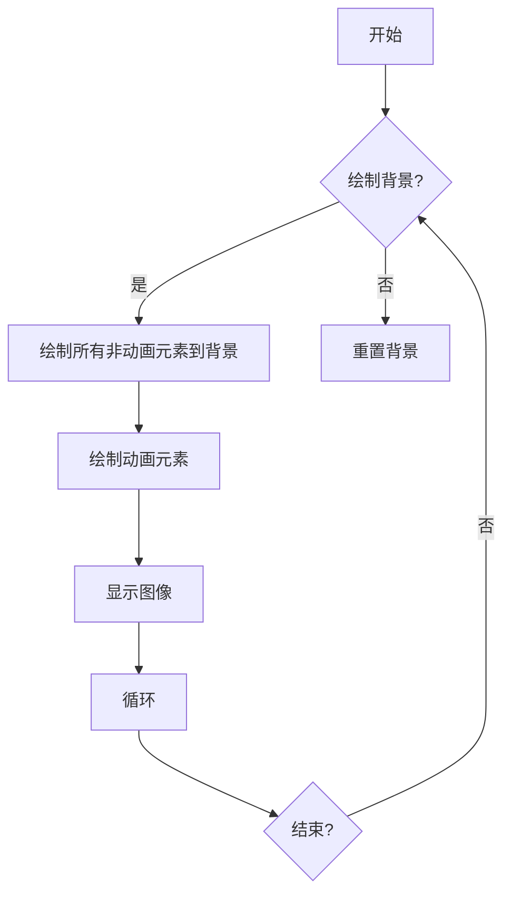

## 类结构

```
BlitManager (主类)
├── canvas (FigureCanvasAgg)
│   ├── _bg (numpy.ndarray)
│   ├── _artists (list)
│   └── cid (int)
└── ... 
```

## 全局变量及字段


### `x`
    
Array of x values for plotting.

类型：`numpy.ndarray`
    


### `fig`
    
The Matplotlib figure object.

类型：`matplotlib.figure.Figure`
    


### `ax`
    
The Matplotlib axes object where the plot is drawn.

类型：`matplotlib.axes._subplots.AxesSubplot`
    


### `ln`
    
The line plot artist.

类型：`matplotlib.lines.Line2D`
    


### `fr_number`
    
The text artist displaying the frame number.

类型：`matplotlib.text.Text`
    


### `bm`
    
The BlitManager instance managing the blitting process.

类型：`BlitManager`
    


### `BlitManager.canvas`
    
The canvas to work with for blitting.

类型：`matplotlib.backends.backend_agg.FigureCanvasAgg`
    


### `BlitManager._bg`
    
The background buffer for blitting.

类型：`numpy.ndarray`
    


### `BlitManager._artists`
    
List of animated artists to be managed by the BlitManager.

类型：`list`
    


### `BlitManager.cid`
    
The connection ID for the 'draw_event' callback.

类型：`int`
    
    

## 全局函数及方法


### np.linspace

`np.linspace` 是 NumPy 库中的一个函数，用于生成线性间隔的数字数组。

参数：

- `start`：`float` 或 `int`，起始值。
- `stop`：`float` 或 `int`，结束值。
- `num`：`int`，生成的数组中的数字数量（不包括结束值）。
- `dtype`：可选，数据类型，默认为 `float`。

参数描述：

- `start`：指定数组的起始值。
- `stop`：指定数组的结束值。
- `num`：指定数组中数字的数量。
- `dtype`：指定数组的数据类型。

返回值类型：`numpy.ndarray`

返回值描述：返回一个包含线性间隔数字的数组。

#### 流程图

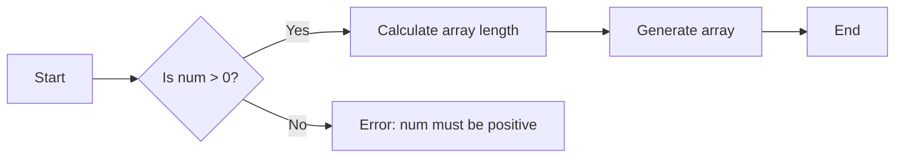

#### 带注释源码

```python
import numpy as np

def np_linspace(start, stop, num=50, dtype=np.float64):
    """
    Generate linearly spaced numbers.

    Parameters
    ----------
    start : float or int
        Start of the interval.
    stop : float or int
        End of the interval.
    num : int, optional
        Number of samples to generate. Default is 50.
    dtype : dtype, optional
        Type of the output array. Default is float64.

    Returns
    -------
    numpy.ndarray
        Array of linearly spaced numbers.
    """
    if num <= 0:
        raise ValueError("num must be positive")
    return np.linspace(start, stop, num, dtype)
```


### plt.subplots

`plt.subplots` 是 Matplotlib 库中用于创建图形和坐标轴的函数。

参数：

- `figsize`：`tuple`，指定图形的大小（宽度和高度），单位为英寸。
- `dpi`：`int`，指定图形的分辨率，单位为每英寸点数。
- `facecolor`：`color`，指定图形的背景颜色。
- `edgecolor`：`color`，指定图形的边缘颜色。
- `frameon`：`bool`，指定是否显示图形的边框。
- `num`：`int`，指定要创建的坐标轴数量。
- `gridspec_kw`：`dict`，指定网格规格的参数。
- `constrained_layout`：`bool`，指定是否启用约束布局。
- `sharex`：`bool` 或 `tuple`，指定是否共享 x 轴。
- `sharey`：`bool` 或 `tuple`，指定是否共享 y 轴。
- `subplot_kw`：`dict`，指定子图参数。

返回值：`Figure`，图形对象；`Axes`，坐标轴对象。

#### 流程图

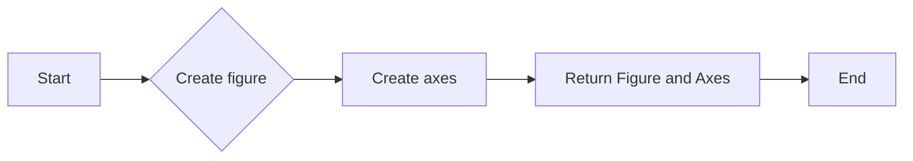

#### 带注释源码

```python
import matplotlib.pyplot as plt

fig, ax = plt.subplots(figsize=(10, 6), dpi=100, facecolor='white', edgecolor='black', frameon=True)
```


### ax.plot

`ax.plot` 是一个绘图函数，用于在 Matplotlib 的轴对象 `ax` 上绘制二维线图。

参数：

- `x`：`numpy.ndarray` 或 `float`，表示 x 轴的数据点。
- `y`：`numpy.ndarray` 或 `float`，表示 y 轴的数据点。
- `animated`：`bool`，默认为 `False`，当设置为 `True` 时，该线图将支持动画。

返回值：`Line2D` 对象，表示绘制的线图。

#### 流程图

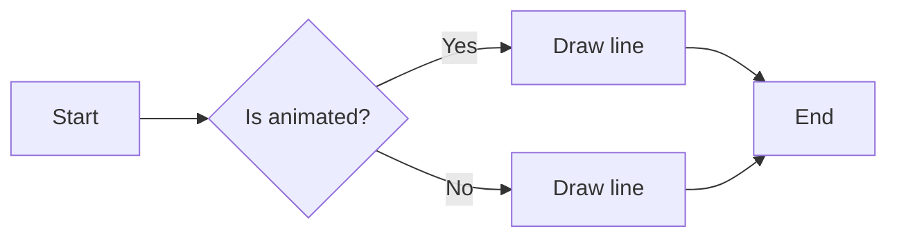

#### 带注释源码

```python
(ln,) = ax.plot(x, np.sin(x), animated=True)
```


### plt.show

`plt.show` 是 Matplotlib 库中的一个全局函数，用于显示图形窗口。

参数：

- 无

返回值：`None`

#### 流程图

```mermaid
graph LR
A[开始] --> B{调用 plt.show()}
B --> C[显示图形窗口]
C --> D[结束]
```

#### 带注释源码

```python
# 带注释的源码
plt.show(block=False)  # 显示图形窗口，block=False 表示不阻塞主线程
```


### plt.pause

`plt.pause` 是一个全局函数，用于暂停当前的事件循环，以便在绘制动画时进行等待。

参数：

- `interval`：`float`，指定暂停的时间（以秒为单位）。

返回值：`None`，没有返回值。

#### 流程图

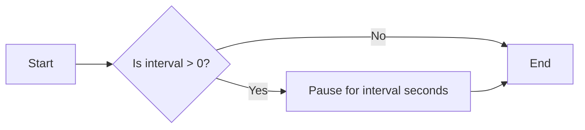

#### 带注释源码

```python
# 暂停当前的事件循环，以便在绘制动画时进行等待
plt.pause(interval)
```


### fig.canvas.copy_from_bbox

复制给定边框内的图像区域。

描述：

该函数从画布中复制给定边框内的图像区域，并返回一个包含该区域的图像对象。

参数：

- `bbox`：`matplotlib.transforms.Bbox`，指定要复制的图像区域的边界框。

返回值：

- `PIL.Image.Image`，包含复制区域的图像对象。

#### 流程图

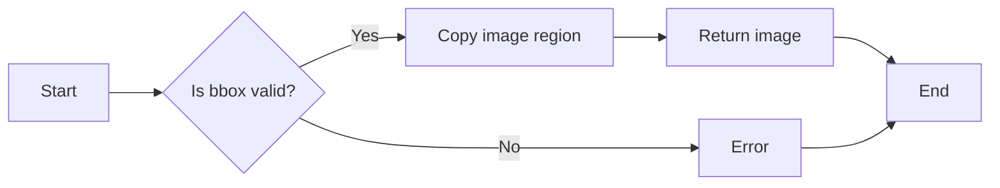

#### 带注释源码

```python
def copy_from_bbox(self, bbox):
    """
    Copy the image region specified by bbox.

    Parameters
    ----------
    bbox : Bbox
        The bounding box of the region to copy.

    Returns
    -------
    Image
        The image containing the copied region.
    """
    # ... (source code implementation) ...
```


### fig.canvas.restore_region(bg)

该函数用于恢复之前保存的图像区域，以便在后续的绘制过程中只更新变化的部分。

参数：

- bg：`numpy.ndarray`，保存的图像区域数据。

返回值：`None`，无返回值。

#### 流程图

```mermaid
graph LR
A[开始] --> B{调用fig.canvas.restore_region(bg)}
B --> C[恢复图像区域]
C --> D[结束]
```

#### 带注释源码

```python
# 获取保存的图像区域
bg = fig.canvas.copy_from_bbox(fig.bbox)

# 恢复图像区域
fig.canvas.restore_region(bg)

# 绘制动画元素
ax.draw_artist(ln)

# 将更新后的图像区域显示到屏幕上
fig.canvas.blit(fig.bbox)
``` 


### fig.canvas.blit

`fig.canvas.blit` 是一个用于在 Matplotlib 中执行位块传输（blitting）的方法，它将图像的一部分（通常是动画元素）绘制到屏幕上。

参数：

- `region`：`Region`，表示要绘制到屏幕上的图像区域。

返回值：无

#### 流程图

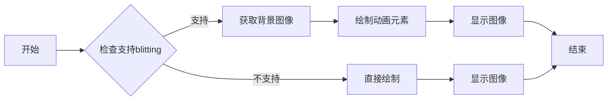

#### 带注释源码

```python
def blit(self, region):
    """
    Perform a blit operation on the canvas.

    Parameters
    ----------
    region : Region
        The region of the canvas to blit.

    Returns
    -------
    None
    """
    # Check if blitting is supported
    if not self.supports_blit:
        # If not supported, draw the region directly
        self.draw_rectangle(region.get_extents())
        return

    # Get the background image
    bg = self.copy_from_bbox(region.get_extents())

    # Draw the animated elements
    self.restore_region(bg)
    self.draw_rectangle(region.get_extents())

    # Show the image
    self.show()
```


### fig.canvas.flush_events

此函数用于刷新事件，确保GUI事件循环处理任何挂起的操作，如果需要，重新绘制屏幕。

参数：

- 无

返回值：`None`，无返回值

#### 流程图

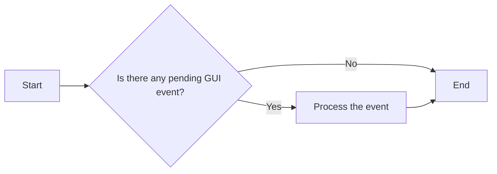

#### 带注释源码

```python
def flush_events(self):
    """
    Flush any pending GUI events, re-painting the screen if needed.
    """
    # Call the backend's flush_events method to process pending GUI events
    self._backend.flush_events()
```


### BlitManager.__init__

This method initializes a BlitManager instance, setting up the canvas and the list of animated artists to manage.

参数：

- `canvas`：`FigureCanvasAgg`，The canvas to work with, this only works for subclasses of the Agg canvas which have the `~FigureCanvasAgg.copy_from_bbox` and `~FigureCanvasAgg.restore_region` methods.
- `animated_artists`：`Iterable[Artist]`，List of the artists to manage.

返回值：None

#### 流程图

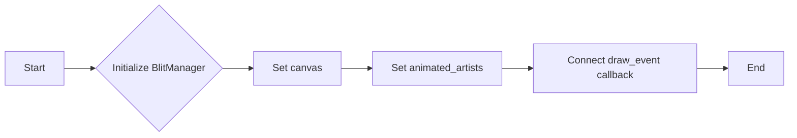

#### 带注释源码

```python
def __init__(self, canvas, animated_artists=()):
    """
    Parameters
    ----------
    canvas : FigureCanvasAgg
        The canvas to work with, this only works for subclasses of the Agg
        canvas which have the `~FigureCanvasAgg.copy_from_bbox` and
        `~FigureCanvasAgg.restore_region` methods.

    animated_artists : Iterable[Artist]
        List of the artists to manage
    """
    self.canvas = canvas
    self._bg = None
    self._artists = []

    for a in animated_artists:
        self.add_artist(a)
    # grab the background on every draw
    self.cid = canvas.mpl_connect("draw_event", self.on_draw)
```


### BlitManager.on_draw

This method is a callback that is triggered when a 'draw_event' occurs. It is responsible for copying the background buffer and drawing the animated artists.

参数：

- `event`：`matplotlib.events.Event`，The event object that triggered the callback. It contains information about the drawing event.

返回值：`None`，This method does not return any value.

#### 流程图

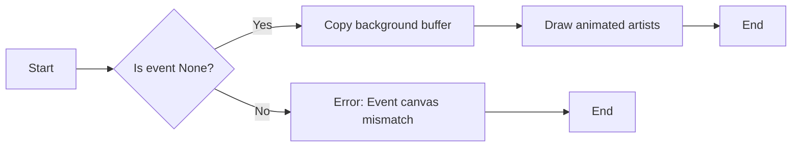

#### 带注释源码

```python
def on_draw(self, event):
    """Callback to register with 'draw_event'."""
    cv = self.canvas
    if event is not None:
        if event.canvas != cv:
            raise RuntimeError
    self._bg = cv.copy_from_bbox(cv.figure.bbox)
    self._draw_animated()
```


### BlitManager.add_artist

This method adds an artist to be managed by the BlitManager.

参数：

- `art`：`Artist`，The artist to be added.  Will be set to 'animated' (just to be safe).  *art* must be in the figure associated with the canvas this class is managing.

返回值：`None`，No return value, the method updates the internal state of the BlitManager.

#### 流程图

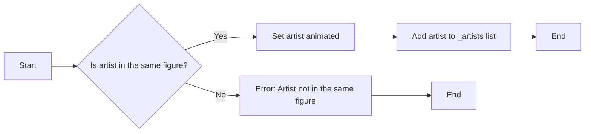

#### 带注释源码

```python
def add_artist(self, art):
    """
    Add an artist to be managed.

    Parameters
    ----------
    art : Artist

        The artist to be added.  Will be set to 'animated' (just
        to be safe).  *art* must be in the figure associated with
        the canvas this class is managing.

    """
    if art.figure != self.canvas.figure:
        raise RuntimeError
    art.set_animated(True)
    self._artists.append(art)
``` 


### BlitManager._draw_animated

Draw all of the animated artists.

参数：

-  `self`：`BlitManager`，The BlitManager instance that manages the artists.

返回值：`None`，No return value, it updates the canvas with the drawn artists.

#### 流程图

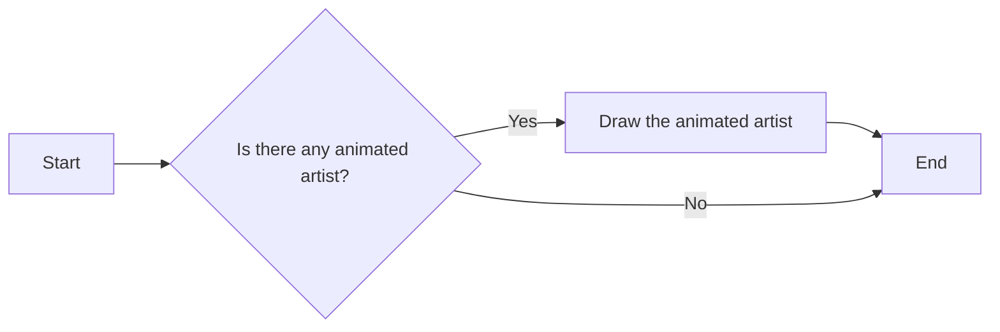

#### 带注释源码

```python
def _draw_animated(self):
    """Draw all of the animated artists."""
    fig = self.canvas.figure
    for a in self._artists:
        fig.draw_artist(a)
```


### BlitManager.update

This method updates the screen with the animated artists managed by the BlitManager.

参数：

- `self`：`BlitManager`，The instance of BlitManager that is managing the artists.
- ...

返回值：`None`，This method does not return any value.

#### 流程图

```mermaid
graph LR
A[Start] --> B{Is _bg None?}
B -- Yes --> C[Call on_draw(None)]
B -- No --> D[Restore the background]
D --> E[Draw all animated artists]
E --> F[Update the GUI state]
F --> G[Blit the updated image]
G --> H[Flush GUI events]
H --> I[End]
```

#### 带注释源码

```python
def update(self):
    """Update the screen with animated artists."""
    cv = self.canvas
    fig = cv.figure
    # paranoia in case we missed the draw event,
    if self._bg is None:
        self.on_draw(None)
    else:
        # restore the background
        cv.restore_region(self._bg)
        # draw all of the animated artists
        self._draw_animated()
        # update the GUI state
        cv.blit(fig.bbox)
    # let the GUI event loop process anything it has to do
    cv.flush_events()
```


## 关键组件


### 张量索引与惰性加载

张量索引与惰性加载是用于高效处理和访问大型数据集的关键组件，它允许在需要时才计算或加载数据，从而减少内存消耗和提高性能。

### 反量化支持

反量化支持是用于优化数值计算的关键组件，它通过将高精度数值转换为低精度数值来减少计算量和内存使用，同时保持足够的精度。

### 量化策略

量化策略是用于优化数值计算的关键组件，它通过将数值映射到有限数量的离散值来减少计算量和内存使用，同时保持足够的精度。


## 问题及建议


### 已知问题

-   **全局变量和类方法重复性**：代码中存在一些全局变量和类方法，它们在不同的上下文中被重复使用，这可能导致维护困难。
-   **错误处理不足**：代码中缺少明确的错误处理机制，例如在添加艺术家到BlitManager时，如果艺术家不属于当前画布的图，则抛出异常，但没有提供更详细的错误信息。
-   **代码可读性**：代码中存在一些复杂的逻辑和流程，例如在BlitManager类中，`on_draw`和`update`方法中的逻辑可能对初学者来说难以理解。

### 优化建议

-   **封装全局变量**：将全局变量封装在类中，以减少全局变量的使用，并提高代码的可维护性。
-   **增强错误处理**：在抛出异常时，提供更详细的错误信息，以便于调试和错误追踪。
-   **代码重构**：对复杂的逻辑进行重构，提高代码的可读性和可维护性。例如，可以将BlitManager类中的`on_draw`和`update`方法中的逻辑分解成更小的函数。
-   **文档和注释**：为代码添加更详细的文档和注释，以帮助其他开发者理解代码的意图和实现方式。
-   **单元测试**：编写单元测试来验证代码的正确性和稳定性，确保代码在修改后仍然能够正常工作。
-   **性能优化**：分析代码的性能瓶颈，并进行优化，以提高代码的执行效率。


## 其它


### 设计目标与约束

- 设计目标：提高交互式图形的性能，通过使用blitting技术减少重复绘制。
- 约束：仅适用于支持blitting的后端，如Agg canvas。
- 约束：不支持macosx后端。

### 错误处理与异常设计

- 异常处理：在添加艺术家到BlitManager时，如果艺术家不属于关联的图，则抛出RuntimeError。
- 异常处理：在draw_event回调中，如果事件与当前画布不匹配，则抛出RuntimeError。

### 数据流与状态机

- 数据流：艺术家通过BlitManager进行管理，背景图像在第一次绘制时创建，并在后续更新中重用。
- 状态机：BlitManager管理以下状态：
  - _bg：背景图像的副本。
  - _artists：管理的艺术家列表。

### 外部依赖与接口契约

- 外部依赖：matplotlib.pyplot和numpy。
- 接口契约：
  - BlitManager类提供了add_artist、update和on_draw方法，用于管理艺术家和更新屏幕。
  - BlitManager依赖于FigureCanvasAgg类的方法copy_from_bbox和restore_region。


    