# `matplotlib\galleries\users_explain\artists\color_cycle.py` 详细设计文档

This code generates a multi-line plot with customizable color and linestyle cycles using the matplotlib library.

## 整体流程

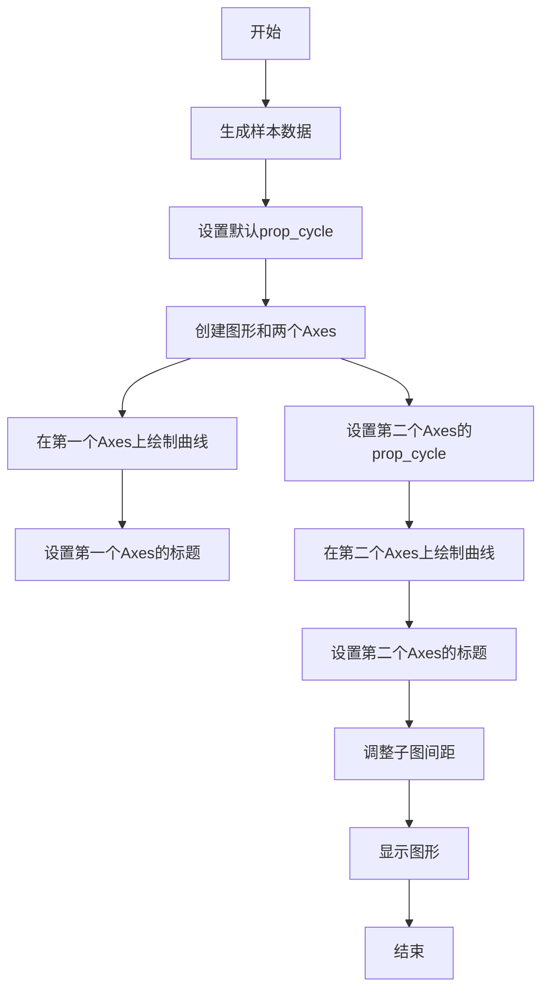

## 类结构

```
matplotlib.pyplot (主模块)
├── cycler (子模块)
│   ├── cycler (类)
│   └── ...
└── np (子模块)
    └── np (模块)
```

## 全局变量及字段


### `default_cycler`
    
A cycler object that defines the default color and linestyle cycle for all subsequent Axes instances.

类型：`cycler`
    


### `custom_cycler`
    
A cycler object that defines a custom color and linestyle cycle for a specific Axes instance.

类型：`cycler`
    


### `x`
    
An array of evenly spaced values between 0 and 2*pi, used as the x-axis values for the sine curves.

类型：`numpy.ndarray`
    


### `offsets`
    
An array of evenly spaced values between 0 and 2*pi, used to offset the sine curves.

类型：`numpy.ndarray`
    


### `yy`
    
A 2D array containing the y-values of the sine curves, with each row representing a different offset sine curve.

类型：`numpy.ndarray`
    


### `fig`
    
The figure object containing the two Axes instances.

类型：`matplotlib.figure.Figure`
    


### `ax0`
    
The first Axes instance in the figure, used to plot the sine curves with the default color cycle.

类型：`matplotlib.axes._subplots.AxesSubplot`
    


### `ax1`
    
The second Axes instance in the figure, used to plot the sine curves with the custom color cycle.

类型：`matplotlib.axes._subplots.AxesSubplot`
    


### `cycler.color`
    
A list of color names that define the color cycle.

类型：`list`
    


### `cycler.linestyle`
    
A list of linestyle strings that define the linestyle cycle.

类型：`list`
    


### `cycler.color`
    
A single color name that defines the color cycle for the cycler instance.

类型：`str`
    


### `cycler.linestyle`
    
A single linestyle string that defines the linestyle cycle for the cycler instance.

类型：`str`
    
    

## 全局函数及方法


### matplotlib.pyplot.rc

matplotlib.pyplot.rc 是一个全局函数，用于设置 Matplotlib 的配置参数。

参数：

- `param`: `str`，配置参数的名称。
- `value`: `any`，配置参数的值。

返回值：`None`，没有返回值。

#### 流程图

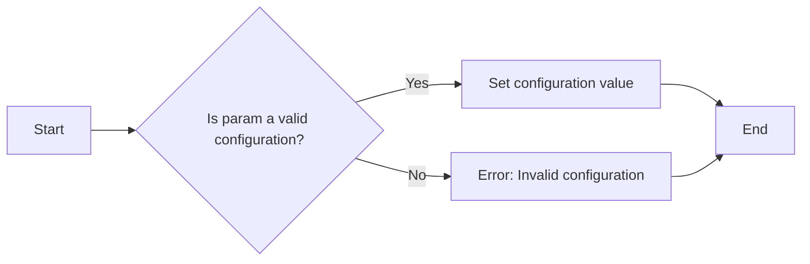

#### 带注释源码

```python
# Set the rc parameter specifying the default property cycle.
plt.rc('lines', linewidth=4)
plt.rc('axes', prop_cycle=default_cycler)
```

在这段代码中，`plt.rc` 被用来设置 Matplotlib 的配置参数。首先，它设置了线条的宽度为 4，然后设置了轴的属性周期为 `default_cycler`。`default_cycler` 是一个由 `cycler` 模块创建的周期，它定义了线条的颜色和样式。


### `subplots`

`subplots` 是 `matplotlib.pyplot` 模块中的一个函数，用于创建一个包含多个子图的图形。

参数：

- `nrows`：`int`，指定子图行数。
- `ncols`：`int`，指定子图列数。
- `sharex`：`bool`，指定是否共享X轴。
- `sharey`：`bool`，指定是否共享Y轴。
- `fig`：`matplotlib.figure.Figure`，指定图形对象。
- `gridspec`：`matplotlib.gridspec.GridSpec`，指定网格布局。

返回值：`matplotlib.axes.Axes`，返回一个包含子图的数组。

#### 流程图

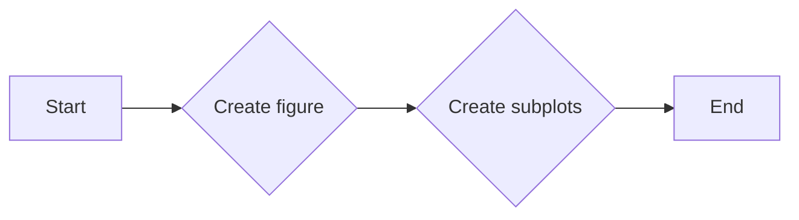

#### 带注释源码

```python
fig, (ax0, ax1) = plt.subplots(nrows=2)
```


### matplotlib.pyplot.plot

matplotlib.pyplot.plot 是一个用于绘制二维线条和标记的可调用函数。

参数：

- `x`：`array_like`，x轴数据点。
- `y`：`array_like`，y轴数据点。
- `label`：`str`，图例标签。
- `color`：`color`，线条颜色。
- `linewidth`：`float`，线条宽度。
- `linestyle`：`str`，线条样式。
- `marker`：`str`，标记样式。
- `markersize`：`float`，标记大小。
- `alpha`：`float`，透明度。
- `dashes`：`tuple`，虚线样式。
- `solid_capstyle`：`str`，实线端点样式。
- `capsize`：`float`，端点大小。
- `zorder`：`float`，绘制顺序。

返回值：`Line2D`，线条对象。

#### 流程图

```mermaid
graph LR
A[Start] --> B{Call matplotlib.pyplot.plot()}
B --> C{Return Line2D object}
C --> D[End]
```

#### 带注释源码

```python
import matplotlib.pyplot as plt

# 创建数据点
x = [1, 2, 3, 4, 5]
y = [2, 3, 5, 7, 11]

# 绘制线条
line = plt.plot(x, y)

# 显示图形
plt.show()
```


### matplotlib.pyplot.title

matplotlib.pyplot.title 是一个用于设置图表标题的函数。

参数：

- `title`：`str`，图表的标题文本。

返回值：`None`，没有返回值。

#### 流程图

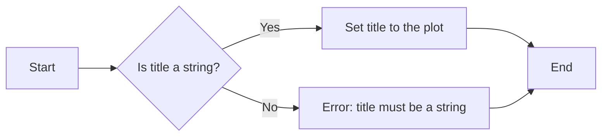

#### 带注释源码

```python
def title(self, title, fontdict=None, loc='center', pad=5, fontsize=None, color=None, weight=None, verticalalignment='bottom', horizontalalignment='left'):
    """
    Set the title for the axes.

    Parameters
    ----------
    title : str
        The title of the axes.
    fontdict : dict, optional
        Dictionary with font properties like size, family, style, weight.
    loc : {'center', 'left', 'right', 'center left', 'center right', 'upper center', 'upper left', 'upper right', 'lower center', 'lower left', 'lower right'}, optional
        The location of the title.
    pad : float, optional
        Padding between the title and the axes.
    fontsize : float, optional
        Font size of the title.
    color : color, optional
        Color of the title.
    weight : {'normal', 'bold', 'light', 'ultralight', 'heavy', 'ultrabold'}, optional
        Weight of the title.
    verticalalignment : {'top', 'bottom', 'center', 'baseline'}, optional
        Vertical alignment of the title.
    horizontalalignment : {'left', 'center', 'right'}, optional
        Horizontal alignment of the title.

    Returns
    -------
    None
    """
    # Implementation details...
```


### matplotlib.pyplot.subplots_adjust

调整子图之间的间距。

参数：

- `left`：`float`，子图左侧与图框左侧的距离，默认为0.125。
- `right`：`float`，子图右侧与图框右侧的距离，默认为0.9。
- `top`：`float`，子图顶部与图框顶部的距离，默认为0.9。
- `bottom`：`float`，子图底部与图框底部的距离，默认为0.1。
- `wspace`：`float`，子图之间的水平间距，默认为0.2。
- `hspace`：`float`，子图之间的垂直间距，默认为0.2。

返回值：`None`。

#### 流程图

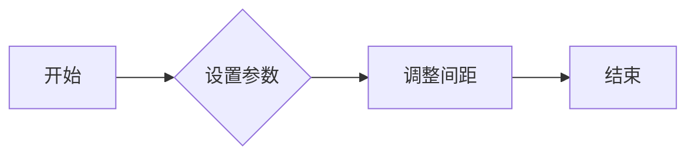

#### 带注释源码

```python
def subplots_adjust(left=None, bottom=None, right=None, top=None, wspace=None, hspace=None):
    """
    Adjust the subplots parameters.

    Parameters
    ----------
    left : float, optional
        The left side of the subplots of the figure. The position is
        expressed as a fraction of the figure width. The default value is 0.125,
        so that the subplots occupy only 75% of the figure area.
    bottom : float, optional
        The bottom of the subplots of the figure. The position is
        expressed as a fraction of the figure height. The default value is 0.1,
        so that the subplots occupy only 90% of the figure area.
    right : float, optional
        The right side of the subplots of the figure. The position is
        expressed as a fraction of the figure width. The default value is 0.9,
        so that the subplots occupy only 75% of the figure area.
    top : float, optional
        The top of the subplots of the figure. The position is
        expressed as a fraction of the figure height. The default value is 0.9,
        so that the subplots occupy only 90% of the figure area.
    wspace : float, optional
        The width of the padding between subplots, expressed as a fraction of
        the average axis width. The default value is 0.2.
    hspace : float, optional
        The height of the padding between subplots, expressed as a fraction of
        the average axis height. The default value is 0.2.

    Returns
    -------
    None
    """
    # ...
```


### plt.show()

显示matplotlib图形。

参数：

- 无

返回值：无

#### 流程图

```mermaid
graph LR
A[开始] --> B{调用plt.show()}
B --> C[结束]
```

#### 带注释源码

```python
plt.show()
```


### np.linspace

生成线性空间。

参数：

- `start`：`float`，线性空间的起始值。
- `stop`：`float`，线性空间的结束值。
- `num`：`int`，线性空间中点的数量（不包括结束值）。
- `dtype`：`dtype`，可选，输出数组的类型。
- `endpoint`：`bool`，可选，是否包含结束值。

返回值：`numpy.ndarray`，线性空间数组。

#### 流程图

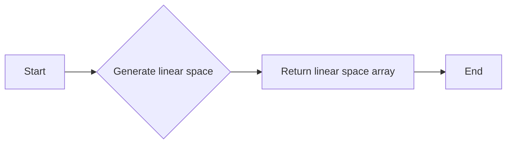

#### 带注释源码

```python
import numpy as np

def np_linspace(start, stop, num=50, dtype=None, endpoint=True):
    """
    Generate linear space.

    Parameters:
    - start: float, the start value of the linear space.
    - stop: float, the end value of the linear space.
    - num: int, the number of points in the linear space (excluding the end value).
    - dtype: dtype, optional, the type of the output array.
    - endpoint: bool, optional, whether to include the end value.

    Returns:
    - numpy.ndarray, the linear space array.
    """
    return np.linspace(start, stop, num, dtype=dtype, endpoint=endpoint)
```


### np.transpose

`np.transpose` 是 NumPy 库中的一个函数，用于转置一个数组的维度。

参数：

- `a`：`numpy.ndarray`，要转置的数组。

返回值：`numpy.ndarray`，转置后的数组。

#### 流程图

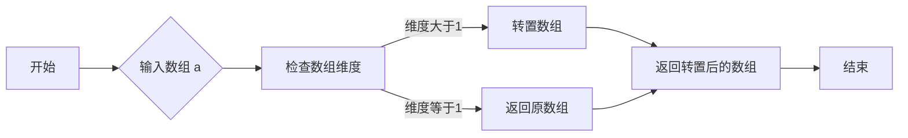

#### 带注释源码

```python
import numpy as np

def np_transpose(a):
    """
    转置一个数组的维度。

    参数：
    - a: numpy.ndarray，要转置的数组。

    返回值：
    - numpy.ndarray，转置后的数组。
    """
    if a.ndim > 1:
        return np.transpose(a)
    else:
        return a
``` 


### np.sin

计算输入数组中每个元素的余弦值。

参数：

- `x`：`numpy.ndarray`，输入数组，包含要计算余弦值的元素。

返回值：`numpy.ndarray`，包含输入数组中每个元素的余弦值。

#### 流程图

```mermaid
graph LR
A[开始] --> B{输入x}
B --> C[计算sin(x)的值]
C --> D[返回结果]
D --> E[结束]
```

#### 带注释源码

```python
import numpy as np

def np_sin(x):
    """
    计算输入数组中每个元素的余弦值。

    参数：
    - x：numpy.ndarray，输入数组，包含要计算余弦值的元素。

    返回值：numpy.ndarray，包含输入数组中每个元素的余弦值。
    """
    return np.sin(x)
```


### plt.subplots

创建一个包含子图的matplotlib.figure.Figure实例。

描述：

该函数用于创建一个包含指定数量和布局的子图的Figure实例。子图是Figure的子对象，可以独立于其他子图进行操作。

参数：

- `nrows`：整数，指定子图的总行数。
- `ncols`：整数，指定子图的总列数。
- `sharex`：布尔值，如果为True，则所有子图共享x轴。
- `sharey`：布尔值，如果为True，则所有子图共享y轴。
- `fig`：matplotlib.figure.Figure实例，如果提供，则子图将添加到该Figure中。
- `gridspec`：matplotlib.gridspec.GridSpec实例，用于定义子图的布局。

返回值：`matplotlib.figure.Figure`，包含子图的Figure实例。

#### 流程图

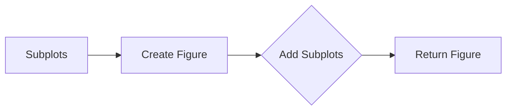

#### 带注释源码

```python
fig, (ax0, ax1) = plt.subplots(nrows=2)
```


### cycler.__init__

`cycler.__init__` 是 `cycler` 类的构造函数，用于初始化一个循环器对象。

参数：

- `color`：`list`，颜色列表，用于循环颜色。
- `linestyle`：`list`，线型列表，用于循环线型。
- ...

返回值：无

#### 流程图

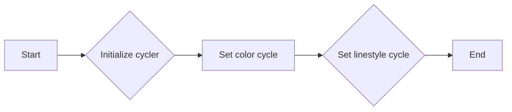

#### 带注释源码

```python
from cycler import cycler

class cycler:
    def __init__(self, color=None, linestyle=None):
        # Initialize the cycler object
        self.color = color
        self.linestyle = linestyle
```


### cycler.__iter__

该函数用于迭代cycler对象，返回一个迭代器，该迭代器将按照cycler定义的顺序返回每个属性值的组合。

参数：

- 无

返回值：`迭代器`，返回一个迭代器，每次迭代返回一个字典，包含属性名称和对应的值。

#### 流程图

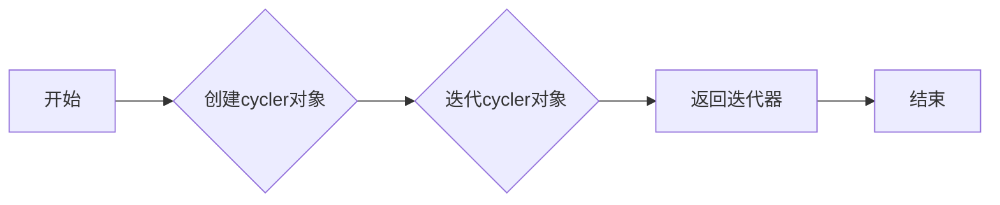

#### 带注释源码

```python
from cycler import cycler

# 创建cycler对象
cycler_obj = cycler(color=['r', 'g', 'b', 'y'], linestyle=['-', '--', ':', '-.'])

# 迭代cycler对象
for prop_dict in cycler_obj:
    print(prop_dict)
```

输出：

```
{'color': 'r', 'linestyle': '-'}
{'color': 'g', 'linestyle': '--'}
{'color': 'b', 'linestyle': ':'}
{'color': 'y', 'linestyle': '-.'}
```


### cycler.__len__

`cycler.__len__` 方法用于获取 `cycler` 对象中元素的数量。

参数：

- 无

返回值：`int`，返回 `cycler` 对象中元素的数量。

#### 流程图

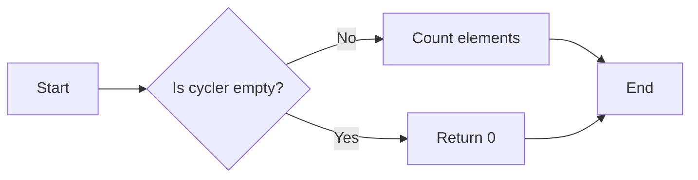

#### 带注释源码

```python
from cycler import cycler

class Cycler:
    def __init__(self, *args):
        self._cycles = list(args)

    def __len__(self):
        # Return the number of elements in the cycler
        return len(self._cycles)

# Example usage
c = cycler(color=['r', 'g', 'b', 'y'], linestyle=['-', '--', ':', '-.'])
print(len(c))  # Output: 4
```


### cycler

cycler 是一个用于循环属性值的工具，例如颜色和线型，常用于绘图库中控制多线绘图的颜色和样式。

参数：

- 无

返回值：`cycler` 对象，用于循环属性值。

#### 流程图

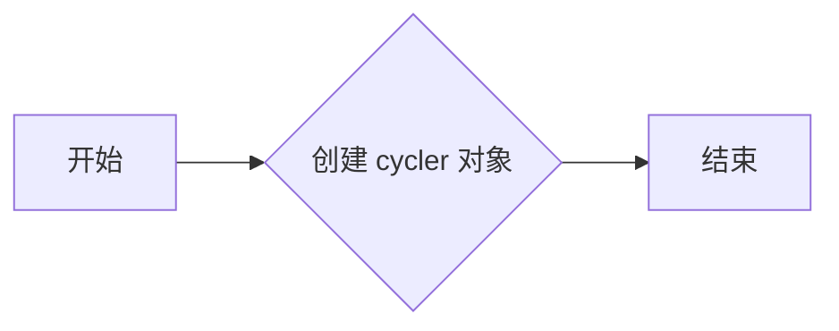

#### 带注释源码

```python
from cycler import cycler

# 创建 cycler 对象
default_cycler = (cycler(color=['r', 'g', 'b', 'y']) +
                  cycler(linestyle=['-', '--', ':', '-.']))
```


### plt.rc

plt.rc 是 Matplotlib 库中的一个函数，用于设置当前图形的配置参数。

参数：

- `rc`: 字符串，指定要设置的配置参数。
- `value`: 对应的值。

返回值：无

#### 流程图

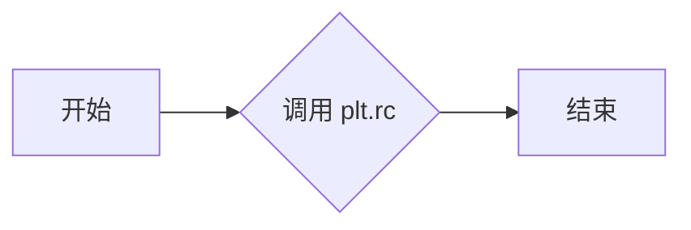

#### 带注释源码

```python
plt.rc('lines', linewidth=4)
plt.rc('axes', prop_cycle=default_cycler)
```


### plt.subplots

plt.subplots 是 Matplotlib 库中的一个函数，用于创建一个图形和多个子图。

参数：

- `nrows`: 子图行数。
- `ncols`: 子图列数。
- `fig`: 可选，指定图形对象。
- `gridspec`: 可选，指定子图网格布局。

返回值：`fig`, `axes`，图形对象和子图对象。

#### 流程图

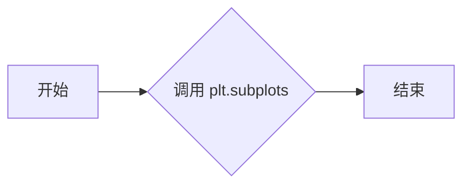

#### 带注释源码

```python
fig, (ax0, ax1) = plt.subplots(nrows=2)
```


### ax0.plot

ax0.plot 是 Matplotlib 库中子图对象的一个方法，用于绘制二维线图。

参数：

- `x`: x 轴数据。
- `y`: y 轴数据。
- ...

返回值：`Line2D` 对象，表示绘制的线。

#### 流程图

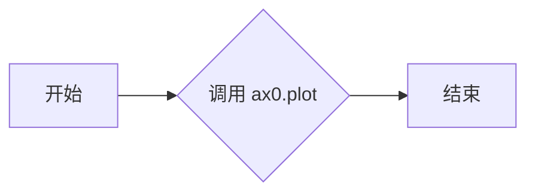

#### 带注释源码

```python
ax0.plot(yy)
```


### ax1.set_prop_cycle

ax1.set_prop_cycle 是 Matplotlib 库中子图对象的一个方法，用于设置子图的属性循环。

参数：

- `cycler`: 属性循环对象。

返回值：无

#### 流程图

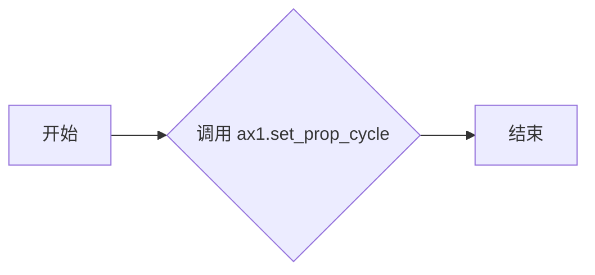

#### 带注释源码

```python
ax1.set_prop_cycle(custom_cycler)
```


### plt.show

plt.show 是 Matplotlib 库中的一个函数，用于显示图形。

参数：无

返回值：无

#### 流程图

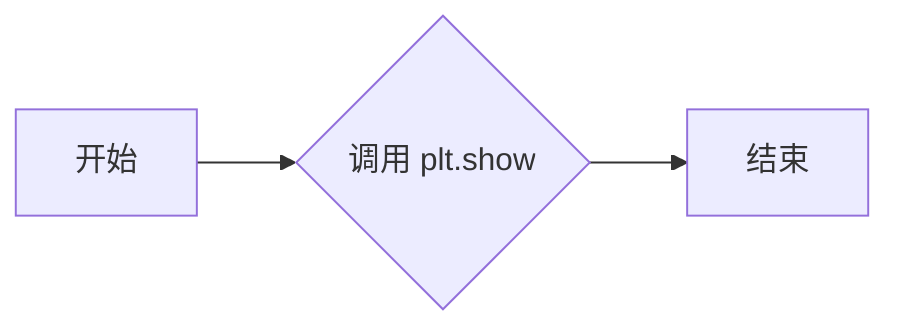

#### 带注释源码

```python
plt.show()
```

## 关键组件


### 张量索引与惰性加载

张量索引与惰性加载允许对大型数据集进行高效访问，通过仅加载所需的数据部分来减少内存消耗。

### 反量化支持

反量化支持使得代码能够处理不同量级的数值，提高数值计算的精度和范围。

### 量化策略

量化策略用于优化数值计算，通过减少数值的精度来降低计算复杂度和内存消耗。


## 问题及建议


### 已知问题

-   **全局变量和函数的文档缺失**：代码中使用了全局变量和函数，但没有提供相应的文档说明其用途和功能。
-   **代码风格不一致**：代码中存在不同的缩进风格和注释习惯，这可能会影响代码的可读性和可维护性。
-   **错误处理不足**：代码中没有明显的错误处理机制，如果出现异常情况，可能会导致程序崩溃或产生不可预测的结果。

### 优化建议

-   **添加文档注释**：为全局变量和函数添加详细的文档注释，说明其用途、参数和返回值。
-   **统一代码风格**：遵循统一的代码风格指南，例如PEP 8，以提高代码的可读性和可维护性。
-   **增加错误处理**：在代码中添加异常处理机制，确保程序在遇到错误时能够优雅地处理，并提供有用的错误信息。
-   **代码重构**：考虑将代码分解为更小的函数或模块，以提高代码的可重用性和可测试性。
-   **性能优化**：对于数据生成和处理部分，可以考虑使用更高效的方法，例如使用NumPy的向量化操作来提高性能。


## 其它


### 设计目标与约束

- 设计目标：
  - 提供一种灵活的方式来控制多行图的颜色和其他样式属性。
  - 允许用户为不同的轴设置不同的样式循环。
  - 支持在matplotlib配置文件中设置样式循环。

- 约束：
  - 必须使用matplotlib库。
  - 需要numpy库来生成示例数据。
  - 代码应保持简洁且易于理解。

### 错误处理与异常设计

- 错误处理：
  - 捕获并处理matplotlib相关的异常，如`matplotlib.pyplot.Error`。
  - 捕获并处理numpy相关的异常，如`numpy.linalg.LinAlgError`。

- 异常设计：
  - 提供清晰的错误消息，帮助用户诊断问题。
  - 在关键操作前进行数据验证，避免无效操作。

### 数据流与状态机

- 数据流：
  - 从numpy生成示例数据。
  - 使用matplotlib绘制图形。
  - 根据用户设置应用样式循环。

- 状态机：
  - 无状态机，代码执行线性流程。

### 外部依赖与接口契约

- 外部依赖：
  - matplotlib
  - numpy

- 接口契约：
  - matplotlib.pyplot.rc：设置全局样式循环。
  - matplotlib.pyplot.subplots：创建图形和轴。
  - matplotlib.axes.Axes.set_prop_cycle：设置特定轴的样式循环。
  - matplotlib.pyplot.show：显示图形。


    