# `matplotlib\galleries\users_explain\artists\patheffects_guide.py` 详细设计文档

This code demonstrates the usage of path effects in Matplotlib for enhancing the visual appearance of text and lines on a canvas.

## 整体流程

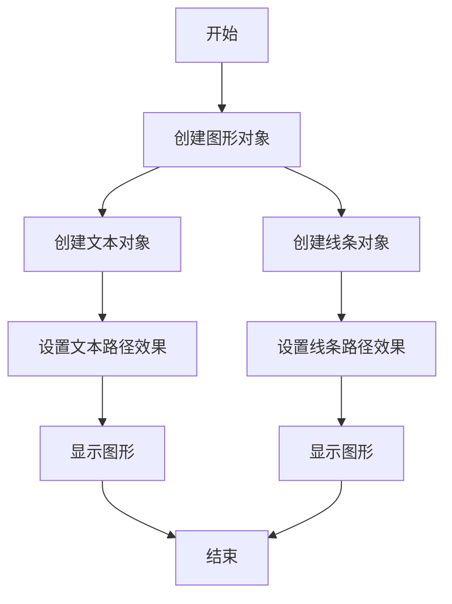

## 类结构

```
matplotlib.pyplot (主模块)
├── matplotlib.patheffects (路径效果模块)
│   ├── Normal (正常路径效果)
│   ├── withSimplePatchShadow (带阴影的路径效果)
│   ├── SimpleLineShadow (简单线条阴影)
│   ├── Stroke (轮廓路径效果)
│   └── PathPatchEffect (路径补丁效果)
```

## 全局变量及字段


### `fig`
    
The main figure object where all the plotting elements are drawn.

类型：`matplotlib.figure.Figure`
    


### `text`
    
The text object that is being manipulated with path effects.

类型：`matplotlib.text.Text`
    


### `path_effects`
    
The module that contains the path effects classes and functions.

类型：`module 'matplotlib.patheffects'`
    


### `matplotlib.pyplot.figure`
    
The module that contains the Figure class.

类型：`module 'matplotlib.pyplot.figure'`
    


### `matplotlib.pyplot.text`
    
The module that contains the Text class.

类型：`module 'matplotlib.pyplot.text'`
    


### `matplotlib.pyplot.plot`
    
The function used to create line plots.

类型：`module 'matplotlib.pyplot.plot'`
    


### `matplotlib.patheffects.Normal`
    
The normal path effect that draws the artist without any additional effects.

类型：`matplotlib.patheffects.AbstractPathEffect`
    


### `matplotlib.patheffects.withSimplePatchShadow`
    
A function that creates a path effect with a simple patch shadow.

类型：`function`
    


### `matplotlib.patheffects.SimpleLineShadow`
    
The simple line shadow path effect that draws a shadow below the artist.

类型：`matplotlib.patheffects.AbstractPathEffect`
    


### `matplotlib.patheffects.Stroke`
    
The stroke path effect that draws a bold outline around the artist.

类型：`matplotlib.patheffects.AbstractPathEffect`
    


### `matplotlib.patheffects.PathPatchEffect`
    
The path patch effect that creates a PathPatch with the original path and allows for additional styling options.

类型：`matplotlib.patheffects.AbstractPathEffect`
    


### `matplotlib.pyplot.figure.fig`
    
The main figure object where all the plotting elements are drawn.

类型：`matplotlib.figure.Figure`
    


### `matplotlib.pyplot.text.text`
    
The text object that is being manipulated with path effects.

类型：`matplotlib.text.Text`
    


### `matplotlib.pyplot.plot`
    
The function used to create line plots.

类型：`function`
    


### `matplotlib.patheffects.Normal`
    
The normal path effect that draws the artist without any additional effects.

类型：`matplotlib.patheffects.AbstractPathEffect`
    


### `matplotlib.patheffects.withSimplePatchShadow`
    
A function that creates a path effect with a simple patch shadow.

类型：`function`
    


### `matplotlib.patheffects.SimpleLineShadow`
    
The simple line shadow path effect that draws a shadow below the artist.

类型：`matplotlib.patheffects.AbstractPathEffect`
    


### `matplotlib.patheffects.Stroke`
    
The stroke path effect that draws a bold outline around the artist.

类型：`matplotlib.patheffects.AbstractPathEffect`
    


### `matplotlib.patheffects.PathPatchEffect`
    
The path patch effect that creates a PathPatch with the original path and allows for additional styling options.

类型：`matplotlib.patheffects.AbstractPathEffect`
    
    

## 全局函数及方法


### `withSimplePatchShadow()`

`withSimplePatchShadow()` 是一个上下文管理器，用于应用 `SimplePatchShadow` 路径效果。

参数：

- 无

返回值：`None`

#### 流程图

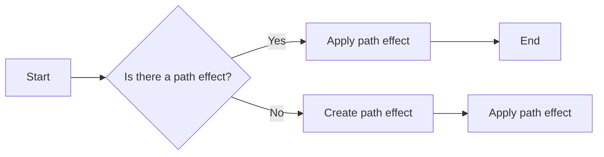

#### 带注释源码

```python
import matplotlib.patheffects as path_effects

text = plt.text(0.5, 0.5, 'Hello path effects world!',
                path_effects=[path_effects.withSimplePatchShadow()])
```


### `SimpleLineShadow()`

`SimpleLineShadow()` 是一个路径效果类，用于在图形元素下方绘制阴影。

参数：

- `color`：`str`，阴影的颜色。
- `alpha`：`float`，阴影的透明度。

返回值：`None`

#### 流程图


#### 带注释源码

```python
import matplotlib.patheffects as path_effects

plt.plot([0, 3, 2, 5], linewidth=5, color='blue',
         path_effects=[path_effects.SimpleLineShadow(color='black', alpha=0.5)])
```


### `Stroke()`

`Stroke()` 是一个路径效果类，用于在图形元素下方绘制轮廓。

参数：

- `linewidth`：`int`，轮廓的宽度。
- `foreground`：`str`，轮廓的颜色。

返回值：`None`

#### 流程图


#### 带注释源码

```python
import matplotlib.patheffects as path_effects

fig = plt.figure(figsize=(7, 1))
text = fig.text(0.5, 0.5, 'This text stands out because of\n'
                          'its black border.', color='white',
                          ha='center', va='center', size=30)
text.set_path_effects([path_effects.Stroke(linewidth=3, foreground='black'),
                       path_effects.Normal()])
```


### `PathPatchEffect()`

`PathPatchEffect()` 是一个路径效果类，用于创建一个 `PathPatch` 类的实例，并应用特定的样式。

参数：

- `offset`：`tuple`，偏移量。
- `hatch`：`str`，填充图案。
- `facecolor`：`str`，填充颜色。
- `edgecolor`：`str`，边框颜色。
- `linewidth`：`float`，边框宽度。

返回值：`None`

#### 流程图


#### 带注释源码

```python
import matplotlib.patheffects as path_effects

fig = plt.figure(figsize=(8.5, 1))
t = fig.text(0.02, 0.5, 'Hatch shadow', fontsize=75, weight=1000, va='center')
t.set_path_effects([
    path_effects.PathPatchEffect(
        offset=(4, -4), hatch='xxxx', facecolor='gray'),
    path_effects.PathPatchEffect(
        edgecolor='white', linewidth=1.1, facecolor='black')])
```


### text.set_path_effects([path_effects.Normal()])

将文本设置为正常路径效果。

参数：

-  无

返回值：无

#### 流程图

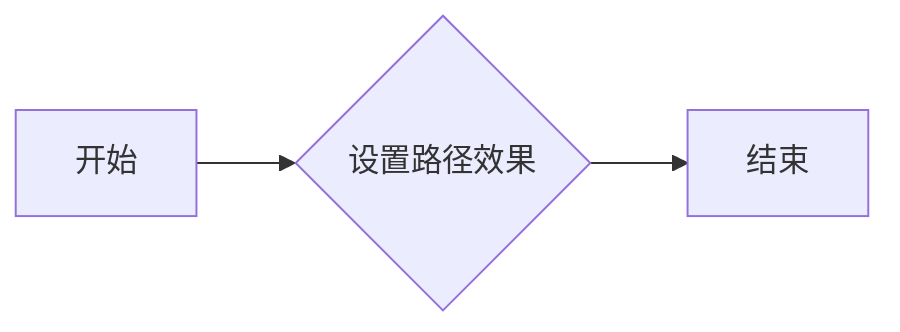

#### 带注释源码

```python
text.set_path_effects([path_effects.Normal()])
```

### plt.text(0.5, 0.5, 'Hello path effects world!', path_effects=[path_effects.withSimplePatchShadow()])

创建文本并应用简单补丁阴影路径效果。

参数：

-  `0.5`：`float`，文本的x坐标
-  `0.5`：`float`，文本的y坐标
-  `'Hello path effects world!'`：`str`，文本内容
-  `path_effects=[path_effects.withSimplePatchShadow()]`：`list`，路径效果列表

返回值：`Text`对象

#### 流程图

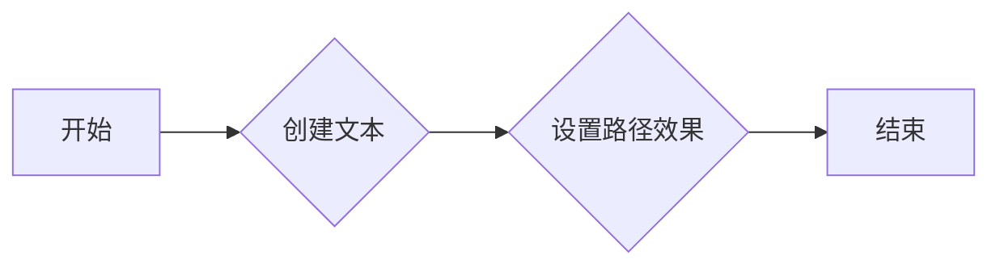

#### 带注释源码

```python
plt.text(0.5, 0.5, 'Hello path effects world!', path_effects=[path_effects.withSimplePatchShadow()])
```

### plt.plot([0, 3, 2, 5], linewidth=5, color='blue', path_effects=[path_effects.SimpleLineShadow(), path_effects.Normal()])

绘制折线图并应用简单线阴影和正常路径效果。

参数：

-  `[0, 3, 2, 5]`：`list`，折线图的x坐标
-  `linewidth=5`：`int`，线宽
-  `'blue'`：`str`，颜色
-  `path_effects=[path_effects.SimpleLineShadow(), path_effects.Normal()]`：`list`，路径效果列表

返回值：`Line2D`对象

#### 流程图

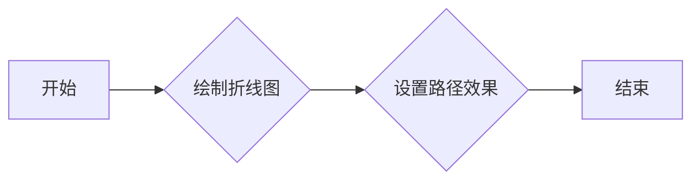

#### 带注释源码

```python
plt.plot([0, 3, 2, 5], linewidth=5, color='blue', path_effects=[path_effects.SimpleLineShadow(), path_effects.Normal()])
```

### fig.text(0.5, 0.5, 'This text stands out because of\nits black border.', color='white', ha='center', va='center', size=30).set_path_effects([path_effects.Stroke(linewidth=3, foreground='black'), path_effects.Normal()])

创建文本并应用黑色边框和正常路径效果。

参数：

-  `0.5`：`float`，文本的x坐标
-  `0.5`：`float`，文本的y坐标
-  `'This text stands out because of\nits black border.'`：`str`，文本内容
-  `color='white'`：`str`，文本颜色
-  `ha='center'`：`str`，水平对齐方式
-  `va='center'`：`str`，垂直对齐方式
-  `size=30`：`int`，字体大小
-  `path_effects=[path_effects.Stroke(linewidth=3, foreground='black'), path_effects.Normal()]`：`list`，路径效果列表

返回值：`Text`对象

#### 流程图


#### 带注释源码

```python
fig.text(0.5, 0.5, 'This text stands out because of\nits black border.', color='white', ha='center', va='center', size=30).set_path_effects([path_effects.Stroke(linewidth=3, foreground='black'), path_effects.Normal()])
```

### fig.text(0.02, 0.5, 'Hatch shadow', fontsize=75, weight=1000, va='center').set_path_effects([
    path_effects.PathPatchEffect(
        offset=(4, -4), hatch='xxxx', facecolor='gray'),
    path_effects.PathPatchEffect(
        edgecolor='white', linewidth=1.1, facecolor='black')])

创建文本并应用路径补丁效果。

参数：

-  `0.02`：`float`，文本的x坐标
-  `'Hatch shadow'`：`str`，文本内容
-  `fontsize=75`：`int`，字体大小
-  `weight=1000`：`int`，字体粗细
-  `va='center'`：`str`，垂直对齐方式
-  `path_effects=[
    path_effects.PathPatchEffect(
        offset=(4, -4), hatch='xxxx', facecolor='gray'),
    path_effects.PathPatchEffect(
        edgecolor='white', linewidth=1.1, facecolor='black')]`：`list`，路径效果列表

返回值：`Text`对象

#### 流程图


#### 带注释源码

```python
fig.text(0.02, 0.5, 'Hatch shadow', fontsize=75, weight=1000, va='center').set_path_effects([
    path_effects.PathPatchEffect(
        offset=(4, -4), hatch='xxxx', facecolor='gray'),
    path_effects.PathPatchEffect(
        edgecolor='white', linewidth=1.1, facecolor='black')])
```


### plot

`plot` 函数是 Matplotlib 库中用于绘制二维线图的函数。

参数：

- `x`：`array_like`，x 轴的数据点。
- `y`：`array_like`，y 轴的数据点。
- `color`：`color`，线条的颜色。
- `linewidth`：`float`，线条的宽度。
- `path_effects`：`list`，应用于线条的路径效果。

返回值：`Line2D`，绘制的线条对象。

#### 流程图

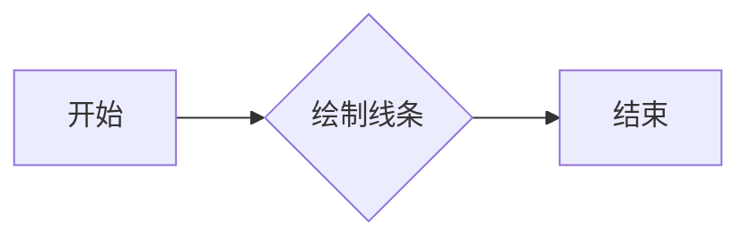

#### 带注释源码

```python
import matplotlib.pyplot as plt

def plot(x, y, color='blue', linewidth=1, path_effects=None):
    """
    绘制二维线图。

    参数:
    x : array_like
        x 轴的数据点。
    y : array_like
        y 轴的数据点。
    color : color
        线条的颜色。
    linewidth : float
        线条的宽度。
    path_effects : list
        应用于线条的路径效果。

    返回值:
    Line2D
        绘制的线条对象。
    """
    line = plt.plot(x, y, color=color, linewidth=linewidth, path_effects=path_effects)
    return line
```


### `matplotlib.patheffects.withSimplePatchShadow()`

`withSimplePatchShadow()` 是一个工厂函数，用于创建一个 `SimplePatchShadow` 实例，该实例可以应用于任何路径基础的艺术家。

参数：

- 无

返回值：`matplotlib.patheffects.SimplePatchShadow`，一个用于创建阴影效果的路径效果实例。

#### 流程图

```mermaid
graph LR
A[Start] --> B{Call withSimplePatchShadow()}
B --> C[Create SimplePatchShadow instance]
C --> D[Apply to artist]
D --> E[End]
```

#### 带注释源码

```python
import matplotlib.patheffects as path_effects

# 创建一个 SimplePatchShadow 实例
shadow_effect = path_effects.withSimplePatchShadow()

# 应用到文本艺术家
text = plt.text(0.5, 0.5, 'Hello path effects world!',
                path_effects=[shadow_effect])

plt.show()
```


### text.set_path_effects([path_effects.Normal()])

该函数将一个或多个路径效果应用于matplotlib中的文本对象。

参数：

- `path_effects`：`list`，包含一个或多个`AbstractPathEffect`实例的列表。

返回值：无

#### 流程图


#### 带注释源码

```python
import matplotlib.pyplot as plt
import matplotlib.patheffects as path_effects

fig = plt.figure(figsize=(5, 1.5))
text = fig.text(0.5, 0.5, 'Hello path effects world!\nThis is the normal '
                          'path effect.\nPretty dull, huh?',
                ha='center', va='center', size=20)
text.set_path_effects([path_effects.Normal()])
plt.show()
```

### text.set_path_effects([path_effects.withSimplePatchShadow()])

该函数将一个阴影效果应用于matplotlib中的文本对象。

参数：

- `path_effects`：`list`，包含一个`withSimplePatchShadow()`实例的列表。

返回值：无

#### 流程图


#### 带注释源码

```python
import matplotlib.pyplot as plt
import matplotlib.patheffects as path_effects

text = plt.text(0.5, 0.5, 'Hello path effects world!',
                path_effects=[path_effects.withSimplePatchShadow()])
plt.show()
```

### plt.plot([0, 3, 2, 5], linewidth=5, color='blue', path_effects=[path_effects.SimpleLineShadow(), path_effects.Normal()])

该函数绘制一个折线图，并应用阴影效果和正常效果。

参数：

- `x`：`list`，折线图的x坐标。
- `y`：`list`，折线图的y坐标。
- `linewidth`：`int`，折线图的线宽。
- `color`：`str`，折线图的颜色。
- `path_effects`：`list`，包含一个`SimpleLineShadow()`实例和一个`Normal()`实例的列表。

返回值：无

#### 流程图

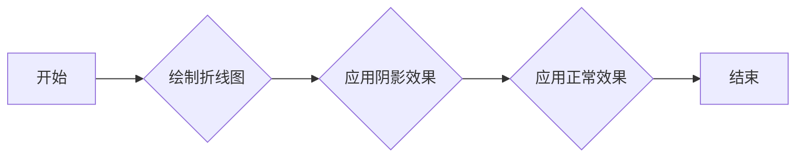

#### 带注释源码

```python
import matplotlib.pyplot as plt
import matplotlib.patheffects as path_effects

plt.plot([0, 3, 2, 5], linewidth=5, color='blue',
         path_effects=[path_effects.SimpleLineShadow(),
                       path_effects.Normal()])
plt.show()
```

### text.set_path_effects([path_effects.Stroke(linewidth=3, foreground='black'), path_effects.Normal()])

该函数将一个粗边框效果应用于matplotlib中的文本对象。

参数：

- `path_effects`：`list`，包含一个`Stroke()`实例和一个`Normal()`实例的列表。

返回值：无

#### 流程图

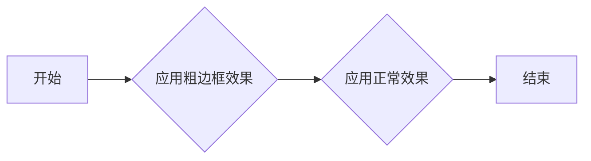

#### 带注释源码

```python
import matplotlib.pyplot as plt
import matplotlib.patheffects as path_effects

fig = plt.figure(figsize=(7, 1))
text = fig.text(0.5, 0.5, 'This text stands out because of\n'
                          'its black border.', color='white',
                          ha='center', va='center', size=30)
text.set_path_effects([path_effects.Stroke(linewidth=3, foreground='black'),
                       path_effects.Normal()])
plt.show()
```

### t.set_path_effects([
    path_effects.PathPatchEffect(
        offset=(4, -4), hatch='xxxx', facecolor='gray'),
    path_effects.PathPatchEffect(
        edgecolor='white', linewidth=1.1, facecolor='black')])

该函数将一个路径效果应用于matplotlib中的文本对象。

参数：

- `path_effects`：`list`，包含两个`PathPatchEffect`实例的列表。

返回值：无

#### 流程图

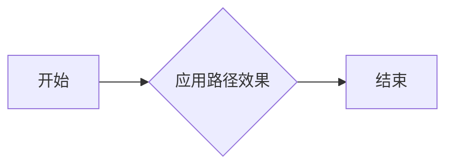

#### 带注释源码

```python
import matplotlib.pyplot as plt
import matplotlib.patheffects as path_effects

fig = plt.figure(figsize=(8.5, 1))
t = fig.text(0.02, 0.5, 'Hatch shadow', fontsize=75, weight=1000, va='center')
t.set_path_effects([
    path_effects.PathPatchEffect(
        offset=(4, -4), hatch='xxxx', facecolor='gray'),
    path_effects.PathPatchEffect(
        edgecolor='white', linewidth=1.1, facecolor='black')])
plt.show()
``` 


### `matplotlib.pyplot.figure`

创建一个新的图形窗口。

参数：

- `figsize`：`tuple`，图形的宽度和高度，单位为英寸。

返回值：`Figure`，图形对象。

#### 流程图

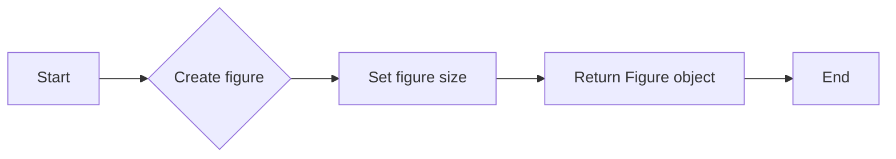

#### 带注释源码

```python
fig = plt.figure(figsize=(5, 1.5))
```

### `matplotlib.patheffects.withSimplePatchShadow`

创建一个带有简单阴影的路径效果。

参数：

- 无

返回值：`SimplePatchShadow`，路径效果对象。

#### 流程图

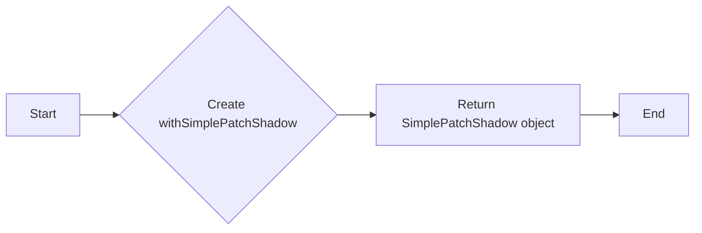

#### 带注释源码

```python
path_effects=[path_effects.withSimplePatchShadow()]
```

### `matplotlib.pyplot.plot`

绘制二维线条图。

参数：

- `x`：`array_like`，x轴数据。
- `y`：`array_like`，y轴数据。
- `linewidth`：`float`，线条宽度。
- `color`：`color`，线条颜色。
- `path_effects`：`list`，路径效果列表。

返回值：`Line2D`，线条对象。

#### 流程图

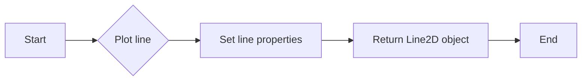

#### 带注释源码

```python
plt.plot([0, 3, 2, 5], linewidth=5, color='blue', path_effects=[path_effects.SimpleLineShadow(), path_effects.Normal()])
```

### `matplotlib.pyplot.show`

显示图形。

参数：

- 无

返回值：无。

#### 流程图

```mermaid
graph LR
A[Start] --> B{Show plot}
B --> C[End]
```

#### 带注释源码

```python
plt.show()
```


### matplotlib.pyplot.text

matplotlib.pyplot.text 是一个用于在 matplotlib 图形中添加文本的方法。

参数：

- `x`：`float`，文本的 x 坐标。
- `y`：`float`，文本的 y 坐标。
- `s`：`str`，要显示的文本字符串。
- `ha`：`str`，水平对齐方式，可以是 'left'、'center' 或 'right'。
- `va`：`str`，垂直对齐方式，可以是 'top'、'center' 或 'bottom'。
- `size`：`int`，文本的大小。

返回值：`Text` 对象，表示添加到图形中的文本。

#### 流程图

```mermaid
graph LR
A[Start] --> B{Is x a float?}
B -- Yes --> C{Is y a float?}
C -- Yes --> D{Is s a str?}
D -- Yes --> E{Is ha a str?}
E -- Yes --> F{Is va a str?}
F -- Yes --> G{Is size an int?}
G -- Yes --> H[Create Text object]
H --> I[End]
```

#### 带注释源码

```python
import matplotlib.pyplot as plt

fig = plt.figure(figsize=(5, 1.5))
text = fig.text(0.5, 0.5, 'Hello path effects world!\nThis is the normal '
                          'path effect.\nPretty dull, huh?',
                ha='center', va='center', size=20)
text.set_path_effects([path_effects.Normal()])
plt.show()
```


### matplotlib.patheffects.withSimplePatchShadow

matplotlib.patheffects.withSimplePatchShadow 是一个用于添加阴影效果的函数。

参数：

- `shadow`：`SimplePatchShadow` 对象，表示阴影效果。

返回值：`withSimplePatchShadow` 对象。

#### 流程图

```mermaid
graph LR
A[Start] --> B{Is shadow a SimplePatchShadow?}
B -- Yes --> C[Return withSimplePatchShadow object]
C --> D[End]
```

#### 带注释源码

```python
import matplotlib.patheffects as path_effects

text = plt.text(0.5, 0.5, 'Hello path effects world!',
                path_effects=[path_effects.withSimplePatchShadow()])
```


### matplotlib.patheffects.SimpleLineShadow

matplotlib.patheffects.SimpleLineShadow 是一个用于添加线条阴影效果的函数。

参数：

- `shadow`：`SimpleLineShadow` 对象，表示阴影效果。

返回值：`SimpleLineShadow` 对象。

#### 流程图

```mermaid
graph LR
A[Start] --> B{Is shadow a SimpleLineShadow?}
B -- Yes --> C[Return SimpleLineShadow object]
C --> D[End]
```

#### 带注释源码

```python
import matplotlib.patheffects as path_effects

plt.plot([0, 3, 2, 5], linewidth=5, color='blue',
         path_effects=[path_effects.SimpleLineShadow(),
                       path_effects.Normal()])
```


### matplotlib.patheffects.Stroke

matplotlib.patheffects.Stroke 是一个用于添加轮廓效果的函数。

参数：

- `linewidth`：`int`，轮廓线的宽度。
- `foreground`：`str`，轮廓线的颜色。

返回值：`Stroke` 对象。

#### 流程图

```mermaid
graph LR
A[Start] --> B{Is linewidth an int?}
B -- Yes --> C{Is foreground a str?}
C -- Yes --> D[Return Stroke object]
D --> E[End]
```

#### 带注释源码

```python
import matplotlib.patheffects as path_effects

fig = plt.figure(figsize=(7, 1))
text = fig.text(0.5, 0.5, 'This text stands out because of\n'
                          'its black border.', color='white',
                          ha='center', va='center', size=30)
text.set_path_effects([path_effects.Stroke(linewidth=3, foreground='black'),
                       path_effects.Normal()])
```


### matplotlib.patheffects.PathPatchEffect

matplotlib.patheffects.PathPatchEffect 是一个用于创建 PathPatch 对象的函数。

参数：

- `offset`：`tuple`，PathPatch 对象的偏移量。
- `hatch`：`str`，PathPatch 对象的填充模式。
- `facecolor`：`str`，PathPatch 对象的填充颜色。
- `edgecolor`：`str`，PathPatch 对象的边框颜色。
- `linewidth`：`float`，PathPatch 对象的边框宽度。

返回值：`PathPatchEffect` 对象。

#### 流程图

```mermaid
graph LR
A[Start] --> B{Is offset a tuple?}
B -- Yes --> C{Is hatch a str?}
C -- Yes --> D{Is facecolor a str?}
D -- Yes --> E{Is edgecolor a str?}
E -- Yes --> F{Is linewidth a float?}
F -- Yes --> G[Return PathPatchEffect object]
G --> H[End]
```

#### 带注释源码

```python
import matplotlib.patheffects as path_effects

fig = plt.figure(figsize=(8.5, 1))
t = fig.text(0.02, 0.5, 'Hatch shadow', fontsize=75, weight=1000, va='center')
t.set_path_effects([
    path_effects.PathPatchEffect(
        offset=(4, -4), hatch='xxxx', facecolor='gray'),
    path_effects.PathPatchEffect(
        edgecolor='white', linewidth=1.1, facecolor='black')])
```


### matplotlib.pyplot.plot

matplotlib.pyplot.plot 是一个用于绘制二维线条和标记的函数。

参数：

- `x`：`array_like`，x轴数据点。
- `y`：`array_like`，y轴数据点。
- `color`：`color`，线条颜色。
- `linewidth`：`float`，线条宽度。
- `path_effects`：`AbstractPathEffect`，应用于线条的路径效果。

返回值：`Line2D`，线条对象。

#### 流程图

```mermaid
graph LR
A[开始] --> B{调用 matplotlib.pyplot.plot}
B --> C{绘制线条}
C --> D[结束]
```

#### 带注释源码

```python
import matplotlib.pyplot as plt

# 创建数据点
x = [0, 3, 2, 5]
y = [0, 1, 4, 2]

# 绘制线条
line = plt.plot(x, y, color='blue', linewidth=5, path_effects=[path_effects.SimpleLineShadow()])

# 显示图形
plt.show()
```


### plt.show()

显示matplotlib图形。

参数：

- 无

返回值：无

#### 流程图

```mermaid
graph LR
A[开始] --> B{调用plt.show()}
B --> C[结束]
```

#### 带注释源码

```python
import matplotlib.pyplot as plt

# ... (前面的代码，如创建图形和添加元素)

plt.show()  # 显示图形
```


### matplotlib.patheffects.withSimplePatchShadow()

将 `SimplePatchShadow` 效果应用于路径基于的艺术家。

参数：

- `shadow`：`SimplePatchShadow`，创建一个阴影效果，该效果在原始艺术家下方绘制一个填充的补丁。

返回值：`None`，没有返回值，该方法直接应用于艺术家。

#### 流程图

```mermaid
graph LR
A[开始] --> B{调用withSimplePatchShadow()}
B --> C[结束]
```

#### 带注释源码

```python
import matplotlib.patheffects as path_effects

text = plt.text(0.5, 0.5, 'Hello path effects world!',
                path_effects=[path_effects.withSimplePatchShadow()])
```

### matplotlib.patheffects.SimpleLineShadow()

创建一个简单的线条阴影效果。

参数：

- `shadow`：`SimpleLineShadow`，创建一个阴影效果，该效果在原始艺术家下方绘制一个线条补丁。

返回值：`None`，没有返回值，该方法直接应用于艺术家。

#### 流程图

```mermaid
graph LR
A[开始] --> B{调用SimpleLineShadow()}
B --> C[结束]
```

#### 带注释源码

```python
import matplotlib.patheffects as path_effects

plt.plot([0, 3, 2, 5], linewidth=5, color='blue',
         path_effects=[path_effects.SimpleLineShadow(),
                       path_effects.Normal()])
```

### matplotlib.patheffects.Stroke()

创建一个轮廓效果，在原始艺术家下方绘制一个粗边框。

参数：

- `linewidth`：`int`，边框的宽度。
- `foreground`：`str`，边框的颜色。

返回值：`None`，没有返回值，该方法直接应用于艺术家。

#### 流程图

```mermaid
graph LR
A[开始] --> B{调用Stroke(linewidth, foreground)}
B --> C[结束]
```

#### 带注释源码

```python
import matplotlib.patheffects as path_effects

fig = plt.figure(figsize=(7, 1))
text = fig.text(0.5, 0.5, 'This text stands out because of\n'
                          'its black border.', color='white',
                          ha='center', va='center', size=30)
text.set_path_effects([path_effects.Stroke(linewidth=3, foreground='black'),
                       path_effects.Normal()])
```

### matplotlib.patheffects.PathPatchEffect()

创建一个路径补丁效果，允许对路径进行更高级的控制。

参数：

- `offset`：`tuple`，偏移量，用于调整路径的位置。
- `hatch`：`str`，填充图案。
- `facecolor`：`str`，填充颜色。
- `edgecolor`：`str`，边框颜色。
- `linewidth`：`float`，边框宽度。

返回值：`None`，没有返回值，该方法直接应用于艺术家。

#### 流程图

```mermaid
graph LR
A[开始] --> B{调用PathPatchEffect(offset, hatch, facecolor, edgecolor, linewidth)}
B --> C[结束]
```

#### 带注释源码

```python
import matplotlib.patheffects as path_effects

fig = plt.figure(figsize=(8.5, 1))
t = fig.text(0.02, 0.5, 'Hatch shadow', fontsize=75, weight=1000, va='center')
t.set_path_effects([
    path_effects.PathPatchEffect(
        offset=(4, -4), hatch='xxxx', facecolor='gray'),
    path_effects.PathPatchEffect(
        edgecolor='white', linewidth=1.1, facecolor='black')])
```


## 关键组件


### 张量索引与惰性加载

张量索引与惰性加载是用于高效处理大型数据集的关键组件，它允许在数据被实际访问之前不进行加载，从而减少内存消耗和提高性能。

### 反量化支持

反量化支持是用于处理量化数据的关键组件，它允许在量化过程中对数据进行逆量化，以便在需要时恢复原始数据精度。

### 量化策略

量化策略是用于优化模型性能和减少模型大小的关键组件，它通过减少模型中使用的数值范围来降低模型的复杂度。

## 问题及建议


### 已知问题

-   **代码重复性**：代码中多次使用相同的路径效果设置，如`path_effects.SimpleLineShadow()`和`path_effects.Normal()`，这可能导致维护困难。
-   **缺乏异常处理**：代码示例中没有显示任何异常处理机制，如果发生错误（例如，无效的路径效果），程序可能会崩溃。
-   **文档不足**：虽然代码中包含了一些注释，但缺乏详细的文档说明，这可能会使新用户难以理解代码的工作原理。
-   **性能问题**：使用多个路径效果可能会影响绘图性能，尤其是在处理大量数据时。

### 优化建议

-   **使用函数封装**：创建函数来封装重复的路径效果设置，以减少代码重复并提高可维护性。
-   **添加异常处理**：在代码中添加异常处理来捕获和处理潜在的错误，以提高程序的健壮性。
-   **编写详细文档**：编写详细的文档来解释代码的工作原理、每个函数的作用以及如何使用它们。
-   **性能优化**：对代码进行性能分析，并针对性能瓶颈进行优化，例如通过减少不必要的路径效果或使用更高效的算法。
-   **代码示例**：提供更多具体的代码示例，展示如何使用不同的路径效果，并解释它们的效果。


## 其它


### 设计目标与约束

- 设计目标：
  - 提供灵活的路径效果，以增强matplotlib图形的视觉效果。
  - 允许用户通过简单的API应用复杂的路径效果。
  - 保持与matplotlib Artist类的一致性，以便用户可以轻松地应用路径效果。
- 约束：
  - 路径效果必须与matplotlib的渲染引擎兼容。
  - 路径效果的性能必须足够好，以避免显著降低绘图速度。

### 错误处理与异常设计

- 错误处理：
  - 当用户尝试应用无效的路径效果时，应抛出异常。
  - 异常应提供足够的信息，以便用户了解错误的原因。
- 异常设计：
  - `ValueError`：当用户尝试设置无效的参数时。
  - `TypeError`：当用户尝试应用不支持的路径效果时。

### 数据流与状态机

- 数据流：
  - 用户通过API设置路径效果。
  - 路径效果被应用到Artist对象上。
  - 路径效果在渲染过程中被应用。
- 状态机：
  - 每个路径效果类都有自己的状态机，用于控制其绘制行为。

### 外部依赖与接口契约

- 外部依赖：
  - matplotlib：路径效果模块依赖于matplotlib的核心库。
- 接口契约：
  - `AbstractPathEffect`：所有路径效果类都必须实现此接口。
  - `Artist.set_path_effects`：此方法用于将路径效果应用到Artist对象上。


    