# `matplotlib\galleries\users_explain\artists\transforms_tutorial.py` 详细设计文档

这是一个Matplotlib变换框架的教程文档，演示如何在数据坐标、轴坐标、图形坐标和显示坐标之间进行转换，以及如何使用混合变换、缩放平移等高级技术来实现精确的图形定位和特效。

## 整体流程

```mermaid
graph TD
    A[开始] --> B[导入必要的库]
    B --> C[创建基础图表和数据]
    C --> D{演示哪种坐标系统?}
    D --> E[数据坐标transData]
    D --> F[轴坐标transAxes]
    D --> G[混合坐标blended]
    D --> H[物理坐标dpi_scale_trans]
    D --> I[偏移变换ScaledTranslation]
    E --> E1[使用transData.transform转换坐标]
    E1 --> E2[使用inverted反向转换]
    F --> F1[在Axes内使用相对坐标0-1]
    G --> G1[使用blended_transform_factory混合坐标系统]
    H --> H1[使用fig.dpi_scale_trans实现物理尺寸]
    I --> I1[组合多个变换实现位移和阴影效果]
    E2 --> J[显示图表plt.show()]
    F1 --> J
    G1 --> J
    H1 --> J
    I1 --> J
```

## 类结构

```
Python脚本文件 (无类定义)
├── 导入模块
│   ├── matplotlib.pyplot (plt)
│   ├── numpy (np)
│   ├── matplotlib.patches (mpatches)
│   └── matplotlib.transforms (transforms)
├── 示例段落1: 数据坐标基础
├── 示例段落2: 坐标转换演示
├── 示例段落3: 轴坐标系统
├── 示例段落4: 混合变换
├── 示例段落5: 物理坐标绘图
├── 示例段落6: 椭圆定位
├── 示例段落7: 阴影效果
└── 示例段落8: 变换管道解释
```

## 全局变量及字段


### `x`
    
x轴数据数组，通过np.arange生成0到10步长0.005的序列

类型：`numpy.ndarray`
    


### `y`
    
y轴数据数组，通过指数衰减正弦函数生成

类型：`numpy.ndarray`
    


### `fig`
    
Matplotlib图形对象，表示整个图表容器

类型：`matplotlib.figure.Figure`
    


### `ax`
    
坐标轴对象，用于承载绘图元素和坐标变换

类型：`matplotlib.axes.Axes`
    


### `xdata`
    
示例数据点的x坐标值，用于演示坐标变换

类型：`float`
    


### `ydata`
    
示例数据点的y坐标值，用于演示坐标变换

类型：`float`
    


### `xdisplay`
    
转换后的显示坐标x值，表示在屏幕上的像素位置

类型：`float`
    


### `ydisplay`
    
转换后的显示坐标y值，表示在屏幕上的像素位置

类型：`float`
    


### `bbox`
    
注释框样式字典，定义注释文本的边框样式为圆角

类型：`dict`
    


### `arrowprops`
    
箭头属性字典，定义注释箭头的样式和连接方式

类型：`dict`
    


### `offset`
    
偏移量常量72，用于计算文本与锚点的距离（以点为单位）

类型：`int`
    


### `trans`
    
混合变换对象，结合数据坐标和轴坐标的变换

类型：`matplotlib.transforms.Transform`
    


### `circ`
    
圆形图形对象，用于在轴坐标系统中绘制圆形

类型：`matplotlib.patches.Circle`
    


### `rect`
    
矩形图形对象，用于高亮显示数据区间

类型：`matplotlib.patches.Rectangle`
    


### `circle`
    
椭圆图形对象，用于标记数据点周围的区域

类型：`matplotlib.patches.Ellipse`
    


### `shadow_transform`
    
阴影变换对象，通过偏移变换创建阴影效果

类型：`matplotlib.transforms.Transform`
    


### `dx`
    
x方向偏移量，表示向右偏移2个点

类型：`float`
    


### `dy`
    
y方向偏移量，表示向下偏移2个点

类型：`float`
    


### `line`
    
绘图线对象，代表正弦波曲线用于获取zorder属性

类型：`matplotlib.lines.Line2D`
    


    

## 全局函数及方法


### `plt.subplots()`

创建图形和坐标轴（子图），返回一个包含图形对象和坐标轴对象的元组。该函数是 Matplotlib 中最常用的创建图形和子图的接口之一。

参数：

- `nrows`：int，默认值为 1，子图的行数
- `ncols`：int，默认值为 1，子图的列数
- `sharex`：bool 或 str，默认值为 False，是否共享 x 轴
- `sharey`：bool 或 str，默认值为 False，是否共享 y 轴
- `squeeze`：bool，默认值为 True，是否压缩返回的坐标轴数组维度
- `width_ratios`：array-like，可选，列宽比例
- `height_ratios`：array-like，可选，行高比例
- `subplot_kw`：dict，可选，创建子图的关键字参数
- `gridspec_kw`：dict，可选，GridSpec 的关键字参数
- `**fig_kw`：dict，可选，创建图形对象的关键字参数（如 figsize、dpi 等）

返回值：`tuple(Figure, Axes or ndarray of Axes)`，返回图形对象和坐标轴（或坐标轴数组）

#### 流程图

```mermaid
flowchart TD
    A[开始 plt.subplots 调用] --> B{传入 fig_kw 参数?}
    B -->|是| C[使用 fig_kw 创建 Figure 对象]
    B -->|否| D[使用默认参数创建 Figure 对象]
    C --> E[根据 nrows 和 ncols 创建子图布局]
    D --> E
    E --> F{指定 sharex?}
    F -->|是| G[配置子图共享 x 轴]
    F -->|否| H{指定 sharey?}
    G --> I[处理 squeeze 参数]
    H -->|是| J[配置子图共享 y 轴]
    H -->|否| I
    I --> K{返回单个 Axes 还是数组?}
    K -->|squeeze=True 且 nrows=1 或 ncols=1| L[返回压缩后的 Axes]
    K -->|其他情况| M[返回 Axes 数组]
    L --> N[返回 (fig, ax) 元组]
    M --> N
```

#### 带注释源码

```python
# 从 matplotlib.pyplot 导入 subplots 函数
# 这是创建图形和坐标轴的标准方式

# 示例调用 1: 最简单的用法
fig, ax = plt.subplots()
# 创建一个新的图形和一个坐标轴对象
# 返回值: fig = Figure 对象, ax = Axes 对象

# 示例调用 2: 指定图形大小
fig, ax = plt.subplots(figsize=(5, 4))
# 创建一个 5x4 英寸的图形和一个坐标轴

# 示例调用 3: 创建多子图
fig, axes = plt.subplots(2, 2)
# 创建一个 2x2 的子图网格
# axes 是一个 2x2 的 numpy 数组

# 示例调用 4: 共享坐标轴
fig, axes = plt.subplots(2, 1, sharex=True)
# 两个子图共享 x 轴，缩放一个时另一个同步调整

# 核心实现逻辑（简化版）:
def subplots(nrows=1, ncols=1, sharex=False, sharey=False, 
             squeeze=True, width_ratios=None, height_ratios=None,
             subplot_kw=None, gridspec_kw=None, **fig_kw):
    """
    创建图形和子图坐标轴的便捷函数
    
    参数:
        nrows: 子图行数
        ncols: 子图列数
        sharex: 是否共享 x 轴坐标
        sharey: 是否共享 y 轴坐标
        squeeze: 是否压缩返回的坐标轴数组
        **fig_kw: 传递给 Figure 的参数
    """
    # 1. 创建 Figure 对象
    fig = figure(**fig_kw)
    
    # 2. 创建子图布局
    # 使用 GridSpec 或直接使用 add_subplot
    gs = GridSpec(nrows, ncols, width_ratios=width_ratios, 
                  height_ratios=height_ratios, **gridspec_kw)
    
    # 3. 创建 Axes 对象数组
    axes = []
    for i in range(nrows):
        for j in range(ncols):
            ax = fig.add_subplot(gs[i, j], **subplot_kw)
            axes.append(ax)
    
    # 4. 处理共享坐标轴
    if sharex or sharey:
        # 配置子图之间的坐标轴共享关系
        pass
    
    # 5. 处理返回值的压缩
    if squeeze:
        # 将单维度数组转换为标量或一维数组
        axes = np.squeeze(axes)
    
    return fig, axes
```


### `Axes.plot`

在 matplotlib 中，`Axes.plot()` 是 `matplotlib.axes.Axes` 类的一个重要方法，用于在 Axes 对象上绘制线条或标记数据点。该方法接受可变数量的位置参数和关键字参数，将数据转换为图形元素并添加到当前 Axes 中，返回一个包含 `Line2D` 对象列表。

参数：

-  `*args`：可变位置参数，可以是以下几种形式：
    - `plot(y)`：仅指定 y 数据，x 自动生成
    - `plot(x, y)`：分别指定 x 和 y 数据
    - `plot(x, y, format_string)`：指定数据和格式字符串
    - `plot(x, y, format_string, **kwargs)`：指定数据、格式和额外关键字参数
-  **`**kwargs`**：关键字参数，用于控制线条样式、颜色、标记等属性，传递给返回的 `Line2D` 对象

返回值：`list of matplotlib.lines.Line2D`，返回添加到 Axes 中的线条对象列表

#### 流程图

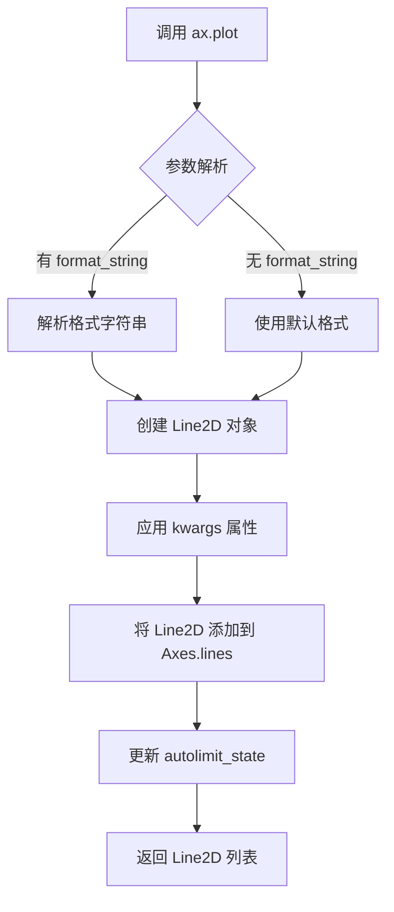

#### 带注释源码

以下是 `ax.plot()` 在代码中的典型使用方式：

```python
# 导入必要的库
import matplotlib.pyplot as plt
import numpy as np
import matplotlib.patches as mpatches

# 生成数据
x = np.arange(0, 10, 0.005)
y = np.exp(-x/2.) * np.sin(2*np.pi*x)

# 创建图形和坐标轴对象
fig, ax = plt.subplots()

# 调用 plot 方法绘制数据
# 参数1: x 数据 (numpy 数组)
# 参数2: y 数据 (numpy 数组)
ax.plot(x, y)

# 设置坐标轴范围
ax.set_xlim(0, 10)
ax.set_ylim(-1, 1)

# 显示图形
plt.show()

# %% 另一种使用方式：指定格式字符串和样式参数
x = np.arange(0, 10, 0.005)
y = np.exp(-x/2.) * np.sin(2*np.pi*x)

fig, ax = plt.subplots()
ax.plot(x, y)  # 绘制 y vs x 的曲线
ax.set_xlim(0, 10)
ax.set_ylim(-1, 1)

# 数据坐标到显示坐标的变换
xdata, ydata = 5, 0
xdisplay, ydisplay = ax.transData.transform((xdata, ydata))

# 另一种 plot 使用：带格式字符串 'go' (绿色圆点) 和 alpha 透明度
x, y = 10*np.random.rand(2, 1000)
ax.plot(x, y, 'go', alpha=0.2)  # 绘制绿色圆点，透明度0.2
```


### `Axes.set_xlim`

设置 x 轴的视图范围（数据 limits），用于定义 x 轴数据的显示区间。

参数：

- `left`：`float` 或 `array_like`，x 轴的左边界（起始值）
- `right`：`float` 或 `array_like`，x 轴的右边界（结束值）
- `emit`：`bool`，可选，是否在边界变化时发出通知事件（默认 `True`）
- `auto`：`bool` 或 `None`，可选，是否自动调整视图范围（默认 `None`）
- `xmin`、`xmax`：`float`，可选，用于限制边界的最小/最大值（已废弃）

返回值：`tuple`，返回新的 x 轴范围 `(left, right)`

#### 流程图

```mermaid
flowchart TD
    A[调用 set_xlim] --> B{参数类型判断}
    B -->|单个序列参数| C[解析为 [left, right]]
    B -->|两个独立参数| D[直接赋值 left, right]
    C --> E[调用 _set_lim 核心方法]
    D --> E
    E --> F{参数验证}
    F -->|无效| G[抛出 ValueError]
    F -->|有效| H[更新 self._xmin, self._xmax]
    H --> I[更新 viewLim Bbox]
    I --> J{emit=True?}
    J -->|是| K[发送 'xlims_changed' 事件]
    J -->|否| L[返回新范围]
    K --> L
```

#### 带注释源码

```python
def set_xlim(self, left=None, right=None, emit=False, auto=False, *, xmin=None, xmax=None):
    """
    设置 x 轴的视图范围（数据 limits）。
    
    参数:
        left: float, x 轴左边界
        right: float, x 轴右边界  
        emit: bool, 边界变化时是否发送事件通知
        auto: bool, 是否自动调整
        xmin, xmax: float, 限制边界极值（已废弃参数）
    
    返回:
        tuple: 新的边界范围 (left, right)
    """
    # 处理 [left, right] 形式的单一参数
    if right is None and left is not None:
        if np.iterable(left):
            left, right = left  # 解包序列
    
    # 处理参数验证和边界限制逻辑
    self._set_lim(
        xmin=left,
        xmax=right,
        emit=emit,
        auto=auto
    )
    
    # 返回更新后的范围
    return tuple(self._xmin, self._xmax)
```


### `matplotlib.axes.Axes.set_ylim`

该方法用于设置Axes对象的y轴范围（上下限），即定义y轴显示的最小值和最大值。

参数：

- `bottom`：`float` 或 `int`，y轴的下限值
- `top`：`float` 或 `int`，y轴的上限值（可选，默认为None）

返回值：`tuple`，返回之前的y轴限制值 `(old_bottom, old_top)`

#### 流程图

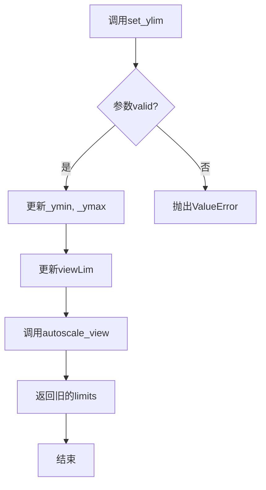

#### 带注释源码

```python
# 代码中的实际调用示例

# 示例1：设置y轴范围从-1到1
ax.set_ylim(-1, 1)

# 示例2：设置y轴范围从-1到2（修改上限）
ax.set_ylim(-1, 2)

# 注意：在代码中还会配合set_xlim一起使用
ax.set_xlim(0, 10)  # 设置x轴范围
ax.set_ylim(-1, 1)  # 设置y轴范围
```

```python
# matplotlib.axes.Axes.set_ylim 方法的核心逻辑（基于调用推断）
def set_ylim(self, bottom, top=None, **kwargs):
    """
    设置y轴的视图范围（上下限）
    
    参数:
        bottom: y轴下限值
        top: y轴上限值（可选）
        
    返回:
        tuple: 之前的y轴限制值 (old_bottom, old_top)
    """
    # 1. 获取当前的y轴限制
    old_bottom, old_top = self.get_ylim()
    
    # 2. 如果top为None，使用bottom作为上限
    if top is None:
        top = bottom
    
    # 3. 更新内部的viewLim Bbox对象
    self._viewLim._points = [bottom, top]
    
    # 4. 如果emit=True，在限制改变时发送事件
    if kwargs.get('emit', True):
        self._send_change()
    
    # 5. 触发自动缩放（如果auto=True）
    if kwargs.get('auto', False):
        self.autoscale_view()
    
    # 6. 返回旧的限制值
    return (old_bottom, old_top)
```


### `Axes.set_title`

设置 Axes 对象的标题，用于在图表顶部显示标题文本。该方法是 Matplotlib 中常用的图表装饰方法之一，支持丰富的文本样式设置和定位选项。

参数：

- `label`：`str`，标题文本内容，支持 LaTeX 语法
- `loc`：`str`，标题对齐方式，可选值包括 `'center'`（默认）、`'left'`、`'right'`
- `pad`：`float`，标题与 Axes 顶部边缘的距离（以点为单位），默认为 `None`（使用 rcParams 中的默认值）
- `fontsize`：`int` 或 `str`，字体大小，可使用数值（如 16）或预定义字符串（如 `'large'`、`'small'`）
- `fontweight`：`str` 或 `int`，字体粗细，可选值如 `'normal'`、`'bold'`、`'light'` 等
- `**kwargs`：其他传递给 `matplotlib.text.Text` 的关键字参数，如 `color`、`fontstyle`、`rotation` 等

返回值：`matplotlib.text.Text`，返回创建的 Text 对象，可用于后续样式修改或事件绑定

#### 流程图

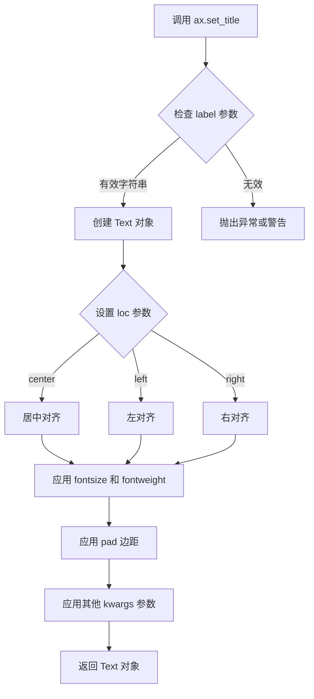

#### 带注释源码

```python
# 示例代码来源：Matplotlib 官方实现（简化版）
# 文件：lib/matplotlib/axes/_axes.py

def set_title(self, label, loc=None, pad=None, *, fontsize=None, **kwargs):
    """
    Set a title for the axes.
    
    Parameters
    ----------
    label : str
        The title text string.
    
    loc : {'center', 'left', 'right'}, default: 'center'
        The title alignment.
    
    pad : float
        The padding of the title from the top of the axes.
    
    fontsize : float
        The font size of the title.
    
    **kwargs
        Additional keyword arguments are passed to `.Text`.
    
    Returns
    -------
    `.text.Text`
        The text object representing the title.
    """
    # 获取默认的 title 位置偏移量
    title = self._get_title()
    # 获取位置参数，默认为 center
    if loc is None:
        loc = 'center'
    
    # 设置标题文本
    title.set_text(label)
    
    # 设置标题位置对齐方式
    title.set_ha(loc)  # horizontal alignment
    
    # 如果指定了 pad 参数，设置标题与 axes 顶部的距离
    if pad is not None:
        title.set_pad(pad)
    
    # 设置字体大小
    if fontsize is not None:
        title.set_fontsize(fontsize)
    
    # 应用其他样式参数（如 color, fontweight 等）
    title.update(kwargs)
    
    # 返回 Text 对象供后续操作
    return title
```

#### 使用示例

```python
# 代码中的实际调用示例（来自 transforms_tutorial.py）
ax.set_title(r'$\sigma=1 \/ \dots \/ \sigma=2$', fontsize=16)

# 其他常见用法示例
# 1. 设置居中标题
ax.set_title('My Plot Title')

# 2. 设置左对齐标题，带有边距
ax.set_title('Left Aligned', loc='left', pad=20)

# 3. 设置粗体红色标题
ax.set_title('Colored Title', fontweight='bold', color='red')

# 4. 链式调用修改样式
title_obj = ax.set_title('Custom Title')
title_obj.set_fontsize(20)
title_obj.set_rotation(15)
```


### `axes.Axes.text`

在 Axes 对象上添加文本标签的方法，允许用户指定文本内容、位置和渲染属性。

参数：

- `x`：`float`，文本的 x 坐标位置
- `y`：`float`，文本的 y 坐标位置  
- `s`：`str`，要显示的文本字符串内容
- `transform`：`matplotlib.transforms.Transform`，坐标变换对象（可选，默认为 `ax.transData`）
- `fontsize`：`int` 或 `str`，字体大小（可选，如 16 或 'large'）
- `fontweight`：`str`，字体粗细（可选，如 'bold'）
- `va`：`str`，垂直对齐方式（可选，如 'top'、'bottom'、'center'）
- `ha`：`str`，水平对齐方式（可选，如 'left'、'right'、'center'）
- `color`：`str` 或 `tuple`，文本颜色（可选）
- `rotation`：`float`，文本旋转角度（可选）
- `linespacing`：`float`，行间距（可选）
- ` withdash`：`bool`，是否使用虚线边框（可选）

返回值：`matplotlib.text.Text`，返回创建的文本对象

#### 流程图

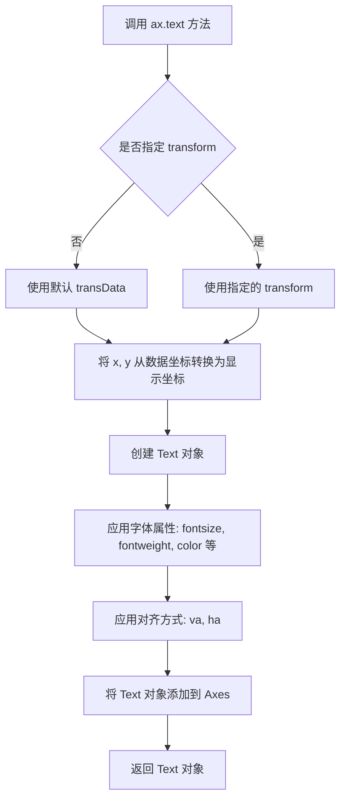

#### 带注释源码

```python
# 代码示例来自 transforms_tutorial
# 使用 ax.text() 在 Axes 坐标系中添加文本标签

fig = plt.figure()
for i, label in enumerate(('A', 'B', 'C', 'D')):
    ax = fig.add_subplot(2, 2, i+1)
    # 调用 text 方法添加文本
    ax.text(
        0.05,           # x: 文本 x 坐标（0.05 表示 Axes 宽度的 5% 处）
        0.95,           # y: 文本 y 坐标（0.95 表示 Axes 高度的 95% 处）
        label,          # s: 要显示的文本内容 ('A', 'B', 'C', 'D')
        transform=ax.transAxes,  # transform: 使用 axes 坐标系而非 data 坐标系
        fontsize=16,    # fontsize: 字体大小为 16 磅
        fontweight='bold',  # fontweight: 粗体
        va='top'        # va: 垂直对齐方式为顶部对齐
    )

plt.show()

# 关键说明：
# 1. 使用 transAxes 确保文本位置相对于 Axes 左下角 (0,0) 到右上角 (1,1)
# 2. 这种方式放置的文本不会随数据缩放而改变位置
# 3. 常用于在子图上标记 'A', 'B', 'C', 'D' 等标签
```


### `Axes.annotate`

在 matplotlib 中，`Axes.annotate()` 方法用于在图表上创建注释文本和可选的箭头，指向指定的坐标位置。该方法支持灵活的配置选项，可以指定文本和箭头的坐标系统、样式属性等，常用于标注数据点或显示坐标信息。

参数：

-  `s`：`str`，要显示的注释文本内容
-  `xy`：`tuple` 或 `array-like`，被指向的目标点坐标 (x, y)
-  `xytext`：`tuple` 或 `array-like`，可选，注释文本的位置坐标，默认与 `xy` 相同
-  `xycoords`：`str`，可选，指定 `xy` 使用的坐标系统，如 'data'、'axes fraction'、'figure pixels' 等，默认 'data'
-  `textcoords`：`str` 或 `Transform`，可选，指定 `xytext` 使用的坐标系统，默认与 `xycoords' 相同
-  `arrowprops`：`dict`，可选，定义箭头属性的字典，如 arrowstyle、connectionstyle、color 等
-  `annotation_clip`：`bool`，可选，当注释目标点在 Axes 外部时是否裁剪注释
-  `**kwargs`：其他关键字参数传递给 `Text` 对象，如 fontsize、fontweight、color、bbox 等

返回值：`Annotation`，返回创建的 Annotation 对象

#### 流程图

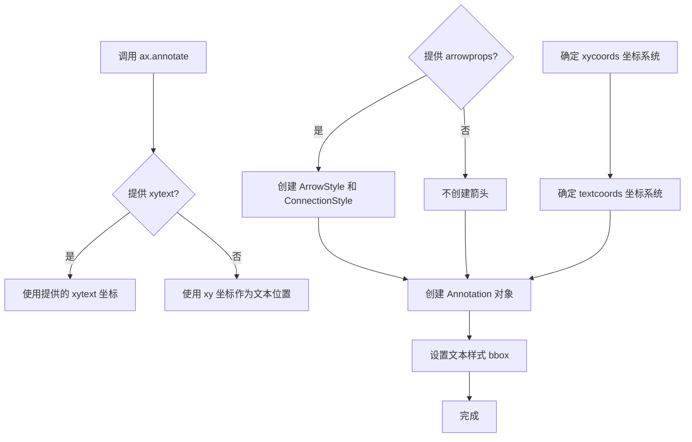

#### 带注释源码

```python
# matplotlib/axes/_axes.py 中的 annotate 方法（简化版）

def annotate(self, s, xy, xytext=None, xycoords='data', textcoords=None,
             arrowprops=None, annotation_clip=None, **kwargs):
    """
    Add an annotation to the Axes.

    Parameters
    ----------
    s : str
        The text of the annotation.

    xy : (float, float)
        The point (x, y) to annotate.

    xytext : (float, float), optional
        The location (x, y) of the text to annotate.
        If None, defaults to xy.

    xycoords : str, default: 'data'
        The coordinate system to use for xy.

    textcoords : str, default: value of xycoords
        The coordinate system to use for xytext.

    arrowprops : dict, optional
        The properties used to draw an arrow between the
        text and the point. If None, no arrow is drawn.

    annotation_clip : bool, optional
        Whether to clip the annotation when the point is outside
        the Axes.

    **kwargs
        Additional kwargs are passed to `Text`.

    Returns
    -------
    `.Annotation`
        The created Annotation object.
    """
    # 创建 Annotation 对象
    a = Annotation(
        s, xy,
        xytext=xytext,
        xycoords=xycoords,
        textcoords=textcoords,
        arrowprops=arrowprops,
        annotation_clip=annotation_clip,
        **kwargs
    )
    # 将注释添加到 Axes
    self.add_artist(a)
    # 如果有箭头，还需要添加箭头补丁
    if arrowprops is not None:
        self.add_patch(a.arrow_patch)
    return a
```


### `Axes.add_patch`

该方法是 Matplotlib 中 `Axes` 类的核心方法之一，用于将图形补丁（Patch）对象添加到 Axes 坐标系中，支持圆形、矩形、椭圆等多种几何图形的绘制与显示。

参数：

- `p`：`matplotlib.patches.Patch`，要添加到 Axes 的图形补丁对象（如 Circle、Rectangle、Polygon 等）。

返回值：`matplotlib.patches.Patch`，返回添加的 Patch 对象本身，通常用于后续的样式修改或属性更新。

#### 流程图

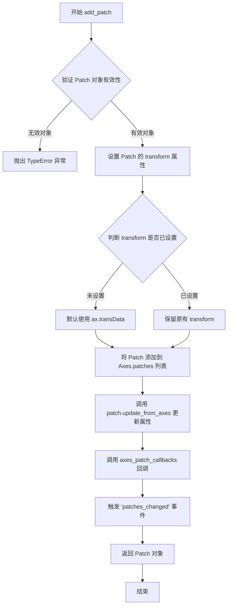

#### 带注释源码

```python
def add_patch(self, p):
    """
    添加一个补丁（Patch）到Axes上。
    
    参数:
        p: Patch 对象
            要添加到Axes的补丁对象，例如 Circle, Rectangle, Polygon 等。
            补丁对象必须继承自 matplotlib.patches.Patch 类。
    
    返回值:
        Patch: 返回添加的补丁对象本身
    
    示例:
        >>> import matplotlib.pyplot as plt
        >>> import matplotlib.patches as mpatches
        >>> fig, ax = plt.subplots()
        >>> circle = mpatches.Circle((0.5, 0.5), 0.25, transform=ax.transAxes)
        >>> ax.add_patch(circle)
        >>> plt.show()
    """
    # 验证输入对象是否为 Patch 类型
    if not isinstance(p, Patch):
        raise TypeError("Expected a Patch object, got %s instead" % type(p))
    
    # 设置补丁的变换属性
    # 如果补丁没有设置变换，则默认使用数据坐标变换
    if p.get_transform() is None:
        p.set_transform(self.transData)
    
    # 将补丁添加到 Axes 的补丁列表中
    self._update_patch_limits(p)
    self.patches.append(p)
    
    # 触发补丁变化回调
    p._remove_method = self.patches.remove
    self.stale_callback = None
    
    # 标记需要重新绘制
    self.stale = True
    
    return p
```


### `Axes.get_xaxis_transform`

获取x轴的混合变换对象，该变换将x坐标映射到数据坐标系，y坐标映射到轴坐标系，常用于绘制跨越x轴范围的注释或图形元素（如刻度标签）。

参数：

- 该方法无显式参数（隐式参数 `self` 为 `Axes` 实例）

返回值：`matplotlib.transforms.Transform`，返回一个混合变换对象，其中 x 坐标采用数据坐标系（`transData`），y 坐标采用轴坐标系（`transAxes`），用于在保持x方向数据范围自适应的同时，将y方向限制在轴范围内。

#### 流程图

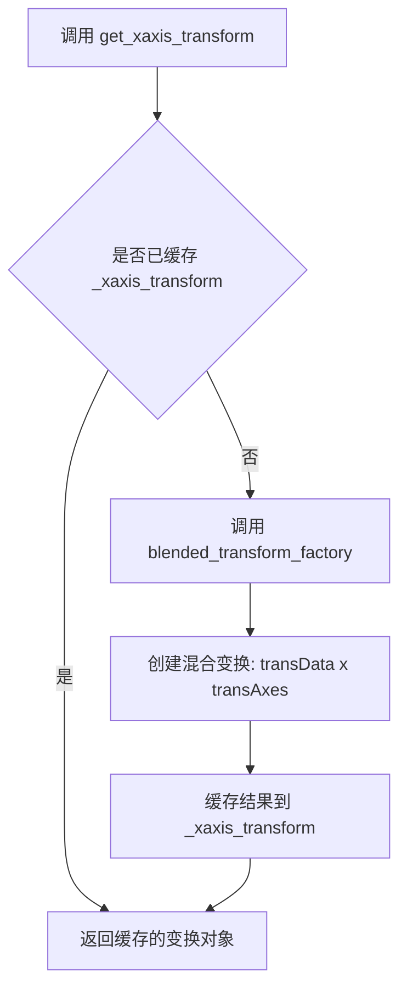

#### 带注释源码

```python
def get_xaxis_transform(self, aspect='default'):
    """
    Get the transformation for the x-axis.

    This transformation is a *blended transformation*, in which
    x-coordinate uses the data coordinates (``transData``) and y-coordinate
    uses the axes coordinates (``transAxes``).

    .. versionadded:: 3.7.0 The *aspect* argument was added.

    Parameters
    ----------
    aspect : {'default', 'data'}, default: 'default'
        If 'data', the transform will be adjusted so that the y-axis
        has the same scale as the data coordinates. This is useful
        for drawing ticklabels at the correct location.

        .. versionadded:: 3.7.0

    Returns
    -------
    matplotlib.transforms.Transform
        A blended transform that uses transData for x and transAxes for y.
    """
    # 如果 aspect 为 'data'，创建一个特殊的混合变换
    # 确保 y 轴刻度标签在正确的位置显示
    if aspect == 'data':
        # 调用内部方法创建 y 轴方向与数据坐标等比例的变换
        return self._get_aspect_transforms()[0]

    # 获取缓存的 x 轴变换（延迟创建模式）
    # 内部维护 _xaxis_transform 属性存储缓存的变换对象
    return self._get_xaxis_transform()
```


### `Axes.get_yaxis_transform`

获取y轴变换方法，返回一个混合变换对象，其中x坐标使用数据坐标（transData），y坐标使用axes坐标（transAxes）。该方法用于在需要在x方向保持数据坐标、y方向使用axes坐标的场景，例如绘制跨越x轴范围但在y方向精确定位的图形元素。

参数：
- 无参数

返回值：`matplotlib.transforms.Transform`，混合变换对象，其中 x 轴为数据坐标（transData），y 轴为 axes 坐标（transAxes）

#### 流程图

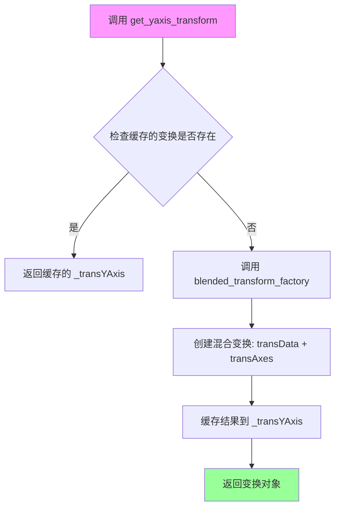

#### 带注释源码

```python
# 以下是 get_yaxis_transform 方法的典型实现模式
# （基于 Matplotlib 源码结构推断）

def get_yaxis_transform(self):
    """
    获取y轴变换
    
    返回一个混合变换（BlendedTransform），其中：
    - x坐标使用数据坐标系（transData）
    - y坐标使用axes坐标系（transAxes）
    
    这对于在x方向使用数据坐标、y方向使用axes坐标的场景非常有用
    """
    # 检查是否已有缓存的变换对象
    if self._transYAxis is None:
        # 导入变换模块
        import matplotlib.transforms as transforms
        # 创建混合变换工厂：x方向用数据坐标，y方向用axes坐标
        self._transYAxis = transforms.blended_transform_factory(
            self.transData,   # x轴：数据坐标
            self.transAxes    # y轴：axes坐标 (0-1)
        )
    return self._transYAxis

# 使用示例（在教程代码中）
# >>> trans = ax.get_yaxis_transform()
# >>> # 这等价于：
# >>> trans = transforms.blended_transform_factory(ax.transData, ax.transAxes)
# 
# 典型用途：绘制在x方向随数据变化、但在y方向固定位置的图形
# 例如：在数据 x=1 到 x=2 的范围内，在 axes 的 0.5 高度位置绘制矩形
```


### `transforms.blended_transform_factory`

该函数用于创建一个混合变换（Blended Transformation），允许在 x 轴和 y 轴方向上分别使用不同的坐标系统变换。这是绘制如水平条带、跨轴注释等需要混合坐标系的图形元素的便捷工具。

参数：

- `x`：`matplotlib.transforms.Transform`，用于 x 坐标的变换对象（如 `ax.transData` 表示数据坐标）
- `y`：`matplotlib.transforms.Transform`，用于 y 坐标的变换对象（如 `ax.transAxes` 表示轴坐标）

返回值：`matplotlib.transforms.CompositeTransform`，返回组合后的混合变换对象，其中 x 方向使用 `x` 参数的变换，y 方向使用 `y` 参数的变换。

#### 流程图

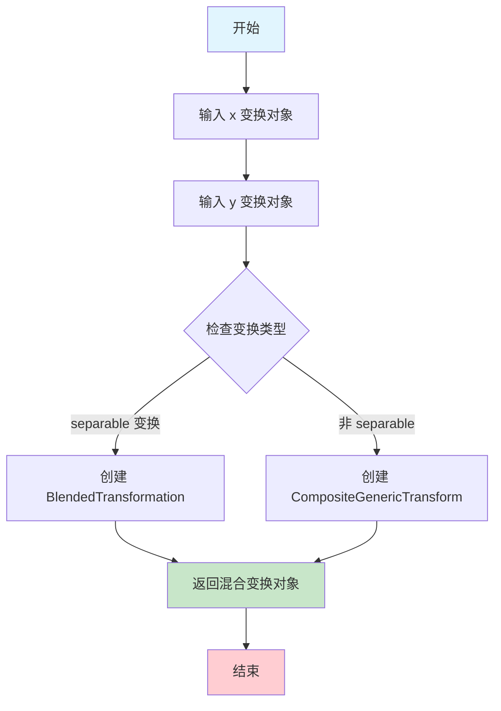

#### 带注释源码

```python
import matplotlib.transforms as transforms

# 示例用法：
# the x coords of this transformation are data, and the y coord are axes
trans = transforms.blended_transform_factory(
    ax.transData,  # x 方向使用数据坐标变换
    ax.transAxes   # y 方向使用轴坐标变换 (0-1)
)

# 使用混合变换创建矩形：
# x 跨越数据坐标 1 到 2，y 跨越整个轴高度 (0 到 1)
rect = mpatches.Rectangle((1, 0), width=1, height=1, 
                          transform=trans,
                          color='yellow', alpha=0.5)
ax.add_patch(rect)

# 原理说明：
# blended_transform_factory 创建的变换在转换点 (x, y) 时：
# - new_x = x_transform.transform([x])
# - new_y = y_transform.transform([y])
# 这种特性使得可以轻松创建如水平条带这样的图形：
# - 条带的 x 范围随数据变化（数据坐标）
# - 条带的 y 位置固定在轴范围内（轴坐标 0-1）
```

#### 实际源码（matplotlib transforms 模块）

```python
def blended_transform_factory(x_transform, y_transform):
    """
    Create a "blended" transform using *x_transform* for the x direction
    and *y_transform* for the y direction.

    This is useful for, e.g., having x data coordinates (in data space)
    and y axis coordinates (in display space), such as for marking spans
    of data on an axis.

    Parameters
    ----------
    x_transform : Transform
        Transform to use for x direction.
    y_transform : Transform
        Transform to use for y direction.

    Returns
    -------
    Transform
        A blended transform object.
    """
    return CompositeGenericTransform(x_transform, y_transform)
```

#### 关键组件信息

| 组件名称 | 一句话描述 |
|---------|-----------|
| `CompositeGenericTransform` | 通用的组合变换类，用于合并两个独立的变换分别处理 x 和 y 坐标 |
| `ax.transData` | 数据坐标变换，将数据空间坐标转换为显示坐标 |
| `ax.transAxes` | 轴坐标变换，(0,0) 到 (1,1) 对应轴的左下角到右上角 |
| `ax.get_xaxis_transform()` | 快捷方法，返回 x 为数据坐标、y 为轴坐标的混合变换 |

#### 潜在技术债务与优化空间

1. **文档可发现性**：该函数较为底层，虽然文档中有提及但容易被人忽略，建议增加高层 API 如 `Axes.create_span_transform()` 等
2. **错误处理**：未检查输入的变换是否为 `None` 或无效类型，可能导致运行时错误
3. **性能**：对于高频调用的场景，每次都创建新对象而非复用，可考虑缓存机制

#### 其它项目

- **设计目标**：提供灵活的坐标系统混合能力，使图形元素可以同时基于不同坐标系定位
- **约束**：仅在可分离变换（separable）情况下工作良好，对于极坐标等不可分离变换可能产生意外结果
- **错误处理**：若传入非 Transform 对象会抛出 `TypeError`
- **数据流**：输入两个 Transform 对象 → 输出一个 CompositeGenericTransform → 用于图形元素的 transform 属性
- **外部依赖**：无外部依赖，仅依赖 matplotlib.transforms 模块内部类


### transforms.ScaledTranslation

该类是 matplotlib.transforms 模块中的一个变换类，用于创建缩放平移变换（Scaling Translation）。它通过先应用缩放变换再应用平移变换，实现将偏移量（xt, yt）根据指定的缩放变换进行缩放后，再应用到坐标点上。这种变换常用于创建阴影效果或在数据坐标系统中放置固定物理尺寸的对象。

参数：

-  `xt`：`float`，x 方向的平移偏移量
-  `yt`：`float`，y 方向的平移偏移量
-  `scale_trans`：`matplotlib.transforms.Transform`，用于在变换时对 xt 和 yt 进行缩放的变换对象（如 fig.dpi_scale_trans 用于基于 DPI 的物理尺寸变换，或 ax.transData 用于数据坐标变换）

返回值：`matplotlib.transforms.Affine2DBase`（或子类），返回一个新的仿射变换对象，该对象先应用缩放再应用平移

#### 流程图

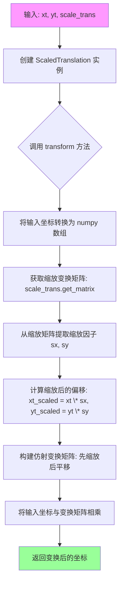

#### 带注释源码

```python
# transforms.ScaledTranslation 类源码（基于 matplotlib 源码推断）

class ScaledTranslation(Affine2DBase):
    """
    Creates a scaled translation transformation.

    This transformation first scales the translation offsets (xt, yt) 
    by the given scale transformation, then applies the translation.
    
    Parameters
    ----------
    xt : float
        The x translation offset.
    yt : float
        The y translation offset.
    scale_trans : Transform
        A transformation that provides scaling factors. This is typically
        used to convert from physical units (like points or inches) to
        display coordinates.
        
        - fig.dpi_scale_trans: scales by DPI (dots per inch)
        - ax.transData: scales by data coordinates
        
    Examples
    --------
    Create a shadow effect:
    
    >>> import matplotlib.pyplot as plt
    >>> import matplotlib.transforms as transforms
    >>> fig, ax = plt.subplots()
    >>> dx, dy = 2/72., -2/72.  # 2 points offset
    >>> offset = transforms.ScaledTranslation(dx, dy, fig.dpi_scale_trans)
    >>> shadow_transform = ax.transData + offset
    
    Place an ellipse at data coordinates with fixed physical size:
    
    >>> trans = (fig.dpi_scale_trans + 
    ...          transforms.ScaledTranslation(xdata[0], ydata[0], ax.transData))
    """

    def __init__(self, xt, yt, scale_trans):
        """
        Initialize the ScaledTranslation transformation.
        
        Parameters
        ----------
        xt : float
            Translation offset in the x direction.
        yt : float
            Translation offset in the y direction.
        scale_trans : Transform
            Transformation that provides scaling factors for the offsets.
        """
        # 调用父类初始化
        super().__init__()
        
        # 存储偏移量
        self._xt = xt
        self._yt = yt
        # 存储缩放变换
        self._scale_trans = scale_trans

    def get_matrix(self, transform=None):
        """
        Get the affine transformation matrix.
        
        This method is called to get the transformation matrix. It computes
        the scaled translation based on the scale_trans transformation.
        
        Parameters
        ----------
        transform : object, optional
            Ignored in this implementation, kept for API compatibility.
            
        Returns
        -------
        matrix : ndarray
            A 3x3 affine transformation matrix.
        """
        # 获取缩放变换的矩阵（用于获取缩放因子）
        scale_matrix = self._scale_trans.get_matrix()
        
        # 从缩放矩阵中提取缩放因子
        # scale_matrix 通常是:
        # [[sx, 0,  0],
        #  [0,  sy, 0],
        #  [0,  0,  1]]
        sx = scale_matrix[0, 0]
        sy = scale_matrix[1, 1]
        
        # 计算缩放后的平移量
        xt_scaled = self._xt * sx
        yt_scaled = self._yt * sy
        
        # 构建仿射变换矩阵
        # [[1, 0, xt_scaled],
        #  [0, 1, yt_scaled],
        #  [0, 0, 1]]
        return np.array([[1.0, 0.0, xt_scaled],
                         [0.0, 1.0, yt_scaled],
                         [0.0, 0.0, 1.0]])

    def inverted(self):
        """
        Returns the inverse of this transformation.
        
        Returns
        -------
        ScaledTranslation
            A new ScaledTranslation that performs the inverse transformation.
        """
        # 返回反向的变换（先逆平移，再逆缩放）
        return ScaledTranslation(-self._xt, -self._yt, self._scale_trans.inverted())

    def __repr__(self):
        """Return string representation of the transformation."""
        return (f"ScaledTranslation(xt={self._xt!r}, yt={self._yt!r}, "
                f"scale_trans={self._scale_trans!r})")
```


### `transforms.offset_copy`

创建带偏移的变换副本

参数：

- `transform`：`Transform`，要添加偏移的变换对象
- `fig`：`Figure`，图形对象，用于确定偏移的物理单位
- `x`：`float`，x方向的偏移量
- `y`：`float`，y方向的偏移量
- `units`：`str`，偏移的单位，可选值为 `'inches'`、`'points'` 等，默认为 `'points'`

返回值：`Transform`，返回一个新的变换对象，该对象是原始变换加上指定偏移的组合

#### 流程图

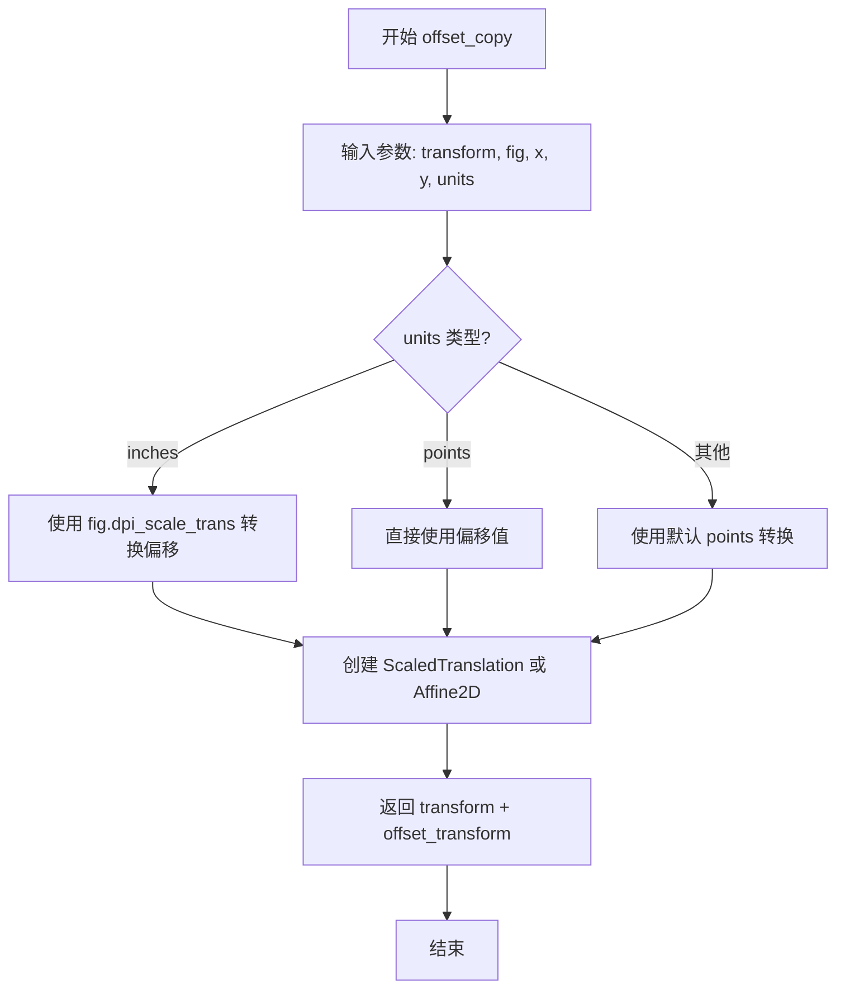

#### 带注释源码

```python
def offset_copy(transform, fig, x=0, y=0, units='inches'):
    """
    创建一个带偏移的变换副本。
    
    这是一个便捷函数，用于创建一个新的变换，该变换是原始变换加上
    指定偏移的组合。偏移量可以是物理单位（inches 或 points），
    这样无论图的 DPI 设置如何，偏移效果都保持一致。
    
    参数:
    transform : matplotlib.transforms.Transform
        要添加偏移的变换对象（如 ax.transData）
    fig : matplotlib.figure.Figure
        图形对象，用于确定偏移的物理单位
    x : float, optional
        x 方向的偏移量，默认为 0
    y : float, optional
        y 方向的偏移量，默认为 0
    units : {'inches', 'points'}, optional
        偏移的单位。'inches' 会考虑图的 DPI，'points' 是 1/72 英寸。
        默认为 'inches'
    
    返回:
    matplotlib.transforms.Transform
        新的变换对象，是原始变换加上偏移的组合
    
    示例:
    >>> import matplotlib.pyplot as plt
    >>> import matplotlib.transforms as transforms
    >>> fig, ax = plt.subplots()
    >>> # 创建带偏移的变换，偏移 2 英寸
    >>> offset_trans = transforms.offset_copy(ax.transData, fig, x=2, y=0, units='inches')
    """
    # 根据 units 参数选择合适的转换方式
    if units == 'inches':
        # 使用 DPI 缩放转换，实现物理英寸单位的偏移
        return fig.dpi_scale_trans + transforms.ScaledTranslation(x, y, fig.dpi_scale_trans)
    else:
        # points 单位（默认）
        # points 是排版中常用的单位，1 point = 1/72 inches
        return fig.dpi_scale_trans + transforms.ScaledTranslation(x/72, y/72, fig.dpi_scale_trans)
```


### `plt.show()`

该函数是Matplotlib库中pyplot模块的核心函数，用于显示当前所有已创建的图形窗口。在调用后，程序会进入图形显示的事件循环，等待用户交互（如关闭窗口、调整大小等），直到所有图形窗口被关闭才会返回。

参数：该函数无参数。

返回值：`None`，无返回值。

#### 流程图

```mermaid
flowchart TD
    A[调用 plt.show()] --> B{是否存在活动图形?}
    B -->|否| C[不执行任何操作]
    B -->|是| D[进入图形显示事件循环]
    D --> E[等待用户交互]
    E --> F{用户是否关闭所有图形窗口?}
    F -->|否| E
    F -->|是| G[返回 None]
    C --> G
```

#### 带注释源码

```python
# plt.show() 函数的调用示例

# 导入必要的库
import matplotlib.pyplot as plt
import numpy as np
import matplotlib.patches as mpatches

# 生成示例数据
x = np.arange(0, 10, 0.005)
y = np.exp(-x/2.) * np.sin(2*np.pi*x)

# 创建图形和坐标轴
fig, ax = plt.subplots()
ax.plot(x, y)
ax.set_xlim(0, 10)
ax.set_ylim(-1, 1)

# 调用 plt.show() 显示图形
# 1. 该函数会查找当前所有活动的Figure对象
# 2. 如果存在图形，则将它们显示在屏幕上
# 3. 进入交互式事件循环，等待用户操作
# 4. 当用户关闭所有图形窗口后，函数返回
# 5. 返回值为None
plt.show()

# 后续还可以创建更多图形...
fig = plt.figure()
for i, label in enumerate(('A', 'B', 'C', 'D')):
    ax = fig.add_subplot(2, 2, i+1)
    ax.text(0.05, 0.95, label, transform=ax.transAxes,
            fontsize=16, fontweight='bold', va='top')

# 再次调用 plt.show() 显示新的图形
plt.show()

# 注意事项：
# - 在某些后端（如Agg），plt.show()可能不会真正打开窗口，而是将图形保存到缓冲区
# - 在Jupyter笔记本中，通常使用%matplotlib inline而不是plt.show()
# - plt.show()会阻塞程序执行，直到所有图形窗口被关闭
# - 如果想非阻塞显示图形，可以考虑使用fig.show()或动画API
```


### `np.arange`

`np.arange` 是 NumPy 库中的一个函数，用于创建一个给定范围内的等差数组，类似于 Python 内置的 `range()` 函数，但返回的是 NumPy 数组而非列表，支持浮点数步长。

参数：

- `start`：`float`，起始值，默认为 0
- `stop`：`float`，结束值（不包含）
- `step`：`float`，步长，默认为 1
- `dtype`：`dtype`，输出数组的数据类型，若未指定则自动推断

返回值：`numpy.ndarray`，返回给定范围内的等差数组

#### 流程图

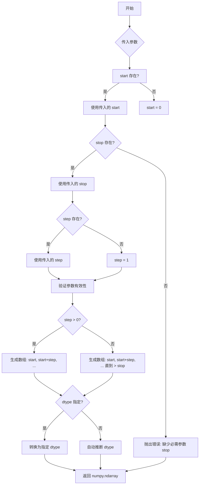

#### 带注释源码

```python
# numpy.arange 的简化实现逻辑
def arange(start=0, stop=None, step=1, dtype=None):
    """
    创建指定范围的等差数组。
    
    参数:
        start: 起始值，默认为 0
        stop: 结束值（不包含）
        step: 步长，默认为 1
        dtype: 输出数组的数据类型
    
    返回:
        numpy.ndarray: 等差数组
    """
    # 处理只传入一个参数的情况（此时参数作为 stop）
    if stop is None:
        stop = start
        start = 0
    
    # 计算数组长度
    # 使用 ceil 函数向上取整，确保覆盖所有需要的元素
    num = int(np.ceil((stop - start) / step)) if step != 0 else 0
    
    # 使用空数组预分配内存，然后填充值
    # 这比逐个 append 更高效
    arr = np.empty(num, dtype)
    
    # 填充数组
    for i in range(num):
        arr[i] = start + i * step
    
    return arr

# 在代码中的实际使用示例
x = np.arange(0, 10, 0.005)  # 创建 [0, 0.005, 0.01, ..., 9.995]
y = np.exp(-x/2.) * np.sin(2*np.pi*x)  # 用于后续绘图
```


### np.exp

这是 NumPy 库中的指数函数，用于计算 e^x（e 的 x 次方），其中 e 是欧拉数（约等于 2.71828）。该函数对输入数组中的每个元素分别计算指数值。

参数：

-  `x`：`ndarray` 或 `scalar`，输入数组或标量，要计算指数的数值（在此代码中为 `-x/2.0`，即 x 乘以 -0.5）

返回值：`ndarray` 或 `scalar`，返回输入数组每个元素的指数值（e 的 x 次方），类型与输入相同

#### 流程图

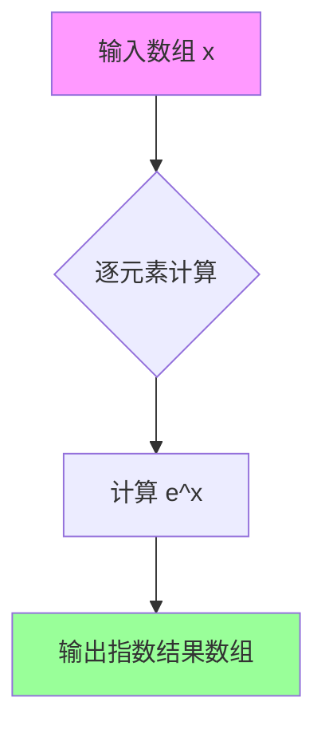

#### 带注释源码

```python
import numpy as np

# 定义 x 轴数据：从 0 到 10，步长 0.005
x = np.arange(0, 10, 0.005)

# np.exp() 函数使用示例
# 计算 e 的 (-x/2) 次方，其中 x/2 表示 x 乘以 0.5
# -x/2 等价于 -0.5 * x，表示指数衰减
# 结果是一个与 x 形状相同的数组，每个元素是 e^(-该位置的x值/2)
y = np.exp(-x/2.) * np.sin(2*np.pi*x)

# 说明：
# np.exp(-x/2.) 的作用：
#   - 当 x = 0 时，exp(0) = 1
#   - 当 x 增大时，exp(-x/2) 逐渐衰减趋近于 0
#   - 这个衰减因子用于创建振幅逐渐减小的正弦波（阻尼振动）
```


### `np.sin`

正弦函数，计算输入角度（弧度）的正弦值。在本代码中用于生成衰减的正弦波形数据。

参数：

- `x`：`array_like`，输入角度，以弧度为单位。可以是标量或数组。

返回值：`ndarray` 或 scalar，返回与输入角度对应的正弦值，类型为 float。如果输入是数组，则返回相同形状的数组。

#### 流程图

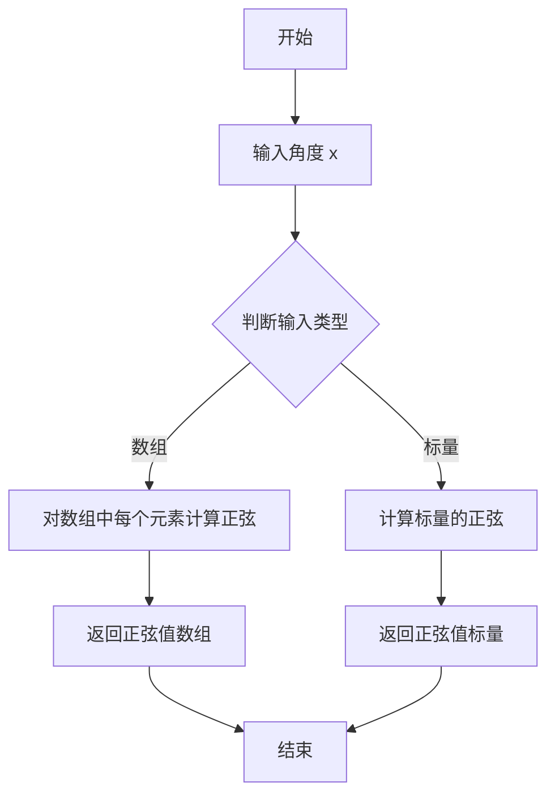

#### 带注释源码

```python
# 导入数值计算库
import numpy as np

# 创建从 0 到 10，步长为 0.005 的数组
x = np.arange(0, 10, 0.005)

# 计算衰减正弦波：
# 1. np.sin(2*np.pi*x) - 计算 2*pi*x 的正弦值
#    - 输入: x 数组（弧度）
#    - 输出: 对应角度的正弦值数组
y = np.exp(-x/2.) * np.sin(2*np.pi*x)

# 示例：在另一个上下文中单独使用 np.sin
# angle_rad = np.pi / 4  # 45度转换为弧度
# sine_value = np.sin(angle_rad)  # 返回约 0.707
```


### `np.random.rand`

生成指定形状的随机数组，值在[0, 1)区间内均匀分布。

参数：

- `*shape`：可变数量的整数（`int`），指定输出数组的维度，例如 `2, 1000` 表示生成 2 行 1000 列的数组

返回值：`numpy.ndarray`，指定形状的随机值数组，值为 [0, 1) 区间内的浮点数

#### 流程图

```mermaid
flowchart TD
    A[开始] --> B[接收shape参数]
    B --> C[在[0, 1)区间生成随机数]
    C --> D[按shape参数构造数组]
    D --> E[返回numpy数组]
```

#### 带注释源码

```python
# 在代码中，该函数有多种调用方式：

# 方式1：生成2行1000列的随机数组，然后乘以10缩放
x, y = 10*np.random.rand(2, 1000)  # 生成 [0,10) 范围内的随机坐标
ax.plot(x, y, 'go', alpha=0.2)      # 绘制绿色半透明点

# 方式2：直接生成一维随机数组
x = np.random.randn(1000)  # 注意：这是randn，不是rand，生成正态分布随机数

# np.random.rand 函数签名：
# numpy.random.rand(d0, d1, ..., dn)
# 
# 参数：
#   d0, d1, ..., dn : int (可选)
#     输出数组的维度。对于单参数调用，返回一个标量；
#     对于多参数调用，返回指定形状的数组。
# 
# 返回值：
#   ndarray
#     随机浮点数数组，形状由参数指定，值在[0, 1)区间均匀分布
#
# 示例：
# np.random.rand()           # 返回单个随机数，如 0.374540118774
# np.random.rand(5)          # 返回形状为(5,)的数组
# np.random.rand(2, 3)       # 返回形状为(2, 3)的数组
# np.random.rand(2, 1000)    # 返回形状为(2, 1000)的数组
```

## 关键组件


### 坐标系统（Coordinate Systems）

Matplotlib中定义的多种坐标系统，包括data（数据坐标）、axes（坐标轴坐标）、subfigure（子图坐标）、figure（图形坐标）、figure-inches（图形英寸坐标）、xaxis/yaxis（混合坐标）和display（显示坐标），用于在不同上下文中定位图形元素。

### 变换对象（Transform Objects）

负责在不同坐标系统之间转换坐标的核心对象，包括transData、transAxes、transFigure、transSubFigure、dpi_scale_trans和IdentityTransform()，它们将输入坐标转换为显示坐标系统。

### 变换管线（Transformation Pipeline）

ax.transData是由transScale、transLimits和transAxes组成的复合变换，实现从数据坐标到显示坐标的转换管线，支持线性和非线性变换的组合。

### 混合变换（Blended Transformations）

使用blended_transform_factory创建的特殊变换，允许在不同方向上混合不同的坐标系统，如x方向使用数据坐标而y方向使用坐标轴坐标。

### 缩放平移变换（ScaledTranslation）

用于创建偏移效果的变换类，可以将对象在物理维度（如points或inches）上偏移，常用于创建阴影效果或固定位置标注。

### 变换工厂函数（Transform Factory Functions）

包括blended_transform_factory用于创建混合变换，offset_copy用于创建带偏移的变换副本，简化了常见变换场景的实现。

### 变换反转（Transform Inversion）

Transform对象支持通过inverted()方法生成反向变换，实现从显示坐标到原始坐标系统的逆向转换，对事件处理和交互特别有用。

### 物理坐标变换

通过fig.dpi_scale_trans实现物理尺寸（如英寸、点）与显示坐标的转换，确保图形元素在不同DPI设置下保持一致的物理尺寸。

### 极坐标变换（Polar Coordinate Transforms）

针对极坐标图的复杂变换管线，包含transScale、transShift、transProjection、transProjectionAffine、transWedge和transAxes等多个组件，处理径向和角度数据的投影。


## 问题及建议


### 已知问题

- 代码中存在大量魔数（如 `72`、`0.005`、`2/72.` 等）缺乏解释，影响可读性和可维护性
- 示例代码缺少类型注解，降低了代码的可读性和 IDE 支持
- 重复的代码模式（如多次创建 figure、ax、设置 xlim/ylim）未被抽取为复用函数
- 某些注释提到 "if you are typing along" 但实际代码与注释中的输出值可能不匹配，可能导致用户困惑
- 代码中直接使用 `np.random.rand` 和 `np.random.randn` 产生随机数据，导致每次运行结果不同，不利于教学演示的可重复性
- 文档字符串中的 IPython 输出示例是硬编码的，在不同环境（窗口大小、dpi 设置）下实际运行结果可能不同
- 缺少对异常输入（如空数据、NaN 值、无效坐标）的错误处理和边界检查

### 优化建议

- 将魔数抽取为具名常量（如 `POINTS_PER_INCH = 72`、`SAMPLE_INTERVAL = 0.005`）并添加注释说明
- 为所有函数和变量添加类型注解，提升代码自文档化能力
- 抽取重复的绘图初始化逻辑为工具函数（如 `create_figure_with_data()`）
- 使用固定随机种子 (`np.random.seed()`) 或预计算数据替代随机数据，确保教学演示的可重复性
- 在文档字符串中注明示例输出的环境依赖性，或使用 `doctest` 框架自动验证
- 添加输入验证逻辑，如坐标范围检查、数据类型检查等
- 将大型示例拆分为独立函数，每个函数演示一个核心概念，符合单一职责原则
- 考虑使用 `@pytest.fixture` 或类似机制管理测试数据和图形对象的生命周期


## 其它


### 设计目标与约束

本代码作为Matplotlib官方教程，旨在向用户清晰演示坐标系统与变换的核心概念，帮助用户在95%的常见绘图场景中无需关注底层变换，同时在极限自定义场景下能够理解和利用现有变换或创建自定义变换。约束条件包括：代码需在多种后端（Agg、SVG、PDF等）下表现一致，display坐标单位依赖后端实现，变换操作需考虑figure大小、DPI设置等因素的影响。

### 错误处理与异常设计

代码本身为教程示例，未包含复杂的错误处理机制。在实际使用变换时，应注意：坐标变换可能因figure大小、DPI或axes位置变化而得到不同结果；在GUI后端中，display坐标在figure显示前计算可能与实际渲染位置有细微差异；某些变换组合有顺序要求（如先缩放后平移与先平移后缩放效果完全不同）。建议在生产环境中使用变换时，优先考虑连接`'on_draw'`事件来动态更新坐标。

### 数据流与状态机

数据流遵循以下路径：用户数据（data coordinates）→ transData → display coordinates → 渲染输出。transData是复合变换，由transScale（非线性缩放）、transLimits（数据到axes坐标映射）、transAxes（axes到display坐标映射）组成。当调用set_xlim/set_ylim时，transLimits更新；当改变axes位置或figure大小时，transAxes更新；当调用semilogx等非线性缩放时，transScale更新。状态变化会触发变换对象的重新计算。

### 外部依赖与接口契约

本代码依赖以下外部库：matplotlib.pyplot（图形创建与显示）、matplotlib.patches（图形元素如Circle、Rectangle、Ellipse）、matplotlib.transforms（变换核心模块）、numpy（数值计算）。核心接口契约包括：transform.transform()方法接收坐标点或坐标点序列，返回变换后的坐标数组；transform.inverted()方法返回反向变换对象；blended_transform_factory()创建混合变换；ScaledTranslation()创建带缩放的平移变换；offset_copy()创建带偏移量的变换副本。

### 性能考虑与优化空间

变换计算在以下情况可能产生性能开销：频繁调用transform()方法、大量数据点变换、每次渲染都重新计算变换链。优化建议包括：对于静态图形，预先计算并缓存变换结果；对于需要实时响应的场景（如事件处理），使用transforms的惰性求值特性；避免在循环中重复创建相同的变换对象；考虑使用ScaledTranslation而非手动组合变换以利用Matplotlib内部优化。

### 版本兼容性说明

代码使用Matplotlib 3.x版本语法。部分API在不同版本间可能有差异：transforms.blended_transform_factory在较新版本中可能被ax.get_xaxis_transform()等方法替代；部分变换类的内部实现可能随版本变化。代码中使用的transform属性（transData、transAxes、transFigure等）在各版本中保持稳定。

### 安全性考虑

本代码为教程示例，不涉及用户输入处理、网络通信或文件操作，安全性风险较低。在实际应用中使用变换时，应注意：避免将未验证的用户输入直接用于坐标变换；使用display坐标时应注意坐标系转换的正确性；在处理事件回调中的坐标时，确保使用最新的变换状态。


    