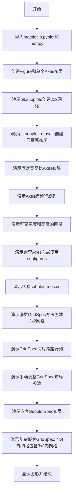
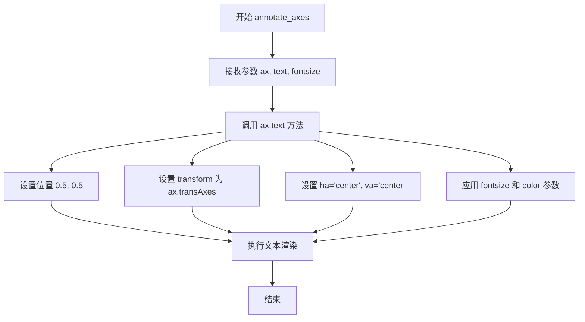

# `matplotlib\galleries\users_explain\axes\arranging_axes.py` 详细设计文档

这是一个Matplotlib教程文档，演示如何在Figure中排列多个Axes，包括使用subplots、subplot_mosaic、GridSpec、SubplotSpec等方法创建网格布局、固定宽高比轴、嵌套布局以及手动调整gridspec参数。

## 整体流程



## 类结构

```
Python脚本 (非面向对象)
├── 全局函数
│   ├── annotate_axes (注释Axes的工具函数)
│   └── squiggle_xy (生成曲线数据的工具函数)
└── Matplotlib库组件使用
    ├── plt.figure (Figure对象)
    ├── plt.subplots (创建网格Axes)
    ├── plt.subplot_mosaic (创建马赛克布局)
    ├── Figure.add_axes (添加单个Axes)
    ├── Figure.add_subplot (添加子图)
    ├── Figure.add_gridspec (添加GridSpec)
    ├── Figure.subfigures (创建子图)
    ├── GridSpec (网格规格)
    └── SubplotSpec (子图规格)
```

## 全局变量及字段


### `w`
    
图形宽度，设置值为4英寸

类型：`int`
    


### `h`
    
图形高度，设置值为3英寸

类型：`int`
    


### `margin`
    
图形边距值，用于计算子图的放置位置

类型：`float`
    


### `gs_kw`
    
gridspec参数字典，包含width_ratios和height_ratios用于控制网格行列比例

类型：`dict`
    


### `inner`
    
内部布局列表，用于嵌套的subplot_mosaic布局定义

类型：`list`
    


### `outer`
    
外部布局列表，用于嵌套的subplot_mosaic布局定义，包含inner作为嵌套元素

类型：`list`
    


### `i`
    
角度数组，从0.0到2*pi的序列，步长0.05，用于生成波形数据

类型：`numpy.ndarray`
    


    

## 全局函数及方法


### `annotate_axes`

该函数用于在 Axes 中心添加文本注释，通过调用 Axes 对象的 text 方法在坐标 (0.5, 0.5) 处使用 transAxes 变换插入居中的文本。

参数：

- `ax`：`matplotlib.axes.Axes`，要在其中添加注释的 Axes 对象
- `text`：`str`，要显示的注释文本内容
- `fontsize`：`int`，文本字体大小，默认为 18

返回值：`None`，该函数不返回任何值

#### 流程图



#### 带注释源码

```python
def annotate_axes(ax, text, fontsize=18):
    """
    在 Axes 中心添加文本注释的函数
    
    参数:
        ax: matplotlib.axes.Axes 对象，要在其中添加注释的 Axes
        text: str，要显示的注释文本内容
        fontsize: int，文本字体大小，默认为 18
    
    返回:
        None
    """
    # 使用 Axes 对象的 text 方法添加文本
    # 位置 (0.5, 0.5) 表示 Axes 的中心点
    # transform=ax.transAxes 确保坐标相对于 Axes 而非数据坐标
    # ha="center" 和 va="center" 确保文本在指定位置居中
    ax.text(0.5, 0.5, text, transform=ax.transAxes,
            ha="center", va="center", fontsize=fontsize, color="darkgrey")
```


### `squiggle_xy`

生成正弦余弦曲线数据的函数，通过将正弦和余弦函数与输入系数进行数学运算，生成用于绘图的 x 和 y 坐标数据点。该函数常用于示例代码中展示复杂网格布局的绘图效果。

参数：

- `a`：`float` 或 `int`，用于控制第一个正弦函数的频率系数，与参数 `i` 相乘后作为 `np.sin` 的输入
- `b`：`float` 或 `int`，用于控制第一个余弦函数的频率系数，与参数 `i` 相乘后作为 `np.cos` 的输入
- `c`：`float` 或 `int`，用于控制第二个正弦函数的频率系数，与参数 `i` 相乘后作为 `np.sin` 的输入
- `d`：`float` 或 `int`，用于控制第二个余弦函数的频率系数，与参数 `i` 相乘后作为 `np.cos` 的输入
- `i`：`numpy.ndarray`，可选参数，默认值为 `np.arange(0.0, 2*np.pi, 0.05)`，表示角度范围的等差数列，作为波形计算的自变量

返回值：`tuple`，返回包含两个 numpy 数组的元组 `(x, y)`，其中 `x = np.sin(i*a) * np.cos(i*b)`，`y = np.sin(i*c) * np.cos(i*d)`

#### 流程图

```mermaid
flowchart TD
    A[开始] --> B[接收参数 a, b, c, d, i]
    B --> C[计算 x = sin(i*a * cos(i*b]
    C --> D[计算 y = sin(i*c * cos(i*d]
    D --> E[返回元组 x, y]
    E --> F[结束]
```

#### 带注释源码

```python
def squiggle_xy(a, b, c, d, i=np.arange(0.0, 2*np.pi, 0.05)):
    """
    生成正弦余弦曲线数据的函数，用于示例绘图。
    
    参数:
        a (float 或 int): 第一个正弦函数的频率系数
        b (float 或 int): 第一个余弦函数的频率系数
        c (float 或 int): 第二个正弦函数的频率系数
        d (float 或 int): 第二个余弦函数的频率系数
        i (numpy.ndarray): 角度范围的等差数列，默认值为 0 到 2π，步长 0.05
    
    返回:
        tuple: 包含两个 numpy 数组 (x, y) 的元组
    """
    # 计算 x 坐标：正弦和余弦的乘积，形成波形曲线
    # 通过系数 a 和 b 可以调整波形的频率和相位
    x = np.sin(i * a) * np.cos(i * b)
    
    # 计算 y 坐标：正弦和余弦的乘积，形成波形曲线
    # 通过系数 c 和 d 可以调整波形的频率和相位
    y = np.sin(i * c) * np.cos(i * d)
    
    # 返回计算得到的 x 和 y 坐标数据
    return x, y
```

## 关键组件


### Figure

图形容器对象，用于承载所有坐标轴和其他可视化元素，提供 add_axes()、add_gridspec()、subplots()、subfigures() 等方法创建和管理坐标轴布局。

### Axes

坐标轴对象，表示图形中的一个绘图区域，包含数据坐标轴、刻度、标签、标题等元素，用于添加各种图形元素（plot、annotate、pcolormesh等）。

### GridSpec

网格规格类，定义子图在网格中的几何布局，指定行数和列数，以及可选的子图布局参数（left、right、top、bottom、hspace、wspace等）。

### SubplotSpec

子图规格类，指定子图在给定 GridSpec 中的位置，通过索引访问 GridSpec 返回，可用于定位和创建坐标轴。

### plt.subplots()

高级函数，一次性创建图形和坐标轴网格，返回 Figure 实例和 Axes 对象数组，支持 nrows、ncols、gridspec_kw 等参数控制布局。

### plt.subplot_mosaic()

创建马赛克式布局的坐标轴网格，允许坐标轴跨越多行或多列，返回值为字典而非数组，键由用户指定便于语义化访问。

### Figure.add_gridspec()

在图形上添加 GridSpec 的方法，返回 GridSpec 对象，用于手动创建更复杂的网格布局。

### Figure.add_subplot()

在图形上添加单个子图的方法，支持 1-based 索引（继承自 MATLAB），可指定行列跨度。

### Figure.subfigures()

创建子图的方法，在图形内部创建虚拟子图，每个子图可以有独立的布局和标题，布局之间相互独立。

### SubplotSpec.subgridspec()

创建嵌套 GridSpec 的方法，用于实现嵌套布局，使内部网格的坐标轴脊边对齐。

### Layout Managers

布局管理器，包括 constrained_layout 和 tight_layout，用于自动调整子图位置以避免重叠，compressed 布局可减少固定长宽比坐标轴之间的间隙。

### annotate_axes()

辅助函数，用于在坐标轴中心添加文本标签，便于演示和调试目的，避免重复的注释代码。


## 问题及建议


### 已知问题

-   **代码重复**：多处重复创建相似布局的子图（如2x2网格、subplot_mosaic调用），缺乏代码复用
-   **硬编码参数**：图形尺寸（`figsize=(5.5, 3.5)`）、颜色值（`'lightblue'`、`'darkgrey'`）、布局参数等在多处硬编码
-   **函数定义位置不当**：`annotate_axes`函数在首次使用后才定义，影响代码可读性和逻辑流
-   **魔法数字**：存在大量未命名的数值（如`margin = 0.5`、`width_ratios=[1.4, 1]`），缺乏解释性
-   **缺乏输入验证**：没有对函数参数（如子图数量、比例参数）进行合法性检查
-   **全局状态依赖**：代码依赖matplotlib的全局状态（`plt.subplots`等），可能导致不可预测的行为
-   **变量命名不一致**：混用`axs`、`axd`、`gs_kw`等缩写命名，可读性较差

### 优化建议

-   将重复的子图创建逻辑封装成辅助函数，接受布局配置作为参数
-   在文件开头定义常量配置（如颜色、尺寸默认值），集中管理可配置参数
-   将`annotate_axes`函数移动到文件顶部，在使用前定义
-   为魔法数字添加有意义的常量命名或注释说明其用途
-   添加参数验证逻辑，确保传入的网格参数合理
-   考虑使用面向对象方式封装图表创建过程，减少全局状态依赖
-   统一变量命名风格，使用更具描述性的名称
-   添加错误处理机制，特别是对外部调用（如`np.ndenumerate`、`fig.add_subplot`）可能失败的场景


## 其它


### 设计目标与约束

本代码是Matplotlib官方教程文档，旨在向用户展示在图形中排列多个Axes的各种方法。核心设计目标包括：提供从高级（如plt.subplots）到低级（如GridSpec）的完整工具链展示；演示不同布局方式的适用场景；通过实际运行代码生成可视化示例。约束条件包括：需保持与Matplotlib最新版本的兼容性；示例需使用constrained layout；代码需简洁易懂，适合作为教程。

### 错误处理与异常设计

本代码作为教程文档，主要展示正确用法，未包含复杂的错误处理逻辑。在实际使用中，主要可能出现的错误包括：gridspec索引越界（如spec[超出范围]）、布局参数冲突（如同时使用constrained layout和manual left/right参数）、以及子图重叠。对于这些情况，Matplotlib库本身会抛出适当的异常，如IndexError、ValueError等。

### 数据流与状态机

数据流主要涉及Figure对象的创建与管理流程：首先通过plt.figure()或plt.subplots()创建Figure对象，然后通过add_gridspec()创建GridSpec对象，接着通过add_subplot()或add_axes()创建Axes对象，最后通过各种绘图方法（如plot、annotate、set_aspect）在Axes上添加内容。状态机方面，Figure从空状态开始，逐步添加SubFigure、GridSpec、Axes，布局管理器（constrained layout、tight layout）在show()或savefig()时被触发执行。

### 外部依赖与接口契约

主要外部依赖包括：matplotlib.pyplot模块提供高级绘图接口；matplotlib.figure模块提供Figure和SubFigure类；matplotlib.gridspec模块提供GridSpec和SubplotSpec类；numpy模块提供数值计算和数组操作功能。接口契约方面，plt.subplots返回(Figure, Axes数组)；plt.subplot_mosaic返回(Figure, Axes字典)；add_gridspec返回GridSpec对象；add_subplot返回Axes对象。所有方法都遵循Matplotlib的统一接口规范，返回值类型明确，参数命名一致。

### 性能考虑与优化空间

当前代码主要用于教程演示，性能不是主要关注点。但从优化角度可以指出：批量创建子图比逐个创建更高效（如subplots vs 多次add_subplot）；使用constrained layout时，复杂嵌套布局可能带来额外计算开销；对于大量子图场景，应考虑使用GridSpec而非多次add_subplot调用。代码中的np.ndenumerate和向量化操作已经使用了较高效的方式。

### 安全性与边界情况处理

作为教程代码，安全性问题较少。主要边界情况包括：空gridspec参数处理、width_ratios和height_ratios长度不匹配、嵌套层级过深（代码中展示了2层嵌套）。对于这些边界，Matplotlib库已有默认处理逻辑，但教程中未做特别展示。

### 可维护性与扩展性

代码结构清晰，按功能分为多个独立示例块，每块展示一种布局方式。annotate_axes和squiggle_xy两个辅助函数实现了复用。扩展性方面，可以通过增加更多的GridSpec参数（如hspace、wspace）扩展示例，可以添加更多嵌套层次，也可以展示不同布局引擎（constrained vs tight vs none）的对比。

### 配置与参数说明

关键配置参数包括：figsize控制图形尺寸；layout控制布局引擎（constrained/compressed/none）；gridspec_kw传递GridSpec参数（width_ratios、height_ratios、hspace、wspace）；subplots的nrows、ncols参数定义网格行列数；add_axes的[left, bottom, width, height]参数定义绝对位置。所有参数都有默认值，代码中展示了常见配置组合。

### 版本兼容性与迁移指南

代码使用了当前Matplotlib的推荐API。对于旧版本迁移，需要注意：subplot_mosaic在较早版本中可能不可用；constrained layout是较新特性；GridSpec的某些参数名称可能有变化。推荐使用较新版本的Matplotlib（3.0+）以获得完整功能支持。

### 测试与验证方法

代码本身作为Sphinx Gallery教程自动执行并生成缩略图。验证方式包括：运行代码确认无错误；检查生成的图形是否符合预期；验证所有API调用返回正确类型。示例代码覆盖了主要布局场景，可作为功能验证的基础。

### 代码组织与模块化

代码采用扁平化结构，主要分为以下几个部分：文档字符串头部（模块级说明）；辅助函数定义（annotate_axes、squiggle_xy）；各布局示例代码块（每个%%分隔）；最后的plt.show()调用。每个示例相对独立，便于单独理解和测试。


    