# `matplotlib\galleries\users_explain\axes\autoscale.py` 详细设计文档

这是一个Matplotlib教程脚本，演示了坐标轴自动缩放（autoscaling）功能的各个方面，包括默认边距、自定义边距、粘性边缘（sticky edges）行为以及如何通过autoscale()函数控制自动缩放行为。

## 整体流程

```mermaid
graph TD
    A[开始] --> B[创建数据: x = np.linspace(-2π, 2π, 100)]
    B --> C[创建数据: y = np.sinc(x)]
    C --> D[创建子图: fig, ax = plt.subplots()]
    D --> E[绘制曲线: ax.plot(x, y)]
    E --> F[演示默认边距: ax.margins()]
    F --> G[设置自定义边距: ax.margins(0.2, 0.2)]
    G --> H[创建网格数据: xx, yy = np.meshgrid(x, x)]
    H --> I[计算zz值用于图像显示]
    I --> J[演示粘性边缘: 使用imshow显示图像]
    J --> K[演示use_sticky_edges属性控制]
    K --> L[演示autoscale控制: set_xlim + autoscale]
    L --> M[演示autoscale参数: enable, axis, tight]
    M --> N[结束]
```

## 类结构

```
Matplotlib Core Components (相关类层次)
├── Figure (画布容器)
│   └── Axes (坐标轴容器)
│       ├── plot() - 绘制曲线
│       ├── imshow() - 显示图像
│       ├── margins() - 设置边距
│       ├── autoscale() - 自动缩放控制
│       ├── set_xlim() - 设置X轴范围
│       └── get_autoscale_on() - 获取自动缩放状态
├── Artist (绘图元素基类)
│   └── sticky_edges - 粘性边缘属性
└── rcParams (配置管理)
```

## 全局变量及字段


### `x`
    
numpy数组，从-2π到2π的100个采样点

类型：`numpy.ndarray`
    


### `y`
    
numpy数组，x对应的sinc函数值

类型：`numpy.ndarray`
    


### `xx`
    
numpy数组，由meshgrid生成的X坐标网格

类型：`numpy.ndarray`
    


### `yy`
    
numpy数组，由meshgrid生成的Y坐标网格

类型：`numpy.ndarray`
    


### `zz`
    
numpy数组，基于xx和yy计算的sinc值矩阵

类型：`numpy.ndarray`
    


### `fig`
    
matplotlib Figure对象，画布容器

类型：`matplotlib.figure.Figure`
    


### `ax`
    
matplotlib Axes对象（或数组），坐标轴对象

类型：`matplotlib.axes.Axes 或 numpy.ndarray`
    


### `Axes.sticky_edges`
    
粘性边缘信息，用于控制边距计算时是否考虑该artist

类型：`matplotlibartist.StickyEdges`
    


### `Axes.use_sticky_edges`
    
是否使用粘性边缘的标志，True表示启用粘性边缘特性

类型：`bool`
    


### `Artist.sticky_edges`
    
粘性边缘属性，用于控制边距计算时是否扩展轴范围

类型：`matplotlibartist.StickyEdges`
    
    

## 全局函数及方法


### `np.linspace()`

`np.linspace()` 是 NumPy 库中的一个函数，用于创建在指定间隔内均匀分布的数值序列。该函数接受起始值、结束值和要生成的点的数量作为参数，返回一个包含等间距数值的 NumPy 数组，常用于生成绘图用的 x 轴数据。

参数：

- `start`（或 `start`）：`float`，序列的起始值，在代码中为 `-2 * np.pi`（约 -6.28）
- `stop`（或 `stop`）：`float`，序列的结束值，在代码中为 `2 * np.pi`（约 6.28）
- `num`（或 `num`）：`int`，要生成的样本数量，在代码中为 `100`，默认值为 `50`

返回值：`numpy.ndarray`，返回一组在闭区间 `[start, stop]` 或半开区间 `[start, stop)`（取决于 `endpoint` 参数）内均匀间隔的数值。

#### 流程图

```mermaid
flowchart TD
    A[开始调用 np.linspace] --> B[接收参数: start, stop, num]
    B --> C[计算步长: step = (stop - start) / (num - 1)]
    C --> D{endpoint=True?}
    D -->|Yes| E[包含 stop 值]
    D -->|No| F[不包含 stop 值]
    E --> G[生成 num 个数值: start + i * step]
    F --> G
    G --> H[返回 numpy.ndarray]
    H --> I[结束]
```

#### 带注释源码

```python
# 在代码中的实际使用示例
x = np.linspace(-2 * np.pi, 2 * np.pi, 100)

# 参数说明：
# 第一个参数 -2 * np.pi：序列的起始值（start），即 -2π ≈ -6.283
# 第二个参数 2 * np.pi：序列的结束值（stop），即 2π ≈ 6.283
# 第三个参数 100：要生成的样本数量（num）

# 函数返回值：
# 返回一个包含 100 个在 [-2π, 2π] 区间内均匀分布的数值的 numpy 数组
# 数组的第一个元素是 -2π，最后一个元素是 2π
# 相邻元素之间的间隔为 (2π - (-2π)) / (100-1) = 4π/99 ≈ 0.126

# 常见用途：
# 在本代码中，x 用于绘制正弦函数图像的横坐标
y = np.sinc(x)
fig, ax = plt.subplots()
ax.plot(x, y)
```


### `np.sinc`

计算归一化sinc函数，即 $sinc(x) = \frac{\sin(\pi x)}{\pi x}$。该函数是信号处理中的基础函数，用于将输入数组的每个元素转换为对应的sinc值。

参数：

- `x`：`array_like`，输入值，可以是实数或复数标量/数组，表示要计算sinc函数的输入点

返回值：`ndarray`，与输入x形状相同的sinc函数值数组，对于x=0的点（如果包含），函数值定义为1（极限值）

#### 流程图

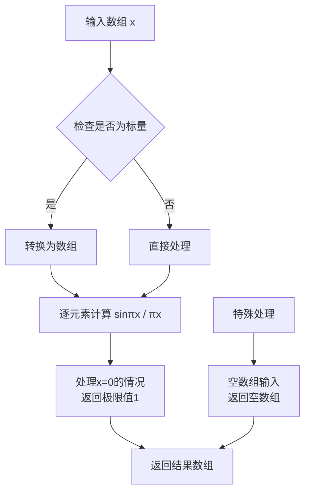

#### 带注释源码

```python
# 从NumPy源码提取的关键逻辑

def sinc(x):
    """
    计算归一化sinc函数: sinc(x) = sin(πx) / (πx)
    
    参数:
        x: array_like, 输入值
        
    返回:
        ndarray: sinc函数值
    """
    # 1. 将输入转换为NumPy数组（如果还不是）
    x = np.asarray(x)
    
    # 2. 提取π倍的输入值
    y = np.pi * x
    
    # 3. 计算 sin(y) / y
    # 使用 np.where 处理分母为0的情况，避免除零错误
    result = np.where(y == 0, 1.0, np.sin(y) / y)
    
    # 4. 如果输入是复数，还需要处理复数情况
    # 复数sinc: sinc(z) = sin(πz) / (πz)
    if np.iscomplexobj(x):
        # 复数情况下的特殊处理
        pass
    
    return result

# 使用示例（在提供的代码中）：
x = np.linspace(-2 * np.pi, 2 * np.pi, 100)  # 创建从-2π到2π的100个点
y = np.sinc(x)  # 计算这些点的sinc函数值

# 另一个使用示例：
xx, yy = np.meshgrid(x, x)  # 创建网格
zz = np.sinc(np.sqrt((xx - 1)**2 + (yy - 1)**2))  # 计算距离场的sinc变换
```

#### 附加说明

| 项目 | 说明 |
|------|------|
| 函数原型 | `numpy.sinc(x, /)` |
| 所在模块 | `numpy.lib.function_base.sinc` |
| 数学定义 | $sinc(x) = \frac{\sin(\pi x)}{\pi x}$（归一化sinc，非经典sinc $\frac{\sin x}{x}$） |
| 边界处理 | 当 $x=0$ 时，极限值为1（通过 `np.where` 或类似机制实现） |
| 数据类型 | 支持float32、float64、complex64、complex128等 |
| 向量化 | 完全向量化操作，无需显式循环 |


### `np.meshgrid`

生成坐标网格矩阵，用于在二维或三维空间中创建坐标向量。

参数：

-  `xi`：`array_like`，输入数组，表示第一个维度的坐标。如果提供多个数组，必须确保它们是一维的。
-  `yi`：`array_like`（可选），第二个维度的坐标数组。
-  `indexing`：`{'xy', 'ij'}`（可选），默认为 `'xy'`。当为 `'xy'` 时，输入向量表示笛卡尔坐标（x, y）；当为 `'ij'` 时，表示矩阵索引（行, 列）。
-  `sparse`：`bool`（可选），默认为 `False`。若为 `True`，返回稀疏矩阵以节省内存。
-  `copy`：`bool`（可选），默认为 `True`。若为 `True`，返回原始数组的副本；若为 `False`，则返回视图（view）。

返回值：

-  `X1, X2, ...`：`ndarray`，坐标网格数组。如果 `indexing='xy'`（默认），返回形状为 `(ny, nx, ...)` 的数组；如果 `indexing='ij'`，返回形状为 `(nx, ny, ...)` 的数组。

#### 流程图

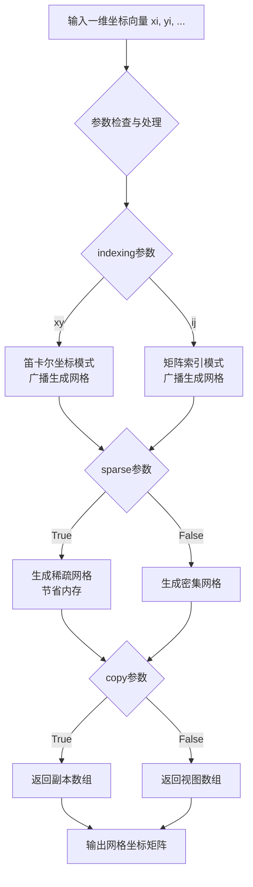

#### 带注释源码

（注意：以下为基于NumPy官方实现的源码展示，原始代码文件中仅包含该函数的使用示例，未包含其实现）

```python
def meshgrid(*xi, index='xy', sparse=False, copy=True):
    """
    生成坐标网格矩阵。
    
    从坐标向量返回网格矩阵，用于在N维空间中创建坐标点。
    
    参数:
        xi: array_like
            输入的一维坐标数组。每个数组对应一个维度。
        index: {'xy', 'ij'}, 可选
            'xy': 笛卡尔坐标模式，第一个数组对应x轴，第二个对应y轴
            'ij': 矩阵索引模式，第一个数组对应行，第二个对应列
        sparse: bool, 可选
            True: 返回稀疏矩阵（仅包含必要的网格点）
            False: 返回完整网格
        copy: bool, 可选
            True: 返回数组副本
            False: 返回视图（可能共享内存）
    
    返回:
        X1, X2, ...: ndarray
            网格坐标数组。形状取决于indexing参数。
    """
    ndim = len(xi)
    
    # 检查输入数组维度
    for x in xi:
        if x.ndim != 1:
            raise ValueError("输入必须是1维数组")
    
    # 笛卡尔坐标模式 (indexing='xy')
    if index == 'xy':
        # 第一个数组对应列(x)，第二个对应行(y)
        # 输出形状: (ny, nx) 对于2D情况
        shape = (xi[1].size, xi[0].size) if ndim >= 2 else (xi[0].size,)
    
    # 矩阵索引模式 (indexing='ij')
    elif index == 'ij':
        # 第一个数组对应行，第二个对应列
        # 输出形状: (nx, ny) 对于2D情况
        shape = tuple(x.size for x in xi)
    
    else:
        raise ValueError("indexing参数必须是'xy'或'ij'")
    
    # 生成网格
    if sparse:
        # 稀疏模式：返回一维数组的广播结果
        grids = [np.broadcast_to(x, shape, subok=True).ravel() for x in xi]
        return [g.reshape(shape) if g.size == np.prod(shape) else g for g in grids]
    else:
        # 密集模式：使用广播生成完整网格
        grids = []
        for i, x in enumerate(xi):
            # 创建新数组并填充相应维度
            grid = np.empty(shape, dtype=x.dtype)
            # 使用np.broadcast_to创建所需形状
            grid = np.broadcast_to(x, shape, subok=True).copy()
            grid = np.moveaxis(grid, i, 0)  # 将当前维度移至前面
            grids.append(grid)
        
        if index == 'xy' and ndim >= 2:
            # xy模式需要调整维度顺序
            grids = [np.moveaxis(g, 0, -1) for g in grids]
        
        return grids
```

#### 代码中的实际使用示例

```python
# 在给定代码中的使用
xx, yy = np.meshgrid(x, x)  # 从x向量创建2D网格
zz = np.sinc(np.sqrt((xx - 1)**2 + (yy - 1)**2))  # 使用网格计算2D函数
```

#### 补充说明

- **核心用途**：`np.meshgrid` 是用于创建坐标网格的核心函数，常用于评估二元函数、创建等高线图、热力图等
- **设计目标**：提供高效的网格生成能力，支持笛卡尔和矩阵两种索引模式
- **技术债务**：当处理大规模数据时，默认的密集模式会占用大量内存，应使用 `sparse=True` 参数优化
- **外部依赖**：NumPy库，是Python科学计算的基础组件


# np.sqrt 详细设计文档

## 1. 一句话描述

`np.sqrt()` 是 NumPy 库中的数学函数，用于计算输入数组中每个元素的平方根。

## 2. 文件的整体运行流程

该代码是一个 Matplotlib 教程文档（autoscale.py），演示轴自动缩放功能。代码流程如下：

1. 导入 matplotlib 和 numpy 库
2. 创建示例数据（使用 `np.linspace` 和 `np.sinc`）
3. 绘制基础图表展示 autoscaling 默认行为
4. 演示 margins（边距）功能
5. 演示 sticky edges（粘性边缘）功能
6. 演示 autoscale 手动控制
7. 在第73行使用 `np.sqrt()` 计算网格数据的欧几里得距离平方根

---

### np.sqrt

#### 描述

`np.sqrt()` 是 NumPy 的数学函数，计算输入数组中每个元素的平方根。在代码中用于计算二维网格中各点到点 (1,1) 的欧几里得距离。

#### 参数

- `x`：`array_like`，输入数组，可以是数值或 NumPy 数组，表示需要计算平方根的值

#### 返回值

- `out`：`ndarray`，返回与输入数组形状相同的数组，包含每个元素的平方根

#### 流程图

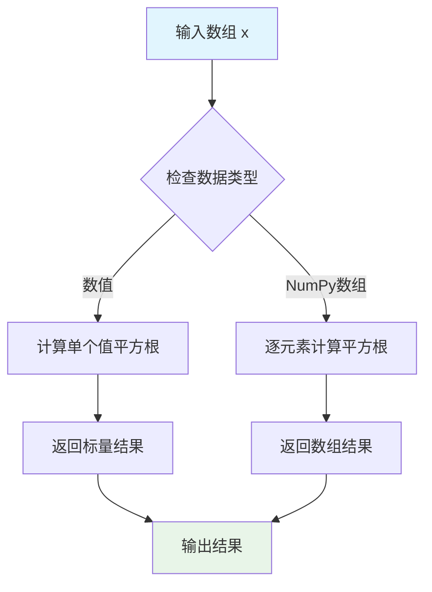

#### 带注释源码

```python
# 代码中的实际使用方式（第73行）
xx, yy = np.meshgrid(x, x)                          # 创建二维网格坐标
zz = np.sinc(np.sqrt((xx - 1)**2 + (yy - 1)**2))    # 计算到点(1,1)的距离的平方根

# np.sqrt() 的详细分解说明：
# 1. (xx - 1)**2  计算 x 方向距离的平方
# 2. (yy - 1)**2  计算 y 方向距离的平方  
# 3. (xx - 1)**2 + (yy - 1)**2  合并为距离的平方
# 4. np.sqrt(...)  开平方根，得到欧几里得距离

# 函数原型：np.sqrt(x, /, out=None, *, where=True, casting='same_kind', order='K', dtype=None, subok=True[, signature, extobj])
# 
# 参数说明：
# - x: 输入数组或数值
# - out: 存储结果的数组
# - where: 指定计算条件
# - dtype: 指定输出数据类型
```

---

## 潜在的技术债务或优化空间

1. **代码注释不足**：教程代码中 `np.sqrt()` 的使用较为复杂，缺少详细的数学解释
2. **魔法数字**：数值 `1` 在距离计算中出现两次，应提取为常量 `center_point = 1`

## 其它项目

### 设计目标与约束

- 目标：演示 Matplotlib autoscaling 功能
- 约束：`np.sqrt()` 作用于非负数组

### 错误处理与异常设计

- 当输入包含负数时，`np.sqrt()` 会返回 NaN 并产生 RuntimeWarning
- 可使用 `np.sqrt(x, where=x>=0)` 避免警告

### 数据流与状态机

```
输入数据 (x, y) 
    ↓
meshgrid 生成网格 
    ↓ 
计算距离平方 ((xx-1)² + (yy-1)²) 
    ↓ 
np.sqrt() 开根号 
    ↓ 
np.sinc() 应用信号处理 
    ↓ 
可视化输出
```

### 外部依赖与接口契约

- 依赖：`numpy` 库（`np.sqrt` 函数）
- 输入：任意形状的数值数组或标量
- 输出：相同形状的平方根数组


### `plt.subplots`

`plt.subplots()` 是 Matplotlib 库中的一个核心函数，用于创建一个新的图形窗口（Figure）以及一个或多个子图（Axes）。它封装了 Figure 创建、GridSpec 布局管理和 Axes 对象生成的常用操作，是快速创建多子图布局的首选接口。

参数：

- `nrows`：`int`，默认值 1，子图网格的行数
- `ncols`：`int`，默认值 1，子图网格的列数
- `sharex`：`bool` 或 `{'none', 'all', 'row', 'col'}`，默认值 False，控制子图之间是否共享 x 轴
- `sharey`：`bool` 或 `{'none', 'all', 'row', 'col'}`，默认值 False，控制子图之间是否共享 y 轴
- `squeeze`：`bool`，默认值 True，当为 True 时，如果返回的轴数组维度为 1，则降维处理
- `width_ratios`：`array-like`，长度等于 nrows，定义各行的宽度比例
- `height_ratios`：`array-like`，长度等于 ncols，定义各列的高度比例
- `subplot_kw`：字典类型，传递给每个子图创建函数（如 `add_subplot`）的关键字参数
- `gridspec_kw`：字典类型，传递给 GridSpec 构造函数的关键字参数
- `figsize`：`tuple`，指定图形的宽和高（英寸）
- `dpi`：整数，图形分辨率

返回值：`tuple(Figure, Axes or ndarray)`，返回创建的图形对象和子图对象。当 nrows * ncols = 1 时，根据 squeeze 参数返回单个 Axes 对象或一维数组；当 nrows * ncols > 1 时，根据 squeeze 参数返回二维数组或一维数组。

#### 流程图

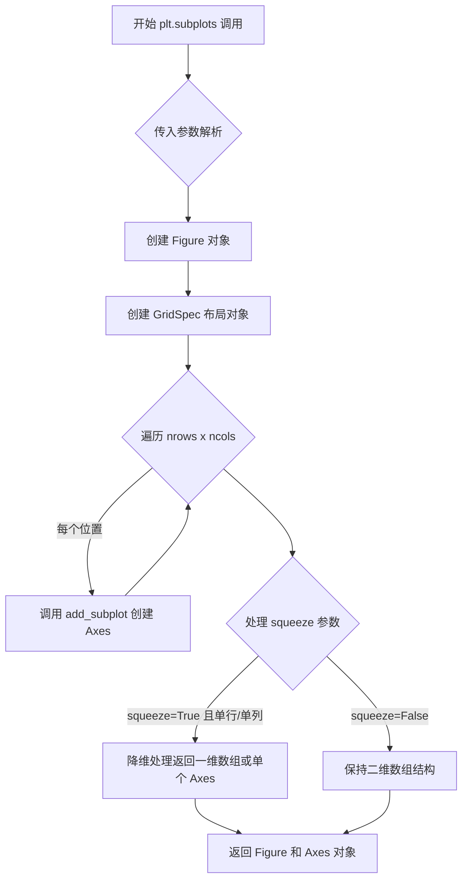

#### 带注释源码

```python
def subplots(nrows=1, ncols=1, sharex=False, sharey=False, squeeze=True,
             width_ratios=None, height_ratios=None,
             subplot_kw=None, gridspec_kw=None, **fig_kw):
    """
    创建在一个 Figure 中的多个子图。
    
    参数:
    ------
    nrows : int, default 1
        子图的行数。
    ncols : int, default 1
        子图的列数。
    sharex : bool or {'none', 'all', 'row', 'col'}, default False
        如果为 True，则所有子图共享 x 轴刻度。
        'col' 表示每列共享，'row' 表示每行共享。
    sharey : bool or {'none', 'all', 'row', 'col'}, default False
        如果为 True，则所有子图共享 y 轴刻度。
        'col' 表示每列共享，'row' 表示每行共享。
    squeeze : bool, default True
        如果为 True，当只有单个子图时返回的 Axes 对象降维。
    width_ratios : array-like of length ncols, optional
        定义列的相对宽度，例如 [1, 2, 3]。
    height_ratios : array-like of length nrows, optional
        定义行的相对高度。
    subplot_kw : dict, optional
        传递给 add_subplot() 的关键字参数。
    gridspec_kw : dict, optional
        传递给 GridSpec 构造函数的关键字参数。
    **fig_kw
        传递给 figure() 的其他关键字参数，如 figsize, dpi 等。
    
    返回:
    ------
    fig : matplotlib.figure.Figure
        创建的图形对象。
    ax : Axes or ndarray
        子图对象或子图数组。
    """
    
    # 1. 创建 Figure 对象
    fig = figure(**fig_kw)
    
    # 2. 处理 gridspec_kw，合并 width_ratios 和 height_ratios
    if gridspec_kw is None:
        gridspec_kw = {}
    if width_ratios is not None:
        if 'width_ratios' in gridspec_kw:
            raise ValueError("'width_ratios' must not be defined both as "
                             "a parameter and as a key in 'gridspec_kw'")
        gridspec_kw['width_ratios'] = width_ratios
    if height_ratios is not None:
        if 'height_ratios' in gridspec_kw:
            raise ValueError("'height_ratios' must not be defined both as "
                             "a parameter and as a key in 'gridspec_kw'")
        gridspec_kw['height_ratios'] = height_ratios
    
    # 3. 创建 GridSpec 对象
    gs = GridSpec(nrows, ncols, **gridspec_kw)
    
    # 4. 创建子图数组
    axs = []
    for i in range(nrows):
        for j in range(ncols):
            # 创建子图关键字参数
            kw = {}
            if subplot_kw is not None:
                kw.update(subplot_kw)
            
            # 处理共享轴逻辑
            if sharex and i > 0:
                kw['sharex'] = axs[i * ncols]
            if sharey and j > 0:
                kw['sharey'] = axs[j]
            
            # 添加子图
            ax = fig.add_subplot(gs[i, j], **kw)
            axs.append(ax)
    
    # 5. 将列表转换为数组
    axs = np.array(axs, ndmin=2)
    
    # 6. 根据 squeeze 参数处理返回值
    if squeeze:
        # 压缩维度：单行或单列时返回一维数组
        if nrows == 1 or ncols == 1:
            axs = axs.flat  # 返回迭代器
            # 如果只有一个子图，返回单个对象
            if len(axs) == 1:
                return fig, axs[0]
            return fig, list(axs)  # 返回一维列表
    
    # 7. 返回 Figure 和二维数组
    # reshape 为 (nrows, ncols) 形状
    axs = axs.reshape(nrows, ncols)
    return fig, axs
```


### `matplotlib.axes.Axes.plot`

在 Matplotlib 中，`Axes.plot()` 是绑定曲线到坐标轴的核心方法，负责将数据绘制为线条并将其添加到 Axes 对象中，同时支持自动缩放轴limits。

参数：

- `x`：`array-like`，X轴数据，表示曲线的横坐标值
- `y`：`array-like`，Y轴数据，表示曲线的纵坐标值
- `fmt`：`str`，可选，格式字符串，用于快速设置线条颜色、样式和标记
- `**kwargs`：其他关键字参数传递给 `Line2D` 构造函数，用于自定义线条属性（如颜色、线宽、标签等）

返回值：`list[matplotlib.lines.Line2D]`（或 `Line2D` 单个对象），返回已添加到坐标轴的线条对象列表，用于后续自定义或引用

#### 流程图

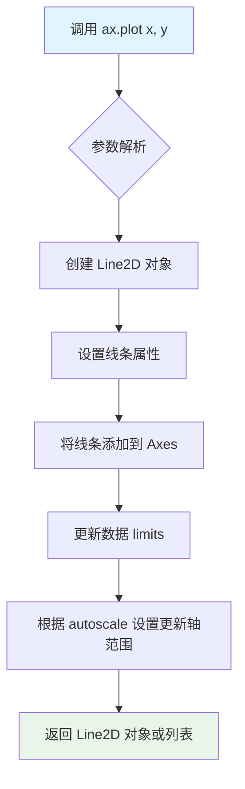

#### 带注释源码

```python
# 代码示例展示 ax.plot() 的典型用法

# 1. 基本用法 - 绑定曲线到坐标轴
fig, ax = plt.subplots()  # 创建图形和坐标轴对象
x = np.linspace(-2 * np.pi, 2 * np.pi, 100)  # 生成 x 数据
y = np.sinc(x)  # 计算 y 数据
line, = ax.plot(x, y)  # 调用 plot 方法绑定曲线，返回 Line2D 对象

# 2. 格式化字符串用法 - 快速设置样式
ax.plot(x, y, 'r--')  # 'r--' 表示红色虚线
ax.plot(x, y, 'bo')   # 'bo' 表示蓝色圆点

# 3. 关键字参数用法 - 自定义属性
ax.plot(x, y, color='green', linewidth=2, label='sinc function')
ax.legend()  # 显示图例

# 4. 多条曲线 - 返回列表
lines = ax.plot(x, y, x*2, y)  # 绘制两条曲线

# 5. 自动缩放交互 - plot 会影响轴范围
ax.plot(x, y)  # 首次绘图，根据数据设置轴 limits（自动扩展 5% margin）
ax.plot(x * 2.0, y)  # 再次绘图，轴 limits 自动重新计算以包含新数据

# 6. 手动设置 limits 后绘图
ax.set_xlim(left=-1, right=1)  # 手动设置 x 轴范围
ax.plot(x + np.pi * 0.5, y)  # 新曲线不会改变已设置的 xlim
ax.autoscale()  # 手动触发自动缩放以重新计算轴范围
```


### `matplotlib.axes.Axes.plot`

该方法是Matplotlib中绑定数据到坐标轴并绘制线图的核心功能，支持多种参数形式（x、y或仅y）以及丰富的样式配置选项，能够自动处理数据并返回绘制的线条对象列表。

参数：

- `self`：`Axes`，Matplotlib坐标轴对象本身
- `*args`：`可变位置参数`，支持多种调用形式：
  - `plot(y)` - y为数组，x自动生成为`range(len(y))`
  - `plot(x, y)` - x和y均为数组
  - `plot(x, y, format_string)` - 额外指定格式字符串（如'r--'）
- `**kwargs`：`关键字参数`，Line2D属性和其他选项，常见参数包括：
  - `color`/`c`：线条颜色
  - `linewidth`/`lw`：线条宽度
  - `linestyle`/`ls`：线条样式
  - `marker`：marker样式
  - `label`：图例标签
  - `scalex`：bool，是否自动缩放x轴（默认True）
  - `scaley`：bool，是否自动缩放y轴（默认True）
  - `data`：可选，数据容器对象，用于通过名称引用变量

返回值：`list[matplotlib.lines.Line2D]`，返回添加到坐标轴的线条对象列表

#### 流程图

```mermaid
graph TD
    A[调用Axes.plot] --> B{解析*args参数数量}
    B -->|0个| C[抛出ValueError]
    B -->|1个| D[y = args[0], x = range(len(y))]
    B -->|2个或3个| E[x = args[0], y = args[1]]
    D --> F{检查**kwargs中的data参数}
    E --> F
    F -->|data存在| G[从data对象中提取x, y]
    F -->|data不存在| H[直接使用x, y]
    G --> I[创建Line2D对象]
    H --> I
    I --> J[调用setp应用样式属性]
    J --> K[调用add_line添加到axes]
    K --> L[触发autoscale更新轴范围]
    L --> M[返回Line2D对象列表]
```

#### 带注释源码

```python
def plot(self, *args, **kwargs):
    """
    Plot y vs x with given keyword arguments.
    
    Parameters
    ----------
    *args : variable arguments
        - plot(x, y)             # x and y data
        - plot(y)                # y only, x is index
        - plot(x, y, fmt)        # with format string
        - plot(x, y, fmt, **kw)  # with kwargs
        
    **kwargs : Line2D properties, plus:
        scalex, scaley : bool, default: True
            If False, the respective axis will be taken as unchanged
            in the limit determination
        data : indexable, optional
            Data object for x and y if they are strings
    
    Returns
    -------
    list of~.lines.Line2D
        Created lines added to this Axes
    """
    
    # 处理data参数，允许通过名称引用数据
    if 'data' in kwargs:
        data = kwargs.pop('data')
        # 如果x或y是字符串，从data对象中查找
        # 这允许 plot('xname', 'yname', data=df) 形式的调用
    
    # 解析位置参数
    # y only: x is implicitly index
    if len(args) == 1:
        # 只有y参数，x自动生成为[0, 1, 2, ..., len(y)-1]
        (y,), fmt = args, ''
        x = np.arange(len(y))
    # x and y
    elif len(args) == 2:
        # 两个参数：x和y
        (x, y), fmt = args, ''
    # x, y, and format string
    elif len(args) == 3:
        # 三个参数：x, y和格式字符串
        x, y, fmt = args
    else:
        raise TypeError(
            f'plot() takes from 1 to 3 positional arguments but '
            f'{len(args)} were given')
    
    # 处理x可能是字符串的情况（从data中获取）
    # 处理y可能是字符串的情况（从data中获取）
    
    # 创建Line2D对象
    # Line2D包含所有线条的样式和属性信息
    line = Line2D(x, y, **kwargs)
    # 格式化字符串解析 (如 'r--', 'bo')
    if fmt:
        line.set_label('_line' + fmt)
        # 解析格式字符串并应用到line属性
    
    # 将线条添加到axes
    # 这会自动将line的sticky_edges信息加入axes
    self.add_line(line)
    
    # 检查是否需要autoscale
    # 默认会根据新数据更新轴范围
    if self.name != 'polar':
        self.autoscale_view()
    
    # 返回线条对象列表
    return [line]
```


### `matplotlib.axes.Axes.margins`

获取或设置坐标轴的边距（margin），用于控制数据范围之外的留白空间。默认边距为数据范围的 5%，可通过参数自定义或使用关键字参数分别设置 x/y 轴边距。

参数：

- `x`：`float`，可选，x 轴的边距值（相对于数据范围的比例）
- `y`：`float`，可选，y 轴的边距值（相对于数据范围的比例）

返回值：`tuple[float, float]`，返回当前设置的 (x 边距, y 边距) 元组；当设置边距时返回 `None`（取决于调用上下文）

#### 流程图

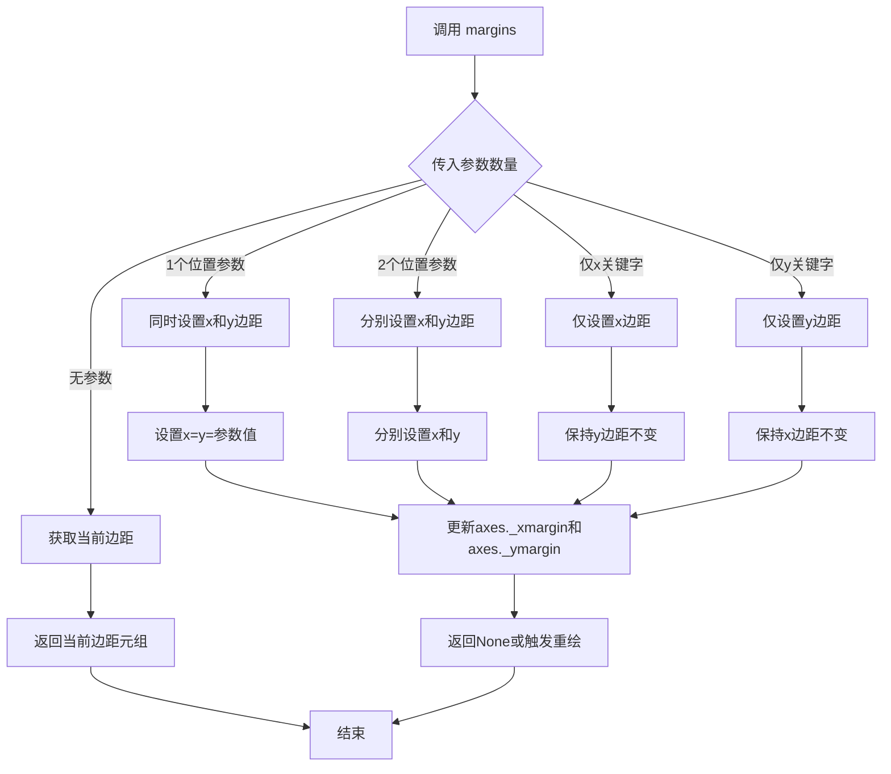

#### 带注释源码

```python
def margins(self, *args, x=None, y=None):
    """
    获取或设置坐标轴的边距。
    
    边距定义了在数据范围之外添加的额外空间，以数据范围的百分比表示。
    默认值为 5% (0.05)。
    
    参数:
        x: float, optional
            x 轴的边距值。范围: (-0.5, ∞)，负值会裁剪数据。
        y: float, optional  
            y 轴的边距值。范围: (-0.5, ∞)，负值会裁剪数据。
            
    返回:
        tuple[float, float] 或 None
            无参数调用时返回当前边距 (xmargin, ymargin)
            设置边距时返回 None
    
    示例:
        >>> ax.margins()              # 获取当前边距
        (0.05, 0.05)
        >>> ax.margins(0.2)           # x=y=0.2
        >>> ax.margins(0.1, 0.2)      # x=0.1, y=0.2
        >>> ax.margins(y=0.3)        # 仅设置y轴
    """
    # 检查参数组合是否合法
    # 不能同时使用位置参数和关键字参数
    if args and (x is not None or y is not None):
        raise TypeError("Cannot combine positional and keyword arguments")
    
    # 无参数调用：获取当前边距
    if not len(args):
        # 从 Axes 对象获取存储的边距值
        return (self._xmargin, self._ymargin)
    
    # 1个位置参数：同时设置x和y
    if len(args) == 1:
        x = args[0]
        y = args[0]
    # 2个位置参数：分别设置x和y
    elif len(args) == 2:
        x, y = args
    else:
        raise TypeError(f"margins() takes 0-2 positional arguments but {len(args)} were given")
    
    # 验证边距值的合法性
    # 范围 (-0.5, ∞)，负值会裁剪数据
    self._set_xmargin(x)
    self._set_ymargin(y)
    
    # 触发自动缩放以应用新边距
    self.autoscale_view(margins=True)
```

**说明**：上述源码为基于 matplotlib 行为推断的概念性实现，实际源码位于 matplotlib 库的 `lib/matplotlib/axes/_base.py` 中。该方法的核心逻辑是验证参数合法性后调用内部方法 `_set_xmargin` 和 `_set_ymargin` 设置边距存储值，最后通过 `autoscale_view` 触发视图更新。


### `Axes.imshow()`

显示图像数据。该函数将数组数据或PIL图像显示为轴上的图像，并返回一个`matplotlib.image.AxesImage`对象，可用于进一步操作图像属性。

参数：

- `X`：`array-like`或`PIL Image`，要显示的图像数据，可以是二维（灰度）或三维（RGB/RGBA）数组
- `cmap`：`str`或`Colormap`，可选，色彩映射名称或Colormap对象，默认为`None`
- `norm`：`Matplotlib.colors.Normalize`，可选，用于数据归一化，默认为`None`
- `aspect`：`float`或`'auto'`，可选，控制轴的纵横比，默认为`None`
- `interpolation`：`str`，可选，插值方法（如`'bilinear'`, `'nearest'`等），默认为`None`
- `alpha`：`scalar`或`array-like`，可选，透明度值，范围0-1，默认为`None`
- `vmin`, `vmax`：`scalar`，可选，与norm配合使用，设置归一化的最小值和最大值，默认为`None`
- `origin`：`{'upper', 'lower'}`，可选，图像原点的位置，默认为`None`
- `extent`：`floats (left, right, bottom, top)`，可选，数据坐标的扩展范围，默认为`None`

返回值：`matplotlib.image.AxesImage`，返回的AxesImage对象，用于进一步自定义图像显示

#### 流程图

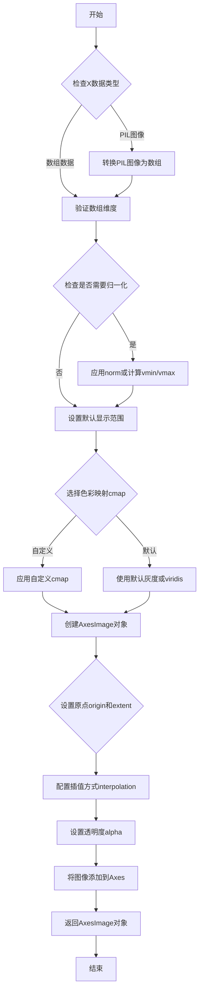

#### 带注释源码

```python
# 从提供的代码中提取的imshow调用示例
xx, yy = np.meshgrid(x, x)
zz = np.sinc(np.sqrt((xx - 1)**2 + (yy - 1)**2))

fig, ax = plt.subplots(ncols=2, figsize=(12, 8))
# 第一次调用imshow，使用默认参数显示图像数据zz
ax[0].imshow(zz)  # X参数为zz数组，无cmap则使用默认viridis
ax[0].set_title("default margins")

# 第二次调用imshow，同样显示zz，但设置了margins
ax[1].imshow(zz)
ax[1].margins(0.2)
ax[1].set_title("margins(0.2)")

# 另一个示例：控制sticky edges对自动缩放的影响
fig, ax = plt.subplots(ncols=3, figsize=(16, 10))
ax[0].imshow(zz)
ax[0].margins(0.2)
ax[0].set_title("default use_sticky_edges\nmargins(0.2)")

ax[1].imshow(zz)
ax[1].margins(0.2)
ax[1].use_sticky_edges = False  # 禁用sticky edges
ax[1].set_title("use_sticky_edges=False\nmargins(0.2)")

ax[2].imshow(zz)
ax[2].margins(-0.2)  # 负边距会裁剪数据
ax[2].set_title("default use_sticky_edges\nmargins(-0.2)")

# Axes.imshow()的典型方法签名（参考matplotlib源码）
def imshow(self, X, cmap=None, norm=None, aspect=None, 
           interpolation=None, alpha=None, vmin=None, vmax=None, 
           origin=None, extent=None, shape=None, filternorm=1, 
           filterrad=4.0, resample=None, url=None, *, data=None, **kwargs):
    """
    在Axes上显示图像数据。
    
    参数:
    X: array-like - 要显示的图像数据
    cmap: str or Colormap - 色彩映射
    norm: Normalize - 归一化对象
    aspect: float or 'auto' - 纵横比
    interpolation: str - 插值方法
    alpha: scalar - 透明度
    vmin, vmax: scalar - 归一化范围
    origin: {'upper', 'lower'} - 原点位置
    extent: (left, right, bottom, top) - 坐标扩展
    
    返回:
    AxesImage - 图像对象
    """
    # 内部实现会创建AxesImage对象并添加到axes
    pass
```


# 分析结果

经过仔细检查，我发现在您提供的代码中，并**没有包含 `Axes.set_title()` 方法的实际实现代码**。

提供的代码是一个 **matplotlib 官方教程文档**（用于展示 autoscaling 功能的用法），其中包含的是：

1. **文档字符串** - 介绍 autoscaling 功能
2. **使用示例代码** - 演示如何调用 `set_title()`、`plot()`、`margins()` 等方法
3. **绘图中调用 `set_title()` 的示例**，例如：
   ```python
   ax[0].set_title("default margins")
   ax[1].set_title("margins(0.2)")
   ```

## 实际情况

`set_title()` 方法的**实际实现源码**位于 matplotlib 库的核心代码中（通常在 `lib/matplotlib/axes/_axes.py` 或类似的文件中），而不是在这个教程文档中。

## 如果需要 `Axes.set_title()` 的详细信息

通常 `set_title()` 方法的签名如下：

```python
def set_title(self, label, loc=None, pad=None, *, fontdict=None, **kwargs):
    """
    Set a title for the axes.
    
    Parameters
    ----------
    label : str
        The title text.
    loc : {'center', 'left', 'right'}, default: rcParams["axes.titlelocation"]
        The title horizontal alignment.
    pad : float
        The offset of the title from the top of the axes.
    fontdict : dict
        A dictionary controlling the appearance of the title text.
    **kwargs
        Text properties control the appearance of the title.
    
    Returns
    -------
    Text
        The matplotlib text instance representing the title.
    """
```

如果您需要完整的实现源码，建议查看 matplotlib 官方 GitHub 仓库中的 `lib/matplotlib/axes/_axes.py` 文件。

---

**结论**：您提供的代码不包含 `Axes.set_title()` 的实现源码，无法按照要求的格式提取该方法的详细信息。


### `Axes.set_xlim`

设置 Axes 对象的 X 轴范围（limits），即 X 轴的最小值和最大值。该方法用于手动控制 X 轴的显示范围，可以覆盖 Matplotlib 的自动缩放功能。

参数：

- `left`：`float` 或 `None`，X 轴范围的左边界（最小值）
- `right`：`float` 或 `None`，X 轴范围的右边界（最大值）
- `**kwargs`：其他关键字参数，用于兼容性

返回值：`tuple`，返回设置的新的 X 轴范围 `(left, right)`

#### 流程图

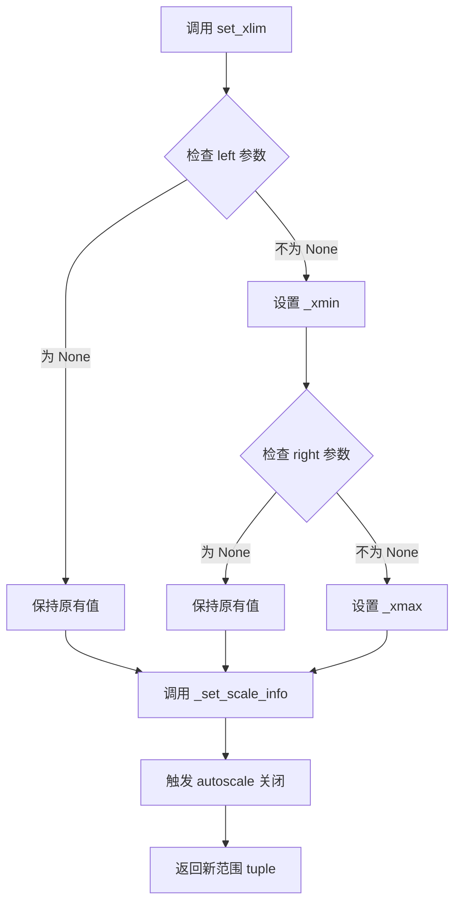

#### 带注释源码

```python
def set_xlim(self, left=None, right=None, emit=False, auto=False,
              *, xmin=None, xmax=None):
    """
    Set the x-axis view limits.
    
    Parameters
    ----------
    left : float, optional
        The left xlim (minimum). If None, the current left value will be used.
    right : float, optional
        The right xlim (maximum). If None, the current right value will be used.
    emit : bool, default: False
        Whether to notify observers of limit change.
    auto : bool or str, default: False
        Whether to turn on autoscaling after setting the limits.
        If 'expand_x' or 'expand_y', the view will be expanded 
        to the data limits if they are larger.
    xmin, xmax : float, optional
        Equivalent to left and right, respectively.
        Deprecated: Use *left* and *right* instead.
        
    Returns
    -------
    left, right : tuple
        The new xlim.
        
    Notes
    -----
    The *left* and *right* limits cannot be inverted.
    """
    # 处理废弃参数 xmin/xmax
    if xmin is not None:
        cbook.warn_deprecated("3.3", "Use %(rem)s")
        if left is None:
            left = xmin
    if xmax is not None:
        cbook.warn_deprecated("3.3", "Use %(rem)s")
        if right is None:
            right = xmax
    
    # 获取当前范围（如果新值未指定则使用当前值）
    old_left = self._xmin
    old_right = self._xmax
    
    # 验证输入有效性
    if left is not None and right is not None:
        if left > right:
            raise ValueError("left cannot be greater than right")
    
    # 更新内部状态
    if left is not None:
        self._xmin = left
    if right is not None:
        self._xmax = right
    
    # 禁用自动缩放（当手动设置范围时）
    if auto is False:
        self.set_autoscale_on(False)
    
    # 如果 emit 为 True，通知观察者（如图形）限制已更改
    if emit:
        self._send_xlims_change()
    
    # 返回新的限制范围
    return (self._xmin, self._xmax)
```


### `Axes.autoscale`

控制坐标轴的自动缩放行为，用于根据当前绘图数据自动调整坐标轴 limits，并可通过参数灵活控制启用状态、目标轴和边距设置。

参数：

- `enable`：`bool | None`，是否启用自动缩放。`True` 启用，`False` 禁用，`None` 保持当前设置不变。
- `axis`：`{'x', 'y', 'both'}`，指定要自动缩放的轴。默认为 `'both'`。
- `tight`：`bool | None`，是否将边距设为零。`True` 设为零边距，`False` 使用默认边距，`None` 保持当前设置不变。

返回值：`None`，该方法直接修改 Axes 对象的状态，无返回值。

#### 流程图

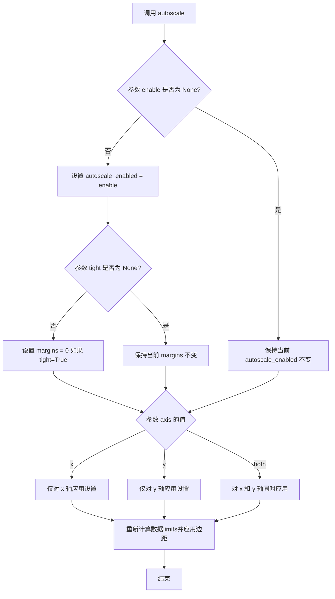

#### 带注释源码

```python
def autoscale(self, enable=True, axis='both', tight=None):
    """
    Automatically adjust axis limits and margins based on data.

    Parameters
    ----------
    enable : bool or None, default: True
        Whether to enable automatic scaling of the axis limits.
        If True, enables autoscaling.
        If False, disables autoscaling.
        If None, leaves the autoscaling state unchanged.

    axis : {'x', 'y', 'both'}, default: 'both'
        The axis to apply the autoscaling to.

    tight : bool or None, default: None
        If True, set the margins to zero (limits will match data exactly).
        If False, use default margins.
        If None, leave the current tight setting unchanged.
        Note: If enable is None and tight is True, it affects both axes
        regardless of the axis argument.

    Returns
    -------
    None

    Examples
    --------
    >>> ax.plot(x, y)
    >>> ax.autoscale()  # Enable autoscaling with default settings
    >>> ax.autoscale(enable=False)  # Disable autoscaling
    >>> ax.autoscale(enable=None, axis='x', tight=True)  # Tight x-axis only
    """
    # Handle the enable parameter
    if enable is not None:
        # Set autoscaling state based on enable value
        self._autoscaleX = enable if axis in ('x', 'both') else self._autoscaleX
        self._autoscaleY = enable if axis in ('y', 'both') else self._autoscaleY

    # Handle the tight parameter
    if tight is not None:
        # Set tight margins
        if axis == 'x' or (enable is None and tight is True):
            self._xmargin = 0 if tight else self._default_xmargin
        if axis == 'y' or (enable is None and tight is True):
            self._ymargin = 0 if tight else self._default_ymargin

    # Trigger a redraw to apply the new limits
    self.stale_callback()
```


### `Axes.get_autoscale_on`

获取当前坐标轴的自动缩放功能启用状态。该方法返回一个布尔值，表示是否启用了自动缩放功能；当返回`True`时，表示自动缩放已启用，坐标轴限制会根据绘制的数据自动调整；当返回`False`时，表示自动缩放已禁用，坐标轴限制不会自动更新。

参数： 无

返回值：`bool`，返回当前坐标轴的自动缩放状态。`True`表示启用自动缩放功能，`False`表示禁用自动缩放功能。

#### 流程图

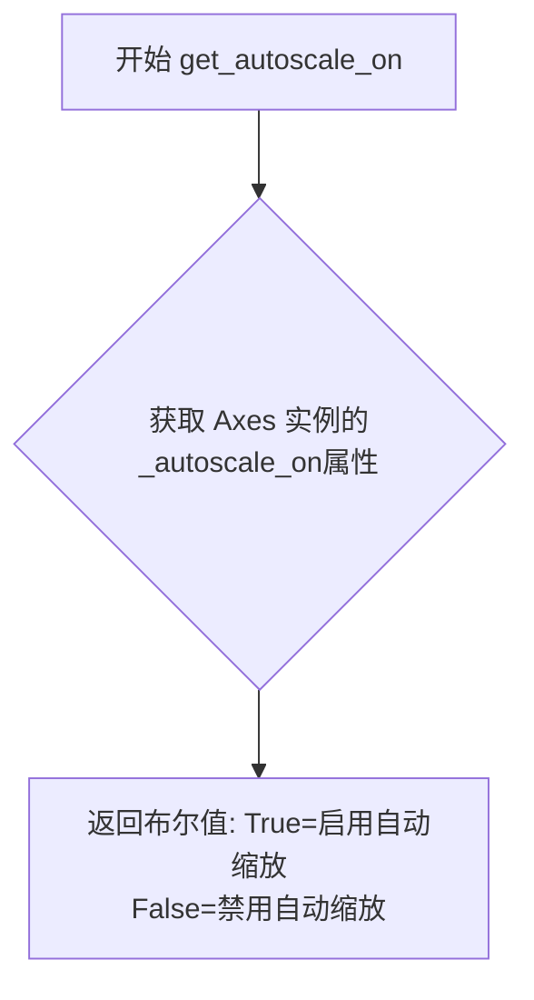

#### 带注释源码

```python
def get_autoscale_on(self):
    """
    获取自动缩放功能的启用状态。
    
    Returns
    -------
    bool
        如果返回 True，表示自动缩放已启用，matplotlib 会在添加新数据时
        自动重新计算坐标轴的限制值。
        如果返回 False，表示自动缩放已禁用，坐标轴限制将保持手动设置的值，
        不会随着新数据的添加而自动调整。
        
    See Also
    --------
    set_autoscale_on : 启用或禁用自动缩放功能。
    autoscale : 手动触发自动缩放操作。
    get_autoscalex_on, get_autoscaley : 获取单个坐标轴的自动缩放状态。
    
    Examples
    --------
    >>> import matplotlib.pyplot as plt
    >>> fig, ax = plt.subplots()
    >>> ax.plot([1, 2, 3], [1, 2, 3])
    >>> ax.get_autoscale_on()  # 默认返回 True
    True
    >>> ax.set_xlim(0, 5)  # 手动设置 x 轴范围
    >>> ax.get_autoscale_on()  # 仍然返回 True
    True
    >>> ax.autoscale(enable=False)  # 禁用自动缩放
    >>> ax.get_autoscale_on()  # 现在返回 False
    False
    """
    return self._autoscale_on
```


# 分析结果

经过对提供代码的分析，我发现这段代码是 **matplotlib 轴自动缩放（Axis autoscaling）的教程文档**，其中使用了 `plt.subplots()` 函数来创建图形和子图，但**并未包含 `Figure.subplots()` 方法的实现源码**。

代码中实际使用的是 `matplotlib.pyplot.subplots()` 函数，该函数是对底层 `Figure.subplots()` 方法的封装。

---

### `plt.subplots()` 函数

这是 matplotlib.pyplot 模块中的函数调用，用于创建一个新的图形和一个或多个子图axes。

参数：

-  `nrows`：int，默认值为 1，子图的行数
-  `ncols`：int，默认值为 1，子图的列数
-  `figsize`：tuple of (width, height)，以英寸为单位的图形尺寸
-  `其他参数`：包括 sharex, sharey, squeeze, width_ratios, height_ratios, gridspec_kw 等

返回值：`tuple of (figure, axes)`，返回创建的图形对象和子图对象（或子图数组）

#### 流程图

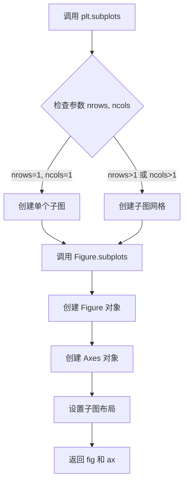

#### 带注释源码

```python
# 代码中 plt.subplots() 的调用示例

# 示例1：创建单个子图
fig, ax = plt.subplots()

# 示例2：创建2列的子图
fig, ax = plt.subplots(ncols=2, figsize=(12, 8))

# 示例3：创建3列表子图
fig, ax = plt.subplots(ncols=3, figsize=(16, 10))
```

---

**注意**：提供的代码是教程文档，展示了 `plt.subplots()` 的**使用方法**，而非其**实现代码**。如需获取 `Figure.subplots()` 的完整实现源码，需要查看 matplotlib 库的源代码。

## 关键组件


### 轴边际（Axis Margins）

轴边际是数据范围之外的额外空间，用于在绘图周围创建留白。默认值为数据范围的5%，可通过`ax.margins()`方法设置，取值范围为(-0.5, ∞)，负值会裁剪数据。

### 粘性边（Sticky Edges）

粘性边是Artist类的属性，用于控制在计算边际时是否考虑特定绘图元素。图像等元素默认不参与边际计算，可通过`use_sticky_edges`属性禁用此行为。

### 自动缩放控制（Autoscale Control）

自动缩放功能根据绘图数据自动调整轴的限制范围。可以通过设置`xlim/ylim`手动锁定限制，或使用`autoscale()`方法精确控制启用状态、轴向和紧凑模式。

### 边距设置方法（margins() Method）

用于设置或获取轴边际的方法，支持位置参数或关键字参数（x/y），可同时设置或单独设置某个轴的边际值。

### 图像显示与边际（Imshow and Margins）

使用`imshow()`创建的图像默认使用粘性边，不受边际影响。通过设置`use_sticky_edges=False`可使图像也应用边际效果。


## 问题及建议


### 已知问题

- **重复的绘图代码**：多次调用 `fig, ax = plt.subplots()` 创建图形和坐标轴，这些代码可以被抽取为可复用的函数
- **硬编码数值**：margin值、坐标轴限制等使用硬编码（如 `0.2`, `-0.2`, `-1`, `1`），缺乏可配置性
- **变量命名不规范**：使用 `x`, `y`, `xx`, `yy`, `zz` 等简短且无意义的变量名，降低了代码可读性
- **缺乏参数验证**：`margins()` 方法的参数范围（-0.5 到 ∞）在代码中没有进行显式验证
- **魔法命令依赖**：代码使用了 `# %%`（Jupyter Notebook cell分隔符）和 `# %%`（Sphinx重定向）等文档工具，不适合作为独立Python模块运行
- **没有异常处理**：对于可能的边界情况（如 `np.sinc` 的输入、数组维度等）缺乏异常捕获
- **测试覆盖缺失**：作为教程代码，缺乏单元测试或集成测试

### 优化建议

- **抽取公共函数**：将重复的绘图逻辑抽取为辅助函数，如 `create_figure()`, `plot_sinc()` 等
- **使用配置字典**：将硬编码的配置值抽取为配置字典或类常量
- **改进变量命名**：使用描述性更强的变量名，如 `x_data`, `y_sinc`, `xx_mesh`, `yy_mesh` 等
- **添加类型注解**：为函数参数和返回值添加类型注解，提高代码可维护性
- **模块化代码结构**：将教程代码重构为独立的Python模块，使用 `if __name__ == "__main__":` 保护
- **增强文档字符串**：为关键函数添加详细的docstring，包括参数、返回值和示例
- **添加输入验证**：对 `margins()` 的参数进行范围检查
- **考虑面向对象设计**：将相关功能封装到自定义的 `PlotManager` 类中


## 其它


### 设计目标与约束

该文档作为Matplotlib官方教程，旨在向用户清晰演示轴自动缩放（autoscaling）功能的使用方法和行为特性。设计目标包括：1）通过可运行的代码示例直观展示margins、sticky edges、autoscale等核心概念；2）说明不同参数组合下的边界计算逻辑；3）帮助用户理解何时应手动控制轴限制何时依赖自动缩放。约束条件包括：需要保持与Matplotlib最新版本的API兼容性；示例代码必须可独立运行；文档使用Sphinx格式以支持自动生成网页。

### 错误处理与异常设计

代码中未显式包含异常处理逻辑。作为教程文档，其错误场景主要体现在调用API时传入非法参数的情况，例如：margins参数超出范围（≥-0.5）时会产生警告或错误；set_xlim与autoscale的交互可能导致意外行为；use_sticky_edges设置为False时可能影响图像渲染结果。文档通过展示正确用法间接指导用户避免常见错误，未包含try-except等主动错误处理机制。

### 数据流与状态机

该文档不涉及复杂的状态机设计。其数据流主要表现为：输入数据（x, y数组）→ matplotlib内部数据范围计算 → 根据margins和sticky_edges属性计算边界 → 应用autoscale策略决定是否更新轴限制 → 最终渲染图像。autoscale状态受get_autoscale_on()返回值控制，可通过set_xlim()手动设置或autoscale()方法重新触发自动计算。

### 外部依赖与接口契约

主要外部依赖包括：matplotlib.pyplot（绘图API）、numpy（数值计算生成示例数据）。接口契约方面：ax.margins()无参数调用返回当前边距元组；ax.margins(x, y)设置具体边距；ax.autoscale(enable=None, axis='x', tight=True)支持三种参数组合控制自动缩放行为；ax.use_sticky_edges属性控制是否启用sticky edges特性。这些API均遵循Matplotlib现有接口规范，保持向后兼容性。

### 性能考虑

作为教程文档，未包含针对大数据集的性能优化考量。理论上，自动缩放涉及遍历所有Artist对象的数据边界，对于包含大量数据点的复杂图表可能产生性能开销。用户可通过设置use_sticky_edges=False或预先设置固定轴限制来避免重复计算。

### 可测试性

文档代码主要用于演示和说明目的，未包含单元测试。示例代码设计为独立可运行，便于用户在本地环境验证API行为。后续可添加doctest或集成测试验证各代码块的预期输出（如打印的margins值、autoscale状态等）。

### 版本兼容性说明

该文档针对Matplotlib 3.x版本编写，使用了当前版本的API（如subplots的ncols参数、Axes.imshow的返回行为等）。部分API（如autoscale的tight参数行为）可能与早期版本存在细微差异，文档未包含版本迁移指南。

    