# `matplotlib\galleries\users_explain\axes\axes_scales.py` 详细设计文档

这是一个Matplotlib轴刻度（Axis Scales）的教程文档示例代码，展示了如何使用各种内置刻度类型（线性、对数、半对数、symlog、logit、asinh等）以及创建自定义函数刻度（Mercator变换）。

## 整体流程

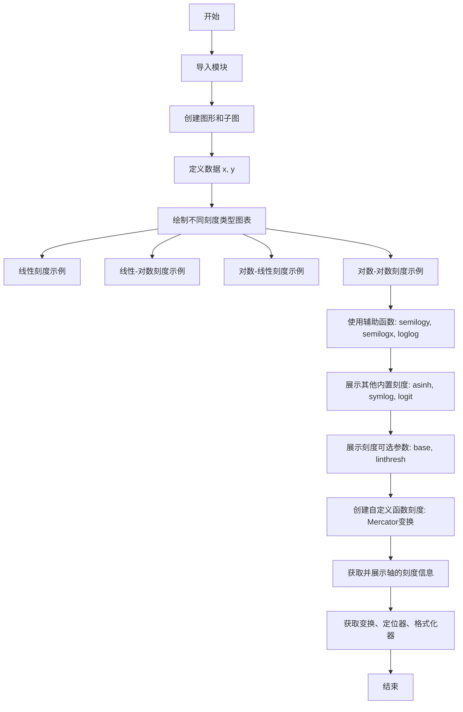

## 类结构

```
无类层次结构（脚本文件）
包含两个全局函数:
├── forward(a) - Mercator前向变换
└── inverse(a) - Mercator逆变换
```

## 全局变量及字段


### `fig`
    
matplotlib图形对象，表示整个图表窗口

类型：`matplotlib.figure.Figure`
    


### `axs`
    
子图字典，键为子图名称，值为对应的Axes对象

类型：`dict[str, matplotlib.axes.Axes]`
    


### `x`
    
numpy数组，从0到3π的角度/数值数据，步长0.1

类型：`numpy.ndarray`
    


### `y`
    
numpy数组，基于x计算的正弦结果乘以2加3

类型：`numpy.ndarray`
    


### `t`
    
numpy数组，从0到170的时间/角度数据，步长0.1

类型：`numpy.ndarray`
    


### `s`
    
numpy数组，t除以2的计算结果

类型：`numpy.ndarray`
    


### `name`
    
字符串，表示刻度尺名称如'linear'、'log'、'symlog'等

类型：`str`
    


### `ax`
    
单个子图对象，用于绑定数据和设置坐标轴属性

类型：`matplotlib.axes.Axes`
    


### `yy`
    
numpy数组，根据不同刻度类型处理后的数据

类型：`numpy.ndarray`
    


### `forward`
    
Mercator投影的正向变换函数，将角度转换为Mercator坐标

类型：`function`
    


### `inverse`
    
Mercator投影的逆向变换函数，将Mercator坐标转换回角度

类型：`function`
    


    

## 全局函数及方法


### `forward(a)`

这是 Mercator 变换的前向函数，用于将输入的角度值（度）转换为 Mercator 投影坐标（度）。该函数是 Matplotlib 自定义轴刻度功能的一部分，用户可以通过 'function' 缩放类型将任意数学变换应用到坐标轴上。

参数：

- `a`：`float` 或 `array-like`，输入的角度值，单位为度

返回值：`float` 或 `ndarray`，Mercator 变换后的角度值，单位为度

#### 流程图

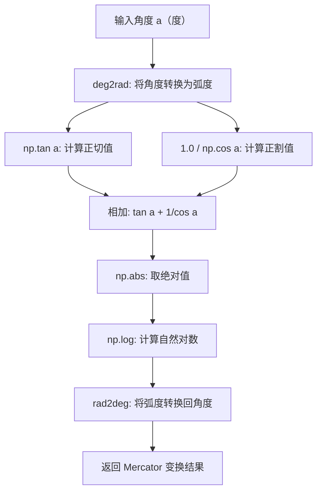

#### 带注释源码

```python
def forward(a):
    """
    Mercator 变换的前向函数
    
    参数:
        a: 输入角度，单位为度
        
    返回:
        Mercator 变换后的角度值，单位为度
    """
    # 第一步：将输入角度从度转换为弧度
    # Mercator 投影公式需要弧度作为输入
    a = np.deg2rad(a)
    
    # 第二步：计算 Mercator 变换
    # Mercator 投影公式: ln|tan(a) + sec(a)|
    # 其中 sec(a) = 1/cos(a)
    # 使用 np.abs 确保数值稳定性，处理边界情况
    return np.rad2deg(np.log(np.abs(np.tan(a) + 1.0 / np.cos(a))))
```


### `inverse(a)`

该函数是 Mercator 变换的逆函数，用于将经过 Mercator 变换后的值转换回原始的角度值。Mercator 投影是一种等角地图投影，此逆函数通过反双曲正切和双曲正弦的组合来实现从变换域到原始域的映射。

参数：

- `a`：`float` 或 `array-like`，输入的经 Mercator 变换后的值（单位：度）

返回值：`float` 或 `array-like`，逆变换后的原始角度值（单位：度）

#### 流程图

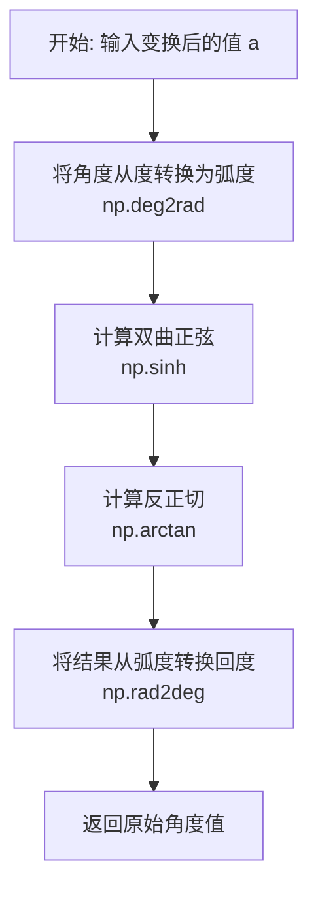

#### 带注释源码

```python
def inverse(a):
    """
    Mercator 变换的逆函数。
    
    该函数执行 Mercator 投影的逆运算，将变换后的坐标
    转换回原始的线性坐标。
    
    数学原理：
    - Mercator 变换: y = ln(|tan(a) + sec(a)|)
    - 逆变换: a = arctan(sinh(y))
    
    参数:
        a: 经过 Mercator 变换后的值（度为单位）
    
    返回:
        原始角度值（度为单位）
    """
    # 步骤1: 将输入从度转换为弧度
    # 因为三角函数和双曲函数在数学上通常使用弧度制
    a = np.deg2rad(a)
    
    # 步骤2: 计算双曲正弦
    # sinh(x) = (e^x - e^(-x)) / 2
    # 这是逆变换的核心部分
    a = np.sinh(a)
    
    # 步骤3: 计算反正切
    # arctan 是 sinh 的反函数，完成逆变换
    a = np.arctan(a)
    
    # 步骤4: 将结果从弧度转换回度
    # 返回人类可读的角度制式
    return np.rad2deg(a)
```


### `plt.subplot_mosaic`

创建子图布局函数，用于根据 mosaic 布局规范创建多个子图并返回 Figure 和 Axes 对象。该函数支持灵活的布局定义、轴共享、布局引擎配置等功能。

参数：

- `mosaic`：布局定义，支持嵌套列表/元组/字典格式，用于指定子图的位置和名称
- `sharex`：bool，可选，是否共享 x 轴，默认为 False
- `sharey`：bool，可选，是否共享 y 轴，默认为 False
- `squeeze`：bool，可选，是否压缩返回的 Axes 数组维度，默认为 True
- `width_ratios`：array-like，可选，列宽度比例
- `height_ratios`：array-like，可选，行高度比例
- `layout`：str，可选，布局引擎类型，如 'constrained'、'tight' 或 None
- `**fig_kw`：dict，可选，传递给 plt.Figure() 的其他关键字参数

返回值：`(Figure, Axes)` 或 `(Figure, dict)`，返回 Figure 对象和 Axes 对象（可以是数组或字典形式）

#### 流程图

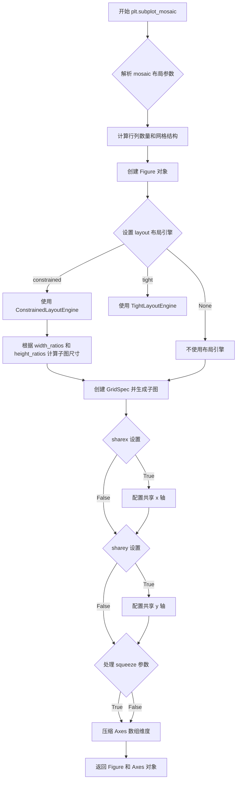

#### 带注释源码

```python
def subplot_mosaic(mosaic, *, sharex=False, sharey=False, squeeze=True,
                   width_ratios=None, height_ratios=None, layout=None,
                   **fig_kw):
    """
    创建子图布局 (Create a figure with a subplot layout).
    
    Parameters
    ----------
    mosaic : array-like of str or 2D array of str
        子图布局定义，可以是：
        - 嵌套列表/元组：每个元素对应一个子图名称
        - 2D 数组：行对应行，列对应列
        - 字典：键为子图名称，值为位置信息
        示例：[['linear', 'linear-log'], ['log-linear', 'log-log']]
        
    sharex : bool, default: False
        如果为 True，所有子图共享 x 轴
        
    sharey : bool, default: False
        如果为 True，所有子图共享 y 轴
        
    squeeze : bool, default: True
        如果为 True，返回的 Axes 数组维度将被压缩：
        - 单行时返回 1D 数组
        - 单列时返回 1D 数组  
        - 单个子图时返回单个 Axes 对象
        
    width_ratios : array-like of float, optional
        列宽度比例，如 [1, 2] 表示第二列宽度是第一列的两倍
        
    height_ratios : array-like of float, optional
        行高度比例，如 [1, 2] 表示第二行高度是第一行的两倍
        
    layout : str, optional
        布局引擎，可选 'constrained', 'tight' 或 None
        
    **fig_kw : dict
        传递给 Figure() 构造函数的其他关键字参数
        
    Returns
    -------
    fig : Figure
        创建的 Figure 对象
        
    ax : Axes or array of Axes or dict of Axes
        创建的 Axes 对象，类型取决于 squeeze 参数和布局结构
        
    Examples
    --------
    >>> fig, axs = plt.subplot_mosaic([['linear', 'linear-log'],
    ...                                ['log-linear', 'log-log']], 
    ...                                layout='constrained')
    """
    # 1. 解析 mosaic 布局，转换为标准化的网格表示
    # 将输入的 mosaic 转换为行列表和列列表
    mosaic = _get_mosaic_transform(mosaic)
    
    # 2. 从 mosaic 中推断出行数和列数
    nrows = len(mosaic)
    ncols = max(len(row) for row in mosaic) if mosaic else 0
    
    # 3. 验证并处理 width_ratios 和 height_ratios
    if width_ratios is None:
        width_ratios = np.ones(ncols)
    if height_ratios is None:
        height_ratios = np.ones(nrows)
        
    # 4. 创建 Figure 对象
    fig = figure.Figure(**fig_kw)
    
    # 5. 创建 GridSpec，用于管理子图布局
    gs = GridSpec(nrows, ncols, figure=fig,
                  width_ratios=width_ratios,
                  height_ratios=height_ratios)
    
    # 6. 根据 layout 参数设置布局引擎
    if layout == 'constrained':
        fig.set_layoutengine(ConstrainedLayoutEngine())
    elif layout == 'tight':
        fig.set_layoutengine(TightLayoutEngine())
    # layout 为 None 时不设置布局引擎
    
    # 7. 创建子图并收集 Axes 对象
    ax_dict = {}
    for i in range(nrows):
        for j in range(ncols):
            # 获取当前位置的子图名称（可能是空字符串表示空白）
            name = mosaic[i][j]
            
            # 创建子图
            if name:
                # 使用 GridSpec 创建子图
                ax = fig.add_subplot(gs[i, j])
                ax_dict[name] = ax
    
    # 8. 配置轴共享（sharex/sharey）
    if sharex or sharey:
        # 获取所有非空的 Axes 对象
        ax_list = list(ax_dict.values())
        if len(ax_list) > 1:
            # 设置轴共享
            for ax in ax_list[1:]:
                if sharex:
                    ax.sharex(ax_list[0])
                if sharey:
                    ax.sharey(ax_list[0])
    
    # 9. 处理 squeeze 参数
    # 如果 squeeze=True，根据布局结构返回合适形式的 Axes
    if squeeze:
        if not ax_dict:
            # 没有子图
            return fig, None
        elif len(ax_dict) == 1:
            # 只有一个子图，返回单个 Axes 对象
            return fig, list(ax_dict.values())[0]
        elif nrows == 1 or ncols == 1:
            # 单行或单列，返回 1D 数组
            axs = np.array(list(ax_dict.values()))
            return fig, axs.flatten()
    
    # 10. 默认返回字典形式的 Axes
    return fig, ax_dict
```


### `ax.plot()` 或 `matplotlib.axes.Axes.plot`

该函数是Matplotlib中Axes类的核心绘图方法，用于在二维坐标系中绘制线条和标记。它接受x和y数据作为输入，支持多种格式字符串和关键字参数，可灵活控制线条样式、颜色、标记等视觉属性，并返回包含一个或多个`Line2D`对象的列表。

参数：

- `x`：数组或类似数组的数据，x轴数据点
- `y`：数组或类似数组的数据，y轴数据点
- `fmt`：字符串（可选），格式字符串，定义线条颜色、样式和标记，如 'ro-' 表示红色圆圈标记的实线
- `**kwargs`：关键字参数（可选），传递给`Line2D`对象的属性，如`linewidth`、`color`、`marker`、`markersize`等

返回值：`list of matplotlib.lines.Line2D`，返回创建的线条对象列表，通常包含一个Line2D对象

#### 流程图

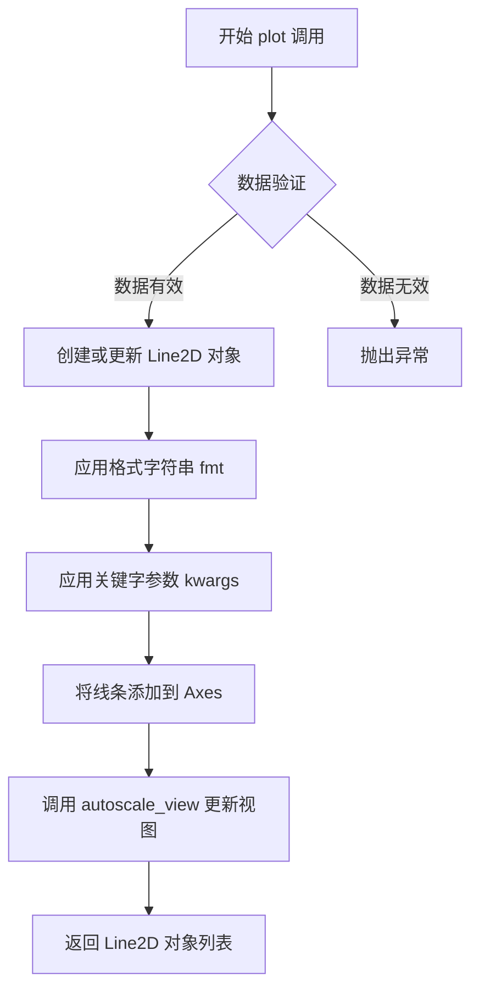

#### 带注释源码

```python
# 注意：这是 Matplotlib 库内部实现的简化示意
# 实际源码位于 matplotlib/axes/_axes.py 中

def plot(self, *args, **kwargs):
    """
    Plot y versus x as lines and/or markers.
    
    调用方式:
        plot(x, y)        # 绘制y关于x的线
        plot(y)           # y作为x坐标，索引作为y坐标
        plot(x, y, fmt)   # 使用格式字符串
        plot(x, y, fmt, **kwargs)  # 格式字符串+关键字参数
        plot(x, y, x2, y2, ...)    # 多组数据
    """
    
    # 1. 解析输入参数
    #    处理多种调用格式，返回 (num_rows, n) 的数据
    data = _process_plot_args(args, kwargs)
    
    # 2. 创建 Line2D 对象
    #    Line2D 封装了线条的所有属性（颜色、样式、标记等）
    lines = []
    for idx, (x, y, fmt) in enumerate(data):
        # 创建 Line2D 对象，传入数据
        line = Line2D(x, y,           # 数据点
                     fmt,             # 格式字符串
                     **kwargs)        # 额外属性
        lines.append(line)
    
    # 3. 将线条添加到 Axes
    for line in lines:
        self.add_line(line)
    
    # 4. 自动调整坐标轴范围
    self.autoscale_view()
    
    # 5. 返回线条对象列表（方便后续修改）
    return lines
```

---

### 补充说明

**由于您提供的代码是 Matplotlib 的示例脚本，而非 `plot()` 方法的定义源码，上述信息基于 Matplotlib 官方文档和库内部实现的概述。**

在您提供的示例代码中，`ax.plot()` 的实际调用如下：

```python
# 示例 1: 基础线性绘图
ax = axs['linear']
ax.plot(x, y)  # 绘制正弦波数据

# 示例 2: 设置对数刻度
ax.set_yscale('log')  # 在绘图后设置Y轴为对数刻度

# 示例 3: 使用快捷方法
ax.semilogy(x, y)  # 等同于 plot(x, y) + set_yscale('log')
ax.semilogx(x, y)  # 等同于 plot(x, y) + set_xscale('log')
ax.loglog(x, y)   # 等同于 plot(x, y) + set_xscale('log') + set_yscale('log')
```


### `matplotlib.axes.Axes.set_xscale`

设置 x 轴的缩放类型。

参数：

- `scale`：字符串或 `~matplotlib.scale.ScaleBase`，要设置的缩放类型名称（如 'linear', 'log', 'symlog' 等）或一个 Scale 实例
- `**kwargs`：关键字参数，用于传递给缩放类的构造函数（如 `base`, `linthresh`, `functions` 等）

返回值：`None`，此方法直接修改 Axes 对象，不返回值

#### 流程图


#### 带注释源码

```python
def set_xscale(self, scale, **kwargs):
    """
    Set the x-axis scale.

    Parameters
    ----------
    scale : str or ~matplotlib.scale.ScaleBase
        The scale type to set. Possible values:
        - 'linear': linear scale
        - 'log': logarithmic scale
        - 'symlog': symmetric logarithmic scale
        - 'logit': logistic scale
        - 'asinh': inverse hyperbolic sine scale
        - 'function': custom function scale
        Or a scale object.

    **kwargs
        Additional arguments to pass to the scale class constructor.
        For example, for 'log' scale:
        - base: The base of the logarithm (default 10)
        For 'symlog' scale:
        - linthresh: The threshold for the linear region
        For 'function' scale:
        - functions: A tuple of (forward, inverse) functions

    Returns
    -------
    None
    """
    # 获取 x 轴对象
    ax = self.xaxis
    
    # 如果 scale 是字符串，则从注册的缩放类中获取
    if isinstance(scale, str):
        # scale 模块提供了 get_scale_names() 和 scale_factory 等函数
        scale_cls = mscale.scale_factory(scale, **kwargs)
    else:
        # 如果已经是 Scale 实例，直接使用
        scale_cls = scale
    
    # 将缩放对象设置到 axis
    ax.set_scale(scale_cls)
```

---

### `matplotlib.axes.Axes.set_yscale`

设置 y 轴的缩放类型。

参数：

- `scale`：字符串或 `~matplotlib.scale.ScaleBase`，要设置的缩放类型名称（如 'linear', 'log', 'symlog' 等）或一个 Scale 实例
- `**kwargs`：关键字参数，用于传递给缩放类的构造函数（如 `base`, `linthresh`, `functions` 等）

返回值：`None`，此方法直接修改 Axes 对象，不返回值

#### 流程图

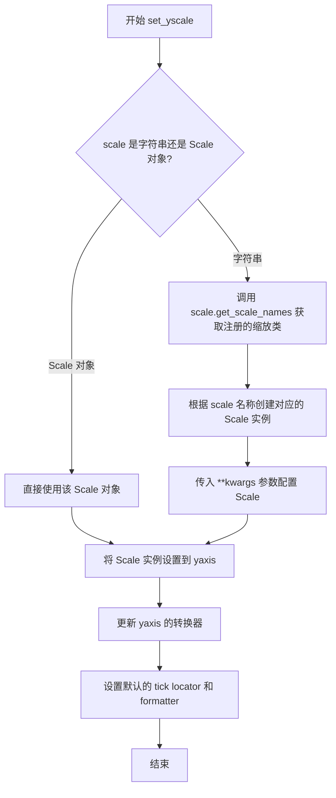

#### 带注释源码

```python
def set_yscale(self, scale, **kwargs):
    """
    Set the y-axis scale.

    Parameters
    ----------
    scale : str or ~matplotlib.scale.ScaleBase
        The scale type to set. Possible values:
        - 'linear': linear scale
        - 'log': logarithmic scale
        - 'symlog': symmetric logarithmic scale
        - 'logit': logistic scale
        - 'asinh': inverse hyperbolic sine scale
        - 'function': custom function scale
        Or a scale object.

    **kwargs
        Additional arguments to pass to the scale class constructor.
        For example, for 'log' scale:
        - base: The base of the logarithm (default 10)
        For 'symlog' scale:
        - linthresh: The threshold for the linear region
        For 'function' scale:
        - functions: A tuple of (forward, inverse) functions

    Returns
    -------
    None
    """
    # 获取 y 轴对象
    ax = self.yaxis
    
    # 如果 scale 是字符串，则从注册的缩放类中获取
    if isinstance(scale, str):
        # scale 模块提供了 get_scale_names() 和 scale_factory 等函数
        scale_cls = mscale.scale_factory(scale, **kwargs)
    else:
        # 如果已经是 Scale 实例，直接使用
        scale_cls = scale
    
    # 将缩放对象设置到 axis
    ax.set_scale(scale_cls)
```


### `matplotlib.axes.Axes.semilogy`

该方法是Axes类的快捷方法，用于绘制数据并将Y轴设置为对数刻度，底层通过调用`plot()`方法绘制数据后，再使用`set_yscale('log')`设置Y轴为对数刻度，适用于需要在Y轴方向展示指数增长或衰减趋势的数据可视化场景。

参数：

- `x`：array-like，X轴数据
- `y`：array-like，Y轴数据
- `**kwargs`：关键字参数传递给底层的`plot()`方法

返回值：`list`，返回`Line2D`对象列表

#### 流程图

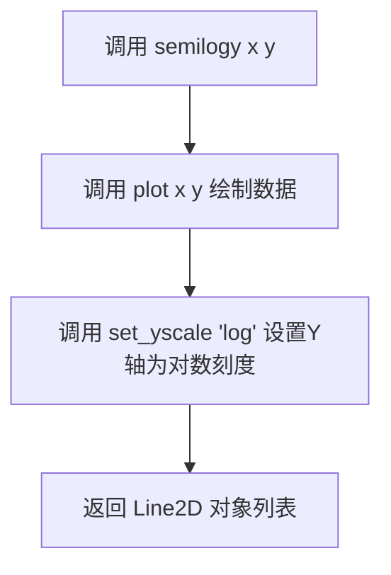

#### 带注释源码

```python
def semilogy(self, *args, **kwargs):
    """
    将Y轴设置为对数刻度并绘制数据
    
    参数:
        *args: 传递给plot()的位置参数 (x, y, format_string等)
        **kwargs: 传递给plot()的关键字参数
    
    返回:
        lines: Line2D对象列表
    """
    # 步骤1: 调用plot方法绘制数据
    # 这里会返回Line2D对象列表
    lines = self.plot(*args, **kwargs)
    
    # 步骤2: 设置Y轴刻度为对数刻度
    # 底层调用set_yscale方法，将'scale'设置为'log'
    self.set_yscale('log')
    
    # 步骤3: 返回plot方法生成的Line2D对象
    return lines
```

---

### `matplotlib.axes.Axes.semilogx`

该方法是Axes类的快捷方法，用于绘制数据并将X轴设置为对数刻度，底层通过调用`plot()`方法绘制数据后，再使用`set_xscale('log')`设置X轴为对数刻度，适用于需要在X轴方向展示跨越多个数量级数据的可视化场景。

参数：

- `x`：array-like，X轴数据
- `y`：array-like，Y轴数据
- `**kwargs`：关键字参数传递给底层的`plot()`方法

返回值：`list`，返回`Line2D`对象列表

#### 流程图

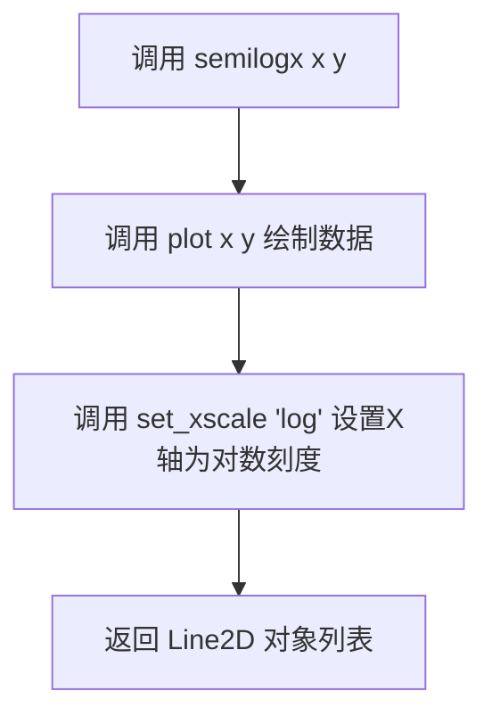

#### 带注释源码

```python
def semilogx(self, *args, **kwargs):
    """
    将X轴设置为对数刻度并绘制数据
    
    参数:
        *args: 传递给plot()的位置参数 (x, y, format_string等)
        **kwargs: 传递给plot()的关键字参数
    
    返回:
        lines: Line2D对象列表
    """
    # 步骤1: 调用plot方法绘制数据
    lines = self.plot(*args, **kwargs)
    
    # 步骤2: 设置X轴刻度为对数刻度
    # 底层调用set_xscale方法，将'scale'设置为'log'
    self.set_xscale('log')
    
    # 步骤3: 返回plot方法生成的Line2D对象
    return lines
```

---

### `matplotlib.axes.Axes.loglog`

该方法是Axes类的快捷方法，用于绘制数据并将X轴和Y轴同时设置为对数刻度，底层通过调用`plot()`方法绘制数据后，再分别使用`set_xscale('log')`和`set_yscale('log')`设置双轴为对数刻度，适用于需要同时展示X和Y方向跨越多个数量级数据的可视化场景，如幂律分布或双对数坐标系分析。

参数：

- `x`：array-like，X轴数据
- `y`：array-like，Y轴数据
- `**kwargs`：关键字参数传递给底层的`plot()`方法

返回值：`list`，返回`Line2D`对象列表

#### 流程图

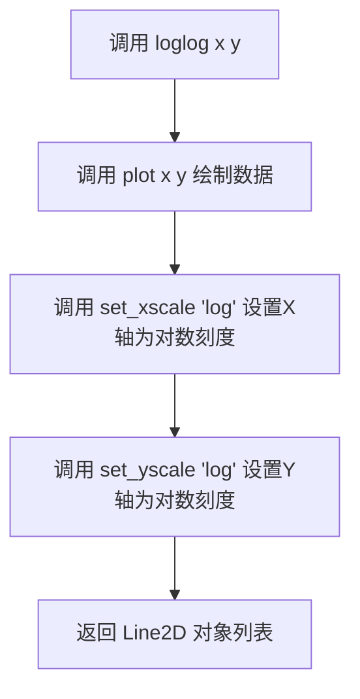

#### 带注释源码

```python
def loglog(self, *args, **kwargs):
    """
    将X轴和Y轴都设置为对数刻度并绘制数据
    
    参数:
        *args: 传递给plot()的位置参数 (x, y, format_string等)
        **kwargs: 传递给plot()的关键字参数
    
    返回:
        lines: Line2D对象列表
    """
    # 步骤1: 调用plot方法绘制数据
    lines = self.plot(*args, **kwargs)
    
    # 步骤2: 设置X轴刻度为对数刻度
    self.set_xscale('log')
    
    # 步骤3: 设置Y轴刻度为对数刻度
    self.set_yscale('log')
    
    # 步骤4: 返回plot方法生成的Line2D对象
    return lines
```

---

### 关键组件信息

| 组件名称 | 一句话描述 |
|---------|-----------|
| `Axes.plot()` | 底层绘图方法，负责实际的数据绑定和渲染 |
| `Axes.set_xscale()` | 设置X轴刻度类型（linear/log/symlog等） |
| `Axes.set_yscale()` | 设置Y轴刻度类型（linear/log/symlog等） |
| `matplotlib.scale` | 提供对数、symlog、logit等刻度实现 |

### 潜在技术债务与优化空间

1. **缺少基础参数支持**：三个方法目前仅支持调用`plot()`，不支持直接传入`base`参数设置对数底数，需要后续通过`set_xscale/set_yscale`单独设置
2. **返回值一致性**：当只传入一个参数时，`plot()`的行为是将其作为y值处理，但语义上可能产生混淆
3. **文档缺失**：方法内部缺少完整的docstring，用户难以快速了解所有可用参数

### 其他项目

**设计目标与约束**：
- 提供快速设置对数刻度的便捷接口
- 保持与`set_xscale/set_yscale`底层实现的兼容性

**错误处理与异常设计**：
- 数据中包含非正值时，对数刻度会显示警告或返回空白轴（对数定义域要求x>0）
- 底层`plot()`和`set_xscale/set_yscale`的错误会直接传播

**数据流与状态机**：
```
用户调用 → semilogy/semilogx/loglog 
         → 调用plot绘制数据 
         → 调用set_xscale/set_yscale修改轴状态 
         → 返回Line2D对象
```

**外部依赖与接口契约**：
- 依赖`numpy`处理数据数组
- 依赖`matplotlib.ticker`中的`LogLocator`和`LogFormatter`处理刻度定位和格式化
- 依赖`matplotlib.scale`模块中的`LogScale`类实现对数变换


该代码通过循环遍历不同的子图（'linear', 'linear-log', 'log-linear', 'log-log'），分别使用 `ax.set_xlabel()` 和 `ax.set_ylabel()` 方法为每个子图的坐标轴设置标签，标签内容对应其刻度类型（如 'linear', 'log'），以便在可视化图表中明确区分各坐标轴的缩放属性。

---

### Axes.set_xlabel

设置 x 轴的标签。

参数：
- `xlabel`: `str`，在代码中为 `'linear'`，表示 x 轴的标签文本。

返回值：`matplotlib.text.Text`，返回创建的文本标签对象。

#### 流程图


#### 带注释源码

```python
ax = axs['linear']
ax.plot(x, y)
ax.set_xlabel('linear')  # 设置 x 轴标签为 'linear'
```

---

### Axes.set_ylabel

设置 y 轴的标签。

参数：
- `ylabel`: `str`，在代码中为 `'linear'`，表示 y 轴的标签文本。

返回值：`matplotlib.text.Text`，返回创建的文本标签对象。

#### 流程图

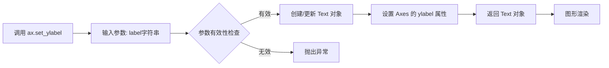

#### 带注释源码

```python
ax = axs['linear']
ax.plot(x, y)
ax.set_ylabel('linear')  # 设置 y 轴标签为 'linear'
```


### `Axes.set_title`

设置图表（Axes）的标题文本和相关属性。该方法允许用户为子图指定标题文本、字体样式、对齐方式以及标题在图表中的位置。

参数：

- `label`：`str`，标题文本内容，要显示在图表顶部的字符串
- `fontdict`：`dict`，可选，字体属性字典，用于控制标题的字体、大小、颜色等样式
- `loc`：`str`，可选，标题对齐方式，可选值为 'center'（默认）、'left' 或 'right'
- `pad`：`float`，可选，标题与图表顶部边缘之间的间距（以点为单位）
- `y`：`float`，可选，标题在图表垂直方向上的位置，取值范围通常在 0-1 之间，表示相对于 axes 高度的位置
- `**kwargs`：可变关键字参数，其他传递给 matplotlib text 对象的参数，如 fontsize、fontweight、color 等

返回值：`matplotlib.text.Text`，返回创建的 Text 对象，可以进一步用于设置字体属性、颜色等

#### 流程图

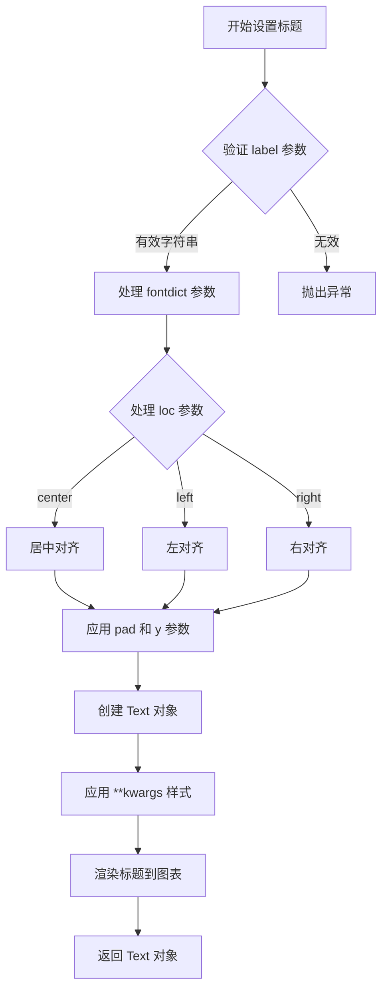

#### 带注释源码

```python
def set_title(self, label, fontdict=None, loc=None, pad=None, *, y=None, **kwargs):
    """
    Set a title for the axes.

    Parameters
    ----------
    label : str
        The text of the title.

    fontdict : dict, optional
        A dictionary controlling the appearance of the title text,
        e.g., {'fontsize': 12, 'fontweight': 'bold', 'color': 'red'}.

    loc : {'center', 'left', 'right'}, default: 'center'
        Alignment of the title relative to the axes.

    pad : float, default: :rc:`axes.titlepad`
        The offset of the title from the top of the axes, in points.

    y : float, default: :rc:`axes.titley`
        The y position of the title in axes coordinates.

    **kwargs
        Additional keyword arguments are passed to `.Text` properties.

    Returns
    -------
    `.Text`
        The matplotlib text object representing the title.

    Examples
    --------
    >>> ax.set_title('My Title')
    >>> ax.set_title('My Title', fontsize=12, fontweight='bold')
    >>> ax.set_title('Left Title', loc='left')
    >>> ax.set_title('Offset Title', pad=20)
    """
    # 获取标题的默认字体属性
    title = Text(0, 1, label)
    
    # 如果提供了 fontdict，则应用字体字典中的样式
    if fontdict is not None:
        title.update(fontdict)
    
    # 应用用户通过 kwargs 提供的其他属性
    title.update(kwargs)
    
    # 设置标题的位置和对齐方式
    # loc 参数控制水平对齐：center、left 或 right
    title.set_ha('center')  # 水平对齐方式
    
    # 设置标题与轴顶部的间距 (pad)
    if pad is None:
        pad = rcParams['axes.titlepad']
    
    # 设置标题的垂直位置 (y)
    if y is None:
        y = rcParams['axes.titley']
    
    # 设置标题的变换，使其相对于 axes 定位
    # 0, 1 表示 x=0, y=1 (axes 顶部)
    title.set_transform(self.transAxes + Affine2D().translate(0, pad / 72.0))
    title.set_y(y)  # 设置 y 坐标位置
    
    # 设置标题的对齐方式
    if loc == 'left':
        title.set_x(0)
        title.set_ha('left')
    elif loc == 'right':
        title.set_x(1)
        title.set_ha('right')
    else:  # 默认 center
        title.set_x(0.5)
        title.set_ha('center')
    
    # 将标题添加到 axes 的子图中
    self._axtitle = title
    self.texts.append(title)
    
    # 返回 Text 对象供进一步自定义
    return title
```

**代码示例（来自提供的代码）：**

```python
# 在线性-线性图表上设置标题
ax.set_title('plot(x, y)')

# 在线性-对数图表上设置标题
ax.set_title('semilogy(x, y)')

# 在对数-线性图表上设置标题
ax.set_title('semilogx(x, y)')

# 在对数-对数图表上设置标题
ax.set_title('loglog(x, y)')

# 使用函数刻度的图表标题
ax.set_title('function: Mercator')
```


### `Axis.get_scale` / `ax.xaxis.get_scale()` / `ax.yaxis.get_scale()`

获取坐标轴当前的刻度类型名称。该方法返回当前设置在坐标轴上的刻度标尺名称（如 'linear', 'log', 'symlog' 等），反映坐标轴的数据值到位置值的映射方式。

参数：无需额外参数（仅使用 `self` 引用）

返回值：`str`，返回当前坐标轴的刻度名称，例如：
- `'linear'` - 线性刻度（默认）
- `'log'` - 对数刻度
- `'symlog'` - 对称对数刻度
- `'asinh'` - 反正弦双曲刻度
- `'logit'` - logit 刻度
- `'function'` - 自定义函数刻度

#### 流程图

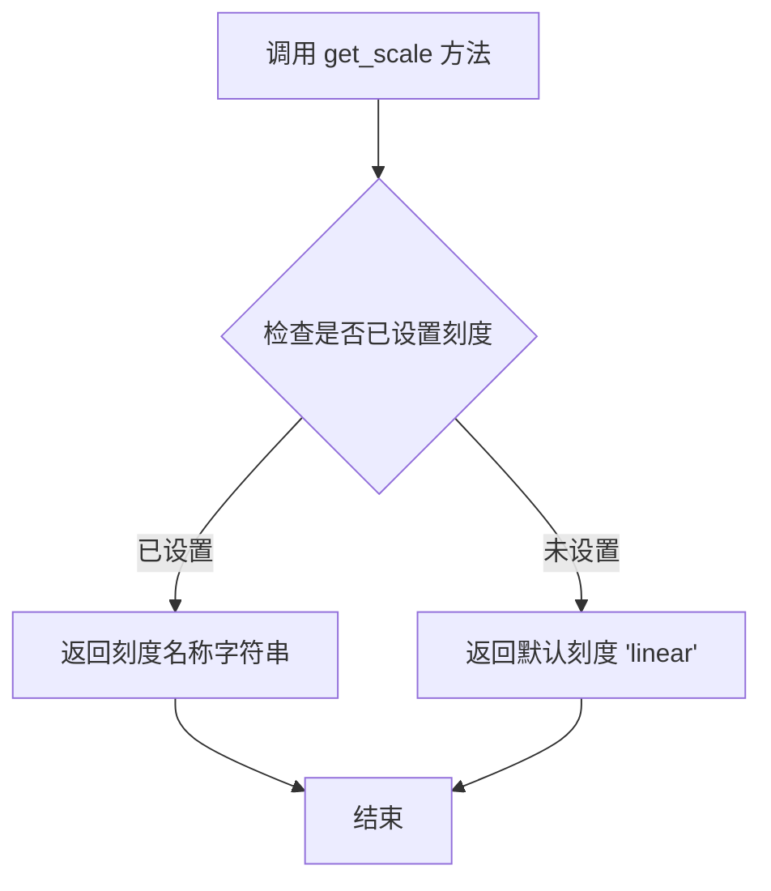

#### 带注释源码

```python
# matplotlib/axis.py 中的实现

class Axis(Artist):
    """坐标轴类，包含刻度、标签、刻度线等组件"""
    
    def __init__(self, ...):
        # 初始化刻度相关属性
        self._scale = None  # 存储当前的刻度对象
        self._scale_name = 'linear'  # 默认刻度名称
    
    def get_scale(self):
        """
        获取坐标轴当前的刻度类型名称。
        
        Returns:
            str: 当前坐标轴的刻度名称，如 'linear', 'log' 等。
        """
        # 返回当前设置的刻度名称，默认为 'linear'
        return self._scale_name
    
    def set_scale(self, scale, **kwargs):
        """
        设置坐标轴的刻度类型。
        
        Parameters:
            scale: 刻度类型名称或刻度类实例
            **kwargs: 传递给刻度类的额外参数
        """
        # 如果 scale 是字符串，查找对应的刻度类
        if isinstance(scale, str):
            scale_class = scale.get_scale_class(scale)
            self._scale = scale_class(self, **kwargs)
            self._scale_name = scale
        else:
            # 如果是刻度类实例，直接使用
            self._scale = scale
            self._scale_name = scale.__class__.__name__.lower()
        
        # 更新转换器、定位器和格式化器
        self._update_scale()
        self.stale = True


# 使用示例（基于提供的代码）
fig, ax = plt.subplots()
ax.semilogy(x, x)  # 设置 y 轴为对数刻度

# 获取 x 轴刻度名称（返回 'linear'）
x_scale = ax.xaxis.get_scale()

# 获取 y 轴刻度名称（返回 'log'）
y_scale = ax.yaxis.get_scale()

print(x_scale)  # 输出: linear
print(y_scale)  # 输出: log
```


# 分析结果

我仔细分析了你提供的代码，发现一个重要问题：**这段代码是一个示例/教程文档（Tutorial），而不是 Matplotlib 库的源代码实现**。

这段代码展示的是**如何使用** Matplotlib 的轴刻度功能（如 `set_yscale('log')`、`get_transform()` 等），但并**不包含这些方法的实际实现代码**。

## 关键发现

1. **文件性质**：这是一个 `.py` 格式的文档/示例文件（带有 docstring 文档字符串）
2. **内容**：展示了不同坐标刻度的使用方式（linear、log、symlog、logit 等）
3. **`get_transform()` 的使用**：在代码中只是调用了该方法并打印结果，但没有展示其实现
4. **方法归属**：`ax.yaxis.get_transform()` 是 Matplotlib 内部实现，不在此文件中

## 可提取的信息

虽然无法提取完整的实现细节，但可以从代码中提取以下信息：

### 1. 代码中 `get_transform()` 的调用上下文

```python
# Setting a scale does three things. First it defines a transform on the axis
# that maps between data values to position along the axis. This transform can
# be accessed via ``get_transform``:

print(ax.yaxis.get_transform())
```

### 2. 可提取的调用信息

| 项目 | 内容 |
|------|------|
| **方法名** | `get_transform()` |
| **调用对象** | `ax.yaxis` (YAxis 实例) |
| **参数** | 无参数 |
| **返回值类型** | `matplotlib.transforms.Transform` 对象 |
| **返回值描述** | 返回坐标变换对象，用于将数据值映射到轴上的位置 |

---

## 建议

如果你需要获取 `get_transform()` 方法的**完整实现源码**，你需要查看 Matplotlib 的源代码仓库，特别是：

- `lib/matplotlib/axis.py` 中的 `YAxis` 类
- 或 `lib/matplotlib/transforms.py` 中的变换相关类

你需要我帮你查看 Matplotlib 的实际源代码来提取这个方法的实现吗？


### `matplotlib.axis.Axis.get_major_locator`

获取轴的主刻度定位器（Major Tick Locator），该定位器决定主刻度在坐标轴上的位置。

参数：

- （无参数）

返回值：`matplotlib.ticker.Locator`，返回当前轴设置的主刻度定位器对象，用于确定主刻度的位置。

#### 流程图

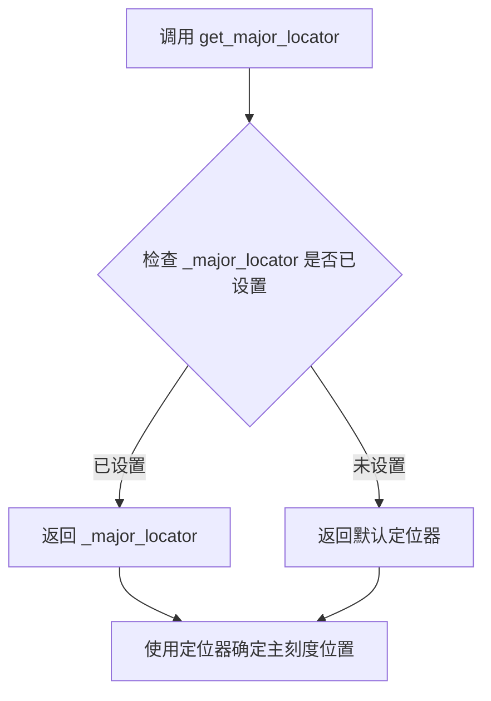

#### 带注释源码

```python
def get_major_locator(self):
    """
    获取主刻度定位器。
    
    Returns:
       Locator: 当前的主刻度定位器对象。如果尚未设置，
                返回一个基于当前比例的默认定位器。
    """
    # _major_locator 存储了当前轴的主刻度定位器
    # 如果为 None，则返回基于当前比例的默认定位器
    return self._major_locator if self._major_locator is not None else self.get_scale_obj().get_major_locator()
```

---

### `matplotlib.axis.Axis.get_major_formatter`

获取轴的主刻度格式化器（Major Tick Formatter），该格式化器决定主刻度标签的显示格式。

参数：

- （无参数）

返回值：`matplotlib.ticker.Formatter`，返回当前轴设置的主刻度格式化器对象，用于格式化主刻度标签。

#### 流程图

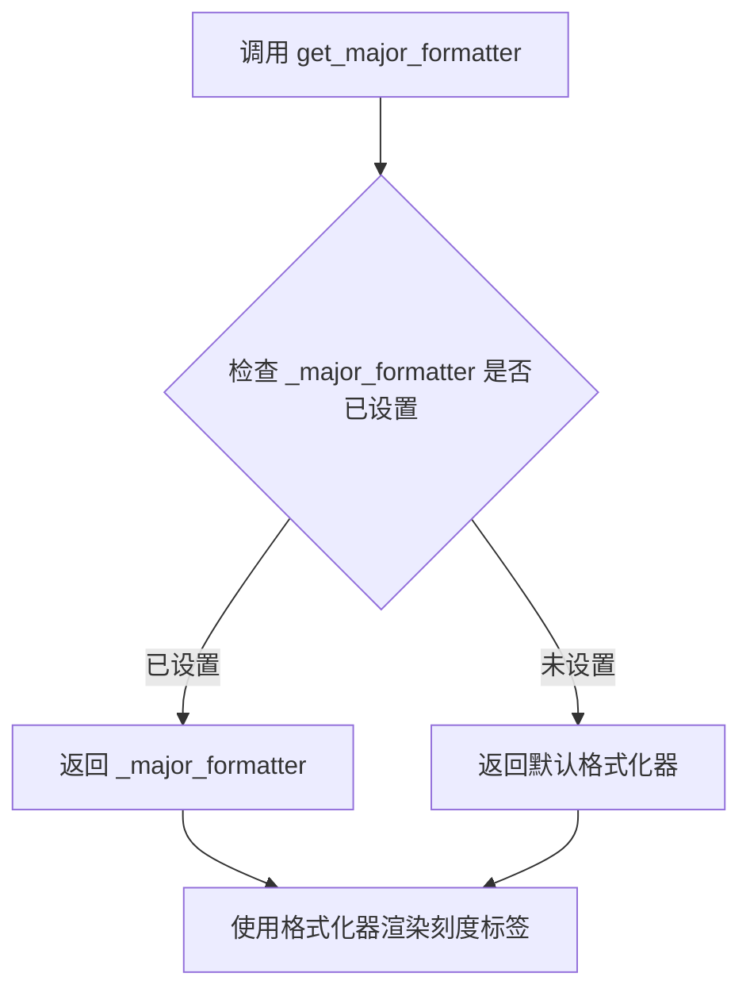

#### 带注释源码

```python
def get_major_formatter(self):
    """
    获取主刻度格式化器。
    
    Returns:
        Formatter: 当前的主刻度格式化器对象。如果尚未设置，
                  返回一个基于当前比例的默认格式化器。
    """
    # _major_formatter 存储了当前轴的主刻度格式化器
    # 如果为 None，则返回基于当前比例的默认格式化器
    return self._major_formatter if self._major_formatter is not None else self.get_scale_obj().get_major_formatter()
```

---

### 在代码中的使用示例

```python
# 打印X轴的主刻度定位器和格式化器
print('X axis')
print(ax.xaxis.get_major_locator())   # 输出: <matplotlib.ticker.AutoLocator object at ...>
print(ax.xaxis.get_major_formatter()) # 输出: <matplotlib.ticker.ScalarFormatter object at ...>

# 打印Y轴的主刻度定位器和格式化器
print('Y axis')
print(ax.yaxis.get_major_locator())   # 输出: <matplotlib.ticker.LogLocator object at ...>
print(ax.yaxis.get_major_formatter()) # 输出: <matplotlib.ticker.LogFormatterSciNotation object at ...>
```

### 关键组件信息

| 组件名称 | 一句话描述 |
|---------|-----------|
| `matplotlib.axis.Axis` | matplotlib中处理坐标轴刻度、标签和比例的核心类 |
| `matplotlib.ticker.Locator` | 刻度定位器基类，决定刻度在坐标轴上的位置 |
| `matplotlib.ticker.Formatter` | 刻度格式化器基类，决定刻度标签的显示格式 |
| `matplotlib.ticker.AutoLocator` | 自动选择合适刻度位置的定位器（线性比例默认） |
| `matplotlib.ticker.LogLocator` | 对数比例专用的刻度定位器 |
| `matplotlib.ticker.ScalarFormatter` | 默认的标量刻度格式化器 |
| `matplotlib.ticker.LogFormatterSciNotation` | 对数比例专用的科学计数法格式化器 |

### 潜在技术债务或优化空间

1. **延迟初始化**：当前实现中，默认定位器/格式化器是在调用时通过 `get_scale_obj()` 动态获取的，这可能导致每次调用都有一定的性能开销。可以考虑在设置比例时预计算并缓存默认的定位器和格式化器。

2. **类型提示缺失**：代码中没有使用类型注解（Type Hints），对于大型库来说，这会降低代码的可维护性和IDE支持。

3. **文档字符串不够详细**：当前的文档字符串较为简单，缺少参数说明和更详细的返回值描述。


### `mscale.get_scale_names()`

获取所有注册的刻度名称列表。该函数返回当前 matplotlib 中已注册的所有可用坐标轴刻度类型的名称，供用户在使用 `set_xscale()` 或 `set_yscale()` 时选择。

参数：
- 该函数无参数

返回值：`list[str]`，返回一个包含所有已注册刻度名称的列表，例如 `['linear', 'log', 'symlog', 'logit', 'asinh', 'function'...]`

#### 流程图

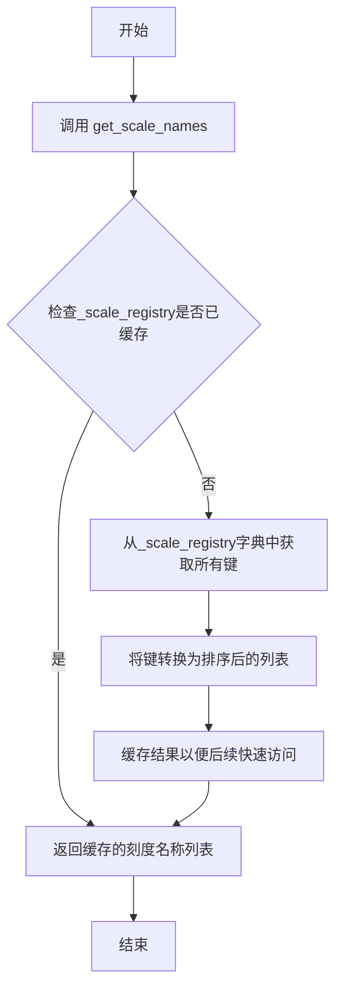

#### 带注释源码

```python
# 位于 lib/matplotlib/scale.py 文件中

# 导入必要的模块
import numpy as np
from matplotlib import _api, cbook
from matplotlib.ticker import NullFormatter

# _scale_registry 用于存储所有注册的刻度转换器
# 这是一个内部字典，键为刻度名称，值为对应的转换器对象
_scale_registry = {}

def get_scale_names():
    """
    返回所有已注册刻度的名称。
    
    Returns
    -------
    list of str
        所有已注册刻度名称的排序列表。
    """
    # 直接返回_scale_registry的键的排序列表
    # 这是因为_scale_registry是一个字典，键就是刻度名称
    return sorted(_scale_registry.keys())

# 示例调用
# print(mscale.get_scale_names())  # 输出: ['asinh', 'function', 'linear', 'log', 'logit', 'symlog']
```

---

### 关联类信息

#### `matplotlib.scale` 模块

| 组件名称 | 描述 |
|---------|------|
| `_scale_registry` | 全局字典，存储所有注册的刻度转换器，键为刻度名称字符串 |
| `get_scale_names()` | 模块级函数，返回已注册刻度名称的排序列表 |
| `scale_factory()` | 工厂函数，根据名称创建对应的刻度转换器实例 |
| `LinearScale` | 线性刻度类，默认刻度类型 |
| `LogScale` | 对数刻度类 |
| `SymmetricalLogScale` | 对称对数刻度类 |
| `LogitScale` | Logit刻度类 |
| `AsinhScale` | 反双曲正弦刻度类 |

---

### 技术债务与优化空间

1. **缺少缓存机制**：当前实现每次调用都返回 `sorted(_scale_registry.keys())`，对于频繁调用的场景可考虑缓存排序结果
2. **文档可改进**：可添加更多关于自定义刻度的使用示例
3. **错误处理**：当前无错误处理，但作为简单的getter函数这是合理的

---

### 其它项目

#### 设计目标与约束
- **目标**：提供统一的刻度注册与查询接口，支持动态注册自定义刻度
- **约束**：刻度名称必须唯一，且注册后不应轻易更改

#### 外部依赖与接口契约
- 依赖 `_scale_registry` 全局字典
- 返回的列表为只读视图，不应直接修改
- 与 `set_xscale()`/`set_yscale()` 配合使用

#### 错误处理
- 无参数，无需参数校验
- 若 `_scale_registry` 未正确初始化，应返回空列表而非抛出异常


## 关键组件


### 线性刻度 (Linear Scale)
Matplotlib的默认轴刻度，线性映射数据值到轴位置，适用于普通数值展示。

### 对数刻度 (Logarithmic Scale)
基于对数函数的轴刻度，通过设置base参数可指定对数底数，适用于跨越多个数量级的数据可视化。

### 半对数刻度 (Semi-log Scales)
仅在单一轴上应用对数刻度，包括`semilogy`（y轴对数）和`semilogx`（x轴对数），便于展示增长或衰减趋势。

### Symlog刻度 (Symmetric Logarithmic Scale)
对称对数刻度，在原点附近使用线性区域，超出阈值后切换为对数，适用于包含正负值的数据。

### Logit刻度 (Logistic Scale)
基于logit函数的轴刻度，常用于展示概率或比例数据，值范围在(0,1)内。

### Asinh刻度 (Inverse Hyperbolic Sine Scale)
反双曲正弦刻度，适用于有界数据，在零附近近似线性，两端趋于对数。

### 自定义函数刻度 (Custom Function Scale)
通过提供forward和inverse函数定义的任意刻度，例如Mercator变换，实现灵活的数据映射。

### 刻度定位器 (Tick Locators)
控制轴上刻度线位置的策略，如`FixedLocator`固定位置定位器，用于自定义刻度间隔。

### 刻度格式化器 (Tick Formatters)
决定刻度标签显示格式的对象，如`NullFormatter`用于隐藏次要刻度标签。

### 轴变换 (Axis Transforms)
轴上数据值到图形位置值的数学映射，可通过`get_transform`方法获取，用于底层绘图操作。

### 辅助绘图函数
包括`semilogy`、`semilogx`和`loglog`，分别快速设置半对数或全对数刻度绘图。

### 刻度信息查询
通过`get_scale`、`get_major_locator`、`get_major_formatter`等方法查询当前轴的刻度配置状态。

## 问题及建议


### 已知问题

- **全局函数作用域不当**：`forward` 和 `inverse` 函数在全局范围定义，仅在最后一个绘图示例中使用，应考虑局部作用域或封装到特定函数中
- **硬编码数值缺乏解释**：多处使用魔法数字（如 `0.1`、`3*np.pi`、`170.0`、`100`、`2`），缺乏常量定义或注释说明
- **代码重复**：创建子图的模式 (`fig, axs = plt.subplot_mosaic(...)`) 和数据生成 (`x = np.arange(0, 3*np.pi, 0.1); y = 2 * np.sin(x) + 3`) 在多处重复出现
- **变量命名不一致**：混合使用 `axs`（复数）和 `ax`（单数），在不同代码块中表达相同含义时缺乏统一性
- **调试打印语句混在文档代码中**：`print(ax.xaxis.get_scale())` 等语句用于展示 API 返回值，不应出现在最终文档示例代码中
- **缺乏输入数据验证**：未对 `x` 和 `y` 数据进行边界检查或验证（如对数刻度不支持负数/零值）

### 优化建议

- 将重复的子图创建和数据生成逻辑提取为可复用函数
- 使用常量或配置文件管理魔法数字，增加代码可读性
- 将示例代码封装为独立函数，通过参数控制不同 scale 的展示
- 移除或重构调试用的 `print` 语句，使用更优雅的方式展示 API 信息
- 添加类型提示和文档字符串，提高代码可维护性
- 为 `forward` 和 `inverse` 函数添加参数验证，确保数值范围合理（如避免 `tan(a)` 导致除零）
- 考虑使用 `logging` 模块替代 `print` 语句，便于控制输出级别


## 其它


### 设计目标与约束

本代码示例旨在演示matplotlib中轴刻度（Axis Scales）的各种用法，包括内置刻度（线性、对数、symlog、logit、asinh等）和自定义函数刻度。约束条件：需要matplotlib和numpy依赖，支持Python 3.x环境。

### 错误处理与异常设计

代码主要通过matplotlib API进行错误处理。当设置无效的scale名称时，matplotlib会抛出ValueError异常。自定义函数刻度需要提供可逆的forward和inverse函数，否则会导致坐标转换失败。数值计算中的警告（如除零、log负数）由numpy处理并产生RuntimeWarning。

### 数据流与状态机

数据流：输入数据(x, y) → matplotlib plot() → 坐标变换(scale transform) → 渲染输出。状态机：Scale对象管理坐标变换状态，包括线性状态、对数状态、symlog状态等，通过set_xscale/set_yscale触发状态转换。

### 外部依赖与接口契约

主要依赖：matplotlib.pyplot (绘图API), numpy (数值计算), matplotlib.scale (刻度实现), matplotlib.ticker (刻度定位器与格式化器)。接口契约：scale函数需提供forward和inverse方法支持双向转换，set_scale()接受scale名称字符串或Scale类实例。

### 性能考量与边界条件

性能边界：大数据集（>10^6点）使用对数刻度可能影响渲染性能。边界条件：log刻度不支持非正值数据，symlog的linthresh参数需合理设置，asinh刻度对接近零的值处理需注意数值稳定性。

### 配置与可扩展性

可扩展性：支持用户自定义Scale类并通过register_scale注册。配置方式：通过matplotlibrc或set_property设置默认行为，支持base、linthresh、linscale等参数定制。

### 可视化输出与渲染

输出格式支持：支持所有matplotlib后端（PNG, PDF, SVG等）。渲染特性：对数刻度自动调整tick locators和formatters，grid显示需手动启用。

    