# `matplotlib\galleries\users_explain\axes\axes_units.py` 详细设计文档

这是一个Matplotlib官方文档示例代码，演示了如何使用Matplotlib绑制日期数据和字符串类别数据，包括日期转换器、类别转换器、自定义刻度定位器和格式化器的使用方法，以及如何查询轴上的转换器和格式化器信息。

## 整体流程

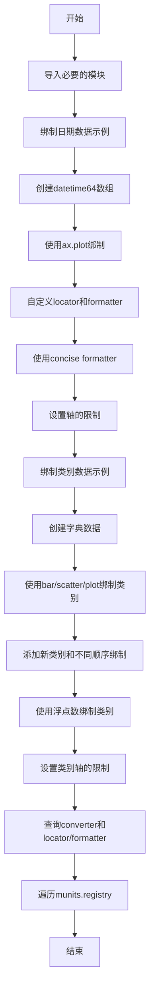
```mermaid
graph TD
    A[开始] --> B[导入必要的模块]
B --> C[绑制日期数据示例]
C --> D[创建datetime64数组]
D --> E[使用ax.plot绑制]
E --> F[自定义locator和formatter]
F --> G[使用concise formatter]
G --> H[设置轴的限制]
H --> I[绑制类别数据示例]
I --> J[创建字典数据]
J --> K[使用bar/scatter/plot绑制类别]
K --> L[添加新类别和不同顺序绑制]
L --> M[使用浮点数绑制类别]
M --> N[设置类别轴的限制]
N --> O[查询converter和locator/formatter]
O --> P[遍历munits.registry]
P --> Q[结束]
```

## 类结构

```
Python脚本 (非面向对象)
├── 导入模块部分
│   ├── numpy (np)
│   ├── matplotlib.dates (mdates)
│   ├── matplotlib.units (munits)
│   └── matplotlib.pyplot (plt)
├── 日期数据绑制示例
│   ├── 基本日期绑图
│   ├── 浮点数作为日期
│   ├── 自定义locator和formatter
│   ├── concise formatter
│   └── 设置轴限制
└── 类别数据绑制示例
    ├── 柱状图、散点图、折线图
    ├── 不同顺序绑制
    ├── 浮点数映射
    ├── 设置类别轴限制
    └── 查询converter和locator/formatter
```

## 全局变量及字段


### `fig`
    
绑图窗口，Matplotlib的图形对象

类型：`matplotlib.figure.Figure`
    


### `ax`
    
绑图区域，单个子图的坐标轴对象

类型：`matplotlib.axes.Axes`
    


### `axs`
    
Axes数组，多个子图的坐标轴对象集合

类型：`numpy.ndarray`
    


### `time`
    
datetime64类型的时间数组，用于表示日期数据

类型：`numpy.ndarray`
    


### `x`
    
整数数组，用于绑制图形的数据点

类型：`numpy.ndarray`
    


### `data`
    
类别数据字典，存储水果名称与数值的映射关系

类型：`dict`
    


### `names`
    
类别名称列表，从字典中提取的键

类型：`list`
    


### `values`
    
类别值列表，从字典中提取的值

类型：`list`
    


### `k`
    
registry中的键，表示数据类型

类型：`type`
    


### `v`
    
registry中的值，表示数据转换器对象

类型：`object`
    


### `label`
    
用于显示信息的字符串，包含坐标轴的转换器、定位器和格式化器信息

类型：`str`
    


### `args`
    
用于文本样式的参数字典，包含旋转角度、颜色和边框样式

类型：`dict`
    


    

## 全局函数及方法


### `plt.subplots`

`plt.subplots`是Matplotlib库中的一个高级函数，用于创建一个新的图形（Figure）以及一个或多个子图（Axes）。它封装了Figure创建、Axes布局和Axes对象返回的整个过程，是进行多子图绑制时的首选方法。

参数：

- `nrows`：`int`，行数，指定子图网格的行数（可选，默认为1）
- `ncols`：`int`，列数，指定子图网格的列数（可选，默认为1）
- `figsize`：`tuple` of `(float, float)`，图形尺寸，以英寸为单位的宽度和高度（例如`(5.4, 2)`）
- `sharex`：`bool` or `str`，是否共享x轴，可选`'row'`、`'col'`、`'all'`或`True`（可选，默认为`False`）
- `sharey`：`bool` or `str`，是否共享y轴，可选`'row'`、`'col'`、`'all'`或`True`（可选，默认为`False`）
- `squeeze`：`bool`，是否压缩返回的Axes数组维度（可选，默认为`True`）
- `width_ratios`：`array-like`，子图宽度比例（可选）
- `height_ratios`：`array-like`，子图高度比例（可选）
- `layout`：`str` or `LayoutType`，子图布局管理器，可选`'constrained'`、`'tight'`或`matplotlib.layout_engine.LayoutEngine`（可选）
- `**kwargs`：其他关键字参数，将传递给`Figure.subplots`方法

返回值：`tuple`，返回`(fig, ax)`或`(fig, axs)`元组，其中`fig`是`matplotlib.figure.Figure`对象，`ax`是`matplotlib.axes.Axes`对象或`numpy.ndarray`数组

#### 流程图

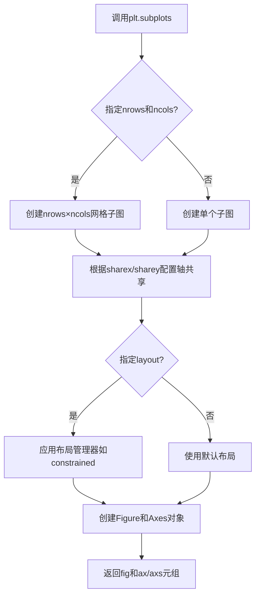
```mermaid
flowchart TD
    A[调用plt.subplots] --> B{指定nrows和ncols?}
    B -->|是| C[创建nrows×ncols网格子图]
    B -->|否| D[创建单个子图]
    C --> E[根据sharex/sharey配置轴共享]
    D --> E
    E --> F{指定layout?}
    F -->|是| G[应用布局管理器如constrained]
    F -->|否| H[使用默认布局]
    G --> I
    H --> I[创建Figure和Axes对象]
    I --> J[返回fig和ax/axs元组]
```

#### 带注释源码

```python
# 导入matplotlib.pyplot模块
import matplotlib.pyplot as plt

# 示例1: 创建单个子图，指定图形尺寸和constrained布局
fig, ax = plt.subplots(figsize=(5.4, 2), layout='constrained')
# 返回: fig - Figure对象, ax - Axes对象
# 说明: 创建一个5.4英寸宽、2英寸高的图形，使用constrained布局管理器

# 示例2: 创建2行1列的子图网格
fig, axs = plt.subplots(2, 1, figsize=(5.4, 3), layout='constrained')
# 返回: fig - Figure对象, axs - 2×1的Axes数组
# 说明: 创建两个垂直排列的子图，共享x轴（通过axs.flat遍历）

# 示例3: 创建1行3列的子图，共享y轴
fig, axs = plt.subplots(1, 3, figsize=(7, 3), sharey=True, layout='constrained')
# 返回: fig - Figure对象, axs - 1×3的Axes数组
# 说明: 创建三个水平排列的子图，共享y轴

# 示例4: 创建2行1列带宽高比例的子图
fig, axs = plt.subplots(2, 1, figsize=(5, 5), layout='constrained')
# 返回: fig - Figure对象, axs - 2×1的Axes数组
# 说明: 创建两个垂直排列的子图，图形尺寸为5×5英寸
```


### np.arange

用于创建数值数组或日期/时间数组的函数，根据输入的起始值、结束值、步长和数据类型生成连续的数组。

参数：
- `start`：起始值，可以是数字、日期字符串或类似类型，描述为序列的起始值，默认为0。
- `stop`：结束值，可以是数字、日期字符串或类似类型，描述为序列的结束值（不包含该值）。
- `step`：数字，可选，步长，描述为序列中相邻值之间的差值，默认为1。
- `dtype`：数据类型，可选，描述为输出数组的类型，默认为None（根据输入自动推断）。

返回值：`ndarray`，返回一个连续数组。

#### 流程图

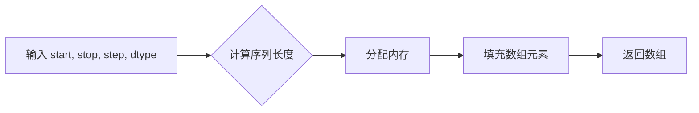
```mermaid
graph LR
    A[输入 start, stop, step, dtype] --> B{计算序列长度}
    B --> C[分配内存]
    C --> D[填充数组元素]
    D --> E[返回数组]
```

#### 带注释源码

```python
# 示例：创建日期数组
# 用于创建从1980-01-01到1980-06-25的日期数组，步长为1天
time = np.arange('1980-01-01', '1980-06-25', dtype='datetime64[D]')
# start: '1980-01-01'，起始日期
# stop: '1980-06-25'，结束日期（不包含）
# dtype: 'datetime64[D]'，日期类型，精度为天

# 示例：创建数值数组
# 用于创建从0到len(time)-1的整数数组
x = np.arange(len(time))
# start: 默认为0
# stop: len(time)，即数组长度
# step: 默认为1
# dtype: 默认为None，自动推断为整数类型
```


### `np.arange`

该函数是 NumPy 库中的一个函数，用于生成一个指定范围内的数组。在给定的代码中，虽然多次调用了 `np.arange`，但并未定义该函数。以下信息基于 NumPy 库中的标准定义和代码中的实际调用情况。

注意：给定的代码是一个 Matplotlib 示例，用于展示日期和字符串的绘制方法，其中使用了 `np.arange` 来生成测试数据，但并未包含 `np.arange` 的实现源码。因此，以下源码部分为 `np.arange` 的典型使用示例。

#### 参数

- `start`：任意类型（可选），起始值。若不提供，则从 0 开始。
- `stop`：任意类型（必需），结束值（不包含）。
- `step`：任意类型（可选），步长。默认为 1。
- `dtype`：dtype（可选），输出数组的数据类型。若未指定，则根据 start、stop 和 step 自动推断。

#### 返回值

- `ndarray`，一个包含给定范围内数值的数组。

#### 流程图

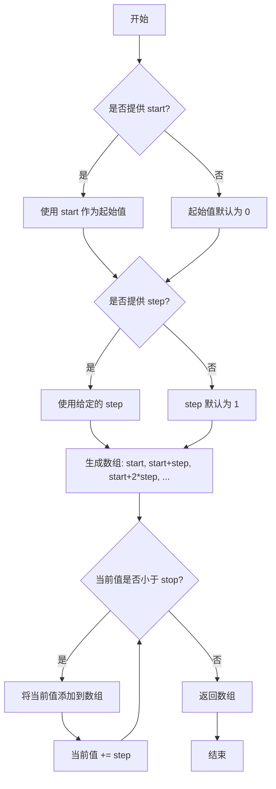
```mermaid
graph TD
    A[开始] --> B{是否提供 start?}
    B -- 是 --> C[使用 start 作为起始值]
    B -- 否 --> D[起始值默认为 0]
    C --> E{是否提供 step?}
    D --> E
    E -- 是 --> F[使用给定的 step]
    E -- 否 --> G[step 默认为 1]
    F --> H[生成数组: start, start+step, start+2*step, ...]
    G --> H
    H --> I{当前值是否小于 stop?}
    I -- 是 --> J[将当前值添加到数组]
    J --> K[当前值 += step]
    K --> I
    I -- 否 --> L[返回数组]
    L --> M[结束]
```

#### 带注释源码

在给定的代码中，`np.arange` 的使用示例如下：

```python
# 示例 1: 创建日期范围数组
# start='1980-01-01', stop='1980-06-25', dtype='datetime64[D]'
time = np.arange('1980-01-01', '1980-06-25', dtype='datetime64[D]')

# 示例 2: 创建整数范围数组
# stop=len(time)，即根据 time 数组的长度生成 0 到 len(time)-1 的整数
x = np.arange(len(time))

# 示例 3: 创建 0 到 99 的整数数组
x = np.arange(100)
```

下面是 `np.arange` 在 NumPy 库中的典型实现逻辑（简化版）：

```python
def arange(start=0, stop=None, step=1, dtype=None):
    """
    在给定间隔内返回均匀间隔的值。
    
    参数:
        start: 间隔开始。默认值为 0。
        stop: 间隔结束（不包含）。
        step: 值之间的间距。默认值为 1。
        dtype: 输出数组的类型。若未指定，则从输入参数推断。
        
    返回值:
        ndarray: 均匀间隔的值数组。
    """
    # 如果只提供了一个参数，则将其视为 stop，start 设为 0
    if stop is None:
        start, stop = 0, start
    
    # 长度计算公式: ceil((stop - start) / step)
    # 根据 start, stop, step 生成数组
    # ...
```

#### 代码中的使用分析

在提供的 Matplotlib 示例代码中，`np.arange` 主要用于生成测试数据：

1. **日期范围生成**：`time = np.arange('1980-01-01', '1980-06-25', dtype='datetime64[D]')` 生成了一个从 1980 年 1 月 1 日到 1980 年 6 月 25 日的日期数组，步长为 1 天。

2. **整数索引生成**：`x = np.arange(len(time))` 生成了一个从 0 到 `len(time)-1` 的整数数组，通常用于绑定 x 轴数据。

3. **简单整数范围**：`x = np.arange(100)` 生成了一个包含 0 到 99 的整数数组。

这些用法展示了 `np.arange` 在数据准备阶段的重要作用，特别是在需要生成连续的日期或数值序列时。


### `np.datetime64`

创建numpy.datetime64类型的数据，用于表示日期时间。numpy.datetime64是NumPy中用于处理日期时间数据的核心类型，支持多种时间单位（如天、秒、毫秒等），是Matplotlib绘制日期坐标轴的基础数据格式。

参数：

-  `value`：字符串、整数或数组-like，要转换的日期时间值。字符串格式如'1980-01-01'，整数表示从epoch开始的单位数
-  `dtype`：str（可选），指定时间单位，如'D'（天）、's'（秒）、'ms'（毫秒）等，默认为自动推断

返回值：`numpy.datetime64`，返回numpy的日期时间64位数据类型对象

#### 流程图

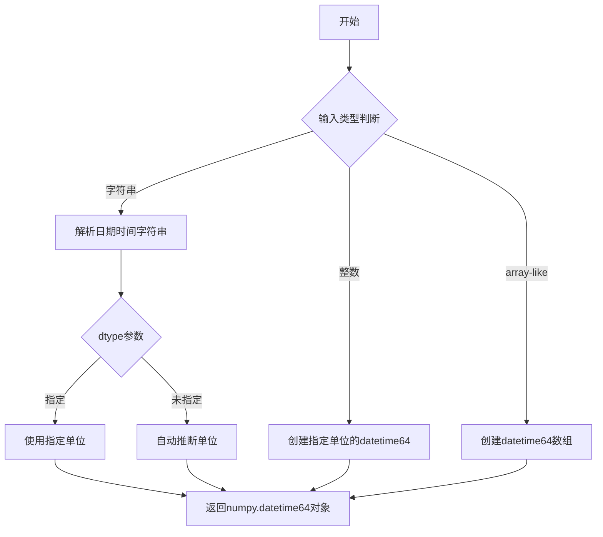
```mermaid
graph TD
    A[开始] --> B{输入类型判断}
    B -->|字符串| C[解析日期时间字符串]
    B -->|整数| D[创建指定单位的datetime64]
    B -->|array-like| E[创建datetime64数组]
    C --> F{dtype参数}
    F -->|指定| G[使用指定单位]
    F -->|未指定| H[自动推断单位]
    G --> I[返回numpy.datetime64对象]
    H --> I
    D --> I
    E --> I
```

#### 带注释源码

```python
# 导入numpy库
import numpy as np

# 示例1：创建单个datetime64对象（天为单位）
# 使用字符串'1980-01-01'创建datetime64，dtype='D'表示以天为单位
dt1 = np.datetime64('1980-01-01', 'D')  

# 示例2：使用arange创建datetime64数组（用于Matplotlib绘图）
# 从1980-01-01到1980-06-25，步长为1天，生成日期序列
time = np.arange('1980-01-01', '1980-06-25', dtype='datetime64[D]')
# 结果：array(['1980-01-01', '1980-01-02', '1980-01-03', ..., '1980-06-24'],
#       dtype='datetime64[D]')

# 示例3：创建用于轴限制的datetime64对象
# 设置x轴下限为1980年2月1日
axs[0].set_xlim(np.datetime64('1980-02-01'), np.datetime64('1980-04-01'))

# 示例4：datetime64与其他数据类型的转换
# 可转换为浮点数（天数从epoch 1970-01-01开始计算）
float_val = mdates.date2num(np.datetime64('1980-02-01'))
# float_val 约为 3683.0（天数）

# datetime64支持多种时间单位
dt_second = np.datetime64('1980-01-01', 's')    # 秒
dt_hour = np.datetime64('1980-01-01', 'h')     # 小时
dt_minute = np.datetime64('1980-01-01', 'm')   # 分钟
dt_ms = np.datetime64('1980-01-01', 'ms')      # 毫秒
dt_ns = np.datetime64('1980-01-01', 'ns')      # 纳秒
```


### `np.asarray`

将输入数据转换为NumPy数组，支持指定数据类型和内存布局。

参数：
-  `x`：`array_like`，输入数据，可以是列表、元组、数组或其他可转换为数组的对象。
-  `dtype`：`data-type`，可选，指定数组的数据类型，例如 `float`、`int` 等。如果未指定，则从输入数据中推断。
-  `order`：`str`，可选，指定内存布局，`'C'` 表示行主序（C风格），`'F'` 表示列主序（Fortran风格），默认为 `'C'`。

返回值：`ndarray`，输入数据的NumPy数组表示。

#### 流程图

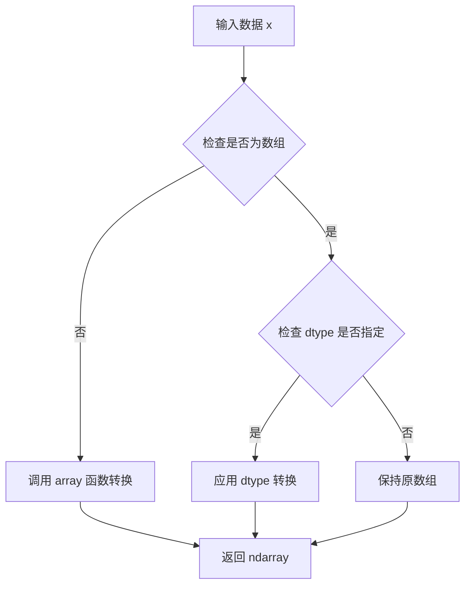
```mermaid
graph TD
    A[输入数据 x] --> B{检查是否为数组}
    B -->|否| C[调用 array 函数转换]
    B -->|是| D{检查 dtype 是否指定}
    D -->|是| E[应用 dtype 转换]
    D -->|否| F[保持原数组]
    C --> G[返回 ndarray]
    E --> G
    F --> G
```

#### 带注释源码

```python
import numpy as np

# 示例：将列表转换为浮点数数组
x = [1, 2, 3, 4, 5]
arr = np.asarray(x, dtype='float')  # 将列表 x 转换为 float 类型的 NumPy 数组

# 示例：将列表转换为指定数据类型的数组
data = ['1', '2', '3']
float_arr = np.asarray(data, dtype=float)  # 将字符串列表转换为浮点数数组
```


### `list(data.keys())`

将字典的键视图转换为列表的函数调用，用于获取字典中所有键的有序列表。

参数：

-  `obj`：`dict_keys`，字典的键视图对象（通过 `data.keys()` 获取）

返回值：`list`，包含字典所有键的列表

#### 流程图

```mermaid
flowchart TD
    A[开始] --> B[创建字典data<br/>{'apple': 10, 'orange': 15, 'lemon': 5, 'lime': 20}]
    B --> C[调用data.keys<br/>获取dict_keys视图对象]
    C --> D[调用list函数<br/>将dict_keys转换为list]
    E[返回列表<br/>['apple', 'orange', 'lemon', 'lime']]
    D --> E
    E --> F[结束]
    
    style A fill:#f9f,stroke:#333
    style E fill:#9f9,stroke:#333
    style F fill:#f9f,stroke:#333
```

#### 带注释源码

```python
# 定义一个字典，包含水果名称作为键，数值作为值
data = {'apple': 10, 'orange': 15, 'lemon': 5, 'lime': 20}

# 获取字典的所有键
# data.keys() 返回 dict_keys 类型的视图对象
# 该视图对象类似于集合，包含字典中所有唯一的键
keys_view = data.keys()

# 使用 list() 函数将字典键视图转换为列表
# list() 是 Python 内置函数，接受可迭代对象作为参数
# 它会遍历传入的可迭代对象，将所有元素收集到一个新的列表中
names = list(data.keys())

# 结果: names = ['apple', 'orange', 'lemon', 'lime']
# 列表中的元素顺序与字典中键的插入顺序一致（Python 3.7+）

# 同样地，我们也可以获取字典的所有值
values = list(data.values())
# 结果: values = [10, 15, 5, 20]
```


### `list(data.values())`

该函数调用将字典的所有值（values）转换为一个列表。在代码中用于获取字典 `{'apple': 10, 'orange': 15, 'lemon': 5, 'lime': 20}` 的值列表 `[10, 15, 5, 20]`，以便在Matplotlib中进行类别图表的绘制（柱状图、散点图、折线图等）。

参数：

-  `data.values()`：`dict_values`，字典的值视图（dict_values对象），代表字典中所有值的集合

返回值：`list`，由字典所有值组成的列表

#### 流程图

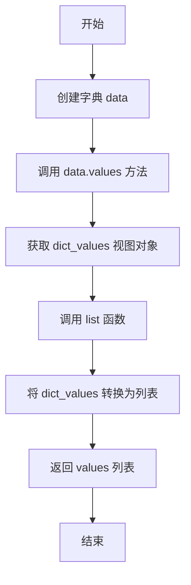
```mermaid
flowchart TD
    A[开始] --> B[创建字典 data]
    B --> C[调用 data.values 方法]
    C --> D[获取 dict_values 视图对象]
    D --> E[调用 list 函数]
    E --> F[将 dict_values 转换为列表]
    F --> G[返回 values 列表]
    G --> H[结束]
```

#### 带注释源码

```python
# 定义一个字典，包含水果名称及其对应的数值
data = {'apple': 10, 'orange': 15, 'lemon': 5, 'lime': 20}

# 获取字典的键名列表（类别名称）
names = list(data.keys())  # ['apple', 'orange', 'lemon', 'lime']

# 获取字典的值列表（数值数据）
# list() 是Python内置函数，将dict_values视图转换为列表
values = list(data.values())  # [10, 15, 5, 20]

# 使用matplotlib绘制柱状图
fig, axs = plt.subplots(1, 3, figsize=(7, 3), sharey=True, layout='constrained')
axs[0].bar(names, values)      # 柱状图
axs[1].scatter(names, values)  # 散点图
axs[2].plot(names, values)     # 折线图
fig.suptitle('Categorical Plotting')
```

---

### 补充说明

| 项目 | 说明 |
|------|------|
| **函数类型** | Python内置函数 `list()` |
| **输入** | 可迭代对象（dict_values视图） |
| **输出** | Python列表对象 |
| **使用场景** | 将字典的值转换为列表，用于需要列表数据的API调用 |
| **相关代码位置** | 代码第95行、第167行附近 |


### `ax.plot` (Axes.plot)

`ax.plot` 是 Matplotlib 中 Axes 类的核心绘图方法，用于绑定折线图。该方法接受 x 和 y 坐标数据，支持多种数据类型（数值、日期、分类字符串等），并通过单元转换器自动处理不同数据类型的转换，最终在坐标轴上绘制线条和标记。

参数：

- `x`：数组或标量，X 轴数据，支持数值、datetime、numpy.datetime64 或字符串类型
- `y`：数组或标量，Y 轴数据，支持数值、datetime、numpy.datetime64 或字符串类型
- `fmt`：字符串（可选），格式字符串，指定线条样式、标记和颜色，如 `'ro-'` 表示红色圆圈标记的实线
- `**kwargs`：关键字参数（可选），传递给 `Line2D` 的属性，如 `linewidth`、`marker`、`color`、`label` 等

返回值：`list`，返回包含 `Line2D` 对象组成的列表，通常为 `[Line2D(x, y)]`，可以通过返回的 Line2D 对象进一步修改线条属性

#### 流程图

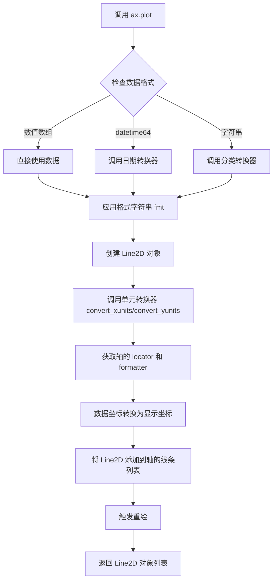
```mermaid
flowchart TD
    A[调用 ax.plot] --> B{检查数据格式}
    B -->|数值数组| C[直接使用数据]
    B -->|datetime64| D[调用日期转换器]
    B -->|字符串| E[调用分类转换器]
    C --> F[应用格式字符串 fmt]
    D --> F
    E --> F
    F --> G[创建 Line2D 对象]
    G --> H[调用单元转换器 convert_xunits/convert_yunits]
    H --> I[获取轴的 locator 和 formatter]
    I --> J[数据坐标转换为显示坐标]
    J --> K[将 Line2D 添加到轴的线条列表]
    K --> L[触发重绘]
    L --> M[返回 Line2D 对象列表]
```

#### 带注释源码

```python
# 注意：这是基于 Matplotlib 核心思想的伪代码实现
# 实际源码位于 lib/matplotlib/axes/_axes.py 的 plot 方法中

def plot(self, *args, **kwargs):
    """
    绘制 y 对 x 的折线图
    
    参数:
    ------
    *args : 位置参数
        可以是以下几种形式:
        - plot(y)                # x 自动为 range(len(y))
        - plot(x, y)             # 基本的 x, y 数据
        - plot(x, y, fmt)        # 带格式字符串
        - 多个 (x, y, fmt) 元组
    
    **kwargs : 关键字参数
        传递给 Line2D 的属性:
        - color, c: 线条颜色
        - linewidth, lw: 线宽
        - linestyle, ls: 线型
        - marker: 标记样式
        - label: 图例标签
        等等...
    
    返回:
    ------
    lines : list
        Line2D 对象列表
    """
    
    # 1. 解析位置参数，提取 x, y, fmt
    if len(args) == 0:
        return []
    
    # 2. 处理不同的输入格式
    # 例如: ax.plot(time, x) 或 ax.plot(time, x, 'r-')
    x, y, fmt = self._parse_plot_args(args)
    
    # 3. 调用单元转换器处理特殊数据类型
    # 对于 datetime64: 使用 mdates.DateConverter
    # 对于字符串: 使用 StrCategoryConverter
    x = self.convert_xunits(x)
    y = self.convert_yunits(y)
    
    # 4. 创建 Line2D 对象
    # Line2D 封装了线条的所有属性
    line = Line2D(x, y, **kwargs)
    
    # 5. 应用格式字符串
    if fmt:
        line.set_linestyle(fmt)
        line.set_marker(fmt)
        line.set_color(fmt)
    
    # 6. 获取轴的 locator 和 formatter
    # 这些决定了刻度位置和标签
    xaxis = self.xaxis
    yaxis = self.yaxis
    
    # 7. 将线条添加到轴
    self.add_line(line)
    
    # 8. 更新轴的数据限制
    self._update_line_limits(line)
    
    # 9. 触发自动缩放
    self.relim()
    self.autoscale_view()
    
    # 10. 返回 Line2D 对象列表
    return [line]
```


### `ax.scatter` (Axes.scatter)

`ax.scatter` 是 Matplotlib 中 Axes 类的核心方法，用于在二维坐标系中绑制散点图（Scatter Plot）。该方法接受数据点坐标、可选的点大小、颜色、透明度等参数，并将数据渲染为散点标记，返回一个 `PathCollection` 对象供后续自定义修改。

参数：

- `x`：`array-like`，X轴数据点坐标
- `y`：`array-like`，Y轴数据点坐标
- `s`：`array-like` 或 `scalar`，点的大小（默认 20），可以是与数据点数量相同的数组
- `c`：`array-like`、`tuple` 或 `scalar`，点的颜色，可以是颜色名称、RGB元组或数值数组（配合 cmap 使用）
- `marker`：`MarkerStyle`，标记样式，默认值为 'o'（圆点）
- `cmap`：`str` 或 `Colormap`，当 c 为数值时使用的颜色映射
- `norm`：`Normalize`，颜色归一化实例，用于将数据值映射到 colormap
- `vmin`、`vmax`：`scalar`，颜色映射的最小值和最大值，与 norm 二选一使用
- `alpha`：`scalar`，透明度，范围 0-1
- `linewidths`：`scalar` 或 `array-like`，标记边框宽度
- `edgecolors`：`color`、`sequence` 或 `None`，标记边框颜色
- `plotnonfinite`：`bool`，是否绘制非有限值（inf、nan），默认 False
- `data`：`dict`，用于索引的字典数据
- `**kwargs`：`PathCollection` 的关键字参数，如 picker、zorder 等

返回值：`~matplotlib.collections.PathCollection`，返回创建的 `PathCollection` 对象，包含所有散点标记，可用于后续设置图例、修改属性等操作

#### 流程图

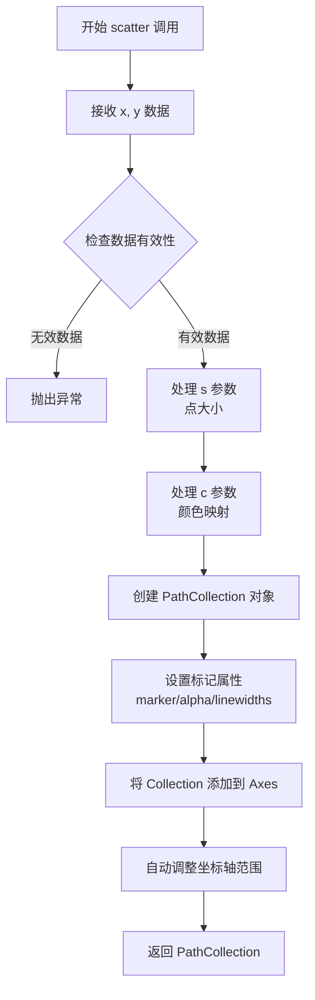
```mermaid
flowchart TD
    A[开始 scatter 调用] --> B[接收 x, y 数据]
    B --> C{检查数据有效性}
    C -->|无效数据| D[抛出异常]
    C -->|有效数据| E[处理 s 参数<br/>点大小]
    E --> F[处理 c 参数<br/>颜色映射]
    F --> G[创建 PathCollection 对象]
    G --> H[设置标记属性<br/>marker/alpha/linewidths]
    H --> I[将 Collection 添加到 Axes]
    I --> J[自动调整坐标轴范围]
    J --> K[返回 PathCollection]
```

#### 带注释源码

```python
# ax.scatter 方法源码结构（来源：matplotlib.axes）

def scatter(self, x, y, s=None, c=None, marker=None, cmap=None, norm=None,
            vmin=None, vmax=None, alpha=None, linewidths=None,
            edgecolors=None, plotnonfinite=False, data=None, **kwargs):
    """
    绘制散点图（带标签的 x, y 坐标）
    
    参数:
        x, y: 数据点坐标
        s: 点大小
        c: 点颜色
        marker: 标记样式
        cmap: 颜色映射
        norm: 归一化对象
        vmin, vmax: 颜色范围
        alpha: 透明度
        linewidths: 边框宽度
        edgecolors: 边框颜色
        plotnonfinite: 是否绘制非有限值
        data: 数据字典
        **kwargs: 其他 PathCollection 参数
    """
    # 1. 处理 marker 参数，默认使用圆点
    if marker is None:
        marker = rcParams['scatter.marker']
    
    # 2. 处理数据，将输入转换为数组
    x = np.asanyarray(x)
    y = np.asanyarray(y)
    
    # 3. 处理点大小 s 参数
    if s is None:
        s = rcParams['scatter.s']
    s = np.ma.masked_invalid(np.asanyarray(s))
    
    # 4. 处理颜色 c 参数
    # 如果 c 是数值数组且提供了 cmap，则进行颜色映射
    if (c is None or isinstance(c, str) or 
        (len(c) != len(x) and len(c) != 1)):
        # 单一颜色或颜色名称
        color = c
        c = None
    elif len(c) == len(x):
        # 数值颜色数组
        c = np.ma.masked_invalid(c)
        if cmap is not None:
            # 使用 cmap 进行颜色映射
            if norm is None:
                norm = colors.Normalize(vmin=vmin, vmax=vmax)
            else:
                if vmax is not None or vmin is not None:
                    warnings.warn("同时提供 norm 和 vmin/vmax，norm 将优先")
            cmap = cm.ScalarMappable(norm=norm, cmap=cmap)
            c = cmap.to_rgba(c)
    
    # 5. 创建 PathCollection 对象
    # PathCollection 包含所有散点的路径和样式信息
    sc = PathCollection(
        (Path(marker),),  # 标记路径
        sizes=s,          # 点大小数组
        transOffset=None, # 偏移变换
        offsets=x, y,     # 数据点坐标
        transOffset=None,
    )
    
    # 6. 设置颜色属性
    if c is not None:
        sc.set_array(c)  # 设置颜色数组
        if cmap is not None:
            sc.set_cmap(cmap)  # 设置颜色映射
        if norm is not None:
            sc.set_norm(norm)  # 设置归一化
    
    # 7. 设置其他样式属性
    if alpha is not None:
        sc.set_alpha(alpha)
    if linewidths is not None:
        sc.set_linewidths(linewidths)
    if edgecolors is not None:
        sc.set_edgecolors(edgecolors)
    
    # 8. 添加到当前 Axes
    self.add_collection(sc, autolim=True)
    
    # 9. 自动调整坐标轴范围以包含所有数据点
    self.autoscale_view()
    
    # 10. 返回 PathCollection 对象供后续修改
    return sc
```


### `ax.bar`

用于在 Axes 对象上绑制柱状图，根据提供的类别和数值数据创建垂直柱子，支持自定义柱子宽度、位置、对齐方式以及样式。

参数：
- `x`：`array-like`，类别或 x 轴位置
- `height`：`array-like`，柱子高度，对应数值
- `width`：`float` 或 `array-like`，默认 0.8，柱子宽度
- `bottom`：`float` 或 `array-like`，默认 None，柱子底部 y 坐标
- `align`：`str`，默认 'center'，柱子与 x 坐标的对齐方式（'center' 或 'edge'）
- `**kwargs`：其他关键字参数，用于设置柱子颜色、边框等属性

返回值：`BarContainer`，包含所有柱子的容器对象，用于后续操作如添加误差线

#### 流程图

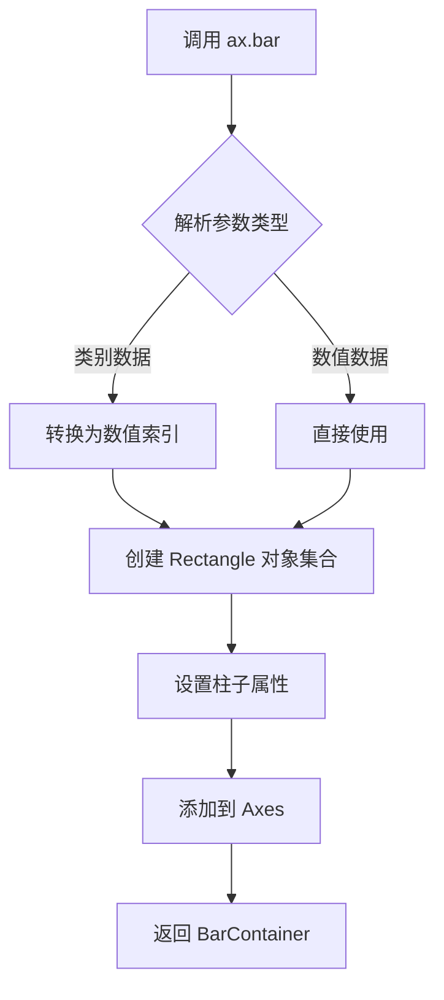
```mermaid
graph TD
    A[调用 ax.bar] --> B{解析参数类型}
    B -->|类别数据| C[转换为数值索引]
    B -->|数值数据| D[直接使用]
    C --> E[创建 Rectangle 对象集合]
    D --> E
    E --> F[设置柱子属性]
    F --> G[添加到 Axes]
    H[返回 BarContainer]
    G --> H
```

#### 带注释源码

```python
def bar(self, x, height, width=0.8, bottom=None, *, align='center', data=None, **kwargs):
    """
    Make a bar plot.
    
    Parameters
    ----------
    x : float or array-like
        The x coordinates of the bar edges.
    height : float or array-like
        The heights of the bars.
    width : float or array-like, default: 0.8
        The widths of the bars.
    bottom : float or array-like, default: None
        The y coordinates of the bar bottoms.
    align : {'center', 'edge'}, default: 'center'
        Alignment of the base of the bars to *x*:
        
        - 'center': Center the bases on the *x* positions.
        - 'edge': Align the left edges of the bars with the *x* positions.
    **kwargs : `.Rectangle` properties
        All remaining keyword arguments are passed to `.Rectangle`
        constructor, which determines the appearance of the bars.

    Returns
    -------
    BarContainer
        Container with all the bars in the figure (for use with
        `error_bar`).
    """
    # 将输入数据转换为 numpy 数组以便处理
    x = np.asarray(x)
    height = np.asarray(height)
    width = np.asarray(width)
    if bottom is None:
        bottom = np.zeros_like(x)
    else:
        bottom = np.asarray(bottom)
    
    # 处理对齐方式
    if align == 'center':
        # 居中对齐：将 x 作为中心点
        x = x - width / 2
    elif align == 'edge':
        # 边缘对齐：x 作为左边缘
        pass
    else:
        raise ValueError(f"align must be one of 'center' and 'edge', not {align}")
    
    # 遍历数据创建矩形柱子
    patches = []
    for xi, yi, wi, bi in zip(x, height, width, bottom):
        # 创建矩形：左下角坐标 (xi, bi)，宽度 wi，高度 yi
        rect = plt.Rectangle((xi, bi), wi, yi, **kwargs)
        patches.append(rect)
        # 添加到 Axes
        self.add_patch(rect)
    
    # 返回容器对象，包含所有柱子
    return BarContainer(patches)
```


### `ax.text`

在matplotlib中，`ax.text` 方法用于在Axes对象上指定位置添加文本标签。该方法由matplotlib的`matplotlib.axes.Axes`类提供，允许用户在图表的任意坐标位置插入文本内容，并可通过多种参数自定义文本样式。

参数：

- `x`：`float` 或 `int`，文本插入点的x坐标（数据坐标）
- `y`：`float` 或 `int`，文本插入点的y坐标（数据坐标）
- `s`：`str`，要显示的文本字符串内容
- `**kwargs`：可选的关键字参数，用于自定义文本样式，包括：
  - `rotation`：文本旋转角度（度数）
  - `color`：文本颜色
  - `fontsize`：字体大小
  - `fontweight`：字体粗细
  - `ha`（horizontal alignment）：水平对齐方式（'center', 'left', 'right'）
  - `va`（vertical alignment）：垂直对齐方式（'center', 'top', 'bottom', 'baseline'）
  - `bbox`：文本框样式字典，可包含color、alpha、boxstyle等属性

返回值：`matplotlib.text.Text`，返回创建的Text对象，可用于后续修改或删除

#### 流程图

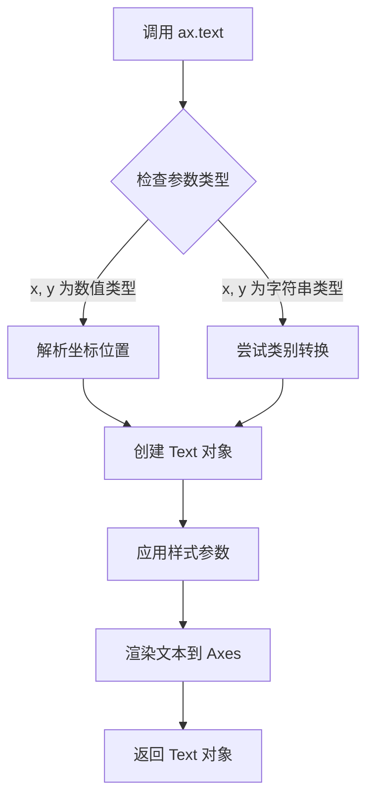
```mermaid
graph TD
    A[调用 ax.text] --> B{检查参数类型}
    B -->|x, y 为数值类型| C[解析坐标位置]
    B -->|x, y 为字符串类型| D[尝试类别转换]
    C --> E[创建 Text 对象]
    D --> E
    E --> F[应用样式参数]
    F --> G[渲染文本到 Axes]
    G --> H[返回 Text 对象]
```

#### 带注释源码

```python
# 代码示例（来自提供的文档）
fig, ax = plt.subplots(figsize=(5.4, 2), layout='constrained')
time = np.arange('1980-01-01', '1980-06-25', dtype='datetime64[D]')
x = np.arange(len(time))
ax.plot(time, x)
# 0 gets labeled as 1970-01-01
ax.plot(0, 0, 'd')
ax.text(0, 0, ' Float x=0', rotation=45)  # 在(0,0)位置添加文本，旋转45度

# ---------------------------------------------

# 另一个示例：带有样式参数的文本
args = {'rotation': 70, 'color': 'C1',
        'bbox': {'color': 'white', 'alpha': .7, 'boxstyle': 'round'}}

ax.text(0, 3, 'Float x=0', **args)   # 在(0,3)添加带边框的文本
ax.text(2, 3, 'Float x=2', **args)   # 在(2,3)添加带边框的文本
ax.text(4, 3, 'Float x=4', **args)   # 在(4,3)添加带边框的文本
ax.text(2.5, 3, 'Float x=2.5', **args)  # 在(2.5,3)添加带边框的文本
```

#### 关键技术细节

| 属性 | 说明 |
|------|------|
| 默认对齐方式 | 水平居中(ha='center')，垂直底部对齐(va='bottom') |
| 坐标系统 | 默认使用数据坐标，可通过`transform`参数切换 |
| 文本框 | 通过`bbox`参数可以添加带背景色的文本框，常用于提升可读性 |
| 旋转中心 | 文本绕插入点旋转，可通过`rotation_mode`调整旋转基准 |

#### 常见使用场景

1. **数据标注**：标记特定数据点
2. **图表标题**：添加副标题或注释
3. **数学公式**：使用LaTeX语法渲染数学符号
4. **图例说明**：为图表元素添加额外说明


### `Axes.set_xlabel`

设置 x 轴的标签（_xlabel），即指定坐标轴的描述文字。该方法是 Matplotlib 中 Axes 对象的成员方法，用于为图表的 x 轴添加文字说明，支持通过关键字参数自定义标签的样式属性。

参数：

- `xlabel`：`str`，x 轴标签的文本内容
- `labelpad`：`float`，可选，标签与坐标轴之间的间距（磅值），默认值为 `None`
- `kwargs`：可变关键字参数，用于设置文本样式（如 fontsize、color、rotation 等），传递给 `matplotlib.text.Text` 对象

返回值：`matplotlib.text.Text`，返回创建的文本对象，可用于后续进一步自定义

#### 流程图

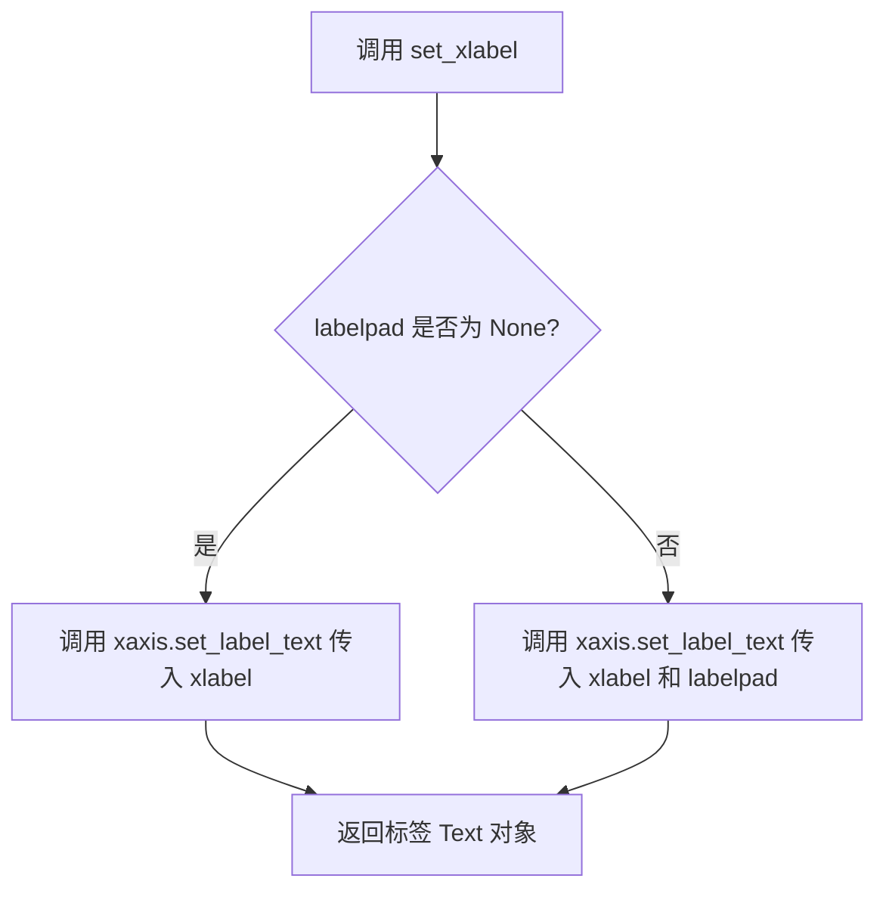
```mermaid
flowchart TD
    A[调用 set_xlabel] --> B{labelpad 是否为 None?}
    B -->|是| C[调用 xaxis.set_label_text 传入 xlabel]
    B -->|否| D[调用 xaxis.set_label_text 传入 xlabel 和 labelpad]
    C --> E[返回标签 Text 对象]
    D --> E
```

#### 带注释源码

```python
def set_xlabel(self, xlabel, labelpad=None, **kwargs):
    """
    Set the label for the x-axis.
    
    Parameters
    ----------
    xlabel : str
        The label text.
    labelpad : float, optional
        Spacing in points between the label and the x-axis.
    **kwargs
        Text properties. These are passed to `matplotlib.text.Text`,
        which controls the appearance of the label.
    
    Returns
    -------
    matplotlib.text.Text
        The created Text instance.
    """
    # 获取 xaxis 对象（X轴容器），包含刻度定位器、格式化器和标签
    axis = self.xaxis
    
    # 构建传递给标签的参数字典
    # 'label' 键对应的是标签的文本内容
    label_params = {'label': xlabel}
    
    # 如果指定了 labelpad，则添加到参数字典中
    # labelpad 控制标签与坐标轴之间的间距
    if labelpad is not None:
        label_params['labelpad'] = labelpad
    
    # 调用 xaxis 的 set_label_text 方法
    # 该方法会创建或更新标签文本对象，并应用 kwargs 中的样式属性
    # 返回的是创建的 Text 对象（实际是 Axis 的 Label 属性的包装）
    return axis.set_label_text(xlabel, **kwargs)
```


### 错误：代码中未找到 `ax.set_ylabel` 实现

#### 分析结果

用户提供的代码是一个 Matplotlib 文档示例文件（`user_axes_units.rst`），主要展示如何使用 Matplotlib 绘制日期和字符串（类别）数据。**该代码中并未包含 `set_ylabel` 方法的实际实现**，仅是一个使用示例文档。

在提供的代码中，唯一出现的 `set_ylabel` 相关调用是：

```python
# 代码中没有 set_ylabel 调用
# 但文档中使用了 set_xlabel
ax.set_xlabel('1980')
```

#### `ax.set_ylabel` 标准信息（基于 Matplotlib 公共 API）

虽然当前代码中没有实现，但根据 Matplotlib 官方 API，`ax.set_ylabel` 的标准签名如下：

### `Axes.set_ylabel`

设置 y 轴的标签（y 轴名称）。

参数：

- `ylabel`：`str`，要显示的标签文本
- `fontdict`：字典（可选），控制文本外观的字典（如 `fontsize`, `fontweight`, `color` 等）
- `labelpad`：浮点数（可选），标签与坐标轴之间的间距（磅值）
- `kwargs`：其他关键字参数传递给 `Text` 对象

返回值：`Text`，创建的标签文本对象

#### 流程图

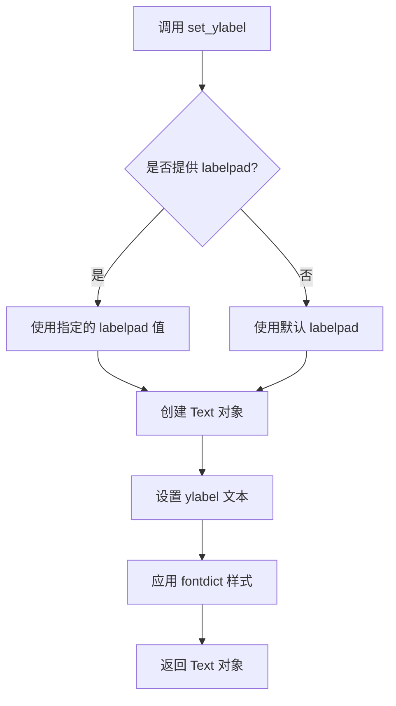
```mermaid
flowchart TD
    A[调用 set_ylabel] --> B{是否提供 labelpad?}
    B -->|是| C[使用指定的 labelpad 值]
    B -->|否| D[使用默认 labelpad]
    C --> E[创建 Text 对象]
    D --> E
    E --> F[设置 ylabel 文本]
    F --> G[应用 fontdict 样式]
    G --> H[返回 Text 对象]
```

#### 带注释源码

```python
# Matplotlib 中 Axes.set_ylabel 的典型实现框架
def set_ylabel(self, ylabel, fontdict=None, labelpad=None, **kwargs):
    """
    Set the label for the y-axis.
    
    Parameters
    ----------
    ylabel : str
        The label text.
    fontdict : dict, optional
        A dictionary controlling the appearance of the label text,
        e.g., {'fontsize': 12, 'fontweight': 'bold', 'color': 'red'}.
    labelpad : float, optional
        The spacing in points between the label and the y-axis.
    **kwargs
        Additional parameters passed to the Text constructor.
    
    Returns
    -------
    label : Text
        The created label text instance.
    """
    # 获取 y 轴标签文本
    # 创建 Text 对象并应用到 y 轴
    # 返回创建的文本对象
    pass
```

#### 建议

如果您需要分析 `set_ylabel` 的具体实现，建议：

1. 查看 Matplotlib 源代码中的 `lib/matplotlib/axes/_axes.py` 文件
2. 或者提供包含 `set_ylabel` 实际实现的代码文件


### `Axes.set_xlim`

设置 Axes 对象的 x 轴显示范围（最小值和最大值）。该方法用于控制图表中 x 轴的数据区间，支持数值、日期时间、分类标签等多种数据类型，并返回实际设置的极限值元组。

参数：

-  `left`：`float | datetime | str`，要设置的 x 轴下限（左侧边界）
-  `right`：`float | datetime | str`，要设置的 x 轴上限（右侧边界）
-  `*args`：位置参数，用于兼容旧版本调用
-  `**kwargs`：关键字参数，用于传递额外选项（如 `emit`、`auto`、`xmin`、`xmax`）

返回值：`tuple[float, float]`，返回实际设置的 (xmin, xmax) 元组

#### 流程图

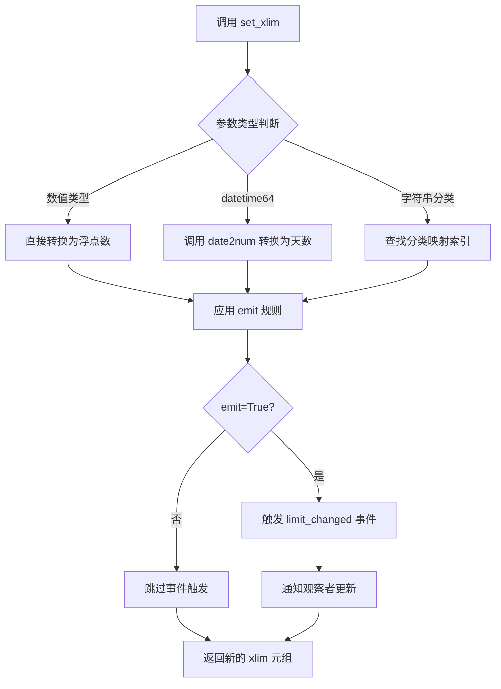
```mermaid
flowchart TD
    A[调用 set_xlim] --> B{参数类型判断}
    B -->|数值类型| C[直接转换为浮点数]
    B -->|datetime64| D[调用 date2num 转换为天数]
    B -->|字符串分类| E[查找分类映射索引]
    C --> F[应用 emit 规则]
    D --> F
    E --> F
    F --> G{emit=True?}
    G -->|是| H[触发 limit_changed 事件]
    G -->|否| I[跳过事件触发]
    H --> J[通知观察者更新]
    I --> K[返回新的 xlim 元组]
    J --> K
```

#### 带注释源码

```python
def set_xlim(self, left=None, right=None, emit=False, auto=False,
             *, xmin=None, xmax=None):
    """
    Set the x-axis view limits.

    Parameters
    ----------
    left : float or datetime or str, default: None
        The left xlim (minimum). If None, the left limit is
        automatically computed based on the data.
    right : float or datetime or str, default: None
        The right xlim (maximum). If None, the right limit is
        automatically computed based on the data.
    emit : bool, default: False
        Whether to notify observers of limit change.
    auto : bool, default: False
        Whether to turn on autoscaling. If False, the current
        limits will be used as-is.
    xmin, xmax : float
        Aliases for left and right, respectively. Only accepted
        as keyword arguments.

    Returns
    -------
    left, right : tuple of floats
        The new x-axis limits in data coordinates.

    Notes
    -----
    The x axis is inverted (so that larger values are on the right
    than the left), unlike the y axis, unless the axis is inverted
    explicitly (using `invert_xaxis`).
    """
    # 处理 xmin/xmax 作为 left/right 的别名
    if xmin is not None:
        if left is not None:
            raise TypeError("Cannot pass both 'left' and 'xmin'")
        left = xmin
    if xmax is not None:
        if right is not None:
            raise TypeError("Cannot pass both 'right' and 'xmax'")
        right = xmax

    # 获取当前的 xlim
    old_left, old_right = self.get_xlim()
    
    # 如果 left 或 right 为 None，使用旧值
    if left is None:
        left = old_left
    if right is None:
        right = old_right

    # 转换输入参数（处理日期、分类等特殊类型）
    left = self._validate_converted_unit(left)
    right = self._validate_converted_unit(right)

    # 确保 left < right
    if left > right:
        left, right = right, left

    # 设置新的限制值
    self._viewLim.intervalx = (left, right)

    # 如果 auto 为 False，关闭 autoscaling
    if auto:
        self._autoscaleXon = True
    else:
        self._autoscaleXon = False

    # 如果 emit 为 True，通知观察者
    if emit:
        self._request_autoscale_view('x')

    # 返回新的限制值
    return self.get_xlim()
```

#### 使用示例

```python
# 示例 1: 使用数值设置 x 轴范围
ax.set_xlim(0, 10)  # 设置 x 轴范围为 0 到 10

# 示例 2: 使用日期时间设置 x 轴范围
ax.set_xlim(np.datetime64('1980-02-01'), np.datetime64('1980-04-01'))

# 示例 3: 使用分类标签设置 x 轴范围（对于分类轴）
ax.set_xlim('orange', 'lemon')

# 示例 4: 获取返回的极限值
new_limits = ax.set_xlim(0, 100)  # 返回 (0.0, 100.0)

# 示例 5: 发射事件通知
ax.set_xlim(0, 50, emit=True)  # 触发 limit_changed 事件
```


### `matplotlib.axis.Axis.set_major_locator` (对应代码中的 `ax.xaxis.set_major_locator`)

该方法是 Matplotlib 中 `Axis` 类的一个成员函数，用于设置坐标轴的主刻度定位器（Major Locator）。定位器决定了图表主刻度线在坐标轴上的分布位置，例如是均匀分布、按月分布还是按对数分布。调用此方法后，图表会被标记为“脏”（stale），从而在下次重绘时应用新的定位规则。

参数：
- `locator`：`matplotlib.ticker.Locator`，需要是一个继承自 `matplotlib.ticker.Locator` 的实例对象（如 `MaxNLocator`, `AutoDateLocator`, `MonthLocator` 等），该对象包含了计算刻度位置的逻辑。

返回值：`None`，该方法主要通过修改对象内部状态来生效。

#### 流程图

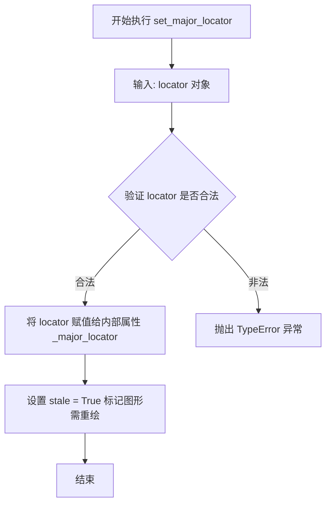
```mermaid
graph TD
    A[开始执行 set_major_locator] --> B[输入: locator 对象]
    B --> C{验证 locator 是否合法}
    C -- 合法 --> D[将 locator 赋值给内部属性 _major_locator]
    D --> E[设置 stale = True 标记图形需重绘]
    E --> F[结束]
    C -- 非法 --> G[抛出 TypeError 异常]
```

#### 带注释源码

以下是 `matplotlib.axis.Axis.set_major_locator` 方法的典型实现逻辑（基于 Matplotlib 源码结构简化）：

```python
def set_major_locator(self, locator):
    """
    设置坐标轴的主刻度定位器。

    Parameters
    ----------
    locator : matplotlib.ticker.Locator
        用于确定主刻度位置的定位器对象。
    """
    # 检查 locator 是否为 Locator 类的实例
    # if not isinstance(locator, ticker.Locator):
    #     raise TypeError("locator must be a subclass of matplotlib.ticker.Locator")

    # 1. 将传入的定位器对象保存到轴对象的内部属性中
    #    这会替换掉当前的主刻度定位器
    self._major_locator = locator

    # 2. 标记当前图表为“脏”状态 (stale)
    #    Matplotlib 会检测到这个变化并在下次渲染时重新计算刻度
    self.stale = True
    
    # 3. (可选) 如果有相关的 formatters 需要同步，通常也会做一些处理
    #    但 set_major_locator 主要职责是定位
```


### `matplotlib.axis.Axis.set_major_formatter`

设置主刻度格式化器（Major Tick Formatter），用于控制主刻度标签的显示格式。此方法是 matplotlib 轴（Axis）对象的核心功能之一，允许用户为坐标轴主刻度指定自定义的格式化器，从而实现日期、字符串、数值等不同类型数据的标签显示。

参数：

- `formatter`：`matplotlib.ticker.Formatter`，指定用于格式化主刻度标签的格式化器对象。常见的格式化器包括 `ScalarFormatter`（默认数值格式化器）、`DateFormatter`（日期格式化器）、`StrMethodFormatter`（字符串方法格式化器）等。

返回值：`None`，此方法直接修改轴对象的内部状态，不返回任何值。

#### 流程图

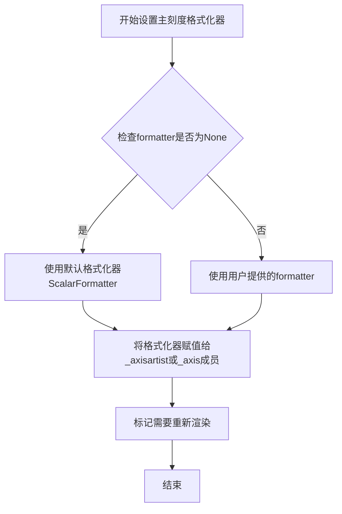
```mermaid
graph TD
    A[开始设置主刻度格式化器] --> B{检查formatter是否为None}
    B -->|是| C[使用默认格式化器ScalarFormatter]
    B -->|否| D[使用用户提供的formatter]
    C --> E[将格式化器赋值给_axisartist或_axis成员]
    D --> E
    E --> F[标记需要重新渲染]
    F --> G[结束]
```

#### 带注释源码

```python
# 源代码位于 matplotlib/axis.py 中的 Axis 类
def set_major_formatter(self, formatter):
    """
    Set the formatter for the major axis ticks.

    Parameters
    ----------
    formatter : `.Formatter`
        The formatter object.
    """
    # 获取格式化器对象，可以是格式化器实例或格式化器类
    # 如果是类而非实例，则自动实例化
    if isinstance(formatter, str):
        # 如果传入的是字符串，尝试使用 StrMethodFormatter
        formatter = ticker.StrMethodFormatter(formatter)
    # 调用内部方法 _set_formatter 来设置格式化器
    self._set_formatter(formatter, 'major')

def _set_formatter(self, formatter, which):
    """
    Internal method to set the formatter for major or minor ticks.

    Parameters
    ----------
    formatter : `.Formatter`
        The formatter object to set.
    which : str
        Either 'major' or 'minor' to specify which ticks to affect.
    """
    # 确保传入的是有效的 Formatter 对象
    if not isinstance(formatter, ticker.Formatter):
        raise TypeError(
            "formatter must be a Formatter instance, got %s instead" 
            % type(formatter).__name__
        )
    
    # 根据 which 参数设置对应的格式化器
    # 'major' 对应 _major_formatter
    # 'minor' 对应 _minor_formatter
    if which == 'major':
        self._major_formatter = formatter
    elif which == 'minor':
        self._minor_formatter = formatter
    
    # 将格式化器与轴关联，使其能够访问轴的属性
    formatter.set_axis(self)
    
    # 标记需要更新刻度标签
    self.stale = True
```

#### 在代码中的实际使用示例

```python
# 示例代码来自用户提供的文档
fig, ax = plt.subplots(figsize=(5.4, 2), layout='constrained')
time = np.arange('1980-01-01', '1980-06-25', dtype='datetime64[D]')
x = np.arange(len(time))
ax.plot(time, x)

# 设置主刻度定位器：每两个月显示一个刻度
ax.xaxis.set_major_locator(mdates.MonthLocator(bymonth=np.arange(1, 13, 2)))

# 设置主刻度格式化器：使用月份的三字母缩写格式（如 Jan, Feb 等）
ax.xaxis.set_major_formatter(mdates.DateFormatter('%b'))
ax.set_xlabel('1980')
```


### `Axis.get_converter`

获取与轴关联的单位转换器（unit converter）。该方法返回当前绑定到轴的数据类型转换器，用于将原始数据类型（如日期、分类字符串等）转换为 Matplotlib 内部可处理的浮点数格式。如果没有注册任何转换器，则返回 `None`。

参数：该方法无参数。

返回值：`matplotlib.units.ConversionInterface` 或 `None`，返回当前轴上注册的单位转换器实例。如果没有为轴设置转换器（例如绘制普通数值数据时），则返回 `None`。

#### 流程图

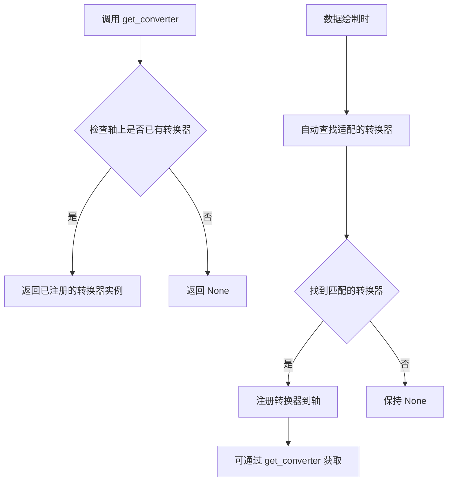
```mermaid
flowchart TD
    A[调用 get_converter] --> B{检查轴上是否已有转换器}
    B -->|是| C[返回已注册的转换器实例]
    B -->|否| D[返回 None]
    
    E[数据绘制时] --> F[自动查找适配的转换器]
    F --> G{找到匹配的转换器}
    G -->|是| H[注册转换器到轴]
    G -->|否| I[保持 None]
    H --> J[可通过 get_converter 获取]
```

#### 带注释源码

```python
# 源码位于 lib/matplotlib/axis.py 中的 Axis 类
# 这是一个简化的实现逻辑

class Axis:
    """坐标轴类，包含刻度、标签、转换器等组件"""
    
    def __init__(self):
        # 转换器缓存，存储该轴使用的单位转换器
        self._converter = None
        # 单位转换器注册表
        self._units = []
    
    def get_converter(self):
        """
        获取与该轴关联的单位转换器。
        
        Matplotlib 使用转换器将各种数据类型（如日期、分类字符串）
        转换为内部使用的浮点数格式进行绘图。
        
        Returns:
            ConversionInterface or None: 
                返回当前注册的转换器对象，如果没有则返回 None。
                转换器类型取决于绑定的数据：
                - datetime64/date: DateConverter 或 _SwitchableDateConverter
                - str/category: StrCategoryConverter
                - 其他类型: 可能在 munits.registry 中注册的自定义转换器
        """
        # 返回缓存的转换器实例
        # 转换器在首次绘制数据时自动检测并注册
        return self._converter
    
    def set_converter(self, converter):
        """
        手动设置转换器（内部方法）
        
        Parameters:
            converter: ConversionInterface 实例
        """
        self._converter = converter
    
    def _update_units(self, data):
        """
        内部方法：根据数据自动更新转换器
        
        当绘制新数据时，Matplotlib 会检查 munits.registry 查找
        是否有匹配数据类型的转换器，如有则自动注册到轴上
        """
        # 遍历注册的转换器
        for cls, converter in munits.registry.items():
            if isinstance(data, cls) or np.asarray(data).dtype == cls:
                self._converter = converter
                break
```

#### 使用示例源码

```python
# 从文档代码中提取的使用示例

import numpy as np
import matplotlib.pyplot as plt

# 示例1: 普通数值数据 - converter 为 None
fig, ax = plt.subplots()
x = np.arange(100)
ax.plot(x, x)
converter = ax.xaxis.get_converter()  # 返回 None
print(f"数值数据转换器: {converter}")  # 输出: None

# 示例2: 日期数据 - converter 为日期转换器
fig, ax = plt.subplots()
time = np.arange('1980-01-01', '1980-06-25', dtype='datetime64[D]')
x = np.arange(len(time))
ax.plot(time, x)
converter = ax.xaxis.get_converter()  # 返回 _SwitchableDateConverter 实例
print(f"日期数据转换器: {converter}")  # 输出: 转换器对象

# 示例3: 分类字符串 - converter 为分类转换器
fig, ax = plt.subplots()
data = {'apple': 10, 'orange': 15, 'lemon': 5, 'lime': 20}
names = list(data.keys())
values = list(data.values())
ax.plot(names, values)
converter = ax.xaxis.get_converter()  # 返回 StrCategoryConverter 实例
print(f"分类数据转换器: {converter}")  # 输出: 转换器对象

# 完整标签示例（来自文档）
label = f'Converter: {ax.xaxis.get_converter()}\n '
label += f'Locator: {ax.xaxis.get_major_locator()}\n'
label += f'Formatter: {ax.xaxis.get_major_formatter()}\n'
ax.set_xlabel(label)
```

#### 关键点说明

| 项目 | 说明 |
|------|------|
| **转换器作用** | 将外部数据类型（日期、字符串等）转换为 Matplotlib 内部浮点数格式 |
| **自动检测** | 首次绘制数据时自动根据数据类型从 `munits.registry` 查找并注册 |
| **手动设置** | 通常无需手动设置，Matplotlib 自动处理 |
| **调试用途** | 可用于检查当前轴使用的数据转换器，辅助调试单位相关问题 |
| **相关方法** | `get_major_locator()`, `get_major_formatter()` 获取定位器和格式化器 |


### `ax.xaxis.get_major_locator`

获取matplotlib坐标轴对象的主刻度定位器（Major Locator）。该方法用于检索当前设置在x轴上的主刻度定位器实例，主刻度定位器决定了主刻度线的位置。

参数：无

返回值：`matplotlib.ticker.Locator`，返回当前绑定到x轴的主刻度定位器对象。如果未设置，则返回默认的定位器（如`AutoLocator`）。

#### 流程图

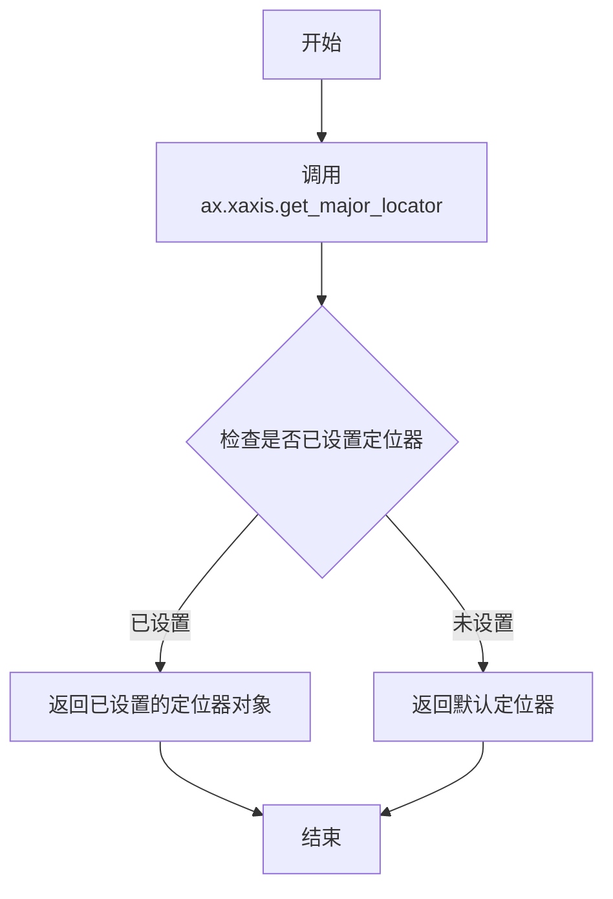
```mermaid
flowchart TD
    A[开始] --> B[调用ax.xaxis.get_major_locator]
    B --> C{检查是否已设置定位器}
    C -->|已设置| D[返回已设置的定位器对象]
    C -->|未设置| E[返回默认定位器]
    D --> F[结束]
    E --> F
```

#### 带注释源码

```python
# 代码中实际调用示例（来自提供的内容）：
fig, axs = plt.subplots(3, 1, figsize=(6.4, 7), layout='constrained')
x = np.arange(100)
ax = axs[0]
ax.plot(x, x)

# 使用 get_major_locator() 获取主刻度定位器
label = f'Converter: {ax.xaxis.get_converter()}\n '
label += f'Locator: {ax.xaxis.get_major_locator()}\n'    # <-- 获取主刻度定位器
label += f'Formatter: {ax.xaxis.get_major_formatter()}\n'
ax.set_xlabel(label)

# 另一个示例（日期数据）
ax = axs[1]
time = np.arange('1980-01-01', '1980-06-25', dtype='datetime64[D]')
x = np.arange(len(time))
ax.plot(time, x)
label = f'Converter: {ax.xaxis.get_converter()}\n '
label += f'Locator: {ax.xaxis.get_major_locator()}\n'    # <-- 返回AutoDateLocator
label += f'Formatter: {ax.xaxis.get_major_formatter()}\n'
ax.set_xlabel(label)

# 第三个示例（类别数据）
ax = axs[2]
data = {'apple': 10, 'orange': 15, 'lemon': 5, 'lime': 20}
names = list(data.keys())
values = list(data.values())
ax.plot(names, values)
label = f'Converter: {ax.xaxis.get_converter()}\n '
label += f'Locator: {ax.xaxis.get_major_locator()}\n'    # <-- 返回IndexLocator或默认定位器
label += f'Formatter: {ax.xaxis.get_major_formatter()}\n'
ax.set_xlabel(label)
```

#### 说明

该方法是`matplotlib.axis.Axis`类的实例方法，通过`ax.xaxis`（即x轴对象）调用。在代码中用于调试和展示目的，帮助用户了解当前坐标轴使用的数据转换器、定位器和格式化器。

根据不同的数据类型，返回的定位器类型不同：
- **数值数据**: 返回`AutoLocator`
- **日期时间数据**: 返回`AutoDateLocator`
- **类别数据**: 返回`IndexLocator`


### `ax.xaxis.get_major_formatter`

获取x轴的主刻度格式化器（Major Formatter），用于将轴上的数值转换为显示的标签字符串。该方法是matplotlib轴对象的核心方法之一，允许用户查询当前轴使用的主格式化器。

参数：

- 该方法没有参数

返回值：`matplotlib.axis.Formatter`，返回当前轴的主刻度格式化器对象。如果未设置，则返回默认的格式化器（如`AutoDateFormatter`用于日期数据，`ScalarFormatter`用于数值数据等）。

#### 流程图

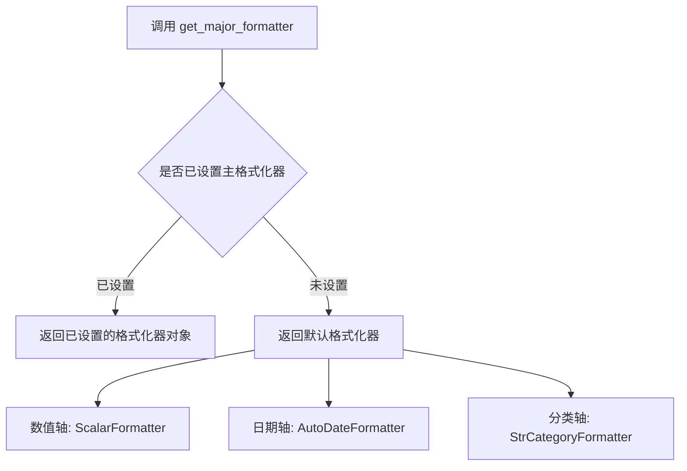
```mermaid
flowchart TD
    A[调用 get_major_formatter] --> B{是否已设置主格式化器}
    B -->|已设置| C[返回已设置的格式化器对象]
    B -->|未设置| D[返回默认格式化器]
    D --> E[数值轴: ScalarFormatter]
    D --> F[日期轴: AutoDateFormatter]
    D --> G[分类轴: StrCategoryFormatter]
```

#### 带注释源码

```python
# 在matplotlib中，get_major_formatter方法的典型实现如下：

# 获取主刻度格式化器
# 参数: 无
# 返回值: Formatter对象 - 控制轴上刻度标签的显示格式

formatter = ax.xaxis.get_major_formatter()

# 实际使用示例（来自代码）:
label = f'Converter: {ax.xaxis.get_converter()}\n '
label += f'Locator: {ax.xaxis.get_major_locator()}\n'
label += f'Formatter: {ax.xaxis.get_major_formatter()}\n'
ax.set_xlabel(label)

# get_major_formatter返回的对象类型取决于轴上数据的类型：
# - 数值数据: matplotlib.ticker.ScalarFormatter
# - 日期时间: matplotlib.dates.AutoDateFormatter
# - 分类数据: matplotlib.category.StrCategoryFormatter
# - 自定义: 用户通过set_major_formatter()设置的任何格式化器
```

#### 关联方法

以下是代码中同时使用的相关方法，形成完整的轴格式化器查询接口：

- `ax.xaxis.get_converter()`: 获取数据类型转换器
- `ax.xaxis.get_major_locator()`: 获取主刻度定位器
- `ax.xaxis.set_major_formatter()`: 设置主刻度格式化器（如`ax.xaxis.set_major_formatter(mdates.DateFormatter('%b'))`）
- `ax.xaxis.set_major_locator()`: 设置主刻度定位器

#### 注意事项

1. 该方法返回的是格式化器对象本身，不是格式化后的字符串
2. 要获取格式化后的字符串，需要调用格式化器对象的`__call__`方法或`format`方法
3. 在调试和数据检查时，通常与`get_major_locator()`和`get_converter()`一起使用，形成完整的数据转换链路信息


### mdates.MonthLocator

`MonthLocator` 是 Matplotlib 中用于在日期轴上定位月份刻度的定位器类。它可以根据指定的月份范围和间隔，自动计算并返回月份刻度的位置值（以 Matplotlib 日期序列数值表示）。

#### 参数

- `bymonth`：整数或整数元组，可选，指定要显示的月份（1-12），默认为 1-12（所有月份）
- `bymonthday`：整数或整数元组，可选，指定月份中的具体日期，默认为 1（每月第一天）
- `interval`：整数，可选，月份之间的间隔，默认为 1

#### 返回值

- 返回一个 `MonthLocator` 实例，用于在 Matplotlib 轴上设置主刻度定位器

#### 流程图

```mermaid
flowchart TD
    A[创建 MonthLocator] --> B{是否指定 bymonth?}
    B -->|是| C[使用指定的月份列表]
    B -->|否| D[使用全年 1-12 月]
    C --> E{是否指定 bymonthday?}
    E -->|是| F[使用指定的日期]
    E -->|否| G[默认使用每月第一天]
    D --> G
    F --> H[根据 interval 计算最终刻度位置]
    G --> H
    H --> I[返回 MonthLocator 实例]
    I --> J[调用 ax.xaxis.set_major_locator]
    J --> K[在绘图中显示月份刻度]
```

#### 带注释源码

```python
# 使用示例源码（来源：matplotlib.dates 模块）
import numpy as np
import matplotlib.dates as mdates
import matplotlib.pyplot as plt

# 创建图表和轴
fig, ax = plt.subplots(figsize=(5.4, 2), layout='constrained')

# 创建日期数据（1980年1月1日至6月25日）
time = np.arange('1980-01-01', '1980-06-25', dtype='datetime64[D]')
x = np.arange(len(time))

# 绘制数据
ax.plot(time, x)

# =============================================
# MonthLocator 的使用方式
# =============================================

# 方式1：定位每月的第一个月（默认）
# 创建一个月份定位器，每2个月显示一个刻度
month_locator = mdates.MonthLocator(bymonth=np.arange(1, 13, 2))

# 方式2：设置定位器到x轴
ax.xaxis.set_major_locator(month_locator)

# 方式3：设置格式化器为3字母月份名称（如 Jan, Feb）
ax.xaxis.set_major_formatter(mdates.DateFormatter('%b'))

# 设置x轴标签
ax.set_xlabel('1980')

# =============================================
# 完整的 MonthLocator 创建方式
# =============================================

# 定位特定月份：1月、3月、5月、7月、9月、11月
locator1 = mdates.MonthLocator(bymonth=[1, 3, 5, 7, 9, 11])

# 定位特定月份和日期：每月15号
locator2 = mdates.MonthLocator(bymonthday=15)

# 使用间隔：每3个月显示一次
locator3 = mdates.MonthLocator(interval=3)

# 组合：1-12月，每隔2个月
locator4 = mdates.MonthLocator(bymonth=np.arange(1, 13, 2))

plt.show()
```

#### 关键组件信息

| 组件名称 | 一句话描述 |
|---------|-----------|
| MonthLocator | 用于在日期轴上按月份设置刻度位置的定位器类 |
| AutoDateLocator | 默认的日期定位器，自动选择合适的时间间隔 |
| DateFormatter | 用于将日期数值格式化为字符串显示的格式化器 |
| date2num | 将 datetime 对象转换为 Matplotlib 内部使用的浮点数（天数） |

#### 潜在技术债务与优化空间

1. **精度问题**：当处理跨多年数据时，`MonthLocator` 可能会产生重叠的刻度标签
2. **时区支持**：当前实现对时区感知的 datetime 对象支持有限
3. **性能优化**：对于大量数据点，可以考虑使用更高效的定位算法
4. **文档完善**：部分参数组合的效果缺乏详细说明

#### 其它项目说明

- **设计目标**：提供灵活、可配置的月份刻度定位功能，支持按月、按日期、按间隔等多种方式定位
- **错误处理**：当 `bymonth` 超出 1-12 范围时，会抛出 `ValueError` 异常
- **外部依赖**：依赖 `datetime` 和 `numpy.datetime64` 模块
- **使用场景**：常用于时间序列数据的可视化，特别是需要按月展示数据的图表中


### `mdates.DateFormatter`

`DateFormatter` 是 Matplotlib 中用于格式化日期轴上刻度标签的类，它根据指定的格式字符串将日期对象转换为字符串表示。

参数：

- `fmt`：str，日期格式字符串（如 `'%Y-%m-%d'`、`'%b'` 表示月份缩写等），用于指定日期的显示格式
- `tz`：tzinfo，可选，时区信息，默认为 None

返回值：str，返回格式化后的日期字符串

#### 流程图

```mermaid
graph TD
    A[创建 DateFormatter 实例] --> B{设置格式字符串}
    B --> C[接收日期数值/对象]
    C --> D[调用 __call__ 方法]
    D --> E{解析日期格式}
    E -->|成功| F[返回格式化字符串]
    E -->|失败| G[返回空字符串或原始值]
```

#### 带注释源码

```
# 在 matplotlib.dates 模块中的典型使用方式
# 导入方式：import matplotlib.dates as mdates

# 创建 DateFormatter 实例，指定格式为月份缩写
formatter = mdates.DateFormatter('%b')

# 将格式化器设置为 x 轴的主格式化器
ax.xaxis.set_major_formatter(formatter)

# 源码逻辑简化：
class DateFormatter:
    def __init__(self, fmt, tz=None):
        """
        初始化日期格式化器
        
        参数:
            fmt: str, 格式字符串，例如 '%Y-%m-%d' 或 '%b'
            tz: tzinfo, 可选的时区信息
        """
        self.fmt = fmt
        self.tz = tz
    
    def __call__(self, x, pos=0):
        """
        将数值转换为格式化日期字符串
        
        参数:
            x: float, 数值类型的日期（从纪元开始的天数）
            pos: int, 位置索引（通常不使用）
        
        返回:
            str: 格式化后的日期字符串
        """
        # 将数值转换回日期时间对象
        dt = num2date(x, self.tz)
        # 根据格式字符串格式化日期
        return dt.strftime(self.fmt)
```


### `mdates.date2num`

将日期时间对象转换为数值（自1970-01-01 epoch以来的天数浮点数）的函数，用于Matplotlib绘图中的日期坐标转换。

参数：

-  `d`：datetime对象或numpy.datetime64数组，需要转换的日期时间输入

返回值：`float` 或 `numpy.ndarray`，返回自1970-01-01以来的天数（浮点数形式）

#### 流程图

```mermaid
flowchart TD
    A[输入日期 datetime/numpy.datetime64] --> B{判断输入类型}
    B -->|datetime对象| C[调用_date2num_datetime]
    B -->|numpy.datetime64| D[调用_date2num_dt64]
    B -->|数值类型| E[直接返回/转换为数组]
    C --> F[计算相对于epoch的天数]
    D --> F
    E --> G[返回浮点数或浮点数组]
    F --> G
```

#### 带注释源码

```python
# 注：本代码为文档示例中的调用方式，非mdates.date2num的实际实现源码
# 实际实现在matplotlib.dates模块中

import numpy as np
import matplotlib.dates as mdates

# 示例：将numpy.datetime64转换为数值
time = np.arange('1980-01-01', '1980-06-25', dtype='datetime64[D]')

# 使用mdates.date2num将datetime64转换为float
# 返回值表示自1970-01-01（epoch）以来的天数
float_value = mdates.date2num(np.datetime64('1980-02-01'))
# float_value ≈ 3683（表示1980年2月1日距1970年1月1日约3683天）

# 在set_xlim中使用转换后的数值设置坐标轴范围
axs[1].set_xlim(3683, 3683+60)
```

#### 关键信息说明

从文档上下文可以看出：

1. **转换基准**：Matplotlib使用1970-01-01作为"epoch"（日期原点）
2. **数值含义**：返回的浮点数表示自epoch以来的天数
3. **使用场景**：当需要用数值方式设置坐标轴范围时，需要先将日期转换为数值
4. **反向转换**：可通过`mdates.num2date`函数将数值转回datetime对象

#### 相关技术债务/优化空间

- 文档中未展示完整的函数签名和所有参数类型（如`tz`时区参数）
- 建议参考官方API文档获取完整参数说明


### plt.rcParams

`plt.rcParams` 是 Matplotlib 的一个全局配置字典，用于设置和管理 Matplotlib 的默认参数（rc settings）。它允许用户自定义图表的样式、字体、线条、颜色等各个方面。在代码中通过 `plt.rcParams['key'] = value` 的方式进行设置。

参数：

- `key`：字符串类型，要设置的参数名称（如 `'date.converter'`、`'lines.linewidth'` 等）
- `value`：任意类型，对应参数的值

返回值：`None`，该操作直接修改全局配置，不返回任何值。

#### 流程图

```mermaid
flowchart TD
    A[开始] --> B{设置 rcParams}
    B --> C[检查参数key是否存在]
    C -->|是| D[更新参数值]
    C -->|否| E[创建新参数]
    D --> F[全局生效]
    E --> F
    F --> G[后续绘图使用新配置]
```

#### 带注释源码

```python
# plt.rcParams 是 matplotlib.RcParams 的实例，是一个类似字典的对象
# 用于存储 Matplotlib 的全局默认配置

# 示例1: 设置日期转换器为简洁模式
plt.rcParams['date.converter'] = 'concise'
# 效果: 日期轴使用简洁格式显示年份而非完整月份名称

# 示例2: 设置线条宽度
plt.rcParams['lines.linewidth'] = 2
# 效果: 所有线条默认宽度变为2

# 示例3: 设置字体大小
plt.rcParams['font.size'] = 12
# 效果: 默认字体大小变为12

# 常用配置类别:
# - lines: 线条样式
# - axes: 坐标轴样式
# - font: 字体设置
# - figure: 图表尺寸和边距
# - date.converter: 日期转换方式
```


### `munits.registry.items()`

该方法是 Python 字典的原生方法，在 Matplotlib 单位注册表中用于遍历所有已注册的数据类型及其对应的转换器。`munits.registry` 是一个字典，存储了 Matplotlib 支持的各种数据类型的单位转换器（如日期、字符串类别等），通过调用 `items()` 方法可以获取所有键值对以便检查或调试已注册的转换器类型。

参数：该方法无显式参数（使用隐式的 self 参数）

返回值：`dict_items`，返回一个视图对象，包含字典中所有键值对 (key, value) 的元组，其中 key 是数据类型（如 datetime64、str 等），value 是对应的转换器对象实例。

#### 流程图

```mermaid
flowchart TD
    A[开始遍历] --> B{registry是否有条目}
    B -->|是| C[获取第一个键值对 k, v]
    C --> D[处理键值对<br/>k: 数据类型<br/>v: 转换器对象]
    D --> E{是否还有更多条目}
    E -->|是| F[获取下一个键值对]
    F --> D
    E -->|否| G[结束遍历]
    B -->|否| G
```

#### 带注释源码

```python
# munits.registry.items() 是 Python 内置字典方法
# 在 matplotlib.units 模块中，registry 是一个字典对象
# 用于存储数据类型到转换器之间的映射关系

import matplotlib.units as munits

# 获取 registry 字典的所有键值对视图
# 返回类型: dict_items
# - key (k): 数据类型，如 numpy.datetime64, str 等
# - value (v): 对应的转换器对象，如 DateConverter, StrCategoryConverter 等
items_view = munits.registry.items()

# 遍历所有已注册的转换器
for k, v in munits.registry.items():
    # 打印数据类型和转换器类型信息
    # k: 数据类型（type）
    # v: 转换器类（type(v) 获取转换器类型）
    print(f"type: {k};\n    converter: {type(v)}")

# 实际应用场景：
# 1. 调试时查看已注册的数据类型
# 2. 验证特定转换器是否存在
# 3. 列出所有支持的单位转换类型

# 示例输出：
# type: <class 'numpy.datetime64'>;
#     converter: <class 'matplotlib.units._SwitchableDateConverter'>
# type: <class 'str'>;
#     converter: <class 'matplotlib.category.StrCategoryConverter'>
```


## 关键组件


### datetime64 数组处理

使用 numpy 的 datetime64[D] 类型创建日期序列，作为绘图的 x 轴数据

### 日期转换器 (Date Converter)

将 datetime64 或 datetime 对象转换为浮点数（自 epoch 以来的天数），使 Matplotlib 能够处理日期类型数据

### 类别转换器 (StrCategoryConverter)

将字符串类别映射为整数（从 0 开始），支持类别轴的绘制

### 日期定位器 (Date Locator)

控制日期轴上刻度线的位置，如 MonthLocator（按月定位）、AutoDateLocator（自动定位）

### 日期格式化器 (Date Formatter)

控制日期轴上刻度标签的格式，如 DateFormatter（自定义格式）、AutoDateFormatter（自动格式）

### 单位注册表 (Unit Registry)

munits.registry 存储所有可用的转换器，根据数据类型自动分发到对应的转换器

### rcParams 日期配置

通过 plt.rcParams['date.converter'] = 'concise' 设置简洁日期格式，改变默认的日期标签显示方式

### 坐标轴限制设置

支持使用 datetime64 对象或浮点数（自 epoch 以来的天数）两种方式设置日期轴 limits

### 类别轴浮点数支持

允许使用浮点数在类别轴上绘制数据点，但非类别对应的浮点数不会产生刻度标签


## 问题及建议


### 已知问题

- **代码重复**：多处重复创建 `fig, ax = plt.subplots(...)`、生成 `time` 和 `x` 数据的模式，违反了 DRY (Don't Repeat Yourself) 原则
- **全局变量污染**：在模块级别直接定义 `data`, `names`, `values`, `x` 等变量，增加了命名冲突风险且难以追踪数据生命周期
- **硬编码值**：日期字符串 '1980-01-01'、'1980-06-25' 和数字 3683 等magic numbers缺乏解释和可配置性
- **缺乏错误处理**：未对输入数据的有效性进行校验，例如空数组、无效日期格式等情况未做处理
- **注释不一致**：部分代码行有注释说明（如 "# 0 gets labeled as 1970-01-01"），但整体注释覆盖不完整
- **导入组织**：导入语句分散在文件不同位置（虽然此例中集中在开头），不利于阅读
- **资源管理**：未显式调用 `plt.close(fig)` 释放图形对象资源，在大量绘图场景中可能导致内存泄漏

### 优化建议

- 将重复的绘图模式封装为函数，接收日期范围、数据等作为参数
- 使用类或配置对象管理全局配置参数（如日期范围、示例数据）
- 将 magic numbers 提取为具名常量并添加文档说明
- 添加数据验证逻辑，检查 datetime64 转换、数组长度匹配等边界情况
- 使用 `plt.close('all')` 或上下文管理器管理图形生命周期
- 统一注释风格，为关键代码块添加功能说明
- 考虑使用 pytest 等框架为示例代码添加单元测试


## 其它


### 设计目标与约束

本代码示例旨在演示Matplotlib内置的units系统对日期（datetime64）和字符串（分类数据）类型的支持。设计目标包括：1）自动将datetime64转换为浮点数（天数）；2）自动为日期轴添加适当的定位器（locator）和格式化器（formatter）；3）支持分类数据的字符串映射；4）允许用户自定义定位器和格式化器。约束条件：依赖matplotlib.dates和matplotlib.units模块，需要numpy支持datetime64类型。

### 错误处理与异常设计

代码主要通过以下方式处理异常情况：1）当传入不支持的数据类型时，converter为None，轴不会执行任何转换；2）对于分类轴，传入浮点数时若该数值没有对应类别标签，则不显示刻度标记（如示例中2.5和4.0的情况）；3）当数据无法转换为浮点数时，绘图操作可能失败或产生意外结果。用户可通过`get_converter()`、`get_major_locator()`和`get_major_formatter()`方法查询当前轴的转换器和格式化器状态进行调试。

### 数据流与状态机

数据从输入到最终渲染经过以下流程：1）用户调用ax.plot()或ax.bar()等绘图方法；2）Matplotlib检测输入数据的类型；3）查询munits.registry查找对应类型的转换器（converter）；4）对于datetime64类型，使用mdates模块的转换器将日期转换为自1970-01-01的天数浮点数；5）同时自动设置AutoDateLocator和AutoDateFormatter；6）对于字符串类型，使用StrCategoryConverter将字符串映射到整数；7）最终数据以浮点数形式传递给底层绘图引擎。状态转换：None -> converter注册 -> 数据类型检测 -> 转换器选择 -> 数值转换 -> 图形渲染。

### 外部依赖与接口契约

主要外部依赖包括：1）numpy：提供datetime64数组和asarray转换；2）matplotlib.dates：提供日期转换器、定位器和格式化器（MonthLocator、DateFormatter、AutoDateLocator、AutoDateFormatter）；3）matplotlib.units：提供单元注册表和转换接口；4）matplotlib.pyplot和matplotlib.figure：提供绘图接口。接口契约：转换器必须实现convert方法，定位器必须实现__call__返回刻度位置数组，格式化器必须实现__call__返回刻度标签字符串。

### 性能考虑与优化空间

当前实现可能存在的性能问题：1）每次绘图时都会重新查询registry并检测数据类型，大数据量时可能影响性能；2）AutoDateLocator可能生成过多刻度点；3）分类数据使用字典存储，字符串查找在类别数量巨大时效率可能下降。优化建议：1）对于频繁使用的固定类型数据，可预先注册并缓存转换结果；2）使用MonthLocator的bymonth参数限制刻度数量；3）对于大量分类数据，考虑使用更高效的数据结构。

### 版本兼容性说明

代码使用numpy的datetime64类型（'1980-01-01', dtype='datetime64[D]'），这要求numpy版本支持datetime64。plt.rcParams['date.converter'] = 'concise'设置需要较新版本的matplotlib才能支持concise格式器。字符串到浮点数的显式转换（np.asarray(x, dtype='float')）在所有支持的numpy版本中通用。分类绘图的顺序保持特性在不同matplotlib版本中保持一致。

### 配置与全局设置

代码中使用了rcParams配置：plt.rcParams['date.converter'] = 'concise'用于设置日期转换器为简洁模式。此配置影响全局的日期格式化行为。layout='constrained'参数启用约束布局自动调整子图间距。figsize参数控制图形尺寸，sharey=True参数使多个子图共享y轴刻度。

### 使用限制与边界条件

边界条件包括：1）datetime64的"epoch"默认为1970-01-01，浮点数0代表该日期；2）分类轴的浮点数必须是整数才能获得对应的类别标签；3）set_xlim使用分类名称时，范围外的类别不会被渲染为刻度；4）字符串数据绘图中，后续以不同顺序添加的数据不会改变原始类别顺序，新类别会追加到末尾。限制：datetime64到浮点数的转换是不可逆的原始信息损失转换。


    