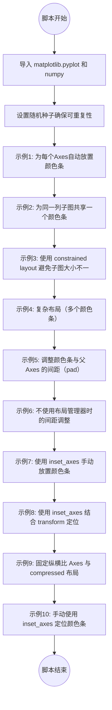
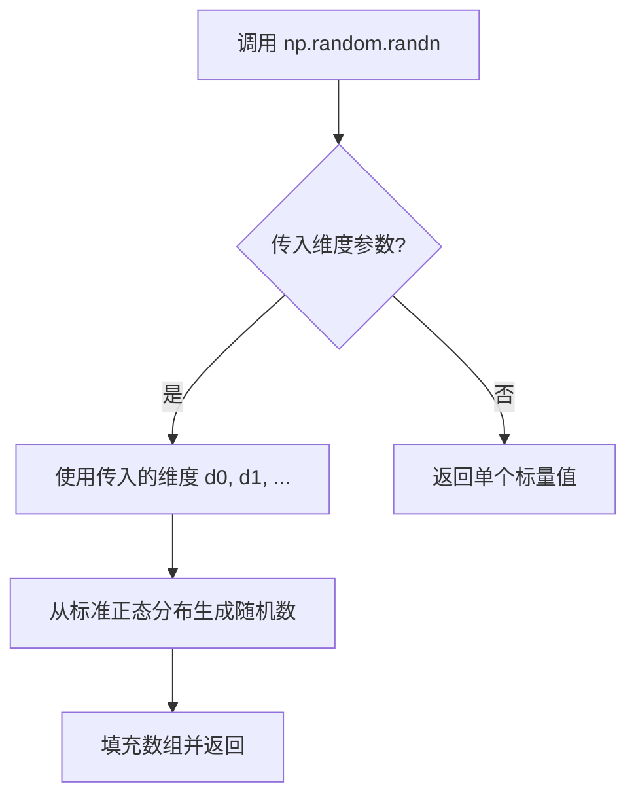
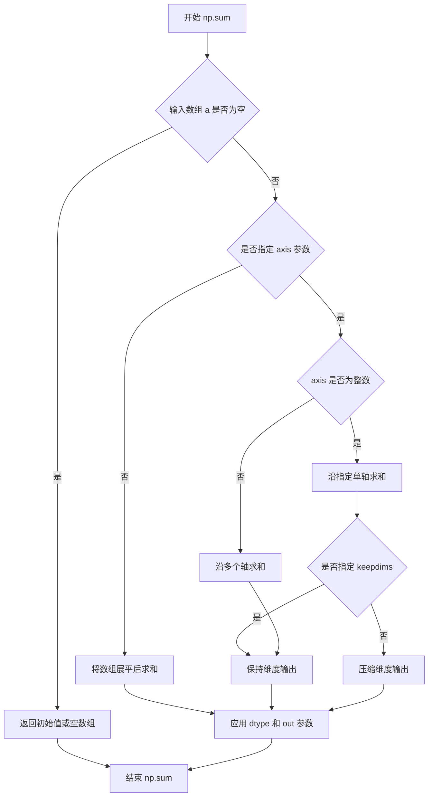
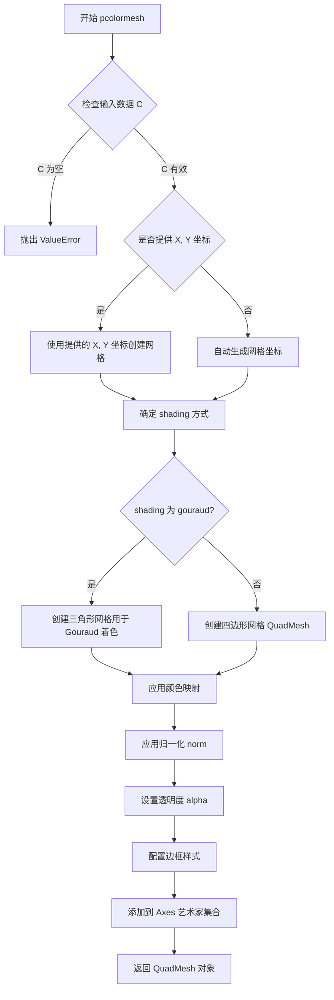
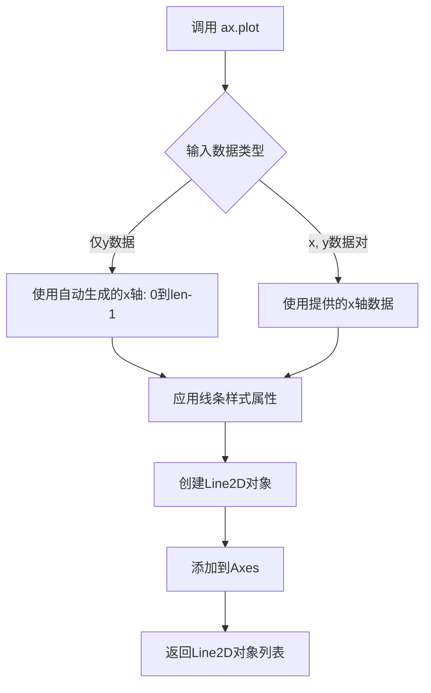
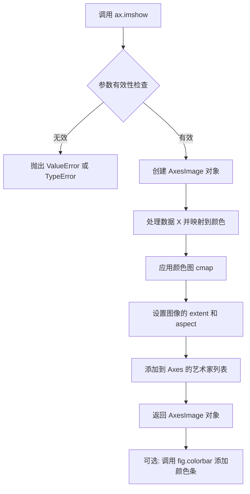
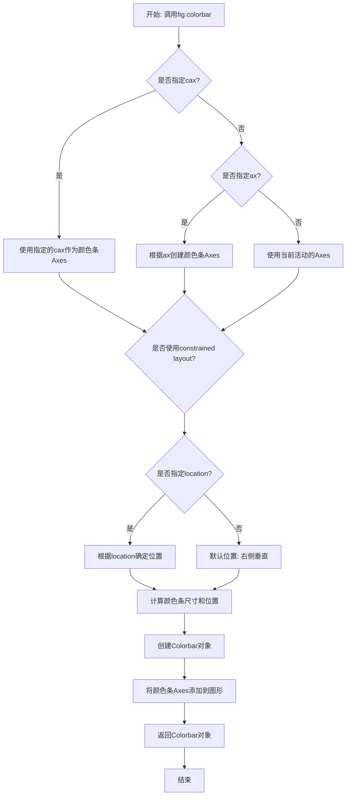
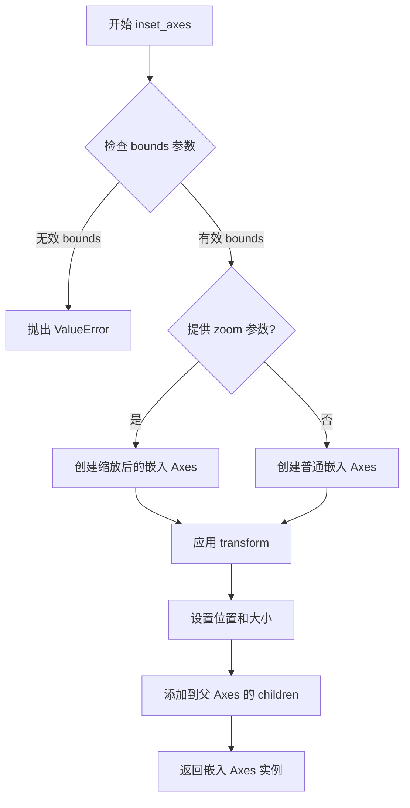
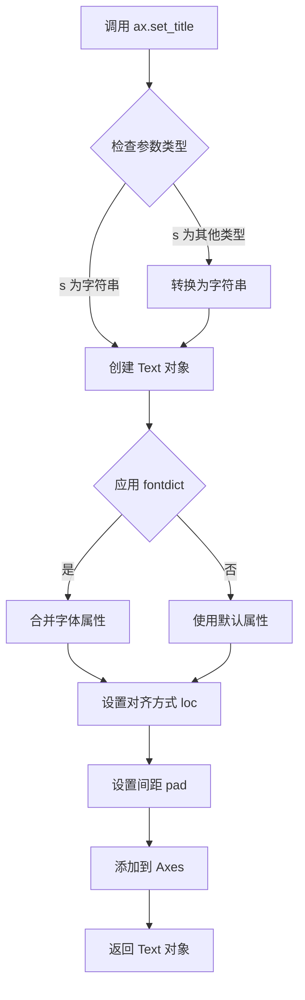
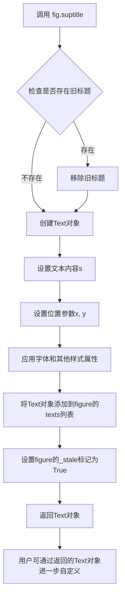

# `matplotlib\galleries\users_explain\axes\colorbar_placement.py` 详细设计文档

该代码是matplotlib的教程示例脚本，展示了在图形中自动或手动放置颜色条（colorbar）的多种方法，包括使用约束布局（constrained layout）、压缩布局（compressed layout）以及inset_axes手动定位，并对比了不同布局管理器下的效果。

## 整体流程



## 类结构

```
无自定义类层次结构（该代码为脚本文件，使用 matplotlib 库函数进行绘图）
```

## 全局变量及字段


### `fig`
    
matplotlib Figure对象，表示整个图形窗口

类型：`Figure`
    


### `axs`
    
Axes对象数组，存储子图集合，支持二维索引访问

类型：`ndarray of Axes`
    


### `ax`
    
当前循环中操作的子图Axes对象

类型：`Axes`
    


### `pcm`
    
颜色映射的数据源对象，由pcolormesh或imshow返回，用于生成colorbar

类型：`QuadMesh 或 AxesImage (ScalarMappable)`
    


### `cmaps`
    
颜色映射名称列表，用于指定子图使用的色彩方案

类型：`list[str]`
    


### `X`
    
20x20的随机正态分布矩阵数据，用于绘图

类型：`ndarray`
    


### `col`
    
循环列索引，用于遍历子图网格的列位置

类型：`int`
    


### `row`
    
循环行索引，用于遍历子图网格的行位置

类型：`int`
    


    

## 全局函数及方法


### plt.subplots

`plt.subplots` 是 matplotlib 库中用于创建图形窗口和一组子图的函数。它可以同时创建 Figure 对象和 Axes 对象（或数组），支持自定义子图布局、共享坐标轴、调整图形尺寸以及指定布局管理器。

参数：

- `nrows`：`int`，默认值 1，子图的行数
- `ncols`：`int`，默认值 1，子图的列数
- `sharex`：`bool` 或 `str`，默认值 False，如果为 True，所有子图共享 x 轴；如果设置为 'col'，则每列子图共享 x 轴
- `sharey`：`bool` 或 `str`，默认值 False，如果为 True，所有子图共享 y 轴；如果设置为 'row'，则每行子图共享 y 轴
- `squeeze`：`bool`，默认值 True，如果为 True，返回的 Axes 数组维度会被适当地压缩（单行或单列时返回一维数组）
- `subplot_kw`：`dict`，可选参数，用于创建子图的额外关键字参数（如 projection、polar 等）
- `gridspec_kw`：`dict`，可选参数，用于控制 GridSpec 的关键字参数
- `figsize`：`tuple`，可选，指定图形的宽和高（英寸）
- `layout`：`str`，可选，布局管理器类型，如 'constrained'、'compressed' 等
- `**kwargs`：其他关键字参数，将传递给 Figure 的构造函数

返回值：`tuple`，返回 (fig, axes)，其中 fig 是 Figure 对象，axes 是 Axes 对象或 Axes 数组

#### 流程图

```mermaid
graph TD
    A[开始 plt.subplots 调用] --> B{参数验证}
    B --> C[创建 Figure 对象]
    C --> D[根据 nrows, ncols 创建子图布局]
    D --> E{使用 gridspec_kw?}
    E -->|是| F[应用 GridSpec 配置]
    E -->|否| G[使用默认布局]
    F --> H[创建 Axes 数组]
    G --> H
    H --> I{sharex 设置?}
    I -->|True| J[配置共享 x 轴]
    I -->|False| K{sharex='col'?}
    J --> L
    K -->|是| L[按列共享 x 轴]
    K -->|否| M{sharex='row'?}
    L --> M
    M -->|是| N[按行共享 x 轴]
    M -->|否| O[不共享 x 轴]
    N --> P
    O --> P
    P --> Q{sharey 设置?}
    Q -->|True| R[配置共享 y 轴]
    Q -->|False| S{sharey='col'?}
    R --> T
    S -->|是| T[按列共享 y 轴]
    S -->|否| U{sharey='row'?}
    T --> U
    U -->|是| V[按行共享 y 轴]
    U -->|否| W[不共享 y 轴]
    V --> X
    W --> X
    X --> Y{squeeze 为 True?}
    Y -->|是| Z[压缩 Axes 数组维度]
    Y -->|否| AA[返回原始 Axes 数组]
    Z --> AB[返回 Figure 和 Axes]
    AA --> AB
    AB[结束: 返回 (fig, axes)]
```

#### 带注释源码

```python
# plt.subplots 函数使用示例代码摘录
# 来源: matplotlib colorbar_placement 示例

# 示例 1: 基本用法 - 创建 2x2 的子图网格
fig, axs = plt.subplots(2, 2)  # 创建包含 4 个子图的 Figure 和 Axes 数组
cmaps = ['RdBu_r', 'viridis']
for col in range(2):
    for row in range(2):
        ax = axs[row, col]  # 通过行列索引访问每个子图
        pcm = ax.pcolormesh(np.random.random((20, 20)) * (col + 1),
                            cmap=cmaps[col])
        fig.colorbar(pcm, ax=ax)

# 示例 2: 共享 x 轴 - 创建 2x1 的子图，共享 x 轴
fig, axs = plt.subplots(2, 1, figsize=(4, 5), sharex=True)
X = np.random.randn(20, 20)
axs[0].plot(np.sum(X, axis=0))
pcm = axs[1].pcolormesh(X)
fig.colorbar(pcm, ax=axs[1], shrink=0.6)

# 示例 3: 使用 constrained 布局管理器
fig, axs = plt.subplots(2, 1, figsize=(4, 5), sharex=True, layout='constrained')
axs[0].plot(np.sum(X, axis=0))
pcm = axs[1].pcolormesh(X)
fig.colorbar(pcm, ax=axs[1], shrink=0.6)

# 示例 4: 创建 3x3 子图网格并使用 constrained 布局
fig, axs = plt.subplots(3, 3, layout='constrained')
for ax in axs.flat:
    pcm = ax.pcolormesh(np.random.random((20, 20)))

fig.colorbar(pcm, ax=axs[0, :2], shrink=0.6, location='bottom')
fig.colorbar(pcm, ax=[axs[0, 2]], location='bottom')
fig.colorbar(pcm, ax=axs[1:, :], location='right', shrink=0.6)
fig.colorbar(pcm, ax=[axs[2, 1]], location='left')

# 示例 5: 创建单个子图
fig, ax = plt.subplots(layout='constrained', figsize=(4, 4))
pcm = ax.pcolormesh(np.random.randn(20, 20), cmap='viridis')
ax.set_ylim([-4, 20])
cax = ax.inset_axes([0.3, 0.07, 0.4, 0.04])
fig.colorbar(pcm, cax=cax, orientation='horizontal')
```

---

### 一段话描述

该代码是 matplotlib 官方文档中关于 colorbar（颜色条）放置的示例教程，演示了如何在 figures 中自动或手动放置 colorbars，包括使用 constrained layout、inset_axes、共享坐标轴等技术手段来优化子图和 colorbar 的布局。

### 文件的整体运行流程

该文件是一个 Jupyter Notebook 格式的 Python 脚本（.py 文件包含 Sphinx 指令），按顺序展示了 colorbar 放置的多种场景：

1. **基础自动放置**：为每个 Axes 附加 colorbar
2. **跨列共享 colorbar**：同一列的子图共享一个 colorbar
3. **共享坐标轴问题**：展示共享 x 轴时 colorbar 导致子图大小不一致
4. **Constrained Layout 解决方案**：使用 layout='constrained' 自动调整布局
5. **复杂布局**：多行多列的复杂 colorbar 布局
6. **调整间距**：使用 pad 参数调整 colorbar 与父 Axes 的距离
7. **手动放置**：使用 inset_axes 手动创建 colorbar 的位置
8. **固定宽高比 Axes**：处理 imshow 等固定宽高比图的 colorbar 问题

### 类的详细信息

#### 全局函数/方法

| 名称 | 类型 | 描述 |
|------|------|------|
| `plt.subplots` | 函数 | 创建图形和子图网格 |
| `fig.colorbar` | 方法 | 为图形添加 colorbar |
| `ax.pcolormesh` | 方法 | 创建伪彩色网格 |
| `ax.plot` | 方法 | 绘制线条图 |
| `ax.imshow` | 方法 | 显示图像 |
| `ax.inset_axes` | 方法 | 创建嵌入的 Axes |
| `ax.set_ylim` | 方法 | 设置 y 轴范围 |
| `ax.set_title` | 方法 | 设置子图标题 |

#### 关键组件信息

| 组件名称 | 一句话描述 |
|----------|------------|
| Figure | matplotlib 中的图形容器，包含所有子图和元素 |
| Axes | 子图对象，代表一个独立的绘图区域 |
| Colorbar | 颜色条，用于可视化数据的数值范围 |
| GridSpec | 网格规格定义器，控制子图布局 |
| Constrained Layout | 自动调整子图和 colorbar 布局的引擎 |

### 潜在的技术债务或优化空间

1. **重复代码**：多个示例中存在重复的 `pcolormesh` 创建逻辑，可以提取为函数
2. **魔法数字**：padding 值 (0.05, 0.15, 0.025, 0.1) 应定义为常量
3. **布局管理器选择**：未比较 'constrained' vs 'compressed' vs 'tight_layout' 的性能差异
4. **随机数据**：使用 `np.random` 生成的数据不具确定性，文档演示可能每次运行结果不同

### 其它项目

#### 设计目标与约束

- **目标**：演示 colorbar 的多种放置方式，帮助用户选择最适合其用例的方法
- **约束**：colorbar 会占用父 Axes 的空间，需要谨慎处理布局

#### 错误处理与异常设计

- 当不使用布局管理器时，colorbar 可能超出图形边界（如最后一个示例中使用 inset_axes 且无 layout 时）
- 固定宽高比的 Axes 在调整大小时可能导致 colorbar 长度不匹配

#### 数据流与状态机

- 创建 Figure → 添加 Axes → 绘制数据 (pcolormesh/plot/imshow) → 添加 colorbar → 调整布局
- 状态转换：初始化 → 数据绑定 → 布局计算 → 渲染

#### 外部依赖与接口契约

- 依赖：`matplotlib.pyplot`, `numpy`
- 接口：`plt.subplots()` 返回 (Figure, Axes) 元组，`fig.colorbar()` 需要绑定到 ScalarMappable 对象（如 pcm）


### `np.random.seed`

设置 NumPy 随机数生成器的全局种子，用于确保随机数序列的可重复性，使得每次运行代码时生成的随机数据保持一致。

参数：

- `seed`：`int` 或 `None`，随机数生成器的种子值。如果为 `None`，则每次调用都会使用不同的随机种子；如果为整数，则每次运行都生成相同的随机数序列。

返回值：`None`，该函数不返回任何值，仅修改全局随机数状态。

#### 流程图

```mermaid
graph TD
    A[开始] --> B{传入 seed 参数}
    B -->|整数| C[设置全局随机种子为指定整数值]
    B --> None[D[使用系统 entropy 初始化种子]
    C --> D
    D --> E[后续 np.random 函数调用将基于此种子生成确定性随机数]
    E --> F[结束]
```

#### 带注释源码

```python
# 设置随机数生成器的种子为 19680801
# 19680801 是 matplotlib 官方示例中常用的一个日期（1968年8月8日01时）
# 设置这个特定值是为了使得每次运行代码时生成的随机数据完全相同
# 这样可以确保示例代码的输出是可重现的和确定性的
np.random.seed(19680801)

# 后续调用 np.random.random() 将生成相同的随机数序列
# 例如：np.random.random((20, 20)) 每次都会生成相同的 20x20 随机矩阵
```


### `np.random.random`

生成指定形状的随机数组，数组元素取值范围为 [0.0, 1.0)，通常用于生成测试数据或模拟随机场景。

参数：

- `size`：`int` 或 `tuple of ints`，可选参数。输出数组的形状，例如 `(20, 20)` 表示生成 20 行 20 列的二维数组。默认值为 `None`，此时返回一个单一的浮点数。

返回值：`float` 或 `ndarray`，返回随机值或随机数组。当 `size` 为 `None` 时返回单个 `[0.0, 1.0)` 区间的浮点数；当 `size` 指定形状时返回对应形状的 numpy 数组。

#### 流程图

```mermaid
flowchart TD
    A[开始] --> B{是否指定 size 参数?}
    B -- 是 --> C[根据 size 创建指定形状的数组]
    B -- 否 --> D[生成单个随机浮点数]
    C --> E[为每个数组元素生成 [0.0, 1.0) 区间的随机数]
    E --> F[返回 ndarray]
    D --> G[返回 float]
    F --> H[结束]
    G --> H
```

#### 带注释源码

```python
# np.random.random 函数源码结构

# 函数签名: numpy.random.random(size=None)
# 
# 参数:
#   size: int 或 tuple of ints, 可选
#         输出数组的形状。例如:
#         - None: 返回单个浮点数
#         - (20, 20): 返回 20x20 的二维数组
#         - (10, 10, 10): 返回 10x10x10 的三维数组
#
# 返回值:
#   - float: 当 size=None 时
#   - ndarray: 当 size 指定形状时
#   - 取值范围: [0.0, 1.0)

# 在本代码中的典型调用方式:
random_array = np.random.random((20, 20))  # 生成 20x20 的随机数组

# 代码上下文使用示例:
# 1. 用于 pcolormesh 生成随机数据可视化
pcm = ax.pcolormesh(np.random.random((20, 20)) * (col + 1), cmap=cmaps[col])
#    - np.random.random((20, 20)) 生成 20x20 的随机数组
#    - * (col + 1) 对数据进行缩放

# 2. 用于生成不同规模的随机数据矩阵
X = np.random.randn(20, 20)  # 注意: 这是 random.randn，不是 random

# 3. 用于生成随机数据并通过 pcolormesh 展示
pcm = ax.pcolormesh(np.random.randn(20, 20), cmap='viridis')
```


### `np.random.randn`

生成符合标准正态分布（均值为0，标准差为1的高斯分布）的随机数组。

参数：

- `*dimensions`：可变数量的整数参数，表示输出数组的维度。例如 `np.random.randn(20, 20)` 生成 20×20 的二维数组，`np.random.randn(5)` 生成一维数组。
- 类型：`int`（可变数量）

返回值：

- `ndarray` - 包含从标准正态分布中抽取的随机浮点数的数组，dtype 为 float64。

#### 流程图



#### 带注释源码

```python
# np.random.randn 是 NumPy 随机数生成器的成员方法
# 函数签名: np.random.randn(d0, d1, ..., dn)

# 在代码中的实际使用示例:
X = np.random.randn(20, 20)  # 生成 20x20 的二维数组，元素服从标准正态分布
# 等价于: np.random.normal(loc=0.0, scale=1.0, size=(20, 20))

# 另一个使用示例 (用于生成颜色映射数据):
pcm = ax.pcolormesh(np.random.randn(20, 20), cmap='viridis')
# 这里 np.random.randn(20, 20) 生成 20x20 的随机矩阵用于可视化

# 参数说明:
# - d0, d1, ..., dn: 整数，每个维度的大小
# - 返回: shape 为 (d0, d1, ..., dn) 的 ndarray
# - 数据范围: 理论上为 (-∞, +∞)，实际集中在 [-3, 3] 区间内（约99.7%的数据）
```


### np.sum

NumPy 库中的全局函数，用于计算数组元素的总和，支持沿指定轴求和、指定数据类型、输出到指定数组等功能。

参数：

- `a`：`array_like`，输入数组，待求和的元素来源
- `axis`：`None` 或 `int` 或 `int` 元组，可选，指定求和的轴。默认为 None，即展开数组所有元素求和
- `dtype`：`dtype`，可选，指定返回数组的数据类型，默认为与输入数组相同
- `out`：`ndarray`，可选，用于存放结果的数组，必须具有合适的形状
- `keepdims`：`bool`，可选，若为 True，则输出的数组会保持原来的维度
- `initial`：`标量`，可选，求和的起始值
- `where`：`array_like of bool`，可选，只对满足条件的元素求和

返回值：`ndarray`，求和结果

#### 流程图



#### 带注释源码

```python
# 代码中的实际调用方式
np.sum(X, axis=0)

# 完整的函数签名（参考 NumPy 官方文档）
# numpy.sum(a, axis=None, dtype=None, out=None, keepdims=<no value>, initial=<no value>, where=<no value>)

# 参数说明：
# - X: 输入的二维数组，形状为 (20, 20)
# - axis=0: 沿第一个轴（行方向）求和，即计算每一列的总和
# - 返回值: 形状为 (20,) 的一维数组，包含每列的元素之和

# 示例：
# X = [[a00, a01, a02, ...],
#      [a10, a11, a12, ...],
#      ...
#      [a19, a19, a19, ...]]
# np.sum(X, axis=0) = [a00+a10+...+a19, a01+a11+...+a19, a02+a12+...+a19, ...]
```


### `ax.pcolormesh`

该方法是 matplotlib 中 Axes 对象的成员方法，用于创建伪彩色图（pseudocolor plot），即将二维数组数据可视化为彩色网格图。它是绘制 2D 数据的基本方法之一，支持指定 X 和 Y 坐标、颜色映射（colormap）等参数，常用于热图、矩阵可视化等场景。

参数：

- `X`：`array_like`，可选，指定网格的 X 坐标，形状为 (M, N) 或 (M+1, N+1)，若为 (M, N) 则表示单元格的顶点坐标
- `Y`：`array_like`，可选，指定网格的 Y 坐标，形状为 (M, N) 或 (M+1, N+1)，若为 (M, N) 则表示单元格的顶点坐标
- `C`：`array_like`，必需，要绘制的数据数组，形状为 (M, N)，表示每个单元格的值
- `cmap`：`str` 或 `Colormap`，可选，颜色映射名称或 Colormap 对象，用于将数据值映射为颜色，默认为 None
- `norm`：`Normalize`，可选，数据归一化对象，用于将数据值映射到 [0, 1] 区间，默认为 None
- `vmin, vmax`：`float`，可选，颜色映射的最小值和最大值，若指定则覆盖 norm 的范围
- `shading`：`{'flat', 'nearest', 'gouraud', 'auto'}`，可选，着色方式，'flat' 表示单元格使用单一颜色，'nearest' 表示使用相邻单元格的颜色插值，'gouraud' 表示 Gouraud 着色（渐变），默认为 'flat' 或根据数组形状自动判断
- `alpha`：`float`，可选，透明度，范围 0-1，默认为 None
- `snap`：`bool`，可选，是否对齐像素边界，默认为 None
- `rasterized`：`bool`，可选，是否将矢量图栅格化，默认为 False
- `edgecolors`：`None`, `'none'`, `color` 或 `color array`，可选，单元格边框颜色，默认为 None
- `linewidths`：`float` 或 `array-like`，可选，单元格边框线宽，默认为 None
- `capstyle`：`{'butt', 'round', 'projecting'}`，可选，边框端点样式，默认为 None
- `joinstyle`：`{'miter', 'round', 'bevel'}`，可选，边框连接样式，默认为 None
- `antialiased`：`bool` 或 `None`，可选，是否启用抗锯齿，默认为 None
- `data`：`Indexable`，可选，用于数据绑定的索引对象

返回值：`QuadMesh`，返回一个 `matplotlib.collections.QuadMesh` 对象，表示绘制的伪彩色网格，可用于后续添加颜色条（colorbar）等操作。

#### 流程图



#### 带注释源码

```python
# pcolormesh 函数源码结构（基于 matplotlib 源码简化）
def pcolormesh(self, X, Y, C, cmap=None, norm=None, vmin=None, vmax=None,
                shading='auto', alpha=None, snap=None, rasterized=False,
                edgecolors=None, linewidths=None, capstyle=None, 
                joinstyle=None, antialiased=None, data=None, **kwargs):
    """
    绘制伪彩色图
    
    参数:
        X: array_like, 可选, X 坐标
        Y: array_like, 可选, Y 坐标
        C: array_like, 必需, 数据数组
        cmap: str 或 Colormap, 颜色映射
        norm: Normalize, 归一化对象
        vmin, vmax: float, 颜色范围
        shading: str, 着色方式
        alpha: float, 透明度
        ...
    
    返回:
        QuadMesh: 网格集合对象
    """
    
    # 1. 数据验证与预处理
    C = np.asarray(C)  # 转换为数组
    if C.ndim != 2:
        raise ValueError('C must be 2D array')
    
    # 2. 坐标处理
    if X is None:
        # 自动生成 X 坐标 (列索引)
        X = np.arange(C.shape[1] + 1)
    if Y is None:
        # 自动生成 Y 坐标 (行索引)
        Y = np.arange(C.shape[0] + 1)
    
    # 3. 确保坐标形状正确
    # 对于 'flat' shading: X, Y 形状应为 (M+1, N+1) 表示顶点
    # C 形状应为 (M, N) 表示单元格
    
    # 4. 确定 shading 方式
    if shading == 'auto':
        # 根据数组形状自动判断
        shading = 'flat'
    
    # 5. 创建颜色映射
    if cmap is None:
        cmap = plt.rcparams.get('image.cmap', 'viridis')
    if not isinstance(cmap, Colormap):
        cmap = get_cmap(cmap)
    
    # 6. 创建归一化对象
    if norm is None:
        if vmin is not None or vmax is not None:
            norm = Normalize(vmin=vmin, vmax=vmax)
        else:
            norm = Normalize()
    
    # 7. 创建 QuadMesh 或 GouraudMesh
    if shading == 'gouraud':
        # Gouraud 着色需要三角网格
        collection = QuadMesh(...)
        # 转换为三角形用于渐变着色
    else:
        # 标准的四边形网格
        collection = QuadMesh(
            coordinates,  # X, Y 坐标
            C,            # 数据
            cmap=cmap,
            norm=norm,
            **kwargs
        )
    
    # 8. 设置艺术家属性
    collection.set_alpha(alpha)
    collection.set_edgecolors(edgecolors)
    collection.set_linewidths(linewidths)
    # ... 其他样式设置
    
    # 9. 添加到 Axes
    self.add_collection(collection, autoscale=True)
    
    # 10. 调整坐标轴范围
    self.autoscale_view()
    
    return collection
```


### ax.plot

在给定代码中，`ax.plot` 是 matplotlib 库的标准方法，用于在 Axes 对象上绘制线条图。代码中唯一一次直接调用是在第 71 行：`axs[0].plot(np.sum(X, axis=0))`，用于绘制矩阵 X 列方向求和后的折线图。

参数：

- `X`：numpy 数组，要绑制的数据
- `*args`：可变位置参数，接受 (x, y) 数据对或单一 y 数据数组
- `**kwargs`：关键字参数，支持颜色、线型、标记样式等 matplotlib 线条属性

返回值：`list of ~matplotlib.lines.Line2D`，返回绑制线条的 Line2D 对象列表

#### 流程图



#### 带注释源码

```python
# 代码中的实际调用 (第71行)
axs[0].plot(np.sum(X, axis=0))

# X 是 20x20 的随机矩阵
# np.sum(X, axis=0) 对矩阵按列求和，得到长度为20的一维数组
# 结果是一个展示每列总和分布的折线图
# 
# 等效的完整调用可以是这样:
# axs[0].plot(np.sum(X, axis=0), color='blue', linewidth=1.5, label='column sum')
```

> **注意**：此代码片段是一个 matplotlib 教程示例，核心功能是演示 **colorbar（颜色条）的放置方法**，而非 `ax.plot` 方法本身。`ax.plot` 在这里仅用于生成示例数据图表。如果您需要了解完整的 matplotlib 绘图功能，建议参考 matplotlib 官方文档。


### `ax.imshow`

在 Axes 对象上绘制二维数组作为图像，返回一个 AxesImage 对象，可选地附加颜色条。

参数：

- `X`：`array-like`，要显示的图像数据，通常是二维数组（如 numpy.ndarray）
- `cmap`：`str`，可选，默认值由 rcParams 决定。用于映射数据值到颜色的颜色图（colormap）名称，如 'viridis'、'RdBu_r' 等
- `extent`：`tuple of 4 floats`，可选。图像的坐标范围，格式为 (xmin, xmax, ymin, ymax)
- `aspect`：`{'auto', 'equal'} or float`，可选。控制 Axes 的纵横比
- `interpolation`：`str`，可选。插值方法，如 'nearest'、'bilinear'、'antialiased' 等
- `transform`：`matplotlib.transforms.Transform`，可选。用于定位的变换对象

返回值：`matplotlib.image.AxesImage`，返回创建的 AxesImage 对象，包含图像数据和相关属性

#### 流程图



#### 带注释源码

```python
# 代码中的调用示例 1: 基础用法
fig, ax = plt.subplots(layout='constrained', figsize=(4, 4))
pcm = ax.imshow(np.random.randn(10, 10), cmap='viridis')  # 绘制 10x10 随机图像，使用 viridis 颜色图
fig.colorbar(pcm, ax=ax)  # 添加颜色条

# 代码中的调用示例 2: 使用 transform 指定数据坐标
fig, ax = plt.subplots(layout='constrained', figsize=(4, 4))
pcm = ax.imshow(np.random.randn(10, 10), cmap='viridis')
ax.set_ylim([-4, 20])
cax = ax.inset_axes([7.5, -1.7, 5, 1.2], transform=ax.transData)  # 在指定数据位置创建颜色条
fig.colorbar(pcm, cax=cax, orientation='horizontal')

# 典型的 imshow 方法签名（matplotlib 内部实现概要）
def imshow(self, X, cmap=None, extent=None, aspect='auto', 
           interpolation=None, transform=None, **kwargs):
    """
    在 Axes 上显示图像数据。
    
    参数:
        X: array-like - 输入图像数据
        cmap: str or Colormap - 颜色图
        extent: tuple - 图像坐标 [left, right, bottom, top]
        aspect: str or float - 纵横比
        interpolation: str - 插值方式
        transform: Transform - 坐标系变换
        **kwargs: 传递给 AxesImage 的其他参数
    """
    # 1. 处理输入数据 X，转换为 numpy 数组
    # 2. 根据 cmap 参数创建或获取颜色图
    # 3. 创建 AxesImage 对象
    # 4. 设置图像的 extent、aspect 等属性
    # 5. 设置插值方式
    # 6. 添加到 Axes 并返回
    return image.AxesImage(self, cmap=cmap, extent=extent, 
                          aspect=aspect, interpolation=interpolation,
                          transform=transform, **kwargs)
```


### `Figure.colorbar`

为图形添加颜色条（Colorbar），用于显示图像或伪彩色数据的颜色映射与数值范围的对应关系。

参数：

- `mappable`：`matplotlib.cm.ScalarMappable`，要为其创建颜色条的可映射对象（如 `pcm` 通过 `pcolormesh` 或 `imshow` 返回的对象）
- `ax`：`axes.Axes` 或 `Axes` 列表`[可选]`，要附加颜色条的 Axes 对象或 Axes 列表
- `cax`：`axes.Axes` `[可选]`，用于放置颜色条的自定义 Axes
- `use_gridspec`：`bool` `[可选]`，如果为 True，则使用 gridspec 创建颜色条Axes

返回值：`colorbar.Colorbar`，颜色条对象

#### 流程图



#### 带注释源码

注意：以下源码基于matplotlib官方文档和代码使用示例重构，并非原始实现源码。`fig.colorbar`的实际实现位于matplotlib库内部。

```python
def colorbar(self, mappable, cax=None, ax=None, use_gridspec=True, **kwargs):
    """
    为图形添加颜色条。
    
    参数:
    ------
    mappable : ScalarMappable
        要显示的颜色映射对象，通常是 pcolormesh() 或 imshow() 的返回值
        
    cax : Axes, optional
        用于放置颜色条的自定义 Axes。如果未指定，将自动创建。
        
    ax : Axes or list of Axes, optional
        要附加颜色条的 Axes。如果为列表，则颜色条将跨越多个 Axes。
        
    use_gridspec : bool, default: True
        如果 cax 为 None 且 ax 为单个 Axes，则使用 gridspec 
        创建新的颜色条 Axes（如果可能）
        
    **kwargs : dict
        传递给 Colorbar 的其他参数，如:
        - cmap: Colormap, 颜色映射
        - norm: Normalize, 归一化对象
        - orientation: {'vertical', 'horizontal'}, 方向
        - label: str, 颜色条标签
        - shrink: float, 缩放因子
        - location: str, 位置 ('left', 'right', 'top', 'bottom')
        - pad: float, 与父 Axes 的间距
        - aspect: int, 宽度/高度比
        
    返回值:
    -------
    colorbar : Colorbar
        颜色条对象
        
    示例:
    ------
    >>> fig, ax = plt.subplots()
    >>> pcm = ax.pcolormesh(data)
    >>> fig.colorbar(pcm, ax=ax)
    
    >>> # 跨越多个 Axes 的颜色条
    >>> fig.colorbar(pcm, ax=axs[:, 0])
    
    >>> # 自定义位置
    >>> fig.colorbar(pcm, location='bottom', ax=ax)
    """
    # 创建颜色条路由器的示例逻辑
    # 实际实现位于 matplotlib.figure.colorbar 模块中
    
    # 1. 确定颜色条 Axes 的位置
    if cax is not None:
        # 使用用户提供的颜色条 Axes
        colorbar_ax = cax
    else:
        # 自动创建颜色条 Axes
        if ax is None:
            # 使用当前活动的 Axes
            ax = self.gca()
        
        # 根据布局管理器创建适当的颜色条 Axes
        colorbar_ax = self._make_colorbar_ax(ax, use_gridspec, **kwargs)
    
    # 2. 创建 Colorbar 对象
    cb = colorbar.Colorbar(colorbar_ax, mappable, **kwargs)
    
    # 3. 将颜色条对象与 Figure 关联
    self._colorbars.append(cb)
    
    # 4. 调整布局（如果使用 constrained layout）
    if self.get_layout_engine() is not None:
        self.get_layout_engine().adjust_compatible()
    
    return cb
```

#### 使用示例分析

从提供的代码中可以看到 `fig.colorbar` 的多种使用模式：

1. **基础用法**：绑定到单个 Axes
```python
fig.colorbar(pcm, ax=ax)
```

2. **跨多个 Axes**：共享一个颜色条
```python
fig.colorbar(pcm, ax=axs[:, col], shrink=0.6)
```

3. **调整位置和间距**：
```python
fig.colorbar(pcm, ax=ax, pad=pad, label=f'pad: {pad}')
```

4. **指定位置**（left, right, top, bottom）：
```python
fig.colorbar(pcm, ax=axs[0, :2], shrink=0.6, location='bottom')
```

5. **使用自定义颜色条 Axes**（通过 inset_axes）：
```python
cax = ax.inset_axes([0.3, 0.07, 0.4, 0.04])
fig.colorbar(pcm, cax=cax, orientation='horizontal')
```

6. **水平颜色条**：
```python
fig.colorbar(pcm, cax=cax, orientation='horizontal')
```

### 关键组件信息

| 组件名称 | 描述 |
|---------|------|
| `ScalarMappable` | 包含颜色映射和归一化数据的对象 |
| `Colorbar` | 颜色条的核心类，管理颜色条的外观和行为 |
| `inset_axes` | 在父 Axes 内创建嵌入的 Axes，用于手动放置颜色条 |
| `constrained layout` | 布局管理器，自动处理颜色条与主 Axes 的空间分配 |

### 技术债务与优化空间

1. **布局兼容性**：不使用 `constrained layout` 时，颜色条可能与主 Axes 发生重叠或间距不当
2. **固定宽高比 Axes**：当 Axes 具有固定宽高比时，颜色条可能超出图形边界
3. **多子图对齐**：共享颜色条时，不同子图大小可能不一致

### 其他项目

**设计目标**：
- 提供灵活的颜色条放置机制
- 支持自动布局和手动定位
- 与 matplotlib 的各种布局管理器兼容

**约束**：
- 颜色条需要与至少一个 ScalarMappable 对象关联
- 使用 `constrained layout` 时效果最佳

**错误处理**：
- 如果未提供 mappable，抛出 `ValueError`
- 如果 cax 与 ax 不在同一图形中，抛出 `ValueError`

**外部依赖**：
- `matplotlib.cm`：颜色映射模块
- `matplotlib.colors`：颜色归一化
- `matplotlib.layout_engine`：布局管理


### Axes.inset_axes

创建嵌入的 Axes（在父 Axes 内部创建一个新的子 Axes），用于在主图表区域内放置额外的子图表，如颜色条（colorbar）或其他辅助可视化。

参数：

- `self`：`Axes`，调用此方法的 Axes 实例（隐式参数，无需显式传递）
- `bounds`：`list[float]`，嵌入 Axes 的位置和大小，格式为 `[x, y, width, height]`
- `transform`：`transforms.Transform`，指定 `bounds` 的坐标系，默认为 `ax.transAxes`（轴坐标系），可选 `ax.transData`（数据坐标系）等
- `zoom`：`float | None`，可选的缩放因子，用于创建具有缩放功能的嵌入 Axes
- `**kwargs`：其他关键字参数，传递给创建 Axes 的底层方法

返回值：`Axes`，新创建的嵌入 Axes 实例

#### 流程图



#### 带注释源码

```python
def inset_axes(self, bounds, transform='axes_fraction', *, zoom=None, **kwargs):
    """
    在当前 Axes 内创建一个嵌入的子 Axes（inset Axes）。
    
    Parameters
    ----------
    bounds : list of [x, y, width, height]
        嵌入 Axes 的位置和大小。
        - x, y: 嵌入 Axes 左下角的位置
        - width, height: 嵌入 Axes 的宽度和高度
        具体含义取决于 transform 参数
        
    transform : {'axes_fraction', 'data'}, default: 'axes_fraction'
        指定 bounds 的坐标系：
        - 'axes_fraction': 相对父 Axes 的比例（0-1）
        - 'data': 数据坐标系
        - 也可以是其他 Transform 对象
        
    zoom : float, optional
        缩放因子。如果提供，创建的嵌入 Axes 会显示父 Axes
        的缩放视图（类似放大镜效果）
        
    **kwargs
        传递给 Axes 创建的其他参数，如 'projection', 'zorder' 等
        
    Returns
    -------
    inset_ax : Axes
        新创建的嵌入 Axes 实例
    """
    # 创建子 Axes，继承父 Axes 的部分属性
    if zoom is not None:
        # 如果提供了 zoom 参数，创建缩放视图的嵌入 Axes
        inset_ax = self._add_inset_axes_zoom(bounds, zoom, transform, **kwargs)
    else:
        # 创建普通的嵌入 Axes
        inset_ax = self._add_inset_axes(bounds, transform, **kwargs)
    
    # 将嵌入 Axes 添加到父 Axes 的子 Axes 列表中
    self._inset_axes.append(inset_ax)
    
    # 设置父子关系，便于后续布局管理
    inset_ax._parent = self
    
    return inset_ax


def _add_inset_axes(self, bounds, transform, **kwargs):
    """创建普通的嵌入 Axes（无缩放）"""
    # 将 bounds 转换为位置参数
    # 根据 transform 确定坐标系
    if transform == 'axes_fraction':
        transform = self.transAxes
    elif transform == 'data':
        transform = self.transData
    
    # 创建新 Axes，inherit=False 表示不继承父 Axes 的属性
    ax = Axes(self.figure, self.get_position(bounds=bounds), 
              transform=transform, **kwargs)
    
    # 设置 axes_locator 以便在布局中正确处理
    ax.set_axes_locator(InsetLocator(self, bounds))
    
    return ax


def _add_inset_axes_zoom(self, bounds, zoom, transform, **kwargs):
    """创建带缩放功能的嵌入 Axes"""
    # 类似的创建过程，但添加缩放相关的属性
    ax = self._add_inset_axes(bounds, transform, **kwargs)
    
    # 设置缩放相关的视图范围
    ax._zoom_mode = True
    ax._zoom_factor = zoom
    
    return ax
```


### `Axes.set_ylim`

设置 Axes 对象的 y 轴范围（上下限），用于控制图表在 y 轴方向的显示区间。

参数：

- `ylim`：`sequence`，y 轴范围的限值，形式为 `(bottom, top)` 或 `[bottom, top]`，其中 `bottom` 为下限，`top` 为上限

返回值：`tuple`，返回新的 y 轴范围 `(bottom, top)`

#### 流程图

```mermaid
flowchart TD
    A[调用 set_ylim] --> B{传入参数类型}
    B -->|单个序列| C[解析为 bottom, top]
    B -->|两个独立参数| D[直接作为 bottom, top]
    C --> E[调用 _set_lim]
    D --> E
    E --> F{emit 参数}
    F -->|True| G[通知观察者范围已更改]
    F -->|False| H[不通知]
    G --> I[返回新范围 (bottom, top)]
    H --> I
```

#### 带注释源码

```python
# 代码中的实际调用示例
ax.set_ylim([-4, 20])
# -4: y 轴下限
# 20: y 轴上限

# matplotlib 内部实现机制（简化版）
def set_ylim(self, bottom=None, top=None, emit=False, auto=False,
             *, ymin=None, ymax=None):
    """
    Set the y-axis view limits.
    
    Parameters:
    -----------
    bottom : float, optional
        The bottom ylim in data coordinates. Pass None to leave unchanged.
    top : float, optional
        The top ylim in data coordinates. Pass None to leave unchanged.
    emit : bool, default: False
        Whether to notify observers of limit change.
    auto : bool, default: False
        Whether to turn on autoscaling.
    
    Returns:
    --------
    bottom, top : tuple
        The new y-axis limits in data coordinates.
    """
    # 将输入参数转换为 (bottom, top) 形式
    self._set_lim('y', bottom, top, emit=emit, auto=auto)
    return self.get_ylim()  # 返回新的范围
```


### `Axes.set_title`

设置子图（Axes）的标题，可以指定字体属性、对齐方式和间距等。

参数：

- `s`：`str`，标题文本内容
- `fontdict`：`dict`，可选，字体属性字典，用于控制标题的字体样式、大小、颜色等
- `loc`：`str`，可选，标题对齐方式，可选值为 'center'（默认）、'left'、'right'
- `pad`：`float`，可选，标题与 Axes 顶部的间距，单位为点数（points），默认为 rcParams 中设置的值
- `**kwargs`：关键字参数，其他传递给 `matplotlib.text.Text` 的属性，如 fontsize、color、fontweight 等

返回值：`matplotlib.text.Text`，返回创建的文本对象，可用于后续修改标题样式

#### 流程图



#### 带注释源码

```python
def set_title(self, s, fontdict=None, loc='center', pad=None, **kwargs):
    """
    Set a title for the Axes.
    
    Parameters
    ----------
    s : str
        The title text string.
        
    fontdict : dict, optional
        A dictionary to control the appearance of the title,
        e.g., {'fontsize': 12, 'fontweight': 'bold', 'color': 'red'}.
        
    loc : {'center', 'left', 'right'}, default: 'center'
        The title horizontal alignment.
        
    pad : float, default: rcParams['axes.titlepad']
        The offset of the title from the top of the Axes.
        
    **kwargs
        Additional keyword arguments are passed to the Text constructor.
        
    Returns
    -------
    text : matplotlib.text.Text
        The created Text object. This can be used to modify
        the title after creation, e.g., changing color or font size.
        
    Examples
    --------
    >>> ax.set_title('My Title')
    >>> ax.set_title('Colored Title', color='red', fontsize=14)
    >>> ax.set_title('Left Aligned', loc='left', pad=10.0)
    """
    # 将输入转换为字符串，确保标题文本有效
    title = cbook._string_to_str(s)
    
    # 如果提供了 fontdict，则将其与其他 kwargs 合并
    # fontdict 的优先级低于直接传入的 kwargs
    if fontdict is not None:
        kwargs.update(fontdict)
    
    # 获取默认的标题间距（如果未指定 pad）
    default_pad = mpl.rcParams['axes.titlepad']
    if pad is None:
        pad = default_pad
    
    # 调用 _set_title_offset_trans 方法设置标题的偏移量
    # 创建新的 Text 对象，设置其位置在 Axes 顶部中央
    title_obj = self.text(
        0.5, 1.0, title,
        transform=self.transAxes,
        horizontalalignment=loc,
        verticalalignment='baseline',
        pad=pad,
        **kwargs
    )
    
    # 设置标题的垂直对齐方式为顶部
    title_obj.set_verticalalignment('top')
    
    # 保存标题对象到 Axes 的 _title_offset_transform 中
    self._set_title_offset_trans(title_obj)
    
    return title_obj
```


### Figure.suptitle

该方法是matplotlib Figure类的成员函数，用于在图形的顶部居中添加一个主标题。该方法创建一个Text对象并返回，可通过返回的Text对象进一步自定义标题的字体、大小、颜色、对齐方式等属性。

参数：

- `s`：`str`，要显示的标题文本内容
- `x`：`float`，标题的x位置（默认为0.5，即水平居中）
- `y`：`float`，标题的y位置（默认为0.98，接近顶部）
- `horizontalalignment` 或 `ha`：`str`，水平对齐方式，可选'center', 'left', 'right'（默认为'center'）
- `verticalalignment` 或 `va`：`str`，垂直对齐方式，可选'top', 'center', 'bottom'（默认为'top'）
- `fontsize` 或 `size`：`int`或`str`，字体大小（如12, 'medium', 'large'）
- `fontweight` 或 `weight`：`str`或`int`，字体粗细（如'normal', 'bold', 600）
- `fontproperties`：`matplotlib.font_manager.FontProperties`，字体属性对象
- `alpha`：`float`，标题透明度（0-1之间）
- `color`：`str`，标题文字颜色
- `wrap`：`bool`，是否允许标题换行（默认为True）

返回值：`matplotlib.text.Text`，返回创建的Text对象，可用于后续自定义或获取标题属性

#### 流程图



#### 带注释源码

```python
def suptitle(self, s, x=0.5, y=0.98, **kwargs):
    """
    在figure顶部添加居中的主标题。
    
    Parameters
    ----------
    s : str
        标题文本内容
    x : float, optional
        标题的x轴位置，默认为0.5（水平居中）
    y : float, optional
        标题的y轴位置，默认为0.98（接近顶部）
    **kwargs : 
        传递给matplotlib.text.Text的关键字参数，
        可包括fontsize, fontweight, color, alpha, 
        horizontalalignment, verticalalignment等
    
    Returns
    -------
    matplotlib.text.Text
        创建的Text对象，可用于后续自定义
    """
    # 如果已存在旧标题，先移除它
    if self._suptitle is not None:
        self._suptitle.remove()
    
    # 创建Text对象，设置位置和文本
    # x, y使用normalized coordinates (0-1)
    self._suptitle = super().text(
        x, y, s,  # 设置标题位置和文本
        ha='center',  # 水平居中
        va='top',     # 顶部对齐
        **kwargs      # 传递其他样式参数
    )
    
    # 将_suptitle属性关联到figure，确保figure在需要时重新渲染
    self._suptitle.figure = self
    
    # 标记figure需要更新（重新渲染）
    self.stale_callback = self._suptitle.stale_callback
    
    return self._suptitle
```


## 关键组件


### pcolormesh
用于创建伪彩色网格图的函数，基于随机数据生成可视化热力图

### colorbar
颜色条组件，用于显示图像数据的数值范围与颜色映射的对应关系

### inset_axes
在父坐标轴内创建子坐标轴的方法，用于手动定位颜色条等辅助元素

### constrained layout
约束布局管理器，自动计算和调整子图、颜色条之间的空间分配

### layout='compressed'
压缩布局模式，确保颜色条与固定宽高比的坐标轴自动调整大小匹配

### shrink 参数
控制颜色条尺寸相对于父坐标轴大小的缩放比例

### pad 参数
调整颜色条与父坐标轴之间的间距，基于父坐标轴宽度的分数

### location 参数
指定颜色条放置位置（bottom/left/right/top），支持多位置布局

### ax 参数
指定颜色条关联的坐标轴，支持单个或多个坐标轴（数组形式）

### cax 参数
指定用于放置颜色条的自定义坐标轴，实现精确的手动定位

### sharex/sharey
坐标轴共享机制，确保多个子图之间的轴标签和数据范围一致


## 问题及建议


### 已知问题

- 代码中存在重复的示例实现，最后两个使用 `inset_axes` 的代码块几乎完全相同，造成冗余
- 注释中存在拼写错误，如 "the the" 应为 "the"
- 代码未进行函数化封装，大量重复的 fig 创建、pcolormesh 调用和 colorbar 设置逻辑重复出现
- 使用全局的 `np.random.random()` 和 `np.random.randn()` 每次生成新数据，未考虑数据复用和测试一致性
- 缺乏错误处理机制，例如当 cmap 名称无效或 axes 参数不合法时没有异常捕获
- 示例中混用了不同的布局管理器（constrained、compressed、无布局），但未提供统一的最佳实践指导
- 代码注释与代码实现有些不一致，如 "This is usually undesired" 后直接展示问题而未给出代码对比

### 优化建议

- 将重复的 fig 创建、颜色映射和 colorbar 放置逻辑封装为函数，通过参数化减少代码冗余
- 统一修复注释中的拼写错误
- 考虑将随机数据生成抽离为独立的测试数据 fixture，提高一致性和可测试性
- 为关键 API 调用（如 `fig.colorbar()`、`ax.pcolormesh()`）添加异常处理和参数校验示例
- 删除重复的 inset_axes 示例代码块，保留一个最具代表性的实现
- 增加对 layout='constrained' 与其他布局方式性能对比的说明
- 将代码示例按功能模块化组织，如自动放置、手动放置、布局管理器对比等，便于阅读和导航


## 其它


### 设计目标与约束

本代码作为matplotlib官方示例文档，旨在演示colorbar（颜色条）在图形中的各种放置方式。设计目标包括：1）展示自动colorbar放置的默认行为；2）演示多个子图共享单个colorbar的场景；3）说明如何调整colorbar与父Axes的间距；4）展示手动创建Axes进行colorbar放置的方法；5）对比不同布局管理器（constrained、compressed）的效果。核心约束为代码需兼容matplotlib 3.5+版本，并遵循官方文档的示例编写规范。

### 错误处理与异常设计

本示例代码主要使用matplotlib的公开API，不涉及复杂的错误处理逻辑。潜在异常场景包括：1）当传入的ax参数类型不正确时，matplotlib会抛出TypeError；2）当cmap参数指定不存在的颜色映射时，会抛出KeyError或ValueError；3）当inset_axes参数超出父Axes范围时，可能导致colorbar显示异常或被裁剪。在实际应用中，示例代码通过演示正确用法来规避这些问题，而非添加显式的异常捕获机制。

### 数据流与状态机

本代码不涉及复杂的状态机逻辑，属于线性执行的示例脚本。数据流主要包括：1）使用np.random.randn生成随机数据矩阵；2）通过ax.pcolormesh或ax.imshow将数据渲染为伪彩色图像；3）通过fig.colorbar创建颜色条并关联到数据。对于使用constrained布局的图形，matplotlib内部会执行约束求解算法来自动调整各Axes的空间分配。

### 外部依赖与接口契约

核心依赖包括：1）matplotlib>=3.5.0，用于图形渲染和colorbar功能；2）numpy>=1.20.0，用于生成随机数据。关键接口契约：1）fig.colorbar(pcm, ax=ax)接受ScalarMappable对象和Axes参数，返回Colorbar对象；2）ax.pcolormesh和ax.imshow返回QuadMesh或AxesImage对象；3）ax.inset_axes返回Axes对象，用于自定义colorbar位置；4）layout参数支持'constrained'、'compressed'等布局引擎。

### 性能考虑

本示例代码主要用于演示功能，性能并非主要关注点。在实际大规模数据场景下，pcolormesh对于大型数组（>10000x10000）可能存在性能瓶颈，建议在需要时预先下采样数据。constrained布局引擎在处理大量子图时可能增加渲染时间，此时可考虑使用compressed布局或手动布局。

### 可维护性与扩展性

代码采用清晰的循环结构展示不同场景，便于理解和维护。每个示例场景相互独立，可单独提取使用。扩展方向包括：1）添加更多布局引擎的对比示例；2）演示自定义颜色映射与colorbar的配合；3）添加3D图形的colorbar示例；4）展示colorbar标签格式化的不同方式。当前代码未使用类或函数封装，如需复用，建议将常见模式提取为工具函数。

### 测试策略

作为文档示例代码，主要通过视觉验证确保渲染效果正确。自动化测试可覆盖：1）导入检查，确保所有依赖可用；2）基本API调用不抛异常；3）生成的Figure对象非空且包含预期数量的Axes。示例代码本身无需单元测试，但作为文档的一部分需确保在各类matplotlib版本中渲染一致性。

### 配置管理

本代码使用matplotlib的默认配置，未进行自定义设置。如需生产环境使用，可通过plt.rcParams调整：1）font.size控制标签字体大小；2）figure.dpi调整输出分辨率；3）savefig.dpi控制导出图像质量。颜色映射通过cmap参数指定，当前示例使用'RdBu_r'和'viridis'等内置映射。

### 版本兼容性说明

本代码设计用于matplotlib 3.5+，主要依赖以下API特性：1）layout='constrained'参数在3.5版本正式稳定；2）layout='compressed'在较新版本支持；3）inset_axes的transform参数支持data坐标定位。建议在文档中标注最低版本要求，并提供针对旧版本的兼容写法（如使用GridSpec手动布局）。

    