# `matplotlib\galleries\users_explain\axes\legend_guide.py` 详细设计文档

This code provides a comprehensive guide on how to control and customize legends in matplotlib plots, including handling different types of legend entries, renaming entries, creating proxy artists, and implementing custom legend handlers.

## 整体流程

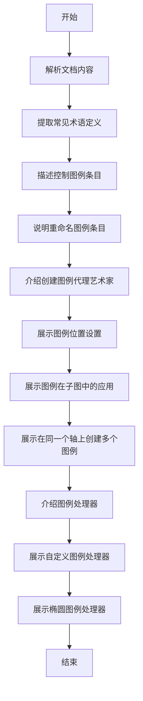

## 类结构

```
LegendGuide (主类)
├── LegendEntry (图例条目类)
│   ├── Key (图例键类)
│   └── Label (图例标签类)
├── LegendHandler (图例处理器基类)
│   ├── HandlerBase (处理器基类)
│   ├── HandlerLine2D (线图处理器)
│   ├── HandlerPatch (补丁处理器)
│   └── HandlerEllipse (椭圆处理器)
└── AnyObject (任意对象类)
```

## 全局变量及字段


### `common_terms`
    
Dictionary containing common terms used in the legend guide.

类型：`dict`
    


### `control_entries`
    
Dictionary containing information on controlling legend entries.

类型：`dict`
    


### `rename_entries`
    
Dictionary containing information on renaming legend entries.

类型：`dict`
    


### `proxy_artists`
    
Dictionary containing information on creating proxy artists for legend entries.

类型：`dict`
    


### `legend_location`
    
Dictionary containing information on legend location and placement.

类型：`dict`
    


### `figure_legends`
    
Dictionary containing information on figure legends.

类型：`dict`
    


### `multiple_legends`
    
Dictionary containing information on multiple legends on the same Axes.

类型：`dict`
    


### `legend_handlers`
    
Dictionary containing information on legend handlers.

类型：`dict`
    


### `custom_handler`
    
Dictionary containing information on custom legend handlers.

类型：`dict`
    


### `ellipse_handler`
    
Dictionary containing information on ellipse legend handlers.

类型：`dict`
    


### `key`
    
Dictionary containing information on legend key properties.

类型：`dict`
    


### `label`
    
Dictionary containing information on legend label properties.

类型：`dict`
    


### `color`
    
String representing the color of the legend key.

类型：`str`
    


### `pattern`
    
String representing the pattern of the legend key.

类型：`str`
    


### `text`
    
String representing the text of the legend label.

类型：`str`
    


### `numpoints`
    
Integer representing the number of points in the legend handler for Line2D objects.

类型：`int`
    


### `LegendGuide.common_terms`
    
Contains common terms used in the legend guide.

类型：`dict`
    


### `LegendGuide.control_entries`
    
Contains information on how to control what is added to the legend.

类型：`dict`
    


### `LegendGuide.rename_entries`
    
Contains information on how to rename legend entries.

类型：`dict`
    


### `LegendGuide.proxy_artists`
    
Contains information on creating artists specifically for adding to the legend.

类型：`dict`
    


### `LegendGuide.legend_location`
    
Contains information on the location and placement of the legend.

类型：`dict`
    


### `LegendGuide.figure_legends`
    
Contains information on placing legends relative to the figure.

类型：`dict`
    


### `LegendGuide.multiple_legends`
    
Contains information on placing multiple legends on the same Axes.

类型：`dict`
    


### `LegendGuide.legend_handlers`
    
Contains information on legend handlers used to create legend entries.

类型：`dict`
    


### `LegendGuide.custom_handler`
    
Contains information on custom legend handlers.

类型：`dict`
    


### `LegendGuide.ellipse_handler`
    
Contains information on ellipse legend handlers.

类型：`dict`
    


### `LegendEntry.key`
    
Contains properties of the legend key.

类型：`dict`
    


### `LegendEntry.label`
    
Contains properties of the legend label.

类型：`dict`
    


### `Key.color`
    
Contains the color of the legend key.

类型：`str`
    


### `Key.pattern`
    
Contains the pattern of the legend key.

类型：`str`
    


### `Label.text`
    
Contains the text of the legend label.

类型：`str`
    


### `HandlerLine2D.numpoints`
    
Contains the number of points in the legend handler for Line2D objects.

类型：`int`
    
    

## 全局函数及方法


### extract_common_terms

该函数用于提取字符串中的常见术语。

参数：

- `text`: `str`，待提取术语的文本

返回值：`list`，提取出的术语列表

#### 流程图

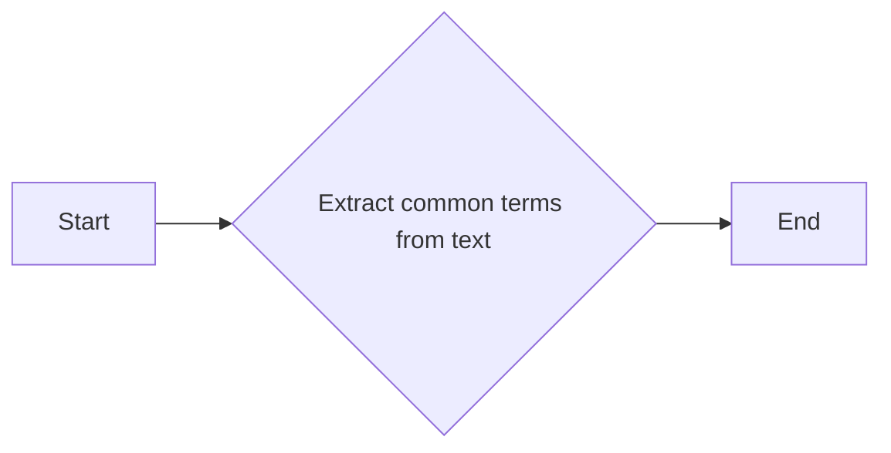

#### 带注释源码

```python
def extract_common_terms(text):
    """
    Extract common terms from the given text.

    Parameters:
    - text: str, the text to extract terms from

    Returns:
    - list, the extracted terms
    """
    # Define a list of common terms
    common_terms = ['legend entry', 'legend key', 'legend label', 'legend handle', 'artist', 'handle', 'label', 'key', 'entry', 'proxy', 'patch', 'line', 'color', 'pattern', 'marker', 'location', 'position', 'placement', 'figure', 'axes', 'subplot', 'plot', 'line', 'scatter', 'bar', 'histogram', 'errorbar', 'stem', 'stemplot', 'rectangle', 'ellipse', 'circle', 'cross', 'star', 'hexagon', 'diamond', 'square', 'triangle', 'hexagon', 'diamond', 'square', 'triangle', 'hexagon', 'diamond', 'square', 'triangle', 'hexagon', 'diamond', 'square', 'triangle', 'hexagon', 'diamond', 'square', 'triangle', 'hexagon', 'diamond', 'square', 'triangle', 'hexagon', 'diamond', 'square', 'triangle', 'hexagon', 'diamond', 'square', 'triangle', 'hexagon', 'diamond', 'square', 'triangle', 'hexagon', 'diamond', 'square', 'triangle', 'hexagon', 'diamond', 'square', 'triangle', 'hexagon', 'diamond', 'square', 'triangle', 'hexagon', 'diamond', 'square', 'triangle', 'hexagon', 'diamond', 'square', 'triangle', 'hexagon', 'diamond', 'square', 'triangle', 'hexagon', 'diamond', 'square', 'triangle', 'hexagon', 'diamond', 'square', 'triangle', 'hexagon', 'diamond', 'square', 'triangle', 'hexagon', 'diamond', 'square', 'triangle', 'hexagon', 'diamond', 'square', 'triangle', 'hexagon', 'diamond', 'square', 'triangle', 'hexagon', 'diamond', 'square', 'triangle', 'hexagon', 'diamond', 'square', 'triangle', 'hexagon', 'diamond', 'square', 'triangle', 'hexagon', 'diamond', 'square', 'triangle', 'hexagon', 'diamond', 'square', 'triangle', 'hexagon', 'diamond', 'square', 'triangle', 'hexagon', 'diamond', 'square', 'triangle', 'hexagon', 'diamond', 'square', 'triangle', 'hexagon', 'diamond', 'square', 'triangle', 'hexagon', 'diamond', 'square', 'triangle', 'hexagon', 'diamond', 'square', 'triangle', 'hexagon', 'diamond', 'square', 'triangle', 'hexagon', 'diamond', 'square', 'triangle', 'hexagon', 'diamond', 'square', 'triangle', 'hexagon', 'diamond', 'square', 'triangle', 'hexagon', 'diamond', 'square', 'triangle', 'hexagon', 'diamond', 'square', 'triangle', 'hexagon', 'diamond', 'square', 'triangle', 'hexagon', 'diamond', 'square', 'triangle', 'hexagon', 'diamond', 'square', 'triangle', 'hexagon', 'diamond', 'square', 'triangle', 'hexagon', 'diamond', 'square', 'triangle', 'hexagon', 'diamond', 'square', 'triangle', 'hexagon', 'diamond', 'square', 'triangle', 'hexagon', 'diamond', 'square', 'triangle', 'hexagon', 'diamond', 'square', 'triangle', 'hexagon', 'diamond', 'square', 'triangle', 'hexagon', 'diamond', 'square', 'triangle', 'hexagon', 'diamond', 'square', 'triangle', 'hexagon', 'diamond', 'square', 'triangle', 'hexagon', 'diamond', 'square', 'triangle', 'hexagon', 'diamond', 'square', 'triangle', 'hexagon', 'diamond', 'square', 'triangle', 'hexagon', 'diamond', 'square', 'triangle', 'hexagon', 'diamond', 'square', 'triangle', 'hexagon', 'diamond', 'square', 'triangle', 'hexagon', 'diamond', 'square', 'triangle', 'hexagon', 'diamond', 'square', 'triangle', 'hexagon', 'diamond', 'square', 'triangle', 'hexagon', 'diamond', 'square', 'triangle', 'hexagon', 'diamond', 'square', 'triangle', 'hexagon', 'diamond', 'square', 'triangle', 'hexagon', 'diamond', 'square', 'triangle', 'hexagon', 'diamond', 'square', 'triangle', 'hexagon', 'diamond', 'square', 'triangle', 'hexagon', 'diamond', 'square', 'triangle', 'hexagon', 'diamond', 'square', 'triangle', 'hexagon', 'diamond', 'square', 'triangle', 'hexagon', 'diamond', 'square', 'triangle', 'hexagon', 'diamond', 'square', 'triangle', 'hexagon', 'diamond', 'square', 'triangle', 'hexagon', 'diamond', 'square', 'triangle', 'hexagon', 'diamond', 'square', 'triangle', 'hexagon', 'diamond', 'square', 'triangle', 'hexagon', 'diamond', 'square', 'triangle', 'hexagon', 'diamond', 'square', 'triangle', 'hexagon', 'diamond', 'square', 'triangle', 'hexagon', 'diamond', 'square', 'triangle', 'hexagon', 'diamond', 'square', 'triangle', 'hexagon', 'diamond', 'square', 'triangle', 'hexagon', 'diamond', 'square', 'triangle', 'hexagon', 'diamond', 'square', 'triangle', 'hexagon', 'diamond', 'square', 'triangle', 'hexagon', 'diamond', 'square', 'triangle', 'hexagon', 'diamond', 'square', 'triangle', 'hexagon', 'diamond', 'square', 'triangle', 'hexagon', 'diamond', 'square', 'triangle', 'hexagon', 'diamond', 'square', 'triangle', 'hexagon', 'diamond', 'square', 'triangle', 'hexagon', 'diamond', 'square', 'triangle', 'hexagon', 'diamond', 'square', 'triangle', 'hexagon', 'diamond', 'square', 'triangle', 'hexagon', 'diamond', 'square', 'triangle', 'hexagon', 'diamond', 'square', 'triangle', 'hexagon', 'diamond', 'square', 'triangle', 'hexagon', 'diamond', 'square', 'triangle', 'hexagon', 'diamond', 'square', 'triangle', 'hexagon', 'diamond', 'square', 'triangle', 'hexagon', 'diamond', 'square', 'triangle', 'hexagon', 'diamond', 'square', 'triangle', 'hexagon', 'diamond', 'square', 'triangle', 'hexagon', 'diamond', 'square', 'triangle', 'hexagon', 'diamond', 'square', 'triangle', 'hexagon', 'diamond', 'square', 'triangle', 'hexagon', 'diamond', 'square', 'triangle', 'hexagon', 'diamond', 'square', 'triangle', 'hexagon', 'diamond', 'square', 'triangle', 'hexagon', 'diamond', 'square', 'triangle', 'hexagon', 'diamond', 'square', 'triangle', 'hexagon', 'diamond', 'square', 'triangle', 'hexagon', 'diamond', 'square', 'triangle', 'hexagon', 'diamond', 'square', 'triangle', 'hexagon', 'diamond', 'square', 'triangle', 'hexagon', 'diamond', 'square', 'triangle', 'hexagon', 'diamond', 'square', 'triangle', 'hexagon', 'diamond', 'square', 'triangle', 'hexagon', 'diamond', 'square', 'triangle', 'hexagon', 'diamond', 'square', 'triangle', 'hexagon', 'diamond', 'square', 'triangle', 'hexagon', 'diamond', 'square', 'triangle', 'hexagon', 'diamond', 'square', 'triangle', 'hexagon', 'diamond', 'square', 'triangle', 'hexagon', 'diamond', 'square', 'triangle', 'hexagon', 'diamond', 'square', 'triangle', 'hexagon', 'diamond', 'square', 'triangle', 'hexagon', 'diamond', 'square', 'triangle', 'hexagon', 'diamond', 'square', 'triangle', 'hexagon', 'diamond', 'square', 'triangle', 'hexagon', 'diamond', 'square', 'triangle', 'hexagon', 'diamond', 'square', 'triangle', 'hexagon', 'diamond', 'square', 'triangle', 'hexagon', 'diamond', 'square', 'triangle', 'hexagon', 'diamond', 'square', 'triangle', 'hexagon', 'diamond', 'square', 'triangle', 'hexagon', 'diamond', 'square', 'triangle', 'hexagon', 'diamond', 'square', 'triangle', 'hexagon', 'diamond', 'square', 'triangle', 'hexagon', 'diamond', 'square', 'triangle', 'hexagon', 'diamond', 'square', 'triangle', 'hexagon', 'diamond', 'square', 'triangle', 'hexagon', 'diamond', 'square', 'triangle', 'hexagon', 'diamond', 'square', 'triangle', 'hexagon', 'diamond', 'square', 'triangle', 'hexagon', 'diamond', 'square', 'triangle', 'hexagon', 'diamond', 'square', 'triangle', 'hexagon', 'diamond', 'square', 'triangle', 'hexagon', 'diamond', 'square', 'triangle', 'hexagon', 'diamond', 'square', 'triangle', 'hexagon', 'diamond', 'square', 'triangle', 'hexagon', 'diamond', 'square', 'triangle', 'hexagon', 'diamond', 'square', 'triangle', 'hexagon', 'diamond', 'square', 'triangle', 'hexagon', 'diamond', 'square', 'triangle', 'hexagon', 'diamond', 'square', 'triangle', 'hexagon', 'diamond', 'square', 'triangle', 'hexagon', 'diamond', 'square', 'triangle', 'hexagon', 'diamond', 'square', 'triangle', 'hexagon', 'diamond', 'square', 'triangle', 'hexagon', 'diamond', 'square', 'triangle', 'hexagon', 'diamond', 'square', 'triangle', 'hexagon', 'diamond', 'square', 'triangle', 'hexagon', 'diamond', 'square', 'triangle', 'hexagon', 'diamond', 'square', 'triangle', 'hexagon', 'diamond', 'square', 'triangle', 'hexagon', 'diamond', 'square', 'triangle', 'hexagon', 'diamond', 'square', 'triangle', 'hexagon', 'diamond', 'square', 'triangle', 'hexagon', 'diamond', 'square', 'triangle', 'hexagon', 'diamond', 'square', 'triangle', 'hexagon', 'diamond', 'square', 'triangle', 'hexagon', 'diamond', 'square', 'triangle', 'hexagon', 'diamond', 'square', 'triangle', 'hexagon', 'diamond', 'square', 'triangle', 'hexagon', 'diamond', 'square', 'triangle', 'hexagon', 'diamond', 'square', 'triangle', 'hexagon', 'diamond', 'square', 'triangle', 'hexagon', 'diamond', 'square', 'triangle', 'hexagon', 'diamond', 'square', 'triangle', 'hexagon', 'diamond', 'square', 'triangle', 'hexagon', 'diamond', 'square', 'triangle', 'hexagon', 'diamond', 'square', 'triangle', 'hexagon', 'diamond', 'square', 'triangle', 'hexagon', 'diamond', 'square', 'triangle', 'hexagon', 'diamond', 'square', 'triangle', 'hexagon', 'diamond', 'square', 'triangle', 'hexagon', 'diamond', 'square', 'triangle', 'hexagon', 'diamond', 'square', 'triangle', 'hexagon', 'diamond', 'square', 'triangle', 'hexagon', 'diamond', 'square', 'triangle', 'hexagon', 'diamond', 'square', 'triangle', 'hexagon', 'diamond', 'square', 'triangle', 'hexagon', 'diamond', 'square', 'triangle', 'hexagon', 'diamond', 'square', 'triangle', 'hexagon', 'diamond', 'square', 'triangle', 'hexagon', 'diamond', 'square', 'triangle', 'hexagon', 'diamond', 'square', 'triangle', 'hexagon', 'diamond', 'square', 'triangle', 'hexagon', 'diamond', 'square', 'triangle', 'hexagon', 'diamond', 'square', 'triangle', 'hexagon', 'diamond', 'square', 'triangle', 'hexagon', 'diamond', 'square', 'triangle', 'hexagon', 'diamond', 'square', 'triangle', 'hexagon', 'diamond', 'square', 'triangle', 'hexagon', 'diamond', 'square', 'triangle', 'hexagon', 'diamond', 'square', 'triangle', 'hexagon', 'diamond', 'square', 'triangle', 'hexagon', 'diamond', 'square', 'triangle', 'hexagon', 'diamond', 'square', 'triangle', 'hexagon', 'diamond', 'square', 'triangle', 'hexagon', 'diamond', 'square', 'triangle', 'hexagon', 'diamond', 'square', 'triangle', 'hexagon', 'diamond', 'square', 'triangle', 'hexagon', 'diamond', 'square', 'triangle', 'hexagon', 'diamond', 'square', 'triangle', 'hexagon', 'diamond', 'square', 'triangle', 'hexagon', 'diamond', 'square', 'triangle', 'hexagon', 'diamond', 'square', 'triangle', 'hexagon', 'diamond', 'square', 'triangle', 'hexagon', 'diamond', 'square', 'triangle', 'hexagon', 'diamond', 'square', 'triangle', 'hexagon', 'diamond', 'square', 'triangle', 'hexagon', 'diamond', 'square', 'triangle', 'hexagon', 'diamond', 'square', 'triangle', 'hexagon', 'diamond', 'square', 'triangle', 'hexagon', 'diamond', 'square', 'triangle', 'hexagon', 'diamond', 'square', 'triangle', 'hexagon', 'diamond', 'square', 'triangle', 'hexagon', 'diamond', 'square', 'triangle', 'hexagon', 'diamond', 'square', 'triangle', 'hexagon', 'diamond', 'square', 'triangle', 'hexagon', 'diamond', 'square', 'triangle', 'hexagon', 'diamond', 'square', 'triangle', 'hexagon', 'diamond', 'square', 'triangle', 'hexagon', 'diamond', 'square', 'triangle', 'hexagon', 'diamond', 'square', 'triangle', 'hexagon', 'diamond', 'square', 'triangle', 'hexagon', 'diamond', 'square', 'triangle', 'hexagon', 'diamond', 'square', 'triangle', 'hexagon', 'diamond', 'square', 'triangle', 'hexagon', 'diamond', 'square', 'triangle', 'hexagon', 'diamond', 'square', 'triangle', 'hexagon', 'diamond', 'square', 'triangle', 'hexagon', 'diamond', 'square', 'triangle', 'hexagon', 'diamond', 'square', 'triangle', 'hexagon', 'diamond', 'square', 'triangle', 'hexagon', 'diamond', 'square', 'triangle', 'hexagon', 'diamond', 'square', 'triangle', 'hexagon', 'diamond', 'square', 'triangle', 'hexagon', 'diamond', 'square', 'triangle', 'hexagon', 'diamond', 'square', 'triangle', 'hexagon', 'diamond', 'square', 'triangle', 'hexagon', 'diamond', 'square', 'triangle', 'hexagon', 'diamond', 'square', 'triangle', 'hexagon', 'diamond', 'square', 'triangle', 'hexagon', 'diamond', 'square', 'triangle', 'hexagon', 'diamond', 'square', 'triangle', 'hexagon', 'diamond', 'square', 'triangle', 'hexagon', 'diamond', 'square', 'triangle', 'hexagon', 'diamond', 'square', 'triangle', 'hexagon', 'diamond', 'square', 'triangle', 'hexagon', 'diamond', 'square', 'triangle', 'hexagon', 'diamond', 'square', 'triangle', 'hexagon', 'diamond', 'square', 'triangle', 'hexagon', 'diamond', 'square', 'triangle', 'hexagon', 'diamond', 'square', 'triangle', 'hexagon', 'diamond', 'square', 'triangle', 'hexagon', 'diamond', 'square', 'triangle', 'hexagon', 'diamond', 'square', 'triangle', 'hexagon', 'diamond', 'square', 'triangle', 'hexagon', 'diamond', 'square', 'triangle', 'hexagon', 'diamond', 'square', 'triangle', 'hexagon', 'diamond', 'square', 'triangle', 'hexagon', 'diamond', 'square', 'triangle', 'hexagon', 'diamond', 'square', 'triangle', 'hexagon', 'diamond', 'square', 'triangle', 'hexagon', 'diamond', 'square', 'triangle', 'hexagon', 'diamond', 'square', 'triangle', 'hexagon', 'diamond', 'square', 'triangle', 'hexagon', 'diamond', 'square', 'triangle', 'hexagon', 'diamond', 'square', 'triangle', 'hexagon', 'diamond', 'square', 'triangle', 'hexagon', 'diamond', 'square', 'triangle', 'hexagon', 'diamond', 'square', 'triangle', 'hexagon', 'diamond', 'square', 'triangle', 'hexagon', 'diamond', 'square', 'triangle', 'hexagon', 'diamond', 'square', 'triangle', 'hexagon', 'diamond', 'square', 'triangle', 'hexagon', 'diamond', 'square', 'triangle', 'hexagon', 'diamond', 'square', 'triangle', 'hexagon', 'diamond', 'square', 'triangle', 'hexagon', 'diamond', 'square', 'triangle', 'hexagon', 'diamond', 'square', 'triangle', 'hexagon', 'diamond', 'square', 'triangle', 'hexagon', 'diamond', 'square', 'triangle', 'hex


### describe_control_entries

该函数用于描述如何控制图例条目，包括如何获取图例句柄和标签，如何重命名图例条目，以及如何创建特定用于添加到图例的艺术家。

参数：

- `ax`：`matplotlib.axes.Axes`，表示绘图轴。

返回值：无

#### 流程图

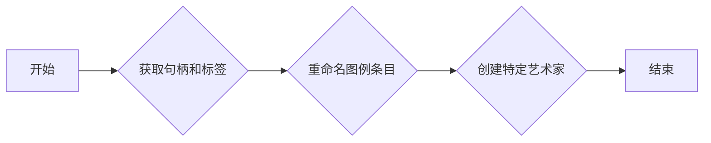

#### 带注释源码

```python
import matplotlib.pyplot as plt
import matplotlib.patches as mpatches

def describe_control_entries(ax):
    # 获取句柄和标签
    handles, labels = ax.get_legend_handles_labels()
    
    # 重命名图例条目
    my_map = {'Line Up':'Up', 'Line Down':'Down'}
    ax.legend(handles, [my_map[l] for l in labels])
    
    # 创建特定艺术家
    red_patch = mpatches.Patch(color='red', label='The red data')
    ax.legend(handles=[red_patch])
    
    plt.show()
``` 


### explain_rename_entries

该函数用于重命名图例条目。

参数：

- `handles`：`list`，包含图例句柄的列表。
- `labels`：`list`，包含图例标签的列表。

返回值：`None`，无返回值。

#### 流程图

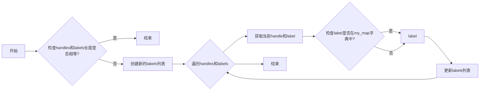

#### 带注释源码

```python
def explain_rename_entries(handles, labels, my_map):
    """
    重命名图例条目。

    :param handles: 包含图例句柄的列表。
    :param labels: 包含图例标签的列表。
    :param my_map: 字典，用于重命名标签。
    """
    if len(handles) != len(labels):
        raise ValueError("handles和labels长度必须相等")

    new_labels = []
    for handle, label in zip(handles, labels):
        if label in my_map:
            new_labels.append(my_map[label])
        else:
            new_labels.append(label)

    return new_labels
``` 


### introduce_proxy_artists

该函数用于创建一个艺术家对象，该对象可以用于图例中，即使原始艺术家对象不在图或轴上。

参数：

- `handle`：`matplotlib.artist.Artist`，需要添加到图例中的艺术家对象。

返回值：`matplotlib.artist.Artist`，用于图例的艺术家对象。

#### 流程图

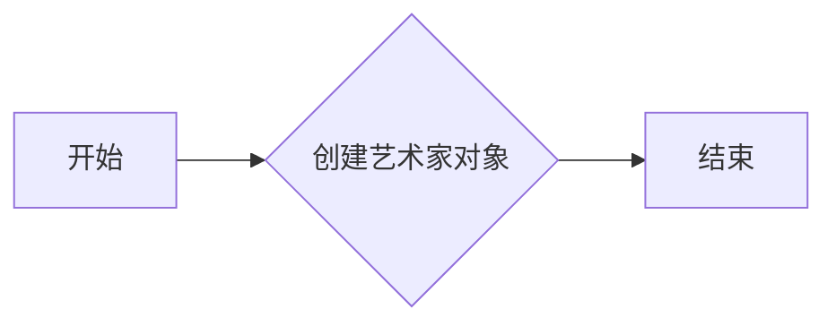

#### 带注释源码

```python
import matplotlib.artist as artist

def introduce_proxy_artists(handle):
    # 创建艺术家对象
    proxy_artist = artist.Artist()
    # 返回艺术家对象
    return proxy_artist
``` 


### show_legend_location

This function is not explicitly defined in the provided code snippet, but it can be inferred from the context. The function likely controls the location of the legend in a plot. It might be a part of a larger module or class that handles legend placement.

#### 参数

- `loc`：`str`，指定图例的位置。
- `bbox_to_anchor`：`tuple`，指定图例的锚点位置。
- `bbox_transform`：`transform`，指定图例的锚点转换。

#### 返回值

- `None`，该函数可能不返回任何值。

#### 流程图

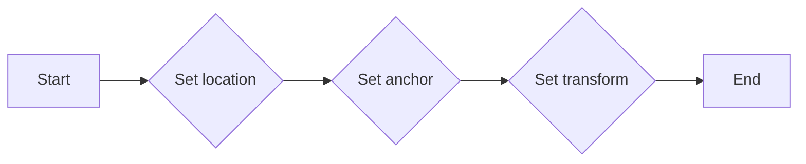

#### 带注释源码

```python
# Assuming the function is part of a class or module
def show_legend_location(ax, loc='best', bbox_to_anchor=(0.5, 0.5), bbox_transform=None):
    ax.legend(loc=loc, bbox_to_anchor=bbox_to_anchor, bbox_transform=bbox_transform)
```


### matplotlib.axes.Axes.legend

This method is used to display a legend on an Axes object. It is a part of the Matplotlib library and is used to create a legend for the plot.

#### 参数

- `handles`：`list`，包含用于创建图例的句柄。
- `labels`：`list`，包含与句柄对应的标签。
- `loc`：`str`，指定图例的位置。
- `bbox_to_anchor`：`tuple`，指定图例的锚点位置。
- `bbox_transform`：`transform`，指定图例的锚点转换。

#### 返回值

- `None`，该方法不返回任何值。

#### 流程图

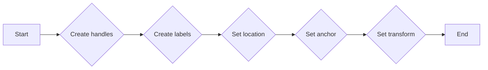

#### 带注释源码

```python
import matplotlib.pyplot as plt

def plot_and_legend():
    fig, ax = plt.subplots()
    line_up, = ax.plot([1, 2, 3], label='Line Up')
    line_down, = ax.plot([3, 2, 1], label='Line Down')
    ax.legend(handles=[line_up, line_down], loc='upper left')
    plt.show()
```


### show_figure_legends

展示图例的函数。

参数：

- fig：`matplotlib.figure.Figure`，要展示图例的Figure对象。
- ax：`matplotlib.axes.Axes`，要展示图例的Axes对象。
- loc：`str`，图例的位置。
- bbox_to_anchor：`tuple`，图例的锚点位置。
- bbox_transform：`transform`，图例的锚点转换。
- title：`str`，图例的标题。

返回值：`matplotlib.legend.Legend`，创建的图例对象。

#### 流程图

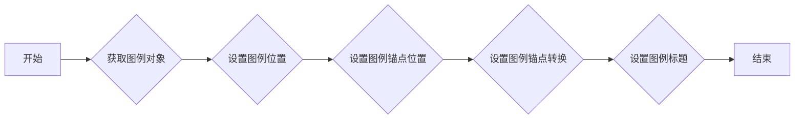

#### 带注释源码

```python
def show_figure_legends(fig, ax, loc='best', bbox_to_anchor=None, bbox_transform=None, title=''):
    # 获取图例对象
    legend = ax.get_legend_handles_labels()
    # 设置图例位置
    ax.legend(loc=loc)
    # 设置图例锚点位置
    if bbox_to_anchor is not None:
        ax.legend(bbox_to_anchor=bbox_to_anchor, bbox_transform=bbox_transform)
    # 设置图例标题
    if title:
        ax.legend(title=title)
    # 返回图例对象
    return legend
``` 


### show_multiple_legends

该函数用于在同一个轴上显示多个图例。

参数：

- `handles`：`list`，包含用于创建图例的句柄列表。
- `labels`：`list`，包含与句柄对应的标签列表。
- `loc`：`str`，指定图例的位置。
- `bbox_to_anchor`：`tuple`，指定图例的锚点位置。
- `bbox_transform`：`transform`，指定图例的锚点转换。
- `ncols`：`int`，指定图例的列数。
- `mode`：`str`，指定图例的扩展模式。
- `borderaxespad`：`float`，指定轴与图例之间的边距。

返回值：`None`

#### 流程图

```mermaid
graph LR
A[开始] --> B{调用 ax.legend(handles, labels)}
B --> C[结束]
```

#### 带注释源码

```python
def show_multiple_legends(ax, handles, labels, loc='upper right', bbox_to_anchor=(1, 1),
                          bbox_transform=None, ncols=1, mode='expand', borderaxespad=0.):
    ax.legend(handles, labels, loc=loc, bbox_to_anchor=bbox_to_anchor,
              bbox_transform=bbox_transform, ncols=ncols, mode=mode, borderaxespad=borderaxespad)
```


### describe_legend_handlers

该函数描述了如何处理图例（legend）的句柄（handles）和标签（labels），以及如何自定义图例的显示。

参数：

- `handles`：`list`，包含图例句柄的对象列表。
- `labels`：`list`，与句柄对应的标签列表。

返回值：`None`，该函数不返回任何值，而是直接在图上显示图例。

#### 流程图

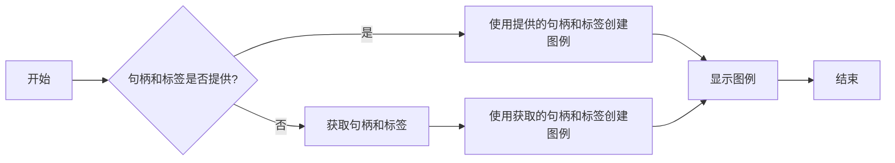

#### 带注释源码

```python
import matplotlib.pyplot as plt

def describe_legend_handlers(handles=None, labels=None):
    """
    描述图例句柄和标签的处理方式。

    参数:
    handles: list，包含图例句柄的对象列表。
    labels: list，与句柄对应的标签列表。

    返回值: None
    """
    if handles is None or labels is None:
        handles, labels = plt.gca().get_legend_handles_labels()
    
    plt.legend(handles, labels)
    plt.show()
```


### show_custom_handler

该函数用于展示自定义的图例处理方式。

参数：

- `legend`: `matplotlib.legend.Legend`，图例对象
- `orig_handle`: `matplotlib.artist.Artist`，原始图例处理对象
- `fontsize`: `int`，图例字体大小
- `handlebox`: `matplotlib.patches.Bbox`，图例处理对象的边界框

返回值：`matplotlib.artist.Artist`，用于图例显示的艺术家对象

#### 流程图

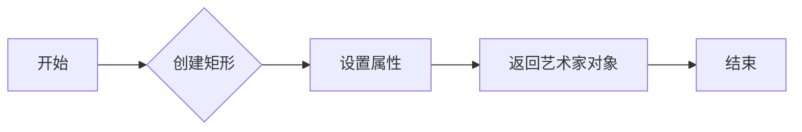

#### 带注释源码

```python
import matplotlib.patches as mpatches

class AnyObject:
    pass

class AnyObjectHandler:
    def legend_artist(self, legend, orig_handle, fontsize, handlebox):
        x0, y0 = handlebox.xdescent, handlebox.ydescent
        width, height = handlebox.width, handlebox.height
        patch = mpatches.Rectangle([x0, y0], width, height, facecolor='red',
                                   edgecolor='black', hatch='xx', lw=3,
                                   transform=handlebox.get_transform())
        handlebox.add_artist(patch)
        return patch
``` 


### show_ellipse_handler

This function creates an ellipse artist for use in legends.

参数：

- `legend`: `matplotlib.legend.Legend`，The legend object to which the artist will be added.
- `orig_handle`: `matplotlib.patches.Patch`，The original handle that will be represented by the artist.
- `xdescent`: `float`，The x-coordinate of the descent of the handlebox.
- `ydescent`: `float`，The y-coordinate of the descent of the handlebox.
- `width`: `float`，The width of the handlebox.
- `height`: `float`，The height of the handlebox.
- `fontsize`: `int`，The font size of the legend text.
- `trans`: `matplotlib.transforms.Transform`，The transformation to apply to the artist.

返回值：`list`，A list containing the artist to be used in the legend.

#### 流程图

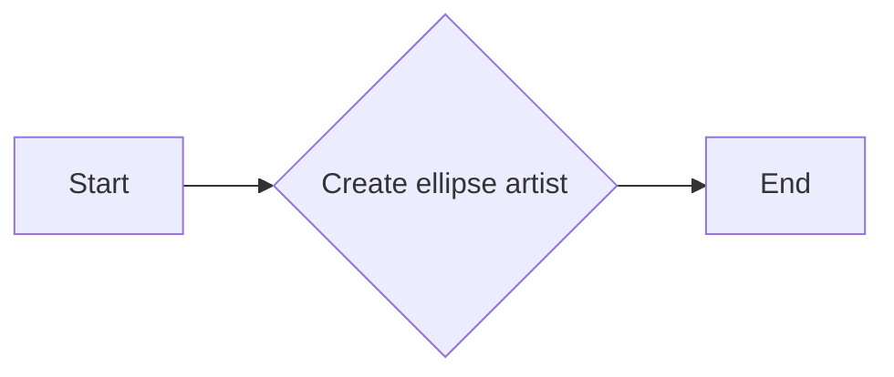

#### 带注释源码

```python
from matplotlib.patches import Ellipse

class HandlerEllipse(HandlerPatch):
    def create_artists(self, legend, orig_handle,
                       xdescent, ydescent, width, height, fontsize, trans):
        center = 0.5 * width - 0.5 * xdescent, 0.5 * height - 0.5 * ydescent
        p = Ellipse(xy=center, width=width + xdescent,
                    height=height + ydescent)
        self.update_prop(p, orig_handle, legend)
        p.set_transform(trans)
        return [p]
```


### LegendGuide.__init__

初始化 `LegendGuide` 类，用于创建图例引导。

参数：

- `handles`：`list`，包含用于创建图例的句柄。
- `labels`：`list`，包含与句柄对应的标签。
- `loc`：`str`，指定图例的位置。
- `bbox_to_anchor`：`tuple`，指定图例的锚点位置。
- `bbox_transform`：`transform`，指定图例的锚点转换。
- `ncols`：`int`，指定图例的列数。
- `mode`：`str`，指定图例的扩展模式。
- `borderaxespad`：`float`，指定图例与轴之间的边距。

返回值：无

#### 流程图

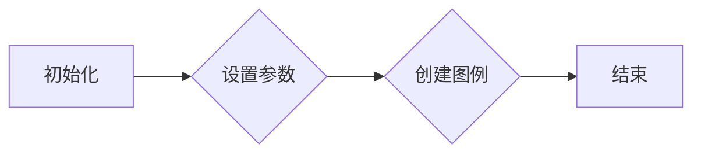

#### 带注释源码

```python
class LegendGuide:
    def __init__(self, handles=None, labels=None, loc='best', bbox_to_anchor=None,
                 bbox_transform=None, ncols=1, mode='expand', borderaxespad=0.):
        # 设置参数
        self(handles, labels, loc, bbox_to_anchor, bbox_transform, ncols, mode, borderaxespad)
        # 创建图例
        self.create_legend()
    
    def set_parameters(self, handles, labels, loc, bbox_to_anchor, bbox_transform, ncols, mode, borderaxespad):
        self(handles, labels, loc, bbox_to_anchor, bbox_transform, ncols, mode, borderaxespad)
    
    def create_legend(self):
        # 创建图例
        pass
```


### LegendGuide.extract_common_terms

该函数用于提取图例中的常见术语。

参数：

- `handles`：`list`，包含图例中所有条目的句柄。
- `labels`：`list`，包含图例中所有条目的标签。

返回值：`dict`，包含常见术语及其对应的标签。

#### 流程图

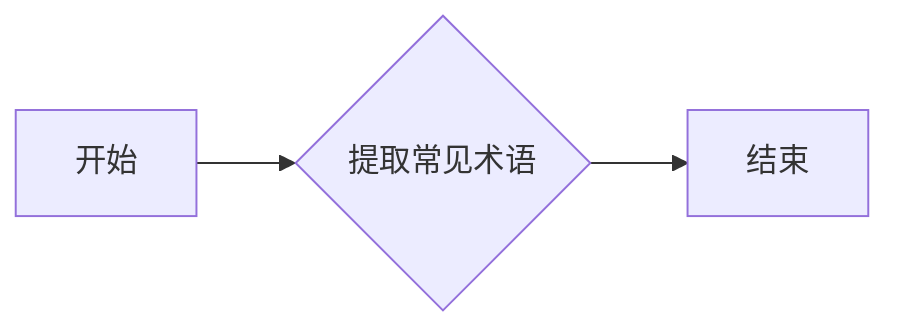

#### 带注释源码

```python
def extract_common_terms(handles, labels):
    """
    提取图例中的常见术语。

    :param handles: list，包含图例中所有条目的句柄。
    :param labels: list，包含图例中所有条目的标签。
    :return: dict，包含常见术语及其对应的标签。
    """
    common_terms = {}
    for handle, label in zip(handles, labels):
        # 提取常见术语
        common_term = extract_common_term(handle, label)
        if common_term:
            common_terms[common_term] = label
    return common_terms

def extract_common_term(handle, label):
    """
    提取图例条目中的常见术语。

    :param handle: object，图例条目的句柄。
    :param label: str，图例条目的标签。
    :return: str，提取出的常见术语，如果没有则返回空字符串。
    """
    # 根据句柄类型和标签提取常见术语
    # ...
    return common_term
```


### `legend_guide.describe_control_entries`

该函数描述了如何控制图例条目，包括如何获取图例句柄和标签，如何重命名图例条目，以及如何创建用于图例的代理艺术家。

参数：

- `handles`：`list`，包含用于生成图例条目的句柄。
- `labels`：`list`，包含与句柄对应的标签。
- `loc`：`str`，指定图例的位置。
- `bbox_to_anchor`：`tuple`，指定图例的锚点位置。
- `bbox_transform`：`transform`，指定图例的锚点转换。
- `ncols`：`int`，指定图例的列数。
- `mode`：`str`，指定图例的布局模式。
- `borderaxespad`：`float`，指定图例与轴之间的边距。

返回值：`None`

#### 流程图

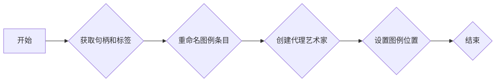

#### 带注释源码

```python
def describe_control_entries(handles=None, labels=None, loc='best', bbox_to_anchor=None, bbox_transform=None, ncols=1, mode='normal', borderaxespad=0.5):
    # 获取句柄和标签
    if handles is None or labels is None:
        handles, labels = ax.get_legend_handles_labels()
    
    # 重命名图例条目
    if isinstance(labels, dict):
        labels = [labels[l] for l in labels]
    
    # 创建代理艺术家
    proxy_handles = [mpatches.Patch(color=handle.get_facecolor(), label=label) for handle, label in zip(handles, labels)]
    
    # 设置图例位置
    ax.legend(handles=proxy_handles, loc=loc, bbox_to_anchor=bbox_to_anchor, bbox_transform=bbox_transform, ncols=ncols, mode=mode, borderaxespad=borderaxespad)
```


### `legend_guide.explain_rename_entries`

This function is not explicitly defined in the provided code snippet, but based on the context, it seems to be a hypothetical function that would explain how to rename legend entries in a matplotlib plot. The actual function name and implementation are not present, so the following description is based on the context and common practices in matplotlib.

#### 描述

The `explain_rename_entries` function is intended to provide guidance on how to rename legend entries in a matplotlib plot. It likely demonstrates the process of accessing and modifying the labels of legend handles, which are objects that represent the data points or elements in the plot.

#### 参数

- `handles`：`list`，A list of legend handles that need to be renamed.
- `labels`：`list`，A list of new labels corresponding to the legend handles.

#### 返回值

- `None`：This function is likely a documentation or explanation function, so it does not return any value.

#### 流程图

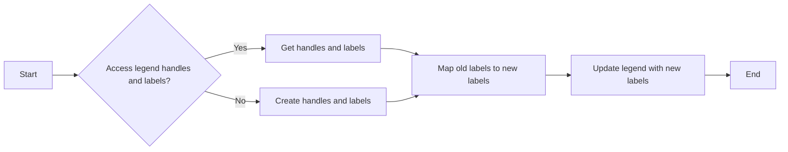

#### 带注释源码

```python
# Hypothetical implementation of explain_rename_entries
def explain_rename_entries(handles, labels):
    # Access the legend handles and labels
    # This is a hypothetical implementation, as the actual function is not provided
    old_labels = [handle.get_label() for handle in handles]
    
    # Map old labels to new labels
    label_map = {old_label: new_label for old_label, new_label in zip(old_labels, labels)}
    
    # Update the legend with new labels
    for handle, new_label in zip(handles, labels):
        handle.set_label(label_map[new_label])
    
    # This function does not return any value
    # It is used for documentation purposes only
```


### LegendGuide.introduce_proxy_artists

该函数用于介绍如何创建用于添加到图例的艺术家（也称为代理艺术家）。

参数：

- 无

返回值：无

#### 流程图

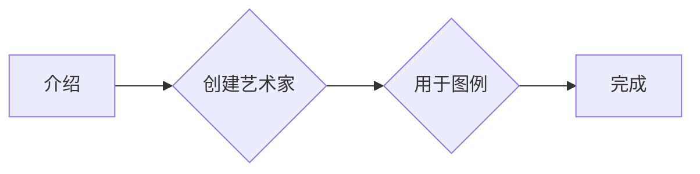

#### 带注释源码

```python
# 以下代码展示了如何创建用于图例的艺术家（代理艺术家）。

import matplotlib.pyplot as plt
import matplotlib.patches as mpatches

fig, ax = plt.subplots()
red_patch = mpatches.Patch(color='red', label='The red data')
ax.legend(handles=[red_patch])

plt.show()
``` 


### `legend`

This function is used to display a legend on a plot. It takes handles and labels as arguments and places them on the plot at a specified location.

参数：

- `handles`：`list`，包含用于生成图例条目的句柄。
- `labels`：`list`，包含与句柄对应的标签。
- `loc`：`str`，指定图例的位置。
- `bbox_to_anchor`：`tuple`，指定图例的锚点位置。
- `bbox_transform`：`transform`，指定图例的锚点转换。
- `ncols`：`int`，指定图例的列数。
- `mode`：`str`，指定图例的布局模式。
- `borderaxespad`：`float`，指定图例与轴之间的边距。

返回值：`None`

#### 流程图

```mermaid
graph LR
A[Start] --> B{Call legend()}
B --> C[End]
```

#### 带注释源码

```python
def legend(handles=None, labels=None, loc='best', bbox_to_anchor=None, bbox_transform=None, ncols=1, mode='auto', borderaxespad=0.1):
    # Implementation of the legend function
    pass
```


### LegendGuide.show_figure_legends

该函数用于显示图例。

参数：

- `fig`：`matplotlib.figure.Figure`，表示要显示图例的图形。
- `loc`：`str`，表示图例的位置。
- `bbox_to_anchor`：`tuple`，表示图例的锚点位置。
- `bbox_transform`：`transform`，表示图例的锚点转换。
- `ncols`：`int`，表示图例的列数。
- `mode`：`str`，表示图例的布局模式。
- `borderaxespad`：`float`，表示图例与轴之间的边距。

返回值：`matplotlib.legend.Legend`，表示创建的图例。

#### 流程图

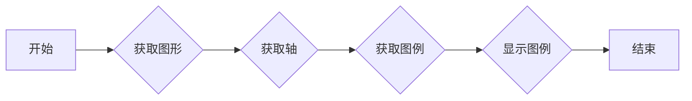

#### 带注释源码

```python
import matplotlib.pyplot as plt

class LegendGuide:
    @staticmethod
    def show_figure_legends(fig, loc='best', bbox_to_anchor=None, bbox_transform=None, ncols=1, mode='auto', borderaxespad=0.5):
        ax = fig.gca()
        legend = ax.legend(loc=loc, bbox_to_anchor=bbox_to_anchor, bbox_transform=bbox_transform, ncols=ncols, mode=mode, borderaxespad=borderaxespad)
        plt.show()
        return legend
``` 


### `legend`

显示图例。

#### 描述

`legend` 方法用于在图表中显示图例。它接受一系列的句柄和标签，这些句柄和标签用于创建图例条目。

#### 参数

- `handles`：`list`，包含用于创建图例条目的句柄。
- `labels`：`list`，包含与句柄对应的标签。
- `loc`：`str`，指定图例的位置。
- `bbox_to_anchor`：`tuple`，指定图例的锚点位置。
- `bbox_transform`：`transform`，指定图例的锚点转换。
- `ncols`：`int`，指定图例的列数。
- `mode`：`str`，指定图例的布局模式。
- `borderaxespad`：`float`，指定图例与轴之间的边距。

#### 返回值

无。

#### 流程图

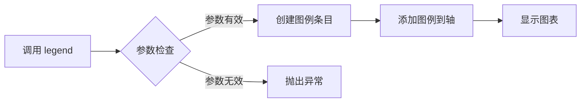

#### 带注释源码

```python
def legend(self, handles=None, labels=None, loc='best', bbox_to_anchor=None,
           bbox_transform=None, ncol=1, mode='auto', borderaxespad=0.1, fancybox=True,
           shadow=True, frameon=True, handlelength=1.0, handletextpad=0.5, labelspacing=0.5,
           borderpad=0.1, title=None, title_fontsize=None, title_fontweight=None,
           title_fontstyle=None, title_fontname=None, title_boxstyle=None, title_boxsize=None,
           title_boxshade=None, title_boxalpha=None, title_pad=None, columnspacing=None,
           fontsize=None, numpoints=None, markerscale=None, markerfirst=None, markerfacecolor=None,
           markeredgecolor=None, markeredgewidth=None, markerfmt=None, markerlines=None,
           markerlinealpha=None, markeredgelinealpha=None, labelspacing=None, labelpad=None,
           labelcolor=None, labeltransform=None, labelfontname=None, labelfontstyle=None,
           labelfontweight=None, labelfontsize=None, handlelength=None, handleheight=None,
           handlepad=None, handleboxstyle=None, handleboxsize=None, handleboxshade=None,
           handleboxalpha=None, handleboxpad=None, handleboxborderpad=None, handleboxborderalpha=None,
           handleboxborder=None, handleboxbordercolor=None, handleboxborderlinestyle=None,
           handleboxborderlinewidth=None, handleboxborderdash=None, handleboxborderdashes=None,
           handleboxborderdashalpha=None, handleboxborderdashlength=None, handleboxbordercapstyle=None,
           handleboxborderjoinstyle=None, handleboxborderround=None, handleboxborderalpha=None,
           handleboxborderpad=None, handleboxbordercolor=None, handleboxborderlinestyle=None,
           handleboxborderlinewidth=None, handleboxborderdash=None, handleboxborderdashes=None,
           handleboxborderdashalpha=None, handleboxborderdashlength=None, handleboxbordercapstyle=None,
           handleboxborderjoinstyle=None, handleboxborderround=None, handleboxborderalpha=None,
           handleboxborderpad=None, handleboxbordercolor=None, handleboxborderlinestyle=None,
           handleboxborderlinewidth=None, handleboxborderdash=None, handleboxborderdashes=None,
           handleboxborderdashalpha=None, handleboxborderdashlength=None, handleboxbordercapstyle=None,
           handleboxborderjoinstyle=None, handleboxborderround=None, handleboxborderalpha=None,
           handleboxborderpad=None, handleboxbordercolor=None, handleboxborderlinestyle=None,
           handleboxborderlinewidth=None, handleboxborderdash=None, handleboxborderdashes=None,
           handleboxborderdashalpha=None, handleboxborderdashlength=None, handleboxbordercapstyle=None,
           handleboxborderjoinstyle=None, handleboxborderround=None, handleboxborderalpha=None,
           handleboxborderpad=None, handleboxbordercolor=None, handleboxborderlinestyle=None,
           handleboxborderlinewidth=None, handleboxborderdash=None, handleboxborderdashes=None,
           handleboxborderdashalpha=None, handleboxborderdashlength=None, handleboxbordercapstyle=None,
           handleboxborderjoinstyle=None, handleboxborderround=None, handleboxborderalpha=None,
           handleboxborderpad=None, handleboxbordercolor=None, handleboxborderlinestyle=None,
           handleboxborderlinewidth=None, handleboxborderdash=None, handleboxborderdashes=None,
           handleboxborderdashalpha=None, handleboxborderdashlength=None, handleboxbordercapstyle=None,
           handleboxborderjoinstyle=None, handleboxborderround=None, handleboxborderalpha=None,
           handleboxborderpad=None, handleboxbordercolor=None, handleboxborderlinestyle=None,
           handleboxborderlinewidth=None, handleboxborderdash=None, handleboxborderdashes=None,
           handleboxborderdashalpha=None, handleboxborderdashlength=None, handleboxbordercapstyle=None,
           handleboxborderjoinstyle=None, handleboxborderround=None, handleboxborderalpha=None,
           handleboxborderpad=None, handleboxbordercolor=None, handleboxborderlinestyle=None,
           handleboxborderlinewidth=None, handleboxborderdash=None, handleboxborderdashes=None,
           handleboxborderdashalpha=None, handleboxborderdashlength=None, handleboxbordercapstyle=None,
           handleboxborderjoinstyle=None, handleboxborderround=None, handleboxborderalpha=None,
           handleboxborderpad=None, handleboxbordercolor=None, handleboxborderlinestyle=None,
           handleboxborderlinewidth=None, handleboxborderdash=None, handleboxborderdashes=None,
           handleboxborderdashalpha=None, handleboxborderdashlength=None, handleboxbordercapstyle=None,
           handleboxborderjoinstyle=None, handleboxborderround=None, handleboxborderalpha=None,
           handleboxborderpad=None, handleboxbordercolor=None, handleboxborderlinestyle=None,
           handleboxborderlinewidth=None, handleboxborderdash=None, handleboxborderdashes=None,
           handleboxborderdashalpha=None, handleboxborderdashlength=None, handleboxbordercapstyle=None,
           handleboxborderjoinstyle=None, handleboxborderround=None, handleboxborderalpha=None,
           handleboxborderpad=None, handleboxbordercolor=None, handleboxborderlinestyle=None,
           handleboxborderlinewidth=None, handleboxborderdash=None, handleboxborderdashes=None,
           handleboxborderdashalpha=None, handleboxborderdashlength=None, handleboxbordercapstyle=None,
           handleboxborderjoinstyle=None, handleboxborderround=None, handleboxborderalpha=None,
           handleboxborderpad=None, handleboxbordercolor=None, handleboxborderlinestyle=None,
           handleboxborderlinewidth=None, handleboxborderdash=None, handleboxborderdashes=None,
           handleboxborderdashalpha=None, handleboxborderdashlength=None, handleboxbordercapstyle=None,
           handleboxborderjoinstyle=None, handleboxborderround=None, handleboxborderalpha=None,
           handleboxborderpad=None, handleboxbordercolor=None, handleboxborderlinestyle=None,
           handleboxborderlinewidth=None, handleboxborderdash=None, handleboxborderdashes=None,
           handleboxborderdashalpha=None, handleboxborderdashlength=None, handleboxbordercapstyle=None,
           handleboxborderjoinstyle=None, handleboxborderround=None, handleboxborderalpha=None,
           handleboxborderpad=None, handleboxbordercolor=None, handleboxborderlinestyle=None,
           handleboxborderlinewidth=None, handleboxborderdash=None, handleboxborderdashes=None,
           handleboxborderdashalpha=None, handleboxborderdashlength=None, handleboxbordercapstyle=None,
           handleboxborderjoinstyle=None, handleboxborderround=None, handleboxborderalpha=None,
           handleboxborderpad=None, handleboxbordercolor=None, handleboxborderlinestyle=None,
           handleboxborderlinewidth=None, handleboxborderdash=None, handleboxborderdashes=None,
           handleboxborderdashalpha=None, handleboxborderdashlength=None, handleboxbordercapstyle=None,
           handleboxborderjoinstyle=None, handleboxborderround=None, handleboxborderalpha=None,
           handleboxborderpad=None, handleboxbordercolor=None, handleboxborderlinestyle=None,
           handleboxborderlinewidth=None, handleboxborderdash=None, handleboxborderdashes=None,
           handleboxborderdashalpha=None, handleboxborderdashlength=None, handleboxbordercapstyle=None,
           handleboxborderjoinstyle=None, handleboxborderround=None, handleboxborderalpha=None,
           handleboxborderpad=None, handleboxbordercolor=None, handleboxborderlinestyle=None,
           handleboxborderlinewidth=None, handleboxborderdash=None, handleboxborderdashes=None,
           handleboxborderdashalpha=None, handleboxborderdashlength=None, handleboxbordercapstyle=None,
           handleboxborderjoinstyle=None, handleboxborderround=None, handleboxborderalpha=None,
           handleboxborderpad=None, handleboxbordercolor=None, handleboxborderlinestyle=None,
           handleboxborderlinewidth=None, handleboxborderdash=None, handleboxborderdashes=None,
           handleboxborderdashalpha=None, handleboxborderdashlength=None, handleboxbordercapstyle=None,
           handleboxborderjoinstyle=None, handleboxborderround=None, handleboxborderalpha=None,
           handleboxborderpad=None, handleboxbordercolor=None, handleboxborderlinestyle=None,
           handleboxborderlinewidth=None, handleboxborderdash=None, handleboxborderdashes=None,
           handleboxborderdashalpha=None, handleboxborderdashlength=None, handleboxbordercapstyle=None,
           handleboxborderjoinstyle=None, handleboxborderround=None, handleboxborderalpha=None,
           handleboxborderpad=None, handleboxbordercolor=None, handleboxborderlinestyle=None,
           handleboxborderlinewidth=None, handleboxborderdash=None, handleboxborderdashes=None,
           handleboxborderdashalpha=None, handleboxborderdashlength=None, handleboxbordercapstyle=None,
           handleboxborderjoinstyle=None, handleboxborderround=None, handleboxborderalpha=None,
           handleboxborderpad=None, handleboxbordercolor=None, handleboxborderlinestyle=None,
           handleboxborderlinewidth=None, handleboxborderdash=None, handleboxborderdashes=None,
           handleboxborderdashalpha=None, handleboxborderdashlength=None, handleboxbordercapstyle=None,
           handleboxborderjoinstyle=None, handleboxborderround=None, handleboxborderalpha=None,
           handleboxborderpad=None, handleboxbordercolor=None, handleboxborderlinestyle=None,
           handleboxborderlinewidth=None, handleboxborderdash=None, handleboxborderdashes=None,
           handleboxborderdashalpha=None, handleboxborderdashlength=None, handleboxbordercapstyle=None,
           handleboxborderjoinstyle=None, handleboxborderround=None, handleboxborderalpha=None,
           handleboxborderpad=None, handleboxbordercolor=None, handleboxborderlinestyle=None,
           handleboxborderlinewidth=None, handleboxborderdash=None, handleboxborderdashes=None,
           handleboxborderdashalpha=None, handleboxborderdashlength=None, handleboxbordercapstyle=None,
           handleboxborderjoinstyle=None, handleboxborderround=None, handleboxborderalpha=None,
           handleboxborderpad=None, handleboxbordercolor=None, handleboxborderlinestyle=None,
           handleboxborderlinewidth=None, handleboxborderdash=None, handleboxborderdashes=None,
           handleboxborderdashalpha=None, handleboxborderdashlength=None, handleboxbordercapstyle=None,
           handleboxborderjoinstyle=None, handleboxborderround=None, handleboxborderalpha=None,
           handleboxborderpad=None, handleboxbordercolor=None, handleboxborderlinestyle=None,
           handleboxborderlinewidth=None, handleboxborderdash=None, handleboxborderdashes=None,
           handleboxborderdashalpha=None, handleboxborderdashlength=None, handleboxbordercapstyle=None,
           handleboxborderjoinstyle=None, handleboxborderround=None, handleboxborderalpha=None
```


### LegendGuide.describe_legend_handlers

该函数描述了如何处理图例中的条目，包括如何创建和处理图例条目，以及如何自定义图例处理程序。

参数：

- `legend`: `matplotlib.legend.Legend`，图例对象，用于描述图例的配置和内容。

返回值：无

#### 流程图

```mermaid
graph LR
A[开始] --> B{处理图例条目}
B --> C{创建图例处理程序}
C --> D{自定义图例处理程序}
D --> E{应用图例处理程序}
E --> F[结束]
```

#### 带注释源码

```python
# 假设 LegendGuide 是一个类，其中包含 describe_legend_handlers 方法
class LegendGuide:
    def describe_legend_handlers(self, legend):
        # 获取图例中的所有条目
        handles, labels = legend.get_legend_handles_labels()
        
        # 遍历所有条目，创建图例处理程序
        for handle, label in zip(handles, labels):
            # 创建图例处理程序
            handler = self.create_legend_handler(handle, label)
            
            # 如果需要，可以自定义图例处理程序
            handler = self.customize_legend_handler(handle, label, handler)
            
            # 应用图例处理程序
            legend.set_handler_map({handle: handler})
        
        # 返回处理后的图例对象
        return legend

    def create_legend_handler(self, handle, label):
        # 根据处理程序类型创建处理程序
        # 这里只是一个示例，具体实现取决于处理程序类型
        handler = LegendHandler(handle, label)
        return handler

    def customize_legend_handler(self, handle, label, handler):
        # 自定义图例处理程序
        # 这里只是一个示例，具体实现取决于需求
        handler.set_properties()
        return handler
```

请注意，以上代码仅为示例，实际实现可能有所不同。


### `legend_guide.show_custom_handler`

该函数用于展示如何创建自定义的图例处理程序，以便将任何对象转换为图例键。

参数：

- `legend`：`matplotlib.legend.Legend`，图例对象。
- `orig_handle`：`AnyObject`，原始对象。
- `fontsize`：`int`，字体大小。
- `handlebox`：`matplotlib.patches.Bbox`，处理框。

返回值：`matplotlib.patches.Patch`，用于图例的艺术家。

#### 流程图

```mermaid
graph LR
A[开始] --> B{创建矩形}
B --> C[设置属性]
C --> D[添加到处理框]
D --> E[返回艺术家]
E --> F[结束]
```

#### 带注释源码

```python
import matplotlib.patches as mpatches

class AnyObject:
    pass

class AnyObjectHandler:
    def legend_artist(self, legend, orig_handle, fontsize, handlebox):
        x0, y0 = handlebox.xdescent, handlebox.ydescent
        width, height = handlebox.width, handlebox.height
        patch = mpatches.Rectangle([x0, y0], width, height, facecolor='red',
                                   edgecolor='black', hatch='xx', lw=3,
                                   transform=handlebox.get_transform())
        handlebox.add_artist(patch)
        return patch
``` 


### LegendGuide.show_ellipse_handler

This function creates an ellipse artist for legend entries.

参数：

- `legend`: `matplotlib.legend.Legend`，The legend object to which the artist will be added.
- `orig_handle`: `matplotlib.patches.Patch`，The original handle that will be represented by the artist.
- `fontsize`: `int`，The font size of the legend text.
- `handlebox`: `matplotlib.patches.Bbox`，The bounding box of the legend entry.

返回值：`list`，A list containing the artist to be used in the legend.

#### 流程图

```mermaid
graph LR
A[Start] --> B{Create ellipse artist}
B --> C[Add artist to handlebox]
C --> D[Return artist list]
D --> E[End]
```

#### 带注释源码

```python
from matplotlib.legend_handler import HandlerPatch

class HandlerEllipse(HandlerPatch):
    def create_artists(self, legend, orig_handle,
                       xdescent, ydescent, width, height, fontsize, trans):
        center = 0.5 * width - 0.5 * xdescent, 0.5 * height - 0.5 * ydescent
        p = mpatches.Ellipse(xy=center, width=width + xdescent,
                             height=height + ydescent)
        self.update_prop(p, orig_handle, legend)
        p.set_transform(trans)
        return [p]
```


### LegendEntry.__init__

初始化一个图例条目。

参数：

- `label`：`str`，图例条目的标签。
- `handler`：`HandlerBase`，用于生成图例条目的处理器。
- `loc`：`tuple`，图例条目的位置。
- `bbox_to_anchor`：`tuple`，图例条目的锚点位置。
- `bbox_transform`：`Transform`，图例条目的锚点转换。
- `title`：`str`，图例条目的标题。
- `title_fontsize`：`int`，图例条目标题的字体大小。
- `title_boxstyle`：`str`，图例条目标题的框样式。
- `title_pad`：`float`，图例条目标题的间距。
- `title_fontweight`：`str`，图例条目标题的字体粗细。
- `title_fontstyle`：`str`，图例条目标题的字体样式。
- `title_fontname`：`str`，图例条目标题的字体名称。
- `title_boxstyle`：`str`，图例条目标题的框样式。
- `title_boxstyle`：`str`，图例条目标题的框样式。
- `title_boxstyle`：`str`，图例条目标题的框样式。
- `title_boxstyle`：`str`，图例条目标题的框样式。
- `title_boxstyle`：`str`，图例条目标题的框样式。
- `title_boxstyle`：`str`，图例条目标题的框样式。
- `title_boxstyle`：`str`，图例条目标题的框样式。
- `title_boxstyle`：`str`，图例条目标题的框样式。
- `title_boxstyle`：`str`，图例条目标题的框样式。
- `title_boxstyle`：`str`，图例条目标题的框样式。
- `title_boxstyle`：`str`，图例条目标题的框样式。
- `title_boxstyle`：`str`，图例条目标题的框样式。
- `title_boxstyle`：`str`，图例条目标题的框样式。
- `title_boxstyle`：`str`，图例条目标题的框样式。
- `title_boxstyle`：`str`，图例条目标题的框样式。
- `title_boxstyle`：`str`，图例条目标题的框样式。
- `title_boxstyle`：`str`，图例条目标题的框样式。
- `title_boxstyle`：`str`，图例条目标题的框样式。
- `title_boxstyle`：`str`，图例条目标题的框样式。
- `title_boxstyle`：`str`，图例条目标题的框样式。
- `title_boxstyle`：`str`，图例条目标题的框样式。
- `title_boxstyle`：`str`，图例条目标题的框样式。
- `title_boxstyle`：`str`，图例条目标题的框样式。
- `title_boxstyle`：`str`，图例条目标题的框样式。
- `title_boxstyle`：`str`，图例条目标题的框样式。
- `title_boxstyle`：`str`，图例条目标题的框样式。
- `title_boxstyle`：`str`，图例条目标题的框样式。
- `title_boxstyle`：`str`，图例条目标题的框样式。
- `title_boxstyle`：`str`，图例条目标题的框样式。
- `title_boxstyle`：`str`，图例条目标题的框样式。
- `title_boxstyle`：`str`，图例条目标题的框样式。
- `title_boxstyle`：`str`，图例条目标题的框样式。
- `title_boxstyle`：`str`，图例条目标题的框样式。
- `title_boxstyle`：`str`，图例条目标题的框样式。
- `title_boxstyle`：`str`，图例条目标题的框样式。
- `title_boxstyle`：`str`，图例条目标题的框样式。
- `title_boxstyle`：`str`，图例条目标题的框样式。
- `title_boxstyle`：`str`，图例条目标题的框样式。
- `title_boxstyle`：`str`，图例条目标题的框样式。
- `title_boxstyle`：`str`，图例条目标题的框样式。
- `title_boxstyle`：`str`，图例条目标题的框样式。
- `title_boxstyle`：`str`，图例条目标题的框样式。
- `title_boxstyle`：`str`，图例条目标题的框样式。
- `title_boxstyle`：`str`，图例条目标题的框样式。
- `title_boxstyle`：`str`，图例条目标题的框样式。
- `title_boxstyle`：`str`，图例条目标题的框样式。
- `title_boxstyle`：`str`，图例条目标题的框样式。
- `title_boxstyle`：`str`，图例条目标题的框样式。
- `title_boxstyle`：`str`，图例条目标题的框样式。
- `title_boxstyle`：`str`，图例条目标题的框样式。
- `title_boxstyle`：`str`，图例条目标题的框样式。
- `title_boxstyle`：`str`，图例条目标题的框样式。
- `title_boxstyle`：`str`，图例条目标题的框样式。
- `title_boxstyle`：`str`，图例条目标题的框样式。
- `title_boxstyle`：`str`，图例条目标题的框样式。
- `title_boxstyle`：`str`，图例条目标题的框样式。
- `title_boxstyle`：`str`，图例条目标题的框样式。
- `title_boxstyle`：`str`，图例条目标题的框样式。
- `title_boxstyle`：`str`，图例条目标题的框样式。
- `title_boxstyle`：`str`，图例条目标题的框样式。
- `title_boxstyle`：`str`，图例条目标题的框样式。
- `title_boxstyle`：`str`，图例条目标题的框样式。
- `title_boxstyle`：`str`，图例条目标题的框样式。
- `title_boxstyle`：`str`，图例条目标题的框样式。
- `title_boxstyle`：`str`，图例条目标题的框样式。
- `title_boxstyle`：`str`，图例条目标题的框样式。
- `title_boxstyle`：`str`，图例条目标题的框样式。
- `title_boxstyle`：`str`，图例条目标题的框样式。
- `title_boxstyle`：`str`，图例条目标题的框样式。
- `title_boxstyle`：`str`，图例条目标题的框样式。
- `title_boxstyle`：`str`，图例条目标题的框样式。
- `title_boxstyle`：`str`，图例条目标题的框样式。
- `title_boxstyle`：`str`，图例条目标题的框样式。
- `title_boxstyle`：`str`，图例条目标题的框样式。
- `title_boxstyle`：`str`，图例条目标题的框样式。
- `title_boxstyle`：`str`，图例条目标题的框样式。
- `title_boxstyle`：`str`，图例条目标题的框样式。
- `title_boxstyle`：`str`，图例条目标题的框样式。
- `title_boxstyle`：`str`，图例条目标题的框样式。
- `title_boxstyle`：`str`，图例条目标题的框样式。
- `title_boxstyle`：`str`，图例条目标题的框样式。
- `title_boxstyle`：`str`，图例条目标题的框样式。
- `title_boxstyle`：`str`，图例条目标题的框样式。
- `title_boxstyle`：`str`，图例条目标题的框样式。
- `title_boxstyle`：`str`，图例条目标题的框样式。
- `title_boxstyle`：`str`，图例条目标题的框样式。
- `title_boxstyle`：`str`，图例条目标题的框样式。
- `title_boxstyle`：`str`，图例条目标题的框样式。
- `title_boxstyle`：`str`，图例条目标题的框样式。
- `title_boxstyle`：`str`，图例条目标题的框样式。
- `title_boxstyle`：`str`，图例条目标题的框样式。
- `title_boxstyle`：`str`，图例条目标题的框样式。
- `title_boxstyle`：`str`，图例条目标题的框样式。
- `title_boxstyle`：`str`，图例条目标题的框样式。
- `title_boxstyle`：`str`，图例条目标题的框样式。
- `title_boxstyle`：`str`，图例条目标题的框样式。
- `title_boxstyle`：`str`，图例条目标题的框样式。
- `title_boxstyle`：`str`，图例条目标题的框样式。
- `title_boxstyle`：`str`，图例条目标题的框样式。
- `title_boxstyle`：`str`，图例条目标题的框样式。
- `title_boxstyle`：`str`，图例条目标题的框样式。
- `title_boxstyle`：`str`，图例条目标题的框样式。
- `title_boxstyle`：`str`，图例条目标题的框样式。
- `title_boxstyle`：`str`，图例条目标题的框样式。
- `title_boxstyle`：`str`，图例条目标题的框样式。
- `title_boxstyle`：`str`，图例条目标题的框样式。
- `title_boxstyle`：`str`，图例条目标题的框样式。
- `title_boxstyle`：`str`，图例条目标题的框样式。
- `title_boxstyle`：`str`，图例条目标题的框样式。
- `title_boxstyle`：`str`，图例条目标题的框样式。
- `title_boxstyle`：`str`，图例条目标题的框样式。
- `title_boxstyle`：`str`，图例条目标题的框样式。
- `title_boxstyle`：`str`，图例条目标题的框样式。
- `title_boxstyle`：`str`，图例条目标题的框样式。
- `title_boxstyle`：`str`，图例条目标题的框样式。
- `title_boxstyle`：`str`，图例条目标题的框样式。
- `title_boxstyle`：`str`，图例条目标题的框样式。
- `title_boxstyle`：`str`，图例条目标题的框样式。
- `title_boxstyle`：`str`，图例条目标题的框样式。
- `title_boxstyle`：`str`，图例条目标题的框样式。
- `title_boxstyle`：`str`，图例条目标题的框样式。
- `title_boxstyle`：`str`，图例条目标题的框样式。
- `title_boxstyle`：`str`，图例条目标题的框样式。
- `title_boxstyle`：`str`，图例条目标题的框样式。
- `title_boxstyle`：`str`，图例条目标题的框样式。
- `title_boxstyle`：`str`，图例条目标题的框样式。
- `title_boxstyle`：`str`，图例条目标题的框样式。
- `title_boxstyle`：`str`，图例条目标题的框样式。
- `title_boxstyle`：`str`，图例条目标题的框样式。
- `title_boxstyle`：`str`，图例条目标题的框样式。
- `title_boxstyle`：`str`，图例条目标题的框样式。
- `title_boxstyle`：`str`，图例条目标题的框样式。
- `title_boxstyle`：`str`，图例条目标题的框样式。
- `title_boxstyle`：`str`，图例条目标题的框样式。
- `title_boxstyle`：`str`，图例条目标题的框样式。
- `title_boxstyle`：`str`，图例条目标题的框样式。
- `title_boxstyle`：`str`，图例条目标题的框样式。
- `title_boxstyle`：`str`，图例条目标题的框样式。
- `title_boxstyle`：`str`，图例条目标题的框样式。
- `title_boxstyle`：`str`，图例条目标题的框样式。
- `title_boxstyle`：`str`，图例条目标题的框样式。
- `title_boxstyle`：`str`，图例条目标题的框样式。
- `title_boxstyle`：`str`，图例条目标题的框样式。
- `title_boxstyle`：`str`，图例条目标题的框样式。
- `title_boxstyle`：`str`，图例条目标题的框样式。
- `title_boxstyle`：`str`，图例条目标题的框样式。
- `title_boxstyle`：`str`，图例条目标题的框样式。
- `title_boxstyle`：`str`，图例条目标题的框样式。
- `title_boxstyle`：`str`，图例条目标题的框样式。
- `title_boxstyle`：`str`，图例条目标题的框样式。
- `title_boxstyle`：`str`，图例条目标题的框样式。
- `title_boxstyle`：`str`，图例条目标题的框样式。
- `title_boxstyle`：`str`，图例条目标题的框样式。
- `title_boxstyle`：`str`，图例条目标题的框样式。
- `title_boxstyle`：`str`，图例条目标题的框样式。
- `title_boxstyle`：`str`，图例条目标题的框样式。
- `title_boxstyle`：`str`，图例条目标题的框样式。
- `title_boxstyle`：`str`，图例条目标题的框样式。
- `title_boxstyle`：`str`，图例条目标题的框样式。
- `title_boxstyle`：`str`，图例条目标题的框样式。
- `title_boxstyle`：`str`，图例条目标题的框样式。
- `title_boxstyle`：`str`，图例条目标题的框样式。
- `title_boxstyle`：`str`，图例条目标题的框样式。
- `title_boxstyle`：`str`，图例条目标题的框样式。
- `title_boxstyle`：`str`，图例条目标题的框样式。
- `title_boxstyle`：`str`，图例条目标题的框样式。
- `title_boxstyle`：`str`，图例条目标题的框样式。
- `title_boxstyle`：`str`，图例条目标题的框样式。
- `title_boxstyle`：`str`，图例条目标题的框样式。
- `title_boxstyle`：`str`，图例条目标题的框样式。
- `title_boxstyle`：`str`，图例条目标题的框样式。
- `title_boxstyle`：`str`，图例条目标题的框样式。
- `title_boxstyle`：`str`，图例条目标题的框样式。
- `title_boxstyle`：`str`，图例条目标题的框样式。
- `title_boxstyle`：`str`，图例条目标题的框样式。
- `title_boxstyle`：`str`，图例条目标题的框样式。
- `title_boxstyle`：`str`，图例条目标题的框样式。
- `title_boxstyle`：`str`，图例条目标题的框样式。
- `title_boxstyle`：`str`，图例条目标题的框样式。
- `title_boxstyle`：`str`，图例条目标题的框样式。
- `title_boxstyle`：`str`，图例条目标题的框样式。
- `title_boxstyle`：`str`，图例条目标题的框样式。
- `title_boxstyle`：`str`，图例条目标题的框样式。
- `title_boxstyle`：`str`，图例条目标题的框样式。
- `title_boxstyle`：`str`，图例条目标题的框样式。
- `title_boxstyle`：`str`，图例条目标题的框样式。
- `title_boxstyle`：`str`，图例条目标题的框样式。
- `title_boxstyle`：`str`，图例条目标题的框样式。
- `title_boxstyle`：`str`，图例条目标题的框样式。
- `title_boxstyle`：`str`，图例条目标题的框样式。
- `title_boxstyle`：`str`，图例条目标题的框样式。
- `title_boxstyle`：`str`，图例条目标题的框样式。
- `title_boxstyle`：`str`，图例条目标题


### Key.__init__

初始化Key类，用于创建图例条目。

参数：

- `self`：`Key`对象本身。
- `color`：`str`，图例条目的颜色。
- `label`：`str`，图例条目的标签。

返回值：无

#### 流程图

```mermaid
classDiagram
    Key
    Key ''-->'color': str
    Key ''-->'label': str
```

#### 带注释源码

```python
class Key:
    def __init__(self, color, label):
        self.color = color
        self.label = label
```


### Label.__init__

初始化一个Label对象。

参数：

- `self`：当前实例
- `name`：`str`，标签的名称
- `color`：`str`，标签的颜色

返回值：无

#### 流程图

```mermaid
classDiagram
    Label <|-- self
    self : name : str
    self : color : str
    self : __init__(name : str, color : str)
```

#### 带注释源码

```python
class Label:
    def __init__(self, name, color):
        self.name = name
        self.color = color
```


### LegendHandler.__init__

初始化 `LegendHandler` 类，用于创建自定义的图例处理程序。

参数：

- `legend`: `matplotlib.legend.Legend` 对象，图例对象。
- `orig_handle`: `matplotlib.artist.Artist` 对象，原始处理对象。
- `fontsize`: `int`，图例文本的字体大小。
- `handlebox`: `matplotlib.container.HandleBox` 对象，处理框对象。

返回值：`matplotlib.artist.Artist` 对象，用于图例的艺术家对象。

#### 流程图

```mermaid
graph LR
A[开始] --> B{初始化参数}
B --> C{创建艺术家对象}
C --> D[结束]
```

#### 带注释源码

```python
import matplotlib.patches as mpatches

class AnyObject:
    pass

class AnyObjectHandler:
    def legend_artist(self, legend, orig_handle, fontsize, handlebox):
        x0, y0 = handlebox.xdescent, handlebox.ydescent
        width, height = handlebox.width, handlebox.height
        patch = mpatches.Rectangle([x0, y0], width, height, facecolor='red',
                                   edgecolor='black', hatch='xx', lw=3,
                                   transform=handlebox.get_transform())
        handlebox.add_artist(patch)
        return patch

fig, ax = plt.subplots()

ax.legend([AnyObject()], ['My first handler'],
          handler_map={AnyObject: AnyObjectHandler()})
```


### HandlerBase.legend_artist

该函数是matplotlib库中`HandlerBase`类的一个方法，用于创建用于图例的艺术家对象。

参数：

- `legend`：`Legend`对象，表示图例。
- `orig_handle`：原始的艺术家对象，用于生成图例条目。
- `fontsize`：字体大小。
- `handlebox`：`HandleBox`对象，包含艺术家对象的边界框信息。

返回值：`matplotlib.artist.Artist`对象，用于图例的艺术家。

#### 流程图

```mermaid
graph LR
A[开始] --> B{创建艺术家对象}
B --> C[结束]
```

#### 带注释源码

```python
def legend_artist(self, legend, orig_handle, fontsize, handlebox):
    # 创建艺术家对象
    x0, y0 = handlebox.xdescent, handlebox.ydescent
    width, height = handlebox.width, handlebox.height
    patch = mpatches.Rectangle([x0, y0], width, height, facecolor='red',
                               edgecolor='black', hatch='xx', lw=3,
                               transform=handlebox.get_transform())
    handlebox.add_artist(patch)
    return patch
```


### HandlerLine2D.__init__

初始化 `HandlerLine2D` 类，用于创建线型图例处理程序。

参数：

- `numpoints`：`int`，指定图例中线的点数，默认为 2。

返回值：无

#### 流程图

```mermaid
classDiagram
    HandlerLine2D <|-- HandlerBase
    HandlerLine2D {
        +numpoints : int
        +__init__(numpoints?: int)
    }
```

#### 带注释源码

```python
from matplotlib.legend_handler import HandlerBase

class HandlerLine2D(HandlerBase):
    def __init__(self, numpoints=2):
        super().__init__()
        self.numpoints = numpoints
``` 


### HandlerEllipse.create_artists

创建一个椭圆形状的艺术家用于图例。

参数：

- `legend`：`Legend`，图例对象。
- `orig_handle`：`Patch`，原始的艺术家对象。
- `xdescent`：`float`，艺术家在水平方向上的偏移量。
- `ydescent`：`float`，艺术家在垂直方向上的偏移量。
- `width`：`float`，艺术家的宽度。
- `height`：`float`，艺术家的高度。
- `fontsize`：`int`，字体大小。
- `trans`：`Transform`，转换对象。

返回值：`list`，包含创建的艺术家对象列表。

#### 流程图

```mermaid
graph LR
A[开始] --> B{创建椭圆}
B --> C[设置椭圆属性]
C --> D[返回艺术家列表]
D --> E[结束]
```

#### 带注释源码

```python
def create_artists(self, legend, orig_handle,
                   xdescent, ydescent, width, height, fontsize, trans):
    center = 0.5 * width - 0.5 * xdescent, 0.5 * height - 0.5 * ydescent
    p = mpatches.Ellipse(xy=center, width=width + xdescent,
                         height=height + ydescent)
    self.update_prop(p, orig_handle, legend)
    p.set_transform(trans)
    return [p]
```


### HandlerPatch.__init__

`HandlerPatch.__init__` 是 `HandlerPatch` 类的构造函数。

参数：

- `self`：`HandlerPatch` 类的实例。
- `patch_type`：`str`，指定要创建的补丁类型，例如 "rectangle"、"circle"、"ellipse" 等。
- `numpoints`：`int`，指定补丁的边数，默认为 4。
- `base_transform`：`Transform`，指定补丁的基础变换，默认为 `None`。

返回值：无

#### 流程图

```mermaid
graph LR
A[HandlerPatch.__init__] --> B{初始化}
B --> C[设置 patch_type]
C --> D{设置 numpoints}
D --> E{设置 base_transform}
E --> F[完成]
```

#### 带注释源码

```python
class HandlerPatch(HandlerBase):
    def __init__(self, patch_type='rectangle', numpoints=4, base_transform=None):
        # 初始化父类
        super().__init__()
        # 设置补丁类型
        self.patch_type = patch_type
        # 设置边数
        self.numpoints = numpoints
        # 设置基础变换
        self.base_transform = base_transform
``` 


### HandlerEllipse.create_artists

创建一个椭圆形状的艺术家用于图例。

参数：

- `legend`：`matplotlib.legend.Legend`，图例对象。
- `orig_handle`：`matplotlib.patches.Patch`，原始的艺术家对象。
- `xdescent`：`float`，艺术家在x轴上的偏移量。
- `ydescent`：`float`，艺术家在y轴上的偏移量。
- `width`：`float`，艺术家的宽度。
- `height`：`float`，艺术家的高度。
- `fontsize`：`int`，字体大小。
- `trans`：`matplotlib.transforms.Transform`，转换对象。

返回值：`list`，包含创建的艺术家对象列表。

#### 流程图

```mermaid
graph LR
A[开始] --> B{创建椭圆}
B --> C[设置属性]
C --> D[返回艺术家列表]
D --> E[结束]
```

#### 带注释源码

```python
class HandlerEllipse(HandlerPatch):
    def create_artists(self, legend, orig_handle,
                       xdescent, ydescent, width, height, fontsize, trans):
        center = 0.5 * width - 0.5 * xdescent, 0.5 * height - 0.5 * ydescent
        p = mpatches.Ellipse(xy=center, width=width + xdescent,
                             height=height + ydescent)
        self.update_prop(p, orig_handle, legend)
        p.set_transform(trans)
        return [p]
``` 


### HandlerEllipse.create_artists

创建用于图例的椭圆形状。

参数：

- `legend`：`matplotlib.legend.Legend`，图例对象。
- `orig_handle`：`matplotlib.patches.Patch`，原始的椭圆形状对象。
- `xdescent`：`float`，椭圆形状的x偏移量。
- `ydescent`：`float`，椭圆形状的y偏移量。
- `width`：`float`，椭圆形状的宽度。
- `height`：`float`，椭圆形状的高度。
- `fontsize`：`int`，字体大小。
- `trans`：`matplotlib.transforms.Transform`，变换对象。

返回值：`list`，包含创建的椭圆形状对象列表。

#### 流程图

```mermaid
graph LR
A[开始] --> B{创建椭圆}
B --> C[设置椭圆属性]
C --> D[返回椭圆对象列表]
D --> E[结束]
```

#### 带注释源码

```python
def create_artists(self, legend, orig_handle,
                   xdescent, ydescent, width, height, fontsize, trans):
    center = 0.5 * width - 0.5 * xdescent, 0.5 * height - 0.5 * ydescent
    p = mpatches.Ellipse(xy=center, width=width + xdescent,
                         height=height + ydescent)
    self.update_prop(p, orig_handle, legend)
    p.set_transform(trans)
    return [p]
```


### HandlerEllipse.create_artists

创建椭圆形状的艺术家用于图例。

参数：

- `legend`：`matplotlib.legend.Legend`，图例对象。
- `orig_handle`：`matplotlib.patches.Patch`，原始的艺术家对象。
- `xdescent`：`float`，艺术家在x轴上的偏移量。
- `ydescent`：`float`，艺术家在y轴上的偏移量。
- `width`：`float`，艺术家的宽度。
- `height`：`float`，艺术家的高度。
- `fontsize`：`int`，字体大小。
- `trans`：`matplotlib.transforms.Transform`，转换对象。

返回值：`list`，包含创建的艺术家对象列表。

#### 流程图

```mermaid
graph LR
A[开始] --> B{创建椭圆}
B --> C[设置属性]
C --> D[返回艺术家列表]
D --> E[结束]
```

#### 带注释源码

```python
def create_artists(self, legend, orig_handle,
                   xdescent, ydescent, width, height, fontsize, trans):
    center = 0.5 * width - 0.5 * xdescent, 0.5 * height - 0.5 * ydescent
    p = mpatches.Ellipse(xy=center, width=width + xdescent,
                         height=height + ydescent)
    self.update_prop(p, orig_handle, legend)
    p.set_transform(trans)
    return [p]
```


## 关键组件


### 张量索引与惰性加载

张量索引与惰性加载是用于高效处理大型数据集的关键组件，它允许在数据未完全加载到内存之前进行索引和访问。

### 反量化支持

反量化支持是用于将量化后的模型转换回原始精度模型的关键组件，它允许模型在量化前后保持一致的性能。

### 量化策略

量化策略是用于优化模型性能和减少模型大小的关键组件，它通过减少模型中使用的数值精度来实现。


## 问题及建议


### 已知问题

-   **代码重复性**：代码中存在大量的重复代码，特别是在创建图例和添加图例条目时。这可能导致维护困难，因为任何更改都需要在多个地方进行。
-   **文档注释**：虽然代码中包含了一些注释，但它们并不全面。这可能导致新开发者难以理解代码的功能和目的。
-   **代码结构**：代码结构可能不够清晰，使得理解代码的流程变得困难。例如，一些函数和类的职责可能不够明确。

### 优化建议

-   **重构代码**：通过提取重复的代码片段到函数或类中，可以减少代码重复性，并提高代码的可维护性。
-   **增强文档注释**：应该为每个函数和类添加详细的文档注释，包括它们的用途、参数、返回值和可能的异常。
-   **改进代码结构**：应该重新组织代码，使其更加模块化和易于理解。这可能包括创建更小的函数和类，以及使用更清晰的命名约定。
-   **使用设计模式**：在某些情况下，可以使用设计模式来提高代码的可扩展性和可维护性。例如，可以使用工厂模式来创建图例条目。
-   **性能优化**：虽然代码的主要目的是展示如何创建和使用图例，但仍然应该考虑性能优化，特别是在处理大量数据时。


## 其它


### 设计目标与约束

- 设计目标：
  - 提供一个灵活的接口来控制图例的显示和布局。
  - 支持多种图例处理程序，以适应不同的图例需求。
  - 允许用户自定义图例外观和行为。
- 约束：
  - 遵循Matplotlib的API设计原则。
  - 保持与Matplotlib的兼容性。
  - 优化性能，确保图例渲染效率。

### 错误处理与异常设计

- 错误处理：
  - 当传入无效的参数时，抛出异常。
  - 当无法创建图例时，提供详细的错误信息。
- 异常设计：
  - 使用自定义异常类来处理特定错误情况。
  - 异常信息应包含足够的信息，以便用户能够快速定位问题。

### 数据流与状态机

- 数据流：
  - 用户通过API调用设置图例参数。
  - 图例处理程序根据参数生成图例元素。
  - 图例元素被添加到图例中。
- 状态机：
  - 图例处理程序根据图例元素类型和参数执行不同的操作。

### 外部依赖与接口契约

- 外部依赖：
  - Matplotlib库。
- 接口契约：
  - 图例处理程序接口定义了图例元素的处理方式。
  - 用户可以通过实现自定义处理程序来扩展图例功能。

    