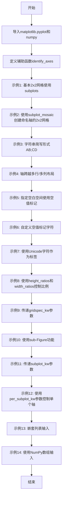
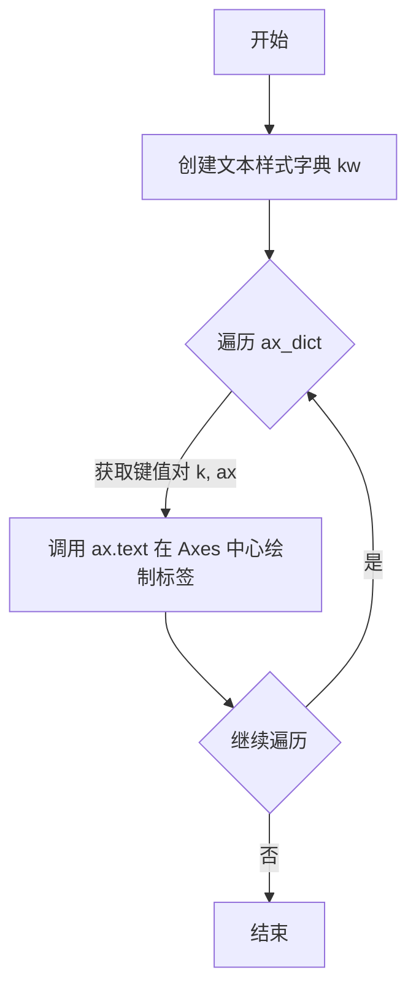

# `matplotlib\galleries\users_explain\axes\mosaic.py` 详细设计文档

这是一个Matplotlib库的文档教程文件，展示了如何使用Figure.subplot_mosaic功能创建复杂的子图布局，包括字符串简写、轴跨越多行/多列、嵌套布局、GridSpec参数配置等多种用法。

## 整体流程



## 类结构

```
无类定义
└── 全局函数: identify_axes
└── 全局变量: mosaic, hist_data, ax_array, ax_dict
```

## 全局变量及字段


### `mosaic`
    
A string variable containing ASCII art representation of subplot layout patterns, using letters to denote axes positions and periods or other characters as empty sentinels.

类型：`str`
    


### `hist_data`
    
A NumPy array containing 1500 random normally distributed values used as sample data for histogram visualization.

类型：`numpy.ndarray`
    


### `ax_array`
    
A 2D NumPy array of matplotlib Axes objects created by Figure.subplots(), used for traditional grid-based subplot layout.

类型：`numpy.ndarray`
    


### `ax_dict`
    
A dictionary mapping semantic labels (strings) to matplotlib Axes objects, returned by Figure.subplot_mosaic() for named subplot access.

类型：`dict`
    


### `inner`
    
A nested list representing an inner mosaic layout with two vertically stacked axes labeled 'inner A' and 'inner B'.

类型：`list`
    


### `outer_nested_mosaic`
    
A nested list representing a composite mosaic layout combining outer axes ('main', 'bottom') with an inner nested mosaic.

类型：`list`
    


    

## 全局函数及方法


### `identify_axes`

用于在示例中可视化标识 Axes 的辅助函数。该函数接收一个包含标签到 Axes 映射的字典，在每个 Axes 的中心位置绘制一个大字体的灰色标签文本。

参数：

- `ax_dict`：`dict[str, Axes]`，字典类型，键为字符串（标题/标签），值为 matplotlib 的 Axes 对象，表示标签与 Axes 的映射关系
- `fontsize`：`int`，可选参数，默认值为 48，控制标签字体的大小

返回值：`None`，无返回值，函数直接修改 Axes 对象，在其上绘制文本

#### 流程图



#### 带注释源码

```python
def identify_axes(ax_dict, fontsize=48):
    """
    Helper to identify the Axes in the examples below.

    Draws the label in a large font in the center of the Axes.

    Parameters
    ----------
    ax_dict : dict[str, Axes]
        Mapping between the title / label and the Axes.
    fontsize : int, optional
        How big the label should be.
    """
    # 创建文本渲染的关键字参数字典
    # ha="center" 表示水平居中对齐
    # va="center" 表示垂直居中对齐
    # fontsize 动态传入，控制字体大小
    # color="darkgrey" 设置文本为深灰色
    kw = dict(ha="center", va="center", fontsize=fontsize, color="darkgrey")
    
    # 遍历传入的字典，字典的键是标签（如 'A', 'B' 或 'bar', 'plot' 等）
    # 字典的值是 matplotlib 的 Axes 对象
    for k, ax in ax_dict.items():
        # 调用 Axes 的 text 方法在 Axes 中心添加文本
        # 0.5, 0.5 表示在 Axes 中心位置（相对坐标 0-1）
        # transform=ax.transAxes 表示使用 Axes 坐标系（相对于 Axes 区域）
        # **kw 展开之前定义的样式参数
        ax.text(0.5, 0.5, k, transform=ax.transAxes, **kw)
```

## 关键组件


### identify_axes 函数
用于可视化的辅助函数，在每个Axes中心绘制大字体标签，帮助识别示例中的子图

### subplot_mosaic 方法
matplotlib Figure类的核心方法，通过ASCII艺术或嵌套列表直观地布局子图，返回以标签为键的字典映射

### 字符串简写格式
使用单字符作为子图标签，通过"AB;CD"等字符串表示行列布局，";"作为行分隔符，支持任意Unicode字符作为标签

### empty_sentinel 参数
指定用于表示空白空间的字符，默认为"."，可自定义如"X"等字符

### height_ratios/width_ratios 参数
控制子图网格的行高和列宽比例，通过相对数值指定布局的相对大小

### gridspec_kw 参数
传递到底层GridSpec的关键字参数，用于控制子图的整体位置(left/right/top/bottom)和间距(wspace/hspace)

### per_subplot_kw 参数
为每个子图单独传递创建参数的字典映射，支持单标签或元组形式的键来指定应用关键字的子图集合

### 嵌套列表输入
支持嵌套的列表结构来定义复杂布局，内部列表元素可以是另一个嵌套列表，实现子图的嵌套组合

### NumPy数组输入
支持使用2D NumPy数组作为布局规范，数组值对应子图标识符，0或指定值作为empty_sentinel

### 子图跨行跨列
通过在布局字符串中重复使用同一标签，使子图跨越多个网格单元，实现复杂布局如水平跨列或垂直跨行


## 问题及建议


### 已知问题

-   **代码重复严重**：多处重复创建figure、调用subplot_mosaic和identify_axes的模式，未提取为可复用函数
-   **缺乏错误处理**：未对mosaic字符串格式、空格处理、empty_sentinel参数等进行验证，输入格式错误时可能产生难以理解的错误
-   **魔法数字和硬编码**：随机种子19680801、字体大小48等硬编码值散布在代码中，缺乏配置说明
-   **全局状态依赖**：大量使用plt模块的全局状态（plt.figure()），未考虑面向对象封装，降低了代码的可测试性
-   **缺少类型提示**：identify_axes函数完全缺少类型注解，不利于静态分析和IDE支持
-   **资源管理不当**：频繁创建figure但未显式调用close()或使用with语句，可能导致资源泄漏
-   **函数职责不单一**：identify_axes函数混合了绘制标签和迭代处理逻辑，违反单一职责原则

### 优化建议

-   将重复的figure创建和subplot_mosaic调用模式封装为工厂函数或测试辅助类
-   为identify_axes函数添加完整的类型注解和参数校验逻辑
-   将硬编码配置值（如随机种子、字体大小）提取为模块级常量或配置文件
-   使用matplotlib的面向对象API（Figure类）替代plt全局函数调用，便于单元测试
-   考虑使用上下文管理器或显式close()管理Figure生命周期
-   将identify_axes拆分为纯绘制函数和数据处理函数，提高函数可复用性
-   增加边界情况测试，如空mosaic、非法字符、嵌套深度限制等


## 其它


### 设计目标与约束

该代码的设计目标是提供一种直观、灵活的方式来创建复杂的子图布局，通过ASCII艺术或嵌套列表的方式简化子图布局的定义过程。核心约束包括：1）标签必须是有效的Unicode字符；2）空白区域使用特定字符（如"."）标记；3）嵌套列表支持最多一层嵌套；4）所有布局最终都转换为gridspec.GridSpec进行实现。

### 错误处理与异常设计

代码主要通过matplotlib的Figure.subplot_mosaic方法暴露接口，错误处理遵循matplotlib现有机制。当传入无效的布局定义（如包含空字符串、使用空格作为标签等）时会发出警告或错误。建议在调用前验证布局字符串的合法性，避免使用空白字符作为标签或空标记符。

### 数据流与状态机

数据流遵循以下路径：用户输入（字符串/列表/数组）→布局解析器→内部嵌套列表转换→GridSpec生成器→Axes创建器→字典返回。用户输入可以是三种形式：1）ASCII字符串形式（"AB;CD"）；2）嵌套列表形式；3）NumPy数组形式。内部状态机负责识别输入类型并路由到相应的处理函数。

### 外部依赖与接口契约

主要依赖matplotlib.pyplot和numpy两个外部库。接口契约方面：subplot_mosaic接受mosaic（布局定义）、empty_sentinel（空白标记）、gridspec_kw（网格参数）、subplot_kw（子图参数）、per_subplot_kw（单个子图参数）、width_ratios和height_ratios等参数，返回值为dict类型，键为标签，值为Axes对象。

### 性能考虑与优化空间

当前实现对于简单布局性能良好，但嵌套布局和大规模GridSpec可能存在性能瓶颈。优化方向包括：1）缓存解析后的布局结构；2）延迟创建不可见的Axes；3）批量处理gridspec参数验证。代码示例中展示的功能变体较多，实际生产环境应根据具体需求选择合适的布局方式。

### 兼容性信息

该功能自matplotlib 3.3版本引入，per_subplot_kw参数自3.7版本添加。支持Python 3.6+。子图关键字参数（projection、facecolor等）需与matplotlib支持的参数一致。字符串简写形式仅支持单字符标签，嵌套列表形式无此限制。

### 相关文档与参考

详细文档请参阅matplotlib官方用户指南中的"Arranging Axes"章节。相关实现基于GridSpec类，底层机制与Figure.subplots共享。参考库包括R语言的patchwork包和MATLAB的subplot机制。

    