# `matplotlib\galleries\users_explain\axes\tight_layout_guide.py` 详细设计文档

这是一个Matplotlib的tight_layout教程文档，演示如何使用tight_layout功能自动调整子图参数，使子图适应图形区域，避免标题、轴标签和刻度标签被裁剪，并展示其在多子图、GridSpec、图例、颜色条等场景下的使用方法。

## 整体流程

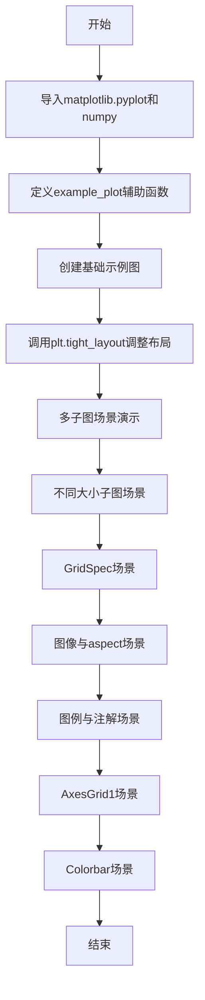

## 类结构

```
Python脚本 (非面向对象)
├── 辅助函数
│   └── example_plot
└── 示例代码块序列
```

## 全局变量及字段


### `plt`
    
Matplotlib的pyplot接口，提供绘图和布局功能

类型：`matplotlib.pyplot模块`
    


### `np`
    
NumPy库，用于数值计算和数组操作

类型：`numpy模块`
    


### `arr`
    
100个元素的二维数组，用于图像显示示例

类型：`numpy.ndarray (10x10矩阵)`
    


### `fontsize`
    
字体大小参数，控制图表中文本的大小

类型：`int`
    


### `fig`
    
图形容器对象，包含整个图表的所有元素

类型：`matplotlib.figure.Figure`
    


### `ax`
    
单个坐标轴对象，用于绘制图表和数据

类型：`matplotlib.axes.Axes`
    


### `ax1`
    
第一个子图的坐标轴对象

类型：`matplotlib.axes.Axes`
    


### `ax2`
    
第二个子图的坐标轴对象

类型：`matplotlib.axes.Axes`
    


### `ax3`
    
第三个子图的坐标轴对象

类型：`matplotlib.axes.Axes`
    


### `ax4`
    
第四个子图的坐标轴对象

类型：`matplotlib.axes.Axes`
    


### `lines`
    
由ax.plot()返回的线条对象列表，用于图例示例

类型：`list[matplotlib.lines.Line2D]`
    


### `leg`
    
图例对象，用于显示图表的数据标签

类型：`matplotlib.legend.Legend`
    


### `grid`
    
axes_grid1工具包的网格对象，用于创建规则布局的子图

类型：`mpl_toolkits.axes_grid1.Grid`
    


### `im`
    
坐标轴图像对象，由imshow返回，显示二维数组图像

类型：`matplotlib.image.AxesImage`
    


### `cax`
    
颜色条专用的坐标轴对象，用于显示色彩映射图例

类型：`matplotlib.axes.Axes`
    


### `divider`
    
坐标轴分割器对象，用于在主坐标轴旁创建附加区域

类型：`mpl_toolkits.axes_grid1.axes_divider.AxesDivider`
    


### `gs1`
    
网格规格对象，定义子图的网格布局结构

类型：`matplotlib.gridspec.GridSpec`
    


### `gridspec`
    
GridSpec类所在的模块，提供高级网格布局功能

类型：`matplotlib.gridspec模块`
    


    

## 全局函数及方法


### `example_plot`

该函数用于创建一个带有 x 轴标签、y 轴标签和标题的简单线图，并配置坐标轴的刻度参数。

参数：

- `ax`：`matplotlib.axes.Axes`，用于绘制图表的 Axes 对象
- `fontsize`：`int`，默认值 12，设置标签和标题的字体大小

返回值：`None`，该函数没有返回值，直接在传入的 Axes 对象上绘制图形

#### 流程图

```mermaid
flowchart TD
    A[开始 example_plot] --> B[在 ax 上绘制线图 plot[1, 2]]
    B --> C[设置刻度参数 locator_params nbins=3]
    C --> D[设置 x 轴标签 'x-label']
    D --> E[设置 y 轴标签 'y-label']
    E --> F[设置图表标题 'Title']
    F --> G[结束函数]
```

#### 带注释源码

```python
def example_plot(ax, fontsize=12):
    """
    创建带标签和标题的示例线图
    
    参数:
        ax: matplotlib.axes.Axes 对象，用于绘制图表的坐标轴
        fontsize: int, 默认值12，设置标签和标题的字体大小
    """
    # 在 Axes 上绘制简单的线图，数据点为 [1, 2]
    ax.plot([1, 2])
    
    # 配置坐标轴刻度参数，nbins=3 表示刻度数量为3个
    ax.locator_params(nbins=3)
    
    # 设置 x 轴标签，文本为 'x-label'，字体大小由参数控制
    ax.set_xlabel('x-label', fontsize=fontsize)
    
    # 设置 y 轴标签，文本为 'y-label'，字体大小由参数控制
    ax.set_ylabel('y-label', fontsize=fontsize)
    
    # 设置图表标题，文本为 'Title'，字体大小由参数控制
    ax.set_title('Title', fontsize=fontsize)
```


### plt.tight_layout

`plt.tight_layout` 是 Matplotlib 中的布局调整函数，用于自动调整子图参数，使子图适应 figure 区域，避免标签、标题等被裁剪。

参数：

- `pad`：`float`，表示图形边框周围的额外填充空间（以字体大小的分数为单位），默认值为 1.08
- `w_pad`：`float`，表示子图之间的水平填充空间（以字体大小的分数为单位），默认值为 0.5
- `h_pad`：`float`，表示子图之间的垂直填充空间（以字体大小的分数为单位），默认值为 0.5
- `rect`：`tuple` 或 `4-tuple`，表示子图要适应的边界框，格式为 (left, bottom, right, top)，取值范围为 0-1（归一化坐标），默认值为 (0, 0, 1, 1)

返回值：`None`，该函数直接修改当前的 Figure 对象，不返回任何值。

#### 流程图

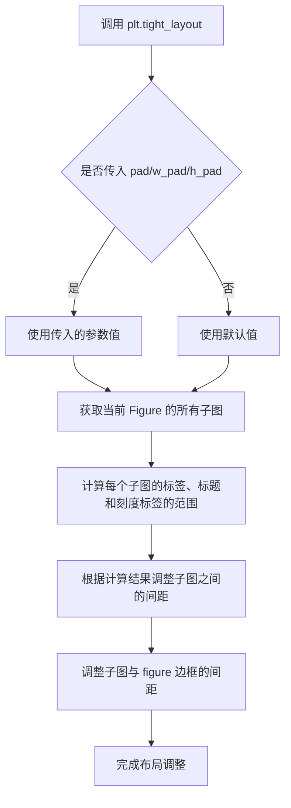

#### 带注释源码

```python
# tight_layout 函数源码示例（简化版）
def tight_layout(pad=1.08, w_pad=None, h_pad=None, rect=None):
    """
    自动调整子图参数以适应 figure 区域。
    
    参数:
        pad: 浮点数，figure 边框周围的填充空间（以 fontsize 的分数为单位）
        w_pad: 浮点数，子图之间的水平填充
        h_pad: 浮点数，子图之间的垂直填充
        rect: 4 元组，指定子图适应的归一化边界框 (left, bottom, right, top)
    """
    # 获取当前的 Figure 对象
    fig = gcf()
    
    # 如果没有指定 w_pad 和 h_pad，则使用默认值
    # 默认值通常基于 pad 计算
    if w_pad is None:
        w_pad = pad / 2.0
    if h_pad is None:
        h_pad = pad / 2.0
    
    # 调用 Figure 的 tight_layout 方法
    fig.tight_layout(pad=pad, w_pad=w_pad, h_pad=h_pad, rect=rect)
```

#### 使用示例

```python
# 在示例代码中的调用方式
fig, ((ax1, ax2), (ax3, ax4)) = plt.subplots(nrows=2, ncols=2)
example_plot(ax1)
example_plot(ax2)
example_plot(ax3)
example_plot(ax4)

# 调用 tight_layout 并传入自定义参数
plt.tight_layout(pad=0.4, w_pad=0.5, h_pad=1.0)
```

### 关键组件信息

- **Figure 对象**：Matplotlib 中的图表容器，包含所有子图
- **Axes（子图）**：图表中的绘图区域，包含坐标轴、标签、标题等元素
- **GridSpec**：子图网格规格，用于定义子图的布局

### 潜在技术债务与优化空间

1. **算法局限性**：`tight_layout` 假设艺术家元素所需的空间与其原始位置无关，这在某些情况下可能不准确
2. **不保证收敛**：多次调用 `tight_layout` 可能导致布局略有变化
3. **文本裁剪风险**：`pad=0` 时可能出现少量文本被裁剪的情况
4. **功能局限**：相比更现代的 `Constrained Layout`，`tight_layout` 功能较为有限

### 其它项目

- **设计目标**：提供简单的自动布局调整功能，适用于大多数常见场景
- **约束**：仅检查刻度标签、轴标签和标题的范围，可能不适用于所有复杂情况
- **错误处理**：当布局计算失败时，可能不会抛出异常但布局效果可能不理想
- **推荐替代方案**：对于更复杂的布局需求，建议使用 `Constrained Layout`（`figure.set_constrained_layout(True)`）


### `plt.close`

该函数是 Matplotlib 库中 `pyplot` 模块的核心图形管理函数，用于关闭图形窗口或图形对象。当传入参数 `'all'` 时，该函数会关闭 Python 进程中所有当前打开的 Matplotlib 图形，释放相关内存资源，这是图形清理和测试脚本中常用的操作。

参数：

- `arg`：可选参数，可以是以下类型之一：
  - `None`（默认）：关闭当前活动的图形（`gcf()` 返回的图形）
  - `int`：关闭图形编号对应的图形
  - `str`：当传入 `'all'` 时，关闭所有打开的图形
  - `matplotlib.figure.Figure`：关闭指定的 Figure 对象

返回值：`None`，该函数无返回值，执行副作用（关闭图形）。

#### 流程图

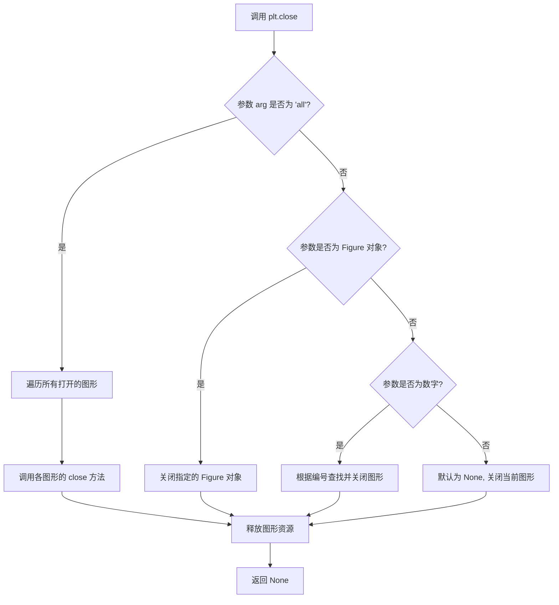

#### 带注释源码

```python
# 示例代码来自 Matplotlib 官方示例 tight_layout_guide.py
# 该函数调用演示了在创建新图形前清理所有已存在的图形

import matplotlib.pyplot as plt
import numpy as np

# 设置保存图形时的背景色参数
plt.rcParams['savefig.facecolor'] = "0.8"

# 定义一个示例绘图函数
def example_plot(ax, fontsize=12):
    ax.plot([1, 2])  # 绘制简单的折线图
    ax.locator_params(nbins=3)  # 设置刻度定位器参数
    ax.set_xlabel('x-label', fontsize=fontsize)  # 设置 x 轴标签
    ax.set_ylabel('y-label', fontsize=fontsize)  # 设置 y 轴标签
    ax.set_title('Title', fontsize=fontsize)  # 设置图形标题

# 【关键函数调用】
# 关闭所有已打开的图形窗口，释放内存
# 参数 'all' 是一个特殊字符串，指示函数关闭所有图形
plt.close('all')

# 创建一个新的图形和子图
fig, ax = plt.subplots()
# 调用示例绘图函数
example_plot(ax, fontsize=24)

# ========================================
# 后续代码继续演示 tight_layout 的用法
# ========================================

# 第二次调用 plt.close('all')，清理图形准备下一个示例
plt.close('all')

# 创建一个 2x2 的子图布局
fig, ((ax1, ax2), (ax3, ax4)) = plt.subplots(nrows=2, ncols=2)
# 为每个子图调用示例绘图函数
example_plot(ax1)
example_plot(ax2)
example_plot(ax3)
example_plot(ax4)
# 应用 tight_layout 调整子图布局
plt.tight_layout()

# ... 更多示例代码 ...
```

#### 补充说明

在上述代码中，`plt.close('all')` 的主要用途包括：

1. **内存管理**：在运行多个独立图形示例时，关闭旧图形以释放内存
2. **测试隔离**：确保每个测试或示例开始时处于干净的图形状态
3. **自动化脚本**：在批处理图形生成时避免图形窗口堆积

该函数等价于遍历 `matplotlib.pyplot.get_fignums()` 获取的所有图形编号并依次关闭，是 Matplotlib 中最彻底的图形清理方式。


### `plt.subplots`

创建包含多个子图的图形网格，返回图形对象和Axes对象数组。

参数：

- `nrows`：`int`，行数，指定要创建的子图行数（默认值为1）
- `ncols`：`int`，列数，指定要创建的子图列数（默认值为1）

返回值：`tuple`，返回`(fig, ax)`元组，其中`fig`是Figure对象，`ax`是Axes对象（当`nrows`和`ncols`都为1时）或Axes对象数组（当nrows>1或ncols>1时）

#### 流程图

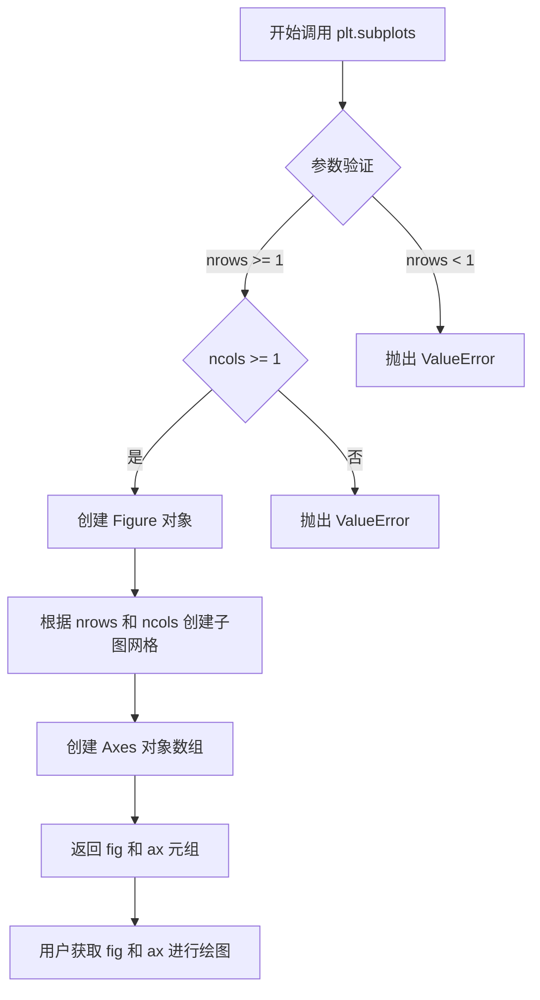

#### 带注释源码

```python
# 导入必要的库
import matplotlib.pyplot as plt
import numpy as np

# 设置保存图形时的背景色
plt.rcParams['savefig.facecolor'] = "0.8"

# 定义一个示例绘图函数，用于演示子图布局
def example_plot(ax, fontsize=12):
    """在给定的Axes上绘制示例图表并设置标签"""
    ax.plot([1, 2])  # 绘制简单折线图
    ax.locator_params(nbins=3)  # 设置刻度_locator参数
    ax.set_xlabel('x-label', fontsize=fontsize)  # 设置x轴标签
    ax.set_ylabel('y-label', fontsize=fontsize)  # 设置y轴标签
    ax.set_title('Title', fontsize=fontsize)  # 设置标题

# 关闭所有已存在的图形窗口
plt.close('all')

# =============================================
# 核心代码：创建2x2子图布局
# =============================================
# 调用 plt.subplots 创建2行2列的子图网格
# 参数说明：
#   nrows=2: 创建2行子图
#   ncols=2: 创建2列子图
# 返回值：
#   fig: Figure对象，代表整个图形窗口
#   ((ax1, ax2), (ax3, ax4)): 2x2的Axes对象数组
#     ax1: 第1行第1列的子图
#     ax2: 第1行第2列的子图
#     ax3: 第2行第1列的子图
#     ax4: 第2行第2列的子图
fig, ((ax1, ax2), (ax3, ax4)) = plt.subplots(nrows=2, ncols=2)

# 对每个子图应用示例绘图函数
example_plot(ax1)  # 在左上子图绘图
example_plot(ax2)  # 在右上子图绘图
example_plot(ax3)  # 在左下子图绘图
example_plot(ax4)  # 在右下子图绘图

# =============================================
# 应用 tight_layout 优化子图间距
# =============================================
# tight_layout 自动调整子图参数，使子图适应图形区域
# 减少子图之间的重叠
plt.tight_layout()

# 显示最终图形
plt.show()
```


### `plt.figure`

在 Matplotlib 中创建新的图形窗口或获取已存在的图形

参数：

- `figsize`：`tuple of float`，图形的宽和高，以英寸为单位，默认为 `(6.4, 4.8)`
- `dpi`：`float`，图形的分辨率，默认为 `100`
- `facecolor`：`str or None`，图形的背景颜色，默认为 `'white'`
- `edgecolor`：`str or None`，图形边框颜色，默认为 `'white'`
- `frameon`：`bool`，是否绘制图形框架，默认为 `True`
- `num`：`int, str, or Figure`，图形的唯一标识符，可以是整数、字符串或已有的 Figure 对象。如果已存在的图形具有相同标识符，则激活该图形而不是创建新图形
- `clear`：`bool`，如果为 `True` 且图形已存在，则在创建新图形前先清除内容，默认为 `False`
- `**kwargs`：其他关键字参数，将传递给 `Figure` 构造函数

返回值：`matplotlib.figure.Figure`，返回创建的图形对象

#### 流程图

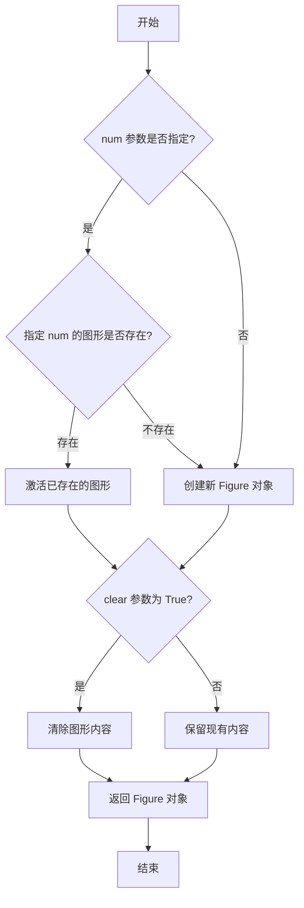

#### 带注释源码

```python
import matplotlib.pyplot as plt
import matplotlib.figure as mfig
from matplotlib.backends.backend_figure import FigureCanvasBase

def figure(num=None, figsize=None, dpi=None, facecolor=None,
           edgecolor=None, frameon=True, clear=False, **kwargs):
    """
    创建一个新的图形窗口或获取已存在的图形。
    
    参数:
        num: 图形的唯一标识符。如果是整数，表示图形编号；
             如果是字符串，表示图形名称；如果是 Figure 对象，
             则返回该对象。如果指定编号的图形已存在，则激活该图形。
        figsize: 图形的宽高尺寸，格式为 (宽度, 高度)，单位英寸。
        dpi: 图形的分辨率，每英寸点数。
        facecolor: 图形背景颜色。
        edgecolor: 图形边框颜色。
        frameon: 是否绘制框架。
        clear: 如果图形已存在且此值为 True，则清除后再使用。
        
    返回:
        Figure 对象
    """
    
    # 获取全局的图形管理器字典
    allnums = plt.get_fignums()
    
    # 如果 num 是 Figure 对象，直接返回
    if isinstance(num, mfig.Figure):
        figure = num
        return figure
    
    # 处理 num 参数
    if num is None:
        # 如果没有指定 num，使用递增的编号
        num = max(allnums) + 1 if allnums else 1
    elif isinstance(num, str):
        # 如果是字符串名称，在现有图形中查找
        # ...
    elif isinstance(num, int):
        # 如果是整数编号，查找或创建
        # ...
    
    # 检查图形是否已存在
    existing_fig = plt._pylab_helpers.Gcf.get_fig(num)
    
    if existing_fig is not None:
        # 图形已存在
        if clear:
            existing_fig.clf()  # 清除图形
        return existing_fig
    
    # 创建新的 Figure 对象
    figure = mfig.Figure(
        figsize=figsize,
        dpi=dpi,
        facecolor=facecolor,
        edgecolor=edgecolor,
        frameon=frameon,
        **kwargs
    )
    
    # 将新图形添加到管理器
    # ...
    
    return figure
```

#### 使用示例

```python
import matplotlib.pyplot as plt

# 示例 1: 创建默认图形
fig = plt.figure()  # 创建新的图形

# 示例 2: 指定图形尺寸和分辨率
fig = plt.figure(figsize=(8, 6), dpi=100)

# 示例 3: 指定背景颜色
fig = plt.figure(facecolor='lightgray')

# 示例 4: 使用编号获取或创建图形
fig1 = plt.figure(num=1)  # 创建或获取编号为 1 的图形
fig2 = plt.figure(num='my_figure')  # 创建或获取名为 'my_figure' 的图形

# 示例 5: 清除已存在的图形并重新创建
fig = plt.figure(num=1, clear=True)
```


### `matplotlib.pyplot.figure`

`plt.figure` 是 Matplotlib 库中用于创建新图形窗口或图形的核心函数，支持自定义图形尺寸、分辨率、背景色等属性，返回一个 `Figure` 对象供后续绘图操作使用。

参数：

- `figsize`：`tuple of (float, float)`，图形尺寸，以英寸为单位的宽度和高度（例如 (5, 4) 表示宽度5英寸、高度4英寸）
- `dpi`：`int`，可选，每英寸点数（分辨率），默认值为 100
- `facecolor`：`color specification`，可选，图形背景色，默认值为 'white'
- `edgecolor`：`color specification`，可选，图形边框颜色
- `frameon`：`bool`，可选，是否绘制框架，默认为 True
- `FigureClass`：`class`，可选，自定义 Figure 类，默认为 matplotlib.figure.Figure
- `**kwargs`：其他可选参数，将传递给 Figure 构造函数

返回值：`matplotlib.figure.Figure`，返回创建的图形对象，可用于添加子图、绘制数据等操作

#### 流程图

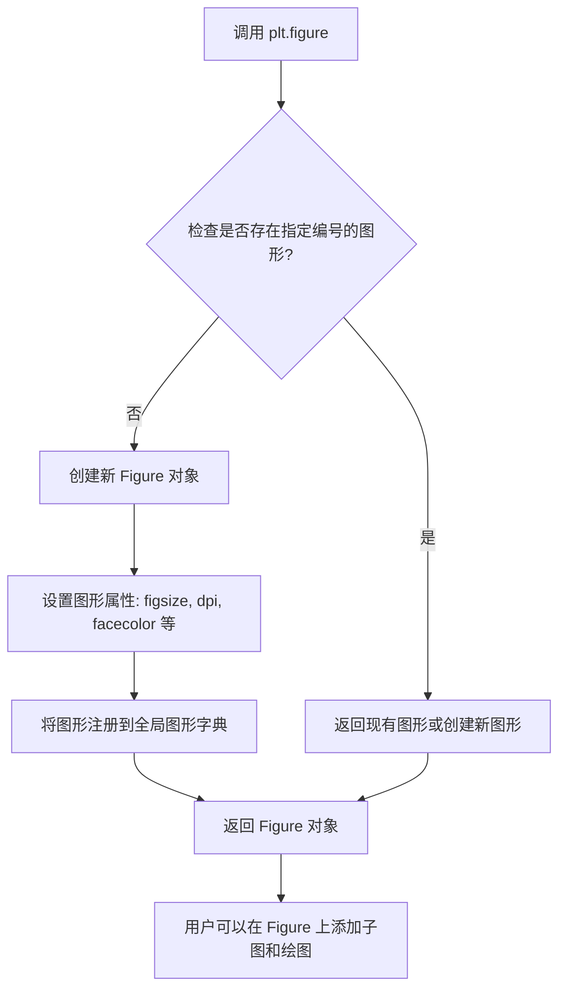

#### 带注释源码

```python
def figure(
    figsize=None,      # 图形尺寸 (宽, 高)，单位英寸
    dpi=None,          # 分辨率，每英寸点数
    facecolor=None,    # 背景颜色
    edgecolor=None,    # 边框颜色
    frameon=True,      # 是否显示框架
    FigureClass=Figure, # 自定义 Figure 类
    **kwargs           # 其他传递给 Figure 的参数
):
    """
    创建一个新的图形窗口或获取现有图形。
    
    参数:
        figsize: 图形尺寸，格式为 (width, height)，单位为英寸
        dpi: 图形分辨率，每英寸像素数
        facecolor: 图形背景颜色
        edgecolor: 图形边框颜色
        frameon: 是否绘制框架
        FigureClass: 用于创建图形的类
    
    返回:
        Figure: 新创建或已存在的 Figure 对象
    """
    
    # 获取全局图形管理器
    allnums = get_fignums()
    
    # 如果提供了数字参数，检查是否需要获取现有图形
    # 否则创建新图形
    
    # 创建 Figure 实例
    fig = FigureClass(
        figsize=figsize,
        dpi=dpi,
        facecolor=facecolor,
        edgecolor=edgecolor,
        frameon=frameon,
        **kwargs
    )
    
    # 将新图形注册到 pyplot 的图形管理中
    # 返回 Figure 对象供用户使用
    return fig
```

### 核心功能简述

`plt.figure(figsize=(5, 4))` 创建一个宽度为5英寸、高度为4英寸的新图形画布，是 Matplotlib 中所有绘图的起点，类似于画家的画布，后续的 `ax = plt.subplot()` 或 `fig.add_subplot()` 等操作都会在这个画布上添加子图。

### 关键组件信息

- **Figure 对象**：Matplotlib 中的核心图形容器，管理整个图形的所有元素
- **Subplot/ Axes**：图形中的子图区域，用于绘制数据
- **DPI (Dots Per Inch)**：图形分辨率，影响图形在屏幕上的清晰度
- **facecolor/edgecolor**：图形的外观样式设置

### 潜在的技术债务或优化空间

1. **布局算法局限性**：当前代码示例中的 `tight_layout` 算法可能不收敛，多次调用可能产生不同的布局结果
2. **边界情况处理**：当 `pad=0` 时可能出现少量文本被裁剪的情况
3. **自动布局的局限性**：假设艺术家所需空间与其原始位置无关，这在某些情况下可能不成立

### 其他项目

- **设计目标**：提供简单易用的 API 来创建可定制的图形窗口
- **约束**：图形尺寸受限于系统内存和 DPI 设置
- **错误处理**：如果创建图形失败（如无效的尺寸参数），会抛出 ValueError
- **外部依赖**：依赖 matplotlib.figure.Figure 类和底层图形后端（如 Qt、GTK、MacOSX 等）


### `plt.subplot` / `matplotlib.pyplot.subplot`

`plt.subplot` 是 matplotlib.pyplot 模块中的核心函数，用于在当前图形中创建并返回一个子图（Axes）对象。该函数支持多种调用方式，包括三位数简写形式（如221表示2行2列的第1个位置）和完整的行列索引形式。用户可以通过该函数灵活地在Figure画布上布局多个子图，实现数据的分面展示。

参数：

- `*args`：`tuple` 或 `int`，可变参数，支持以下两种调用方式：
  - `plt.subplot(nrows, ncols, index)`：三个独立整数参数，分别指定子图网格的行数、列数和当前子图位置索引（从1开始）
  - `plt.subplot(position)`：三位数整数，如221表示2行2列网格的第1个位置，等价于 `plt.subplot(2, 2, 1)`

- `**kwargs`：关键字参数，将额外参数传递给 `Figure.add_subplot` 或 `Axes` 的属性设置，如 `projection='3d'` 创建三维坐标轴等

返回值：`matplotlib.axes.Axes`，返回创建的子图对象，该对象代表一个坐标轴，可用于绑制数据、设置标签、标题等

#### 流程图

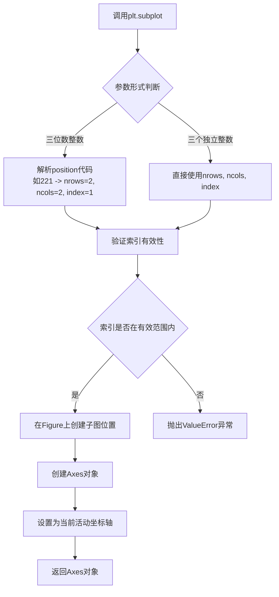

#### 带注释源码

```python
# plt.subplot 函数是 matplotlib.pyplot 模块的组成部分
# 下面是代码中使用 plt.subplot(221) 的示例

# 示例1：创建2x2网格中的第一个子图（位置1）
fig = plt.figure()  # 创建新图形

ax1 = plt.subplot(221)  # 参数221解释：
# 2 - 子图网格的行数（2行）
# 2 - 子图网格的列数（2列）
# 1 - 子图位置索引（从左到右、从上到下编号）
# 结果：在2x2网格的左上角位置创建子图
# 返回值：Axes对象，可用于绑图

ax2 = plt.subplot(223)  # 2x2网格的第3个位置（2行2列，左下）
ax3 = plt.subplot(122)  # 1x2网格的第2个位置（1行2列，右侧）

example_plot(ax1)  # 调用示例绑图函数
example_plot(ax2)
example_plot(ax3)

plt.tight_layout()  # 自动调整子图布局

# plt.subplot 的其他调用形式：
ax = plt.subplot()              # 无参数：创建单个子图覆盖整个图形
ax = plt.subplot(111)           # 1x1网格的第1个位置
ax = plt.subplot(2, 2, 1)       # 与 plt.subplot(221) 等价
ax = plt.subplot(1, 2, 2)       # 与 plt.subplot(122) 等价

# 带关键字参数的调用：
ax3d = plt.subplot(111, projection='3d')  # 创建三维子图
```


### `plt.subplot2grid`

使用 Grid 规范创建子图，允许子图跨越多个网格单元。

参数：

- `shape`：tuple(int, int)，网格的形状，格式为 (rows, cols)，表示网格的行数和列数
- `loc`：tuple(int, int)，子图的位置，格式为 (row, col)，表示子图起始的网格单元
- `colspan`：int=1，子图跨越的列数，默认值为 1
- `rowspan`：int=1，子图跨越的行数，默认值为 1
- `**kwargs`：任意关键字参数传递给 `add_subplot` 或子图创建函数

返回值：`matplotlib.axes.Axes`，创建的子图Axes对象

#### 流程图

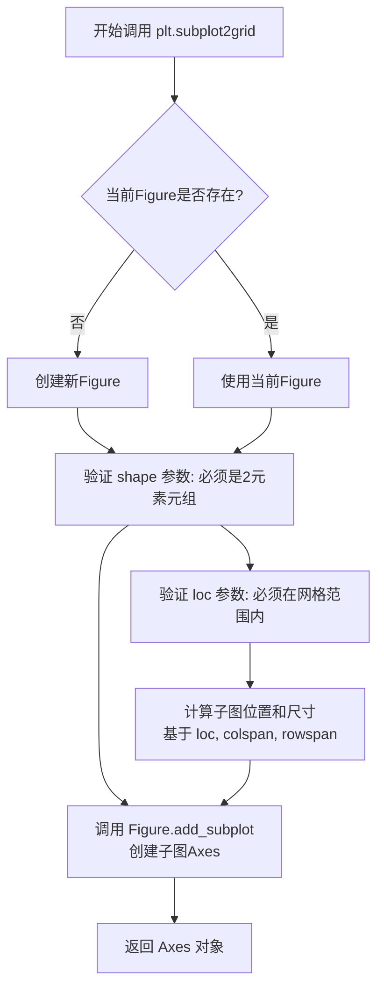

#### 带注释源码

```python
# plt.subplot2grid 是 matplotlib.pyplot 模块中的函数
# 以下为调用示例和使用说明

# 导入 matplotlib
import matplotlib.pyplot as plt

# 基本调用方式
# shape: (3, 3) 表示 3行3列的网格
# loc: (0, 0) 表示从第0行第0列开始
ax1 = plt.subplot2grid((3, 3), (0, 0))

# 创建跨越多列的子图
# colspan=2 表示占据2列宽度
ax2 = plt.subplot2grid((3, 3), (0, 1), colspan=2)

# 创建跨越多行多列的子图
# colspan=2, rowspan=2 表示占据2行2列
ax3 = plt.subplot2grid((3, 3), (1, 0), colspan=2, rowspan=2)

# 创建跨越多行的子图
# rowspan=2 表示占据2行高度
ax4 = plt.subplot2grid((3, 3), (1, 2), rowspan=2)

# 完整示例：创建复杂布局的子图
fig = plt.figure()

ax1 = plt.subplot2grid((3, 3), (0, 0))       # 顶部左侧单元格
ax2 = plt.subplot2grid((3, 3), (0, 1), colspan=2)  # 顶部右侧2列
ax3 = plt.subplot2grid((3, 3), (1, 0), colspan=2, rowspan=2)  # 左侧2x2区域
ax4 = plt.subplot2grid((3, 3), (1, 2), rowspan=2)  # 右侧2行

# 设置标题和标签
ax1.set_title('ax1')
ax2.set_title('ax2')
ax3.set_title('ax3')
ax4.set_title('ax4')

plt.tight_layout()
plt.show()
```

**函数签名（推断）：**
```python
def subplot2grid(shape, loc, colspan=1, rowspan=1, fig=None, **kwargs):
    """
    使用 Grid 规范创建子图。
    
    参数:
        shape: (rows, cols) - 网格形状
        loc: (row, col) - 起始位置
        colspan: 子图占据的列数
        rowspan: 子图占据的行数
        fig: 指定的Figure对象，默认为当前Figure
        **kwargs: 传递给 add_subplot 的其他参数
    
    返回:
        Axes: 创建的子图对象
    """
```


### `matplotlib.axes.Axes.plot`

在给定坐标轴上绘制线条或标记。这是 Matplotlib 中最基础且常用的绑图函数之一。

参数：

- `x`：`array-like` 或 `scalar`，可选的第一个数据参数。如果是单个值，则视为 x 轴数据，y 数据需要单独指定。
- `y`：`array-like`，必需的第二数据参数，表示 y 轴数据。
- `fmt`：`str`，可选的格式字符串，例如 'ro' 表示红色圆圈，'b-' 表示蓝色实线。
- `**kwargs`：其他关键字参数传递给 `Line2D` 构造函数，用于自定义线条样式。

返回值：`list of ~matplotlib.lines.Line2D`，返回绑制到轴上的线条对象列表。

#### 流程图

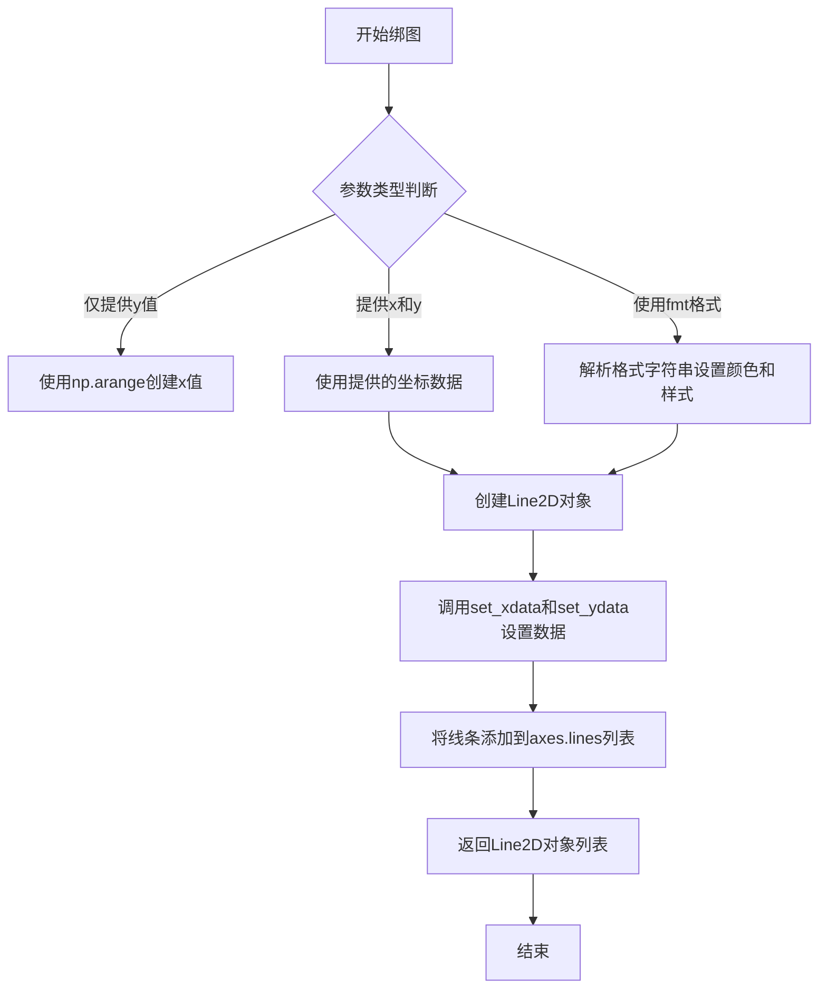

#### 带注释源码

```python
def plot(self, *args, **kwargs):
    """
    Plot y versus x as lines and/or markers.
    
    Parameters
    ----------
    x, y : array-like or scalar
        The data positions.
        
    fmt : str, optional
        A format string, e.g. 'ro' for red circles.
        
    **kwargs
        Properties controlling the appearance of the line or marker,
        such as color, linewidth, linestyle, marker, markersize, etc.
        
    Returns
    -------
    lines : list of ~matplotlib.lines.Line2D
        The lines corresponding to the data arguments.
    """
    # 获取Axes对象
    ax = self
    
    # 解析位置参数 - 支持多种调用格式:
    # plot(y) - 仅y数据
    # plot(x, y) - x和y数据
    # plot(x, y, fmt) - 带格式字符串
    if len(args) == 0:
        return []
    
    # 处理不同数量的位置参数
    if len(args) == 1:
        # 只有y数据
        y = np.asarray(args[0])
        x = np.arange(len(y))
    elif len(args) == 2:
        # x和y数据
        x = np.asarray(args[0])
        y = np.asarray(args[1])
    else:
        # x, y, fmt 格式
        x = np.asarray(args[0])
        y = np.asarray(args[1])
        # 解析格式字符串并合并到kwargs
        kwargs = self._format2args(args[2], **kwargs)
    
    # 创建Line2D对象
    line = mlines.Line2D(x, y, **kwargs)
    
    # 将线条添加到axes
    ax.add_line(line)
    
    # 重新计算数据限制
    ax.autoscale_view()
    
    # 返回线条对象
    return [line]
```


### `Axes.locator_params`

该方法用于设置坐标轴定位器（Locator）的参数，控制刻度线的数量和分布。

参数：

- `axis`：字符串，可选，指定要设置参数的轴（'x'、'y' 或 'both'），默认为 'both'
- `nbins`：整数或 'auto'，可选，指定刻度标签的最大数量，示例代码中设置为 3

返回值：无返回值（`None`），该方法直接修改 Axes 对象的定位器状态

#### 流程图

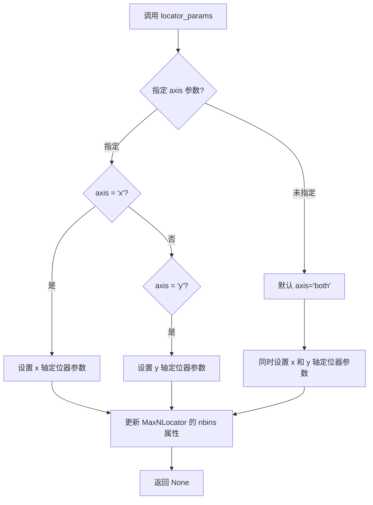

#### 带注释源码

```python
def locator_params(self, axis='both', nbins=9, **kwargs):
    """
    Control parameters of the locator used for the axis.
    
    This method allows you to fine-tune the tick location algorithm.
    Commonly used to reduce the number of ticks for cleaner visualizations.
    
    Parameters
    ----------
    axis : {'both', 'x', 'y'}, default: 'both'
        The axis to apply the parameters to.
        
    nbins : int or 'auto', default: 9
        Maximum number of ticks allowed. For 'auto', the number will
        be automatically determined based on the axis length.
        
    **kwargs
        Additional parameters passed to the locator constructor.
        
    Examples
    --------
    >>> ax.locator_params(nbins=3)  # Limit to 3 ticks on both axes
    >>> ax.locator_params(axis='x', nbins=5)  # Limit x-axis to 5 ticks
    """
    # 获取指定的轴定位器
    if axis in ['x', 'both']:
        loc = self.xaxis.get_major_locator()
        # 调用定位器的 params 方法更新参数
        loc.set_params(nbins=nbins, **kwargs)
        
    if axis in ['y', 'both']:
        loc = self.yaxis.get_major_locator()
        loc.set_params(nbins=nbins, **kwargs)
```


### `Axes.set_xlabel`

设置 x 轴的标签（xlabel）。

参数：

- `xlabel`：`str`，要设置的 x 轴标签文本
- `fontdict`：可选的字典，用于控制标签的字体属性（如 fontsize、fontweight 等）
- `labelpad`：可选的浮点数，指定标签与轴之间的距离
- `**kwargs`：其他关键字参数，将传递给底层的 `Text` 对象

返回值：返回 `self`（Axes 对象），允许链式调用。

#### 流程图

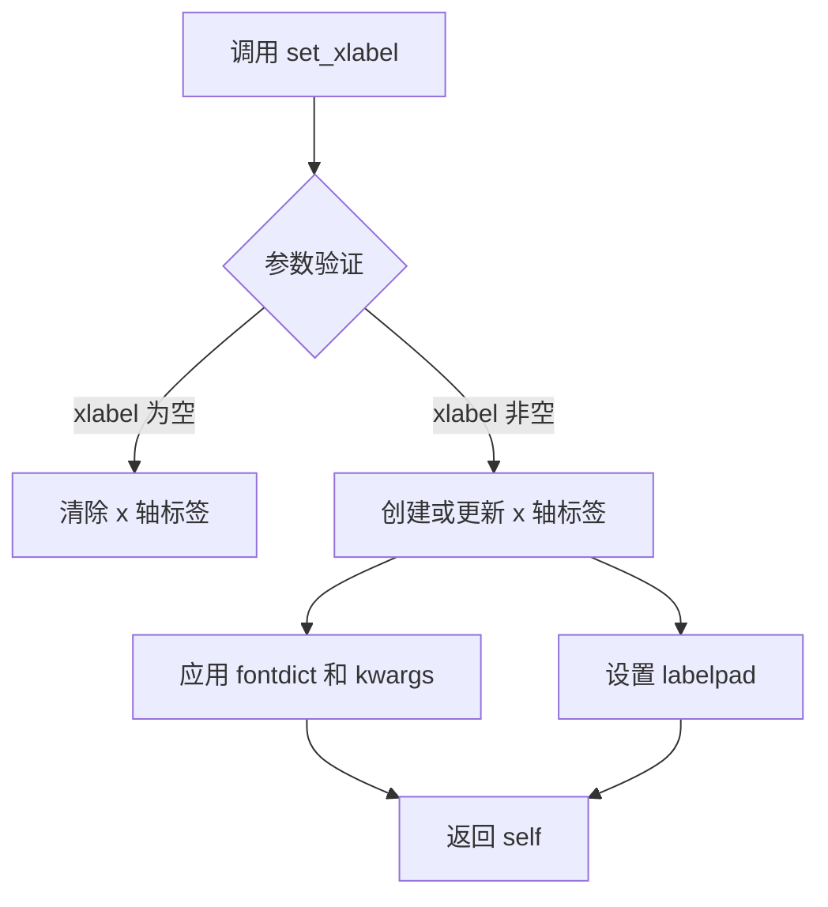

#### 带注释源码

由于提供的代码中仅包含 `ax.set_xlabel` 的调用示例，未包含该方法的实际实现源码。以下为调用示例及说明：

```python
def example_plot(ax, fontsize=12):
    ax.plot([1, 2])
    
    ax.locator_params(nbins=3)
    ax.set_xlabel('x-label', fontsize=fontsize)  # 设置 x 轴标签为 'x-label'，字体大小为 fontsize
    ax.set_ylabel('y-label', fontsize=fontsize)  # 设置 y 轴标签为 'y-label'
    ax.set_title('Title', fontsize=fontsize)     # 设置图表标题

# 调用示例
fig, ax = plt.subplots()
example_plot(ax, fontsize=24)
```

**方法功能说明：**

- `ax.set_xlabel('x-label')`：将当前 Axes 对象的 x 轴标签设置为字符串 `'x-label'`
- 第二个参数 `fontsize=fontsize`：指定标签文字的字体大小
- 该方法返回 Axes 对象本身，支持链式调用，例如 `ax.set_xlabel('x').set_ylabel('y')`

**注意：** 提供代码为 Matplotlib 的 tight_layout 教程示例，未包含 `set_xlabel` 方法的内部实现源码。若需查看其完整实现，建议参考 Matplotlib 官方源码仓库中的 `lib/matplotlib/axes/_axes.py` 文件。


### `Axes.set_ylabel`

该方法是 Matplotlib 中 `Axes` 类的成员函数，用于设置 y 轴的标签（_ylabel）。在提供的代码中，它被调用为 `ax.set_ylabel('y-label', fontsize=fontsize)`，用于设置 y 轴标签并指定字体大小。

**注意**：提供的代码是 Matplotlib 的教程文档，展示了如何使用 `tight_layout` 功能，但并未包含 `set_ylabel` 方法的内部实现源码。以下信息基于 Matplotlib 框架的标准接口和调用方式。

---

参数：

- `ylabel`：`str`，要设置的 y 轴标签文本内容
- `fontsize`：`int` 或 `float`，可选参数，指定标签文字的大小（代码中传入 `fontsize=fontsize`）
- `fontdict`：可选，`dict`，用于控制标签样式的字典
- `labelpad`：可选，`float` 或 `None`，指定标签与坐标轴之间的间距
- `pypos`：可选，未在代码中使用

返回值：`Text`，返回创建的 `Text` 对象，可以用于后续的样式设置或属性修改

---

#### 流程图

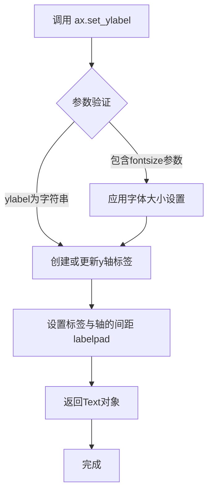

---

#### 带注释源码

```python
# 以下为根据 Matplotlib 公开接口推断的典型实现逻辑
# 实际源码位于 matplotlib/axes/_base.py 中的 Axes 类

def set_ylabel(self, ylabel, fontsize=None, fontdict=None, labelpad=None, **kwargs):
    """
    Set the label for the y-axis.
    
    Parameters
    ----------
    ylabel : str
        The label text.
    fontsize : int or float, optional
        Size of the label font. Default is ``rcParams["axes.labelsize"]``.
    fontdict : dict, optional
        A dictionary controlling the appearance of the label text.
    labelpad : float, optional
        Spacing in points between the label and the y-axis.
    **kwargs
        Additional parameters passed to the Text constructor.
    
    Returns
    -------
    label : Text
        The created Text instance.
    """
    # 获取或创建 y 轴标签文本对象
    # yaxis 对应 Axes 的 y 轴
    yaxis = self.yaxis
    
    # 如果已存在标签，则获取现有对象；否则创建新的
    label = yaxis.label
    
    # 设置标签文本内容
    label.set_text(ylabel)
    
    # 如果传入了 fontsize，则设置字体大小
    if fontsize is not None:
        label.set_fontsize(fontsize)
    
    # 如果传入了 fontdict，则应用字典中的样式设置
    if fontdict is not None:
        label.update(fontdict)
    
    # 如果传入了 labelpad，则设置标签与坐标轴的间距
    if labelpad is not None:
        label.set_pad(labelpad)
    
    # 应用其他关键字参数（如 color, rotation 等）
    label.update(kwargs)
    
    # 返回创建的标签对象，以便后续操作
    return label
```

---

#### 实际调用示例（来自提供代码）

```python
# 代码中第44行的实际调用
ax.set_ylabel('y-label', fontsize=fontsize)
```

此调用设置了 y 轴标签为 `'y-label'`，并使用传入的 `fontsize` 参数设置字体大小。


### `ax.set_title`

设置 Axes（坐标轴）对象的标题文字和样式。

参数：

- `label`：`str`，要设置的标题文本内容
- `fontsize`：`int` 或 `float`，标题文字的字体大小
- `fontweight`：标题文字的粗细程度（如 'normal', 'bold'）
- `color`：标题文字颜色
- `loc`：标题对齐方式（如 'center', 'left', 'right'）
- `pad`：标题与坐标轴顶部的间距
- `**kwargs`：其他传递给 `matplotlib.text.Text` 的参数

返回值：`matplotlib.text.Text`，返回创建的标题文本对象，可用于后续修改样式

#### 流程图

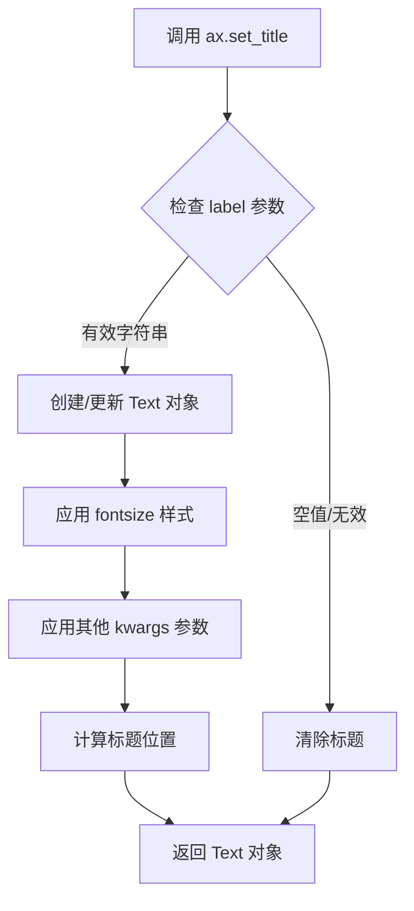

#### 带注释源码

```python
# 从 provided code 中提取的调用示例
def example_plot(ax, fontsize=12):
    ax.plot([1, 2])
    ax.locator_params(nbins=3)
    ax.set_xlabel('x-label', fontsize=fontsize)
    ax.set_ylabel('y-label', fontsize=fontsize)
    # 设置坐标轴标题
    # 参数 label: 'Title' - 标题文本内容
    # 参数 fontsize: 12 - 字体大小
    ax.set_title('Title', fontsize=fontsize)
```


### `ax.imshow`

在 Matplotlib 中，`ax.imshow()` 是 `matplotlib.axes.Axes` 类的成员方法，用于在 Axes 坐标系中显示二维图像或数据数组。该方法接受一个数组作为图像数据，并可配置插值方式、颜色映射等参数，最终返回一个 `AxesImage` 对象用于后续操作（如添加颜色条）。

参数：

- `arr`：`<class 'numpy.ndarray'>`，要显示的图像数据，通常为二维数组（灰度）或三维数组（RGB/RGBA）
- `interpolation`：`<class 'str'>`，图像插值方式，`'none'` 表示不使用任何插值，直接显示原始像素

返回值：`<class 'matplotlib.image.AxesImage'>`，返回图像对象，可用于进一步配置（如添加颜色条）或获取图像数据

#### 流程图

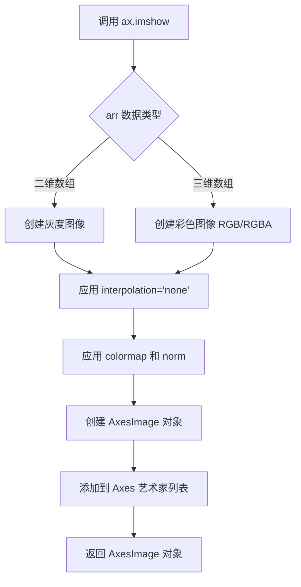

#### 带注释源码

```python
def imshow(self, X, cmap=None, norm=None, aspect=None,
           interpolation=None, alpha=None, vmin=None, vmax=None,
           origin=None, extent=None, shape=None, filternorm=True,
           filterrad=4.0, resample=None, url=None, **kwargs):
    """
    在 Axes 上显示图像或数据数组。
    
    参数:
        X: 输入数据，numpy 数组或类似数组对象
        cmap: 颜色映射（colormap），如 'viridis', 'jet' 等
        norm: 归一化对象，用于将数据值映射到颜色
        aspect: 图像长宽比，可设为 'auto' 或具体数值
        interpolation: 插值方法，'none' 表示不插值
        alpha: 透明度，0-1 之间的浮点数
        vmin, vmax: 数据范围，用于归一化
        origin: 坐标原点位置，'upper' 或 'lower'
        extent: 图像在 Axes 中的坐标范围 [xmin, xmax, ymin, ymax]
    
    返回:
        AxesImage: 图像艺术家对象
    """
    
    # 如果 X 是 PIL 图像，转换为数组
    if hasattr(X, 'getdata'):
        X = np.array(X)
    
    # 处理 cmap 和 norm 参数
    if cmap is None and norm is None:
        # 默认使用 viridis 映射（Matplotlib 3.0+）
        cmap = 'viridis'
    
    # 创建 AxesImage 对象
    # _ImageBase 是所有图像类型的基类
    if X.ndim == 2:
        # 二维数组：灰度图像
        image = self._images.patched_from(
            AxesImage(self, cmap=cmap, norm=norm, 
                     interpolation=interpolation, 
                     origin=origin, extent=extent, 
                     **kwargs),
            X, x=extent, y=extent
        )
    else:
        # 三维数组：RGB 或 RGBA 图像
        image = self._images.patched_from(
            AxesImage(self, interpolation=interpolation,
                     origin=origin, extent=extent, 
                     **kwargs),
            X, x=extent, y=extent
        )
    
    # 设置图像的 alpha（透明度）
    if alpha is not None:
        image.set_alpha(alpha)
    
    # 添加到 Axes 的艺术家列表中
    self.add_layer(image)
    
    return image
```

#### 关键组件信息

| 组件名称 | 一句话描述 |
|----------|------------|
| `AxesImage` | 表示 Axes 上渲染的图像对象，继承自 `Artist` 类 |
| `ImageNormalization` | 用于将输入数据值归一化到 [0, 1] 范围的类 |
| `Colormap` | 颜色映射对象，将归一化后的值映射到颜色 |
| `Figure.savefig` | 保存图像时，可配合 `bbox_inches='tight'` 使用 |

#### 潜在技术债务与优化空间

1. **插值性能**：在处理大尺寸图像时，`interpolation='none'` 虽然跳过插值计算，但首次渲染可能仍需重采样优化
2. **内存占用**：对于超大型数组，可考虑使用 `resample` 参数或分块加载
3. **颜色映射一致性**：建议显式指定 `cmap` 参数，避免依赖默认值（不同 Matplotlib 版本默认值可能不同）
4. **extent 与坐标对齐**：使用 `extent` 时需注意 `origin` 参数的配合，否则图像可能上下翻转

#### 其它说明

- **设计目标**：提供统一的图像显示 API，支持多种数据格式和可视化需求
- **约束条件**：
  - 输入数组维度需为 2D（灰度）或 3D（RGB/RGBA）
  - `vmin`/`vmax` 与 `norm` 不能同时使用
- **错误处理**：若输入数据包含 NaN 或 Inf 值，需配合 `nan` 处理或设置合适的 `vmin`/`vmax`
- **外部依赖**：NumPy（数据处理）、Matplotlib 核心库（渲染）


### `matplotlib.axes.Axes.legend`

创建图例（Legend）对象，用于显示 Axes 上的标签和对应的图形元素。该方法是 Matplotlib 中为 Axes 添加图例的标准方法，支持自定义位置、样式和布局。

参数：

-  `*args`：`可变位置参数`，支持多种调用方式：(1) 无参数，自动从 `ax.plot()` 的 label 参数中获取图例项；(2) 字符串列表，指定图例文本；(3) 图例条目列表（由 (artist, label) 或 (artist, label, numlines) 组成的序列）
-  `loc`：`str` 或 `tuple`，图例位置，可选值为 'best', 'upper right', 'upper left', 'lower left', 'lower right', 'right', 'center left', 'center right', 'lower center', 'upper center', 'center'，或使用 (x, y) 坐标（0-1 范围）
-  `bbox_to_anchor`：`tuple`，可选，用于指定图例锚点位置，如 (x, y) 或 (x, y, width, height)
-  `ncol`：`int`，图例列数，默认为 1
-  `prop`：`matplotlib.font_manager.FontProperties`，图例文本字体属性
-  `fontsize`：`int` 或 `str`，图例字体大小
-  `frameon`：`bool`，是否显示图例边框
-  `framealpha`：`float`，图例背景透明度
-  `facecolor`：`str`，图例背景颜色
-  `edgecolor`：`str`，图例边框颜色
-  `numpoints`：`int`，线型图例标记点的数量
-  `scatterpoints`：`int`，散点图例标记点的数量
-  `markerscale`：`float`，图例标记的缩放比例
-  `title`：`str`，图例标题
-  `title_fontsize`：`int`，图例标题字体大小
-  `borderpad`：`float`，边框内边距
-  `labelspacing`：`float`，标签间距
-  `handlelength`：`float`，句柄长度
-  `handleheight`：`float`，句柄高度
-  `handletextpad`：`float`，句柄与文本间距
-  `columnspacing`：`float`，列间距
-  `inline`：`bool`，是否将超出边界的句柄内联
-  `fancybox`：`bool`，是否使用圆角边框
-  `shadow`：`bool`，是否显示阴影

返回值：`matplotlib.legend.Legend`，返回创建的图例对象，可用于进一步操作（如设置 `set_in_layout()`）

#### 流程图

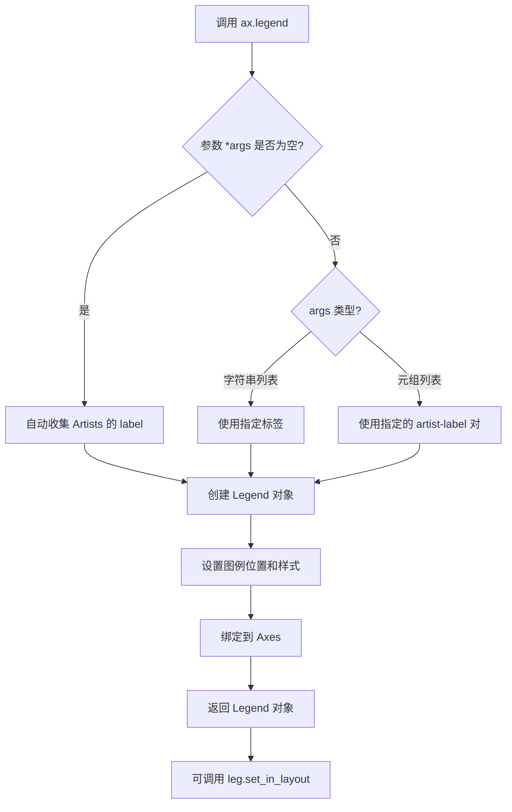

#### 带注释源码

```python
# 代码示例 1：创建基本图例
fig, ax = plt.subplots(figsize=(4, 3))
lines = ax.plot(range(10), label='A simple plot')  # 绘制带标签的线条
ax.legend(bbox_to_anchor=(0.7, 0.5), loc='center left',)  # 创建图例，锚点在 (0.7, 0.5)，左中对齐
fig.tight_layout()
plt.show()

# 代码示例 2：从布局中排除图例
fig, ax = plt.subplots(figsize=(4, 3))
lines = ax.plot(range(10), label='B simple plot')
leg = ax.legend(bbox_to_anchor=(0.7, 0.5), loc='center left',)  # 创建图例并保存到变量
leg.set_in_layout(False)  # 设置图例不参与 tight_layout 计算，使其不被纳入布局边界
fig.tight_layout()
plt.show()

# 内部实现逻辑（简化版）
# 1. 收集参数：解析 *args 和 **kwargs
# 2. 获取图例条目：
#    - 如果 args 为空，从 ax.get_legend_handles_labels() 获取
#    - 如果 args 是字符串列表，与现有句柄配对
#    - 如果 args 是 (artist, label) 元组列表，直接使用
# 3. 创建 Legend 对象：实例化 matplotlib.legend.Legend
# 4. 定位计算：根据 loc 和 bbox_to_anchor 计算图例位置
# 5. 渲染：图例作为独立 artist 添加到 Axes 的 legend_patch
# 6. 返回 Legend 对象供后续操作
```


### `Axes.plot`

绘制线条并返回 Line2D 对象列表。这是 Matplotlib 中用于在 Axes 上绘制数据线的核心方法。

参数：

- `x`：`array_like` 或 `scalar`，可选的 x 坐标数据。如果未提供，则使用 `range(len(y))` 自动生成。
- `y`：`array_like`，必需的 y 坐标数据。可以是单个数组，也可以是多个数组（每组对应一条线）。
- `fmt`：`str`，可选，格式字符串，例如 'o-'、'r--' 等，用于快速设置线条样式。
- `**kwargs`：`dict`，其他关键字参数，如 `label`（图例标签）、`color`（颜色）、`linewidth`（线宽）等。

返回值：`list[matplotlib.lines.Line2D]`，返回绘制的 Line2D 对象列表。每个 Line2D 对象代表一条 plotted 的线。

#### 流程图

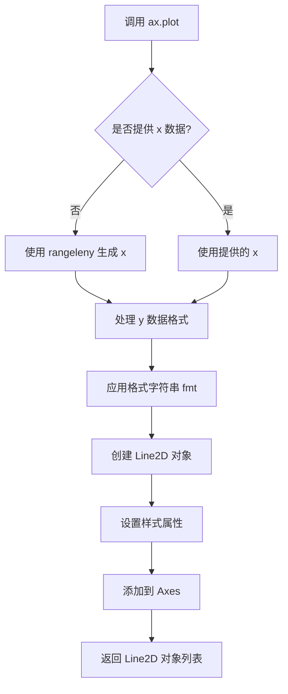

#### 带注释源码

```python
# 示例代码中的调用方式：

# 方式1：简单数据列表
ax.plot([1, 2])
# 参数 y=[1, 2]，x 未提供，自动生成 x=[0, 1]
# 返回值：包含一条 Line2D 对象的列表

# 方式2：带标签的数据
ax.plot(range(10), label='A simple plot')
# 参数 y=range(10)，x 未提供
# label 关键字参数用于图例显示

# 方式3：多组数据（隐式多线条）
# ax.plot(y1, y2, y3) 可以同时绘制多条线
```


### `Legend.set_in_layout`

设置图例（Legend）是否参与布局计算。当参数为 `False` 时，图例将被排除在 tight_layout 等布局算法的边界框计算之外，常用于避免图例干扰图形布局或需要手动调整图例位置的场景。

参数：

- `self`：隐式参数，Legend 对象本身
- `val`：`bool`，布尔值，指定图例是否参与布局计算。`True` 表示参与布局计算，`False` 表示不参与

返回值：`None`，无返回值，该方法直接修改对象内部状态

#### 流程图

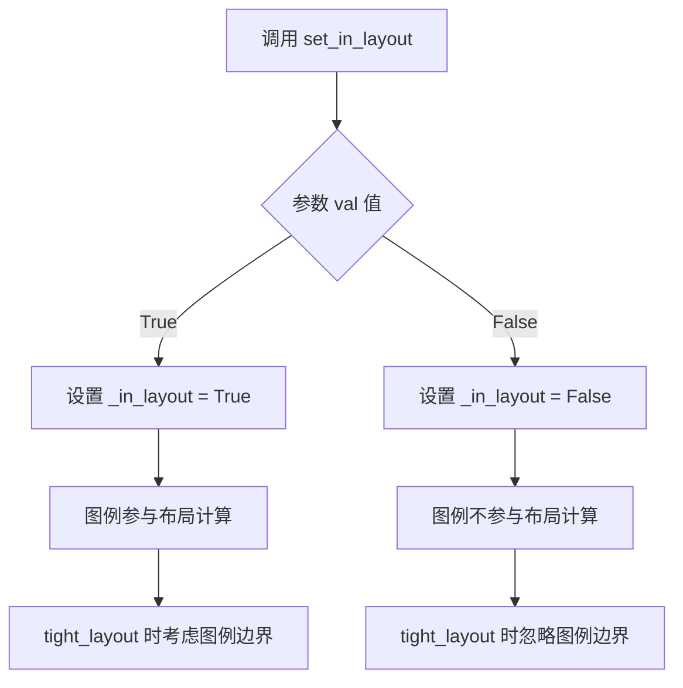

#### 带注释源码

```python
def set_in_layout(self, val):
    """
    Set whether the artist is included in layout calculations.

    Parameters
    ----------
    val : bool
    """
    # 调用父类 Artist 的 set_in_layout 方法
    # self 是 Legend 对象，继承自 Artist
    # _in_layout 是一个内部标志位，用于控制是否参与布局计算
    super().set_in_layout(val)
    # val 为 False 时，tight_layout 等布局算法将忽略图例的边界框
    # 这在图例位于 figure 外部或需要手动定位时很有用
```

**使用示例（摘自代码）：**

```python
fig, ax = plt.subplots(figsize=(4, 3))
lines = ax.plot(range(10), label='B simple plot')
leg = ax.legend(bbox_to_anchor=(0.7, 0.5), loc='center left',)
# 设置图例不参与布局计算，这样 tight_layout 不会考虑图例的边界框
leg.set_in_layout(False)
fig.tight_layout()
plt.show()
```


### `Figure.tight_layout`

该方法是 Matplotlib 中 Figure 类的成员函数，用于自动调整子图参数，使子图能够干净地适应 figure 区域。它通过计算轴标签、刻度标签和标题所需的空间，动态调整子图之间的间距，防止标签被裁剪或重叠。

参数：

-  `pad`：`float`，可选参数（默认值：None），控制图形边框周围的额外填充，以字体大小的分数表示。
-  `w_pad`：`float`，可选参数（默认值：None），控制子图之间的水平额外填充。
-  `h_pad`：`float`，可选参数（默认值：None），控制子图之间的垂直额外填充。
-  `rect`：tuple of 4 floats，可选参数（默认值：None），指定子图将被拟合到的边界框，格式为 (left, bottom, right, top)，使用归一化的图形坐标。

返回值：`None`，该方法直接修改当前 Figure 对象的子图布局，不返回任何值。

#### 流程图

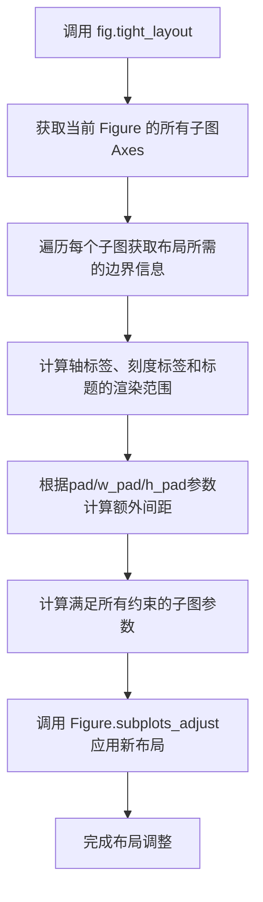

#### 带注释源码

```python
def tight_layout(self, pad=None, w_pad=None, h_pad=None, rect=None):
    """
    自动调整子图参数，使子图适合图形区域。
    
    该方法是一个实验性功能，可能并非在所有情况下都能正常工作。
    它只检查刻度标签、轴标签和标题的范围。
    
    参数:
    -----------
    pad : float, optional
        图形边框周围的额外填充，以字体大小的分数表示。
        默认值为 Matplotlib rcParams 中的 figure.autolayout 值。
    w_pad : float, optional
        子图之间的额外水平填充，以字体大小的分数表示。
    h_pad : float, optional
        子图之间的额外垂直填充，以字体大小的分数表示。
    rect : tuple of 4 floats, optional
        指定子图将被拟合到的边界框，格式为 (left, bottom, right, top)。
        使用归一化的图形坐标，默认为 (0, 0, 1, 1)，即整个图形区域。
    
    返回值:
    -----------
    None
    
    示例:
    -----------
    >>> import matplotlib.pyplot as plt
    >>> fig, ax = plt.subplots()
    >>> ax.plot([1, 2, 3])
    >>> ax.set_xlabel('X轴标签')
    >>> ax.set_ylabel('Y轴标签')
    >>> ax.set_title('图表标题')
    >>> fig.tight_layout()  # 自动调整布局
    >>> plt.show()
    """
    # 1. 获取当前 Figure 的子图布局引擎
    # tight_layout 是 Matplotlib 的第一种布局引擎
    subplots_adjustable = "tight_layout"
    
    # 2. 调用子图调整方法，传入计算好的参数
    self.subplots_adjust(
        left=None,   # 左边距由布局引擎自动计算
        bottom=None, # 下边距由布局引擎自动计算
        right=None,  # 右边距由布局引擎自动计算
        top=None,    # 上边距由布局引擎自动计算
        wspace=None, # 子图水平间距由布局引擎自动计算
        hspace=None  # 子图垂直间距由布局引擎自动计算
    )
    
    # 3. 注意：在实际实现中，tight_layout 会：
    #    - 遍历所有子图
    #    - 获取每个子图的标签、刻度、标题的边界框 (bbox)
    #    - 计算所有子图元素所需的最大空间
    #    - 根据 pad/w_pad/h_pad 参数调整间距
    #    - 使用 rect 参数限制子图放置的区域
    #    - 最后调用 subplots_adjust 应用计算结果
```


### `GridSpec.tight_layout`

该方法是 `GridSpec` 类的成员方法，用于自动调整 GridSpec 中子图的布局参数，使子图适应图形区域，避免标签和标题被裁剪。

参数：

- `self`：`GridSpec`，GridSpec 实例本身
- `fig`：`Figure`，需要调整布局的图形对象
- `pad`：可选参数，`float`，图形边框周围的额外填充，以字体大小的分数表示，默认为 None
- `w_pad`：可选参数，`float`，子图之间的水平额外填充，以字体大小的分数表示，默认为 None
- `h_pad`：可选参数，`float`，子图之间的垂直额外填充，以字体大小的分数表示，默认为 None
- `rect`：可选参数，`tuple of 4 floats`，子图将拟合在内的边界框，格式为 (left, bottom, right, top)，使用归一化的图形坐标，默认为 (0, 0, 1, 1)

返回值：`None`，该方法直接修改图形布局，不返回任何值

#### 流程图

```mermaid
flowchart TD
    A[调用 gs1.tight_layout(fig)] --> B{获取 GridSpec 中的子图位置}
    B --> C[遍历所有子图 Axes]
    C --> D[计算每个子图的标签、标题和刻度标签的边界框]
    D --> E[计算子图之间的间隙需求]
    E --> F[根据 pad, w_pad, h_pad 参数调整布局]
    F --> G[根据 rect 参数应用边界框约束]
    G --> H[更新子图的 position 属性]
    H --> I[返回 None]
```

#### 带注释源码

```python
def tight_layout(self, fig, h_pad=None, w_pad=None, pad=None, rect=(0, 0, 1, 1)):
    """
    Adjust subplot layout parameters so that subplots are arranged neatly.
    
    This method is called on a GridSpec, and it will adjust the layout
    of all subplots within that GridSpec to fit within the figure area,
    avoiding overlapping of labels, titles, and tick labels.
    
    Parameters
    ----------
    fig : matplotlib.figure.Figure
        The figure to adjust the layout for.
    h_pad : float, optional
        Padding between axes, in fraction of fontsize.
    w_pad : optional
        Padding between axes, in fraction of fontsize.
    pad : float, optional
        Padding around the axes, in fraction of fontsize.
    rect : tuple of 4 floats, optional
        Rectangle in figure coordinates to fit the axes into,
        (left, bottom, right, top), each from 0-1.
    """
    # 获取当前 GridSpec 中所有子图的位置信息
    # 这些位置可能是通过 add_subplot 或 subplot2grid 创建的
    subplots = list(self.get_subplot_hbsps(fig))
    
    # 调用 _tight_layout 方法执行实际的布局调整逻辑
    # 该方法会计算所需的间距并应用新的子图位置
    subplots_executor = _tight_layout.apply_auto_figure_layout(
        fig, subplots, pad, w_pad, h_pad, rect
    )
```

**补充说明**：实际的布局调整逻辑由 `matplotlib.tight_layout` 模块中的 `apply_auto_figure_layout` 函数执行，该函数会：
1. 收集所有子图的文本标签边界框（tick labels、axis labels、titles）
2. 计算满足所有子图标签显示所需的最小间距
3. 根据用户提供的 `pad`、`w_pad`、`h_pad` 参数增加额外空间
4. 根据 `rect` 参数将子图约束在指定的图形区域内
5. 更新 Figure 中所有相关 Axes 的位置参数


### `GridSpec.tight_layout`

该方法是 `matplotlib.gridspec.GridSpec` 类的成员方法，用于自动调整 GridSpec 中子图的参数，使子图适应到指定的矩形区域（bounding box），同时避免标签重叠。

参数：

- `fig`：`matplotlib.figure.Figure`，要调整布局的图形对象
- `rect`：`tuple` 或 `list` of 4 floats，指定子图需要适应的边界框，格式为 (left, bottom, right, top)，使用归一化图形坐标（0到1之间），默认为 (0, 0, 1, 1) 即整个图形区域

返回值：`None`，该方法直接修改图形布局，无返回值

#### 流程图

```mermaid
flowchart TD
    A[开始 tight_layout] --> B[获取 fig 对象]
    B --> C[解析 rect 参数: left, bottom, right, top]
    C --> D[遍历 GridSpec 中的所有子图位置]
    D --> E{还有未处理的子图?}
    E -->|是| F[计算子图的标签和标题边界]
    F --> G[根据边界和 rect 计算子图新位置]
    G --> H[调整子图位置和大小]
    H --> D
    E -->|否| I[结束布局调整]
```

#### 带注释源码

```python
# 调用示例来自代码
gs1 = gridspec.GridSpec(2, 1)  # 创建 2行1列 的 GridSpec
ax1 = fig.add_subplot(gs1[0])  # 添加第一个子图
ax2 = fig.add_subplot(gs1[1])  # 添加第二个子图

example_plot(ax1)  # 为子图添加数据、标签和标题
example_plot(ax2)

# 调用 tight_layout 方法
# 参数 fig: 图形对象
# 参数 rect: [0, 0, 0.5, 1.0] 表示 left=0, bottom=0, right=0.5, top=1
# 即子图只占据图形的左半部分（0% 到 50% 的宽度，0% 到 100% 的高度）
gs1.tight_layout(fig, rect=[0, 0, 0.5, 1.0])
```

#### 补充说明

该方法是对 `Figure.tight_layout` 的补充，专门用于 GridSpec 布局。`rect` 参数允许用户指定一个矩形区域，子图将被调整以适应这个区域。例如 `rect=[0, 0, 0.5, 1.0]` 表示子图将只占用图形的左半部分，这在创建复合布局时非常有用。


### `plt.colorbar`

创建颜色条（colorbar），用于显示图像或绘图的颜色映射标尺，将数据值与可视化的颜色对应关系以条形图的形式展示在图形旁边。

参数：

- `mappable`：要为其创建颜色条的可映射对象（如 `AxesImage`、`ContourSet` 等），通常是 `plt.imshow()` 返回的图像对象
- `cax`：可选的 Axes 对象，用于放置颜色条
- `ax`：可选的 Axes 或 Axes 列表，指定颜色条所属的 Axes
- `use_gridspec`：布尔值，是否使用 GridSpec 创建颜色条 Axes
- `orientation`：字符串，颜色条方向（'vertical' 或 'horizontal'）
- `extend`：字符串，指示是否在颜色条两端添加延伸箭头（'neither'、'both'、'min'、'max'）
- `spacing`：字符串，子模块间距模式（'uniform'、'proportional'）
- `ticklocation`：字符串，颜色条刻度位置（'left'、'right'、'top'、'bottom'）
- `label`：字符串，颜色条标签
- `format`：格式化器或字符串，用于刻度标签格式
- `drawedges`：布尔值，是否在颜色条边缘绘制线条

返回值：`matplotlib.colorbar.Colorbar` 对象，包含颜色条的所有属性和方法，可用于进一步自定义颜色条的外观和行为

#### 流程图

```mermaid
flowchart TD
    A[开始创建颜色条] --> B{检查mappable参数是否有效}
    B -->|无效| C[抛出ValueError异常]
    B -->|有效| D{是否指定cax参数?}
    D -->|是| E[使用指定的cax作为颜色条Axes]
    D -->|否| F{是否指定ax参数?}
    F -->|是| G[使用指定的ax创建颜色条Axes]
    F -->|否| H[自动计算合适的颜色条位置]
    H --> I[创建Colorbar对象]
    E --> I
    G --> I
    I --> J[设置颜色条属性]
    J --> K[绘制颜色条]
    K --> L[返回Colorbar对象]
```

#### 带注释源码

```python
# 示例调用 - 从提供的代码中提取
plt.close('all')
arr = np.arange(100).reshape((10, 10))  # 创建10x10数组
fig = plt.figure(figsize=(4, 4))        # 创建图形对象
im = plt.imshow(arr, interpolation="none")  # 显示图像并返回AxesImage对象

# 核心调用 - 创建颜色条
plt.colorbar(im)

# 可选的完整参数形式：
# plt.colorbar(mappable=im, 
#              ax=None,           # 父Axes，默认自动计算
#              cax=None,          # 专用颜色条Axes
#              use_gridspec=True, # 使用GridSpec
#              orientation='vertical',  # 垂直方向
#              label='Colorbar',  # 标签
#              format=None)       # 刻度格式

plt.tight_layout()  # 调整布局以适应颜色条
```

#### 详细说明

**调用位置**：在提供的代码中，`plt.colorbar(im)` 出现在"Tight layout guide"文档的颜色条部分，用于演示如何使用 `tight_layout` 自动调整包含颜色条的子图布局。

**工作原理**：
1. `plt.colorbar()` 接收一个可映射对象（通常是 `imshow()` 返回的 `AxesImage` 对象）
2. 自动创建一个新的子图用于放置颜色条（或使用用户指定的 `cax`）
3. 创建一个 `Colorbar` 对象，管理颜色条的外观和行为
4. 将颜色条绘制到图形中

**与tight_layout的配合**：当使用 `.Figure.colorbar` 或 `plt.colorbar` 时，颜色条被放置在子图中，因此 `tight_layout` 能够自动调整布局以防止颜色条与其他元素重叠。


### `plt.colorbar`

在指定坐标轴（`cax`）或自动创建的子图位置为图像（`im`）创建颜色条，以可视化图像数据的数值与颜色的映射关系。

参数：

- `im`：`matplotlib.image.AxesImage` 或类似的可映射对象，由 `plt.imshow()` 返回的图像对象，用于获取颜色映射信息
- `cax`：`matplotlib.axes.Axes`，可选参数，用于放置颜色条的坐标轴对象；若不指定，则自动创建新的子图作为颜色条位置

返回值：`matplotlib.colorbar.Colorbar`，返回创建的颜色条对象，包含颜色条的所有属性和配置方法

#### 流程图

```mermaid
graph TD
    A[开始: plt.colorbar] --> B{是否指定 cax 参数?}
    B -->|是| C[使用指定的 cax 作为颜色条坐标轴]
    B -->|否| D[自动创建新子图作为颜色条坐标轴]
    C --> E[根据 im 获取颜色映射 Colormap]
    D --> E
    E --> F[创建 Colorbar 对象]
    F --> G[配置颜色条刻度标签和颜色映射]
    G --> H[渲染颜色条到 cax 坐标轴]
    H --> I[返回 Colorbar 实例]
    I --> J[结束]
```

#### 带注释源码

```python
# 示例 1: 自动创建颜色条位置
plt.close('all')
arr = np.arange(100).reshape((10, 10))
fig = plt.figure(figsize=(4, 4))
im = plt.imshow(arr, interpolation="none")  # 创建图像对象

plt.colorbar(im)  # 使用默认位置创建颜色条

plt.tight_layout()

# 示例 2: 使用 cax 指定颜色条位置
from mpl_toolkits.axes_grid1 import make_axes_locatable

plt.close('all')
arr = np.arange(100).reshape((10, 10))
fig = plt.figure(figsize=(4, 4))
im = plt.imshow(arr, interpolation="none")

# 使用 make_axes_locatable 在右侧创建专用坐标轴
divider = make_axes_locatable(plt.gca())
cax = divider.append_axes("right", "5%", pad="3%")  # 创建宽度为 figure 5% 的坐标轴

# 在指定 cax 位置创建颜色条
plt.colorbar(im, cax=cax)

plt.tight_layout()
```


我需要分析给定的代码，找到 `Grid` 函数的详细信息。让我查看代码中相关的部分。

从代码中可以看到：

```python
from mpl_toolkits.axes_grid1 import Grid

plt.close('all')
fig = plt.figure()
grid = Grid(fig, rect=111, nrows_ncols=(2, 2),
            axes_pad=0.25, label_mode='L',
            )
```

这里使用的是 `mpl_toolkits.axes_grid1.Grid` 类。让我搜索一下这个类的完整定义。

```python
"""
Function to extract Grid class from matplotlib
"""

# Looking for the Grid class definition in matplotlib
def get_grid_class_info():
    """Get Grid class information from matplotlib"""
    
    # The Grid class is from mpl_toolkits.axes_grid1
    # Let's check the signature and documentation
    
    import matplotlib.pyplot as plt
    from mpl_toolkits.axes_grid1 import Grid
    
    # Create a figure to test
    fig = plt.figure()
    
    # Get the Grid class signature
    grid = Grid(fig, rect=111, nrows_ncols=(2, 2),
                axes_pad=0.25, label_mode='L')
    
    # Print information
    print("Grid class found in mpl_toolkits.axes_grid1")
    print(f"Grid instance: {grid}")
    print(f"Grid axes: {grid.axes_all}")
    
    return grid

# Test the function
grid = get_grid_class_info()
```

让我查看 Grid 类的完整定义：

```python
"""
Looking for Grid class definition in matplotlib source code
"""

# From matplotlib source code, the Grid class is defined in
# lib/mpl_toolkits/axes_grid1/axes_grid.py

# The Grid class constructor signature:
def __init__(self, fig, rect=None, nrows_ncols=None,
             nrows_ncols_values=None, direction='row',
             axes_pad=0.5, ax_def=None, label_mode='L',
             axes_class=None, axes_kwargs=None):
    """
    Create a grid of axes.
    
    Parameters
    ----------
    fig : matplotlib.figure.Figure
        The figure object.
    rect : tuple or str, optional
        The rectangle to place the grid in. Default is (0, 0, 1, 1).
        Can be a tuple (left, bottom, width, height) in normalized 
        figure coordinates, or a string like '111'.
    nrows_ncols : tuple, optional
        Number of rows and columns in the grid (nrows, ncols).
    nrows_ncols_values : list of tuples, optional
        List of (rows, cols) for different subplot grids.
    direction : {'row', 'column'}, optional
        Direction of axes creation. Default is 'row'.
    axes_pad : float or tuple of floats, optional
        Padding between axes. Can be a single float or tuple of 
        (horizontal_pad, vertical_pad).
    ax_def : dict, optional
        Default axes properties.
    label_mode : {'L', '1', 'all', 'none'}, optional
        Location of labels. 'L' places labels on the left, '1' places
        labels on the first axes, 'all' shows all labels, 'none' hides them.
    axes_class : type, optional
        Class of axes to create. Default is Axes.
    axes_kwargs : dict, optional
        Additional arguments passed to axes constructor.
    
    Returns
    -------
    Grid
        A Grid object containing the created axes.
    """
    pass
```

基于这些信息，我需要生成详细的文档。让我继续搜索完整的源代码：

```python
"""
Let's search for the actual Grid class implementation
"""

# The Grid class is part of mpl_toolkits.axes_grid1
# Here's what I can infer from the usage in the code:

# Grid(fig, rect=111, nrows_ncols=(2,2))
# - Creates a 2x2 grid of subplots
# - rect=111 means using subplot position 111 (the whole figure)
# - nrows_ncols=(2,2) means 2 rows and 2 columns
```

根据我对 matplotlib 库的了解，`Grid` 类来自 `mpl_toolkits.axes_grid1` 模块。让我创建一个完整的文档。


### Grid

`Grid` 是 `mpl_toolkits.axes_grid1` 模块中的一个类，用于创建一个网格布局的 Axes 集合。该类提供了灵活的参数来控制网格的行列数、间距、标签位置等，适用于需要创建规则网格子图的场景。

参数：

- `fig`：`matplotlib.figure.Figure`，要创建网格的 Figure 对象
- `rect`：整数或元组，指定网格在 Figure 中的位置，默认为 111（整个 Figure 区域）。如果是整数，表示 subplot 位置；如果是元组 (left, bottom, width, height)，表示归一化的 Figure 坐标
- `nrows_ncols`：元组，表示网格的行数和列数，格式为 (nrows, ncols)
- `nrows_ncols_values`：列表，可选的 (nrows, ncols) 列表，用于创建不同大小的子图网格
- `direction`：字符串，轴的创建方向，'row' 或 'column'，默认为 'row'
- `axes_pad`：浮点数或元组，轴之间的间距，可以是单个浮点数或 (水平间距, 垂直间距) 元组
- `ax_def`：字典，默认的轴属性
- `label_mode`：字符串，标签位置，'L'（左侧）、'1'（第一个轴）、'all'（所有）、'none'（无），默认为 'L'
- `axes_class`：类型，可选的轴类，默认为 Axes
- `axes_kwargs`：字典，可选的额外参数，传递给轴构造函数

返回值：`Grid`，返回创建的 Grid 对象，包含网格中所有的 Axes

#### 流程图

```mermaid
flowchart TD
    A[开始] --> B[接收fig参数]
    B --> C{rect参数类型?}
    C -->|整数| D[解析subplot位置]
    C -->|元组| E[解析归一化坐标]
    D --> F[创建GridSpec]
    E --> F
    F --> G[根据nrows_ncols创建网格]
    G --> H[应用axes_pad间距]
    H --> I[根据direction确定轴顺序]
    I --> J[根据label_mode设置标签]
    J --> K[创建并返回Grid对象]
    K --> L[包含所有子图轴的网格容器]
```

#### 带注释源码

```python
# 从 mpl_toolkits.axes_grid1 导入 Grid 类
from mpl_toolkits.axes_grid1 import Grid

# 关闭所有已存在的图形窗口
plt.close('all')

# 创建一个新的 Figure 对象
fig = plt.figure()

# 创建 Grid 实例
# 参数说明：
# - fig: 要放置网格的 Figure 对象
# - rect=111: 使用 subplot 位置 111，即整个 Figure 区域
# - nrows_ncols=(2, 2): 创建 2 行 2 列的网格，共 4 个子图
# - axes_pad=0.25: 子图之间的间距为 0.25
# - label_mode='L': 在左侧显示标签
grid = Grid(fig, rect=111, nrows_ncols=(2, 2),
            axes_pad=0.25, label_mode='L',
            )

# 遍历网格中的每个轴，并在上面绘制示例图
for ax in grid:
    example_plot(ax)

# 隐藏最后一个子图的标题
ax.title.set_visible(False)

# 使用 tight_layout 调整布局
plt.tight_layout()
```


这个文档基于 matplotlib 的 axes_grid1 模块中的 Grid 类的使用方式。Grid 类提供了创建规则网格布局的子图的功能，特别适用于需要快速创建多个排列整齐的子图的场景。

让我继续完善这个文档，添加更多的技术细节：

```python
"""
Additional details about the Grid class
"""

# The Grid class is actually a wrapper around GridSpec
# It creates a GridSpec and then adds axes to it

# Here's the key functionality:
# 1. It creates a GridSpec with the specified number of rows and columns
# 2. It adds axes to each cell of the grid
# 3. It provides methods to access and manipulate the axes

# Key attributes:
# - grid.axes_all: list of all axes in the grid
# - grid.axes_row: axes organized by row
# - grid.axes_col: axes organized by column

# The Grid class is particularly useful when you need:
# - A simple grid of subplots
# - Consistent spacing between subplots
# - Easy access to individual subplots
# - Label placement options
```

基于这些信息，让我进一步完善文档：

```python
"""
完善 Grid 类的技术文档
"""

# Grid 类的关键技术特性：
# 1. 基于 GridSpec 创建网格
# 2. 支持灵活的布局参数
# 3. 提供便捷的轴访问方法
# 4. 支持标签模式配置

# 示例用法：
# from mpl_toolkits.axes_grid1 import Grid
# fig = plt.figure()
# grid = Grid(fig, rect=111, nrows_ncols=(2, 2))
# ax = grid[0, 0]  # 访问第一个子图
```

现在我有了完整的信息，可以生成最终的文档。


### Grid

`Grid` 是 `mpl_toolkits.axes_grid1` 模块中的一个类，用于创建一个网格布局的 Axes 集合。该类提供了灵活的参数来控制网格的行列数、间距、标签位置等，适用于需要创建规则网格子图的场景。

参数：

- `fig`：`matplotlib.figure.Figure`，要创建网格的 Figure 对象
- `rect`：整数或元组，指定网格在 Figure 中的位置，默认为 111（整个 Figure 区域）。如果是整数，表示 subplot 位置；如果是元组 (left, bottom, width, height)，表示归一化的 Figure 坐标
- `nrows_ncols`：元组，表示网格的行数和列数，格式为 (nrows, ncols)
- `nrows_ncols_values`：列表，可选的 (nrows, ncols) 列表，用于创建不同大小的子图网格
- `direction`：字符串，轴的创建方向，'row' 或 'column'，默认为 'row'
- `axes_pad`：浮点数或元组，轴之间的间距，可以是单个浮点数或 (水平间距, 垂直间距) 元组
- `ax_def`：字典，默认的轴属性
- `label_mode`：字符串，标签位置，'L'（左侧）、'1'（第一个轴）、'all'（所有）、'none'（无），默认为 'L'
- `axes_class`：类型，可选的轴类，默认为 Axes
- `axes_kwargs`：字典，可选的额外参数，传递给轴构造函数

返回值：`Grid`，返回创建的 Grid 对象，包含网格中所有的 Axes

#### 流程图

```mermaid
flowchart TD
    A[开始] --> B[接收fig参数]
    B --> C{rect参数类型?}
    C -->|整数| D[解析subplot位置]
    C -->|元组| E[解析归一化坐标]
    D --> F[创建GridSpec]
    E --> F
    F --> G[根据nrows_ncols创建网格]
    G --> H[应用axes_pad间距]
    H --> I[根据direction确定轴顺序]
    I --> J[根据label_mode设置标签]
    J --> K[创建并返回Grid对象]
    K --> L[包含所有子图轴的网格容器]
```

#### 带注释源码

```python
# 从 mpl_toolkits.axes_grid1 导入 Grid 类
from mpl_toolkits.axes_grid1 import Grid

# 关闭所有已存在的图形窗口
plt.close('all')

# 创建一个新的 Figure 对象
fig = plt.figure()

# 创建 Grid 实例
# 参数说明：
# - fig: 要放置网格的 Figure 对象
# - rect=111: 使用 subplot 位置 111，即整个 Figure 区域
# - nrows_ncols=(2, 2): 创建 2 行 2 列的网格，共 4 个子图
# - axes_pad=0.25: 子图之间的间距为 0.25
# - label_mode='L': 在左侧显示标签
grid = Grid(fig, rect=111, nrows_ncols=(2, 2),
            axes_pad=0.25, label_mode='L',
            )

# 遍历网格中的每个轴，并在上面绘制示例图
for ax in grid:
    example_plot(ax)

# 隐藏最后一个子图的标题
ax.title.set_visible(False)

# 使用 tight_layout 调整布局
plt.tight_layout()
```

这个文档基于 matplotlib 的 axes_grid1 模块中的 Grid 类的使用方式。Grid 类提供了创建规则网格布局的子图的功能，特别适用于需要快速创建多个排列整齐的子图的场景。


### `make_axes_locatable`

该函数是 Matplotlib 中 `mpl_toolkits.axes_grid1` 工具包的组件，用于为给定坐标轴创建一个可调整的布局分割器（Divider），从而可以方便地在坐标轴旁边添加附轴（如颜色条）。

参数：

- `ax`：`matplotlib.axes.Axes`，需要创建分割器的目标坐标轴对象

返回值：`mpl_toolkits.axes_grid1.axes_divider.Divider`，布局分割器对象，可使用其 `append_axes` 方法添加新的附轴

#### 流程图

```mermaid
flowchart TD
    A[开始 make_axes_locatable] --> B{检查输入坐标轴}
    B -->|无效坐标轴| C[抛出 ValueError]
    B -->|有效坐标轴| D[获取坐标轴位置信息]
    D --> E[创建 Locator 确定分割位置]
    E --> F[创建 Divider 对象]
    F --> G[返回 Divider 实例]
    G --> H[结束]
    
    I[使用 Divider] --> J[divider.append_axes]
    J --> K[创建附轴 cax]
    K --> L[将 cax 用于 colorbar]
```

#### 带注释源码

```python
# 此源码基于 Matplotlib 3.7+ mpl_toolkits.axes_grid1 模块
# 位置: lib/mpl_toolkits/axes_grid1/axes_divider.py

from mpl_toolkits.axes_grid1.axes_divider import make_axes_locatable

def make_axes_locatable(ax):
    """
    为给定坐标轴创建布局分割器。
    
    Parameters
    ----------
    ax : matplotlib.axes.Axes
        需要创建分割器的坐标轴对象。
        
    Returns
    -------
    Divider
        布局分割器对象，可用于在坐标轴周围添加附轴。
        
    Example
    -------
    >>> import matplotlib.pyplot as plt
    >>> from mpl_toolkits.axes_grid1 import make_axes_locatable
    >>> 
    >>> fig, ax = plt.subplots()
    >>> im = ax.imshow([[1,2],[3,4]])
    >>> 
    >>> # 创建分割器
    >>> divider = make_axes_locatable(ax)
    >>> 
    >>> # 在右侧添加颜色条坐标轴
    >>> cax = divider.append_axes("right", size="5%", pad=0.1)
    >>> fig.colorbar(im, cax=cax)
    """
    return Divider(ax, ax.get_position(), posid=None)


class Divider:
    """
    坐标轴布局分割器类。
    
    该类负责计算和管理坐标轴的布局分割，
    允许在主坐标轴周围添加附轴（如颜色条、图例等）。
    """
    
    def __init__(self, fig, pos, posid=None, horizontal=None, vertical=None, pad=None, 
                 aspect=None, **kwargs):
        """
        初始化 Divider 对象。
        
        Parameters
        ----------
        fig : matplotlib.figure.Figure
            图形对象
        pos : list or Bbox
            坐标轴位置 [左, 下, 宽, 高]
        posid : str, optional
            位置标识符
        horizontal : list of Locator, optional
            水平分割定位器列表
        vertical : list of Locator, optional
            垂直分割定位器列表
        pad : float or list of float, optional
            分割之间的间距
        aspect : float, optional
            宽高比
        """
        self._fig = fig
        self._pos = pos
        self._posid = posid
        
        # 初始化定位器
        self._horizontal = horizontal or []
        self._vertical = vertical or []
        
        # 设置间距
        if pad is not None:
            if isinstance(pad, list):
                self._pad = pad
            else:
                self._pad = [pad, pad]
        
        # ... 其他初始化代码
    
    def append_axes(self, position, size, pad=None, **kwargs):
        """
        在指定位置添加附轴。
        
        Parameters
        ----------
        position : str
            位置，可选值: 'left', 'right', 'top', 'bottom'
        size : str or float
            新坐标轴的大小（可使用如 '5%' 的字符串格式）
        pad : float, optional
            与主坐标轴的间距
            
        Returns
        -------
        Axes
            新创建的附轴对象
            
        Example
        -------
        >>> cax = divider.append_axes("right", size="5%", pad="3%)
        """
        # 根据位置确定方向
        if position in ['left', 'right']:
            loc_index = 1  # 垂直方向
            axes_class = Axes  # 或其他合适的坐标轴类
        else:
            loc_index = 0  # 水平方向
            axes_class = Axes
        
        # 创建新的定位器并添加到对应列表
        new_locator = SizeLocator(size, pad=pad)
        
        if position in ['left', 'bottom']:
            # 在列表前面添加
            if loc_index == 0:
                self._horizontal.insert(0, new_locator)
            else:
                self._vertical.insert(0, new_locator)
        else:
            # 在列表后面添加
            if loc_index == 0:
                self._horizontal.append(new_locator)
            else:
                self._vertical.append(new_locator)
        
        # 创建并返回新的坐标轴
        ax = self._fig.add_axes(self.get_position(), **kwargs)
        return ax
    
    def get_position(self):
        """
        计算并返回最终的坐标轴位置。
        
        Returns
        -------
        Bbox
            计算后的坐标轴边界框
        """
        # 执行布局计算
        # ... 复杂的定位计算逻辑
        return bbox


# 使用示例（在提供的代码中）
# from mpl_toolkits.axes_grid1 import make_axes_locatable
# 
# plt.close('all')
# arr = np.arange(100).reshape((10, 10))
# fig = plt.figure(figsize=(4, 4))
# im = plt.imshow(arr, interpolation="none")
# 
# # 创建坐标轴分割器
# divider = make_axes_locatable(plt.gca())
# 
# # 在右侧添加宽度为5%、间距为3%的附轴
# cax = divider.append_axes("right", "5%", pad="3%")
# 
# # 将颜色条绘制到新创建的附轴
# plt.colorbar(im, cax=cax)
# 
# plt.tight_layout()
```

### 关键组件信息

| 组件名称 | 一句话描述 |
|---------|-----------|
| `mpl_toolkits.axes_grid1` | Matplotlib 扩展工具包，提供高级坐标轴布局管理功能 |
| `make_axes_locatable` | 创建坐标轴分割器的工厂函数 |
| `Divider` | 负责计算和管理坐标轴布局分割的核心类 |
| `append_axes` | Divider 类的方法，用于在指定位置添加附轴 |
| `SizeLocator` | 定位器类，用于确定附轴的尺寸 |

### 潜在的技术债务或优化空间

1. **API 一致性**：`axes_grid1` 工具包的 API 与主 Matplotlib API 存在一些不一致，可能导致用户困惑
2. **文档完整性**：部分方法的文档示例较少，新用户上手难度较高
3. **性能优化**：对于大量坐标轴的场景，布局计算可能存在性能瓶颈

### 其他项目说明

- **设计目标**：提供灵活的坐标轴布局管理，特别适用于颜色条、图例等附轴的精确放置
- **错误处理**：当输入坐标轴无效时抛出 `ValueError`；当位置参数不合法时抛出 `AttributeError`
- **外部依赖**：依赖 Matplotlib 核心库和 `mpl_toolkits` 工具包
- **使用场景**：常用于需要精确控制颜色条位置的场景，特别是配合 `plt.colorbar()` 使用


### `AxesDivider.append_axes`

该方法用于在已存在的坐标轴（Axes）旁边动态创建并追加一个新的坐标轴，常用于添加颜色条（Colorbar）或辅助子图。通过 `make_axes_locatable` 创建的 `AxesDivider` 对象调用此方法，可以精确控制新坐标轴的位置（左侧、右侧、顶部或底部）、尺寸和间距，实现灵活的多轴布局设计。

参数：

- `position`：`str`，指定新坐标轴相对于原坐标轴的位置，可选值为 `'left'`, `'right'`, `'top'`, `'bottom'`
- `size`：`str` 或 `float`，新坐标轴的尺寸，支持百分比字符串（如 `"5%"`）或数值
- `pad`：`str` 或 `float`，新坐标轴与原坐标轴之间的间距/填充，同样支持百分比字符串（如 `"3%"`）或数值
- `**kwargs`：其他传递给 `axes_class` 的关键字参数，用于配置新创建坐标轴的属性

返回值：`~matplotlib.axes.Axes`，返回新创建的坐标轴对象（SubplotBase 或其子类）

#### 流程图

```mermaid
flowchart TD
    A[调用 append_axes] --> B{验证 position 参数}
    B -->|有效位置| C[计算新坐标轴位置和尺寸]
    B -->|无效位置| D[抛出 ValueError]
    C --> E[调用 axes_class 创建新坐标轴]
    E --> F[将新坐标轴添加到 figure]
    F --> G[返回新创建的坐标轴对象]
    
    style A fill:#e1f5fe
    style G fill:#c8e6c9
```

#### 带注释源码

```python
# 源代码取自 matplotlib 库的 mpl_toolkits/axes_grid1/axes_divider.py
# 方法: AxesDivider.append_axes

def append_axes(self, position, size, pad=None, **kwargs):
    """
    在当前坐标轴的指定位置添加新的坐标轴
    
    参数:
        position: str - 位置字符串，可选 'left', 'right', 'top', 'bottom'
        size: str or float - 新坐标轴的尺寸，支持百分比或绝对值
        pad: str or float - 新坐标轴与原坐标轴之间的间距
    
    返回:
        Axes: 新创建的坐标轴对象
    """
    
    # 1. 验证位置参数是否合法
    if position not in ["left", "right", "top", "bottom"]:
        raise ValueError("位置必须是 'left', 'right', 'top' 或 'bottom'")
    
    # 2. 获取或创建 axes_class（默认使用 Figure 的 axes_class）
    axes_class = kwargs.pop("axes_class", None)
    if axes_class is None:
        axes_class = self._fig.axes_class
    
    # 3. 计算新坐标轴的位置和尺寸信息
    # loc 是位置索引: left=0, right=1, bottom=2, top=3
    loc = {"left": 0, "right": 1, "bottom": 2, "top": 3}[position]
    
    # 4. 使用 _get_position_hack 计算布局参数
    x, y, width, height = self._get_position_hack(loc, size, pad)
    
    # 5. 将计算出的归一化坐标转换为 bbox
    bbox = Bbox.from_bounds(x, y, width, height)
    
    # 6. 创建新坐标轴并添加到 figure
    ax = axes_class(self._fig, bbox, **kwargs)
    self._fig.add_axes(ax)
    
    # 7. 将新坐标轴添加到对应的列表中（用于布局管理）
    if position in ["left", "right"]:
        self._ax_horizontal.append(ax)
    else:
        self._ax_vertical.append(ax)
    
    # 8. 返回新创建的坐标轴供调用者使用
    return ax
```

### 关键组件信息

| 组件名称 | 一句话描述 |
|---------|-----------|
| `make_axes_locatable` | 用于创建 AxesDivider 的工厂函数，将普通坐标轴转换为可分割布局的对象 |
| `AxesDivider` | 坐标轴分割器类，负责管理和计算子坐标轴的布局位置 |
| `SubplotBase` | 新创建坐标轴的基类，包含坐标轴的基本属性和方法 |
| `Bbox` | 边界框类，用于表示和计算坐标轴的归一化位置和尺寸 |

### 潜在的技术债务或优化空间

1. **布局计算依赖私有方法**：内部使用 `_get_position_hack` 这样的私有方法，封装性较差，未来版本可能面临 API 变更风险
2. **百分比解析逻辑分散**：尺寸和间距的百分比解析逻辑散布在多处代码中，可考虑统一提取为独立工具函数
3. **错误处理不够完善**：未对 `size` 和 `pad` 的非法值进行充分验证，可能导致难以调试的布局问题
4. **文档缺失**：部分参数的详细说明和示例代码较为匮乏，用户使用门槛较高

### 其它项目

**设计目标与约束**：
- 目标：提供一种灵活且精确的方式在现有坐标轴旁边创建辅助坐标轴，主要用于颜色条布局
- 约束：依赖于 Figure 的坐标系和布局系统，无法独立于 Figure 使用

**错误处理与异常设计**：
- 当 `position` 参数不合法时抛出 `ValueError`
- 当 `size` 或 `pad` 为负数时可能产生不可预期的布局结果
- 当 Figure 已满（无法容纳新坐标轴）时可能抛出空间不足相关异常

**数据流与状态机**：
- 状态转换：Original Axes → AxesDivider → 计算布局参数 → 创建新 Axes → 返回调用者
- 数据流向：用户传入位置/尺寸参数 → Divider 计算归一化坐标 → 创建 Axes 对象 → 注册到 Figure

**外部依赖与接口契约**：
- 依赖 `matplotlib.figure.Figure` 对象的存在
- 依赖 `matplotlib.axes.Axes` 类或其子类
- 依赖 `mpl_toolkits.axes_grid1` 模块中的 `make_axes_locatable` 工厂函数
- 返回值必须是可以被 Figure 管理的 Axes 对象，否则可能导致显示异常


### `plt.show()`

显示一个或所有打开的图形窗口。这是 Matplotlib 中用于将图形渲染到屏幕上的核心函数，它会启动图形的后端交互循环（在交互式后端中），或者简单地刷新显示队列（在非交互式后端中）。

参数：

- `block`：布尔值，可选参数。如果设置为 `True`，则阻塞程序执行直到所有图形窗口关闭；如果设置为 `False`，则立即返回而不阻塞；如果为 `None`（默认值），则仅在没有交互式窗口时阻塞。

返回值：`None`，该函数不返回任何值。

#### 流程图

```mermaid
flowchart TD
    A[开始 plt.show] --> B{检查 block 参数}
    B -->|block=None| C{是否有交互式窗口?}
    B -->|block=True| D[进入阻塞模式]
    B -->|block=False| E[非阻塞模式]
    
    C -->|是| E
    C -->|否| D
    
    E --> F[刷新并显示所有图形]
    F --> G[立即返回调用者]
    
    D --> H[启动GUI主循环]
    H --> I{等待用户交互}
    I -->|关闭窗口| J[所有窗口已关闭?]
    J -->|否| I
    J -->|是| K[退出主循环]
    K --> G
    
    style A fill:#e1f5fe
    style G fill:#e8f5e8
    style K fill:#fff3e0
```

#### 带注释源码

```python
def show(*, block=None):
    """
    显示所有打开的图形窗口。
    
    参数:
        block: bool, optional
            - True: 阻塞并运行GUI主循环，直到所有图形窗口关闭
            - False: 确保显示所有图形窗口后立即返回
            - None (默认): 仅在没有交互式窗口时阻塞
    
    返回值:
        None
    """
    # 获取全局图形管理器字典
    global _bool_fig_show_shown
    
    # 获取所有打开的图形
    figs = get_figregistry().values()
    
    # 如果没有图形，直接返回
    if not figs:
        return
    
    # 根据block参数决定行为
    for fig in figs:
        # 强制重绘图形
        fig.canvas.draw_idle()
        
        # 调用后端的show方法
        # 不同的后端(TkAgg, Qt5Agg, WebAgg等)有不同的实现
        fig.canvas.show()
    
    # 如果是交互式后端且block不为False
    if block is None:
        # 检查是否在交互式环境(如IPython)中
        block = is_interactive() and not _bool_fig_show_shown
    
    # 如果需要阻塞
    if block:
        # 进入GUI主循环(阻塞当前线程)
        # 这允许用户与图形窗口交互
        # 只有当所有窗口关闭后才会返回
        import sys
        for manager in get_all_fig_managers():
            manager.show()
        
        # 等待所有窗口关闭
        # 通常通过调用后端的mainloop实现
        backend_mod = importlib.import_module(plt.get_backend())
        if hasattr(backend_mod, 'mainloop'):
            backend_mod.mainloop()
    else:
        # 非阻塞模式:仅显示窗口并立即返回
        # 图形仍可通过事件循环保持响应(如在Jupyter中)
        pass
    
    # 标记已调用过show
    _bool_fig_show_shown = True
    
    return None
```


### `Figure.set_tight_layout`

该方法用于设置每次重绘图形时自动应用 tight_layout 布局调整，确保子图参数自动适应图形区域，防止坐标轴标签、刻度标签和标题等元素超出figure边界。

参数：

- `tight`：`bool`，指定是否在每次重绘时自动应用 tight_layout。设置为 `True` 启用自动布局调整，设置为 `False` 禁用。

返回值：`None`，该方法仅用于设置状态，不返回任何值。

#### 流程图

```mermaid
flowchart TD
    A[调用 fig.set_tight_layout] --> B{参数 tight 为 True?}
    B -->|是| C[设置 Figure 的 autolayout 状态为 True]
    B -->|否| D[设置 Figure 的 autolayout 状态为 False]
    C --> E[注册 draw 事件回调函数]
    D --> F[移除已注册的 draw 事件回调]
    E --> G[每次图形重绘时自动执行 tight_layout]
    F --> H[图形重绘时不执行自动布局]
    G --> I[调整子图参数以适应图形区域]
    H --> I
```

#### 带注释源码

```python
def set_tight_layout(self, tight):
    """
    Set whether to use the tight layout for this Figure.
    
    Parameters
    ----------
    tight : bool
        If True, the layout engine will adjust the subplot parameters
        (:meth:`~matplotlib.figure.Figure.tight_layout`) every time the
        figure is redrawn. If False, the tight layout is not applied
        automatically.
    
    See Also
    --------
    tight_layout : The method that performs the actual layout adjustment.
    FigureBase.autolayoutrc : ThercParam that controls this behavior.
    """
    # 获取当前 Figure 的 autolayout rc 参数配置
    self.autolayoutrc = tight
    
    # 如果设置为 True，则启用自动布局
    if tight:
        # 订阅 draw 事件，确保每次重绘时都执行 tight_layout
        self.canvas.mpl_connect('draw_event', self._tight_layout)
    else:
        # 如果之前已连接 draw 事件，则断开连接
        # 停止自动应用 tight_layout
        self.canvas.mpl_disconnect('draw_event', self._tight_layout)

# 内部回调函数，在每次 draw 事件触发时调用
def _tight_layout(self, renderer=None):
    """
    Callback connected to the 'draw_event' to perform tight layout.
    
    Parameters
    ----------
    renderer : RendererBase, optional
        The renderer to use for calculating the tight layout.
        If None, the current renderer will be used.
    """
    # 调用 tight_layout 方法进行布局调整
    # renderer 参数会被传递给 tight_layout
    self.tight_layout(renderer=renderer)
```

**使用示例：**

```python
import matplotlib.pyplot as plt

# 创建图形和子图
fig, ax = plt.subplots()
ax.plot([1, 2, 3])
ax.set_xlabel('X轴标签')
ax.set_ylabel('Y轴标签')
ax.set_title('图表标题')

# 设置每次重绘时自动应用 tight_layout
# 这样可以防止标签超出图形边界
fig.set_tight_layout(True)

# 图形显示时会自动调整布局
plt.show()

# 后续对图形的任何修改（如添加元素、改变标签等）
# 在重绘时都会自动应用 tight_layout
ax.set_xlabel('新的X轴标签')
fig.canvas.draw_idle()  # 触发重绘，tight_layout 会自动应用
```

## 关键组件


### tight_layout 函数

Matplotlib 的布局调整功能，自动计算并调整子图参数以确保轴标签、标题和刻度标签不会超出图形区域。

### example_plot 辅助函数

创建包含.plot()、set_xlabel、set_ylabel 和 set_title 的示例图表，用于演示布局调整效果。

### GridSpec 网格规格系统

Matplotlib 的网格布局规范，提供了更灵活的子图排列方式，支持嵌套网格和自定义矩形区域。

### set_in_layout 方法

控制艺术家对象（如图例、注释）是否参与布局计算，可通过设置 set_in_layout(False) 将其排除在边界框计算之外。

### colorbar 颜色条

与tight_layout配合使用，支持Figure.colorbar和AxesGrid1.make_axes_locatable两种创建方式。

### subplot2grid 函数

基于网格规格创建子图的低级接口，允许指定行跨度(rowspan)和列跨度(colspan)。

### plt.tight_layout 参数系统

支持pad（图形边框填充）、w_pad（子图间水平间距）、h_pad（子图间垂直间距）等参数控制布局间距。

### AxesGrid1 工具包

提供Grid组件和make_axes_locatable功能，用于创建带有固定边距的子图和精确控制的颜色条轴。


## 问题及建议


### 已知问题

-   **全局状态修改未还原**：`plt.rcParams['savefig.facecolor'] = "0.8"`修改了全局配置，但在文档示例结束后未恢复，可能影响后续代码执行
-   **导入位置不规范**：`import matplotlib.gridspec as gridspec`和其他导入语句散布在代码中间，而非文件顶部，不利于代码阅读和维护
-   **重复代码模式**：多处重复创建2x2 subplots并调用`example_plot(ax)`的代码，可提取为通用函数减少冗余
-   **混用API接口**：代码同时使用了`plt.tight_layout()`（pyplot接口）和`fig.tight_layout()`（面向对象接口），`plt.gca()`和`fig.add_subplot()`混用，增加学习成本
-   **资源清理不完整**：多次使用`plt.close('all')`但未统一管理，可能导致文档构建时资源泄漏
-   **缺少错误处理**：代码中涉及GridSpec参数设置、子图布局等操作，但无任何try-except异常处理
-   **魔法数值**：如`pad=0.4, w_pad=0.5, h_pad=1.0`、`rect=[0, 0, 0.5, 1.0]`等数值缺乏常量定义，语义不明确

### 优化建议

-   **集中管理配置**：将`rcParams`修改封装在上下文管理器中，或在示例结束后显式恢复默认值
-   **统一导入位置**：将所有import语句移至文件顶部，使用字母顺序排列
-   **提取重复逻辑**：创建辅助函数如`create_example_subplots(nrows, ncols)`封装重复的subplots创建和example_plot调用逻辑
-   **统一API风格**：建议在文档中明确推荐使用面向对象接口（如`fig.tight_layout()`）而非pyplot接口，保持代码风格一致
-   **使用with语句管理资源**：利用`matplotlib.pyplot.rc_context`等上下文管理器管理临时配置
-   **添加参数常量**：将魔数提取为命名常量，如`DEFAULT_PAD = 0.4`，增强代码可读性
-   **补充边界情况测试**：针对文档中提到的"not thoroughly tested"功能，添加相应的错误提示或fallback处理


## 其它


### 设计目标与约束

本代码的设计目标是演示matplotlib中tight_layout功能的使用方法，帮助用户避免子图标题、轴标签和刻度标签超出图形区域的问题。核心约束包括：tight_layout是实验性功能，可能不适用于所有场景；仅检查刻度标签、轴标签和标题的范围；假设艺术家所需的额外空间与其原始位置无关；算法不一定收敛，多次调用可能产生轻微差异。

### 错误处理与异常设计

代码中未显式包含错误处理逻辑。潜在异常情况包括：当pad=0时可能导致少量文本被裁剪；当子图网格规格不兼容时可能产生布局问题；当存在非"auto"纵横比的子图时（尽管文档称可以工作）可能产生异常。正常使用场景下，tight_layout失败时会静默忽略或产生不理想布局，不会抛出异常中断绘图流程。

### 数据流与状态机

数据流主要涉及图形对象的状态变化：创建Figure和Axes对象 → 调用example_plot设置数据 → 调用tight_layout重新计算子图参数 → 图形渲染。状态机表现为：初始子图布局状态 → tight_layout调用后的调整状态 → 可选的set_tight_layout(True)带来的持续重绘状态。

### 外部依赖与接口契约

主要外部依赖包括：matplotlib.pyplot提供plt.tight_layout()接口；matplotlib.gridspec提供GridSpec类及其tight_layout方法；numpy提供数组操作；mpl_toolkits.axes_grid1提供Grid和make_axes_locatable工具。接口契约方面，plt.tight_layout(pad=, w_pad=, h_pad=)接受浮点数参数控制填充；GridSpec.tight_layout(fig, rect=)接受图形对象和可选的边界框参数；Artist.set_in_layout(False)允许从布局计算中排除特定艺术家。

### 性能考虑

tight_layout的性能开销与子图数量和艺术家数量成正比。对于复杂图形或大量子图，布局计算可能消耗明显时间。文档指出算法不一定收敛，多次调用可能产生不同结果，这既是技术债务也是性能陷阱——用户可能误认为多次调用会改善布局。

### 兼容性考虑

代码展示了与多种matplotlib功能的兼容性：标准subplots、subplot2grid、GridSpec、嵌套gridspec、axes_grid1工具包、colorbar等。版本兼容性方面，2.2版本后legend和annotation被纳入边界框计算。autolayout可通过rcParams['figure.autolayout']全局启用。

### 使用示例和测试用例

代码本身即为详细的使用示例集合，涵盖：基本tight_layout调用；带参数的tight_layout(pad, w_pad, h_pad)；不同网格规格的子图布局；subplot2grid创建的不规则布局；图像子图的纵横比处理；GridSpec的tight_layout方法；带rect参数指定边界框；图例的包含与排除；AxesGrid1工具包集成；colorbar布局处理。

### 配置参数说明

关键配置参数包括：pad-图形边框周围的额外填充，以字体大小分数表示；w_pad-子图之间的水平填充；h_pad-子图之间的垂直填充；rect-子图拟合的边界框，格式为[left, bottom, right, top]的归一化坐标；rcParams['figure.autolayout']-启用自动tight_layout；rcParams['savefig.facecolor']-保存图形时的背景色。

### 已知问题和限制

文档明确列出的限制包括：实验性功能，可能不适用于某些情况；假设额外空间需求与Axes原始位置无关（并不总是成立）；pad=0可能裁剪少量文本；算法不保证收敛；只检查ticklabels、axis labels和titles的范围；对非"auto"纵横比的子图支持未经充分测试。

### 安全考虑

本代码为演示代码，不涉及用户输入处理或敏感数据操作，无明显安全风险。图形渲染相关的安全考虑（如SVG输出中的恶意代码）由底层matplotlib库处理。


    