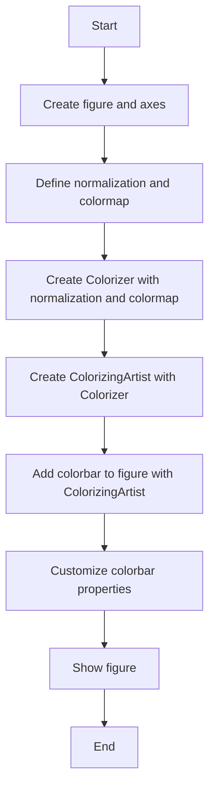
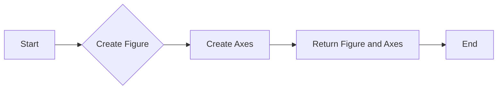
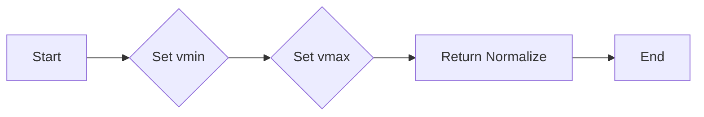
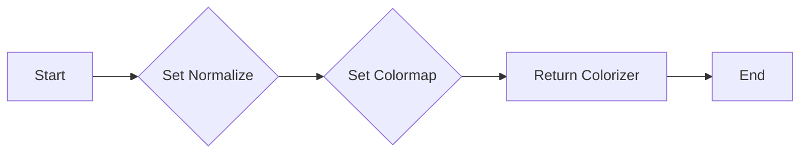
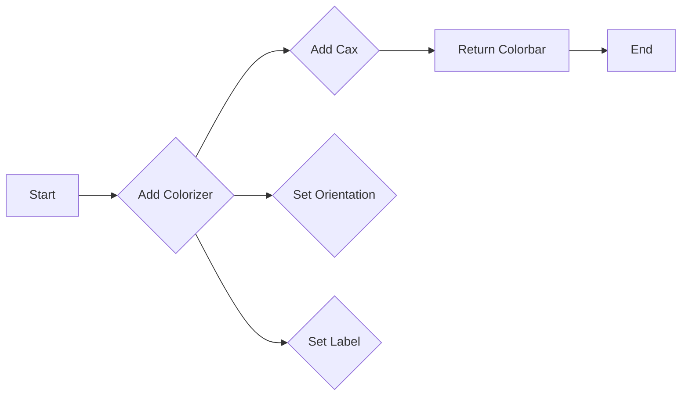
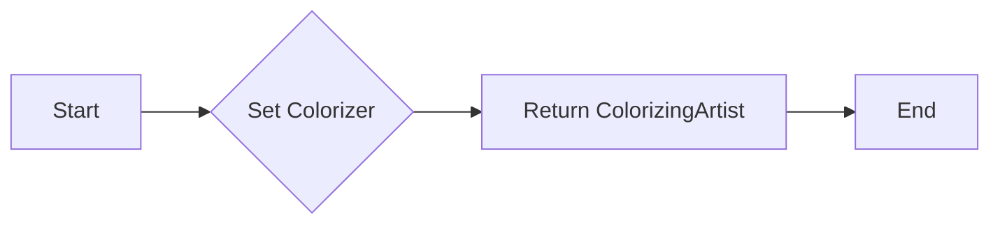
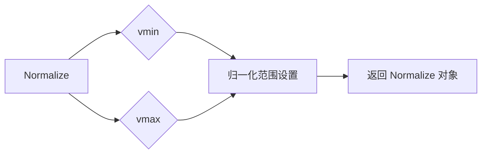
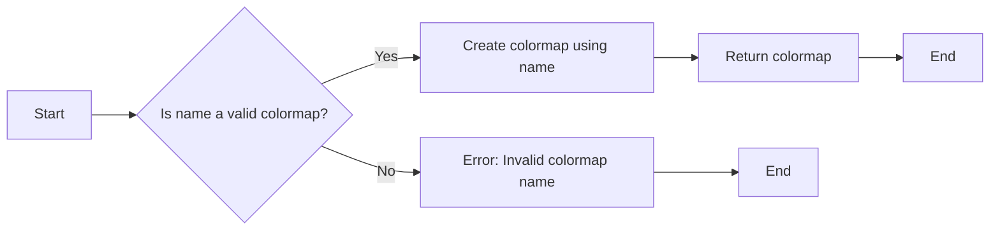
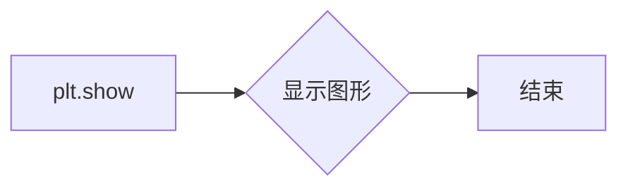
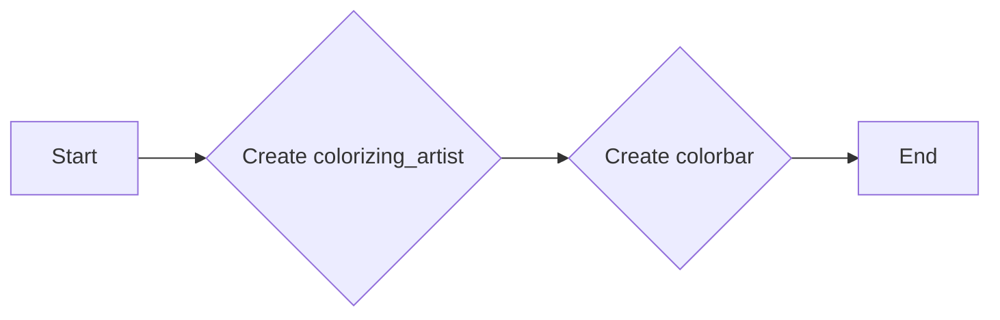

# `matplotlib\galleries\users_explain\colors\colorbar_only.py` 详细设计文档

This code provides a tutorial on how to create and customize standalone colorbars in matplotlib without an attached plot. It demonstrates various colorbar configurations including continuous, discrete, and extended colorbars with different color scales and normalization methods.

## 整体流程



## 类结构

```
Figure (matplotlib.figure.Figure)
├── Axes (matplotlib.axes.Axes)
│   ├── norm (matplotlib.colors.Normalize)
│   ├── cmap (matplotlib.cm.CMap)
│   ├── colorizer (matplotlib.colorizer.Colorizer)
│   └── colorizing_artist (matplotlib.colorizer.ColorizingArtist)
└── Colorbar (matplotlib.colorbar.Colorbar)
```

## 全局变量及字段


### `fig`
    
The main figure object where all plots are drawn.

类型：`matplotlib.figure.Figure`
    


### `ax`
    
The axes object where the colorbar is drawn.

类型：`matplotlib.axes._subplots.AxesSubplot`
    


### `norm`
    
Normalization instance that scales the data to the range [0, 1].

类型：`matplotlib.colors.Normalize`
    


### `cmap`
    
Colormap instance that maps the normalized data to colors.

类型：`matplotlib.cm.CMap`
    


### `colorizer`
    
Colorizer instance that holds the normalization and colormap.

类型：`matplotlib.colorizer.Colorizer`
    


### `colorizing_artist`
    
ColorizingArtist instance that is used to create the colorbar.

类型：`matplotlib.colorizingartist.ColorizingArtist`
    


### `cax`
    
Axes object where the colorbar is drawn if cax is provided instead of ax.

类型：`matplotlib.axes._subplots.AxesSubplot`
    


### `orientation`
    
Orientation of the colorbar ('horizontal' or 'vertical').

类型：`str`
    


### `label`
    
Label for the colorbar.

类型：`str`
    


### `Figure.norm`
    
Normalization instance that scales the data to the range [0, 1].

类型：`matplotlib.colors.Normalize`
    


### `Figure.cmap`
    
Colormap instance that maps the normalized data to colors.

类型：`matplotlib.cm.CMap`
    


### `Figure.colorizer`
    
Colorizer instance that holds the normalization and colormap.

类型：`matplotlib.colorizer.Colorizer`
    


### `Figure.colorizing_artist`
    
ColorizingArtist instance that is used to create the colorbar.

类型：`matplotlib.colorizingartist.ColorizingArtist`
    


### `Axes.norm`
    
Normalization instance that scales the data to the range [0, 1].

类型：`matplotlib.colors.Normalize`
    


### `Axes.cmap`
    
Colormap instance that maps the normalized data to colors.

类型：`matplotlib.cm.CMap`
    


### `Axes.colorizer`
    
Colorizer instance that holds the normalization and colormap.

类型：`matplotlib.colorizer.Colorizer`
    


### `Axes.colorizing_artist`
    
ColorizingArtist instance that is used to create the colorbar.

类型：`matplotlib.colorizingartist.ColorizingArtist`
    


### `Colorizer.norm`
    
Normalization instance that scales the data to the range [0, 1].

类型：`matplotlib.colors.Normalize`
    


### `Colorizer.cmap`
    
Colormap instance that maps the normalized data to colors.

类型：`matplotlib.cm.CMap`
    


### `ColorizingArtist.colorizer`
    
Colorizer instance that holds the normalization and colormap.

类型：`matplotlib.colorizer.Colorizer`
    


### `Colorbar.colorizing_artist`
    
ColorizingArtist instance that is used to create the colorbar.

类型：`matplotlib.colorizingartist.ColorizingArtist`
    


### `Colorbar.orientation`
    
Orientation of the colorbar ('horizontal' or 'vertical').

类型：`str`
    


### `Colorbar.label`
    
Label for the colorbar.

类型：`str`
    
    

## 全局函数及方法


### plt.subplots

`plt.subplots` 是 Matplotlib 库中用于创建图形和轴对象的函数。

参数：

- `figsize`：`tuple`，图形的宽度和高度（单位为英寸）
- `layout`：`str`，图形布局的配置字符串

返回值：`fig`：`Figure` 对象，图形对象；`ax`：`Axes` 对象，轴对象

#### 流程图



#### 带注释源码

```python
fig, ax = plt.subplots(figsize=(6, 1), layout='constrained')
```


### mpl.colors.Normalize

`mpl.colors.Normalize` 是 Matplotlib 库中用于归一化数据值的类。

参数：

- `vmin`：`float`，归一化数据的最小值
- `vmax`：`float`，归一化数据的最大值

返回值：`Normalize` 对象

#### 流程图



#### 带注释源码

```python
norm = mpl.colors.Normalize(vmin=5, vmax=10)
```


### mpl.colorizer.Colorizer

`mpl.colorizer.Colorizer` 是 Matplotlib 库中用于创建颜色映射器的类。

参数：

- `norm`：`Normalize` 对象，归一化数据
- `cmap`：`Colormap` 对象，颜色映射器

返回值：`Colorizer` 对象

#### 流程图



#### 带注释源码

```python
colorizer = mpl.colorizer.Colorizer(norm=norm, cmap="cool")
```


### fig.colorbar

`fig.colorbar` 是 Matplotlib 库中用于添加颜色条到图形的函数。

参数：

- `colorizer`：`Colorizer` 对象，颜色映射器
- `cax`：`Axes` 对象，颜色条所在的轴
- `orientation`：`str`，颜色条的方向
- `label`：`str`，颜色条的标签

返回值：`Colorbar` 对象

#### 流程图



#### 带注释源码

```python
fig.colorbar(mpl.colorizer.ColorizingArtist(colorizer),
             cax=ax, orientation='horizontal', label='Some Units')
```


### mpl.colorizer.ColorizingArtist

`mpl.colorizer.ColorizingArtist` 是 Matplotlib 库中用于创建颜色映射艺术家的类。

参数：

- `colorizer`：`Colorizer` 对象，颜色映射器

返回值：`ColorizingArtist` 对象

#### 流程图



#### 带注释源码

```python
mpl.colorizer.ColorizingArtist(colorizer)
```


### mpl.colors.Normalize

`Normalize` is a class in the `mpl.colors` module of Matplotlib that is used to map data values to a range of values, typically for use with colormaps.

参数：

- `vmin`：`float`，最小值，用于定义归一化范围的下限。
- `vmax`：`float`，最大值，用于定义归一化范围的上限。

返回值：`Normalize`对象，用于将数据值映射到指定的范围。

#### 流程图



#### 带注释源码

```python
import matplotlib as mpl

# 创建 Normalize 对象，设置最小值为 5，最大值为 10
norm = mpl.colors.Normalize(vmin=5, vmax=10)
```


### mpl.cm.get_cmap

mpl.cm.get_cmap is a function used to retrieve a colormap from the Matplotlib library.

参数：

- `name`：`str`，The name of the colormap to retrieve.
- `*args`：`tuple`，Additional arguments to pass to the colormap constructor.
- `**kwargs`：`dict`，Additional keyword arguments to pass to the colormap constructor.

返回值：`Colormap`，The requested colormap.

#### 流程图



#### 带注释源码

```python
def get_cmap(name, *args, **kwargs):
    """
    Retrieve a colormap from the Matplotlib library.

    Parameters
    ----------
    name : str
        The name of the colormap to retrieve.
    *args : tuple
        Additional arguments to pass to the colormap constructor.
    **kwargs : dict
        Additional keyword arguments to pass to the colormap constructor.

    Returns
    -------
    Colormap
        The requested colormap.
    """
    # Check if name is a valid colormap
    if name in plt.colormaps:
        # Create colormap using name
        cmap = plt.get_cmap(name, *args, **kwargs)
        return cmap
    else:
        # Error: Invalid colormap name
        raise ValueError(f"Invalid colormap name: {name}")
```


### mpl.colorizer.Colorizer

mpl.colorizer.Colorizer is a class used to create a colorizer object that holds the data-to-color pipeline (norm and colormap) for a colorbar.

参数：

- `norm`：`matplotlib.colors.Normalize`，用于将数据值映射到颜色映射的范围。
- `cmap`：`str` 或 `matplotlib.colors.Colormap`，指定颜色映射。

返回值：`None`

#### 流程图


#### 带注释源码

```python
import matplotlib as mpl

class Colorizer:
    def __init__(self, norm, cmap):
        """
        Initialize the Colorizer with a norm and colormap.

        Parameters
        ----------
        norm : matplotlib.colors.Normalize
            The normalization object that will be used to map data values to the
            range of the colormap.
        cmap : str or matplotlib.colors.Colormap
            The colormap to be used for the colorizer.
        """
        self.norm = norm
        self.cmap = cmap
```


### mpl.colorizer.ColorizingArtist

`ColorizingArtist` 是一个用于创建自定义颜色条的基础类，它包含一个 `Colorizer` 对象，该对象负责数据到颜色的转换流程（归一化和颜色映射）。

参数：

- `colorizer`：`mpl.colorizer.Colorizer`，一个包含归一化和颜色映射的对象。

返回值：`None`，`ColorizingArtist` 对象不返回值，它是一个用于创建颜色条的基类。

#### 流程图


#### 带注释源码

```python
import matplotlib as mpl

class ColorizingArtist:
    def __init__(self, colorizer):
        # 初始化 ColorizingArtist，传入 Colorizer 对象
        self.colorizer = colorizer
```


### fig.colorbar

`fig.colorbar` is a method of the `Figure` class in the `matplotlib.pyplot` module. It is used to add a colorbar to a figure.

参数：

- `colorizing_artist`：`matplotlib.colorizer.ColorizingArtist`，一个包含颜色映射和归一化函数的艺术家对象。
- `cax`：`matplotlib.axes.Axes`，一个轴对象，用于绘制颜色条。如果未提供，则颜色条将绘制在当前轴上。
- `orientation`：`str`，颜色条的方向，可以是 'horizontal' 或 'vertical'。
- `label`：`str`，颜色条的标签。

返回值：`matplotlib.colorbar.Colorbar`，创建的颜色条对象。

#### 流程图


#### 带注释源码

```python
fig.colorbar(mpl.colorizer.ColorizingArtist(colorizer),
             cax=ax, orientation='horizontal', label='Some Units')
```

在这个例子中，`colorizer` 是一个 `Colorizer` 对象，它包含了归一化函数 `norm` 和颜色映射 `cmap`。`mpl.colorizer.ColorizingArtist` 是一个艺术家对象，它使用 `colorizer` 来绘制颜色映射。`cax` 是一个轴对象，用于绘制颜色条。`orientation` 指定了颜色条的方向，而 `label` 是颜色条的标签。


### plt.show

显示所有当前活动图形的图形。

参数：

- 无

返回值：无

#### 流程图



#### 带注释源码

```python
plt.show()  # 显示所有当前活动图形的图形
```


### Figure.colorbar

This function creates and displays a colorbar on a figure. It is used to map scalar values to colors, which can be useful for visualizing data in plots.

参数：

- `colorizing_artist`：`matplotlib.colorizer.ColorizingArtist`，The colorizing artist that contains the color mapping information.
- `cax`：`matplotlib.axes.Axes`，The axes where the colorbar should be drawn. If not provided, a new axes will be created.
- `orientation`：`str`，The orientation of the colorbar ('horizontal' or 'vertical').
- `label`：`str`，The label for the colorbar.

返回值：`matplotlib.colorbar.Colorbar`，The created colorbar object.

#### 流程图



#### 带注释源码

```python
fig.colorbar(mpl.colorizer.ColorizingArtist(colorizer),
             cax=ax, orientation='horizontal', label='Some Units')
```


## 关键组件


### 张量索引与惰性加载

张量索引与惰性加载是用于高效处理大型数据集的关键组件，它允许在数据未完全加载到内存之前进行索引和访问。

### 反量化支持

反量化支持是用于将量化后的数据转换回原始数据类型的功能，这对于在量化过程中可能发生的精度损失进行修正至关重要。

### 量化策略

量化策略是用于确定如何将浮点数数据转换为固定点数表示的方法，它包括选择量化位宽和量化范围等参数，以优化计算效率和存储空间。

## 问题及建议


### 已知问题

-   **代码重复性**：代码中多次重复创建 `Figure` 和 `Axes` 对象，这可能导致代码冗余和维护困难。
-   **全局变量使用**：代码中使用了全局变量 `mpl`，这可能导致代码的可读性和可维护性降低，并且可能引起命名冲突。
-   **文档注释**：虽然代码中包含了文档注释，但注释的详细程度和清晰度可以进一步提高，以帮助其他开发者更好地理解代码的功能和目的。

### 优化建议

-   **代码重构**：将创建 `Figure` 和 `Axes` 对象的代码封装成函数，减少代码重复，并提高代码的可读性和可维护性。
-   **避免全局变量**：将全局变量 `mpl` 替换为局部变量或参数传递，以提高代码的清晰度和减少命名冲突的风险。
-   **增强文档注释**：为每个函数和方法提供详细的文档注释，包括参数、返回值和功能描述，以帮助其他开发者更好地理解代码。
-   **异常处理**：增加异常处理机制，以处理可能出现的错误情况，例如无效的参数或数据格式错误。
-   **代码测试**：编写单元测试来验证代码的功能，确保代码的稳定性和可靠性。
-   **性能优化**：分析代码的性能瓶颈，并采取相应的优化措施，例如使用更高效的数据结构和算法。


## 其它


### 设计目标与约束

- 设计目标：
  - 提供创建和自定义独立色条的方法，无需附加绘图。
  - 支持连续和离散颜色映射。
  - 允许自定义色条的位置、方向和标签。
  - 支持自定义颜色映射和边界。
- 约束：
  - 必须使用matplotlib库。
  - 色条必须与matplotlib的Axes对象相关联。
  - 色条的颜色映射和边界必须符合matplotlib的规范。

### 错误处理与异常设计

- 错误处理：
  - 捕获并处理matplotlib相关的异常，如`ValueError`和`TypeError`。
  - 提供清晰的错误消息，帮助用户诊断问题。
- 异常设计：
  - 定义自定义异常类，用于处理特定于色条创建的错误。

### 数据流与状态机

- 数据流：
  - 用户定义数据范围和颜色映射。
  - 色条根据数据范围和颜色映射生成。
- 状态机：
  - 色条创建过程包括初始化、配置、绘制和显示状态。

### 外部依赖与接口契约

- 外部依赖：
  - matplotlib库。
- 接口契约：
  - 色条类应提供创建、配置和显示色条的方法。
  - 色条应支持自定义颜色映射和边界。
  - 色条应支持与Axes对象的关联。


    