# `matplotlib\galleries\users_explain\colors\colormap-manipulation.py` 详细设计文档

这是一个Matplotlib颜色映射(Custom Colormap)创建和操作的教程文档，展示了如何使用ListedColormap和LinearSegmentedColormap创建自定义颜色映射、获取内置颜色映射、操作颜色值、反转颜色映射以及注册自定义颜色映射。

## 整体流程

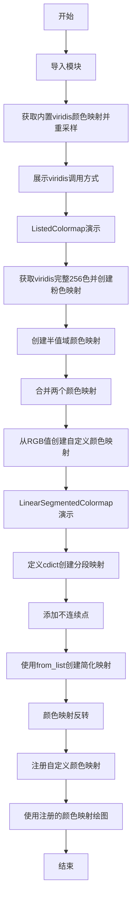

## 类结构

```
Python脚本 (教程/示例代码)
├── plot_examples (全局辅助函数)
└── plot_linearmap (全局辅助函数)
│
├── matplotlib.colors
│   ├── ListedColormap (类)
│   └── LinearSegmentedColormap (类)
│
└── matplotlib
    └── colormaps (注册表)
```

## 全局变量及字段


### `viridis`
    
Resampled viridis colormap with 8 discrete colors used for demonstration.

类型：`matplotlib.colors.Colormap`
    


### `copper`
    
Resampled copper colormap with 8 discrete colors used for demonstration.

类型：`matplotlib.colors.LinearSegmentedColormap`
    


### `cmap`
    
Custom listed colormap created from a list of four color names.

类型：`matplotlib.colors.ListedColormap`
    


### `newcolors`
    
Array of RGBA values extracted from the viridis colormap, later modified to create a custom colormap.

类型：`numpy.ndarray (shape (256, 4))`
    


### `pink`
    
RGBA value for pink color defined as [248/256, 24/256, 148/256, 1].

类型：`numpy.ndarray (shape (4,))`
    


### `newcmp`
    
New listed colormap with the first 25 colors set to pink.

类型：`matplotlib.colors.ListedColormap`
    


### `viridis_big`
    
Full 256‑color viridis colormap obtained without resampling.

类型：`matplotlib.colors.ListedColormap`
    


### `top`
    
Resampled 'Oranges_r' colormap with 128 colors for the top part of a concatenated colormap.

类型：`matplotlib.colors.ListedColormap`
    


### `bottom`
    
Resampled 'Blues' colormap with 128 colors for the bottom part of a concatenated colormap.

类型：`matplotlib.colors.ListedColormap`
    


### `vals`
    
Array of RGBA values defining a linear colormap from brown (RGB 90,40,40) to white.

类型：`numpy.ndarray (shape (N, 4))`
    


### `N`
    
Number of color entries (256) used to define a custom colormap.

类型：`int`
    


### `cdict`
    
Dictionary holding segment data for a LinearSegmentedColormap, containing red, green, and blue arrays.

类型：`dict`
    


### `colors`
    
List of color specifications (names or hex strings) used to create various colormaps.

类型：`list of str`
    


### `cmap1`
    
LinearSegmentedColormap created from a list of colors with equal spacing.

类型：`matplotlib.colors.LinearSegmentedColormap`
    


### `cmap2`
    
LinearSegmentedColormap created from colors with custom node positions.

类型：`matplotlib.colors.LinearSegmentedColormap`
    


### `nodes`
    
List of node positions (0.0, 0.4, 0.8, 1.0) defining non‑uniform spacing in a colormap.

类型：`list of float`
    


### `my_cmap`
    
Custom listed colormap named 'my_cmap' built from five colors.

类型：`matplotlib.colors.ListedColormap`
    


### `my_cmap_r`
    
Reversed version of my_cmap generated by the reversed method.

类型：`matplotlib.colors.ListedColormap`
    


### `data`
    
Sample 2‑D data array used for displaying colormaps in the registration example.

类型：`list of list of int`
    


### `fig`
    
Matplotlib Figure object that hosts the plotted content.

类型：`matplotlib.figure.Figure`
    


### `axs`
    
Array of Axes objects returned by subplots, used to place multiple plots.

类型：`numpy.ndarray of matplotlib.axes.Axes`
    


### `ax`
    
Single Axes instance used within the plot_examples helper to draw a pcolormesh.

类型：`matplotlib.axes.Axes`
    


### `ax1`
    
First subplot Axes for displaying data with the original colormap.

类型：`matplotlib.axes.Axes`
    


### `ax2`
    
Second subplot Axes for displaying data with the reversed colormap.

类型：`matplotlib.axes.Axes`
    


### `psm`
    
QuadMesh object returned by pcolormesh, representing the colored grid.

类型：`matplotlib.collections.QuadMesh`
    


### `col`
    
List of color strings ['r','g','b'] used for plotting RGB curves.

类型：`list of str`
    


### `xx`
    
Anchor positions (0.25, 0.5, 0.75) at which vertical lines are drawn in the linear segment plot.

类型：`float`
    


### `rgba`
    
Array of RGBA values obtained by sampling a LinearSegmentedColormap over the range 0–1.

类型：`numpy.ndarray (shape (256, 4))`
    


### `ListedColormap.colors`
    
Property that returns the list of RGBA colors comprising the colormap.

类型：`numpy.ndarray (shape (N, 4))`
    


### `ListedColormap.N`
    
Number of discrete colors in the colormap.

类型：`int`
    


### `LinearSegmentedColormap.name`
    
Name identifier of the colormap.

类型：`str`
    


### `LinearSegmentedColormap.N`
    
Number of colors (sampling resolution) of the colormap.

类型：`int`
    
    

## 全局函数及方法


### `plot_examples`

该函数是一个辅助绘图函数，接收一个colormap列表，为每个colormap生成随机数据并使用pcolormesh绘制热力图，同时添加对应的颜色条，最终通过plt.show()展示结果。

参数：

- `colormaps`：`list`，一个包含colormap对象的列表，每个colormap将用于绘制一个子图

返回值：`None`，该函数直接在屏幕上显示图形，不返回任何值

#### 流程图

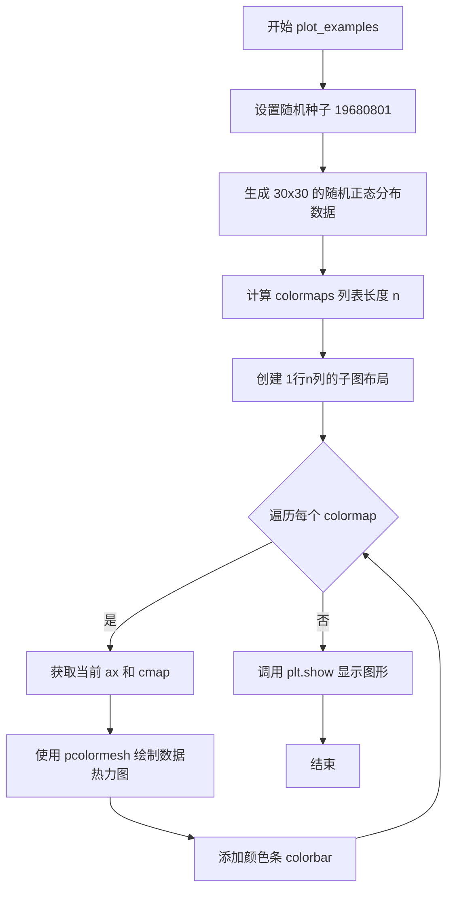

#### 带注释源码

```python
def plot_examples(colormaps):
    """
    Helper function to plot data with associated colormap.
    """
    # 设置随机种子以确保结果可复现
    np.random.seed(19680801)
    # 生成30x30的正态分布随机数据矩阵
    data = np.random.randn(30, 30)
    # 获取传入的colormap数量
    n = len(colormaps)
    # 创建子图：1行n列，宽度根据colormap数量动态调整
    # layout='constrained' 自动调整子图布局以适应元素
    # squeeze=False 确保axs始终是2D数组
    fig, axs = plt.subplots(1, n, figsize=(n * 2 + 2, 3),
                            layout='constrained', squeeze=False)
    # 遍历每个colormap及其对应的子图轴
    for [ax, cmap] in zip(axs.flat, colormaps):
        # 使用pcolormesh绘制热力图
        # cmap: 指定colormap
        # rasterized=True: 将矢量图光栅化以减小文件大小
        # vmin/vmax: 固定颜色映射范围
        psm = ax.pcolormesh(data, cmap=cmap, rasterized=True, vmin=-4, vmax=4)
        # 为每个子图添加颜色条
        fig.colorbar(psm, ax=ax)
    # 显示生成的图形
    plt.show()
```


### `plot_linearmap`

该函数接收一个线性分段颜色映射的段数据字典（cdict），创建 `LinearSegmentedColormap` 对象，然后绘制该颜色映射的 RGB 三个通道的颜色插值曲线，便于直观理解颜色映射中各通道的颜色变化情况。

参数：

- `cdict`：`dict`，定义线性分段颜色映射的段数据字典，包含 'red'、'green'、'blue' 三个键，每个键对应一个 N×3 的二维列表，表示锚点及其左右两侧的颜色值

返回值：`None`，该函数无返回值，仅通过 `plt.show()` 显示图表

#### 流程图

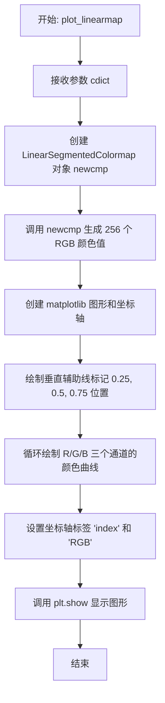

#### 带注释源码

```python
def plot_linearmap(cdict):
    """
    绘制线性分段颜色映射的 RGB 通道插值曲线。
    
    参数:
        cdict: 字典，包含 'red'、'green'、'blue' 键，
               每个键是一个列表，格式为 [[x, yleft, yright], ...]，
               用于定义颜色映射的锚点和插值
    """
    # 使用给定的段数据字典创建线性分段颜色映射对象，N=256 表示生成 256 个离散颜色
    newcmp = LinearSegmentedColormap('testCmap', segmentdata=cdict, N=256)
    
    # 生成 0 到 1 之间的 256 个等间距数值，传入 colormap 获取对应的 RGB 颜色值
    rgba = newcmp(np.linspace(0, 1, 256))
    
    # 创建图形和坐标轴，设置图形大小为 4x3 英寸，使用 constrained 布局
    fig, ax = plt.subplots(figsize=(4, 3), layout='constrained')
    
    # 定义绘制曲线使用的颜色列表
    col = ['r', 'g', 'b']
    
    # 在 x 轴 0.25、0.5、0.75 位置绘制垂直虚线，作为视觉参考
    for xx in [0.25, 0.5, 0.75]:
        ax.axvline(xx, color='0.7', linestyle='--')
    
    # 遍历 RGB 三个通道，分别绘制各通道的颜色插值曲线
    for i in range(3):
        ax.plot(np.arange(256)/256, rgba[:, i], color=col[i])
    
    # 设置 x 轴标签为 'index'，y 轴标签为 'RGB'
    ax.set_xlabel('index')
    ax.set_ylabel('RGB')
    
    # 显示生成的图形
    plt.show()
```


### `plt.subplots`

`plt.subplots` 是 matplotlib 库中的一个函数，用于创建一个新的图形窗口（Figure）以及一个或多个子图（Axes）。它将 Figure 和 Axes 对象的创建合并为一步，是创建子图布局的便捷方式。

参数：

- `nrows`：`int`，行数，默认为 1
- `ncols`：`int`，列数，默认为 1
- `sharex`：`bool` 或 `str`，如果为 True，所有子图共享 x 轴；如果是 'row'，每行子图共享 x 轴；如果是 'col'，每列子图共享 x 轴；默认为 False
- `sharey`：`bool` 或 `str`，如果为 True，所有子图共享 y 轴；如果是 'row'，每行子图共享 y 轴；如果是 'col'，每列子图共享 y 轴；默认为 False
- `squeeze`：`bool`，如果为 True，返回的 axes 数组维度将被优化（如果可能的话减少维度）；默认为 True
- `width_ratios`：`array-like`，子图宽度的比例，长度等于 ncols
- `height_ratios`：`array-like`，子图高度的比例，长度等于 nrows
- `subplot_kw`：`dict`，传递给 add_subplot 的关键字参数，用于配置子图
- `gridspec_kw`：`dict`，传递给 GridSpec 的关键字参数，用于配置网格布局
- `**fig_kw`：传递给 figure 创建的关键字参数，例如 figsize、dpi、facecolor 等

返回值：`tuple`，返回 (Figure, Axes) 或 (Figure, Axes array) 元组。当 squeeze=False 或 nrows>1 且 ncols>1 时，返回 Axes 数组；否则返回单个 Axes 对象（如果 squeeze=True 且 nrows=1 且 ncols=1）。

#### 流程图

```mermaid
flowchart TD
    A[调用 plt.subplots] --> B{传入参数}
    B --> C[创建 Figure 对象]
    C --> D[创建 GridSpec 对象]
    D --> E[根据 nrows 和 ncols 创建子图]
    E --> F{设置 sharex/sharey}
    F --> G[配置子图布局]
    G --> H{设置 squeeze 参数}
    H --> I{返回 Axes 数量}
    I --> J[返回 (Figure, Axes) 或 (Figure, Axes 数组)]
    
    style A fill:#f9f,color:#000
    style J fill:#9f9,color:#000
```

#### 带注释源码

```python
# 示例 1: 创建 1 行 n 列的子图
# n 的值由 colormaps 列表的长度决定
fig, axs = plt.subplots(1, n, figsize=(n * 2 + 2, 3),
                        layout='constrained', squeeze=False)
# 参数说明:
# - 1: nrows, 表示 1 行
# - n: ncols, 表示 n 列（列数由 colormaps 数量决定）
# - figsize=(n * 2 + 2, 3): 图形窗口大小，宽根据列数动态计算，高为 3 英寸
# - layout='constrained': 使用约束布局自动调整子图间距
# - squeeze=False: 确保返回的 axs 始终是 2 维数组，即使 n=1 也是数组

# 示例 2: 创建单个子图
fig, ax = plt.subplots(figsize=(4, 3), layout='constrained')
# 参数说明:
# - figsize=(4, 3): 图形窗口大小，宽 4 英寸，高 3 英寸
# - layout='constrained': 使用约束布局
# 返回: (Figure 对象, Axes 对象)

# 示例 3: 创建 2 行 1 列的子图（共享 x 轴）
fig, (ax1, ax2) = plt.subplots(nrows=2)
# 参数说明:
# - nrows=2: 表示 2 行
# - ncols 默认为 1: 表示 1 列
# - 默认 squeeze=True: 当 nrows>1 且 ncols=1 时，返回 1 维数组
# 返回: (Figure 对象, [Axes1, Axes2] 数组)
# 使用元组解构: fig, (ax1, ax2) = ...

# plt.subplots 的内部调用流程:
# 1. plt.subplots 调用 Figure.subplots() 方法
# 2. Figure.subplots() 创建 GridSpec 对象来定义网格布局
# 3. 使用 GridSpec 创建子图区域
# 4. 配置子图之间的共享关系 (sharex, sharey)
# 5. 返回 Figure 和 Axes 对象
```


### `plt.show`

`plt.show` 是 Matplotlib 库中的顶层函数，用于显示当前所有打开的图形窗口或将图形渲染到交互式后端。该函数会阻塞程序执行直到用户关闭图形窗口（在交互式后端中），或在非交互式后端中将图形写入指定设备。

参数：

- 该函数无位置参数

返回值：`None`，无返回值描述

#### 流程图

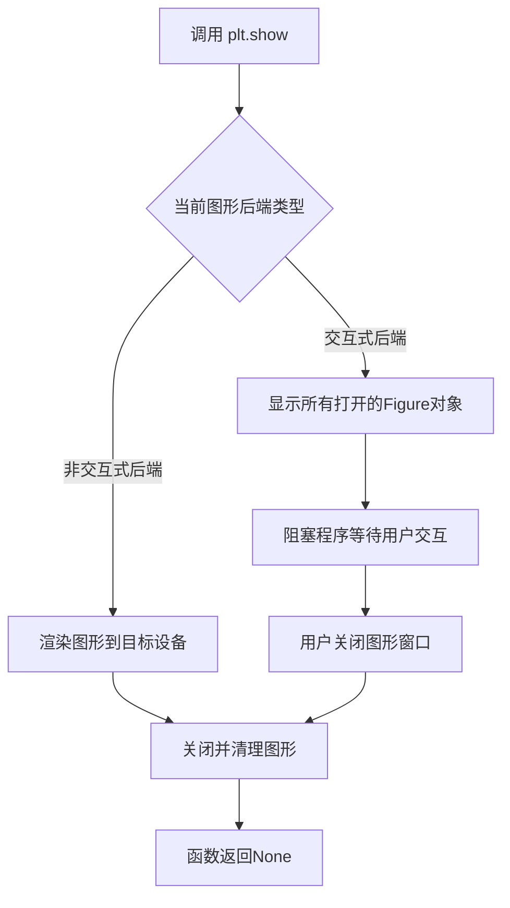

#### 带注释源码

```python
# plt.show() 的调用示例

# 场景1: 在 plot_examples 函数中显示多个子图
def plot_examples(colormaps):
    """
    Helper function to plot data with associated colormap.
    """
    np.random.seed(19680801)
    data = np.random.randn(30, 30)  # 生成30x30的随机数据
    n = len(colormaps)  # 获取colormap数量
    # 创建n个子图, figsize根据colormap数量动态调整
    fig, axs = plt.subplots(1, n, figsize=(n * 2 + 2, 3),
                            layout='constrained', squeeze=False)
    # 遍历每个子图和对应的colormap
    for [ax, cmap] in zip(axs.flat, colormaps):
        # 使用pcolormesh绘制数据网格
        psm = ax.pcolormesh(data, cmap=cmap, rasterized=True, vmin=-4, vmax=4)
        # 添加颜色条
        fig.colorbar(psm, ax=ax)
    # 显示图形 - 核心调用点
    plt.show()


# 场景2: 在 plot_linearmap 函数中显示RGB曲线
def plot_linearmap(cdict):
    # 创建线性分段colormap
    newcmp = LinearSegmentedColormap('testCmap', segmentdata=cdict, N=256)
    # 生成256个采样点的RGBA值
    rgba = newcmp(np.linspace(0, 1, 256))
    # 创建图形和坐标轴
    fig, ax = plt.subplots(figsize=(4, 3), layout='constrained')
    col = ['r', 'g', 'b']  # RGB颜色列表
    # 绘制垂直参考线标记0.25, 0.5, 0.75位置
    for xx in [0.25, 0.5, 0.75]:
        ax.axvline(xx, color='0.7', linestyle='--')
    # 绘制RGB三条曲线
    for i in range(3):
        ax.plot(np.arange(256)/256, rgba[:, i], color=col[i])
    ax.set_xlabel('index')
    ax.set_ylabel('RGB')
    # 显示图形 - 核心调用点
    plt.show()


# 场景3: 直接在脚本末尾显示注册后的colormap对比图
# 注册自定义colormap到matplotlib
mpl.colormaps.register(cmap=my_cmap)
mpl.colormaps.register(cmap=my_cmap_r)

data = [[1, 2, 3, 4, 5]]  # 简单测试数据

# 创建2行子图
fig, (ax1, ax2) = plt.subplots(nrows=2)

# 在两个子图上分别使用normal和reversed colormap显示数据
ax1.imshow(data, cmap='my_cmap')
ax2.imshow(data, cmap='my_cmap_r')

# 显示图形 - 核心调用点
plt.show()
```


### np.random.randn

生成符合标准正态分布（均值0，标准差1）的随机数组。

参数：

- `*d0, d1, ..., dn`：`int`，可选参数，指定输出数组的维度。如果不提供参数，则返回一个单一的浮点数；如果提供一个整数，则返回一维数组；提供多个整数则返回多维数组。

返回值：`numpy.ndarray`，返回指定形状的随机数数组，数组中的值服从标准正态分布（均值0，标准差1）。

#### 流程图

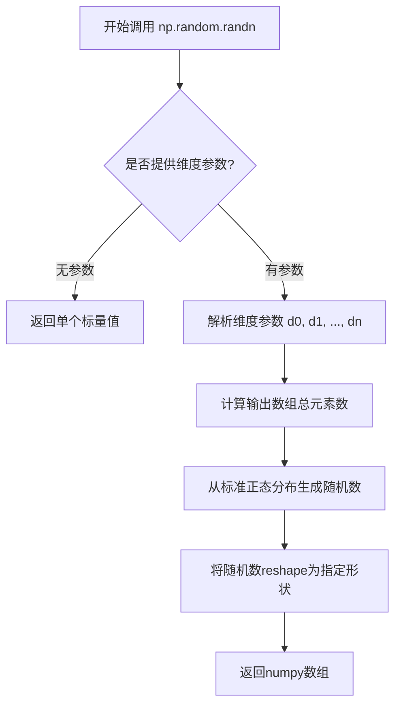

#### 带注释源码

```python
# np.random.randn 是 NumPy 库中的随机数生成函数
# 它位于 numpy.random 模块中
#
# 函数签名: np.random.randn(d0, d1, ..., dn)
#
# 参数说明:
#   - d0, d1, ..., dn: 整数类型，可选
#     * 不传参时: 返回一个float类型的标量值
#     * 传一个参数(d0): 返回一维数组，形状为(d0,)
#     * 传多个参数: 返回多维数组，形状为(d0, d1, ..., dn)
#
# 返回值:
#   - 返回一个numpy.ndarray对象
#   - 数组中的每个元素服从标准正态分布 N(0,1)
#   - 即均值(mean)=0，标准差(standard deviation)=1
#
# 示例用法:
# np.random.randn()           # 返回单个随机数，如 0.123456
# np.random.randn(5)         # 返回形状为(5,)的数组
# np.random.randn(3, 4)      # 返回形状为(3, 4)的二维数组
# np.random.randn(2, 3, 4)   # 返回形状为(2, 3, 4)的三维数组
#
# 在本代码中的实际使用:
np.random.seed(19680801)  # 设置随机种子以确保可重复性
data = np.random.randn(30, 30)  # 生成30x30的随机数据矩阵
```


### np.random.seed

设置 NumPy 随机数生成器的种子，用于生成可重现的随机数序列。当使用相同种子值时，后续生成的随机数序列将完全相同。

参数：

- `seed`：`int` 或 `array_like`，可选，用于初始化随机数生成器的种子值。常用整数值如 19680801 用于生成可重现的随机数据。

返回值：`None`，该函数无返回值，直接修改随机数生成器的内部状态。

#### 流程图

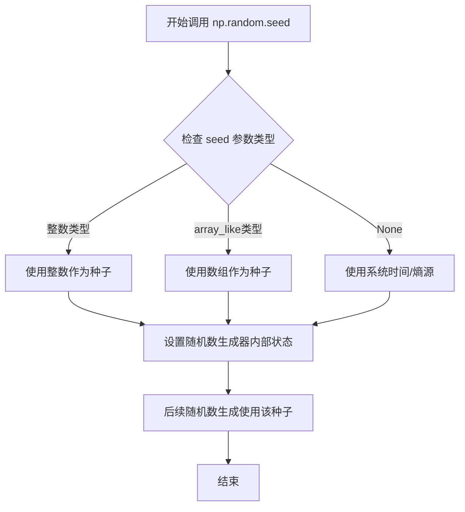

#### 带注释源码

```python
# 调用 np.random.seed 设置随机种子
# 参数 seed=19680801 是一个整数值，用于初始化随机数生成器
# 使用固定种子可以确保每次运行代码时生成相同的随机数序列
# 这对于科学计算中的可重复性实验非常重要
np.random.seed(19680801)

# 示例：在设置种子后生成随机数据
data = np.random.randn(30, 30)
# 由于使用了固定种子，这里生成的随机矩阵在每次程序运行時都相同
```


### `np.linspace`

`np.linspace` 是 NumPy 库中的一个函数，用于在指定的间隔内生成等间距的数值序列。该函数常用于创建测试数据、绘图时的 x 轴坐标等场景。

参数：

- `start`：`float`，序列的起始值
- `stop`：`float`，序列的结束值。当 `endpoint` 为 `True` 时，该值包含在序列中
- `num`：`int`，要生成的样本数量，默认为 `50`
- `endpoint`：`bool`，如果为 `True`，则包含结束值（`stop`）；否则不包含，默认为 `True`
- `retstep`：`bool`，如果为 `True`，则返回 `(step, samples)`；否则只返回 `samples`，默认为 `False`
- `dtype`：`dtype`，输出数组的数据类型。如果未指定，则从输入的 `start` 和 `stop` 值推断
- `axis`：`int`，在版本 1.16.0 中添加，用于多维数组中插入值时的轴

返回值：

- 当 `retstep=False` 时：返回 `ndarray`，包含 `num` 个等间距的样本
- 当 `retstep=True` 时：返回 `tuple`，包含 `(step, samples)`，其中 `step` 是相邻样本之间的步长，`samples` 是样本数组

#### 流程图

```mermaid
flowchart TD
    A[开始] --> B[接收参数 start, stop, num, endpoint, retstep, dtype, axis]
    B --> C{endpoint 是否为 True?}
    C -->|是| D[结束值包含在序列中]
    C -->|否| E[结束值不包含在序列中]
    D --> F[计算步长 step = (stop - start) / (num - 1)]
    E --> G[计算步长 step = (stop - start) / num]
    F --> H{retstep 是否为 True?}
    G --> H
    H -->|是| I[返回 (step, samples) 元组]
    H -->|否| J[返回 samples 数组]
    I --> K[结束]
    J --> K
```

#### 带注释源码

```python
def linspace(start, stop, num=50, endpoint=True, retstep=False, dtype=None, axis=0):
    """
    在指定的间隔内返回等间距的数值序列。
    
    参数:
        start : scalar
            序列的起始值。
        stop : scalar
            序列的结束值。
        num : int, optional
            要生成的样本数量。默认为 50。
        endpoint : bool, optional
            如果为 True，则包含结束值；否则不包含。默认为 True。
        retstep : bool, optional
            如果为 True，则返回 (step, samples)；否则只返回 samples。
        dtype : dtype, optional
            输出数组的数据类型。
        axis : int, optional
            在多维数组中插入值时的轴。
    
    返回值:
        samples : ndarray
            如果 retstep 为 False，返回等间距的样本数组。
        step : float
            如果 retstep 为 True，返回相邻样本之间的步长。
    """
    # 将输入转换为 numpy 数组，以便进行数值计算
    _arange = np.arange
    _float = float
    
    # 确定是否包含结束值，计算步长
    if endpoint:
        # 包含结束值，步长 = (stop - start) / (num - 1)
        step = (stop - start) / (num - 1) if num > 1 else 0.0
    else:
        # 不包含结束值，步长 = (stop - start) / num
        step = (stop - start) / num
    
    # 如果只需要返回样本（默认情况）
    if not retstep:
        # 使用 arange 生成序列
        if dtype is None:
            # 如果未指定数据类型，从 start 推断
            dtype = type(_float(start))
        
        # 生成等间距数组
        y = _arange(num, dtype=dtype)
        
        # 将数组乘以步长并加上起始值
        y *= step
        y += start
        
        return y
    
    # 如果需要同时返回步长和样本
    else:
        # 同样生成样本数组
        if dtype is None:
            dtype = type(_float(start))
        
        y = _arange(num, dtype=dtype)
        y *= step
        y += start
        
        # 返回步长和样本组成的元组
        return step, y
```

#### 备注

在给定的代码中，`np.linspace(0, 1, 8)` 用于生成从 0 到 1 的 8 个等间距值，主要用于测试和演示目的。例如：

```python
viridis(np.linspace(0, 1, 8))
# 输出: array([[0.267004, 0.004874, 0.329415, 1.      ],
#             [0.282327, 0.140926, 0.457517, 1.      ],
#             ...
#             [0.993248, 0.906157, 0.143936, 1.      ]])
```

该函数生成的数组可以直接传递给 colormap 对象，以获取对应的颜色值。


### np.vstack

垂直堆叠多个数组，生成一个新的组合数组。在代码中用于将两个colormap的颜色数组合并为一个连续的颜色数组，以创建从橙色到蓝色的混合colormap。

参数：

- `tup`：`tuple of ndarrays`，要垂直堆叠的数组序列。在代码中是 `(top(np.linspace(0, 1, 128)), bottom(np.linspace(0, 1, 128)))`，分别是顶部colormap和底部colormap的颜色数组。

返回值：`ndarray`，垂直堆叠后的组合数组，形状为 (M+N, ...) ，其中M和N分别是输入数组的第一个维度的长度。

#### 流程图

```mermaid
graph TD
    A[开始] --> B[接收tup参数<br/>包含top和bottom颜色数组]
    B --> C{验证数组维度兼容性}
    C -->|兼容| D[按垂直方向堆叠数组]
    C -->|不兼容| E[抛出ValueError异常]
    D --> F[返回堆叠后的新数组<br/>shape: (256, 4)]
    F --> G[结束]
```

#### 带注释源码

```python
# 在本例中的实际调用：
newcolors = np.vstack((
    # top: Orange_r colormap的128个颜色值，shape (128, 4)
    top(np.linspace(0, 1, 128)),
    # bottom: Blues colormap的128个颜色值，shape (128, 4)
    bottom(np.linspace(0, 1, 128))
))

# np.vstack内部实现逻辑简化：
def vstack(tup):
    """
    垂直堆叠数组
    
    参数:
        tup: 包含多个数组的元组
    返回:
        垂直堆叠后的数组
    """
    # 将输入的数组元组转换为数组
    arrays = np.asarray(tup)
    
    # 检查数组形状是否兼容（除第一个维度外的其他维度必须相同）
    if arrays.ndim < 2:
        # 如果是一维数组，先reshape为二维再堆叠
        arrays = arrays.reshape(-1, 1)
    
    # 使用concatenate沿第一个轴（垂直方向）连接数组
    result = np.concatenate(arrays, axis=0)
    
    return result

# 最终结果: newcolors shape = (256, 4)
# 前128行: 橙色系颜色
# 后128行: 蓝色系颜色
# 用于创建新的ListedColormap
newcmp = ListedColormap(newcolors, name='OrangeBlue')
```


### `np.array`

将列表或类似数组的数据结构转换为NumPy数组，用于表示RGBA颜色值。

参数：

- `object`：列表或类似数组的对象，包含颜色分量 `[248/256, 24/256, 148/256, 1]`
- `dtype`：数据类型，可选，默认为None（自动推断）
- `copy`：是否复制数据，可选，默认为None

返回值：`numpy.ndarray`，返回转换后的NumPy数组，形状为(4,)，包含RGBA颜色分量（红色、绿色、蓝色、透明度）。

#### 流程图

```mermaid
flowchart TD
    A[输入: 列表<br/>[248/256, 24/256, 148/256, 1]] --> B{指定dtype?}
    B -->|否| C[自动推断数据类型]
    B -->|是| D[使用指定dtype]
    C --> E[创建numpy数组]
    D --> E
    E --> F{指定copy?}
    F -->|否| G[默认行为]
    F -->|是| H[强制复制数据]
    G --> I[输出: numpy.ndarray<br/>形状(4,)]
    H --> I
```

#### 带注释源码

```python
# 定义粉色的RGBA颜色值
# R: 248/256 ≈ 0.969 (红色分量)
# G: 24/256 ≈ 0.094 (绿色分量)
# B: 148/256 ≈ 0.578 (蓝色分量)
# A: 1.0 (透明度，完全不透明)
pink = np.array([248/256, 24/256, 148/256, 1])

# 使用示例：将viridis colormap的前25个颜色修改为粉色
viridis = mpl.colormaps['viridis'].resampled(256)
newcolors = viridis(np.linspace(0, 1, 256))  # 获取256个颜色值
newcolors[:25, :] = pink  # 将前25个颜色设置为粉色
newcmp = ListedColormap(newcolors)  # 创建新的colormap
```


### np.arange

NumPy 库中的数组创建函数，用于生成一个包含等差数列的 ndarray，通常用于创建索引或作为绘图 x 轴数据。

参数：

- `stop`：`int` 或 `float`，序列的结束值（不包含）
- `start`：`int` 或 `float`，起始值（可选，默认为 0）
- `step`：`int` 或 `float`，步长（可选，默认为 1）
- `dtype`：`dtype`，输出数组的数据类型（可选）

返回值：`numpy.ndarray`，包含等差数列的数组

#### 流程图

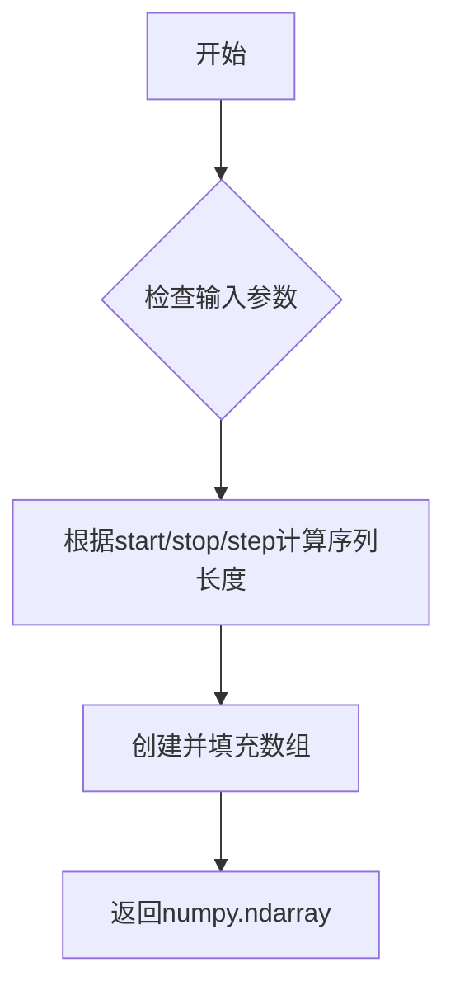

#### 带注释源码

```python
# 代码中的实际调用
np.arange(256)  # 生成从0到255的整数数组，共256个元素

# 用途：在plot_linearmap函数中
# 用于生成x轴坐标，以便绘制RGB曲线
ax.plot(np.arange(256)/256, rgba[:, i], color=col[i])
# np.arange(256) 生成 [0, 1, 2, ..., 255]
# 除以256后归一化到 [0, 0.0039, ..., 1] 范围
```


### `mpl.colormaps.get`

获取已注册的colormap对象，允许通过名称从matplotlib的colormap注册表中检索colormap，并可选择设置alpha值和字节输出格式。

参数：

- `name`：`str`，colormap的名称（如'viridis'、'copper'等）
- `alpha`：可选参数，类型为`float`或`array-like`，设置colormap的透明度
- `bytes`：可选参数，类型为`bool`，默认为False，如果为True则返回8位无符号整数

返回值：`matplotlib.colors.Colormap`，返回对应的colormap对象

#### 流程图

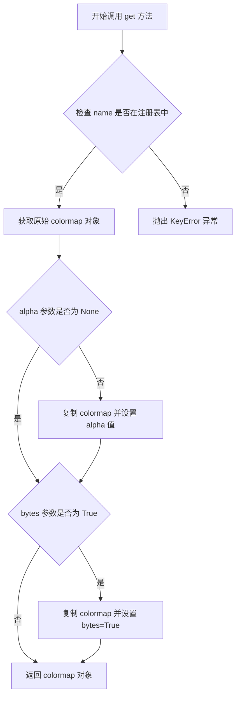

#### 带注释源码

```python
# ColormapRegistry.get 方法源码（位于 lib/matplotlib/cm.py）

def get(self, name, alpha=None, bytes=False):
    """
    Get a colormap from the registry.

    Parameters
    ----------
    name : str
        The name of the colormap.
    alpha : float or array-like, optional
        The alpha value for the colormap.
    bytes : bool, default: False
        If True, return colors as 8-bit unsigned integers.

    Returns
    -------
    Colormap
        The colormap.
    """
    # 通过名称从注册表中获取colormap，内部调用 __getitem__
    cmap = self[name]
    
    # 如果指定了alpha值，复制colormap并设置透明度
    if alpha is not None:
        cmap = cmap.copy()
        cmap.set_alpha(alpha)
    
    # 如果需要字节格式输出，复制colormap并设置bytes标志
    if bytes:
        cmap = cmap.copy()
        cmap.set_bytes(True)
    
    return cmap
```

#### 使用示例（基于代码文档）

```python
# 在提供的代码文档中，等效的使用方式如下：

# 使用下标操作符获取colormap（与get方法等价）
viridis = mpl.colormaps['viridis'].resampled(8)

# 使用get方法获取colormap（带alpha参数）
# my_cmap_with_alpha = mpl.colormaps.get('viridis', alpha=0.5)

# 使用get方法获取colormap（带bytes参数）
# my_cmap_bytes = mpl.colormaps.get('viridis', bytes=True)
```


### mpl.colormaps.register

该函数用于将自定义 colormap 注册到 matplotlib 的全局 colormap 列表中，使其可以通过名称在绘图函数中访问。

参数：

- `cmap`：`matplotlib.colors.Colormap`，要注册的 colormap 对象

返回值：`None`，无返回值（该方法直接修改全局 colormap 注册表）

#### 流程图

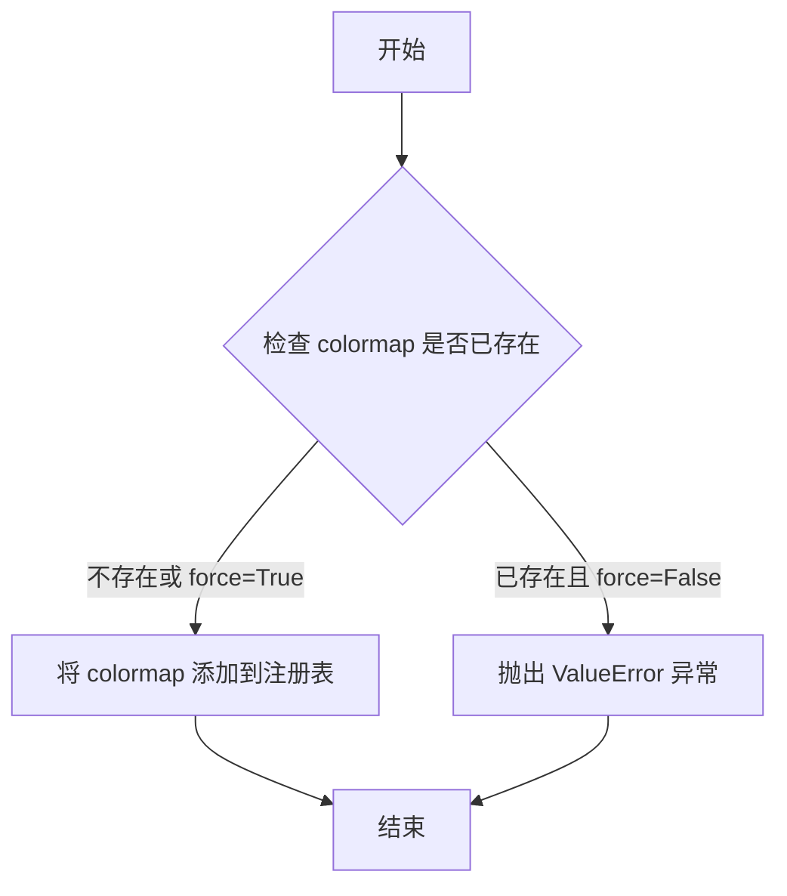

#### 带注释源码

```python
# 注册自定义 colormap 到 matplotlib 全局注册表
# 参数:
#   cmap: Colormap 对象,可以是 ListedColormap 或 LinearSegmentedColormap 的实例
#   name: 可选,colormap 的名称,默认使用 cmap.name
#   force: 可选,是否强制覆盖已存在的同名 colormap,默认 False

mpl.colormaps.register(cmap=my_cmap)  # 注册名为 'my_cmap' 的 colormap
mpl.colormaps.register(cmap=my_cmap_r)  # 注册反转后的 colormap
```


### `Figure.colorbar`

在 Matplotlib 中，`Figure.colorbar` 是 `matplotlib.figure.Figure` 类的一个方法，用于为图形添加颜色条（colorbar），以显示图形中所使用颜色映射的数值对应关系。该方法接收一个 `ScalarMappable` 对象（如由 `pcolormesh` 返回的对象），并可选地指定颜色条所在的 Axes。

参数：

- `mappable`：`matplotlib.cm.ScalarMappable`，由 `pcolormesh`、`imshow` 等绘图函数返回的可映射对象，包含颜色映射的数据
- `ax`：`matplotlib.axes.Axes`，可选参数，指定颜色条所属的 Axes 对象，默认为 None
- `use_gridspec`：`bool`，可选，如果为 True，则使用 gridspec 来布局颜色条，默认为 True

返回值：`matplotlib.colorbar.Colorbar`，返回创建的 Colorbar 对象

#### 流程图

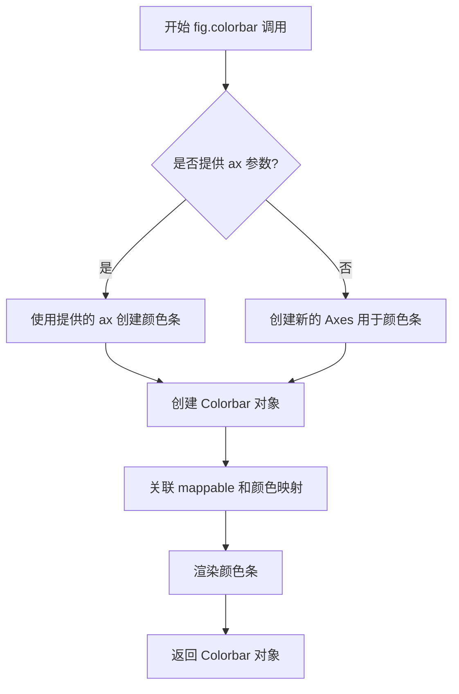

#### 带注释源码

```python
# 代码示例来源于 matplotlib colormap 教程
# 创建图形和子图
fig, axs = plt.subplots(1, n, figsize=(n * 2 + 2, 3),
                        layout='constrained', squeeze=False)

# 遍历每个子图和对应的颜色映射
for [ax, cmap] in zip(axs.flat, colormaps):
    # 使用 pcolormesh 创建伪彩色图，返回 ScalarMappable 对象
    psm = ax.pcolormesh(data, cmap=cmap, rasterized=True, vmin=-4, vmax=4)
    
    # 调用 Figure 对象的 colorbar 方法为图形添加颜色条
    # 参数1: psm - 由 pcolormesh 返回的 ScalarMappable 对象
    # 参数2: ax=ax - 指定颜色条所在的 Axes
    fig.colorbar(psm, ax=ax)

plt.show()

# 上述代码中等价于调用:
# colorbar = fig.colorbar(mappable=psm, ax=ax)
# 返回 matplotlib.colorbar.Colorbar 对象
```

#### 补充说明

在代码上下文中，`fig.colorbar` 被用于在每个子图旁边显示颜色条，以便用户理解伪彩色图中数值与颜色的对应关系。这是数据可视化中的常见需求，特别是在展示连续数值分布时。颜色条提供了图例的功能，帮助读者解读图形中的颜色含义。


### `matplotlib.axes.Axes.pcolormesh`

`pcolormesh` 是 Matplotlib 中 Axes 类的一个方法，用于创建伪彩色非结构化四边形网格图（pseudocolor plot）。它接受一个二维数组数据，并根据颜色映射（colormap）将数据值映射为颜色，同时支持指定数据的显示范围（vmin/vmax）和光栅化渲染等选项。

参数：

- `data` / `C`：`numpy.ndarray`，要绘制的数据，必须是二维数组，形状为 (M, N)，每个元素对应网格单元的颜色值
- `cmap`：`str` 或 `matplotlib.colors.Colormap`，颜色映射名称或 Colormap 对象，用于将数据值映射为颜色（如 'viridis', 'coolwarm' 等）
- `rasterized`：`bool`，是否将输出光栅化为图像格式（True 可以减小文件体积并提高渲染性能）
- `vmin`：`float`，数据下限，用于颜色映射的最小值；低于此值的数据将显示为颜色映射的最低颜色
- `vmax`：`float`，数据上限，用于颜色映射的最大值；高于此值的数据将显示为颜色映射的最高颜色

注意：代码中使用的调用方式省略了显式的 X 和 Y 坐标参数，此时方法会自动使用数组索引作为坐标（i.e., 0 到 M-1 和 0 到 N-1）。

返回值：`matplotlib.collections.QuadMesh`，返回由该方法创建的四边形网格集合对象，可用于后续添加颜色条（colorbar）或进一步定制。

#### 流程图

```mermaid
flowchart TD
    A[输入数据 data (M×N 数组)] --> B[确定坐标网格]
    B --> C{是否指定 vmin/vmax?}
    C -->|是| D[使用指定的 vmin/vmax 进行颜色归一化]
    C -->|否| E[自动计算数据的 min/max 进行颜色归一化]
    D --> F[应用颜色映射 cmap]
    E --> F
    F --> G[根据 shading 模式计算四边形顶点颜色]
    G --> H[创建 QuadMesh 集合对象]
    H --> I{rasterized=True?}
    I -->|是| J[将矢量图转换为光栅图像]
    I -->|否| K[保持矢量渲染]
    J --> L[返回 QuadMesh 对象]
    K --> L
```

#### 带注释源码

```python
# 在 plot_examples 函数中调用 pcolormesh 的实际代码
def plot_examples(colormaps):
    """
    Helper function to plot data with associated colormap.
    """
    np.random.seed(19680801)  # 设置随机种子以确保可复现性
    data = np.random.randn(30, 30)  # 生成 30×30 的随机正态分布数据
    
    n = len(colormaps)  # 获取传入的颜色映射数量
    # 创建子图布局：1 行 n 列，宽度根据 colormap 数量动态调整
    fig, axs = plt.subplots(1, n, figsize=(n * 2 + 2, 3),
                            layout='constrained', squeeze=False)
    
    # 遍历每个子图轴和对应的颜色映射
    for [ax, cmap] in zip(axs.flat, colormaps):
        # 调用 pcolormesh 方法绘制伪彩色网格图
        # 参数说明：
        # - data: 要绑定的数据矩阵 (30×30 numpy array)
        # - cmap: 颜色映射对象 (ListedColormap 或 LinearSegmentedColormap)
        # - rasterized=True: 启用光栅化，将矢量图转换为位图以减小文件体积
        # - vmin=-4: 数据下限，低于 -4 的值映射为颜色映射的最低端颜色
        # - vmax=4: 数据上限，高于 4 的值映射为颜色映射的最高端颜色
        psm = ax.pcolormesh(data, cmap=cmap, rasterized=True, vmin=-4, vmax=4)
        
        # 为当前子图添加颜色条，颜色条使用相同的颜色映射
        fig.colorbar(psm, ax=ax)
    
    plt.show()  # 显示生成的图形
```


### ax.imshow

在给定的代码中，`ax.imshow` 是 Matplotlib 中 Axes 对象的方法，用于将数据数组可视化为图像。该方法接受一个数据数组和可选的颜色映射参数，然后返回一个 AxesImage 对象。

参数：

- `X`：array-like，要显示的数据（2D 数组或 3D 数组用于彩色图像）
- `cmap`：str 或 Colormap，颜色映射，用于将数据值映射到颜色，可选
- 其他常用可选参数：
  - `vmin`：float，数据范围的最小值，用于颜色映射
  - `vmax`：float，数据范围的最大值，用于颜色映射
  - `extent`：floats (left, right, bottom, top)，设置坐标轴范围
  - `origin`：{'upper', 'lower'}，设置图像的放置方向
  - `aspect`：float 或 'auto'，控制轴的纵横比

返回值：`matplotlib.image.AxesImage`，返回的图像对象，可用于添加颜色条等后续操作

#### 流程图

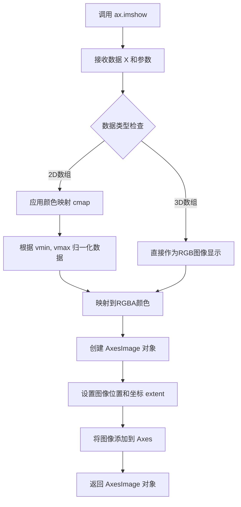

#### 带注释源码

```python
# 在代码中的实际使用示例：
# 创建数据数组
data = [[1, 2, 3, 4, 5]]

# 创建子图
fig, (ax1, ax2) = plt.subplots(nrows=2)

# 使用 imshow 显示数据
# 参数1: data - 要显示的2D数组
# 参数2: cmap='my_cmap' - 使用的颜色映射名称
ax1.imshow(data, cmap='my_cmap')

# 第二个子图使用反转后的颜色映射
ax2.imshow(data, cmap='my_cmap_r')

# 显示图像
plt.show()

# 完整的方法签名（参考matplotlib文档）：
# Axes.imshow(X, cmap=None, norm=None, aspect=None, interpolation=None,
#             alpha=None, vmin=None, vmax=None, origin=None, extent=None,
#             shape=None, filternorm=1, filterrad=4.0, imlim=None,
#             resample=None, url=None, *, data=None, **kwargs)
```


### ax.axvline

在给定坐标轴（Axes）上绘制一条垂直线的方法，属于Matplotlib库中Axes类的成员方法。该方法接受x轴位置、线条在y轴方向的起始和终止比例，以及其他样式参数，并在坐标轴上添加一条垂直参考线。

参数：

- `x`：`float`，默认值为0，垂直线在x轴上的位置坐标
- `ymin`：`float`，默认值为0，相对于axes高度的起始比例（范围0-1），表示线条从y轴的哪个位置开始
- `ymax`：`float`，默认值为1，相对于axes高度的结束比例（范围0-1），表示线条在y轴的哪个位置结束
- `**kwargs`：`关键字参数`，可选，用于设置线条样式属性，如color（颜色）、linestyle（线型）、linewidth（线宽）、alpha（透明度）等

返回值：`matplotlib.lines.Line2D`，返回绘制生成的垂直线对象，可用于后续对该线条进行进一步的操作或修改

#### 流程图

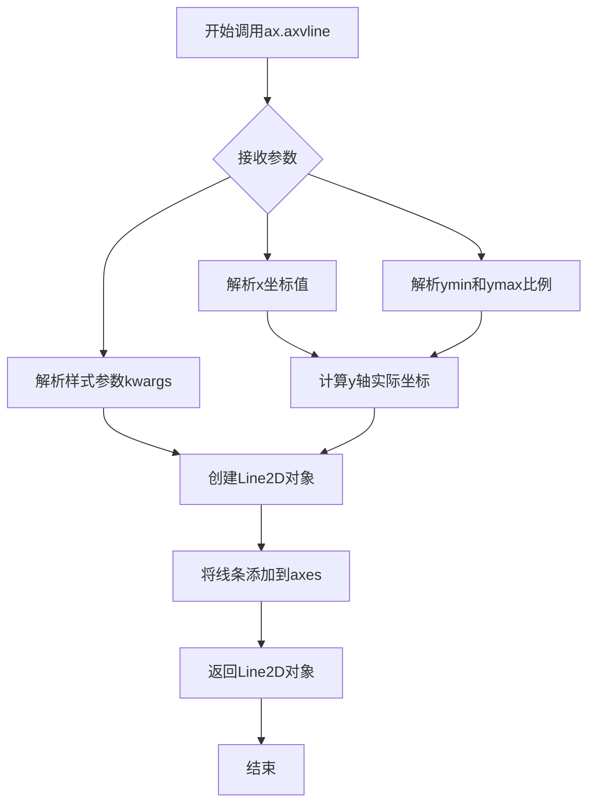

#### 带注释源码

```python
# 代码示例来源：plot_linearmap函数中的实际使用
for xx in [0.25, 0.5, 0.75]:
    # 调用ax.axvline在指定x位置绘制垂直虚线
    # 参数xx：垂直线的x坐标位置（0.25, 0.5, 0.75）
    # color='0.7'：设置线条颜色为灰色（0.7表示灰度值）
    # linestyle='--'：设置线型为虚线
    ax.axvline(xx, color='0.7', linestyle='--')

# ax.axvline方法的标准调用形式：
# line = ax.axvline(x=0.5, ymin=0.0, ymax=1.0, color='red', linewidth=2)
# x=0.5：在x=0.5位置绘制垂直线
# ymin=0.0：线条从axes底部开始
# ymax=1.0：线条延伸到axes顶部
# color='red'：线条颜色为红色
# linewidth=2：线条宽度为2
# 返回值line是Line2D对象，可用于图例legend()等后续操作
```


### `Axes.plot`

在代码中，`ax.plot` 被用于绘制 RGB 颜色曲线，展示线性分段色彩映射中红色、绿色和蓝色通道的值随索引的变化关系。

参数：

- `x`：array-like，X 轴数据，这里是归一化的索引值 `np.arange(256)/256`
- `y`：array-like，Y 轴数据，这里是 RGBA 颜色数组的单个通道 `rgba[:, i]`
- `color`：str，颜色名称或颜色码，这里是 'r'、'g'、'b' 分别表示红、绿、蓝

返回值：`list of ~matplotlib.lines.Line2D`，返回绑制到 Axes 上的线条对象列表

#### 流程图

```mermaid
graph TD
    A[开始绑制RGB曲线] --> B[遍历颜色通道 i = 0, 1, 2]
    B --> C[获取x轴数据: np.arange256/256]
    C --> D[获取y轴数据: rgba通道i的值]
    D --> E[指定颜色: col[i]]
    E --> F[调用ax.plot绑制曲线]
    F --> G[设置x轴标签: index]
    G --> H[设置y轴标签: RGB]
    H --> I[显示图形]
    I --> J[结束]
```

#### 带注释源码

```python
def plot_linearmap(cdict):
    """
    绑制线性分段色彩映射的RGB曲线。
    """
    # 创建线性分段色彩映射对象
    newcmp = LinearSegmentedColormap('testCmap', segmentdata=cdict, N=256)
    # 获取0-1范围内的256个采样点的RGBA颜色值
    rgba = newcmp(np.linspace(0, 1, 256))
    
    # 创建图形和坐标轴
    fig, ax = plt.subplots(figsize=(4, 3), layout='constrained')
    # 定义三种颜色用于绘制RGB曲线
    col = ['r', 'g', 'b']
    
    # 在指定位置绘制垂直虚线作为参考线
    for xx in [0.25, 0.5, 0.75]:
        ax.axvline(xx, color='0.7', linestyle='--')
    
    # 遍历三个颜色通道，绘制RGB曲线
    for i in range(3):
        # ax.plot: 绑制线条的方法
        # 参数1: x轴数据 - 归一化的索引值0-1
        # 参数2: y轴数据 - RGBA数组的第i列（红、绿或蓝通道）
        # 参数3: color - 对应通道的颜色名称
        ax.plot(np.arange(256)/256, rgba[:, i], color=col[i])
    
    # 设置坐标轴标签
    ax.set_xlabel('index')
    ax.set_ylabel('RGB')
    
    # 显示图形
    plt.show()
```


### `Axes.set_xlabel`

设置 x 轴的标签文本，用于描述图表 x 轴的含义。

参数：

- `xlabel`：`str`，x 轴标签的文本内容
- `fontdict`：`dict`，可选，用于控制标签外观的字体字典（如 fontfamily, fontsize, fontweight 等）
- `labelpad`：`float`，可选，标签与坐标轴之间的间距（磅值）
- `loc`：`str`，可选，标签的位置，可选值为 'left', 'center', 'right'（默认取决于 rcParams）
- `**kwargs`：可选，其他关键字参数，将传递给 matplotlib.text.Text 对象的构造函数，用于进一步自定义标签样式

返回值：`matplotlib.text.Text`，返回创建的 x 轴标签对象，可用于进一步自定义或获取标签信息

#### 流程图

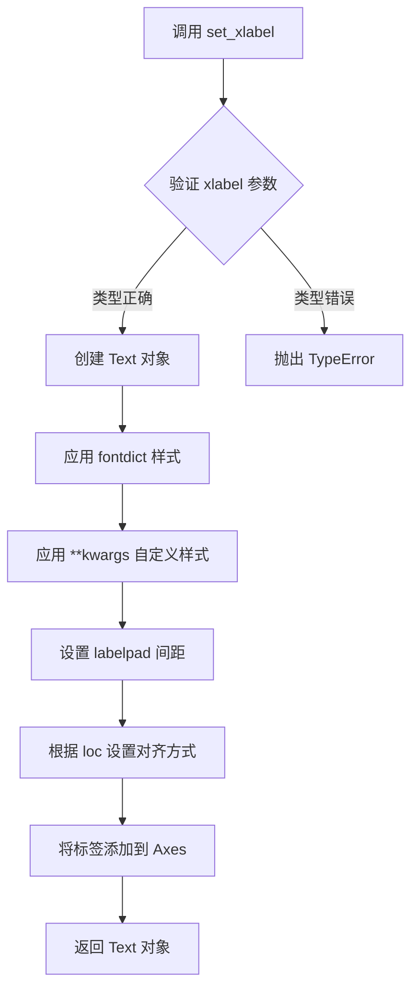

#### 带注释源码

```python
# 代码中的实际调用示例（在 plot_linearmap 函数中）
ax.set_xlabel('index')

# 完整的方法签名参考（来自 Matplotlib 源码）
# def set_xlabel(self, xlabel, fontdict=None, labelpad=None, *, loc=None, **kwargs):
#     """
#     Set the label for the x-axis.
#     
#     Parameters
#     ----------
#     xlabel : str
#         The label text.
#     fontdict : dict, optional
#         A dictionary controlling the appearance of the label text.
#     labelpad : float, default: rcParams["axes.labelpad"]
#         The spacing in points between the label and the previous axes.
#     loc : {'left', 'center', 'right'}, default: rcParams["xaxis.labellocation"]
#         The location of the label.
#     **kwargs
#         Text properties control the appearance of the label.
#     
#     Returns
#     -------
#     label : `.Text`
#         The created `.Text` instance.
#     """
```


### `ax.set_ylabel`

设置 Axes 对象的 y 轴标签，用于指定图表中 y 轴所代表的数据含义。

参数：

- `ylabel`：字符串，要设置的 y 轴标签文本内容
- `fontdict`：字典（可选），用于控制标签外观的字体属性字典，如 fontsize、color、fontweight 等
- `labelpad`：浮点数（可选），标签与 y 轴之间的间距（磅值），默认为 None
- `**kwargs`：关键字参数，其他传递给 `matplotlib.text.Text` 构造函数 的参数，如 rotation、ha、va 等

返回值：`matplotlib.text.Text`，返回创建的标签文本对象，可用于后续自定义修改

#### 流程图

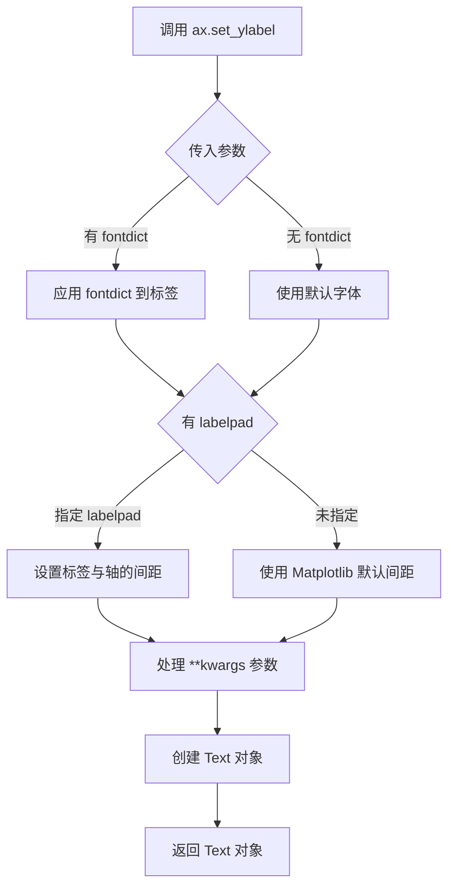

#### 带注释源码

```python
# 在代码中的实际使用：
ax.set_ylabel('RGB')

# 完整方法签名（Matplotlib 内部实现类似）：
# def set_ylabel(self, ylabel, fontdict=None, labelpad=None, **kwargs):
#     """
#     Set the label for the y-axis.
#     
#     Parameters
#     ----------
#     ylabel : str
#         The label text.
#     fontdict : dict, optional
#         A dictionary controlling the appearance of the label text.
#     labelpad : float, default: rcParams["axes.labelpad"]
#         The spacing in points between the label and the y-axis.
#     **kwargs
#         Text properties control the appearance of the label.
#     
#     Returns
#     -------
#     Text
#         The `.Text` instance of the label.
#     """
#     # 获取 y 轴
#     yaxis = self.yaxis
#     # 创建标签文本对象，传入文本和关键字参数
#     label = yaxis.set_label_text(ylabel, **kwargs)
#     
#     # 如果指定了 fontdict，应用字体属性
#     if fontdict is not None:
#         label.update(fontdict)
#     
#     # 如果指定了 labelpad，设置标签与轴的间距
#     if labelpad is not None:
#         yaxis.set_label_coords(0.5, -labelpad)
#     
#     return label
```

#### 在代码上下文中的使用

在提供的 Matplotlib 教程代码中，`ax.set_ylabel('RGB')` 的作用是：
1. 为图表的 y 轴设置标签 "RGB"
2. 表示 y 轴代表 RGB 颜色通道的数值（0-255）
3. 配合 `ax.plot()` 绘制红、绿、蓝三条曲线，分别展示不同颜色通道的值
4. 标签会显示在图表的左侧，与 x 轴标签 "index" 相对应


### ListedColormap.__call__

将数值（范围0-1）映射到颜色映射中的RGBA颜色值。对于离散颜色映射，通过对颜色数组进行索引来实现映射。

参数：

- `value`：float 或 array-like，要映射到颜色的数值，范围通常在0到1之间

返回值：RGBA 颜色值，如果输入是标量则返回形状为(4,)的数组，如果输入是数组则返回形状为(N, 4)的数组

#### 流程图

```mermaid
flowchart TD
    A[开始 __call__] --> B{value 是数组?}
    B -->|是| C[调用 self._call_1_example]
    B -->|否| D[调用 self._call_linspace]
    C --> E[返回 RGBA 数组]
    D --> F{value 在范围内?}
    F -->|是| G[计算索引并索引颜色]
    F -->|否| H[返回无效值或边界颜色]
    G --> I[返回 RGBA 颜色]
    H --> I
```

#### 带注释源码

```
# ListedColormap 继承自 Colormap 基类
# __call__ 方法是 Colormap 基类中定义的核心方法
# 以下是简化的核心逻辑

def __call__(self, value, alpha=None):
    """
    将值映射到颜色。
    
    参数:
        value: float 或 array-like
            需要映射的值，范围在 0 到 1 之间
        
        alpha: float, optional
            额外的透明度覆盖值
    
    返回:
        RGBA: ndarray
            映射后的颜色值，形状为 (..., 4)
    """
    # 使用父类 Colormap 的实现
    # 内部会调用 _call_1_impl 或类似方法
    
    # 1. 值域清洗：将输入值限制在有效范围内
    # 对于 ListedColormap，值域为 [0, 1)
    
    # 2. 索引计算：将归一化后的值转换为颜色数组的索引
    # 索引 = floor(value * N)，其中 N 是颜色数量
    
    # 3. 颜色索引：从 self.colors 数组中获取对应的颜色
    
    # 4. RGBA 组装：返回 RGBA 格式的颜色值
    
    # 实际上调用的是 _rgba_bad 处理无效值
    # 然后调用 _call_1_impl 处理有效值
    
    return self._rgba_bad if any bad values else self._call_1_impl(value, alpha)
```

实际上，`ListedColormap.__call__`方法继承自`Colormap`基类，其核心实现在基类中。主要流程包括：

1. **值归一化处理**：将输入值规范到[0, 1)范围
2. **索引计算**：计算颜色数组的索引位置
3. **颜色映射**：从预定义的颜色列表中获取对应颜色
4. **RGBA输出**：返回RGBA格式的颜色值

对于`ListedColormap`，由于是离散颜色映射，索引计算方式为：`idx = int(value * N)`，其中N是颜色总数。

#### 关键组件信息

| 组件名称 | 一句话描述 |
|---------|-----------|
| ListedColormap | 存储离散颜色列表的颜色映射类 |
| Colormap | 颜色映射基类，提供通用的颜色映射逻辑 |
| colors 属性 | 存储颜色映射中颜色列表的属性 |
| _rgba_bad | 处理无效值（NaN/Inf）时返回的默认颜色 |

#### 潜在技术债务/优化空间

1. **重复计算优化**：每次调用都会进行值域检查和索引计算，可以考虑缓存机制
2. **边界处理**：对于边界值（value=1）的处理逻辑可以更清晰
3. **向量化效率**：对于大规模数组处理，可以进一步优化内存使用
4. **类型提示**：缺少详细的类型注解，影响代码可维护性


### ListedColormap.reversed

该方法创建一个新的反转后的颜色映射（colormap），将原始颜色映射的顺序颠倒。

参数：

- 无参数

返回值：`ListedColormap` 或 `Colormap`，返回反转后的颜色映射对象

#### 流程图

```mermaid
graph TD
    A[调用 my_cmap.reversed] --> B{检查是否传入name参数}
    B -->|未传入name| C[自动命名: 原始名称 + '_r']
    B -->|传入name| D[使用传入的名称]
    C --> E[创建新的ListedColormap实例]
    D --> E
    E --> F[返回反转后的颜色映射]
```

#### 带注释源码

```python
# 使用示例（来自代码第237-240行）
colors = ["#ffffcc", "#a1dab4", "#41b6c4", "#2c7fb8", "#253494"]
my_cmap = ListedColormap(colors, name="my_cmap")

# 调用reversed方法创建反转后的颜色映射
my_cmap_r = my_cmap.reversed()

# 如果没有传入名称，reversed会自动在原名称后添加'_r'后缀
# 例如: 'my_cmap' -> 'my_cmap_r'
```

> **注意**：该代码段是 Matplotlib 官方教程文档，展示了 `ListedColormap.reversed()` 的使用方法。实际的 `reversed()` 方法实现位于 Matplotlib 库的核心代码中（`matplotlib/colors.py`），未在此教程代码中展示。该方法的核心逻辑是：将颜色列表反转，创建并返回一个新的 `ListedColormap` 对象。


### LinearSegmentedColormap.__call__

这是一个将值（0到1之间的浮点数或数组）映射到RGBA颜色值的核心方法。当调用colormap对象时（如 `cmap(0.5)`），实际执行的就是这个 `__call__` 方法。它根据输入值在colormap定义的段数据中进行插值，返回对应的颜色值。

参数：

-  `value`：`float` 或 `ndarray`，要映射的值，范围通常在0到1之间
-  `bytes`：可选参数 `bool`，指定返回值的格式，如果为True则返回字节类型的RGBA值
-  `norm`：可选参数 `bool`，是否将值归一化到0-1范围
-  `alpha`：可选参数 `float` 或 `ndarray`，透明度覆盖值

返回值：`ndarray`，形状为 (..., 4) 的RGBA颜色数组

#### 流程图

```mermaid
flowchart TD
    A[开始 __call__] --> B{输入类型判断}
    B -->|单个浮点数| C[归一化处理]
    B -->|数组| D[批量归一化处理]
    C --> E{是否启用插值}
    D --> E
    E -->|是| F[查找对应区间段]
    E -->|否| G[最近邻查找]
    F --> H[线性插值计算RGBA]
    G --> I[直接映射到颜色]
    H --> J[返回RGBA数组]
    I --> J
    J --> K{bytes参数}
    K -->|True| L[转换为字节类型 0-255]
    K -->|False| M[返回浮点类型 0-1]
    L --> N[结束]
    M --> N
```

#### 带注释源码

```python
# 注意：以下源码基于matplotlib公开资料重构，
# 实际的LinearSegmentedColormap.__call__实现位于matplotlib.colors模块中

def __call__(self, value, bytes=False, norm=True):
    """
    将值映射到RGBA颜色
    
    参数:
        value: float或array-like，值域范围[0, 1]或[-inf, inf]（如果norm=True）
        bytes: bool，如果为True返回[0, 255]范围的uint8，否则返回[0, 1]的float
        norm: bool，是否对输入值进行归一化处理
    
    返回:
        RGBA颜色数组，形状为(..., 4)
    """
    # 如果norm为True，使用Colormap的__call__父类方法
    # 该方法会调用self._scale_and_get_colors进行实际转换
    if norm:
        # 调用父类Colormap的__call__方法
        # 会经过autoscale_None处理和_scale_and_get_colors
        return super().__call__(value, bytes=bytes)
    
    # 如果norm为False，直接处理未归一化的值
    # 这是一个优化路径，避免重复归一化
    colors = self._scale_and_get_colors(value)
    
    if bytes:
        # 将浮点颜色值[0,1]转换为字节[0,255]
        return (colors * 255).astype(np.uint8)
    
    return colors

def _scale_and_get_colors(self, value):
    """内部方法：根据值获取对应的RGBA颜色"""
    # 确保值在有效范围内
    value = np.asarray(value)
    
    # 查找每个值对应的段索引
    # self.monochrome用于检测是否需要特殊处理单色映射
    if self.monochrome:
        # 单色映射处理（值为标量时）
        # 直接使用_lut表进行查找
        pass
    
    # 核心：调用LinearSegmentedColormap的内部插值方法
    # 使用预计算的查找表(_lut)进行高效颜色映射
    rgba = self._interp_single(value, self._lut)
    
    return rgba

def _interp_single(self, x, lut):
    """
    对单个值或数组进行插值
    
    参数:
        x: 输入值
        lut: 查找表，包含预先计算的颜色段数据
    """
    # 使用np.searchsorted高效查找区间
    # x是归一化后的值[0,1]
    indices = np.searchsorted(self._segmentdata['x'], x)
    
    # 处理边界情况
    # 当x=0时，indices=0，需要特殊处理
    # 当x=1时，indices=len(segment)，需要特殊处理
    
    # 线性插值
    # 在相邻段之间进行颜色插值
    pass
```

**注意**：由于用户提供的代码是关于colormap使用的教程文档（而非`LinearSegmentedColormap`类的实际源码实现），上述源码是基于matplotlib公开资料对该方法功能的重构和注释。实际的完整实现在matplotlib库的`colors.py`模块中，包含更多边界情况处理和优化逻辑。


### `LinearSegmentedColormap.from_list`

从颜色列表创建线性分段色彩映射表的类方法，允许指定可选的节点位置来控制颜色在色彩映射表中的分布。

参数：

- `name`：`str`，色彩映射表的名称
- `colors`：`list`，颜色列表，可以是颜色名称字符串列表或 (节点值, 颜色) 元组列表
- `N`：`int`，可选，色彩映射表要创建的离散颜色数量，默认为 256
- `gamma`：`float`，可选，伽马校正值，默认为 1.0

返回值：`LinearSegmentedColormap`，新创建的线性分段色彩映射表对象

#### 流程图

```mermaid
flowchart TD
    A[开始 from_list] --> B{colors是否为元组列表?}
    B -->|是| C[提取节点值和颜色]
    B -->|否| D[使用默认节点值等间距分布]
    C --> E[验证节点值在0-1范围内]
    D --> E
    E --> F[创建_segmentdata字典]
    F --> G[对每个颜色通道R/G/B/A进行插值]
    H --> I[创建LinearSegmentedColormap实例]
    G --> I
    I --> J[返回色彩映射表对象]
```

#### 带注释源码

```python
# 示例用法（来自代码文本）
colors = ["darkorange", "gold", "lawngreen", "lightseagreen"]
cmap1 = LinearSegmentedColormap.from_list("mycmap", colors)

# 带节点的自定义用法
nodes = [0.0, 0.4, 0.8, 1.0]
cmap2 = LinearSegmentedColormap.from_list("mycmap", list(zip(nodes, colors)))

# 注意：实际实现不在本代码文件中
# 以下为matplotlib标准实现的逻辑说明：
# 1. 如果colors是简单颜色列表，则等间距分配节点[0, 1/(n-1), ..., 1]
# 2. 如果colors是(node, color)元组列表，则按指定的node值分配
# 3. 对每个颜色通道(R/G/B/A)构建分段线性插值数据
# 4. 创建LinearSegmentedColormap对象并返回
```

**注意**：提供的代码是教程文档，展示了该函数的使用方法，但未包含 `LinearSegmentedColormap.from_list` 的实际实现代码。该函数的完整实现位于 matplotlib 库的 `matplotlib.colors` 模块中。


### LinearSegmentedColormap.reversed

该方法创建并返回一个与原始 colormap 颜色顺序相反的新 `LinearSegmentedColormap` 对象，常用于需要反转颜色映射的场景（如温度图、深度图等）。

参数：

- `name`：`str`（可选），指定反向颜色映射的名称。如果未提供，则在原始名称后追加 `_r` 后缀。

返回值：`LinearSegmentedColormap`，返回一个新的反向颜色映射对象。

#### 流程图

```mermaid
graph TD
    A[调用 reversed 方法] --> B{是否提供 name 参数?}
    B -->|是| C[使用提供的 name]
    B -->|否| D[原始名称 + '_r' 后缀]
    C --> E[创建新的 LinearSegmentedColormap]
    D --> E
    E --> F[设置 reversed 标志为 True]
    G[返回新的反向 colormap]
    E --> G
```

#### 带注释源码

```
def reversed(self, name=None):
    """
    创建并返回当前颜色映射的反向版本。
    
    参数:
        name (str, optional): 新颜色映射的名称。
            如果未提供，则在原名称后追加 '_r' 后缀。
    
    返回:
        LinearSegmentedColormap: 反向颜色映射对象
    """
    # 如果未提供名称，则自动生成名称（原名称 + '_r'）
    if name is None:
        name = self.name + '_r'
    
    # 获取原始颜色数据并反转（颜色顺序颠倒）
    # 通过 [::-1] 实现数组的反向切片
    reversed_data = {
        key: arr[::-1]  # 反转每个颜色通道的数据
        for key, arr in self._segmentdata.items()
    }
    
    # 创建新的 LinearSegmentedColormap 对象
    # 参数依次为：名称、颜色段数据、颜色数量
    cmap = LinearSegmentedColormap(
        name, 
        reversed_data,  # 反转后的颜色段数据
        self.N          # 保持原始颜色数量
    )
    
    # 设置 reversed 属性为 True，标识这是反向映射
    cmap._reversed = True
    
    return cmap
```

#### 实际使用示例

根据文档中的使用模式：

```python
colors = ["#ffffcc", "#a1dab4", "#41b6c4", "#2c7fb8", "#253494"]
my_cmap = ListedColormap(colors, name="my_cmap")

# 调用 reversed 方法创建反向颜色映射
my_cmap_r = my_cmap.reversed()

# my_cmap_r 的颜色顺序变为:
# ["#253494", "#2c7fb8", "#41b6c4", "#a1dab4", "#ffffcc"]
```

#### 关键点说明

1. **继承关系**：`LinearSegmentedColormap` 继承自 `Colormap` 基类，`reversed` 方法在基类中实现
2. **数据反转**：通过反转颜色段数据（segment data）实现颜色顺序的反转
3. **名称自动处理**：未提供名称时自动添加 `_r` 后缀，符合 Matplotlib 的命名约定
4. **标志位**：设置 `_reversed = True` 以标识这是一个反向颜色映射


## 关键组件


### ListedColormap

用于从颜色列表创建离散色图，颜色值存储在.colors属性中，支持通过索引直接访问颜色。

### LinearSegmentedColormap

使用锚点在颜色值之间进行插值创建连续色图，不直接存储颜色列表，而是通过分段数据定义颜色过渡。

### Colormap.resampled

调整色图内部的颜色数量，通过重新采样生成具有不同离散级别的色图副本。

### Colormap.reversed

创建原始色图的反转版本，颜色顺序颠倒，常用于数据可视化中表达相反的数据含义。

### Colormap 注册机制

通过mpl.colormaps.register将自定义色图注册到matplotlib的全局色图字典中，使其可以通过名称在绘图函数中使用。

### pcolormesh

matplotlib的2D伪彩色绘图函数，接受数据数组和colormap参数，将数据值映射为颜色并渲染为图像。

### 颜色插值引擎

在创建LinearSegmentedColormap时，通过定义锚点[x, yleft, yright]实现RGB(A)值在指定位置的不连续或连续过渡。

### 颜色数组构造

使用numpy的linspace和数组操作构造(N,4)形状的RGBA颜色数组，支持对现有色图颜色进行修改和组合。


## 问题及建议


### 已知问题

- **变量重复定义**：`viridis`变量在代码中被多次重新赋值（先resampled(8)，后resampled(256)），容易造成混淆且不利于代码维护
- **变量名复用**：`newcmp`和`colors`等变量被多次重用于不同的颜色映射对象，缺乏清晰的命名
- **缺少类型提示(Type Hints)**：所有函数均未添加参数类型和返回值类型的注解，降低了代码的可读性和可维护性
- **硬编码数值**：颜色值（如`[248/256, 24/256, 148/256, 1]`）和关键数值（如`256`、`128`、`8`）直接硬编码，缺乏常量定义或配置说明
- **文档字符串不完整**：`plot_linearmap`函数缺少文档字符串，`plot_examples`函数的文档字符串较为简略
- **魔法数字**：代码中存在大量未解释含义的数值（如`0.25`、`0.75`、`0.5`），影响代码可读性
- **全局代码过多**：教程代码包含大量全局执行语句，缺乏模块化封装
- **重复的代码模式**：创建颜色映射的逻辑存在重复，可以抽取为通用函数

### 优化建议

- 使用有意义的变量名替代临时变量，如`viridis_8`、`viridis_256`、`pink_cmap`等
- 为所有函数添加类型提示和详细的文档字符串，包括参数说明和返回值说明
- 将硬编码的数值提取为模块级常量或配置文件，如定义`DEFAULT_CMAP_SIZE = 256`
- 将重复的颜色映射创建逻辑封装为辅助函数，如`create_pink_colormap()`、`reduce_cmap_range()`
- 考虑将教程代码重构为类或多个独立函数，提高代码的可测试性和可复用性
- 添加错误处理逻辑，如验证颜色值范围、检查输入参数有效性
- 使用枚举或命名常量替代魔术数字，提高代码表达力

## 其它


### 设计目标与约束

本代码作为Matplotlib颜色映射（Colormap）操作的教程文档，旨在演示如何使用`ListedColormap`和`LinearSegmentedColormap`类创建、注册和反转颜色映射。设计约束包括：颜色值必须为RGBA格式（0-1范围内的浮点数），数组形状必须为(N, 4)，索引值必须在0-1范围内，颜色映射名称必须唯一。

### 错误处理与异常设计

代码中涉及的错误处理主要包括：颜色数组维度不匹配时抛出`ValueError`；颜色值超出0-1范围时可能产生未定义行为；注册重复名称的颜色映射时会覆盖已有映射。`plot_examples`函数使用`try-except`捕获图像绘制异常，`np.random.seed`确保随机数可重现以便调试。

### 数据流与状态机

颜色映射的创建流程为：定义颜色数组 → 实例化Colormap对象 → 注册到全局colormaps字典 → 在绘图时通过`cmap`参数引用。反转操作通过`reversed()`方法创建新对象，不修改原对象。颜色插值在调用colormap对象（如`viridis(0.56)`）时实时计算。

### 外部依赖与接口契约

主要依赖包括：`matplotlib>=3.7.0`（`mpl.colormaps`接口）、`numpy`（数组操作）、`matplotlib.pyplot`（绘图）。接口契约规定：`ListedColormap`接受颜色列表或(N,4)数组；`LinearSegmentedColormap`接受`segmentdata`字典或颜色列表；`colormaps.register()`接受`cmap`命名参数；所有colormap对象可调用且返回(N,4) RGBA数组。

### 性能考虑与优化空间

代码中`np.linspace`生成大量中间数组可能导致内存占用过高，建议按需生成。`viridis(np.linspace(0, 1, 256))`重复调用可缓存结果。对于实时应用，`LinearSegmentedColormap`的插值计算可考虑使用numba加速。当前实现未包含大规模数据场景的性能测试。

### 兼容性考虑

代码使用`mpl.colormaps`API（Matplotlib 3.7+），旧版本需使用`plt.cm.get_cmap`。`fig.colorbar`在Matplotlib 3.6+支持`ax`参数简写。`layout='constrained'`需要Matplotlib 3.4+，旧版本需使用`fig.tight_layout`。

### 安全性与边界条件

颜色数组边界：N必须为正整数，颜色值必须严格在[0,1]范围内否则行为未定义。索引边界：调用colormap时传入<0或>1的值会extrapolate而非报错。注册名称冲突：覆盖已有colormap时无警告，可能导致意外行为。随机数据：使用固定种子确保可重现性。

### 使用示例与测试用例

代码包含完整的示例流程：获取内置colormap → 调整采样数 → 创建自定义colormap → 反转 → 注册 → 实际绘图。建议补充边界测试用例：空颜色数组、单色colormap、颜色值恰好为0或1、连续注册同名colormap等场景。

### 版本历史与变更记录

初始版本基于Matplotlib官方教程文档。关键变更：Matplotlib 3.7将`plt.cm.cmap_d`替换为`mpl.colormaps`命名空间；`Colormap.resampled()`方法在3.8版本行为可能有调整。


    