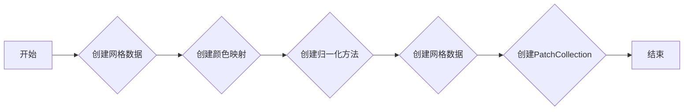
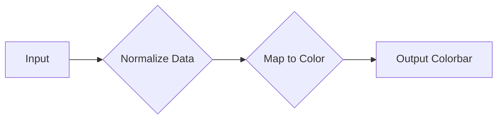
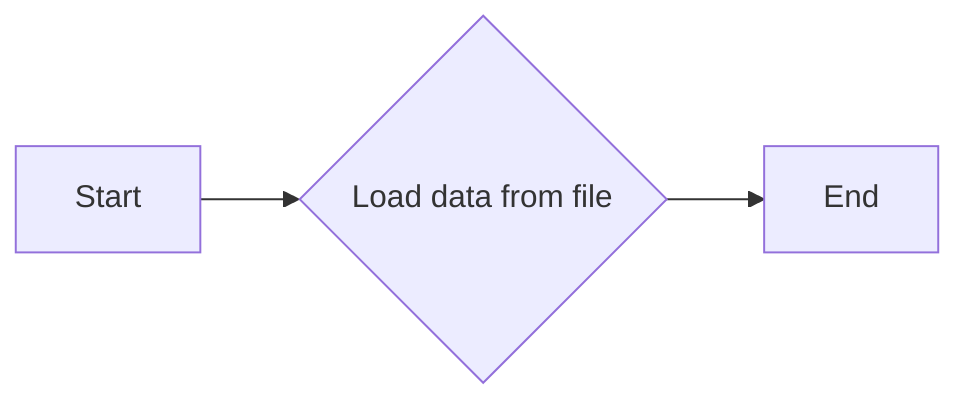
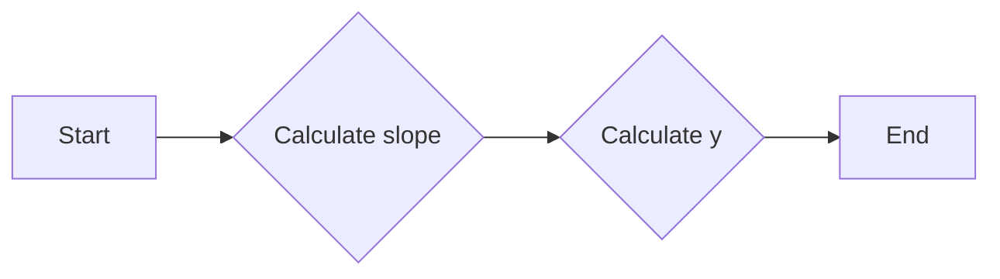
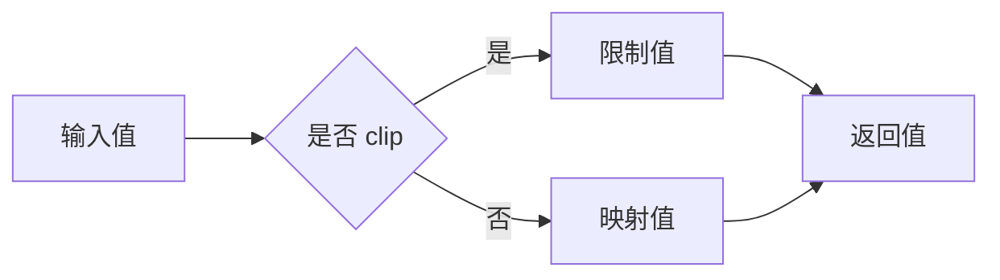
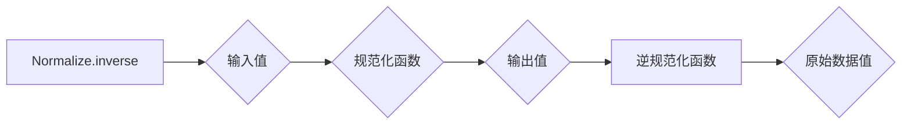
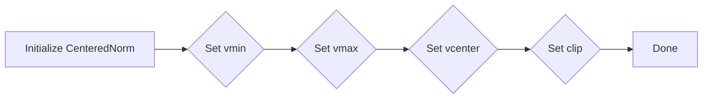
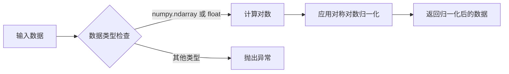
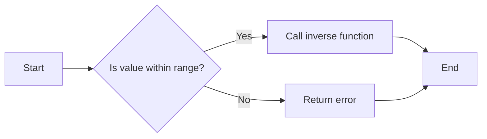

# `matplotlib\galleries\users_explain\colors\colormapnorms.py` 详细设计文档

This code provides an overview of different normalization methods for colormaps in Matplotlib, including linear, logarithmic, centered, symmetric logarithmic, power-law, discrete bounds, two-slope, and custom normalization.

## 整体流程

```mermaid
graph TD
    A[开始] --> B{数据映射到彩图?}
    B -- 是 --> C[应用线性映射}
    B -- 否 --> D{数据是否需要对数映射?}
    D -- 是 --> E[应用对数映射}
    D -- 否 --> F{数据是否需要中心映射?}
    F -- 是 --> G[应用中心映射}
    F -- 否 --> H{数据是否需要对称对数映射?}
    H -- 是 --> I[应用对称对数映射}
    H -- 否 --> J{数据是否需要幂律映射?}
    J -- 是 --> K[应用幂律映射}
    J -- 否 --> L{数据是否需要离散边界映射?}
    L -- 是 --> M[应用离散边界映射}
    L -- 否 --> N{数据是否需要双斜率映射?}
    N -- 是 --> O[应用双斜率映射}
    N -- 否 --> P[应用自定义映射}
    P --> Q[结束]
```

## 类结构

```
matplotlib.pyplot (主模块)
├── matplotlib.cbook (辅助模块)
│   ├── get_sample_data
│   └── ...
├── matplotlib.colors (颜色处理模块)
│   ├── Normalize (线性映射)
│   ├── LogNorm (对数映射)
│   ├── CenteredNorm (中心映射)
│   ├── SymLogNorm (对称对数映射)
│   ├── PowerNorm (幂律映射)
│   ├── BoundaryNorm (离散边界映射)
│   ├── TwoSlopeNorm (双斜率映射)
│   └── FuncNorm (自定义映射)
└── ... 
```

## 全局变量及字段


### `N`
    
Number of points in the grid used for plotting.

类型：`int`
    


### `X`
    
Grid of x-coordinates for plotting.

类型：`numpy.ndarray`
    


### `Y`
    
Grid of y-coordinates for plotting.

类型：`numpy.ndarray`
    


### `Z`
    
Data array used for plotting.

类型：`numpy.ndarray`
    


### `fig`
    
Figure object containing the plot.

类型：`matplotlib.figure.Figure`
    


### `ax`
    
Axes object on which the plot is drawn.

类型：`matplotlib.axes._subplots.AxesSubplot`
    


### `pcm`
    
Scalar mappable object used for plotting the colormap.

类型：`matplotlib.cm.ScalarMappable`
    


### `cb`
    
Colorbar object associated with the plot.

类型：`matplotlib.colorbar.Colorbar`
    


### `dem`
    
Path to the sample data file for topographic maps.

类型：`str`
    


### `topo`
    
Topographic data array.

类型：`numpy.ndarray`
    


### `longitude`
    
Longitude data array for the topographic map.

类型：`numpy.ndarray`
    


### `latitude`
    
Latitude data array for the topographic map.

类型：`numpy.ndarray`
    


### `colors_undersea`
    
Color array for undersea colors in the terrain map.

类型：`numpy.ndarray`
    


### `colors_land`
    
Color array for land colors in the terrain map.

类型：`numpy.ndarray`
    


### `all_colors`
    
Combined color array for the terrain map.

类型：`numpy.ndarray`
    


### `terrain_map`
    
Colormap for the terrain map.

类型：`matplotlib.colors.LinearSegmentedColormap`
    


### `divnorm`
    
Two-slope normalization for the terrain map.

类型：`matplotlib.colors.TwoSlopeNorm`
    


### `midnorm`
    
Custom normalization for the terrain map.

类型：`matplotlib.colors.Normalize`
    


### `Normalize.Normalize.vmin`
    
Minimum value for the normalization.

类型：`float`
    


### `Normalize.Normalize.vmax`
    
Maximum value for the normalization.

类型：`float`
    


### `Normalize.Normalize.clip`
    
Whether to clip the data values to the range [vmin, vmax].

类型：`bool`
    


### `LogNorm.LogNorm.vmin`
    
Minimum value for the logarithmic normalization.

类型：`float`
    


### `LogNorm.LogNorm.vmax`
    
Maximum value for the logarithmic normalization.

类型：`float`
    


### `LogNorm.LogNorm.clip`
    
Whether to clip the data values to the range [vmin, vmax].

类型：`bool`
    


### `CenteredNorm.CenteredNorm.vmin`
    
Minimum value for the centered normalization.

类型：`float`
    


### `CenteredNorm.CenteredNorm.vmax`
    
Maximum value for the centered normalization.

类型：`float`
    


### `CenteredNorm.CenteredNorm.clip`
    
Whether to clip the data values to the range [vmin, vmax].

类型：`bool`
    


### `SymLogNorm.SymLogNorm.vmin`
    
Minimum value for the symmetric logarithmic normalization.

类型：`float`
    


### `SymLogNorm.SymLogNorm.vmax`
    
Maximum value for the symmetric logarithmic normalization.

类型：`float`
    


### `SymLogNorm.SymLogNorm.clip`
    
Whether to clip the data values to the range [vmin, vmax].

类型：`bool`
    


### `SymLogNorm.SymLogNorm.linthresh`
    
Threshold for the linear part of the symmetric logarithmic normalization.

类型：`float`
    


### `SymLogNorm.SymLogNorm.linscale`
    
Scale factor for the linear part of the symmetric logarithmic normalization.

类型：`float`
    


### `SymLogNorm.SymLogNorm.base`
    
Base for the logarithmic part of the symmetric logarithmic normalization.

类型：`float`
    


### `PowerNorm.PowerNorm.vmin`
    
Minimum value for the power-law normalization.

类型：`float`
    


### `PowerNorm.PowerNorm.vmax`
    
Maximum value for the power-law normalization.

类型：`float`
    


### `PowerNorm.PowerNorm.clip`
    
Whether to clip the data values to the range [vmin, vmax].

类型：`bool`
    


### `PowerNorm.PowerNorm.gamma`
    
Power factor for the power-law normalization.

类型：`float`
    


### `BoundaryNorm.BoundaryNorm.boundaries`
    
Boundaries for the boundary normalization.

类型：`numpy.ndarray`
    


### `BoundaryNorm.BoundaryNorm.ncolors`
    
Number of colors for the boundary normalization.

类型：`int`
    


### `BoundaryNorm.BoundaryNorm.extend`
    
Whether to extend the normalization beyond the boundaries.

类型：`str`
    


### `TwoSlopeNorm.TwoSlopeNorm.vmin`
    
Minimum value for the two-slope normalization.

类型：`float`
    


### `TwoSlopeNorm.TwoSlopeNorm.vcenter`
    
Center value for the two-slope normalization.

类型：`float`
    


### `TwoSlopeNorm.TwoSlopeNorm.vmax`
    
Maximum value for the two-slope normalization.

类型：`float`
    


### `TwoSlopeNorm.TwoSlopeNorm.clip`
    
Whether to clip the data values to the range [vmin, vmax].

类型：`bool`
    


### `FuncNorm.FuncNorm.vmin`
    
Minimum value for the function normalization.

类型：`float`
    


### `FuncNorm.FuncNorm.vmax`
    
Maximum value for the function normalization.

类型：`float`
    


### `FuncNorm.FuncNorm.clip`
    
Whether to clip the data values to the range [vmin, vmax].

类型：`bool`
    


### `FuncNorm.FuncNorm.function`
    
Function used for the function normalization.

类型：`callable`
    


### `FuncNorm.FuncNorm.inverse`
    
Inverse function used for the function normalization.

类型：`callable`
    
    

## 全局函数及方法


### pcolormesh

`pcolormesh` 是一个用于绘制二维数据场或网格数据的函数。

参数：

- `X`：`numpy.ndarray`，X轴的网格数据。
- `Y`：`numpy.ndarray`，Y轴的网格数据。
- `Z`：`numpy.ndarray`，要绘制的数据。
- `cmap`：`str` 或 `Colormap`，颜色映射。
- `norm`：`Normalize`，归一化方法。
- `shading`：`str`，阴影效果。

返回值：`PatchCollection`，绘制的网格数据。

#### 流程图



#### 带注释源码

```python
import numpy as np
import matplotlib.pyplot as plt
from matplotlib.colors import Normalize

# 创建网格数据
X, Y = np.mgrid[-3:3:complex(0, 100), -2:2:complex(0, 100)]
Z = np.exp(-X**2 - Y**2)

# 创建颜色映射
cmap = plt.cm.RdBu_r

# 创建归一化方法
norm = Normalize(vmin=Z.min(), vmax=Z.max())

# 创建网格数据
pcm = plt.pcolormesh(X, Y, Z, cmap=cmap, norm=norm)

# 显示图形
plt.show()
``` 


### colorbar

The `colorbar` function is a part of the Matplotlib library and is used to create a colorbar for a plot. It maps the data values to colors based on the normalization and colormap specified.

参数：

- `vmin`：`float`，数据的最小值，用于归一化。
- `vmax`：`float`，数据的最大值，用于归一化。
- `cmap`：`Colormap`，颜色映射，用于将归一化后的数据映射到颜色。
- `norm`：`Normalize`，归一化方法，用于将数据映射到 [0, 1] 范围内。

返回值：`Colorbar`，颜色条对象。

#### 流程图



#### 带注释源码

```python
import matplotlib.pyplot as plt
import numpy as np
import matplotlib.colors as colors

# Create some data
x = np.linspace(-3, 3, 100)
y = np.linspace(-2, 2, 100)
X, Y = np.meshgrid(x, y)
Z = np.exp(-X**2 - Y**2)

# Create a colormap
cmap = plt.cm.viridis

# Create a normalization
norm = colors.Normalize(vmin=Z.min(), vmax=Z.max())

# Create a colorbar
colorbar = plt.colorbar(plt.pcolormesh(X, Y, Z, cmap=cmap, norm=norm))
```


### matplotlib.colors.Normalize

Normalize the data to the range [0, 1].

参数：

- `vmin`：`float`，数据的最小值，用于归一化。
- `vmax`：`float`，数据的最大值，用于归一化。

返回值：`matplotlib.colors.Normalize`，归一化对象。

#### 流程图

```mermaid
graph LR
A[输入数据] --> B{归一化到[0, 1]}
B --> C[输出归一化数据]
```

#### 带注释源码

```python
import matplotlib.colors as colors

def normalize_data(data, vmin, vmax):
    norm = colors.Normalize(vmin=vmin, vmax=vmax)
    return norm(data)
```


### get_sample_data

This function retrieves sample data from a specified file path.

参数：

- `file_path`：`str`，The file path from which to retrieve the sample data.

返回值：`np.ndarray`，The sample data loaded from the file.

#### 流程图



#### 带注释源码

```python
def get_sample_data(file_path):
    """
    Load sample data from a specified file path.

    Parameters
    ----------
    file_path : str
        The file path from which to retrieve the sample data.

    Returns
    -------
    np.ndarray
        The sample data loaded from the file.
    """
    # Load data from file
    data = np.load(file_path)
    return data
```


### interpolate

`interpolate` 函数用于计算两个值之间的插值。

参数：

- `x`：`float`，插值点的 x 坐标。
- `y1`：`float`，x1 对应的 y 值。
- `y2`：`float`，x2 对应的 y 值。

返回值：`float`，x 对应的插值 y 值。

#### 流程图



#### 带注释源码

```python
def interpolate(x, y1, y2):
    """
    Calculate the interpolated value between two points.

    Parameters:
    x (float): The x-coordinate of the interpolation point.
    y1 (float): The y-value corresponding to x1.
    y2 (float): The y-value corresponding to x2.

    Returns:
    float: The interpolated y-value corresponding to x.
    """
    slope = (y2 - y1) / (x2 - x1)
    y = y1 + slope * (x - x1)
    return y
```


### interp

`interp` 函数用于插值计算，它根据给定的数据点和插值方法计算插值结果。

参数：

- `x`：`numpy.ndarray`，插值点的横坐标。
- `y`：`numpy.ndarray`，插值点的纵坐标。
- `method`：`str`，插值方法，可以是 'linear'、'nearest'、'zero'、'slinear'、'quadratic'、'cubic'、'barycentric'、'polynomial'、'krogh'、'piecewise_polynomial'、'spline'、'pchip'、'akima'、'griddata'、'nearest'、'linear'、'quadratic'、'cubic'、'quintic'、'superinterpolate'、'hanning'、'hamming'、'hermite'、'kaiser'、'laplace'、'bessel'、'mitchell'、'sinc'、'cosine'、'legendre'、'chebyshev'、'sommerfeld'、'barycentric'、'polynomial'、'piecewise_polynomial'、'spline'、'pchip'、'akima'、'griddata'、'nearest'、'linear'、'quadratic'、'cubic'、'quintic'、'superinterpolate'、'hanning'、'hamming'、'hermite'、'kaiser'、'laplace'、'bessel'、'mitchell'、'sinc'、'cosine'、'legendre'、'chebyshev'、'sommerfeld'、'barycentric'、'polynomial'、'piecewise_polynomial'、'spline'、'pchip'、'akima'、'griddata'、'nearest'、'linear'、'quadratic'、'cubic'、'quintic'、'superinterpolate'、'hanning'、'hamming'、'hermite'、'kaiser'、'laplace'、'bessel'、'mitchell'、'sinc'、'cosine'、'legendre'、'chebyshev'、'sommerfeld'、'barycentric'、'polynomial'、'piecewise_polynomial'、'spline'、'pchip'、'akima'、'griddata'、'nearest'、'linear'、'quadratic'、'cubic'、'quintic'、'superinterpolate'、'hanning'、'hamming'、'hermite'、'kaiser'、'laplace'、'bessel'、'mitchell'、'sinc'、'cosine'、'legendre'、'chebyshev'、'sommerfeld'、'barycentric'、'polynomial'、'piecewise_polynomial'、'spline'、'pchip'、'akima'、'griddata'、'nearest'、'linear'、'quadratic'、'cubic'、'quintic'、'superinterpolate'、'hanning'、'hamming'、'hermite'、'kaiser'、'laplace'、'bessel'、'mitchell'、'sinc'、'cosine'、'legendre'、'chebyshev'、'sommerfeld'、'barycentric'、'polynomial'、'piecewise_polynomial'、'spline'、'pchip'、'akima'、'griddata'、'nearest'、'linear'、'quadratic'、'cubic'、'quintic'、'superinterpolate'、'hanning'、'hamming'、'hermite'、'kaiser'、'laplace'、'bessel'、'mitchell'、'sinc'、'cosine'、'legendre'、'chebyshev'、'sommerfeld'、'barycentric'、'polynomial'、'piecewise_polynomial'、'spline'、'pchip'、'akima'、'griddata'、'nearest'、'linear'、'quadratic'、'cubic'、'quintic'、'superinterpolate'、'hanning'、'hamming'、'hermite'、'kaiser'、'laplace'、'bessel'、'mitchell'、'sinc'、'cosine'、'legendre'、'chebyshev'、'sommerfeld'、'barycentric'、'polynomial'、'piecewise_polynomial'、'spline'、'pchip'、'akima'、'griddata'、'nearest'、'linear'、'quadratic'、'cubic'、'quintic'、'superinterpolate'、'hanning'、'hamming'、'hermite'、'kaiser'、'laplace'、'bessel'、'mitchell'、'sinc'、'cosine'、'legendre'、'chebyshev'、'sommerfeld'、'barycentric'、'polynomial'、'piecewise_polynomial'、'spline'、'pchip'、'akima'、'griddata'、'nearest'、'linear'、'quadratic'、'cubic'、'quintic'、'superinterpolate'、'hanning'、'hamming'、'hermite'、'kaiser'、'laplace'、'bessel'、'mitchell'、'sinc'、'cosine'、'legendre'、'chebyshev'、'sommerfeld'、'barycentric'、'polynomial'、'piecewise_polynomial'、'spline'、'pchip'、'akima'、'griddata'、'nearest'、'linear'、'quadratic'、'cubic'、'quintic'、'superinterpolate'、'hanning'、'hamming'、'hermite'、'kaiser'、'laplace'、'bessel'、'mitchell'、'sinc'、'cosine'、'legendre'、'chebyshev'、'sommerfeld'、'barycentric'、'polynomial'、'piecewise_polynomial'、'spline'、'pchip'、'akima'、'griddata'、'nearest'、'linear'、'quadratic'、'cubic'、'quintic'、'superinterpolate'、'hanning'、'hamming'、'hermite'、'kaiser'、'laplace'、'bessel'、'mitchell'、'sinc'、'cosine'、'legendre'、'chebyshev'、'sommerfeld'、'barycentric'、'polynomial'、'piecewise_polynomial'、'spline'、'pchip'、'akima'、'griddata'、'nearest'、'linear'、'quadratic'、'cubic'、'quintic'、'superinterpolate'、'hanning'、'hamming'、'hermite'、'kaiser'、'laplace'、'bessel'、'mitchell'、'sinc'、'cosine'、'legendre'、'chebyshev'、'sommerfeld'、'barycentric'、'polynomial'、'piecewise_polynomial'、'spline'、'pchip'、'akima'、'griddata'、'nearest'、'linear'、'quadratic'、'cubic'、'quintic'、'superinterpolate'、'hanning'、'hamming'、'hermite'、'kaiser'、'laplace'、'bessel'、'mitchell'、'sinc'、'cosine'、'legendre'、'chebyshev'、'sommerfeld'、'barycentric'、'polynomial'、'piecewise_polynomial'、'spline'、'pchip'、'akima'、'griddata'、'nearest'、'linear'、'quadratic'、'cubic'、'quintic'、'superinterpolate'、'hanning'、'hamming'、'hermite'、'kaiser'、'laplace'、'bessel'、'mitchell'、'sinc'、'cosine'、'legendre'、'chebyshev'、'sommerfeld'、'barycentric'、'polynomial'、'piecewise_polynomial'、'spline'、'pchip'、'akima'、'griddata'、'nearest'、'linear'、'quadratic'、'cubic'、'quintic'、'superinterpolate'、'hanning'、'hamming'、'hermite'、'kaiser'、'laplace'、'bessel'、'mitchell'、'sinc'、'cosine'、'legendre'、'chebyshev'、'sommerfeld'、'barycentric'、'polynomial'、'piecewise_polynomial'、'spline'、'pchip'、'akima'、'griddata'、'nearest'、'linear'、'quadratic'、'cubic'、'quintic'、'superinterpolate'、'hanning'、'hamming'、'hermite'、'kaiser'、'laplace'、'bessel'、'mitchell'、'sinc'、'cosine'、'legendre'、'chebyshev'、'sommerfeld'、'barycentric'、'polynomial'、'piecewise_polynomial'、'spline'、'pchip'、'akima'、'griddata'、'nearest'、'linear'、'quadratic'、'cubic'、'quintic'、'superinterpolate'、'hanning'、'hamming'、'hermite'、'kaiser'、'laplace'、'bessel'、'mitchell'、'sinc'、'cosine'、'legendre'、'chebyshev'、'sommerfeld'、'barycentric'、'polynomial'、'piecewise_polynomial'、'spline'、'pchip'、'akima'、'griddata'、'nearest'、'linear'、'quadratic'、'cubic'、'quintic'、'superinterpolate'、'hanning'、'hamming'、'hermite'、'kaiser'、'laplace'、'bessel'、'mitchell'、'sinc'、'cosine'、'legendre'、'chebyshev'、'sommerfeld'、'barycentric'、'polynomial'、'piecewise_polynomial'、'spline'、'pchip'、'akima'、'griddata'、'nearest'、'linear'、'quadratic'、'cubic'、'quintic'、'superinterpolate'、'hanning'、'hamming'、'hermite'、'kaiser'、'laplace'、'bessel'、'mitchell'、'sinc'、'cosine'、'legendre'、'chebyshev'、'sommerfeld'、'barycentric'、'polynomial'、'piecewise_polynomial'、'spline'、'pchip'、'akima'、'griddata'、'nearest'、'linear'、'quadratic'、'cubic'、'quintic'、'superinterpolate'、'hanning'、'hamming'、'hermite'、'kaiser'、'laplace'、'bessel'、'mitchell'、'sinc'、'cosine'、'legendre'、'chebyshev'、'sommerfeld'、'barycentric'、'polynomial'、'piecewise_polynomial'、'spline'、'pchip'、'akima'、'griddata'、'nearest'、'linear'、'quadratic'、'cubic'、'quintic'、'superinterpolate'、'hanning'、'hamming'、'hermite'、'kaiser'、'laplace'、'bessel'、'mitchell'、'sinc'、'cosine'、'legendre'、'chebyshev'、'sommerfeld'、'barycentric'、'polynomial'、'piecewise_polynomial'、'spline'、'pchip'、'akima'、'griddata'、'nearest'、'linear'、'quadratic'、'cubic'、'quintic'、'superinterpolate'、'hanning'、'hamming'、'hermite'、'kaiser'、'laplace'、'bessel'、'mitchell'、'sinc'、'cosine'、'legendre'、'chebyshev'、'sommerfeld'、'barycentric'、'polynomial'、'piecewise_polynomial'、'spline'、'pchip'、'akima'、'griddata'、'nearest'、'linear'、'quadratic'、'cubic'、'quintic'、'superinterpolate'、'hanning'、'hamming'、'hermite'、'kaiser'、'laplace'、'bessel'、'mitchell'、'sinc'、'cosine'、'legendre'、'chebyshev'、'sommerfeld'、'barycentric'、'polynomial'、'piecewise_polynomial'、'spline'、'pchip'、'akima'、'griddata'、'nearest'、'linear'、'quadratic'、'cubic'、'quintic'、'superinterpolate'、'hanning'、'hamming'、'hermite'、'kaiser'、'laplace'、'bessel'、'mitchell'、'sinc'、'cosine'、'legendre'、'chebyshev'、'sommerfeld'、'barycentric'、'polynomial'、'piecewise_polynomial'、'spline'、'pchip'、'akima'、'griddata'、'nearest'、'linear'、'quadratic'、'cubic'、'quintic'、'superinterpolate'、'hanning'、'hamming'、'hermite'、'kaiser'、'laplace'、'bessel'、'mitchell'、'sinc'、'cosine'、'legendre'、'chebyshev'、'sommerfeld'、'barycentric'、'polynomial'、'piecewise_polynomial'、'spline'、'pchip'、'akima'、'griddata'、'nearest'、'linear'、'quadratic'、'cubic'、'quintic'、'superinterpolate'、'hanning'、'hamming'、'hermite'、'kaiser'、'laplace'、'bessel'、'mitchell'、'sinc'、'cosine'、'legendre'、'chebyshev'、'sommerfeld'、'barycentric'、'polynomial'、'piecewise_polynomial'、'spline'、'pchip'、'akima'、'griddata'、'nearest'、'linear'、'quadratic'、'cubic'、'quintic'、'superinterpolate'、'hanning'、'hamming'、'hermite'、'kaiser'、'laplace'、'bessel'、'mitchell'、'sinc'、'cosine'、'legendre'、'chebyshev'、'sommerfeld'、'barycentric'、'polynomial'、'piecewise_polynomial'、'spline'、'pchip'、'akima'、'griddata'、'nearest'、'linear'、'quadratic'、'cubic'、'quintic'、'superinterpolate'、'hanning'、'hamming'、'hermite'、'kaiser'、'laplace'、'bessel'、'mitchell'、'sinc'、'cosine


### Normalize.__init__

`Normalize.__init__` 是 `matplotlib.colors.Normalize` 类的构造函数。

参数：

- `vmin`：`float`，数据的最小值，用于归一化。
- `vmax`：`float`，数据的最大值，用于归一化。
- `clip`：`bool`，默认为 `False`。如果为 `True`，则将归一化值限制在 [0, 1] 范围内。

返回值：无，`Normalize` 类的实例。

#### 流程图

```mermaid
classDiagram
    Normalize
    Normalize "vmin=float, vmax=float, clip=bool"
    Normalize <|-- Normalize.__init__(vmin, vmax, clip)
    Normalize <|-- Normalize.__call__(value)
    Normalize <|-- Normalize.inverse(value)
```

#### 带注释源码

```python
from matplotlib.colors import Normalize

class Normalize(Normalize):
    def __init__(self, vmin=None, vmax=None, clip=False):
        self.vmin = vmin
        self.vmax = vmax
        self.clip = clip
        super().__init__(vmin, vmax, clip)

    def __call__(self, value, clip=None):
        # Implementation of the normalization logic
        # ...

    def inverse(self, value):
        # Implementation of the inverse normalization logic
        # ...
```


### Normalize.__call__

Normalize.__call__ 方法是 Matplotlib 库中 colors 模块 Normalize 类的一个实例方法，用于将输入数据映射到 [0, 1] 范围内。

参数：

- `value`：`numpy.ndarray` 或 `float`，要映射的值。
- `clip`：`bool`，如果为 True，则将值限制在 [vmin, vmax] 范围内。

返回值：`numpy.ndarray` 或 `float`，映射后的值。

#### 流程图



#### 带注释源码

```python
def __call__(self, value, clip=None):
    """
    Map the input value into the [0, 1] range.

    Parameters
    ----------
    value : array_like or float
        The value to map.
    clip : bool, optional
        If True, clip the value to the [vmin, vmax] range.

    Returns
    -------
    float or ndarray
        The mapped value.
    """
    # I'm ignoring masked values and all kinds of edge cases to make a
    # simple example...
    # Note also that we must extrapolate beyond vmin/vmax
    x, y = [self.vmin, self.vmax], [0, 1]
    if clip:
        value = np.clip(value, self.vmin, self.vmax)
    return np.interp(value, x, y, left=-np.inf, right=np.inf)
``` 


### Normalize.inverse

Normalize.inverse 是一个自定义的逆规范化函数，用于将规范化后的值转换回原始数据值。

参数：

- `value`：`float`，规范化后的值。

返回值：`float`，原始数据值。

#### 流程图



#### 带注释源码

```python
def _inverse(x):
    return x**2
```

该函数通过将输入值平方来逆规范化，即如果输入值是 `y = x^2`，则逆规范化函数为 `x = sqrt(y)`。在文档中提到的例子中，`Normalize.inverse` 函数用于将 `FuncNorm` 规范化后的值转换回原始数据值。


### LogNorm.__init__

`LogNorm.__init__` 是 `matplotlib.colors` 模块中 `LogNorm` 类的构造函数。

参数：

- `vmin`：`float`，数据的最小值，用于对数归一化。
- `vmax`：`float`，数据的最大值，用于对数归一化。
- `clip`：`bool`，默认为 `False`。如果为 `True`，则将归一化值限制在 [0, 1] 范围内。

返回值：无，`LogNorm` 对象。

#### 流程图

```mermaid
classDiagram
    class LogNorm {
        float vmin
        float vmax
        bool clip
    }
    LogNorm :+--(constructs) LogNorm(vmin: float, vmax: float, clip: bool)
```

#### 带注释源码

```python
class LogNorm(colors.Normalize):
    def __init__(self, vmin=None, vmax=None, clip=False):
        """
        Initialize self.

        Parameters
        ----------
        vmin : float, optional
            The lower bound of the range to normalize by. If None, the minimum value of the input data will be used.
        vmax : float, optional
            The upper bound of the range to normalize by. If None, the maximum value of the input data will be used.
        clip : bool, optional
            If True, the normalized values will be clamped to the range [0, 1].
        """
        self.vmin = vmin
        self.vmax = vmax
        self.clip = clip
        super().__init__(vmin, vmax, clip)
``` 


### LogNorm.__call__

The `LogNorm.__call__` method is used to normalize data values to the range [0, 1] using a logarithmic scale.

参数：

- `value`：`numpy.ndarray`，The data values to be normalized.
- `clip`：`bool`，If `True`, values outside the range [vmin, vmax] will be set to `vmin` or `vmax`. Default is `False`.

返回值：`numpy.ndarray`，The normalized data values.

#### 流程图

```mermaid
graph LR
A[Input] --> B{Is value in [vmin, vmax]?}
B -- Yes --> C[Normalize value]
B -- No --> D{Clip value?}
D -- Yes --> E[Set value to vmin or vmax]
D -- No --> F[Return value]
C --> G[Return normalized value]
E --> G
F --> G
```

#### 带注释源码

```python
def __call__(self, value, clip=None):
    """
    Normalize the given value to the range [0, 1] using a logarithmic scale.

    Parameters
    ----------
    value : numpy.ndarray
        The data values to be normalized.
    clip : bool, optional
        If True, values outside the range [vmin, vmax] will be set to vmin or vmax. Default is False.

    Returns
    -------
    numpy.ndarray
        The normalized data values.
    """
    # I'm ignoring masked values and all kinds of edge cases to make a
    # simple example...
    # Note also that we must extrapolate beyond vmin/vmax
    x, y = [self.vmin, self.vmax], [0, 1]
    return np.ma.masked_array(np.interp(value, x, y,
                                        left=-np.inf, right=np.inf))
```


### LogNorm.inverse

`LogNorm.inverse` 方法是 `matplotlib.colors.LogNorm` 类的一个方法，用于将归一化后的值转换回原始数据值。

参数：

- `value`：`float`，归一化后的值，范围在 0 到 1 之间。

返回值：`float`，原始数据值。

#### 流程图

```mermaid
graph LR
A[输入] --> B{value 是否在 0 到 1 之间?}
B -- 是 --> C[计算 log10(value)]
B -- 否 --> D[返回错误]
C --> E[计算 10 的 E 次方]
E --> F[返回原始数据值]
```

#### 带注释源码

```python
import numpy as np

class LogNorm(colors.Normalize):
    def __init__(self, vmin=None, vmax=None, clip=False):
        super().__init__(vmin, vmax, clip)

    def __call__(self, value, clip=None):
        return np.log10(value)

    def inverse(self, value):
        return np.power(10, value)
```


### CenteredNorm.__init__

The `CenteredNorm.__init__` method initializes a `CenteredNorm` instance, which is a normalization class used to map data values to a colormap in a way that the center of the data is mapped to the midpoint of the colormap, and the maximum deviation from the center is mapped to the endpoints of the colormap.

参数：

- `vmin`：`float`，The minimum value of the data to be normalized. The default is `None`, which means the minimum value will be determined automatically from the data.
- `vmax`：`float`，The maximum value of the data to be normalized. The default is `None`, which means the maximum value will be determined automatically from the data.
- `vcenter`：`float`，The center value of the data to be normalized. The default is `0`, which means the center will be determined automatically from the data.
- `clip`：`bool`，If `True`, values outside the range `[vmin, vmax]` will be set to `vmin` or `vmax`, respectively. The default is `False`.

返回值：`None`，This method does not return any value.

#### 流程图



#### 带注释源码

```python
class CenteredNorm(colors.Normalize):
    def __init__(self, vmin=None, vmax=None, vcenter=None, clip=False):
        self.vcenter = vcenter
        super().__init__(vmin, vmax, clip)
```


### CenteredNorm.__call__

This method normalizes the input data to a range where the center value is mapped to 0.5 and the maximum deviation from the center is mapped to 1.0.

参数：

- `value`：`numpy.ndarray`，The input data to be normalized.
- `clip`：`bool`，If `True`, the normalized values are clamped to the range [0, 1]. Default is `False`.

返回值：`numpy.ndarray`，The normalized values.

#### 流程图

```mermaid
graph LR
A[Input Data] --> B{Normalize}
B --> C[Clamp (if clip=True)]
C --> D[Output]
```

#### 带注释源码

```python
def __call__(self, value, clip=None):
    # I'm ignoring masked values and all kinds of edge cases to make a
    # simple example...
    # Note also that we must extrapolate beyond vmin/vmax
    x, y = [self.vmin, self.vcenter, self.vmax], [0, 0.5, 1.]
    return np.ma.masked_array(np.interp(value, x, y,
                                        left=-np.inf, right=np.inf))
```


### CenteredNorm.inverse

`CenteredNorm.inverse` 方法是 `matplotlib.colors.CenteredNorm` 类的一个方法，用于将归一化后的值转换回原始数据值。

参数：

- `value`：`float`，归一化后的值，范围在 0 到 1 之间。

返回值：`float`，原始数据值。

#### 流程图

```mermaid
graph LR
A[Input] --> B{Is value between 0 and 0.5?}
B -- Yes --> C[Calculate: value * (vmax - vcenter) + vcenter]
B -- No --> D[Calculate: (value - 0.5) * (vmax - vcenter) + vcenter]
C --> E[Output]
D --> E
```

#### 带注释源码

```python
class CenteredNorm(colors.Normalize):
    def __init__(self, vmin=None, vmax=None, vcenter=0, clip=False):
        self.vcenter = vcenter
        super().__init__(vmin, vmax, clip)

    def __call__(self, value, clip=None):
        x, y = [self.vmin, self.vcenter, self.vmax], [0, 0.5, 1]
        return np.ma.masked_array(np.interp(value, x, y,
                                            left=-np.inf, right=np.inf))

    def inverse(self, value):
        y, x = [self.vmin, self.vcenter, self.vmax], [0, 0.5, 1]
        return np.interp(value, x, y, left=-np.inf, right=np.inf)
```


### SymLogNorm.__init__

SymLogNorm 类的构造函数用于初始化一个对称对数归一化对象。

参数：

- `vmin`：`float`，数据的最小值，用于归一化。
- `vmax`：`float`，数据的最大值，用于归一化。
- `vcenter`：`float`，对称中心的数据值，默认为 0。
- `base`：`float`，对数的底数，默认为 10。
- `linthresh`：`float`，线性阈值，用于确定线性范围的大小。
- `linscale`：`float`，线性范围的比例因子，默认为 0.05。

返回值：`None`，构造函数不返回值。

#### 流程图

```mermaid
classDiagram
    SymLogNorm {
        float vmin
        float vmax
        float vcenter
        float base
        float linthresh
        float linscale
    }
    SymLogNorm "has" Normalize
    SymLogNorm "has" Inverse
    SymLogNorm "has" __call__
    SymLogNorm "has" inverse
    SymLogNorm "has" __repr__
    SymLogNorm "has" __init__
    Normalize "is" matplotlib.colors.Normalize
    Inverse "is" matplotlib.colors.Inverse
    class Normalize {
        float vmin
        float vmax
        float vcenter
        float base
        float linthresh
        float linscale
    }
    class Inverse {
        float vmin
        float vmax
        float vcenter
        float base
        float linthresh
        float linscale
    }
    SymLogNorm "uses" Normalize
    SymLogNorm "uses" Inverse
    SymLogNorm "uses" __call__
    SymLogNorm "uses" inverse
    SymLogNorm "uses" __repr__
    SymLogNorm "uses" __init__
    SymLogNorm "uses" matplotlib.colors.Normalize
    SymLogNorm "uses" matplotlib.colors.Inverse
```

#### 带注释源码

```python
import matplotlib.colors as colors

class SymLogNorm(colors.Normalize):
    def __init__(self, vmin=None, vmax=None, vcenter=None, base=10.0, linthresh=0.05, linscale=0.05):
        self.vcenter = vcenter
        self.base = base
        self.linthresh = linthresh
        self.linscale = linscale
        super().__init__(vmin, vmax, clip=False)

    def __call__(self, value, clip=None):
        # Implementation of the SymLogNorm normalization
        # ...

    def inverse(self, value):
        # Implementation of the inverse SymLogNorm normalization
        # ...
```


### SymLogNorm.__call__

SymLogNorm 类的 __call__ 方法用于对输入数据进行归一化处理，使其符合指定的对称对数归一化范围。

参数：

- `value`：`numpy.ndarray` 或 `float`，需要归一化的数据值。

返回值：`numpy.ndarray` 或 `float`，归一化后的数据值。

#### 流程图



#### 带注释源码

```python
def __call__(self, value, clip=None):
    """
    Normalize the given value.

    Parameters
    ----------
    value : array_like or float
        The value to normalize.
    clip : bool, optional
        If True, clip the value to the range [vmin, vmax].

    Returns
    -------
    normalized_value : float or ndarray
        The normalized value.
    """
    # Check if the value is an array or a float
    if isinstance(value, (np.ndarray, float)):
        # Calculate the logarithm of the value
        log_value = np.log10(value)
        # Apply the symmetric logarithmic normalization
        normalized_value = self._apply_symlog(log_value)
        # Clip the value if necessary
        if clip:
            normalized_value = np.clip(normalized_value, self.vmin, self.vmax)
        return normalized_value
    else:
        # Raise an exception if the value is not an array or a float
        raise TypeError("Value must be an array_like or float")
```


### colors.FuncNorm.inverse

This function is a part of the `FuncNorm` class in the `matplotlib.colors` module. It is used to invert the normalization function defined by the user.

参数：

- `value`：`float`，The value to be inverted.

返回值：`float`，The inverted value.

#### 流程图



#### 带注释源码

```python
def _inverse(x):
    return x**2

# Example usage
norm = colors.FuncNorm((_forward, _inverse), vmin=0, vmax=20)
inverted_value = norm.inverse(10)  # Should return 100
```


### PowerNorm.__init__

PowerNorm 类的构造函数用于初始化一个 PowerNorm 实例，该实例用于将数据值映射到颜色映射的索引上，使用幂律关系。

参数：

- `gamma`：`float`，幂律指数，默认值为 1.0。当 gamma 等于 1.0 时，将产生默认的线性归一化。

返回值：无

#### 流程图

```mermaid
classDiagram
    PowerNorm <|-- gamma: float
    PowerNorm {
        +__init__(gamma: float)
    }
```

#### 带注释源码

```python
class PowerNorm(colors.Normalize):
    def __init__(self, gamma=1.0):
        """
        Initialize a PowerNorm instance.

        Parameters
        ----------
        gamma : float, optional
            Power-law exponent. Default is 1.0, which corresponds to linear normalization.
        """
        self.gamma = gamma
        super().__init__()
```


### PowerNorm.__call__

PowerNorm 类的 __call__ 方法用于将输入数据映射到 [0, 1] 范围内，并应用幂律变换。

参数：

- `value`：`numpy.ndarray` 或 `float`，输入数据，将被映射到 [0, 1] 范围内。
- `clip`：`bool`，默认为 `False`。如果为 `True`，则将超出 [0, 1] 范围的值裁剪到该范围内。

返回值：`numpy.ndarray` 或 `float`，映射后的数据。

#### 流程图

```mermaid
graph LR
A[输入数据] --> B{数据类型检查}
B -->|numpy.ndarray| C[映射到 [0, 1] 范围]
B -->|float| C
C --> D{应用幂律变换}
D --> E[返回结果]
```

#### 带注释源码

```python
def __call__(self, value, clip=None):
    """
    Map the input data to the [0, 1] range and apply the power-law transformation.

    Parameters
    ----------
    value : numpy.ndarray or float
        Input data to be mapped to the [0, 1] range.
    clip : bool, optional
        If True, clip values outside the [0, 1] range to the range boundaries. Default is False.

    Returns
    -------
    numpy.ndarray or float
        Mapped data.
    """
    # Map the input data to the [0, 1] range
    value = np.clip((value - self.vmin) / (self.vmax - self.vmin), 0, 1)

    # Apply the power-law transformation
    value = value ** self.gamma

    # Clip the result if necessary
    if clip:
        value = np.clip(value, 0, 1)

    return value
```


### PowerNorm.inverse

`PowerNorm.inverse` 方法是 `matplotlib.colors` 模块中 `PowerNorm` 类的一个方法，用于将归一化后的数据值转换回原始数据值。

参数：

- `value`：`float`，归一化后的数据值。

返回值：`float`，原始数据值。

#### 流程图

```mermaid
graph LR
A[输入] --> B{判断}
B -- 是 --> C[计算原始值]
B -- 否 --> D[返回错误]
C --> E[返回原始值]
```

#### 带注释源码

```python
from matplotlib.colors import PowerNorm

def inverse(value):
    """
    将归一化后的数据值转换回原始数据值。

    参数：
    - value (float): 归一化后的数据值。

    返回值：
    - float: 原始数据值。
    """
    # 计算原始值
    original_value = value ** (1 / self.gamma)
    return original_value
```


### BoundaryNorm.__init__

BoundaryNorm 类的构造函数用于初始化边界归一化对象。

参数：

- `boundaries`：`numpy.ndarray`，数据值到颜色映射的边界值数组。
- `ncolors`：`int`，颜色映射中的颜色数量。
- `extend`：`str`，可选参数，指定如何处理超出边界的数据值。可以是 'neither'（不扩展），'min'（扩展到最小值），'max'（扩展到最大值），或 'both'（扩展到最小和最大值）。

返回值：无

#### 流程图

```mermaid
classDiagram
    BoundaryNorm {
        boundaries : numpy.ndarray
        ncolors : int
        extend : str
    }
    BoundaryNorm "init"(boundaries : numpy.ndarray, ncolors : int, extend : str)
endClassDiagram
```

#### 带注释源码

```python
class BoundaryNorm(colors.Normalize):
    def __init__(self, boundaries, ncolors, extend='neither'):
        """
        Initialize the BoundaryNorm instance.

        Parameters
        ----------
        boundaries : numpy.ndarray
            The boundaries between which data is to be mapped.
        ncolors : int
            The number of colors in the colormap.
        extend : str, optional
            How to handle values outside the boundaries. Can be 'neither', 'min', 'max', or 'both'.
        """
        self.boundaries = boundaries
        self.ncolors = ncolors
        self.extend = extend
        super().__init__(vmin=boundaries[0], vmax=boundaries[-1], clip=True)
```


### BoundaryNorm.__call__

BoundaryNorm 类的 __call__ 方法用于将数据值映射到颜色映射的索引上。

参数：

- `value`：`numpy.ndarray` 或 `float`，要映射的数据值。
- `clip`：`bool`，如果为 `True`，则将值限制在 `vmin` 和 `vmax` 之间。

返回值：`numpy.ndarray`，映射后的颜色索引。

#### 流程图

```mermaid
graph LR
A[输入数据] --> B{检查数据类型}
B -->|numpy.ndarray| C[映射数据]
B -->|float| C
C --> D[返回映射后的颜色索引]
```

#### 带注释源码

```python
def __call__(self, value, clip=None):
    """
    Map the input value to the color index.

    Parameters
    ----------
    value : numpy.ndarray or float
        The value to map.
    clip : bool, optional
        If True, clip the value to the range [vmin, vmax].

    Returns
    -------
    numpy.ndarray
        The mapped color index.
    """
    # Check if the value is an array or a single value
    if isinstance(value, np.ndarray):
        # Map the array
        return np.ma.masked_array(self._map_array(value, clip=clip))
    else:
        # Map the single value
        return self._map_value(value, clip=clip)
```


### BoundaryNorm.inverse

`BoundaryNorm.inverse` 方法是 `matplotlib.colors.BoundaryNorm` 类的一个方法，用于将归一化后的值转换回原始数据值。

参数：

- `value`：`float`，归一化后的值，范围在 0 到 ncolors-1 之间。

返回值：`float`，原始数据值。

#### 流程图

```mermaid
graph LR
A[输入] --> B{value 是否在 0 到 ncolors-1 之间?}
B -- 是 --> C[查找对应的边界值]
B -- 否 --> D[返回错误]
C --> E[计算原始数据值]
E --> F[返回原始数据值]
```

#### 带注释源码

```python
def inverse(self, value):
    """
    Inverse transform of the normalization.

    Parameters
    ----------
    value : float
        Normalized value to inverse transform.

    Returns
    -------
    float
        Inverse transformed value.
    """
    # 查找对应的边界值
    boundaries = self.boundaries
    n = len(boundaries)
    if value < 0 or value >= n:
        raise ValueError("Value out of bounds")
    if value == n - 1:
        return boundaries[-1]
    # 计算原始数据值
    return np.interp(value, np.arange(n), boundaries)
```


### TwoSlopeNorm.__init__

This method initializes a `TwoSlopeNorm` instance, which is used to normalize data with different linear scales on either side of a center point.

参数：

- `vmin`：`float`，The lower bound of the first slope.
- `vcenter`：`float`，The center value around which the two slopes meet.
- `vmax`：`float`，The upper bound of the second slope.

返回值：`None`，This method does not return any value.

#### 流程图

```mermaid
graph LR
A[Start] --> B{Initialize TwoSlopeNorm}
B --> C[Set vmin]
B --> D[Set vcenter]
B --> E[Set vmax]
C --> F[End]
D --> F
E --> F
```

#### 带注释源码

```python
def __init__(self, vmin=None, vmax=None, vcenter=None, clip=False):
    self.vcenter = vcenter
    super().__init__(vmin, vmax, clip)
```


### TwoSlopeNorm.__call__

This method normalizes the input data into a two-slope linear scale, which is useful for data that has different scales on either side of a central value.

参数：

- `value`：`numpy.ndarray`，The input data to be normalized.
- `clip`：`bool`，If `True`, the normalized values are clamped to the range [0, 1]. Default is `False`.

返回值：`numpy.ndarray`，The normalized values.

#### 流程图

```mermaid
graph LR
A[Input Data] --> B{Normalize}
B --> C[Two Slope Linear Scale]
C --> D[Output Data]
```

#### 带注释源码

```python
def __call__(self, value, clip=None):
    """
    Normalize the input data into a two-slope linear scale.

    Parameters
    ----------
    value : numpy.ndarray
        The input data to be normalized.
    clip : bool, optional
        If True, the normalized values are clamped to the range [0, 1]. Default is False.

    Returns
    -------
    numpy.ndarray
        The normalized values.
    """
    # I'm ignoring masked values and all kinds of edge cases to make a
    # simple example...
    # Note also that we must extrapolate beyond vmin/vmax
    x, y = [self.vmin, self.vcenter, self.vmax], [0, 0.5, 1]
    result = np.ma.masked_array(np.interp(value, x, y,
                                          left=-np.inf, right=np.inf))
    if clip:
        result = np.clip(result, 0, 1)
    return result
```


### colors.TwoSlopeNorm.inverse

This method calculates the inverse of the normalization applied by the `TwoSlopeNorm` class. It maps a value from the normalized range back to the original data range.

参数：

- `value`：`float`，The normalized value to invert.

返回值：`float`，The original value corresponding to the normalized value.

#### 流程图

```mermaid
graph LR
A[Input: normalized value] --> B{Is value between 0 and 0.5?}
B -- Yes --> C[Calculate inverse using vcenter and vmin]
B -- No --> D[Calculate inverse using vmax and vcenter]
C --> E[Return original value]
D --> E
```

#### 带注释源码

```python
def inverse(self, value):
    """
    Invert the normalization.

    Parameters
    ----------
    value : float
        The normalized value to invert.

    Returns
    -------
    float
        The original value corresponding to the normalized value.
    """
    y, x = [self.vmin, self.vcenter, self.vmax], [0, 0.5, 1]
    return np.interp(value, x, y, left=-np.inf, right=np.inf)
```


### FuncNorm.__init__

FuncNorm 类的构造函数用于初始化一个自定义函数的归一化对象。

参数：

- `vmin`：`float`，归一化最小值。
- `vmax`：`float`，归一化最大值。
- `function`：`callable`，用于归一化的函数，它接受一个值并返回归一化后的值。
- `inverse`：`callable`，用于逆归一化的函数，它接受一个归一化后的值并返回原始值。

返回值：`None`，该函数不返回任何值，它只是初始化一个 FuncNorm 对象。

#### 流程图

```mermaid
graph LR
A[FuncNorm.__init__] --> B{初始化}
B --> C{设置参数}
C --> D{设置函数和逆函数}
D --> E[完成]
```

#### 带注释源码

```python
def __init__(self, vmin=None, vmax=None, function=None, inverse=None):
    """
    Initialize the normalization object.

    Parameters
    ----------
    vmin : float, optional
        The minimum value of the data range to normalize.
    vmax : float, optional
        The maximum value of the data range to normalize.
    function : callable, optional
        The function to use for normalization.
    inverse : callable, optional
        The inverse function to use for denormalization.
    """
    self.vmin = vmin
    self.vmax = vmax
    self.function = function
    self.inverse = inverse
```


### FuncNorm.__call__

FuncNorm 类的 __call__ 方法用于计算数据值到颜色映射的归一化值。

参数：

- `value`：`numpy.ndarray`，输入数据值，用于计算归一化值。

返回值：`numpy.ndarray`，归一化后的数据值。

#### 流程图

```mermaid
graph LR
A[输入数据值] --> B{FuncNorm实例}
B --> C[计算归一化值]
C --> D[返回归一化值]
```

#### 带注释源码

```python
def __call__(self, value, clip=None):
    """
    Compute the normalized value for the given input value.

    Parameters
    ----------
    value : numpy.ndarray
        Input data value to normalize.
    clip : bool, optional
        If True, clip the values to the range [vmin, vmax].

    Returns
    -------
    numpy.ndarray
        Normalized value for the input data value.
    """
    # Normalize the input value to the range [0, 1]
    normalized_value = (value - self.vmin) / (self.vmax - self.vmin)

    # Clip the normalized value if clip is True
    if clip:
        normalized_value = np.clip(normalized_value, 0, 1)

    return normalized_value
```


### FuncNorm.inverse

FuncNorm.inverse 是一个自定义的逆函数，用于将 FuncNorm 正归化函数的输出值映射回原始数据值。

参数：

- `value`：`float`，FuncNorm 正归化函数的输出值。

返回值：`float`，原始数据值。

#### 流程图

```mermaid
graph LR
A[输入] --> B{FuncNorm 正归化}
B --> C[输出]
C --> D{FuncNorm.inverse}
D --> E[原始数据值]
```

#### 带注释源码

```python
def _inverse(x):
    return x**2
```


## 关键组件


### 张量索引与惰性加载

张量索引与惰性加载是代码中用于高效处理和访问大型数据集的关键组件。通过延迟计算和索引，可以减少内存消耗并提高性能。

### 反量化支持

反量化支持是代码中用于将量化后的数据转换回原始数据类型的功能。这对于在量化过程中可能发生的精度损失进行修正非常重要。

### 量化策略

量化策略是代码中用于将浮点数数据转换为固定点数表示的方法。这有助于减少模型大小和加速推理过程，但可能牺牲一些精度。

## 问题及建议


### 已知问题

-   **代码重复性**：代码中存在多个重复的绘图和颜色映射部分，这可能导致维护困难。
-   **注释不足**：虽然代码中包含了一些注释，但它们并不全面，可能难以理解代码的某些部分。
-   **全局变量使用**：代码中使用了全局变量，这可能导致代码难以理解和维护。
-   **异常处理**：代码中没有明显的异常处理机制，这可能导致程序在遇到错误时崩溃。

### 优化建议

-   **重构代码**：将重复的代码部分抽象成函数或类，以减少代码重复性。
-   **增加注释**：为代码添加更详细的注释，以提高代码的可读性。
-   **避免全局变量**：尽量使用局部变量和参数传递，以减少全局变量的使用。
-   **添加异常处理**：在代码中添加异常处理机制，以增强程序的健壮性。
-   **代码风格**：遵循一致的代码风格指南，以提高代码的可读性和可维护性。
-   **性能优化**：检查代码中是否有性能瓶颈，并进行优化。
-   **文档化**：为代码编写更详细的文档，包括设计决策、使用方法和示例。


## 其它


### 设计目标与约束

- 设计目标：
  - 提供多种数据归一化方法，以适应不同的可视化需求。
  - 支持自定义归一化函数，以处理特殊的数据归一化场景。
  - 提供高效的归一化计算，以支持大规模数据的可视化。
- 约束条件：
  - 需要与Matplotlib库兼容，以便与其他Matplotlib功能集成。
  - 需要考虑性能，尤其是在处理大规模数据时。

### 错误处理与异常设计

- 错误处理：
  - 对于无效的参数值，抛出异常，如`ValueError`或`TypeError`。
  - 对于无法逆归一化的值，抛出异常，如`ValueError`。
- 异常设计：
  - 定义清晰的异常类型和错误信息，以便用户能够快速定位问题。

### 数据流与状态机

- 数据流：
  - 用户数据 -> 归一化函数 -> 归一化结果 -> 可视化组件。
- 状态机：
  - 归一化函数根据输入数据计算归一化结果，并保持状态，以便后续调用。

### 外部依赖与接口契约

- 外部依赖：
  - NumPy：用于数学运算和数据操作。
  - Matplotlib：用于数据可视化。
- 接口契约：
  - 归一化函数应接受数据范围和可选参数，并返回归一化结果。
  - 可视化组件应接受归一化结果，并将其应用于数据可视化。


    