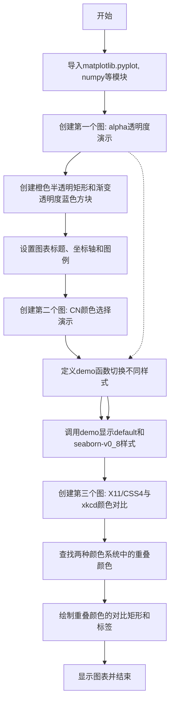

# `matplotlib\galleries\users_explain\colors\colors.py` 详细设计文档

这是一个Matplotlib颜色功能演示教程脚本，通过多个示例展示Matplotlib支持的各种颜色指定格式，包括RGB/RGBA、十六进制、灰度、单字符简写、X11/CSS4颜色名、xkcd颜色、Tableau颜色和'CN'颜色规范，同时演示了alpha透明度效果和不同颜色系统之间的差异。

## 整体流程



## 类结构

```
Python脚本 (无类定义)
├── 导入模块
│   ├── matplotlib.pyplot (plt)
│   ├── numpy (np)
│   ├── matplotlib.patches (Rectangle, mpatch)
│   ├── matplotlib.colors (mcolors)
│   └── matplotlib as mpl
└── 函数定义
    └── demo(sty) - 样式演示函数
```

## 全局变量及字段


### `fig`
    
matplotlib图形对象,表示整个图形窗口

类型：`matplotlib.figure.Figure`
    


### `ax`
    
matplotlib坐标轴对象,用于绘制图形元素

类型：`matplotlib.axes.Axes`
    


### `th`
    
numpy数组,0到2π的128个采样点,用于三角函数演示

类型：`numpy.ndarray`
    


### `overlap`
    
集合,存储X11/CSS4和xkcd共有的颜色名

类型：`set`
    


### `n_groups`
    
整数,分组数量(3),用于颜色对比展示的列分组

类型：`int`
    


### `n_rows`
    
整数,每组行数,根据重叠颜色数量计算得出

类型：`int`
    


### `color_name`
    
字符串循环变量,颜色名称,遍历共有颜色集合

类型：`str`
    


### `css4`
    
字符串,CSS4颜色值,对应颜色名称的十六进制表示

类型：`str`
    


### `xkcd`
    
字符串,xkcd颜色值,带有xkcd前缀的颜色名称对应值

类型：`str`
    


### `rgba`
    
numpy数组,RGBA颜色数组,存储CSS4和xkcd颜色的RGBA表示

类型：`numpy.ndarray`
    


### `luma`
    
numpy数组,亮度值,根据RGB计算 perceived luminance

类型：`numpy.ndarray`
    


### `css4_text_color`
    
字符串,CSS4文字颜色,根据亮度决定用黑色或白色

类型：`str`
    


### `xkcd_text_color`
    
字符串,xkcd文字颜色,根据亮度决定用黑色或白色

类型：`str`
    


### `col_shift`
    
整数,列偏移量,用于多列布局的位置计算

类型：`int`
    


### `y_pos`
    
整数,y轴位置,用于颜色块的垂直位置安排

类型：`int`
    


### `text_args`
    
字典,文本参数,包含字体大小和粗细等样式设置

类型：`dict`
    


### `alpha`
    
float,透明度值,控制图形元素的半透明度

类型：`float`
    


### `i`
    
整数,循环索引,用于遍历alpha值和创建颜色块

类型：`int`
    


    

## 全局函数及方法


### `demo(sty)`

该函数用于演示在不同 Matplotlib 样式（Style）下，颜色索引 `C1` 和 `C2` 的实际视觉效果。它接受一个样式名称作为参数，动态切换全局绘图风格，并绘制余弦和正弦曲线来对比展示颜色。

参数：

- `sty`：`str`，样式名称字符串，用于指定要应用的 Matplotlib 样式（如 'default', 'seaborn-v0_8' 等）。

返回值：`None`，该函数执行绘图操作，不返回任何数据。

#### 流程图

```mermaid
graph TD
    A([开始: demo调用]) --> B[应用样式: mpl.style.use(sty)]
    B --> C[创建画布: plt.subplots]
    C --> D[设置标题: ax.set_title]
    D --> E[绘制余弦曲线: ax.plot<br>数据: np.cos(th)<br>颜色: C1]
    E --> F[绘制正弦曲线: ax.plot<br>数据: np.sin(th)<br>颜色: C2]
    F --> G[添加图例: ax.legend]
    G --> H([结束])
```

#### 带注释源码

```python
def demo(sty):
    """
    演示不同样式的颜色使用
    
    参数:
        sty (str): 样式名称字符串
    """
    # 使用传入的样式名称 sty 设置 Matplotlib 的全局样式上下文
    mpl.style.use(sty)
    
    # 创建一个新的图形窗口和坐标轴，设定尺寸为 3x3 英寸
    fig, ax = plt.subplots(figsize=(3, 3))

    # 设置图表标题，颜色使用 'C0'（当前样式配色方案中的第一种颜色）
    ax.set_title(f'style: {sty!r}', color='C0')

    # 绘制余弦曲线
    # 参数: x轴数据, y轴数据, 颜色('C1'为样式配色方案中的第二种颜色), 曲线标签
    ax.plot(th, np.cos(th), 'C1', label='C1')
    
    # 绘制正弦曲线
    # 参数: x轴数据, y轴数据, 颜色('C2'为样式配色方案中的第三种颜色), 曲线标签
    ax.plot(th, np.sin(th), 'C2', label='C2')
    
    # 在坐标轴上显示图例，以便区分 C1 和 C2 对应的曲线
    ax.legend()
```

## 关键组件


### 颜色格式解析与转换

Matplotlib支持多种颜色格式的解析与转换，包括RGB/RGBA元组、十六进制字符串、灰度浮点值、单字符简写、X11/CSS4颜色名、xkcd颜色、Tableau颜色和"CN"颜色规格。

### Alpha透明度处理

通过alpha参数控制颜色透明度，支持0-1闭区间的浮点值，实现前景色与背景色的线性混合计算。

### 颜色循环（Prop Cycle）机制

通过"CN"颜色规格（如'C0'、'C1'）实现对默认属性循环的索引访问，颜色索引在绘制时解析，若循环未包含颜色则默认黑色。

### X11/CSS4与xkcd颜色命名系统

包含两套独立的颜色命名系统：X11/CSS4标准颜色和xkcd颜色调查中的颜色（需'xkcd:'前缀）。95个颜色名称重叠但数值不同，仅'black'、'white'、'cyan'完全一致。

### 感知亮度计算

基于sRGB亮度公式（0.299*R + 0.587*G + 0.114*B）计算颜色亮度，用于自动选择对比色文本（黑/白）以确保可读性。

### Z-Order图层控制

通过zorder参数控制绘制顺序，决定图形元素的前后覆盖关系。

### 样式主题管理

通过`mpl.style.use()`切换不同样式主题（如'default'、'seaborn-v0_8'），每个主题拥有独立的颜色循环配置。


## 问题及建议


### 已知问题

- 重复导入模块：代码在多个位置重复导入了 `matplotlib.pyplot` 和 `numpy`，第一次在文件开头，第二次在 `"CN" color selection` 部分之前，降低了代码可维护性
- 全局状态修改：`demo` 函数中使用 `mpl.style.use(sty)` 修改全局样式，可能影响后续代码执行，且在非交互环境中可能导致异常
- 缺少错误处理：没有对 `mpl.style.use()` 可能抛出的异常进行处理，也没有对 `sorted(overlap)` 可能为空的情况进行处理
- 魔法数字遍布：代码中包含大量硬编码的数值（如 `0.8`、`0.6`、`0.05`、`3`、`11.2` 等），缺乏可配置性
- 函数缺少文档：`demo` 函数没有任何文档字符串或类型注解，降低了代码可读性和可维护性
- 资源管理不当：使用 `plt.subplots()` 和 `plt.figure()` 创建图形后没有显式关闭，可能导致资源泄漏

### 优化建议

- 将所有导入语句统一到文件顶部，使用单一 import 块
- 使用 `with` 语句或显式关闭图形对象来管理资源
- 提取重复的图形创建逻辑为可复用的函数或类
- 为 `demo` 函数添加文档字符串和类型提示
- 将魔法数字提取为具名常量或配置参数
- 添加异常处理机制，特别是在使用外部样式和颜色查找时
- 考虑使用 context manager 管理样式变化，确保样式在使用后恢复

## 其它


### 设计目标与约束

该模块旨在为Matplotlib提供灵活、统一的颜色规范解析能力，支持多种输入格式（RGB、RGBA、十六进制、灰度、字符简写、X11/CSS4颜色名、xkcd颜色、Tableau颜色、"CN"颜色等），同时保持向后兼容性和一致性。设计约束包括：颜色值必须在有效范围内（0-1或相应格式），字符串解析需大小写不敏感，性能需满足实时绘图需求。

### 错误处理与异常设计

当传入无效颜色值时，应抛出清晰的ValueError异常，指示具体的格式错误。无效的十六进制字符串应提示正确的格式要求；超出范围的值应指明有效区间；不支持的颜色名称应建议使用有效的颜色标识符。颜色解析失败时应保留原始错误信息以便调试。

### 数据流与状态机

颜色解析流程为：输入字符串/值 → 格式检测 → 类型转换 → 范围验证 → RGBA归一化输出。状态机包含：初始状态、格式识别状态、解析中状态、验证状态、转换完成状态。对于"CN"颜色，需额外访问当前样式周期的属性映射。

### 外部依赖与接口契约

主要依赖matplotlib.colors模块的ColorConverter和to_rgba系列函数。与matplotlibrc配置交互获取默认颜色周期（axes.prop_cycle）。对外提供is_color_like()、to_rgba()、to_rgba_array()等标准API。TableColors、CSS4_COLORS、XKCD_COLORS等常量字典提供颜色名称到值的映射。

### 性能考量

颜色解析在每次绘图调用中可能执行多次，需优化常用格式（"CN"、单字符）的解析路径。颜色名称查找使用字典实现O(1)复杂度。避免在解析过程中创建不必要的临时对象。对于批量颜色转换，提供向量化接口to_rgba_array()。

### 安全性考虑

颜色输入应防止注入攻击，虽然颜色值不直接执行代码，但应验证输入类型避免拒绝服务。十六进制颜色解析需限制字符串长度防止过度内存分配。颜色名称查询需防止通过超长字符串耗尽资源。

### 版本历史和兼容性

3.1版本引入"CN"颜色支持；3.7版本增强xkcd颜色支持；3.8版本新增带alpha值的元组格式('green', 0.3)。不同版本间颜色名称可能映射到不同RGB值（特别是xkcd与CSS4的差异），文档中已明确说明。

### 测试策略

应覆盖所有颜色格式的正确解析，验证边界条件（0、1、边界值），确保无效输入正确抛出异常，验证"CN"颜色与样式周期的交互，测试透明度混合效果，验证颜色名称的大小写不敏感性。

### 配置选项

可通过matplotlib.rcParams修改axes.prop_cycle改变默认颜色周期，可通过plt.style.use()切换不同样式的颜色集，颜色解析行为本身无直接配置选项但受全局样式影响。

### 使用示例和最佳实践

推荐使用有意义的颜色名称（如'tab:blue'、'C0'）而非硬编码RGB值；处理透明度时注意背景色的影响；在同一图表中使用一致的色彩方案；利用"CN"颜色简化默认周期中的颜色引用。

    