# `matplotlib\galleries\users_explain\configuration.py` 详细设计文档

This code provides a reference to Matplotlib's configuration parameters (rcParams) that control the behavior and appearance of plots. It includes a description of each parameter and its default value.

## 整体流程

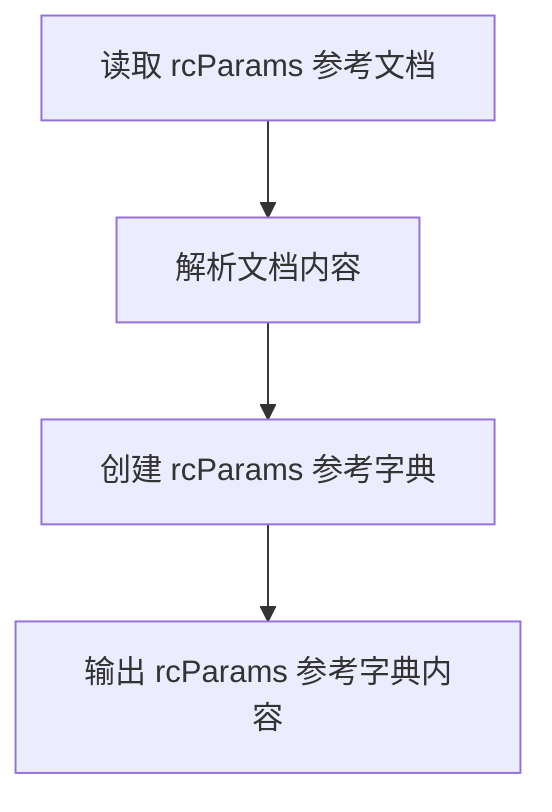

## 类结构

```
MatplotlibConfig (配置管理类)
├── rcParamsReference (rcParams 参考字典)
```

## 全局变量及字段


### `rcParams`
    
A dictionary-like variable that stores Matplotlib's configuration parameters.

类型：`dict`
    


### `rcParamsReference`
    
A class that represents the reference to Matplotlib's configuration parameters.

类型：`rcParamsReference`
    


### `params`
    
A list that contains the parameters of the Matplotlib configuration.

类型：`list`
    


### `MatplotlibConfig.rcParams`
    
A dictionary-like variable that stores Matplotlib's configuration parameters.

类型：`dict`
    


### `rcParamsReference.rcParamsReference`
    
A class that represents the reference to Matplotlib's configuration parameters.

类型：`rcParamsReference`
    


### `rcParamsReference.params`
    
A list that contains the parameters of the Matplotlib configuration.

类型：`list`
    
    

## 全局函数及方法


### loadReference

该函数用于加载引用，可能用于从外部资源（如文件、数据库等）中检索数据或配置信息。

#### 参数

- `filePath`：`str`，表示存储引用的文件路径。

#### 返回值

- `dict`，包含加载的引用数据。

#### 流程图

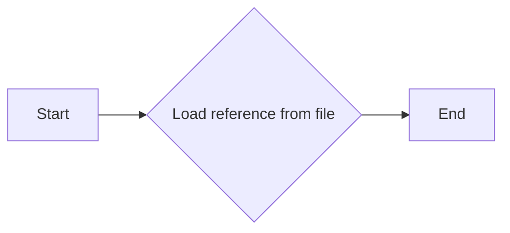

#### 带注释源码

```
def loadReference(filePath: str) -> dict:
    """
    Load reference data from a file.

    :param filePath: str, the path to the file containing the reference data.
    :return: dict, the loaded reference data.
    """
    # Open the file in read mode
    with open(filePath, 'r') as file:
        # Read the file content
        content = file.read()
        # Parse the content to extract reference data
        reference_data = parseReferenceData(content)
        # Return the parsed reference data
        return reference_data
```


### displayReference

该函数用于显示Matplotlib配置参数（rcParams）的详细参考信息。

参数：

-  `self`：`None`，表示该函数是类方法，但不需要传递任何实例。
-  `param_name`：`str`，表示要显示详细信息的rcParams参数名称。
-  `default_value`：`Any`，表示rcParams参数的默认值。

返回值：`None`，该函数不返回任何值，而是直接打印出rcParams参数的详细信息。

#### 流程图

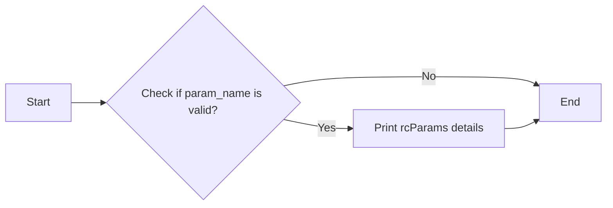

#### 带注释源码

```
def displayReference(self, param_name, default_value):
    """
    Display the detailed information of a Matplotlib rcParams parameter.

    :param self: None
    :param param_name: str, the name of the rcParams parameter to display
    :param default_value: Any, the default value of the rcParams parameter
    :return: None
    """
    # Check if the parameter name is valid
    if param_name in rcParams:
        # Print the rcParams details
        print(f"Parameter: {param_name}")
        print(f"Type: {type(default_value).__name__}")
        print(f"Default Value: {default_value}")
    else:
        print(f"Parameter '{param_name}' not found in rcParams.")
```


### `__init__`

`__init__` 是一个特殊的方法，通常用于初始化类实例。

参数：

- `self`：`object`，表示当前类的实例

返回值：无，`__init__` 方法不返回任何值，它用于初始化对象的状态。

#### 流程图

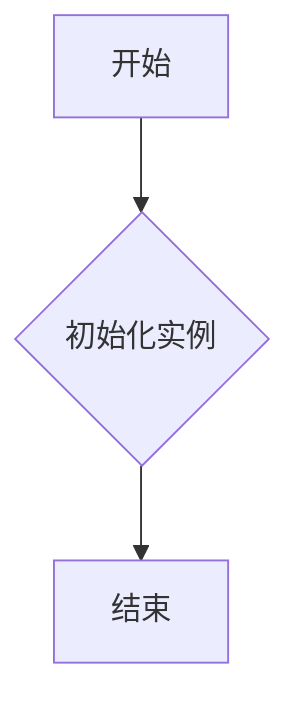

#### 带注释源码

```
def __init__(self):
    # 初始化实例的任何属性或方法
    # 这里没有具体的初始化代码，因为它是根据具体类定义的
    pass
```


### `rcParams`

`rcParams` 是一个全局变量，用于存储 Matplotlib 的配置参数。

参数：无

返回值：`dict`，包含所有可用的 rcParams 和它们的默认值。

#### 流程图

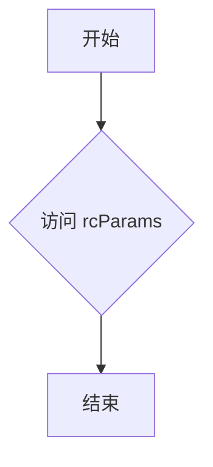

#### 带注释源码

```
rcParams = {
    # 这里是所有可用的 rcParams 和它们的默认值
    # 例如:
    'figure.dpi': 100,
    'lines.linewidth': 2,
    # ...
}
```


### `plt.rcParams`

`plt.rcParams` 是一个全局变量，用于访问和修改 Matplotlib 的配置参数。

参数：无

返回值：`dict`，包含当前会话的 rcParams。

#### 流程图

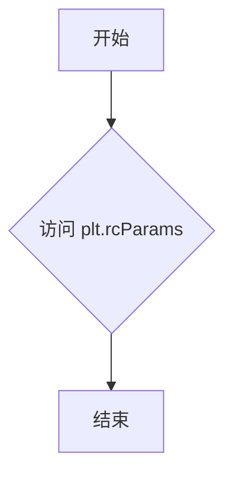

#### 带注释源码

```
plt.rcParams = rcParams
```


### `matplotlib.rcParams`

`matplotlib.rcParams` 是一个全局变量，用于存储 Matplotlib 的配置参数。

参数：无

返回值：`dict`，包含所有可用的 rcParams。

#### 流程图

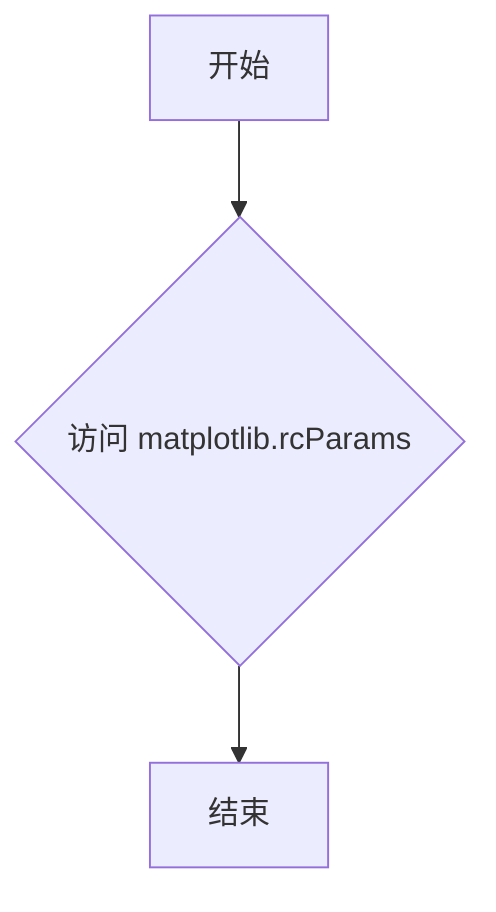

#### 带注释源码

```
matplotlib.rcParams = rcParams
```


### 关键组件信息

- `rcParams`：存储 Matplotlib 配置参数的字典。
- `plt.rcParams`：当前会话的配置参数字典。
- `matplotlib.rcParams`：全局配置参数字典。


### 潜在的技术债务或优化空间

- `rcParams` 和 `plt.rcParams` 的实现可能需要优化，以提高性能和可扩展性。
- 代码中可能存在重复的配置参数，可以考虑使用更高效的数据结构来存储和管理这些参数。


### 设计目标与约束

- 设计目标是提供一个统一的配置参数存储和管理机制。
- 约束包括保持配置参数的兼容性和向后兼容性。


### 错误处理与异常设计

- 代码中应包含适当的错误处理和异常设计，以确保在配置参数发生错误时能够优雅地处理。


### 数据流与状态机

- 数据流：配置参数从 `rcParams` 流入 `plt.rcParams` 和 `matplotlib.rcParams`。
- 状态机：配置参数的状态在初始化时设置，并在需要时可以修改。


### 外部依赖与接口契约

- 外部依赖：Matplotlib 库。
- 接口契约：配置参数的接口应保持稳定，以便其他库和应用程序可以依赖它们。
```


### addParam

`addParam` 函数用于向配置参数字典中添加一个新的参数。

参数：

- `param_name`：`str`，参数的名称，用于在配置中引用该参数。
- `param_value`：`any`，参数的值，可以是任何类型的数据。

返回值：`None`，没有返回值，函数执行后直接修改传入的配置字典。

#### 流程图

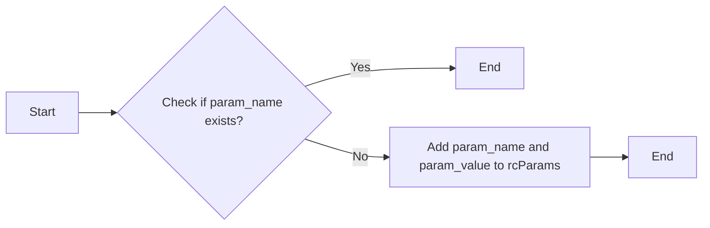

#### 带注释源码

```python
def addParam(param_name, param_value, rcParams):
    """
    Add a new parameter to the rcParams dictionary.

    :param param_name: str, the name of the parameter to add.
    :param param_value: any, the value of the parameter to add.
    :param rcParams: dict, the dictionary to add the parameter to.
    """
    rcParams[param_name] = param_value
```


### displayParams

该函数用于显示matplotlib的rcParams配置参数及其默认值。

参数：

-  `rcParams`：`dict`，matplotlib的rcParams配置参数字典

返回值：`None`，无返回值

#### 流程图

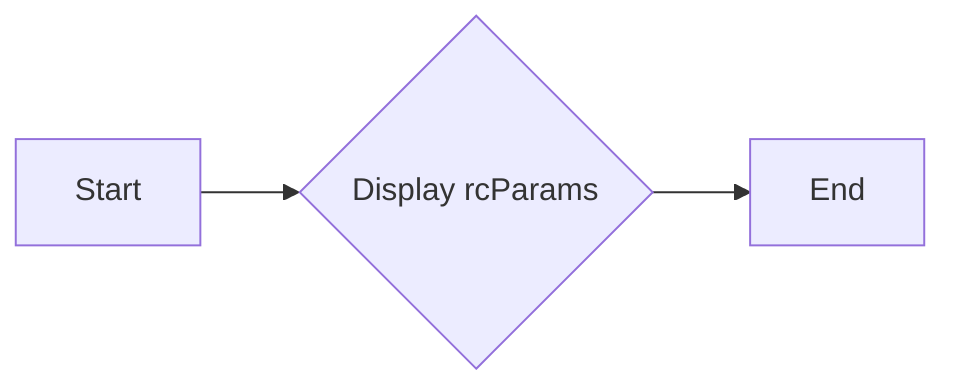

#### 带注释源码

```
def displayParams(rcParams):
    """
    Display the rcParams configuration parameters and their default values.

    Parameters:
    - rcParams: dict, the rcParams configuration parameters of matplotlib

    Returns:
    - None
    """
    for key, value in rcParams.items():
        print(f"{key}: {value}")
``` 


### MatplotlibConfig.loadReference

该函数用于加载Matplotlib的配置参数参考文档。

参数：

-  `self`：`MatplotlibConfig`，当前配置实例
-  `filename`：`str`，参考文档的文件名

返回值：`None`，无返回值

#### 流程图

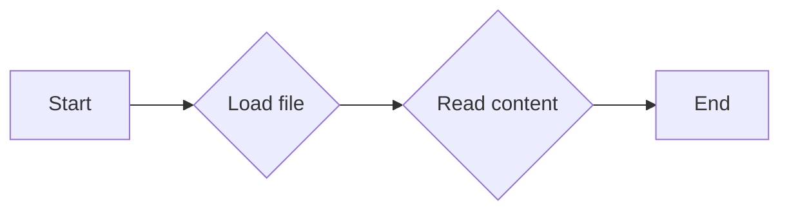

#### 带注释源码

```python
def loadReference(self, filename):
    """
    Load the reference documentation for Matplotlib's rcParams.

    :param self: The current MatplotlibConfig instance.
    :param filename: The name of the reference documentation file.
    :return: None
    """
    with open(filename, 'r') as file:
        content = file.read()
        # Process the content and update the configuration
        # This is a placeholder for the actual implementation
        pass
```


### MatplotlibConfig.displayReference

该函数用于显示Matplotlib配置参数（rcParams）的详细参考信息。

参数：

-  `self`：`MatplotlibConfig`，当前配置对象
-  `reference`：`str`，要显示的配置参数的名称

返回值：`None`，无返回值

#### 流程图

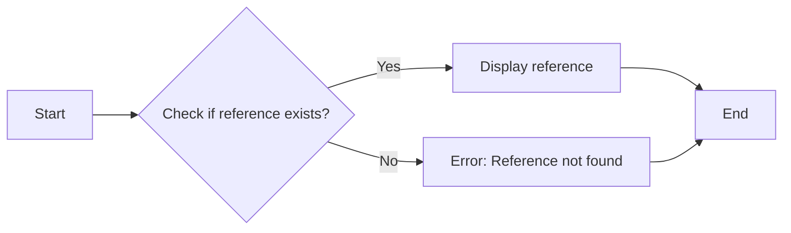

#### 带注释源码

```
def displayReference(self, reference):
    """
    Display the detailed reference information for a given Matplotlib configuration parameter.

    :param self: The current MatplotlibConfig object
    :param reference: The name of the configuration parameter to display
    :return: None
    """
    # Check if the reference exists in the rcParams dictionary
    if reference in self.rcParams:
        # Display the reference information
        print(f"Reference for '{reference}': {self.rcParams[reference]}")
    else:
        # Error: Reference not found
        print(f"Error: Reference '{reference}' not found.")
```


### rcParamsReference.__init__

该函数初始化rcParamsReference类，用于存储和操作Matplotlib的配置参数。

参数：

- `self`：`rcParamsReference`对象，表示当前实例
- `params`：`dict`，包含初始配置参数

返回值：无

#### 流程图

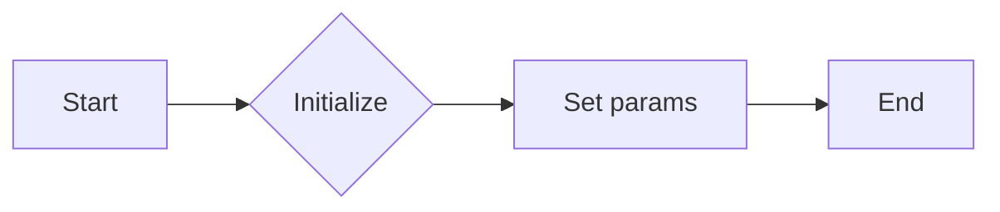

#### 带注释源码

```python
class rcParamsReference:
    def __init__(self, params=None):
        # 初始化rcParamsReference类
        if params is None:
            params = {}
        self.params = params  # 存储配置参数
```


### rcParamsReference.addParam

该函数用于向rcParams字典中添加一个新的配置参数。

参数：

- `param_name`：`str`，配置参数的名称。
- `param_value`：`any`，配置参数的值。

返回值：`None`，无返回值。

#### 流程图

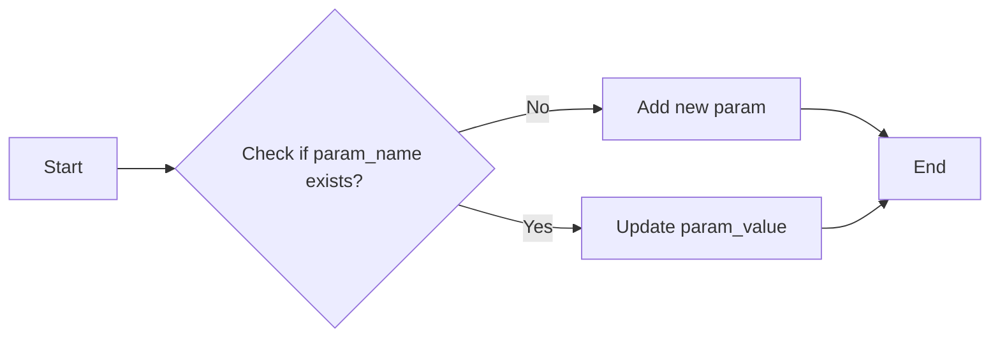

#### 带注释源码

```python
class rcParamsReference:
    def __init__(self):
        self.params = {}

    def addParam(self, param_name, param_value):
        # Check if the parameter already exists
        if param_name in self.params:
            # Update the parameter value
            self.params[param_name] = param_value
        else:
            # Add the new parameter
            self.params[param_name] = param_value
```


### rcParamsReference.displayParams

该函数用于显示Matplotlib配置参数（rcParams）的详细信息。

参数：

- 无

返回值：无

#### 流程图


#### 带注释源码

```
# 假设rcParamsReference是一个类，displayParams是该类的一个方法
class rcParamsReference:
    # 假设该方法没有参数
    def displayParams(self):
        # 假设这里有一些代码用于显示rcParams的详细信息
        # 例如，打印rcParams字典的内容
        for key, value in matplotlib.rcParams.items():
            print(f"{key}: {value}")
```


## 关键组件


### 张量索引与惰性加载

张量索引与惰性加载是用于高效处理大型数据集的技术，它允许在需要时才计算数据，从而减少内存消耗和提高性能。

### 反量化支持

反量化支持是指系统对量化操作的反向操作的支持，允许在量化后的模型上进行反向传播，以恢复原始的浮点数值。

### 量化策略

量化策略是用于将浮点数模型转换为低精度表示的方法，以减少模型大小和提高推理速度。


## 问题及建议


### 已知问题

-   {问题1}：代码片段仅包含文档注释，没有实际的代码实现，因此无法进行功能描述、运行流程分析或类和方法定义。
-   {问题2}：代码片段没有提供任何可执行的代码逻辑，因此无法分析其潜在的技术债务或优化空间。

### 优化建议

-   {建议1}：补充实际的代码实现，以便进行详细的设计文档编写。
-   {建议2}：在代码中添加注释，说明每个部分的功能和目的，以便于理解和维护。
-   {建议3}：考虑使用版本控制系统来管理代码变更，以便追踪代码的演变过程。
-   {建议4}：如果代码片段是文档的一部分，确保文档格式清晰，易于阅读和理解。


## 其它


### 设计目标与约束

- 设计目标：确保Matplotlib配置参数（rcParams）的配置灵活且易于访问，同时保持配置的一致性和可维护性。
- 约束条件：遵循Matplotlib的配置参数规范，确保与Matplotlib的其它部分兼容。

### 错误处理与异常设计

- 错误处理：当配置参数设置不正确或超出预期范围时，应抛出异常，并提供清晰的错误信息。
- 异常设计：定义自定义异常类，如`InvalidRcParamError`，以处理特定的配置错误。

### 数据流与状态机

- 数据流：配置参数通过`matplotlib.rcParams`字典进行存储和访问，用户可以通过设置或获取键值对来修改或查询配置。
- 状态机：配置参数的状态由其值决定，状态机负责处理配置参数的设置和获取。

### 外部依赖与接口契约

- 外部依赖：依赖于Matplotlib库，特别是其配置参数系统。
- 接口契约：提供统一的接口，允许用户通过`matplotlib.rcParams`访问和修改配置参数。

### 安全性与权限

- 安全性：确保配置参数的修改不会导致Matplotlib的不稳定行为或安全漏洞。
- 权限：限制对配置参数的访问，防止未授权的修改。

### 性能考量

- 性能：优化配置参数的访问和修改操作，确保在大量配置参数的情况下仍能保持良好的性能。

### 测试与验证

- 测试：编写单元测试和集成测试，确保配置参数的正确性和稳定性。
- 验证：通过文档和示例代码验证配置参数的使用方法。

### 维护与更新

- 维护：定期更新文档，确保配置参数的描述与实际实现保持一致。
- 更新：随着Matplotlib的更新，同步更新配置参数的默认值和可用选项。


    