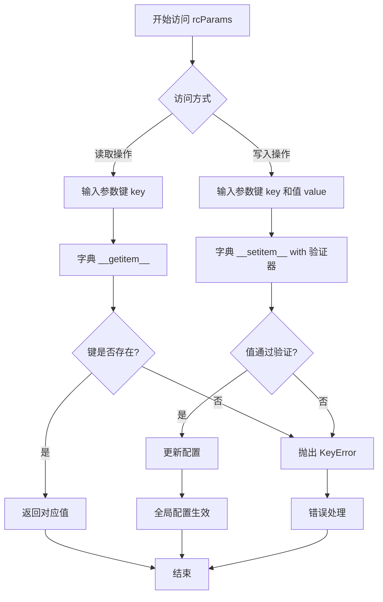
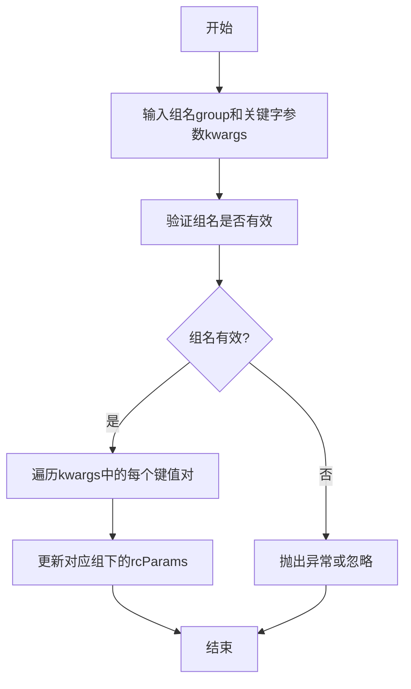
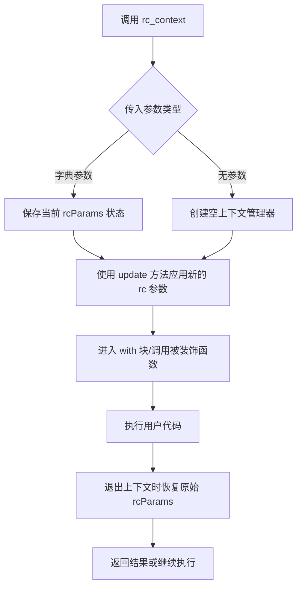
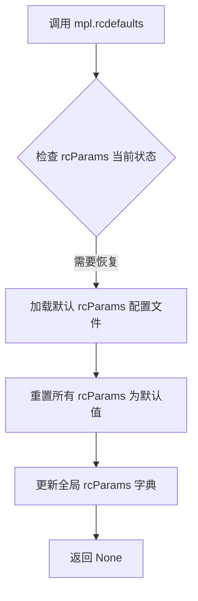
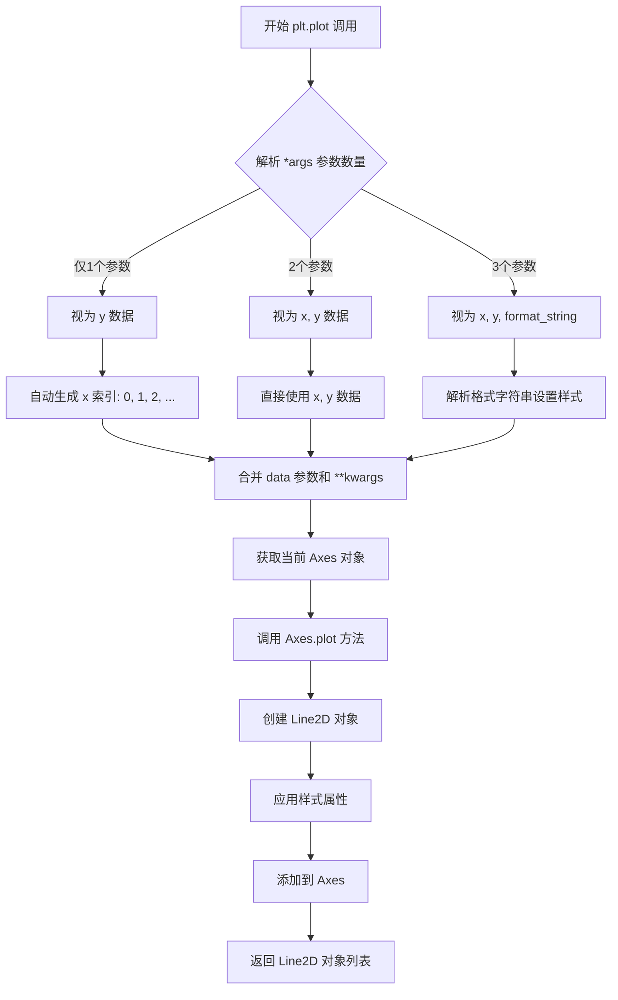
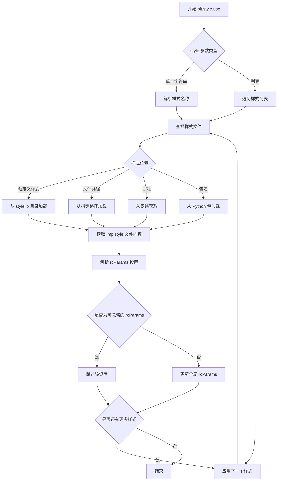
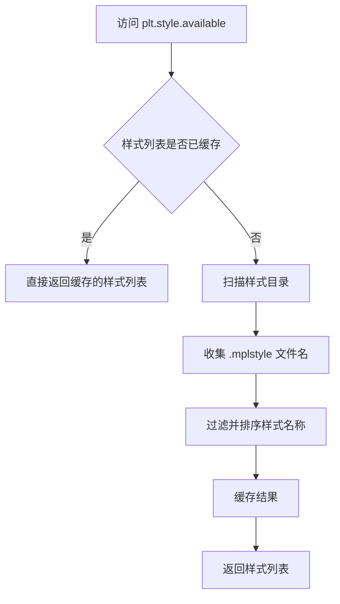
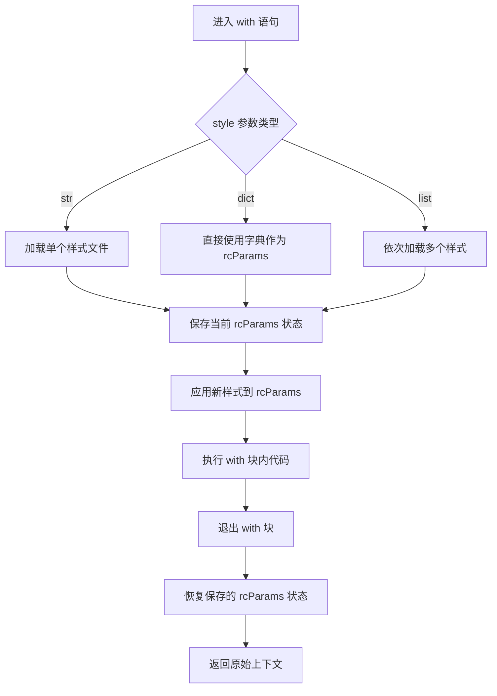
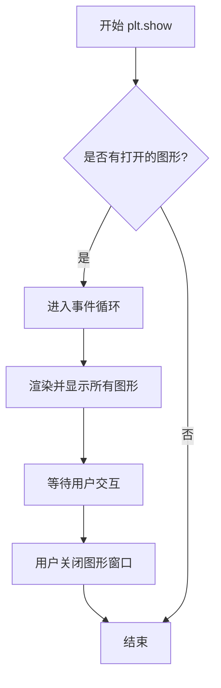
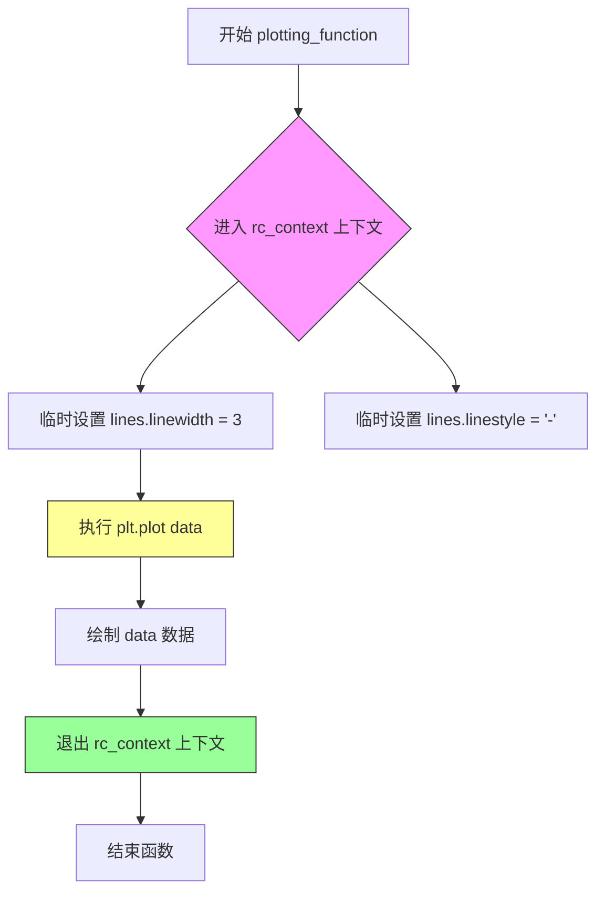

# `matplotlib\galleries\users_explain\customizing.py` 详细设计文档

这是一个 Matplotlib 教程脚本，演示了如何通过运行时配置 (rcParams)、样式表 (Style Sheets) 和 matplotlibrc 文件来自定义图表的视觉外观，包括全局设置、临时上下文修改以及样式的叠加应用。

## 整体流程

```mermaid
graph TD
    Start[导入库] --> InitData[生成随机数据 data = np.random.randn(50)]
    InitData --> GlobalConfig1[全局修改: mpl.rcParams 修改 lines 属性]
    GlobalConfig1 --> Plot1[plt.plot(data) 绘制第一张图]
    Plot1 --> GlobalConfig2[全局修改: mpl.rcParams 修改 axes.prop_cycle]
    GlobalConfig2 --> GlobalConfig3[全局修改: mpl.rc('lines', ...) 批量修改]
    GlobalConfig3 --> ContextMgr[使用 mpl.rc_context 临时修改 (上下文管理器)]
    ContextMgr --> Decorator[使用 @mpl.rc_context 装饰器修改函数]
    ContextMgr --> StyleUse[使用 plt.style.use('ggplot') 加载样式表]
    StyleUse --> StyleList[打印 plt.style.available 可用样式]
    StyleList --> StyleContext[使用 plt.style.context 临时样式]
    StyleContext --> FinalPlot[plt.plot 绘制最终图形]
    FinalPlot --> End[plt.show() 显示图像]
```

## 类结构

```
平铺脚本结构 (Flat Script)
└── 无用户自定义类 (No User-Defined Classes)
└── 主要逻辑流程: 导入 -> 全局配置 -> 上下文配置 -> 样式表配置 -> 绘图
```

## 全局变量及字段


### `data`
    
存储随机生成的50个数据点，用于绘图

类型：`numpy.ndarray`
    


    

## 全局函数及方法


# mpl.rcParams 详细设计文档

## 1. 一段话描述

`mpl.rcParams` 是 matplotlib 库的全局运行时配置字典，用于存储和管理 Matplotlib 的所有可配置参数（如线条宽度、颜色、字体、轴属性等），允许用户在运行时动态修改这些设置以自定义图表的外观和行为。

## 2. 文件的整体运行流程

该代码文件是一个文档示例文件（docstring），展示了如何使用 `mpl.rcParams` 进行 Matplotlib 运行时配置。实际功能由 matplotlib 库内部实现。

## 3. 类的详细信息

由于 `rcParams` 不是一个类，而是一个字典对象（`RcParams` 类实例），以下提供全局变量信息：

### 全局变量

| 名称 | 类型 | 描述 |
|------|------|------|
| `mpl.rcParams` | `matplotlib.RcParams` (dict subclass) | 全局运行配置字典，存储所有可配置的 rc 参数 |
| `mpl` | `matplotlib` | matplotlib 主模块导入别名 |
| `plt` | `matplotlib.pyplot` | pyplot 子模块导入别名 |
| `np` | `numpy` | numpy 模块导入别名 |

### 关键函数/方法

由于 `rcParams` 是字典子类，它支持所有标准字典操作：

| 名称 | 参数 | 返回值 | 描述 |
|------|------|--------|------|
| `__getitem__(key)` | `key: str` | `Any` | 根据键获取 rc 参数值 |
| `__setitem__(key, value)` | `key: str, value: Any` | `None` | 设置 rc 参数值 |
| `__contains__(key)` | `key: str` | `bool` | 检查是否存在某个 rc 参数 |

## 4. mpl.rcParams 访问和修改

### 名称

`mpl.rcParams`

### 参数

此为字典对象，非函数/方法，参数为字典访问语法：

- `key`：字符串类型，对应 rc 参数名称（如 `'lines.linewidth'`）

### 返回值

- 返回类型取决于所访问的 rc 参数类型
- 设置操作无返回值

### 流程图



### 带注释源码

```python
# 导入 matplotlib 并使用别名 mpl
import matplotlib as mpl

# ============================================================
# 方式一：直接访问和修改 rcParams（字典语法）
# ============================================================

# 读取操作：获取当前线条宽度配置
line_width = mpl.rcParams['lines.linewidth']  # 返回 float 类型，默认约 1.5

# 写入操作：设置线条宽度为 2
mpl.rcParams['lines.linewidth'] = 2  # 无返回值，直接修改全局配置

# 设置线条样式为虚线
mpl.rcParams['lines.linestyle'] = '--'

# 设置复杂的属性循环（如颜色）
from cycler import cycler
mpl.rcParams['axes.prop_cycle'] = cycler(color=['r', 'g', 'b', 'y'])

# ============================================================
# 方式二：使用 rc() 批量修改同一组参数
# ============================================================

# 同时修改 lines 组的多个参数
mpl.rc('lines', linewidth=4, linestyle='-.')
# 相当于：
# mpl.rcParams['lines.linewidth'] = 4
# mpl.rcParams['lines.linestyle'] = '-.'

# ============================================================
# 方式三：使用 rc_context 临时修改（上下文管理器）
# ============================================================

# 在 with 块内临时修改，块外恢复原状
with mpl.rc_context({'lines.linewidth': 2, 'lines.linestyle': ':'}):
    # 在此上下文中，lines.linewidth 为 2
    plt.plot(data)

# 块外自动恢复原来的值

# ============================================================
# 方式四：使用装饰器方式临时修改
# ============================================================

@mpl.rc_context({'lines.linewidth': 3, 'lines.linestyle': '-'})
def plotting_function():
    """在函数执行期间临时应用 rc 设置"""
    plt.plot(data)

# ============================================================
# 方式五：恢复默认设置
# ============================================================

mpl.rcdefaults()  # 恢复所有 rcParams 到安装默认值
```

## 5. 关键组件信息

| 组件名称 | 一句话描述 |
|----------|------------|
| `rcParams` | 全局配置字典，存储所有可自定义的运行时参数 |
| `rc_context` | 上下文管理器，用于临时修改配置并在退出时恢复 |
| `rcdefaults()` | 函数，将所有配置恢复到默认状态 |
| `rc(group, **kwargs)` | 函数，批量修改指定组的多个参数 |

## 6. 潜在的技术债务或优化空间

1. **配置验证开销**：每次修改 rcParams 时都会进行验证，可能影响性能
2. **嵌套字典访问语法**：`rcParams['axes.prop_cycle']` 使用点分隔的字符串，不如 `rcParams.axes.prop_cycle` 直观
3. **类型安全**：配置值类型没有静态类型检查，运行时错误可能不易发现
4. **文档同步**：需要确保在线文档与实际默认值保持同步

## 7. 其它项目

### 设计目标与约束

- **目标**：提供灵活的运行时配置机制，允许用户自定义 Matplotlib 的所有视觉外观
- **约束**：某些关键参数（如 backend）必须在导入前设置

### 错误处理与异常设计

- **KeyError**：访问不存在的 rc 参数时抛出
- **ValueError**：设置的值通过验证器时抛出
- **RuntimeError**：在某些上下文中修改受保护参数时抛出

### 数据流与状态机

```
用户代码
    │
    ▼
rcParams 字典访问
    │
    ├──▶ 验证器 (rcsetup.validate_xxx)
    │
    ▼
全局配置状态更新
    │
    ▼
影响后续所有 plt.plot() 等绘图调用
```

### 外部依赖与接口契约

- **依赖**：`matplotlib.rcsetup` - 提供验证函数
- **依赖**：`cycler` - 用于属性循环配置
- **接口**：字典接口（`__getitem__`, `__setitem__`, `keys()`, `values()` 等）


### mpl.rc

该函数用于批量修改指定组的运行配置（rcParams）。通过传入组名和关键字参数，可以一次性修改该组下的多个配置项，从而动态调整 Matplotlib 的绘图样式。

参数：
- `group`：字符串，表示配置组名称（如 'lines', 'axes', 'font' 等）。
- `**kwargs`：关键字参数，表示要修改的具体配置项和值，每个关键字对应一个 rcParam。

返回值：无返回值（None）。

#### 流程图



#### 带注释源码

基于提供的代码中 `mpl.rc` 的使用示例：

```python
# 示例代码：修改 'lines' 组的配置
mpl.rc('lines', linewidth=4, linestyle='-.')

# 参数说明：
# 第一个参数 'lines'：指定要修改的配置组（Group），对应 rcParams 中的 'lines' 分组
# 后续参数：使用关键字参数形式，指定该组下具体要修改的 rcParams
#   - linewidth=4：设置线条宽度为 4
#   - linestyle='-.'：设置线条样式为点划线

# 该函数调用后，会直接修改全局的 rcParams，从而影响后续的绘图样式
# 例如，之后绘制的线条将使用宽度为 4 的点划线样式
```


# mpl.rc_context 详细设计文档

### `mpl.rc_context`

用于临时修改 Matplotlib 运行配置（rcParams）的上下文管理器，允许在特定代码块内更改配置而不影响全局设置。

## 参数：

- `rc`：字典类型，一个包含要临时修改的 rc 参数的字典（例如 `{'lines.linewidth': 2, 'lines.linestyle': ':'}`）

## 返回值：

- 返回一个上下文管理器对象，该对象在进入上下文时应用指定的 rc 参数，在退出上下文时恢复原始参数

## 流程图



## 带注释源码

```python
# 注：以下为基于文档和使用示例的推断实现
# 实际实现位于 matplotlib 库的核心代码中

from contextlib import contextmanager
import matplotlib as mpl

@contextmanager
def rc_context(rc=None):
    """
    用于临时修改 Matplotlib rc 参数的上下文管理器。
    
    参数:
        rc: 字典，包含要临时应用的 rc 参数
             例如: {'lines.linewidth': 2, 'lines.linestyle': ':'}
    """
    # 获取当前 rcParams 的副本用于恢复
    original_rc = mpl.rcParams.copy()
    
    try:
        # 如果传入了参数，则更新 rcParams
        if rc is not None:
            mpl.rcParams.update(rc)
        
        # 执行上下文中的代码
        yield mpl.rcParams
        
    finally:
        # 无论是否发生异常，都恢复原始的 rc 参数
        mpl.rcParams.update(original_rc)

# 使用示例（来自文档）：
# 1. 作为上下文管理器使用
with mpl.rc_context({'lines.linewidth': 2, 'lines.linestyle': ':'}):
    plt.plot(data)  # 此处使用临时配置

# 2. 作为装饰器使用
@mpl.rc_context({'lines.linewidth': 3, 'lines.linestyle': '-'})
def plotting_function():
    plt.plot(data)  # 此函数内使用临时配置
```

---

### 备注

由于提供的代码是文档教程示例，实际的 `rc_context` 实现位于 Matplotlib 库的核心模块中（如 `matplotlib/__init__.py` 或相关配置模块）。上面的源码是基于其使用方式和 Python 上下文管理器的标准模式推断的。


### mpl.rcdefaults

恢复 Matplotlib 的运行时配置 (rcParams) 到标准默认设置。当用户需要撤销之前的自定义配置，恢复到 Matplotlib 的初始状态时，可以使用此函数。

参数：此函数无参数。

返回值：`None`，该函数直接修改全局的 `matplotlib.rcParams` 字典，不返回任何值。

#### 流程图



#### 带注释源码

基于文档描述的推测实现（实际代码需查看 matplotlib 源码）：

```python
def rcdefaults():
    """
    Restore the standard Matplotlib default settings.
    
    This function resets all rcParams to their default values that were
    loaded at Matplotlib initialization time. It effectively undoes any
    runtime customizations made via:
    - Direct modification of mpl.rcParams
    - Calls to mpl.rc()
    - Usage of style sheets via plt.style.use()
    - Context manager mpl.rc_context
    
    After calling this function, matplotlib will behave as if it was
    freshly imported.
    
    See Also
    --------
    matplotlib.rcParams : The global dictionary of runtime configuration.
    matplotlib.rc : Modify multiple rc settings at once.
    matplotlib.rc_context : Temporarily modify rc settings.
    """
    # 加载默认的 rcParams 配置
    # 通常从 matplotlibrc 文件或内部默认值获取
    default_params = _load_default_rcparams()
    
    # 清除当前所有的自定义设置
    rcParams.clear()
    
    # 用默认值更新 rcParams
    rcParams.update(default_params)
    
    # 通知所有已存在的 rcParams 监听器配置已更改
    _notify_rc_changed()
```

**注意**：提供的代码为文档文件，未包含 `mpl.rcdefaults` 的具体实现代码。上述源码为基于文档描述的合理推测。实际实现可能位于 matplotlib 包的核心模块中，建议查阅 `matplotlib/__init__.py` 或相关模块获取准确源码。


### `plt.plot`

绑定数据到坐标轴并绘制线条。`plt.plot` 是 Matplotlib 中最核心的绘图函数之一，用于将数据以线条形式绘制到当前坐标轴上，支持多种输入格式和丰富的样式定制选项。

参数：

- `*args`：`可变参数`，支持多种输入形式：
  - `y`：仅提供 y 轴数据，x 轴自动生成 0, 1, 2, ...
  - `x, y`：分别提供 x 轴和 y 轴数据
  - `x, y, format_string`：x 轴、y 轴数据和格式字符串（如 'ro' 表示红色圆圈）
- `data`：`dict` 或类似索引对象，可通过字符串键访问数据源中的变量
- `**kwargs`：`关键字参数`，支持大量 Line2D 属性，如 `color`（颜色）、`linewidth`（线宽）、`linestyle`（线型）、`marker`（标记）、`label`（图例标签）等

返回值：`list[matplotlib.lines.Line2D]`，返回创建的 Line2D 对象列表，每个对象对应一条绘制的线条

#### 流程图



#### 带注释源码

```python
# plt.plot 的源码位于 matplotlib.pyplot 模块中
# 这是一个模块级函数，实际实现委托给 Axes 对象

# 调用示例 1: 仅提供 y 数据
data = np.random.randn(50)
line = plt.plot(data)  # x 自动为 [0, 1, 2, ..., 49]

# 调用示例 2: 提供 x 和 y 数据
x = np.linspace(0, 10, 100)
y = np.sin(x)
line = plt.plot(x, y)

# 调用示例 3: 使用格式字符串
line = plt.plot(x, y, 'r--')  # 红色虚线

# 调用示例 4: 使用关键字参数
line = plt.plot(x, y, color='blue', linewidth=2, linestyle='-', marker='o')

# 调用示例 5: 使用 data 参数
data = {'x': x, 'y': y}
line = plt.plot('x', 'y', data=data)

# 底层实现简化说明:
# 1. plt.plot() 获取当前的 Axes 对象 (gca())
# 2. 调用 axes.plot() 方法
# 3. 在 axes.plot() 中创建 Line2D 对象
# 4. Line2D 构造函数接收数据并应用样式
# 5. 将 Line2D 添加到 Axes 的 lines 列表中
# 6. 返回 Line2D 对象列表
```


### `plt.style.use`

加载并应用样式表（Style Sheet），通过读取样式文件（.mplstyle）并将其中的rcParams设置应用到当前Matplotlib环境中，支持单样式、多样式组合、文件路径、URL和包名等多种调用方式。

参数：

- `style`：`str` 或 `list[str]`，样式名称、样式文件路径、URL或包含多个样式的列表
- `...

返回值：`None`，该函数直接修改全局rcParams设置，无返回值

#### 流程图



#### 带注释源码

```python
# 从示例代码中提取的 plt.style.use 调用方式：

# 1. 使用预定义样式（ggplot）
plt.style.use('ggplot')

# 2. 列出所有可用样式
print(plt.style.available)

# 3. 使用自定义样式文件（通过路径或URL）
plt.style.use('./images/presentation.mplstyle')

# 4. 使用包中的样式
plt.style.use("mypackage.presentation")

# 5. 组合多个样式（后面的样式会覆盖前面的相同设置）
plt.style.use(['dark_background', 'presentation'])

# 6. 在上下文中临时使用样式（不影响全局设置）
with plt.style.context('dark_background'):
    plt.plot(np.sin(np.linspace(0, 2 * np.pi)), 'r-o')

# 底层实现逻辑（基于文档描述）：
# - 读取 .mplstyle 文件内容
# - 解析文件中的 rcParams 设置（格式：key : value）
# - 过滤掉在样式表中不允许设置的 rcParams（如 backend）
# - 将有效的 rcParams 合并到全局 matplotlib.rcParams 字典中
# - 如果传入列表，则按顺序依次应用，后面的样式优先级更高
```


### `plt.style.available`

该属性返回 Matplotlib 中所有可用样式的名称列表，用户可以通过 `plt.style.use()` 函数加载这些样式来快速更改图表的视觉外观。

参数：
- 无

返回值：`List[str]`，返回包含所有可用样式名称的字符串列表。

#### 流程图



#### 带注释源码

```python
# matplotlib/style/__init__.py 中的实现（简化版）

# 可用的样式列表属性
available = property(
    # getter 函数
    lambda self: self._available,
    # setter 函数（不允许直接设置）
    lambda self, value: setattr(self, '_available', value),
    # 删除函数（不允许删除）
    lambda self: del self._available
)

# 实际使用时：
# import matplotlib.pyplot as plt
# print(plt.style.available)  # 输出类似 ['dark_background', 'ggplot', 'seaborn', ...]
```

**注意**：由于提供的代码是文档教程文件而非实现代码，以上源码基于 Matplotlib 官方实现原理构建。实际的 `style.available` 属性在 `matplotlib.style` 模块中通过扫描样式目录（默认为 `mpl-data/stylelib` 和用户配置目录）来获取可用的 `.mplstyle` 文件，并返回去掉后缀的文件名列表。


### `plt.style.context`

临时应用样式的上下文管理器，用于在特定代码块中临时改变 Matplotlib 的绘图样式，并在代码块执行完毕后自动恢复之前的样式设置。

参数：

-  `style`：`str` 或 `dict` 或 `list`，要应用的样式。可以是样式名称（如 'dark_background'）、样式字典（如 `{'lines.linewidth': 2}`）或样式列表（如 `['dark_background', 'presentation']`）
-  `after_executes`：`bool`（可选），指定样式应用时机，默认为 `False`

返回值：`ContextManager`，返回一个上下文管理器对象，用于 `with` 语句

#### 流程图



#### 带注释源码

```python
# 注意：以下源码为基于文档和使用方式的推断实现
# 实际实现位于 matplotlib/style/context.py

def context(style, after_executes=False):
    """
    临时应用样式的上下文管理器
    
    参数:
        style: 样式名称(str)、样式字典(dict)或样式列表(list)
        after_executes: 控制样式应用时机的布尔值
    
    返回:
        上下文管理器对象
    """
    
    # _StyleContext 类的实例作为上下文管理器
    return _StyleContext(style, after_executes)


class _StyleContext:
    """内部上下文管理器类"""
    
    def __init__(self, style, after_executes=False):
        self._style = style  # 保存样式参数
        self._after_executes = after_executes  # 保存执行时机参数
        self._orig_rc = None  # 用于保存原始 rcParams 状态
    
    def __enter__(self):
        """进入上下文时保存当前状态并应用新样式"""
        # 深拷贝当前 rcParams 以便后续恢复
        self._orig_rc = mpl.rcParams.copy()
        
        # 根据样式类型应用样式
        if isinstance(self._style, str):
            # 字符串：加载样式文件
            use(self._style)
        elif isinstance(self._style, dict):
            # 字典：直接更新 rcParams
            mpl.rcParams.update(self._style)
        elif isinstance(self._style, list):
            # 列表：依次应用多个样式
            for s in self._style:
                use(s)
        
        return self  # 返回上下文管理器对象本身
    
    def __exit__(self, exc_type, exc_val, exc_tb):
        """退出上下文时恢复原始 rcParams"""
        # 恢复保存的原始状态
        mpl.rcParams.update(self._orig_rc)
        
        # 不抑制异常，返回 False
        return False


# 使用示例
# -----------------------------
# 1. 使用字符串样式名称
with plt.style.context('dark_background'):
    plt.plot(np.sin(np.linspace(0, 2 * np.pi)), 'r-o')

# 2. 使用字典自定义样式
with plt.style.context({'lines.linewidth': 2, 'lines.linestyle': ':'}):
    plt.plot(data)

# 3. 使用样式列表（组合多个样式）
with plt.style.context(['dark_background', 'presentation']):
    plt.plot(data)
```


### `plt.show`

`plt.show` 是 Matplotlib 库中的一个函数，用于显示所有当前已创建的图形窗口。在 Matplotlib 中，绘图操作（如 `plt.plot()`）通常不会自动显示图形，`plt.show()` 负责将图形渲染到屏幕并进入事件循环，等待用户交互。

参数：

- 无参数

返回值：无返回值（`None`）

#### 流程图



#### 带注释源码

```python
# matplotlib.pyplot 模块中的 show 函数
# 位置: lib/matplotlib/pyplot.py

def show(*, block=None):
    """
    显示所有打开的图形窗口。
    
    参数:
        block: bool, optional
            控制是否阻塞主线程以等待事件循环。
            如果为 True（默认），则阻塞直到所有窗口关闭。
            如果为 False，则立即返回（仅在某些后端有效）。
    
    返回值:
        None
    """
    # 获取当前全球(Global)图像管理器
    global _show blocks
    
    # 遍历所有打开的图形并显示它们
    for manager in Gcf.get_all_fig_managers():
        # 如果 block 为 None，根据后端决定是否阻塞
        # 如果 block 为 True，总是阻塞
        # 如果 block 为 False，立即返回
        manager.show(block)
```

**注意**：在用户提供的代码文件中，`plt.show()` 只是一个简单的调用示例：

```python
# 使用 dark_background 样式绘制正弦波
with plt.style.context('dark_background'):
    plt.plot(np.sin(np.linspace(0, 2 * np.pi)), 'r-o')
# 显示图形窗口
plt.show()  # <-- 这里是调用点
```

该函数的具体实现位于 Matplotlib 核心库中，用户提供的文档文件主要用于演示 Matplotlib 样式和 rcParams 的使用方法，而非 `plt.show` 的实现源码。


### `plotting_function`

用户定义的演示函数，使用装饰器修改配置，在临时的 rc 上下文中绘制数据。

参数： 无

返回值： `list` 或 `None`，返回由 `plt.plot()` 生成的艺术线条（Line2D）对象列表，如果没有实际绘制则返回 `None`。

#### 流程图



#### 带注释源码

```python
@mpl.rc_context({'lines.linewidth': 3, 'lines.linestyle': '-'})  # 装饰器：临时修改 Matplotlib 线条宽度为 3，线型为实线
def plotting_function():  # 函数名：plotting_function，无参数
    """
    用户定义的演示函数。
    
    该函数使用 rc_context 装饰器，在函数执行期间临时修改 Matplotlib 的
    rc 参数（线条宽度和线型），执行完毕后自动恢复之前的设置。
    """
    plt.plot(data)  # 使用全局变量 data 绘制折线图，返回 Line2D 对象列表

# 调用函数
plotting_function()  # 执行绘图，结果显示红色实线（宽度为3）
```

## 关键组件


### rcParams

用于存储Matplotlib运行时配置设置的全局字典变量，可以直接修改以改变绘图的各种默认属性，如线条宽度、颜色、样式等。

### rc_context

上下文管理器，用于临时修改rcParams设置，在特定代码块内应用自定义配置，作用域结束后自动恢复原状。

### style.use

用于加载和应用样式表的函数，可以指定单个或多个样式文件路径，实现样式的快速切换和组合。

### style.context

类似rc_context的上下文管理器，用于临时应用样式表，适合在特定代码块中使用特定样式而不影响全局设置。

### matplotlibrc文件

Matplotlib的配置文件，包含各种rc参数的默认值，Matplotlib在启动时按特定优先级顺序搜索并加载该文件。

### cycler

用于创建属性循环器的工具，常用于设置axes.prop_cycle以自定义绘图的颜色、线型等属性的循环顺序。

### rcdefaults

恢复Matplotlib标准默认设置的函数，将rcParams重置为安装时的原始默认值。

### plt.style.available

列出所有可用的预定义样式表的属性或函数，帮助用户了解可以选择使用的样式选项。


## 问题及建议


### 已知问题

- **全局状态污染**：代码直接修改`mpl.rcParams`全局配置，可能影响其他代码的执行环境，缺乏隔离机制
- **硬编码配置值**：所有配置参数（线条宽度、样式、颜色等）都使用硬编码值，降低了代码的可维护性和可复用性
- **缺少错误处理**：代码中没有对无效的rcParams键名或值进行验证，也没有捕获可能的异常（如样式文件不存在）
- **资源未正确释放**：使用`plt.style.context()`和`mpl.rc_context()`后，虽然有上下文管理器，但主代码中没有对应的恢复默认设置的操作
- **魔法数值**：随机数据生成使用`np.random.randn(50)`中的50以及其他数值都是硬编码，缺乏配置说明
- **样式名称硬编码**：使用`'ggplot'`、`'dark_background'`等样式名称时没有验证其是否存在
- **导入冗余**：`cycler`库直接导入但只使用了一次，且可以通过matplotlib.rcParams直接设置颜色循环

### 优化建议

- 将配置参数提取为常量或配置文件，使用配置类或字典管理
- 添加try-except块处理样式加载失败、rcParams设置错误等情况
- 使用`mpl.rcdefaults()`在脚本结束时恢复默认设置，或使用上下文管理器确保临时修改的作用域
- 将随机数据生成部分封装为函数，参数化数据量和分布类型
- 在使用样式前检查`plt.style.available`确认样式存在
- 考虑使用类型提示和文档字符串提高代码可读性
- 将重复的绘图代码封装为通用函数，减少代码冗余


## 其它


### 设计目标与约束

本代码示例旨在展示Matplotlib配置系统的三种自定义方式：运行时rcParams动态修改、样式表（style sheets）应用、以及matplotlibrc配置文件。核心设计目标包括：提供灵活的运行时配置能力、支持样式的可移植性与组合性、以及实现配置优先级机制（运行时设置 > 样式表 > 配置文件）。约束方面，样式表中仅允许设置与视觉样式相关的rcParams，后端配置等关键参数会被忽略，以确保跨环境的一致性。

### 错误处理与异常设计

代码示例中涉及的错误处理主要包括：rcParams值的验证（通过matplotlib.rcsetup模块）、样式文件路径不存在时的异常抛出、以及无效样式名称时的错误提示。当使用`plt.style.use()`加载不存在的样式时会抛出FileNotFoundError；当rcParams值超出有效范围时会触发ValidationError；样式表解析失败时会产生ParseError。建议在实际应用中捕获这些异常并提供用户友好的错误信息。

### 数据流与状态机

配置数据的流向为：配置文件/样式表 → rcParams字典 → 各Matplotlib组件渲染引擎。状态机方面，rcParams存在三种状态：默认状态（matplotlibrc加载）、临时状态（rc_context作用域内）、和持久状态（用户显式修改）。样式表应用时会创建新的配置快照，退出上下文管理器后恢复之前状态。`rcdefaults()`函数将状态机重置为初始默认状态。

### 外部依赖与接口契约

主要外部依赖包括：cycler库（用于颜色循环配置）、numpy（数据生成）、以及matplotlib本身。接口契约方面：`mpl.rcParams`返回可写字典对象，支持键值访问和批量更新；`mpl.rc()`函数接受组名和关键字参数；`mpl.rc_context()`返回上下文管理器对象并支持装饰器用法；`plt.style.use()`接受字符串路径、URL或样式名称列表；`plt.style.context()`支持临时样式作用域。

### 线程安全性

rcParams的修改在单线程环境下是安全的，但在多线程环境中存在竞态条件风险。当多个线程同时修改或读取rcParams时，可能导致不一致的配置状态。建议在多线程应用中对关键配置操作使用锁机制，或在每个线程中创建独立的rcParams副本。matplotlib的某些后端（如Qt）本身不是线程安全的，因此配置操作应在主线程中完成。

### 性能考虑

rcParams采用字典结构，键值查找时间复杂度为O(1)。样式表加载时会进行文件I/O操作，频繁切换样式可能影响性能，建议缓存常用样式。rc_context上下文管理器的开销较小，适合在循环中使用。对于大量图表生成场景，建议预先配置好rcParams而非逐图修改。

### 兼容性考虑

matplotlibrc文件的格式和有效rcParams列表随版本变化，不同matplotlib版本间可能存在配置项差异。样式表应明确标注兼容的matplotlib版本范围。使用`mpl.rcdefaults()`可确保在不同环境下获得一致的默认行为。样式表中的颜色名称应使用标准CSS/HTML颜色或十六进制RGB值以确保跨平台一致性。

### 资源管理

样式文件资源管理涉及：文件路径解析（支持相对路径、绝对路径、URL）、缓存机制（已加载样式会缓存以提升性能）、以及配置目录定位（通过`matplotlib.get_configdir()`获取用户配置目录）。资源释放方面，样式表使用后无需显式释放，但自定义样式文件应确保有适当的访问权限。

### 日志与调试

代码执行过程中可能产生的日志信息包括：配置文件加载路径提示（通过`matplotlib.matplotlib_fname()`查看）、样式可用列表输出（`plt.style.available`）、以及rcParams验证警告。可通过`matplotlib.logging`模块启用调试日志，了解配置加载过程和默认值覆盖情况。建议在开发阶段启用详细日志以便排查配置问题。

### 国际化与本地化

rcParams中与文本相关的配置（如`font.family`、`text.usetex`）可能受系统本地化影响。日期格式、数值显示格式等也因地区而异。样式表设计中应避免硬编码特定语言的文本元素。Matplotlib的国际化主要通过`matplotlib.rcParams['font.family']`和系统字体配置实现，支持Unicode字符集。


    