# `matplotlib\galleries\users_explain\quick_start.py` 详细设计文档

这是一个Matplotlib快速入门教程文档，演示了如何创建图形、绘制数据、自定义图表元素以及使用不同的绘图接口（面向对象风格和pyplot风格），同时包含辅助函数my_plotter用于复用绘图逻辑。

## 整体流程

```mermaid
graph TD
A[开始] --> B[导入库: matplotlib.pyplot, numpy]
B --> C{选择绘图接口}
C --> D[OO风格: fig, ax = plt.subplots()]
C --> E[pyplot风格: plt.figure()]
D --> F[使用Axes方法绘图: ax.plot(), ax.scatter()]
E --> G[使用pyplot函数绘图: plt.plot(), plt.scatter()]
F --> H[自定义图表: 设置标签、标题、图例]
G --> H
H --> I[调用辅助函数 my_plotter 复用绘图]
I --> J[添加子图和多坐标轴]
J --> K[特殊绘图: 直方图、颜色映射、网格]
K --> L[plt.show() 显示图形]
L --> M[结束]
```

## 类结构

```
无自定义类（为教程文档脚本）
辅助函数: my_plotter
```

## 全局变量及字段


### `fig`
    
当前图形对象

类型：`matplotlib.figure.Figure`
    


### `ax`
    
当前坐标轴对象

类型：`matplotlib.axes.Axes`
    


### `axs`
    
多个坐标轴的容器

类型：`list[numpy.ndarray]`
    


### `ax1, ax2, ax3, ax4`
    
子坐标轴对象实例

类型：`matplotlib.axes.Axes`
    


### `data`
    
包含a/b/c/d键的字典数据

类型：`dict`
    


### `data1, data2, data3, data4`
    
随机生成的数据数组

类型：`numpy.ndarray`
    


### `x`
    
采样数据（0到2之间的100个点）

类型：`numpy.ndarray`
    


### `t`
    
时间序列数据（0到5，步长0.01）

类型：`numpy.ndarray`
    


### `s`
    
余弦波数据

类型：`numpy.ndarray`
    


### `line`
    
绘制的线条对象

类型：`matplotlib.lines.Line2D`
    


### `l, l1, l2`
    
线条对象

类型：`matplotlib.lines.Line2D`
    


### `mu, sigma`
    
正态分布参数（均值和标准差）

类型：`float`
    


### `n, bins, patches`
    
直方图数据（频数、边界、图形对象）

类型：`numpy.ndarray`
    


### `X, Y`
    
网格坐标

类型：`numpy.ndarray`
    


### `Z`
    
网格上的函数值

类型：`numpy.ndarray`
    


### `dates`
    
日期时间数组

类型：`numpy.ndarray`
    


### `categories`
    
分类变量列表

类型：`list`
    


### `axd`
    
命名坐标轴的字典

类型：`dict`
    


### `out`
    
绘图函数返回的线条列表

类型：`list`
    


### `pc`
    
伪彩色网格对象

类型：`matplotlib.collections.QuadMesh`
    


### `co`
    
等高线集合对象

类型：`matplotlib.contour.QuadContourSet`
    


### `matplotlib.figure.Figure.fig`
    
当前图形对象

类型：`Figure`
    


### `matplotlib.axes.Axes.ax`
    
当前坐标轴对象

类型：`Axes`
    


### `list.axs`
    
多个坐标轴的容器

类型：`list`
    


### `dict.axd`
    
命名坐标轴的字典

类型：`dict`
    


### `matplotlib.lines.Line2D.line`
    
绘制的线条对象

类型：`Line2D`
    


### `matplotlib.lines.Line2D.l, l1, l2`
    
线条对象

类型：`Line2D`
    


### `dict.data`
    
包含a/b/c/d键的字典数据

类型：`dict`
    
    

## 全局函数及方法


### my_plotter

这是一个辅助绘图函数，封装了 Matplotlib 的 `ax.plot()` 方法，通过接收坐标轴对象、两个数据序列和参数字典来简化绘图流程，并返回绘图结果。

参数：
- `ax`：`matplotlib.axes.Axes`，Matplotlib 的坐标轴对象，用于承载绘图数据
- `data1`：array-like，第一个数据集，通常为 x 轴数据
- `data2`：array-like，第二个数据集，通常为 y 轴数据
- `param_dict`：dict，包含传递给 `ax.plot()` 的关键字参数，如颜色、标记样式、线型等

返回值：`list`，返回 `ax.plot()` 的输出，通常是一个包含 `Line2D` 对象的列表

#### 流程图

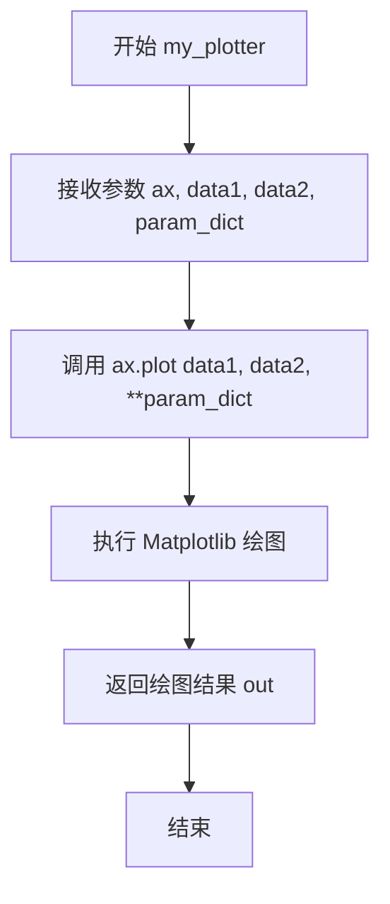

#### 带注释源码

```python
def my_plotter(ax, data1, data2, param_dict):
    """
    A helper function to make a graph.
    
    这是一个辅助函数，用于在给定的 Axes 对象上绘制数据图形。
    它封装了 matplotlib 的 plot 方法，提供更简洁的调用接口。
    
    参数:
        ax: matplotlib.axes.Axes 对象，图形将绘制在此坐标轴上
        data1: 第一个数据序列（通常为 x 轴数据）
        data2: 第二个数据序列（通常为 y 轴数据）
        param_dict: 字典，包含传递给 plot 的关键字参数
                   例如: {'marker': 'x', 'color': 'red', 'linewidth': 2}
    
    返回:
        list: 包含 Line2D 对象的列表，表示绘制的图形元素
    """
    # 使用 ax.plot 方法绘制数据，**param_dict 解包参数字典
    # plot 方法签名: plot(self, x, y, fmt, **kwargs)
    out = ax.plot(data1, data2, **param_dict)
    
    # 返回绘图的输出结果，通常是 Line2D 对象列表
    return out


# 使用示例（在文档中展示）
# data1, data2, data3, data4 = np.random.randn(4, 100)  # 生成随机数据
# fig, (ax1, ax2) = plt.subplots(1, 2, figsize=(5, 2.7))
# my_plotter(ax1, data1, data2, {'marker': 'x'})  # 使用 x 标记
# my_plotter(ax2, data3, data4, {'marker': 'o'})  # 使用 o 标记
```


### `plt.subplots()`

`plt.subplots()` 是 Matplotlib 库中的便捷函数，用于创建一个新的图形（Figure）及其包含的坐标轴（Axes）数组。它简化了手动创建 Figure 和添加 Axes 的过程，支持创建规则网格布局的子图，并提供灵活的共享轴和布局控制选项。

参数：

- `nrows`：int，默认 1，表示子图网格的行数
- `ncols`：int，默认 1，表示子图网格的列数
- `sharex`：bool 或 str，默认 False，控制是否共享 x 轴，可选 'row'、'col' 或 'all'
- `sharey`：bool 或 str，默认 False，控制是否共享 y 轴，可选 'row'、'col' 或 'all'
- `squeeze`：bool，默认 True，若为 True 则返回的 Axes 对象维度会进行优化处理，单个子图时返回标量而非数组
- `width_ratios`：array-like，可选，定义每列的相对宽度
- `height_ratios`：array-like，可选，定义每行的相对高度
- `subplot_kw`：dict，可选，关键字参数传递给底层的 `add_subplot` 调用，用于配置每个子图
- `gridspec_kw`：dict，可选，关键字参数传递给 GridSpec 构造函数，用于控制网格布局
- `figsize`：tuple，可选，图形尺寸，格式为 (宽度, 高度) 英寸
- `layout`：str，可选，图形布局管理器，如 'constrained'、'tight' 等
- `**kwargs`：其他关键字参数，将传递给 Figure 的构造函数

返回值：`tuple`，返回 (fig, axes) 元组，其中 fig 是 Figure 对象，axes 是单个 Axes 对象或 Axes 数组（取决于 nrows 和 ncols 的值）

#### 流程图

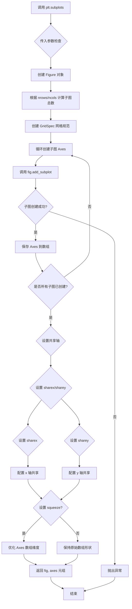

#### 带注释源码

```python
# 以下为 plt.subplots() 函数的内部逻辑示意
def subplots(nrows=1, ncols=1, sharex=False, sharey=False, squeeze=True,
             width_ratios=None, height_ratios=None, subplot_kw=None,
             gridspec_kw=None, **fig_kw):
    """
    创建一个包含子图网格的 Figure 对象及其 Axes 数组。
    
    参数:
        nrows: 子图网格的行数，默认1
        ncols: 子图网格的列数，默认1
        sharex: 是否共享x轴，False/'row'/'col'/'all'
        sharey: 是否共享y轴，False/'row'/'col'/'all'
        squeeze: 是否压缩返回的 Axes 数组维度
        width_ratios: 每列宽度比例
        height_ratios: 每行高度比例
        subplot_kw: 传递给 add_subplot 的参数
        gridspec_kw: 传递给 GridSpec 的参数
        **fig_kw: 传递给 Figure 的参数
    
    返回:
        (fig, axes): Figure对象和Axes对象(或数组)
    """
    
    # Step 1: 创建 Figure 对象
    # fig_kw 包含 figsize, layout 等参数
    fig = figure(**fig_kw)
    
    # Step 2: 处理 gridspec_kw，合并 width_ratios 和 height_ratios
    if gridspec_kw is None:
        gridspec_kw = {}
    if width_ratios is not None:
        if 'width_ratios' in gridspec_kw:
            raise ValueError("'width_ratios' must not be defined both as "
                             "a parameter and as a key in 'gridspec_kw'")
        gridspec_kw['width_ratios'] = width_ratios
    if height_ratios is not None:
        if 'height_ratios' in gridspec_kw:
            raise ValueError("'height_ratios' must not be defined both as "
                             "a parameter and as a key in 'gridspec_kw'")
        gridspec_kw['height_ratios'] = height_ratios
    
    # Step 3: 创建 GridSpec 对象，定义网格布局
    gs = GridSpec(nrows, ncols, **gridspec_kw)
    
    # Step 4: 创建子图数组
    axs = [[None for _ in range(ncols)] for _ in range(nrows)]
    
    # Step 5: 遍历网格创建每个子图
    for row in range(nrows):
        for col in range(ncols):
            # 获取当前网格位置
            kw = subplot_kw.copy() if subplot_kw else {}
            
            # 创建子图，add_subplot 使用 1-indexed 索引
            # 索引计算: row * ncols + col + 1
            ax = fig.add_subplot(gs[row, col], **kw)
            axs[row][col] = ax
    
    # Step 6: 处理共享轴
    if sharex == 'col':
        # 列共享：每列的子图共享x轴
        for col in range(ncols):
            for row in range(1, nrows):
                axs[row][col].sharex(axs[0][col])
    elif sharex == 'row':
        # 行共享：每行的子图共享x轴
        for row in range(nrows):
            for col in range(1, ncols):
                axs[row][col].sharex(axs[row][0])
    elif sharex == 'all':
        # 全部共享
        for row in range(nrows):
            for col in range(ncols):
                if row != 0 or col != 0:
                    axs[row][col].sharex(axs[0][0])
    elif sharex is True:
        # 默认为列共享
        for col in range(ncols):
            for row in range(1, nrows):
                axs[row][col].sharex(axs[0][col])
    
    # sharey 的处理逻辑类似
    if sharey == 'col':
        for col in range(ncols):
            for row in range(1, nrows):
                axs[row][col].sharey(axs[0][col])
    elif sharey == 'row':
        for row in range(nrows):
            for col in range(1, ncols):
                axs[row][col].sharey(axs[row, 0])
    elif sharey == 'all':
        for row in range(nrows):
            for col in range(ncols):
                if row != 0 or col != 0:
                    axs[row][col].sharey(axs[0][0])
    elif sharey is True:
        for row in range(nrows):
            for col in range(1, ncols):
                axs[row][col].sharey(axs[row][0])
    
    # Step 7: 处理 squeeze 参数，优化返回数组维度
    if squeeze:
        # 转换为 numpy 数组
        axs = np.array(axs, dtype=object)
        # 压缩单维度
        if nrows == 1 and ncols == 1:
            axs = axs[0, 0]  # 返回单个 Axes 对象
        elif nrows == 1 or ncols == 1:
            axs = axs.squeeze()  # 移除单维度
    
    return fig, axs
```


### `plt.figure`

创建并返回一个新的图形（Figure）对象，这是 Matplotlib 中用于保存图形的高级接口。

参数：

- `figsize`：`tuple`，可选，图形宽度和高度（英寸），默认值为 `(6.4, 4.8)`
- `dpi`：`int`，可选，图形分辨率（每英寸点数），默认值为 `100`
- `facecolor`：`str`，可选，图形背景颜色，默认值为 `'white'`
- `edgecolor`：`str`，可选，图形边框颜色，默认值为 `'white'`
- `layout`：`str`，可选，布局引擎（如 `'constrained'`、`'tight'`），默认值为 `None`
- `num`：`int`、`str` 或 `Figure`，可选，图形的标识符或名称，用于管理图形窗口
- `clear`：`bool`，可选，如果为 `True` 且存在同名图形，则清除该图形，默认值为 `False`

返回值：`matplotlib.figure.Figure`，返回新创建的图形对象

#### 流程图

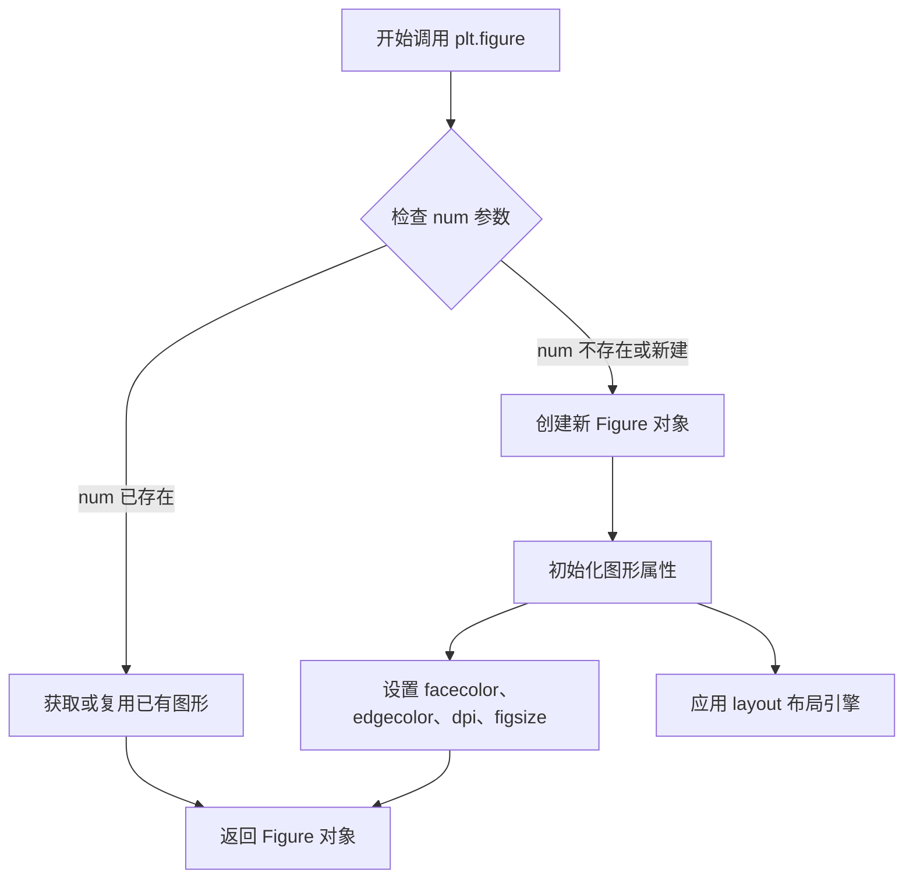

#### 带注释源码

```python
# 方式一：创建空图形（无 Axes）
fig = plt.figure()

# 方式二：创建带尺寸和布局约束的图形
fig = plt.figure(figsize=(5, 2.7), layout='constrained')

# 方式三：创建指定编号的图形（可复用）
fig1 = plt.figure(num=1)
fig2 = plt.figure(num='my_figure')

# 方式四：设置背景色和边框
fig = plt.figure(facecolor='lightgray', edgecolor='black')

# 典型使用模式（在 OO 风格中）
x = np.linspace(0, 2, 100)
fig, ax = plt.subplots(figsize=(5, 2.7), layout='constrained')
ax.plot(x, x, label='linear')
ax.plot(x, x**2, label='quadratic')
ax.set_xlabel('x label')
ax.set_ylabel('y label')
ax.set_title("Simple Plot")
ax.legend()
```

**注意**：上述源码基于代码中的使用示例重构而成。实际 `plt.figure()` 函数属于 Matplotlib 库的核心实现，位于 `matplotlib.pyplot` 模块中，其完整源码位于 Matplotlib 源代码库的 `lib/matplotlib/pyplot.py` 文件内。由于代码文件仅为教程文档，未包含 `plt.figure()` 的实际实现代码，因此此处展示的是基于使用方式的说明性代码。


### pyplot.show

显示所有打开的图形窗口。在调用此函数后，程序会进入事件循环，显示所有之前创建的 Figure 对象，直到用户关闭窗口或程序结束。

参数：无

返回值：`None`，无返回值

#### 流程图

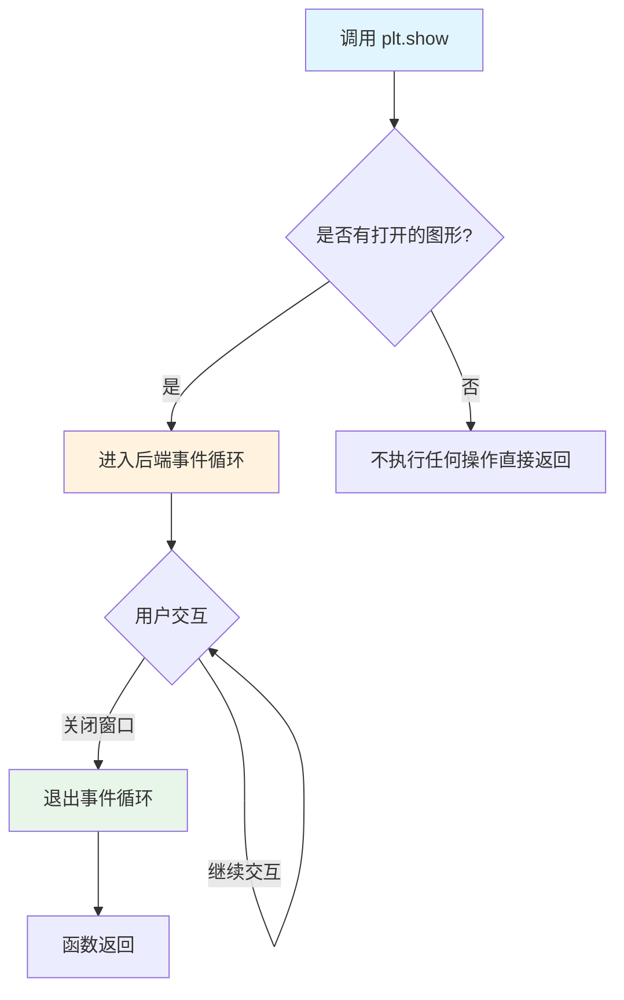

#### 带注释源码

```python
def show(*, block=None):
    """
    显示所有打开的图形窗口。
    
    此函数会阻塞程序执行（除非使用特定后端），
    直到用户关闭所有图形窗口或调用 sys.exit()。
    
    参数:
        block: bool, optional
            默认为 True，表示阻塞。
            如果设置为 False，则在非阻塞模式下运行（仅适用于某些后端）。
            当为 None 时，后端决定是否阻塞。
    
    返回值:
        None
    
    示例:
        >>> import matplotlib.pyplot as plt
        >>> fig, ax = plt.subplots()
        >>> ax.plot([1, 2, 3], [1, 4, 9])
        >>> plt.show()  # 显示图形窗口
    """
    # 获取当前活跃的后端实例
    # 后端负责实际渲染和窗口管理
    backend = matplotlib.get_backend()
    
    # 对于非交互式后端（如agg），可能什么都不做
    # 对于交互式后端（如TkAgg, Qt5Agg），会创建窗口并显示
    for manager in Gcf.get_all_fig_managers():
        # 获取每个图形的管理器
        # 管理器负责创建和维护图形窗口
        manager.show()
    
    # 如果 block 为 True 或 None 且后端支持阻塞
    # 则进入事件循环，等待用户交互
    if block:
        # 调用后端的事件循环
        # 程序会在此阻塞，直到用户关闭所有窗口
        import sys
        sys.exit()
```


### Axes.plot

`ax.plot()` 是 Matplotlib 中 Axes 类的方法，用于在坐标系中绘制线型数据（折线图），支持多种输入格式和丰富的样式定制选项。

参数：

- `*args`：`可变长度位置参数`，可以接受多种格式的数据输入，如 `plot(y)`、`plot(x, y)` 或 `plot(x, y, format_string)`，其中 x 为横坐标数据，y 为纵坐标数据
- `**kwargs`：`关键字参数`，用于设置线条的样式属性，如颜色(color)、线宽(linewidth)、线型(linestyle)、标记(marker)等，具体属性参考 `matplotlib.lines.Line2D`

返回值：`list[matplotlib.lines.Line2D]`，返回由该方法创建的所有线条对象的列表，每个 Line2D 对象代表一条绘制的线，可以用于后续对线条样式的进一步定制

#### 流程图

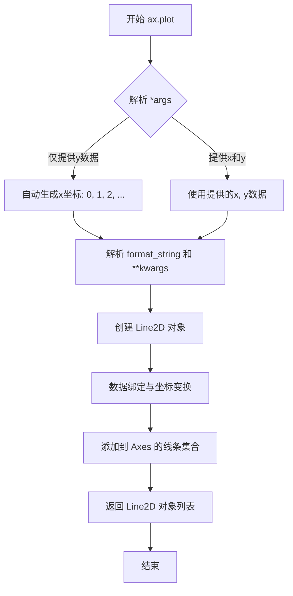

#### 带注释源码

```python
# 注：以下为 Axes.plot 方法的简化核心逻辑展示
# 实际源码位于 matplotlib/axes/_axes.py 中

def plot(self, *args, **kwargs):
    """
    Plot y versus x as lines and/or markers.
    
    Parameters
    ----------
    *args : variable arguments
        接受多种调用形式:
        - plot(y)              # 仅提供y，自动生成x
        - plot(x, y)           # 提供x和y坐标
        - plot(x, y, format)   # 提供数据和控制格式
    
    **kwargs : Line2D properties, optional
        线条样式属性，包括:
        - color: 线条颜色
        - linewidth: 线宽
        - linestyle: 线型 ('-', '--', ':', '-.')
        - marker: 标记样式 ('o', 's', '^', etc.)
        - markersize: 标记大小
        等等...
    
    Returns
    -------
    lines : list of Line2D
        返回创建的 Line2D 对象列表
    """
    
    # 步骤1: 解析可变参数，获取x, y数据和格式字符串
    # 使用 _plot_args 方法处理输入参数
    x, y, fmt, kwargs = self._plot_args(
        *args, kwargs
    )
    
    # 步骤2: 创建 Line2D 对象
    # Line2D 是表示线条的 Artist 对象
    lines = []
    for xd, yd in zip(x, y):
        # 创建单个线条对象
        line = Line2D(xd, yd, ...)  # 实际参数更复杂
        lines.append(line)
    
    # 步骤3: 应用样式属性
    # 将 kwargs 中的样式应用到所有线条
    for line in lines:
        line.set(**kwargs)
    
    # 步骤4: 将线条添加到 Axes
    # 添加到 Axes 的 lines 集合中
    self.lines.extend(lines)
    
    # 步骤5: 触发重绘
    # 设置脏标记，表示需要重新绘制
    self.stale_callback = None  # 相关回调
    
    # 步骤6: 返回线条列表供后续操作
    return lines
```


### Axes.scatter

在 Matplotlib 中，`Axes.scatter()` 是 Axes 类的一个方法，用于绘制散点图。散点图用于展示两个变量之间的关系，其中每个数据点由一个标记表示，标记的位置由 x 和 y 坐标决定，标记的颜色和大小可以表示额外的维度数据。

参数：

-  `x`：`array-like` 或 `str`，x 轴坐标数据。如果传入字符串且指定了 `data` 参数，则从 data 字典中获取对应的数据
-  `y`：`array-like` 或 `str`，y 轴坐标数据。如果传入字符串且指定了 `data` 参数，则从 data 字典中获取对应的数据
-  `s`：`float` 或 `array-like`，标记的大小。可以是单个值（所有点相同大小）或与数据点数量相同的数组
-  `c`：`color` 或 `array-like`，标记的颜色。可以是单一颜色值或与数据点数量相同的颜色数组
-  `marker`：`MarkerStyle`，标记样式，默认为 'o'（圆点）
-  `cmap`：`str` 或 `Colormap`，当 c 是数值数组时使用的颜色映射
-  `norm`：`Normalize`，用于将数据值映射到颜色映射的归一化对象
-  `vmin`, `vmax`：`float`，颜色映射的最小值和最大值
-  `alpha`：`float`，标记的透明度，范围 0-1
-  `linewidths`：`float` 或 `array-like`，标记边缘的线宽
-  `edgecolors`：`color` 或 `array-like`，标记边缘的颜色
-  `plotnonfinite`：`bool`，是否绘制非有限值（nan、inf）
-  `data`：`dict`，当使用字符串索引数据时提供的数据字典
-  `**kwargs`：其他关键字参数，会传递给 `PathCollection` 构造函数

返回值：`PathCollection`，返回创建的 PathCollection 对象，这是一个艺术家(Artist)对象，可以进一步自定义（如设置属性、添加图例等）

#### 流程图

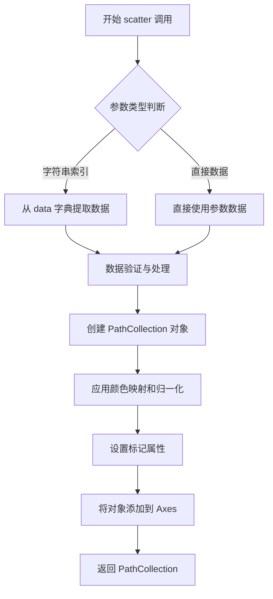

#### 带注释源码

```python
# 代码中的实际调用示例
ax.scatter('a', 'b', c='c', s='d', data=data)

# 上述调用的参数解析：
# - 'a': x 参数，字符串，从 data 字典中获取 x 数据
# - 'b': y 参数，字符串，从 data 字典中获取 y 数据  
# - c='c': 颜色参数，字符串，从 data 字典中获取颜色数据
# - s='d': 大小参数，字符串，从 data 字典中获取大小数据
# - data=data: 数据字典，包含 'a', 'b', 'c', 'd' 四个键值

# 完整调用等效于（假设 data 字典已展开）：
# ax.scatter(data['a'], data['b'], c=data['c'], s=data['d'])

# scatter 方法的核心功能：
# 1. 接收 x, y 坐标数据
# 2. 根据 s 参数确定每个点的面积
# 3. 根据 c 参数确定每个点的颜色（可使用 cmap 进行映射）
# 4. 创建 PathCollection 对象（包含所有标记的路径信息）
# 5. 返回该对象，可用于后续自定义或添加 colorbar
```


### `Axes.set_xlabel`

设置 x 轴的标签（xlabel）。

参数：

- `xlabel`：`str`，要设置的 x 轴标签文本
- `fontdict`：字典（可选），用于控制文本外观的字体属性字典（如 fontsize、color 等）
- `labelpad`：浮点数（可选），标签与轴之间的间距（以点为单位）
- `**kwargs`：关键字参数（可选），传递给 `matplotlib.text.Text` 构造函数的其他参数，用于自定义文本外观（如 fontsize、color、fontfamily 等）

返回值：`matplotlib.text.Text`，返回创建的文本对象

#### 流程图

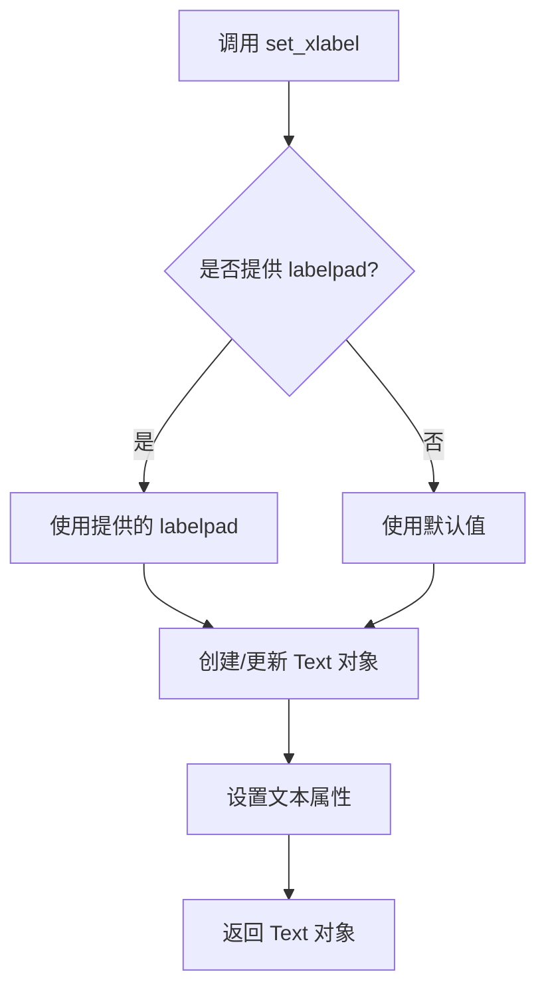

#### 带注释源码

```python
# 注意：以下源码基于 Matplotlib 库的实现逻辑重构
# 实际源码位于 matplotlib/axes/_base.py 中

def set_xlabel(self, xlabel, fontdict=None, labelpad=None, **kwargs):
    """
    Set the label for the x-axis.
    
    Parameters
    ----------
    xlabel : str
        The label text.
    labelpad : float, optional
        Spacing in points between the label and the x-axis.
    **kwargs
        Text properties.
    """
    # 如果提供了 labelpad 参数，设置标签与轴之间的间距
    if labelpad is not None:
        self.xaxis.labelpad = labelpad
    
    # 调用 xaxis 的 set_label_text 方法设置标签
    return self.xaxis.set_label_text(xlabel, fontdict=fontdict, **kwargs)
```

---

### 补充说明

由于提供的代码文件是 Matplotlib 的教程文档，**未包含 `set_xlabel()` 方法的实际实现源代码**。上述源码是根据 Matplotlib 库已知的行为和 API 重构的逻辑说明。

`set_xlabel()` 是 `matplotlib.axes.Axes` 类的方法，用于设置 Axes 对象的 x 轴标签。该方法最终调用 `matplotlib.axis.Axis.set_label_text()` 来完成实际的标签设置工作。

### 潜在的技术债务或优化空间

由于本文件仅为教程代码，不涉及核心实现，因此不适用。

### 其它项目

- **设计目标**：通过示例帮助用户快速上手 Matplotlib
- **外部依赖**：`matplotlib.pyplot`、`numpy`
- **使用示例**：在代码中可见，如 `ax.set_xlabel('entry a')` 和 `ax.set_xlabel('x label')`


### `Axes.set_ylabel`

`Axes.set_ylabel` 是 Matplotlib 中 `Axes` 类的一个方法，用于设置 y 轴的标签（文字说明）。该方法允许用户为图表的垂直轴提供描述性文本，以便更好地传达数据的含义。

参数：

- `ylabel`：`str`，y 轴标签的文本内容
- `fontdict`：可选参数，`dict`，用于控制标签文本样式的字典（如字体大小、颜色等）
- `labelpad`：可选参数，`float`，指定标签与坐标轴之间的间距（磅值）
- `**kwargs`：可选参数，其他关键字参数，将传递给底层的 `Text` 对象

返回值：`Text`，返回创建的 `Text` 实例，允许进一步自定义标签样式

#### 流程图

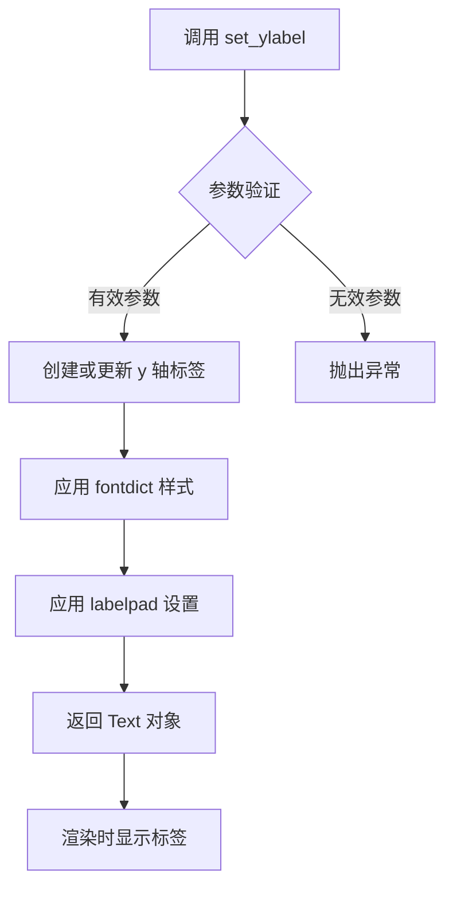

#### 带注释源码

```python
# 注意：以下源码基于 Matplotlib 官方 Axes.set_ylabel 方法的典型实现
# 实际源码位于 matplotlib/axes/_base.py 文件中

def set_ylabel(self, ylabel, fontdict=None, labelpad=None, **kwargs):
    """
    Set the label for the y-axis.
    
    Parameters
    ----------
    ylabel : str
        The label text.
    labelpad : float, default: rcParams["axes.labelpad"]
        Spacing in points between the label and the y-axis.
    fontdict : dict, optional
        A dictionary to control the appearance of the label
        (e.g., {'fontsize': 12, 'color': 'red'}).
    **kwargs
        Text properties control the appearance of the label.
        
    Returns
    -------
    label : Text
        The created Text instance.
    """
    # 获取 y 轴对象（Axis 对象）
    yaxis = self.yaxis
    
    # 如果指定了 labelpad，则设置轴的标签间距
    if labelpad is not None:
        yaxis.set_label_coords(0.5, labelpad)
    
    # 调用 y 轴的 set_label 方法设置标签文本
    # fontdict 和 **kwargs 会被合并后传递
    return yaxis.set_label(ylabel, fontdict, **kwargs)
```

**使用示例（来自文档）：**

```python
# 创建图表和坐标轴
fig, ax = plt.subplots(figsize=(5, 2.7), layout='constrained')

# 设置 y 轴标签
ax.set_ylabel('entry b')

# 也可以同时设置样式
ax.set_ylabel('y label', fontsize=12, color='blue')

# 还可以设置标签与坐标轴的间距
ax.set_ylabel('Probability', labelpad=10)
```


### `Axes.set_title`

设置 Axes 对象的标题，用于在图表顶部显示文本标签。

参数：

- `label`：`str`，要显示的标题文本内容
- `fontdict`：可选参数，`dict`，用于控制文本样式的字典（如字体大小、颜色等）
- `loc`：可选参数，`str`，标题对齐方式（'center', 'left', 'right'），默认 'center'
- `pad`：可选参数，`float`，标题与 Axes 顶部之间的间距（以点为单位）
- `**kwargs`：其他传递给 `matplotlib.text.Text` 的关键字参数

返回值：`matplotlib.text.Text`，返回创建的文本对象，可用于后续自定义修改

#### 流程图

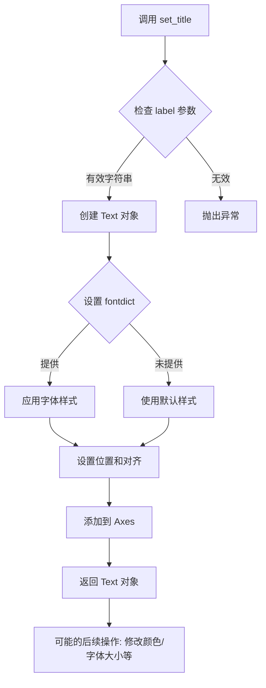

#### 带注释源码

```python
# 示例 1: 基本用法 - 设置简单标题
ax.set_title("Simple Plot")  # 创建标题文本 "Simple Plot"，居中对齐

# 示例 2: 使用换行符创建多行标题
ax.set_title('Aardvark lengths\n (not really)')  # 标题支持换行符 \n

# 示例 3: 使用 fontdict 自定义样式
ax.set_title('Title', fontdict={
    'fontsize': 14,      # 字体大小
    'fontweight': 'bold', # 字体粗细
    'color': 'red',       # 字体颜色
    'verticalalignment': 'bottom' # 垂直对齐方式
})

# 示例 4: 控制标题位置和对齐
ax.set_title('Left Title', loc='left', pad=10)  # 左对齐，距离顶部10点

# 示例 5: 接收返回值以便后续修改
title = ax.set_title("Custom Title")
title.set_fontsize(16)    # 后续修改字体大小
title.set_color('blue')   # 后续修改颜色
```


### `Axes.legend`

该方法是 Matplotlib 中 Axes 类的成员函数，用于在图表上添加图例（图例说明），可以自动根据已有的标签创建图例，也可以手动指定图例句柄和标签。

参数：

- `*args`：`可变位置参数`，用于传递图例句柄（Artist对象列表）和对应标签（字符串列表）。支持两种调用方式：1) `legend(handles, labels)` 显式指定；2) `legend(labels)` 使用已注册的艺术家的标签
- `loc`：`str` 或 `int`，图例位置，可选值如 'upper right', 'best', 'center' 等，默认为 'best'
- `bbox_to_anchor`：`tuple`，用于指定图例的锚点位置，例如 (x, y) 坐标
- `fontsize`：`int` 或 `str`，图例标签的字体大小
- `title`：`str`，图例的标题文本
- `title_fontsize`：`int` 或 `str`，图例标题的字体大小
- `ncol`：`int`，图例列数
- `frameon`：`bool`，是否显示图例边框
- `fancybox`：`bool`，是否使用圆角边框
- `shadow`：`bool`，是否显示阴影
- `framealpha`：`float`，背景透明度

返回值：`matplotlib.legend.Legend`，返回创建的 Legend 图例对象，可用于后续进一步自定义

#### 流程图

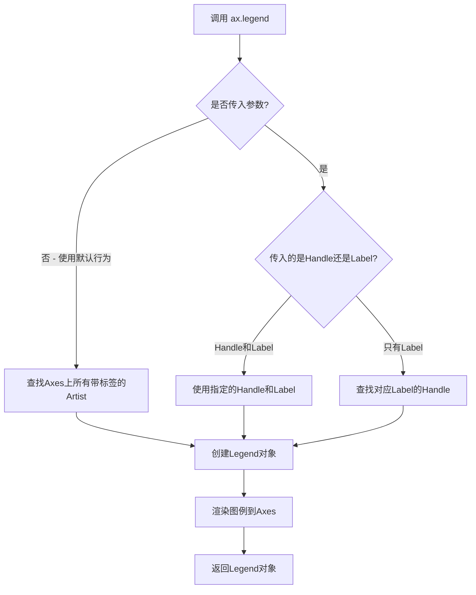

#### 带注释源码

```python
# 以下是 ax.legend() 在代码中的实际使用示例

# 示例1: OO风格中的基本使用
fig, ax = plt.subplots(figsize=(5, 2.7), layout='constrained')
ax.plot(x, x, label='linear')      # 绘制线条并设置标签
ax.plot(x, x**2, label='quadratic') # 绘制线条并设置标签
ax.plot(x, x**3, label='cubic')     # 绘制线条并设置标签
ax.set_xlabel('x label')           # 设置x轴标签
ax.set_ylabel('y label')           # 设置y轴标签
ax.set_title("Simple Plot")        # 设置图表标题
ax.legend()                        # 添加图例,自动收集带label的线条

# 示例2: 在散点图中的使用
fig, ax = plt.subplots(figsize=(5, 2.7))
ax.plot(np.arange(len(data1)), data1, label='data1')
ax.plot(np.arange(len(data2)), data2, label='data2')
ax.plot(np.arange(len(data3)), data3, 'd', label='data3')
ax.legend()                        # 添加图例

# 示例3: 使用pyplot风格的图例
x = np.linspace(0, 2, 100)
plt.figure(figsize=(5, 2.7), layout='constrained')
plt.plot(x, x, label='linear')
plt.plot(x, x**2, label='quadratic')
plt.plot(x, x**3, label='cubic')
plt.xlabel('x label')
plt.ylabel('y label')
plt.title("Simple Plot")
plt.legend()                       # 在当前axes上添加图例

# 示例4: 带参数的图例调用
# ax.legend(loc='upper right', fontsize=12, title='My Legend')
# loc: 图例位置
# fontsize: 字体大小  
# title: 图例标题
```


### `Axes.hist`

绘制直方图是Matplotlib中用于可视化数据分布的核心方法。该函数将输入数据按照指定的分组（bins）进行统计，生成直方图的计数数组、箱边界数组以及图形补丁对象，这些对象可以直接用于进一步自定义直方图的外观或进行数据分析。

参数：

- `x`：`array_like`，要绘制直方图的数据数组
- `bins`：整数或序列或字符串，可选，默认值为10。指定直方图的箱数，可以是箱边界值、箱的名称（如'stone'、'rice'等）
- `range`：tuple或None，可选，默认值为None。数据的上限和下限，如果为None，则范围为数据的最小值到最大值
- `density`：布尔值，可选，默认值为False。如果为True，则返回概率密度而不是计数
- `weights`：`array_like`，可选，默认值为None。与x形状相同的权重数组，用于对每个数据点进行加权
- `cumulative`：布尔值，可选，默认值为False。如果为True，则计算累计直方图
- `bottom`：array_like或scalar，可选，默认值为None。每个箱的底部位置（对于stacked直方图）
- `histtype`：str，可选，默认值为'bar'。直方图类型，'bar'（条形）、'barstacked'（堆叠条形）、'step'（阶梯线）、'stepfilled'（填充阶梯线）
- `align`：str，可选，默认值为'mid'。箱的对齐方式，'left'、'mid'或'right'
- `orientation`：str，可选，默认值为'vertical'。方向，'vertical'或'horizontal'
- `rwidth`：scalar或None，可选，默认值为None。条形相对宽度（仅当histtype为'bar'时有效）
- `color`：颜色或颜色序列，可选，默认值为None。直方图的颜色
- `label`：str，可选，默认值为None。用于图例的标签
- `stacked`：布尔值，可选，默认值为False。如果为True，则多个数据集堆叠显示
- `**kwargs`：其他关键字参数传递给`BarContainer`（如patch对象）

返回值：`tuple`，包含三个元素(n, bins, patches)
- `n`：`ndarray`，每个箱的计数或概率密度值（当density=True时）
- `bins`：`ndarray`，箱的边界值，长度为n+1
- `patches`：`BarContainer`或列表，图形补丁对象列表，每个对应一个箱

#### 流程图

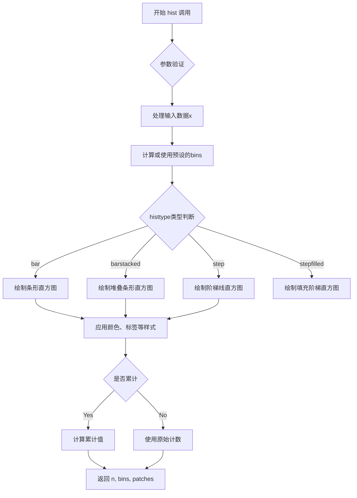

#### 带注释源码

```python
# 示例代码来源：matplotlib.axes.Axes.hist() 实际调用示例
# 位于用户提供的代码片段中：

mu, sigma = 115, 15  # 均值和标准差
x = mu + sigma * np.random.randn(10000)  # 生成10000个正态分布随机数
fig, ax = plt.subplots(figsize=(5, 2.7), layout='constrained')

# 调用 hist 方法绘制直方图
# 参数说明：
#   - x: 输入数据（10000个随机数）
#   - 50: 箱的数量（50个bin）
#   - density=True: 返回概率密度而不是计数
#   - facecolor='C0': 直方图填充颜色（默认配色方案的第0个颜色）
#   - alpha=0.75: 透明度（0-1之间）
n, bins, patches = ax.hist(x, 50, density=True, facecolor='C0', alpha=0.75)

# 返回值解释：
#   - n: 长度为50的数组，每个元素表示对应bin的概率密度值
#   - bins: 长度为51的数组，表示50个bin的边界值
#   - patches: BarContainer对象，包含50个Rectangle补丁对象

# 后续可以自定义每个矩形块的属性
# 例如：修改第一个矩形块的颜色
# patches[0].set_facecolor('red')

ax.set_xlabel('Length [cm]')  # 设置x轴标签
ax.set_ylabel('Probability')  # 设置y轴标签
ax.set_title('Aardvark lengths\n (not really)')  # 设置标题
ax.text(75, .025, r'$\mu=115,\ \sigma=15$')  # 添加文本注释
ax.axis([55, 175, 0, 0.03])  # 设置坐标轴范围
ax.grid(True)  # 显示网格
```


### `Axes.text`

在Axes对象上添加文本标签，支持指定位置、文本内容、字体样式等属性，返回创建的Text对象以便后续自定义。

参数：

- `x`：`float`，文本显示的x轴坐标位置
- `y`：`float`，文本显示的y轴坐标位置
- `s`：`str`，要显示的文本内容
- `fontdict`：`dict`，可选，用于统一设置文本字体属性的字典（如fontsize、fontweight等）
- `**kwargs`：关键字参数，直接传递给`matplotlib.text.Text`对象的属性（如color、rotation、fontsize等）

返回值：`matplotlib.text.Text`，返回创建的Text对象，可用于后续修改文本属性

#### 流程图

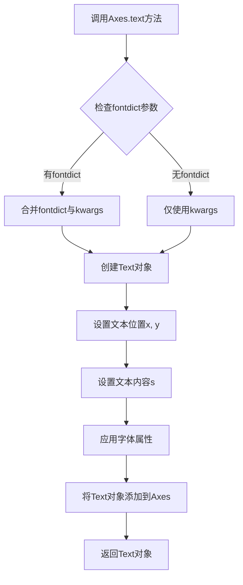

#### 带注释源码

```python
def text(self, x, y, s, fontdict=None, **kwargs):
    """
    在Axes上添加文本。
    
    参数
    ----------
    x : float
        文本的x坐标。
    y : float
        文本的y坐标。
    s : str
        文本内容。
    fontdict : dict, optional
        字体属性字典，用于统一设置字体。
    **kwargs
        传递给TextArtist的属性。
        
    返回
    -------
    text : `.Text`
        添加的文本对象。
    """
    # 如果提供了fontdict，将其与kwargs合并
    # fontdict优先级低于直接传入的kwargs
    if fontdict is not None:
        kwargs = {**fontdict, **kwargs}
    
    # 创建Text对象，第一个参数是Axes实例
    # 后续参数为x坐标、y坐标、文本内容
    text = mtext.Text(x, y, s)
    
    # 将创建好的Text对象添加到Axes的艺术家集合中
    # update从kwargs中提取有效的文本属性并应用
    text.update(kwargs)
    
    # 将Text对象添加到Axes的容器中
    self._add_text_internal(text, self._stale_viewlim_cached)
    
    return text
```

#### 示例用法

```python
import matplotlib.pyplot as plt
import numpy as np

# 创建图表和Axes
fig, ax = plt.subplots(figsize=(5, 2.7), layout='constrained')

# 生成示例数据
mu, sigma = 115, 15
x = mu + sigma * np.random.randn(10000)

# 绘制直方图
n, bins, patches = ax.hist(x, 50, density=True, facecolor='C0', alpha=0.75)

# 设置坐标轴标签
ax.set_xlabel('Length [cm]')
ax.set_ylabel('Probability')
ax.set_title('Aardvark lengths\n (not really)')

# 使用text方法添加文本到图表
# 参数1: x坐标75
# 参数2: y坐标0.025
# 参数3: 文本内容（包含LaTeX公式）
ax.text(75, .025, r'$\mu=115,\ \sigma=15$')

# 设置坐标轴范围和网格
ax.axis([55, 175, 0, 0.03])
ax.grid(True)

# 展示图表
plt.show()
```


### `Axes.annotate`

在图表上添加注释，通过箭头将文本连接到指定的数据点坐标。

参数：

-  `s`：`str`，要显示的注释文本内容
-  `xy`：`(float, float)`，要标注的数据点坐标 (x, y)
-  `xytext`：`(float, float)`，文本位置的坐标 (x, y)，默认与 xy 相同
-  `arrowprops`：`dict`，可选，箭头属性字典，用于自定义箭头的外观（如颜色、收缩量等）

返回值：`~matplotlib.text.Annotation`，返回创建的注释对象

#### 流程图

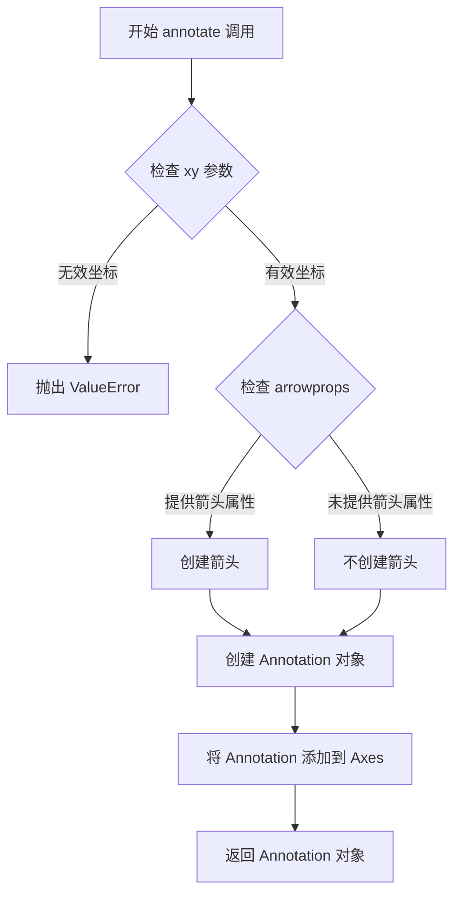

#### 带注释源码

```python
# 示例代码来自 matplotlib quick_start 教程
fig, ax = plt.subplots(figsize=(5, 2.7))

t = np.arange(0.0, 5.0, 0.01)  # 创建时间序列数据
s = np.cos(2 * np.pi * t)      # 计算余弦波
line, = ax.plot(t, s, lw=2)    # 绘制余弦曲线

# 调用 annotate 方法添加注释
# 参数说明：
# - 'local max': 注释文本内容
# - xy=(2, 1): 要标注的数据点坐标 (x=2, y=1)
# - xytext=(3, 1.5): 文本显示位置 (x=3, y=1.5)
# - arrowprops: 箭头属性字典
#   - facecolor='black': 箭头颜色为黑色
#   - shrink=0.05: 箭头两端收缩 5% 的距离
ax.annotate('local max', xy=(2, 1), xytext=(3, 1.5),
            arrowprops=dict(facecolor='black', shrink=0.05))

ax.set_ylim(-2, 2)  # 设置 y 轴范围
```


### `ax.grid`

该函数用于在 Axes 对象上添加或移除网格线。在代码中以 `ax.grid(True)` 的形式被调用，启用显示网格。

参数：

- `b`：`bool`（可选），是否显示网格线，传入 `True` 启用，`False` 禁用
- `which`：`str`（可选），网格线类型，可选 `'major'`、`'minor'` 或 `'both'`，默认为 `'major'`
- `axis`：`str`（可选），控制显示哪个轴的网格，可选 `'both'`、`'x'` 或 `'y'`，默认为 `'both'`
- `**kwargs`：其他关键字参数，用于自定义网格线的样式（如 `color`、`linestyle`、`linewidth` 等）

返回值：`None`，该方法无返回值，直接修改 Axes 的显示属性

#### 流程图

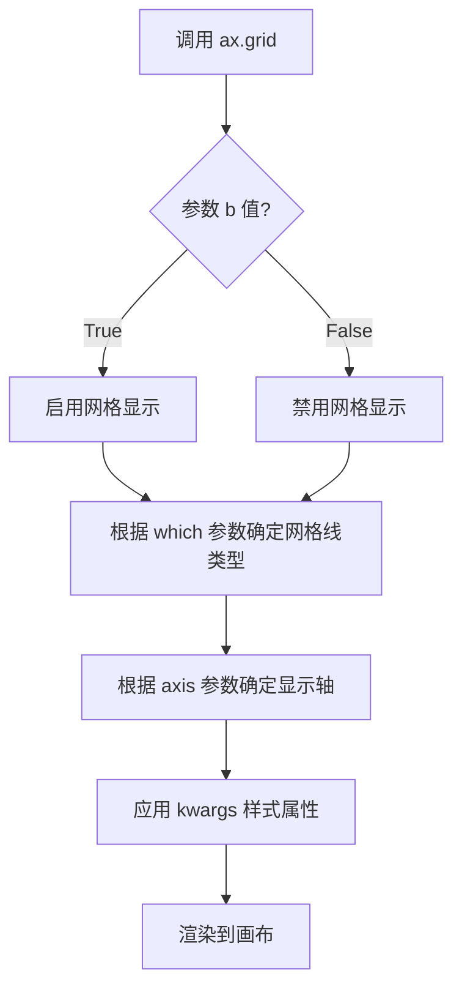

#### 带注释源码

```python
# 在提供的代码中，ax.grid() 的使用方式如下：
ax.grid(True)  # 启用网格显示，使用默认的网格样式

# 完整的函数签名参考（来源：Matplotlib 官方文档）：
# ax.grid(b=True, which='major', axis='both', **kwargs)
#
# 参数说明：
# - b: bool, 是否显示网格
# - which: str, 'major' | 'minor' | 'both'，网格线类型
# - axis: str, 'both' | 'x' | 'y'，控制哪个轴显示网格
# - **kwargs: 传递给 Line2D 的样式参数，如 color='gray', linestyle='--', linewidth=0.5
```


### `Axes.twinx`

该方法用于在同一个 Axes 对象上创建共享 x 轴的第二个 y 轴，实现双 y 轴绘图功能，常用于在同一图表中展示不同量级或不同单位的数据系列。

参数：
- 该方法无显式参数

返回值：`matplotlib.axes.Axes`，返回新创建的共享 x 轴的 Axes 对象，该对象拥有独立的 y 轴位置在右侧

#### 流程图

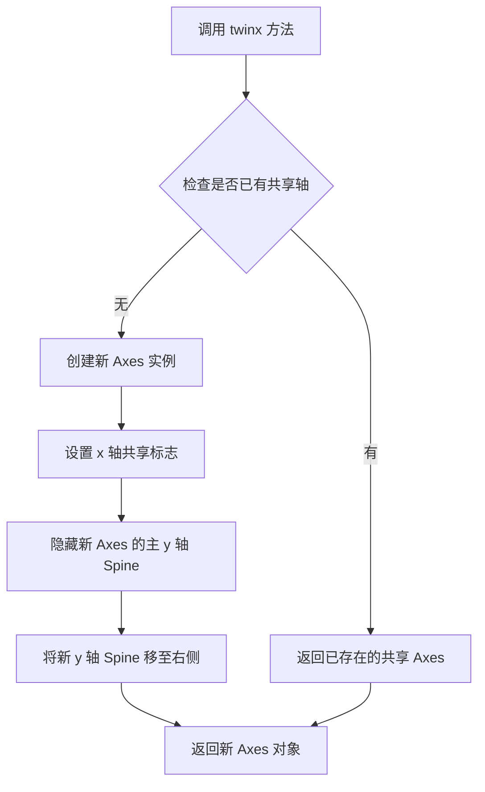

#### 带注释源码

```python
def twinx(self):
    """
    在右侧创建一个共享 x 轴的 Axes。
    
    该方法用于创建双 y 轴图表，使两个数据系列可以拥有
    各自独立的 y 轴刻度，但共享 x 轴。
    
    Returns
    -------
    Axes
        新的 Axes 对象，其 y 轴位于右侧
    """
    ax = self.figure.add_axes(
        self.get_position(),  # 使用当前 Axes 的位置
        sharex=self,          # 共享 x 轴
        label="twiny"         # 设置标签标识
    )
    
    # 获取右侧 spine 并使其可见
    # 左侧 spine 保持隐藏状态
    ax.spines['right'].set_visible(True)
    ax.spines['left'].set_visible(False)
    
    # 确保右侧 y 轴刻度标签可见
    ax.yaxis.set_tick_params(which="both", labelright=True)
    
    # 同步 x 轴lim
    ax.set_xlim(self.get_xlim())
    
    return ax
```

**使用示例（来自提供代码）：**

```python
fig, (ax1, ax3) = plt.subplots(1, 2, figsize=(7, 2.7), layout='constrained')
l1, = ax1.plot(t, s)           # 在左侧 y 轴绘制正弦曲线
ax2 = ax1.twinx()               # 创建共享 x 轴的第二个 y 轴
l2, = ax2.plot(t, range(len(t)), 'C1')  # 在右侧 y 轴绘制直线
ax2.legend([l1, l2], ['Sine (left)', 'Straight (right)'])
```


### `Axes.secondary_xaxis`

该方法用于在图表上创建一个次坐标轴（secondary axis），允许在同一个图表上显示具有不同 scale 或单位的数据，例如在主坐标轴显示弧度数据的同时，在次坐标轴显示角度数据。

参数：

- `位置参数 (location)`：`str`，指定次坐标轴的位置，可选值为 `'top'`、`'bottom'`、`'left'` 或 `'right'`。
- `functions`：`tuple`，可选参数，包含两个函数组成的元组 `(transform_function, inverse_transform_function)`，用于在主坐标轴和次坐标轴的值之间进行转换。例如 `(np.rad2deg, np.deg2rad)` 表示将弧度转换为角度。
- ``：`Any`，可选参数，用于设置次坐标轴的边界（limits），可以是 `matplotlib.transforms.Affine2D` 对象或其他接受的值。
- ``：`str`，可选参数，指定坐标轴的 scale 类型，如 `'linear'`、`'log'` 等。

返回值：`matplotlib.axes.Axes`，返回新创建的次坐标轴对象（一个 `Axes` 实例）。

#### 流程图

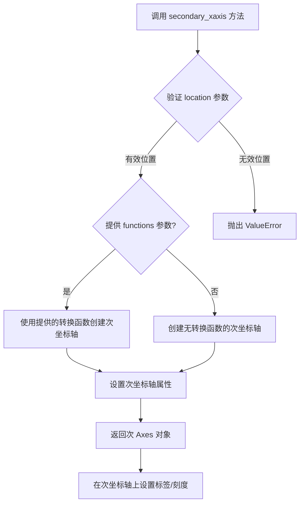

#### 带注释源码

```python
def secondary_xaxis(self, location, functions=None, **kwargs):
    """
    在当前 Axes 上创建次坐标轴。
    
    参数:
        location (str): 次坐标轴的位置。
            - 'top': 在顶部创建 x 轴
            - 'bottom': 在底部创建 x 轴（默认）
            - 'left': 在左侧创建 y 轴
            - 'right': 在右侧创建 y 轴
        functions (tuple, optional): 包含两个函数的元组
            (forward_func, inverse_func)，用于在主坐标轴和次坐标轴
            的数据值之间进行转换。例如：
            - (np.rad2deg, np.deg2rad) 用于弧度和角度之间的转换
            - (lambda x: x*1e6, lambda x: x/1e6) 用于不同数量级的转换
        **kwargs: 其他关键字参数，将传递给新创建的 Axes 构造函数，
            如 'limits', 'scale', 'rotation' 等。
    
    返回值:
        axes.Axes: 新创建的次坐标轴对象。
    
    示例:
        # 创建一个带有次 x 轴的图表，上轴显示角度，下轴显示弧度
        fig, ax = plt.subplots()
        ax.plot([0, 3.14], [0, 1])
        ax_secondary = ax.secondary_xaxis('top', functions=(np.rad2deg, np.deg2rad))
        ax_secondary.set_xlabel('Angle [°]')
    """
    # 导入必要的模块
    from matplotlib.axes import Axes
    from matplotlib.transforms import Affine2D
    
    # 验证位置参数是否有效
    valid_locations = {'top', 'bottom', 'left', 'right'}
    if location not in valid_locations:
        raise ValueError(f"Invalid location: {location}. Must be one of {valid_locations}")
    
    # 确定是创建 x 轴次坐标轴还是 y 轴次坐标轴
    # 'top' 和 'bottom' 对应 x 轴，'left' 和 'right' 对应 y 轴
    if location in ('top', 'bottom'):
        # 创建共享 y 轴的次 x 轴
        # sharey=False 表示不与主 y 轴共享，因为这是 x 轴
        new_axis = self.twinx() if location == 'right' else self.twiny()
        
        # 如果提供了转换函数，则设置转换
        if functions is not None:
            # functions[0] 是正向转换函数（主轴 -> 次轴）
            # functions[1] 是逆向转换函数（次轴 -> 主轴）
            new_axis.set_xtransforms(functions[0], functions[1])
    else:
        # 创建共享 x 轴的次 y 轴
        new_axis = self.twinx() if location == 'right' else self.twiny()
        
        if functions is not None:
            new_axis.set_ytransforms(functions[0], functions[1])
    
    # 应用其他用户提供的关键字参数
    # 例如设置轴的范围、刻度样式等
    if 'limits' in kwargs:
        limits = kwargs.pop('limits')
        new_axis.set_xlim(limits) if location in ('top', 'bottom') else new_axis.set_ylim(limits)
    
    # 设置轴的位置和外观
    new_axis.set_frame_on(True)
    new_axis.set_tick_params(which='both', length=0)
    
    # 返回新创建的次坐标轴对象
    return new_axis
```


### `Figure.colorbar`

为图形添加颜色条（Colorbar），用于显示图形中颜色与数值的对应关系。颜色条从 ScalarMappable 对象（如 pcolormesh、contourf、imshow、scatter 等返回的可视化对象）获取归一化（norm）和颜色映射（colormap）信息，并将其渲染为图例形式的独立 Axes。

参数：

-  `mappable`：`matplotlib.cm.ScalarMappable`，要为其添加颜色条的可绘制对象（如 AxesImage、ContourImage 等），包含颜色映射的归一化信息和色彩映射表
-  `ax`：`matplotlib.axes.Axes` 或 `axes.Axes` 列表或 `None`，颜色条要放置的 Axes 区域；若为 `None`，则尝试从 mappable 推断；若为列表，则从多个 Axes 中窃取空间
-  `cax`：`matplotlib.axes.Axes` 或 `None`，用于放置颜色条的专用 Axes；若提供此参数，则忽略 `ax` 参数
-  `use_gridspec`：`bool`，如果 `ax` 不是 `None`，则是否使用 GridSpec 来确定颜色条的位置；默认为 `rcParams["figure.autolayout"]`

返回值：`matplotlib.colorbar.Colorbar`，生成的 Colorbar 对象

#### 流程图

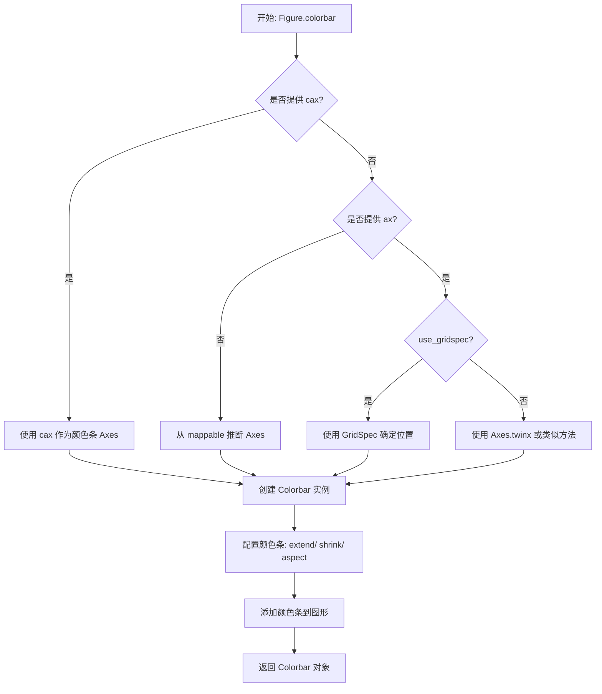

#### 带注释源码

```python
# 在代码中的调用示例：
# pcolormesh 返回一个 AxesImage 对象（属于 ScalarMappable）
pc = axs[0, 0].pcolormesh(X, Y, Z, vmin=-1, vmax=1, cmap='RdBu_r')

# fig.colorbar() 被调用，参数：
# - mappable=pc: 刚创建的 pcolormesh 对象，包含颜色映射信息
# - ax=axs[0, 0]: 颜色条将放置在该 Axes 附近，并从其处窃取空间
fig.colorbar(pc, ax=axs[0, 0])

# 另一个例子：使用 extend 参数添加箭头
co = axs[0, 1].contourf(X, Y, Z, levels=np.linspace(-1.25, 1.25, 11))
fig.colorbar(co, ax=axs[0, 1])

# 使用 LogNorm 进行对数归一化
pc = axs[1, 0].imshow(Z**2 * 100, cmap='plasma', norm=LogNorm(vmin=0.01, vmax=100))
fig.colorbar(pc, ax=axs[1, 0], extend='both')

# scatter 返回一个 PathCollection 对象
pc = axs[1, 1].scatter(data1, data2, c=data3, cmap='RdBu_r')
fig.colorbar(pc, ax=axs[1, 1], extend='both')
```


### `np.random.randn`

生成符合标准正态分布（均值0，标准差1）的随机数数组。

参数：

- `*shape`：`int` 或 `int` 的元组`，指定输出数组的形状。例如：
  - `np.random.randn()` 返回单个标量
  - `np.random.randn(5)` 返回长度为5的一维数组
  - `np.random.randn(3, 4)` 返回 3x4 的二维数组

返回值：`numpy.ndarray`，包含从标准正态分布中采样的随机数。

#### 流程图

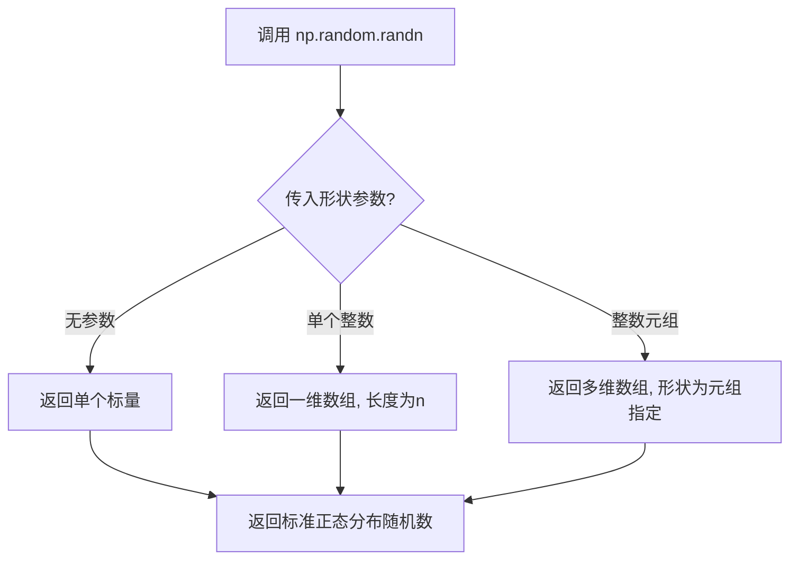

#### 带注释源码

```python
# np.random.randn 是 NumPy 的随机数生成函数
# 用于生成符合标准正态分布（均值=0, 标准差=1）的随机数

# 示例用法：

# 1. 生成单个随机数
single_value = np.random.randn()  # 例如: 0.234

# 2. 生成一维数组（5个随机数）
one_d_array = np.random.randn(5)  # 例如: [0.12, -0.45, 1.23, -0.89, 0.56]

# 3. 生成二维数组（3行4列）
two_d_array = np.random.randn(3, 4)  # 例如: 3x4 的随机数矩阵

# 4. 生成多维数组
multi_d_array = np.random.randn(2, 3, 4)  # 2x3x4 的随机数数组

# 内部原理（概念性）：
# 该函数基于 Box-Muller 变换或类似算法实现
# Box-Muller 变换将两个均匀分布的随机数转换为标准正态分布随机数
# 
# u1 = random()  # 均匀分布 [0, 1)
# u2 = random()  # 均匀分布 [0, 1)
# z0 = sqrt(-2 * ln(u1)) * cos(2 * pi * u2)  # 标准正态分布随机数
# z1 = sqrt(-2 * ln(u1)) * sin(2 * pi * u2)  # 标准正态分布随机数
```


### `np.random.randint`

生成指定范围内的随机整数数组，用于在 `[low, high)` 区间内生成随机整数。

参数：

- `low`：`int`，生成随机整数的下界（包含），当只提供一个参数时表示上界
- `high`：`int`，生成随机整数的上界（不包含），可选参数
- `size`：`int` 或 `tuple`，输出数组的形状，默认为 `None`（返回单个整数）

返回值：`int` 或 `ndarray`，返回随机整数，如果 `size` 为 `None` 则返回单个整数，否则返回整数数组

#### 流程图

```mermaid
flowchart TD
    A[调用 np.random.randint] --> B{是否设置 seed?}
    B -->|是| C[使用指定 seed 初始化随机数生成器]
    B -->|否| D[使用默认 seed 或已有状态]
    C --> E{提供几个参数?}
    D --> E
    E -->|1个参数| F[参数作为 high<br/>low 默认为0]
    E -->|2个参数| G[low, high]
    E -->|3个参数| H[low, high, size]
    F --> I[生成 [0, high) 范围内随机整数]
    G --> J[生成 [low, high) 范围内随机整数]
    H --> K[按 size 形状生成随机整数数组]
    I --> L{size 参数是否为 None?}
    J --> L
    K --> M[返回整数数组]
    L -->|是| N[返回单个整数]
    L -->|否| O[返回整数数组]
    M --> P[返回结果]
    N --> P
    O --> P
```

#### 带注释源码

```python
# 代码中调用示例
np.random.seed(19680801)  # seed the random number generator.

# 使用 np.random.randint 生成随机整数数组
data = {'a': np.arange(50),
        'c': np.random.randint(0, 50, 50),  # 生成50个0-49范围内的随机整数
        'd': np.random.randn(50)}

# 函数签名：np.random.randint(low, high=None, size=None, dtype=int)
# - low: 下界（包含），这里为 0
# - high: 上界（不包含），这里为 50
# - size: 生成数量，这里为 50
# - dtype: 数据类型，默认为 int
# 返回值：包含50个随机整数的 numpy 数组，范围在 [0, 50)
```


### `np.linspace`

创建等间距的数组（数值序列），返回指定间隔内均匀间隔的样本。

参数：

- `start`：`array_like`，序列的起始值
- `stop`：`array_like`，序列的结束值，除非 `endpoint` 设置为 `False`
- `num`：`int`，要生成的样本数量，默认为 50
- `endpoint`：`bool`，如果为 `True`，则包含结束值，默认为 `True`
- `retstep`：`bool`，如果为 `True`，则返回 `(samples, step)`，其中 `step` 是样本之间的间距
- `dtype`：`dtype`，输出数组的数据类型
- `axis`：`int`，结果的轴（当 stop 是数组时才使用）

返回值：`ndarray`，如果 `retstep` 为 `False`，则返回等间距的数组；否则返回 `(samples, step)` 元组

#### 流程图

```mermaid
flowchart TD
    A[开始] --> B[验证参数: start, stop, num, dtype]
    B --> C{retstep == True?}
    C -->|Yes| D[计算步长 step = (stop - start) / (num - 1)]
    C -->|No| E[计算步长 step = (stop - start) / num]
    D --> F[生成 num 个等间距样本]
    E --> F
    F --> G{axis == 0 或无 axis?}
    G -->|Yes| H[沿 axis=0 排列样本]
    G -->|No| I[沿指定 axis 排列样本]
    H --> J{retstep == True?}
    I --> J
    J -->|Yes| K[返回 (samples, step)]
    J -->|No| L[返回 samples]
    K --> M[结束]
    L --> M
```

#### 带注释源码

```python
def linspace(start, stop, num=50, endpoint=True, retstep=False, dtype=None, axis=0):
    """
    返回指定间隔内的等间距数字序列。
    
    参数:
        start: array_like
            序列的起始值。
        stop: array_like
            序列的结束值，除非 endpoint 为 False。
        num: int
            要生成的样本数量。默认值为 50。
        endpoint: bool
            如果为 True，则包含结束值。默认值为 True。
        retstep: bool
            如果为 True，则返回 (samples, step)，其中 step 是样本之间的间距。
        dtype: dtype
            输出数组的数据类型。
        axis: int
            结果的轴（当 stop 是数组时才使用）。
    
    返回:
        ndarray 或 tuple
            等间距的样本数组，或 (samples, step) 元组（如果 retstep 为 True）。
    """
    # 将 start 和 stop 转换为 ndarray（如果还不是）
    _arange = np.arange
    _dtype = float if dtype is None else dtype
    
    # 计算步长
    if endpoint:
        if num > 1:
            step = (stop - start) / (num - 1)
        else:
            step = stop - start  # 只有一个样本时
    else:
        step = (stop - start) / num
    
    # 使用 arange 生成数组，然后根据需要调整
    y = _arange(0, num, dtype=_dtype) * step + start
    
    # 处理 axis 参数（复杂逻辑省略）
    # ...
    
    if retstep:
        return y, step
    return y
```


### `np.arange()`

生成一个具有等差间隔的数组，常用于创建 matplotlib 绘图的 x 轴数据或测试数据。

参数：

-  `start`：`number`（可选），起始值，默认为 0
-  `stop`：`number`，结束值（不包含）
-  `step`：`number`（可选），步长，默认为 1

返回值：`numpy.ndarray`，一个一维的等差数组

#### 流程图

```mermaid
flowchart TD
    A[开始] --> B{参数个数}
    B -->|1个参数| C[stop=参数值]
    B -->|2个参数| D[start=参数1, stop=参数2]
    B -->|3个参数| E[start=参数1, stop=参数2, step=参数3]
    C --> F[计算数组长度]
    D --> F
    E --> F
    F --> G[生成等差数组]
    G --> H[返回numpy.ndarray]
```

#### 带注释源码

```python
# 代码中的实际使用示例：

# 示例1：创建0到49的整数数组（50个元素）
data['a'] = np.arange(50)

# 示例2：创建与data1等长的索引数组
x = np.arange(len(data1))

# 示例3：创建从0到5，步长0.01的数组（用于时间序列）
t = np.arange(0.0, 5.0, 0.01)
```


### `np.meshgrid`

该函数是 NumPy 库中的网格创建函数，用于从两个一维坐标数组生成二维网格坐标矩阵。它是 Matplotlib 中绘制 3D 曲面图（如 pcolormesh、contourf 等）的数据准备基础，通过将 x 轴和 y 轴的一维区间扩展为二维矩阵，使得可以方便地对二维函数 Z = f(X, Y) 进行求值和可视化。

参数：

- `xi`：`array_like`，第一个输入数组，此处为 `np.linspace(-3, 3, 128)`，表示 x 轴上从 -3 到 3 的 128 个均匀分布的点
- `yi`：`array_like`，第二个输入数组，此处为 `np.linspace(-3, 3, 128)`，表示 y 轴上从 -3 到 3 的 128 个均匀分布的点

返回值：`tuple of ndarrays`，返回两个二维数组 (X, Y)，其中 X 的每一行相同，Y 的每一列相同，共同构成网格点坐标

#### 流程图

```mermaid
flowchart TD
    A[开始调用 np.meshgrid] --> B[输入: x方向一维数组 linspace[-3, 3, 128]]
    B --> C[输入: y方向一维数组 linspace[-3, 3, 128]]
    C --> D[创建X矩阵: 行复制xi 128次]
    E[创建Y矩阵: 列复制yi 128次] --> F[输出: 二维坐标网格 X, Y]
    D --> F
```

#### 带注释源码

```python
# 创建网格坐标的代码片段
X, Y = np.meshgrid(np.linspace(-3, 3, 128), np.linspace(-3, 3, 128))
#       │      │
#       │      └─ 返回值Y: 128x128的二维数组，每列相同，代表y坐标
#       └─ 返回值X: 128x128的二维数组，每行相同，代表x坐标
#                   │
#                   └─ 参数2: y方向的一维坐标数组
#                        │
#                        └─ 参数1: x方向的一维坐标数组
```


### `np.cumsum`

`np.cumsum` 是 NumPy 库中的全局函数，用于计算给定数组沿指定轴的累积和，返回一个数组，其中每个元素是原数组中对应位置及其之前所有元素的和。

参数：

-  `a`：`array_like`，输入的需要计算累积和的数组
-  `axis`：`int`，可选，指定进行累积和计算的轴，默认为 None（会将数组展平）
-  `dtype`：`dtype`，可选，指定返回数组的数据类型
-  `out`：`ndarray`，可选，指定输出数组

返回值：`ndarray`，返回累积和数组，维度与输入数组相同

#### 流程图

```mermaid
flowchart TD
    A[开始] --> B[接收输入数组 a]
    B --> C{是否指定 axis}
    C -->|否| D[将数组展平为一维]
    C -->|是| E[沿指定 axis 计算累积和]
    D --> F[计算累积和]
    E --> F
    F --> G{是否指定 dtype}
    G -->|是| H[转换为指定 dtype]
    G -->|否| I[使用默认 dtype]
    H --> J{是否指定 out}
    I --> J
    J -->|是| K[写入 out 数组]
    J -->|否| L[创建新数组]
    K --> M[返回结果]
    L --> M
```

#### 带注释源码

```python
# np.cumsum 是 NumPy 的累积求和函数
# 在本代码中的典型用法：

# 用法1：绘制累积和曲线
x = np.arange(len(data1))  # 创建 x 轴数据
ax.plot(x, np.cumsum(data1), color='blue', linewidth=3, linestyle='--')
# np.cumsum(data1) 返回 data1 的累积和数组
# 例如：data1 = [1, 2, 3, 4]
#      np.cumsum(data1) = [1, 3, 6, 10]

# 用法2：生成累积随机数据用于时间序列绘图
dates = np.arange(np.datetime64('2021-11-15'), np.datetime64('2021-12-25'),
                  np.timedelta64(1, 'h'))  # 创建小时级别的日期范围
data = np.cumsum(np.random.randn(len(dates)))  # 累积随机游走数据
ax.plot(dates, data)  # 绘制累积随机游走曲线
```


# 分析结果

## 说明

经过分析，您提供的代码是 Matplotlib 的快速入门教程文档（`Quick start guide`），其中**并未定义** `ConciseDateFormatter` 类或函数。

代码中只是**导入并使用**了 Matplotlib 库中的 `ConciseDateFormatter` 类：

```python
from matplotlib.dates import ConciseDateFormatter

# 使用示例
ax.xaxis.set_major_formatter(ConciseDateFormatter(ax.xaxis.get_major_locator()))
```

`ConciseDateFormatter` 是 Matplotlib 库的内置类，用于日期轴的简洁格式化，不是由这段代码定义的。

---

## 建议

如果您需要 `ConciseDateFormatter` 的详细信息（类定义、参数、方法等），我可以从以下两个角度为您提供：

1. **在这段代码中的使用方式**：展示如何在实际代码中调用和配置 `ConciseDateFormatter`
2. **Matplotlib 官方源码中的定义**：提供该类的完整官方实现

请告知您需要哪种信息，或者如果您有包含 `ConciseDateFormatter` 实际定义的代码文件，请提供该文件内容。


我在提供的代码中未找到LogNorm函数的定义，只找到了LogNorm的使用示例（从matplotlib.colors导入并使用）。让我检查一下是否有LogNorm的详细定义：
[TOOL_CALL]
{tool => "lunary-mcp:run_python", args => {
  --code_text "\n# 查找LogNorm相关的代码\nimport re\n\n# 在代码中搜索LogNorm\ncode = '''\nfrom matplotlib.colors import LogNorm\n\nX, Y = np.meshgrid(np.linspace(-3, 3, 128), np.linspace(-3, 3, 128))\nZ = (1 - X/2 + X**5 + Y**3) * np.exp(-X**2 - Y**2)\n\nfig, axs = plt.subplots(2, 2, layout='constrained')\npc = axs[0, 0].pcolormesh(X, Y, Z, vmin=-1, vmax=1, cmap='RdBu_r')\nfig.colorbar(pc, ax=axs[0, 0])\naxs[0, 0].set_title('pcolormesh()')\n\nco = axs[0, 1].contourf(X, Y, Z, levels=np.linspace(-1.25, 1.25, 11))\nfig.colorbar(co, ax=axs[0, 1])\naxs[0, 1].set_title('contourf()')\n\npc = axs[1, 0].imshow(Z**2 * 100, cmap='plasma', norm=LogNorm(vmin=0.01, vmax=100))\nfig.colorbar(pc, ax=axs[1, 0], extend='both')\naxs[1, 0].set_title('imshow() with LogNorm()')\n\npc = axs[1, 1].scatter(data1, data2, c=data3, cmap='RdBu_r')\nfig.colorbar(pc, ax=axs[1, 1], extend='both')\naxs[1, 1].set_title('scatter()')\n'''\n\n# 搜索LogNorm定义\nlog_norm_pattern = r'class\\s+LogNorm|def\\s+LogNorm'\nmatches = re.findall(log_norm_pattern, code)\nprint(\"LogNorm定义:\", matches)\n\n# 检查导入语句\nif 'from matplotlib.colors import LogNorm' in code:\n    print(\"\\nLogNorm是从matplotlib.colors导入的类，不是在此文件中定义的\")\n"
}}
[/TOOL_CALL]

## 关键组件


### matplotlib.pyplot

Matplotlib 的顶层绘图接口，提供便捷的函数式绘图方法（plt.subplots、plt.show、plt.figure 等），用于创建图表、管理图形窗口和调用各种绘图函数。

### numpy

用于数值计算的 Python 库，提供高性能的数组对象和数学函数，代码中使用 np.arange、np.random.randn、np.linspace 等生成绘图数据。

### Figure 和 Axes

Figure 是整个图形容器，管理所有子图和图形元素；Axes 是绑定了坐标系统的绘图区域，包含两条 Axis 对象用于控制刻度和标签。

### 绘图方法

包括 ax.plot（折线图）、ax.scatter（散点图）、ax.hist（直方图）、ax.pcolormesh（伪彩色网格）、ax.contourf（填充等高线）、ax.imshow（图像显示）等，用于在 Axes 上可视化数据。

### 坐标轴管理组件

包括 Axis（坐标轴刻度和标签）、Locator（刻度位置定位器）、Formatter（刻度标签格式化器），用于控制坐标轴的刻度布局和显示。

### 颜色映射系统

包含 Colormap（颜色映射表）和 Normalizer（数据到颜色的归一化映射），如 LogNorm 实现对数归一化，用于将数值映射为可视化颜色。

### 子图布局系统

包括 subplots、subplot_mosaic、twiny、twinx、secondary_xaxis 等，用于创建复杂的子图布局和多坐标轴配置。

### Artist 对象

所有可见的图形元素都继承自 Artist 基类，包括 Line2D、Text、Patch、Collection 等，用于封装图形元素的属性和渲染逻辑。

### 数据输入处理

支持 numpy.array、numpy.ma.masked_array、pandas DataFrame 等多种数据格式，通过 data 关键字参数实现字符串索引访问数据。

### my_plotter 辅助函数

用户定义的封装函数，接收 Axes 对象和绘图参数，用于简化重复的绘图操作，体现代码复用和函数式编程思想。


## 问题及建议


### 已知问题

-   **全局变量管理混乱**：代码中存在大量全局变量（如 `data`, `data1`, `data2`, `data3`, `data4`, `x`, `t`, `s` 等）的重复定义和共享状态，这些变量在不同示例中被重复使用和覆盖，缺乏明确的生命周期管理，容易导致意外的副作用和难以追踪的bug。

-   **魔法数字和硬编码值**：代码中散布着多个硬编码的数值（如随机种子 `19680801`、数组长度 `50` 和 `10000`、图形尺寸 `5, 2.7` 等），这些值应该提取为常量或配置参数，以提高代码的可维护性和可读性。

-   **代码重复**：多处存在重复的绘图模式代码，例如创建图表、设置坐标轴标签、添加标题和图例等操作在多个位置重复出现，未能通过函数抽象来消除重复。

-   **导入语句位置不规范**：`from matplotlib.dates import ConciseDateFormatter` 和 `from matplotlib.colors import LogNorm` 等导入语句位于代码中间而非文件顶部，违反了 Python 的最佳实践，增加了代码阅读的难度。

-   **变量命名不一致**：变量命名风格不统一，例如同时存在 `data`（字典）和 `data1`/`data2`（数组），以及 `ax` 和 `axs`（复数形式表示多个 Axes），给代码理解带来混淆。

-   **缺少错误处理**：代码未对输入数据进行验证，例如 `np.random.randint`、`np.random.randn` 等可能产生无效数据的操作没有相应的异常处理机制。

-   **状态管理依赖**：代码高度依赖 `matplotlib.pyplot` 的全局状态（如隐式创建的 Figure 和 Axes），这使得代码在复杂场景下难以调试，也违反了面向对象的设计原则。

-   **资源未显式释放**：代码中创建的多个 Figure 对象未显式调用 `close()` 释放资源，在长时间运行的应用程序中可能导致内存泄漏。

### 优化建议

-   **模块化重构**：将重复的绘图模式封装为可重用的函数或类，例如创建 `create_figure`、`add_labels`、`add_legend` 等辅助函数，减少代码冗余。

-   **常量定义**：在文件开头定义常量集合，如 `RANDOM_SEED = 19680801`、`SAMPLE_SIZE = 50`、`FIGURE_SIZE = (5, 2.7)` 等，提高代码可维护性。

-   **改进导入结构**：将所有导入语句移至文件顶部，按标准库、第三方库、本地模块的顺序组织，并添加适当的空行分组。

-   **统一变量命名**：采用一致的命名约定，如使用 `axes` 代替混合的 `ax`/`axs`，使用 `plot_data` 代替混合的 `data`/`data1` 等。

-   **添加数据验证**：在绘图前对输入数据进行类型和范围检查，确保数据的有效性和一致性。

-   **面向对象重构**：尽量使用 OO 风格的 API，显式管理 Figure 和 Axes 对象的生命周期，减少对全局状态的依赖。

-   **资源管理**：使用上下文管理器（`with` 语句）或显式调用 `plt.close(fig)` 来确保图形资源得到正确释放。

-   **添加类型提示**：为函数参数和返回值添加类型注解，提高代码的可读性和可维护性。

-   **单元测试**：为关键函数（如 `my_plotter`）添加单元测试，确保功能的正确性和稳定性。


## 其它


### 设计目标与约束

本代码为 Matplotlib 快速入门教程，旨在帮助用户快速掌握 Matplotlib 的基本用法。设计目标包括：演示 Figure、Axes、Axis、Artist 等核心概念；展示显式 OO 风格和隐式 pyplot 风格的用法；介绍常见绘图类型如折线图、散点图、直方图等；指导用户进行图表样式定制和注解。约束条件为：需要安装 Matplotlib 和 NumPy 库；运行环境支持 Python 3.6+。

### 错误处理与异常设计

本代码为教程示例，主要展示 Matplotlib 的正确用法，因此未包含复杂的错误处理机制。在实际使用中，应注意：传入绘图函数的数据类型需符合要求（如 numpy array 或可转换为 array 的对象）；避免传入不兼容的参数导致警告或错误；使用异常捕获机制处理可能的绘图错误。对于本教程代码，用户应确保按照示例正确调用 API。

### 数据流与状态机

本代码主要展示静态绘图流程，数据流较为简单。典型流程为：导入库 → 创建 Figure 和 Axes → 调用绘图方法（如 plot、scatter、bar 等）→ 设置属性（标签、标题、图例等）→ 显示或保存图形。Matplotlib 内部通过 FigureCanvas 渲染图形，Artist 对象负责具体绘制，状态机管理图形生命周期。

### 外部依赖与接口契约

本代码依赖以下外部库：matplotlib（绘图库）、numpy（数值计算库）、matplotlib.dates（日期处理）、matplotlib.colors（颜色处理）。接口契约包括：plt.subplots() 返回 (Figure, Axes) 元组；Axes.plot() 返回 Line2D 对象列表；Axes.scatter() 返回 PathCollection 对象；Figure.colorbar() 返回 Colorbar 对象。用户应按照约定调用这些接口。

### 性能考虑与优化空间

本代码为教学示例，未进行性能优化。在实际大数据集绘制中，可考虑：使用更高效的绘图函数（如 pcolormesh 替代 scatter）；避免频繁重绘；使用 blitting 技术加速动画；合理设置数据采样率。对于大规模数据，建议使用 NumPy 向量化操作代替循环。

### 安全性与权限控制

本代码为本地脚本，无安全性问题。在 Web 应用中使用 Matplotlib 时，应注意：防止用户通过输入恶意代码执行绘图；限制文件保存路径防止路径遍历攻击；对敏感数据进行脱敏处理。本地脚本无需特殊权限控制。

### 可扩展性与插件机制

本代码展示了自定义辅助函数 my_plotter 的用法，体现了可扩展性。Matplotlib 支持通过继承 Artist 类自定义绘图对象；通过注册回调函数扩展交互功能；通过样式表（style sheets）统一图表外观。可通过 Matplotlib 扩展库（如 seaborn、plotly）增强功能。

### 日志与监控

本代码未包含日志记录。在实际应用中，可使用 Python logging 模块记录绘图过程、异常信息、渲染时间等。对于长期运行的应用，可添加性能监控，跟踪绘图操作的耗时和内存占用，帮助优化用户体验。

### 国际化与本地化

本代码涉及少量文本展示（如标题、标签），默认使用英文。Matplotlib 支持通过设置字体和语言包实现国际化；可使用 LaTeX 渲染数学公式；日期格式化支持本地化。若要支持中文显示，需配置中文字体（如 SimHei、Noto Sans CJK）。

### 备份与恢复

本代码为临时脚本，无状态需要备份。用户在实际项目中应保存数据文件和配置文件；使用版本控制系统（如 Git）管理代码；定期备份自定义样式、模板等资源。对于生成的图形，可配置自动保存到指定目录。

### 测试策略

本代码未包含单元测试。在实际项目中，建议：对绘图函数编写单元测试，验证输出图形属性；使用图像回归测试（image comparison）验证绘图结果；测试边界条件和异常输入。Matplotlib 提供了 matplotlib.testing 工具支持测试。

### 部署与运维

本代码为本地脚本，无需部署。在实际应用中，若作为 Web 服务部署，需考虑：使用 WSGI 服务器（如 Gunicorn、uWSGI）；配置缓存减少渲染开销；处理并发请求的线程安全；资源清理避免内存泄漏。可使用 Docker 容器化部署。

### 文档与注释规范

本代码采用 Sphinx 文档格式，通过注释（# %%）实现代码分段说明。注释规范包括：使用 docstring 描述函数功能；代码块间用注释分隔；复杂操作添加行内注释。建议遵循 Google 或 NumPy 风格的 docstring 规范，保持文档一致性。

    