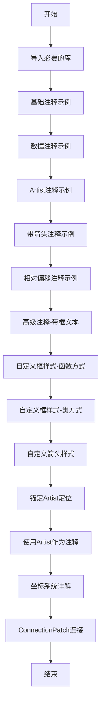
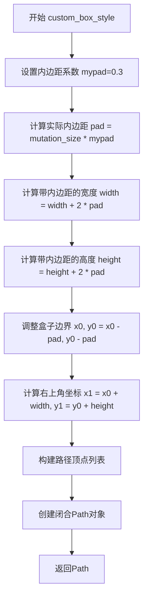
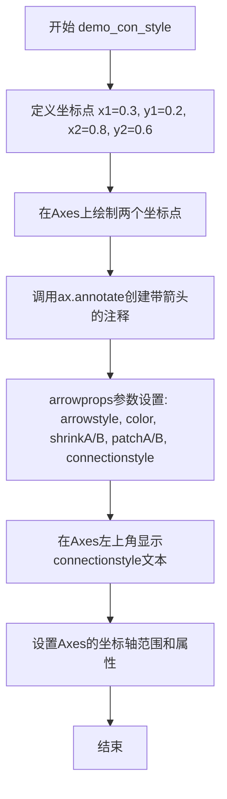

# `matplotlib\galleries\users_explain\text\annotations.py` 详细设计文档

这是matplotlib的注释(Annotations)教程文档，通过大量示例代码演示如何使用ax.annotate()、ax.text()等方法创建带箭头或不带箭头的文本注释，支持多种坐标系统（data、axes fraction、figure fraction等），以及自定义框样式、箭头样式和连接样式的高级用法。

## 整体流程



## 类结构

```
源代码文件（文档教程类）
├── 导入模块
│   ├── matplotlib.pyplot (plt)
│   ├── numpy (np)
│   ├── matplotlib.patches (mpatches, BoxStyle, Circle, Ellipse, ConnectionPatch, Annulus)
│   ├── matplotlib.path (Path)
│   ├── matplotlib.offsetbox (AnchoredText, DrawingArea, HPacker, TextArea, AnchoredOffsetbox, AnnotationBbox, OffsetImage)
│   └── mpl_toolkits.axes_grid1.anchored_artists (AnchoredDrawingArea, AnchoredAuxTransformBox)
├── 顶层函数
│   ├── custom_box_style (自定义框样式函数)
│   └── demo_con_style (连接样式演示函数)
└── 顶层类
    └── MyStyle (自定义BoxStyle类)
```

## 全局变量及字段


### `fig`
    
matplotlib的Figure对象，表示整个图形窗口

类型：`Figure`
    


### `ax`
    
matplotlib的Axes对象，表示一个坐标轴子图

类型：`Axes`
    


### `ax1`
    
matplotlib的Axes对象，表示第一个坐标轴子图

类型：`Axes`
    


### `ax2`
    
matplotlib的Axes对象，表示第二个坐标轴子图

类型：`Axes`
    


### `t`
    
时间数组，由np.arange生成，用于表示时间序列

类型：`ndarray`
    


### `s`
    
余弦信号数组，通过np.cos计算得到

类型：`ndarray`
    


### `line`
    
matplotlib的Line2D对象，表示plot方法绘制的线条

类型：`Line2D`
    


### `arr`
    
matplotlib的FancyArrowPatch对象，表示带样式的箭头

类型：`FancyArrowPatch`
    


### `annotations`
    
注释文本列表，包含需要标注的字符串

类型：`list`
    


### `x`
    
散点图的x坐标列表

类型：`list`
    


### `y`
    
散点图的y坐标列表

类型：`list`
    


### `r`
    
极坐标中的半径数组

类型：`ndarray`
    


### `theta`
    
极坐标中的角度数组

类型：`ndarray`
    


### `ind`
    
索引值，用于访问数组中的特定元素

类型：`int`
    


### `thisr`
    
特定点的半径坐标

类型：`float`
    


### `thistheta`
    
特定点的角度坐标

类型：`float`
    


### `el`
    
matplotlib的Ellipse对象，表示椭圆形状

类型：`Ellipse`
    


### `p1`
    
matplotlib的Circle对象，表示圆形绘制元素

类型：`Circle`
    


### `p2`
    
matplotlib的Circle对象，表示第二个圆形绘制元素

类型：`Circle`
    


### `box1`
    
matplotlib的TextArea对象，用于包含文本的容器

类型：`TextArea`
    


### `box2`
    
matplotlib的DrawingArea对象，用于包含图形元素的容器

类型：`DrawingArea`
    


### `box`
    
matplotlib的HPacker对象，用于水平排列子元素

类型：`HPacker`
    


### `anchored_box`
    
matplotlib的AnchoredOffsetbox对象，表示锚定的偏移框

类型：`AnchoredOffsetbox`
    


### `text`
    
matplotlib的Text对象，表示文本绘制元素

类型：`Text`
    


### `da`
    
matplotlib的DrawingArea对象，用于绘制区域

类型：`DrawingArea`
    


### `annulus`
    
matplotlib的Annulus对象，表示圆环形状

类型：`Annulus`
    


### `ab1`
    
matplotlib的AnnotationBbox对象，表示注解框

类型：`AnnotationBbox`
    


### `ab2`
    
matplotlib的AnnotationBbox对象，表示第二个注解框

类型：`AnnotationBbox`
    


### `im`
    
matplotlib的OffsetImage对象，表示带偏移的图像

类型：`OffsetImage`
    


### `con`
    
matplotlib的ConnectionPatch对象，用于连接两个坐标点

类型：`ConnectionPatch`
    


### `xy`
    
连接点坐标元组

类型：`tuple`
    


### `t1`
    
matplotlib的Text对象，表示第一个文本元素

类型：`Text`
    


### `t2`
    
matplotlib的Text对象，表示第二个文本元素

类型：`Text`
    


### `t3`
    
matplotlib的Text对象，表示第三个文本元素

类型：`Text`
    


### `an1`
    
matplotlib的Annotation对象，表示第一个注解

类型：`Annotation`
    


### `an2`
    
matplotlib的Annotation对象，表示第二个注解

类型：`Annotation`
    


### `offset_from`
    
matplotlib的OffsetFrom对象，用于计算偏移量

类型：`OffsetFrom`
    


### `box`
    
matplotlib的AnchoredAuxTransformBox对象，表示带辅助变换的锚定框

类型：`AnchoredAuxTransformBox`
    


### `MyStyle.pad`
    
框的内边距

类型：`float`
    
    

## 全局函数及方法


### `custom_box_style`

该函数是一个自定义框样式生成函数，用于在matplotlib的文本注释框周围创建带有左侧箭头形状的自定义路径。它接收盒子的位置、尺寸和突变大小作为参数，通过计算内边距并生成包含箭头特征的Path对象来实现自定义框样式。

参数：

- `x0`：`float`，盒子左下角的x坐标
- `y0`：`float`，盒子左下角的y坐标
- `width`：`float`，盒子的宽度
- `height`：`float`，盒子的高度
- `mutation_size`：`float`，突变参考比例，通常为文本字体大小

返回值：`Path`，返回一个matplotlib路径对象，表示带有左侧箭头形状的闭合框路径

#### 流程图



#### 带注释源码

```python
def custom_box_style(x0, y0, width, height, mutation_size):
    """
    Given the location and size of the box, return the path of the box around it.

    Rotation is automatically taken care of.

    Parameters
    ----------
    x0, y0, width, height : float
       Box location and size.
    mutation_size : float
        Mutation reference scale, typically the text font size.
    """
    # 定义内边距系数，用于根据mutation_size计算实际内边距
    mypad = 0.3
    # 根据字体大小计算实际的内边距像素值
    pad = mutation_size * mypad
    
    # 将内边距应用到宽度和高度（两侧各加一个pad）
    width = width + 2 * pad
    height = height + 2 * pad
    
    # 调整盒子左下角坐标，考虑内边距偏移
    x0, y0 = x0 - pad, y0 - pad
    # 计算盒子右上角坐标
    x1, y1 = x0 + width, y0 + height
    
    # 返回新的路径对象
    # 路径包含：左下角->右下角->右上角->左上角->左侧箭头点->左下角（闭合）
    # 箭头点位于左侧边界中点，向左突出一个pad的距离
    return Path([(x0, y0), (x1, y0), (x1, y1), (x0, y1),
                 (x0-pad, (y0+y1)/2), (x0, y0), (x0, y0)],
                closed=True)
```


### `demo_con_style`

该函数是一个演示函数，用于在给定的Axes上可视化不同的连接样式（ConnectionStyle）。它绘制两个点之间的连线，并使用不同的连接样式参数来展示各种箭头连接效果。

参数：

- `ax`：`matplotlib.axes.Axes`，Matplotlib的Axes对象，用于绘制连接样式演示的画布
- `connectionstyle`：`str`，连接样式的字符串描述，指定要演示的连接类型及其参数（如"arc3,rad=0.3"、"angle3,angleA=90,angleB=0"等）

返回值：`None`，该函数不返回任何值，仅执行图形绘制操作

#### 流程图



#### 带注释源码

```python
def demo_con_style(ax, connectionstyle):
    """
    演示不同的连接样式（ConnectionStyle）在注释箭头中的应用。
    
    Parameters
    ----------
    ax : matplotlib.axes.Axes
        要绘制演示的Axes对象。
    connectionstyle : str
        连接样式的字符串描述，格式为"样式名,参数1=值1,参数2=值2"。
        例如："arc3,rad=0.3"表示使用弧形连接样式，弧度为0.3。
    """
    # 定义起始点和结束点的坐标
    x1, y1 = 0.3, 0.2
    x2, y2 = 0.8, 0.6

    # 在Axes上绘制起始点和结束点（用"."表示）
    ax.plot([x1, x2], [y1, y2], ".")

    # 使用annotate方法创建带箭头的注释
    # xy: 箭头指向的坐标点（数据坐标）
    # xytext: 文本所在的坐标点（数据坐标）
    # arrowprops: 箭头属性字典
    ax.annotate("",
                xy=(x1, y1), xycoords='data',
                xytext=(x2, y2), textcoords='data',
                arrowprops=dict(arrowstyle="->", color="0.5",
                                shrinkA=5, shrinkB=5,
                                patchA=None, patchB=None,
                                connectionstyle=connectionstyle,
                                ),
                )

    # 在Axes的左上角（0.05, 0.95）显示连接样式的名称
    # 使用换行符美化显示格式
    ax.text(.05, .95, connectionstyle.replace(",", ",\n"),
            transform=ax.transAxes, ha="left", va="top")

    # 设置Axes的显示属性：
    # xlim, ylim: 坐标轴范围
    # xticks, yticks: 刻度（设为空列表隐藏刻度）
    # aspect: 纵横比
    ax.set(xlim=(0, 1), ylim=(0, 1.25), xticks=[], yticks=[], aspect=1.25)
```


### MyStyle.__init__

MyStyle类的初始化方法，用于创建一个自定义的方框样式对象，并设置内边距参数。

参数：

- `pad`：`float`，默认值0.3，方框的内边距大小（以突变大小的倍数表示）

返回值：`None`，无返回值（构造函数）

#### 流程图

```mermaid
graph TD
    A[开始 __init__] --> B[接收 pad 参数<br/>类型: float<br/>默认值: 0.3]
    B --> C[将 pad 赋值给实例属性 self.pad]
    C --> D[调用父类初始化方法<br/>super().__init__()]
    D --> E[结束 __init__<br/>返回 None]
```

#### 带注释源码

```python
def __init__(self, pad=0.3):
    """
    The arguments must be floats and have default values.

    Parameters
    ----------
    pad : float
        amount of padding
    """
    # 将传入的 pad 参数存储为实例属性，供后续 __call__ 方法使用
    self.pad = pad
    # 调用父类 BoxStyle 的初始化方法，确保继承链正确初始化
    super().__init__()
```


### MyStyle.__call__

该方法是 `MyStyle` 类的可调用接口（`__call__` 方法），用于根据给定的盒子位置和尺寸生成带填充（padding）的路径（Path）对象，支持自动处理旋转。

参数：

- `x0`：`float`，盒子的左下角 x 坐标
- `y0`：`float`，盒子的左下角 y 坐标
- `width`：`float`，盒子的宽度
- `height`：`float`，盒子的高度
- `mutation_size`：`float`，突变参考尺度，通常为文本字体大小

返回值：`Path`，返回围绕盒子的路径对象，包含带箭头的矩形边界

#### 流程图

```mermaid
flowchart TD
    A[开始 __call__] --> B[计算填充值: pad = mutation_size × self.pad]
    B --> C[计算带填充的宽度和高度: width + 2×pad, height + 2×pad]
    C --> D[调整盒子边界: x0-pad, y0-pad]
    D --> E[计算右上角坐标: x1, y1]
    E --> F[构建路径顶点列表]
    F --> G[创建 Path 对象并返回]
    
    subgraph 路径顶点
    F --> F1[(x0, y0) - 左下角]
    F --> F2[(x1, y0) - 右下角]
    F --> F3[(x1, y1) - 右上角]
    F --> F4[(x0, y1) - 左上角]
    F --> F5[(x0-pad, (y0+y1)/2) - 箭头尖端]
    F --> F6[(x0, y0) - 闭合点]
    end
```

#### 带注释源码

```python
def __call__(self, x0, y0, width, height, mutation_size):
    """
    Given the location and size of the box, return the path of the box around it.

    Rotation is automatically taken care of.

    Parameters
    ----------
    x0, y0, width, height : float
        Box location and size.
    mutation_size : float
        Reference scale for the mutation, typically the text font size.
    """
    # 计算填充值：根据突变大小（字体尺寸）和实例的 pad 比例计算实际填充量
    pad = mutation_size * self.pad
    
    # 宽度和高度加上双向填充（左右/上下各加 pad）
    width = width + 2 * pad
    height = height + 2 * pad
    
    # 调整盒子边界：向左下角扩展 pad 距离
    x0, y0 = x0 - pad, y0 - pad
    
    # 计算右上角坐标
    x1, y1 = x0 + width, y0 + height
    
    # 返回新路径：包含矩形四个顶点 + 左侧箭头尖端 + 起点闭合
    # 顶点顺序：左下 → 右下 → 右上 → 左上 → 箭头尖端 → 左下（闭合）
    return Path([(x0, y0), (x1, y0), (x1, y1), (x0, y1),
                 (x0-pad, (y0+y1)/2), (x0, y0), (x0, y0)],
                closed=True)
```

## 关键组件


### ax.annotate()

核心注解方法，支持多种坐标系统定位数据和注解文本，可选箭头连接注解与数据点，支持丰富的文本样式和箭头样式配置。

### ax.text()

简单文本放置方法，支持bbox参数绘制文本框，但定位和样式灵活性不如annotate。

### 坐标系统（xycoords/textcoords）

支持data、axes fraction、figure fraction、offset points、offset pixels、figure points、figure pixels等多种坐标系统，以及Transform实例、Artist实例、混合坐标规范。

### arrowprops

箭头属性字典，控制箭头宽度、头部比例、收缩百分比等，可使用Polygon的关键参数如facecolor。

### BoxStyle._style_list

预定义框样式集合，包含Circle、DArrow、Ellipse、LArrow、RArrow、Round、Round4、Roundtooth、Sawtooth、Square等，支持自定义函数或类实现。

### ConnectionStyle

连接样式类，控制两点之间路径创建方式，支持angle、angle3、arc、arc3、bar等样式。

### ArrowStyle

箭头样式类，将连接路径转换为箭头补丁，支持-、->、-[、|-|、-|>、<-、<->、<|-、<|-|>、fancy、simple、wedge等样式。

### AnchoredText

matplotlib.offsetbox模块中的锚定文本类，可将文本放置在Axes的固定位置，支持frameon、loc、pad等参数。

### AnchoredDrawingArea

固定像素大小的绘图区域，可添加任意艺术家对象，常用于绘制固定尺寸的图形如圆形。

### AnchoredAuxTransformBox

支持数据坐标转换的锚定框，艺术家extent在绘制时根据指定变换确定，随Axes视图限制自动缩放。

### AnnotationBbox

使用OffsetBox容器艺术家作为注解，支持与其他注解方法相同的坐标系统定位，可包含复杂图形。

### ConnectionPatch

无文本的注解连接器，用于连接不同Axes中的数据点，添加到figure层面确保绘制在其他Axes之上。

### custom_box_style()

自定义框样式函数示例，接收盒子的位置和大小以及突变参考尺度，返回Path定义框的形状。

### MyStyle

实现__call__方法的自定义框样式类，可注册到BoxStyle._style_list使用字符串调用，支持旋转自动处理。

### OffsetFrom

matplotlib.text模块中的偏移辅助类，用于创建相对于某个点或艺术家的偏移坐标。

### 混合坐标规范（Blended coordinates）

支持x和y使用不同坐标系统的混合规范，如x使用data坐标，y使用axes fraction。

### Transform实例

transAxes将注解相对于Axes坐标定位，transData使用Axes的数据坐标系统，其他Transform可映射到不同坐标系统。


## 问题及建议


### 已知问题

- **私有API直接操作**：`BoxStyle._style_list["angled"] = MyStyle` 直接修改了私有字典，这种做法依赖于内部实现细节，未来版本可能发生变化，且官方注释明确说明"this registration relies on internal APIs and is therefore not officially supported"。
- **临时状态管理**：使用 `del BoxStyle._style_list["angled"]` 来清理注册的样式，如果代码执行过程中出现异常，清理代码可能不会执行，导致状态残留。
- **魔法数字和硬编码值**：代码中多处使用硬编码的数值如 `0.3`、`0.05`、`0.01` 等magic numbers，缺乏常量定义，降低了可读性和可维护性。
- **重复的图形创建模式**：大量重复的 `fig, ax = plt.subplots(figsize=(3, 3))` 代码，可以抽取为工具函数减少冗余。
- **作用域问题**：在 `demo_con_style` 函数定义后，在后续代码块中被调用，这种跨代码块的函数调用在文档编译环境中可能存在执行顺序问题。
- **内嵌示例代码**：注释掉的 `.. plot::` 代码块中的 `arrowprops` 字典包含中文键名 `"1. connect with connectionstyle"`，虽然被注释不会执行，但若将来启用会导致错误。

### 优化建议

- **官方API替代方案**：对于自定义BoxStyle，建议通过官方文档记录的类继承方式实现，而非直接操作内部字典，或等待官方提供公开的注册接口。
- **上下文管理器模式**：使用 `try/finally` 确保自定义样式的注册和清理一定执行，或实现为上下文管理器。
- **提取配置常量**：将常用的数值（如图形尺寸、缩放因子、颜色值等）提取为模块级常量或配置文件。
- **代码复用**：将重复的 `plt.subplots()` 调用封装为工厂函数，例如 `create_figure(ax_size=(3, 3))`。
- **删除或修复内嵌示例**：移除被注释的包含中文键名的代码块，或修正为英文键名以避免潜在的错误。
- **模块化组织**：将复杂示例中的 `demo_con_style` 等辅助函数集中放置在文档开头或单独模块，提高代码组织清晰度。


## 其它


### 设计目标与约束

本代码是matplotlib官方文档的注释教程模块，旨在展示matplotlib注释系统的完整功能。主要设计目标包括：1）提供清晰的注释功能演示用例；2）展示多种坐标系统使用方法；3）演示自定义箭头和框样式的实现方式；4）作为文档教程供用户学习参考。约束方面，代码需要保持与matplotlib现有API的兼容性，并遵循Sphinx文档规范。

### 错误处理与异常设计

代码主要包含文档字符串和示例代码两大部分。文档部分通过reStructuredText的.. redirect-from::指令处理过时URL的重定向。示例代码中的异常处理主要依赖matplotlib自身的异常抛出机制，例如当用户传入不支持的坐标系统字符串时会触发相应异常。代码中包含参数验证说明，如BoxStyle类的pad参数必须是浮点数类型。

### 数据流与状态机

整体代码流程遵循"导入模块→创建画布→绘制基础元素→添加注释元素→设置属性→显示图形"的基本模式。注释对象的数据流主要涉及：1）xy和xytext坐标数据；2）坐标系统转换器（xycoords、textcoords）；3）箭头属性（arrowprops）；4）样式属性（boxstyle、connectionstyle）。状态转换主要体现在坐标系统的解析过程：从字符串标识（如'data'、'axes fraction'）到Transform对象的转换。

### 外部依赖与接口契约

核心依赖包括：matplotlib库（pyplot、patches、path、text、offsetbox模块）、numpy数学库、mpl_toolkits.axes_grid1工具包。接口契约方面：annotate()方法接受xy、xytext、xycoords、textcoords、arrowprops等参数；text()方法支持bbox参数用于框样式；BoxStyle类需实现__call__方法返回Path对象；自定义框样式函数签名必须为(x0, y0, width, height, mutation_size)形式。

### 性能考虑与优化空间

代码主要用于文档演示，性能不是首要考量。但存在以下优化空间：1）重复创建相同的图形对象可考虑缓存；2）自定义框样式函数可以预计算部分几何结果；3）ArrowStyle和ConnectionStyle的组合使用可预先验证兼容性。在实际应用中使用时，对于大量注释场景建议预先定义样式对象而非每次创建新实例。

### 安全性与输入验证

代码主要面向文档展示，安全性风险较低。输入验证主要集中在：1）坐标参数必须是数值类型或符合坐标系统规范的字符串；2）样式参数需符合对应类的接口要求；3）ArrowStyle参数需与ConnectionStyle兼容（如fancy等样式需要arc3/angle3连接方式）。建议在实际应用中增加参数类型检查和边界值验证。

### 可扩展性设计

代码展示了良好的可扩展性设计：1）BoxStyle._style_list字典支持运行时注册自定义框样式；2）ConnectionStyle和ArrowStyle均可通过继承进行扩展；3）支持通过Transform对象实现自定义坐标系统；4）AnnotationBbox支持任意OffsetBox子类的组合使用。扩展时需遵循现有接口规范并注意与现有系统的兼容性。

### 测试覆盖与验证

代码本身为文档教程，测试主要通过Sphinx的plot directive执行。验证方式包括：1）代码示例能否成功执行无报错；2）生成的图形是否符合预期；3）文档链接是否有效。建议在实际项目中为自定义样式类编写单元测试，验证Path对象的closed属性和顶点顺序是否正确。

### 版本兼容性与迁移

代码基于matplotlib当前版本编写，使用了AnchoredAuxTransformBox、AnnotationBbox等较新API。需注意：1）BoxStyle._style_list的直接操作依赖内部API，后续版本可能有变化；2）部分连接样式（如bar）的行为未明确定义，可能在未来版本调整；3）某些ArrowStyle与ConnectionStyle的组合限制需关注版本更新说明。迁移时应测试自定义样式在新版本中的兼容性。

### 图形渲染与输出

代码生成的图形输出格式由matplotlib后端决定，默认支持PNG、PDF、SVG等格式。关键渲染参数包括：1）figsize控制画布尺寸；2）layout='compressed'优化布局空间；3）aspect参数控制坐标轴比例。渲染过程中涉及的变换流程：坐标转换→路径裁剪→路径收缩→箭头变形→最终绘制。


    