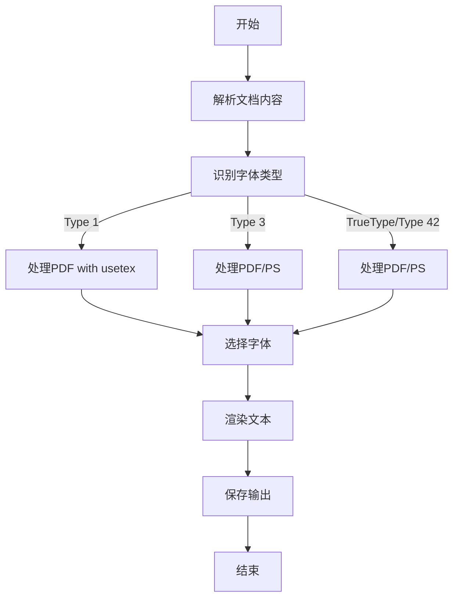

# `matplotlib\galleries\users_explain\text\fonts.py` 详细设计文档

This document provides an overview of the font handling in Matplotlib, including font types, subsetting, core fonts, and font selection algorithms.

## 整体流程



## 类结构

```
Fonts in Matplotlib
├── Fonts in PDF and PostScript
│   ├── Types of Fonts
│   ├── Font subsetting
│   ├── Core Fonts
│   └── Fonts in PDF and PostScript
├── Fonts in SVG
├── Fonts in Agg
└── How Matplotlib selects fonts
```

## 全局变量及字段


    

## 全局函数及方法


## 关键组件


### 张量索引与惰性加载

张量索引与惰性加载是深度学习框架中常用的技术，用于高效地处理大型数据集。它允许在需要时才计算数据，从而减少内存消耗和提高计算效率。

### 反量化支持

反量化支持是深度学习模型优化中的一种技术，它通过将量化后的模型转换回浮点模型，以便进行进一步的训练或推理。

### 量化策略

量化策略是深度学习模型优化中的一种技术，它通过将模型的权重和激活值从浮点数转换为固定点数，以减少模型的存储和计算需求。


## 问题及建议


### 已知问题

-   **文档结构**: 代码块中的文档结构较为复杂，包含多个子标题和表格，但没有明确的逻辑流程图或流程描述，这可能会对阅读和理解文档造成困难。
-   **技术债务**: 代码块中提到了Adobe对Type 1字体支持的限制，这可能导致Matplotlib在处理某些文档时遇到兼容性问题。
-   **性能问题**: 文档中提到Matplotlib使用`fontTools`库进行字体子集化，这是一个复杂的过程，可能会对性能产生一定影响。
-   **代码注释**: 代码块中的注释较少，这可能会影响其他开发者对代码的理解和维护。

### 优化建议

-   **文档结构**: 建议添加流程图或流程描述，以清晰地展示文档的整体结构和逻辑流程。
-   **兼容性**: 考虑在Matplotlib中添加对其他字体格式的支持，以应对Adobe对Type 1字体支持的限制。
-   **性能优化**: 对字体子集化过程进行性能优化，例如通过并行处理或优化算法。
-   **代码注释**: 增加代码注释，以提高代码的可读性和可维护性。
-   **错误处理**: 完善错误处理机制，以应对字体加载、渲染过程中可能出现的异常情况。
-   **文档更新**: 定期更新文档，以反映Matplotlib的最新功能和改进。


## 其它


### 设计目标与约束

- 设计目标：
  - 提供一个灵活的字体管理机制，允许用户自定义和配置字体。
  - 支持多种字体格式，包括Type 1, Type 3, TrueType, OpenType等。
  - 保证在不同平台和渲染引擎上的字体渲染一致性。
  - 提供字体子集功能，以减少输出文件大小。
  - 支持字体回退机制，确保所有字符都能被渲染。

- 约束：
  - 遵循CSS1字体选择算法。
  - 与FreeType库兼容。
  - 与TeX引擎兼容。
  - 与PostScript和PDF规范兼容。

### 错误处理与异常设计

- 错误处理：
  - 当无法加载或渲染字体时，抛出异常。
  - 当字体格式不正确时，抛出异常。
  - 当字体文件损坏时，抛出异常。

- 异常设计：
  - 定义自定义异常类，如`FontLoadError`、`FontRenderError`等。
  - 异常信息应包含错误原因和可能的解决方案。

### 数据流与状态机

- 数据流：
  - 用户配置字体 -> 字体管理器选择字体 -> 字体渲染 -> 文档输出。

- 状态机：
  - 字体状态：未加载、加载中、加载失败、渲染中、渲染失败。

### 外部依赖与接口契约

- 外部依赖：
  - FreeType库
  - fontTools库
  - TeX引擎

- 接口契约：
  - 字体管理器接口：提供字体选择、加载、渲染等功能。
  - 字体接口：定义字体的属性和方法。
  - 字体渲染接口：定义字体的渲染过程。


    