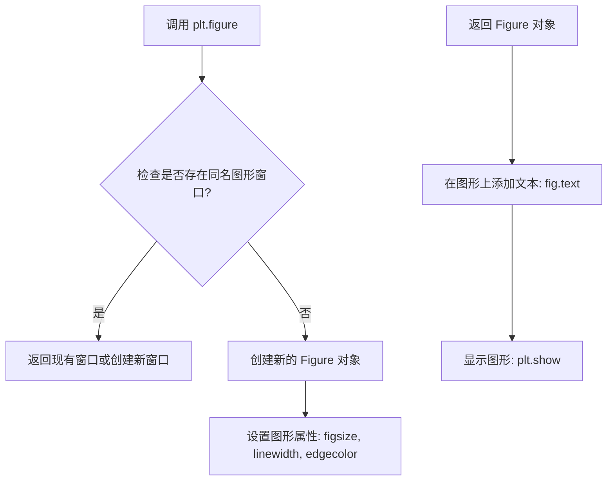
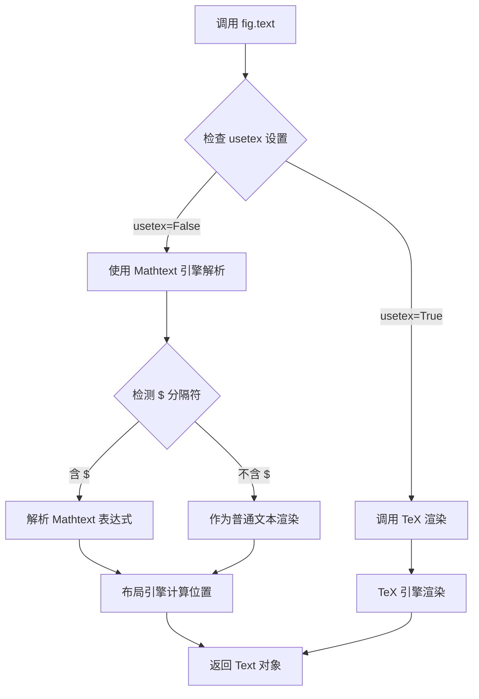
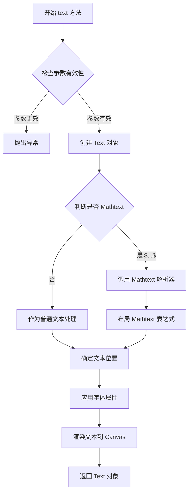

# `matplotlib\galleries\users_explain\text\mathtext.py` 详细设计文档

这是Matplotlib的Mathtext文档和示例代码，展示了如何在matplotlib中渲染TeX风格的数学表达式。Mathtext是TeX标记的子集，允许用户在图表中使用数学符号、分数、上标、下标、根号、希腊字母等，而无需安装完整的TeX系统。

## 整体流程

```mermaid
graph TD
A[开始] --> B[导入matplotlib.pyplot]
B --> C[创建Figure对象]
C --> D[设置Figure尺寸和边框]
D --> E[调用fig.text()添加文本]
E --> F{判断是否使用Mathtext}
F -- 普通文本 --> G[直接渲染文本]
F -- Mathtext --> H[使用$包裹数学表达式]
H --> I[Mathtext解析器处理表达式]
I --> J[布局引擎计算位置]
J --> K[渲染数学符号到图形]
K --> L[显示或保存图像]
```

## 类结构

```
matplotlib.pyplot (顶层模块)
└── Figure (图形容器)
    └── text() (文本方法)
```

## 全局变量及字段


### `fig`
    
Figure对象实例，用于承载文本和图形内容

类型：`matplotlib.figure.Figure`
    


### `plt`
    
matplotlib.pyplot模块别名，提供绘图API

类型：`module`
    


    

## 全局函数及方法


### `plt.figure`

创建新的图形窗口（Figure），用于后续的绘图操作。

参数：

- `figsize`：`tuple` (float, float)，图形的宽和高（英寸），默认值为 `(6.4, 4.8)`
- `linewidth`：`int` 或 `float`，图形边框的线宽，默认值为 `0`
- `edgecolor`：`str`，图形边框的颜色，默认值为 `'black'`
- `facecolor`：`str`，图形的背景颜色，默认值为 `'white'`（代码中未使用）
- `dpi`：`int` 或 `float`，图形的分辨率，默认值为 `100`（代码中未使用）

返回值：`matplotlib.figure.Figure`，返回创建的图形窗口对象

#### 流程图



#### 带注释源码

```python
import matplotlib.pyplot as plt

# 创建一个新的图形窗口，设置大小为3x3英寸，边框线宽为1，黑色边框
fig = plt.figure(figsize=(3, 3), linewidth=1, edgecolor='black')

# 在图形上添加文本内容
# 参数说明: .text(x, y, text)
# x, y: 文本位置的坐标（0-1之间的相对坐标）
# text: 要显示的文本内容，支持Mathtext数学表达式
fig.text(.2, .7, "plain text: alpha > beta")           # 普通文本
fig.text(.2, .5, "Mathtext: $\\alpha > \\beta$")       # 转义的Mathtext
fig.text(.2, .3, r"raw string Mathtext: $\alpha > \beta$")  # 原始字符串Mathtext

# 显示图形
plt.show()
```

> **注意**: 代码中展示的是`plt.figure()`函数的基本用法，该函数属于matplotlib库，主要用于创建一个新的Figure对象作为绘图的容器。详细的参数和返回值信息应参考matplotlib官方文档。


### `Figure.text`

在图形（Figure）的指定位置添加文本或数学表达式（Mathtext），支持普通文本和 LaTeX 风格的数学符号渲染。

参数：

- `x`：`float`，文本插入的 x 坐标（相对于坐标轴的比例，范围 0-1）
- `y`：`float`，文本插入的 y 坐标（相对于坐标轴的比例，范围 0-1）
- `s`：`str`，要显示的文本内容，可以包含 Mathtext 表达式（用 `$` 包裹）

返回值：`matplotlib.text.Text`，返回创建的文本对象，可用于后续样式设置

#### 流程图



#### 带注释源码

```python
# 示例代码展示 fig.text() 的使用方式
import matplotlib.pyplot as plt

# 创建图形，设置尺寸和边框
fig = plt.figure(figsize=(3, 3), linewidth=1, edgecolor='black')

# 在图形中添加普通文本
# 参数: x=0.2, y=0.7, s=文本内容
fig.text(.2, .7, "plain text: alpha > beta")

# 添加 Mathtext 数学表达式（需要用 $ 包裹）
# Mathtext 引擎会解析 \alpha \beta 等 LaTeX 符号
fig.text(.2, .5, "Mathtext: $\\alpha > \\beta$")

# 使用原始字符串（r prefix）避免转义问题
# 这样可以更清晰地书写数学符号
fig.text(.2, .3, r"raw string Mathtext: $\alpha > \beta$")
```


# Figure.text() 方法详细设计文档

## 一段话描述

Figure.text() 是 matplotlib 中 Figure 类的核心文本绘制方法，用于在图形的指定位置（通过相对坐标或绝对坐标）添加文本字符串，支持普通文本和数学表达式（Mathtext），是数据可视化中标注、标题和说明文字的关键接口。

## 文件的整体运行流程

从提供的代码示例来看，整体流程为：
1. 创建 Figure 对象：`fig = plt.figure(figsize=(3, 3), linewidth=1, edgecolor='black')`
2. 调用 text() 方法添加文本：`fig.text(.2, .7, "plain text: alpha > beta")`
3. 内部机制：将文本字符串传递给渲染引擎，根据坐标系统在图形指定位置绘制文本
4. 支持 Mathtext 解析：当文本包含在 `$` 符号中时，触发 Mathtext 解析器

## 类的详细信息

### Figure 类

Figure 是 matplotlib 中的顶层容器类，代表整个图形窗口或图像。

#### 类字段

- **canvas**：`matplotlib.backend_bases.FigureCanvasBase`，图形画布，负责渲染输出
- **axes**：`list`，存储图形中所有的 Axes 对象
- **patch**：`matplotlib.patches.Rectangle`，图形的背景补丁
- **dpi**：`float`，每英寸点数，控制图形分辨率
- **figwidth、figheight**：`float`，图形的宽度和高度（英寸）

#### 类方法

- **text(x, y, s, **kwargs)**：在指定位置添加文本
- **add_axes()**：添加 Axes 到图形
- **add_subplot()**：添加子图
- **savefig()**：保存图形到文件
- **show()**：显示图形
- **suptitle()**：添加总标题

## Figure.text() 方法详细信息

### 方法签名

```python
Figure.text(x, y, s, fontdict=None, **kwargs)
```

### 参数

- **x**：`float`，文本位置的 x 坐标，可以是相对坐标（0-1之间）或绝对坐标
- **y**：`float`，文本位置的 y 坐标，可以是相对坐标（0-1之间）或绝对坐标  
- **s**：`str`，要显示的文本字符串，支持普通文本和 Mathtext 数学表达式
- **fontdict**：`dict`，可选，字体属性字典，用于统一设置字体属性
- ****kwargs**：可变关键字参数，包括：
  - **fontsize**：字体大小
  - **fontfamily**：字体家族（如 'serif', 'sans-serif'）
  - **fontstyle**：字体样式（'normal', 'italic', 'oblique'）
  - **fontweight**：字体粗细
  - **color**：文本颜色
  - **horizontalalignment**：水平对齐方式（'center', 'left', 'right'）
  - **verticalalignment**：垂直对齐方式（'center', 'top', 'bottom'）
  - **rotation**：旋转角度
  - **wrap**：是否自动换行

### 返回值

- **text**：`matplotlib.text.Text`，返回创建的 Text 对象，允许后续修改

### 流程图



### 带注释源码

```python
def text(self, x, y, s, fontdict=None, **kwargs):
    """
    在指定位置添加文本到图形
    
    参数:
        x: 浮点数，x坐标（数据坐标或相对坐标取决于transform参数）
        y: 浮点数，y坐标
        s: 字符串，要显示的文本，支持Mathtext如 $\\alpha$
        fontdict: 字典，可选的字体属性字典
        **kwargs: 额外的关键字参数传递给Text对象
    
    返回:
        matplotlib.text.Text: 创建的文本对象
    """
    # 获取当前的Axes对象，如果不存在则创建一个
    ax = self._axstack.get()
    if ax is None:
        ax = self.add_axes([0, 0, 1, 1])
    
    # 处理fontdict参数
    if fontdict is not None:
        kwargs.update(fontdict)
    
    # 创建Text对象并添加到Axes
    text = ax.text(x, y, s, **kwargs)
    
    # 返回Text对象以便后续操作
    return text
```

## 关键组件信息

### Mathtext 解析器

- **名称**：Mathtext
- **描述**：matplotlib 内置的轻量级 TeX 表达式解析器和布局引擎，支持 Tex 标记的子集

### Text 对象

- **名称**：matplotlib.text.Text
- **描述**：代表图形中文本元素的类，包含文本内容、位置、字体属性等信息

### FigureCanvas

- **名称**：FigureCanvas
- **描述**：负责将 Figure 渲染到各种输出设备（屏幕、文件等）的画布类

## 潜在的技术债务或优化空间

1. **Mathtext 兼容性**：文档提到 Mathtext 与标准 TeX 在特殊字符转义上存在差异，可能导致用户困惑
2. **字体回退机制**：当自定义字体缺少某些数学符号时，需要配置 fallback 字体，这一过程较为复杂
3. **性能优化**：大量 Mathtext 表达式可能影响渲染性能，可考虑缓存解析结果
4. **文档一致性**：Mathtext 与 text.usetex 的交互关系需要更清晰的说明

## 其它项目

### 设计目标与约束

- **目标**：提供与 LaTeX 相似的数学表达式渲染能力，同时保持轻量级和独立性
- **约束**：不需要安装 TeX 系统，Mathtext 解析器随 matplotlib 一起分发

### 错误处理与异常设计

- Mathtext 语法错误会触发解析异常
- 无效的坐标值会导致渲染错误
- 缺少字体 glyph 时会触发回退机制或警告

### 数据流与状态机

```
用户调用 text() 
    → 创建 Text 对象 
    → 检测 Mathtext 表达式 
    → 解析 TeX 标记 
    → 布局计算 
    → 渲染到 Canvas 
    → 返回 Text 对象供后续修改
```

### 外部依赖与接口契约

- 依赖 matplotlib.font_manager 管理字体
- 通过 transform 参数支持不同的坐标系统（data, figure, axes）
- 返回的 Text 对象可进一步修改字体、颜色、位置等属性

## 关键组件


### Mathtext 解析与布局引擎

Matplotlib 内置的轻量级 TeX 表达式解析器和布局引擎，用于渲染数学表达式而无需安装 TeX 系统。

### 美元符号定界符

用于标识 Mathtext 表达式的起始和结束，使用一对美元符号 `$...$` 包裹数学表达式。

### 字体系统

支持多种字体集：dejavusans（默认）、dejavuserif、cm（Computer Modern）、stix、stixsans，以及自定义字体配置。

### 字体命令

提供数学字体样式命令：\mathrm（罗马体）、\mathcal（手写体）、\mathsf（无衬线）、\mathbf（粗体）、\mathbfit（粗斜体）、\mathsf（等宽字体）等。

### 布局命令

支持数学表达式布局：下标（\_）、上标（^）、分数（\frac{}{}）、二项式（\binom{}{}）、根号（\sqrt[]{}）、左右括号（\left、\right）。

### 重音系统

提供多种重音符号：\acute、\bar、\breve、\dot、\ddot、\grave、\hat、\tilde、\vec、\widehat、\widetilde 等。

### 符号系统

支持大量 TeX 符号（\infty、\leftarrow、\sum、\int 等）和 Unicode 字符输入。

### 转义处理

处理特殊字符的转义规则，包括美元符号（\$）、反斜杠及反斜杠命令的转义方式。

### 默认样式配置

通过 rcParams（如 mathtext.default、mathtext.fontset、mathtext.fallback）配置默认字体和回退机制。


## 问题及建议


### 已知问题

-   **重复代码**：多处重复创建figure的代码（`fig = plt.figure(figsize=(3, 3), linewidth=1, edgecolor='black')`），违反DRY原则
-   **资源泄漏风险**：创建了多个figure但从未调用`plt.close()`释放图形资源
-   **硬编码问题**：文本位置坐标（如`.2, .7`、`.1, .5`等）和图形参数被硬编码在多处，降低了可维护性
-   **魔法数字**：坐标值0.1、0.3、0.5、0.7等缺乏明确语义，可读性差
-   **缺少异常处理**：未对可能的渲染错误或字体缺失情况进行处理
-   **文档与代码耦合**：虽然这是文档示例，但参数配置缺乏灵活性

### 优化建议

-   提取公共的figure创建逻辑为辅助函数，减少重复代码
-   在每个示例完成后显式调用`plt.close(fig)`或使用上下文管理器`with plt.figure() as fig:`管理资源
-   将坐标和样式参数提取为常量或配置字典，提高可维护性
-   考虑将文本位置参数化，通过循环或列表配置方式减少硬编码
-   添加注释说明各个Mathtext语法的用途和边界情况
-   为复杂的Mathtext表达式提供更清晰的注释说明其数学含义


## 其它


### 设计目标与约束

Mathtext模块的设计目标是提供一个轻量级的TeX表达式解析和渲染引擎，使Matplotlib能够在不使用完整TeX系统的情况下渲染数学表达式。核心约束包括：不需要安装TeX系统、支持LaTeX数学符号的子集、与text.usetex配置互斥、保持与标准TeX的兼容性同时在特定场景下有差异化行为（如美元符号的转义规则）。

### 错误处理与异常设计

Mathtext的错误处理主要通过MathtextError异常类处理解析错误，包括未匹配的括号、无效的字体命令、不支持的符号等。解析器在遇到错误时通常会尝试优雅降级或显示错误标记，而不是完全崩溃。渲染阶段的错误可能涉及字体缺失或glyph不可用，此时会触发回退机制或警告。

### 数据流与状态机

Mathtext的处理流程遵循以下状态机：1)初始状态等待输入字符串；2)解析状态扫描美元符号界定符并识别数学表达式边界；3)词法分析状态将输入分解为标记（符号、操作符、数字、字体命令等）；4)语法分析状态构建AST；5)布局计算状态执行TeX布局算法（水平盒子、垂直盒子、 Kern、粘合等）；6)渲染状态将布局转换为图形指令。状态转换由解析器内部控制，错误状态可从任何阶段进入。

### 外部依赖与接口契约

Mathtext主要依赖：1)matplotlib.font_manager用于字体查找和加载；2)matplotlib.afm和ttf文件用于字体度量；3)matplotlib.text用于文本渲染基础；4)numpy用于数值计算。外部接口包括：matplotlib.pyplot.text()的mathexpr参数、matplotlib.text.Text的set_math_fontset()方法、rcParams中的mathtext.*配置项、以及.mathtext模块的parse()和render()函数。

### 性能考虑与优化空间

Mathtext的性能关键点在于：1)字体加载开销（可通过缓存缓解）；2)复杂表达式的布局计算（嵌套分数、大矩阵）；3)重复渲染相同表达式的优化。潜在优化包括：解析结果的缓存（表达式→布局树）、字体glyph的缓存、并行渲染支持、以及针对常见表达式的预编译模板。

### 安全性考虑

Mathtext作为渲染引擎，主要安全考虑包括：1)字体文件的来源验证（防止恶意字体）；2)表达式复杂度限制（防止耗尽资源的深度嵌套攻击）；3)与Sphinx文档渲染的安全隔离。Mathtext表达式本身在matplotlib的沙盒环境中执行，风险较低。

### 测试策略

Mathtext的测试覆盖：1)单元测试验证各个解析器组件；2)回归测试对比渲染输出与参考图像；3)集成测试验证与matplotlib其他组件的交互；4)属性测试（property-based testing）验证表达式解析的健全性。测试数据包括标准TeX示例、边界情况和已知兼容性问题案例。

### 配置与可扩展性

Mathtext通过rcParams提供丰富的配置：1)mathtext.fontset选择字体集（dejavusans/dejavuserif/cm/stix/stixsans/custom）；2)mathtext.default设置默认数学字体；3)mathtext.fallback指定后备字体；4)mathtext.warnings控制警告级别。扩展点包括：1)自定义字体映射；2)添加新的数学符号；3)注册新的字体命令；4)自定义渲染器后端。

### 版本兼容性说明

Mathtext语法和渲染行为在不同matplotlib版本间可能存在细微差异。主要兼容性考虑：1)STIX字体版本更新带来的glyph变化；2)新字体集（stixsans）的添加；3)Unicode数学符号支持的演进；4)与text.usetex的互操作性变化。文档应标注测试通过的matplotlib版本范围。


    