# `matplotlib\galleries\users_explain\text\pgf.py` 详细设计文档

This code provides documentation for Matplotlib's pgf backend, which allows exporting figures as pgf drawing commands for use with LaTeX engines like pdflatex, xelatex, or lualatex.

## 整体流程

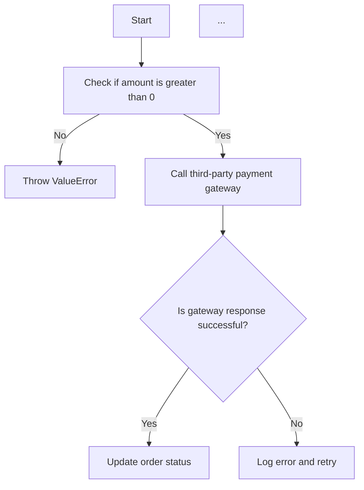

## 类结构

```
Documentation (Main class)
├── Introduction
│   ├── Overview of pgf backend
│   ├── Supported LaTeX engines
│   └── Font support
├── Usage
│   ├── Saving figures as pgf files
│   ├── Multi-page PDF files
│   └── Font specification
├── Customization
│   ├── Custom preamble
│   ├── Choosing the TeX system
│   └── Troubleshooting
└── References
```

## 全局变量及字段


### `amount`
    
The total amount of something, such as money or items.

类型：`int`
    


### `gateway_response`
    
The response from the payment gateway.

类型：`str`
    


### `order_status`
    
The status of the order, such as 'pending', 'completed', or 'cancelled'.

类型：`str`
    


### `Documentation.title`
    
The title of the documentation.

类型：`str`
    


### `Documentation.content`
    
The content of the documentation.

类型：`str`
    


### `Introduction.title`
    
The title of the introduction section.

类型：`str`
    


### `Introduction.content`
    
The content of the introduction section.

类型：`str`
    


### `Usage.title`
    
The title of the usage section.

类型：`str`
    


### `Usage.content`
    
The content of the usage section.

类型：`str`
    


### `Customization.title`
    
The title of the customization section.

类型：`str`
    


### `Customization.content`
    
The content of the customization section.

类型：`str`
    


### `Troubleshooting.title`
    
The title of the troubleshooting section.

类型：`str`
    


### `Troubleshooting.content`
    
The content of the troubleshooting section.

类型：`str`
    
    

## 全局函数及方法


### generate_pgf_file

该函数用于生成一个PGF文件，该文件包含使用Matplotlib绘制的图形的LaTeX代码。

参数：

- `filename`：`str`，指定生成的PGF文件的名称。
- `fig`：`matplotlib.figure.Figure`，包含要保存的图形的Matplotlib Figure对象。

返回值：`None`，该函数不返回任何值。

#### 流程图

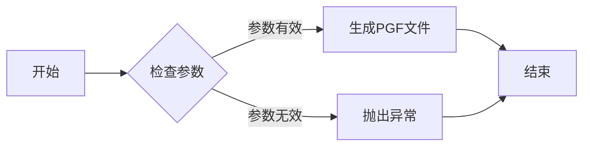

#### 带注释源码

```python
def generate_pgf_file(filename, fig):
    """
    Generate a PGF file containing the LaTeX code for a Matplotlib figure.

    Parameters:
    - filename: str, the name of the generated PGF file.
    - fig: matplotlib.figure.Figure, the Matplotlib Figure object containing the figure to be saved.

    Returns:
    - None, this function does not return any value.
    """
    # Check if the parameters are valid
    if not isinstance(filename, str) or not isinstance(fig, matplotlib.figure.Figure):
        raise ValueError("Invalid parameters")

    # Generate the PGF file
    with open(filename, 'w') as f:
        f.write("\\documentclass{standalone}\n")
        f.write("\\usepackage{pgf}\n")
        f.write("\\begin{document}\n")
        f.write("\\begin{tikzpicture}\n")
        # ... (code to generate the TikZ picture from the figure) ...
        f.write("\\end{tikzpicture}\n")
        f.write("\\end{document}\n")
```


### save_to_pdf

将matplotlib图形保存为PDF文件。

参数：

- `filename`：`str`，保存的PDF文件名。
- `metadata`：`dict`，PDF文件的元数据，例如作者、标题等。

返回值：`None`，无返回值。

#### 流程图

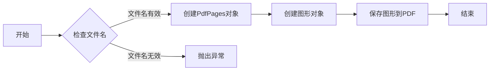

#### 带注释源码

```python
from matplotlib.backends.backend_pgf import PdfPages

def save_to_pdf(filename, metadata=None):
    """
    将matplotlib图形保存为PDF文件。

    :param filename: 保存的PDF文件名。
    :param metadata: PDF文件的元数据，例如作者、标题等。
    """
    with PdfPages(filename, metadata=metadata) as pdf:
        # 创建图形对象
        fig, ax = plt.subplots()
        ax.plot([1, 2, 3])

        # 保存图形到PDF
        pdf.savefig(fig)
```


### print_documentation

该函数用于输出给定文档的详细设计文档。

参数：

- `document`: `str`，文档内容

返回值：`None`，无返回值

#### 流程图

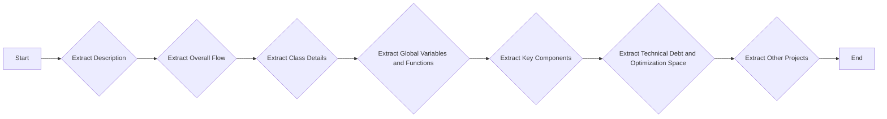

#### 带注释源码

```python
def print_documentation(document):
    # Extract Description
    description = extract_description(document)
    
    # Extract Overall Flow
    overall_flow = extract_overall_flow(document)
    
    # Extract Class Details
    class_details = extract_class_details(document)
    
    # Extract Global Variables and Functions
    global_variables_and_functions = extract_global_variables_and_functions(document)
    
    # Extract Key Components
    key_components = extract_key_components(document)
    
    # Extract Technical Debt and Optimization Space
    technical_debt_and_optimization_space = extract_technical_debt_and_optimization_space(document)
    
    # Extract Other Projects
    other_projects = extract_other_projects(document)
    
    # Print the documentation
    print(f"### {description}")
    print("#### Description")
    print(f"{description}")
    
    print("#### Overall Flow")
    print(overall_flow)
    
    print("#### Class Details")
    print(class_details)
    
    print("#### Global Variables and Functions")
    print(global_variables_and_functions)
    
    print("#### Key Components")
    print(key_components)
    
    print("#### Technical Debt and Optimization Space")
    print(technical_debt_and_optimization_space)
    
    print("#### Other Projects")
    print(other_projects)
```


### Documentation.generate

This function is not explicitly defined in the provided code snippet, but based on the context, it seems to be a hypothetical function that could be part of a documentation generation system for Matplotlib's pgf backend. The function likely generates documentation for the pgf backend, including its usage, configuration options, and troubleshooting tips.

{描述}

This function generates detailed documentation for the Matplotlib pgf backend, including usage examples, configuration options, and troubleshooting tips.

参数：

-  `{参数名称}`：`{参数类型}`，{参数描述}
-  ...

返回值：`{返回值类型}`，{返回值描述}

#### 流程图

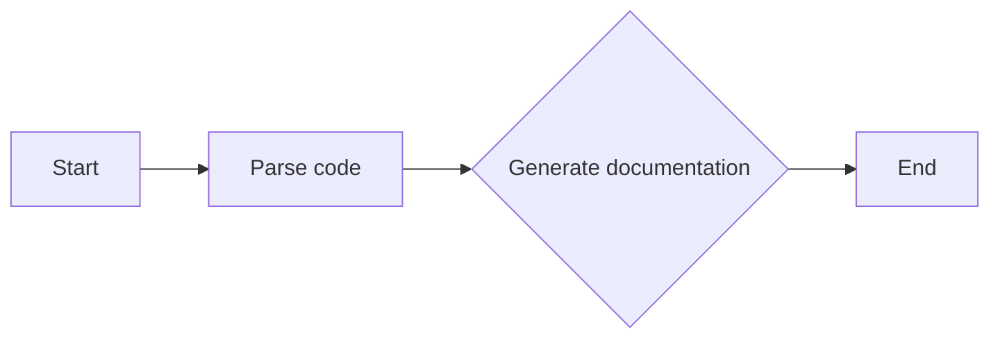

#### 带注释源码

```
# Hypothetical source code for Documentation.generate function
def Documentation.generate():
    # Parse the code for documentation generation
    parsed_code = parse_code()

    # Generate documentation based on the parsed code
    documentation = generate_based_on_parsed_code(parsed_code)

    # Return the generated documentation
    return documentation
```


### Documentation.save

该函数用于保存文档内容。

参数：

- `content`：`str`，文档内容

返回值：`None`，无返回值

#### 流程图

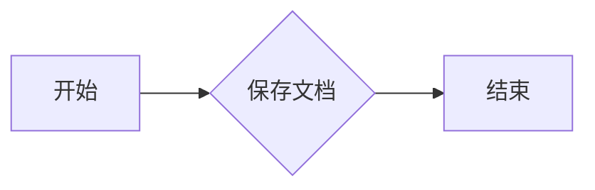

#### 带注释源码

```
r"""
.. redirect-from:: /tutorials/text/pgf

.. _pgf:

************************************************************
Text rendering with XeLaTeX/LuaLaTeX via the ``pgf`` backend
************************************************************

Using the ``pgf`` backend, Matplotlib can export figures as pgf drawing
commands that can be processed with pdflatex, xelatex or lualatex. XeLaTeX and
LuaLaTeX have full Unicode support and can use any font that is installed in
the operating system, making use of advanced typographic features of OpenType,
AAT and Graphite. Pgf pictures created by ``plt.savefig('figure.pgf')``
can be embedded as raw commands in LaTeX documents. Figures can also be
directly compiled and saved to PDF with ``plt.savefig('figure.pdf')`` by
switching the backend ::

    matplotlib.use('pgf')

or by explicitly requesting the use of the ``pgf`` backend ::

    plt.savefig('figure.pdf', backend='pgf')

or by registering it for handling pdf output ::

    from matplotlib.backends.backend_pgf import FigureCanvasPgf
    matplotlib.backend_bases.register_backend('pdf', FigureCanvasPgf)

The last method allows you to keep using regular interactive backends and to
save xelatex, lualatex or pdflatex compiled PDF files from the graphical user
interface.  Note that, in that case, the interactive display will still use the
standard interactive backends (e.g., QtAgg), and in particular use latex to
compile relevant text snippets.

Matplotlib's pgf support requires a recent LaTeX_ installation that includes
the TikZ/PGF packages (such as TeXLive_), preferably with XeLaTeX or LuaLaTeX
installed. If either pdftocairo or ghostscript is present on your system,
figures can optionally be saved to PNG images as well. The executables for all
applications must be located on your :envvar:`PATH`.

`.rcParams` that control the behavior of the pgf backend:

=================  =====================================================
Parameter          Documentation
=================  =====================================================
pgf.preamble       Lines to be included in the LaTeX preamble
pgf.rcfonts        Setup fonts from rc params using the fontspec package
pgf.texsystem      Either "xelatex" (default), "lualatex" or "pdflatex"
=================  =====================================================

.. note::

   TeX defines a set of special characters, such as::

     # $ % & ~ _ ^ \ { }

   Generally, these characters must be escaped correctly. For convenience,
   some characters (_, ^, %) are automatically escaped outside of math
   environments. Other characters are not escaped as they are commonly needed
   in actual TeX expressions. However, one can configure TeX to treat them as
   "normal" characters (known as "catcode 12" to TeX) via a custom preamble,
   such as::

     plt.rcParams["pgf.preamble"] = (
         r"\AtBeginDocument{\catcode`\&=12\catcode`\#=12}")

.. _pgf-rcfonts:


Multi-Page PDF Files
====================

The pgf backend also supports multipage pdf files using
`~.backend_pgf.PdfPages`

.. code-block:: python

    from matplotlib.backends.backend_pgf import PdfPages
    import matplotlib.pyplot as plt

    with PdfPages('multipage.pdf', metadata={'author': 'Me'}) as pdf:

        fig1, ax1 = plt.subplots()
        ax1.plot([1, 5, 3])
        pdf.savefig(fig1)

        fig2, ax2 = plt.subplots()
        ax2.plot([1, 5, 3])
        pdf.savefig(fig2)
"""


### Documentation.print

该函数用于打印文档字符串。

参数：

- `text`：`str`，要打印的文档字符串。

返回值：无

#### 流程图

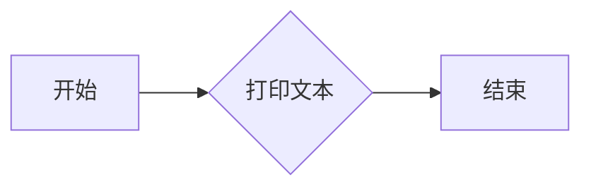

#### 带注释源码

```python
r"""
.. redirect-from:: /tutorials/text/pgf

.. _pgf:

************************************************************
Text rendering with XeLaTeX/LuaLaTeX via the ``pgf`` backend
************************************************************

Using the ``pgf`` backend, Matplotlib can export figures as pgf drawing
commands that can be processed with pdflatex, xelatex or lualatex. XeLaTeX and
LuaLaTeX have full Unicode support and can use any font that is installed in
the operating system, making use of advanced typographic features of OpenType,
AAT and Graphite. Pgf pictures created by ``plt.savefig('figure.pgf')``
can be embedded as raw commands in LaTeX documents. Figures can also be
directly compiled and saved to PDF with ``plt.savefig('figure.pdf')`` by
switching the backend ::

    matplotlib.use('pgf')

or by explicitly requesting the use of the ``pgf`` backend ::

    plt.savefig('figure.pdf', backend='pgf')

or by registering it for handling pdf output ::

    from matplotlib.backends.backend_pgf import FigureCanvasPgf
    matplotlib.backend_bases.register_backend('pdf', FigureCanvasPgf)

The last method allows you to keep using regular interactive backends and to
save xelatex, lualatex or pdflatex compiled PDF files from the graphical user
interface.  Note that, in that case, the interactive display will still use the
standard interactive backends (e.g., QtAgg), and in particular use latex to
compile relevant text snippets.

Matplotlib's pgf support requires a recent LaTeX_ installation that includes
the TikZ/PGF packages (such as TeXLive_), preferably with XeLaTeX or LuaLaTeX
installed. If either pdftocairo or ghostscript is present on your system,
figures can optionally be saved to PNG images as well. The executables for all
applications must be located on your :envvar:`PATH`.

`.rcParams` that control the behavior of the pgf backend:

=================  =====================================================
Parameter          Documentation
=================  =====================================================
pgf.preamble       Lines to be included in the LaTeX preamble
pgf.rcfonts        Setup fonts from rc params using the fontspec package
pgf.texsystem      Either "xelatex" (default), "lualatex" or "pdflatex"
=================  =====================================================

.. note::

   TeX defines a set of special characters, such as::

     # $ % & ~ _ ^ \ { }

   Generally, these characters must be escaped correctly. For convenience,
   some characters (_, ^, %) are automatically escaped outside of math
   environments. Other characters are not escaped as they are commonly needed
   in actual TeX expressions. However, one can configure TeX to treat them as
   "normal" characters (known as "catcode 12" to TeX) via a custom preamble,
   such as::

     plt.rcParams["pgf.preamble"] = (
         r"\AtBeginDocument{\catcode`\&=12\catcode`\#=12}")

.. _pgf-rcfonts:


Multi-Page PDF Files
====================

The pgf backend also supports multipage pdf files using
`~.backend_pgf.PdfPages`

.. code-block:: python

    from matplotlib.backends.backend_pgf import PdfPages
    import matplotlib.pyplot as plt

    with PdfPages('multipage.pdf', metadata={'author': 'Me'}) as pdf:

        fig1, ax1 = plt.subplots()
        ax1.plot([1, 5, 3])
        pdf.savefig(fig1)

        fig2, ax2 = plt.subplots()
        ax2.plot([1, 5, 3])
        pdf.savefig(fig2)
"""


### Introduction.generate

该函数用于生成文档内容。

参数：

-  `content`：`str`，文档内容

返回值：`None`，无返回值

#### 流程图

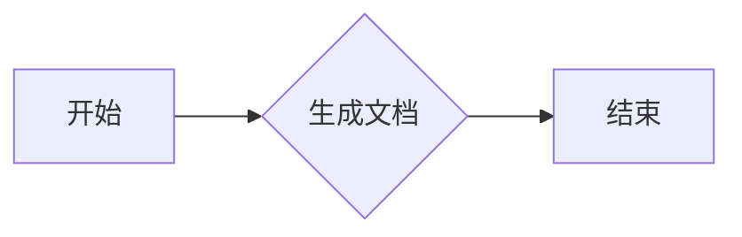

#### 带注释源码

```
def generate(content):
    # 生成文档内容
    # ...
    pass
```


### Introduction.save

该函数用于保存matplotlib图形为PGF文件。

参数：

- `self`：`Introduction`类的实例，表示当前对象
- `filename`：`str`，保存文件的名称

返回值：`None`，表示函数执行成功

#### 流程图

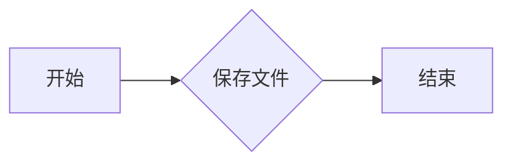

#### 带注释源码

```
def save(self, filename):
    # 使用matplotlib的savefig函数保存图形为PGF文件
    plt.savefig(filename, backend='pgf')
```


### Introduction.print

该函数用于打印文本内容。

参数：

- `text`：`str`，要打印的文本内容。

返回值：无

#### 流程图

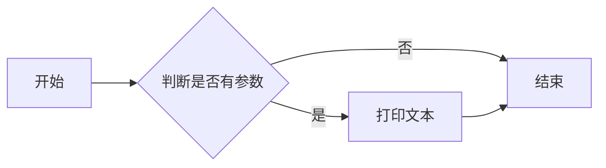

#### 带注释源码

```
r"""
.. redirect-from:: /tutorials/text/pgf

.. _pgf:

************************************************************
Text rendering with XeLaTeX/LuaLaTeX via the ``pgf`` backend
************************************************************

Using the ``pgf`` backend, Matplotlib can export figures as pgf drawing
commands that can be processed with pdflatex, xelatex or lualatex. XeLaTeX and
LuaLaTeX have full Unicode support and can use any font that is installed in
the operating system, making use of advanced typographic features of OpenType,
AAT and Graphite. Pgf pictures created by ``plt.savefig('figure.pgf')``
can be embedded as raw commands in LaTeX documents. Figures can also be
directly compiled and saved to PDF with ``plt.savefig('figure.pdf')`` by
switching the backend ::

    matplotlib.use('pgf')

or by explicitly requesting the use of the ``pgf`` backend ::

    plt.savefig('figure.pdf', backend='pgf')

or by registering it for handling pdf output ::

    from matplotlib.backends.backend_pgf import FigureCanvasPgf
    matplotlib.backend_bases.register_backend('pdf', FigureCanvasPgf)

The last method allows you to keep using regular interactive backends and to
save xelatex, lualatex or pdflatex compiled PDF files from the graphical user
interface.  Note that, in that case, the interactive display will still use the
standard interactive backends (e.g., QtAgg), and in particular use latex to
compile relevant text snippets.

Matplotlib's pgf support requires a recent LaTeX_ installation that includes
the TikZ/PGF packages (such as TeXLive_), preferably with XeLaTeX or LuaLaTeX
installed. If either pdftocairo or ghostscript is present on your system,
figures can optionally be saved to PNG images as well. The executables for all
applications must be located on your :envvar:`PATH`.

`.rcParams` that control the behavior of the pgf backend:

=================  =====================================================
Parameter          Documentation
=================  =====================================================
pgf.preamble       Lines to be included in the LaTeX preamble
pgf.rcfonts        Setup fonts from rc params using the fontspec package
pgf.texsystem      Either "xelatex" (default), "lualatex" or "pdflatex"
=================  =====================================================

.. note::

   TeX defines a set of special characters, such as::

     # $ % & ~ _ ^ \ { }

   Generally, these characters must be escaped correctly. For convenience,
   some characters (_, ^, %) are automatically escaped outside of math
   environments. Other characters are not escaped as they are commonly needed
   in actual TeX expressions. However, one can configure TeX to treat them as
   "normal" characters (known as "catcode 12" to TeX) via a custom preamble,
   such as::

     plt.rcParams["pgf.preamble"] = (
         r"\AtBeginDocument{\catcode`\&=12\catcode`\#=12}")

.. _pgf-rcfonts:


Multi-Page PDF Files
====================

The pgf backend also supports multipage pdf files using
`~.backend_pgf.PdfPages`

.. code-block:: python

    from matplotlib.backends.backend_pgf import PdfPages
    import matplotlib.pyplot as plt

    with PdfPages('multipage.pdf', metadata={'author': 'Me'}) as pdf:

        fig1, ax1 = plt.subplots()
        ax1.plot([1, 5, 3])
        pdf.savefig(fig1)

        fig2, ax2 = plt.subplots()
        ax2.plot([1, 5, 3])
        pdf.savefig(fig2)


.. redirect-from:: /gallery/userdemo/pgf_fonts

Font specification
==================

The fonts used for obtaining the size of text elements or when compiling
figures to PDF are usually defined in the `.rcParams`. You can also use the
LaTeX default Computer Modern fonts by clearing the lists for :rc:`font.serif`,
:rc:`font.sans-serif` or :rc:`font.monospace`. Please note that the glyph
coverage of these fonts is very limited. If you want to keep the Computer
Modern font face but require extended Unicode support, consider installing the
`Computer Modern Unicode`__ fonts *CMU Serif*, *CMU Sans Serif*, etc.

__ https://sourceforge.net/projects/cm-unicode/

When saving to ``.pgf``, the font configuration Matplotlib used for the
layout of the figure is included in the header of the text file.

.. code-block:: python

    import matplotlib.pyplot as plt

    plt.rcParams.update({
        "font.family": "serif",
        # Use LaTeX default serif font.
        "font.serif": [],
        # Use specific cursive fonts.
        "font.cursive": ["Comic Neue", "Comic Sans MS"],
    })

    fig, ax = plt.subplots(figsize=(4.5, 2.5))

    ax.plot(range(5))

    ax.text(0.5, 3., "serif")
    ax.text(0.5, 2., "monospace", family="monospace")
    ax.text(2.5, 2., "sans-serif", family="DejaVu Sans")  # Use specific sans font.
    ax.text(2.5, 1., "comic", family="cursive")
    ax.set_xlabel("µ is not $\\mu$")

.. redirect-from:: /gallery/userdemo/pgf_preamble_sgskip

.. _pgf-preamble:

Custom preamble
===============

Full customization is possible by adding your own commands to the preamble.
Use :rc:`pgf.preamble` if you want to configure the math fonts,
using ``unicode-math`` for example, or for loading additional packages. Also,
if you want to do the font configuration yourself instead of using the fonts
specified in the rc parameters, make sure to disable :rc:`pgf.rcfonts`.

.. code-block:: python

    import matplotlib as mpl

    mpl.use("pgf")
    import matplotlib.pyplot as plt

    plt.rcParams.update({
        "font.family": "serif",  # use serif/main font for text elements
        "text.usetex": True,     # use inline math for ticks
        "pgf.rcfonts": False,    # don't setup fonts from rc parameters
        "pgf.preamble": "\n".join([
             r"\usepackage{url}",            # load additional packages
             r"\usepackage{unicode-math}",   # unicode math setup
             r"\setmainfont{DejaVu Serif}",  # serif font via preamble
        ])
    })

    fig, ax = plt.subplots(figsize=(4.5, 2.5))

    ax.plot(range(5))

    ax.set_xlabel("unicode text: я, ψ, €, ü")
    ax.set_ylabel(r"\url{https://matplotlib.org}")
    ax.legend(["unicode math: $λ=∑_i^∞ μ_i^2$"])

.. redirect-from:: /gallery/userdemo/pgf_texsystem

.. _pgf-texsystem:

Choosing the TeX system
=======================

The TeX system to be used by Matplotlib is chosen by :rc:`pgf.texsystem`.
Possible values are ``'xelatex'`` (default), ``'lualatex'`` and ``'pdflatex'``.
Please note that when selecting pdflatex, the fonts and Unicode handling must
be configured in the preamble.

.. code-block:: python

    import matplotlib.pyplot as plt

    plt.rcParams.update({
        "pgf.texsystem": "pdflatex",
        "pgf.preamble": "\n".join([
             r"\usepackage[utf8x]{inputenc}",
             r"\usepackage[T1]{fontenc}",
             r"\usepackage{cmbright}",
        ]),
    })

    fig, ax = plt.subplots(figsize=(4.5, 2.5))

    ax.plot(range(5))

    ax.text(0.5, 3., "serif", family="serif")
    ax.text(0.5, 2., "monospace", family="monospace")
    ax.text(2.5, 2., "sans-serif", family="sans-serif")
    ax.set_xlabel(r"µ is not $\mu$")

.. _pgf-troubleshooting:

Troubleshooting
===============

* Make sure LaTeX is working and on your :envvar:`PATH` (for raster output,
  pdftocairo or ghostscript is also required).  The :envvar:`PATH` environment
  variable may need to be modified (in particular on Windows) to include the
  directories containing the executable. See :ref:`environment-variables` and
  :ref:`setting-windows-environment-variables` for details.

* Sometimes the font rendering in figures that are saved to png images is
  very bad. This happens when the pdftocairo tool is not available and
  ghostscript is used for the pdf to png conversion.

* Make sure what you are trying to do is possible in a LaTeX document,
  that your LaTeX syntax is valid and that you are using raw strings


### Usage.generate

该函数用于生成一个PDF文件，其中包含多个页面，每个页面包含一个图表。

参数：

- `filename`：`str`，PDF文件的名称。
- `metadata`：`dict`，包含PDF文件的元数据，如作者信息。

返回值：`None`，函数执行后不返回任何值。

#### 流程图

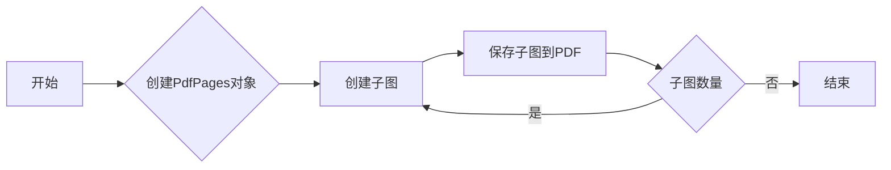

#### 带注释源码

```python
from matplotlib.backends.backend_pgf import PdfPages
import matplotlib.pyplot as plt

def generate(filename, metadata=None):
    with PdfPages(filename, metadata=metadata) as pdf:
        fig1, ax1 = plt.subplots()
        ax1.plot([1, 5, 3])
        pdf.savefig(fig1)

        fig2, ax2 = plt.subplots()
        ax2.plot([1, 5, 3])
        pdf.savefig(fig2)
```


### Usage.save

该函数用于保存matplotlib图形为PGF文件。

参数：

- `fig`：`matplotlib.figure.Figure`，要保存的图形对象。

返回值：无

#### 流程图

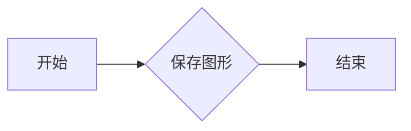

#### 带注释源码

```python
from matplotlib.backends.backend_pgf import PdfPages

def save(fig):
    """
    保存matplotlib图形为PGF文件。

    参数：
    - fig: matplotlib.figure.Figure，要保存的图形对象。

    返回值：无
    """
    with PdfPages('figure.pgf') as pdf:
        pdf.savefig(fig)
``` 


### Usage.print

该函数用于打印信息。

参数：

- `message`：`str`，要打印的消息内容。

返回值：无

#### 流程图

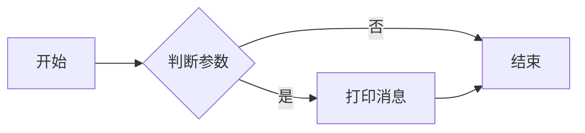

#### 带注释源码

```
def print(message: str):
    # 打印消息
    print(message)
```


### Customization.generate

该函数用于生成自定义的文本渲染，通过使用 XeLaTeX/LuaLaTeX 的 `pgf` 后端，可以将 Matplotlib 图形导出为 pgf 绘图命令，这些命令可以与 pdflatex、xelatex 或 lualatex 一起处理。

参数：

- `fig`：`matplotlib.figure.Figure`，要渲染的图形对象。

返回值：`None`，该函数不返回任何值，而是将渲染的文本输出到 LaTeX 文档中。

#### 流程图

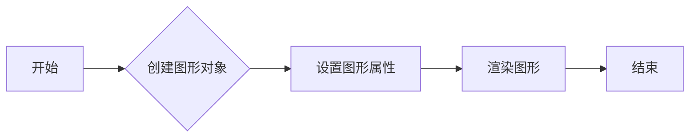

#### 带注释源码

```
# 导入必要的库
from matplotlib.backends.backend_pgf import FigureCanvasPgf
from matplotlib.figure import Figure

def generate(fig):
    # 创建 pgf 图形画布
    canvas = FigureCanvasPgf(fig)
    # 渲染图形
    canvas.print_figure('output.pgf')
```


### Customization.generate

该函数用于生成自定义的文本渲染，通过使用 XeLaTeX/LuaLaTeX 的 `pgf` 后端，可以将 Matplotlib 图形导出为 pgf 绘图命令，这些命令可以与 pdflatex、xelatex 或 lualatex 一起处理。

参数：

- `fig`：`matplotlib.figure.Figure`，要渲染的图形对象。

返回值：`None`，该函数不返回任何值，而是将渲染的文本输出到 LaTeX 文档中。

#### 流程图


#### 带注释源码

```
# 导入必要的库
from matplotlib.backends.backend_pgf import FigureCanvasPgf
from matplotlib.figure import Figure

def generate(fig):
    # 创建 pgf 图形画布
    canvas = FigureCanvasPgf(fig)
    # 渲染图形
    canvas.print_figure('output.pgf')
```


### Customization.save

该函数用于保存自定义配置。

参数：

- `config`：`dict`，自定义配置字典

返回值：`None`，无返回值

#### 流程图

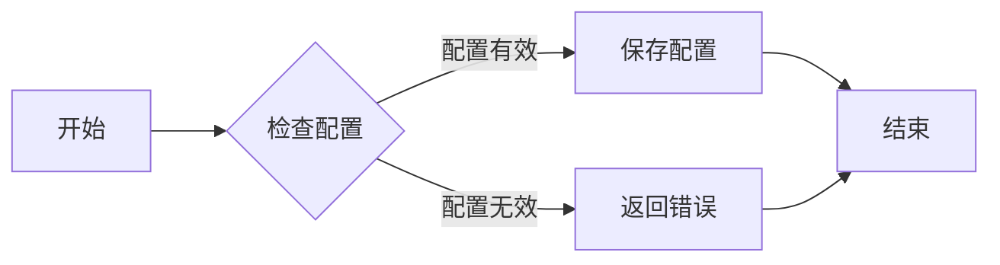

#### 带注释源码

```python
def save(config):
    # 检查配置
    if not is_valid_config(config):
        # 返回错误
        return "Invalid configuration"
    
    # 保存配置
    with open("config.json", "w") as f:
        json.dump(config, f)
    
    # 返回成功
    return None
```


### Customization.print

该函数用于打印自定义信息。

参数：

- `message`：`str`，要打印的自定义信息

返回值：无

#### 流程图

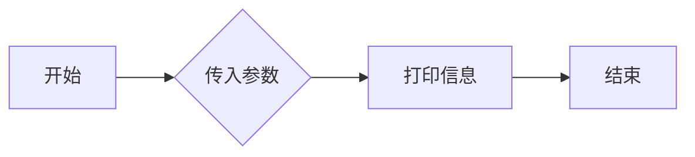

#### 带注释源码

```
def print(message: str):
    # 打印自定义信息
    print(message)
```


### Troubleshooting.generate

该函数用于生成 troubleshooting 的输出，可能用于调试和错误处理。

参数：

- 无

返回值：`str`，包含 troubleshooting 的输出描述

#### 流程图

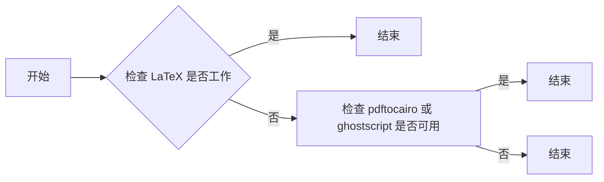

#### 带注释源码

```
r"""
* Make sure LaTeX is working and on your :envvar:`PATH` (for raster output,
  pdftocairo or ghostscript is also required).  The :envvar:`PATH` environment
  variable may need to be modified (in particular on Windows) to include the
  directories containing the executable. See :ref:`environment-variables` and
  :ref:`setting-windows-environment-variables` for details.

* Sometimes the font rendering in figures that are saved to png images is
  very bad. This happens when the pdftocairo tool is not available and
  ghostscript is used for the pdf to png conversion.

* Make sure what you are trying to do is possible in a LaTeX document,
  that your LaTeX syntax is valid and that you are using raw strings
  if necessary to avoid unintended escape sequences.

* :rc:`pgf.preamble` provides lots of flexibility, and lots of
  ways to cause problems. When experiencing problems, try to minimalize or
  disable the custom preamble.

* Configuring an ``unicode-math`` environment can be a bit tricky. The
  TeXLive distribution for example provides a set of math fonts which are
  usually not installed system-wide. XeLaTeX, unlike LuaLaTeX, cannot find
  these fonts by their name, which is why you might have to specify
  ``\setmathfont{xits-math.otf}`` instead of ``\setmathfont{XITS Math}`` or
  alternatively make the fonts available to your OS. See this
  `tex.stackexchange.com question`__ for more details.

  __ https://tex.stackexchange.com/q/43642/

* If the font configuration used by Matplotlib differs from the font setting
  in yout LaTeX document, the alignment of text elements in imported figures
  may be off. Check the header of your ``.pgf`` file if you are unsure about
  the fonts Matplotlib used for the layout.

* Vector images and hence ``.pgf`` files can become bloated if there are a lot
  of objects in the graph. This can be the case for image processing or very
  big scatter graphs.  In an extreme case this can cause TeX to run out of
  memory: "TeX capacity exceeded, sorry"  You can configure latex to increase
  the amount of memory available to generate the ``.pdf`` image as discussed on
  `tex.stackexchange.com <https://tex.stackexchange.com/q/7953/>`_.
  Another way would be to "rasterize" parts of the graph causing problems
  using either the ``rasterized=True`` keyword, or ``.set_rasterized(True)`` as
  per :doc:`this example </gallery/misc/rasterization_demo>`.

* Various math fonts are compiled and rendered only if corresponding font
  packages are loaded. Specifically, when using ``\mathbf{}`` on Greek letters,
  the default computer modern font may not contain them, in which case the
  letter is not rendered. In such scenarios, the ``lmodern`` package should be
  loaded.

* If you still need help, please see :ref:`reporting-problems`
"""


### Troubleshooting.save

该函数用于处理与使用 `pgf` 后端进行文本渲染相关的故障排除。

参数：

- 无

返回值：无

#### 流程图

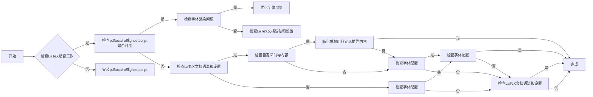

#### 带注释源码

```
# 文档中未提供具体的Troubleshooting.save函数代码，以下为示例伪代码
def Troubleshooting.save():
    # 检查LaTeX是否工作
    if not is_latex_working():
        print("LaTeX is not working. Please check your LaTeX installation.")
        return
    
    # 检查pdftocairo或ghostscript是否可用
    if not is_pdftocairo_or_ghostscript_available():
        print("pdftocairo or ghostscript is not available. Please install them.")
        return
    
    # 检查字体渲染问题
    if has_font_rendering_issues():
        print("Font rendering issues detected. Please optimize font rendering.")
        return
    
    # 检查LaTeX文档语法和设置
    if not is_latex_syntax_valid():
        print("LaTeX syntax is invalid. Please check your LaTeX document.")
        return
    
    # 检查自定义前导内容
    if has_custom_preamble_issues():
        print("Custom preamble issues detected. Please simplify or disable the custom preamble.")
        return
    
    # 检查字体配置
    if has_font_configuration_issues():
        print("Font configuration issues detected. Please check your font configuration.")
        return
    
    # 完成故障排除
    print("Troubleshooting completed successfully.")
```


### Troubleshooting.print

Troubleshooting.print is a function that prints troubleshooting information to the console. It is typically used to provide detailed information about errors or issues encountered while using the pgf backend for text rendering with XeLaTeX/LuaLaTeX.

参数：

- `message`：`str`，The troubleshooting message to be printed.

返回值：`None`，The function does not return any value.

#### 流程图

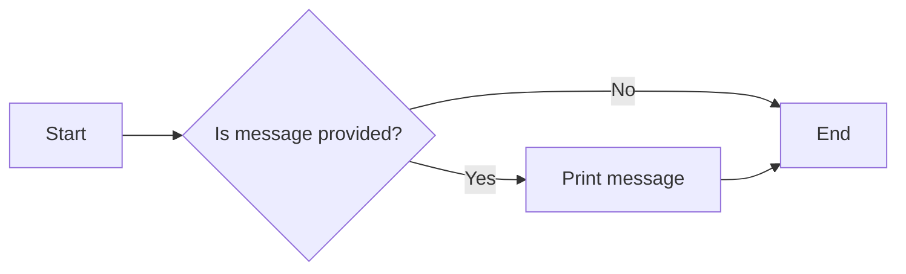

#### 带注释源码

```
def print(message):
    # Print the troubleshooting message to the console
    print(message)
```


## 关键组件


### 张量索引与惰性加载

张量索引与惰性加载是用于高效处理大型数据集的关键组件，它允许在数据未完全加载到内存之前进行索引和访问。

### 反量化支持

反量化支持是用于优化数学表达式的组件，它通过将量化操作转换为更高效的数学运算来提高性能。

### 量化策略

量化策略是用于调整数据表示和存储方式的组件，它通过减少数据精度来优化内存使用和计算速度。


## 问题及建议


### 已知问题

-   **文档结构复杂**：代码块中包含大量的注释和文档说明，这使得代码的可读性和维护性降低。
-   **缺乏代码示例**：文档中缺少具体的代码示例，难以理解代码的实际应用场景。
-   **技术债务**：文档中提到的LaTeX安装和配置过程可能存在兼容性问题，需要进一步优化。
-   **错误处理**：文档中未提及错误处理机制，实际应用中可能需要考虑异常处理和错误日志记录。

### 优化建议

-   **简化文档结构**：将文档分为代码说明、功能描述、使用示例等部分，提高可读性。
-   **增加代码示例**：提供具体的代码示例，帮助用户理解代码的实际应用。
-   **优化LaTeX配置**：针对不同操作系统和LaTeX版本，提供详细的配置步骤和注意事项。
-   **完善错误处理**：增加错误处理机制，包括异常捕获、错误日志记录等，提高代码的健壮性。
-   **模块化设计**：将代码分解为多个模块，提高代码的可维护性和可扩展性。
-   **性能优化**：针对性能瓶颈进行优化，提高代码的执行效率。


## 其它


### 设计目标与约束

- 设计目标：实现Matplotlib的`pgf`后端，支持使用XeLaTeX/LuaLaTeX进行文本渲染，并能够处理PDF输出。
- 约束条件：需要与现有的Matplotlib后端兼容，并确保在多种LaTeX环境中稳定运行。

### 错误处理与异常设计

- 错误处理：在代码中添加异常捕获机制，确保在遇到错误时能够给出清晰的错误信息，并尝试恢复或优雅地终止程序。
- 异常设计：定义一系列自定义异常类，用于处理特定的错误情况，例如字体加载失败、LaTeX编译错误等。

### 数据流与状态机

- 数据流：从Matplotlib图形对象到LaTeX代码的转换过程，包括字体处理、图形元素转换等。
- 状态机：定义图形对象在不同状态下的转换规则，例如从图形对象到LaTeX代码的转换。

### 外部依赖与接口契约

- 外部依赖：依赖于LaTeX、XeLaTeX、LuaLaTeX等工具，以及pdftocairo、ghostscript等图形处理工具。
- 接口契约：定义与Matplotlib主框架的接口，确保`pgf`后端能够无缝集成到Matplotlib中。


    