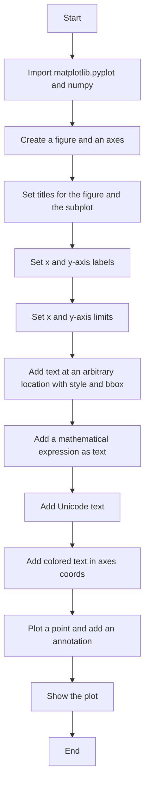
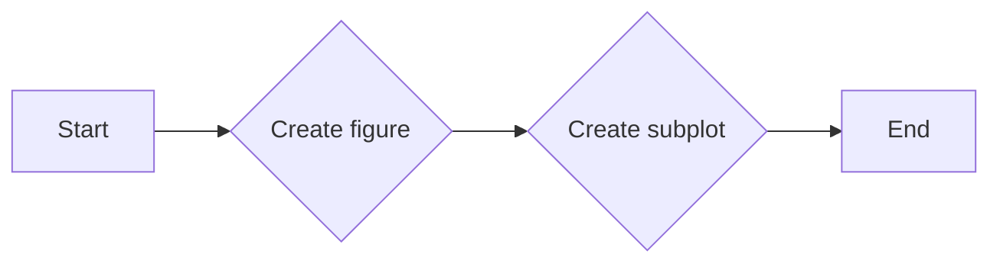
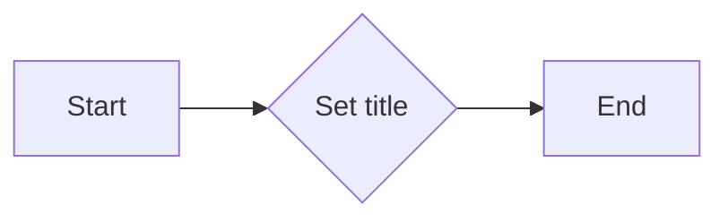
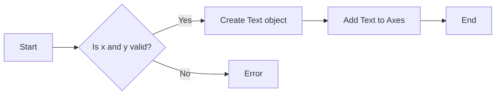
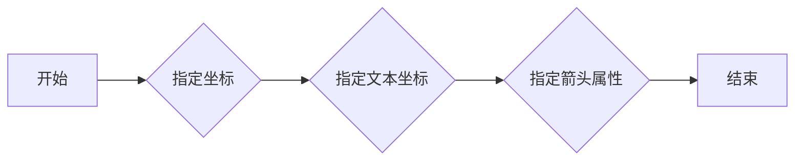
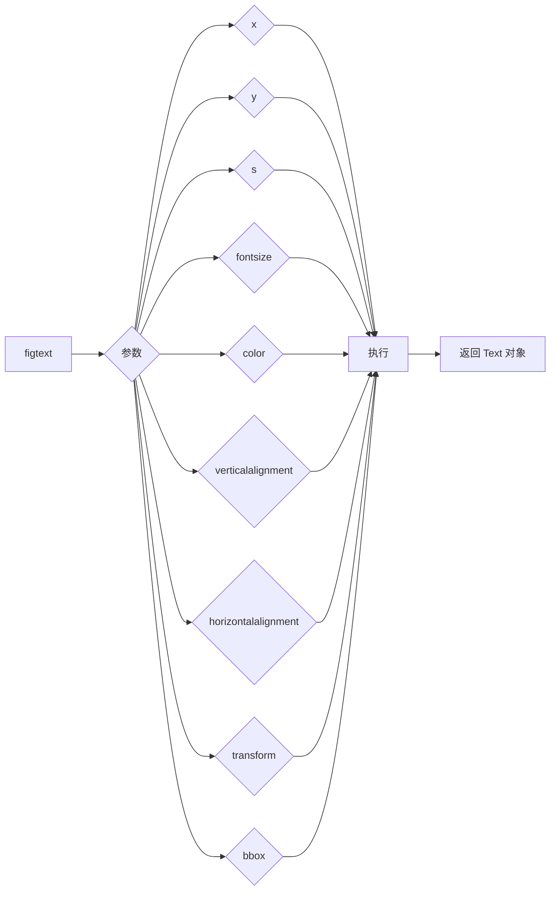
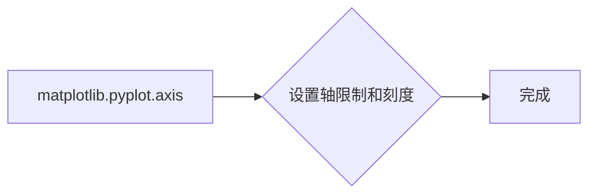
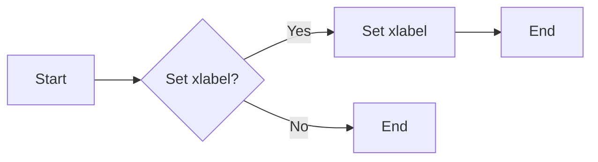
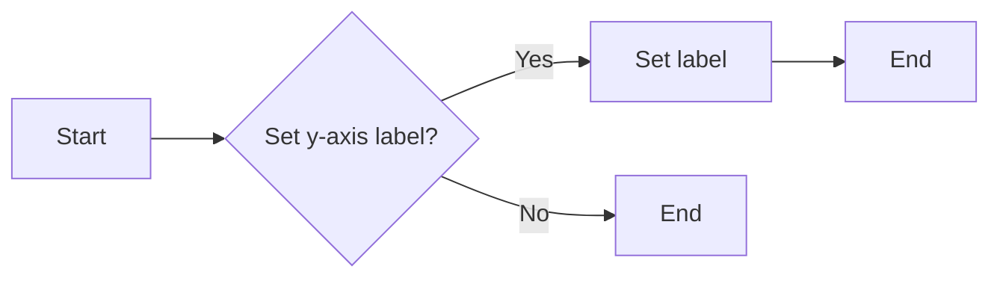

# `matplotlib\galleries\users_explain\text\text_intro.py` 详细设计文档

This code demonstrates the usage of Matplotlib's text support, including adding text, annotations, labels, and titles to plots, as well as customizing text properties and rendering mathematical expressions.

## 整体流程



## 类结构

```
matplotlib.pyplot (模块)
├── figure() (函数)
│   ├── add_subplot() (函数)
│   ├── subplots_adjust() (函数)
│   └── suptitle() (函数)
│       └── set_title() (函数)
├── text() (函数)
│   ├── annotate() (函数)
│   └── figtext() (函数)
├── axis() (函数)
│   ├── set_xlabel() (函数)
│   ├── set_ylabel() (函数)
│   └── set_title() (函数)
└── show() (函数)
```

## 全局变量及字段


### `fig`
    
The main figure object containing all the plot elements.

类型：`matplotlib.figure.Figure`
    


### `ax`
    
The axes object where the plot is drawn.

类型：`matplotlib.axes._subplots.AxesSubplot`
    


### `x1`
    
An array of x values for the plot.

类型：`numpy.ndarray`
    


### `y1`
    
An array of y values for the plot.

类型：`numpy.ndarray`
    


### `font`
    
Font properties for customizing text appearance.

类型：`matplotlib.font_manager.FontProperties`
    


### `base`
    
The base datetime object for generating time data.

类型：`datetime.datetime`
    


### `time`
    
A list of datetime objects representing time values for the plot.

类型：`list`
    


### `matplotlib.pyplot.figure`
    
The main figure object containing all the plot elements.

类型：`matplotlib.figure.Figure`
    


### `matplotlib.pyplot.text`
    
The text object for adding text to the figure.

类型：`matplotlib.text.Text`
    


### `matplotlib.pyplot.axis`
    
The axis object for managing the axes of the plot.

类型：`matplotlib.axis.Axis`
    


### `matplotlib.pyplot.show`
    
A method to display the plot.

类型：`None`
    


### `matplotlib.pyplot.figure.Figure.figure`
    
The main figure object containing all the plot elements.

类型：`matplotlib.figure.Figure`
    


### `matplotlib.pyplot.figure.Figure.text`
    
The text object for adding text to the figure.

类型：`matplotlib.text.Text`
    


### `matplotlib.pyplot.figure.Figure.axis`
    
The axis object for managing the axes of the plot.

类型：`matplotlib.axis.Axis`
    


### `matplotlib.pyplot.figure.Figure.show`
    
A method to display the plot.

类型：`None`
    


### `matplotlib.pyplot.figure.Figure.figure`
    
The main figure object containing all the plot elements.

类型：`matplotlib.figure.Figure`
    


### `matplotlib.pyplot.figure.Figure.text`
    
The text object for adding text to the figure.

类型：`matplotlib.text.Text`
    


### `matplotlib.pyplot.figure.Figure.axis`
    
The axis object for managing the axes of the plot.

类型：`matplotlib.axis.Axis`
    


### `matplotlib.pyplot.figure.Figure.show`
    
A method to display the plot.

类型：`None`
    
    

## 全局函数及方法


### formatoddticks

Format odd tick positions.

参数：

- `x`：`float`，The tick value.
- `pos`：`int`，The position of the tick.

返回值：`str`，The formatted tick label.

#### 流程图

```mermaid
graph LR
A[Start] --> B{Is x odd?}
B -- Yes --> C[Format as "x:1.2f"}
B -- No --> D[Return empty string]
C --> E[End]
D --> E
```

#### 带注释源码

```python
def formatoddticks(x, pos):
    """Format odd tick positions."""
    if x % 2:
        return f'{x:1.2f}'
    else:
        return ''
``` 


### `plt.figure()`

`plt.figure()` 是 Matplotlib 库中用于创建一个图形窗口的函数。

参数：

- `figsize`：`tuple`，图形的宽度和高度，单位为英寸。
- `dpi`：`int`，图形的分辨率，单位为点每英寸。
- `facecolor`：`color`，图形窗口的背景颜色。
- `edgecolor`：`color`，图形窗口的边缘颜色。
- `frameon`：`bool`，是否显示图形窗口的边框。
- `num`：`int`，图形的编号。
- `clear`：`bool`，是否清除图形窗口中的所有内容。
- `figclass`：`class`，图形窗口的类。

返回值：`Figure`，图形对象。

#### 流程图

```mermaid
graph LR
A[plt.figure()] --> B{创建图形窗口}
B --> C[返回 Figure 对象]
```

#### 带注释源码

```python
import matplotlib.pyplot as plt

fig = plt.figure(figsize=(8, 6), dpi=100, facecolor='white', edgecolor='black', frameon=True, num=1, clear=False, figclass=plt.Figure)
```


### matplotlib.pyplot.add_subplot

`matplotlib.pyplot.add_subplot` 是一个用于创建子图的函数。

参数：

- `nrows`：`int`，子图行数。
- `ncols`：`int`，子图列数。
- `sharex`：`bool`，是否共享x轴。
- `sharey`：`bool`，是否共享y轴。
- `fig`：`matplotlib.figure.Figure`，父图对象。

返回值：`matplotlib.axes.Axes`，子图对象。

#### 流程图



#### 带注释源码

```python
import matplotlib.pyplot as plt

fig = plt.figure()
ax = fig.add_subplot(1, 1, 1)
```


### `subplots_adjust`

调整子图参数。

参数：

- `left`：`float`，子图左侧的填充比例，默认为0.125。
- `right`：`float`，子图右侧的填充比例，默认为0.9。
- `top`：`float`，子图顶部的填充比例，默认为0.9。
- `bottom`：`float`，子图底部的填充比例，默认为0.1。
- `wspace`：`float`，子图之间的水平间距比例，默认为0.2。
- `hspace`：`float`，子图之间的垂直间距比例，默认为0.2。

返回值：`None`

#### 流程图

```mermaid
graph LR
A[开始] --> B{调用subplots_adjust()}
B --> C[设置left参数]
C --> D[设置right参数]
D --> E[设置top参数]
E --> F[设置bottom参数]
F --> G[设置wspace参数]
G --> H[设置hspace参数]
H --> I[结束]
```

#### 带注释源码

```python
fig.subplots_adjust(left=0.1, right=0.9, top=0.9, bottom=0.1, wspace=0.2, hspace=0.2)
```


### `.Figure.suptitle`

`suptitle` 方法用于在 Matplotlib 图形中添加一个标题。

参数：

- `title`：`str`，标题文本。
- `fontsize`：`int` 或 `float`，标题字体大小。
- `fontweight`：`str`，标题字体粗细，例如 'normal' 或 'bold'。

返回值：`matplotlib.text.Text`，返回一个 Text 实例，可以配置标题的各种属性。

#### 流程图

```mermaid
graph LR
A[开始] --> B{调用 .Figure.suptitle()}
B --> C[设置参数]
C --> D{返回 Text 实例}
D --> E[结束]
```

#### 带注释源码

```python
fig.suptitle('bold figure suptitle', fontsize=14, fontweight='bold')
```


### matplotlib.pyplot.set_title

Set the title of the current axes.

#### 描述

`set_title` 方法用于设置当前轴（Axes）的标题。标题可以包含文本、数学表达式、特殊字符等。

#### 参数

- `title`：`str`，标题文本。
- `loc`：`str`，标题的位置，默认为 'center'。
- `pad`：`float`，标题与轴边缘的距离，默认为 5。
- `fontsize`：`float`，标题的字体大小，默认为 10。
- `fontweight`：`str`，标题的字体粗细，默认为 'normal'。
- `color`：`str`，标题的颜色，默认为 'black'。
- `verticalalignment`：`str`，标题的垂直对齐方式，默认为 'bottom'。
- `horizontalalignment`：`str`，标题的水平对齐方式，默认为 'left'。
- `transform`：`matplotlib.transforms.Transform`，标题的变换，默认为轴的变换。

#### 返回值

无。

#### 流程图



#### 带注释源码

```python
import matplotlib.pyplot as plt

fig, ax = plt.subplots()
ax.set_title('Axes title')
plt.show()
```


### `matplotlib.pyplot.text`

`matplotlib.pyplot.text` 是一个函数，用于在 Matplotlib 图形中添加文本。

参数：

- `x`：`float`，文本的 x 坐标。
- `y`：`float`，文本的 y 坐标。
- `s`：`str`，要显示的文本。
- `fontdict`：`dict`，文本的字体属性，如字体大小、字体样式等。
- `transform`：`Transform`，文本的坐标转换，默认为轴的坐标。
- `bbox`：`dict`，文本的边框属性，如边框颜色、边框宽度等。

返回值：`Text`，文本对象。

#### 流程图



#### 带注释源码

```python
import matplotlib.pyplot as plt

fig = plt.figure()
ax = fig.add_subplot()
ax.text(3, 8, 'boxed italics text in data coords', style='italic',
        bbox={'facecolor': 'red', 'alpha': 0.5, 'pad': 10})
plt.show()
```


### `.annotate`

`.annotate` 方法用于在 `~matplotlib.axes.Axes` 对象上添加一个带有可选箭头的注释。

参数：

- `xy`：`tuple`，指定注释的坐标，格式为 `(x, y)`。
- `xytext`：`tuple`，指定注释文本的坐标，格式为 `(x, y)`。
- `arrowprops`：`dict`，指定箭头属性，例如箭头颜色、箭头大小等。

返回值：`Text` 实例，表示注释文本。

#### 流程图



#### 带注释源码

```python
import matplotlib.pyplot as plt

fig, ax = plt.subplots()
ax.annotate('annotate', xy=(2, 1), xytext=(3, 4),
            arrowprops=dict(facecolor='black', shrink=0.05))
plt.show()
``` 


### figtext

Add text at an arbitrary location of the `.Figure`.

参数：

-  `x`：`float`，The x location of the text in figure coordinates.
-  `y`：`float`，The y location of the text in figure coordinates.
-  `s`：`str`，The string to be displayed.
-  `fontsize`：`float`，The font size of the text.
-  `color`：`str`，The color of the text.
-  `verticalalignment`：`str`，The vertical alignment of the text.
-  `horizontalalignment`：`str`，The horizontal alignment of the text.
-  `transform`：`matplotlib.transforms.Transform`，The transform to use for the text.
-  `bbox`：`dict`，The bounding box of the text.

返回值：`matplotlib.text.Text`，The text object.

#### 流程图



#### 带注释源码

```python
import matplotlib.pyplot as plt

fig = plt.figure()
ax = fig.add_subplot()
fig.subplots_adjust(top=0.85)

# Set titles for the figure and the subplot respectively
fig.suptitle('bold figure suptitle', fontsize=14, fontweight='bold')
ax.set_title('axes title')

ax.set_xlabel('xlabel')
ax.set_ylabel('ylabel')

# Set both x- and y-axis limits to [0, 10] instead of default [0, 1]
ax.axis([0, 10, 0, 10])

ax.text(3, 8, 'boxed italics text in data coords', style='italic',
        bbox={'facecolor': 'red', 'alpha': 0.5, 'pad': 10})

ax.text(2, 6, r'an equation: $E=mc^2$', fontsize=15)

ax.text(3, 2, 'Unicode: Institut für Festkörperphysik')

ax.text(0.95, 0.01, 'colored text in axes coords',
        verticalalignment='bottom', horizontalalignment='right',
        transform=ax.transAxes,
        color='green', fontsize=15)

ax.plot([2], [1], 'o')
ax.annotate('annotate', xy=(2, 1), xytext=(3, 4),
            arrowprops=dict(facecolor='black', shrink=0.05))

plt.show()
```


### matplotlib.pyplot.axis

matplotlib.pyplot.axis 是一个用于设置轴的限制和刻度的函数。

参数：

- `*xlim`：`[min, max]`，指定 x 轴的显示范围。
- `*ylim`：`[min, max]`，指定 y 轴的显示范围。
- `*xlim_mode`：`'auto'` 或 `'linear'`，指定 x 轴的显示模式。
- `*ylim_mode`：`'auto'` 或 `'linear'`，指定 y 轴的显示模式。
- `*xlabel`：`str`，指定 x 轴标签。
- `*ylabel`：`str`，指定 y 轴标签。
- `*title`：`str`，指定图表标题。

返回值：无

#### 流程图



#### 带注释源码

```python
import matplotlib.pyplot as plt

fig = plt.figure()
ax = fig.add_subplot()
fig.subplots_adjust(top=0.85)

# Set titles for the figure and the subplot respectively
fig.suptitle('bold figure suptitle', fontsize=14, fontweight='bold')
ax.set_title('axes title')

ax.set_xlabel('xlabel')
ax.set_ylabel('ylabel')

# Set both x- and y-axis limits to [0, 10] instead of default [0, 1]
ax.axis([0, 10, 0, 10])

ax.text(3, 8, 'boxed italics text in data coords', style='italic',
        bbox={'facecolor': 'red', 'alpha': 0.5, 'pad': 10})

ax.text(2, 6, r'an equation: $E=mc^2$', fontsize=15)

ax.text(3, 2, 'Unicode: Institut für Festkörperphysik')

ax.text(0.95, 0.01, 'colored text in axes coords',
        verticalalignment='bottom', horizontalalignment='right',
        transform=ax.transAxes,
        color='green', fontsize=15)

ax.plot([2], [1], 'o')
ax.annotate('annotate', xy=(2, 1), xytext=(3, 4),
            arrowprops=dict(facecolor='black', shrink=0.05))

plt.show()
```


### matplotlib.pyplot.set_xlabel

Set the label for the x-axis of the current axes.

描述：

该函数用于设置当前轴（Axes）的x轴标签。

参数：

- `xlabel`：`str`，x轴标签的文本。

返回值：`None`

#### 流程图



#### 带注释源码

```python
import matplotlib.pyplot as plt

fig = plt.figure()
ax = fig.add_subplot()
ax.set_xlabel('xlabel')
```


### matplotlib.pyplot.set_ylabel

Set the label for the y-axis of the current axes.

描述：

该函数用于设置当前轴（Axes）的y轴标签。

参数：

- `label`：`str`，y轴标签的文本内容。

返回值：`None`

#### 流程图



#### 带注释源码

```python
def set_ylabel(self, label):
    """
    Set the label for the y-axis of the current axes.

    Parameters
    ----------
    label : str
        The text of the y-axis label.

    Returns
    -------
    None
    """
    self._yaxis.label.set_text(label)
``` 


### plt.show()

显示matplotlib图形。

参数：

- 无

返回值：无

#### 流程图

```mermaid
graph LR
A[开始] --> B{调用plt.show()}
B --> C[结束]
```

#### 带注释源码

```python
import matplotlib.pyplot as plt

# ... (前面的代码)

plt.show()  # 显示图形
``` 


## 关键组件


### 张量索引与惰性加载

张量索引与惰性加载是用于高效处理大型数据集的关键组件。它允许在数据未完全加载到内存之前，通过索引来访问数据的一部分，从而减少内存消耗并提高处理速度。

### 反量化支持

反量化支持是用于优化模型性能的关键组件。它通过将量化后的模型转换为原始精度，以便进行反向传播和训练，从而实现模型训练的准确性。

### 量化策略

量化策略是用于优化模型性能的关键组件。它通过将模型的权重和激活值从浮点数转换为低精度整数，从而减少模型的大小和计算量，提高模型的运行效率。


## 问题及建议


### 已知问题

- **代码结构复杂度**：代码中包含大量的注释和文档，这可能会使得代码的可读性和维护性降低。建议将文档和代码分离，使用专门的文档工具来管理文档。
- **重复代码**：在多个地方使用了相同的代码片段，如设置轴标签和标题。这可能导致维护成本增加，建议使用函数或类来封装这些重复的代码。
- **全局变量**：代码中使用了全局变量，这可能导致代码难以理解和维护。建议使用局部变量或参数传递来避免全局变量的使用。
- **异常处理**：代码中没有明显的异常处理机制。建议添加异常处理来提高代码的健壮性。

### 优化建议

- **重构代码结构**：将文档和代码分离，使用专门的文档工具来管理文档，提高代码的可读性和维护性。
- **封装重复代码**：使用函数或类来封装重复的代码，减少代码冗余，提高代码的可维护性。
- **避免全局变量**：使用局部变量或参数传递来避免全局变量的使用，提高代码的可读性和可维护性。
- **添加异常处理**：添加异常处理来提高代码的健壮性，确保在出现错误时程序能够优雅地处理异常。
- **代码注释**：对代码进行适当的注释，提高代码的可读性。
- **代码格式化**：使用代码格式化工具来统一代码风格，提高代码的可读性。
- **单元测试**：编写单元测试来验证代码的正确性，提高代码的质量。

## 其它


### 设计目标与约束

- 设计目标：提供对文本的灵活控制，包括字体、大小、颜色、位置等。
- 约束：保持与Matplotlib的现有API兼容性，确保良好的性能和可扩展性。

### 错误处理与异常设计

- 错误处理：捕获并处理可能发生的异常，如无效的字体路径、格式错误等。
- 异常设计：定义清晰的异常类型和错误消息，以便用户能够理解问题并采取相应的措施。

### 数据流与状态机

- 数据流：文本数据通过API传递到matplotlib对象，然后渲染到图形中。
- 状态机：文本对象在创建后可以配置其属性，如位置、字体等，并在图形更新时保持这些属性。

### 外部依赖与接口契约

- 外部依赖：依赖于matplotlib库和其相关模块，如`matplotlib.font_manager`。
- 接口契约：定义了文本对象的API，包括创建、配置和渲染文本的方法。


    