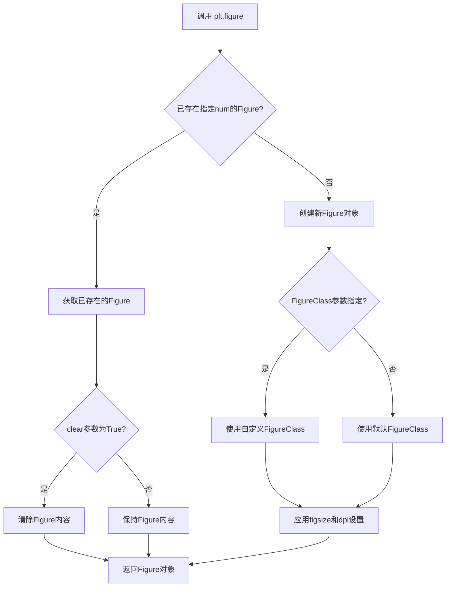
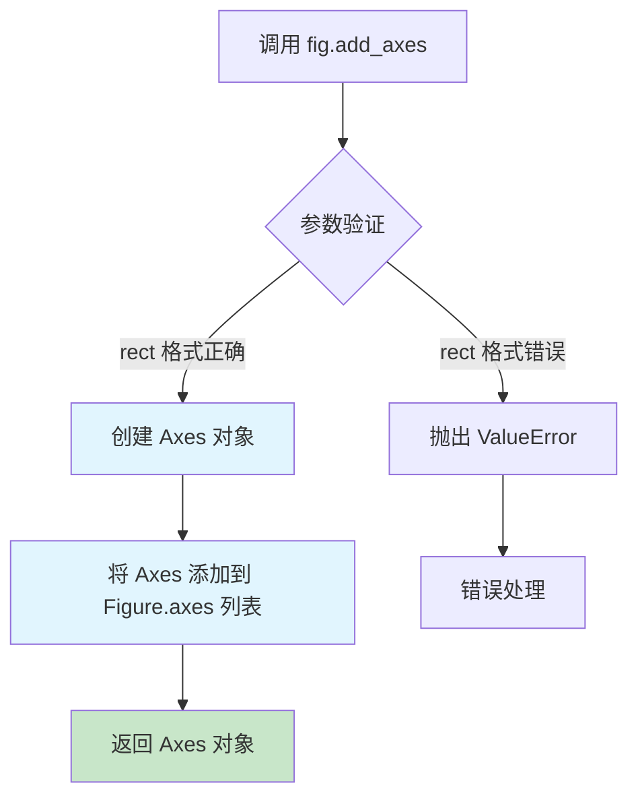
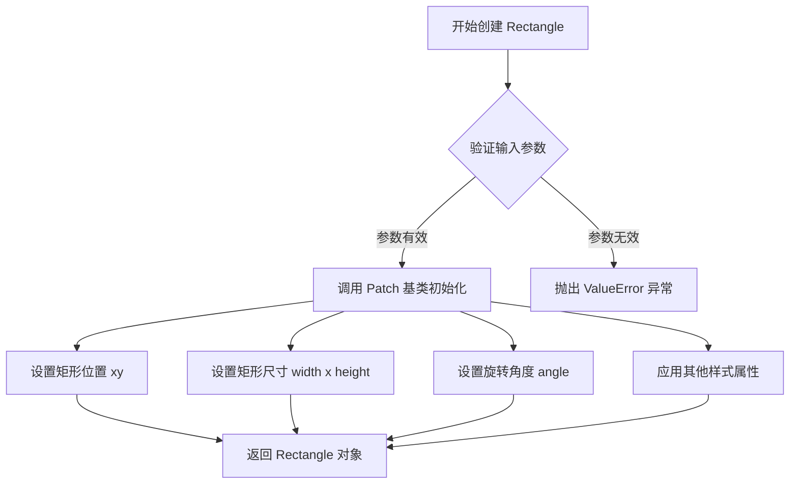
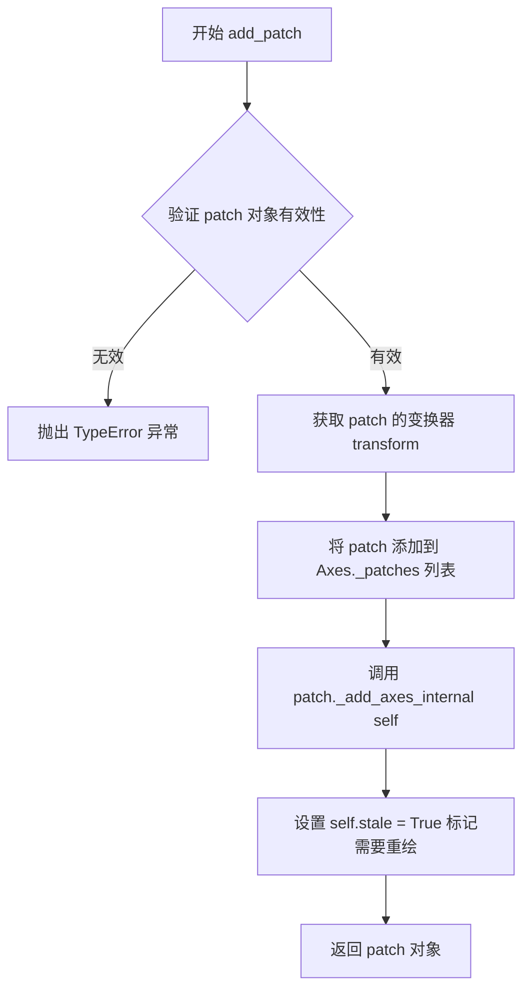
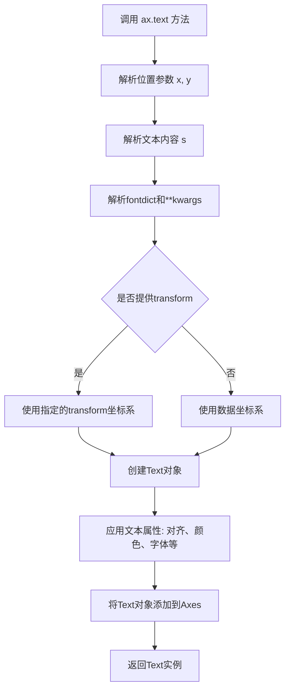
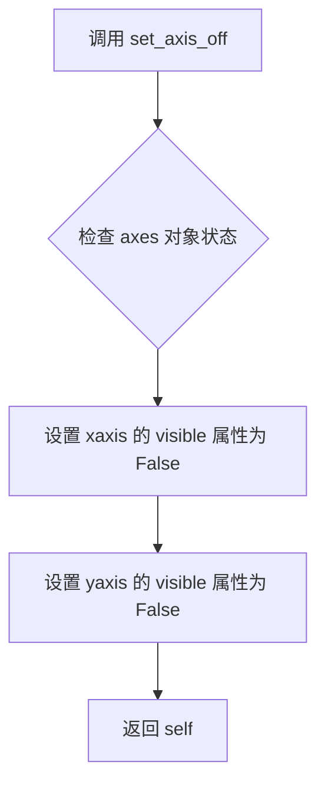
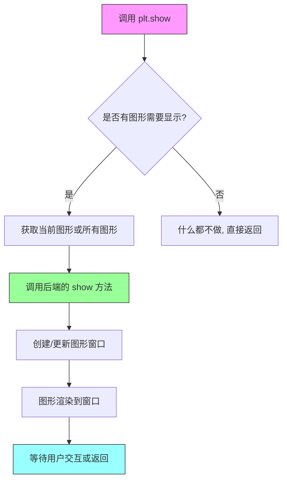

# `matplotlib\galleries\users_explain\text\text_props.py` 详细设计文档

这是一个Matplotlib教程文档代码，演示如何控制文本的各种属性（如颜色、字体、对齐方式、大小等）以及文本布局，通过多个ax.text()调用展示不同的文本对齐效果（left、right、center、top、bottom）和其他属性（旋转、颜色、字体大小等），并提供了关于默认字体配置和非拉丁文字体支持的说明文档。

## 整体流程

```mermaid
graph TD
    A[开始] --> B[导入matplotlib.pyplot和patches模块]
    B --> C[定义矩形参数 left, width, bottom, height]
    C --> D[创建Figure和Axes对象]
    D --> E[创建Rectangle patch并添加到Axes]
    E --> F[调用ax.text()添加多个文本示例]
    F --> F1[文本1: left top - 左上对齐]
    F --> F2[文本2: left bottom - 左下对齐]
    F --> F3[文本3: right bottom - 右下对齐]
    F --> F4[文本4: right top - 右上对齐]
    F --> F5[文本5: center top - 顶部居中]
    F --> F6[文本6: right center - 垂直居中靠右]
    F --> F7[文本7: left center - 垂直居中靠左]
    F --> F8[文本8: middle - 正中]
    F --> F9[文本9: centered - 垂直居中]
    F --> F10[文本10: rotated - 旋转45度]
    F --> G[关闭坐标轴并显示图形]
    G --> H[后续为文档说明：字体大小、默认字体、非拉丁文字体配置]
```

## 类结构

```
Python脚本 (无类结构)
├── 导入模块
│   ├── matplotlib.pyplot
│   └── matplotlib.patches
└── 主代码块
```

## 全局变量及字段


### `left`
    
矩形左边界坐标

类型：`float`
    


### `width`
    
矩形宽度

类型：`float`
    


### `bottom`
    
矩形底边界坐标

类型：`float`
    


### `height`
    
矩形高度

类型：`float`
    


### `right`
    
矩形右边界坐标 (left + width)

类型：`float`
    


### `top`
    
矩形顶边界坐标 (bottom + height)

类型：`float`
    


### `fig`
    
图形对象

类型：`matplotlib.figure.Figure`
    


### `ax`
    
坐标轴对象

类型：`matplotlib.axes.Axes`
    


### `p`
    
矩形patch对象

类型：`matplotlib.patches.Rectangle`
    


    

## 全局函数及方法


### `plt.figure()`

创建并返回一个新的 Figure 对象，用于绑定到后续的绘图操作。Figure 是 Matplotlib 中最顶层的容器对象，代表整个图形窗口或图像。

参数：

- `num`：`int` 或 `str` 或 `Figure` 或 `None`，Figure 的标识符。如果提供的数字已经存在，则激活该 Figure 而不是创建新的；如果不存在，则创建新的 Figure 并与之关联。
- `figsize`：`tuple[float, float]`，Figure 的宽和高，以英寸为单位，格式为 (宽度, 高度)。
- `dpi`：`float`，Figure 的分辨率（每英寸点数），控制图形的清晰度。
- `facecolor`：`color`，Figure 的背景颜色，可以是任何 Matplotlib 支持的颜色格式。
- `edgecolor`：`color`，Figure 边框的颜色。
- `frameon`：`bool`，是否显示 Figure 的框架，默认为 True。
- `FigureClass`：`type`，自定义的 Figure 类，默认为 `matplotlib.figure.Figure`。
- `clear`：`bool`，如果设为 True 且已存在同名 Figure，则在返回前先清除其内容。
- `**kwargs`：其他关键字参数，将传递给 Figure 类的构造函数。

返回值：`matplotlib.figure.Figure`，新创建的 Figure 对象实例。

#### 流程图



#### 带注释源码

```python
import matplotlib.pyplot as plt
import matplotlib.patches as patches

# 定义矩形参数（使用 axes 坐标系）
left, width = 0.25, 0.5
bottom, height = 0.25, 0.5
right = left + width
top = bottom + height

# 创建并返回 Figure 对象
# 这会创建一个新的图形窗口，准备接收 Axes 和其他图形元素
fig = plt.figure()

# 在 Figure 上添加 Axes，参数 (0, 0, 1, 1) 表示 Axes 占据整个 Figure
# add_axes 返回一个 Axes 对象，用于添加图形元素
ax = fig.add_axes((0, 0, 1, 1))

# 创建一个 Rectangle patch（矩形补丁）
# 参数：(left, bottom) - 矩形左下角坐标
#       width, height - 矩形宽高
#       fill=False - 不填充颜色
#       transform=ax.transAxes - 使用 Axes 坐标系（0-1范围）
#       clip_on=False - 不裁剪到 Axes 边界
p = patches.Rectangle(
    (left, bottom), width, height,
    fill=False, transform=ax.transAxes, clip_on=False
)

# 将 Rectangle 添加到 Axes
ax.add_patch(p)

# 添加多个文本示例，展示不同的对齐方式
# horizontalalignment (ha): 控制 x 位置是文本的左/中/右
# verticalalignment (va): 控制 y 位置是文本的顶/中/底

ax.text(left, bottom, 'left top',
        horizontalalignment='left',
        verticalalignment='top',
        transform=ax.transAxes)

ax.text(left, bottom, 'left bottom',
        horizontalalignment='left',
        verticalalignment='bottom',
        transform=ax.transAxes)

ax.text(right, top, 'right bottom',
        horizontalalignment='right',
        verticalalignment='bottom',
        transform=ax.transAxes)

ax.text(right, top, 'right top',
        horizontalalignment='right',
        verticalalignment='top',
        transform=ax.transAxes)

# 更多文本示例...
ax.text(right, 0.5*(bottom+top), 'centered',
        horizontalalignment='center',
        verticalalignment='center',
        rotation='vertical',
        transform=ax.transAxes)

# 关闭坐标轴显示
ax.set_axis_off()

# 显示图形
plt.show()
```

#### 关键组件信息

| 组件名称 | 一句话描述 |
|---------|-----------|
| `Figure` | Matplotlib 中的顶层图形容器，代表整个窗口或图像 |
| `Axes` | Figure 中的子区域，用于绘制图形元素 |
| `Rectangle` | 用于绘制矩形形状的补丁对象 |
| `Text` | 在 Axes 上添加文本的图形元素 |

#### 潜在技术债务与优化空间

1. **硬编码坐标值**：代码中使用了大量的硬编码坐标值（如 `0.25`, `0.5` 等），建议提取为常量或配置参数，提高可维护性。
2. **缺少错误处理**：未对 `plt.figure()` 的返回值进行 None 检查，如果创建失败可能导致后续代码报错。
3. **代码重复**：多个 `ax.text()` 调用中有很多重复的参数设置，可以考虑封装为辅助函数。
4. **魔法数字**：宽高计算中的 `0.5*(bottom+top)` 等表达式可以提取为有意义的变量名。
5. **布局灵活性不足**：使用固定的 `add_axes((0, 0, 1, 1))` 而不是更灵活的 `add_subplot()`，限制了图形的可扩展性。


### `fig.add_axes`

向当前 Figure 添加一个 Axes（坐标轴），并返回创建的 Axes 对象。

参数：

- `rect`：`tuple of 4 floats`，定义 Axes 在 Figure 中的位置和尺寸，格式为 `(left, bottom, width, height)`，所有值都是相对于 Figure 的比例（0 到 1）

返回值：`matplotlib.axes.Axes`，新创建的 Axes 对象

#### 流程图



#### 带注释源码

```python
def add_axes(self, rect, projection=None, polar=False, frameon=True, **kwargs):
    """
    向 Figure 添加 Axes。
    
    参数:
        rect: 序列类型，格式为 (left, bottom, width, height)
            - left: Axes 左侧相对于 Figure 的位置 (0-1)
            - bottom: Axes 底部相对于 Figure 的位置 (0-1)
            - width: Axes 宽度相对于 Figure 的比例 (0-1)
            - height: Axes 高度相对于 Figure 的比例 (0-1)
        projection: str, 可选
            - 投影类型，如 '3d', 'polar' 等
        polar: bool, 默认 False
            - 是否使用极坐标投影
        frameon: bool, 默认 True
            - 是否显示边框
        **kwargs: 关键字参数
            - 传递给 Axes 的其他属性设置
    
    返回值:
        axes: Axes 对象
            - 新创建的 Axes 实例
    """
    # 1. 验证 rect 参数格式
    if len(rect) != 4:
        raise ValueError('rect 必须为 4 元素的序列 (left, bottom, width, height)')
    
    # 2. 创建 Axes 对象
    ax = Axes(self, rect, **kwargs)
    
    # 3. 设置投影相关属性
    if polar:
        ax.set_theta_zero_location('E')
    
    # 4. 将新 Axes 添加到 Figure 的 axes 列表中
    self._axstack.bubble(ax)
    self.axes.append(ax)
    
    # 5. 设置边框显示
    ax.set_frame_on(frameon)
    
    # 6. 返回创建的 Axes 对象供用户使用
    return ax
```

**使用示例（来自代码）：**

```python
# 创建 Figure 对象
fig = plt.figure()

# 添加 Axes 到 Figure，位置为 (0, 0, 1, 1)，即占满整个 Figure
# 参数 (left=0, bottom=0, width=1, height=1) 表示从左下角开始，宽高各占 100%
ax = fig.add_axes((0, 0, 1, 1))

# 后续可以在 ax 上进行绘图操作
p = patches.Rectangle(
    (left, bottom), width, height,
    fill=False, transform=ax.transAxes, clip_on=False
)
ax.add_patch(p)
```


### `patches.Rectangle`

该函数是 Matplotlib 中用于创建矩形补丁对象的类构造函数，继承自 `patches.Patch`，用于在图表中绘制矩形区域，支持位置、尺寸、填充、边框样式及坐标变换等属性配置。

参数：

- `xy`：元组 (float, float)，矩形左下角的 (x, y) 坐标位置
- `width`：float，矩形的宽度
- `height`：float，矩形的高度
- `angle`：float，可选，旋转角度（度），默认为 0
- `fill`：bool，可选，是否填充矩形，默认为 True
- `closed`：bool，可选，是否闭合路径，默认为 True
- `**kwargs`：其他关键字参数传递给 `Patch` 基类，包括 `edgecolor`、`facecolor`、`linewidth`、`linestyle`、`antialiased` 等

返回值：`matplotlib.patches.Rectangle`，返回创建的 Rectangle 补丁对象

#### 流程图



#### 带注释源码

```python
# 源码位于 matplotlib/lib/matplotlib/patches.py 中的 Rectangle 类

class Rectangle(Patch):
    """
    矩形补丁类，用于在图表中绘制矩形区域
    
    参数:
        xy: 矩形左下角的 (x, y) 坐标
        width: 矩形宽度
        height: 矩形高度
        angle: 旋转角度（逆时针方向），默认为 0
        **kwargs: 传递给 Patch 基类的其他属性
    """
    
    def __init__(self, xy, width, height, angle=0.0, **kwargs):
        """
        初始化 Rectangle 对象
        
        参数:
            xy: 浮点元组 (x, y)，表示矩形左下角坐标
            width: 浮点数，矩形宽度
            height: 浮点数，矩形高度
            angle: 浮点数，旋转角度（度），默认为 0
            **kwargs: 传递给 Patch 的其他参数
        """
        # 调用 Patch 基类初始化方法
        super().__init__(**kwargs)
        
        # 验证宽度和高度为非负数
        if width < 0 or height < 0:
            raise ValueError("宽度和高度必须为非负数")
        
        # 存储矩形的位置和尺寸
        self._x0 = xy[0]  # x 坐标
        self._y0 = xy[1]  # y 坐标
        self._width = width   # 宽度
        self._height = height # 高度
        self._angle = angle   # 旋转角度
        
        # 调用更新方法设置补丁的坐标
        self._update_patch_bounds()
    
    def _update_patch_bounds(self):
        """更新补丁的边界框"""
        # 根据位置和尺寸计算四个顶点
        # 用于后续的绘制和变换
        self._corners = (
            (self._x0, self._y0),  # 左下
            (self._x0 + self._width, self._y0),  # 右下
            (self._x0 + self._width, self._y0 + self._height),  # 右上
            (self._x0, self._y0 + self._height)  # 左上
        )
    
    def get_x(self):
        """获取矩形左下角的 x 坐标"""
        return self._x0
    
    def get_y(self):
        """获取矩形左下角的 y 坐标"""
        return self._y0
    
    def get_width(self):
        """获取矩形宽度"""
        return self._width
    
    def get_height(self):
        """获取矩形高度"""
        return self._height
    
    def get_angle(self):
        """获取旋转角度"""
        return self._angle
```

#### 在代码中的实际使用

```python
# 示例代码中的调用方式
left, width = 0.25, 0.5
bottom, height = 0.25, 0.5

# 创建 Rectangle 补丁对象
p = patches.Rectangle(
    (left, bottom),  # xy: 位置坐标 (0.25, 0.25)
    width,           # width: 宽度 0.5
    height,          # height: 高度 0.5
    fill=False,      # fill: 不填充（仅显示边框）
    transform=ax.transAxes,  # transform: 使用坐标轴变换
    clip_on=False    # clip_on: 不裁剪
)

# 将补丁添加到坐标轴
ax.add_patch(p)
```

#### 关键属性说明

| 属性 | 类型 | 说明 |
|------|------|------|
| xy | tuple | 矩形左下角坐标 |
| width | float | 矩形宽度 |
| height | float | 矩形高度 |
| angle | float | 旋转角度 |
| fill | bool | 是否填充 |
| transform | Transform | 坐标变换 |
| clip_on | bool | 是否裁剪 |


### `Axes.add_patch`

将 `matplotlib.patches.Patch` 对象添加到 Axes 中，使 patch 成为 Axes 的子组件并参与坐标变换和渲染。

参数：

-  `p`：`matplotlib.patches.Patch`，要添加到 Axes 的 Patch 实例（如 Rectangle、Circle 等）

返回值：`matplotlib.patches.Patch`，返回添加的 Patch 实例引用

#### 流程图



#### 带注释源码

```python
def add_patch(self, p):
    """
    Add a :class:`~matplotlib.patches.Patch` to the axes.

    Parameters
    ----------
    p : `.Patch`

    Returns
    -------
    `.Patch`

    See Also
    --------
    add_patch
    """
    # 验证传入对象是否为 Patch 实例
    if not isinstance(p, patches.Patch):
        raise TypeError(
            f"expected patch type, not {type(p).__name__}")
    
    # 获取 patch 的变换器（transform），用于坐标转换
    # transform 决定了 patch 的坐标系统（如 data, transAxes 等）
    p.set_transform(self.transData + p.get_transform())
    
    # 将 patch 添加到内部列表 _patches 中
    self._patches.append(p)
    
    # 通知 patch 已被添加到 axes，建立双向关联
    p._add_axes_internal(self)
    
    # 设置 stale 标志为 True，通知渲染器该区域需要重绘
    self.stale = True
    
    # 返回添加的 patch 引用，便于链式调用
    return p
```


### Axes.text

在Axes指定位置添加文本的方法，用于在图表的指定坐标处创建并显示文本内容，支持多种文本样式、对齐方式和变换设置。

参数：

- `x`：`float`，文本的x坐标位置
- `y`：`float`，文本的y坐标位置
- `s`：`str`，要显示的文本内容
- `fontdict`：`dict`，可选，用于覆盖默认文本属性的字典
- `horizontalalignment` 或 `ha`：`str`，可选，控制文本水平对齐方式，可选值为 'left'、'center'、'right'
- `verticalalignment` 或 `va`：`str`，可选，控制文本垂直对齐方式，可选值为 'center'、'top'、'bottom'、'baseline'
- `fontsize` 或 `size`：`int` 或 `str`，可选，文本字体大小，可以是点数或相对大小如 'small'、'x-large'
- `color`：可选，文本颜色，支持任何matplotlib颜色定义
- `rotation`：可选，文本旋转角度，可以是数值（度）、'vertical' 或 'horizontal'
- `transform`：可选，坐标变换对象，如 `ax.transAxes` 表示使用轴坐标系
- `multialignment`：可选，多行文本的对齐方式
- `**kwargs`：其他Text属性，如 alpha、bbox、picker 等

返回值：`matplotlib.text.Text`，创建的Text对象实例，可用于后续对文本进行进一步操作或修改

#### 流程图



#### 带注释源码

```python
# 示例代码展示ax.text()的典型用法
import matplotlib.pyplot as plt
import matplotlib.patches as patches

# 定义文本位置的轴坐标
left, width = 0.25, 0.5
bottom, height = 0.25, 0.5
right = left + width
top = bottom + height

# 创建图形和Axes
fig = plt.figure()
ax = fig.add_axes((0, 0, 1, 1))

# 创建一个矩形框用于可视化对齐参考
p = patches.Rectangle(
    (left, bottom), width, height,
    fill=False, transform=ax.transAxes, clip_on=False
)
ax.add_patch(p)

# 在左上角位置添加文本
# x=left, y=bottom: 文本位置坐标
# 'left top': 文本内容s
# horizontalalignment='left': 水平对齐方式为左对齐
# verticalalignment='top': 垂直对齐方式为顶对齐
# transform=ax.transAxes: 使用轴坐标系(0-1)
ax.text(left, bottom, 'left top',
        horizontalalignment='left',
        verticalalignment='top',
        transform=ax.transAxes)

# 在左下角添加文本
ax.text(left, bottom, 'left bottom',
        horizontalalignment='left',
        verticalalignment='bottom',
        transform=ax.transAxes)

# 在右下角添加文本
ax.text(right, top, 'right bottom',
        horizontalalignment='right',
        verticalalignment='bottom',
        transform=ax.transAxes)

# 在右上角添加文本
ax.text(right, top, 'right top',
        horizontalalignment='right',
        verticalalignment='top',
        transform=ax.transAxes)

# 在顶部中间添加文本
ax.text(right, bottom, 'center top',
        horizontalalignment='center',
        verticalalignment='top',
        transform=ax.transAxes)

# 添加竖直文字 - 使用rotation='vertical'
ax.text(left, 0.5*(bottom+top), 'right center',
        horizontalalignment='right',
        verticalalignment='center',
        rotation='vertical',
        transform=ax.transAxes)

# 中心对齐的大号红色文本
ax.text(0.5*(left+right), 0.5*(bottom+top), 'middle',
        horizontalalignment='center',
        verticalalignment='center',
        fontsize=20, color='red',
        transform=ax.transAxes)

# 带旋转和换行的文本
ax.text(left, top, 'rotated\nwith newlines',
        horizontalalignment='center',
        verticalalignment='center',
        rotation=45,
        transform=ax.transAxes)

# 隐藏坐标轴并显示图形
ax.set_axis_off()
plt.show()
```


### `Axes.set_axis_off`

该方法用于关闭坐标轴的显示，使坐标轴在图表中不可见，常用于创建纯图形展示或需要在图表中隐藏坐标轴边框和刻度的场景。

参数： 无

返回值： `self`，返回axes对象本身，以便进行链式调用。

#### 流程图



#### 带注释源码

```python
def set_axis_off(self):
    """
    Turn off the axis lines and labels.

    .. seealso::

        :meth:`set_axis_on`
            To turn on the axis lines and labels.
    """
    # 遍历坐标轴数组（包括x轴和y轴），将每个轴的可见性设置为False
    for ax in self._axobservers.process("_axis", "axis_off", self):
        # 调用每个轴的 set_visible 方法，参数为 False
        ax.set_visible(False)
    # 返回 axes 对象本身，支持链式调用
    return self
```


### `plt.show()`

显示当前图形，将所有未关闭的图形对象呈现给用户。根据配置的后端（如 Qt、TkAgg、AGG 等），它会打开一个窗口显示图形或将其呈现给相应的渲染目标。

参数：

- 无（该函数不接受必需参数，但可能有可选关键字参数如 `block`，用于控制是否阻塞主线程）

返回值：`None`，无返回值

#### 流程图



#### 带注释源码

```python
# plt.show() 函数的简化实现原理
# 位置: matplotlib.pyplot 模块

def show(block=None):
    """
    显示所有打开的图形窗口。
    
    参数:
        block: bool, 可选
            如果为 True (默认值)，阻塞调用直到所有窗口关闭。
            如果为 False，立即返回。
    """
    
    # 1. 获取全局 pyplot 状态管理器
    global _plt
    
    # 2. 获取当前所有的 Figure 对象
    # _plt.gcf() 获取当前图形, get_figlabels() 获取所有图形标签
    figs = get_figlabels()  # 获取所有图形标签
    
    # 3. 遍历所有图形，调用后端的 show 方法
    for label in figs:
        fig = _plt.figure(label)  # 通过标签获取图形
        # 调用图形的后端渲染方法
        fig.show()  # 这是后端特定的实现
    
    # 4. 如果 block=True，则阻塞主线程
    # 等待用户关闭图形窗口
    if block:
        # 进入事件循环 (GUI 框架如 Qt/Tkinter)
        import matplotlib
        matplotlib.interactive(True)
        # 等待用户交互...
    
    # 5. 返回 None
    return None

# 在实际代码中的调用:
plt.show()  # 位于代码末尾,显示前面创建的所有文本对齐示例图形
```

## 关键组件


### matplotlib.text.Text

Matplotlib中用于控制文本显示的核心类，支持丰富的文本属性配置包括颜色、字体、对齐方式、旋转等。

### 文本对齐系统 (horizontalalignment/verticalalignment)

控制文本相对于位置点的对齐方式，horizontalalignment控制x位置是文本的左/中/右侧，verticalalignment控制y位置是文本的顶/中/底部。

### patches.Rectangle

用于在axes坐标系统中绘制矩形边框的图形组件，配合文本展示对齐效果。

### transform=ax.transAxes

使用相对坐标系进行定位，(0,0)为axes左下角，(1,1)为右上角，使文本位置相对于axes区域而非数据坐标。

### 字体属性系统

包含family(字体族)、size/fontsize(字体大小)、weight(字重)、style(样式)、variant(变体)等属性，支持相对大小指定(如'large', 'x-small')。

### rcParams字体配置

通过matplotlib的rcParams机制控制默认字体设置，包括font.family、font.sans-serif、font.size等参数，支持通用字体族别名映射。

### 颜色与样式系统

支持任意matplotlib颜色定义、背景色(backgroundcolor)、边框(bbox)、可见性(visible)、透明度(alpha)等视觉属性。

### 旋转与变换

支持angle degrees旋转、'vertical'/'horizontal'特殊方向，以及通过transform参数进行坐标系变换。

### 多行文本对齐 (multialignment)

针对换行分隔的字符串，控制不同行的对齐方式(左/中/右对齐)，常用于段落文本排版。

### 剪裁配置 (clip_box/clip_on/clip_path)

控制文本的剪裁行为，包括剪裁框、剪裁开关和剪裁路径的设置。


## 问题及建议


### 已知问题

-   使用大量硬编码坐标值（如 left, width, bottom, height），缺乏可配置性和可维护性
-   重复的 `ax.text()` 调用模式，代码冗余度高，未进行函数封装
-   魔法数字（如 `0.5*(bottom+top)`）重复出现，可读性差
-   缺少错误处理机制，如图形创建、补丁添加或文本渲染失败的情况
-   文档字符串与代码分离，且代码内缺乏关键注释，增加理解难度
-   资源管理不明确，`fig` 和 `ax` 对象使用后未显式关闭或释放
-   布局逻辑固定，扩展性差，新增对齐方式需大量重复修改

### 优化建议

-   将坐标值封装为配置字典或类变量，便于统一调整
-   提取重复的文本添加逻辑为通用函数，参数化文本内容、位置、对齐方式等
-   定义中间变量（如 `center_y`）存储计算结果，消除魔法数字
-   添加 try-except 块处理可能的异常，如 `plt.figure()` 失败或 `add_patch` 异常
-   为关键代码段添加行内注释，说明坐标计算逻辑和对齐方式
-   使用上下文管理器（with 语句）或显式调用 `fig.clf()` / `plt.close()` 管理资源
-   设计为可配置的布局函数，接受参数以支持不同的对齐组合


## 其它


### 设计目标与约束

本代码作为matplotlib教程文档，旨在演示文本属性和布局的各种配置方式，帮助用户理解如何使用Text对象的各种属性来控制文本的显示效果。设计目标是提供清晰的示例代码展示文本对齐、字体设置、颜色、旋转等属性的使用，同时作为文档教程需要保持代码的简洁性和可读性。约束方面，代码依赖于matplotlib的核心模块（pyplot、patches、font_manager），需要确保与不同版本的matplotlib兼容。

### 错误处理与异常设计

本代码主要作为演示用途，未包含复杂的错误处理机制。在实际应用中，如果传入无效的horizontalalignment或verticalalignment参数，matplotlib会抛出ValueError异常；如果字体名称不存在，会触发字体回退机制显示默认字体。代码未对用户输入进行验证，假设用户按照文档说明正确使用API。

### 外部依赖与接口契约

代码依赖以下外部组件：matplotlib.pyplot模块提供绘图接口，matplotlib.patches模块提供Rectangle类绘制矩形边框，matplotlib.font_manager模块管理字体（虽然在演示代码中未直接调用但文档中有说明）。核心接口包括ax.text()方法接受text内容、位置坐标、horizontalalignment、verticalalignment、transform等参数，返回Text实例对象。

### 性能考虑

本代码作为教程示例，性能不是主要关注点。在实际使用场景中，大量文本对象的创建和渲染可能影响性能，可以通过设置可见性、减少重绘、使用缓存等方式优化。transform使用ax.transAxes可以提高坐标转换效率。

### 安全性考虑

代码不涉及用户输入处理、网络数据传输或文件操作，安全性风险较低。文本内容为硬编码的示例字符串，不存在注入攻击风险。

### 可测试性

作为演示代码，可测试性有限。实际项目中可将文本配置封装为函数，参数化测试不同属性组合的渲染效果。可以使用matplotlib的测试框架验证文本对象属性是否正确设置。

### 国际化/本地化

代码中的硬编码文本（如'left top'、'left bottom'等）需要支持国际化时，应使用gettext或类似的国际化机制。字体设置部分已考虑非拉丁字符的支持（文档中有专门章节说明）。

### 版本兼容性

代码基于matplotlib 2.0+版本设计，文档中提到v2.0版本改变了默认字体。部分字体相关的rcParams（如font.stretch）标注为incomplete，说明在某些版本中可能不完全支持。代码使用的API在较新版本的matplotlib中保持稳定。

### 使用示例和最佳实践

代码展示了文本对齐的基本用法，实际使用中推荐：1）使用transform=ax.transAxes进行相对于坐标轴的布局；2）对于需要精确定位的文本使用Text对象的set_position方法；3）字体设置优先使用FontProperties对象而非单独设置各属性；4）多行文本使用multialignment参数控制对齐。


    