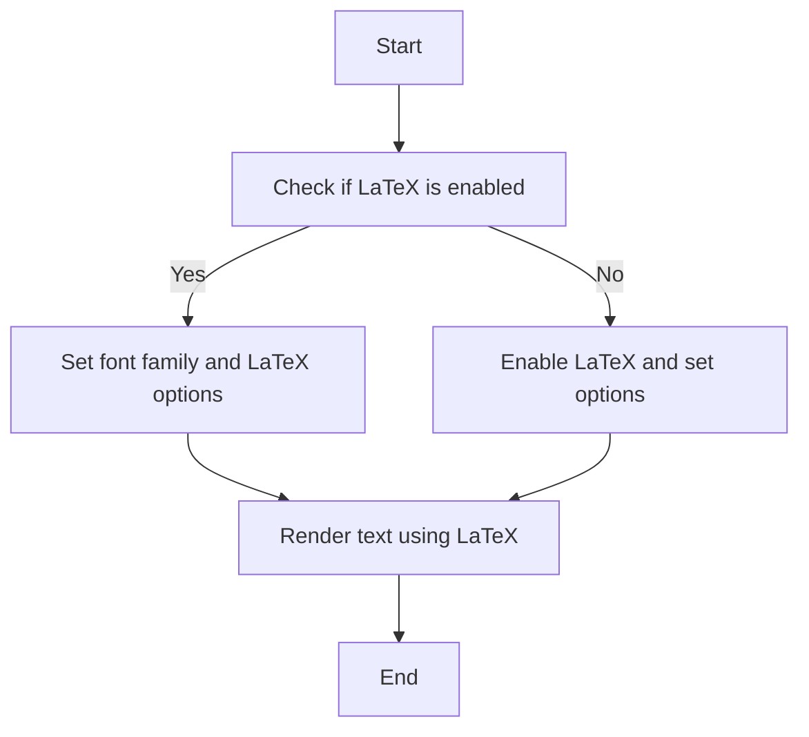

# `matplotlib\galleries\users_explain\text\usetex.py` 详细设计文档

This code provides documentation on the usage of LaTeX for text rendering in Matplotlib, including setup instructions, supported font families, and troubleshooting tips.

## 整体流程



## 类结构

```
Documentation (Root)
├── Setup Instructions
│   ├── LaTeX Installation
│   ├── Matplotlib Configuration
│   └── Backend Configuration
├── Supported Font Families
│   ├── Serif
│   ├── Sans-serif
│   ├── Cursive
│   └── Monospace
└── Troubleshooting
```

## 全局变量及字段


### `LaTeX`
    
The LaTeX_ installation required for Matplotlib's LaTeX support.

类型：`string`
    


### `dvipng`
    
Required for the \*Agg backends to render LaTeX text.

类型：`string`
    


### `PSfrag`
    
Required for the PS backend to render LaTeX text.

类型：`string`
    


### `dvips`
    
Required for the PS backend to render LaTeX text.

类型：`string`
    


### `Ghostscript`
    
Required for the PS backend to render LaTeX text.

类型：`string`
    


### `LuaTeX`
    
Used for some post-processing steps in the PDF and SVG backends to speed up LaTeX text rendering.

类型：`string`
    


### `PSNFSS`
    
Scheme defining the supported font families in Matplotlib.

类型：`string`
    


### `Computer Modern`
    
The default font family used in Matplotlib when LaTeX is enabled.

类型：`string`
    


### `Adobe fonts`
    
All other families are Adobe fonts when LaTeX is enabled.

类型：`string`
    


### `Times`
    
Has its own accompanying math fonts when used with LaTeX.

类型：`string`
    


### `Palatino`
    
Has its own accompanying math fonts when used with LaTeX.

类型：`string`
    


### `Computer Modern Typewriter`
    
Part of the monospace font family used in Matplotlib when LaTeX is enabled.

类型：`string`
    


### `Courier`
    
Part of the monospace font family used in Matplotlib when LaTeX is enabled.

类型：`string`
    


### `Computer Modern Serif`
    
Part of the sans-serif font family used in Matplotlib when LaTeX is enabled.

类型：`string`
    


### `Helvetica`
    
Part of the sans-serif font family used in Matplotlib when LaTeX is enabled.

类型：`string`
    


### `Avant Garde`
    
Part of the sans-serif font family used in Matplotlib when LaTeX is enabled.

类型：`string`
    


### `Zapf Chancery`
    
Part of the cursive font family used in Matplotlib when LaTeX is enabled.

类型：`string`
    


### `Bookman`
    
Part of the serif font family used in Matplotlib when LaTeX is enabled.

类型：`string`
    


### `New Century Schoolbook`
    
Part of the serif font family used in Matplotlib when LaTeX is enabled.

类型：`string`
    


### `Charter`
    
Part of the serif font family used in Matplotlib when LaTeX is enabled.

类型：`string`
    


### `plt`
    
The Matplotlib module that provides the rcParams and rc settings for customizing Matplotlib.

类型：`module`
    


### `rcParams`
    
The rcParams dictionary contains the settings for customizing Matplotlib.

类型：`dictionary`
    


### `text.usetex`
    
Setting this to True enables LaTeX text rendering in Matplotlib.

类型：`boolean`
    


### `font.family`
    
The font family to use for text rendering in Matplotlib when LaTeX is enabled.

类型：`string`
    


### `font.sans-serif`
    
The sans-serif font to use for text rendering in Matplotlib when LaTeX is enabled.

类型：`string`
    


### `ps.distiller.res`
    
The resolution to use when distilling PostScript files in Matplotlib.

类型：`integer`
    


### `ps.usedistiller`
    
The distiller to use when producing PostScript files in Matplotlib.

类型：`string`
    


### `text.latex.preamble`
    
Additional LaTeX commands to include in the LaTeX document when rendering text in Matplotlib.

类型：`string`
    


### `.matplotlib/tex.cache`
    
The cache directory for storing LaTeX-related files in Matplotlib.

类型：`directory`
    


### `PATH`
    
The environment variable that contains the paths to the executables for external dependencies in Matplotlib.

类型：`string`
    


### `Poppler`
    
Required for certain PostScript options in Matplotlib.

类型：`string`
    


### `Xpdf`
    
Required for certain PostScript options in Matplotlib.

类型：`string`
    


### `type1cm`
    
A required LaTeX package that may be missing from minimalist TeX installs.

类型：`string`
    


    

## 全局函数及方法


## 关键组件


### 张量索引与惰性加载

张量索引与惰性加载是用于高效处理大型数据集的关键组件，它允许在数据未完全加载到内存之前进行索引和访问。

### 反量化支持

反量化支持是用于优化计算过程的关键组件，它允许在计算过程中动态调整量化参数，以提高计算效率和精度。

### 量化策略

量化策略是用于优化模型性能的关键组件，它通过减少模型参数的精度来降低计算复杂度和内存占用，同时保持模型性能。


## 问题及建议


### 已知问题

-   **文档结构复杂**：代码中包含大量的注释和文档说明，这可能导致代码的可读性和维护性降低。
-   **依赖外部工具**：代码依赖于LaTeX、dvipng、dvips和Ghostscript等外部工具，这增加了部署和维护的复杂性。
-   **性能问题**：使用LaTeX渲染文本比Matplotlib的内置文本渲染慢，可能会影响性能。
-   **兼容性问题**：代码可能不兼容所有LaTeX版本，需要确保LaTeX环境的兼容性。

### 优化建议

-   **简化文档结构**：将文档和代码分离，减少代码中的注释，提高代码的可读性和维护性。
-   **减少外部依赖**：探索是否可以使用Matplotlib的内置功能来替代LaTeX，减少对外部工具的依赖。
-   **优化性能**：对于性能敏感的应用，可以考虑使用更快的文本渲染方法，或者优化LaTeX渲染过程。
-   **提高兼容性**：确保代码兼容多种LaTeX版本，或者提供详细的兼容性指南。
-   **模块化设计**：将代码分解为更小的模块，提高代码的可重用性和可维护性。
-   **错误处理**：增加错误处理机制，确保在遇到外部工具或LaTeX问题时能够优雅地处理异常。


## 其它


### 设计目标与约束

- 设计目标：实现一个基于LaTeX的文本渲染功能，以提供更灵活的文本格式化选项。
- 约束条件：需要与Matplotlib集成，支持多种字体和LaTeX包，同时确保性能和兼容性。

### 错误处理与异常设计

- 错误处理：当LaTeX安装或配置不正确时，应提供清晰的错误消息。
- 异常设计：捕获和处理可能发生的异常，如LaTeX命令错误或字体缺失。

### 数据流与状态机

- 数据流：文本数据通过Matplotlib传递到LaTeX渲染器，然后返回渲染后的文本或图像。
- 状态机：LaTeX渲染器根据文本内容和配置参数处理文本，并生成相应的LaTeX代码。

### 外部依赖与接口契约

- 外部依赖：LaTeX安装、dvipng、dvips、Ghostscript等。
- 接口契约：Matplotlib与LaTeX渲染器之间的接口定义，包括参数配置和错误处理。


    