# `matplotlib\lib\matplotlib\__init__.py` 详细设计文档

Matplotlib是一个面向对象的2D绘图库，提供了丰富的绘图功能和灵活的配置管理系统。该模块是matplotlib的入口点，负责初始化版本信息、配置管理(RcParams)、后端选择、日志系统、依赖检查以及各种工具函数，为整个库提供基础架构支持。

## 整体流程

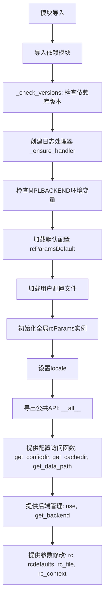

## 类结构

```
ExecutableNotFoundError (FileNotFoundError异常类)
└── _ExecInfo (namedtuple: executable, raw_version, version)

__getattr__ (模块级属性类)
└── __version__ (property)
└── __version_info__ (property)

RcParams (MutableMapping, dict配置类)
├── validate: rcsetup._validators
├── _set(key, val)
├── _get(key)
├── _update_raw(other_params)
├── _ensure_has_backend()
├── __setitem__(key, val)
├── __getitem__(key)
├── _get_backend_or_none()
├── __repr__()
├── __str__()
├── __iter__()
├── __len__()
├── find_all(pattern)
└── copy()
```

## 全局变量及字段


### `__bibtex__`
    
包含Matplotlib的BibTeX引用信息，用于学术论文引用

类型：`str`
    


### `__version__`
    
Matplotlib库的版本号，通过__getattr__动态获取

类型：`str`
    


### `__version_info__`
    
包含版本详细信息的命名元组，包括主版本、次版本、发布级别等

类型：`_VersionInfo`
    


### `_log`
    
Matplotlib模块的日志记录器实例，用于输出日志信息

类型：`logging.Logger`
    


### `_VersionInfo`
    
用于存储版本信息的命名元组类型，包含major、minor、micro、releaselevel、serial字段

类型：`namedtuple`
    


### `_ExecInfo`
    
用于存储可执行文件信息的命名元组，包含executable、raw_version、version字段

类型：`namedtuple`
    


### `rcParamsDefault`
    
Matplotlib的默认配置参数字典，包含所有默认设置值

类型：`RcParams`
    


### `rcParams`
    
Matplotlib的全局配置参数实例，当前生效的运行时配置

类型：`RcParams`
    


### `rcParamsOrig`
    
原始配置参数的副本，用于恢复默认设置

类型：`RcParams`
    


### `defaultParams`
    
默认参数字典，包含配置项及其验证器的映射关系

类型：`dict`
    


### `colormaps`
    
Matplotlib的颜色映射注册表，包含所有可用的颜色映射

类型：`ColormapRegistry`
    


### `multivar_colormaps`
    
多变量颜色映射注册表，用于多维数据可视化

类型：`ColormapRegistry`
    


### `bivar_colormaps`
    
双变量颜色映射注册表，用于双变量数据可视化

类型：`ColormapRegistry`
    


### `color_sequences`
    
预定义的颜色序列字典，用于快速访问常用颜色组合

类型：`dict`
    


### `RcParams.validate`
    
配置参数验证器字典，用于验证和转换rcParams中的配置值

类型：`dict`
    
    

## 全局函数及方法


### `_parse_to_version_info`

将版本字符串解析为类似于 `sys.version_info` 的命名元组，用于统一 Matplotlib 的版本信息表示格式。

参数：

- `version_str`：`str`，要解析的版本字符串

返回值：`_VersionInfo`（namedtuple），包含 `major`、`minor`、`micro`、`releaselevel`、`serial` 五个字段的版本信息对象

#### 流程图

```mermaid
flowchart TD
    A[开始: 输入 version_str] --> B[调用 parse_version 解析字符串]
    B --> C{检查 v.pre 是否为 None}
    C -->|是| D{检查 v.post 是否为 None}
    D -->|是| E{检查 v.dev 是否为 None}
    E -->|是| F[返回 final 版本<br/>_VersionInfo(major, minor, micro, 'final', 0)]
    E -->|否| G[返回 alpha 版本<br/>_VersionInfo(major, minor, micro, 'alpha', v.dev)]
    C -->|否| H[获取 pre 类型映射<br/>'a'→'alpha', 'b'→'beta', 'rc'→'candidate']
    H --> I[返回对应版本<br/>_VersionInfo(major, minor, micro, releaselevel, v.pre[1]]
    D -->|否| J[fallback: post 版本处理<br/>micro+1 作为新版本<br/>返回 alpha 版本]
    F --> K[结束]
    G --> K
    I --> K
    J --> K
```

#### 带注释源码

```python
def _parse_to_version_info(version_str):
    """
    Parse a version string to a namedtuple analogous to sys.version_info.

    See:
    https://packaging.pypa.io/en/latest/version.html#packaging.version.parse
    https://docs.python.org/3/library/sys.html#sys.version_info
    """
    # 使用 packaging 库的 parse_version 解析版本字符串
    # 返回一个 Version 对象，包含 major, minor, micro, pre, post, dev 等属性
    v = parse_version(version_str)
    
    # 情况1: 正式版 (final release)
    # 如果 pre、post、dev 都为 None，则是正式发布版本
    if v.pre is None and v.post is None and v.dev is None:
        # releaselevel 设为 'final', serial 设为 0
        return _VersionInfo(v.major, v.minor, v.micro, 'final', 0)
    
    # 情况2: 开发版 (dev release)
    # 如果存在 dev 标记 (如 1.0.0.dev1)
    elif v.dev is not None:
        # 开发版本视为 alpha 阶段，serial 为开发版本号
        return _VersionInfo(v.major, v.minor, v.micro, 'alpha', v.dev)
    
    # 情况3: 预发布版 (pre-release)
    # 存在 pre 标记 (如 1.0.0a1, 1.0.0b2, 1.0.0rc1)
    elif v.pre is not None:
        # 构建预发布类型映射表
        releaselevel = {
            'a': 'alpha',      # alpha 版本
            'b': 'beta',       # beta 版本
            'rc': 'candidate'  # 发布候选版本
        }.get(v.pre[0], 'alpha')  # 默认视为 alpha
        
        # 返回预发布版本信息，serial 为预发布号 (如 1, 2 等)
        return _VersionInfo(v.major, v.minor, v.micro, releaselevel, v.pre[1])
    
    # 情况4: 后发布版 (post release)
    # 存在 post 标记但没有 pre 和 dev (如 1.0.0.post1)
    else:
        # fallback: 使用 setuptools_scm 的 guess-next-dev 方案
        # 将 micro 版本号加 1，视为下一个开发版本
        return _VersionInfo(v.major, v.minor, v.micro + 1, 'alpha', v.post)
```


### `_get_version`

该函数是Matplotlib的内部版本获取函数，用于获取当前Matplotlib的版本字符串。它首先检查是否在Git仓库中（而非浅克隆），如果是则使用`setuptools_scm`从Git获取版本，否则回退到从`_version.py`文件读取版本。

参数： 无

返回值：`str`，返回Matplotlib的版本字符串。

#### 流程图

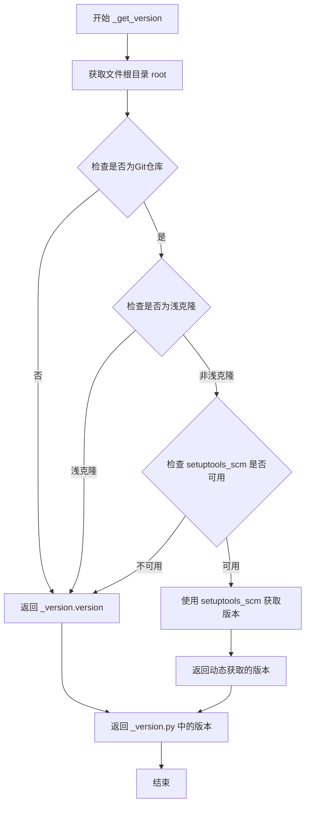

#### 带注释源码

```python
def _get_version():
    """Return the version string used for __version__."""
    # Only shell out to a git subprocess if really needed, i.e. when we are in
    # a matplotlib git repo but not in a shallow clone, such as those used by
    # CI, as the latter would trigger a warning from setuptools_scm.
    # 获取matplotlib包根目录的Path对象
    root = Path(__file__).resolve().parents[2]
    
    # 检查是否满足使用setuptools_scm的条件：
    # 1. 存在 .matplotlib-repo 文件（表示是开发仓库）
    # 2. 存在 .git 目录（是git仓库）
    # 3. 不存在 .git/shallow 文件（不是浅克隆）
    if ((root / ".matplotlib-repo").exists()
            and (root / ".git").exists()
            and not (root / ".git/shallow").exists()):
        try:
            # 尝试导入 setuptools_scm
            import setuptools_scm
        except ImportError:
            # 如果导入失败，静默pass，继续执行后面的回退逻辑
            pass
        else:
            # setuptools_scm 可用，使用它从git仓库动态获取版本
            return setuptools_scm.get_version(
                root=root,
                dist_name="matplotlib",
                version_scheme="release-branch-semver",
                local_scheme="node-and-date",
                fallback_version=_version.version,
            )
    # 如果不满足上述条件（不是开发仓库或setuptools_scm不可用），
    # 则从 _version.py 文件中获取版本（这是打包时生成的静态版本）
    return _version.version
```


### `_check_versions`

该函数在模块导入时自动执行，用于验证 Matplotlib 运行所需的依赖包（cycler、dateutil、kiwisolver、numpy、pyparsing）是否满足最低版本要求，若版本不达标则抛出 ImportError 异常。

参数：なし（无参数）

返回值：なし（无返回值，该函数仅用于检查依赖，若版本不满足则抛出异常）

#### 流程图

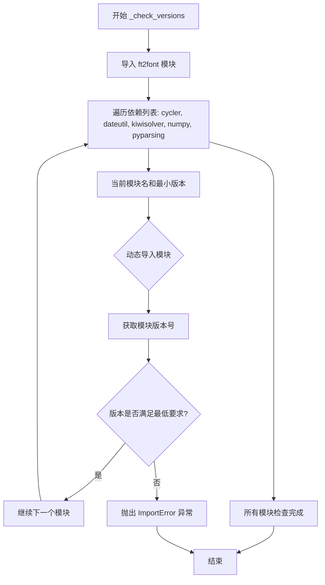

#### 带注释源码

```python
def _check_versions():
    """
    检查 Matplotlib 依赖包的最低版本要求。
    
    此函数在 matplotlib 模块首次导入时自动调用，确保所有必需的
    依赖包已安装且版本满足最低要求。
    """
    
    # Quickfix to ensure Microsoft Visual C++ redistributable
    # DLLs are loaded before importing kiwisolver
    # 快速修复：确保在导入 kiwisolver 之前加载 Microsoft Visual C++ 
    # 可再发行组件包 DLL，避免潜在的加载问题
    from . import ft2font  # noqa: F401

    # 定义所有必需的依赖包及其最低版本要求
    # 格式: (模块名, 最低版本)
    for modname, minver in [
            ("cycler", "0.10"),      # 绘图颜色循环依赖
            ("dateutil", "2.7"),     # 日期时间处理
            ("kiwisolver", "1.3.1"), # 约束求解器
            ("numpy", "1.25"),       # 数值计算基础库
            ("pyparsing", "2.3.1"),  # 解析器生成器
    ]:
        # 动态导入依赖模块
        module = importlib.import_module(modname)
        
        # 使用 packaging.version.parse 比较版本号
        # 如果当前版本低于最低要求版本，则抛出 ImportError
        if parse_version(module.__version__) < parse_version(minver):
            raise ImportError(f"Matplotlib requires {modname}>={minver}; "
                              f"you have {module.__version__}")
```


### `_ensure_handler`

该函数用于确保 Matplotlib 根日志器始终拥有一个已配置的流式处理器。第一次调用时创建并附加一个使用标准格式的 `StreamHandler`，之后调用直接返回该处理器，实现单例模式。

参数：该函数无参数

返回值：`logging.StreamHandler`，返回已配置好的日志流处理器（首次调用时创建，之后返回缓存的同一实例）

#### 流程图

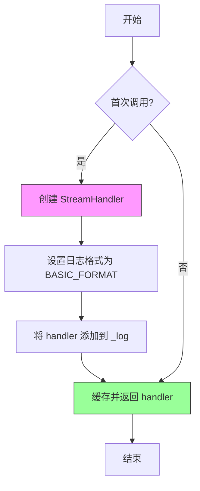

#### 带注释源码

```python
@functools.cache  # 装饰器确保函数只执行一次，后续调用直接返回缓存结果
def _ensure_handler():
    """
    The first time this function is called, attach a `StreamHandler` using the
    same format as `logging.basicConfig` to the Matplotlib root logger.

    Return this handler every time this function is called.
    """
    # 创建标准输出流日志处理器
    handler = logging.StreamHandler()
    # 使用与 logging.basicConfig 相同的格式配置处理器
    handler.setFormatter(logging.Formatter(logging.BASIC_FORMAT))
    # 将处理器添加到 Matplotlib 根日志器
    _log.addHandler(handler)
    # 返回处理器供调用者使用（如 set_loglevel 设置级别）
    return handler
```


### `set_loglevel`

配置 Matplotlib 的日志级别。Matplotlib 使用标准库 `logging` 模块在根日志记录器 'matplotlib' 下工作。该函数是一个辅助函数，用于设置 Matplotlib 的根日志记录器级别，并在需要时创建根日志记录器的处理器。通常，用户应调用 `set_loglevel("INFO")` 或 `set_loglevel("DEBUG")` 来获取额外的调试信息。

参数：

- `level`：`str`，日志级别，接受 "NOTSET"、"DEBUG"、"INFO"、"WARNING"、"ERROR" 或 "CRITICAL"（不区分大小写），定义见 Python logging 级别文档。

返回值：`None`，该函数无返回值，仅修改日志配置。

#### 流程图

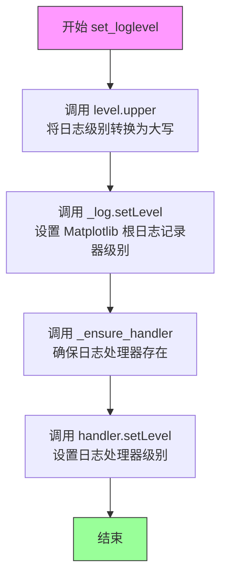

#### 带注释源码

```python
def set_loglevel(level):
    """
    Configure Matplotlib's logging levels.

    Matplotlib uses the standard library `logging` framework under the root
    logger 'matplotlib'.  This is a helper function to:

    - set Matplotlib's root logger level
    - set the root logger handler's level, creating the handler
      if it does not exist yet

    Typically, one should call ``set_loglevel("INFO")`` or
    ``set_loglevel("DEBUG")`` to get additional debugging information.

    Users or applications that are installing their own logging handlers
    may want to directly manipulate ``logging.getLogger('matplotlib')`` rather
    than use this function.

    Parameters
    ----------
    level : {"NOTSET", "DEBUG", "INFO", "WARNING", "ERROR", "CRITICAL"}
        The log level as defined in `Python logging levels
        <https://docs.python.org/3/library/logging.html#logging-levels>`__.

        For backwards compatibility, the levels are case-insensitive, but
        the capitalized version is preferred in analogy to `logging.Logger.setLevel`.

    Notes
    -----
    The first time this function is called, an additional handler is attached
    to Matplotlib's root handler; this handler is reused every time and this
    function simply manipulates the logger and handler's level.

    """
    # 设置 Matplotlib 根日志记录器的级别
    # _log 是通过 logging.getLogger(__name__) 获取的模块级logger
    # 这里实际上是操作 'matplotlib' 根 logger（因为 _log 继承自根logger）
    _log.setLevel(level.upper())
    
    # 确保日志处理器存在，并设置其级别
    # _ensure_handler() 是一个带缓存装饰器的函数，首次调用时创建 StreamHandler
    # 后续调用返回同一个 handler 实例
    _ensure_handler().setLevel(level.upper())
```


### `_logged_cached`

一个装饰器，用于记录函数的返回值并进行记忆化。第一次调用被装饰的函数时，会将其返回值记录到DEBUG级别，并缓存该值；后续调用直接返回缓存的值。

参数：

- `fmt`：`str`，日志格式化字符串，用于记录返回值
- `func`：`Callable`（可选），被装饰的函数

返回值：`Callable`，返回包装后的函数（装饰器）

#### 流程图

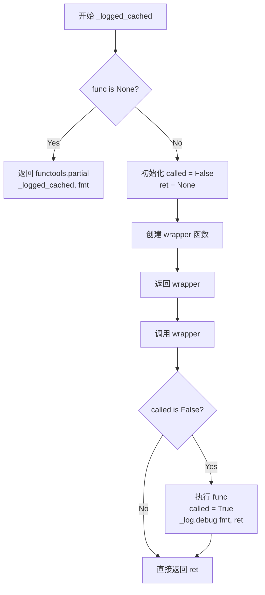

#### 带注释源码

```python
def _logged_cached(fmt, func=None):
    """
    Decorator that logs a function's return value, and memoizes that value.

    After ::

        @_logged_cached(fmt)
        def func(): ...

    the first call to *func* will log its return value at the DEBUG level using
    %-format string *fmt*, and memoize it; later calls to *func* will directly
    return that value.
    """
    # 如果 func 为 None，则返回装饰器本身（支持带参数调用）
    if func is None:  
        return functools.partial(_logged_cached, fmt)

    # 初始化标志和缓存变量
    called = False  # 标记函数是否已被调用
    ret = None      # 缓存函数返回值

    # 包装函数，实现记忆化逻辑
    @functools.wraps(func)
    def wrapper(**kwargs):
        nonlocal called, ret  # 允许修改外层变量
        # 第一次调用时执行函数并缓存结果
        if not called:
            ret = func(**kwargs)  # 执行原函数
            called = True          # 标记为已调用
            _log.debug(fmt, ret)   # 记录返回值到日志
        return ret  # 返回缓存的值

    return wrapper  # 返回包装后的函数
```


### `_get_executable_info`

获取Matplotlib可选依赖可执行文件（如dvipng、gs、inkscape、magick、pdftocairo、pdftops）的版本信息。

参数：

- `name`：`str`，要查询的可执行文件名称，支持的值包括："dvipng"、"gs"、"inkscape"、"magick"、"pdftocairo"、"pdftops"

返回值：`_ExecInfo`，命名元组，包含以下字段：
- `executable` (`str`)：可执行文件路径
- `raw_version` (`str`)：原始版本字符串
- `version` (`packaging.Version`)：解析后的版本对象，若无法确定则为None

#### 流程图

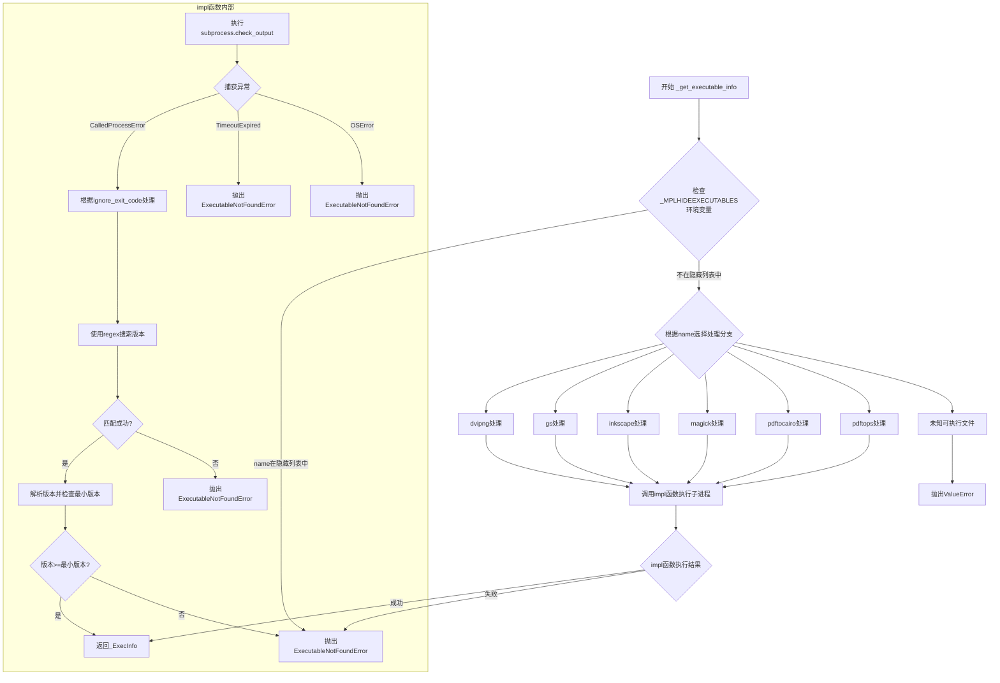

#### 带注释源码

```python
@functools.cache
def _get_executable_info(name):
    """
    Get the version of some executable that Matplotlib optionally depends on.

    .. warning::
       The list of executables that this function supports is set according to
       Matplotlib's internal needs, and may change without notice.

    Parameters
    ----------
    name : str
        The executable to query.  The following values are currently supported:
        "dvipng", "gs", "inkscape", "magick", "pdftocairo", "pdftops".  This
        list is subject to change without notice.

    Returns
    -------
    tuple
        A namedtuple with fields ``executable`` (`str`) and ``version``
        (`packaging.Version`, or ``None`` if the version cannot be determined).

    Raises
    ------
    ExecutableNotFoundError
        If the executable is not found or older than the oldest version
        supported by Matplotlib.  For debugging purposes, it is also
        possible to "hide" an executable from Matplotlib by adding it to the
        :envvar:`_MPLHIDEEXECUTABLES` environment variable (a comma-separated
        list), which must be set prior to any calls to this function.
    ValueError
        If the executable is not one that we know how to query.
    """
    # 内部实现函数：执行子进程并解析版本信息
    def impl(args, regex, min_ver=None, ignore_exit_code=False):
        """
        执行指定的子进程，捕获stdout和stderr。
        在输出中搜索regex匹配；如果匹配成功，第一组即为版本号。
        如果可执行文件存在且版本至少为min_ver（如果设置），返回_ExecInfo；
        否则抛出ExecutableNotFoundError。
        """
        try:
            output = subprocess.check_output(
                args, stderr=subprocess.STDOUT,
                text=True, errors="replace", timeout=30)
        except subprocess.CalledProcessError as _cpe:
            if ignore_exit_code:
                output = _cpe.output
            else:
                raise ExecutableNotFoundError(str(_cpe)) from _cpe
        except subprocess.TimeoutExpired as _te:
            msg = f"Timed out running {cbook._pformat_subprocess(args)}"
            raise ExecutableNotFoundError(msg) from _te
        except OSError as _ose:
            raise ExecutableNotFoundError(str(_ose)) from _ose
        
        # 使用正则表达式搜索版本号
        match = re.search(regex, output)
        if match:
            raw_version = match.group(1)
            version = parse_version(raw_version)
            if min_ver is not None and version < parse_version(min_ver):
                raise ExecutableNotFoundError(
                    f"You have {args[0]} version {version} but the minimum "
                    f"version supported by Matplotlib is {min_ver}")
            return _ExecInfo(args[0], raw_version, version)
        else:
            raise ExecutableNotFoundError(
                f"Failed to determine the version of {args[0]} from "
                f"{' '.join(args)}, which output {output}")

    # 检查是否在隐藏列表中（用于调试）
    if name in os.environ.get("_MPLHIDEEXECUTABLES", "").split(","):
        raise ExecutableNotFoundError(f"{name} was hidden")

    # 根据name选择对应的处理方式
    if name == "dvipng":
        return impl(["dvipng", "-version"], "(?m)^dvipng(?: .*)? (.+)", "1.6")
    elif name == "gs":
        # Windows平台需要检查多个Ghostscript可执行文件名称
        execs = (["gswin32c", "gswin64c", "mgs", "gs"]  # "mgs" for miktex.
                 if sys.platform == "win32" else
                 ["gs"])
        for e in execs:
            try:
                return impl([e, "--version"], "(.*)", "9")
            except ExecutableNotFoundError:
                pass
        message = "Failed to find a Ghostscript installation"
        raise ExecutableNotFoundError(message)
    elif name == "inkscape":
        try:
            # 先尝试无GUI选项（适用于Inkscape < 1.0）
            return impl(["inkscape", "--without-gui", "-V"],
                        "Inkscape ([^ ]*)")
        except ExecutableNotFoundError:
            pass  # Suppress exception chaining.
        # 如果--without-gui不被接受，可能是Inkscape >= 1.0
        return impl(["inkscape", "-V"], "Inkscape ([^ ]*)")
    elif name == "magick":
        if sys.platform == "win32":
            # 检查注册表以避免混淆ImageMagick的convert和Windows内置的convert.exe
            import winreg
            binpath = ""
            for flag in [0, winreg.KEY_WOW64_32KEY, winreg.KEY_WOW64_64KEY]:
                try:
                    with winreg.OpenKeyEx(
                            winreg.HKEY_LOCAL_MACHINE,
                            r"Software\Imagemagick\Current",
                            0, winreg.KEY_QUERY_VALUE | flag) as hkey:
                        binpath = winreg.QueryValueEx(hkey, "BinPath")[0]
                except OSError:
                    pass
            path = None
            if binpath:
                for name in ["convert.exe", "magick.exe"]:
                    candidate = Path(binpath, name)
                    if candidate.exists():
                        path = str(candidate)
                        break
            if path is None:
                raise ExecutableNotFoundError(
                    "Failed to find an ImageMagick installation")
        else:
            path = "convert"
        # 对于IM>=7.1.1-33忽略"convert"的弃用警告
        info = impl([path, "--version"], r"(?sm:.*^)Version: ImageMagick (\S*)")
        if info.raw_version == "7.0.10-34":
            # https://github.com/ImageMagick/ImageMagick/issues/2720
            raise ExecutableNotFoundError(
                f"You have ImageMagick {info.version}, which is unsupported")
        return info
    elif name == "pdftocairo":
        return impl(["pdftocairo", "-v"], "pdftocairo version (.*)")
    elif name == "pdftops":
        info = impl(["pdftops", "-v"], "^pdftops version (.*)",
                    ignore_exit_code=True)
        if info and not (
                3 <= info.version.major or
                # poppler version numbers.
                parse_version("0.9") <= info.version < parse_version("1.0")):
            raise ExecutableNotFoundError(
                f"You have pdftops version {info.version} but the minimum "
                f"version supported by Matplotlib is 3.0")
        return info
    else:
        raise ValueError(f"Unknown executable: {name!r}")
```


### `_get_xdg_config_dir`

该函数是 matplotlib 模块内部的工具函数，用于获取符合 XDG 基本目录规范的配置文件目录。它首先检查环境变量 `XDG_CONFIG_HOME`，如果该变量已设置则直接返回，否则回退到用户主目录下的 `.config` 子目录。

参数：无需参数

返回值：`str`，返回 XDG 配置目录的路径字符串。

#### 流程图


#### 带注释源码

```python
def _get_xdg_config_dir():
    """
    Return the XDG configuration directory, according to the XDG base
    directory spec:

    https://specifications.freedesktop.org/basedir-spec/basedir-spec-latest.html
    """
    # 尝试从环境变量获取 XDG 配置目录
    # 如果环境变量未设置，os.environ.get() 会返回 None
    xdg_config = os.environ.get('XDG_CONFIG_HOME')
    
    if xdg_config:
        # 环境变量已设置，直接返回该路径
        return xdg_config
    else:
        # 环境变量未设置，根据 XDG 规范回退到 ~/.config
        # Path.home() 获取用户主目录
        # 拼接 ".config" 子目录并转换为字符串返回
        return str(Path.home() / ".config")
```


### `_get_xdg_cache_dir`

该函数用于根据 XDG 基本目录规范返回 XDG 缓存目录路径。首先检查 `XDG_CACHE_HOME` 环境变量是否已设置，若已设置则返回该路径；否则返回用户主目录下的 `.cache` 子目录路径。

参数：

- 无参数

返回值：`str`，返回 XDG 缓存目录的字符串路径。

#### 流程图

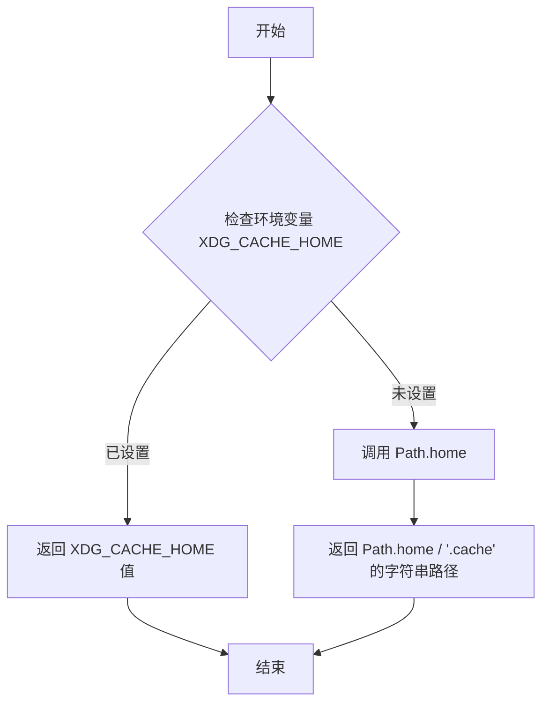

#### 带注释源码

```python
def _get_xdg_cache_dir():
    """
    Return the XDG cache directory, according to the XDG base directory spec:

    https://specifications.freedesktop.org/basedir-spec/basedir-spec-latest.html
    """
    # 首先尝试从环境变量 XDG_CACHE_HOME 获取缓存目录
    # 如果环境变量未设置，则返回 None，此时使用默认路径
    xdg_cache_home = os.environ.get('XDG_CACHE_HOME')
    
    if xdg_cache_home:
        # 环境变量已设置，直接返回该路径
        return xdg_cache_home
    else:
        # 环境变量未设置，按照 XDG 规范使用默认路径
        # 即用户主目录下的 .cache 子目录
        return str(Path.home() / ".cache")
```


### `_get_config_or_cache_dir`

获取 Matplotlib 的配置或缓存目录，如果无法访问则创建临时目录。

参数：

- `xdg_base_getter`：`Callable[[], str]`，一个返回 XDG 基础目录路径的函数（如 `_get_xdg_config_dir` 或 `_get_xdg_cache_dir`）

返回值：`str`，返回可用的配置或缓存目录路径

#### 流程图

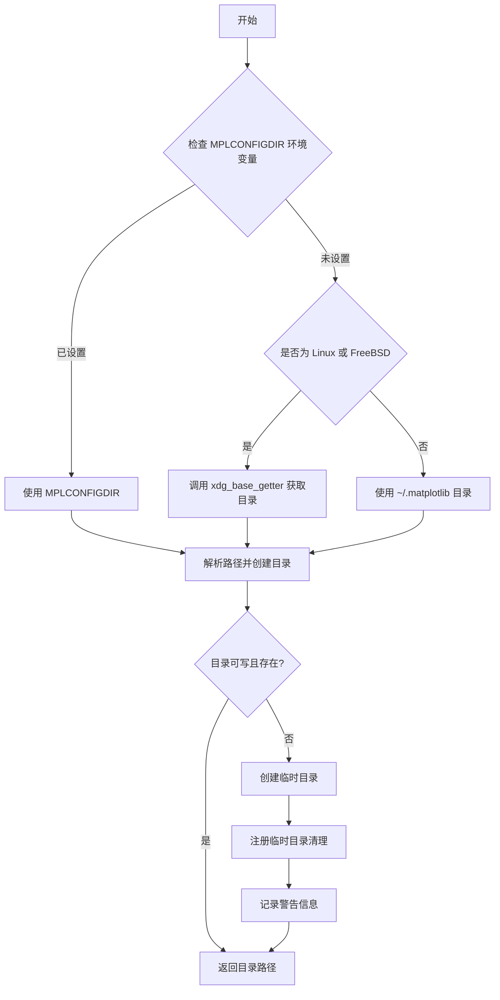

#### 带注释源码

```python
def _get_config_or_cache_dir(xdg_base_getter):
    """
    获取配置或缓存目录的内部函数。
    
    参数:
        xdg_base_getter: 一个无参函数，返回 XDG 基础目录路径
                        (如 _get_xdg_config_dir 或 _get_xdg_cache_dir)
    返回:
        str: 可用的配置或缓存目录路径
    """
    # 步骤1: 优先检查 MPLCONFIGDIR 环境变量
    configdir = os.environ.get('MPLCONFIGDIR')
    if configdir:
        # 如果环境变量已设置，转换为 Path 对象
        configdir = Path(configdir)
    # 步骤2: 如果未设置环境变量，根据操作系统选择默认路径
    elif sys.platform.startswith(('linux', 'freebsd')):
        # Linux/FreeBSD 系统使用 XDG 规范
        try:
            configdir = Path(xdg_base_getter(), "matplotlib")
        except RuntimeError:  # Path.home() 不可用时抛出
            pass
    else:
        # 其他平台使用 ~/.matplotlib
        try:
            configdir = Path.home() / ".matplotlib"
        except RuntimeError:  # Path.home() 不可用时抛出
            pass

    # 步骤3: 验证目录可用性
    if configdir:
        # 解析路径以处理不可访问的符号链接
        configdir = configdir.resolve()
        try:
            # 创建目录（如果不存在）
            configdir.mkdir(parents=True, exist_ok=True)
        except OSError as exc:
            _log.warning("mkdir -p failed for path %s: %s", configdir, exc)
        else:
            # 检查目录是否可写
            if os.access(str(configdir), os.W_OK) and configdir.is_dir():
                return str(configdir)
            _log.warning("%s is not a writable directory", configdir)
        issue_msg = "the default path ({configdir})"
    else:
        issue_msg = "resolving the home directory"
    
    # 步骤4: 无法使用默认目录时，创建临时目录
    try:
        tmpdir = tempfile.mkdtemp(prefix="matplotlib-")
    except OSError as exc:
        raise OSError(
            f"Matplotlib requires access to a writable cache directory, but there "
            f"was an issue with {issue_msg}, and a temporary "
            f"directory could not be created; set the MPLCONFIGDIR environment "
            f"variable to a writable directory") from exc
    
    # 设置环境变量并注册临时目录清理
    os.environ["MPLCONFIGDIR"] = tmpdir
    atexit.register(shutil.rmtree, tmpdir)
    _log.warning(
        "Matplotlib created a temporary cache directory at %s because there was "
        "an issue with %s; it is highly recommended to set the "
        "MPLCONFIGDIR environment variable to a writable directory, in particular to "
        "speed up the import of Matplotlib and to better support multiprocessing.",
        tmpdir, issue_msg)
    return tmpdir
```


### `get_configdir`

该函数是 Matplotlib 库中的全局配置目录获取函数，通过多层fallback机制返回用户配置目录的路径：优先使用环境变量 `MPLCONFIGDIR`，其次根据平台选择 XDG 标准目录或 `.matplotlib` 目录，最后回退到临时目录。

参数： 无

返回值：`str`，返回配置目录的字符串路径

#### 流程图


#### 带注释源码

```python
@_logged_cached('CONFIGDIR=%s')
def get_configdir():
    """
    Return the string path of the configuration directory.

    The directory is chosen as follows:

    1. If the MPLCONFIGDIR environment variable is supplied, choose that.
    2. On Linux, follow the XDG specification and look first in
       ``$XDG_CONFIG_HOME``, if defined, or ``$HOME/.config``.  On other
       platforms, choose ``$HOME/.matplotlib``.
    3. If the chosen directory exists and is writable, use that as the
       configuration directory.
    4. Else, create a temporary directory, and use it as the configuration
       directory.
    """
    # 调用底层函数 _get_config_or_cache_dir，传入 XDG 配置目录获取函数
    # 该装饰器会缓存函数返回值，并在 DEBUG 级别日志输出 CONFIGDIR=路径
    return _get_config_or_cache_dir(_get_xdg_config_dir)
```


### `get_cachedir`

返回 Matplotlib 的缓存目录路径。该函数使用 `@_logged_cached` 装饰器进行缓存，确保同一进程内多次调用时只计算一次，并记录缓存目录路径。

参数：无

返回值：`str`，缓存目录的字符串路径

#### 流程图

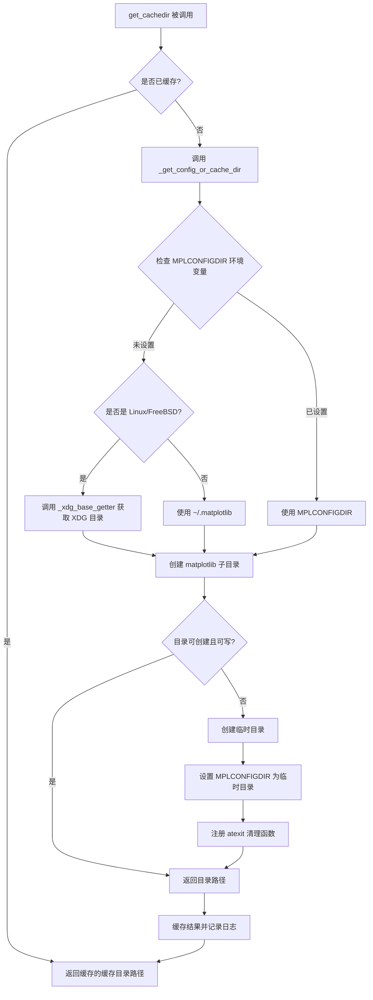

#### 带注释源码

```python
@_logged_cached('CACHEDIR=%s')  # 装饰器：缓存返回值并记录日志
def get_cachedir():
    """
    Return the string path of the cache directory.

    The procedure used to find the directory is the same as for
    `get_configdir`, except using ``$XDG_CACHE_HOME``/``$HOME/.cache`` instead.
    """
    # 调用内部函数 _get_config_or_cache_dir，传入 XDG 缓存目录获取函数
    # _get_config_or_cache_dir 内部会：
    # 1. 优先检查 MPLCONFIGDIR 环境变量
    # 2. Linux/FreeBSD 系统使用 XDG 规范 ($XDG_CACHE_HOME 或 ~/.cache)
    # 3. 其他系统使用 ~/.matplotlib
    # 4. 如果目录不可用，创建临时目录并警告用户
    return _get_config_or_cache_dir(_get_xdg_cache_dir)
```


### `get_data_path`

该函数用于获取 Matplotlib 数据文件的安装路径，通过获取当前模块文件所在目录并替换为 "mpl-data" 目录名称来实现。

参数：
- 无参数

返回值：`str`，返回 Matplotlib 数据目录的字符串路径

#### 流程图

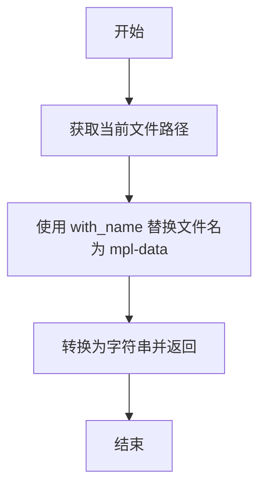

#### 带注释源码

```python
@_logged_cached('matplotlib data path: %s')
def get_data_path():
    """Return the path to Matplotlib data."""
    # __file__ 表示当前模块 (matplotlib/__init__.py) 的路径
    # Path(__file__).with_name("mpl-data") 将文件名替换为 "mpl-data"
    # str() 将 Path 对象转换为字符串路径
    return str(Path(__file__).with_name("mpl-data"))
```


### `matplotlib_fname`

该函数用于查找并返回 Matplotlib 配置文件（matplotlibrc）的路径，按照预定的优先级顺序在多个可能的位置搜索配置文件。

参数：
- 该函数无参数

返回值：`str`，返回找到的第一个存在的 matplotlibrc 文件的完整路径

#### 流程图

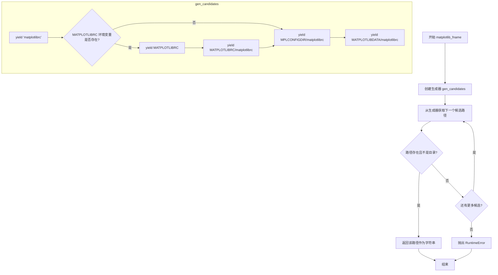

#### 带注释源码

```python
def matplotlib_fname():
    """
    获取配置文件的路径。

    文件位置的确定顺序如下：

    - ``$PWD/matplotlibrc``
    - ``$MATPLOTLIBRC``（如果它不是目录）
    - ``$MATPLOTLIBRC/matplotlibrc``
    - ``$MPLCONFIGDIR/matplotlibrc``
    - 在 Linux 上：
        - ``$XDG_CONFIG_HOME/matplotlib/matplotlibrc``（如果定义了 ``$XDG_CONFIG_HOME``）
        - 或 ``$HOME/.config/matplotlib/matplotlibrc``（如果未定义 ``$XDG_CONFIG_HOME``）
    - 在其他平台上：
      - ``$HOME/.matplotlib/matplotlibrc``（如果定义了 ``$HOME``）
    - 最后，查找 ``$MATPLOTLIBDATA/matplotlibrc``，该文件应始终存在。
    """

    def gen_candidates():
        """
        生成器函数：按优先级顺序生成可能的配置文件路径。
        
        依赖下游代码将路径转换为绝对路径。这样可以避免直接获取
        当前工作目录，如果用户的工作目录不存在则会失败。
        """
        # 首先检查当前目录下的 matplotlibrc
        yield 'matplotlibrc'
        
        # 尝试从 MATPLOTLIBRC 环境变量获取路径
        try:
            matplotlibrc = os.environ['MATPLOTLIBRC']
        except KeyError:
            pass  # 环境变量不存在，跳过
        else:
            # 如果环境变量存在，yield 该路径（可能是文件或目录）
            yield matplotlibrc
            # 如果是目录，则在该目录下查找 matplotlibrc
            yield os.path.join(matplotlibrc, 'matplotlibrc')
        
        # 检查用户配置目录
        yield os.path.join(get_configdir(), 'matplotlibrc')
        # 检查 Matplotlib 安装数据目录
        yield os.path.join(get_data_path(), 'matplotlibrc')

    # 遍历所有候选路径，返回第一个存在的文件
    for fname in gen_candidates():
        # 检查路径是否存在且不是目录（配置文件应该是文件）
        if os.path.exists(fname) and not os.path.isdir(fname):
            return fname

    # 如果所有候选路径都不存在，抛出运行时错误
    raise RuntimeError("Could not find matplotlibrc file; your Matplotlib "
                       "install is broken")
```


### `rc_params`

该函数是Matplotlib配置管理的核心入口点之一，用于从默认的matplotlibrc配置文件加载并构建一个`RcParams`对象实例。

参数：

- `fail_on_error`：`bool`，默认为`False`，控制当解析配置文件发生错误时的行为。为`True`时抛出异常，为`False`时仅输出警告。

返回值：`RcParams`，从默认Matplotlib rc文件构造的配置参数对象，包含所有matplotlib的运行时配置设置。

#### 流程图

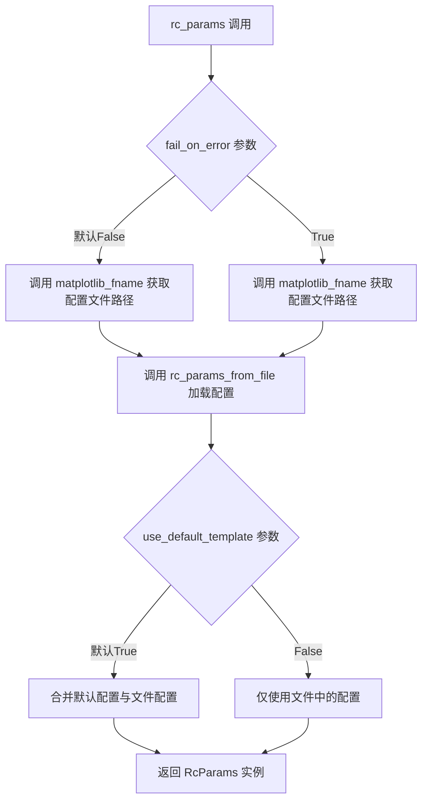

#### 带注释源码

```python
def rc_params(fail_on_error=False):
    """
    Construct a `RcParams` instance from the default Matplotlib rc file.
    
    这是Matplotlib配置系统的核心函数之一，负责从默认配置文件
    加载所有运行时配置参数。它是用户获取matplotlib默认配置的首选入口。
    
    Parameters
    ----------
    fail_on_error : bool, default: False
        If True, raise an error when the parser fails to convert a parameter.
        当解析器无法转换某个参数时，是否抛出异常而非仅发出警告。
    
    Returns
    -------
    RcParams
        包含所有matplotlib配置键值对的字典子类对象，支持验证和动态更新。
        
    See Also
    --------
    rc_params_from_file : 从指定文件加载配置
    matplotlib_fname : 获取默认配置文件路径
    RcParams : 配置参数容器类
    """
    # 调用 matplotlib_fname() 获取默认配置文件路径（按优先级查找）
    # 然后将路径和 fail_on_error 标志传递给 rc_params_from_file 进行解析
    return rc_params_from_file(matplotlib_fname(), fail_on_error)
```


### `_get_ssl_context`

该函数用于获取SSL上下文，如果certifi库可用，则返回一个配置了certifi证书的SSL上下文，否则返回None。

参数：
- （无参数）

返回值：`ssl.SSLContext | None`，返回配置了certifi CA证书的SSL上下文，如果certifi模块不可用则返回None。

#### 流程图

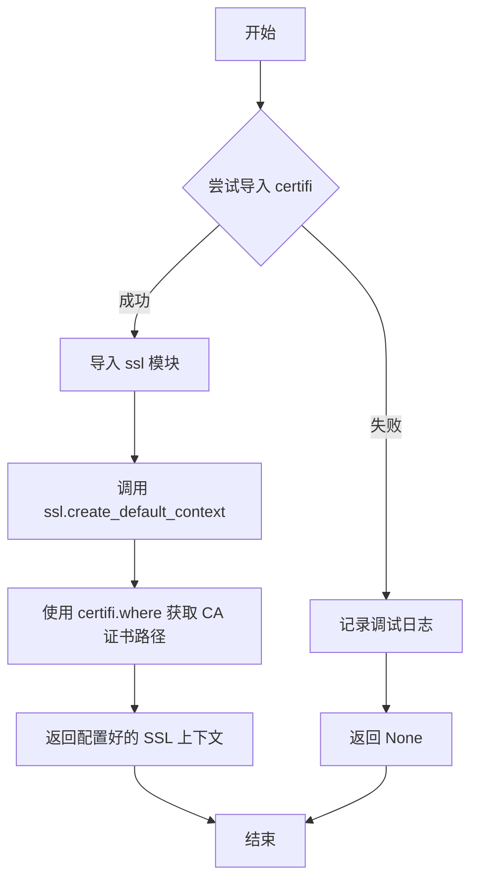

#### 带注释源码

```python
@functools.cache  # 使用缓存装饰器，确保函数只执行一次
def _get_ssl_context():
    """
    获取SSL上下文用于HTTPS连接。
    
    如果certifi库可用，返回一个配置了certifi CA证书的SSL上下文；
    否则返回None，此时HTTPS连接可能无法正常工作。
    
    Returns
    -------
    ssl.SSLContext or None
        配置了certifi CA证书的SSL上下文，或None（如果certifi不可用）
    """
    try:
        import certifi  # 尝试导入certifi库
    except ImportError:
        _log.debug("Could not import certifi.")  # 记录调试日志
        return None  # certifi不可用时返回None
    import ssl  # 导入ssl模块
    # 创建默认SSL上下文并配置certifi的CA证书文件路径
    return ssl.create_default_context(cafile=certifi.where())
```


### `_open_file_or_url`

该函数是一个上下文管理器，用于打开本地文件或读取远程 URL（HTTP/HTTPS/FTP/FILE）的内容，并逐行 yield 读取的内容。对于远程资源，会使用 SSL 上下文（如果可用）进行安全连接；对于本地文件，会先展开用户路径（~），然后以 UTF-8 编码打开。

参数：

- `fname`：`str`，文件名或 URL 字符串。当以 `http://`、`https://`、`ftp://` 或 `file:` 开头时视为远程 URL，否则视为本地文件路径。

返回值：`Generator[str, None, None]`，返回一个生成器，逐行yield文件或URL的内容（已解码为 UTF-8 字符串）。

#### 流程图

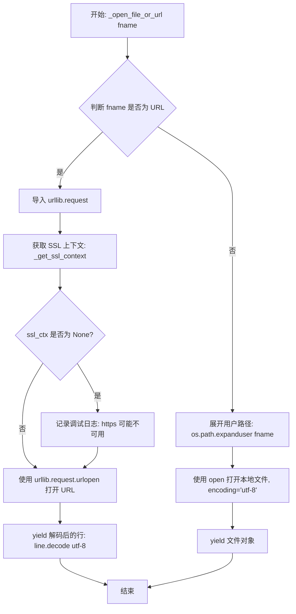

#### 带注释源码

```python
@contextlib.contextmanager
def _open_file_or_url(fname):
    """
    上下文管理器：打开文件或 URL 并逐行 yield 内容。
    
    Parameters
    ----------
    fname : str
        文件路径或 URL 字符串。
        支持的 URL 协议: http://, https://, ftp://, file:
    
    Yields
    ------
    Generator[str, None, None]
        逐行 yield 文件内容（已解码为 UTF-8）。
    """
    # 判断 fname 是否为远程 URL（HTTP/HTTPS/FTP/FILE）
    if (isinstance(fname, str)
            and fname.startswith(('http://', 'https://', 'ftp://', 'file:'))):
        # 导入 urllib.request 用于处理网络请求
        import urllib.request
        
        # 获取 SSL 上下文以支持 HTTPS 连接
        ssl_ctx = _get_ssl_context()
        
        # 如果无法获取 SSL 上下文，记录调试警告
        if ssl_ctx is None:
            _log.debug(
                "Could not get certifi ssl context, https may not work."
            )
        
        # 打开 URL 并逐行 yield 解码后的内容
        with urllib.request.urlopen(fname, context=ssl_ctx) as f:
            yield (line.decode('utf-8') for line in f)
    else:
        # 本地文件：展开用户路径 ~ 为实际路径
        fname = os.path.expanduser(fname)
        
        # 以 UTF-8 编码打开本地文件
        with open(fname, encoding='utf-8') as f:
            yield f
```


### `_rc_params_in_file`

该函数用于从指定的配置文件加载 RcParams 实例，与 `rc_params_from_file` 不同的是，它仅包含文件中指定的参数，不会填充默认值。

参数：
- `fname`：`path-like`，要加载的配置文件路径
- `transform`：`callable`，默认值为恒等函数，用于在进一步解析前对文件的每一行进行转换处理
- `fail_on_error`：`bool`，默认值为 False，是否将无效条目抛出异常而非仅发出警告

返回值：`RcParams`，从文件中解析出的配置参数集合

#### 流程图

```mermaid
flowchart TD
    A[开始] --> B[打开文件 fname]
    B --> C{遍历文件每一行}
    C --> D[应用 transform 函数]
    D --> E[去除注释]
    E --> F{检查是否有内容}
    F -->|无| C
    F -->|有| G[按冒号分割键值]
    G --> H{分割是否为2部分}
    H -->|否| I[记录警告: 缺少冒号]
    H -->|是| J[提取 key 和 val]
    J --> K[去除首尾空白]
    K --> L{值是否用双引号包围}
    L -->|是| M[去除双引号]
    L -->|否| N[继续]
    M --> N
    N --> O{key 是否已存在}
    O -->|是| P[记录警告: 重复 key]
    O -->|否| Q[存储到 rc_temp]
    Q --> C
    C -->|文件结束| R[创建空 RcParams]
    R --> S{遍历 rc_temp}
    S --> T{key 是否有验证器}
    T -->|是| U{fail_on_error?}
    U -->|是| V[尝试设置 config[key]]
    U -->|否| W[尝试设置并捕获异常]
    W --> X{设置成功?}
    X -->|是| S
    X -->|否| Y[记录警告: 错误值]
    V --> S
    T -->|否| Z[记录警告: 未知 key]
    Z --> S
    S -->|遍历完成| AA[返回 config]
```

#### 带注释源码

```python
def _rc_params_in_file(fname, transform=lambda x: x, fail_on_error=False):
    """
    Construct a `RcParams` instance from file *fname*.

    Unlike `rc_params_from_file`, the configuration class only contains the
    parameters specified in the file (i.e. default values are not filled in).

    Parameters
    ----------
    fname : path-like
        The loaded file.
    transform : callable, default: the identity function
        A function called on each individual line of the file to transform it,
        before further parsing.
    fail_on_error : bool, default: False
        Whether invalid entries should result in an exception or a warning.
    """
    import matplotlib as mpl
    # 用于临时存储解析出的键值对
    rc_temp = {}
    # 打开文件或 URL（支持本地文件和网络资源）
    with _open_file_or_url(fname) as fd:
        try:
            # 逐行读取文件，line_no 从 1 开始计数
            for line_no, line in enumerate(fd, 1):
                # 应用转换函数（如去除注释前缀）
                line = transform(line)
                # 去除注释部分，获取纯配置行
                strippedline = cbook._strip_comment(line)
                if not strippedline:
                    continue
                # 按冒号分割键值对（只分割第一个冒号）
                tup = strippedline.split(':', 1)
                if len(tup) != 2:
                    # 记录缺少冒号的警告
                    _log.warning('Missing colon in file %r, line %d (%r)',
                                 fname, line_no, line.rstrip('\n'))
                    continue
                key, val = tup
                # 去除键值对的首尾空白
                key = key.strip()
                val = val.strip()
                # 处理双引号包围的值（去除引号）
                if val.startswith('"') and val.endswith('"'):
                    val = val[1:-1]  # strip double quotes
                # 检查重复的键
                if key in rc_temp:
                    _log.warning('Duplicate key in file %r, line %d (%r)',
                                 fname, line_no, line.rstrip('\n'))
                # 存储：值、原始行、行号
                rc_temp[key] = (val, line, line_no)
        except UnicodeDecodeError:
            _log.warning('Cannot decode configuration file %r as utf-8.',
                         fname)
            raise

    # 创建 RcParams 实例
    config = RcParams()

    # 遍历临时存储的键值对
    for key, (val, line, line_no) in rc_temp.items():
        # 检查是否有对应的验证器
        if key in rcsetup._validators:
            if fail_on_error:
                # 尝试转换为正确类型或直接抛出异常
                config[key] = val  # try to convert to proper type or raise
            else:
                try:
                    # 尝试转换，失败则跳过并记录警告
                    config[key] = val  # try to convert to proper type or skip
                except Exception as msg:
                    _log.warning('Bad value in file %r, line %d (%r): %s',
                                 fname, line_no, line.rstrip('\n'), msg)
        else:
            # 处理未知键的情况
            # __version__ must be looked up as an attribute to trigger the
            # module-level __getattr__.
            version = ('main' if '.post' in mpl.__version__
                       else f'v{mpl.__version__}')
            _log.warning("""
Bad key %(key)s in file %(fname)s, line %(line_no)s (%(line)r)
You probably need to get an updated matplotlibrc file from
https://github.com/matplotlib/matplotlib/blob/%(version)s/lib/matplotlib/mpl-data/matplotlibrc
or from the matplotlib source distribution""",
                         dict(key=key, fname=fname, line_no=line_no,
                              line=line.rstrip('\n'), version=version))
    return config
```


### `rc_params_from_file`

从文件加载 Matplotlib RC 参数配置，返回包含默认参数和文件参数的 `RcParams` 对象。

参数：

- `fname`：`str` 或 `path-like`，包含 Matplotlib RC 设置的文件路径
- `fail_on_error`：`bool`，如果为 True，当解析器无法转换参数时抛出异常；默认为 False
- `use_default_template`：`bool`，如果为 True，先用默认参数初始化，再用文件中的参数更新；如果为 False，配置对象仅包含文件中指定的参数（适用于更新字典）

返回值：`RcParams`，从文件加载的 Matplotlib 配置参数对象

#### 流程图

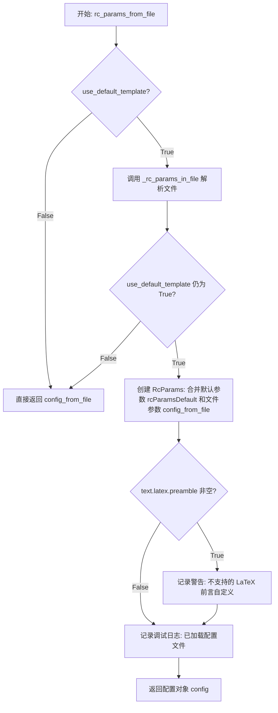

#### 带注释源码

```python
def rc_params_from_file(fname, fail_on_error=False, use_default_template=True):
    """
    Construct a `RcParams` from file *fname*.

    Parameters
    ----------
    fname : str or path-like
        A file with Matplotlib rc settings.
    fail_on_error : bool
        If True, raise an error when the parser fails to convert a parameter.
    use_default_template : bool
        If True, initialize with default parameters before updating with those
        in the given file. If False, the configuration class only contains the
        parameters specified in the file. (Useful for updating dicts.)
    """
    # 首先调用内部函数解析文件，获取文件中的配置参数
    config_from_file = _rc_params_in_file(fname, fail_on_error=fail_on_error)

    # 如果不需要使用默认模板，直接返回从文件解析的配置
    if not use_default_template:
        return config_from_file

    # 合并默认配置和文件配置，创建新的 RcParams 对象
    with _api.suppress_matplotlib_deprecation_warning():
        config = RcParams({**rcParamsDefault, **config_from_file})

    # 检查是否有不支持的 LaTeX 前言自定义，给出警告信息
    if "".join(config['text.latex.preamble']):
        _log.info("""
*****************************************************************
You have the following UNSUPPORTED LaTeX preamble customizations:
%s
Please do not ask for support with these customizations active.
*****************************************************************
""", '\n'.join(config['text.latex.preamble']))
    
    # 记录调试日志，表示配置文件已成功加载
    _log.debug('loaded rc file %s', fname)

    # 返回最终的配置对象
    return config
```


### `rc`

该函数用于动态设置matplotlib的rcParams配置参数，支持通过分组和别名快速修改绘图外观设置，如线条宽度、颜色、字体等，是matplotlib样式系统的核心接口函数。

参数：

- `group`：`str | list[str] | tuple[str]`，配置参数的分组名称（如`'lines'`、`'axes'`），也可以是多个分组组成的列表或元组
- `**kwargs`：`任意`，具体的参数名和参数值对，支持使用常用属性的缩写别名

返回值：`None`，该函数直接修改全局`rcParams`字典，不返回任何值

#### 流程图

```mermaid
flowchart TD
    A[开始: rc函数] --> B{group是否为字符串?}
    B -->|是| C[将group转换为元组]
    B -->|否| D[保持group为可迭代对象]
    C --> E[遍历group中的每个分组g]
    D --> E
    E --> F[遍历kwargs中的每个键值对k, v]
    F --> G[获取参数别名: name = aliases.get(k, k)]
    H[构造完整key: f'{g}.{name}']
    G --> H
    H --> I{key是否在rcParams中有效?}
    I -->|是| J[设置 rcParams[key] = v]
    I -->|否| K[抛出KeyError异常]
    J --> L{是否还有更多kwargs?}
    K --> M[结束: 函数返回]
    L -->|是| F
    L -->|否| N{是否还有更多分组?}
    N -->|是| E
    N -->|否| M
```

#### 带注释源码

```python
def rc(group, **kwargs):
    """
    Set the current `.rcParams`.  *group* is the grouping for the rc, e.g.,
    for ``lines.linewidth`` the group is ``lines``, for
    ``axes.facecolor``, the group is ``axes``, and so on.  Group may
    also be a list or tuple of group names, e.g., (*xtick*, *ytick*).
    *kwargs* is a dictionary attribute name/value pairs, e.g.,::

      rc('lines', linewidth=2, color='r')

    sets the current `.rcParams` and is equivalent to::

      rcParams['lines.linewidth'] = 2
      rcParams['lines.color'] = 'r'

    The following aliases are available to save typing for interactive users:

    ======  =================
    Alias   Property
    ======  =================
    'lw'    'linewidth'
    'ls'    'linestyle'
    'c'     'color'
    'fc'    'facecolor'
    'ec'    'edgecolor'
    'mew'   'markeredgewidth'
    'aa'    'antialiased'
    'sans'  'sans-serif'
    ======  =================

    Thus you could abbreviate the above call as::

          rc('lines', lw=2, c='r')

    Note you can use python's kwargs dictionary facility to store
    dictionaries of default parameters.  e.g., you can customize the
    font rc as follows::

      font = {'family' : 'monospace',
              'weight' : 'bold',
              'size'   : 'large'}
      rc('font', **font)  # pass in the font dict as kwargs

    This enables you to easily switch between several configurations.  Use
    ``matplotlib.style.use('default')`` or :func:`~matplotlib.rcdefaults` to
    restore the default `.rcParams` after changes.

    Notes
    -----
    Similar functionality is available by using the normal dict interface, i.e.
    ``rcParams.update({"lines.linewidth": 2, ...})`` (but ``rcParams.update``
    does not support abbreviations or grouping).
    """

    # 定义常用属性的缩写别名，减少交互式使用时的输入量
    aliases = {
        'lw':  'linewidth',      # 线条宽度
        'ls':  'linestyle',     # 线条样式
        'c':   'color',         # 颜色
        'fc':  'facecolor',     # 填充颜色
        'ec':  'edgecolor',     # 边框颜色
        'mew': 'markeredgewidth',  # 标记边缘宽度
        'aa':  'antialiased',   # 抗锯齿
        'sans': 'sans-serif',   # 无衬线字体
    }

    # 如果group是单个字符串，转换为元组以统一处理逻辑
    if isinstance(group, str):
        group = (group,)
    
    # 遍历每个分组名称
    for g in group:
        # 遍历传入的每个参数键值对
        for k, v in kwargs.items():
            # 解析参数名：优先使用别名，否则使用原始名称
            name = aliases.get(k) or k
            # 构造完整的配置键名，格式为 "分组.属性名"
            key = f'{g}.{name}'
            try:
                # 尝试将值设置到全局rcParams字典中
                # 这里会触发RcParams.__setitem__中的验证逻辑
                rcParams[key] = v
            except KeyError as err:
                # 如果键无效，抛出详细的错误信息
                raise KeyError(('Unrecognized key "%s" for group "%s" and '
                                'name "%s"') % (key, g, name)) from err
```


### `rcdefaults`

恢复 Matplotlib 的 `.rcParams` 到内部默认样式。该函数会清除当前的 rcParams 并从默认配置中重新加载，但会跳过样式黑名单中的参数。

参数：  
无

返回值：`None`，无返回值（该函数直接修改全局 `rcParams` 对象）

#### 流程图

```mermaid
flowchart TD
    A[开始 rcdefaults] --> B[suppress_matplotlib_deprecation_warning 上下文管理器]
    B --> C[从 matplotlib.style.core 导入 STYLE_BLACKLIST]
    C --> D[调用 rcParams.clear 清空当前配置]
    D --> E[遍历 rcParamsDefault 项]
    E --> F{检查键是否在 STYLE_BLACKLIST 中}
    F -->|不在黑名单| G[将该键值对加入更新字典]
    F -->|在黑名单| H[跳过该键值对]
    G --> E
    H --> E
    E --> I[调用 rcParams.update 应用过滤后的配置]
    I --> J[结束]
```

#### 带注释源码

```python
def rcdefaults():
    """
    Restore the `.rcParams` from Matplotlib's internal default style.

    Style-blacklisted `.rcParams` (defined in
    ``matplotlib.style.core.STYLE_BLACKLIST``) are not updated.

    See Also
    --------
    matplotlib.rc_file_defaults
        Restore the `.rcParams` from the rc file originally loaded by
        Matplotlib.
    matplotlib.style.use
        Use a specific style file.  Call ``style.use('default')`` to restore
        the default style.
    """
    # Deprecation warnings were already handled when creating rcParamsDefault,
    # no need to reemit them here.
    # 使用上下文管理器抑制 Matplotlib 的弃用警告
    with _api.suppress_matplotlib_deprecation_warning():
        # 从样式模块导入黑名单列表，包含不应被 rcdefaults 重置的参数
        from .style.core import STYLE_BLACKLIST
        # 清空全局 rcParams 对象，移除所有当前配置
        rcParams.clear()
        # 从默认配置 rcParamsDefault 中筛选出不在黑名单的参数
        # 并更新到全局 rcParams 中，实现配置重置
        rcParams.update({k: v for k, v in rcParamsDefault.items()
                         if k not in STYLE_BLACKLIST})
```


### `rc_file_defaults`

恢复 `rcParams` 到从原始 rc 文件加载的值，排除样式黑名单中的参数。

参数：

- （无参数）

返回值：`None`，无返回值描述

#### 流程图

```mermaid
flowchart TD
    A[开始 rc_file_defaults] --> B[使用 _api.suppress_matplotlib_deprecation_warning 上下文管理器]
    B --> C[从 matplotlib.style.core 导入 STYLE_BLACKLIST]
    C --> D[使用字典推导式构建更新字典]
    D --> E{检查 key 是否在 STYLE_BLACKLIST 中}
    E -->|不在| F[将 rcParamsOrig[key] 添加到更新字典]
    E -->|在| G[跳过该 key]
    F --> H{检查下一个 key}
    G --> H
    H --> I{所有 key 遍历完成?}
    I -->|否| E
    I -->|是| J[使用 rcParams.update 更新配置]
    J --> K[结束函数]
```

#### 带注释源码

```python
def rc_file_defaults():
    """
    Restore the `.rcParams` from the original rc file loaded by Matplotlib.

    Style-blacklisted `.rcParams` (defined in
    ``matplotlib.style.core.STYLE_BLACKLIST``) are not updated.
    """
    # Deprecation warnings were already handled when creating rcParamsOrig, no
    # need to reemit them here.
    with _api.suppress_matplotlib_deprecation_warning():
        from .style.core import STYLE_BLACKLIST
        rcParams.update({k: rcParamsOrig[k] for k in rcParamsOrig
                         if k not in STYLE_BLACKLIST})
```


### `rc_file`

该函数用于从指定的文件加载并更新 Matplotlib 的 rcParams 配置参数。它首先调用 `rc_params_from_file` 解析文件中的配置，然后根据 `STYLE_BLACKLIST` 过滤掉被列入黑名单的样式参数，最后将剩余的配置参数更新到全局的 `rcParams` 中。

参数：

- `fname`：`str` 或 `path-like`，包含 Matplotlib rc 设置的文件路径。
- `use_default_template`：`bool`，默认为 `True`。如果为 `True`，则在更新文件中的参数之前先初始化默认参数；如果为 `False`，则当前配置保持不变，仅更新文件中指定的参数。

返回值：`None`，该函数直接修改全局的 `rcParams` 字典。

#### 流程图

```mermaid
flowchart TD
    A[开始: rc_file] --> B[进入 suppress_matplotlib_deprecation_warning 上下文管理器]
    B --> C[导入 STYLE_BLACKLIST]
    C --> D{use_default_template?}
    D -->|True| E[使用默认模板调用 rc_params_from_file]
    D -->|False| F[不使用默认模板调用 rc_params_from_file]
    E --> G[获取 rc_from_file 配置字典]
    F --> G
    G --> H[过滤掉 STYLE_BLACKLIST 中的键]
    H --> I[使用 update 方法更新 rcParams]
    I --> J[结束]
```

#### 带注释源码

```python
def rc_file(fname, *, use_default_template=True):
    """
    Update `.rcParams` from file.

    Style-blacklisted `.rcParams` (defined in
    ``matplotlib.style.core.STYLE_BLACKLIST``) are not updated.

    Parameters
    ----------
    fname : str or path-like
        A file with Matplotlib rc settings.

    use_default_template : bool
        If True, initialize with default parameters before updating with those
        in the given file. If False, the current configuration persists
        and only the parameters specified in the file are updated.
    """
    # Deprecation warnings were already handled in rc_params_from_file, no need
    # to reemit them here.
    # 使用上下文管理器抑制matplotlib弃用警告，避免重复发出警告
    with _api.suppress_matplotlib_deprecation_warning():
        # 从 style.core 模块导入样式黑名单
        # 黑名单中的rcParams不会通过此函数更新
        from .style.core import STYLE_BLACKLIST
        # 调用 rc_params_from_file 解析文件中的配置
        # 参数 use_default_template 控制是否先加载默认配置模板
        rc_from_file = rc_params_from_file(
            fname, use_default_template=use_default_template)
        # 从解析的配置中过滤掉黑名单中的键值对
        # 然后更新全局 rcParams
        rcParams.update({k: rc_from_file[k] for k in rc_from_file
                         if k not in STYLE_BLACKLIST})
```


### `rc_context`

该函数是一个上下文管理器，用于临时更改 Matplotlib 的 `rcParams`（配置参数）。它能在上下文块执行期间临时应用新的配置设置，并在块结束时自动恢复到原始状态，特别适用于需要在特定代码段中修改绘图参数而不想影响全局设置的场景。

参数：

- `rc`：`dict`，可选。要临时设置的 rcParams 字典。
- `fname`：`str` 或 `path-like`，可选。包含 Matplotlib rc 设置的文件路径。如果同时指定了 `fname` 和 `rc`，则 `rc` 的设置优先。

返回值：`contextlib.contextManager`，返回一个上下文管理器对象，用于临时修改 rcParams。

#### 流程图

```mermaid
flowchart TD
    A[开始 rc_context] --> B[复制当前 rcParams]
    B --> C[删除 'backend' 键]
    C --> D{是否提供 fname?}
    D -->|是| E[调用 rc_file 加载配置]
    D -->|否| F{是否提供 rc?}
    E --> F
    F -->|是| G[使用 rcParams.update 更新配置]
    F -->|否| H[执行 with 块中的代码]
    G --> H
    H --> I{代码执行完毕}
    I --> J[在 finally 块中恢复原始配置]
    J --> K[结束]
    
    style A fill:#f9f,color:#333
    style K fill:#9f9,color:#333
    style J fill:#ff9,color:#333
```

#### 带注释源码

```python
@contextlib.contextmanager
def rc_context(rc=None, fname=None):
    """
    返回一个上下文管理器，用于临时更改 rcParams。

    :rc:`backend` 不会被上下文管理器重置。

    通过上下文管理器调用和代码体中更改的 rcParams 都将在上下文退出时重置。

    参数
    ----------
    rc : dict
        要临时设置的 rcParams。
    fname : str 或 path-like
        包含 Matplotlib rc 设置的文件。如果同时指定了 *fname* 和 *rc*，
        则 *rc* 的设置优先。

    另请参阅
    --------
    :ref:`customizing-with-matplotlibrc-files`

    示例
    --------
    通过字典传递显式值::

        with mpl.rc_context({'interactive': False}):
            fig, ax = plt.subplots()
            ax.plot(range(3), range(3))
            fig.savefig('example.png')
            plt.close(fig)

    从文件加载设置::

         with mpl.rc_context(fname='print.rc'):
             plt.plot(x, y)  # 使用 'print.rc'

    在上下文体中设置::

        with mpl.rc_context():
            # 将会被重置
            mpl.rcParams['lines.linewidth'] = 5
            plt.plot(x, y)

    """
    # 复制当前的 rcParams 以便后续恢复
    orig = dict(rcParams.copy())
    # 删除 'backend' 键，因为后端不应该被上下文管理器重置
    del orig['backend']
    try:
        # 如果提供了 fname，则从文件加载 rc 设置
        if fname:
            rc_file(fname)
        # 如果提供了 rc 字典，则更新 rcParams
        if rc:
            rcParams.update(rc)
        # 执行 with 块中的代码
        yield
    finally:
        # 在上下文结束时，恢复到原始的 rcParams 配置
        rcParams._update_raw(orig)  # Revert to the original rcs.
```


### `use`

选择用于渲染和GUI集成的matplotlib后端。如果pyplot已导入，则使用`switch_backend`切换后端；否则直接设置rcParams中的backend参数。

参数：

- `backend`：`str`，要切换到的后端名称，可以是标准后端名称（如"Qt5Agg"、"agg"等）或`module://my.module.name`格式的模块路径
- `force`：`bool`，默认为True，如果为True则当后端无法设置时抛出ImportError；否则静默忽略失败

返回值：`None`，该函数没有返回值

#### 流程图

```mermaid
flowchart TD
    A[开始: use函数] --> B{验证backend名称}
    B --> C{获取当前后端}
    C --> D{requested backend == current backend?}
    D -->|是| E[直接返回,不做任何操作]
    D -->|否| F{pyplot是否已导入?}
    F -->|是| G[调用plt.switch_backend切换后端]
    G --> H{切换成功?}
    H -->|是| I[设置backend_fallback=False]
    H -->|否| J{force=True?}
    J -->|是| K[抛出ImportError]
    J -->|否| I
    F -->|否| L[直接设置rcParams['backend']]
    L --> I
    I --> M[结束]
    E --> M
```

#### 带注释源码

```python
def use(backend, *, force=True):
    """
    Select the backend used for rendering and GUI integration.

    If pyplot is already imported, `~matplotlib.pyplot.switch_backend` is used
    to switch the backend.

    Parameters
    ----------
    backend : str
        The backend to switch to.  This can either be one of the standard
        backend names, which are case-insensitive:

        - interactive backends:
          GTK3Agg, GTK3Cairo, GTK4Agg, GTK4Cairo, MacOSX, nbAgg, notebook, QtAgg,
          QtCairo, TkAgg, TkCairo, WebAgg, WX, WXAgg, WXCairo, Qt5Agg, Qt5Cairo

        - non-interactive backends:
          agg, cairo, pdf, pgf, ps, svg, template

        or a string of the form: ``module://my.module.name``.

        notebook is a synonym for nbAgg.

        Switching to an interactive backend is not possible if an unrelated
        event loop has already been started (e.g., switching to GTK3Agg if a
        TkAgg window has already been opened).  Switching to a non-interactive
        backend is always possible.

    force : bool, default: True
        If True (the default), raise an `ImportError` if the backend cannot be
        set up (either because it fails to import, or because an incompatible
        GUI interactive framework is already running); if False, silently
        ignore the failure.

    See Also
    --------
    :ref:`backends`
    matplotlib.get_backend
    matplotlib.pyplot.switch_backend

    """
    # 使用rcsetup验证后端名称并转换为标准名称
    name = rcsetup.validate_backend(backend)
    
    # 不要过早解析"auto"后端设置
    # 检查请求的后端是否已经设置
    if rcParams._get_backend_or_none() == name:
        # 如果请求的后端已经设置，则无需操作
        pass
    else:
        # 如果pyplot尚未导入，则不要导入它。
        # 这样做可能会在用户有机会更改为所请求的后端之前
        # 触发`plt.switch_backend`到_默认_后端
        plt = sys.modules.get('matplotlib.pyplot')
        
        # 如果已导入pyplot，则尝试更改后端
        if plt is not None:
            try:
                # 需要在此处进行导入检查，以便在用户没有安装
                # 所选后端所需的库时重新引发异常
                plt.switch_backend(name)
            except ImportError:
                if force:
                    raise
        # 如果我们尚未导入pyplot，则可以设置rcParam值
        # 该值将在用户最终导入pyplot时被使用
        else:
            rcParams['backend'] = backend
    
    # 如果用户请求了特定后端，则不提供有用的回退
    rcParams['backend_fallback'] = False
```


### `get_backend`

获取当前 Matplotlib 后端的名称。

参数：

- `auto_select`：`bool`，默认值为 `True`，是否在尚未选择后端时触发后端解析。如果为 `True`，确保返回有效的后端；如果为 `False`，如果尚未选择后端则返回 `None`。

返回值：`str | None`，当前后端的名称，如果 `auto_select` 为 `False` 且尚未选择后端，则返回 `None`。

#### 流程图

```mermaid
flowchart TD
    A[开始 get_backend] --> B{auto_select == True?}
    B -->|是| C[返回 rcParams['backend']]
    B -->|否| D[调用 rcParams._get('backend')]
    D --> E{backend is _auto_backend_sentinel?}
    E -->|是| F[返回 None]
    E -->|否| G[返回 backend]
    C --> H[结束]
    F --> H
    G --> H
```

#### 带注释源码

```python
def get_backend(*, auto_select=True):
    """
    Return the name of the current backend.

    Parameters
    ----------
    auto_select : bool, default: True
        Whether to trigger backend resolution if no backend has been
        selected so far. If True, this ensures that a valid backend
        is returned. If False, this returns None if no backend has been
        selected so far.

        .. versionadded:: 3.10

        .. admonition:: Provisional

           The *auto_select* flag is provisional. It may be changed or removed
           without prior warning.

    See Also
    --------
    matplotlib.use
    """
    # 如果 auto_select 为 True，则通过 rcParams['backend'] 获取后端
    # 这会触发后端解析逻辑（如果尚未设置后端）
    if auto_select:
        return rcParams['backend']
    # 否则，尝试直接获取后端而不触发解析
    else:
        # 使用 _get 方法直接读取，避免触发 __getitem__ 中的后端解析逻辑
        backend = rcParams._get('backend')
        # 检查是否仍处于自动后端状态（尚未明确设置后端）
        if backend is rcsetup._auto_backend_sentinel:
            return None
        else:
            return backend
```


### `interactive`

设置是否在每次绘图命令后重绘（例如 `.pyplot.xlabel`）。

参数：

-  `b`：`bool`，设置是否启用交互模式，启用后每次绘图命令都会触发重绘

返回值：`None`，无返回值，仅修改 `rcParams['interactive']` 的值

#### 流程图

```mermaid
flowchart TD
    A[开始 interactive 函数] --> B{检查参数 b}
    B -->|b 为 True| C[设置 rcParams['interactive'] = True]
    B -->|b 为 False| D[设置 rcParams['interactive'] = False]
    C --> E[结束函数]
    D --> E
```

#### 带注释源码

```python
def interactive(b):
    """
    Set whether to redraw after every plotting command (e.g. `.pyplot.xlabel`).
    """
    # 将参数 b 的值赋给全局 rcParams 中的 'interactive' 键
    # 该配置项控制 Matplotlib 是否在每次绘图命令后自动重绘图形
    # 例如调用 plt.xlabel() 或 ax.plot() 后是否立即更新显示
    rcParams['interactive'] = b
```


### `is_interactive`

该函数用于返回是否在每个绘图命令后重新绘制的布尔值，用于后端判断交互模式。

参数：

- 该函数无参数

返回值：`bool`，返回 `rcParams['interactive']` 的值，表示是否启用交互模式（即是否在每个绘图命令后自动重绘）。

#### 流程图

```mermaid
flowchart TD
    A[开始 is_interactive] --> B{获取 rcParams}
    B --> C[读取 'interactive' 键值]
    C --> D[返回布尔值]
    D --> E[结束]
```

#### 带注释源码

```python
def is_interactive():
    """
    Return whether to redraw after every plotting command.

    .. note::

        This function is only intended for use in backends. End users should
        use `.pyplot.isinteractive` instead.
    """
    # 从全局 rcParams 字典中获取 'interactive' 配置项
    # 该配置项控制是否在每个绘图命令后自动重绘图形
    # 返回值为布尔类型：True 表示交互模式开启，False 表示关闭
    return rcParams['interactive']
```


### `_val_or_rc`

该函数用于在给定值和matplotlib的rcParams配置参数之间进行选择。如果传入的`val`不为None，则直接返回`val`；否则按顺序遍历`rc_names`列表，返回第一个在rcParams中不为None的值；如果所有rcParams中的值都为None，则返回最后一个rc参数对应的值。

参数：

- `val`：任意类型，当该值不为None时直接返回
- `*rc_names`：可变数量的字符串参数，表示rcParams中的配置项名称

返回值：任意类型，返回`val`或从rcParams中获取的配置值

#### 流程图

```mermaid
flowchart TD
    A[开始 _val_or_rc] --> B{val is not None?}
    B -->|Yes| C[return val]
    B -->|No| D[遍历 rc_names[:-1]]
    D --> E{rcParams[rc_name] is not None?}
    E -->|Yes| F[return rcParams[rc_name]]
    E -->|No| G{还有更多rc_name?}
    G -->|Yes| D
    G -->|No| H[return rcParams[rc_names[-1]]]
    C --> I[结束]
    F --> I
    H --> I
```

#### 带注释源码

```python
def _val_or_rc(val, *rc_names):
    """
    If *val* is None, the first not-None value in ``mpl.rcParams[rc_names[i]]``.
    If all are None returns ``mpl.rcParams[rc_names[-1]]``.
    """
    # 如果传入的val不为None，直接返回val
    # 这允许调用者显式指定一个值来覆盖rcParams中的配置
    if val is not None:
        return val

    # 遍历除最后一个之外的所有rc_names
    # 尝试找到第一个在rcParams中不为None的值
    for rc_name in rc_names[:-1]:
        if rcParams[rc_name] is not None:
            return rcParams[rc_name]
    
    # 如果所有前面的rc_names对应的值都是None
    # 则返回最后一个rc_names对应的值（即使是None）
    return rcParams[rc_names[-1]]
```


### `_init_tests`

该函数用于检查 Matplotlib 是否使用正确版本的 FreeType 构建，以确保测试可以正常运行。如果 FreeType 版本不匹配，会输出警告信息。

参数： 无

返回值： `None`，无返回值

#### 流程图

```mermaid
flowchart TD
    A[开始 _init_tests] --> B[定义本地 FreeType 版本<br/>LOCAL_FREETYPE_VERSION = '2.6.1']
    B --> C[导入 ft2font 模块]
    C --> D{检查 FreeType 版本和构建类型}
    D -->|版本不匹配| E[输出警告信息]
    D -->|版本匹配| F[结束]
    E --> F
```

#### 带注释源码

```python
def _init_tests():
    # The version of FreeType to install locally for running the tests. This must match
    # the value in `meson.build`.
    LOCAL_FREETYPE_VERSION = '2.6.1'

    # 导入 ft2font 模块以获取 FreeType 版本信息
    from matplotlib import ft2font
    
    # 检查 FreeType 版本和构建类型是否与预期匹配
    if (ft2font.__freetype_version__ != LOCAL_FREETYPE_VERSION or
            ft2font.__freetype_build_type__ != 'local'):
        # 如果版本不匹配，输出警告信息
        _log.warning(
            "Matplotlib is not built with the correct FreeType version to run tests.  "
            "Rebuild without setting system-freetype=true in Meson setup options.  "
            "Expect many image comparison failures below.  "
            "Expected freetype version %s.  "
            "Found freetype version %s.  "
            "Freetype build type is %slocal.",
            LOCAL_FREETYPE_VERSION,
            ft2font.__freetype_version__,
            "" if ft2font.__freetype_build_type__ == 'local' else "not ")
```


### `_replacer`

该函数是 Matplotlib 内部用于数据参数预处理的辅助函数，主要作用是尝试从 `data` 字典中根据 `value` 查找对应的值，如果查找失败或 `value` 不是字符串，则返回原始值，并确保返回值是序列类型。

参数：

-  `data`：`Mapping` 或类似字典的对象，数据源，用于根据 `value` 查找对应的值
-  `value`：任意类型，要查找的键（如果是字符串）或原始值

返回值：处理后的值，如果查找成功返回 `data[value]`，否则返回原始 `value`，均经过 `cbook.sanitize_sequence` 转换

#### 流程图

```mermaid
flowchart TD
    A[开始 _replacer] --> B{value 是字符串?}
    B -->|是| C{尝试 data[value]}
    B -->|否| D[value 保持不变]
    C --> E{查找成功?}
    E -->|是| F[value = data[value]]
    E -->|否| D
    D --> G[调用 cbook.sanitize_sequence]
    F --> G
    G --> H[返回处理后的 value]
    I((结束))
    H --> I
```

#### 带注释源码

```python
def _replacer(data, value):
    """
    Either returns ``data[value]`` or passes ``data`` back, converting any
    ``MappingView`` to a sequence.
    """
    try:
        # if key isn't a string don't bother
        if isinstance(value, str):
            # try to use __getitem__
            value = data[value]
    except Exception:
        # key does not exist, silently fall back to key
        pass
    return cbook.sanitize_sequence(value)
```


### `_label_from_arg`

该函数用于从参数中提取标签名称。它首先尝试获取参数对象的 `name` 属性，如果失败则使用提供的默认名称（仅当默认名称是字符串时）。

参数：

- `y`：任意类型，待提取标签的对象
- `default_name`：任意类型，当 `y` 没有 `name` 属性时的备用名称

返回值：`str | None`，如果成功提取到标签则返回字符串，否则返回 `None`

#### 流程图

```mermaid
flowchart TD
    A[开始: _label_from_arg] --> B{尝试获取 y.name}
    B -->|成功| C[返回 y.name]
    B -->|AttributeError| D{default_name 是字符串?}
    D -->|是| E[返回 default_name]
    D -->|否| F[返回 None]
    C --> G[结束]
    E --> G
    F --> G
```

#### 带注释源码

```python
def _label_from_arg(y, default_name):
    """
    从参数中提取标签名称。
    
    参数:
        y: 任意类型，通常是具有 name 属性的对象
        default_name: 任意类型，当 y 没有 name 属性时的备用名称
    
    返回:
        str 或 None: 提取到的标签名称，或 None
    """
    try:
        # 尝试直接获取 y 对象的 name 属性
        return y.name
    except AttributeError:
        # 如果 y 没有 name 属性，检查 default_name 是否为字符串
        if isinstance(default_name, str):
            return default_name
    # 如果都不满足，返回 None
    return None
```


### `_add_data_doc`

该函数用于向给定文档字符串添加数据字段的说明文档，支持根据 `replace_names` 参数动态生成参数列表说明，并在调试级别日志中验证文档字符串格式是否正确。

参数：

- `docstring`：`str`，输入的文档字符串
- `replace_names`：`list of str or None`，参数名称列表，用于指定哪些参数可以接受字符串并从 `data` 字典中查找对应值。如果为 `None`，则所有参数都支持此功能

返回值：`str`，增强后的文档字符串

#### 流程图

```mermaid
flowchart TD
    A[开始] --> B{检查 docstring 是否为 None}
    B -->|是| C[返回原始 docstring]
    B -->|否| D{检查 replace_names 是否非空}
    D -->|否| E[返回原始 docstring]
    D -->|是| F[清理 docstring 格式]
    F --> G{判断 replace_names 是否为 None}
    G -->|是| H[生成通用 data 说明文本]
    G -->|否| I[生成包含参数列表的 data 说明文本]
    H --> J[检查日志级别是否为 DEBUG]
    I --> J
    J -->|是| K[验证 docstring 包含 data 参数说明]
    J -->|否| L[替换 DATA_PARAMETER_PLACEHOLDER 为生成的说明]
    K --> L
    L --> M[返回增强后的 docstring]
    C --> M
    E --> M
```

#### 带注释源码

```python
def _add_data_doc(docstring, replace_names):
    """
    Add documentation for a *data* field to the given docstring.

    Parameters
    ----------
    docstring : str
        The input docstring.
    replace_names : list of str or None
        The list of parameter names which arguments should be replaced by
        ``data[name]`` (if ``data[name]`` does not throw an exception).  If
        None, replacement is attempted for all arguments.

    Returns
    -------
    str
        The augmented docstring.
    """
    # 如果 docstring 为空或 replace_names 为空列表，直接返回原始 docstring
    if (docstring is None
            or replace_names is not None and len(replace_names) == 0):
        return docstring
    
    # 清理 docstring 的缩进格式
    docstring = inspect.cleandoc(docstring)

    # 根据 replace_names 参数生成不同的 data 字段说明文本
    # 如果 replace_names 为 None，说明所有参数都支持 data 查找
    data_doc = ("""\
    If given, all parameters also accept a string ``s``, which is
    interpreted as ``data[s]`` if ``s`` is a key in ``data``."""
                if replace_names is None else f"""\
    If given, the following parameters also accept a string ``s``, which is
    interpreted as ``data[s]`` if ``s`` is a key in ``data``:

    {', '.join(map('*{}*'.format, replace_names))}""")
    
    # 使用字符串替换而不是格式化方法的好处：
    # 1) 更简单的缩进处理
    # 2) 防止 docstring 中的 '{', '%' 等格式化字符导致问题
    
    # 仅在调试级别日志时进行验证检查
    if _log.level <= logging.DEBUG:
        # test_data_parameter_replacement() 测试会验证这些日志消息
        # 确保保持消息和测试同步
        if "data : indexable object, optional" not in docstring:
            _log.debug("data parameter docstring error: no data parameter")
        if 'DATA_PARAMETER_PLACEHOLDER' not in docstring:
            _log.debug("data parameter docstring error: missing placeholder")
    
    # 将占位符替换为生成的 data 说明文本
    return docstring.replace('    DATA_PARAMETER_PLACEHOLDER', data_doc)
```


### `_preprocess_data`

一个装饰器函数，用于为被装饰的函数添加 `data` 参数支持。当使用 `data` 参数调用函数时，如果传入的是字符串，会将其视为 `data` 字典的键来获取对应的值。同时支持自动标签命名功能。

参数：

- `func`：被装饰的函数，当直接作为装饰器使用时可省略
- `replace_names`：`list[str] | None`，可选参数，指定哪些参数名需要进行 data 查找替换，默认为 None（对所有参数尝试替换）
- `label_namer`：`str | None`，可选参数，指定一个参数名作为自动标签的来源

返回值：`Callable`，返回装饰后的函数

#### 流程图

```mermaid
flowchart TD
    A[开始 _preprocess_data 装饰器] --> B{func is None?}
    B -->|是| C[返回 functools.partial 延迟装饰]
    B -->|否| D[获取函数签名 inspect.signature]
    E[遍历参数找出 varargs_name, varkwargs_name, arg_names] --> F[创建 data 参数]
    F --> G[构建新签名 new_sig]
    H[定义内部函数 inner] --> I{data is None?}
    I -->|是| J[直接调用原函数<br/>sanitize_sequence 处理参数]
    I -->|否| K[bind 绑定参数到新签名]
    K --> L[获取 auto_label]
    L --> M{遍历 bound.arguments}
    M --> N{k == varkwargs_name?}
    N -->|是| O[遍历 v 中的每个参数<br/>调用 _replacer 替换]
    N -->|否| P{k == varargs_name?}
    P -->|是| Q[对每个参数调用 _replacer]
    P -->|否| R{replace_names 为 None<br/>或 k 在 replace_names 中?}
    R -->|是| S[调用 _replacer 替换]
    R -->|否| T[保持不变]
    S --> U
    O --> U[构建新参数 new_args, new_kwargs]
    Q --> U
    T --> U
    U --> V{label_namer 存在<br/>且 label 不在参数中?}
    V -->|是| W[从 label_namer 参数获取 label]
    V -->|否| X
    W --> X[设置 kwargs['label']]
    X --> Y[调用原函数 func]
    J --> Y
    Y --> Z[返回结果]
```

#### 带注释源码

```python
def _preprocess_data(func=None, *, replace_names=None, label_namer=None):
    """
    A decorator to add a 'data' kwarg to a function.

    When applied::

        @_preprocess_data()
        def func(ax, *args, **kwargs): ...

    the signature is modified to ``decorated(ax, *args, data=None, **kwargs)``
    with the following behavior:

    - if called with ``data=None``, forward the other arguments to ``func``;
    - otherwise, *data* must be a mapping; for any argument passed in as a
      string ``name``, replace the argument by ``data[name]`` (if this does not
      throw an exception), then forward the arguments to ``func``.

    In either case, any argument that is a `MappingView` is also converted to a
    list.

    Parameters
    ----------
    replace_names : list of str or None, default: None
        The list of parameter names for which lookup into *data* should be
        attempted. If None, replacement is attempted for all arguments.
    label_namer : str, default: None
        If set e.g. to "namer" (which must be a kwarg in the function's
        signature -- not as ``**kwargs``), if the *namer* argument passed in is
        a (string) key of *data* and no *label* kwarg is passed, then use the
        (string) value of the *namer* as *label*. ::

            @_preprocess_data(label_namer="foo")
            def func(foo, label=None): ...

            func("key", data={"key": value})
            # is equivalent to
            func.__wrapped__(value, label="key")
    """

    # 如果 func 为 None，说明是作为 @_preprocess_data() 带括号的形式调用
    # 返回一个 partial 延迟执行装饰
    if func is None:  # Return the actual decorator.
        return functools.partial(
            _preprocess_data,
            replace_names=replace_names, label_namer=label_namer)

    # 获取原函数的签名信息
    sig = inspect.signature(func)
    varargs_name = None      # *args 的参数名
    varkwargs_name = None    # **kwargs 的参数名
    arg_names = []           # 普通位置参数名列表
    params = list(sig.parameters.values())
    
    # 遍历参数，区分 varargs、varkwargs 和普通参数
    for p in params:
        if p.kind is Parameter.VAR_POSITIONAL:
            varargs_name = p.name
        elif p.kind is Parameter.VAR_KEYWORD:
            varkwargs_name = p.name
        else:
            arg_names.append(p.name)
    
    # 创建一个新的 data 参数，KEYWORD_ONLY 表示只能作为关键字参数传入
    data_param = Parameter("data", Parameter.KEYWORD_ONLY, default=None)
    
    # 将 data 参数插入到参数列表中
    if varkwargs_name:
        params.insert(-1, data_param)  # 在 **kwargs 之前插入
    else:
        params.append(data_param)       # 追加到末尾
    
    # 创建新的函数签名
    new_sig = sig.replace(parameters=params)
    # 移除第一个参数（通常是 self 或 ax），因为它是隐式传递的
    arg_names = arg_names[1:]

    # 验证 replace_names 的有效性
    assert {*arg_names}.issuperset(replace_names or []) or varkwargs_name, (
        "Matplotlib internal error: invalid replace_names "
        f"({replace_names!r}) for {func.__name__!r}")
    # 验证 label_namer 的有效性
    assert label_namer is None or label_namer in arg_names, (
        "Matplotlib internal error: invalid label_namer "
        f"({label_namer!r}) for {func.__name__!r}")

    # 使用 functools.wraps 保持原函数的元信息
    @functools.wraps(func)
    def inner(ax, *args, data=None, **kwargs):
        __tracebackhide__ = True

        # 如果没有提供 data 参数，直接调用原函数
        # 并对 MappingView 类型的参数进行 sanitize 处理
        if data is None:
            return func(
                ax,
                *map(cbook.sanitize_sequence, args),
                **{k: cbook.sanitize_sequence(v) for k, v in kwargs.items()})

        # 绑定所有参数到新签名
        bound = new_sig.bind(ax, *args, **kwargs)
        
        # 获取自动标签：从 label_namer 参数或 kwargs 中获取
        auto_label = (bound.arguments.get(label_namer)
                      or bound.kwargs.get(label_namer))

        # 遍历所有绑定的参数，进行 data 替换
        for k, v in bound.arguments.items():
            if k == varkwargs_name:
                # 处理 **kwargs 中的参数
                for k1, v1 in v.items():
                    if replace_names is None or k1 in replace_names:
                        v[k1] = _replacer(data, v1)
            elif k == varargs_name:
                # 处理 *args 中的参数
                if replace_names is None:
                    bound.arguments[k] = tuple(_replacer(data, v1) for v1 in v)
            else:
                # 处理普通参数
                if replace_names is None or k in replace_names:
                    bound.arguments[k] = _replacer(data, v)

        # 从 bound 对象中提取新的位置参数和关键字参数
        new_args = bound.args
        new_kwargs = bound.kwargs

        # 合并所有参数用于检查 label
        args_and_kwargs = {**bound.arguments, **bound.kwargs}
        
        # 如果指定了 label_namer 且没有提供 label 参数
        # 自动从 label_namer 对应的值获取标签
        if label_namer and "label" not in args_and_kwargs:
            new_kwargs["label"] = _label_from_arg(
                args_and_kwargs.get(label_namer), auto_label)

        # 调用原函数并返回结果
        return func(*new_args, **new_kwargs)

    # 为装饰后的函数添加 data 参数的文档说明
    inner.__doc__ = _add_data_doc(inner.__doc__, replace_names)
    inner.__signature__ = new_sig
    return inner
```


### `sanitize_sequence`

该函数是一个已被弃用的包装器函数，它将输入数据传递给 `cbook.sanitize_sequence` 进行处理，主要用于将 MappingView 等类型转换为序列。

参数：

-  `data`：任意类型，需要进行序列化的数据

返回值：任意类型，返回 `cbook.sanitize_sequence(data)` 的结果

#### 流程图

```mermaid
flowchart TD
    A[开始] --> B{检查 data 是否为 None}
    B -->|是| C[直接返回 data]
    B -->|否| D{检查 data 是否为 MappingView 或类似类型}
    D -->|是| E[调用 cbook.sanitize_sequence 转换为列表]
    D -->|否| F[直接返回原始 data]
    E --> G[返回转换后的序列]
    F --> G
```

#### 带注释源码

```python
@_api.deprecated("3.10", alternative="matplotlib.cbook.sanitize_sequence")
def sanitize_sequence(data):
    """
    将输入数据传递给 cbook.sanitize_sequence 进行处理。
    
    此函数已被弃用，推荐直接使用 matplotlib.cbook.sanitize_sequence。
    
    Parameters
    ----------
    data : 任意类型
        需要进行序列化的数据，通常是 MappingView 或类似的可迭代对象
    
    Returns
    -------
    任意类型
        序列化后的数据
    """
    return cbook.sanitize_sequence(data)
```


### `validate_backend`

该函数是matplotlib模块的兼容性封装函数，用于验证backend名称，已被标记为废弃并推荐使用`matplotlib.rcsetup.validate_backend`。

参数：

- `s`：`str`，要验证的backend名称

返回值：返回值类型取决于 `rcsetup.validate_backend` 的返回类型，返回验证后的backend值。

#### 流程图

```mermaid
flowchart TD
    A[开始 validate_backend] --> B{检查参数 s}
    B --> C[调用 rcsetup.validate_backend(s)]
    C --> D[返回验证结果]
    D --> E[结束]
```

#### 带注释源码

```python
@_api.deprecated("3.10", alternative="matplotlib.rcsetup.validate_backend")
def validate_backend(s):
    """
    验证backend名称的兼容性封装函数。
    
    注意：此函数已在Matplotlib 3.10版本废弃，
    建议使用 matplotlib.rcsetup.validate_backend 替代。
    
    Parameters
    ----------
    s : str
        要验证的backend名称，可以是标准backend名称
        (如 'Agg', 'Qt5Agg' 等) 或自定义模块路径。
    
    Returns
    -------
    验证后的backend值
        返回类型取决于 rcsetup.validate_backend 的实现，
        通常返回验证通过后的backend字符串或内部表示。
    """
    return rcsetup.validate_backend(s)
```


### `__getattr__.__version__`

这是一个模块级的 `__getattr__` 类中定义的 property 属性，用于在访问 `matplotlib.__version__` 时动态返回 matplotlib 的版本字符串。该属性利用了 Python 3.7+ 的模块级 `__getattr__` 特性来实现延迟版本获取。

#### 参数

无参数（这是一个 property，不接受额外参数）

#### 返回值

`str`，返回 matplotlib 的版本字符串，例如 `"3.8.0"`

#### 流程图

```mermaid
flowchart TD
    A[访问 matplotlib.__version__] --> B{模块是否有__version__属性}
    B -->|否| C[触发模块__getattr__]
    C --> D[调用__getattr__类的__version__ property]
    D --> E[执行lambda: _get_version()]
    E --> F{检查是否为git仓库}
    F -->|是| G[使用setuptools_scm获取版本]
    F -->|否| H[从_version.py读取版本]
    G --> I[返回版本字符串]
    H --> I
    B -->|是| I
```

#### 带注释源码

```python
@_api.caching_module_getattr
class __getattr__:
    """
    模块级__getattr__类，用于延迟加载模块属性。
    
    当访问未定义的模块属性时，Python会调用此类的__getattr__方法。
    这里我们定义了__version__和__version_info__作为property。
    """
    
    __version__ = property(lambda self: _get_version())
    """
    matplotlib版本的property。
    
    访问方式: import matplotlib; matplotlib.__version__
    实际调用: _get_version()函数获取版本字符串
    返回: str类型的版本号，如'3.8.0'
    """
    
    __version_info__ = property(
        lambda self: _parse_to_version_info(self.__version__))
    """
    版本信息的property，返回一个命名元组。
    
    返回: _VersionInfo类型，包含major, minor, micro, releaselevel, serial字段
    """


def _get_version():
    """Return the version string used for __version__."""
    # 检查是否在matplotlib git仓库中且不是浅克隆
    root = Path(__file__).resolve().parents[2]
    if ((root / ".matplotlib-repo").exists()
            and (root / ".git").exists()
            and not (root / ".git/shallow").exists()):
        try:
            import setuptools_scm
        except ImportError:
            pass
        else:
            # 使用setuptools_scm从git获取版本
            return setuptools_scm.get_version(
                root=root,
                dist_name="matplotlib",
                version_scheme="release-branch-semver",
                local_scheme="node-and-date",
                fallback_version=_version.version,
            )
    # 从_version.py文件获取版本（打包后的默认方式）
    return _version.version
```


### `__getattr__.__version_info__`

该属性是模块级 `__getattr__` 类中的一个 property，用于动态获取 matplotlib 的版本信息。它通过调用 `_parse_to_version_info` 函数解析 `__version__` 字符串，返回一个类似于 `sys.version_info` 的命名元组，包含主版本号、次版本号、微版本号、发布级别和序列号。

参数：

- `self`：隐式参数，表示 `__getattr__` 类的实例（module-level `__getattr__` 的调用上下文）

返回值：`_VersionInfo`，一个包含版本信息的命名元组（major, minor, micro, releaselevel, serial）

#### 流程图

```mermaid
flowchart TD
    A[访问 __version_info__ 属性] --> B{属性是否已缓存?}
    B -->|否| C[调用 __version_info__ property getter]
    C --> D[获取 __version__ 属性值]
    D --> E[调用 _parse_to_version_info(version_str)]
    E --> F{解析版本字符串}
    F -->|无 pre/post/dev| G[返回 _VersionInfo(major, minor, micro, 'final', 0)]
    F -->|dev 存在| H[返回 _VersionInfo(major, minor, micro, 'alpha', v.dev)]
    F -->|pre 存在| I[根据 pre[0] 确定 releaselevel<br/>'a'→'alpha', 'b'→'beta', 'rc'→'candidate']
    I --> J[返回 _VersionInfo(major, minor, micro, releaselevel, pre[1])]
    F -->|post 存在| K[返回 _VersionInfo(major, minor, micro+1, 'alpha', v.post)]
    G --> L[缓存并返回结果]
    H --> L
    J --> L
    K --> L
    B -->|是| M[直接返回缓存值]
```

#### 带注释源码

```python
# 模块级 __getattr__ 类，用于延迟加载模块属性
# 使用 _api.caching_module_getattr 装饰器缓存属性访问
@_api.caching_module_getattr
class __getattr__:
    # __version__ 属性：通过 _get_version() 获取版本字符串
    __version__ = property(lambda self: _get_version())
    
    # __version_info__ 属性：解析版本字符串为类似 sys.version_info 的命名元组
    # self.__version__ 会触发上面的 __version__ property 获取版本字符串
    # 然后调用 _parse_to_version_info 解析为 _VersionInfo 命名元组
    __version_info__ = property(
        lambda self: _parse_to_version_info(self.__version__))


# _VersionInfo 命名元组定义，模拟 sys.version_info
# 字段包括：major(主版本), minor(次版本), micro(微版本), 
# releaselevel(发布级别: final/alpha/beta/candidate), serial(序列号)
_VersionInfo = namedtuple('_VersionInfo',
                          'major, minor, micro, releaselevel, serial')


def _parse_to_version_info(version_str):
    """
    解析版本字符串为类似 sys.version_info 的命名元组。
    
    Parameters
    ----------
    version_str : str
        版本字符串，例如 '3.8.0', '3.9.0a1', '3.10.0rc1', '3.8.1.post2'
    
    Returns
    -------
    _VersionInfo
        包含版本信息的命名元组
    """
    # 使用 packaging.version.parse 解析版本字符串
    v = parse_version(version_str)
    
    # 根据版本字符串的不同情况构建 _VersionInfo
    if v.pre is None and v.post is None and v.dev is None:
        # 正式发布版本 (如 3.8.0)
        return _VersionInfo(v.major, v.minor, v.micro, 'final', 0)
    elif v.dev is not None:
        # 开发版本 (如 3.9.0a1.dev0)
        return _VersionInfo(v.major, v.minor, v.micro, 'alpha', v.dev)
    elif v.pre is not None:
        # 预发布版本 (如 3.10.0rc1, 3.9.0b2)
        releaselevel = {
            'a': 'alpha',
            'b': 'beta',
            'rc': 'candidate'}.get(v.pre[0], 'alpha')
        return _VersionInfo(v.major, v.minor, v.micro, releaselevel, v.pre[1])
    else:
        # post 发布版本 (如 3.8.1.post1)
        # 使用 guess-next-dev scheme from setuptools_scm
        return _VersionInfo(v.major, v.minor, v.micro + 1, 'alpha', v.post)
```


### `RcParams._set`

该方法用于直接写入数据，绕过弃用和验证逻辑。作为 RcParams 类的内部方法，它仅在极少数特殊情况下使用，替代了之前直接调用 `dict.__setitem__` 的方式。

参数：

- `key`：任意类型，字典的键，用于指定要设置的配置参数名称
- `val`：任意类型，字典的值，用于指定要设置的值

返回值：`None`，该方法直接修改字典内容，不返回任何值

#### 流程图

```mermaid
flowchart TD
    A[开始 _set] --> B[接收 key 和 val 参数]
    B --> C[调用 dict.__setitem__ 直接设置键值对]
    C --> D[绕过验证逻辑]
    D --> E[绕过弃用警告]
    E --> F[结束]
```

#### 带注释源码

```python
def _set(self, key, val):
    """
    Directly write data bypassing deprecation and validation logic.

    Notes
    -----
    As end user or downstream library you almost always should use
    ``rcParams[key] = val`` and not ``_set()``.

    There are only very few special cases that need direct data access.
    These cases previously used ``dict.__setitem__(rcParams, key, val)``,
    which is now deprecated and replaced by ``rcParams._set(key, val)``.

    Even though private, we guarantee API stability for ``rcParams._set``,
    i.e. it is subject to Matplotlib's API and deprecation policy.

    :meta public:
    """
    # 直接调用字典的 __setitem__ 方法
    # 跳过 RcParams 中重写的 __setitem__ 方法
    # 从而绕过验证器和弃用警告
    dict.__setitem__(self, key, val)
```


### `RcParams._get`

该方法是 `RcParams` 类的私有方法，用于直接读取配置参数值，绕过弃用警告、后端解析和验证逻辑。通常情况下，建议使用 `rcParams[key]` 而不是直接调用此方法，但在某些特殊场景下（如需要避免触发后端自动选择时）可以直接使用此方法获取原始值。

参数：

- `key`：`str`，要读取的配置参数键名

返回值：`Any`，返回字典中存储的对应键的值

#### 流程图

```mermaid
flowchart TD
    A[开始] --> B[接收key参数]
    B --> C[调用dict.__getitem__获取值]
    C --> D[返回获取的值]
```

#### 带注释源码

```python
def _get(self, key):
    """
    Directly read data bypassing deprecation, backend and validation
    logic.

    Notes
    -----
    As end user or downstream library you almost always should use
    ``val = rcParams[key]`` and not ``_get()``.

    There are only very few special cases that need direct data access.
    These cases previously used ``dict.__getitem__(rcParams, key, val)``,
    which is now deprecated and replaced by ``rcParams._get(key)``.

    Even though private, we guarantee API stability for ``rcParams._get``,
    i.e. it is subject to Matplotlib's API and deprecation policy.

    :meta public:
    """
    # 直接调用基类dict的__getitem__方法
    # 绕过了RcParams中的__getitem__方法（该方法会触发后端解析等逻辑）
    return dict.__getitem__(self, key)
```


### RcParams._update_raw

直接更新数据，绕过弃用、后端和验证逻辑。

参数：

- `other_params`：`dict` 或 `RcParams`，用于更新的输入映射

返回值：`None`，无返回值（直接修改实例自身）

#### 流程图

```mermaid
flowchart TD
    A[开始 _update_raw] --> B{other_params 是否为 RcParams?}
    B -- 是 --> C[将 other_params 转换为 dict.items()]
    B -- 否 --> D[直接使用 other_params]
    C --> E[调用 dict.update 更新自身]
    D --> E
    E --> F[结束]
    
    style A fill:#f9f,color:#000
    style F fill:#9f9,color:#000
```

#### 带注释源码

```python
def _update_raw(self, other_params):
    """
    Directly update the data from *other_params*, bypassing deprecation,
    backend and validation logic on both sides.

    This ``rcParams._update_raw(params)`` replaces the previous pattern
    ``dict.update(rcParams, params)``.

    Parameters
    ----------
    other_params : dict or `.RcParams`
        The input mapping from which to update.
    """
    # 如果传入的是RcParams实例，需要先转换为dict.items()
    # 这样可以获取其内部字典的键值对
    if isinstance(other_params, RcParams):
        other_params = dict.items(other_params)
    
    # 调用dict.update方法直接更新数据
    # 绕过RcParams的__setitem__验证逻辑
    dict.update(self, other_params)
```


### `RcParams._ensure_has_backend`

该方法用于确保 RcParams 字典中存在 "backend" 配置项。如果配置文件中没有指定 backend（默认情况），则自动填充一个自动后端的哨兵值；如果是打包者设置了明确的默认后端，则保持原值不变。

参数：
- （无显式参数，仅 `self` 隐式参数）

返回值：`任意类型`，返回 `dict.setdefault` 的结果，即如果 "backend" 键不存在则返回新设置的值，否则返回已存在的值（通常为 `None`，因为 `setdefault` 的返回值就是字典中已有的值）。

#### 流程图

```mermaid
flowchart TD
    A[开始 _ensure_has_backend] --> B{self 中是否存在 'backend' 键?}
    B -- 是 --> C[不做任何修改, 返回当前 backend 值]
    B -- 否 --> D[调用 dict.setdefault 设置 'backend' 为 _auto_backend_sentinel]
    D --> E[返回设置的值]
    C --> E
    E[结束]
```

#### 带注释源码

```python
def _ensure_has_backend(self):
    """
    Ensure that a "backend" entry exists.

    Normally, the default matplotlibrc file contains *no* entry for "backend" (the
    corresponding line starts with ##, not #; we fill in _auto_backend_sentinel
    in that case.  However, packagers can set a different default backend
    (resulting in a normal `#backend: foo` line) in which case we should *not*
    fill in _auto_backend_sentinel.
    """
    # 使用 dict.setdefault 方法：
    # - 如果 'backend' 键已存在，返回现有值不做修改
    # - 如果 'backend' 键不存在，设置其为 _auto_backend_sentinel 并返回该值
    # 这样可以区分"用户未设置后端"和"用户明确设置后端"两种情况
    dict.setdefault(self, "backend", rcsetup._auto_backend_sentinel)
```


### `RcParams.__setitem__`

设置 RcParams 字典中的配置参数，包含验证逻辑，用于确保配置项的值符合预期格式。

参数：

- `self`：`RcParams` 实例，调用该方法的对象本身
- `key`：字符串（str），要设置配置项的键名
- `val`：任意类型（Any），要设置配置项的值

返回值：无（`None`），该方法通过内部方法 `_set` 修改字典内容

#### 流程图

```mermaid
flowchart TD
    A[开始 __setitem__] --> B{key == 'backend' 且 val 是 _auto_backend_sentinel 且 'backend' in self?}
    B -->|是| C[直接返回]
    B -->|否| D[调用 _api.getitem_checked 验证 key]
    D --> E{key 验证通过?}
    E -->|否| F[抛出 KeyError]
    E -->|是| G[使用 valid_key 验证 val]
    G --> H{val 验证通过?}
    H -->|否| I[抛出 ValueError]
    H -->|是| J[调用 self._set(key, cval) 设置值]
    J --> K[结束]
    C --> K
```

#### 带注释源码

```python
def __setitem__(self, key, val):
    """
    设置配置参数，包含验证逻辑。
    
    Parameters
    ----------
    key : str
        配置项的键名
    val : Any
        配置项的值
    """
    # 检查是否是特殊的 'backend' 键处理逻辑
    # 当 key 为 "backend"，val 为自动后端哨兵，且 "backend" 已存在时，直接返回
    # 这避免了在初始化过程中重复设置后端
    if (key == "backend"
            and val is rcsetup._auto_backend_sentinel
            and "backend" in self):
        return
    
    # 使用 _api.getitem_checked 验证键是否有效
    # 如果键不在 validate 字典中，会抛出 KeyError
    valid_key = _api.getitem_checked(
        self.validate, rcParam=key, _error_cls=KeyError
    )
    
    # 尝试使用验证器验证值
    try:
        cval = valid_key(val)
    except ValueError as ve:
        # 如果值验证失败，抛出更详细的 ValueError
        raise ValueError(f"Key {key}: {ve}") from None
    
    # 调用内部方法 _set 设置值（绕过验证和弃用警告）
    self._set(key, cval)
```


### RcParams.__getitem__

该方法是 `RcParams` 类的核心成员，负责从配置字典中获取参数值。当获取 `backend` 参数时，如果当前使用的是自动后端 sentinel 值，会自动触发后端解析（通过导入 pyplot 并切换后端）。该方法内部调用 `_get` 方法绕过验证逻辑直接访问底层字典。

参数：

- `key`：`str`，要获取的配置参数名称（如 "backend"、"lines.linewidth" 等）

返回值：`Any`，返回与给定键关联的配置值，类型取决于具体配置项（可以是字符串、整数、浮点数、列表、字典等）

#### 流程图

```mermaid
flowchart TD
    A[开始 __getitem__] --> B{key == 'backend'?}
    B -->|Yes| C{self is globals().get('rcParams')}
    B -->|No| G[直接调用 self._get]
    C -->|Yes| D[val = self._get(key)]
    C -->|No| G
    D --> E{val is _auto_backend_sentinel?}
    E -->|Yes| F[导入 pyplot 并调用 switch_backend]
    E -->|No| G
    F --> G
    G[返回 self._get(key)] --> H[结束]
```

#### 带注释源码

```python
def __getitem__(self, key):
    # 理论上，这个方法只应该在全局 rcParams 设置后才使用，
    # 但为了安全起见（例如在存在断点的情况下），仍然添加了保护逻辑。
    if key == "backend" and self is globals().get("rcParams"):
        # 获取 backend 的值
        val = self._get(key)
        # 如果值是自动后端 sentinel（表示尚未确定具体后端）
        if val is rcsetup._auto_backend_sentinel:
            # 动态导入 pyplot 并切换到自动后端
            from matplotlib import pyplot as plt
            plt.switch_backend(rcsetup._auto_backend_sentinel)
    # 调用内部方法 _get 获取值，绕过验证和后端处理逻辑
    return self._get(key)
```


### `RcParams._get_backend_or_none`

获取请求的 backend（如果存在），而不触发 backend 的解析过程。该方法允许在不需要立即初始化 GUI 后端的情况下检查后端配置状态。

参数： 无（仅包含隐式参数 `self`）

返回值：`str | None`，如果后端已设置则返回后端名称字符串，如果后端尚未设置（使用自动后端哨兵值）则返回 `None`

#### 流程图

```mermaid
flowchart TD
    A[开始] --> B[调用 self._get('backend')]
    B --> C{backend 是否为 _auto_backend_sentinel?}
    C -->|是| D[返回 None]
    C -->|否| E[返回 backend 值]
    D --> F[结束]
    E --> F
```

#### 带注释源码

```python
def _get_backend_or_none(self):
    """
    Get the requested backend, if any, without triggering resolution.
    
    此方法用于获取用户配置的后端，而不会触发后端的实际加载或初始化。
    这在需要检查后端状态但不希望影响当前程序执行流程的场景中非常有用。
    """
    # 从 RcParams 字典中获取 'backend' 键的值，使用 _get 方法绕过验证逻辑
    # _get 直接调用 dict.__getitem__，不会触发后端解析
    backend = self._get("backend")
    
    # 判断获取到的 backend 是否为自动后端哨兵值
    # _auto_backend_sentinel 是一个特殊的哨兵对象，用于表示用户未明确指定后端
    # 如果是哨兵值，说明后端尚未确定，返回 None
    # 否则返回实际的后端配置值（字符串）
    return None if backend is rcsetup._auto_backend_sentinel else backend
```


### `RcParams.__repr__`

该方法生成 `RcParams` 对象的字符串表示形式，使用格式化方式展示内部字典内容，便于阅读和调试。

参数：

- `self`：`RcParams` 实例，隐式参数，表示调用该方法的对象本身

返回值：`str`，返回 `RcParams` 对象的格式化字符串表示，包含类名和所有键值对的格式化展示

#### 流程图

```mermaid
flowchart TD
    A[Start __repr__] --> B[获取类名: class_name = self.__class__.__name__]
    B --> C[计算缩进: indent = len(class_name) + 1]
    C --> D[进入 suppress_matplotlib_deprecation_warning 上下文管理器]
    D --> E[调用 pprint.pformat 格式化字典]
    E --> F[按换行符分割格式化后的字符串]
    F --> G[使用缩进连接各行: repr_indented = '\n' + ' ' * indent.join(repr_split)]
    G --> H[返回最终字符串: f'{class_name}({repr_indented})']
```

#### 带注释源码

```python
def __repr__(self):
    """
    返回 RcParams 对象的字符串表示形式。
    
    该方法使用 pprint.pformat 将内部字典格式化为可读字符串，
    并添加适当的缩进以保持美观。
    """
    # 1. 获取当前类的名称，用于构建返回字符串的前缀
    class_name = self.__class__.__name__  # 例如: "RcParams"
    
    # 2. 计算缩进量，基于类名长度加1
    #    这样可以确保括号与类名对齐，例如: RcParams(
    indent = len(class_name) + 1  # 如 "RcParams" 长度为7，indent=8
    
    # 3. 使用上下文管理器抑制matplotlib弃用警告
    #    因为在迭代过程中可能会触发一些已弃用参数的警告
    with _api.suppress_matplotlib_deprecation_warning():
        # 4. 将 RcParams 对象转换为字典并格式化
        #    indent=1: 每个缩进级别使用1个空格
        #    width=80-indent: 限制每行最大宽度为 80 减去缩进量
        repr_split = pprint.pformat(dict(self), indent=1,
                                    width=80 - indent).split('\n')
    
    # 5. 将格式化后的字符串重新连接
    #    在每一行前添加缩进，使多行内容正确对齐
    repr_indented = ('\n' + ' ' * indent).join(repr_split)
    
    # 6. 返回完整的字符串表示
    #    格式如: RcParams({'key1': 'value1', 'key2': 'value2', ...})
    return f'{class_name}({repr_indented})'
```


### `RcParams.__str__`

该方法返回 RcParams 对象的字符串表示形式，将每个键值对格式化为 "key: value" 并按行分隔。

参数：

- `self`：`RcParams` 实例，隐式参数，表示调用该方法的对象本身

返回值：`str`，返回格式化后的字符串表示，其中每个配置参数占一行，格式为 "参数名: 参数值"，按参数名排序。

#### 流程图

```mermaid
flowchart TD
    A[Start __str__] --> B[调用 self.items 获取所有键值对]
    B --> C[使用 sorted 对键进行排序]
    C --> D[使用 map 和格式化字符串将每个键值对转换为 'key: value' 格式]
    D --> E[使用换行符 join 连接所有格式化后的字符串]
    E --> F[返回最终的多行字符串]
```

#### 带注释源码

```python
def __str__(self):
    """
    返回 RcParams 对象的字符串表示形式。
    
    该方法将所有配置参数格式化为可读的文本形式，
    每个参数占一行，格式为 "参数名: 参数值"，
    并按参数名的字母顺序排序输出。
    
    Returns
    -------
    str
        格式化后的多行字符串，包含所有键值对
    """
    # sorted(self.items()) 按键排序所有键值对
    # map('{0[0]}: {0[1]}'.format, ...) 将每个键值对格式化为 "key: value" 字符串
    # '\n'.join(...) 用换行符连接所有字符串
    return '\n'.join(map('{0[0]}: {0[1]}'.format, sorted(self.items())))
```


### RcParams.__iter__

实现字典的可迭代协议，返回一个按字母顺序排序的键迭代器，用于遍历 RcParams 对象中的所有配置参数键。

参数：

- `self`：`RcParams`，调用该方法的 RcParams 实例本身

返回值：`Iterator[str]`，返回一个迭代器，逐个产生按字母顺序排序的配置参数键（字符串类型）

#### 流程图

```mermaid
flowchart TD
    A[开始 __iter__] --> B[进入抑制弃用警告上下文]
    B --> C[调用 dict.__iter__ 获取底层字典的迭代器]
    C --> D[对迭代结果进行 sorted 排序]
    D --> E[yield from 逐个产出排序后的键]
    E --> F[结束]
```

#### 带注释源码

```python
def __iter__(self):
    """Yield sorted list of keys."""
    # Deprecation warnings are silenced to cover the case where some
    # rcParams entries are being deprecated.
    # 使用上下文管理器抑制弃用警告，避免在遍历配置参数时
    # 触发某些已弃用配置项的警告信息
    with _api.suppress_matplotlib_deprecation_warning():
        # 调用父类 dict 的迭代器方法获取所有键
        # sorted() 对键进行字母排序后逐个 yield 出去
        yield from sorted(dict.__iter__(self))
```


### RcParams.__len__

该方法继承自 `dict` 类，用于返回 `RcParams` 字典中的键值对数量。它通过调用内置 `dict` 类的 `__len__` 方法实现，是 Python 字典协议的一部分，使得 `RcParams` 对象可以像普通字典一样使用 `len()` 函数。

参数：
- `self`：`RcParams` 实例，隐式参数，无需显式传递

返回值：`int`，返回字典中的键值对数量

#### 流程图

```mermaid
flowchart TD
    A[开始 __len__] --> B{检查 self 是否存在}
    B -->|是--> C[调用 dict.__len__self]
    C --> D[返回键值对数量]
    B -->|否--> E[抛出 TypeError]
```

#### 带注释源码

```python
def __len__(self):
    """
    返回字典中的键值对数量。
    
    此方法实现 Python 的字典协议，使得 RcParams 对象可以
    使用 len() 函数获取元素数量。它直接调用 dict 类的
    __len__ 方法，绕过任何自定义逻辑。
    
    注意：虽然 RcParams 重写了 __iter__ 方法来过滤过期配置项，
    但 __len__ 方法直接使用 dict.__len__，这意味着它返回的
    是底层字典的实际大小，包括可能已过期的配置项。
    
    Returns
    -------
    int
        字典中键值对的数量
    """
    return dict.__len__(self)
```


### `RcParams.find_all`

该方法用于根据正则表达式模式查找并返回与该模式匹配的键值对子集。它使用 `re.search` 来匹配键，并返回一个新的 `RcParams` 实例，其中仅包含匹配到的键值对。注意，对返回字典的修改不会影响原始的 RcParams 字典。

参数：

-  `pattern`：`str`，用于匹配键的正则表达式模式

返回值：`RcParams`，返回一个新的 RcParams 实例，包含所有键匹配给定模式的键值对

#### 流程图

```mermaid
flowchart TD
    A[开始 find_all] --> B[编译 pattern 为正则表达式]
    B --> C[遍历当前 RcParams 的所有键值对]
    C --> D{pattern_re.search(key) 是否匹配?}
    D -->|是| E[将该键值对添加到结果集合]
    D -->|否| F[跳过该键值对]
    E --> C
    F --> C
    C --> G[使用筛选后的键值对创建新的 RcParams 实例]
    G --> H[返回新的 RcParams 实例]
```

#### 带注释源码

```python
def find_all(self, pattern):
    """
    Return the subset of this RcParams dictionary whose keys match,
    using :func:`re.search`, the given ``pattern``.

    .. note::

        Changes to the returned dictionary are *not* propagated to
        the parent RcParams dictionary.

    """
    # 将传入的字符串模式编译为正则表达式对象
    # re.compile 会缓存已编译的表达式以提高性能
    pattern_re = re.compile(pattern)
    
    # 使用生成器表达式遍历当前字典的所有键值对
    # 仅保留键与正则表达式搜索匹配的元素
    # pattern_re.search(key) 会在键的任何位置查找匹配
    return self.__class__(
        (key, value) for key, value in self.items() if pattern_re.search(key)
    )
```


### `RcParams.copy`

该方法用于创建当前 `RcParams` 实例的深拷贝，返回一个新的 `RcParams` 对象，包含所有配置参数的副本。

参数：
- 无显式参数（`self` 为隐式参数）

返回值：`RcParams`，返回一个全新的 `RcParams` 实例，其内容与原始实例相同，但独立于原始实例。

#### 流程图

```mermaid
flowchart TD
    A[开始 copy] --> B[创建空 RcParams 实例 rccopy]
    B --> C{遍历当前实例的键}
    C -->|对每个键 k| D[使用 _get 获取值]
    D --> E[使用 _set 设置到副本]
    E --> C
    C -->|遍历完成| F[返回副本实例]
    F --> G[结束]
```

#### 带注释源码

```python
def copy(self):
    """Copy this RcParams instance."""
    # 创建一个与当前实例同类型的新空 RcParams 实例
    rccopy = self.__class__()
    
    # 遍历当前实例的所有键
    # 注意：这里使用 for k in self，会触发 __iter__ 方法
    # __iter__ 方法会 yield 排序后的键，同时抑制弃用警告
    for k in self:  # Skip deprecations and revalidation.
        # 使用 _get 方法直接读取数据，绕过验证逻辑
        # _get 内部调用 dict.__getitem__
        value = self._get(k)
        
        # 使用 _set 方法直接写入数据，绕过验证逻辑
        # _set 内部调用 dict.__setitem__
        rccopy._set(k, value)
    
    # 返回新创建的副本实例
    return rccopy
```

## 关键组件


### RcParams类

配置参数管理类，继承自MutableMapping和dict，用于存储和管理matplotlib的所有配置参数，包括验证逻辑。提供类似字典的接口来设置和获取rc参数。

### 后端管理系统

负责选择和管理matplotlib的渲染后端，包括use()函数设置后端、get_backend()获取当前后端、interactive()设置交互模式。处理不同GUI框架的兼容性和后端自动解析。

### 日志与错误处理系统

包含set_loglevel()配置日志级别、_ensure_handler()创建日志处理器、ExecutableNotFoundError自定义异常类。提供统一的日志输出和外部可执行程序版本检查机制。

### 路径配置管理系统

管理matplotlib的配置目录和缓存目录，包括get_configdir()、get_cachedir()、get_data_path()、matplotlib_fname()等函数。处理跨平台路径解析和环境变量优先级。

### 版本管理系统

包含_parse_to_version_info()解析版本字符串、_get_version()获取版本、__getattr__动态属性实现惰性加载版本信息。基于packaging.version进行版本比较。

### 依赖检查系统

_check_versions()函数在模块导入时验证所有必需依赖的最小版本（cycler、dateutil、kiwisolver、numpy、pyparsing），确保运行时兼容性。

### 配置加载与解析系统

包含rc_params()、rc_params_from_file()、_rc_params_in_file()等函数，负责从matplotlibrc文件加载和解析配置参数。提供配置合并、验证和默认值处理。

### 样式与上下文管理系统

提供rcdefaults()恢复默认配置、rc_file()从文件加载配置、rc_file_defaults()恢复初始配置、rc_context()临时修改配置的上下文管理器。支持样式的临时切换和恢复。

### 数据参数预处理装饰器

_preprocess_data()装饰器为函数添加data参数支持，允许通过字符串键从数据字典中获取参数值。实现数据驱动的函数调用接口。

### SSL上下文管理

_get_ssl_context()和_open_file_or_url()函数处理从URL加载配置文件时的SSL证书验证，使用certifi库提供CA证书。


## 问题及建议


### 已知问题

- **模块导入时依赖版本检查不够灵活**：`_check_versions()` 在模块首次导入时强制检查所有依赖版本，即使这些依赖可能暂时未使用，增加了启动时间；对于可选依赖的检查也较为生硬。
- **配置目录创建的复杂逻辑**：`get_configdir()` 和 `get_cachedir()` 的实现包含大量平台判断和环境变量处理逻辑，路径解析和创建的容错机制较为复杂，存在多个潜在的边缘情况。
- **环境变量 `MPLBACKEND` 的处理时机**：在模块末尾才检查环境变量并设置后端，与 `use()` 函数中的逻辑可能存在冲突或重复逻辑。
- **版本获取的潜在性能问题**：`_get_version()` 在每次调用时都会进行文件系统检查（包括 `.git` 目录、`setuptools_scm` 等），虽然结果被缓存但首次调用仍可能有开销。
- **全局状态管理的隐式依赖**：代码中存在多处对 `globals().get("rcParams")` 的隐式依赖检查（如 `RcParams.__getitem__` 中的检查），这种模式可能导致意外行为。
- **异常处理的冗余**：多处使用 `except Exception as msg` 但仅记录警告而非更精细的异常处理，可能掩盖某些配置错误。

### 优化建议

- **延迟依赖版本检查**：考虑将 `_check_versions()` 的调用延迟到真正需要相关功能时（惰性初始化），或提供开关允许用户在已知环境健康时跳过检查。
- **简化配置目录逻辑**：将平台相关的配置目录查找逻辑提取为独立的辅助函数，减少主函数的复杂度；考虑使用更健壮的路径库（如 `platformdirs`）替代手写的 XDG/Windows 逻辑。
- **统一后端初始化流程**：将 `MPLBACKEND` 环境变量的处理提前到模块初始化早期，与 `use()` 函数逻辑统一，避免重复检查。
- **优化版本获取策略**：在 `_get_version()` 中增加更激进的缓存策略，或者在打包时直接嵌入版本信息以避免运行时文件系统检查。
- **增强错误提示信息**：对于配置文件解析错误、依赖版本不兼容等情况，提供更具体的问题诊断信息和修复建议。
- **考虑类型注解**：为全局函数和核心类添加完整的类型注解，提高代码可维护性和 IDE 支持。


## 其它


### 设计目标与约束

**设计目标**：
- 提供一个面向对象的2D图形库，支持出版物级别的高质量图像生成
- 提供配套的过程式接口（pyplot模块）用于交互式使用
- 支持多种GUI后端（GTK3/4、Qt、Tk、MacOSX、WebAgg等）和多种输出格式（PDF、SVG、PS、agg等）
- 提供灵活的配置管理系统，允许用户通过matplotlibrc文件自定义行为
- 支持数据参数替换机制，简化绘图函数的调用

**设计约束**：
- 后端必须在导入pyplot之前设置，否则会触发自动后端选择
- 配置目录必须可写，否则会降级为临时目录
- 依赖版本有最低要求：cycler≥0.10、dateutil≥2.7、kiwisolver≥1.3.1、numpy≥1.25、pyparsing≥2.3.1
- 部分功能需要外部可执行程序（Ghostscript、ImageMagick、Inkscape等），这些为可选依赖

### 错误处理与异常设计

**自定义异常类**：
- `ExecutableNotFoundError(FileNotFoundError)`：当Matplotlib可选依赖的可执行文件找不到或版本过低时抛出
- 继承自FileNotFoundError以便调用者使用相同的异常处理方式

**主要错误处理场景**：
- **依赖版本检查**：`_check_versions()`函数在模块导入时验证所有必需依赖的版本，不满足则抛出ImportError
- **可执行文件查询**：`_get_executable_info()`函数处理找不到可执行文件、超时、版本过低等情况，统一抛出ExecutableNotFoundError
- **配置文件解析**：`_rc_params_in_file()`和`rc_params_from_file()`处理文件不存在、编码错误、无效键、无效值等情况，根据fail_on_error参数决定抛出异常还是记录警告
- **目录创建失败**：`_get_config_or_cache_dir()`处理配置/缓存目录创建失败的情况，最终降级到临时目录并发出警告
- **后端设置失败**：`use()`函数在force=True时（默认）后端设置失败会抛出ImportError，否则静默忽略

### 数据流与状态机

**核心状态管理**：
- `rcParams`（RcParams实例）：全局配置状态存储，存储所有运行时配置
- `rcParamsDefault`：默认配置模板，包含所有参数的默认值
- `rcParamsOrig`：从配置文件加载的原始配置，用于rc_file_defaults()恢复

**配置加载流程**：
1. 加载默认配置（rcParamsDefault）→ 从mpl-data/matplotlibrc文件读取
2. 应用硬编码默认值（_hardcoded_defaults）
3. 确保后端参数存在（_ensure_has_backend）
4. 从用户配置文件加载覆盖（matplotlib_fname()查找）
5. 合并到全局rcParams

**后端状态机**：
- 初始状态：_auto_backend_sentinel（表示未设置后端）
- 设置后端：`use()`函数或环境变量MPLBACKEND
- 延迟解析：首次访问backend参数时触发后端初始化（通过pyplot.switch_backend）
- 状态获取：`_get_backend_or_none()`提供非触发式的后端查询

**上下文管理器**：
- `rc_context(rc=None, fname=None)`：临时修改配置的上下文管理器，退出时自动恢复（但backend参数不会被恢复）

### 外部依赖与接口契约

**必需的Python包依赖**：
- `cycler>=0.10`：颜色循环
- `dateutil>=2.7`：日期处理
- `kiwisolver>=1.3.1`：布局求解器
- `numpy>=1.25`：数值计算
- `pyparsing>=2.3.1`：解析库

**可选的外部可执行程序**：
- `dvipng`：DVI到PNG转换（≥1.6）
- `gs`(Ghostscript)：PostScript/PDF处理（≥9）
- `inkscape`：SVG转换
- `magick`(ImageMagick)：图像处理
- `pdftocairo`、`pdftops`：PDF转换

**环境变量接口**：
- `MPLBACKEND`：设置默认后端（在import matplotlib之前设置）
- `MPLCONFIGDIR`：自定义配置和缓存目录
- `XDG_CONFIG_HOME`、`XDG_CACHE_HOME`：XDG标准配置/缓存目录
- `_MPLHIDEEXECUTABLES`：隐藏指定的可执行程序（调试用）

**公共API接口**：
- 配置管理：`rcParams`、`rc()`、`rcdefaults()`、`rc_file_defaults()`、`rc_file()`、`rc_context()`
- 后端管理：`use()`、`get_backend()`、`interactive()`、`is_interactive()`
- 路径查询：`get_configdir()`、`get_cachedir()`、`get_data_path()`、`matplotlib_fname()`
- 工具函数：`set_loglevel()`

### 关键算法与实现细节

**版本解析算法**（`_parse_to_version_info`）：
- 将packaging.version解析结果转换为类似sys.version_info的命名元组
- 处理final、alpha、beta、release candidate、post等发布类型

**可执行文件版本检测**（`_get_executable_info`）：
- 使用正则表达式从命令输出中提取版本号
- 支持多种平台（Windows、Linux）的可执行文件路径查找
- 对于Ghostscript尝试多个可执行文件名

**配置目录解析优先级**（`_get_config_or_cache_dir`）：
1. MPLCONFIGDIR环境变量（最高优先级）
2. Linux/FreeBSD：XDG规范目录
3. Windows及其他：用户主目录下的.matplotlib
4. 降级方案：临时目录

### 并发与线程安全性

**全局状态**：
- `rcParams`是全局共享的配置对象，非线程安全
- 建议在多线程环境下使用`rc_context()`进行隔离

**模块级缓存**：
- `@functools.cache`装饰器用于`_ensure_handler()`和`_get_executable_info()`，确保单例
- `_logged_cached()`装饰器提供带日志记录的缓存功能

### 性能考虑

- 版本信息延迟计算：`_get_version()`只在首次访问__version__时执行git命令或读取_version.py
- 配置目录缓存：`@_logged_cached`装饰器确保get_configdir()和get_cachedir()只计算一次
- SSL上下文缓存：`_get_ssl_context()`使用functools.cache避免重复创建

### 测试与调试支持

- `_init_tests()`：检查FreeType版本是否匹配，用于测试环境
- `set_loglevel()`：提供运行时日志级别调整
- `_MPLHIDEEXECUTABLES`环境变量：用于测试时隐藏特定可执行文件


    