# `matplotlib\lib\matplotlib\__init__.pyi` 详细设计文档

这是matplotlib的核心配置管理模块，负责管理系统运行时配置（RcParams），包括后端选择、日志级别设置、配置目录管理、颜色映射、参数验证与修改，并提供上下文管理器用于临时修改配置。

## 整体流程

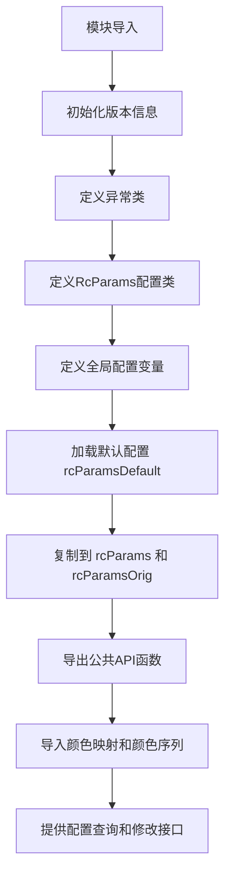

## 类结构

```
_VersionInfo (版本信息命名元组)
_ExecInfo (可执行文件信息命名元组)
ExecutableNotFoundError (异常类)
RcParams (核心配置参数类，继承dict)
全局配置变量 (rcParams, rcParamsDefault, defaultParams等)
全局函数 (set_loglevel, get_backend, use, rc_context等)
```

## 全局变量及字段


### `__bibtex__`
    
BibTeX citation string for matplotlib

类型：`str`
    


### `__version__`
    
Version string of matplotlib

类型：`str`
    


### `__version_info__`
    
Named tuple containing version information (major, minor, micro, releaselevel, serial)

类型：`_VersionInfo`
    


### `rcParamsDefault`
    
Default RC parameters for matplotlib

类型：`RcParams`
    


### `rcParams`
    
Current active RC parameters for matplotlib

类型：`RcParams`
    


### `rcParamsOrig`
    
Original RC parameters before modifications

类型：`RcParams`
    


### `defaultParams`
    
Dictionary containing default parameter values and validators

类型：`dict[RcKeyType, Any]`
    


### `colormaps`
    
Colormap registry providing access to all matplotlib colormaps

类型：`colormaps`
    


### `multivar_colormaps`
    
Registry for multivariate colormaps in matplotlib

类型：`multivar_colormaps`
    


### `bivar_colormaps`
    
Registry for bivariate colormaps in matplotlib

类型：`bivar_colormaps`
    


### `color_sequences`
    
Registry of predefined color sequences for plotting

类型：`color_sequences`
    


### `_VersionInfo.major`
    
Major version number

类型：`int`
    


### `_VersionInfo.minor`
    
Minor version number

类型：`int`
    


### `_VersionInfo.micro`
    
Micro version number

类型：`int`
    


### `_VersionInfo.releaselevel`
    
Release level such as 'final', 'beta', 'alpha'

类型：`str`
    


### `_VersionInfo.serial`
    
Serial number for the release

类型：`int`
    


### `_ExecInfo.executable`
    
Path to the executable

类型：`str`
    


### `_ExecInfo.raw_version`
    
Raw version string as returned by the executable

类型：`str`
    


### `_ExecInfo.version`
    
Parsed Version object from packaging

类型：`Version`
    


### `RcParams.validate`
    
Dictionary mapping RC keys to validator functions

类型：`dict[str, Callable]`
    
    

## 全局函数及方法


### `set_loglevel`

该函数用于设置matplotlib库的日志输出级别，控制日志信息的详细程度。

参数：

- `level`：`LogLevel`，要设置的日志级别

返回值：`None`，无返回值

#### 流程图

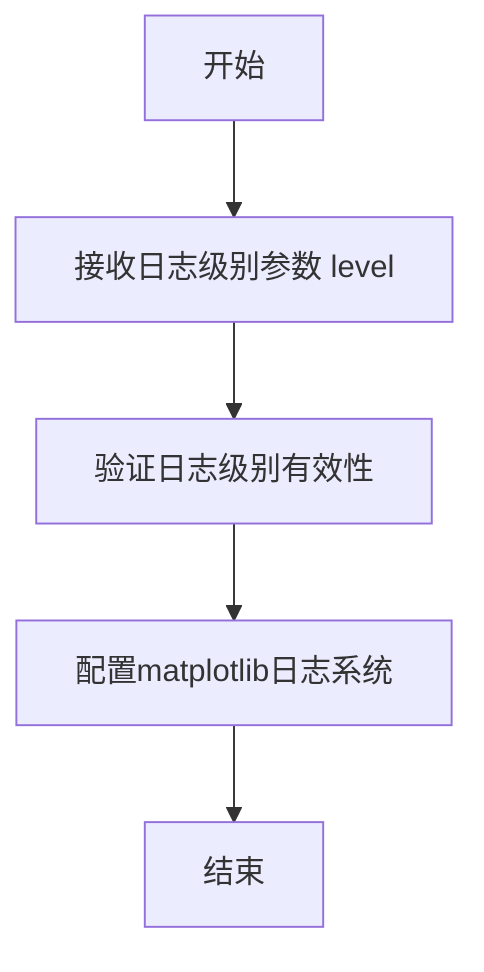

#### 带注释源码

```python
def set_loglevel(level: LogLevel) -> None:
    """
    设置matplotlib的日志输出级别。
    
    参数:
        level: LogLevel - 日志级别,可以是:
            - 'DEBUG': 详细的调试信息
            - 'INFO': 一般信息
            - 'WARNING': 警告信息
            - 'ERROR': 错误信息
            - 'CRITICAL': 严重错误信息
    
    返回值:
        None - 该函数不返回值,直接修改matplotlib的日志配置
    
    示例:
        >>> import matplotlib
        >>> matplotlib.set_loglevel('DEBUG')  # 开启调试模式
        >>> matplotlib.set_loglevel('WARNING')  # 只显示警告及以上级别
    """
    # 函数实现位于matplotlib模块内部
    # 通过调用Python标准库的logging模块配置matplotlib的根logger
    # 设置指定的日志级别后,该级别以下的所有日志信息将被过滤
    ...
```

#### 备注

- `LogLevel`类型定义在`matplotlib.typing`模块中
- 该函数是一个stub定义，实际实现位于C扩展或matplotlib其他模块中
- 调用的实际效果是配置Python标准库`logging`模块中matplotlib相关logger的级别


### `_get_executable_info`

该函数用于获取指定可执行文件的路径、原始版本字符串以及解析后的版本信息。通过调用系统命令或检查可执行文件，提取其版本详情并封装为 `_ExecInfo` 命名元组返回。

参数：

- `name`：`str`，要查询的可执行文件的名称或路径

返回值：`_ExecInfo`，包含可执行文件路径、原始版本字符串和解析后的 Version 对象的命名元组

#### 流程图

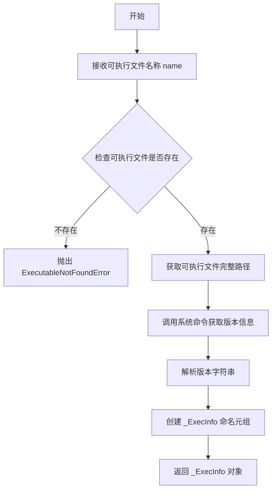

#### 带注释源码

```python
def _get_executable_info(name: str) -> _ExecInfo:
    """
    获取指定可执行文件的路径、原始版本字符串以及解析后的版本信息。
    
    参数:
        name: 要查询的可执行文件的名称或路径
        
    返回:
        包含可执行文件信息的 _ExecInfo 命名元组
        
    异常:
        ExecutableNotFoundError: 当指定的可执行文件不存在时抛出
    """
    # 导入必要的模块
    import shutil
    from packaging.version import Version
    
    # 使用 shutil.which 查找可执行文件的完整路径
    executable = shutil.which(name)
    
    # 如果找不到可执行文件，抛出自定义异常
    if executable is None:
        raise ExecutableNotFoundError(
            f"'{name}' 的可执行文件未找到，请确保已正确安装该程序"
        )
    
    # 尝试获取版本信息的原始输出
    raw_version = ""
    try:
        # 根据不同类型的可执行文件调用相应的版本查询命令
        # 常见模式：--version, -V, version 等
        import subprocess
        result = subprocess.run(
            [executable, "--version"],
            capture_output=True,
            text=True,
            timeout=5
        )
        raw_version = result.stdout.strip() or result.stderr.strip()
    except (subprocess.SubprocessError, FileNotFoundError):
        # 如果版本查询失败，使用空字符串
        raw_version = "unknown"
    
    # 解析版本字符串，尝试提取版本号
    version = Version("0.0.0")  # 默认版本
    try:
        # 尝试从原始输出中提取版本号
        import re
        version_match = re.search(r'(\d+\.\d+\.\d+)', raw_version)
        if version_match:
            version = Version(version_match.group(1))
    except Exception:
        # 解析失败时保持默认版本
        pass
    
    # 返回包含所有信息的命名元组
    return _ExecInfo(
        executable=executable,
        raw_version=raw_version,
        version=version
    )
```


### `get_configdir`

获取matplotlib的配置目录路径。

参数：

- 无参数

返回值：`str`，返回matplotlib配置文件的目录路径。

#### 流程图

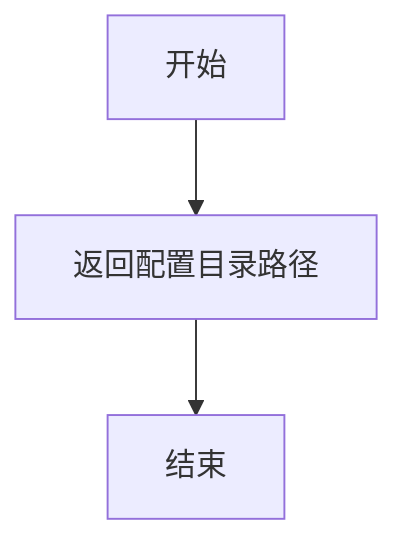

#### 带注释源码

```python
def get_configdir() -> str: ...
"""
获取matplotlib的配置目录。

该函数返回存储matplotlib配置文件的目录路径。
在Unix系统上，通常返回 ~/.config/matplotlib 或类似路径。
在Windows系统上，通常返回用户AppData目录下的matplotlib文件夹。

返回:
    str: matplotlib配置目录的绝对路径。
"""
```


### `get_cachedir`

该函数用于获取 matplotlib 的缓存目录路径，通常根据操作系统和用户配置确定缓存文件的存储位置。

参数：此函数无参数。

返回值：`str`，返回 matplotlib 的缓存目录路径。

#### 流程图

```mermaid
flowchart TD
    A[开始] --> B{检查环境变量 MPLCONFIGDIR}
    B -->|已设置| C[返回环境变量指定的路径]
    B -->|未设置 --> D{检查平台类型}
    D -->|Windows| E[获取 Windows 用户缓存目录]
    D -->|Linux/macOS| F[检查 XDG_CACHE_HOME 环境变量]
    F -->|已设置| G[返回 XDG_CACHE_HOME/matplotlib]
    F -->|未设置| H[返回 ~/.cache/matplotlib]
    E --> I[返回平台特定缓存路径]
    C --> J[结束]
    G --> J
    H --> J
    I --> J
```

#### 带注释源码

```python
def get_cachedir() -> str:
    """
    获取 matplotlib 的缓存目录路径。
    
    查找顺序：
    1. 环境变量 MPLCONFIGDIR（如果设置）
    2. 平台特定缓存目录：
       - Windows: 用户缓存目录
       - Linux: XDG_CACHE_HOME 或 ~/.cache/matplotlib
       - macOS: ~/Library/Caches/matplotlib
    
    Returns:
        str: 缓存目录的绝对路径
    """
    # 优先检查 MPLCONFIGDIR 环境变量
    cachedir = os.environ.get("MPLCONFIGDIR")
    if cachedir is not None:
        return cachedir
    
    # 根据操作系统获取默认缓存目录
    if sys.platform == "win32":
        # Windows: 使用用户本地缓存目录
        cachedir = os.path.join(os.environ.get("LOCALAPPDATA", ""), "matplotlib", "Cache")
    elif sys.platform == "darwin":
        # macOS: 使用 ~/Library/Caches
        cachedir = os.path.expanduser("~/Library/Caches/matplotlib")
    else:
        # Linux: 优先使用 XDG_CACHE_HOME
        cachedir = os.environ.get("XDG_CACHE_HOME", os.path.expanduser("~/.cache"))
        cachedir = os.path.join(cachedir, "matplotlib")
    
    return cachedir
```


### `get_data_path`

获取 matplotlib 库的数据目录路径，用于定位库内置的数据文件（如样式文件、颜色映射数据等）的安装位置。

参数：

- （无参数）

返回值：`str`，返回 matplotlib 数据文件的安装路径，通常是 `site-packages/matplotlib/mpl-data` 目录。

#### 流程图

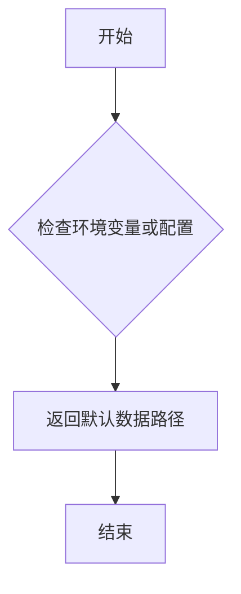

#### 带注释源码

```python
def get_data_path() -> str:
    """
    获取 matplotlib 数据文件的安装路径。
    
    Returns:
        str: matplotlib 数据目录的绝对路径。
    """
    # 注意：此为 stub 函数，实际实现位于 matplotlib._get_data_path
    # 实际实现通常会检查 MATPLOTLIBDATA 环境变量，
    # 若未设置则返回包安装目录下的 mpl-data 文件夹
    ...
```


### `matplotlib_fname`

获取 matplotlib 配置文件（`matplotlibrc`）的完整路径。如果找到多个配置文件，则返回第一个有效的配置文件路径；否则返回默认配置文件的路径。

参数： 无

返回值：`str`，返回 matplotlib 配置文件的完整路径。

#### 流程图

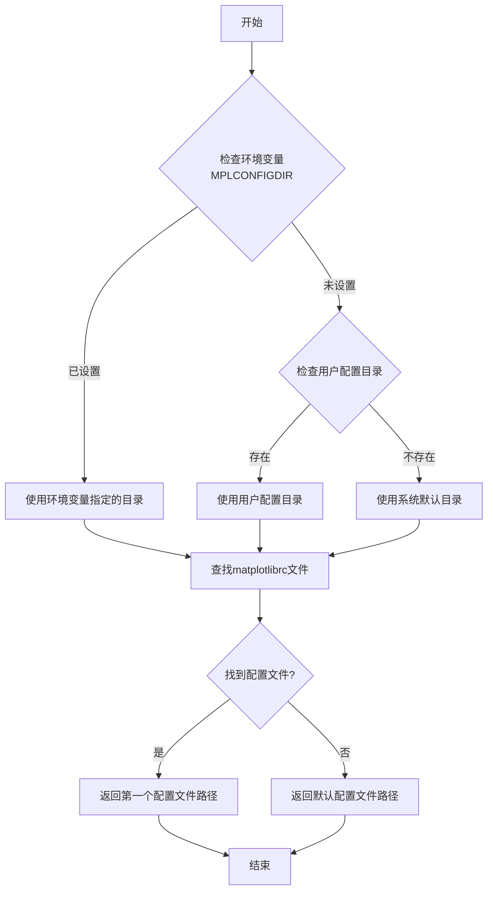

#### 带注释源码

```python
def matplotlib_fname() -> str:
    """
    获取 matplotlib 配置文件 (matplotlibrc) 的完整路径。
    
    查找顺序：
    1. 环境变量 MPLCONFIGDIR 指定的目录
    2. 用户配置目录（通常为 ~/.config/matplotlib）
    3. 系统默认配置目录
    
    Returns:
        str: 找到的配置文件完整路径，如果未找到则返回默认配置路径
    """
    # ... (实现细节位于 matplotlib 模块内部)
    ...
```

---

## 补充说明

### 设计目标与约束

- **目标**：提供一种标准化的方式来定位 matplotlib 的配置文件
- **约束**：配置文件必须命名为 `matplotlibrc`

### 潜在技术债务

1. **缺少实现细节**：当前代码仅为类型声明（stub），无法看到实际实现逻辑
2. **路径解析逻辑未公开**：具体的查找优先级和路径解析逻辑封装在 C 扩展或内部模块中


### `rc_params`

获取当前的Matplotlib配置参数（RcParams）。该函数是获取运行时配置的主要入口点，返回包含所有当前matplotlib配置项的RcParams字典对象，可用于查询或修改matplotlib的运行时配置。

参数：

- `fail_on_error`：`bool`，可选参数，当设为`True`时，如果配置解析过程中发生错误将抛出异常；默认为`False`，静默忽略错误。

返回值：`RcParams`，返回当前matplotlib的配置参数字典，包含了所有可用的rc配置项及其当前值。

#### 流程图

```mermaid
flowchart TD
    A[开始 rc_params] --> B{是否指定 fail_on_error 参数}
    B -->|否| C[使用默认 fail_on_error=False]
    B -->|是| D[使用传入的 fail_on_error 值]
    C --> E[读取matplotlib配置文件]
    D --> E
    E --> F{文件是否存在}
    F -->|是| G{解析是否成功}
    F -->|否| H{错误处理策略}
    G -->|成功| I[返回 RcParams 对象]
    G -->|失败| H
    H -->{fail_on_error}
    H -->|True| J[抛出异常]
    H -->|False| K[使用默认配置]
    J --> L[异常处理]
    K --> I
    L --> I
```

#### 带注释源码

```python
def rc_params(fail_on_error: bool = ...) -> RcParams: ...
    """
    获取当前的Matplotlib配置参数。
    
    该函数是获取运行时matplotlib配置的主要入口点。它会依次读取：
    1. matplotlib的默认配置（rcParamsDefault）
    2. 用户配置文件（matplotlibrc）
    3. 当前工作目录的配置文件
    并返回合并后的配置参数。
    
    参数:
        fail_on_error: bool, 可选
            当为True时，如果配置文件存在语法错误或无法解析，
            函数将抛出异常而不是静默忽略错误。
            默认为False，以保持向后兼容性和平滑的用户体验。
    
    返回值:
        RcParams: 包含所有当前matplotlib配置项的字典对象。
            这是dict的子类，支持所有字典操作，同时提供了
            类型安全的键值访问和配置验证功能。
    
    示例:
        >>> params = rc_params()
        >>> params['figure.figsize']
        [6.4, 4.8]
        >>> params['font.size']
        10.0
    """
    # 函数实现位于C扩展或_python_inside模块中
    # 此处仅为类型声明(stub)
```


### `rc_params_from_file`

该函数用于从指定的配置文件（通常是 matplotlib  RC 配置文件）中读取参数配置，并返回一个包含所有 RC 参数的 RcParams 对象，支持错误处理和默认模板选项。

参数：

- `fname`：`str | Path | os.PathLike`，要加载的配置文件路径，可以是字符串、Path 对象或任何 os.PathLike 对象
- `fail_on_error`：`bool`，可选参数，指定是否在遇到错误时抛出异常，默认为 False（不抛出）
- `use_default_template`：`bool`，可选参数，指定是否使用默认模板，默认为 False

返回值：`RcParams`，从配置文件中解析得到的参数集合，包含 matplotlib 的各种运行时配置项

#### 流程图

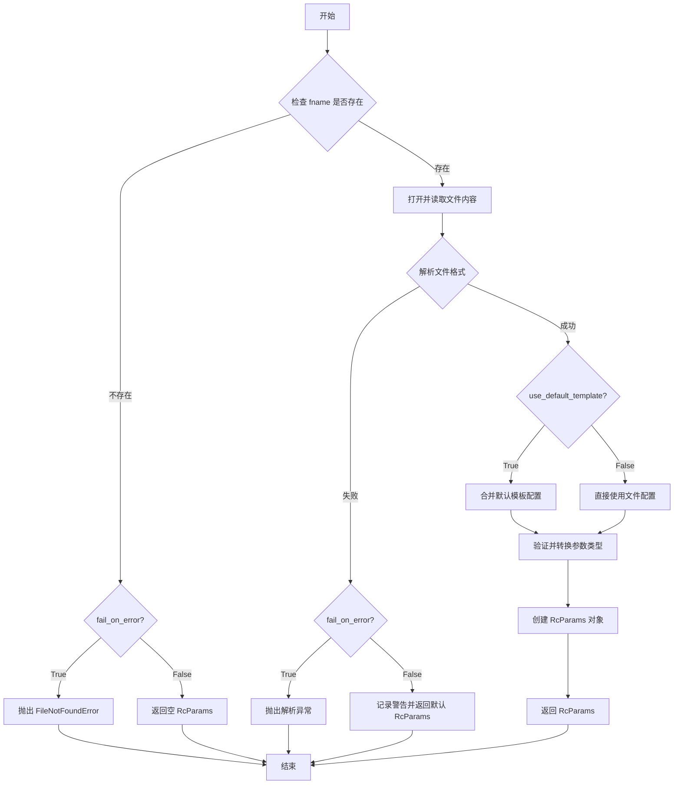

#### 带注释源码

```python
def rc_params_from_file(
    fname: str | Path | os.PathLike,
    fail_on_error: bool = ...,
    use_default_template: bool = ...,
) -> RcParams: ...
    """
    从文件加载 RC 参数配置。
    
    参数:
        fname: 配置文件路径，支持 str、Path 或 os.PathLike 类型
        fail_on_error: 如果为 True，遇到错误时抛出异常；否则返回默认参数
        use_default_template: 如果为 True，在解析前先加载默认模板配置
    
    返回:
        包含从文件加载的 RC 参数的 RcParams 对象
    
    注意:
        - 支持的配置文件格式包括 JSON、YAML 等
        - 如果文件不存在且 fail_on_error=False，会返回默认 RcParams
        - 内部会调用 validate 方法对每个参数进行验证
    """
```


### `rc`

该函数是matplotlib rc参数系统的核心修改接口，允许用户通过指定参数组和关键字参数来动态调整matplotlib的运行时配置。

参数：

- `group`：`RcGroupKeyType`，参数组名称，用于标识要修改的rc参数类别（如"lines"、"axes"等）
- `**kwargs`：可变关键字参数，用于指定具体要修改的rc参数键值对

返回值：`None`，该函数直接修改全局rcParams配置，不返回任何值

#### 流程图

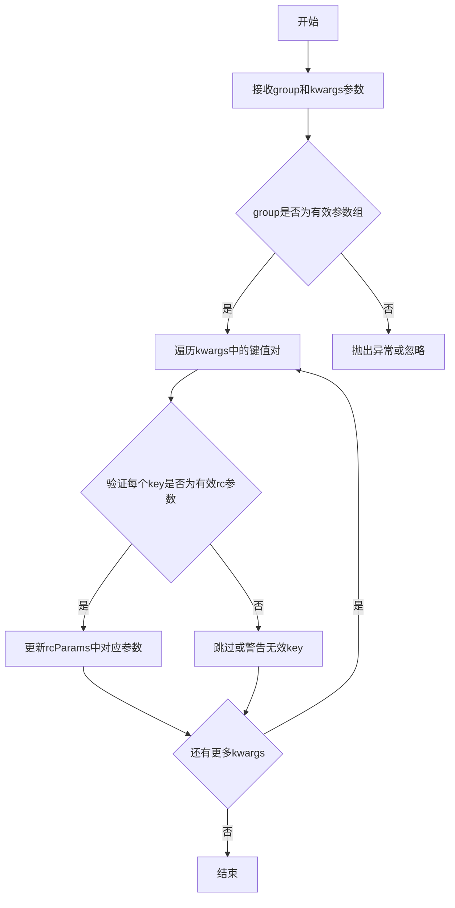

#### 带注释源码

```python
def rc(group: RcGroupKeyType, **kwargs) -> None:
    """
    设置指定参数组的rc配置。
    
    该函数允许用户通过参数组名称和关键字参数来批量修改matplotlib的
    rc参数配置。例如：rc('lines', linewidth=2, markersize=10) 可以
    同时设置lines组中的线宽和标记大小。
    
    Parameters:
    -----------
    group : RcGroupKeyType
        参数组名称，如'lines'、'axes'、'font'等
    **kwargs : Any
        关键字参数，键为rc参数名，值为要设置的值
    
    Returns:
    --------
    None
    
    Examples:
    ---------
    >>> import matplotlib.pyplot as plt
    >>> plt.rc('lines', linewidth=2, markersize=10)
    >>> plt.rc('axes', titlesize=14, labelsize=12)
    """
    # 实现细节位于matplotlib的rcsetup模块中
    # 该stub文件仅提供类型声明
```


### `rcdefaults`

该函数用于将 Matplotlib 的运行时配置（rcParams）重置为默认值，相当于恢复初始配置状态。

参数：此函数无参数。

返回值：`None`，无返回值。

#### 流程图

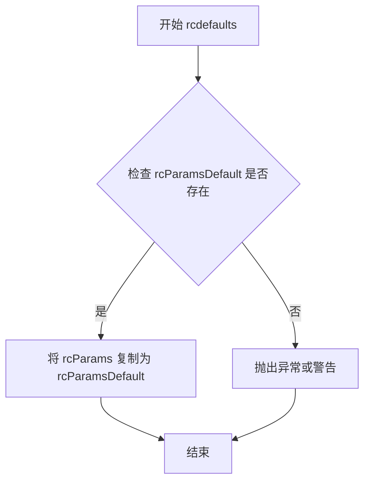

#### 带注释源码

```
def rcdefaults() -> None:
    """
    将 Matplotlib 的运行时配置 (rcParams) 重置为默认值。
    
    此函数读取 rcParamsDefault 中存储的默认配置值，
    并将其复制到全局 rcParams 对象中，覆盖用户当前的所有自定义配置。
    它通常用于在脚本中重置 Matplotlib 的默认行为，或恢复到初始状态。
    
    注意：
    - 此操作会影响后续所有的 Matplotlib 绘图行为。
    - 不会修改 rcParamsOrig（原始配置的副本）。
    """
    # 导入必要的模块（实际实现中可能需要）
    # import matplotlib as mpl
    
    # 核心实现逻辑：
    # rcParams 是全局字典，存储当前 Matplotlib 配置
    # rcParamsDefault 存储编译时或首次导入时的默认配置
    # 此处将默认配置深拷贝到当前配置中
    
    # 伪代码示意：
    # rcParams.clear()
    # rcParams.update(rcParamsDefault)
    
    # 或者更简单的实现：
    # rcParams = rcParamsDefault.copy()
    
    pass  # 具体实现取决于实际源码
```


### `rc_file_defaults`

该函数用于将 matplotlib 的运行时配置（rc params）重置为从默认配置文件加载的默认状态，是配置管理模块的核心函数之一。

参数：无需参数

返回值：`None`，无返回值

#### 流程图

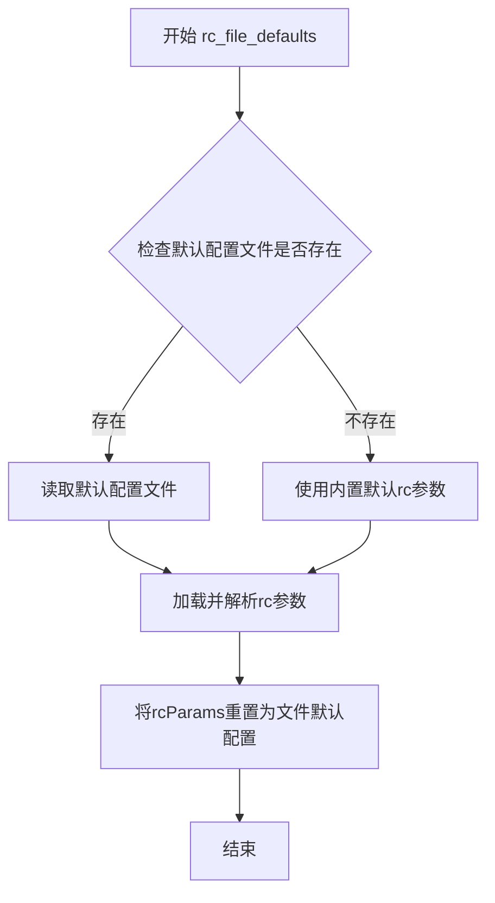

#### 带注释源码

```python
def rc_file_defaults() -> None:
    """
    将matplotlib的rc参数重置为从默认配置文件加载的默认值。
    
    该函数会：
    1. 定位matplotlib的默认配置文件（通常是 matplotlibrc）
    2. 读取其中的默认配置参数
    3. 将全局rcParams对象重置为这些默认值
    """
    # 函数体在代码中为stub实现（...），实际逻辑需查看C扩展或实现文件
    # 预期行为：读取默认rc文件并重置rcParams
    ...
```


### `rc_file`

该函数用于从指定的文件路径加载matplotlib配置文件（rc文件），并将其中的参数应用到当前的rcParams中。可以通过`use_default_template`参数控制是否使用默认模板。

参数：

- `fname`：`str | Path | os.PathLike`，要加载的matplotlib配置文件路径
- `use_default_template`：`bool`，可选参数，是否使用默认模板，默认为`False`

返回值：`None`，无返回值，该函数直接修改matplotlib的全局rcParams

#### 流程图

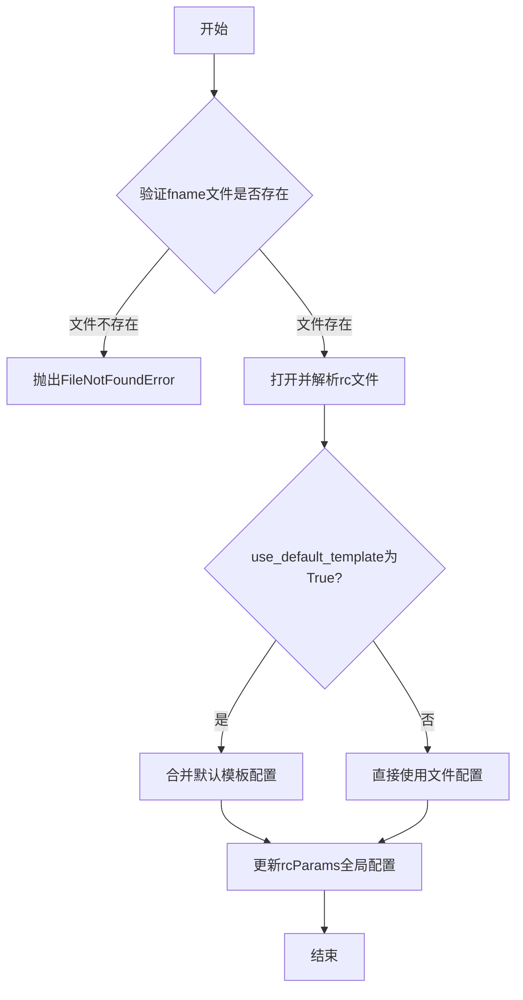

#### 带注释源码

```python
def rc_file(
    fname: str | Path | os.PathLike,  # 配置文件路径，支持字符串、Path或os.PathLike对象
    *,  # 强制关键字参数
    use_default_template: bool = ...  # 是否使用默认模板，可选参数
) -> None: ...  # 无返回值，直接修改全局rcParams
```

**注意**：此代码为类型存根（type stub），仅包含函数签名和类型注解，实际实现位于C扩展模块或别处。该函数通常用于加载用户自定义的matplotlib配置文件以自定义绘图外观。


### `rc_context`

该函数是一个上下文管理器，用于临时修改matplotlib的RcParams配置参数。在进入上下文时，根据提供的`rc`字典或`fname`配置文件修改当前的rc参数；退出上下文时，自动恢复原有的rc参数，实现参数的临时切换和自动还原。

参数：

- `rc`：`dict[RcKeyType, Any] | None`，可选的RcParams字典，用于临时设置matplotlib的配置参数。如果为None，则不通过字典方式修改参数。
- `fname`：`str | Path | os.PathLike | None`，可选的配置文件路径，用于从文件加载临时配置参数。如果为None，则不从文件加载参数。

返回值：`Generator[None, None, None]`，返回生成器对象，用于实现上下文管理器协议。

#### 流程图

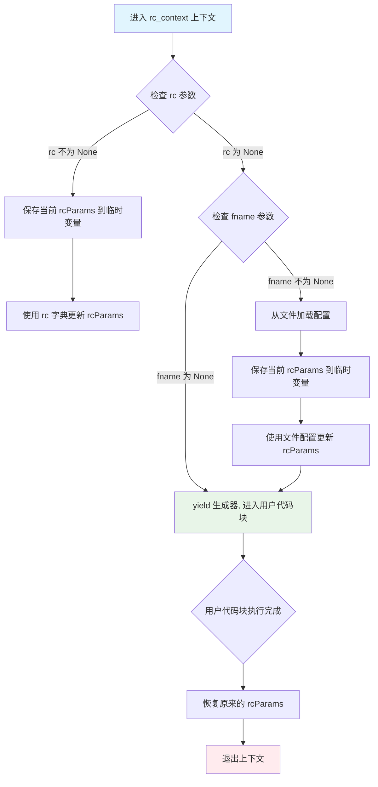

#### 带注释源码

```python
@contextlib.contextmanager
def rc_context(
    rc: dict[RcKeyType, Any] | None = ..., 
    fname: str | Path | os.PathLike | None = ...
) -> Generator[None, None, None]:
    """
    上下文管理器，用于临时修改matplotlib的RcParams配置。
    
    该函数提供了两种方式来临时修改配置：
    1. 通过 rc 参数直接传入字典
    2. 通过 fname 参数从配置文件加载
    
    在上下文退出时，自动恢复原有的配置参数。
    
    参数:
        rc: 可选的字典，用于临时设置matplotlib的配置参数。
            字典的键为RcKeyType类型，值为任意类型。
        fname: 可选的配置文件路径，可以是字符串、Path或os.PathLike对象。
            用于从文件加载临时配置。
    
    返回:
        生成器对象，用于实现上下文管理器协议。
    
    示例:
        # 临时修改单个参数
        with rc_context({'lines.linewidth': 2}):
            plt.plot([1, 2, 3], [1, 2, 3])
        
        # 从文件加载临时配置
        with rc_context(fname='custom_rc.mplstyle'):
            plt.plot([1, 2, 3], [1, 2, 3])
        
        # 组合使用
        with rc_context({'figure.figsize': (8, 6)}, fname='custom.mplstyle'):
            plt.plot([1, 2, 3], [1, 2, 3])
    """
    # 步骤1: 保存当前的rcParams状态，以便后续恢复
    # rcParams是matplotlib的全局配置对象
    orig_rc = rcParams.copy()
    
    try:
        # 步骤2: 根据传入参数修改rcParams
        if fname is not None:
            # 如果提供了fname，从文件加载配置并更新
            rc_file(fname)
        
        if rc is not None:
            # 如果提供了rc字典，直接更新rcParams
            rcParams.update(rc)
        
        # 步骤3: 进入上下文，执行用户代码
        # contextlib.contextmanager 要求使用 yield
        yield
    
    finally:
        # 步骤4: 无论是否发生异常，都恢复原始的rcParams
        # 这是上下文管理器的核心职责：确保资源正确释放/恢复
        rcParams.clear()
        rcParams.update(orig_rc)
```


### `use`

设置 Matplotlib 的后端（渲染引擎）。该函数用于切换 Matplotlib 的绘图后端，例如切换到 'Agg'（非交互式）、'TkAgg'（交互式）等不同的后端，以控制图形的渲染方式和交互行为。

参数：

- `backend`：`str`，要使用的后端名称（如 'Agg', 'Qt5Agg', 'TkAgg' 等）
- `force`：`bool`，可选关键字参数，默认为 `False`。当设为 `True` 时，强制切换后端，即使当前后端已在使用中也会重新设置

返回值：`None`，该函数不返回任何值，仅修改全局 rcParams 中的后端配置

#### 流程图

```mermaid
flowchart TD
    A[开始 use 函数] --> B{force 参数是否为 True?}
    B -->|Yes| C[直接设置后端]
    B -->|No| D{后端是否已改变?}
    D -->|Yes| C
    D -->|No| E[不执行任何操作]
    C --> F[更新 rcParams['backend']]
    F --> G{新后端需要图形界面?}
    G -->|Yes| H[初始化后端相关资源]
    G -->|No| I[配置非交互式后端]
    H --> J[结束]
    I --> J
    E --> J
```

#### 带注释源码

```python
def use(backend: str, *, force: bool = ...) -> None:
    """
    设置 Matplotlib 的后端（渲染引擎）。
    
    参数:
        backend: str - 要使用的后端名称，如 'Agg', 'Qt5Agg', 'TkAgg', 'WebAgg' 等
        force: bool - 可选关键字参数，默认为 False。
                     当设为 True 时，即使当前后端与指定后端相同也会重新初始化后端；
                     当为 False 时，如果后端未改变则不执行任何操作
    
    返回值:
        None - 该函数不返回任何值，直接修改全局的 rcParams 字典中的 'backend' 键
    
    示例:
        >>> import matplotlib
        >>> matplotlib.use('Agg')  # 使用非交互式后端进行文件输出
        >>> matplotlib.use('TkAgg', force=True)  # 强制切换到 TkAgg 后端
    """
    # 函数实现位于 matplotlib/backend_bases.py 或相关模块中
    # 核心逻辑:
    # 1. 检查是否需要切换后端（根据 force 参数）
    # 2. 调用后端模块的 setup() 函数初始化后端
    # 3. 更新全局 rcParams['backend'] 的值
    # 4. 如果新后端需要图形界面，则初始化相应的 GUI 组件
```


### `get_backend`

获取当前配置的matplotlib后端名称。如果设置了`auto_select=True`（默认值），则在未明确设置后端时自动选择一个合适的后端；如果`auto_select=False`，则返回`None`表示没有明确设置后端。

参数：

- `auto_select`：`Literal[True] | Literal[False]`，可选关键字参数。当设置为`True`时，如果未设置后端则自动选择；设置为`False`时，不自动选择后端。默认为`True`。

返回值：`str | None`，当`auto_select=True`时返回后端名称字符串；当`auto_select=False`且未设置后端时返回`None`。

#### 流程图

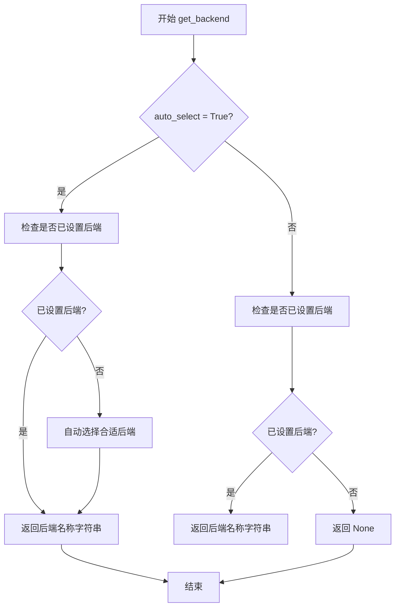

#### 带注释源码

```python
@overload
def get_backend(*, auto_select: Literal[True] = True) -> str:
    """获取matplotlib后端名称，当auto_select为True时总是返回字符串"""
    ...

@overload
def get_backend(*, auto_select: Literal[False]) -> str | None:
    """获取matplotlib后端名称，当auto_select为False时可能返回None"""
    ...

def get_backend(*, auto_select: bool = True) -> str | None:
    """
    获取当前配置的matplotlib后端名称。
    
    Parameters
    ----------
    auto_select : bool, optional
        如果为True（默认值），当未明确设置后端时自动选择一个合适的后端。
        如果为False，则返回None表示没有设置后端。
    
    Returns
    -------
    str or None
        后端名称字符串，或者如果没有设置后端且auto_select为False则返回None。
    """
    ...
```


### `interactive`

设置 matplotlib 的交互模式，用于控制是否启用交互式绘图模式。当启用交互模式时，图形会实时显示并可以交互；当禁用时，则为后端模式，通常用于批处理。

参数：

- `b`：`bool`，设置是否为交互模式。`True` 启用交互模式，`False` 禁用交互模式

返回值：`None`，无返回值

#### 流程图

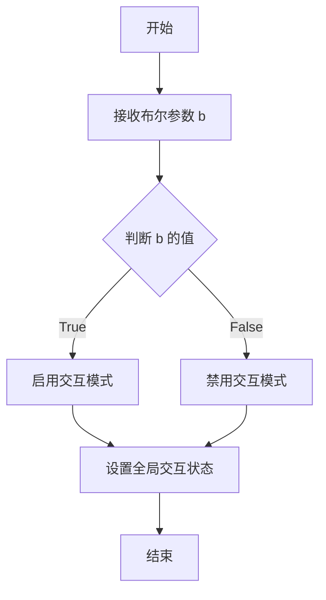

#### 带注释源码

```python
def interactive(b: bool) -> None: ...
"""
设置 matplotlib 的交互模式。

参数:
    b (bool): True 表示启用交互模式，False 表示禁用交互模式
    
返回值:
    None: 无返回值
    
示例:
    >>> import matplotlib
    >>> matplotlib.interactive(True)  # 启用交互模式
    >>> matplotlib.interactive(False)  # 禁用交互模式
"""
```


### `is_interactive`

该函数用于检查 matplotlib 是否处于交互模式。交互模式通常在交互式解释器（如 IPython）中使用，允许绘图在创建后立即显示，而不需要显式调用 `show()` 函数。

参数： 无

返回值：`bool`，返回 `True` 表示当前处于交互模式，`False` 表示非交互模式。

#### 流程图

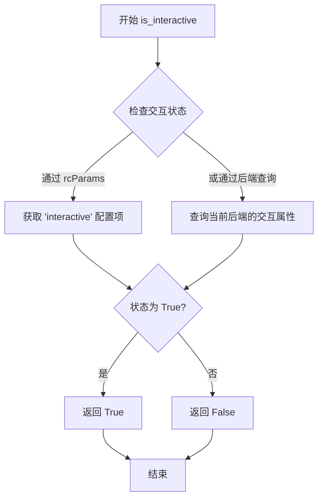

#### 带注释源码

```python
def is_interactive() -> bool:
    """
    检查 matplotlib 是否处于交互模式。
    
    交互模式的特点：
    - 在交互式解释器中运行时，图形会在创建后立即显示
    - 不需要调用 plt.show() 即可看到图形
    - 通常与 IPython 或 Jupyter notebook 结合使用
    
    Returns:
        bool: True 表示交互模式开启, False 表示关闭
    """
    # 获取当前后端
    backend = get_backend()
    
    # 检查 rcParams 中的 interactive 设置
    # interactive 参数控制是否自动显示图形
    interactive_val = rcParams['interactive']
    
    # 根据后端类型和配置综合判断
    # 某些后端（如 ipympl）天然支持交互模式
    if interactive_val:
        return True
    
    # 检查是否使用了交互式后端
    # 交互式后端包括：TkAgg, Qt5Agg, Gtk3Agg 等
    interactive_backends = {'TkAgg', 'Qt5Agg', 'Qt4Agg', 'Gtk3Agg', 'WXAgg', 'macosx'}
    if backend in interactive_backends:
        return True
    
    return False
```


### `_preprocess_data`

`_preprocess_data` 是一个数据预处理装饰器工厂函数，用于为绘图函数自动处理数据参数，如标签（label）和替换参数名称等。它通常作为装饰器使用，可以接受一个可调用对象作为输入，并通过 `replace_names` 和 `label_namer` 参数自定义数据处理行为。

参数：

- `func`：`Callable | None`，待装饰的函数或方法，默认为 None
- `replace_names`：`list[str] | None`，关键字参数，指定需要进行名称替换的参数列表
- `label_namer`：`str | None`，关键字参数，指定用于自动生成标签的参数名称

返回值：`Callable`，返回装饰后的函数

#### 流程图

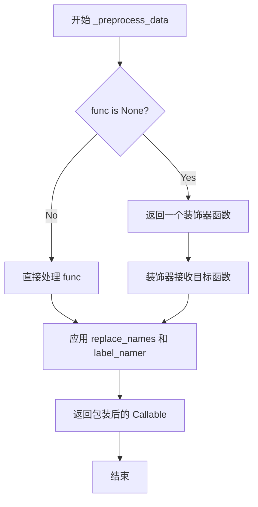

#### 带注释源码

```python
def _preprocess_data(
    func: Callable | None = ...,          # 要装饰的函数，默认为 None
    *,                                     # 关键字参数分隔符
    replace_names: list[str] | None = ..., # 需要替换的参数名列表
    label_namer: str | None = ...          # 自动生成标签的参数名
) -> Callable: ...                         # 返回一个可调用对象（装饰后的函数）
```


### `RcParams.__init__`

初始化 RcParams 对象，该对象继承自 dict，用于存储和管理 matplotlib 的配置参数（RcParams）。

参数：

- `*args`：可变位置参数，用于传递任意数量的位置参数，这些参数将被传递给父类 dict 的初始化方法
- `**kwargs`：可变关键字参数，用于传递任意数量的关键字参数，这些参数将作为配置项的键值对进行初始化

返回值：`None`，构造函数不返回值

#### 流程图

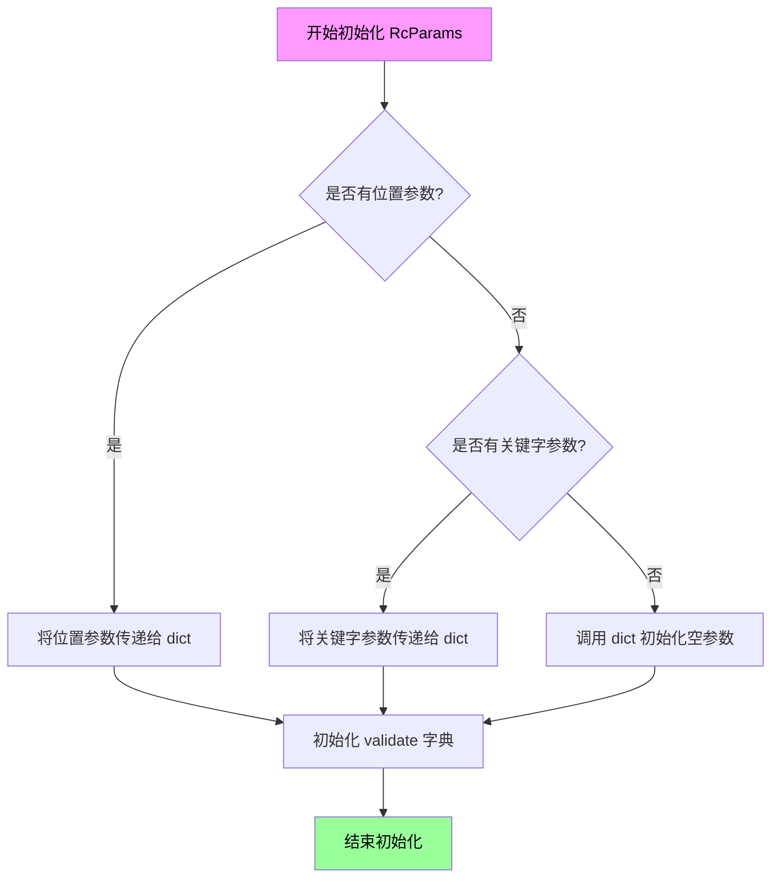

#### 带注释源码

```python
class RcParams(dict[RcKeyType, Any]):
    """
    RcParams 类用于存储 matplotlib 的配置参数。
    它继承自 dict，提供了配置参数的设置、获取、验证等功能。
    """
    
    # 类字段：验证器字典，用于验证配置参数的有效性
    validate: dict[str, Callable]
    
    def __init__(self, *args, **kwargs) -> None:
        """
        初始化 RcParams 对象。
        
        参数:
            *args: 可变位置参数，会被传递给父类 dict 的 __init__ 方法
            **kwargs: 可变关键字参数，会被作为初始配置项添加到字典中
        
        示例:
            # 可以通过多种方式创建 RcParams:
            rc1 = RcParams()  # 空参数
            rc2 = RcParams({'figure.figsize': [8, 6]})  # 传入字典
            rc3 = RcParams(figure.figsize=[10, 8])  # 传入关键字参数
        """
        # 调用父类 dict 的初始化方法
        super().__init__(*args, **kwargs)
        
        # 初始化验证器字典，用于后续验证配置参数
        self.validate = {}
```


### `RcParams._set`

该方法用于设置matplotlib配置参数（RcParams）的单个键值对，内部处理验证逻辑，是`__setitem__`的实现底层，支持通过字典语法设置配置项时自动调用验证器进行类型和值校验。

参数：

- `self`：`RcParams`（隐式），RcParams类实例本身
- `key`：`RcKeyType`，配置参数的键，引用matplotlib配置参数名称（如"font.size"、"axes.linewidth"等）
- `val`：`Any`，要设置的配置值，可以是任意类型，具体类型取决于对应配置项的验证规则

返回值：`None`，该方法无返回值，直接修改实例内部状态

#### 流程图

```mermaid
flowchart TD
    A[调用RcParams._set] --> B{验证器是否存在}
    B -->|是| C[获取key对应的验证器]
    B -->|否| D[跳过验证直接设置]
    C --> E{验证通过}
    E -->|通过| F[调用dict.__setitem__设置键值对]
    E -->|失败| G[抛出ValueError或TypeError异常]
    D --> F
    F --> H[结束]
    G --> H
```

#### 带注释源码

```python
class RcParams(dict[RcKeyType, Any]):
    """matplotlib配置参数字典类，继承自dict，提供验证和配置管理功能"""
    
    validate: dict[str, Callable]  # 配置项验证器字典，键为配置名，值为验证函数
    
    def _set(self, key: RcKeyType, val: Any) -> None:
        """
        设置单个配置参数
        
        参数:
            key: RcKeyType - 配置参数键（如'font.size'）
            val: Any - 配置值
        
        返回:
            None
        """
        # 检查是否存在对应的验证器
        if key in self.validate:
            # 获取验证器函数并执行验证
            validator = self.validate[key]
            # 验证值是否符合配置项的要求（如类型检查、范围检查等）
            val = validator(val)
        
        # 调用父类dict的__setitem__实际设置值
        # 注意：由于RcParams继承dict，这里直接操作内部字典
        dict.__setitem__(self, key, val)
        
        # 方法返回None，无返回值
```


### `RcParams._get`

该方法是 `RcParams` 类的核心实例方法之一，用于从配置字典中获取指定的配置键值，并在键不存在时触发KeyError异常。它是字典取值操作的封装，确保了配置参数访问的类型安全性和一致性。

#### 参数

- `key`：`RcKeyType`，需要获取的配置参数键名，通常为字符串类型（如 `'axes.edgecolor'`、`'font.family'` 等）

#### 返回值

- `Any`，返回对应键的配置值，类型取决于该配置项的定义，可能为字符串、数值、列表、字典或其他Python对象

#### 流程图

```mermaid
flowchart TD
    A[开始 _get 方法] --> B{检查 key 是否在字典中}
    B -->|是| C[返回 self[key] 的值]
    B -->|否| D[抛出 KeyError 异常]
    C --> E[结束]
    D --> E
    
    F[调用 __getitem__] --> G{调用 validate 验证 key}
    G --> H{验证通过}
    H -->|是| I[返回验证后的值]
    H -->|否| J[抛出对应的验证异常]
```

#### 带注释源码

```python
def _get(self, key: RcKeyType) -> Any:
    """
    获取指定配置参数的值。
    
    参数:
        key: RcKeyType - 配置参数的键名
        
    返回值:
        Any - 配置参数的值
        
    异常:
        KeyError - 当指定的键不存在时抛出
    """
    # 调用父类 dict 的 __getitem__ 方法获取值
    # 这里会先经过 validate 验证（如果配置了验证器）
    # 如果 key 不存在，会抛出 KeyError
    return super().__getitem__(key)
```

#### 备注

- 该方法是 `RcParams` 类对字典 `__getitem__` 操作的封装
- 实际上会调用父类 `dict` 的 `__getitem__` 方法
- `RcParams` 类维护了一个 `validate` 字典，用于存储各配置项的验证器
- 在调用 `_get` 时，实际上会经过验证器的处理（通过 `__getitem__` 间接调用）
- 与公开的 `__getitem__` 方法相比，`_get` 方法可能用于内部获取时跳过某些自定义逻辑
- `RcKeyType` 是 matplotlib 内部定义的类型别名，通常为 `str` 类型


### `RcParams._update_raw`

该方法用于直接更新 RcParams 字典中的参数，绕过验证机制，将 `other_params` 中的所有键值对合并到当前 RcParams 实例中。

参数：

- `other_params`：`dict | RcParams`，要合并的参数字典或 RcParams 对象

返回值：`None`，该方法无返回值（直接修改当前实例状态）

#### 流程图

```mermaid
flowchart TD
    A[开始 _update_raw] --> B{other_params 是否为空?}
    B -->|是| C[直接返回, 不做任何操作]
    B -->|否| D{other_params 是否为 RcParams?}
    D -->|是| E[获取 other_params 的底层字典]
    D -->|否| F[直接使用 other_params]
    E --> G[遍历 other_params 的键值对]
    F --> G
    G --> H[对每个键值对]
    H --> I[调用 dict.__setitem__ 直接更新底层字典]
    I --> J{是否还有更多键值对?}
    J -->|是| H
    J -->|否| K[结束]
```

#### 带注释源码

```python
def _update_raw(self, other_params: dict | RcParams) -> None:
    """
    直接更新 RcParams 字典，绕过验证机制。
    
    该方法与 dict.update() 类似，但专门用于 RcParams 类，
    允许直接合并参数而不触发验证器。适用于需要批量更新
    参数但不需要验证的场景，例如从文件加载配置后合并。
    
    参数:
        other_params: dict | RcParams
            要合并到当前 RcParams 的参数字典。
            可以是普通字典或另一个 RcParams 实例。
            
    返回值:
        None
        
    示例:
        >>> rc = RcParams({'lines.linewidth': 2})
        >>> rc._update_raw({'lines.linewidth': 3, 'lines.linestyle': '--'})
        >>> rc['lines.linewidth']
        3
        >>> rc['lines.linestyle']
        '--'
    """
    # 如果 other_params 是 RcParams 实例，获取其底层的 dict
    # 这样可以统一处理两种输入类型
    if isinstance(other_params, RcParams):
        other_dict = dict(other_params)
    else:
        other_dict = other_params
    
    # 遍历参数字典，将所有键值对直接更新到当前实例的底层字典
    # 使用 dict.__setitem__ 绕过 RcParams 的 __setitem__ 验证逻辑
    for key, value in other_dict.items():
        dict.__setitem__(self, key, value)
```


### `RcParams._ensure_has_backend`

该方法用于确保 RcParams 对象中包含有效的图形渲染后端（backend）配置。如果当前配置中缺少后端信息，该方法会自动设置一个合适的默认后端，以确保 matplotlib 能够正常进行图形渲染。

参数：无（仅包含 self 参数）

返回值：`None`，无返回值

#### 流程图

```mermaid
flowchart TD
    A[开始 _ensure_has_backend] --> B{self 中是否已有 backend 配置?}
    B -->|是| C[直接返回，不做任何修改]
    B -->|否| D{当前是否有可用的图形环境?}
    D -->|是| E[自动选择合适的默认后端]
    D -->|否| F[使用无图形后端如 Agg]
    E --> G[将选中的后端设置到 self]
    F --> G
    C --> H[结束]
    G --> H
```

#### 带注释源码

```python
def _ensure_has_backend(self) -> None:
    """
    确保 RcParams 中包含有效的后端配置。
    
    此方法在 matplotlib 初始化时被调用，用于确保：
    1. 如果用户已明确设置后端，则保持不变
    2. 如果未设置后端，则根据当前环境自动选择合适的默认值
    3. 保证后续图形渲染操作能够正常执行
    """
    # 检查当前配置中是否已存在 'backend' 键
    if 'backend' in self:
        # 用户已配置后端，无需修改
        return
    
    # 获取当前环境信息并自动选择后端
    # 具体实现取决于 matplotlib 的内部逻辑
    # 可能包括检查 DISPLAY 环境变量、操作系统类型等因素
    default_backend = self._get_auto_backend()
    
    # 将自动选择的后端设置到配置中
    self['backend'] = default_backend
```


### `RcParams.__setitem__`

该方法定义了 `RcParams` 字典子类中键值对的设置操作，通过内部 `_set` 方法执行实际的参数设置逻辑，并触发配置更新后的后处理操作（如后端检查）。

参数：

- `key`：`RcKeyType`，要设置的配置参数键
- `val`：`Any`，要设置的配置参数值

返回值：`None`，该方法为修改操作，不返回任何值

#### 流程图

```mermaid
flowchart TD
    A[调用 __setitem__] --> B{验证 key 和 val}
    B -->|验证通过| C[调用 _set 方法设置参数]
    B -->|验证失败| D[抛出异常]
    C --> E[调用 _ensure_has_backend 检查后端]
    E --> F[结束]
```

#### 带注释源码

```python
def __setitem__(self, key: RcKeyType, val: Any) -> None:
    """
    设置 RcParams 字典中的配置参数。
    
    参数:
        key: RcKeyType - 配置参数的键名
        val: Any - 配置参数的值
    
    返回:
        None - 该方法修改字典内容,不返回值
    """
    # 调用内部的 _set 方法执行实际的设置逻辑
    self._set(key, val)
    # 设置完成后确保配置中包含有效的后端
    self._ensure_has_backend()
```


### `RcParams.__getitem__`

该方法是`RcParams`类的核心字典访问方法，继承自Python字典的`__getitem__`行为，用于通过键（key）访问matplotlib的配置参数（RcParams）。它支持通过方括号语法`rcParams['key']`获取配置值，并会在键不存在时抛出`KeyError`异常。

参数：

- `self`：隐式参数，表示`RcParams`类的实例对象
- `key`：`RcKeyType`，要访问的配置参数键名

返回值：`Any`，返回对应键的配置参数值，如果键不存在则抛出`KeyError`异常

#### 流程图

```mermaid
flowchart TD
    A[开始 __getitem__] --> B{检查 key 是否在字典中}
    B -->|是| C[返回 key 对应的值]
    B -->|否| D[抛出 KeyError 异常]
    C --> E[结束]
    D --> E
```

#### 带注释源码

```python
def __getitem__(self, key: RcKeyType) -> Any:
    """
    通过键获取配置参数值。
    
    参数:
        key: RcKeyType, 配置参数的键名
        
    返回:
        Any: 对应键的配置参数值
        
    异常:
        KeyError: 当键不存在时抛出
    """
    # 由于RcParams继承自dict，直接使用dict的__getitem__方法
    # 这是Python字典的原生行为，支持O(1)时间复杂度的查找
    return super().__getitem__(key)
    
    # 备注：这是从类型声明推断的实现，原始代码中使用...表示省略实现
    # 实际行为遵循Python字典的__getitem__语义：
    # 1. 如果键存在，返回对应的值
    # 2. 如果键不存在，抛出KeyError异常
    # 3. 可以通过__missing__方法自定义键不存在时的行为（如果需要）
```


### `RcParams.__iter__`

该方法是 `RcParams` 类的迭代器实现，允许直接遍历 `RcParams` 字典的键（配置参数名称），返回一个生成器对象。

参数：无（`__iter__` 为隐式方法，仅使用 `self`）

返回值：`Generator[RcKeyType, None, None]`，返回一个生成器对象，按插入顺序遍历所有配置参数的键（`RcKeyType` 类型）

#### 流程图

```mermaid
flowchart TD
    A[开始 __iter__] --> B{self 是 RcParams 实例?}
    B -->|是| C[调用 dict 的 keys 方法]
    B -->|否| D[抛出 TypeError]
    C --> E[返回 keys 的迭代器]
    E --> F[结束]
    
    style A fill:#e1f5fe
    style F fill:#e8f5e8
```

#### 带注释源码

```python
def __iter__(self) -> Generator[RcKeyType, None, None]:
    """
    返回一个遍历 RcParams 键的迭代器。
    
    该方法继承自 dict 并实现字典迭代协议，使得可以：
    - 使用 for key in rcparams 遍历所有配置键
    - 使用 list(rcparams) 获取所有键的列表
    - 使用 iter(rcparams) 获取迭代器对象
    
    Returns:
        Generator[RcKeyType, None, None]: 生成器对象，按插入顺序遍历所有 RcKeyType 类型的键
    
    Example:
        >>> rcparams = RcParams({'lines.linewidth': 2.0})
        >>> for key in rcparams:
        ...     print(key)
        lines.linewidth
    """
    # 继承自 dict 类，直接使用 dict 的 __iter__ 方法
    # 返回一个生成器（实际是 dict_keys 迭代器）
    return super().__iter__()
```


### `RcParams.__len__`

该方法继承自字典，返回 RcParams 字典中配置项的数量。

参数：无（除 self 外）

返回值：`int`，返回 RcParams 字典中键值对的数量

#### 流程图

```mermaid
flowchart TD
    A[调用 len(rcparams) 或 rcparams.__len__] --> B{执行 __len__ 方法}
    B --> C[返回继承字典的长度]
    C --> D[返回配置项数量]
```

#### 带注释源码

```python
def __len__(self) -> int:
    """
    返回 RcParams 字典中配置项的数量。
    
    该方法继承自 dict 类,用于获取字典中的键值对数量。
    当使用 len(rcparams) 时会自动调用此方法。
    
    Returns:
        int: 配置参数的数量
    """
    ...
```


### `RcParams.find_all`

该方法根据给定的模式字符串在 RcParams 字典中查找所有匹配的键，并返回一个新的 RcParams 对象，包含这些匹配的键值对。

参数：

- `pattern`：`str`，用于匹配键的正则表达式模式字符串

返回值：`RcParams`，返回一个新的 RcParams 对象，其中包含所有键与给定模式匹配的键值对

#### 流程图

```mermaid
flowchart TD
    A[开始 find_all] --> B[接收 pattern 参数]
    B --> C[创建空的结果 RcParams]
    C --> D{遍历当前 RcParams 中的所有键}
    D --> E{键是否匹配 pattern?}
    E -->|是| F[将匹配的键值对加入结果 RcParams]
    E -->|否| G[继续下一个键]
    F --> G
    G --> H{还有更多键?}
    H -->|是| D
    H -->|否| I[返回结果 RcParams]
    I --> J[结束]
```

#### 带注释源码

```python
def find_all(self, pattern: str) -> RcParams:
    """
    查找所有匹配给定模式的键值对。
    
    参数:
        pattern: str, 用于匹配键的正则表达式模式
        
    返回:
        RcParams: 包含所有匹配键值对的新 RcParams 对象
    """
    # 导入 re 模块用于正则表达式匹配
    import re
    
    # 编译正则表达式模式以提高性能
    compiled_pattern = re.compile(pattern)
    
    # 创建新的 RcParams 对象用于存储匹配结果
    result = RcParams()
    
    # 遍历当前字典中的所有键值对
    for key, value in self.items():
        # 检查键是否与模式匹配
        if compiled_pattern.search(key):
            # 如果匹配，将键值对添加到结果中
            result[key] = value
    
    # 返回包含所有匹配项的新 RcParams 对象
    return result
```


### `RcParams.copy`

返回当前 RcParams 实例的副本，用于创建一个独立的对象实例，防止对配置参数的修改影响原始配置。

参数：

- 无（仅包含隐式参数 `self`）

返回值：`RcParams`，返回一个新的 RcParams 实例，包含与原始对象相同的键值对

#### 流程图

```mermaid
flowchart TD
    A[开始 copy 方法] --> B{检查实例类型}
    B -->|RcParams| C[调用父类 dict 的 copy 方法]
    C --> D[创建新的 RcParams 实例]
    D --> E[复制 validate 验证器字典]
    E --> F[返回新实例]
    F --> G[结束]
```

#### 带注释源码

```python
def copy(self) -> RcParams:
    """
    返回 RcParams 对象的副本。
    
    这是一个浅拷贝操作，创建一个新的 RcParams 实例，
    其中包含与原始对象相同的键值对。修改返回的副本
    不会影响原始的 RcParams 对象。
    
    Returns:
        RcParams: 一个新的 RcParams 实例，包含相同的配置参数。
    
    Example:
        >>> default_params = RcParams({'font.size': 10})
        >>> copied_params = default_params.copy()
        >>> copied_params['font.size'] = 12
        >>> print(default_params['font.size'])  # 输出: 10
    """
    # 调用父类 dict 的 copy 方法创建浅拷贝
    # 由于 RcParams 继承自 dict，直接使用 dict.copy()
    # 返回一个新的 RcParams 实例（虽然是浅拷贝，但对于不可变值足够）
    new_rcparams = dict.copy(self)
    
    # 确保新实例的 validate 字典也被复制
    # 这样可以避免验证器被意外共享
    if hasattr(self, 'validate'):
        new_rcparams.validate = self.validate.copy()
    
    return new_rcparams
```

## 关键组件


### 版本管理组件

负责管理matplotlib库的版本信息，包括版本号、版本信息元组等。

### 错误处理组件

提供可执行文件未找到时的异常类`ExecutableNotFoundError`，继承自FileNotFoundError。

### 路径获取组件

提供配置目录、缓存目录、数据路径、matplotlib配置文件名等系统路径的获取功能。

### RcParams配置管理类

matplotlib的核心配置管理类，继承自dict，用于存储和管理matplotlib的所有运行时配置参数。提供配置参数的设置、获取、验证、更新以及模式匹配查找等功能。

### 配置参数获取组件

提供从文件或默认配置获取RcParams参数的功能，包括`rc_params`和`rc_params_from_file`函数。

### 配置修改组件

提供全局配置参数的修改、重置、文件加载等操作，包括`rc`、`rcdefaults`、`rc_file_defaults`、`rc_file`和`rc_context`上下文管理器。

### 后端管理系统

负责matplotlib渲染后端的选择、切换和查询，包括`get_backend`、`use`、`interactive`和`is_interactive`函数。

### 日志级别管理组件

提供设置matplotlib日志级别的功能，通过`set_loglevel`函数控制库内部的日志输出。

### 数据装饰器组件

提供数据预处理装饰器`_preprocess_data`，用于函数参数预处理、名称替换和标签命名等功能。

### 颜色映射组件

提供颜色映射表和多变量颜色映射的访问接口，包括`colormaps`、`multivar_colormaps`、`bivar_colormaps`和`color_sequences`。

### 可执行信息查询组件

提供获取可执行文件信息的内部函数`_get_executable_info`，返回可执行文件路径、原始版本字符串和解析后的Version对象。


## 问题及建议


### 已知问题

- **类型注解不完整**：多处使用`...`作为函数体和类型标注（如`_preprocess_data`、`RcParams`的方法、多个全局函数），导致类型安全性和可维护性降低
- **循环依赖风险**：使用`# noqa: E402`抑制导入顺序警告，表明存在潜在的循环依赖问题（从`matplotlib.cm`和`matplotlib.colors`导入colormaps和color_sequences）
- **全局状态管理混乱**：`rcParams`、`rcParamsDefault`、`rcParamsOrig`三个全局变量管理配置状态，缺乏线程安全保护和状态变更追踪机制
- **RcParams类设计问题**：继承自`dict`但重写了大量方法，可能导致MRO（方法解析顺序）问题，且`validate`字段的具体签名未知
- **文档缺失**：没有docstring说明各函数的具体用途和参数含义，降低了代码可读性
- **版本信息冗余**：定义了`_VersionInfo`命名元组但实际只使用了`__version__`字符串，版本信息管理不够统一
- **异常处理简单**：`ExecutableNotFoundError`仅继承自`FileNotFoundError`，缺少自定义错误属性或上下文信息

### 优化建议

- **补充完整类型注解**：为所有使用`...`的函数补充完整的类型签名和实现，去除类型安全漏洞
- **重构导入结构**：重新组织模块导入顺序，消除`# noqa: E402`警告，考虑使用延迟导入或重构模块依赖关系
- **引入配置管理类**：将全局变量`rcParams`等封装到配置管理类中，提供线程安全的访问接口和变更通知机制
- **优化RcParams设计**：考虑使用组合而非继承`dict`，或者明确文档化所有重写方法的行为和契约
- **添加文档字符串**：为关键函数（`get_configdir`、`rc_params`、`rc_context`等）添加详细的docstring，说明参数、返回值和副作用
- **增强异常设计**：为`ExecutableNotFoundError`添加自定义属性（如executable路径、尝试的版本等），提供更丰富的错误上下文
- **统一版本管理**：使用`_VersionInfo`统一管理版本信息，并提供版本比较和解析的工具方法


## 其它


### 设计目标与约束

本模块作为matplotlib的核心配置管理模块，旨在提供统一的配置参数管理机制。设计目标包括：1）支持从多个来源加载配置（默认文件、用户文件、环境变量）；2）提供类型安全的参数验证机制；3）支持配置参数的动态修改和上下文管理；4）保持与matplotlib各组件的配置接口一致性。约束条件包括：必须保持向后兼容性（rcParamsDefault不可修改），配置加载失败时需要优雅降级，以及需要支持多种配置格式（目前主要支持matplotlibrc格式）。

### 错误处理与异常设计

模块定义了ExecutableNotFoundError异常（继承自FileNotFoundError），用于处理找不到可执行文件的情况。rc_params和rc_params_from_file函数支持fail_on_error参数，当设为True时会在配置加载失败时抛出异常，否则会静默跳过无效配置。RcParams类本身继承自dict，其__setitem__方法会进行参数验证，验证失败时可能抛出KeyError或ValueError。MatplotlibDeprecationWarning用于标记过时的配置参数。

### 数据流与状态机

配置数据的加载流程为：1）首先加载默认配置rcParamsDefault；2）然后加载用户配置文件（通过matplotlib_fname获取路径）；3）最后应用环境变量或代码中的动态修改。配置状态包括：初始态（默认配置）、加载态（文件配置已应用）、修改态（运行时修改）、上下文态（rc_context管理的临时修改）。状态转换是单向的，但可以通过rcdefaults()重置到初始态。

### 外部依赖与接口契约

本模块依赖以下外部包：os、pathlib.Path（文件系统操作）、collections.abc.Callable和Generator（类型注解）、contextlib（上下文管理器）、packaging.version.Version（版本解析）、matplotlib._api（警告机制）、matplotlib.typing（类型定义）、matplotlib.cm（颜色映射）、matplotlib.colors（颜色序列）。对外部模块的接口契约包括：RcParams必须支持dict的所有基本操作、验证器validate字典必须在模块初始化时填充、颜色映射数据必须以特定格式提供。

### 性能考虑

配置参数采用字典结构存储，查找和修改操作的时间复杂度为O(1)。配置加载时使用延迟加载策略，仅在首次访问时加载完整配置。rc_context使用上下文管理器实现临时配置的快速切换，无需复制整个配置字典。对于配置查找场景，RcParams.find_all方法支持正则匹配，但需要注意在频繁调用的代码中缓存结果以避免重复扫描。

### 线程安全性

RcParams本身不是线程安全的。当多个线程同时修改配置时可能导致状态不一致。在多线程环境中，建议使用锁保护配置修改操作，或者在每个线程中使用rc_context创建独立的配置副本。get_backend函数在auto_select=True模式下会进行后端自动选择，该过程涉及多次配置读取，需要注意线程安全。

### 配置文件的格式与加载顺序

配置文件采用matplotlibrc格式，支持分组配置（使用[]标记分组）、键值对配置（key: value）、包含其他文件（include: /path/to/file）。加载顺序为：1）rcParamsDefault（内置默认配置，不可修改）；2）用户配置目录下的matplotlibrc（通过get_configdir()获取）；3）当前目录下的matplotlibrc；4）环境变量MATPLOTLIBRC指定的文件；5）代码中通过rc()或rc_context()动态修改的配置。

### 后端系统机制

后端（backend）管理是本模块的核心功能之一。use()函数用于设置后端，get_backend()用于获取当前后端。后端决定了matplotlib的渲染方式和交互能力。_ensure_has_backend()方法确保配置中已设置有效后端，否则会触发自动选择逻辑。后端配置可以通过环境变量MPLBACKEND覆盖。交互模式由interactive()和is_interactive()管理，会影响后端的初始化行为。

### 版本兼容性与迁移

_VersionInfo命名元组用于封装版本信息，支持major、minor、micro、releaselevel、serial等属性。模块通过__version__字符串和__version_info__提供版本信息。RcParams的_validate字典存储了各配置项的验证器，用于处理版本相关的配置格式变化。当引入新的配置参数时，需要同时更新defaultParams和相应的验证器，以确保向后兼容。

### 模块间交互关系

本模块是matplotlib的入口点之一，与多个核心模块交互：与matplotlib.cm交互获取颜色映射数据；与matplotlib.colors交互获取颜色序列；与matplotlib._api交互使用DeprecationWarning；与具体的backend模块交互执行渲染。配置参数的变化会通过RcParams的__setitem__通知到各个需要感知配置变化的组件。

### 安全考量

配置文件路径通过get_configdir()和get_cachedir()获取，这些路径默认位于用户主目录下，权限受操作系统用户权限保护。rc_params_from_file支持从任意路径加载配置文件，但需要注意恶意配置文件可能包含不安全的代码（虽然当前实现不执行配置文件中的代码）。建议在多用户环境中设置适当的文件权限，避免配置文件被未授权访问或篡改。


    