# `matplotlib\lib\matplotlib\_afm.py` 详细设计文档

一个用于解析Adobe Font Metrics (AFM)文件的Python接口，提供对字体度量信息（如字形宽度、边界框、字距调整等）的访问，无需外部依赖。

## 整体流程

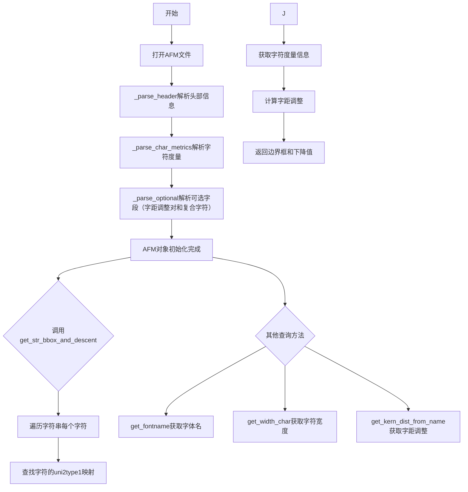

## 类结构

```
AFM (主类)
├── 全局函数（解析函数）
│   ├── _parse_header
│   ├── _parse_char_metrics
│   ├── _parse_kern_pairs
│   ├── _parse_composites
│   └── _parse_optional
├── 类型转换函数
│   ├── _to_int
│   ├── _to_float
│   ├── _to_str
│   ├── _to_bool
│   ├── _to_list_of_ints
│   └── _to_list_of_floats
└── 数据结构
    ├── CharMetrics (namedtuple)
    └── CompositePart (namedtuple)
```

## 全局变量及字段


### `_log`
    
模块级别的日志记录器，用于记录解析过程中的错误和警告信息

类型：`logging.Logger`
    


### `uni2type1`
    
Unicode字符到Type1字体名称的映射字典，用于字符名称转换

类型：`dict`
    


### `AFM._header`
    
存储AFM文件头信息，包含字体名称、度量信息等关键元数据

类型：`dict`
    


### `AFM._metrics`
    
以ASCII码为键的字符度量字典，映射字符码到CharMetrics对象

类型：`dict`
    


### `AFM._metrics_by_name`
    
以字符名称为键的字符度量字典，用于按名称查找字符度量信息

类型：`dict`
    


### `AFM._kern`
    
字偶间距 Kerning 数据字典，存储字符对的间距调整值

类型：`dict`
    


### `AFM._composite`
    
复合字符合成信息字典，存储复合字符的部件组成数据

类型：`dict`
    
    

## 全局函数及方法


### `_to_int`

该函数用于将输入值转换为整数。由于某些 AFM 文件中存在浮点数而非预期的整数，函数采用先转换为浮点数再转换为整数的策略，以防止 Matplotlib 崩溃。

参数：

- `x`：`任意类型`，需要能够转换为浮点数的输入值（如字符串形式的数字或直接是数值）

返回值：`int`，返回转换后的整数值（小数部分会被截断）

#### 流程图

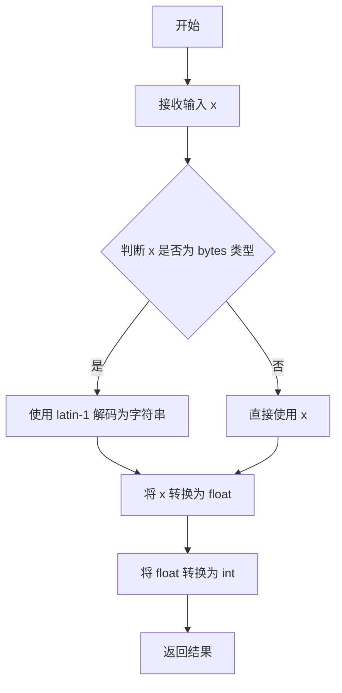

#### 带注释源码

```python
def _to_int(x):
    # Some AFM files have floats where we are expecting ints -- there is
    # probably a better way to handle this (support floats, round rather than
    # truncate).  But I don't know what the best approach is now and this
    # change to _to_int should at least prevent Matplotlib from crashing on
    # these.  JDH (2009-11-06)
    return int(float(x))
```


### `_to_float`

该函数是一个工具函数，用于将输入值转换为浮点数。主要处理 AFM（Adobe Font Metrics）文件中的数值转换问题，支持欧洲格式的小数点（逗号作为小数分隔符）以及字节类型的输入。

参数：

- `x`：`bytes` 或 `str`，需要转换的数值，可以是字节类型或字符串类型

返回值：`float`，转换后的浮点数

#### 流程图

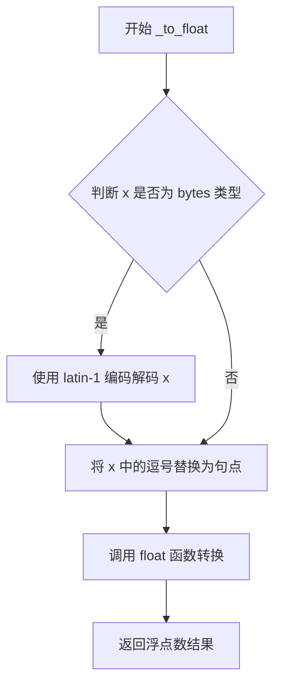

#### 带注释源码

```python
def _to_float(x):
    # Some AFM files use "," instead of "." as decimal separator -- this
    # shouldn't be ambiguous (unless someone is wicked enough to use "," as
    # thousands separator...).
    # 处理欧洲格式的小数分隔符（逗号替换为句点）
    
    if isinstance(x, bytes):
        # Encoding doesn't really matter -- if we have codepoints >127 the call
        # to float() will error anyways.
        # 如果输入是字节类型，则使用 latin-1 编码解码为字符串
        # latin-1 编码可以覆盖字节值 0-255，不会因编码问题抛出异常
        x = x.decode('latin-1')
    
    # 将字符串中的逗号替换为句点，处理欧洲数字格式
    return float(x.replace(',', '.'))
```


### `_to_str`

该函数用于将字节类型的数据解码为UTF-8编码的字符串，是AFM文件解析中的基础类型转换工具函数。

参数：

- `x`：`bytes`，需要解码的字节数据，通常来自AFM文件的读取结果

返回值：`str`，解码后的UTF-8字符串

#### 流程图

```mermaid
graph LR
    A[输入: bytes] --> B[decode('utf8')]
    B --> C[输出: str]
```

#### 带注释源码

```python
def _to_str(x):
    """
    将字节数据解码为UTF-8字符串。
    
    参数
    ----------
    x : bytes
        需要解码的字节数据，通常来自AFM文件的读取操作。
        
    返回
    -------
    str
        解码后的UTF-8字符串。
        
    说明
    -----
    该函数是AFM文件解析中的基础工具函数，用于处理文件头
    中的字符串字段（如FontName、FullName等）以及字符度量
    数据中的字符串内容。AFM规范要求使用ASCII编码，但实际
    一些字体文件可能包含非ASCII字符，因此使用UTF-8解码
    具有更好的兼容性。
    """
    return x.decode('utf8')
```


### `_to_list_of_ints`

该函数用于将包含整数值的字节字符串解析为整数列表，通过将逗号替换为空格后分割字符串，并对每个值调用 `_to_int` 转换为整数。

参数：

- `s`：`bytes`，需要解析的字节字符串，包含以空格或逗号分隔的整数值

返回值：`list[int]`，解析后的整数列表

#### 流程图

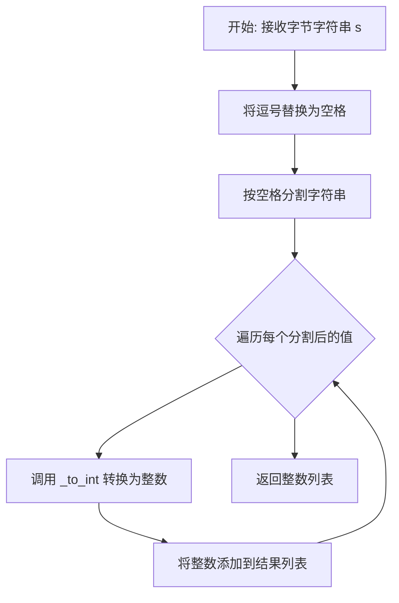

#### 带注释源码

```python
def _to_list_of_ints(s):
    """
    将包含整数值的字节字符串解析为整数列表。
    
    参数
    ----------
    s : bytes
        需要解析的字节字符串，包含以空格或逗号分隔的整数值。
        例如: b'10 20 30' 或 b'10,20,30'
    
    返回值
    -------
    list[int]
        解析后的整数列表。
        例如: 输入 b'10,20,30' 返回 [10, 20, 30]
    """
    # 第一步：将字节字符串中的所有逗号替换为空格
    # 这是为了兼容可能使用逗号作为分隔符的AFM文件格式
    s = s.replace(b',', b' ')
    
    # 第二步：按空格分割字符串为多个子字符串
    # 第三步：遍历每个子字符串，调用 _to_int 函数转换为整数
    # _to_int 函数会先尝试将值转换为浮点数，再取整（处理某些AFM文件中浮点数的情况）
    return [_to_int(val) for val in s.split()]
```


### `_to_list_of_floats`

该函数用于将 AFM 文件中的数字字符串（以空格分隔）转换为浮点数列表，主要用于解析字符边界框（Bounding Box）等包含多个数值的字段。

参数：

-  `s`：`bytes` 或 `str`，AFM 文件中包含数字的字符串，数字之间以空格分隔

返回值：`list[float]`，转换后的浮点数列表

#### 流程图

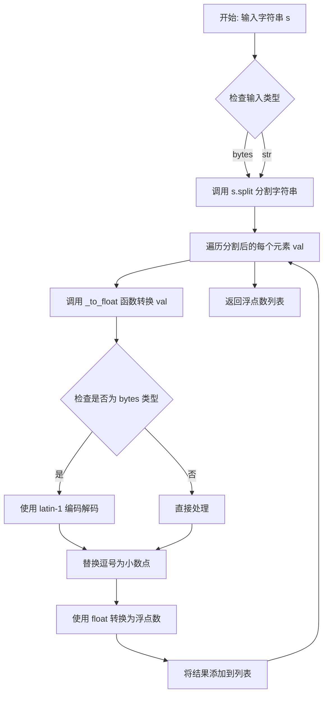

#### 带注释源码

```python
def _to_list_of_floats(s):
    """
    将空格分隔的数字字符串转换为浮点数列表。

    Parameters
    ----------
    s : bytes or str
        包含数字的字符串，数字之间以空格分隔。
        例如：b'-168 -218 1000 898' 或 '-168 -218 1000 898'

    Returns
    -------
    list[float]
        转换后的浮点数列表。
        例如：[-168.0, -218.0, 1000.0, 898.0]
    """
    # 使用 split() 方法按空格分割字符串，然后对每个元素调用 _to_float 转换
    # _to_float 函数会处理逗号作为小数点的情况（某些 AFM 文件使用欧洲格式）
    return [_to_float(val) for val in s.split()]
```


### `_to_bool`

将 AFM 文件头中的布尔值字符串转换为 Python 布尔类型。

参数：

- `s`：`bytes`，需要转换的字节字符串

返回值：`bool`，返回转换后的布尔值

#### 流程图

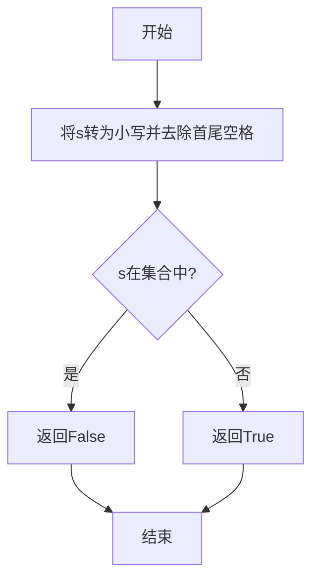

#### 带注释源码

```
def _to_bool(s):
    """
    将字符串转换为布尔值。
    
    参数:
        s: bytes类型，需要转换的字节字符串
        
    返回:
        bool类型，转换后的布尔值
    """
    # 使用lower()将字符串转为小写，strip()去除首尾空格
    # 判断转换后的字符串是否属于指定的否定列表
    if s.lower().strip() in (b'false', b'0', b'no'):
        # 如果是'false'、'0'或'no'，返回False
        return False
    else:
        # 其他情况返回True
        return True
```


### `_parse_header`

该函数用于解析 Adobe Font Metrics (AFM) 文件的头部信息，读取字体度量文件的元数据（如字体名称、版本、字形边框等），并将它们转换为适当的 Python 类型，最终返回一个包含所有头部信息的字典。

参数：

- `fh`：`file` 或 `io.BufferedReader`，AFM 文件的文件句柄，用于逐行读取字体度量数据

返回值：`dict`，包含 AFM 文件头部信息的字典，键为字节类型的关键字（如 `b'FontName'`、`b'CapHeight'` 等），值为转换后的 Python 类型（如字符串、浮点数、整数、布尔值或列表）

#### 流程图

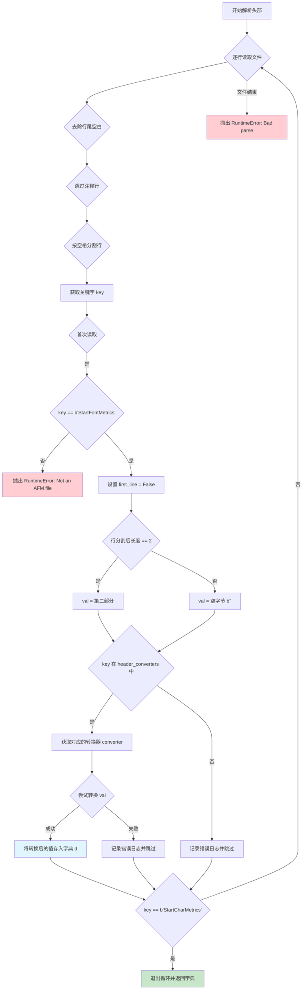

#### 带注释源码

```python
def _parse_header(fh):
    """
    Read the font metrics header (up to the char metrics).

    Returns
    -------
    dict
        A dictionary mapping *key* to *val*. Dictionary keys are:

            StartFontMetrics, FontName, FullName, FamilyName, Weight, ItalicAngle,
            IsFixedPitch, FontBBox, UnderlinePosition, UnderlineThickness, Version,
            Notice, EncodingScheme, CapHeight, XHeight, Ascender, Descender,
            StartCharMetrics

        *val* will be converted to the appropriate Python type as necessary, e.g.,:

            * 'False' -> False
            * '0' -> 0
            * '-168 -218 1000 898' -> [-168, -218, 1000, 898]
    """
    # 定义头部关键字到转换函数的映射字典
    # 每个关键字对应一个将字节串转换为特定Python类型的函数
    header_converters = {
        b'StartFontMetrics': _to_float,
        b'FontName': _to_str,
        b'FullName': _to_str,
        b'FamilyName': _to_str,
        b'Weight': _to_str,
        b'ItalicAngle': _to_float,
        b'IsFixedPitch': _to_bool,
        b'FontBBox': _to_list_of_ints,
        b'UnderlinePosition': _to_float,
        b'UnderlineThickness': _to_float,
        b'Version': _to_str,
        # Some AFM files have non-ASCII characters (which are not allowed by
        # the spec).  Given that there is actually no public API to even access
        # this field, just return it as straight bytes.
        b'Notice': lambda x: x,
        b'EncodingScheme': _to_str,
        b'CapHeight': _to_float,  # Is the second version a mistake, or
        b'Capheight': _to_float,  # do some AFM files contain 'Capheight'? -JKS
        b'XHeight': _to_float,
        b'Ascender': _to_float,
        b'Descender': _to_float,
        b'StdHW': _to_float,
        b'StdVW': _to_float,
        b'StartCharMetrics': _to_int,
        b'CharacterSet': _to_str,
        b'Characters': _to_int,
    }
    
    d = {}  # 初始化结果字典
    first_line = True  # 标记是否读取第一行
    
    # 逐行遍历文件句柄
    for line in fh:
        line = line.rstrip()  # 去除行尾空白字符
        if line.startswith(b'Comment'):
            continue  # 跳过注释行
        lst = line.split(b' ', 1)  # 按空格分割，最多分割一次
        key = lst[0]  # 获取关键字
        
        if first_line:
            # AFM spec, Section 4: The StartFontMetrics keyword
            # [followed by a version number] must be the first line in
            # the file, and the EndFontMetrics keyword must be the
            # last non-empty line in the file.  We just check the
            # first header entry.
            if key != b'StartFontMetrics':
                raise RuntimeError('Not an AFM file')
            first_line = False
        
        # 处理可能没有值的情况（如只有关键字没有值）
        if len(lst) == 2:
            val = lst[1]
        else:
            val = b''
        
        # 尝试获取对应的转换器
        try:
            converter = header_converters[key]
        except KeyError:
            _log.error("Found an unknown keyword in AFM header (was %r)", key)
            continue  # 未知关键字，记录错误并跳过
        
        # 尝试使用转换器转换值
        try:
            d[key] = converter(val)
        except ValueError:
            _log.error('Value error parsing header in AFM: %s, %s', key, val)
            continue  # 转换失败，记录错误并跳过
        
        # 遇到 StartCharMetrics 表示头部解析完成
        if key == b'StartCharMetrics':
            break
    else:
        # 如果循环正常结束（文件结束）但未找到 StartCharMetrics
        raise RuntimeError('Bad parse')
    
    return d
```


### `_parse_char_metrics`

该函数用于解析Adobe Font Metrics (AFM)文件中的字符度量信息。它从文件句柄中读取字符度量数据行，提取每个字符的宽度、名称和边界框信息，并构建两个字典：一个按ASCII码索引，另一个按字符名称索引。

参数：
- `fh`：文件对象（file handle），AFM文件的文件指针，调用时需要将光标放置在`StartCharMetrics`行之后

返回值：
- `ascii_d`：字典类型，键为ASCII字符码（整数），值为`CharMetrics`命名元组，表示"ASCII字符码到字符度量"的映射
- `name_d`：字典类型，键为字符名称（字符串），值为`CharMetrics`命名元组，表示"字符名称到字符度量"的映射

#### 流程图

```mermaid
flowchart TD
    A[开始解析字符度量] --> B[初始化required_keys集合: {'C', 'WX', 'N', 'B'}]
    B --> C[初始化ascii_d和name_d空字典]
    C --> D{逐行读取文件}
    D -->|读取到行| E[去除行尾空白并转换为UTF-8字符串]
    E --> F{检查是否以'EndCharMetrics'开头?}
    F -->|是| G[返回ascii_d和name_d]
    F -->|否| H[按分号分割并解析为字典]
    H --> I{检查required_keys是否为vals的子集?}
    I -->|否| J[抛出RuntimeError: Bad char metrics line]
    I -->|是| K[提取并转换各字段值]
    K --> L[num = C字段转整数]
    K --> M[wx = WX字段转浮点数]
    K --> N[name = N字段字符串]
    K --> O[bbox = B字段转浮点列表再转整数列表]
    O --> P[创建CharMetrics元组]
    P --> Q{特殊字符名称处理?}
    Q -->|Euro| R[num = 128]
    Q -->|minus| S[num = ord MINUS SIGN]
    Q -->|其他| T{num != -1?}
    R --> T
    S --> T
    T -->|是| U[ascii_d[num] = metrics]
    T -->|否| V[跳过ascii_d存储]
    U --> V
    V --> W[name_d[name] = metrics]
    W --> D
    D -->|文件结束未遇到EndCharMetrics| X[抛出RuntimeError: Bad parse]
    
    style G fill:#90EE90
    style J fill:#FFB6C1
    style X fill:#FFB6C1
```

#### 带注释源码

```python
def _parse_char_metrics(fh):
    """
    Parse the given filehandle for character metrics information.

    It is assumed that the file cursor is on the line behind 'StartCharMetrics'.

    Returns
    -------
    ascii_d : dict
         A mapping "ASCII num of the character" to `.CharMetrics`.
    name_d : dict
         A mapping "character name" to `.CharMetrics`.

    Notes
    -----
    This function is incomplete per the standard, but thus far parses
    all the sample afm files tried.
    """
    # 定义字符度量行中必需的键
    # C: 字符码, WX: 字符宽度, N: 字符名称, B: 边界框
    required_keys = {'C', 'WX', 'N', 'B'}

    # 初始化两个字典：按ASCII码索引和按名称索引
    ascii_d = {}
    name_d = {}
    
    # 逐行遍历文件
    for line in fh:
        # We are defensively letting values be utf8. The spec requires
        # ascii, but there are non-compliant fonts in circulation
        # 将字节串去除尾部空白后转换为UTF-8字符串
        line = _to_str(line.rstrip())  # Convert from byte-literal
        
        # 检测到字符度量结束标记，返回解析结果
        if line.startswith('EndCharMetrics'):
            return ascii_d, name_d
        
        # Split the metric line into a dictionary, keyed by metric identifiers
        # 按分号分割行，去除空字符串后，将每个片段按空格分割为键值对
        # 例如: "C 65 ; N A ; WX 722 ; B 0 0 722 722 ;"
        # 解析为: {'C': '65', 'N': 'A', 'WX': '722', 'B': '0 0 722 722'}
        vals = dict(s.strip().split(' ', 1) for s in line.split(';') if s)
        
        # There may be other metrics present, but only these are needed
        # 检查必需的键是否都存在，否则抛出异常
        if not required_keys.issubset(vals):
            raise RuntimeError('Bad char metrics line: %s' % line)
        
        # 提取并转换各个字段
        num = _to_int(vals['C'])       # 字符的ASCII/Unicode码
        wx = _to_float(vals['WX'])    # 字符宽度 (WX)
        name = vals['N']              # 字符名称 (N)
        
        # 边界框 (B) 是四个浮点数组成的字符串，转换为整数列表
        # 格式: "llx lly urx ury" (左下x, 左下y, 右上x, 右上y)
        bbox = _to_list_of_floats(vals['B'])
        bbox = list(map(int, bbox))
        
        # 创建CharMetrics命名元组，包含宽度、名称和边界框
        metrics = CharMetrics(wx, name, bbox)
        
        # Workaround: If the character name is 'Euro', give it the
        # corresponding character code, according to WinAnsiEncoding (see PDF
        # Reference).
        # 特殊处理欧元符号：AFM中的名称为'Euro'，但需要映射到WinAnsi编码的128
        if name == 'Euro':
            num = 127  # 根据WinAnsiEncoding，Euro对应128
        elif name == 'minus':
            # 处理减号：有些AFM文件使用Unicode减号符号
            num = ord("\N{MINUS SIGN}")  # 0x2212
        
        # 只有当字符码有效时才存储到ascii_d中
        # num = -1 表示该字符不可用
        if num != -1:
            ascii_d[num] = metrics
        
        # 始终按名称存储，方便通过名称查询
        name_d[name] = metrics
    
    # 如果遍历完文件仍未遇到EndCharMetrics，抛出解析错误
    raise RuntimeError('Bad parse')
```


### `_parse_kern_pairs`

该函数用于解析 Adobe Font Metrics (AFM) 文件中的 kern pairs（字距调整对）数据，将 KPX 格式的行解析为 Python 字典，其中键为 (char1, char2) 元组，值为字距调整数值。

参数：

- `fh`：文件对象（file handle），用于读取 AFM 文件内容

返回值：`dict`，键为 (char1, char2) 元组，值为字距调整值（float）

#### 流程图

```mermaid
flowchart TD
    A[开始解析 kern pairs] --> B[读取下一行]
    B --> C{检查是否以 'StartKernPairs' 开头?}
    C -->|否| D[抛出 RuntimeError: Bad start of kern pairs data]
    C -->|是| E[初始化空字典 d]
    E --> F[遍历文件句柄 fh]
    F --> G{读取一行}
    G --> H{行是否为空?}
    H -->|是| F
    H -->|否| I{是否以 'EndKernPairs' 开头?}
    I -->|是| J[读取下一行跳过 'EndKernData']
    J --> K[返回字典 d]
    I -->|否| L{解析行}
    L --> M{检查是否为 4 个元素且首元素为 'KPX'?}
    M -->|否| N[抛出 RuntimeError: Bad kern pairs line]
    M -->是| O[提取 c1, c2, val]
    O --> P[调用 _to_str 转换 c1 和 c2]
    P --> Q[调用 _to_float 转换 val]
    Q --> R[d[(c1, c2)] = val]
    R --> F
    G -->|文件结束| S[抛出 RuntimeError: Bad kern pairs parse]
```

#### 带注释源码

```python
def _parse_kern_pairs(fh):
    """
    Return a kern pairs dictionary.

    Returns
    -------
    dict
        Keys are (*char1*, *char2*) tuples and values are the kern pair value. For
        example, a kern pairs line like ``KPX A y -50`` will be represented as::

            d['A', 'y'] = -50
    """
    # 读取第一行，检查是否是正确的 kern pairs 开始标记
    line = next(fh)
    if not line.startswith(b'StartKernPairs'):
        raise RuntimeError('Bad start of kern pairs data: %s' % line)

    # 初始化用于存储 kern pairs 的字典
    d = {}
    # 遍历文件句柄中的每一行
    for line in fh:
        # 去除行尾的空白字符
        line = line.rstrip()
        # 跳过空行
        if not line:
            continue
        # 检查是否到达 kern pairs 数据的结束标记
        if line.startswith(b'EndKernPairs'):
            next(fh)  # EndKernData
            return d  # 返回解析完成的字典
        
        # 将行分割为单词列表
        vals = line.split()
        # 验证行的格式：必须是 4 个元素且以 'KPX' 开头
        if len(vals) != 4 or vals[0] != b'KPX':
            raise RuntimeError('Bad kern pairs line: %s' % line)
        
        # 提取字符名和 kern 值，并进行类型转换
        # vals[1] 是第一个字符名，vals[2] 是第二个字符名，vals[3] 是 kern 值
        c1, c2, val = _to_str(vals[1]), _to_str(vals[2]), _to_float(vals[3])
        # 将 (char1, char2) 元组作为键，kern 值作为值存入字典
        d[(c1, c2)] = val
    
    # 如果文件在遇到 EndKernPairs 之前就结束了，抛出解析错误
    raise RuntimeError('Bad kern pairs parse')
```


### `_parse_composites`

该函数用于解析 AFM 文件中的复合字形（Composites）信息。它从文件句柄中读取复合字形定义行，将每个复合字符名称映射到其组成部分列表（包含每个部分的名称和 x、y 位移），并返回完整的数据字典。

参数：

- `fh`：文件对象（file handle），AFM 文件已打开的文件句柄，函数从当前光标位置开始解析复合字形数据

返回值：`dict`，映射复合字符名称（如 'Aacute'）到 `CompositePart` 列表的字典

#### 流程图

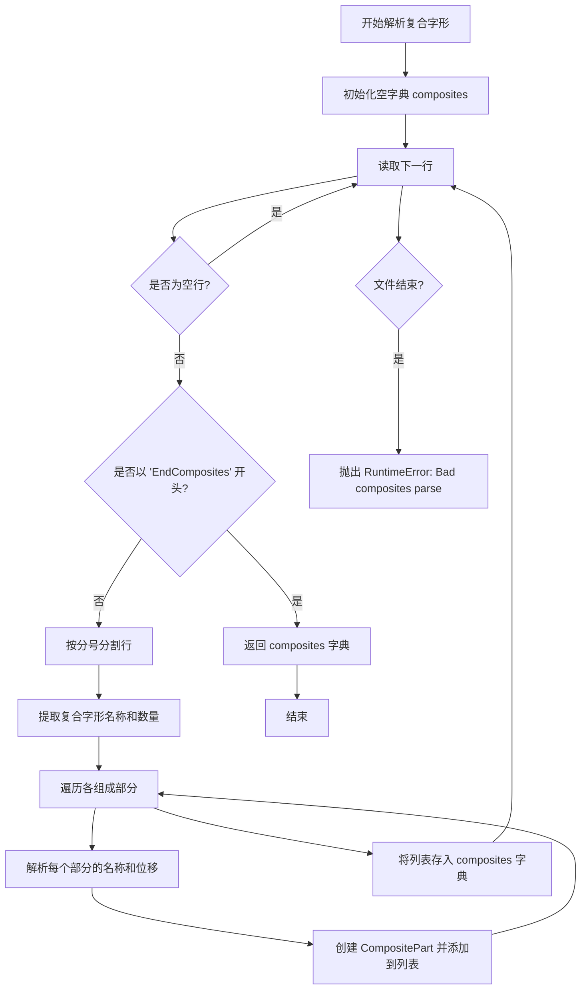

#### 带注释源码

```python
def _parse_composites(fh):
    """
    Parse the given filehandle for composites information.

    It is assumed that the file cursor is on the line behind 'StartComposites'.

    Returns
    -------
    dict
        A dict mapping composite character names to a parts list. The parts
        list is a list of `.CompositePart` entries describing the parts of
        the composite.

    Examples
    --------
    A composite definition line::

      CC Aacute 2 ; PCC A 0 0 ; PCC acute 160 170 ;

    will be represented as::

      composites['Aacute'] = [CompositePart(name='A', dx=0, dy=0),
                              CompositePart(name='acute', dx=160, dy=170)]

    """
    # 初始化结果字典，用于存储复合字形名称到部件列表的映射
    composites = {}
    
    # 遍历文件中的每一行
    for line in fh:
        # 去除行尾的空白字符（包括换行符）
        line = line.rstrip()
        
        # 跳过空行
        if not line:
            continue
        
        # 如果遇到 'EndComposites'，说明复合字形数据解析完成
        if line.startswith(b'EndComposites'):
            return composites
        
        # 按分号分割行，获取各部分数据
        # 格式示例: 'CC Aacute 2 ; PCC A 0 0 ; PCC acute 160 170 ;'
        vals = line.split(b';')
        
        # 提取复合字形定义头部信息
        # cc[0] 是 'CC' 关键字，cc[1] 是名称，cc[2] 是部件数量
        cc = vals[0].split()
        name, _num_parts = cc[1], _to_int(cc[2])
        
        # 初始化部件列表
        pccParts = []
        
        # 遍历所有 PCC (Part of Composite Character) 条目
        # vals[1:-1] 排除首部的 CC 行和尾部的空字符串
        for s in vals[1:-1]:
            # 解析每个部件的详细信息
            pcc = s.split()
            # pcc[0] 是 'PCC' 关键字，pcc[1] 是部件名称
            # pcc[2] 是 x 位移，pcc[3] 是 y 位移
            part = CompositePart(pcc[1], _to_float(pcc[2]), _to_float(pcc[3]))
            pccParts.append(part)
        
        # 将该复合字形及其部件列表存入字典
        composites[name] = pccParts

    # 如果文件在遇到 'EndComposites' 之前结束，抛出解析错误
    raise RuntimeError('Bad composites parse')
```


### `_parse_optional`

该函数用于解析AFM文件中的可选字段，包括字距调整对数据（kern pairs）和复合字（composites）信息。它遍历文件句柄，识别特定的关键字，并调用相应的解析函数来处理这些可选数据。

参数：

-  `fh`：文件对象（file handle），AFM文件句柄，用于读取可选字段数据

返回值：`tuple[dict, dict]`，返回包含字距调整数据和复合字信息的元组。第一个字典包含字距调整信息（可能为空），第二个字典包含复合字信息（可能为空）。

#### 流程图

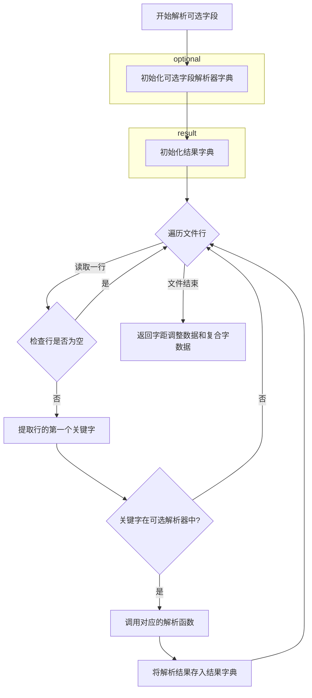

#### 带注释源码

```python
def _parse_optional(fh):
    """
    Parse the optional fields for kern pair data and composites.

    Returns
    -------
    kern_data : dict
        A dict containing kerning information. May be empty.
        See `._parse_kern_pairs`.
    composites : dict
        A dict containing composite information. May be empty.
        See `._parse_composites`.
    """
    # 定义可选字段及其对应的解析函数
    # StartKernData -> _parse_kern_pairs: 解析字距调整对数据
    # StartComposites -> _parse_composites: 解析复合字数据
    optional = {
        b'StartKernData': _parse_kern_pairs,
        b'StartComposites':  _parse_composites,
        }

    # 初始化结果字典，用于存储解析结果
    # 每个可选字段都有对应的空字典作为默认值
    d = {b'StartKernData': {},
         b'StartComposites': {}}
    
    # 遍历文件句柄中的每一行
    for line in fh:
        # 移除行尾的空白字符（包括换行符）
        line = line.rstrip()
        
        # 跳过空行
        if not line:
            continue
        
        # 提取行的第一个单词作为关键字
        # 例如: "StartKernData" 或 "StartComposites"
        key = line.split()[0]

        # 如果关键字在可选字段字典中，则调用对应的解析函数
        if key in optional:
            # 传入文件句柄，让解析函数继续读取后续行
            d[key] = optional[key](fh)

    # 返回解析结果：字距调整数据和复合字数据
    return d[b'StartKernData'], d[b'StartComposites']
```


### `AFM.__init__`

这是 `AFM` 类的构造函数，用于解析 Adobe Font Metrics (AFM) 文件并初始化字体度量数据。该方法读取文件对象，解析头部信息、字符度量数据以及可选的 kerning 对和复合字符信息，并将这些数据存储为实例变量供后续方法使用。

参数：

- `fh`：`file-like object`，AFM 格式的字体度量文件对象（必须是以二进制模式打开的文件句柄）

返回值：`None`，构造函数不返回值，仅初始化实例状态

#### 流程图

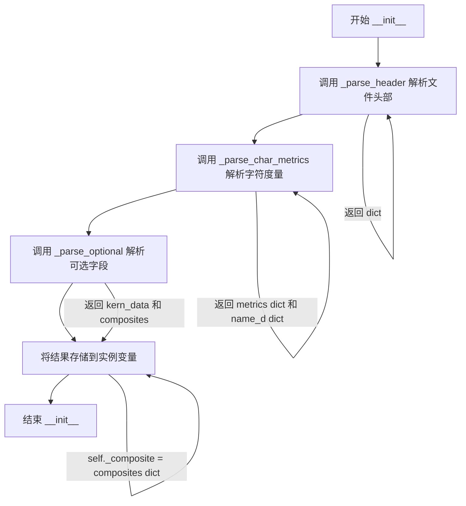

#### 带注释源码

```python
def __init__(self, fh):
    """
    解析文件对象 *fh* 中的 AFM 文件。
    
    参数
    ----------
    fh : file-like object
        以二进制模式打开的 AFM 字体度量文件对象
    """
    # 解析 AFM 文件的头部信息（包含字体名称、版本、字号等信息）
    # 返回字典，键为字节字符串如 b'FontName', b'CapHeight' 等
    self._header = _parse_header(fh)
    
    # 解析字符度量信息
    # 返回两个字典：
    #   - _metrics: ASCII 字符码 -> CharMetrics 命名元组
    #   - _metrics_by_name: 字符名称 -> CharMetrics 命名元组
    self._metrics, self._metrics_by_name = _parse_char_metrics(fh)
    
    # 解析可选字段（kerning 距离对和复合字符信息）
    # 返回两个字典：
    #   - _kern: (char1, char2) 元组 -> kerning 值
    #   - _composite: 复合字符名称 -> CompositePart 列表
    self._kern, self._composite = _parse_optional(fh)
```


### `AFM.get_str_bbox_and_descent`

该方法用于计算给定字符串的边界框（bounding box）和最大下降值（descent），遍历字符串的每个字符，累加字符宽度（包括字距调整），并计算整体边界框的左边界、底部y坐标、总宽度、高度以及下降值。

参数：

-  `s`：`str`，需要计算边界框的输入字符串

返回值：`tuple[int, int, int, int, int]`，返回一个包含5个整数的元组，分别是：
  - `left`：字符串最左边的x坐标
  - `miny`：字符底部（baseline以下）的最小y坐标
  - `total_width`：字符串的总宽度（包含字距调整）
  - `height`：字符串的高度（maxy - miny）
  - `descent`：最大下降值（-miny，即baseline到最低点的距离）

#### 流程图

```mermaid
flowchart TD
    A[开始 get_str_bbox_and_descent] --> B{字符串是否为空?}
    B -->|是| C[返回 0, 0, 0, 0, 0]
    B -->|否| D[初始化变量: total_width, namelast, miny, maxy, left]
    D --> E{输入是否为字符串?}
    E -->|否| F[调用 _to_str 转换为字符串]
    E -->|是| G[继续遍历]
    F --> G
    G --> H{遍历字符串中的每个字符}
    H --> I{字符是否为换行符?}
    I -->|是| H
    I -->|否| J[获取字符的Unicode码点]
    J --> K[查询 uni2type1 映射获取Type1字体名称]
    K --> L{名称是否在 _metrics_by_name 中?}
    L -->|是| M[获取字符度量: wx, name, bbox]
    L -->|否| N[使用 'question' 作为后备名称]
    N --> M
    M --> O[累加字符宽度到 total_width]
    O --> P[获取字距调整值并累加]
    P --> Q[更新 left = min(left, bbox[0])]
    Q --> R[更新 miny = min(miny, bbox[1])]
    R --> S[更新 maxy = max(maxy, bbox[1] + bbox[3])]
    S --> T[更新 namelast 为当前字符名]
    T --> H
    H --> U{遍历结束?}
    U -->|否| H
    U -->|是| V[返回 left, miny, total_width, maxy-miny, -miny]
    V --> Z[结束]
```

#### 带注释源码

```python
def get_str_bbox_and_descent(self, s):
    """Return the string bounding box and the maximal descent."""
    # 步骤1: 处理空字符串边界情况，直接返回全零边界框
    if not len(s):
        return 0, 0, 0, 0, 0
    
    # 步骤2: 初始化累加器变量
    total_width = 0  # 字符串总宽度
    namelast = None  # 上一个字符的名称，用于字距调整
    miny = 1e9      # 字符底部的最小y坐标（初始化为极大值）
    maxy = 0        # 字符顶部的最大y坐标
    left = 0        # 字符串最左边的x坐标
    
    # 步骤3: 确保输入为字符串类型，字节数据需要转换
    if not isinstance(s, str):
        s = _to_str(s)
    
    # 步骤4: 遍历字符串中的每个字符
    for c in s:
        # 跳过换行符，不计入边界框计算
        if c == '\n':
            continue
        
        # 将Unicode字符码点转换为Type1字体名称
        # 例如: 'A' -> 'A', 欧元符号 -> 'Euro', 生僻字 -> 'uni4E2D'
        name = uni2type1.get(ord(c), f"uni{ord(c):04X}")
        
        # 尝试从字体度量字典中获取字符信息
        # 如果字符不存在，使用问号('question')作为后备
        try:
            wx, _, bbox = self._metrics_by_name[name]
        except KeyError:
            name = 'question'
            wx, _, bbox = self._metrics_by_name[name]
        
        # 累加字符宽度，并加上当前字符与前一个字符之间的字距调整值
        total_width += wx + self._kern.get((namelast, name), 0)
        
        # 解构边界框: l=左边, b=底边, w=宽度, h=高度
        l, b, w, h = bbox
        
        # 更新字符串的最左边坐标（取最小值）
        left = min(left, l)
        
        # 更新字符底部的最小y坐标
        miny = min(miny, b)
        
        # 更新字符顶部的最大y坐标（底边+高度）
        maxy = max(maxy, b + h)
        
        # 记录当前字符名称，供下一次迭代的字距调整使用
        namelast = name
    
    # 步骤5: 返回边界框信息
    # left: 左边界, miny: 底部y坐标, total_width: 总宽度
    # maxy-miny: 字符串高度, -miny: 下降值（descent，为正数）
    return left, miny, total_width, maxy - miny, -miny
```


### `AFM.get_glyph_name`

该方法根据给定的字形索引（glyph index）从字符度量数据中检索对应的字形名称，用于获取特定字符的PostScript字形名称。

参数：

- `glyph_ind`：`int`，字形索引（字符码点），用于在内部度量字典中查找对应的字形名称

返回值：`str`，返回与给定字形索引关联的字形名称（PostScript字形名）

#### 流程图

```mermaid
flowchart TD
    A[开始 get_glyph_name] --> B[输入: glyph_ind]
    B --> C{检查 _metrics 中是否存在}
    C -->|是| D[获取 self._metrics[glyph_ind]]
    D --> E[返回 .name 属性]
    C -->|否| F[抛出 KeyError]
    E --> G[结束]
    F --> G
```

#### 带注释源码

```python
def get_glyph_name(self, glyph_ind):  # For consistency with FT2Font.
    """
    Get the name of the glyph, i.e., ord(';') is 'semicolon'.
    
    Parameters
    ----------
    glyph_ind : int
        The glyph index (character code point) to look up.
    
    Returns
    -------
    str
        The PostScript name of the glyph corresponding to glyph_ind.
    """
    # 从内部维护的 _metrics 字典中通过 glyph_ind 获取 CharMetrics 命名元组
    # 然后访问其 name 属性获取字形名称
    return self._metrics[glyph_ind].name
```


### `AFM.get_char_index`

返回给定字符代码点的字形索引。注意，对于 AFM 字体，字形索引与代码点被视为相同。

参数：

- `c`：`int`，字符的 Unicode 代码点

返回值：`int`，字形索引（对于 AFM 字体，等同于输入的代码点）

#### 流程图

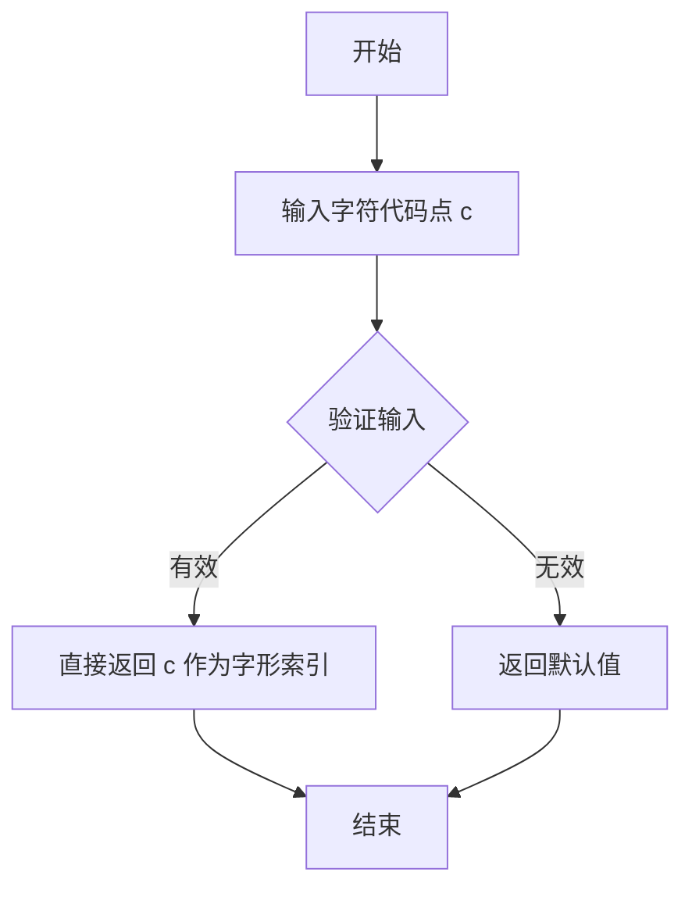

#### 带注释源码

```python
def get_char_index(self, c):  # For consistency with FT2Font.
    """
    Return the glyph index corresponding to a character code point.

    Note, for AFM fonts, we treat the glyph index the same as the codepoint.
    """
    # 直接返回输入的代码点 c 作为字形索引
    # 这是因为在 AFM 字体中，字形索引与字符代码点一一对应
    return c
```


### AFM.get_width_char

获取指定字符代码的宽度（从字符度量 WX 字段）

参数：

- `c`：`int`，字符代码（character code），对应字符的 ASCII 或 Unicode 码点

返回值：`float`，字符宽度（character width），即该字符在 X 方向的度量值（WX 字段）

#### 流程图

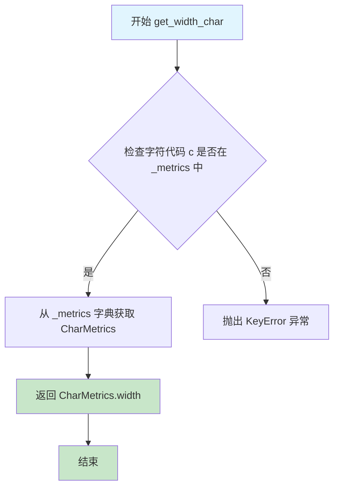

#### 带注释源码

```python
def get_width_char(self, c):
    """
    获取字符代码对应的字符宽度。
    
    该方法从预解析的字符度量字典（_metrics）中，
    根据给定的字符代码 c 查找对应的 CharMetrics 命名 tuple，
    并返回其 width 字段值。
    
    参数
    ----------
    c : int
        字符代码，通常是 ASCII 或 Unicode 码点。
        例如：ord('A') 返回 65。
    
    返回值
    -------
    float
        字符宽度（WX 字段），单位为 1/1000 点（points），
        即 Adobe Font Metrics 文件格式规范中定义的度量单位。
    
    示例
    -------
    >>> afm.get_width_char(ord('A'))
    722.0
    >>> afm.get_width_char(65)  # 与上面等价
    722.0
    
    注意
    -------
    - 该方法依赖于 _metrics 字典，该字典在 AFM 类初始化时
      通过 _parse_char_metrics 函数解析 AFM 文件的字符度量部分填充。
    - 如果字符代码 c 不存在于 _metrics 字典中，会抛出 KeyError 异常。
    - 返回的宽度值已经转换为浮点数类型。
    """
    # _metrics 是一个字典，键为字符代码（整数），值为 CharMetrics 命名元组
    # CharMetrics 包含 width, name, bbox 三个字段
    # 这里直接通过字符代码 c 作为键访问字典，获取对应的 CharMetrics
    # 然后返回其 width 属性（即 WX 字段）
    return self._metrics[c].width
```


### AFM.get_width_from_char_name

根据给定的 type1 字符名获取该字符的宽度信息。

参数：

- `name`：`str`，type1 字符名称（如 'A'、'question' 等）

返回值：`float`，字符宽度（WX 字段值）

#### 流程图

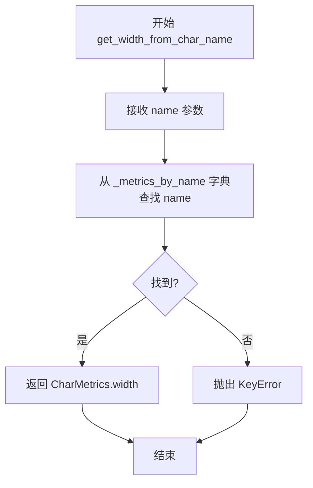

#### 带注释源码

```python
def get_width_from_char_name(self, name):
    """
    Get the width of the character from a type1 character name.
    
    Parameters
    ----------
    name : str
        The type1 character name (e.g., 'A', 'question', 'Euro').
    
    Returns
    -------
    float
        The character width (WX field) from the character metrics.
    """
    # 从 _metrics_by_name 字典中获取指定字符名的 CharMetrics 对象，
    # 并返回其 width 属性
    # _metrics_by_name 是在 __init__ 中通过 _parse_char_metrics 构建的
    # 字典，键为字符名，值为 CharMetrics 命名元组
    return self._metrics_by_name[name].width
```


### `AFM.get_kern_dist_from_name`

该方法用于根据两个字符的名称（type1 字符名）查询对应的 kerning（字距调整）值。如果指定的字符对不存在于 kerning 字典中，则返回默认值 0。

参数：

- `name1`：`str`，第一个字符的 type1 名称（如 'A'、'T' 等）
- `name2`：`str`，第二个字符的 type1 名称（如 'y'、'V' 等）

返回值：`float`，两个字距调整的数值（单位为 1/1000 point size），若不存在则返回 0

#### 流程图

```mermaid
flowchart TD
    A[开始] --> B[接收 name1, name2]
    B --> C[构造元组 key = (name1, name2)]
    C --> D{检查 _kern 字典中是否存在 key}
    D -->|是| E[返回 _kern[key] 的值]
    D -->|否| F[返回默认值 0]
    E --> G[结束]
    F --> G
```

#### 带注释源码

```python
def get_kern_dist_from_name(self, name1, name2):
    """
    Return the kerning pair distance (possibly 0) for chars *name1* and *name2*.

    Parameters
    ----------
    name1 : str
        The type1 character name of the first character.
    name2 : str
        The type1 character name of the second character.

    Returns
    -------
    float
        The kerning distance value. Returns 0 if the pair is not found
        in the kerning dictionary.
    """
    # 从内部的 kerning 字典中查找，键为 (name1, name2) 元组
    # 如果未找到则返回默认值 0
    return self._kern.get((name1, name2), 0)
```


### `AFM.get_fontname`

该方法用于从已解析的 AFM 文件头信息中获取并返回字体的 PostScript 名称（如 'Times-Roman'）。

参数：
- 无

返回值：`str`，返回字体的名称字符串，例如 'Times-Roman'。

#### 流程图

```mermaid
flowchart TD
    A[开始 get_fontname] --> B[访问 self._header[b'FontName']]
    B --> C[返回字体名称字符串]
    C --> D[结束]
```

#### 带注释源码

```python
def get_fontname(self):
    """
    Return the font name, e.g., 'Times-Roman'.
    
    该方法从 AFM 文件头信息字典中提取 FontName 字段。
    FontName 是 Adobe Font Metrics 文件中的必需字段，
    标识字体的 PostScript 名称。
    
    Returns
    -------
    str
        字体的 PostScript 名称，如 'Times-Roman'、'Helvetica-Bold' 等。
    """
    # 从解析后的头部字典中获取 FontName 键对应的值
    # _header 字典在 __init__ 中通过 _parse_header 函数填充
    # 键为字节类型 b'FontName'，返回值已转换为字符串类型
    return self._header[b'FontName']
```


### `AFM.get_fullname`

该方法用于获取Adobe字体的完整名称（Full Name），首先尝试从AFM文件头部信息中读取FullName字段，如果该字段不存在则回退使用FontName字段作为替代。

参数： 无

返回值：`str`，字体的完整名称（例如 'Times-Roman'）

#### 流程图

```mermaid
flowchart TD
    A[开始 get_fullname] --> B{从_header获取FullName}
    B --> C{FullName是否存在}
    C -->|是| D[使用FullName]
    C -->|否| E[使用FontName作为替代]
    D --> F[返回name]
    E --> F
```

#### 带注释源码

```python
def get_fullname(self):
    """Return the font full name, e.g., 'Times-Roman'."""
    # 从文件头获取FullName字段（已通过_to_str转换为字符串）
    name = self._header.get(b'FullName')
    # 如果FullName字段不存在，则使用FontName字段作为替代
    if name is None:  # use FontName as a substitute
        name = self._header[b'FontName']
    return name
```


### AFM.get_familyname

获取字体的家族名称。如果AFM文件中直接指定了FamilyName，则返回该值；否则从FullName中通过正则表达式移除样式后缀（如regular、bold、italic等）来推断家族名称。

参数：

- `self`：`AFM`，AFM类的实例，表示已解析的AFM字体文件对象

返回值：`str`，字体的家族名称（例如 'Times'）

#### 流程图

```mermaid
flowchart TD
    A[开始] --> B{检查self._header中是否存在b'FamilyName'}
    B -->|存在| C[返回FamilyName]
    B -->|不存在| D[调用self.get_fullname获取完整名称]
    D --> E[定义正则表达式用于移除样式后缀]
    E --> F[使用re.sub移除后缀]
    F --> G[返回处理后的家族名称]
```

#### 带注释源码

```python
def get_familyname(self):
    """Return the font family name, e.g., 'Times'."""
    # 尝试从header中获取FamilyName字段
    # self._header是在__init__中通过_parse_header解析得到的字典
    name = self._header.get(b'FamilyName')
    # 如果FamilyName存在于AFM文件中，直接返回
    if name is not None:
        return name

    # FamilyName未在AFM文件中指定，需要从FullName推断
    # 获取完整字体名称（可能包含样式后缀如-Bold、Italic等）
    name = self.get_fullname()
    
    # 定义正则表达式用于移除字体样式后缀
    # (?i) 表示不区分大小写
    # 匹配以空格或连字符开头，后跟以下样式关键字之一：
    # regular, plain, italic, oblique, bold, semibold, light, 
    # ultralight, extra, condensed（末尾）
    extras = (r'(?i)([ -](regular|plain|italic|oblique|bold|semibold|'
              r'light|ultralight|extra|condensed))+$')
    
    # 使用正则表达式替换，将样式后缀替换为空字符串
    # 例如：'Times-Roman' -> 'Times'
    #       'Arial Bold' -> 'Arial'
    return re.sub(extras, '', name)
```


### `AFM.get_weight`

该方法用于从已解析的 AFM 文件头部信息中获取字体字重（weight），例如 'Bold' 或 'Roman'。

参数：無（仅包含隐式参数 `self`）

返回值：`str`，返回 AFM 文件头中定义的字体字重字符串，例如 'Bold'、'Roman' 等。

#### 流程图

```mermaid
flowchart TD
    A[调用 get_weight] --> B{检查 self._header 中是否存在 'Weight' 键}
    B -->|存在| C[返回 self._header[b'Weight']]
    B -->|不存在| D[抛出 KeyError 异常]
    
    style A fill:#f9f,stroke:#333
    style C fill:#9f9,stroke:#333
    style D fill:#f99,stroke:#333
```

#### 带注释源码

```python
def get_weight(self):
    """Return the font weight, e.g., 'Bold' or 'Roman'."""
    return self._header[b'Weight']
```

**源码解析：**

- `self`：AFM 类实例的隐式参数，包含了已解析的 AFM 文件数据
- `self._header`：字典对象，在 `AFM.__init__` 方法中通过 `_parse_header(fh)` 解析并填充
- `b'Weight'`：字节字符串类型的键，对应 AFM 文件中的 `Weight` 字段
- `_to_str`：在解析头部时用于将字节转换为字符串的转换函数
- 返回值：字体字重字符串，如果头部中不存在该键则会抛出 `KeyError` 异常


### `AFM.get_angle`

获取Adobe Font Metrics文件中字体的倾斜角度（ItalicAngle）。

参数：

- `self`：`AFM` 类实例，调用该方法的对象本身

返回值：`float`，返回字体的倾斜角度（ItalicAngle），单位为度。

#### 流程图

```mermaid
flowchart TD
    A[开始 get_angle] --> B[从self._header字典中获取键 b'ItalicAngle' 的值]
    B --> C[返回倾斜角度值]
    C --> D[结束]
```

#### 带注释源码

```python
def get_angle(self):
    """
    Return the fontangle as float.
    
    该方法从AFM文件头部信息中提取字体的倾斜角度（ItalicAngle）。
    ItalicAngle表示字体的倾斜角度，正值表示向右倾斜（italic），
    负值表示向左倾斜（oblique），0表示正体。
    
    Returns
    -------
    float
        字体的倾斜角度（ItalicAngle），单位为度。
    """
    return self._header[b'ItalicAngle']
```


### `AFM.get_capheight`

该方法用于从AFM字体度量文件中获取大写字母（Cap）的高度值（CapHeight），返回类型为浮点数。

参数：

- `self`：`AFM`，隐含的类实例引用，代表当前AFM字体对象

返回值：`float`，大写字母高度值，单位为1/1000点大小（points）

#### 流程图

```mermaid
flowchart TD
    A[开始] --> B[从self._header字典中获取键b'CapHeight'的值]
    B --> C[返回该浮点数值]
    C --> D[结束]
```

#### 带注释源码

```python
def get_capheight(self):
    """Return the cap height as float."""
    return self._header[b'CapHeight']
```

**代码说明：**

- `self`：类AFM的实例，包含了已解析的AFM文件头部信息
- `self._header`：字典类型，在AFM类初始化时由`_parse_header`函数填充，存储了AFM文件的各种头部指标信息
- `b'CapHeight'`：字节字符串类型的字典键，对应AFM文件中的CapHeight字段
- 在`_parse_header`函数中，`CapHeight`字段通过`header_converters`字典中的`b'CapHeight': _to_float`规则被转换为float类型
- 该值表示大写字母的高度，以1/1000点大小（point size）为单位


### `AFM.get_xheight`

该方法用于获取字体的 x-height（x 高度）度量值，即小写字母 "x" 的高度。这是字体设计中的重要参数，用于确定小写字母的视觉大小。

参数：
- 无显式参数（`self` 为实例隐式参数）

返回值：`float`，返回字体的 XHeight 值，单位为 1/1000 磅（point size）

#### 流程图

```mermaid
flowchart TD
    A[开始 get_xheight] --> B{检查 _header}
    B -->|存在 b'XHeight'| C[返回 self._header[b'XHeight']]
    B -->|不存在| D[抛出 KeyError]
    C --> E[结束]
    D --> E
```

#### 带注释源码

```python
def get_xheight(self):
    """Return the xheight as float."""
    return self._header[b'XHeight']
```

**代码解析：**
- `self`：AFM 类的实例方法，隐式接收当前 AFM 对象实例
- `self._header`：在 `__init__` 方法中通过 `_parse_header(fh)` 解析并存储的字体头部信息字典
- `b'XHeight'`：AFM 文件规范中的 XHeight 字段标识（字节字符串类型），在文件解析时被转换为 float 类型存储
- 返回值：字体 x-height 值，单位为 1/1000 的 point size（与 Adobe Font Metrics File Format Specification 一致）


### `AFM.get_underline_thickness`

返回 AFM 字体文件中的下划线厚度值（UnderlineThickness），该值表示字体下划线的粗细程度。

参数：

- （无参数）

返回值：`float`，返回下划线厚度值，类型为浮点数，表示下划线的厚度（单位为 1/1000 比例因子）。

#### 流程图

```mermaid
flowchart TD
    A[开始] --> B{调用 get_underline_thickness}
    B --> C[访问 self._header 字典]
    C --> D[获取键 b'UnderlineThickness' 的值]
    D --> E[返回浮点数类型的下划线厚度值]
    E --> F[结束]
```

#### 带注释源码

```python
def get_underline_thickness(self):
    """
    Return the underline thickness as float.
    
    该方法从已解析的 AFM 文件头部信息中提取下划线厚度。
    UnderlineThickness 是 Adobe Font Metrics 规范中的标准字段，
    表示下划线的垂直厚度，单位为 1/1000 点大小（point size）。
    
    返回值
    -------
    float
        下划线厚度值，来自 AFM 文件的 UnderlineThickness 头部字段。
    """
    # 从预先解析并存储在 self._header 字典中的头部信息获取下划线厚度
    # _parse_header 函数使用 _to_float 转换器将其解析为 float 类型
    return self._header[b'UnderlineThickness']
```

## 关键组件


### AFM 类

AFM文件解析器核心类，封装了AFM文件的全部解析逻辑，提供字体名称、字符度量、字距调整等字体信息查询接口。

### CharMetrics (namedtuple)

字符度量数据结构，存储单个字符的宽度(Width)、名称(Name)和边界框(Bounding Box)信息。

### CompositePart (namedtuple)

复合字符部件结构，存储复合字符中各组成部件的名称(name)、x位移(dx)和y位移(dy)。

### _parse_header 函数

解析AFM文件头部，提取字体元数据（如字体名称、字体家族、字重、倾斜角、字框等），返回包含所有头部键值对的字典。

### _parse_char_metrics 函数

解析字符度量块，将每个字符的C值（码点）、WX值（宽度）、N值（名称）和B值（边界框）转换为CharMetrics对象，构建ascii_d和name_d两个映射字典。

### _parse_kern_pairs 函数

解析kerning对数据，将KPX指令转换为以(字符1, 字符2)为键、字距调整值为内容的字典。

### _parse_composites 函数

解析复合字符定义，将CC指令中复合字符名称映射到其CompositePart列表。

### _parse_optional 函数

解析可选数据块（StartKernData和StartComposites），分别调用对应解析函数获取kerning对和复合字符信息。

### get_str_bbox_and_descent 方法

计算字符串的边界框和最大下降值，遍历字符串中每个字符，累加宽度并考虑kerning调整，返回(left, miny, width, height, descent)五元组。

### _to_int / _to_float / _to_bool / _to_str 辅助函数

类型转换函数，将AFM文件中的字符串数据转换为Python对应类型，处理浮点数兼容性、逗号小数点、布尔值解析等边界情况。


## 问题及建议


### 已知问题

-   `_to_int`函数直接截断浮点数，可能导致精度丢失，注释中提到有更好的处理方式但未实现
-   错误处理使用通用的`RuntimeError`，缺乏具体的错误分类和详细的错误信息
-   `_parse_char_metrics`函数中对于无法解析的行直接抛出RuntimeError，没有提供具体的行信息或恢复机制
-   `get_str_bbox_and_descent`方法中对于缺失字形硬编码使用'question'字形，可能导致计算不准确
-   代码中部分变量命名不一致，如`pccParts`和`pcc`，影响可读性
-   缺少类型注解（Type Hints），降低代码的可维护性和可读性
-   某些AFM文件可能包含非标准字段（如'Capheight'），当前通过重复键处理，但缺乏统一性
-   `_parse_optional`函数中对于未知的可选字段直接忽略，可能导致数据丢失
-   依赖外部模块`_mathtext_data`的`uni2type1`，但没有对该依赖进行显式声明或错误处理

### 优化建议

-   改进数值转换逻辑，使用`round()`替代直接截断，或根据上下文决定合适的处理方式
-   自定义异常类，区分不同类型的解析错误，提供更详细的错误信息
-   为`get_str_bbox_and_descent`方法提供配置选项，允许调用者指定缺失字形的处理方式
-   统一变量命名规范，增强代码一致性
-   添加类型注解，使用`typing`模块明确参数和返回值类型
-   规范化字段处理，对非标准字段提供警告或日志记录
-   明确声明外部依赖，或将`uni2type1`的内联到本模块以减少依赖
-   增强`get_familyname`方法的正则表达式处理，以支持更多字体名称格式变体
-   添加更多单元测试，覆盖边界情况和异常输入

## 其它


### 设计目标与约束

本模块的设计目标是提供一个轻量级、无外部依赖的Python接口来解析Adobe Font Metrics (AFM)文件，使matplotlib能够获取字体度量信息用于文本渲染。核心约束包括：1) 代码需采用BSD兼容许可证；2) 不依赖第三方库，保持独立运行能力；3) 仅实现AFM解析的核心功能，不过度设计。

### 错误处理与异常设计

模块采用多层错误处理策略：1) 对于未知header关键字，使用`_log.error()`记录错误并跳过该字段，保证解析继续进行；2) 对于header值转换失败（如ValueError），同样记录错误并跳过；3) 对于关键数据解析错误（如字符度量行格式错误、kern pairs格式错误），抛出`RuntimeError`异常终止解析；4) 文件格式校验包括：检查首行是否为`StartFontMetrics`、检查字符度量行是否包含必需字段`C/WX/N/B`、检查kern pairs和composites数据完整性。

### 数据流与状态机

解析过程遵循有限状态机模式，包含以下状态：1) HEADER状态：解析文件头部直到`StartCharMetrics`；2) CHAR_METRICS状态：解析字符度量直到`EndCharMetrics`；3) OPTIONAL状态：可选地解析`StartKernData`和`StartComposites`块；4) END状态：解析完成。数据流转路径：文件句柄 → `_parse_header()`生成header字典 → `_parse_char_metrics()`生成metrics字典 → `_parse_optional()`生成kern和composites字典 → `AFM`类封装所有数据提供查询接口。

### 外部依赖与接口契约

本模块依赖两个外部组件：1) `collections.namedtuple`：Python标准库，用于定义`CharMetrics`和`CompositePart`数据结构；2) `logging`：Python标准库，用于记录解析警告和错误；3) `re`：Python标准库，用于正则表达式匹配字体家族名；4) `._mathtext_data.uni2type1`：matplotlib内部模块，提供Unicode到Type1字符名的映射。公开接口契约包括：AFM类构造函数接受文件句柄参数、getter方法返回特定字体度量信息、返回类型遵循AFM规范（尺寸单位为1/1000点）。

### 性能考虑与优化空间

当前实现存在以下性能优化空间：1) 字符度量查询使用双重字典（ascii_d和name_d），但未进行缓存优化；2) `get_str_bbox_and_descent()`方法对每个字符进行多次字典查找，可考虑预计算或缓存；3) 字符串解析中使用正则表达式每次调用，可编译后复用；4) 文件解析为一次性操作，若需频繁访问不同AFM文件，可考虑添加对象池或缓存机制。

### 兼容性说明

本模块处理了多个AFM规范的非标准情况：1) 部分AFM文件使用浮点数而非整数表示整数字段，通过`_to_int(float(x))`转换处理；2) 部分AFM文件使用逗号作为小数分隔符，通过`replace(',', '.')`处理；3) 部分AFM文件使用非ASCII字符（特别是Notice字段），使用latin-1解码避免编码错误；4) 处理了`CapHeight`和`Capheight`两种字段名的兼容性。

### 潜在技术债务

当前代码存在以下技术债务：1) 错误处理不够统一，部分使用logging记录，部分抛出RuntimeError；2) `_parse_header()`中的`header_converters`字典可以进一步模块化；3) 缺少对AFM文件版本号的验证和处理；4) `get_str_bbox_and_descent()`方法中对于未找到的字形默认使用'question'字形，这种fallback行为可能导致静默的渲染错误；5) 缺少完整的单元测试覆盖，特别是边界情况和异常情况。

    