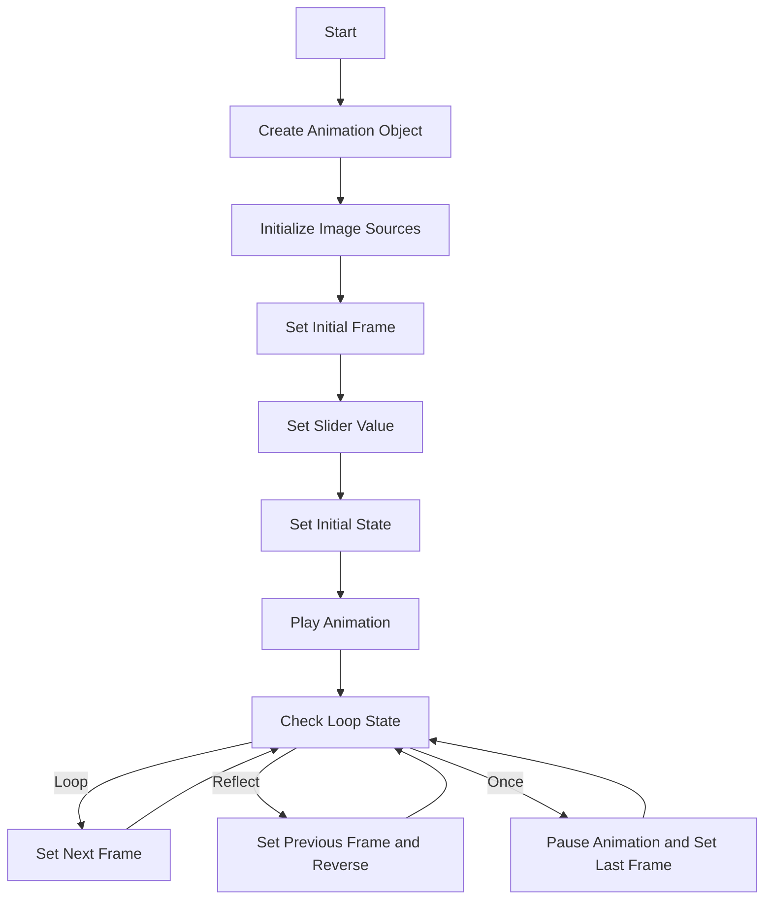
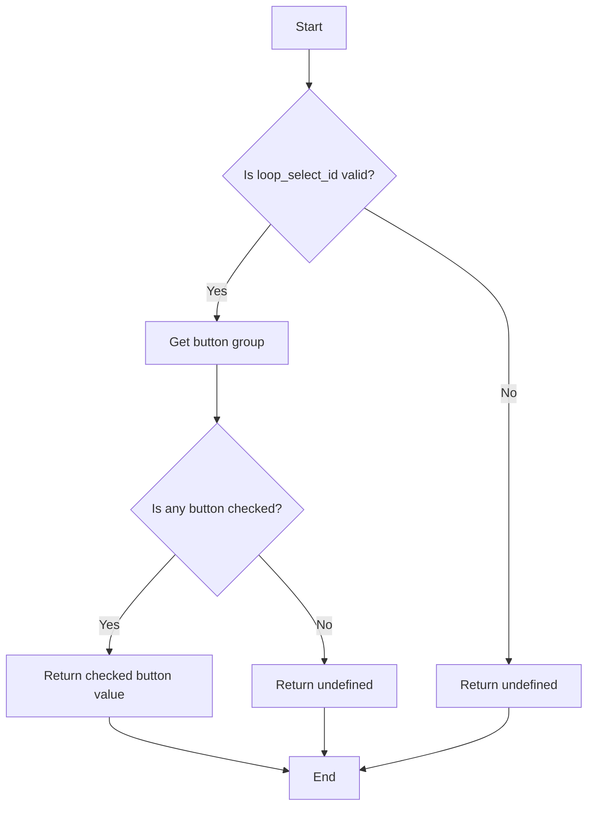
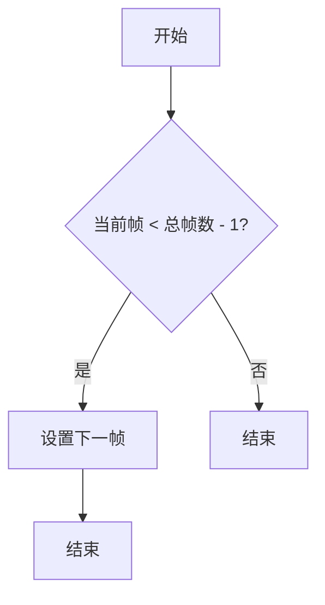
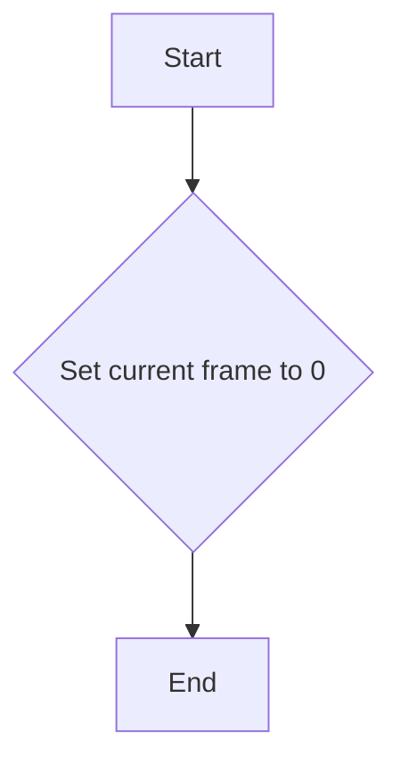
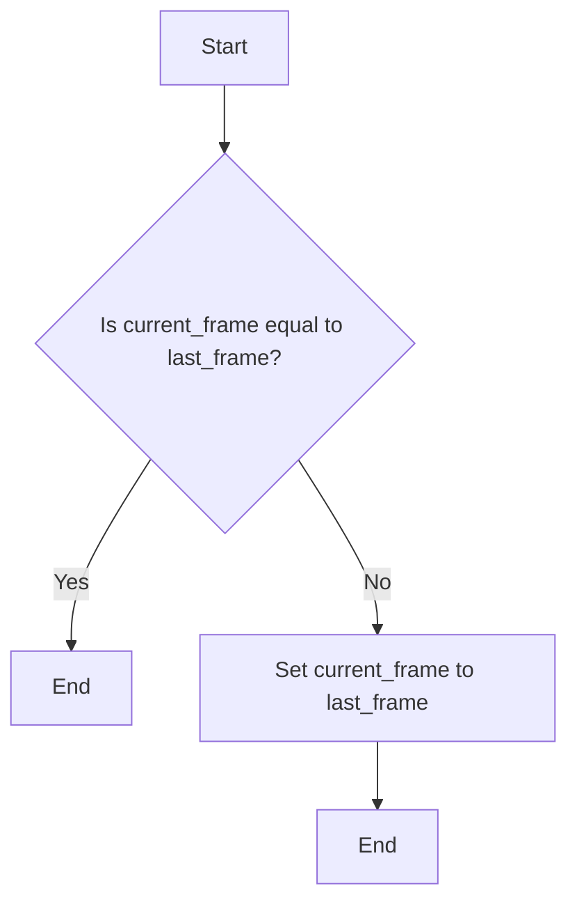
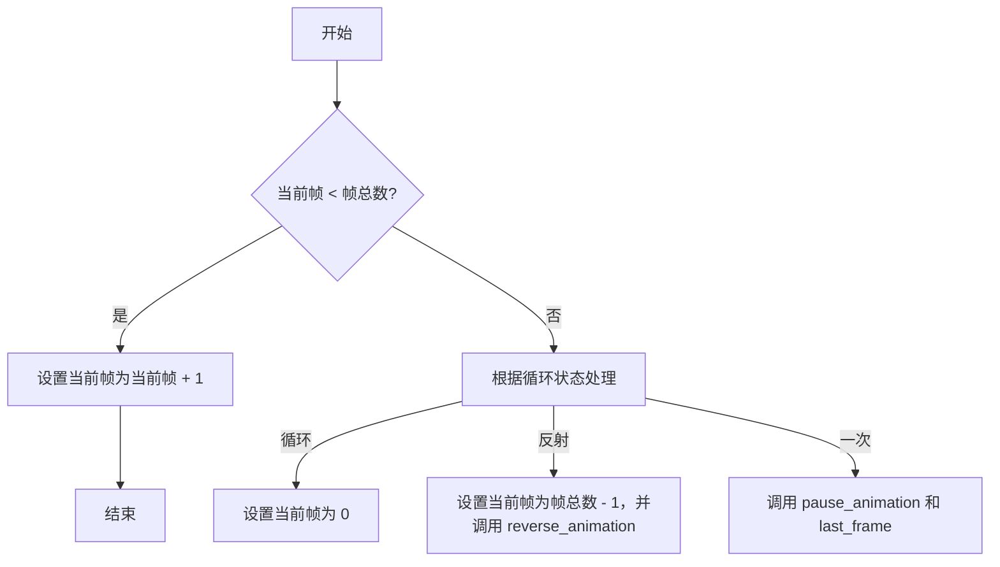
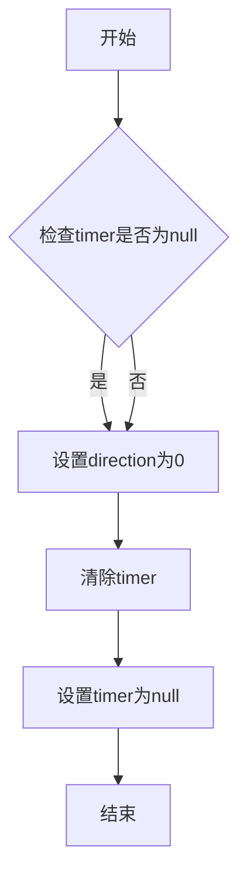
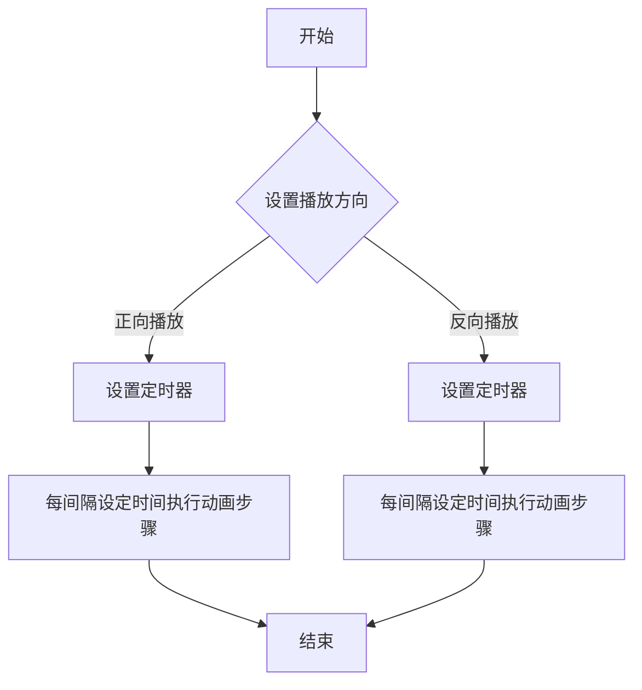
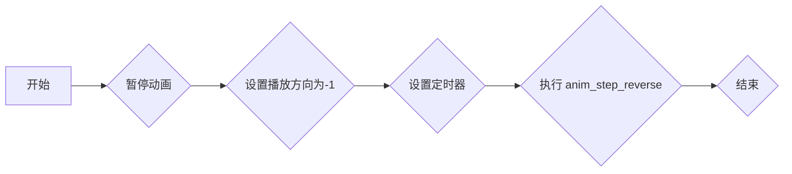

# `matplotlib\lib\matplotlib\_animation_data.py` 详细设计文档

The file defines an Animation class that handles the animation of images using JavaScript. It supports frame-based animations, looping, and speed adjustments.

## 整体流程



## 类结构

```
Animation (主类)
```

## 全局变量及字段


### `JS_INCLUDE`
    
JavaScript template for HTMLWriter

类型：`string`
    


### `STYLE_INCLUDE`
    
Style definitions for the HTML template

类型：`string`
    


### `DISPLAY_TEMPLATE`
    
HTML template for HTMLWriter

类型：`string`
    


### `INCLUDED_FRAMES`
    
Template for including frames in the Animation class

类型：`string`
    


### `Animation.img_id`
    
ID of the image element for the animation

类型：`string`
    


### `Animation.slider_id`
    
ID of the slider element for the animation

类型：`string`
    


### `Animation.loop_select_id`
    
ID of the loop select form element for the animation

类型：`string`
    


### `Animation.interval`
    
Interval in milliseconds for the animation loop

类型：`number`
    


### `Animation.current_frame`
    
Current frame index of the animation

类型：`number`
    


### `Animation.direction`
    
Direction of the animation (1 for forward, -1 for reverse, 0 for paused)

类型：`number`
    


### `Animation.timer`
    
Timer ID for the animation loop

类型：`number`
    


### `Animation.frames`
    
Array of Image objects representing the frames of the animation

类型：`Array<Image>`
    
    

## 全局函数及方法


### isInternetExplorer()

判断当前浏览器是否为 Internet Explorer。

参数：

- 无

返回值：`Boolean`，如果浏览器是 Internet Explorer，则返回 `true`，否则返回 `false`。

#### 流程图

```mermaid
graph TD
    A[Start] --> B{Is "MSIE " in navigator.userAgent?}
    B -- Yes --> C[Return true]
    B -- No --> D{Is "Trident/" in navigator.userAgent?}
    D -- Yes --> C
    D -- No --> E[Return false]
    E --> F[End]
```

#### 带注释源码

```javascript
function isInternetExplorer() {
  ua = navigator.userAgent;
  /* MSIE used to detect old browsers and Trident used to newer ones*/
  return ua.indexOf("MSIE ") > -1 || ua.indexOf("Trident/") > -1;
}
```


### Animation.get_loop_state

获取动画循环状态。

参数：

- 无

返回值：`String`，当前动画的循环状态，可能的值为 "once"、"loop" 或 "reflect"。

#### 流程图



#### 带注释源码

```javascript
Animation.prototype.get_loop_state = function(){
    var button_group = document[this.loop_select_id].state;
    for (var i = 0; i < button_group.length; i++) {
        var button = button_group[i];
        if (button.checked) {
            return button.value;
        }
    }
    return undefined;
}
```


### Animation.set_frame

设置动画的当前帧。

参数：

- `frame`：`Number`，当前帧的索引。

返回值：`void`，无返回值。

#### 流程图

```mermaid
graph TD
    A[开始] --> B{参数 frame 是否有效?}
    B -- 是 --> C[设置 current_frame 为 frame]
    B -- 否 --> D[抛出错误]
    C --> E[设置 img_id 的 src 为 frames[current_frame].src]
    C --> F[设置 slider_id 的 value 为 current_frame]
    E --> G[结束]
    D --> H[结束]
```

#### 带注释源码

```javascript
Animation.prototype.set_frame = function(frame){
    this.current_frame = frame;
    document.getElementById(this.img_id).src =
            this.frames[this.current_frame].src;
    document.getElementById(this.slider_id).value = this.current_frame;
}
```


### Animation.next_frame

`Animation.next_frame` 是 `Animation` 类的一个方法，用于将动画移动到下一帧。

参数：

- 无

返回值：

- 无

#### 流程图



#### 带注释源码

```javascript
Animation.prototype.next_frame = function()
{
  this.set_frame(Math.min(this.frames.length - 1, this.current_frame + 1));
}
``` 


### Animation.previous_frame

`Animation.previous_frame` 是 `Animation` 类的一个方法，用于将当前帧索引减一，并更新显示的帧。

参数：

- 无

返回值：`void`

#### 流程图

```mermaid
graph TD
    A[Start] --> B{Is current_frame > 0?}
    B -- Yes --> C[Set current_frame to current_frame - 1]
    B -- No --> D[Do nothing]
    C --> E[Set image source to frames[current_frame]]
    D --> E
    E --> F[End]
```

#### 带注释源码

```javascript
Animation.prototype.previous_frame = function()
{
    this.set_frame(Math.max(0, this.current_frame - 1));
}
```


### Animation.first_frame

`Animation.first_frame` 方法是 `Animation` 类的一个原型方法，用于将动画的当前帧设置为第一帧。

参数：

- 无

返回值：`void`，没有返回值，仅修改当前帧

#### 流程图



#### 带注释源码

```javascript
Animation.prototype.first_frame = function()
{
    this.set_frame(0); // Set the current frame to the first frame
}
```


### Animation.last_frame

`Animation.last_frame` 方法是 `Animation` 类的一个原型方法，用于将动画的当前帧设置为最后一帧。

参数：

- 无

返回值：`void`，没有返回值，仅修改当前帧

#### 流程图



#### 带注释源码

```javascript
Animation.prototype.last_frame = function()
{
    this.set_frame(this.frames.length - 1);
}
```


### Animation.slower

调整动画播放速度减慢。

参数：

- 无

返回值：无

#### 流程图

```mermaid
graph TD
    A[开始] --> B[获取当前间隔]
    B --> C[将间隔除以0.7]
    C --> D[如果播放方向为正]
    D --> E[调用play_animation()]
    D --> F[结束]
    D --> G[如果播放方向为负]
    G --> H[调用reverse_animation()]
    H --> F
    A --> I[结束]
```

#### 带注释源码

```javascript
Animation.prototype.slower = function()
{
    this.interval /= 0.7; // 将间隔除以0.7
    if(this.direction > 0){this.play_animation();} // 如果播放方向为正，调用play_animation()
    else if(this.direction < 0){this.reverse_animation();} // 如果播放方向为负，调用reverse_animation()
}
```


### Animation.faster

调整动画播放速度，使其更快。

参数：

- 无

返回值：无

#### 流程图

```mermaid
graph LR
A[调用 faster] --> B{更新 interval}
B --> C{判断 direction}
C -- >|direction > 0| D[调用 play_animation]
C -- >|direction < 0| E[调用 reverse_animation]
```

#### 带注释源码

```javascript
Animation.prototype.faster = function() {
  this.interval *= 0.7; // 缩小 interval 值，使动画播放更快
  if(this.direction > 0) { // 如果 direction 为正，表示正向播放
    this.play_animation(); // 调用 play_animation 方法
  } else if(this.direction < 0) { // 如果 direction 为负，表示反向播放
    this.reverse_animation(); // 调用 reverse_animation 方法
  }
}
``` 


### Animation.anim_step_forward

该函数用于将动画的当前帧向前移动一步。

参数：

- 无

返回值：`void`，无返回值

#### 流程图



#### 带注释源码

```javascript
Animation.prototype.anim_step_forward = function()
{
    this.current_frame += 1;
    if(this.current_frame < this.frames.length){
      this.set_frame(this.current_frame);
    }else{
      var loop_state = this.get_loop_state();
      if(loop_state == "loop"){
        this.first_frame();
      }else if(loop_state == "reflect"){
        this.last_frame();
        this.reverse_animation();
      }else{
        this.pause_animation();
        this.last_frame();
      }
    }
}
``` 


### Animation.anim_step_reverse

该函数用于将动画的当前帧向前移动一帧，如果当前帧已经是第一帧，则根据循环模式进行相应的处理。

参数：

- 无

返回值：`void`，无返回值

#### 流程图

```mermaid
graph TD
    A[开始] --> B{当前帧大于0?}
    B -- 是 --> C[当前帧减1]
    B -- 否 --> D{循环模式为"loop"?}
    D -- 是 --> E[设置当前帧为0]
    D -- 否 --> F{循环模式为"reflect"?}
    F -- 是 --> G[设置当前帧为最后一帧，并播放动画]
    F -- 否 --> H[暂停动画，设置当前帧为第一帧]
    C --> I[设置帧]
    E --> I
    G --> I
    H --> I
    I --> J[结束]
```

#### 带注释源码

```javascript
Animation.prototype.anim_step_reverse = function()
{
    this.current_frame -= 1;
    if(this.current_frame >= 0){
        this.set_frame(this.current_frame);
    }else{
        var loop_state = this.get_loop_state();
        if(loop_state == "loop"){
            this.last_frame();
        }else if(loop_state == "reflect"){
            this.first_frame();
            this.play_animation();
        }else{
            this.pause_animation();
            this.first_frame();
        }
    }
}
``` 


### Animation.pause_animation

暂停动画播放。

参数：

- 无

返回值：`void`，无返回值

#### 流程图



#### 带注释源码

```javascript
Animation.prototype.pause_animation = function() {
    this.direction = 0; // 设置动画方向为0，表示暂停
    if (this.timer) { // 如果存在timer
        clearInterval(this.timer); // 清除定时器
        this.timer = null; // 将timer设置为null
    }
}
```


### Animation.play_animation

`Animation.play_animation` 是 `Animation` 类的一个方法，用于开始播放动画。

参数：

- 无

返回值：`undefined`，无返回值

#### 流程图



#### 带注释源码

```javascript
Animation.prototype.play_animation = function()
{
    this.pause_animation(); // 停止当前动画
    this.direction = 1; // 设置播放方向为正向
    var t = this; // 保存当前实例的引用
    if (!this.timer) this.timer = setInterval(function() { // 设置定时器
        t.anim_step_forward(); // 执行动画步骤
    }, this.interval); // 按设定间隔执行
}
``` 


### Animation.reverse_animation

该函数用于暂停动画并反转播放方向，从当前帧开始向后播放。

参数：

- 无

返回值：`无`

#### 流程图



#### 带注释源码

```javascript
Animation.prototype.reverse_animation = function()
{
    this.pause_animation(); // 暂停动画
    this.direction = -1; // 设置播放方向为-1
    var t = this; // 保存当前实例
    if (!this.timer) this.timer = setInterval(function() { // 设置定时器
        t.anim_step_reverse(); // 执行 anim_step_reverse
    }, this.interval);
}
```


## 关键组件


### 张量索引与惰性加载

张量索引与惰性加载是代码中处理图像帧的关键组件，它允许在需要时才加载图像帧，从而优化内存使用和加载时间。

### 反量化支持

反量化支持是代码中用于处理图像帧尺寸转换的组件，它允许将图像帧从一种尺寸转换为另一种尺寸，以适应不同的显示需求。

### 量化策略

量化策略是代码中用于优化图像帧处理性能的组件，它通过减少图像帧的精度来降低计算复杂度，从而提高处理速度。


## 问题及建议


### 已知问题

-   **浏览器兼容性问题**：代码中使用了`navigator.userAgent`来检测IE浏览器，并针对IE浏览器进行了特定的处理。这可能导致代码在不同版本的IE浏览器中表现不一致，同时也可能影响其他浏览器。
-   **代码可读性和维护性**：代码中存在大量的魔法字符串（如`"MSIE"`, `"Trident/"`, `"oninput"`, `"onchange"`等），这些字符串没有明确的注释或说明，增加了代码的可读性和维护性。
-   **全局变量和函数**：代码中使用了全局变量和函数，这可能导致命名冲突和代码难以测试。
-   **错误处理**：代码中没有明确的错误处理机制，例如在加载图片失败时没有提供相应的错误处理。

### 优化建议

-   **使用现代浏览器特性**：尽可能使用现代浏览器的特性，避免对特定浏览器的依赖，以提高代码的兼容性和可维护性。
-   **使用常量或配置文件**：将魔法字符串替换为常量或配置文件，以提高代码的可读性和维护性。
-   **模块化**：将代码分解为更小的模块或函数，以提高代码的可读性和可维护性。
-   **错误处理**：添加错误处理机制，例如在加载图片失败时提供相应的错误提示或回退方案。
-   **代码注释**：添加必要的注释，以提高代码的可读性和可维护性。
-   **性能优化**：考虑使用更高效的数据结构和算法，以提高代码的性能。
-   **单元测试**：编写单元测试，以确保代码的正确性和稳定性。


## 其它


### 设计目标与约束

- 设计目标：实现一个动画播放器，能够播放图片序列，支持播放、暂停、快进、快退、循环播放等功能。
- 约束条件：动画播放器需兼容IE浏览器，使用HTML、CSS和JavaScript实现。

### 错误处理与异常设计

- 错误处理：在初始化动画时，如果图片加载失败，将显示错误信息。
- 异常设计：通过try-catch语句捕获可能出现的异常，并给出相应的提示。

### 数据流与状态机

- 数据流：用户通过操作界面元素（如滑动条、按钮等）来控制动画的播放状态。
- 状态机：动画播放器包含以下状态：播放、暂停、快进、快退、循环播放等。

### 外部依赖与接口契约

- 外部依赖：动画播放器依赖于HTML、CSS和JavaScript。
- 接口契约：动画播放器通过JavaScript接口提供以下方法：
  - `set_frame(frame)`：设置当前帧。
  - `next_frame()`：播放下一帧。
  - `previous_frame()`：播放上一帧。
  - `first_frame()`：播放第一帧。
  - `last_frame()`：播放最后一帧。
  - `slower()`：减慢播放速度。
  - `faster()`：加快播放速度。
  - `pause_animation()`：暂停播放。
  - `play_animation()`：播放动画。
  - `reverse_animation()`：反向播放动画。


    