# `matplotlib\lib\matplotlib\_api\__init__.py` 详细设计文档

This code provides a collection of helper functions for managing the Matplotlib API, primarily for internal use by Matplotlib developers.

## 整体流程

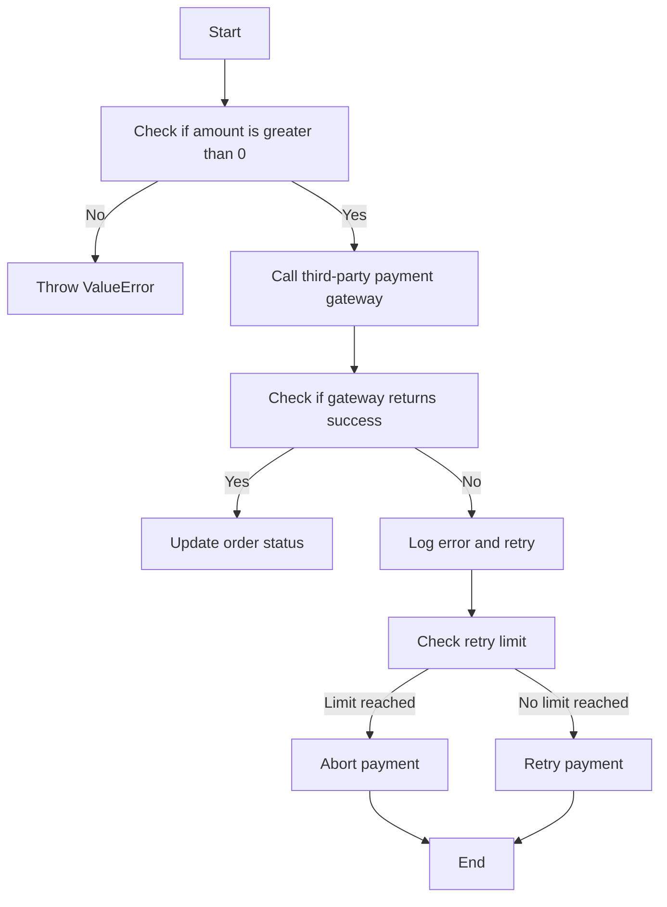

## 类结构

```
HelperFunctions (主类)
├── _Unset (内部类)
├── classproperty (装饰器)
├── check_isinstance (函数)
├── check_in_list (函数)
├── check_shape (函数)
├── getitem_checked (函数)
├── caching_module_getattr (装饰器)
├── define_aliases (装饰器)
├── select_matching_signature (函数)
├── nargs_error (函数)
├── kwarg_error (函数)
├── recursive_subclasses (函数)
└── warn_external (函数)
```

## 全局变量及字段


### `UNSET`
    
A sentinel value for optional arguments, when None cannot be used as default because we need to distinguish between None passed explicitly and parameter not given.

类型：`_Unset`
    


### `classproperty`
    
A class for creating class properties that can be accessed via the class as well as the instance.

类型：`class`
    


### `_fget`
    
The function to get the value of the property.

类型：`function`
    


### `_fset`
    
The function to set the value of the property.

类型：`function`
    


### `_fdel`
    
The function to delete the value of the property.

类型：`function`
    


### `_doc`
    
The documentation string for the property.

类型：`str`
    


### `classproperty._fget`
    
The function to get the value of the property.

类型：`function`
    


### `classproperty._fset`
    
The function to set the value of the property.

类型：`function`
    


### `classproperty._fdel`
    
The function to delete the value of the property.

类型：`function`
    


### `classproperty._doc`
    
The documentation string for the property.

类型：`str`
    
    

## 全局函数及方法


### check_isinstance

For each *key, value* pair in *kwargs*, check that *value* is an instance of one of *types*; if not, raise an appropriate TypeError.

参数：

- `types`：`tuple`，The types to check against.
- `kwargs`：`dict`，The keyword arguments to check.

返回值：`None`，No value is returned, but a TypeError is raised if the check fails.

#### 流程图

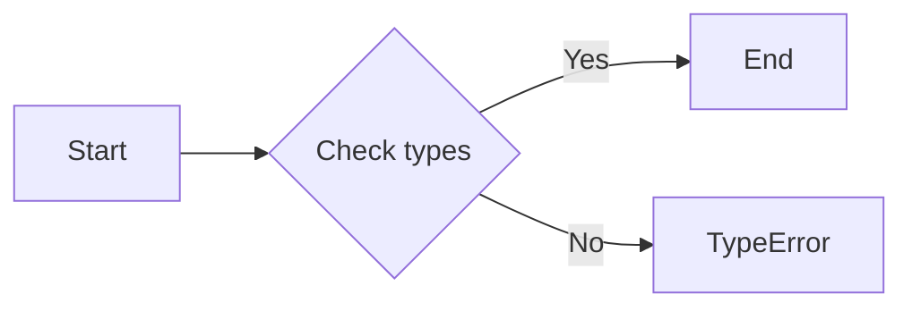

#### 带注释源码

```python
def check_isinstance(types, /, **kwargs):
    """
    For each *key, value* pair in *kwargs*, check that *value* is an instance
    of one of *types*; if not, raise an appropriate TypeError.

    As a special case, a ``None`` entry in *types* is treated as NoneType.

    Examples
    --------
    >>> _api.check_isinstance((SomeClass, None), arg=arg)
    """
    none_type = type(None)
    types = ((types,) if isinstance(types, type) else
             (none_type,) if types is None else
             tuple(none_type if tp is None else tp for tp in types))

    def type_name(tp):
        return ("None" if tp is none_type
                else tp.__qualname__ if tp.__module__ == "builtins"
                else f"{tp.__module__}.{tp.__qualname__}")

    for k, v in kwargs.items():
        if not isinstance(v, types):
            names = [*map(type_name, types)]
            if "None" in names:  # Move it to the end for better wording.
                names.remove("None")
                names.append("None")
            raise TypeError(
                "{!r} must be an instance of {}, not a {}".format(
                    k,
                    ", ".join(names[:-1]) + " or " + names[-1]
                    if len(names) > 1 else names[0],
                    type_name(type(v))))))
```


### check_in_list

检查每个关键字参数的值是否在指定的值列表中。

参数：

- `values`：`iterable`，要检查的值列表。
- `_print_supported_values`：`bool`，默认为True，是否打印支持的值列表。
- `**kwargs`：`dict`，关键字参数，其值需要在`values`中存在。

返回值：无

#### 流程图

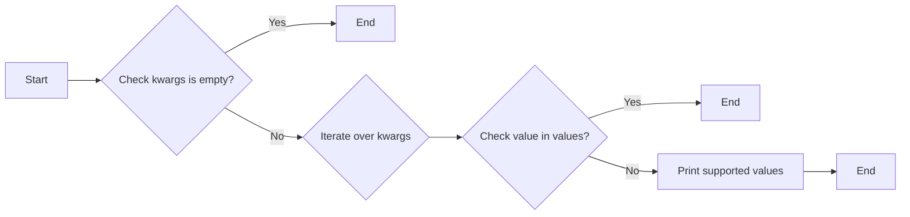

#### 带注释源码

```python
def check_in_list(values, /, *, _print_supported_values=True, **kwargs):
    """
    For each *key, value* pair in *kwargs*, check that *value* is in *values*;
    if not, raise an appropriate ValueError.

    Parameters
    ----------
    values : iterable
        Sequence of values to check on.

        Note: All values must support == comparisons.
        This means in particular the entries must not be numpy arrays.
    _print_supported_values : bool, default: True
        Whether to print *values* when raising ValueError.
    **kwargs : dict
        *key, value* pairs as keyword arguments to find in *values*.

    Raises
    ------
    ValueError
        If any *value* in *kwargs* is not found in *values*.

    Examples
    --------
    >>> _api.check_in_list(["foo", "bar"], arg=arg, other_arg=other_arg)
    """
    if not kwargs:
        raise TypeError("No argument to check!")
    for key, val in kwargs.items():
        try:
            exists = val in values
        except ValueError:
            # `in` internally uses `val == values[i]`. There are some objects
            # that do not support == to arbitrary other objects, in particular
            # numpy arrays.
            # Since such objects are not allowed in values, we can gracefully
            # handle the case that val (typically provided by users) is of such
            # type and directly state it's not in the list instead of letting
            # the individual `val == values[i]` ValueError surface.
            exists = False
        if not exists:
            msg = f"{val!r} is not a valid value for {key}"
            if _print_supported_values:
                msg += f"; supported values are {', '.join(map(repr, values))}"
            raise ValueError(msg)
```


### check_shape

检查每个键值对中的值是否具有指定的形状。

参数：

- `shape`：`tuple`，指定形状的元组，其中 `None` 表示任意长度。
- `**kwargs`：`dict`，包含要检查的键值对，其中键是要检查的变量名，值是要检查的数组。

返回值：无

#### 流程图

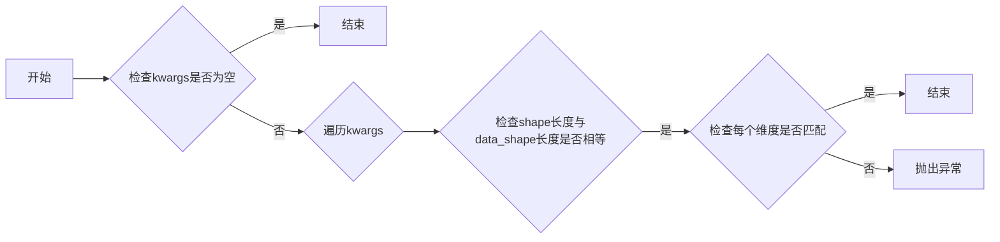

#### 带注释源码

```python
def check_shape(shape, /, **kwargs):
    """
    For each *key, value* pair in *kwargs*, check that *value* has the shape *shape*;
    if not, raise an appropriate ValueError.

    *None* in the shape is treated as a "free" size that can have any length.
    e.g. (None, 2) -> (N, 2)

    The values checked must be numpy arrays.

    Examples
    --------
    To check for (N, 2) shaped arrays

    >>> _api.check_shape((None, 2), arg=arg, other_arg=other_arg)
    """
    for k, v in kwargs.items():
        data_shape = v.shape

        if (len(data_shape) != len(shape)
                or any(s != t and t is not None for s, t in zip(data_shape, shape))):
            dim_labels = iter(itertools.chain(
                'NMLKJIH',
                (f"D{i}" for i in itertools.count())))
            text_shape = ", ".join([str(n) if n is not None else next(dim_labels)
                                    for n in shape[::-1]][::-1])
            if len(shape) == 1:
                text_shape += ","
            raise ValueError(
                f"{k!r} must be {len(shape)}D with shape ({text_shape}), "
                f"but your input has shape {v.shape}"
            )
``` 


### getitem_checked

getitem_checked 函数用于从映射中获取值，如果键不存在则抛出错误。

参数：

- `mapping`：`dict`，映射对象，其中键是字符串，值是任何类型。
- `_error_cls`：`type`，默认为 `ValueError`，用于抛出错误的类。

返回值：`any`，映射中对应键的值。

#### 流程图

```mermaid
graph LR
A[Start] --> B{Is kwargs length 1?}
B -- Yes --> C{Is key in mapping?}
C -- Yes --> D[Return mapping[key]}
C -- No --> E[Find close matches]
E -- Found matches --> F[Construct suggestion]
E -- No matches --> G[Construct suggestion without matches]
F --> H[Construct error message]
G --> H
H --> I[raise _error_cls]
I --> J[End]
```

#### 带注释源码

```python
def getitem_checked(mapping, /, _error_cls=ValueError, **kwargs):
    """
    *kwargs* must consist of a single *key, value* pair.  If *key* is in
    *mapping*, return ``mapping[value]``; else, raise an appropriate
    ValueError.

    Parameters
    ----------
    _error_cls :
        Class of error to raise.

    Examples
    --------
    >>> _api.getitem_checked({"foo": "bar"}, arg=arg)
    """
    if len(kwargs) != 1:
        raise ValueError("getitem_checked takes a single keyword argument")
    (k, v), = kwargs.items()
    try:
        return mapping[v]
    except KeyError:
        if len(mapping) > 5:
            if len(best := difflib.get_close_matches(v, mapping.keys(), cutoff=0.5)):
                suggestion = f"Did you mean one of {best}?"
            else:
                suggestion = ""
        else:
            suggestion = f"Supported values are {', '.join(map(repr, mapping))}"
        raise _error_cls(f"{v!r} is not a valid value for {k}. {suggestion}") from None
```


### caching_module_getattr(cls)

Helper decorator for implementing module-level `__getattr__` as a class.

参数：

- `cls`：`{cls}`，The class that will be used to implement the `__getattr__` method.

返回值：`{__getattr__}`，A function that can be used as the `__getattr__` method for the module.

#### 流程图

```mermaid
graph LR
A[Start] --> B{Is cls named "__getattr__"?}
B -- Yes --> C[Create instance of cls]
B -- No --> D[Error: cls must be named "__getattr__"]
C --> E[Create __getattr__ function]
E --> F[Cache __getattr__ function]
F --> G[Return __getattr__ function]
D --> H[End]
```

#### 带注释源码

```python
def caching_module_getattr(cls):
    """
    Helper decorator for implementing module-level ``__getattr__`` as a class.

    This decorator must be used at the module toplevel as follows::

        @caching_module_getattr
        class __getattr__:  # The class *must* be named ``__getattr__``.
            @property  # Only properties are taken into account.
            def name(self): ...

    The ``__getattr__`` class will be replaced by a ``__getattr__`` function such that trying to access ``name`` on the module will
    resolve the corresponding property (which may be decorated e.g. with
    ``_api.deprecated`` for deprecating module globals).  The properties are
    all implicitly cached.  Moreover, a suitable AttributeError is generated
    and raised if no property with the given name exists.
    """

    assert cls.__name__ == "__getattr__"
    # Don't accidentally export cls dunders.
    props = {name: prop for name, prop in vars(cls).items()
             if isinstance(prop, property)}
    instance = cls()

    @functools.cache
    def __getattr__(name):
        if name in props:
            return props[name].__get__(instance)
        raise AttributeError(
            f"module {cls.__module__!r} has no attribute {name!r}")

    return __getattr__
```


### define_aliases

Class decorator for defining property aliases.

参数：

- `alias_d`：`dict`，A dictionary mapping property names to lists of alias names.

返回值：`class`，The decorated class with property aliases defined.

#### 流程图

```mermaid
graph LR
A[define_aliases] --> B{Is cls None?}
B -- Yes --> C[Return functools.partial(define_aliases, alias_d)]
B -- No --> D[For each prop, aliases in alias_d]
D --> E{Exists getter/setter?}
E -- Yes --> F[For each alias]
F --> G[Define alias method]
G --> H[Set alias_to_prop attribute]
E -- No --> I[ Raise ValueError ]
I --> J[Return decorated class]
```

#### 带注释源码

```python
def define_aliases(alias_d, cls=None):
    """
    Class decorator for defining property aliases.

    Use as ::

        @_api.define_aliases({"property": ["alias", ...], ...})
        class C: ...

    For each property, if the corresponding ``get_property`` is defined in the
    class so far, an alias named ``get_alias`` will be defined; the same will
    be done for setters.  If neither the getter nor the setter exists, an
    exception will be raised.

    The alias map is stored as the ``_alias_to_prop`` attribute under the format
    ``{"alias": "property", ...}`` on the class, and can be used by
    `.normalize_kwargs`.
    """
    if cls is None:  # Return the actual class decorator.
        return functools.partial(define_aliases, alias_d)

    def make_alias(name):  # Enforce a closure over *name*.
        @functools.wraps(getattr(cls, name))
        def method(self, *args, **kwargs):
            return getattr(self, name)(*args, **kwargs)
        return method

    for prop, aliases in alias_d.items():
        exists = False
        for prefix in ["get_", "set_"]:
            if prefix + prop in vars(cls):
                exists = True
                for alias in aliases:
                    method = make_alias(prefix + prop)
                    method.__name__ = prefix + alias
                    method.__doc__ = f"Alias for `{prefix + prop}`."
                    setattr(cls, prefix + alias, method)
        if not exists:
            raise ValueError(
                f"Neither getter nor setter exists for {prop!r}")

    alias_to_prop = {
        alias: prop for prop, aliases in alias_d.items() for alias in aliases}

    def get_aliased_and_aliases(d):
        return {*d.keys(), *d.values()}

    preexisting_aliases = getattr(cls, "_alias_to_prop", {})
    conflicting = (get_aliased_and_aliases(preexisting_aliases)
                   & get_aliased_and_aliases(alias_to_prop))
    if conflicting:
        # Need to decide on conflict resolution policy.
        raise NotImplementedError(
            f"Parent class already defines conflicting aliases: {conflicting}")
    cls._alias_to_prop = {**preexisting_aliases, **alias_to_prop}
    return cls
``` 


### select_matching_signature

Select and call the function that accepts `*args, **kwargs`.

参数：

- `funcs`：`list`，A list of functions which should not raise any exception (other than `TypeError` if the arguments passed do not match their signature).

返回值：`{返回值类型}`，The return value of the selected function.

#### 流程图

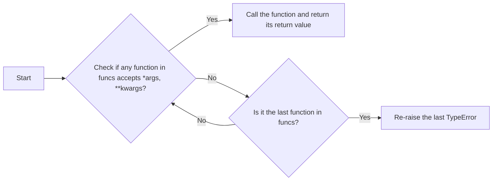

#### 带注释源码

```python
def select_matching_signature(funcs, *args, **kwargs):
    """
    Select and call the function that accepts ``*args, **kwargs``.

    *funcs* is a list of functions which should not raise any exception (other
    than `TypeError` if the arguments passed do not match their signature).

    `select_matching_signature` tries to call each of the functions in *funcs*
    with ``*args, **kwargs`` (in the order in which they are given).  Calls
    that fail with a `TypeError` are silently skipped.  As soon as a call
    succeeds, `select_matching_signature` returns its return value.  If no
    function accepts ``*args, **kwargs``, then the `TypeError` raised by the
    last failing call is re-raised.

    Callers should normally make sure that any ``*args, **kwargs`` can only
    bind a single *func* (to avoid any ambiguity), although this is not checked
    by `select_matching_signature`.

    Notes
    -----
    `select_matching_signature` is intended to help implementing
    signature-overloaded functions.  In general, such functions should be
    avoided, except for back-compatibility concerns.  A typical use pattern is
    ::

        def my_func(*args, **kwargs):
            params = select_matching_signature(
                [lambda old1, old2: locals(), lambda new: locals()],
                *args, **kwargs)
            if "old1" in params:
                warn_deprecated(...)
                old1, old2 = params.values()  # note that locals() is ordered.
            else:
                new, = params.values()
            # do things with params

    which allows *my_func* to be called either with two parameters (*old1* and
    *old2*) or a single one (*new*).  Note that the new signature is given
    last, so that callers get a `TypeError` corresponding to the new signature
    if the arguments they passed in do not match any signature.
    """
    for i, func in enumerate(funcs):
        try:
            return func(*args, **kwargs)
        except TypeError:
            if i == len(funcs) - 1:
                raise
```


### nargs_error(name, takes, given)

Generate a TypeError to be raised by function calls with wrong arity.

参数：

- `name`：`str`，The name of the function that is being called.
- `takes`：`int`，The number of positional arguments the function is expected to take.
- `given`：`int`，The number of positional arguments that were actually given.

返回值：`TypeError`，A TypeError with a message indicating the incorrect number of positional arguments.

#### 流程图

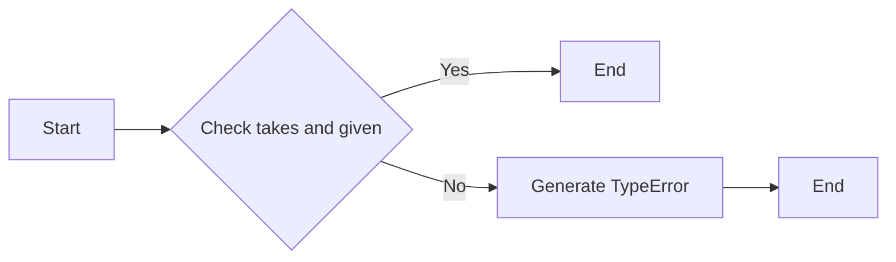

#### 带注释源码

```python
def nargs_error(name, takes, given):
    """Generate a TypeError to be raised by function calls with wrong arity."""
    return TypeError(f"{name}() takes {takes} positional arguments but "
                     f"{given} were given")
```


### kwarg_error

Generate a TypeError to be raised by function calls with wrong kwarg.

参数：

- `name`：`str`，The name of the calling function.
- `kw`：`str` or `Iterable[str]`，The invalid keyword argument name, or an iterable yielding invalid keyword arguments (e.g., a `kwargs` dict).

返回值：`TypeError`，A TypeError to be raised by function calls with wrong kwarg.

#### 流程图

```mermaid
graph LR
A[Start] --> B{Is kw an iterable?}
B -- Yes --> C[Iterate over kw]
B -- No --> C[Set kw to next(iter(kw))]
C --> D[Is kw a string?]
D -- Yes --> E[Return TypeError with message]
D -- No --> C
E --> F[End]
```

#### 带注释源码

```python
def kwarg_error(name, kw):
    """
    Generate a TypeError to be raised by function calls with wrong kwarg.

    Parameters
    ----------
    name : str
        The name of the calling function.
    kw : str or Iterable[str]
        Either the invalid keyword argument name, or an iterable yielding
        invalid keyword arguments (e.g., a `kwargs` dict).

    Returns
    -------
    TypeError
        A TypeError to be raised by function calls with wrong kwarg.
    """
    if not isinstance(kw, str):
        kw = next(iter(kw))
    return TypeError(f"{name}() got an unexpected keyword argument '{kw}'")
```


### recursive_subclasses(cls)

Yield `cls` and direct and indirect subclasses of `cls`.

参数：

- `cls`：`{class}`，The class for which to find subclasses.

返回值：`{generator}`，A generator yielding subclasses of `cls`.

#### 流程图

```mermaid
graph LR
A[Start] --> B{Is cls a class?}
B -- Yes --> C[Yes, yield cls]
B -- No --> D[No, return]
C --> E{Does cls have subclasses?}
E -- Yes --> F[Yes, yield from recursive_subclasses(subcls)]
E -- No --> G[No, return]
F --> E
D --> H[End]
```

#### 带注释源码

```python
def recursive_subclasses(cls):
    """Yield cls and direct and indirect subclasses of cls."""
    yield cls
    for subcls in cls.__subclasses__():
        yield from recursive_subclasses(subcls)
```


### warn_external

`warn_external` 函数是一个包装器，用于调用 `warnings.warn` 函数，并将 `stacklevel` 设置为 "outside Matplotlib"。这允许警告消息的堆栈跟踪显示警告消息的原始位置，而不是 `warnings` 模块的位置。

参数：

- `message`：`str`，警告消息的内容。
- `category`：`Warning` 或其子类，警告的类别，默认为 `None`。

返回值：无

#### 流程图

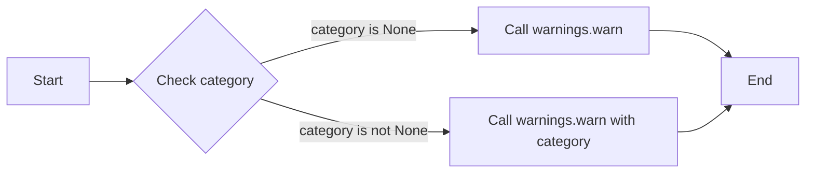

#### 带注释源码

```python
def warn_external(message, category=None):
    """
    `warnings.warn` wrapper that sets *stacklevel* to "outside Matplotlib".

    The original emitter of the warning can be obtained by patching this
    function back to `warnings.warn`, i.e. `_api.warn_external =
    warnings.warn` (or `functools.partial(warnings.warn, stacklevel=2)`,
    etc.).

    Parameters
    ----------
    message : str
        The warning message.
    category : Warning or subclass thereof, optional
        The category of the warning. Defaults to None.

    Returns
    -------
    None
    """
    kwargs = {}
    if sys.version_info[:2] >= (3, 12):
        # Go to Python's `site-packages` or `lib` from an editable install.
        basedir = pathlib.Path(__file__).parents[2]
        kwargs['skip_file_prefixes'] = (str(basedir / 'matplotlib'),
                                        str(basedir / 'mpl_toolkits'))
    else:
        frame = sys._getframe()
        for stacklevel in itertools.count(1):
            if frame is None:
                # when called in embedded context may hit frame is None
                kwargs['stacklevel'] = stacklevel
                break
            if not re.match(r"\A(matplotlib|mpl_toolkits)(\Z|\.(?!tests\.))",
                            # Work around sphinx-gallery not setting __name__.
                            frame.f_globals.get("__name__", "")):
                kwargs['stacklevel'] = stacklevel
                break
            frame = frame.f_back
        # preemptively break reference cycle between locals and the frame
        del frame
    warnings.warn(message, category, **kwargs)
```


### classproperty.__init__

This method initializes a classproperty object, which is used to create class properties that can be accessed via the class itself.

参数：

- `fget`：`Callable[[ClassType], Any]`，The getter function that returns the value of the property.
- `fset`：`Callable[[ClassType, Any], None]`，The setter function that sets the value of the property. This parameter is optional and if not provided, the property cannot be set.
- `fdel`：`Callable[[ClassType], None]`，The deleter function that deletes the value of the property. This parameter is optional and if not provided, the property cannot be deleted.
- `doc`：`str`，The documentation string for the property. This parameter is optional.

返回值：`None`，This method does not return any value.

#### 流程图

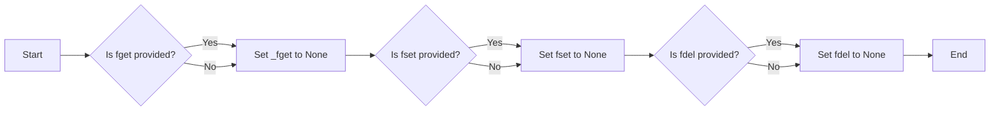

#### 带注释源码

```python
def __init__(self, fget, fset=None, fdel=None, doc=None):
    self._fget = fget
    if fset is not None or fdel is not None:
        raise ValueError('classproperty only implements fget.')
    self.fset = fset
    self.fdel = fdel
    # docs are ignored for now
    self._doc = doc
```


### classproperty.__get__

该函数是一个特殊的方法，用于处理 `classproperty` 类的属性访问。它负责在通过类访问属性时触发属性的获取。

参数：

- `instance`：`None`，表示没有实例被访问，而是通过类访问。

返回值：`{返回值类型}`，{返回值描述}

#### 流程图

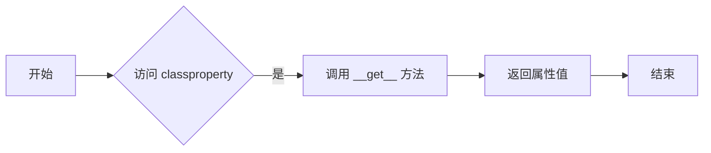

#### 带注释源码

```python
def __get__(self, instance, owner):
    return self._fget(owner)
```

在这个源码中，`__get__` 方法接受三个参数：`self`（当前 `classproperty` 实例），`instance`（被访问的实例，如果有的话），和 `owner`（当前类）。它调用 `_fget` 方法（即属性的获取函数），并将 `owner` 作为参数传递。然后返回 `_fget` 方法的返回值，即属性的值。


### classproperty.fget

`classproperty.fget` 是 `classproperty` 类的一个属性，它返回与该 `classproperty` 关联的获取函数。

参数：

- 无

返回值：`{返回值类型}`，返回与 `classproperty` 关联的获取函数。

#### 流程图

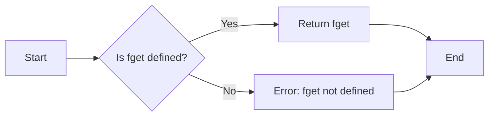

#### 带注释源码

```python
class classproperty:
    """
    Like `property`, but also triggers on access via the class, and it is the
    *class* that's passed as argument.

    Examples
    --------
    ::

        class C:
            @classproperty
            def foo(cls):
                return cls.__name__

        assert C.foo == "C"
    """

    def __init__(self, fget, fset=None, fdel=None, doc=None):
        self._fget = fget
        if fset is not None or fdel is not None:
            raise ValueError('classproperty only implements fget.')
        self.fset = fset
        self.fdel = fdel
        # docs are ignored for now
        self._doc = doc

    def __get__(self, instance, owner):
        return self._fget(owner)

    @property
    def fget(self):
        return self._fget
```


### HelperFunctions.check_isinstance

检查每个 `kwargs` 中的 `value` 是否是 `types` 中指定类型之一的实例。

参数：

- `types`：`type` 或 `tuple`，指定要检查的实例类型。
- `kwargs`：`dict`，包含要检查的键值对。

返回值：无

#### 流程图

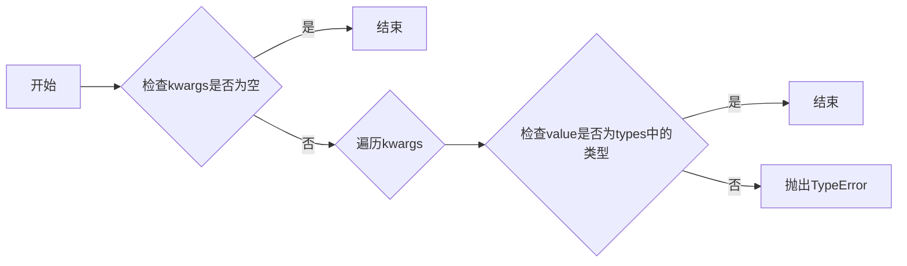

#### 带注释源码

```python
def check_isinstance(types, /, **kwargs):
    """
    For each *key, value* pair in *kwargs*, check that *value* is an instance
    of one of *types*; if not, raise an appropriate TypeError.

    As a special case, a ``None`` entry in *types* is treated as NoneType.

    Examples
    --------
    >>> _api.check_isinstance((SomeClass, None), arg=arg)
    """
    none_type = type(None)
    types = ((types,) if isinstance(types, type) else
             (none_type,) if types is None else
             tuple(none_type if tp is None else tp for tp in types))

    def type_name(tp):
        return ("None" if tp is none_type
                else tp.__qualname__ if tp.__module__ == "builtins"
                else f"{tp.__module__}.{tp.__qualname__}")

    for k, v in kwargs.items():
        if not isinstance(v, types):
            names = [*map(type_name, types)]
            if "None" in names:  # Move it to the end for better wording.
                names.remove("None")
                names.append("None")
            raise TypeError(
                "{!r} must be an instance of {}, not a {}".format(
                    k,
                    ", ".join(names[:-1]) + " or " + names[-1]
                    if len(names) > 1 else names[0],
                    type_name(type(v))))))
``` 


### HelperFunctions.check_in_list

检查每个关键字参数的值是否在指定的值列表中。

参数：

- `values`：`iterable`，要检查的值列表。
- `_print_supported_values`：`bool`，默认为True，是否在抛出`ValueError`时打印支持的值列表。

返回值：无

#### 流程图

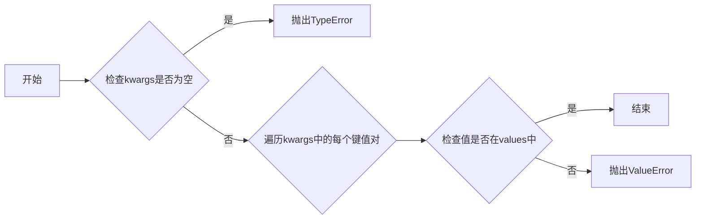

#### 带注释源码

```python
def check_in_list(values, /, *, _print_supported_values=True, **kwargs):
    """
    For each *key, value* pair in *kwargs*, check that *value* is in *values*;
    if not, raise an appropriate ValueError.

    Parameters
    ----------
    values : iterable
        Sequence of values to check on.

        Note: All values must support == comparisons.
        This means in particular the entries must not be numpy arrays.
    _print_supported_values : bool, default: True
        Whether to print *values* when raising ValueError.
    **kwargs : dict
        *key, value* pairs as keyword arguments to find in *values*.

    Raises
    ------
    ValueError
        If any *value* in *kwargs* is not found in *values*.

    Examples
    --------
    >>> _api.check_in_list(["foo", "bar"], arg=arg, other_arg=other_arg)
    """
    if not kwargs:
        raise TypeError("No argument to check!")
    for key, val in kwargs.items():
        try:
            exists = val in values
        except ValueError:
            # `in` internally uses `val == values[i]`. There are some objects
            # that do not support == to arbitrary other objects, in particular
            # numpy arrays.
            # Since such objects are not allowed in values, we can gracefully
            # handle the case that val (typically provided by users) is of such
            # type and directly state it's not in the list instead of letting
            # the individual `val == values[i]` ValueError surface.
            exists = False
        if not exists:
            msg = f"{val!r} is not a valid value for {key}"
            if _print_supported_values:
                msg += f"; supported values are {', '.join(map(repr, values))}"
            raise ValueError(msg)
``` 


### `check_shape`

检查每个键值对中的值是否具有指定的形状。

参数：

- `shape`：`tuple`，指定形状的元组，其中 `None` 表示可以接受任何长度。
- `**kwargs`：`dict`，包含要检查的键值对，其中键是要检查的变量名，值是要检查的数组。

返回值：无

#### 流程图

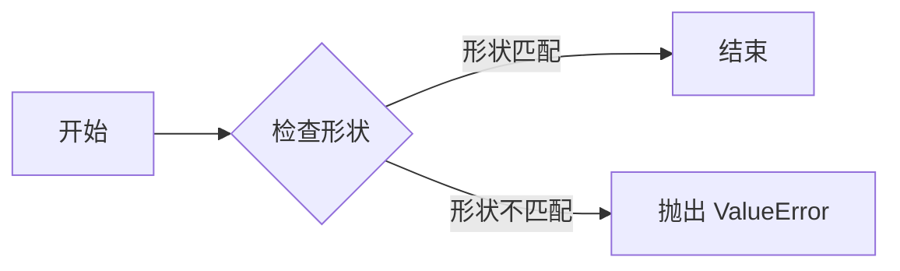

#### 带注释源码

```python
def check_shape(shape, /, **kwargs):
    """
    For each *key, value* pair in *kwargs*, check that *value* has the shape *shape*;
    if not, raise an appropriate ValueError.

    *None* in the shape is treated as a "free" size that can have any length.
    e.g. (None, 2) -> (N, 2)

    The values checked must be numpy arrays.

    Examples
    --------
    To check for (N, 2) shaped arrays

    >>> _api.check_shape((None, 2), arg=arg, other_arg=other_arg)
    """
    for k, v in kwargs.items():
        data_shape = v.shape

        if (len(data_shape) != len(shape)
                or any(s != t and t is not None for s, t in zip(data_shape, shape))):
            dim_labels = iter(itertools.chain(
                'NMLKJIH',
                (f"D{i}" for i in itertools.count())))
            text_shape = ", ".join([str(n) if n is not None else next(dim_labels)
                                    for n in shape[::-1]][::-1])
            if len(shape) == 1:
                text_shape += ","
            raise ValueError(
                f"{k!r} must be {len(shape)}D with shape ({text_shape}), "
                f"but your input has shape {v.shape}"
            )
```


### HelperFunctions.getitem_checked

This function retrieves a value from a mapping based on a key, checking if the key exists in the mapping. If the key is not found, it raises a ValueError with a suggestion for a valid value.

参数：

- `mapping`：`dict`，The mapping from which to retrieve the value.
- `_error_cls`：`type`，The class of error to raise if the key is not found. Default is `ValueError`.

返回值：`Any`，The value associated with the key in the mapping.

#### 流程图

```mermaid
graph LR
A[Start] --> B{Check if len(kwargs) == 1}
B -- Yes --> C[Extract key, value from kwargs]
B -- No --> D[Error: "getitem_checked takes a single keyword argument"]
C --> E{Check if key in mapping}
E -- Yes --> F[Return mapping[value]}
E -- No --> G[Find best matches using difflib.get_close_matches]
G --> H[Error: "getitem_checked: {v!r} is not a valid value for {k}. {suggestion}"]
```

#### 带注释源码

```python
def getitem_checked(mapping, /, _error_cls=ValueError, **kwargs):
    """
    *kwargs* must consist of a single *key, value* pair.  If *key* is in
    *mapping*, return ``mapping[value]``; else, raise an appropriate
    ValueError.

    Parameters
    ----------
    _error_cls :
        Class of error to raise.

    Examples
    --------
    >>> _api.getitem_checked({"foo": "bar"}, arg=arg)
    """
    if len(kwargs) != 1:
        raise ValueError("getitem_checked takes a single keyword argument")
    (k, v), = kwargs.items()
    try:
        return mapping[v]
    except KeyError:
        if len(mapping) > 5:
            if len(best := difflib.get_close_matches(v, mapping.keys(), cutoff=0.5)):
                suggestion = f"Did you mean one of {best}?"
            else:
                suggestion = ""
        else:
            suggestion = f"Supported values are {', '.join(map(repr, mapping))}"
        raise _error_cls(f"{v!r} is not a valid value for {k}. {suggestion}") from None
``` 


### caching_module_getattr(cls)

Helper decorator for implementing module-level `__getattr__` as a class.

参数：

- `cls`：`{cls}`，The class that will be used to implement the `__getattr__` method.

返回值：`{__getattr__}`，A function that can be used as the `__getattr__` method for the module.

#### 流程图

```mermaid
graph LR
A[Start] --> B{Is cls named "__getattr__"?}
B -- Yes --> C[Create instance of cls]
B -- No --> D[Error: cls must be named "__getattr__"]
C --> E[Create __getattr__ function]
E --> F[Cache __getattr__ function]
F --> G[Return __getattr__ function]
D --> H[End]
```

#### 带注释源码

```python
def caching_module_getattr(cls):
    """
    Helper decorator for implementing module-level ``__getattr__`` as a class.

    This decorator must be used at the module toplevel as follows::

        @caching_module_getattr
        class __getattr__:  # The class *must* be named ``__getattr__``.
            @property  # Only properties are taken into account.
            def name(self): ...

    The ``__getattr__`` class will be replaced by a ``__getattr__`` function such that trying to access ``name`` on the module will
    resolve the corresponding property (which may be decorated e.g. with
    ``_api.deprecated`` for deprecating module globals).  The properties are
    all implicitly cached.  Moreover, a suitable AttributeError is generated
    and raised if no property with the given name exists.
    """

    assert cls.__name__ == "__getattr__"
    # Don't accidentally export cls dunders.
    props = {name: prop for name, prop in vars(cls).items()
             if isinstance(prop, property)}
    instance = cls()

    @functools.cache
    def __getattr__(name):
        if name in props:
            return props[name].__get__(instance)
        raise AttributeError(
            f"module {cls.__module__!r} has no attribute {name!r}")

    return __getattr__
```


### HelperFunctions.define_aliases

This function is a class decorator used to define property aliases for a class. It maps aliases to existing properties and creates getter and setter methods for these aliases.

参数：

- `alias_d`：`dict`，A dictionary mapping property names to lists of alias names.
- `cls`：`type`，The class to which the aliases will be applied. If not provided, the function returns a decorator that can be applied to a class.

返回值：`type`，The decorated class with the new aliases defined.

#### 流程图

```mermaid
graph LR
A[Start] --> B{Is cls provided?}
B -- Yes --> C[Apply aliases to cls]
B -- No --> D[Return decorator]
C --> E[For each (prop, aliases) in alias_d]
E --> F{Does prop exist?}
F -- Yes --> G[Create alias methods]
F -- No --> H[Raise ValueError]
G --> I[Set _alias_to_prop attribute]
I --> J[Return cls]
H --> J
D --> J
```

#### 带注释源码

```python
def define_aliases(alias_d, cls=None):
    """
    Class decorator for defining property aliases.

    Use as ::

        @_api.define_aliases({"property": ["alias", ...], ...})
        class C: ...

    For each property, if the corresponding ``get_property`` is defined in the
    class so far, an alias named ``get_alias`` will be defined; the same will
    be done for setters.  If neither the getter nor the setter exists, an
    exception will be raised.

    The alias map is stored as the ``_alias_to_prop`` attribute under the format
    ``{"alias": "property", ...}`` on the class, and can be used by
    `.normalize_kwargs`.
    """
    if cls is None:  # Return the actual class decorator.
        return functools.partial(define_aliases, alias_d)

    def make_alias(name):  # Enforce a closure over *name*.
        @functools.wraps(getattr(cls, name))
        def method(self, *args, **kwargs):
            return getattr(self, name)(*args, **kwargs)
        return method

    for prop, aliases in alias_d.items():
        exists = False
        for prefix in ["get_", "set_"]:
            if prefix + prop in vars(cls):
                exists = True
                for alias in aliases:
                    method = make_alias(prefix + prop)
                    method.__name__ = prefix + alias
                    method.__doc__ = f"Alias for `{prefix + prop}`."
                    setattr(cls, prefix + alias, method)
        if not exists:
            raise ValueError(
                f"Neither getter nor setter exists for {prop!r}")

    alias_to_prop = {
        alias: prop for prop, aliases in alias_d.items() for alias in aliases}

    def get_aliased_and_aliases(d):
        return {*d.keys(), *d.values()}

    preexisting_aliases = getattr(cls, "_alias_to_prop", {})
    conflicting = (get_aliased_and_aliases(preexisting_aliases)
                   & get_aliased_and_aliases(alias_to_prop))
    if conflicting:
        # Need to decide on conflict resolution policy.
        raise NotImplementedError(
            f"Parent class already defines conflicting aliases: {conflicting}")
    cls._alias_to_prop = {**preexisting_aliases, **alias_to_prop}
    return cls
```


### `select_matching_signature(funcs, *args, **kwargs)`

选择并调用接受 `*args, **kwargs` 的函数。

`funcs` 是一个函数列表，这些函数不应引发任何异常（除了 `TypeError`，如果传递的参数与它们的签名不匹配）。

#### 参数

- `funcs`：`list`，要尝试调用的函数列表。
- `*args`：`*args`，传递给函数的任意数量的位置参数。
- `**kwargs`：`**kwargs`，传递给函数的任意数量的关键字参数。

#### 返回值

- `any`，成功调用的函数的返回值。

#### 流程图

```mermaid
graph LR
A[开始] --> B{尝试调用}
B -->|成功| C[返回值]
B -->|失败| D{下一个函数}
D -->|成功| C
D -->|失败| E[抛出异常]
C --> F[结束]
```

#### 带注释源码

```python
def select_matching_signature(funcs, *args, **kwargs):
    """
    Select and call the function that accepts ``*args, **kwargs``.

    *funcs* is a list of functions which should not raise any exception (other
    than `TypeError` if the arguments passed do not match their signature).

    `select_matching_signature` tries to call each of the functions in *funcs*
    with ``*args, **kwargs`` (in the order in which they are given).  Calls
    that fail with a `TypeError` are silently skipped.  As soon as a call
    succeeds, `select_matching_signature` returns its return value.  If no
    function accepts ``*args, **kwargs``，then the `TypeError` raised by the
    last failing call is re-raised.

    Callers should normally make sure that any ``*args, **kwargs`` can only
    bind a single *func* (to avoid any ambiguity), although this is not checked
    by `select_matching_signature`.

    Notes
    -----
    `select_matching_signature` is intended to help implementing
    signature-overloaded functions.  In general, such functions should be
    avoided, except for back-compatibility concerns.  A typical use pattern is
    ::

        def my_func(*args, **kwargs):
            params = select_matching_signature(
                [lambda old1, old2: locals(), lambda new: locals()],
                *args, **kwargs)
            if "old1" in params:
                warn_deprecated(...)
                old1, old2 = params.values()  # note that locals() is ordered.
            else:
                new, = params.values()
            # do things with params

    which allows *my_func* to be called either with two parameters (*old1* and
    *old2*) or a single one (*new*).  Note that the new signature is given
    last, so that callers get a `TypeError` corresponding to the new signature
    if the arguments they passed in do not match any signature.
    """
    for i, func in enumerate(funcs):
        try:
            return func(*args, **kwargs)
        except TypeError:
            if i == len(funcs) - 1:
                raise
```


### nargs_error(name, takes, given)

Generate a TypeError to be raised by function calls with wrong arity.

参数：

- `name`：`str`，The name of the function that is being called.
- `takes`：`int`，The number of positional arguments the function is expected to take.
- `given`：`int`，The number of positional arguments that were actually given.

返回值：`TypeError`，A TypeError with a message indicating the incorrect number of positional arguments.

#### 流程图

```mermaid
graph LR
A[Start] --> B{Check takes and given}
B -->|Yes| C[End]
B -->|No| D[Generate TypeError]
D --> E[End]
```

#### 带注释源码

```python
def nargs_error(name, takes, given):
    """Generate a TypeError to be raised by function calls with wrong arity."""
    return TypeError(f"{name}() takes {takes} positional arguments but "
                     f"{given} were given")
```


### kwarg_error

Generate a TypeError to be raised by function calls with wrong kwarg.

参数：

- `name`：`str`，The name of the calling function.
- `kw`：`str` or `Iterable[str]`，The invalid keyword argument name, or an iterable yielding invalid keyword arguments (e.g., a `kwargs` dict).

返回值：`TypeError`，A TypeError to be raised by function calls with wrong kwarg.

#### 流程图

```mermaid
graph LR
A[Start] --> B{Is kw an iterable?}
B -- Yes --> C[Iterate over kw]
B -- No --> C[Set kw to next(iter(kw))]
C --> D[Is kw a string?]
D -- Yes --> E[Return TypeError with message]
D -- No --> F[Set kw to next(iter(kw))]
F --> E
E --> G[End]
```

#### 带注释源码

```python
def kwarg_error(name, kw):
    """
    Generate a TypeError to be raised by function calls with wrong kwarg.

    Parameters
    ----------
    name : str
        The name of the calling function.
    kw : str or Iterable[str]
        Either the invalid keyword argument name, or an iterable yielding
        invalid keyword arguments (e.g., a `kwargs` dict).

    Returns
    -------
    TypeError
        A TypeError to be raised by function calls with wrong kwarg.
    """
    if not isinstance(kw, str):
        kw = next(iter(kw))
    return TypeError(f"{name}() got an unexpected keyword argument '{kw}'")
```


### recursive_subclasses(cls)

Yield `cls` and direct and indirect subclasses of `cls`.

参数：

- `cls`：`{class}`，The class for which to find subclasses.

返回值：`{generator}`，A generator yielding subclasses of `cls`.

#### 流程图

```mermaid
graph LR
A[Start] --> B{Is cls a class?}
B -- Yes --> C[Yes, yield cls]
B -- No --> D[No, return]
C --> E{Does cls have subclasses?}
E -- Yes --> F[Yes, yield from recursive_subclasses(subcls)]
E -- No --> G[No, return]
F --> E
D --> H[End]
```

#### 带注释源码

```python
def recursive_subclasses(cls):
    """Yield cls and direct and indirect subclasses of cls."""
    yield cls
    for subcls in cls.__subclasses__():
        yield from recursive_subclasses(subcls)
```


### `warn_external(message, category=None)`

`warn_external` 函数是一个包装器，它调用 `warnings.warn` 并设置 `stacklevel` 为 "outside Matplotlib"。这允许警告消息看起来像是从 Matplotlib 之外发出的。

参数：

- `message`：`str`，警告消息的内容。
- `category`：`Warning` 或 `Exception` 的子类，警告的类别，默认为 `None`。

返回值：无

#### 流程图

```mermaid
graph LR
A[Start] --> B{Check category}
B -->|category is None| C[Call warnings.warn]
B -->|category is not None| D[Call warnings.warn with category]
D --> E[End]
```

#### 带注释源码

```python
def warn_external(message, category=None):
    """
    `warnings.warn` wrapper that sets *stacklevel* to "outside Matplotlib".

    The original emitter of the warning can be obtained by patching this
    function back to `warnings.warn`, i.e. `_api.warn_external =
    warnings.warn` (or `functools.partial(warnings.warn, stacklevel=2)`,
    etc.).

    Parameters
    ----------
    message : str
        The warning message.
    category : Warning or Exception subclass, optional
        The category of the warning. Defaults to None.

    Returns
    -------
    None
    """
    kwargs = {}
    if sys.version_info[:2] >= (3, 12):
        # Go to Python's `site-packages` or `lib` from an editable install.
        basedir = pathlib.Path(__file__).parents[2]
        kwargs['skip_file_prefixes'] = (str(basedir / 'matplotlib'),
                                        str(basedir / 'mpl_toolkits'))
    else:
        frame = sys._getframe()
        for stacklevel in itertools.count(1):
            if frame is None:
                # when called in embedded context may hit frame is None
                kwargs['stacklevel'] = stacklevel
                break
            if not re.match(r"\A(matplotlib|mpl_toolkits)(\Z|\.(?!tests\.))",
                            # Work around sphinx-gallery not setting __name__.
                            frame.f_globals.get("__name__", "")):
                kwargs['stacklevel'] = stacklevel
                break
            frame = frame.f_back
        # preemptively break reference cycle between locals and the frame
        del frame
    warnings.warn(message, category, **kwargs)
```


## 关键组件


### 张量索引与惰性加载

张量索引与惰性加载是代码中用于高效处理大型数据集的关键组件。它允许在需要时才计算数据，从而减少内存消耗和提高性能。

### 反量化支持

反量化支持是代码中用于处理量化数据的关键组件。它允许在量化过程中将数据转换回原始精度，以便进行进一步处理。

### 量化策略

量化策略是代码中用于优化模型性能的关键组件。它通过减少模型中使用的数值精度来减少模型大小和计算需求，从而提高模型在资源受限设备上的运行效率。


## 问题及建议


### 已知问题

-   **代码注释不足**：代码中存在大量函数和类，但许多函数和类的注释不够详细，难以理解其具体功能和用途。
-   **全局变量和函数的使用**：代码中使用了全局变量和函数，这可能导致代码难以维护和理解，尤其是在大型项目中。
-   **潜在的性能问题**：代码中使用了递归函数和循环，这可能导致性能问题，尤其是在处理大量数据时。
-   **异常处理**：代码中存在一些异常处理，但可能需要进一步完善，以确保在出现错误时能够提供更清晰的错误信息。

### 优化建议

-   **增加代码注释**：为每个函数和类添加详细的注释，解释其功能和用途，以便其他开发者能够更好地理解代码。
-   **减少全局变量和函数的使用**：尽可能使用局部变量和函数，以减少代码的复杂性和维护难度。
-   **优化性能**：对递归函数和循环进行优化，以减少性能问题。
-   **完善异常处理**：对异常处理进行完善，确保在出现错误时能够提供更清晰的错误信息。
-   **代码重构**：对代码进行重构，以提高代码的可读性和可维护性。
-   **单元测试**：编写单元测试，以确保代码的正确性和稳定性。


## 其它


### 设计目标与约束

- 设计目标：
  - 提供一组辅助函数，用于管理Matplotlib API。
  - 确保Matplotlib API的内部使用，不适用于最终用户。
  - 提供对Matplotlib API的向后兼容性支持。
- 约束：
  - 代码仅供Matplotlib开发者内部使用。
  - API可能在任何时候更改，恕不另行通知。

### 错误处理与异常设计

- 错误处理：
  - 使用`TypeError`和`ValueError`来处理不正确的参数类型和值。
  - 使用`AttributeError`来处理不存在的属性。
  - 使用`warnings.warn`来警告即将弃用的功能。
- 异常设计：
  - 异常信息应清晰、具体，便于开发者诊断问题。
  - 异常应提供足够的信息，包括错误的参数和期望的参数类型。

### 数据流与状态机

- 数据流：
  - 函数接收参数，执行操作，并返回结果。
  - 参数通过函数调用传递，结果通过返回值返回。
- 状态机：
  - 代码中没有明显的状态机，但函数可能根据输入参数执行不同的操作。

### 外部依赖与接口契约

- 外部依赖：
  - Matplotlib库。
  - Python标准库中的`warnings`、`sys`、`re`、`itertools`、`pathlib`等模块。
- 接口契约：
  - 函数和类应遵循明确的接口契约，包括参数类型、返回值类型和异常。
  - 函数和类应提供文档字符串，描述其用途、参数和返回值。

### 安全性

- 安全性：
  - 避免使用可能导致安全漏洞的函数和操作。
  - 对输入参数进行验证，以防止注入攻击。
  - 使用`warnings.warn`来警告即将弃用的功能，以减少潜在的安全风险。

### 性能

- 性能：
  - 优化函数和类，以提高性能。
  - 使用缓存来减少重复计算。
  - 避免不必要的内存分配。

### 可维护性

- 可维护性：
  - 使用清晰的命名和一致的代码风格。
  - 提供详细的文档字符串，描述函数和类的用途。
  - 使用单元测试来验证代码的正确性。

### 可扩展性

- 可扩展性：
  - 设计函数和类，以便将来可以轻松添加新功能。
  - 使用模块化和分层的设计，以便可以替换或扩展特定组件。

### 兼容性

- 兼容性：
  - 保持与Matplotlib库的向后兼容性。
  - 在必要时，提供弃用警告和迁移指南。

### 质量保证

- 质量保证：
  - 使用代码审查和单元测试来确保代码质量。
  - 定期进行代码重构，以提高代码的可读性和可维护性。

### 文档

- 文档：
  - 提供详细的文档字符串，描述函数和类的用途、参数和返回值。
  - 编写用户指南和开发者文档，以帮助用户和开发者理解和使用代码。

### 社区

- 社区：
  - 鼓励社区参与代码的改进和扩展。
  - 提供反馈渠道，以便用户和开发者可以报告问题和提出建议。

### 发布

- 发布：
  - 定期发布代码更新，包括新功能和错误修复。
  - 使用版本控制系统来管理代码变更。
  - 提供安装指南和更新说明。


    