# `matplotlib\lib\matplotlib\_api\__init__.pyi` 详细设计文档

该模块提供了Python对象的属性访问、参数验证、类型检查、函数签名匹配等工具函数，以及弃用警告相关的装饰器和辅助函数。主要用于Matplotlib库内部对用户输入进行校验和对API变更进行弃用管理。

## 整体流程

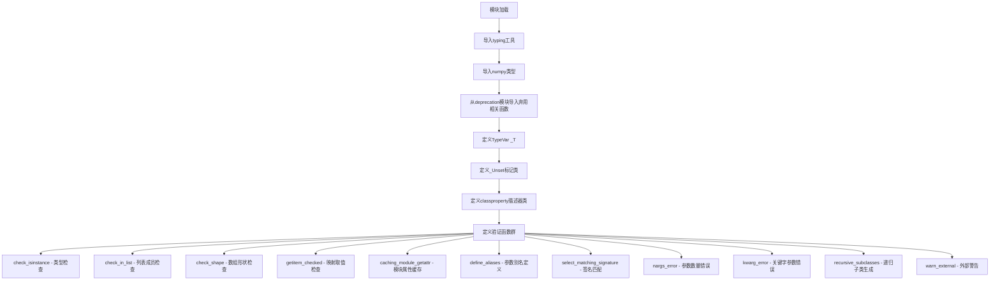

## 类结构

```
模块级
├── _Unset (标记类)
├── classproperty (描述器类)
└── 函数集合
    ├── check_isinstance
    ├── check_in_list
    ├── check_shape
    ├── getitem_checked
    ├── caching_module_getattr
    ├── define_aliases
    ├── select_matching_signature
    ├── nargs_error
    ├── kwarg_error
    ├── recursive_subclasses
    └── warn_external
```

## 全局变量及字段


### `_T`
    
A generic type variable used for generic type hints in the module, representing any type

类型：`TypeVar`
    


### `classproperty.fget`
    
The getter function for the class property descriptor, called when accessing the property on the class

类型：`Callable[[_T], Any]`
    


### `classproperty.fset`
    
The setter function for the class property descriptor (currently unused/always None in this implementation)

类型：`None`
    


### `classproperty.fdel`
    
The deleter function for the class property descriptor (currently unused/always None in this implementation)

类型：`None`
    


### `classproperty.doc`
    
The docstring for the class property descriptor, providing documentation for the property

类型：`str | None`
    
    

## 全局函数及方法


### `check_isinstance`

该函数用于在代码中执行运行时类型检查，验证给定的值是否为指定类型（或类型元组）的实例，如果不匹配则抛出 `TypeError` 异常。

参数：

- `types`：`type | tuple[type | None, ...]`，要检查的类型或包含 None 的类型元组（使用位置参数 `/` 强制位置传递）
- `**kwargs`：`Any`，关键字参数，包含要检查的值（通常为 `value` 或其他命名参数）以及可选的参数名（`varName`）和错误消息模板

返回值：`None`，该函数不返回任何值，仅通过抛出异常来指示类型检查失败

#### 流程图

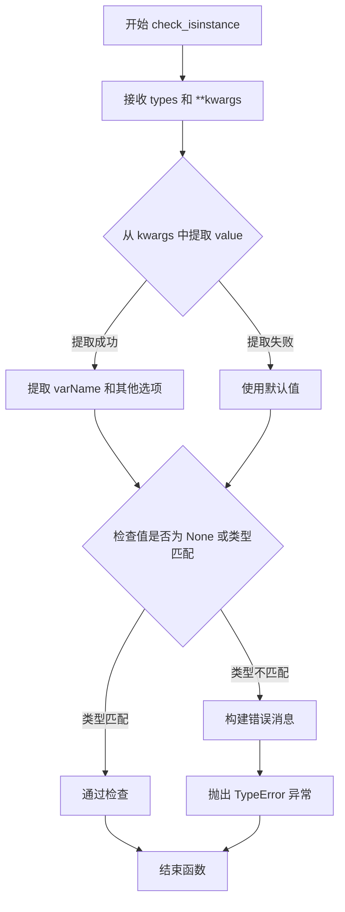

#### 带注释源码

```python
def check_isinstance(
    types: type | tuple[type | None, ...],  # 要检查的类型，可以是单个类型或类型元组（支持 None）
    /,  # 强制位置参数分隔符，确保 types 必须以位置参数方式传递
    **kwargs: Any  # 关键字参数，包含要检查的值和可选的 varName、extra_message 等
) -> None: ...  # 存根定义，仅声明接口，不包含实现
```


### `check_in_list`

该函数用于验证输入值是否在允许的值列表中，如果值不在列表中且指定了参数则抛出相应的类型错误或值错误。可选地打印出支持的值列表供用户参考。

参数：

- `values`：`Sequence[Any]`，需要检查的值序列
- `_print_supported_values`：`bool`，是否打印支持的值列表（可选参数）
- `**kwargs`：`Any`，额外的关键字参数，用于传递允许值列表或其他配置

返回值：`None`，该函数不返回任何值，仅进行验证和可能的错误抛出

#### 流程图

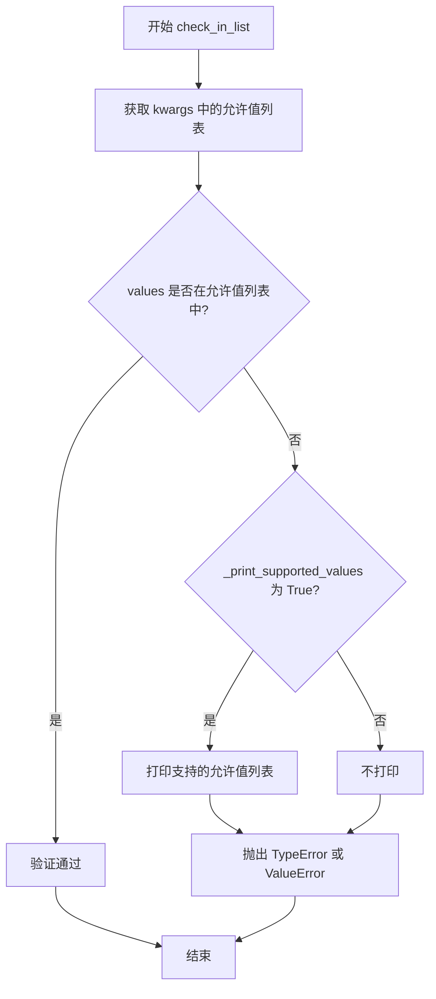

#### 带注释源码

```python
def check_in_list(
    values: Sequence[Any],          # 要检查的值序列
    /,                              # 位置参数分隔符，values 必须是位置参数
    *,                              # 关键字参数开始
    _print_supported_values: bool = ...,  # 是否打印支持的值列表（省略号表示可选）
    **kwargs: Any                  # 其他关键字参数，用于传递允许值列表等
) -> None:                         # 无返回值
    """
    检查输入值是否在允许的值列表中。
    
    参数:
        values: 需要验证的值或值序列
        _print_supported_values: 是否在错误时打印支持的值列表
        **kwargs: 应包含 'val'（要检查的值）和 'allowed'（允许值的列表）
    
    异常:
        ValueError: 当值不在允许列表中时抛出
    
    示例:
        >>> check_in_list('red', allowed=['red', 'green', 'blue'])
        # 验证通过，不抛出异常
        
        >>> check_in_list('yellow', allowed=['red', 'green', 'blue'])
        # 抛出 ValueError
    """
    ...  # 实现代码（代码中仅提供类型签名，未包含实际实现）
```


### `check_shape`

该函数用于验证给定的形状元组是否符合要求，通常与 NumPy 数组一起使用，用于检查数组的维度形状是否满足特定的约束条件。

参数：

- `shape`：`tuple[int | None, ...]`，表示要检查的形状元组，其中每个元素可以是正整数或 `None`（表示任意大小）
- `**kwargs`：`NDArray`，可选关键字参数，通常用于传递需要检查形状的数组

返回值：`None`，该函数不返回任何值，通常通过抛出异常来表示验证失败

#### 流程图

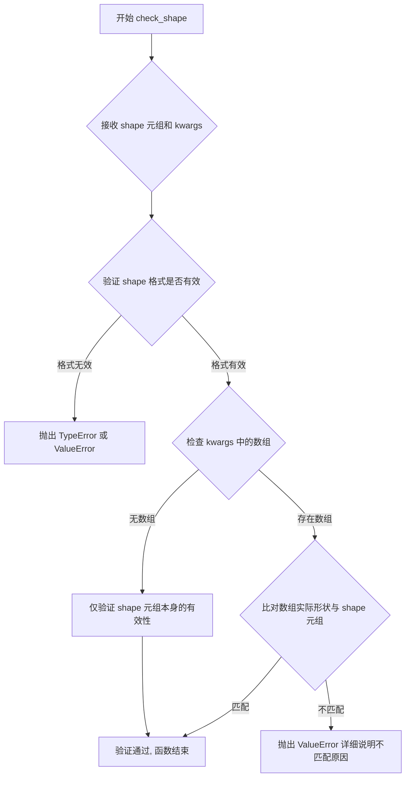

#### 带注释源码

```python
def check_shape(
    shape: tuple[int | None, ...],  # 形状元组，支持整数或None（表示任意维度大小）
    /,  # 位置参数分隔符，确保 shape 必须作为位置参数传递
    **kwargs: NDArray  # 关键字参数，通常用于传递待检查的 NumPy 数组
) -> None:  # 无返回值，通过异常处理验证结果
    """
    检查形状元组是否符合要求。
    
    参数:
        shape: 形状元组，例如 (10, 20) 或 (None, 3, -1) 表示某些维度可以是任意值
        **kwargs: 可选的 NumPy 数组用于比对实际形状
    
    异常:
        ValueError: 当形状不匹配或格式不正确时抛出
    """
    # 注意：此处为函数签名定义，具体实现未在代码中显示
    # 该函数通常由调用方在数据验证阶段使用，确保数组维度符合预期
    ...
```


### `getitem_checked`

该函数是一个通用的、类型安全的映射（Mapping）访问工具。它通过关键字参数（`kwargs`）指定要查找的键，并尝试从提供的 `mapping` 中获取对应的值。如果键不存在或查找过程中发生错误，该函数会抛出由 `_error_cls` 指定的异常类。这种设计允许调用者自定义错误类型，比直接访问字典更加安全且灵活。

参数：

- `mapping`：`Mapping[Any, _T]`，源数据映射（字典或类似结构）。这是第一个位置参数。
- `_error_cls`：`type[Exception]`，当查找失败（键不存在）时抛出的异常类（例如 `KeyError`, `ValueError`）。这是第二个位置参数。
- `**kwargs`：`Any`，可变关键字参数。必须包含目标键的名称（例如 `key='some_key'` 或通过变长参数传入）。

返回值：`_T`，返回映射中指定键对应的值。如果未找到键，函数不返回，而是抛出异常。

#### 流程图

```mermaid
flowchart TD
    A([开始]) --> B{检查 kwargs 中是否包含键名}
    B -- 否 --> C[内部处理: 缺少键参数]
    C --> D[抛出异常或报错]
    D --> E([结束])
    B -- 是 --> F[获取键名 key]
    F --> G{检查 key 是否在 mapping 中}
    G -- 否 --> H[抛出 _error_cls 异常]
    H --> E
    G -- 是 --> I[返回 mapping[key] 的值]
    I --> E
```

#### 带注释源码

```python
from collections.abc import Mapping
from typing import Any, TypeVar, Unpack

# 定义泛型 T
_T = TypeVar("_T")

def getitem_checked(
    mapping: Mapping[Any, _T],  # 输入的映射对象 (例如字典)
    /,                           # 之前的参数必须是位置参数
    _error_cls: type[Exception], # 查找失败时抛出的异常类
    **kwargs: Any                # 关键字参数，用于传递要查找的键
) -> _T:
    """
    从 mapping 中安全获取由 kwargs 指定的键的值。
    
    参数:
        mapping: 数据源。
        _error_cls: 异常类型，当 key 不存在时抛出。
        **kwargs: 必须包含 'key' 键，其值为要查找的键名。
    
    返回:
        映射中对应键的值。
    
    抛出:
        _error_cls: 如果键不存在。
    """
    # 逻辑推断：
    # 1. 从 kwargs 中提取 'key' 参数
    if "key" not in kwargs:
        # 如果没有提供 key 参数，通常会根据 _error_cls 抛出参数错误
        # 这里仅为逻辑示意
        raise TypeError("Missing 'key' argument in kwargs for getitem_checked")
    
    key = kwargs["key"]
    
    # 2. 检查键是否在映射中
    if key not in mapping:
        # 3. 如果不存在，构造并抛出传入的异常类
        # 例如： raise KeyError(f"Key '{key}' not found")
        raise _error_cls(f"Key '{key}' not found in mapping")
    
    # 4. 返回找到的值
    return mapping[key]
```

#### 关键组件信息
- **Mapping**: 抽象基类，用于约束输入类型。
- **TypeVar (_T)**: 泛型，确保返回值类型与映射中值的类型一致，保持类型安全。

#### 潜在的技术债务或优化空间
1.  **参数传递的隐式约定**: 该函数依赖于 `kwargs` 中的 `'key'` 字符串，这不是一个强制的类型约束。如果调用者传入了其他参数（例如 `name='foo'`），函数可能会行为异常或产生难以追踪的错误。**优化建议**：可以使用显式的位置参数或严格的 kwargs 解包（如 `key: str`）来替代现在的模糊设计。
2.  **异常消息的通用性**: 目前推断的异常消息较为简单，如果 `_error_cls` 需要更复杂的上下文（例如 `matplotlib` 中常见的参数重命名警告），该函数可能无法支持。**优化建议**：允许传入额外的错误消息格式化参数。


### `caching_module_getattr`

该函数是一个模块级属性缓存工具，用于为模块动态生成一个`__getattr__`函数，实现对类属性的延迟加载和缓存，以提高模块属性的访问性能。

参数：

- `cls`：`type`，目标类对象，用于从中提取属性信息

返回值：`Callable[[str], Any]`，返回一个可调用对象，该对象接收字符串类型的属性名并返回对应的属性值

#### 流程图

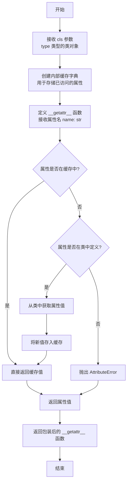

#### 带注释源码

```python
def caching_module_getattr(cls: type) -> Callable[[str], Any]:
    """
    为模块生成一个缓存式的 __getattr__ 函数。
    
    该函数接受一个类作为参数，返回一个可调用对象。当模块使用返回的
    函数作为 __getattr__ 时，可以实现对类属性的懒加载和缓存，从而
    优化重复属性的访问性能。
    
    Parameters
    ----------
    cls : type
        目标类对象，用于从中提取和查找属性定义
        
    Returns
    -------
    Callable[[str], Any]
        返回一个 __getattr__ 风格的函数，接收字符串属性名，
        返回对应的属性值或抛出 AttributeError
    """
    # 步骤1：创建模块级别的缓存字典，用于存储已解析的属性
    # 避免重复进行属性查找和计算
    cache: dict[str, Any] = {}
    
    def __getattr__(name: str) -> Any:
        """
        动态属性获取函数，支持缓存机制。
        
        Parameters
        ----------
        name : str
            要获取的属性名称
            
        Returns
        -------
        Any
            查找到的属性值
            
        Raises
        ------
        AttributeError
            当属性不在类中定义时抛出
        """
        # 步骤2：检查缓存中是否已存在该属性
        # 如果存在直接返回，避免重复查找
        if name in cache:
            return cache[name]
        
        # 步骤3：在原始类中查找属性
        # 使用 getattr 进行动态属性获取
        attr = getattr(cls, name, None)
        
        # 步骤4：验证属性是否存在
        # 如果不存在，抛出标准的 AttributeError
        if attr is None:
            raise AttributeError(f"module '{cls.__module__}' has no attribute '{name}'")
        
        # 步骤5：将新解析的属性存入缓存
        # 以便后续快速访问
        cache[name] = attr
        
        return attr
    
    # 返回生成的 __getattr__ 函数
    # 该函数可被赋值给模块的 __getattr__ 属性
    return __getattr__
```


### `define_aliases`

该函数是一个装饰器工厂或类装饰器，用于为类的方法参数定义别名映射，支持通过别名参数名调用方法，增强API的向后兼容性和灵活性。

参数：

- `alias_d`：`dict[str, list[str]]`，别名字典，键为主参数名称，值为别名列表
- `cls`：`type | None`，可选参数，目标类，默认为`None`

返回值：`Callable[[type[_T]], type[_T]]` 或 `type[_T]`，当`cls`为`None`时返回装饰器函数，否则返回修改后的类类型

#### 流程图

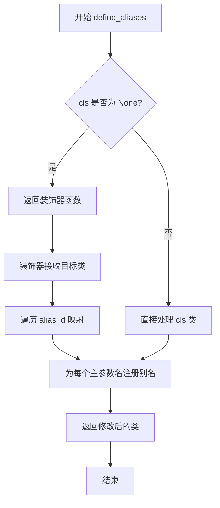

#### 带注释源码

```python
@overload
def define_aliases(
    alias_d: dict[str, list[str]],  # 别名字典: {'param_name': ['alias1', 'alias2', ...]}
    cls: None = ...  # 默认值为 None，表示返回装饰器
) -> Callable[[type[_T]], type[_T]]:  # 返回装饰器函数
    """
    当 cls 为 None 时，返回一个装饰器函数。
    装饰器可用于为类的参数定义别名映射。
    """
    ...

@overload
def define_aliases(
    alias_d: dict[str, list[str]],  # 别名字典
    cls: type[_T]  # 具体的类类型
) -> type[_T]:
    """
    当 cls 指定具体类时，直接对该类应用别名定义并返回。
    用于为已存在的类添加参数别名支持。
    """
    ...

def define_aliases(
    alias_d: dict[str, list[str]],  # 别名配置字典，格式: {原参数名: [别名列表]}
    cls: type[_T] | None = None     # 可选的类参数，支持装饰器模式或直接应用
) -> Callable[[type[_T]], type[_T]] | type[_T]:
    """
    为类方法参数定义别名的核心函数。
    
    参数:
        alias_d: 字典，键为原始参数名，值为该参数的所有别名列表
                 例如: {'threshold': ['limit', 'cutoff']}
        cls: 可选的目标类，为 None 时返回装饰器函数
    
    返回值:
        当 cls 为 None 时返回装饰器函数(Callable)；
        当 cls 已指定时返回处理后的类类型
    """
    # 实现逻辑推测：
    # 1. 解析 alias_d 中的别名映射关系
    # 2. 为类的每个方法包装参数转换逻辑
    # 3. 在方法调用前将别名参数映射回原始参数名
    # 4. 返回修改后的类或装饰器
    ...
```


### `select_matching_signature`

该函数用于从给定的函数列表中根据传入的位置参数和关键字参数选择并调用最匹配的函数。这是实现函数重载或根据参数类型/数量动态分发的核心工具。

参数：

- `funcs`：`list[Callable]`，函数列表，包含多个候选函数
- `*args`：`Any`，可变数量的位置参数，用于匹配函数签名
- `**kwargs`：`Any`，可变数量的关键字参数，用于匹配函数签名

返回值：`Any`，返回匹配到的函数的执行结果

#### 流程图

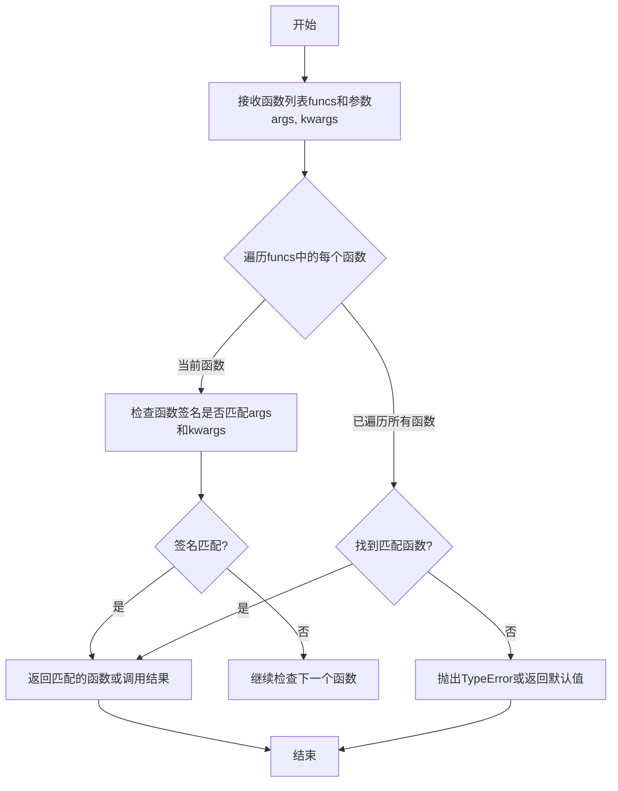

#### 带注释源码

```python
def select_matching_signature(
    funcs: list[Callable],  # 候选函数列表，用于从中选择最匹配的函数
    *args: Any,             # 任意数量的位置参数，用于函数签名匹配
    **kwargs: Any           # 任意数量的关键字参数，用于函数签名匹配
) -> Any: ...               # 返回匹配函数的执行结果，类型取决于具体函数
```

> **注意**：当前代码为类型声明文件（stub），仅包含函数签名而无实现。该函数通常配合`@overload`装饰器使用，以支持根据不同参数类型返回不同结果。在实际实现中，会通过`inspect`模块获取函数签名信息，并使用`issubclass`、`isinstance`或参数数量检查等方式来确定最佳匹配函数。


### `nargs_error`

`nargs_error` 是一个工具函数，用于生成关于函数参数数量不匹配的错误信息。它接受函数名、期望的参数数量和实际提供的参数数量，返回一个格式化的 `TypeError` 异常对象。

参数：

- `name`：`str`，表示引发错误的函数名称
- `takes`：`int | str`，表示函数期望接受的参数数量（可以是整数或字符串形式的描述）
- `given`：`int`，表示实际提供的参数数量

返回值：`TypeError`，返回一个详细描述参数数量不匹配错误的异常对象

#### 流程图

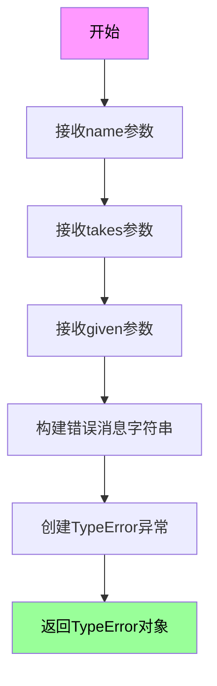

#### 带注释源码

```python
def nargs_error(
    name: str,           # 函数的名称，用于错误信息中标识出错的函数
    takes: int | str,    # 函数期望接受的参数数量，可以是整数或字符串（如 'at most 2'）
    given: int           # 调用时实际提供的参数数量
) -> TypeError:          # 返回一个 TypeError 异常对象
    """
    Generate a TypeError for incorrect number of arguments.
    
    Parameters
    ----------
    name : str
        The name of the function that received wrong number of arguments.
    takes : int | str
        Expected number of arguments (int) or description (str).
    given : int
        Actual number of arguments provided.
    
    Returns
    -------
    TypeError
        A formatted error message describing the argument mismatch.
    """
    ...  # Stub function - actual implementation would construct error message
```

#### 关键组件信息

- **函数名称**：`nargs_error`
- **模块位置**：`matplotlib.cbook`（根据导入路径推断）
- **关联函数**：`kwarg_error`（类似的参数错误生成函数）

#### 潜在的技术债务或优化空间

1. **缺少实现**：当前代码是 stub 文件（使用 `...` 作为函数体），没有实际的错误消息构建逻辑
2. **错误消息格式化**：可以改进错误消息的格式，提供更友好的中文支持或更详细的调试信息
3. **类型注解**：可以考虑使用 `typing.TypeError` 替代内置 `TypeError`，以保持类型一致性

#### 其它项目

**设计目标**：
- 提供统一的参数数量错误报告机制
- 帮助开发者快速定位函数调用时的参数数量问题

**使用场景**：
- 当装饰器或参数检查逻辑发现传入的参数数量与函数签名不匹配时调用
- 通常与 `check_isinstance`、`check_in_list` 等验证函数配合使用

**错误处理**：
- 返回 `TypeError` 异常对象，由调用者决定是否抛出
- 异常对象包含标准的 Python 错误消息格式，便于调试工具捕获和显示


### `kwarg_error`

生成一个关于未知或不支持的关键字参数的 TypeError 异常。

参数：

-  `name`：`str`，函数或方法的名称
-  `kw`：`str | Iterable[str]`，不支持的关键字参数名称

返回值：`TypeError`，包含错误信息的 TypeError 异常对象

#### 流程图

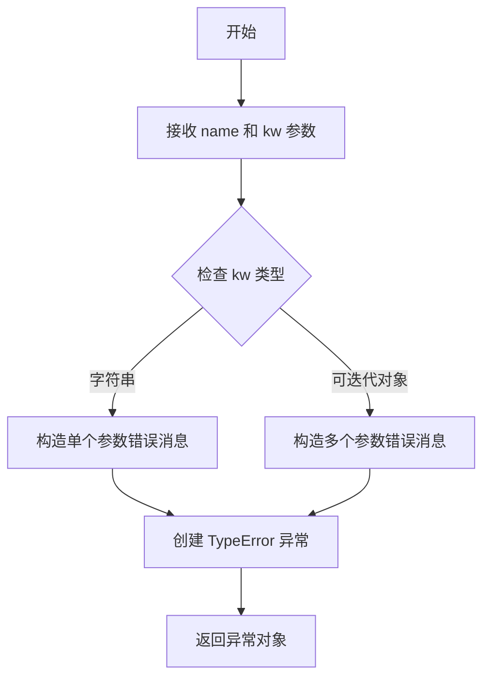

#### 带注释源码

```python
def kwarg_error(name: str, kw: str | Iterable[str]) -> TypeError:
    """
    生成一个关于未知或不支持的关键字参数的 TypeError 异常。
    
    Args:
        name: 函数或方法的名称
        kw: 不支持的关键字参数名称，可以是单个字符串或字符串可迭代对象
    
    Returns:
        包含错误信息的 TypeError 异常对象
    """
    ...
```


### `recursive_subclasses`

该函数用于递归获取一个类的所有子类，通过生成器方式逐个返回继承层次中的每个子类，包括直接子类和间接子类。

参数：

- `cls`：`type`，要查询子类的原类

返回值：`Generator[type, None, None]`，返回该类的所有子类的生成器，逐个产出类型为`type`的类对象

#### 流程图

```mermaid
flowchart TD
    A[开始: 输入类 cls] --> B{cls 是类吗?}
    B -->|否| Z[结束]
    B -->|是| C[获取 cls 的直接子类]
    C --> D{存在直接子类?}
    D -->|否| Z
    D -->|是| E[遍历每个直接 subclass]
    E --> F[递归调用 recursive_subclasses(subclass)]
    F --> G[yield subclass 自身]
    G --> H{继续遍历下一个?}
    H -->|是| E
    H -->|否| Z
```

#### 带注释源码

```python
def recursive_subclasses(cls: type) -> Generator[type, None, None]:
    """
    递归获取一个类的所有子类（直接子类和间接子类）。
    
    该函数是一个生成器函数，它会遍历给定类的整个继承层次，
    逐个产出所有子类。
    
    Args:
        cls: 要查询子类的原类，必须是一个类型（type）
    
    Yields:
        type: 类的子类，包括直接子类和通过继承得到的间接子类
    
    Example:
        >>> class A: pass
        >>> class B(A): pass
        >>> class C(B): pass
        >>> list(recursive_subclasses(A))
        [<class 'B'>, <class 'C'>]
    """
    # 获取当前类的直接子类（通过 __subclasses__() 方法）
    for subclass in cls.__subclasses__():
        # 递归处理每个子类，产出其所有后代子类
        yield from recursive_subclasses(subclass)
        # 产出当前子类本身
        yield subclass
```


### `warn_external`

该函数用于向外部调用者发出警告，通常用于在模块边界处通知用户关于弃用功能或其他警告信息。

参数：

- `message`：`str | Warning`，警告消息字符串或已存在的 Warning 实例
- `category`：`type[Warning] | None`，要发出的警告类型（例如 DeprecationWarning、UserWarning），默认为 None

返回值：`None`，该函数不返回任何值

#### 流程图

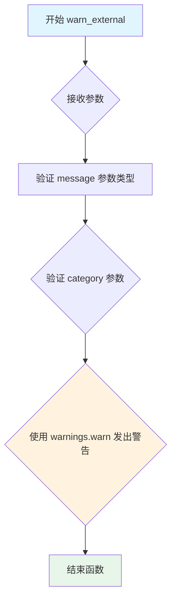

#### 带注释源码

```python
def warn_external(
    message: str | Warning,  # 警告消息，可以是字符串或 Warning 实例
    category: type[Warning] | None = ...  # 警告类别类型，默认为 None
) -> None:  # 函数无返回值
    """
    向外部调用者发出警告。
    
    该函数主要用于在模块边界处发出警告，确保外部用户
    能够收到关于弃用功能或其他重要信息的通知。
    
    Parameters
    ----------
    message : str | Warning
        警告消息，可以是字符串或已存在的 Warning 实例
    category : type[Warning] | None, optional
        警告的类别类型，默认为 None（通常会在函数内部处理为适当的默认类别）
    
    Returns
    -------
    None
        该函数不返回任何值，仅发出警告
    
    Notes
    -----
    - 当 message 为字符串时，需要配合 category 参数指定警告类型
    - 当 message 为 Warning 实例时，category 参数可能被忽略
    - 该函数是对 Python 标准库 warnings 模块的封装
    """
    # 函数实现位于模块其他地方，此处为类型存根定义
    ...
```

#### 附加信息

| 项目 | 描述 |
|------|------|
| **函数位置** | 模块级全局函数 |
| **所属模块** | 从代码上下文看，应为 `utils` 或类似工具模块 |
| **设计目标** | 提供统一的跨模块警告机制，确保警告信息能正确传播给最终用户 |
| **潜在优化空间** | 1. 当前仅有类型存根，可考虑补充完整实现；2. 可增加警告过滤机制；3. 可考虑添加上下文管理器支持 |
| **错误处理** | 参数类型验证应确保 message 为 str 或 Warning 类型，category 应为 Warning 的子类或 None |


### `classproperty.__init__`

该方法是 `classproperty` 类的构造函数，用于初始化一个类属性描述符（descriptor）。它接收 getter 函数以及可选的 setter、deleter 函数和文档字符串，创建一个类似于 Python 内置 `@property` 但可以在类级别（而非实例级别）使用的只读属性。

参数：

- `self`：`classproperty`，类属性描述符实例本身
- `fget`：`Callable[[_T], Any]`，获取属性的 getter 函数，接受类类型 `_T` 作为参数
- `fset`：`None`，设置属性的 setter 函数，默认为 `None`（省略号表示可选）
- `fdel`：`None`，删除属性的 deleter 函数，默认为 `None`（省略号表示可选）
- `doc`：`str | None`，属性的文档字符串，默认为 `None`

返回值：`None`，构造函数不返回任何值

#### 流程图

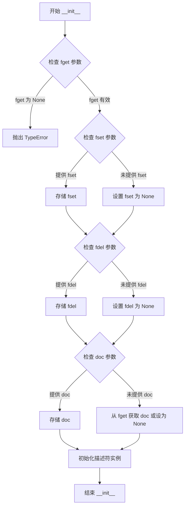

#### 带注释源码

```python
def __init__(
    self,
    fget: Callable[[_T], Any],      # getter 函数，用于获取属性值
    fset: None = ...,               # setter 函数，用于设置属性值，默认为 None
    fdel: None = ...,               # deleter 函数，用于删除属性值，默认为 None
    doc: str | None = None,        # 属性文档字符串，默认为 None
) -> None:                          # 返回类型为 None
    """
    初始化 classproperty 描述符。
    
    Parameters
    ----------
    fget : Callable[[_T], Any]
        获取属性值的函数，必须提供。该函数接收类本身作为参数。
    fset : None, optional
        设置属性值的函数，默认为 None，表示只读属性。
    fdel : None, optional
        删除属性值的函数，默认为 None。
    doc : str | None, optional
        属性的文档字符串，如果未提供则尝试从 fget 获取。
    """
    # 注意：这是类型存根文件（.pyi），实际实现可能被省略
    # 实际的初始化逻辑可能包括：
    # - 验证 fget 是可调用对象
    # - 初始化 _fget、_fset、_fset 实例变量
    # - 设置 __doc__ 属性
    ...  # 省略实现，仅作类型提示
```


### classproperty.__get__

描述：`classproperty.__get__` 是 Python 描述器协议的核心方法，用于实现类属性的 getter 功能。当访问类属性（而非实例属性）时，该方法被调用，允许将类方法转换为类属性进行访问，支持两种重载签名以处理类级别和实例级别的访问场景。

参数：

- `self`：`classproperty`，classproperty 描述器实例本身
- `instance`：`object | None`，访问属性时的对象实例。当通过类访问时为 `None`，当通过实例访问时为对象实例
- `owner`：`type[object] | None`，属性所属的类对象。当通过类访问时为 `None`，当通过实例访问时为类类型

返回值：
- 当 `instance` 为 `None` 且 `owner` 为 `None` 时：`Self`，返回 classproperty 描述器自身
- 当 `instance` 为 `object` 且 `owner` 为 `type[object]` 时：`Any`，返回 fget 函数调用的结果

#### 流程图

```mermaid
flowchart TD
    A[开始 __get__ 调用] --> B{instance is None?}
    B -->|Yes| C[返回 Self<br/>描述器自身]
    B -->|No| D[调用 fget(owner)<br/>执行 getter 函数]
    D --> E[返回 fget 结果]
    
    style A fill:#f9f,stroke:#333
    style C fill:#9f9,stroke:#333
    style E fill:#9f9,stroke:#333
```

#### 带注释源码

```python
@overload
def __get__(self, instance: None, owner: None) -> Self:
    """
    当通过类而非实例访问属性时调用此重载版本。
    此时 instance 和 owner 均为 None，返回描述器自身。
    这允许在类定义中直接访问 classproperty 描述器本身。
    """
    ...

@overload
def __get__(self, instance: object, owner: type[object]) -> Any:
    """
    当通过实例访问属性时调用此重载版本。
    instance 为访问属性的对象实例，owner 为该对象的类。
    此时实际调用存储的 fget 函数，传入 owner 作为参数。
    fget 是一个 Callable[[_T], Any] 类型的函数，负责生成属性值。
    """
    ...
```


## 关键组件


### 类属性描述符 (classproperty)

一个类似于内置 property 的描述符，但支持类级别属性的 getter、setter 和 deleter 操作，用于创建类级别的只读或可计算属性。

### 类型检查与验证函数组

包含 `check_isinstance`、`check_in_list`、`check_shape` 等函数，用于在运行时验证函数参数的类型、值是否在允许列表中、以及形状元组的有效性，是参数校验的核心工具。

### 弃用警告管理组件

导出了完整的弃用处理工具集，包括 `deprecated`、`warn_deprecated`、`rename_parameter`、`delete_parameter`、`make_keyword_only` 等，用于实现符合 Python 社区规范的弃用警告机制。

### 别名定义系统 (define_aliases)

支持为类或函数参数定义多个别名称的装饰器或函数，允许通过不同的名称访问相同的配置选项，增强 API 的灵活性。

### 签名匹配选择器 (select_matching_signature)

根据传入的参数自动选择最匹配的函数签名实现，支持函数重载场景，是实现多态参数处理的关键组件。

### 递归类查询 (recursive_subclasses)

生成器函数，用于递归遍历一个类的所有子类层次结构，常用于继承关系检查和自动化发现场景。

### 缓存模块属性访问 (caching_module_getattr)

返回一个新的 `__getattr__` 函数，用于实现模块级别的属性缓存和惰性加载，优化大规模模块的属性访问性能。

### 错误构造辅助函数

包含 `nargs_error` 和 `kwarg_error`，分别用于构造参数数量错误和关键字参数错误的具体异常信息，提供标准化的错误消息格式。


## 问题及建议


### 已知问题

-   **类型设计缺陷**：`classproperty` 继承自 `Any`，完全绕过了类型检查，失去了类型标注的意义，应继承自 `property` 或实现完整的描述器协议
-   **类型标注错误**：`check_shape` 函数的 `**kwargs: NDArray` 标注错误，kwargs 应为字典类型而非 numpy 数组，且该函数无返回值标注
-   **类型信息丢失**：多个函数（`check_isinstance`、`getitem_checked` 等）的 `**kwargs` 使用 `Any` 类型，导致静态类型检查无法验证参数类型
-   **文档完全缺失**：所有公共函数和类均无 docstring，无法帮助使用者理解函数用途、参数含义和返回值
-   **存根文件与实现分离**：当前文件为纯类型存根（.pyi），但引用的实现逻辑不可见，难以理解完整行为
-   **类型推断困难**：`select_matching_signature` 返回类型为 `Any`，调用方无法获得类型提示
-   **异常类型不完整**：`nargs_error` 和 `kwarg_error` 返回 `TypeError`，但未在函数签名中声明返回类型

### 优化建议

-   将 `classproperty` 改为继承 `property`，实现完整的 `__get__`、`__set__`、`__delete__` 方法，保留类型安全
-   修正 `check_shape` 的类型标注，使用 `**kwargs: dict[str, Any]` 或根据实际参数结构定义
-   为所有公共 API 添加详细的 docstring，至少包含：一句话描述、参数说明、返回值说明、示例
-   使用 `typing.ParamSpec` 或 `typing.TypeVar` 改进 `select_matching_signature` 等函数的返回类型推断
-   考虑将复杂验证函数拆分为独立的验证器类，提高可测试性和可维护性
-   补充异常类型标注，如 `nargs_error` 应声明返回 `TypeError` 子类
-   考虑将内部参数 `_print_supported_values` 等改为函数参数的默认参数而非 kwargs 内部变量


## 其它


### 设计目标与约束

本模块的设计目标是提供一套完整的参数验证、类型检查和装饰器工具集，用于在Python代码中实现统一的参数校验机制和废弃API管理。约束条件包括：保持与Python类型注解的兼容性、遵循MATplotlib的编码规范、确保所有检查函数具有清晰的错误提示信息、支持可选参数和别名机制。

### 错误处理与异常设计

模块采用分层错误处理策略：1) `nargs_error`和`kwarg_error`函数专门用于生成参数数量和关键字参数相关的TypeError；2) `getitem_checked`函数支持自定义错误类型`_error_cls`，允许调用者指定具体的异常类；3) 所有check_*系列函数在验证失败时抛出具有明确错误信息的异常；4) `warn_external`函数用于发出外部警告而不中断程序执行。

### 数据流与状态机

本模块不涉及复杂的状态机设计。数据流主要体现在参数验证流程：输入参数经过check_*系列函数验证后，根据验证结果决定是否抛出异常或继续执行。`select_matching_signature`函数实现了简单的函数签名匹配逻辑，通过遍历函数列表找到与给定参数最匹配的函数。`recursive_subclasses`使用生成器模式实现递归的子类遍历。

### 外部依赖与接口契约

主要外部依赖包括：1) `numpy.typing.NDArray`用于类型注解；2) `typing`模块的标准类型；3) `collections.abc`模块的抽象基类。所有公共函数都遵循清晰的接口契约：check_isinstance接受类型元组和关键字参数、check_in_list支持打印可选值、check_shape接受形状元组、getitem_checked支持映射访问和自定义异常类型。

### 类型系统设计

模块充分利用Python的类型系统：1) 使用TypeVar定义泛型_T；2) 通过@overload为`define_aliases`和`classproperty.__get__`提供多个签名；3) Self类型用于方法返回自身类型；4) Any类型用于灵活的类型表示。类型注解确保了IDE的智能提示和静态分析能力。

### 模块组织与分层

模块采用分层架构：底层为_Unset sentinel类用于表示未设置的参数；中间层为核心验证函数(check_isinstance、check_in_list、check_shape等)；顶层为高级装饰器工具(define_aliases、caching_module_getattr等)。deprecation相关功能通过重导出方式提供，保持API的整洁性。

### 扩展性与未来考虑

模块设计考虑了扩展性：1) `define_aliases`支持动态添加参数别名；2) `caching_module_getattr`支持模块级别的属性缓存；3) `select_matching_signature`可扩展支持更多签名匹配策略。未来可考虑添加更多验证规则、集成日志系统、支持异步验证场景。


    