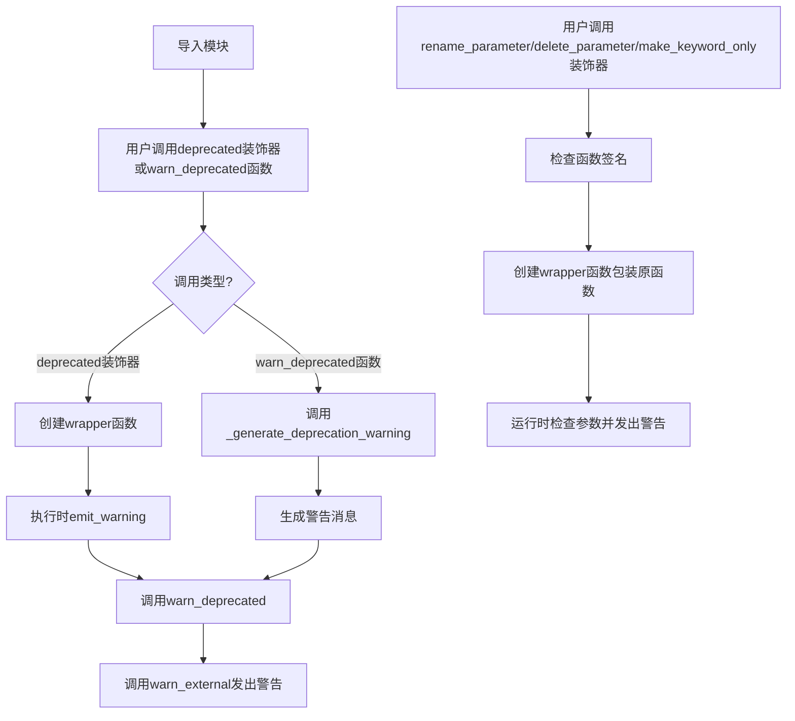
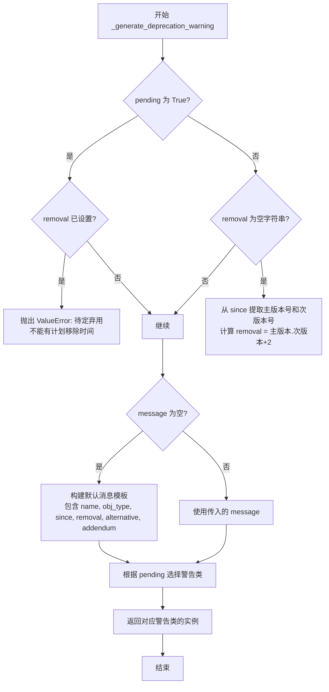
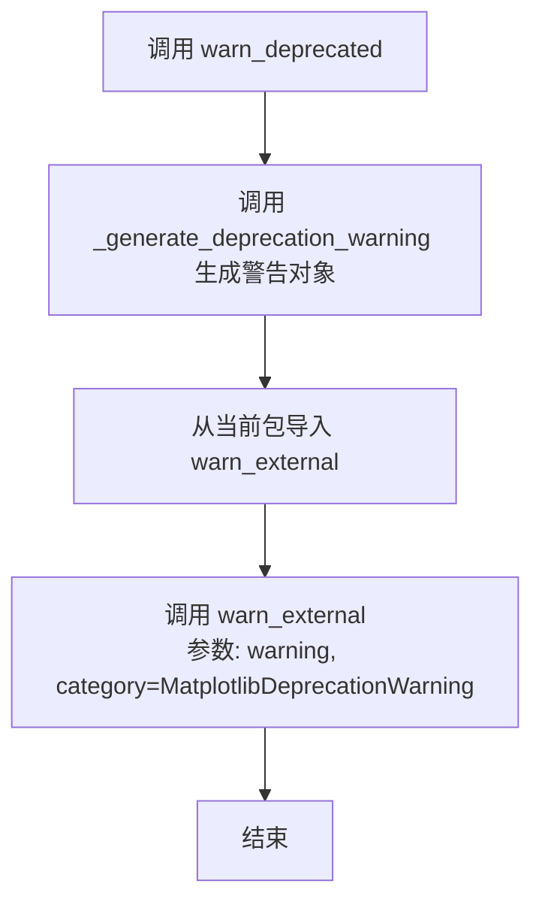
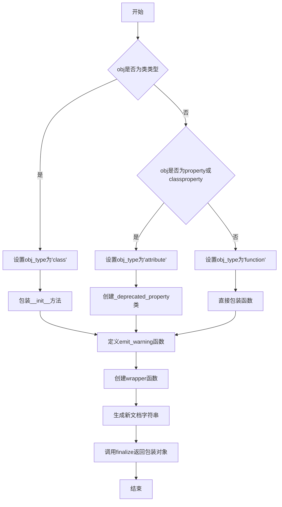
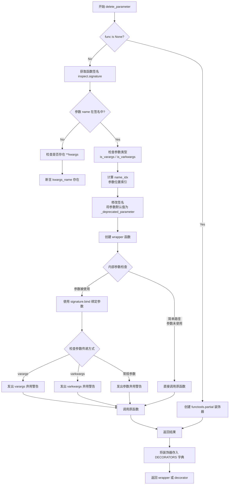
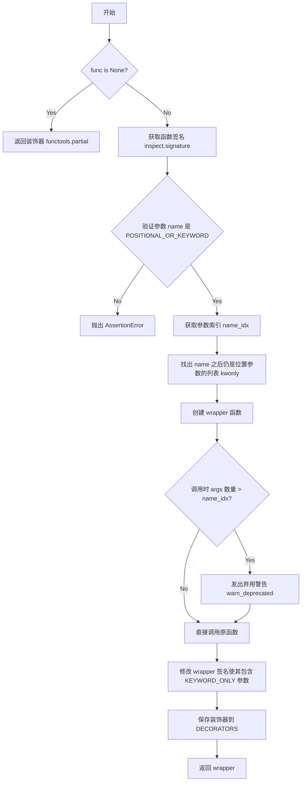
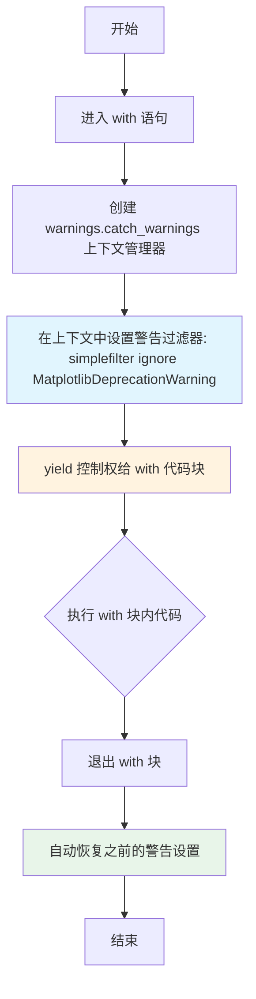
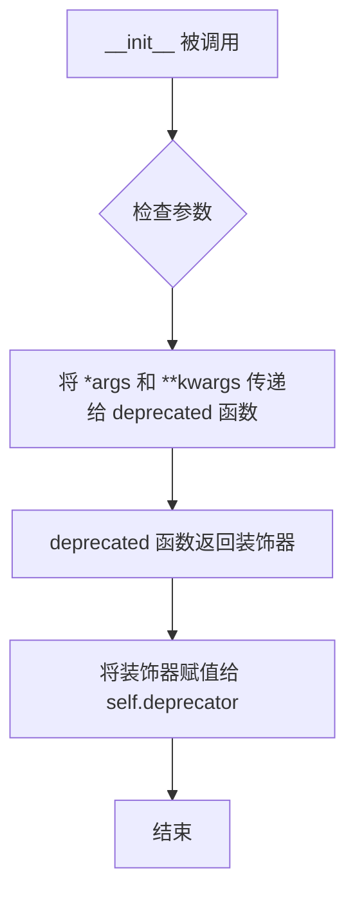
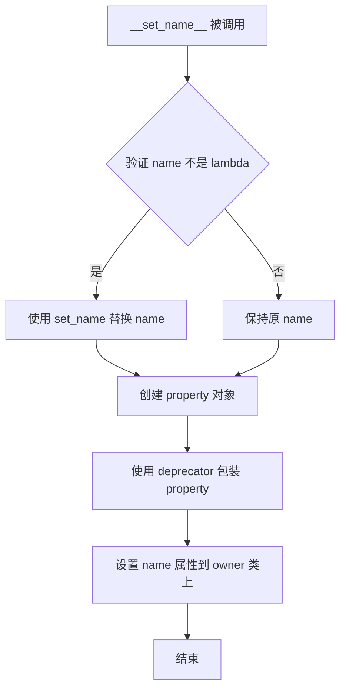
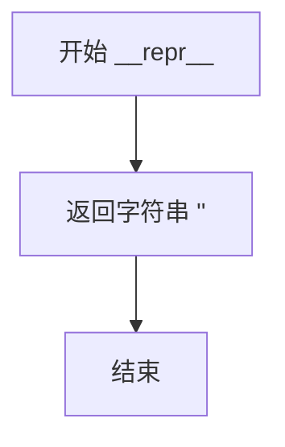

# `matplotlib\lib\matplotlib\_api\deprecation.py` 详细设计文档

该模块提供了用于在Matplotlib库中标记API弃用的辅助函数和装饰器，支持生成标准化弃用警告、处理参数重命名、删除和位置参数转关键字参数等场景，帮助开发者平滑过渡API变更。

## 整体流程



## 类结构

```
MatplotlibDeprecationWarning (自定义警告类)
deprecate_privatize_attribute (属性弃用辅助类)
_deprecated_parameter_class (内部标记类)
全局函数:
├── _generate_deprecation_warning
├── warn_deprecated
├── deprecated (装饰器)
├── rename_parameter (装饰器)
├── delete_parameter (装饰器)
├── make_keyword_only (装饰器)
├── deprecate_method_override
└── suppress_matplotlib_deprecation_warning (上下文管理器)
```

## 全局变量及字段


### `DECORATORS`
    
用于存储重命名参数装饰器信息的字典，主要用于_copy_docstring_and_deprecators重新装饰pyplot包装器和boilerplate.py获取原始签名

类型：`dict`
    


### `_deprecated_parameter`
    
作为弃用参数的占位符标记对象，用于在函数签名中标记已弃用的参数，使得运行时可以检测并发出警告

类型：`_deprecated_parameter_class`
    


### `deprecate_privatize_attribute.deprecator`
    
存储deprecated装饰器的返回值，用于将公共属性访问转换为私有属性访问（带下划线前缀），并发出弃用警告

类型：`Callable`
    
    

## 全局函数及方法


### `_generate_deprecation_warning`

该函数是Matplotlib内部用于生成弃用警告的核心辅助函数，根据传入的版本信息、消息模板和选项构建标准化的弃用警告消息，并返回相应的警告类实例。

参数：

- `since`：`str`，API被弃用时的Matplotlib版本号（例如 '3.5.0'）
- `message`：`str`，可选，自定义弃用消息，若未提供则自动生成
- `name`：`str`，可选，被弃用对象的名称
- `alternative`：`str`，可选，建议用户使用的替代API
- `pending`：`bool`，可选，是否使用PendingDeprecationWarning（待定弃用），默认为False
- `obj_type`：`str`，可选，被弃用对象的类型（如'function'、'class'、'module'等）
- `addendum`：`str`，可选，附加到警告消息末尾的额外说明文本
- `removal`：`str`，关键字参数，预期移除的版本号，若为空则自动计算（since版本号+2）

返回值：`MatplotlibDeprecationWarning` 或 `PendingDeprecationWarning`，返回相应的弃用警告类实例

#### 流程图



#### 带注释源码

```python
def _generate_deprecation_warning(
        since, message='', name='', alternative='', pending=False, obj_type='',
        addendum='', *, removal=''):
    """
    生成一个弃用警告消息实例。
    
    Parameters
    ----------
    since : str
        弃用发生的版本号（如 '3.5.0'）
    message : str, optional
        自定义消息，覆盖默认生成的消息
    name : str, optional
        被弃用对象的名称
    alternative : str, optional
        替代方案，用户可以使用的新API
    pending : bool, optional
        是否为待定弃用（PendingDeprecationWarning），默认False
    obj_type : str, optional
        被弃用对象的类型
    addendum : str, optional
        附加的说明文本
    removal : str, keyword-only
        计划移除的版本号，若为空则自动计算
    
    Returns
    -------
    MatplotlibDeprecationWarning 或 PendingDeprecationWarning
        根据参数生成的警告类实例
    """
    # 检查待定弃用与计划移除时间是否冲突
    if pending:
        if removal:
            raise ValueError("A pending deprecation cannot have a scheduled removal")
    # 若未指定移除版本，自动计算（主版本.次版本+2）
    elif removal == '':
        macro, meso, *_ = since.split('.')
        removal = f'{macro}.{int(meso) + 2}'
    
    # 若未提供消息，构建默认消息模板
    if not message:
        message = (
            ("The %(name)s %(obj_type)s" if obj_type else "%(name)s") +  # 对象名称和类型
            (" will be deprecated in a future version" if pending else    # 待定弃用或已弃用
             (" was deprecated in Matplotlib %(since)s" +
              (" and will be removed in %(removal)s" if removal else ""))) +
            "." +
            (" Use %(alternative)s instead." if alternative else "") +    # 替代方案
            (" %(addendum)s" if addendum else ""))                        # 附加说明
    
    # 根据pending标志选择警告类
    warning_cls = PendingDeprecationWarning if pending else MatplotlibDeprecationWarning
    
    # 格式化消息并返回警告实例
    return warning_cls(message % dict(
        func=name, name=name, obj_type=obj_type, since=since, removal=removal,
        alternative=alternative, addendum=addendum))
```


### `warn_deprecated`

显示标准化的弃用（deprecation）警告，帮助 Matplotlib 在内部 API 发生变更时向用户发出统一的提示。

#### 参数

- `since`：`str`，**必需**。标记该 API 从哪个版本开始被弃用（如 `'3.0'`）。
- `message`：`str`，可选（默认 `''`）。自定义警告信息，可使用 `%(since)s`、`%(name)s`、`%(alternative)s`、`%(obj_type)s`、`%(addendum)s`、`%(removal)s` 占位符。
- `name`：`str`，可选（默认 `''`）。被弃用对象的名称（如函数名、类名、属性名）。
- `alternative`：`str`，可选（默认 `''`）。建议用户使用的替代 API。
- `pending`：`bool`，可选（默认 `False`）。若为 `True`，则使用 `PendingDeprecationWarning` 而非 `DeprecationWarning`，且不能与 `removal` 同时指定。
- `obj_type`：`str`，可选（默认 `''`）。被弃用对象的类型（如 `'function'`、`'class'`、`'module'`）。
- `addendum`：`str`，可选（默认 `''`）。附加在警告末尾的额外说明文字。
- `removal`：`str`，可选（默认 `''`）。计划移除的版本号；若为空，则会根据 `since` 自动计算（`since` 的次要版本号 + 2）。

#### 返回值

- `None`（隐式返回）。该函数只负责生成并发出警告，不返回任何值。

#### 流程图



#### 带注释源码

```python
def warn_deprecated(
        since, *,                # 第一个参数：必须的位置参数，表示“从哪个版本开始弃用”
        message='',              # 可选：自定义警告文本，支持 printf‑style 占位符
        name='',                 # 可选：被弃用对象的名称
        alternative='',          # 可选：建议使用的替代 API
        pending=False,           # 可选：是否为“待定”弃用，若是则使用 PendingDeprecationWarning
        obj_type='',             # 可选：被弃用对象的类型（如 'function'、'class'）
        addendum='',             # 可选：额外的补充说明，会追加在警告末尾
        removal=''):             # 可选：计划移除的版本；为空时自动计算
    """
    Display a standardized deprecation.

    Parameters
    ----------
    since : str
        The release at which this API became deprecated.
    message : str, optional
        Override the default deprecation message.  The ``%(since)s``,
        ``%(name)s``, ``%(alternative)s``, ``%(obj_type)s``, ``%(addendum)s``,
        and ``%(removal)s`` format specifiers will be replaced by the values
        of the respective arguments passed to this function.
    name : str, optional
        The name of the deprecated object.
    alternative : str, optional
        An alternative API that the user may use in place of the deprecated
        API.
    pending : bool, optional
        If True, uses a PendingDeprecationWarning instead of a
        DeprecationWarning.  Cannot be used together with *removal*.
    obj_type : str, optional
        The object type being deprecated.
    addendum : str, optional
        Additional text appended directly to the final message.
    removal : str, optional
        The expected removal version.  With the default (an empty string), a
        removal version is automatically computed from *since*.  Set to other
        Falsy values to not schedule a removal date.  Cannot be used together
        with *pending*.

    Examples
    --------
    ::

        # To warn of the deprecation of "matplotlib.name_of_module"
        warn_deprecated('1.4.0', name='matplotlib.name_of_module',
                        obj_type='module')
    """
    # 1. 使用内部函数 _generate_deprecation_warning 构造警告对象
    warning = _generate_deprecation_warning(
        since, message, name, alternative, pending, obj_type,
        addendum, removal=removal)

    # 2. 从当前子包导入 warn_external（负责将警告输出给用户）
    from . import warn_external

    # 3. 调用 warn_external，将生成的警告发送出去
    #    category 指定为 MatplotlibDeprecationWarning，确保它能被正确捕获
    warn_external(warning, category=MatplotlibDeprecationWarning)
```


### `deprecated`

装饰器，用于将函数、类或属性标记为已弃用。当弃用类方法、静态方法或属性时，`@deprecated` 装饰器应放在 `@classmethod`、`@staticmethod` 之下（直接装饰底层可调用对象），但在 `@property` 之上。

参数：

- `since`：`str`，该 API 开始弃用的版本
- `message`：`str, optional`，覆盖默认弃用消息。可使用 `%(since)s`、`%(name)s`、`%(alternative)s`、`%(obj_type)s`、`%(addendum)s` 和 `%(removal)s` 格式说明符
- `name`：`str, optional`，被弃用对象的名称
- `alternative`：`str, optional`，用户可以使用的替代 API
- `pending`：`bool, optional`，如果为 True，使用 PendingDeprecationWarning 而不是 DeprecationWarning，不能与 `removal` 一起使用
- `obj_type`：`str, optional`，被弃用的对象类型，装饰类时默认为 'class'，装饰属性时为 'attribute'，其他情况为 'function'
- `addendum`：`str, optional`，直接追加到最终消息的附加文本
- `removal`：`str, optional`，预期移除版本。默认为空字符串，将根据 `since` 自动计算移除版本

返回值：`function`，返回一个装饰器函数，用于包装被弃用的对象

#### 流程图



#### 带注释源码

```python
def deprecated(since, *, message='', name='', alternative='', pending=False,
               obj_type=None, addendum='', removal=''):
    """
    Decorator to mark a function, a class, or a property as deprecated.

    When deprecating a classmethod, a staticmethod, or a property, the
    ``@deprecated`` decorator should go *under* ``@classmethod`` and
    ``@staticmethod`` (i.e., `deprecated` should directly decorate the
    underlying callable), but *over* ``@property``.

    When deprecating a class ``C`` intended to be used as a base class in a
    multiple inheritance hierarchy, ``C`` *must* define an ``__init__`` method
    (if ``C`` instead inherited its ``__init__`` from its own base class, then
    ``@deprecated`` would mess up ``__init__`` inheritance when installing its
    own (deprecation-emitting) ``C.__init__``).

    Parameters are the same as for `warn_deprecated`, except that *obj_type*
    defaults to 'class' if decorating a class, 'attribute' if decorating a
    property, and 'function' otherwise.

    Examples
    --------
    ::

        @deprecated('1.4.0')
        def the_function_to_deprecate():
            pass
    """

    def deprecate(obj, message=message, name=name, alternative=alternative,
                  pending=pending, obj_type=obj_type, addendum=addendum):
        # 导入classproperty辅助类
        from matplotlib._api import classproperty

        # 处理类类型的被装饰对象
        if isinstance(obj, type):
            if obj_type is None:
                obj_type = "class"
            func = obj.__init__  # 获取类的__init__方法
            name = name or obj.__name__  # 使用类名作为name
            old_doc = obj.__doc__  # 保存原始文档

            # 定义finalize函数来更新类的文档和__init__
            def finalize(wrapper, new_doc):
                try:
                    obj.__doc__ = new_doc
                except AttributeError:  # Can't set on some extension objects.
                    pass
                obj.__init__ = functools.wraps(obj.__init__)(wrapper)
                return obj

        # 处理property或classproperty类型的被装饰对象
        elif isinstance(obj, (property, classproperty)):
            if obj_type is None:
                obj_type = "attribute"
            func = None
            name = name or obj.fget.__name__
            old_doc = obj.__doc__

            # 创建继承自原始property类型的_deprecated_property类
            class _deprecated_property(type(obj)):
                def __get__(self, instance, owner=None):
                    # 当访问属性时发出警告
                    if instance is not None or owner is not None \
                            and isinstance(self, classproperty):
                        emit_warning()
                    return super().__get__(instance, owner)

                def __set__(self, instance, value):
                    # 当设置属性值时发出警告
                    if instance is not None:
                        emit_warning()
                    return super().__set__(instance, value)

                def __delete__(self, instance):
                    # 当删除属性时发出警告
                    if instance is not None:
                        emit_warning()
                    return super().__delete__(instance)

                def __set_name__(self, owner, set_name):
                    nonlocal name
                    if name == "<lambda>":
                        name = set_name

            def finalize(_, new_doc):
                return _deprecated_property(
                    fget=obj.fget, fset=obj.fset, fdel=obj.fdel, doc=new_doc)

        # 处理函数或其他可调用对象
        else:
            if obj_type is None:
                obj_type = "function"
            func = obj
            name = name or obj.__name__
            old_doc = func.__doc__

            def finalize(wrapper, new_doc):
                wrapper = functools.wraps(func)(wrapper)
                wrapper.__doc__ = new_doc
                return wrapper

        # 定义发出警告的内部函数
        def emit_warning():
            warn_deprecated(
                since, message=message, name=name, alternative=alternative,
                pending=pending, obj_type=obj_type, addendum=addendum,
                removal=removal)

        # 包装函数，在调用原函数前发出警告
        def wrapper(*args, **kwargs):
            __tracebackhide__ = True  # 用于测试框架隐藏此堆栈
            emit_warning()
            return func(*args, **kwargs)

        # 清理并准备旧文档字符串
        old_doc = inspect.cleandoc(old_doc or '').strip('\n')

        # 构建新的文档字符串
        notes_header = '\nNotes\n-----'
        second_arg = ' '.join([t.strip() for t in
                               (message, f"Use {alternative} instead."
                                if alternative else "", addendum) if t])
        new_doc = (f"[*Deprecated*] {old_doc}\n"
                   f"{notes_header if notes_header not in old_doc else ''}\n"
                   f".. deprecated:: {since}\n"
                   f"   {second_arg}")

        # 如果原文档为空，添加转义空格以避免docutils警告
        if not old_doc:
            new_doc += r'\ '

        # 返回最终包装后的对象
        return finalize(wrapper, new_doc)

    return deprecate
```


### `rename_parameter`

该装饰器用于将函数的旧参数名重命名为新参数名。当旧参数被传递时，会发出弃用警告（DeprecationWarning），并将参数值自动转移到新参数，以实现向后兼容。

参数：

- `since`：`str`，Matplotlib版本号，表示从哪个版本开始弃用该参数
- `old`：`str`，要弃用的旧参数名称
- `new`：`str`，新的参数名称
- `func`：`Callable | None`，可选，要装饰的函数。如果为 `None`，返回装饰器

返回值：`Callable`，装饰后的函数

#### 流程图

```mermaid
flowchart TD
    A[开始] --> B{func is None?}
    B -->|Yes| C[返回decorator]
    B -->|No| D[获取函数签名]
    D --> E{old not in signature?}
    E -->|Yes| F[断言失败: old不能是参数]
    E -->|No| G{new in signature?}
    G -->|No| H[断言失败: new必须是参数]
    G -->|Yes| I[创建wrapper函数]
    I --> J{old in kwargs?}
    J -->|Yes| K[发出弃用警告]
    K --> L[将kwargs[old]赋值给kwargs[new]]
    L --> M[删除kwargs[old]]
    J -->|No| N[直接调用func]
    M --> N
    N --> O[返回func结果]
    O --> P[将decorator存入DECORATORS]
    P --> Q[返回wrapper]
```

#### 带注释源码

```python
def rename_parameter(since, old, new, func=None):
    """
    Decorator indicating that parameter *old* of *func* is renamed to *new*.

    The actual implementation of *func* should use *new*, not *old*.  If *old*
    is passed to *func*, a DeprecationWarning is emitted, and its value is
    used, even if *new* is also passed by keyword (this is to simplify pyplot
    wrapper functions, which always pass *new* explicitly to the Axes method).
    If *new* is also passed but positionally, a TypeError will be raised by the
    underlying function during argument binding.

    Examples
    --------
    ::

        @_api.rename_parameter("3.1", "bad_name", "good_name")
        def func(good_name): ...
    """

    # 创建一个偏函数，用于延迟绑定参数
    # 当func为None时，调用rename_parameter(since, old, new)返回一个装饰器
    decorator = functools.partial(rename_parameter, since, old, new)

    # 如果func为None，返回装饰器（用于@rename_parameter(...)形式）
    if func is None:
        return decorator

    # 获取被装饰函数的签名
    signature = inspect.signature(func)
    
    # 内部错误检查：old参数不应该存在于原函数签名中
    # 因为我们要在调用时将old重命名为new
    assert old not in signature.parameters, (
        f"Matplotlib internal error: {old!r} cannot be a parameter for "
        f"{func.__name__}()")
    
    # 内部错误检查：new参数必须存在于原函数签名中
    assert new in signature.parameters, (
        f"Matplotlib internal error: {new!r} must be a parameter for "
        f"{func.__name__}()")

    # 使用functools.wraps保留原函数的元信息
    @functools.wraps(func)
    def wrapper(*args, **kwargs):
        __tracebackhide__ = True  # 用于调试/测试，隐藏traceback

        # 检查是否有旧参数名被传入
        if old in kwargs:
            # 发出弃用警告
            warn_deprecated(
                since, message=f"The {old!r} parameter of {func.__name__}() "
                f"has been renamed {new!r} since Matplotlib {since}; support "
                f"for the old name will be dropped in %(removal)s.")
            # 将旧参数的值转移到新参数
            kwargs[new] = kwargs.pop(old)
        
        # 调用原函数
        return func(*args, **kwargs)

    # wrapper()必须保持与func()相同的文档签名：
    # 如果我们在wrapper()的签名中同时显示*old*和*new*，
    # 它们会在pyplot函数中显示为Axes方法的参数，
    # 并且pyplot会显式传递两个参数给Axes方法，这是不希望的。

    # 将装饰器信息存储到全局字典中，供_copy_docstring_and_deprecators使用
    # 这样可以避免属性在functools.wraps传播时丢失
    DECORATORS[wrapper] = decorator
    return wrapper
```


### `delete_parameter`

`delete_parameter` 是一个装饰器函数，用于标记函数的某个参数已被弃用。当被弃用的参数被传入时，会发出弃用警告，但参数仍会被传递给原函数。该装饰器支持通过 `functools.partial` 作为参数化装饰器使用，也支持直接作为装饰器使用。

参数：

- `since`：`str`，表示该参数从哪个版本开始被弃用
- `name`：`str`，表示被弃用的参数名称
- `func`：`callable` 或 `None`，被装饰的函数；如果为 `None`，则返回装饰器
- `**kwargs`：关键字参数，将转发给 `warn_deprecated` 函数（如 `message`、`alternative`、`addendum` 等）

返回值：`callable`，如果 `func` 为 `None` 则返回装饰器（`functools.partial`），否则返回包装后的函数

#### 流程图



#### 带注释源码

```python
def delete_parameter(since, name, func=None, **kwargs):
    """
    Decorator indicating that parameter *name* of *func* is being deprecated.

    The actual implementation of *func* should keep the *name* parameter in its
    signature, or accept a ``**kwargs`` argument (through which *name* would be
    passed).

    Parameters that come after the deprecated parameter effectively become
    keyword-only (as they cannot be passed positionally without triggering the
    DeprecationWarning on the deprecated parameter), and should be marked as
    such after the deprecation period has passed and the deprecated parameter
    is removed.

    Parameters other than *since*, *name*, and *func* are keyword-only and
    forwarded to `.warn_deprecated`.

    Examples
    --------
    ::

        @_api.delete_parameter("3.1", "unused")
        def func(used_arg, other_arg, unused, more_args): ...
    """

    # 如果 func 为 None，返回一个偏函数作为装饰器
    # 这样可以支持 @delete_parameter("3.1", "param_name") 的使用方式
    decorator = functools.partial(delete_parameter, since, name, **kwargs)

    # 如果没有传入 func（即作为装饰器使用但没有立即装饰函数）
    # 返回装饰器等待后续使用
    if func is None:
        return decorator

    # 获取被装饰函数的签名
    signature = inspect.signature(func)
    
    # Name of `**kwargs` parameter of the decorated function, typically
    # "kwargs" if such a parameter exists, or None if the decorated function
    # doesn't accept `**kwargs`.
    # 检查函数是否接受 **kwargs 参数
    kwargs_name = next((param.name for param in signature.parameters.values()
                        if param.kind == inspect.Parameter.VAR_KEYWORD), None)
    
    # 检查被弃用的参数是否存在于函数签名中
    if name in signature.parameters:
        kind = signature.parameters[name].kind
        is_varargs = kind is inspect.Parameter.VAR_POSITIONAL  # *args
        is_varkwargs = kind is inspect.Parameter.VAR_KEYWORD   # **kwargs
        
        if not is_varargs and not is_varkwargs:
            # 计算参数的位置索引
            # 如果是 KEYWORD_ONLY 参数，则设为无穷大（表示不能位置传递）
            # 否则使用参数在签名中的索引位置
            name_idx = (
                # Deprecated parameter can't be passed positionally.
                math.inf if kind is inspect.Parameter.KEYWORD_ONLY
                # If call site has no more than this number of parameters, the
                # deprecated parameter can't have been passed positionally.
                else [*signature.parameters].index(name))
            
            # 修改签名：将该参数的默认值替换为 _deprecated_parameter
            # 这样在调用时可以通过默认值判断参数是否被显式传递
            func.__signature__ = signature = signature.replace(parameters=[
                param.replace(default=_deprecated_parameter)
                if param.name == name else param
                for param in signature.parameters.values()])
        else:
            # 对于 *args 或 **kwargs 类型的参数，索引设为 -1
            name_idx = -1  # Deprecated parameter can always have been passed.
    else:
        # 参数不在签名中，可能是通过 **kwargs 传递
        is_varargs = is_varkwargs = False
        # Deprecated parameter can't be passed positionally.
        name_idx = math.inf
        # 断言：必须存在 **kwargs 参数来接收这个被弃用的参数
        assert kwargs_name, (
            f"Matplotlib internal error: {name!r} must be a parameter for "
            f"{func.__name__}()")

    # 从 kwargs 中提取 addendum（附加说明）
    addendum = kwargs.pop('addendum', None)

    # 装饰器包装函数
    @functools.wraps(func)
    def wrapper(*inner_args, **inner_kwargs):
        __tracebackhide__ = True

        # 快速路径：参数未被使用，直接调用原函数（更高效）
        if len(inner_args) <= name_idx and name not in inner_kwargs:
            # Early return in the simple, non-deprecated case (much faster than
            # calling bind()).
            return func(*inner_args, **inner_kwargs)
        
        # 使用 signature.bind 绑定所有参数，分析参数传递情况
        arguments = signature.bind(*inner_args, **inner_kwargs).arguments
        
        # 处理 *args 类型的弃用参数
        if is_varargs and arguments.get(name):
            warn_deprecated(
                since, message=f"Additional positional arguments to "
                f"{func.__name__}() are deprecated since %(since)s and "
                f"support for them will be removed in %(removal)s.")
        
        # 处理 **kwargs 类型的弃用参数
        elif is_varkwargs and arguments.get(name):
            warn_deprecated(
                since, message=f"Additional keyword arguments to "
                f"{func.__name__}() are deprecated since %(since)s and "
                f"support for them will be removed in %(removal)s.")
        
        # 处理常规位置的弃用参数
        # 不能仅检查 `name not in arguments`，因为 pyplot 包装器总是显式传递所有参数
        elif any(name in d and d[name] != _deprecated_parameter
                 for d in [arguments, arguments.get(kwargs_name, {})]):
            deprecation_addendum = (
                f"If any parameter follows {name!r}, they should be passed as "
                f"keyword, not positionally.")
            warn_deprecated(
                since,
                name=repr(name),
                obj_type=f"parameter of {func.__name__}()",
                addendum=(addendum + " " + deprecation_addendum) if addendum
                         else deprecation_addendum,
                **kwargs)
        
        # 调用原函数
        return func(*inner_args, **inner_kwargs)

    # 存储装饰器信息到 DECORATORS 字典，供 _copy_docstring_and_deprecators 使用
    DECORATORS[wrapper] = decorator
    return wrapper
```

#### 关键组件信息

| 组件名称 | 描述 |
|---------|------|
| `_deprecated_parameter` | 一个 sentinel 对象，用于标记被弃用参数的默认值 |
| `_deprecated_parameter_class` | 创建上述 sentinel 对象的类 |
| `DECORATORS` | 全局字典，存储包装函数与其装饰器之间的映射关系 |
| `warn_deprecated` | 实际发出弃用警告的函数 |
| `inspect.signature` | 用于获取和操作函数签名 |
| `functools.partial` | 用于创建参数化的装饰器工厂 |

#### 潜在的技术债务或优化空间

1. **重复的警告生成逻辑**：`delete_parameter` 和 `rename_parameter` 之间存在一些重复的逻辑，可以考虑提取公共函数
2. **复杂的参数索引计算**：`name_idx` 的计算逻辑较为复杂，尤其是对于不同参数类型的处理，可以考虑使用更清晰的数据结构
3. **缺乏单元测试**：虽然该函数对 Matplotlib 至关重要，但错误处理路径（如断言失败）缺乏专门的测试覆盖
4. **文档可以更详细**：示例代码可以更完整，展示更多边界情况的使用

#### 其它项目

**设计目标与约束**：
- 保持向后兼容性，同时告知用户弃用信息
- 被弃用的参数在弃用期间仍然可用
- 弃用后的参数之后的参数会变成事实上的 keyword-only 参数

**错误处理与异常设计**：
- 使用 `assert` 进行内部错误检查（如参数不存在、必须存在 **kwargs 等）
- 外部错误（如用户不当使用）通过弃用警告而非异常来处理

**数据流与状态机**：
- 函数内部通过 `signature.bind()` 进行参数绑定和分析
- 根据参数传递方式（位置参数、关键字参数、*args、**kwargs）决定警告类型

**外部依赖与接口契约**：
- 依赖 `inspect` 模块进行签名分析
- 依赖 `functools` 模块进行函数包装
- 依赖同模块内的 `warn_deprecated` 函数发出警告
- 与 `DECORATORS` 字典紧密耦合，供其他模块（如 `_copy_docstring_and_deprecators`）使用


### `make_keyword_only`

将指定参数及其后续的位置参数转换为仅限关键字参数的装饰器，用于发出弃用警告。

参数：

- `since`：`str`，表示从哪个版本开始弃用
- `name`：`str`，要改为仅限关键字形式的参数名称
- `func`：可选的 `Callable`，要装饰的函数或方法，如果为 `None` 则返回装饰器

返回值：`Callable`，装饰后的函数，如果 `func` 为 `None` 则返回装饰器

#### 流程图



#### 带注释源码

```python
def make_keyword_only(since, name, func=None):
    """
    Decorator indicating that passing parameter *name* (or any of the following
    ones) positionally to *func* is being deprecated.

    When used on a method that has a pyplot wrapper, this should be the
    outermost decorator, so that :file:`boilerplate.py` can access the original
    signature.

    Examples
    --------
    Assume we want to only allow *dataset* and *positions* as positional
    parameters on the method ::

        def violinplot(self, dataset, positions=None, vert=None, ...)

    Introduce the deprecation by adding the decorator ::

        @_api.make_keyword_only("3.10", "vert")
        def violinplot(self, dataset, positions=None, vert=None, ...)

    When the deprecation expires, switch to ::

        def violinplot(self, dataset, positions=None, *, vert=None, ...)

    """

    # 创建一个偏函数，用于延迟调用 make_keyword_only
    # 当 func=None 时，返回的装饰器可以应用于函数
    decorator = functools.partial(make_keyword_only, since, name)

    # 如果没有传入 func，说明是在作为装饰器使用
    # 返回偏函数，等待接收被装饰的函数
    if func is None:
        return decorator

    # 获取被装饰函数的签名
    signature = inspect.signature(func)
    
    # 定义参数类型的常量
    POK = inspect.Parameter.POSITIONAL_OR_KEYWORD
    KWO = inspect.Parameter.KEYWORD_ONLY
    
    # 断言验证：name 必须是函数的位置或关键字参数
    assert (name in signature.parameters
            and signature.parameters[name].kind == POK), (
        f"Matplotlib internal error: {name!r} must be a positional-or-keyword "
        f"parameter for {func.__name__}(). If this error happens on a function with a "
        f"pyplot wrapper, make sure make_keyword_only() is the outermost decorator.")
    
    # 获取所有参数名称列表
    names = [*signature.parameters]
    # 找到 name 参数的索引位置
    name_idx = names.index(name)
    # 找出 name 之后仍然是位置参数的参数名（这些也需要转为 keyword-only）
    kwonly = [name for name in names[name_idx:]
              if signature.parameters[name].kind == POK]

    # 定义包装函数，用于在调用时发出弃用警告
    @functools.wraps(func)
    def wrapper(*args, **kwargs):
        __tracebackhide__ = True

        # 不使用 signature.bind，因为与 rename_parameter 一起使用时可能会失败
        # 如果传递的位置参数数量超过 name_idx，说明传递了已弃用的参数
        if len(args) > name_idx:
            warn_deprecated(
                since, message="Passing the %(name)s %(obj_type)s "
                "positionally is deprecated since Matplotlib %(since)s; the "
                "parameter will become keyword-only in %(removal)s.",
                name=name, obj_type=f"parameter of {func.__name__}()")
        # 调用原函数
        return func(*args, **kwargs)

    # 不修改 func 的原始签名，因为 boilerplate.py 需要它
    # 但修改包装函数的签名，使其包含 KEYWORD_ONLY 参数
    wrapper.__signature__ = signature.replace(parameters=[
        param.replace(kind=KWO) if param.name in kwonly else param
        for param in signature.parameters.values()])
    
    # 将装饰器保存到全局字典中，供 boilerplate.py 检索原始签名使用
    DECORATORS[wrapper] = decorator
    return wrapper
```


### `deprecate_method_override`

该函数用于检查子类是否重写了父类的方法，如果重写了则返回该方法并发出弃用警告，否则返回 None。

参数：

-  `method`：方法，未绑定的方法，形式为 `Class.method_name`
-  `obj`：对象或类，子类实例或子类本身
-  `allow_empty`：布尔值，默认 False，是否允许空方法（不发出警告）
-  `**kwargs`：关键字参数，至少需要包含 "since" 键，传递给 `warn_deprecated` 的额外参数

返回值：`方法对象或 None`，如果方法被重写则返回该方法，否则返回 None

#### 流程图

```mermaid
flowchart TD
    A[开始 deprecate_method_override] --> B[定义空方法: empty 和 empty_with_docstring]
    B --> C[获取方法名: method.__name__]
    C --> D[获取子类的方法: bound_child = getattr(obj, name)]
    D --> E{obj 是类且 bound_child 是类?}
    E -->|是| F[bound_base = method (未绑定)]
    E -->|否| G[bound_base = method.__get__(obj) (绑定到obj)]
    F --> H{bound_child != bound_base?}
    G --> H
    H -->|否| I[返回 None]
    H -->|是| J{allow_empty 为 True?}
    J -->|是| K{bound_child 是空方法?}
    J -->|否| L[发出弃用警告]
    K -->|是| I
    K -->|否| L
    L --> M[返回 bound_child]
```

#### 带注释源码

```python
def deprecate_method_override(method, obj, *, allow_empty=False, **kwargs):
    """
    Return ``obj.method`` with a deprecation if it was overridden, else None.

    Parameters
    ----------
    method
        An unbound method, i.e. an expression of the form
        ``Class.method_name``.  Remember that within the body of a method, one
        can always use ``__class__`` to refer to the class that is currently
        being defined.
    obj
        Either an object of the class where *method* is defined, or a subclass
        of that class.
    allow_empty : bool, default: False
        Whether to allow overrides by "empty" methods without emitting a
        warning.
    **kwargs
        Additional parameters passed to `warn_deprecated` to generate the
        deprecation warning; must at least include the "since" key.
    """

    # 定义两个空方法用于后续判断子类是否实现了空方法
    def empty(): pass
    def empty_with_docstring(): """doc"""

    # 获取方法名
    name = method.__name__
    
    # 获取子类/实例的方法
    bound_child = getattr(obj, name)
    
    # 获取基类的方法引用
    # 如果 obj 是类且 bound_child 是类类型，则使用未绑定的方法
    # 否则将方法绑定到 obj 上
    bound_base = (
        method  # If obj is a class, then we need to use unbound methods.
        if isinstance(bound_child, type(empty)) and isinstance(obj, type)
        else method.__get__(obj))
    
    # 检查子类是否重写了方法，且不是空方法实现
    if (bound_child != bound_base
            and (not allow_empty
                 or (getattr(getattr(bound_child, "__code__", None),
                             "co_code", None)
                     not in [empty.__code__.co_code,
                             empty_with_docstring.__code__.co_code]))):
        # 发出弃用警告
        warn_deprecated(**{"name": name, "obj_type": "method", **kwargs})
        # 返回子类重写的方法
        return bound_child
    
    # 未重写或空方法（允许的情况），返回 None
    return None
```


### `suppress_matplotlib_deprecation_warning`

该函数是一个上下文管理器（context manager），用于在 `with` 语句块内临时屏蔽 `MatplotlibDeprecationWarning` 警告。通过使用 `warnings.catch_warnings()` 和 `warnings.simplefilter("ignore", ...)` 实现警告过滤的重置和恢复，确保在代码块执行期间不会输出 Matplotlib 相关的弃用警告。

参数： 无

返回值： `contextlib.contextmanager`，返回一个上下文管理器对象，用于在 `with` 语句中使用。当进入上下文时，会将警告过滤器设置为忽略 `MatplotlibDeprecationWarning`；当退出上下文时，自动恢复之前的警告设置。

#### 流程图



#### 带注释源码

```python
@contextlib.contextmanager  # 装饰器: 将普通函数转换为上下文管理器
def suppress_matplotlib_deprecation_warning():
    """
    上下文管理器: 临时屏蔽 Matplotlib 弃用警告
    
    使用方法:
        with suppress_matplotlib_deprecation_warning():
            # 在此处的代码不会显示 MatplotlibDeprecationWarning
            ...
    """
    # 创建警告捕获上下文管理器
    # catch_warnings() 会保存当前的警告配置，并在退出时恢复
    with warnings.catch_warnings():
        # 设置简单的警告过滤器: 忽略所有 MatplotlibDeprecationWarning
        # "ignore" 表示不输出匹配的警告
        # MatplotlibDeprecationWarning 是自定义的弃用警告类
        warnings.simplefilter("ignore", MatplotlibDeprecationWarning)
        
        # yield 将控制权交给 with 语句块
        # 在 with 块执行期间，警告过滤器保持 ignore 状态
        # 当 with 块执行完毕后，warnings.catch_warnings 会自动恢复之前的警告设置
        yield
```


### `deprecate_privatize_attribute.__init__`

该方法是 `deprecate_privatize_attribute` 类的构造函数，用于初始化一个弃用属性装饰器。它接受任意参数并将这些参数传递给 `deprecated` 装饰器函数，将返回的装饰器保存为实例属性，以便后续在 `__set_name__` 方法中使用来创建属性。

参数：

- `*args`：位置参数元组，传递给 `deprecated` 装饰器的位置参数，包括弃用版本号 `since` 等
- `**kwargs`：关键字参数字典，传递给 `deprecated` 装饰器的关键字参数，包括 `message`、`name`、`alternative`、`pending`、`obj_type`、`addendum`、`removal` 等

返回值：`None`，无返回值（构造函数）

#### 流程图



#### 带注释源码

```python
def __init__(self, *args, **kwargs):
    """
    初始化 deprecate_privatize_attribute 实例。

    参数由调用者直接转发给顶层的 deprecated 装饰器函数，
    该函数将根据参数生成一个适当的弃用警告装饰器。

    参数
    ----------
    *args : 位置参数
        传递给 deprecated 装饰器的位置参数（如 since 版本号）。
    **kwargs : 关键字参数
        传递给 deprecated 装饰器的关键字参数，包括：
        - message: 自定义弃用消息
        - name: 弃用对象的名称
        - alternative: 替代方案描述
        - pending: 是否为待定弃用
        - obj_type: 弃用对象的类型
        - addendum: 附加说明
        - removal: 计划移除版本
    """
    # 调用 deprecated 装饰器工厂函数，传入所有参数
    # deprecated 函数返回一个装饰器，用于包装目标属性或方法
    # 该装饰器会在被访问时发出弃用警告
    self.deprecator = deprecated(*args, **kwargs)
```


### `deprecate_privatize_attribute.__set_name__`

该方法是一个魔法方法（descriptor protocol的一部分），在类定义时由Python解释器自动调用，用于将类属性转换为带有弃用警告的property，从而实现对私有属性的公开访问代理。

参数：
- `owner`：`type`，定义该属性的类对象
- `name`：`str`，属性在类中的名称（即赋值给类属性的变量名）

返回值：`None`，无返回值（通过`setattr`直接在`owner`类上设置属性）

#### 流程图



#### 带注释源码

```python
def __set_name__(self, owner, name):
    """
    在类定义时自动调用的描述器协议方法。
    
    当 deprecate_privatize_attribute 实例被赋值给类属性时，
    Python 会自动调用此方法，设置该属性在类中的名称。
    """
    setattr(owner, name, self.deprecator(
        # 创建一个 property:
        # - fget: 读取时访问 self._<name> (带下划线的私有属性)
        # - fset: 写入时修改 self._<name>
        property(lambda self: getattr(self, f"_{name}"),
                 lambda self, value: setattr(self, f"_{name}", value)),
        name=name))
```


### `_deprecated_parameter_class.__repr__`

该方法是 `_deprecated_parameter_class` 类的 `__repr__` 特殊方法，用于返回该类的字符串表示形式，通常作为已删除参数的默认标记值。

参数：

- `self`：`_deprecated_parameter_class`，隐式参数，表示类的实例本身

返回值：`str`，返回字符串 `"<deprecated parameter>"`，用于标识该参数已被弃用

#### 流程图



#### 带注释源码

```python
class _deprecated_parameter_class:
    def __repr__(self):
        """
        返回该类的字符串表示形式。

        此方法用于为已删除参数提供一个可识别的默认标记值。
        当函数签名中的参数被替换为此类的实例时，
        可以通过 __repr__ 方法识别该参数已被弃用。

        Returns
        -------
        str
            返回 '<deprecated parameter>' 字符串常量
        """
        return "<deprecated parameter>"
```

---

**补充说明：**

- **设计目的**：`_deprecated_parameter_class` 类及其 `__repr__` 方法在 `delete_parameter` 装饰器中使用，用于将已弃用参数的默认值设置为该类的实例。这样可以在运行时检测参数是否被显式传递。
- **使用场景**：在 `delete_parameter` 函数中，当检测参数是否被传递时，会比较参数值是否等于 `_deprecated_parameter` 实例（通过 `d[name] != _deprecated_parameter` 判断）。

## 关键组件


### MatplotlibDeprecationWarning

继承自DeprecationWarning的类，用于向Matplotlib用户发出弃用警告。

### _generate_deprecation_warning

生成弃用警告消息的核心函数，根据给定的版本信息、名称、替代方案等参数构建标准化的弃用消息字符串。

### warn_deprecated

显示标准化弃用警告的函数，将生成的警告通过warn_external传递给用户。

### deprecated

通用的弃用装饰器，可以应用于函数、类或属性，在访问时发出弃用警告并更新文档字符串。

### deprecate_privatize_attribute

辅助类，用于将公共属性标记为已弃用并重定向到私有版本（带下划线前缀）。

### rename_parameter

装饰器，标记函数参数已重命名，当使用旧参数名称时发出弃用警告。

### delete_parameter

装饰器，标记函数参数已弃用，阻止使用该参数并在检测到使用时发出警告。

### make_keyword_only

装饰器，标记参数即将改为仅关键字参数，警告以位置参数方式传递该参数的行为。

### deprecate_method_override

检测子类是否覆盖了基类方法，并在存在覆盖时发出弃用警告。

### suppress_matplotlib_deprecation_warning

上下文管理器，临时抑制Matplotlib弃用警告的显示。

### DECORATORS

全局字典，用于存储装饰器信息，供copy_docstring_and_deprecators和boilerplate.py使用以检索原始签名。

### _deprecated_parameter

用于标记已删除参数的哨兵对象，在函数签名中作为默认值的占位符。


## 问题及建议


### 已知问题

-   **使用旧式字符串格式化**：代码大量使用 `%` 格式化字符串（如 `message % dict(...)`），而非更现代的 f-string 或 `.format()` 方法，降低了可读性和可维护性。
-   **`deprecated` 装饰器过于复杂**：`deprecated` 函数内部包含大量分支逻辑来处理类、属性、函数等不同类型的对象，导致函数体超过 200 行，难以测试和维护。
-   **全局可变状态**：`DECORATORS` 字典作为全局可变状态存储装饰器信息，可能导致意外的副作用和线程不安全问题。
-   **断言用于内部验证**：代码中多处使用 `assert` 进行参数验证（如 `assert old not in signature.parameters`），这些验证在 Python 优化模式下（`python -O`）会被跳过，可能导致隐藏的错误。
-   **缺少类型注解**：整个模块没有使用类型提示（Type Hints），使得静态分析和 IDE 支持受限，增加了重构风险。
-   **硬编码版本计算逻辑**：`_generate_deprecation_warning` 中 `int(meso) + 2` 假设版本号格式始终为 `major.minor`，缺乏灵活性。
-   **`__tracebackhide__` 魔法变量**：多个装饰器中设置 `__tracebackhide__ = True`，但未提供文档说明其用途和依赖。
-   ** Sentinel 对象实现方式**：`_deprecated_parameter` 使用自定义类实现，而非更简洁的 `types.SimpleNamespace()` 或枚举。

### 优化建议

-   **引入类型注解**：为所有函数参数、返回值和类属性添加类型注解，提升代码可读性和静态分析能力。
-   **重构 `deprecated` 装饰器**：将 `deprecated` 函数拆分为多个辅助函数，分别处理类、属性和函数的 deprecation 逻辑，提高可测试性。
-   **使用 f-string 替代 % 格式化**：将所有字符串格式化迁移至 f-string 或 `.format()` 方法。
-   **将断言改为显式异常**：将 `assert` 语句替换为 `if...raise ValueError` 形式，确保验证逻辑始终执行。
-   **封装 `DECORATORS` 全局状态**：考虑将 `DECORATORS` 字典封装为模块级私有类或使用函数局部变量 + 闭包方式，避免全局状态污染。
-   **增强版本计算灵活性**：支持更多版本格式（如 semantic versioning），或从配置中读取版本计算规则。
-   **添加内部文档**：为 `__tracebackhide__` 等魔法变量添加注释说明其用途和外部依赖。

## 其它


### 设计目标与约束

本模块的设计目标是为Matplotlib库提供标准化的弃用（deprecation）管理机制，帮助开发者在API变更时向用户提供清晰的警告信息，同时保持向后兼容性。核心约束包括：(1) 必须与Python标准库的warnings模块兼容；(2) 装饰器必须支持函数、类、方法、属性等多种可调用对象；(3) 弃用警告必须包含足够的信息供用户升级代码；(4) 不能破坏被装饰对象的原始签名和行为（除警告外）；(5) 必须支持pytest的traceback隐藏机制以避免干扰测试输出。

### 错误处理与异常设计

模块内部定义了`MatplotlibDeprecationWarning`类继承自`DeprecationWarning`，用于区分Matplotlib特定的弃用警告与标准Python弃用警告。`ValueError`在以下场景被抛出：尝试同时设置`pending=True`和`removal`参数时；参数名称验证失败时（如`rename_parameter`中检查旧参数不存在但新参数存在）。断言`assert`用于验证内部错误，如`rename_parameter`和`make_keyword_only`中检查参数有效性。模块不捕获由被装饰函数本身抛出的异常，允许其自然传播。

### 数据流与状态机

模块的核心数据流遵循以下状态转换：正常状态 → 检测到弃用触发条件 → 发出警告 → 执行原函数。对于`deprecated`装饰器，状态机包含：装饰时（保存原函数信息）→ 首次调用时（生成弃用文档字符串）→ 每次调用时（触发警告）。`rename_parameter`的数据流：检测kwargs中的旧参数名 → 发出警告 → 将旧参数映射到新参数 → 传递给原函数。`delete_parameter`的数据流：检测参数是否被使用 → 如使用则发出警告 → 无论是否使用都执行原函数。

### 外部依赖与接口契约

本模块依赖以下外部组件：(1) `contextlib.contextmanager` - 用于创建上下文管理器；(2) `functools` - 用于函数包装和部分应用；(3) `inspect` - 用于签名检查和文档清理；(4) `math` - 用于无穷大常量；(5) `warnings` - Python标准库，用于发出警告；(6) `matplotlib._api` - 内部API模块，提供`warn_external`和`classproperty`；(7) `matplotlib.warn_external` - 外部警告处理函数。模块提供的公共API包括：`warn_deprecated()`函数、`deprecated()`装饰器、`deprecate_privatize_attribute`类、`rename_parameter()`装饰器、`delete_parameter()`装饰器、`make_keyword_only()`装饰器、`deprecate_method_override()`函数、`suppress_matplotlib_deprecation_warning()`上下文管理器，以及`DECORATORS`全局字典和`_deprecated_parameter`标记对象。

### 性能考虑

模块在性能方面进行了以下优化：(1) `delete_parameter`装饰器在简单情况下（参数未使用）使用快速路径直接返回原函数结果，避免`signature.bind()`的昂贵操作；(2) 使用`__tracebackhide__ = True`隐藏装饰器自身的traceback，减少警告时的堆栈输出；(3) 文档字符串处理使用`inspect.cleandoc`和字符串拼接，避免重复解析；(4) `DECORATORS`字典用于缓存装饰器信息，供`boilerplate.py`等模块检索原始签名，避免重复计算。

### 可测试性

模块设计充分考虑了可测试性：(1) 每个装饰器/函数都可独立测试；(2) `suppress_matplotlib_deprecation_warning()`上下文管理器提供了在测试中抑制弃用警告的能力；(3) 使用`__tracebackhide__ = True`确保pytest能够正确处理弃用警告相关的traceback；(4) `deprecate_method_override`提供了`allow_empty`参数用于测试空方法覆盖场景；(5) 所有装饰器都保留原函数的签名信息，便于断言验证。

### 版本兼容性

模块在版本兼容性方面有以下考虑：(1) 自动计算移除版本号：默认情况下，`removal`版本通过`since`版本号加2计算（如"1.4"→"1.6"）；(2) 支持`pending`状态的弃用，仅发出`PendingDeprecationWarning`而不指定移除版本；(3) 支持自定义`removal`为空字符串以表示不确定移除时间；(4) 参数重命名和删除的装饰器通过保存原始签名信息，支持`boilerplate.py`等工具的签名恢复需求。

### 配置管理

模块不直接使用配置文件或环境变量，主要通过函数参数进行配置。关键配置点包括：`warn_deprecated`的参数（since, message, name, alternative, pending, obj_type, addendum, removal）；`deprecated`装饰器的参数（与warn_deprecated相同）；`rename_parameter`的时代版本和参数名映射；`delete_parameter`的时代版本和参数名；`make_keyword_only`的时代版本和参数名。所有配置都是静态的，由调用者在代码中明确指定。

### 初始化流程与模块加载

模块加载时的初始化流程如下：(1) 导入标准库模块（contextlib, functools, inspect, math, warnings）；(2) 定义`MatplotlibDeprecationWarning`异常类；(3) 定义内部辅助函数`_generate_deprecation_warning`；(4) 定义公共函数`warn_deprecated`；(5) 定义`deprecated`装饰器（返回装饰器工厂）；(6) 定义`deprecate_privatize_attribute`类；(7) 初始化全局字典`DECORATORS`；(8) 定义`rename_parameter`装饰器；(9) 定义`_deprecated_parameter_class`和`_deprecated_parameter`实例；(10) 定义`delete_parameter`装饰器；(11) 定义`make_keyword_only`装饰器；(12) 定义`deprecate_method_override`函数；(13) 定义`suppress_matplotlib_deprecation_warning`上下文管理器。

### 常量定义

模块定义了以下关键常量：(1) `MatplotlibDeprecationWarning` - 继承自DeprecationWarning的弃用警告类；(2) `_deprecated_parameter` - `_deprecated_parameter_class`的单例实例，用于标记已删除参数的默认值；(3) `DECORATORS` - 字典，用于缓存装饰器信息供外部模块检索；(4) 装饰器中使用的文档字符串模板，如`notes_header = '\nNotes\n-----'`。

    