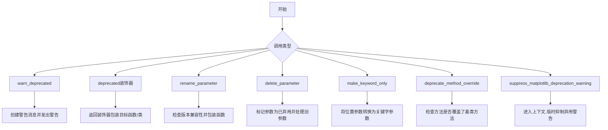
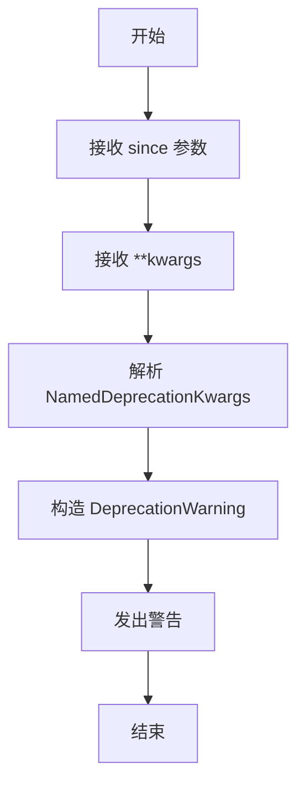
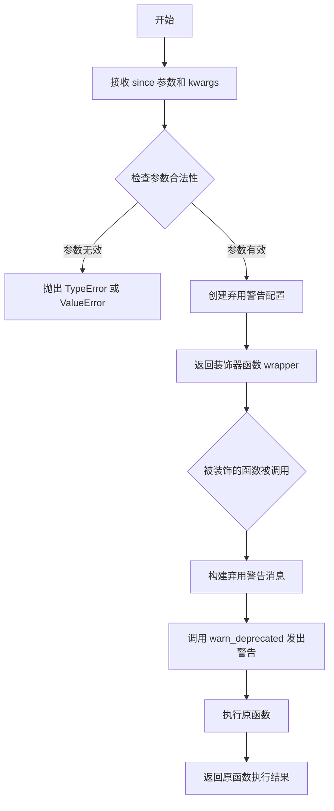
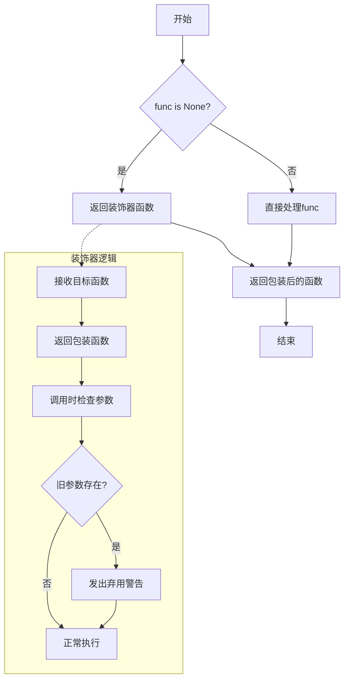
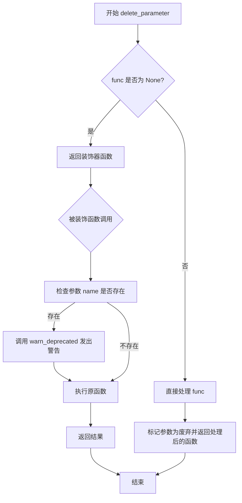
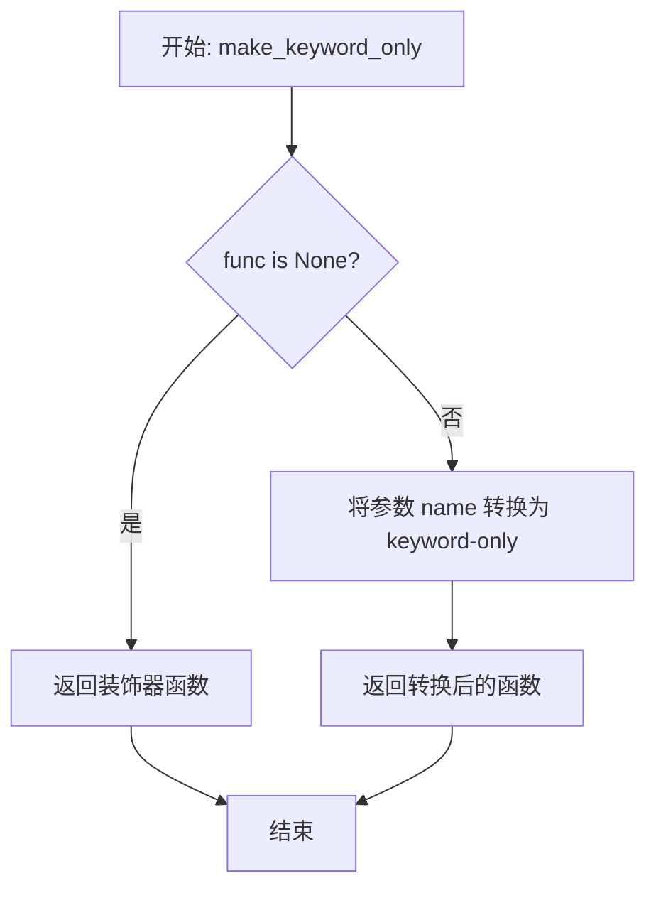
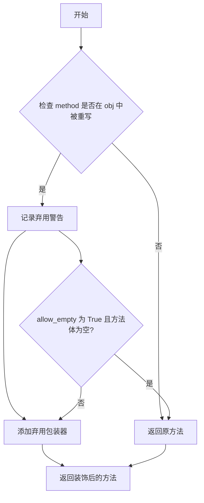
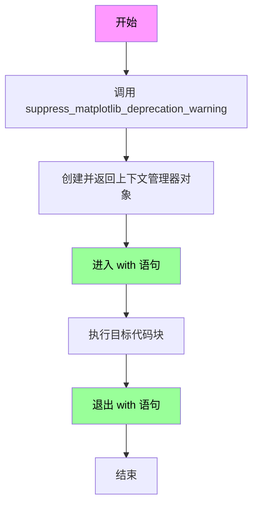
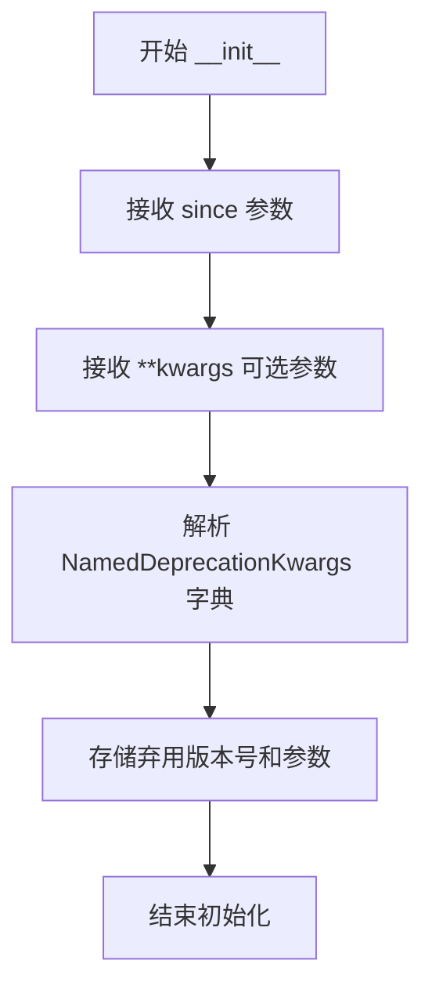
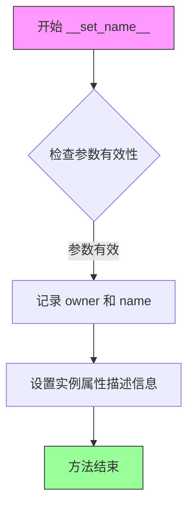

# `matplotlib\lib\matplotlib\_api\deprecation.pyi` 详细设计文档

该代码文件提供了一套完整的弃用(deprecation)管理工具,用于帮助库开发者标记和管理API的弃用状态,包括警告提示、参数重命名、参数删除、参数强制关键字传递等功能,并支持自定义弃用信息和上下文管理。

## 整体流程



## 类结构

```
DeprecationUtils (弃用工具模块)
├── TypedDict类层次
│   ├── DeprecationKwargs (基础弃用参数)
│   └── NamedDeprecationKwargs (带名称的弃用参数)
├── 警告类
│   └── MatplotlibDeprecationWarning
├── 装饰器类
│   ├── deprecate_privatize_attribute (属性私有化装饰器)
│   └── _deprecated_parameter_class (内部参数类)
└── 工具函数
    ├── warn_deprecated
    ├── deprecated
    ├── rename_parameter
    ├── delete_parameter
    ├── make_keyword_only
    ├── deprecate_method_override
    └── suppress_matplotlib_deprecation_warning
```

## 全局变量及字段


### `DECORATORS`
    
存储已注册的装饰器及其包装函数的映射表，用于管理函数装饰

类型：`dict[Callable, Callable]`
    


### `_deprecated_parameter`
    
用于标记参数已弃用的内部类实例，支持参数级别的弃用管理

类型：`_deprecated_parameter_class`
    


### `_P`
    
类型参数规范，用于保留函数的参数签名信息，支持高阶类型操作

类型：`ParamSpec`
    


### `_R`
    
通用类型变量，用于表示函数的返回类型，在泛型函数中传递返回类型信息

类型：`TypeVar`
    


### `_T`
    
通用类型变量，用于表示被装饰的函数或类的原始类型，保持类型一致性

类型：`TypeVar`
    


### `DeprecationKwargs.message`
    
弃用警告的详细描述信息，说明为什么要弃用以及相关背景

类型：`str`
    


### `DeprecationKwargs.alternative`
    
推荐使用的替代方案或API，帮助用户迁移到新的实现

类型：`str`
    


### `DeprecationKwargs.pending`
    
标记弃用是否为待定状态，待定弃用不会立即生效但已标记为将来移除

类型：`bool`
    


### `DeprecationKwargs.obj_type`
    
被弃用对象的类型标识，如function、class、parameter等

类型：`str`
    


### `DeprecationKwargs.addendum`
    
额外的补充说明信息，可提供更详细的迁移指南或注意事项

类型：`str`
    


### `DeprecationKwargs.removal`
    
计划移除的版本号，False表示尚未确定移除时间

类型：`str | Literal[False]`
    


### `NamedDeprecationKwargs.name`
    
被弃用项的名称，用于在警告信息中精确标识具体对象

类型：`str`
    


### `deprecate_privatize_attribute.since`
    
标记弃用开始的版本号，用于确定何时开始发出弃用警告

类型：`str`
    


### `deprecate_privatize_attribute.kwargs`
    
传递给弃用装饰器的额外参数，包含弃用原因、替代方案等元数据

类型：`Unpack[NamedDeprecationKwargs]`
    
    

## 全局函数及方法


### `warn_deprecated`

该函数用于向用户发出弃用警告，通知用户某个功能或参数已弃用，并将从指定版本开始移除。它接受一个必需的 `since` 参数（表示弃用发生的版本）以及多个可选的 kwargs 来提供详细的弃用信息。

参数：

- `since`：`str`，必需参数，表示该功能从哪个版本开始被弃用
- `**kwargs`：`Unpack[NamedDeprecationKwargs]`（展开的 `NamedDeprecationKwargs` 类型），可选关键字参数，包含以下字段：
  - `message`：自定义警告消息
  - `alternative`：建议的替代方案
  - `pending`：是否为待处理弃用
  - `obj_type`：弃用对象的类型
  - `addendum`：额外的补充说明
  - `removal`：计划移除的版本或 `False`
  - `name`：被弃用项的名称

返回值：`None`，该函数不返回任何值，仅通过警告机制通知用户

#### 流程图



#### 带注释源码

```python
def warn_deprecated(
    since: str,              # 必需的参数，表示弃用开始的版本号
    **kwargs: Unpack[NamedDeprecationKwargs]  # 可变关键字参数，包含弃用详情
) -> None: ...               # 返回类型为 None，仅触发警告而不返回值
```


### `deprecated`

该函数是一个装饰器，用于标记函数或方法已弃用。它接受一个 `since` 参数指定弃用版本，并可通过关键字参数配置弃用消息、替代方案等信息，返回一个可调用对象用于包装被弃用的函数。

参数：

- `since`：`str`，指定从哪个版本开始弃用
- `**kwargs`：`Unpack[NamedDeprecationKwargs]`（可选），包含弃用相关配置的可变关键字参数，支持以下键值：
  - `message`：`str`，自定义弃用消息
  - `alternative`：`str`，建议的替代方案
  - `pending`：`bool`，是否为待定弃用
  - `obj_type`：`str`，被弃用对象的类型
  - `addendum`：`str`，附加说明
  - `removal`：`str | Literal[False]`，计划移除版本，`False` 表示不会移除
  - `name`：`str`，被弃用对象的名称

返回值：`Callable[[_T], _T]`（一个泛型可调用对象），返回装饰器函数，用于包装被弃用的函数或方法并在其调用时发出弃用警告。

#### 流程图



#### 带注释源码

```python
def deprecated(
    since: str,  # 弃用生效的版本号
    **kwargs: Unpack[NamedDeprecationKwargs]  # 额外的弃用配置参数
) -> Callable[[_T], _T]:  # 返回一个装饰器函数
    """
    标记函数或方法已弃用的装饰器。
    
    使用方式:
        @deprecated("2.0")
        def old_function():
            pass
        
        @deprecated("2.0", alternative="new_function", removal="3.0")
        def old_method(self):
            pass
    
    参数:
        since: 指定从哪个版本开始弃用，例如 "1.4" 或 "2.0"
        kwargs: 包含弃用配置的字典，支持以下键:
            - message: 自定义弃用消息
            - alternative: 建议使用的新函数/方法
            - pending: 是否为待定弃用（不会立即显示警告）
            - obj_type: 对象的类型描述
            - addendum: 附加的说明信息
            - removal: 计划移除的版本，False 表示永久弃用
            - name: 被弃用对象的名称
    
    返回:
        返回一个装饰器函数，该函数接收被弃用的函数并返回包装后的版本
    """
    ...
```


### `rename_parameter`

该函数是一个参数重命名装饰器，用于在函数参数发生变更时提供向后兼容性支持，允许旧参数名继续使用并发出弃用警告。

参数：

- `since`：`str`，指定从哪个版本开始弃用旧参数
- `old`：`str`，被弃用的旧参数名称
- `new`：`str`，新的参数名称
- `func`：`Callable[_P, _R] | None`，可选的目标函数，若为`None`则返回装饰器

返回值：`Callable[_P, _R]`，返回包装后的函数，当使用旧参数时会触发弃用警告

#### 流程图



#### 带注释源码

```python
@overload
def rename_parameter(
    since: str,  # 弃用起始版本
    old: str,    # 被弃用的旧参数名
    new: str,    # 新的参数名
    func: None = ...  # 当func为None时，返回装饰器
) -> Callable[[Callable[_P, _R]], Callable[_P, _R]]: ...

@overload
def rename_parameter(
    since: str,  # 弃用起始版本
    old: str,    # 被弃用的旧参数名
    new: str,    # 新的参数名
    func: Callable[_P, _R]  # 目标函数
) -> Callable[_P, _R]: ...

# 实际实现（代码中未显示，通过重载推断其行为）
def rename_parameter(since: str, old: str, new: str, func: Callable[_P, _R] | None = None):
    """
    参数重命名装饰器工厂函数
    
    使用示例:
        @rename_parameter("3.6", "verbose", "verbosity")
        def func(verbosity: int): ...
    """
    pass
```


### `delete_parameter`

该函数是一个用于标记函数参数已废弃的装饰器工厂函数，通过重载支持直接调用或作为装饰器使用，返回处理后的可调用对象或装饰器。

参数：

- `since`：`str`，表示从哪个版本开始废弃该参数
- `name`：`str`，要删除的参数的名称
- `func`：`Callable[_P, _R] | None`，可选参数，当为 `None` 时作为装饰器使用，当为可调用对象时直接处理该函数
- `**kwargs`：`Unpack[DeprecationKwargs]`，包含废弃信息的可选关键字参数（如 message、alternative、pending 等）

返回值：`Callable[_P, _R]`，处理后的函数或装饰器

#### 流程图



#### 带注释源码

```python
@overload
def delete_parameter(
    since: str,  # 废弃起始版本
    name: str,   # 要删除的参数名
    func: None = ...,  # 默认为 None，用于装饰器模式
    **kwargs: Unpack[DeprecationKwargs]  # 废弃相关参数
) -> Callable[[Callable[_P, _R]], Callable[_P, _R]]:
    """当 func 为 None 时，返回装饰器"""
    ...

@overload
def delete_parameter(
    since: str,  # 废弃起始版本
    name: str,   # 要删除的参数名
    func: Callable[_P, _R],  # 要处理的函数
    **kwargs: Unpack[DeprecationKwargs]  # 废弃相关参数
) -> Callable[_P, _R]:
    """当 func 为可调用对象时，直接处理并返回"""
    ...
```


### `make_keyword_only`

该函数是一个参数弃用装饰器工厂，用于将指定的位置参数转换为仅限关键字参数（keyword-only argument），从而在后续版本中废弃该参数的位置调用方式。

参数：

- `since`：`str`，表示从哪个版本开始进行此参数变更
- `name`：`str`，需要转换为关键字-only 的参数名称
- `func`：`Callable[_P, _R] | None`，要处理的函数。如果为 `None`，则返回装饰器；如果提供了函数，则直接返回转换后的函数

返回值：

- 当 `func` 为 `None` 时：返回 `Callable[[Callable[_P, _R]], Callable[_P, _R]]` 类型的装饰器
- 当 `func` 不为 `None` 时：返回 `Callable[_P, _R]` 类型的转换后的函数

#### 流程图



#### 带注释源码

```python
# 由于提供的代码片段仅包含函数签名和重载声明，
# 以下为基于函数签名的推断性实现注释

from collections.abc import Callable
from typing import TypeVar, ParamSpec, overload

_P = ParamSpec("_P")
_R = TypeVar("_R")

@overload
def make_keyword_only(
    since: str,      # 变更生效的版本号
    name: str,       # 要转为 keyword-only 的参数名
    func: None = ... # 未提供函数，返回装饰器
) -> Callable[[Callable[_P, _R]], Callable[_P, _R]]:
    """当 func 为 None 时，返回一个装饰器"""
    ...

@overload
def make_keyword_only(
    since: str,                    # 变更生效的版本号
    name: str,                     # 要转为 keyword-only 的参数名
    func: Callable[_P, _R]  # 直接传入函数，返回转换后的函数
) -> Callable[_P, _R]:
    """当 func 不为 None 时，直接转换并返回函数"""
    ...

def make_keyword_only(
    since: str,
    name: str,
    func: Callable[_P, _R] | None = None
) -> Callable[_P, _R] | Callable[[Callable[_P, _R]], Callable[_P, _R]]:
    """
    将指定参数转换为 keyword-only 参数的装饰器/转换函数
    
    参数:
        since: 版本号字符串，如 '3.0'，表示从该版本开始参数必须作为关键字参数传入
        name: 要转换为 keyword-only 的参数名称
        func: 要转换的函数，None 表示返回装饰器
    
    返回:
        转换后的函数或装饰器
    """
    # 实现逻辑（推断）:
    # 1. 获取原函数的参数签名
    # 2. 找到名为 name 的参数位置
    # 3. 在该参数前插入 * 或 *args 以强制其为 keyword-only
    # 4. 添加弃用警告，提示用户该参数将在未来版本中必须作为关键字参数使用
    # 5. 返回转换后的函数
    ...
```


### `deprecate_method_override`

该函数是一个装饰器工厂，用于标记类中方法的重写为已弃用。当被装饰的方法在子类中被重写时，会发出弃用警告，提示开发者该方法已弃用并建议使用替代方案。

参数：

- `method`：`Callable[_P, _R]`，需要检查的被重写方法
- `obj`：`object | type`，包含该方法的对象或类
- `allow_empty`：`bool`，可选参数，是否允许方法体为空（默认 `...`，表示 True）
- `since`：`str`，弃用开始的版本号
- `**kwargs`：`Unpack[NamedDeprecationKwargs]`，额外的弃用参数（如 message、alternative 等）

返回值：`Callable[_P, _R]`，装饰后的方法

#### 流程图



#### 带注释源码

```python
def deprecate_method_override(
    method: Callable[_P, _R],
    obj: object | type,
    *,
    allow_empty: bool = ...,
    since: str,
    **kwargs: Unpack[NamedDeprecationKwargs]
) -> Callable[_P, _R]:
    """
    标记类方法的重写为已弃用。
    
    Args:
        method: 需要检查的被重写方法
        obj: 包含该方法的对象或类
        allow_empty: 是否允许方法体为空
        since: 弃用开始的版本号
        **kwargs: 额外的弃用参数
    
    Returns:
        装饰后的方法
    """
    # 检查方法是否在给定的类或对象中被重写
    # 如果被重写，则发出弃用警告
    # 根据 allow_empty 参数决定是否允许空方法体
    
    # 返回带有弃用警告的装饰方法
    ...
```


### `suppress_matplotlib_deprecation_warning`

该函数返回一个上下文管理器（context manager），用于在代码块执行期间临时抑制 Matplotlib 的弃用警告（DeprecationWarning）。当用户希望在不显示特定 Matplotlib 弃用警告的情况下运行代码时，可使用此函数。

参数：

- 该函数无参数

返回值：`contextlib.AbstractContextManager[None]`，返回一个上下文管理器对象，用于进入和退出抑制警告的代码块

#### 流程图



#### 带注释源码

```python
def suppress_matplotlib_deprecation_warning() -> (
    contextlib.AbstractContextManager[None]
):
    """
    创建一个上下文管理器，用于抑制 Matplotlib 的弃用警告。
    
    返回类型:
        contextlib.AbstractContextManager[None]: 
        一个上下文管理器，进入时设置警告过滤器忽略 Matplotlib 相关的
        DeprecationWarning，退出时恢复原有的警告设置。
        
    使用示例:
        >>> with suppress_matplotlib_deprecation_warning():
        ...     # 在此处执行可能触发 Matplotlib 弃用警告的代码
        ...     pass
    """
    ...
```


### `deprecate_privatize_attribute.__init__`

这是 `deprecate_privatize_attribute` 类的构造函数，用于初始化一个属性弃用装饰器实例，接收版本号和弃用相关的命名参数。

参数：

- `since`：`str`，表示该属性被弃用时的版本号
- `**kwargs`：`Unpack[NamedDeprecationKwargs]`（即 `message: str | None`、`alternative: str | None`、`pending: bool | None`、`obj_type: str | None`、`addendum: str | None`、`removal: str | Literal[False] | None`、`name: str | None`），可选的弃用参数，包含弃用消息、替代方案、待定状态、对象类型、附录和移除版本等信息

返回值：`None`，构造函数不返回值

#### 流程图



#### 带注释源码

```python
class deprecate_privatize_attribute(Any):
    """
    用于将公开属性降级为私有属性的装饰器类。
    继承自 Any 类型，用于标记弃用的属性。
    """
    
    def __init__(self, since: str, **kwargs: Unpack[NamedDeprecationKwargs]) -> None:
        """
        初始化 deprecate_privatize_attribute 实例。
        
        参数:
            since: 属性被弃用的版本号字符串，如 '3.0'
            **kwargs: 包含弃用信息的可选关键字参数:
                - message: 自定义弃用消息
                - alternative: 推荐的替代方案
                - pending: 是否为待定弃用
                - obj_type: 弃用对象的类型描述
                - addendum: 额外的说明文本
                - removal: 计划移除的版本或 False
                - name: 被弃用属性的名称
        
        返回值:
            None: 构造函数不返回任何值
        
        示例:
            class MyClass:
                old_attr = deprecate_privatize_attribute('3.0', alternative='new_attr')
        """
        ...
```


### `deprecate_privatize_attribute.__set_name__`

这是一个Python特殊方法（dunder method），当类属性被赋值时自动调用，用于为deprecate_privatize_attribute描述符设置拥有的类属性名称。

参数：

- `self`：`deprecate_privatize_attribute`，类的实例自身
- `owner`：`type[object]`，拥有该属性的类对象
- `name`：`str`，被赋值的属性名称

返回值：`None`，无返回值

#### 流程图



#### 带注释源码

```python
def __set_name__(self, owner: type[object], name: str) -> None:
    """
    特殊方法，当此类作为属性被赋值给类时自动调用。
    
    参数:
        owner: 拥有此属性的类对象
        name: 被赋值的属性名称
        
    返回:
        None
    """
    # 这个方法在描述符协议中用于设置属性的描述名称
    # 当 deprecate_privatize_attribute 的实例被赋值给类属性时
    # Python 会自动调用此方法，传入 owner（所属类）和 name（属性名）
    pass  # 方法体为空，仅用于满足描述符协议要求
```

## 关键组件


### DeprecationKwargs 和 NamedDeprecationKwargs

类型字典类，定义了弃用相关的元数据，包括消息、替代方案、挂起状态、对象类型、附录和移除版本等信息。

### warn_deprecated

全局函数，根据提供的 `since` 版本发出弃用警告，支持自定义警告消息和替代方案等参数。

### deprecated

装饰器工厂函数，返回一个装饰器，用于将函数或类标记为已弃用，在使用时发出警告。

### deprecate_privatize_attribute

类，用于将属性标记为已弃用并私有化，支持版本跟踪和自定义弃用消息。

### DECORATORS

全局字典变量，存储弃用相关装饰器的映射关系。

### rename_parameter

函数/装饰器，支持将函数参数从旧名称重命名为新名称，支持版本跟踪和条件重命名。

### _deprecated_parameter_class 和 _deprecated_parameter

内部类及其单例实例，提供参数弃用的底层实现支持。

### delete_parameter

函数/装饰器，用于标记函数参数为已删除/已弃用，支持版本信息。

### make_keyword_only

函数/装饰器，将函数参数转换为仅关键字参数形式，支持版本跟踪。

### deprecate_method_override

函数，用于检测和警告子类中对父类方法的覆盖行为，支持可选的空方法检查。

### suppress_matplotlib_deprecation_warning

上下文管理器函数，提供临时抑制matplotlib弃用警告的能力。


## 问题及建议


### 已知问题

-   `MatplotlibDeprecationWarning` 继承自 `DeprecationWarning`，在 Python 中 `DeprecationWarning` 默认被抑制，可能导致弃用警告不会显示给用户，需要显式启用或改用 `UserWarning`。
-   `deprecate_privatize_attribute` 类继承自 `Any` 类型，这是代码异味，`Any` 是动态类型，不应作为基类使用，应考虑使用 `object` 或适当的抽象基类。
-   `_deprecated_parameter` 声明为全局变量但类型为 `_deprecated_parameter_class`（未定义具体实现），且全局变量 `DECORATORS` 初始化为 `...`，表明可能是占位符或未完成实现。
-   多个函数（`warn_deprecated`、`deprecated`、各种装饰器函数）仅有函数签名声明而缺少实际实现代码，难以验证其功能正确性。
-   `deprecate_method_override` 函数接受 `**kwargs` 但与 `NamedDeprecationKwargs` 类型可能存在不一致，缺乏严格的类型约束。
-   代码缺少单元测试、集成测试以及使用示例，API 的可用性难以验证。
-   缺少错误处理逻辑，例如无效的 `since` 版本格式、重复的参数名称等边界情况未做处理。

### 优化建议

-   将 `MatplotlibDeprecationWarning` 改为继承自 `UserWarning` 或在文档中明确说明如何启用该警告的显示。
-   移除 `deprecate_privatize_attribute` 对 `Any` 的继承，改为直接继承 `object` 或实现适当的描述器协议（Descriptor Protocol）。
-   补全 `_deprecated_parameter_class` 和 `DECORATORS` 的实现，或在文档中说明其为内部实现细节。
-   为所有导出的函数和类添加详细的文档字符串（docstring），包括参数说明、返回值说明和使用示例。
-   增加输入验证逻辑，例如验证 `since` 参数的版本格式是否符合语义化版本规范（Semantic Versioning）。
-   添加类型注解的运行时验证或使用 `pydantic` 等库进行数据验证。
-   考虑添加日志记录功能，将弃用警告同时输出到日志系统而非仅使用 `warnings.warn()`。
-   提供迁移指南文档，帮助下游开发者理解如何处理弃用警告和迁移代码。


## 其它


### 设计目标与约束

该库的核心设计目标是提供一个灵活且统一的机制，用于在代码中标记和处理弃用(deprecation)功能。主要约束包括：1) 保持与Python标准库typing的兼容性，支持Python 3.9+；2) 使用TypeScript风格的TypedDict确保类型安全；3) 遵循Matplotlib项目的编码规范；4) 提供静态类型检查支持以集成到IDE中。

### 错误处理与异常设计

该模块定义了专门的弃用警告类MatplotlibDeprecationWarning，继承自Python标准DeprecationWarning。通过warn_deprecated函数发出警告，支持自定义消息、替代方案、待处理状态等元数据。警告的触发时机在调用被装饰的函数时，而非导入时，以避免不必要的干扰。

### 数据流与状态机

数据流主要沿着装饰器链传递：调用方 → 被装饰函数 → 装饰器逻辑 → 警告发射 → 原函数执行。状态转换包括：参数检查阶段(验证old/new参数) → 警告生成阶段 → 函数调用阶段。对于pending状态的弃用，流程会延迟警告直到实际调用。

### 外部依赖与接口契约

主要依赖包括：typing模块(标准库)、typing_extensions用于向后兼容(Python < 3.11)、contextlib用于上下文管理器实现。接口契约方面：装饰器必须返回可调用对象；参数重命名/删除/转keywordonly需要提供版本号since；所有函数签名使用ParamSpec和TypeVar保持类型完整。

### 安全性考虑

该模块主要处理运行时警告，不涉及敏感数据处理。潜在安全考量包括：避免在警告消息中泄露内部实现细节；对用户提供的alternative参数进行长度限制以防止日志注入；deprecated装饰器应防止对原函数签名的恶意修改。

### 性能特征

装饰器在函数定义时执行一次解析，运行时开销主要是参数检查和警告发射。警告系统依赖Python内置warnings模块，默认情况下DeprecationWarning会被静默忽略(需显式启用)，因此对生产性能影响最小。使用functools.wraps保持原函数元数据，避免额外的属性查找开销。

### 并发考虑

该模块本身是线程安全的，因为警告发射和函数调用是原子的。装饰器创建的包装函数不维护共享状态。在多线程环境中，warnings.warn的输出可能被交错，但Python的warnings模块会处理竞态条件。suppress_matplotlib_deprecation_warning作为上下文管理器适合用于线程局部作用域。

### 国际化/本地化

当前实现不包含国际化支持，警告消息均为英文。如需扩展，可通过gettext或类似的i18n框架包装消息字符串，并提供对应语言的消息目录。主要需要本地化的字符串包括：默认警告消息模板、替代方案提示、addendum附加文本。

### 测试策略

建议的测试覆盖包括：1) 单元测试验证各装饰器的行为；2) 参数验证测试(无效的since版本、冲突的old/new参数)；3) 警告消息内容验证；4) 类型检查测试使用mypy/pytest-mypy-plugins；5) 集成测试验证与Matplotlib其他组件的交互；6) 回归测试确保弃用功能在版本迁移期间正常工作。

### 版本兼容性

该库设计支持Python 3.9+。通过typing_extensions提供Unpack等特性的向后兼容。对于Python 3.11+原生支持的特性，使用版本条件导入。API层面保持稳定，装饰器的签名变更需要通过弃用流程引入。

### 使用示例

典型用法包括：标记函数参数重命名(@rename_parameter)、标记参数删除(@delete_parameter)、标记参数转为仅关键字(@make_keyword_only)、标记方法覆盖弃用(@deprecate_method_override)、标记类属性弃用(deprecate_privatize_attribute)。

### 常见用例模式

1) API演进：逐步移除旧参数，引导用户使用新API；2) 内部重构：对内部方法进行privatize，同时保持向后兼容；3) 版本追踪：通过since参数记录弃用版本，便于未来清理；4) 条件警告：通过pending标志实现"待定弃用"给予用户过渡期。

    