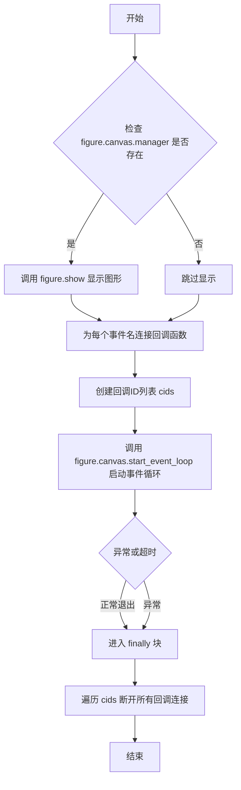

# `matplotlib\lib\matplotlib\_blocking_input.py` 详细设计文档

该函数用于在图形界面中运行事件循环，监听指定的事件（如鼠标按键、键盘输入等），并通过处理程序响应这些事件，同时支持超时控制和处理程序提前退出事件循环。

## 整体流程

```mermaid
graph TD
    A[开始] --> B{figure.canvas.manager 存在?}
B -- 是 --> C[调用 figure.show() 显示图形]
B -- 否 --> D[跳过显示图形]
C --> E[为每个事件名连接处理程序]
D --> E
E --> F[启动事件循环 figure.canvas.start_event_loop(timeout)]
F --> G{事件循环结束}
G --> H[断开所有事件连接]
H --> I[结束]
style A fill:#f9f,stroke:#333,stroke-width:2px
style I fill:#f9f,stroke:#333,stroke-width:2px
```

## 类结构

```
无类层次结构（单一函数模块）
└── blocking_input_loop 函数
```

## 全局变量及字段


### `figure`
    
matplotlib figure对象，用于显示图形并处理事件

类型：`matplotlib.figure.Figure`
    


### `event_names`
    
要监听的事件名称列表，如'mouse_press'、'key_press'等

类型：`list of str`
    


### `timeout`
    
事件循环的超时时间（秒），如果为正数则超时后自动停止

类型：`float`
    


### `handler`
    
事件处理函数，接收Event对象并执行自定义逻辑，可通过调用canvas.stop_event_loop()提前退出事件循环

类型：`Callable[[Event], Any]`
    


### `cids`
    
事件回调的连接ID列表，用于在事件循环结束后断开连接

类型：`list`
    


    

## 全局函数及方法


### `blocking_input_loop`

该函数用于运行图形的事件循环并监听交互事件，将`event_names`中列出的事件传递给`handler`处理函数。它被用于实现`Figure.waitforbuttonpress`、`Figure.ginput`和`Axes.clabel`功能，支持超时控制并可在处理程序中通过调用`canvas.stop_event_loop()`强制提前退出事件循环。

参数：

- `figure`：`matplotlib.figure.Figure`，要运行事件循环的图形对象
- `event_names`：`list of str`，要传递给handler的事件名称列表
- `timeout`：`float`，如果为正数，事件循环将在timeout秒后停止
- `handler`：`Callable[[Event], Any]`，每个事件的处理函数，可以通过调用`canvas.stop_event_loop()`强制提前退出事件循环

返回值：`None`，该函数没有返回值

#### 流程图



#### 带注释源码

```python
def blocking_input_loop(figure, event_names, timeout, handler):
    """
    Run *figure*'s event loop while listening to interactive events.

    The events listed in *event_names* are passed to *handler*.

    This function is used to implement `.Figure.waitforbuttonpress`,
    `.Figure.ginput`, and `.Axes.clabel`.

    Parameters
    ----------
    figure : `~matplotlib.figure.Figure`
    event_names : list of str
        The names of the events passed to *handler*.
    timeout : float
        If positive, the event loop is stopped after *timeout* seconds.
    handler : Callable[[Event], Any]
        Function called for each event; it can force an early exit of the event
        loop by calling ``canvas.stop_event_loop()``.
    """
    # 检查图形是否有canvas管理器，如果有则显示图形
    # 确保在管理图形时图形被显示出来
    if figure.canvas.manager:
        figure.show()  # Ensure that the figure is shown if we are managing it.
    
    # 将事件连接到on_event函数调用
    # 为每个事件名称注册处理程序回调，返回回调ID列表
    cids = [figure.canvas.mpl_connect(name, handler) for name in event_names]
    try:
        # 启动事件循环，可选超时时间
        figure.canvas.start_event_loop(timeout)  # Start event loop.
    finally:  # Run even on exception like ctrl-c.
        # 断开所有回调连接
        # 即使发生异常（如ctrl-c）也会执行清理
        for cid in cids:
            figure.canvas.mpl_disconnect(cid)
```

## 关键组件


### 阻塞式事件循环管理器 (blocking_input_loop)

这是Matplotlib中实现交互式图形事件处理的底层核心函数，负责在指定时间窗口内监听并分发用户交互事件（如鼠标点击、键盘按键）给指定的处理器，同时确保事件监听器在超时或异常情况下正确清理。

### 事件连接器 (mpl_connect)

负责将事件名称（如'button_press_event', 'key_press_event'）绑定到用户提供的handler回调函数，并返回唯一的连接ID（cid），以便后续断开连接。

### 事件循环启动器 (start_event_loop)

启动Qt/GTK等后端的事件循环，阻塞当前线程直到超时（timeout参数）或被handler调用stop_event_loop()主动停止，实现同步等待用户交互的功能。

### 资源清理机制 (mpl_disconnect)

在finally块中确保即使发生异常（如Ctrl+C中断），也会遍历所有已注册的事件连接ID并断开，防止事件监听器泄漏和内存泄漏。


## 问题及建议


### 已知问题

-   **参数验证缺失**：未对输入参数进行有效性检查，如`figure`为`None`、`event_names`为空列表、`timeout`为负数或`handler`不可调用等情况均未处理，可能导致运行时错误
-   **异常处理不完整**：`handler`在事件处理过程中抛出异常时，`start_event_loop`可能无法正常停止，且异常信息可能被吞掉
-   **`figure.canvas.manager`为`None`时存在隐患**：当`manager`为`None`时调用`figure.show()`后，后续的`start_event_loop`调用可能会失败，但代码未对此进行保护
-   **返回值信息丢失**：函数没有返回值，无法区分事件循环是由于用户交互触发还是超时而退出，调用方无法获取足够的退出原因信息
-   **timeout参数语义不明确**：文档说明"positive"才停止，但未说明零值或负值的处理逻辑，代码中也未做断言或特殊处理
-   **资源泄漏风险**：如果`mpl_connect`在循环中某个点失败，已成功连接的事件处理器不会回滚，可能导致资源泄漏

### 优化建议

-   在函数入口添加参数验证：`assert figure is not None`、`assert callable(handler)`、`assert isinstance(timeout, (int, float))`
-   使用上下文管理器（`with`语句）或`try/except/finally`结构更精细地处理异常，确保资源正确释放
-   对`figure.canvas`为`None`或`manager`为`None`的情况提前检查并抛出有意义的异常
-   考虑返回事件循环的退出状态（如`True`表示用户触发，`False`表示超时），或在`handler`中添加返回值机制
-   在`timeout <= 0`时添加明确的处理逻辑或文档说明其行为
-   改进事件连接逻辑，使用异常捕获确保部分连接失败时可以回滚已成功的连接


## 其它


### 设计目标与约束

该函数的主要设计目标是提供一个阻塞式的事件循环机制，用于在matplotlib中实现交互式事件等待功能（如等待按钮按下、图形输入、坐标标签点击等）。设计约束包括：必须在超时后自动退出、必须在异常情况下清理事件回调连接、必须确保图形在事件循环开始前已显示。

### 错误处理与异常设计

函数本身不直接抛出异常，错误处理依赖于matplotlib的Figure和Canvas对象。figure.canvas.manager可能为None，此时不会调用figure.show()。如果figure.canvas.start_event_loop()内部抛出异常，finally块仍会执行以确保回调被正确断开连接。超时机制由matplotlib后端实现，正数超时值触发超时，None或负数表示无限等待。

### 外部依赖与接口契约

该函数依赖matplotlib.figure.Figure、matplotlib.backend_bases.GraphicsContextBase以及后端特定的Canvas实现。figure参数必须为有效的Figure实例；event_names必须是事件名称字符串列表（如'button_press_event'、'key_press_event'）；timeout为float类型，正数表示秒数，None表示无限期；handler为可调用对象，接受Event参数。函数返回None。

### 性能考虑

每次调用都会创建和销毁事件回调连接（cids列表），在高频繁调用场景下可能存在开销。回调的连接和断开操作O(n)，其中n为事件名称数量。事件循环的阻塞性质可能导致UI线程冻结，需在GUI编程中合理使用。

### 线程安全性

该函数设计为在主线程中运行，matplotlib的事件循环通常不是线程安全的。如果在多线程环境中调用，需要确保figure对象和canvas对象的线程安全性。start_event_loop和mpl_connect/mpl_disconnect的线程安全性取决于具体后端实现。

### 使用场景与示例

该函数被Figure.waitforbuttonpress、Figure.ginput和Axes.clabel等方法内部调用。典型使用场景包括：等待用户点击图形获取坐标、等待用户按下键盘按键、在标签编辑模式下等待用户点击特定标签等。


    