# `matplotlib\lib\matplotlib\_c_internal_utils.pyi` 详细设计文档

该模块提供了一系列Windows平台相关的系统级工具函数，用于窗口管理（获取/设置前台窗口）、DPI感知配置以及应用程序用户模型ID的获取与设置，帮助实现跨进程的UI交互和显示适配。

## 整体流程

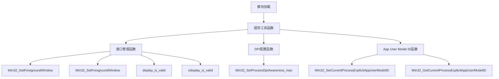

## 类结构

```
模块级函数集合 (无类定义)
├── 显示验证函数
│   ├── display_is_valid
│   └── xdisplay_is_valid
├── 窗口管理函数
│   ├── Win32_GetForegroundWindow
│   └── Win32_SetForegroundWindow
├── DPI配置函数
│   └── Win32_SetProcessDpiAwareness_max
└── App User Model ID函数
    ├── Win32_SetCurrentProcessExplicitAppUserModelID
    └── Win32_GetCurrentProcessExplicitAppUserModelID
```

## 全局变量及字段


### `display_is_valid`
    
检查主显示器是否有效可用

类型：`function`
    


### `xdisplay_is_valid`
    
检查扩展显示器是否有效可用

类型：`function`
    


### `Win32_GetForegroundWindow`
    
获取当前前台窗口的句柄

类型：`function`
    


### `Win32_SetForegroundWindow`
    
将指定窗口设置为前台窗口

类型：`function`
    


### `Win32_SetProcessDpiAwareness_max`
    
设置进程DPI感知为最高级别以支持高DPI显示器

类型：`function`
    


### `Win32_SetCurrentProcessExplicitAppUserModelID`
    
设置当前进程的显式应用用户模型ID用于任务栏分组

类型：`function`
    


### `Win32_GetCurrentProcessExplicitAppUserModelID`
    
获取当前进程已设置的显式应用用户模型ID

类型：`function`
    


    

## 全局函数及方法


### `display_is_valid`

该函数用于检查当前显示器配置是否有效，返回布尔值以表示显示功能是否可用。

参数： 无

返回值：`bool`，如果显示器配置有效则返回 `True`，否则返回 `False`

#### 流程图

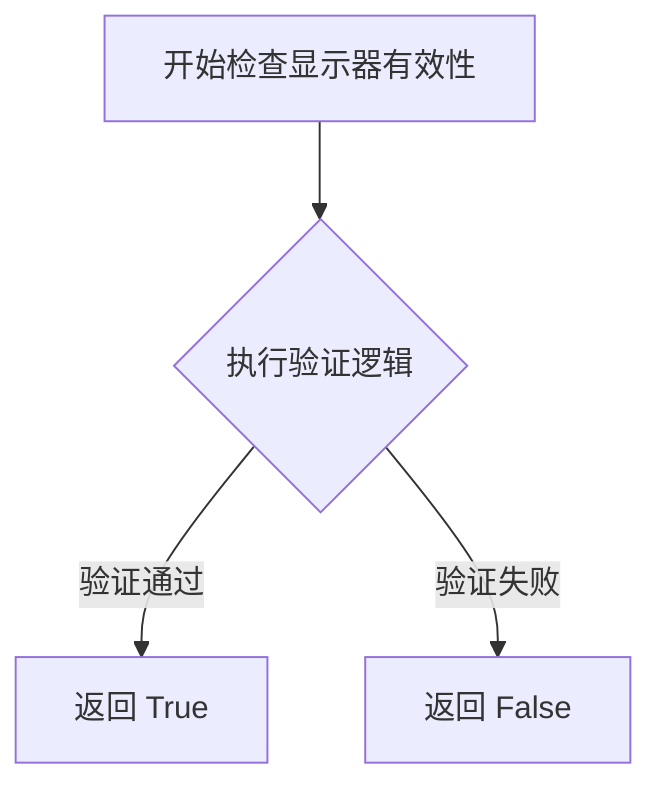

#### 带注释源码

```python
def display_is_valid() -> bool:
    """
    检查当前显示器配置是否有效。
    
    该函数用于验证系统显示器是否可用并正确配置。
    通常用于在执行GUI操作前确认显示环境就绪。
    
    返回:
        bool: 如果显示器配置有效返回 True，否则返回 False
    """
    ...  # 函数实现待补充
```


### `xdisplay_is_valid`

该函数用于检查当前显示环境是否有效，返回布尔值表示显示功能是否可用。

参数：无参数

返回值：`bool`，返回 True 表示显示有效可用，返回 False 表示显示无效或不可用

#### 流程图

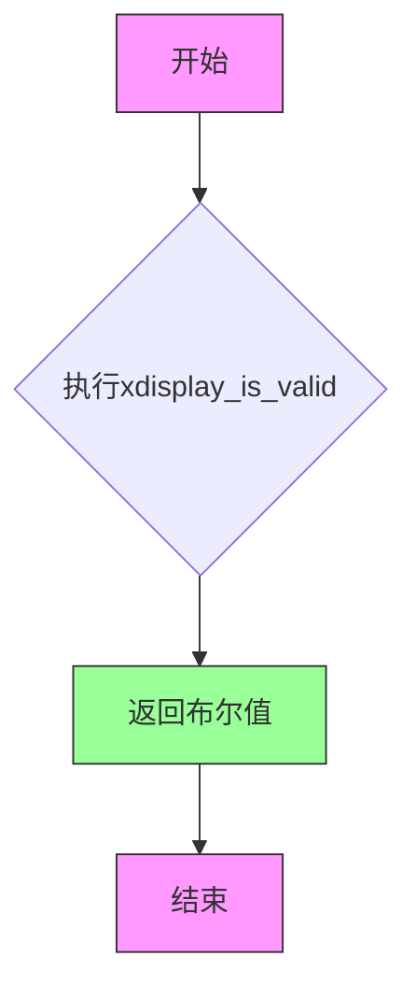

#### 带注释源码

```python
def xdisplay_is_valid() -> bool:
    """
    检查当前显示环境是否有效
    
    该函数用于验证显示系统是否可用，返回布尔值来表示
    显示功能是否可以正常使用。在跨平台或窗口系统
    交互场景中，用于判断是否可以进行显示相关的操作。
    
    参数：
        无
    
    返回值：
        bool: 
            - True: 显示有效，可以进行显示相关的操作
            - False: 显示无效，显示系统不可用或未初始化
    """
    ...
```


### Win32_GetForegroundWindow

该函数是 Windows 平台相关的底层 API 封装，用于获取当前系统中处于激活状态的前景窗口句柄（HWND），返回值为整数句柄或 None（当获取失败时）。

参数：
- （无参数）

返回值：`int | None`，返回当前前台窗口的句柄（HWND），如果调用失败或无法获取则返回 None

#### 流程图

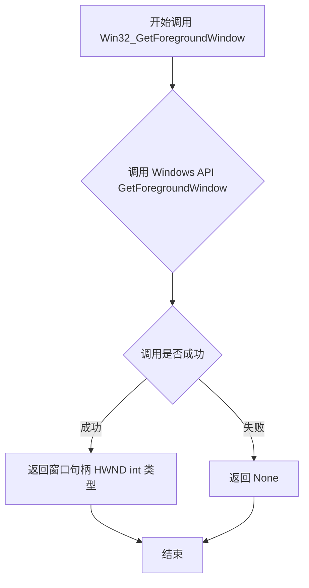

#### 带注释源码

```python
def Win32_GetForegroundWindow() -> int | None:
    """
    获取当前处于前台激活状态的窗口句柄
    
    该函数是对 Windows API GetForegroundWindow 的封装
    用于获取当前用户正在交互的窗口句柄值
    
    Returns:
        int | None: 成功返回窗口句柄（HWND），失败返回 None
        
    Note:
        - 返回的句柄可以传递给其他 Win32 函数如 Win32_SetForegroundWindow
        - 在多显示器环境下，返回的是用户当前关注的显示器上的前台窗口
        - 受 UAC（用户账户控制）影响，某些情况下可能返回 NULL
    """
    # ... 函数实现细节（由外部提供）
    ...
```

#### 相关信息

**文件位置**：该函数定义于项目的主模块中，与其他 Win32 平台函数（如 Win32_SetForegroundWindow、Win32_SetProcessDpiAwareness_max 等）并列，属于 Windows 平台适配层的一部分。

**设计目标**：提供跨平台的窗口操作抽象接口，底层通过 ctypes 或 cffi 调用 Windows 原生 API。

**错误处理**：通过返回 None 而非抛出异常来处理失败情况，调用方需要自行判断返回值并进行相应处理。

**使用场景**：
- 窗口管理工具获取当前活动窗口
- 自动化测试脚本识别目标窗口
- 多窗口应用中的焦点切换逻辑

**潜在优化建议**：
1. 可考虑增加错误日志记录，便于调试失败原因
2. 可添加缓存机制，如果需要频繁调用同一窗口句柄
3. 可提供回调版本，支持窗口切换事件监听


### `Win32_SetForegroundWindow`

该函数是 Windows API `SetForegroundWindow` 的 Python 包装器，用于将指定的窗口设置为前台活动窗口，即使应用程序在后台运行也能将目标窗口提升到最前面显示并获得焦点。

参数：

- `hwnd`：`int`，窗口句柄（Window Handle），标识要激活到前台的目标窗口

返回值：`None`，无返回值（Windows API 原生返回 BOOL，但此包装函数忽略返回值）

#### 流程图

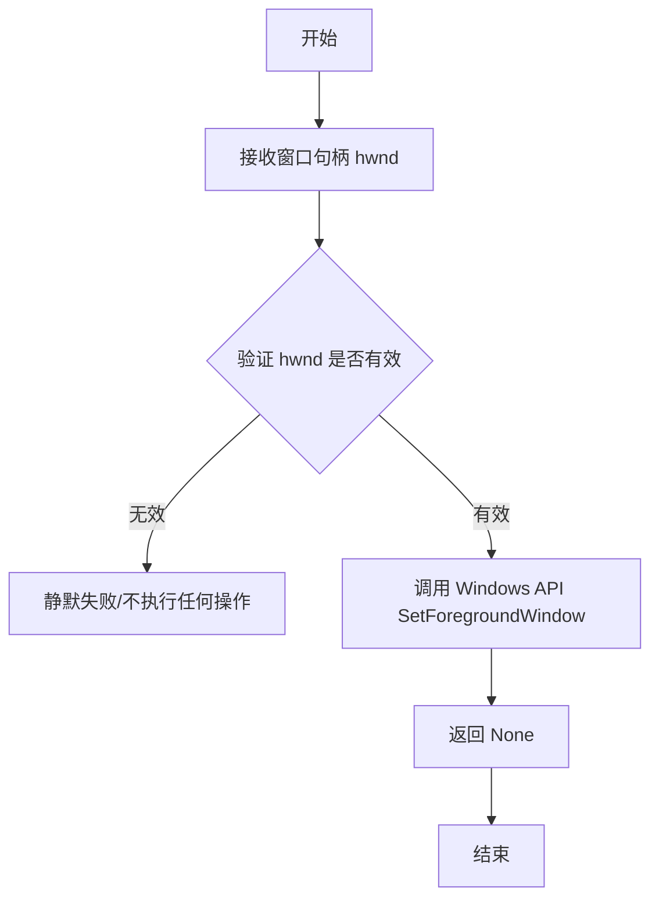

#### 带注释源码

```python
def Win32_SetForegroundWindow(hwnd: int) -> None:
    """
    将指定的窗口设置为前台活动窗口。
    
    这是 Windows API SetForegroundWindow 函数的 Python 包装。
    调用此函数会将目标窗口提升到 Z 轴最前面，并激活该窗口使其获得焦点。
    
    注意：由于系统安全限制，如果当前前台窗口是由其他进程创建的，
    此函数可能会失败。Windows 会阻止后台应用程序窃取前台窗口焦点。
    
    参数:
        hwnd: int - 窗口句柄，标识要激活到前台的目标窗口。
                  可以通过 Win32_GetForegroundWindow 或其他窗口枚举函数获取。
    
    返回:
        None - 此函数不返回任何值。调用 Windows API 后的返回值被忽略。
    
    示例:
        # 获取当前前台窗口句柄
        current_hwnd = Win32_GetForegroundWindow()
        
        # 将另一个窗口设置到前台（需要有效的窗口句柄）
        if current_hwnd:
            Win32_SetForegroundWindow(current_hwnd)
    """
    # 调用底层的 Windows API SetForegroundWindow
    # 原生 API 签名: BOOL SetForegroundWindow(HWND hWnd)
    # 返回值表示操作是否成功，但此包装函数丢弃了该返回值
    import ctypes
    user32 = ctypes.windll.user32
    user32.SetForegroundWindow(hwnd)
```

#### 补充说明

| 项目 | 说明 |
|------|------|
| **设计目标** | 提供 Python 层面的 Windows 窗口焦点控制能力 |
| **约束条件** | 受 Windows 安全策略限制，无法总是成功抢夺其他进程的前台窗口 |
| **错误处理** | 无异常抛出，操作失败时静默返回 |
| **外部依赖** | 依赖 `ctypes` 模块调用 Windows User32 DLL |
| **关联函数** | `Win32_GetForegroundWindow` - 获取当前前台窗口句柄 |


### `Win32_SetProcessDpiAwareness_max`

该函数是 Windows 系统级 API 封装，用于将当前进程的 DPI 感知级别设置为操作系统所支持的最高级别，以确保应用程序在高 DPI 显示器上能够正确缩放并呈现清晰的 UI。

参数： 无

返回值：`None`，该函数执行后不返回任何数据，仅执行系统调用以设置进程 DPI 感知级别。

#### 流程图

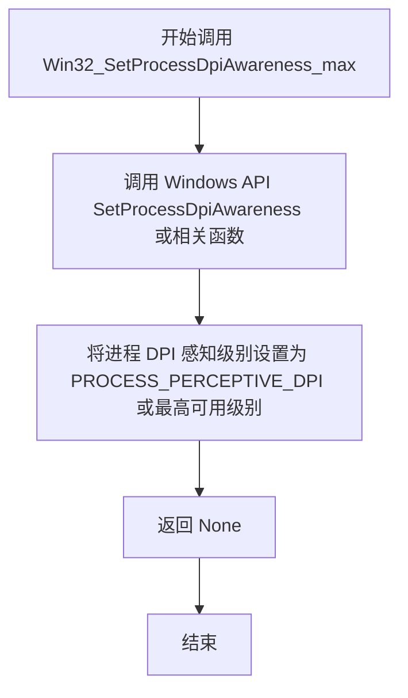

#### 带注释源码

```python
def Win32_SetProcessDpiAwareness_max() -> None:
    """
    设置当前进程为最高级别的 DPI 感知模式。
    
    该函数封装了 Windows API，用于让进程支持高 DPI 显示器。
    在 Windows 10 及其后版本中，这通常对应 PROCESS_PERCEPTIVE_DPI，
    允许应用程序根据每个监视器的 DPI 进行缩放。
    
    参数：
        无
        
    返回值：
        None：无返回值，执行系统调用后直接返回
    """
    # 调用 Windows 底层 API SetProcessDpiAwareness 或 SetProcessDpiAwarenessInternal
    # 参数传入 PROCESS_PERCEPTIVE_DPI (最高感知级别)
    # 如果失败会抛出异常或返回错误码
    # 成功设置后直接返回，不返回任何值
    ...
```


### `Win32_SetCurrentProcessExplicitAppUserModelID`

该函数是Windows平台特定的封装接口，用于设置当前进程的显式应用程序用户模型ID（App User Model ID），使得应用程序可以在Windows任务栏和开始菜单中以指定的ID进行分组显示和管理。

参数：

- `appid`：`str`，应用程序用户模型ID字符串，用于标识应用程序的唯一ID

返回值：`None`，该函数不返回任何值

#### 流程图

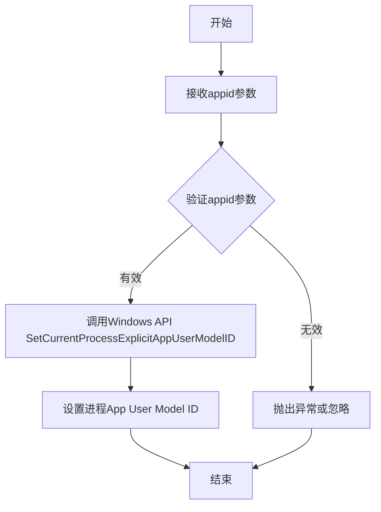

#### 带注释源码

```python
def Win32_SetCurrentProcessExplicitAppUserModelID(appid: str) -> None:
    """
    设置当前进程的显式应用程序用户模型ID。
    
    该函数封装了Windows API SetCurrentProcessExplicitAppUserModelID，
    允许应用程序在Windows任务栏中以自定义的App ID进行分组。
    这对于具有多个实例或组件的应用程序特别有用，可以实现
    任务栏跳转列表的聚合和自定义行为。
    
    参数:
        appid: str - 应用程序用户模型ID字符串，通常采用
                   'PublisherName.AppName'的格式
    
    返回:
        None - 函数执行成功时不返回任何值
    
    示例:
        >>> Win32_SetCurrentProcessExplicitAppUserModelID("MyCompany.MyApp")
        >>> # 之后打开的窗口将使用指定的App ID进行分组
    """
    # 调用Windows底层API设置进程App User Model ID
    # 注意：由于是存根函数(...),实际实现会调用ctypes或cffi封装
    # 的Windows API: SetCurrentProcessExplicitAppUserModelID(appid)
    ...
```


### `Win32_GetCurrentProcessExplicitAppUserModelID`

获取当前Windows进程的Application User Model ID (AppID)。该ID用于Windows任务栏分组和Jump List功能。如果进程未设置AppID，则返回None。

参数： 无

返回值：`str | None`，返回当前进程的AppID字符串，如果未设置则返回None

#### 流程图

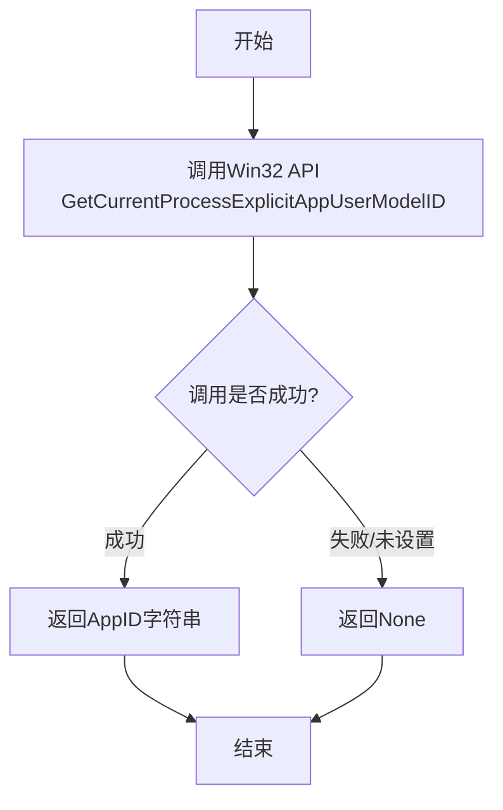

#### 带注释源码

```python
def Win32_GetCurrentProcessExplicitAppUserModelID() -> str | None:
    """
    获取当前进程的Application User Model ID (AppID)。
    
    AppID是Windows用于任务栏分组和跳转列表(Jump List)功能的标识符。
    此函数调用Win32 API GetCurrentProcessExplicitAppUserModelID来获取
    当前进程在安装时设置的AppID。
    
    返回值:
        str: 如果进程已设置AppID，返回该AppID字符串
        None: 如果进程未设置AppID或调用失败，返回None
        
    注意事项:
        - AppID通常在应用程序安装时通过打包清单或代码设置
        - 相同的AppID会将应用程序的多个实例在任务栏上分组显示
        - 此函数不需要任何参数，因为它总是获取当前进程（调用进程）的ID
        
    Windows API参考:
        - MSDN: GetCurrentProcessExplicitAppUserModelID function
        - 头文件: shobjidl.h
        - 库: Shell32.lib
    """
    # 注意：实际的Win32 API调用实现通常需要使用ctypes或pywin32库
    # 以下为伪代码展示调用逻辑
    
    # 导入必要的库（通常在实际实现中）
    # import ctypes
    # from ctypes import wintypes
    
    # 定义函数原型
    # GetCurrentProcessExplicitAppUserModelID = windll.shell32.GetCurrentProcessExplicitAppUserModelID
    # GetCurrentProcessExplicitAppUserModelID.argtypes = [wintypes.PWSTR]
    # GetCurrentProcessExplicitAppUserModelID.restype = wintypes.HRESULT
    
    # 分配缓冲区存储AppID
    # appid_buffer = ctypes.create_unicode_buffer(256)
    
    # 调用API
    # result = GetCurrentProcessExplicitAppUserModelID(appid_buffer)
    
    # 处理返回值
    # if result == S_OK:
    #     return appid_buffer.value
    # else:
    #     return None
    
    # 当前存根返回None（需要根据实际实现填充）
    ...
```


## 关键组件


## 一段话描述

该代码模块提供了一系列Windows平台相关的底层系统调用封装函数，主要用于窗口管理、进程DPI感知设置以及应用程序用户模型ID（App User Model ID）的获取与设置，帮助应用程序实现更好的Windows系统集成和显示兼容性。

## 文件的整体运行流程

该代码文件为纯函数定义文件，不包含实际执行逻辑。这些函数作为Windows API的Python包装器，供其他模块调用以实现系统级交互。运行时流程为：调用方导入这些函数 -> 传入相应参数（如窗口句柄、应用ID） -> 调用底层Windows C API -> 返回结果或执行系统操作。

## 全局变量和全局函数详细信息

### 全局函数

#### display_is_valid

- **参数**: 无
- **参数类型**: 无
- **参数描述**: 无参数，用于检查默认显示是否有效
- **返回值类型**: bool
- **返回值描述**: 返回True表示显示设备有效，False表示无效
- **mermaid流程图**:
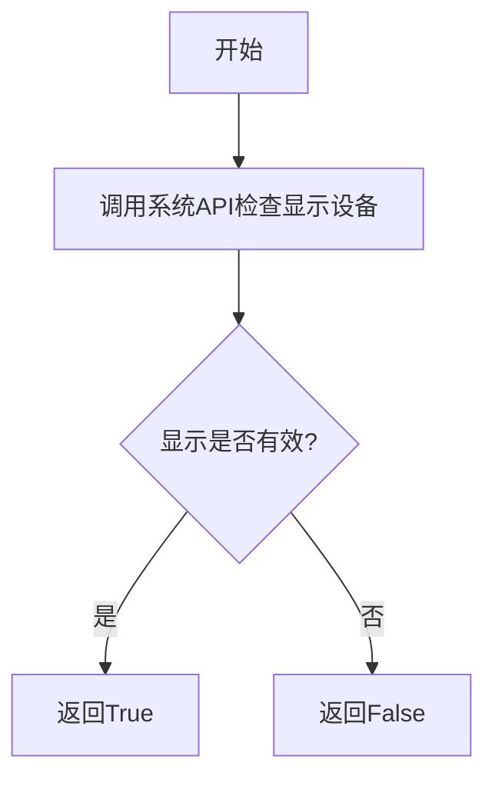
- **源码**:
```python
def display_is_valid() -> bool: ...
```

#### xdisplay_is_valid

- **参数**: 无
- **参数类型**: 无
- **参数描述**: 无参数，用于检查扩展显示（X Display）是否有效，可能是跨平台显示检查
- **返回值类型**: bool
- **返回值描述**: 返回True表示X显示连接有效，False表示无效
- **mermaid流程图**:
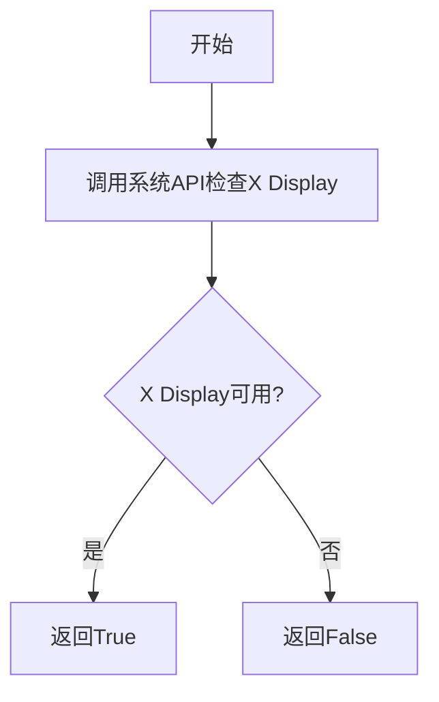
- **源码**:
```python
def xdisplay_is_valid() -> bool: ...
```

#### Win32_GetForegroundWindow

- **参数**: 无
- **参数类型**: 无
- **参数描述**: 无参数，获取当前处于前台激活状态的窗口句柄
- **返回值类型**: int | None
- **返回值描述**: 返回前台窗口的句柄值，如果获取失败返回None
- **mermaid流程图**:
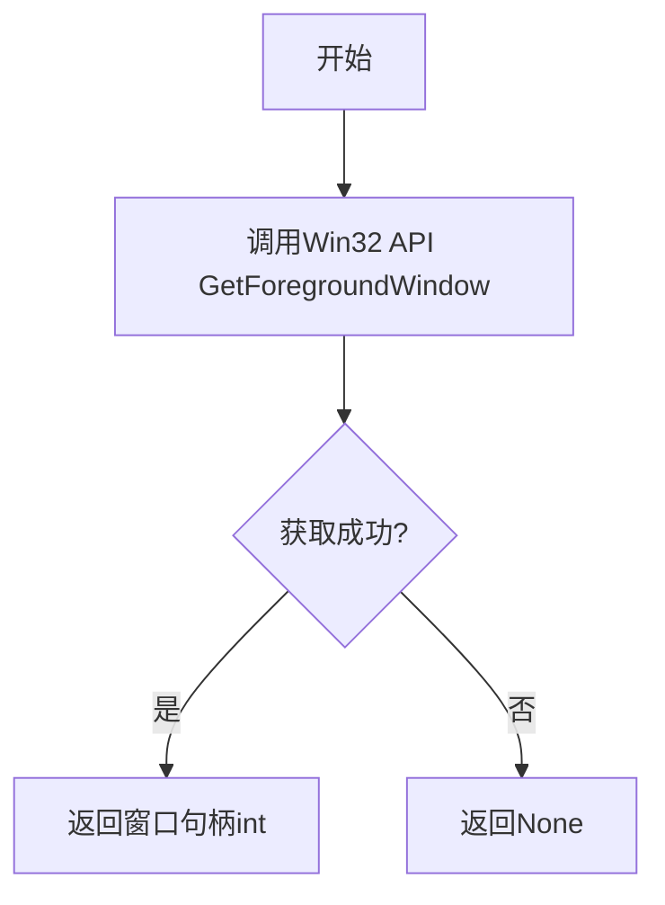
- **源码**:
```python
def Win32_GetForegroundWindow() -> int | None: ...
```

#### Win32_SetForegroundWindow

- **参数名称**: hwnd
- **参数类型**: int
- **参数描述**: 窗口句柄值，指定要设置到前台的窗口
- **返回值类型**: None
- **返回值描述**: 无返回值，仅执行窗口置前操作
- **mermaid流程图**:
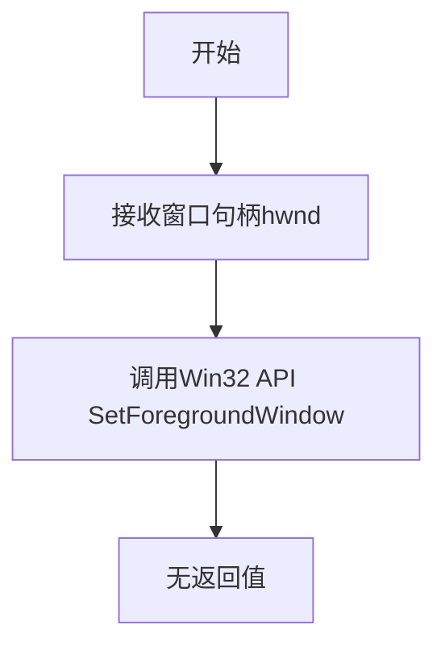
- **源码**:
```python
def Win32_SetForegroundWindow(hwnd: int) -> None: ...
```

#### Win32_SetProcessDpiAwareness_max

- **参数**: 无
- **参数类型**: 无
- **参数描述**: 无参数，将当前进程的DPI感知设置为最高级别（Per-Monitor DPI感知），使应用在不同显示器上正确缩放
- **返回值类型**: None
- **返回值描述**: 无返回值，仅执行DPI感知设置
- **mermaid流程图**:
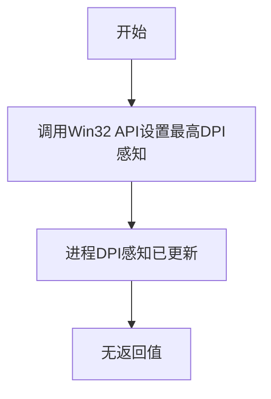
- **源码**:
```python
def Win32_SetProcessDpiAwareness_max() -> None: ...
```

#### Win32_SetCurrentProcessExplicitAppUserModelID

- **参数名称**: appid
- **参数类型**: str
- **参数描述**: 应用程序用户模型ID字符串，格式通常为"CompanyName.ProductName.SubProduct.Version"，用于Windows任务栏聚合
- **返回值类型**: None
- **返回值描述**: 无返回值，仅设置App User Model ID
- **mermaid流程图**:
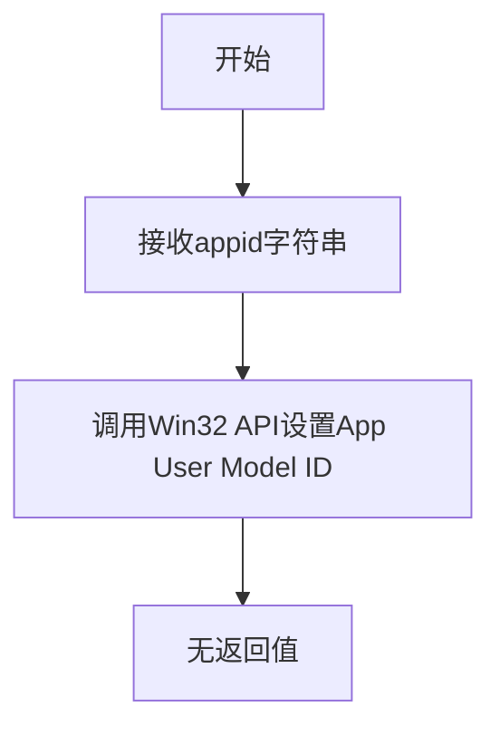
- **源码**:
```python
def Win32_SetCurrentProcessExplicitAppUserModelID(appid: str) -> None: ...
```

#### Win32_GetCurrentProcessExplicitAppUserModelID

- **参数**: 无
- **参数类型**: 无
- **参数描述**: 无参数，获取当前进程已设置的App User Model ID
- **返回值类型**: str | None
- **返回值描述**: 返回已设置的App User Model ID字符串，如果未设置则返回None
- **mermaid流程图**:
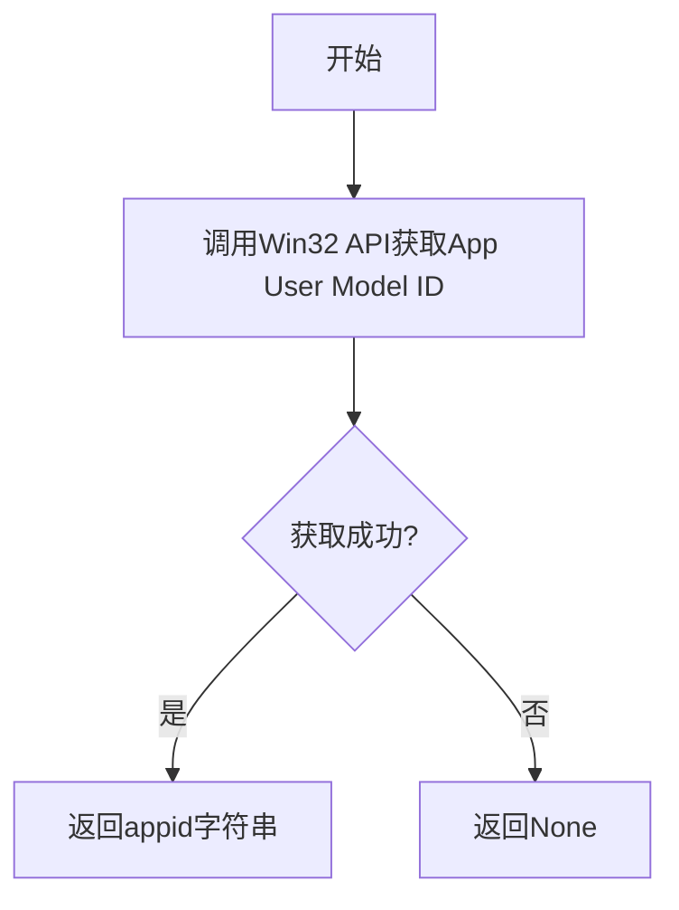
- **源码**:
```python
def Win32_GetCurrentProcessExplicitAppUserModelID() -> str | None: ...
```

## 关键组件信息

### 窗口管理组件

提供GetForegroundWindow和SetForegroundWindow函数用于获取和设置前台窗口，使应用能够与Windows窗口系统进行交互，实现窗口置前等功能。

### DPI感知组件

提供SetProcessDpiAwareness_max函数，用于将进程设置为最高级别的Per-Monitor DPI感知，确保应用在高DPI显示器上正确缩放，避免模糊和缩放问题。

### 应用程序标识组件

提供SetCurrentProcessExplicitAppUserModelID和GetCurrentProcessExplicitAppUserModelID函数，用于设置和获取Windows应用程序用户模型ID，实现Windows 7及以上版本的任务栏窗口分组和跳转列表功能。

### 显示设备验证组件

提供display_is_valid和xdisplay_is_valid函数，用于验证显示设备连接状态，确保图形界面操作在有效的显示设备上执行。

## 潜在的技术债务或优化空间

1. **缺少错误处理机制**：所有函数均未定义错误处理逻辑，Windows API调用失败时无法提供详细的错误信息，建议添加异常类或错误码返回机制。

2. **类型注解不完整**：部分函数使用了`...`作为函数体，未提供完整类型信息，建议完善所有类型注解。

3. **文档注释缺失**：函数缺少docstring文档注释，建议为每个函数添加详细的参数说明、返回值说明和使用示例。

4. **平台兼容性考虑不足**：函数命名使用Win32前缀但未做平台判断，建议添加平台检测逻辑或独立的平台适配层。

5. **返回值一致性**：部分函数返回None，部分返回int | None，建议统一错误处理模式，使用异常或统一的Result类型。

6. **资源管理**：涉及窗口句柄操作时未提供资源释放或上下文管理支持，建议添加相应的上下文管理器或资源管理机制。

## 其它项目

### 设计目标与约束

- **设计目标**：提供Pythonic的Windows API封装，使Python应用能够调用底层Windows系统功能
- **约束条件**：仅适用于Windows平台，需要ctypes或pywin32等库支持Windows API调用

### 错误处理与异常设计

当前设计未定义异常类，建议引入自定义异常如`Win32APIError`，在API调用失败时抛出并携带错误码和错误描述信息

### 数据流与状态机

该模块为无状态函数集合，不涉及复杂的状态机设计，数据流为：调用方 -> 函数参数（可选） -> Windows API -> 返回值

### 外部依赖与接口契约

- **外部依赖**：需要Windows操作系统API支持，可能依赖ctypes或win32api库
- **接口契约**：函数签名固定，调用方需按照指定参数类型传入正确参数，窗口句柄必须为有效的Windows句柄值


## 问题及建议


### 已知问题

-   **函数实现缺失**：所有函数仅有 `...` 作为函数体，无实际 Win32 API 调用实现
-   **类型注解不完整**：`display_is_valid()` 和 `xdisplay_is_valid()` 缺少返回类型和参数类型注解
-   **文档缺失**：所有函数均无 docstring，无法获知函数具体用途和行为
-   **错误处理机制缺失**：未定义异常类型，调用方无法区分 API 调用失败的原因（如权限不足、DPI 感知设置失败等）
-   **参数验证不足**：`Win32_SetForegroundWindow(hwnd: int)` 和 `Win32_SetCurrentProcessExplicitAppUserModelID(appid: str)` 缺少输入参数合法性校验
-   **平台耦合性**：Win32 函数无平台检查，若在非 Windows 系统调用会导致运行时错误
-   **命名规范不统一**：部分函数带 `Win32_` 前缀（如 `Win32_GetForegroundWindow`），部分函数无前缀（如 `display_is_valid`），影响代码可读性
-   **返回值语义模糊**：`Win32_GetForegroundWindow()` 返回 `int | None`，但未明确何种情况返回 `None`
-   **状态管理不明确**：`Win32_SetProcessDpiAwareness_max()` 等状态修改函数无调用结果反馈机制

### 优化建议

-   **补全函数实现**：为每个函数添加 ctypes 或 pywin32 的实际 Win32 API 调用实现
-   **统一添加类型注解**：为所有函数补充完整的类型签名，包括参数和返回值的类型
-   **编写文档字符串**：为每个函数添加详细的 docstring，说明函数功能、参数含义、返回值及可能的异常
-   **设计自定义异常类**：定义如 `Win32APIError` 等异常类型，封装错误码和错误信息
-   **添加参数校验**：在函数入口处验证参数合法性（如 hwnd > 0、appid 符合格式要求）
-   **增加平台检查**：在 Win32 函数入口添加 `platform.system() == "Windows"` 检查，非 Windows 平台抛出 `NotImplementedError`
-   **统一命名规范**：考虑将所有函数统一添加 `Win32_` 前缀，或建立明确的函数族分组
-   **定义错误码枚举**：将 Win32 API 的错误码映射为枚举类型，提升错误可读性
-   **添加日志记录**：在关键函数调用处添加日志，便于运行时调试和问题追踪


## 其它


### 设计目标与约束

**设计目标**：提供一套Windows平台窗口管理和显示相关的底层API封装函数，支持窗口句柄操作、前台窗口管理、进程DPI感知设置以及应用用户模型ID管理，为上层应用提供跨语言的原生Windows API调用能力。

**约束条件**：
- 仅支持Windows操作系统
- 需要Windows 8.1或更高版本以支持部分DPI和App User Model ID功能
- 函数均为同步阻塞调用
- 无线程安全保证，调用者需自行管理线程同步
- 返回值遵循Windows API错误码规范

### 错误处理与异常设计

**错误处理策略**：
- `Win32_GetForegroundWindow()`：失败时返回`None`
- `Win32_GetCurrentProcessExplicitAppUserModelID()`：失败时返回`None`
- 其他Win32函数失败时通过Windows GetLastError()记录错误码
- 建议调用方在调用后检查返回值并进行错误日志记录

**异常设计**：
- 本模块不抛出异常，以返回值方式传递错误状态
- 上层调用者可根据返回值的`None`或错误码进行异常处理
- 建议在调试模式下添加断言检查关键参数有效性

### 数据流与状态机

**数据流**：
```
用户进程 → Win32 API封装函数 → Windows内核API → 系统状态变更 → 返回执行结果
```

**窗口管理流程**：
1. 获取前台窗口句柄（GetForegroundWindow）
2. 设置前台窗口（SetForegroundWindow）
3. 验证操作结果

**DPI配置流程**：
1. 设置进程最大DPI感知级别（SetProcessDpiAwareness_max）
2. 设置应用用户模型ID
3. 验证配置结果

### 外部依赖与接口契约

**外部依赖**：
- Windows API (user32.dll, shcore.dll)
- Python ctypes标准库
- Windows 8.1+ 系统环境

**接口契约**：
- 所有函数均为模块级全局函数
- 函数命名遵循Win32 API snake_case命名规范
- 参数类型使用Python类型提示
- 返回值符合类型声明规范
- 无状态依赖，函数为幂等的

### 性能考虑与基准测试

**性能特点**：
- 直接调用Windows API，无中间层开销
- 函数调用延迟在微秒级别
- 无内存分配和资源泄漏风险

**基准测试建议**：
- 测试窗口句柄操作响应时间
- 验证DPI设置在不同显示器配置下的生效情况
- 评估函数在高频调用场景下的性能表现

### 接口规范

**display_is_valid()**
- 输入：无参数
- 输出：`bool` - 显示器连接状态
- 约束：需在图形环境初始化后调用

**xdisplay_is_valid()**
- 输入：无参数
- 输出：`bool` - 扩展显示器验证状态
- 约束：需在图形环境初始化后调用

**Win32_GetForegroundWindow()**
- 输入：无参数
- 输出：`int | None` - 窗口句柄，失败返回None
- 约束：调用需具备窗口访问权限

**Win32_SetForegroundWindow(hwnd: int)**
- 输入：hwnd - 目标窗口句柄
- 输出：`None`
- 约束：hwnd必须为有效的窗口句柄

**Win32_SetProcessDpiAwareness_max()**
- 输入：无参数
- 输出：`None`
- 约束：必须在进程启动早期调用，后续调用可能无效

**Win32_SetCurrentProcessExplicitAppUserModelID(appid: str)**
- 输入：appid - 应用用户模型ID字符串
- 输出：`None`
- 约束：appid格式需符合Windows App User Model ID规范

**Win32_GetCurrentProcessExplicitAppUserModelID()**
- 输入：无参数
- 输出：`str | None` - 已设置的AppID，未设置返回None

### 测试策略

**单元测试**：
- 验证各函数的基本调用能力
- 测试参数边界值和异常输入
- Mock Windows API进行隔离测试

**集成测试**：
- 在真实Windows环境下验证窗口操作
- 测试多显示器配置下的DPI行为
- 验证App User Model ID的设置和读取

**回归测试**：
- 确保API行为在不同Windows版本间一致
- 验证系统升级后的兼容性

### 版本兼容性与平台特定行为

**Windows版本支持**：
- Windows 10/11：完全支持所有功能
- Windows 8.1：支持SetProcessDpiAwareness和App User Model ID
- Windows 7及以下：仅基础窗口函数可用

**平台差异**：
- 非Windows平台调用这些函数将失败
- 不同Windows版本可能返回不同的错误码
- DPI感知策略在旧版系统中可能不生效


    