# `matplotlib\lib\matplotlib\_cm.py` 详细设计文档

This file contains dictionaries for generating LinearSegmentedColormaps in matplotlib, providing predefined color palette data for various scientific visualization colormaps including standard colormaps (binary, bone, cool, cubehelix, etc.), ColorBrewer palettes, Gnuplot palettes, Gist palettes, and qualitative palettes for data visualization.

## 整体流程

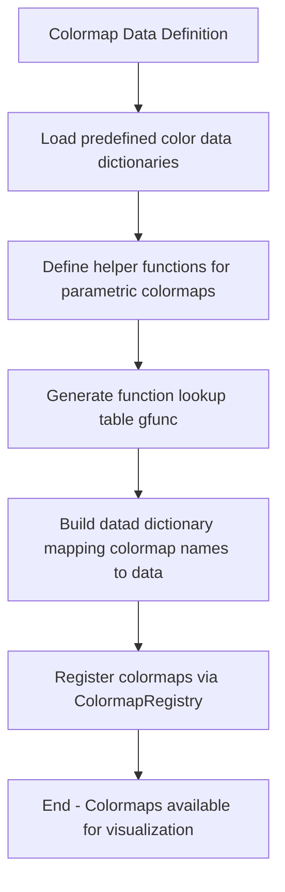

## 类结构

```
No class hierarchy - Data-driven module with functions and global variables
```

## 全局变量及字段


### `_binary_data`
    
Binary colormap data with simple red/green/blue transitions (black to white)

类型：`dict`
    


### `_autumn_data`
    
Autumn colormap data transitioning from red to yellow

类型：`dict`
    


### `_bone_data`
    
Bone colormap data with blue-white-gray color sequence

类型：`dict`
    


### `_cool_data`
    
Cool colormap data transitioning from cyan to magenta

类型：`dict`
    


### `_copper_data`
    
Copper colormap data with black-orange-white sequence

类型：`dict`
    


### `_flag_data`
    
Flag colormap data using sinusoidal functions for red/green/blue channels

类型：`dict`
    


### `_prism_data`
    
Prism colormap data using sinusoidal functions for color cycling

类型：`dict`
    


### `_cubehelix_data`
    
Cubehelix colormap data with monotonically increasing perceived brightness

类型：`dict`
    


### `_bwr_data`
    
Blue-White-Red (bwr) diverging colormap data tuple

类型：`tuple`
    


### `_brg_data`
    
Blue-Red-Green (brg) cyclic colormap data tuple

类型：`tuple`
    


### `_gnuplot_data`
    
Gnuplot colormap data combining multiple gfunc functions

类型：`dict`
    


### `_gnuplot2_data`
    
Gnuplot2 colormap data with different function mappings

类型：`dict`
    


### `_ocean_data`
    
Ocean colormap data with blue-green color sequence

类型：`dict`
    


### `_afmhot_data`
    
Afmhot (after hot) colormap data transitioning from black to white via orange

类型：`dict`
    


### `_rainbow_data`
    
Rainbow colormap data with multiple function combinations

类型：`dict`
    


### `_seismic_data`
    
Seismic diverging colormap data tuple (blue-white-red)

类型：`tuple`
    


### `_terrain_data`
    
Terrain colormap data with geographic color stops

类型：`tuple`
    


### `_gray_data`
    
Gray colormap data for simple grayscale mapping

类型：`dict`
    


### `_hot_data`
    
Hot colormap data transitioning from black through red-yellow to white

类型：`dict`
    


### `_hsv_data`
    
HSV colormap data with hue cycling through full spectrum

类型：`dict`
    


### `_jet_data`
    
Jet colormap data with blue-cyan-yellow-red color sequence

类型：`dict`
    


### `_pink_data`
    
Pink colormap data with extended grayscale through pink tones

类型：`dict`
    


### `_spring_data`
    
Spring colormap data with magenta-yellow transition

类型：`dict`
    


### `_summer_data`
    
Summer colormap data with green-yellow color sequence

类型：`dict`
    


### `_winter_data`
    
Winter colormap data with blue-green color sequence

类型：`dict`
    


### `_nipy_spectral_data`
    
Nipy Spectral colormap data with full rainbow spectrum

类型：`dict`
    


### `_Blues_data`
    
ColorBrewer Blues sequential colormap data

类型：`tuple`
    


### `_BrBG_data`
    
ColorBrewer Brown-Blue-Green diverging colormap data

类型：`tuple`
    


### `_BuGn_data`
    
ColorBrewer Blue-Green sequential colormap data

类型：`tuple`
    


### `_BuPu_data`
    
ColorBrewer Blue-Purple sequential colormap data

类型：`tuple`
    


### `_GnBu_data`
    
ColorBrewer Green-Blue sequential colormap data

类型：`tuple`
    


### `_Greens_data`
    
ColorBrewer Greens sequential colormap data

类型：`tuple`
    


### `_Greys_data`
    
ColorBrewer Greys sequential colormap data

类型：`tuple`
    


### `_Oranges_data`
    
ColorBrewer Oranges sequential colormap data

类型：`tuple`
    


### `_OrRd_data`
    
ColorBrewer Orange-Red sequential colormap data

类型：`tuple`
    


### `_PiYG_data`
    
ColorBrewer Pink-Yellow-Green diverging colormap data

类型：`tuple`
    


### `_PRGn_data`
    
ColorBrewer Purple-Green diverging colormap data

类型：`tuple`
    


### `_PuBu_data`
    
ColorBrewer Purple-Blue sequential colormap data

类型：`tuple`
    


### `_PuBuGn_data`
    
ColorBrewer Purple-Blue-Green sequential colormap data

类型：`tuple`
    


### `_PuOr_data`
    
ColorBrewer Purple-Orange diverging colormap data

类型：`tuple`
    


### `_PuRd_data`
    
ColorBrewer Purple-Red sequential colormap data

类型：`tuple`
    


### `_Purples_data`
    
ColorBrewer Purples sequential colormap data

类型：`tuple`
    


### `_RdBu_data`
    
ColorBrewer Red-Blue diverging colormap data

类型：`tuple`
    


### `_RdGy_data`
    
ColorBrewer Red-Gray diverging colormap data

类型：`tuple`
    


### `_RdPu_data`
    
ColorBrewer Red-Purple sequential colormap data

类型：`tuple`
    


### `_RdYlBu_data`
    
ColorBrewer Red-Yellow-Blue diverging colormap data

类型：`tuple`
    


### `_RdYlGn_data`
    
ColorBrewer Red-Yellow-Green diverging colormap data

类型：`tuple`
    


### `_Reds_data`
    
ColorBrewer Reds sequential colormap data

类型：`tuple`
    


### `_Spectral_data`
    
ColorBrewer Spectral diverging colormap data

类型：`tuple`
    


### `_wistia_data`
    
Wistia colorblind-friendly heatmap colormap data

类型：`dict`
    


### `_YlGn_data`
    
ColorBrewer Yellow-Green sequential colormap data

类型：`tuple`
    


### `_YlGnBu_data`
    
ColorBrewer Yellow-Green-Blue sequential colormap data

类型：`tuple`
    


### `_YlOrBr_data`
    
ColorBrewer Yellow-Orange-Brown sequential colormap data

类型：`tuple`
    


### `_YlOrRd_data`
    
ColorBrewer Yellow-Orange-Red sequential colormap data

类型：`tuple`
    


### `_Accent_data`
    
ColorBrewer Accent qualitative colormap data

类型：`tuple`
    


### `_Dark2_data`
    
ColorBrewer Dark2 qualitative colormap data

类型：`tuple`
    


### `_okabe_ito_data`
    
Okabe-Ito colorblind-friendly qualitative colormap data

类型：`tuple`
    


### `_Paired_data`
    
ColorBrewer Paired qualitative colormap data

类型：`tuple`
    


### `_Pastel1_data`
    
ColorBrewer Pastel1 qualitative colormap data

类型：`tuple`
    


### `_Pastel2_data`
    
ColorBrewer Pastel2 qualitative colormap data

类型：`tuple`
    


### `_Set1_data`
    
ColorBrewer Set1 qualitative colormap data

类型：`tuple`
    


### `_Set2_data`
    
ColorBrewer Set2 qualitative colormap data

类型：`tuple`
    


### `_Set3_data`
    
ColorBrewer Set3 qualitative colormap data

类型：`tuple`
    


### `_tab10_data`
    
Tableau10 qualitative colormap data

类型：`tuple`
    


### `_tab20_data`
    
Tableau20 qualitative colormap data

类型：`tuple`
    


### `_tab20b_data`
    
Tableau20b qualitative colormap data

类型：`tuple`
    


### `_tab20c_data`
    
Tableau20c qualitative colormap data

类型：`tuple`
    


### `_gist_earth_data`
    
Gist Earth colormap data with earth-tone colors

类型：`dict`
    


### `_gist_gray_data`
    
Gist Gray colormap data using gfunc for grayscale

类型：`dict`
    


### `_gist_heat_data`
    
Gist Heat colormap data with linear functions

类型：`dict`
    


### `_gist_ncar_data`
    
Gist NCAR colormap data with complex color transitions

类型：`dict`
    


### `_gist_rainbow_data`
    
Gist Rainbow colormap data with color stops

类型：`tuple`
    


### `_gist_stern_data`
    
Gist Stern colormap data with unique color sequence

类型：`dict`
    


### `_gist_yarg_data`
    
Gist Yarg colormap data (inverted grayscale)

类型：`dict`
    


### `_coolwarm_data`
    
Coolwarm diverging colormap data from Kenneth Moreland

类型：`dict`
    


### `_CMRmap_data`
    
CMRmap colormap data for effective black-and-white rendering

类型：`dict`
    


### `_petroff6_data`
    
Petroff 6-color accessible colormap data

类型：`tuple`
    


### `_petroff8_data`
    
Petroff 8-color accessible colormap data

类型：`tuple`
    


### `_petroff10_data`
    
Petroff 10-color accessible colormap data

类型：`tuple`
    


### `gfunc`
    
Dictionary mapping indices 0-36 to gnuplot palette functions (_g0 through _g36)

类型：`dict`
    


### `datad`
    
Main registry dictionary containing all colormap data indexed by name

类型：`dict`
    


    

## 全局函数及方法


### `_flag_red`

此函数是Matplotlib中用于生成"flag"彩色映射（colormap）的红色通道值的内部函数。它接受一个归一化值x（通常在0到1之间），通过正弦函数计算并返回对应的红色强度值，用于创建周期性变化的红色带状效果。

参数：

-  `x`：`float` 或 `numpy.ndarray`，输入的归一化值（通常在0到1之间），代表颜色映射中的位置

返回值：`float` 或 `numpy.ndarray`，计算得到的红色通道值，范围约为[-0.25, 1.25]

#### 流程图

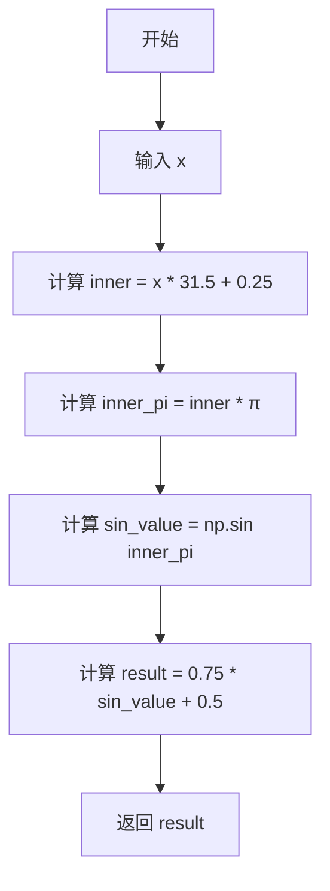

#### 带注释源码

```python
def _flag_red(x): 
    """
    Flag colormap的红色通道生成函数。
    
    使用正弦函数生成周期性的红色强度变化，周期约为 1/31.5。
    
    参数:
        x (float 或 numpy.ndarray): 归一化的输入值，通常范围为 [0, 1]
        
    返回:
        float 或 numpy.ndarray: 红色通道值，范围约为 [-0.25, 1.25]
    """
    # 步骤1: 将输入值乘以31.5并加上0.25，得到内部角度偏移
    # 步骤2: 乘以π转换为弧度
    # 步骤3: 计算正弦值（产生周期性变化）
    # 步骤4: 乘以0.75进行缩放（振幅控制）
    # 步骤5: 加上0.5进行平移（偏移控制）
    return 0.75 * np.sin((x * 31.5 + 0.25) * np.pi) + 0.5
```


### `_flag_green`

该函数是"flag"颜色映射的绿色通道计算函数，通过正弦波生成绿通道的梯度变化值，用于构建旗帜风格的连续色彩映射。

参数：

- `x`：`float` 或 `ndarray`，输入值，表示色彩映射中的位置（通常在0到1之间）

返回值：`float` 或 `ndarray`，对应的绿色通道颜色值（范围约在-1到1之间，会被映射到有效RGB范围）

#### 流程图

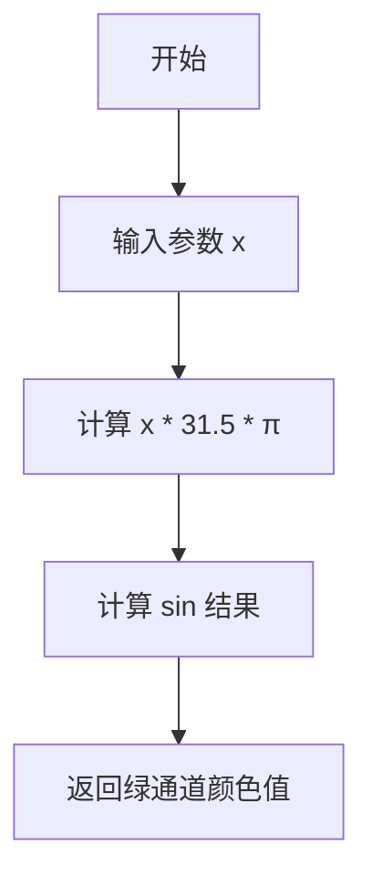

#### 带注释源码

```python
def _flag_green(x):
    """
    计算flag颜色映射的绿色通道值。
    
    Parameters
    ----------
    x : float or ndarray
        输入值，通常为0到1之间的色彩映射位置
    
    Returns
    -------
    float or ndarray
        绿色通道的颜色值，范围约在[-1, 1]之间
    """
    # 使用正弦函数生成绿通道梯度，31.5 * π 产生约15.5个完整周期的波形
    # 这种高频振荡创造了flag图案的典型条纹效果
    return np.sin(x * 31.5 * np.pi)
```


### `_flag_blue`

该函数是"flag"颜色映射的蓝色通道生成函数，通过正弦波计算给定位置x对应的蓝色通道强度值，用于创建周期性变化的蓝色渐变效果。

参数：

- `x`：`float` 或 `numpy.ndarray`，输入值，通常在0到1之间，表示颜色映射中的位置（归一化值）

返回值：`float` 或 `numpy.ndarray`，蓝色通道的强度值，范围约为0.125到0.875

#### 流程图

```mermaid
flowchart TD
    A[开始] --> B[输入x值]
    B --> C[计算内部表达式: x * 31.5 - 0.25]
    C --> D[乘以π: result * π]
    D --> E[计算sin函数: sin(result)]
    E --> F[乘以系数0.75]
    F --> G[加上偏移0.5]
    G --> H[返回蓝色通道强度值]
    H --> I[结束]
```

#### 带注释源码

```python
def _flag_blue(x):
    """
    生成flag颜色映射的蓝色通道值。
    
    该函数使用正弦函数创建周期性的蓝色强度变化，
    周期约为31.5个单位，通过相位偏移-0.25实现与红、绿通道的协调。
    
    Parameters
    ----------
    x : float or numpy.ndarray
        输入值，通常在0到1之间，表示颜色映射中的归一化位置。
    
    Returns
    -------
    float or numpy.ndarray
        蓝色通道的强度值，范围约为[0.125, 0.875]。
    
    Examples
    --------
    >>> _flag_blue(0.0)
    0.75*sin(-0.25*π) + 0.5 ≈ 0.125
    >>> _flag_blue(0.5)
    0.75*sin(15.5*π) + 0.5 ≈ 0.5
    >>> _flag_blue(1.0)
    0.75*sin(31.25*π) + 0.5 ≈ 0.875
    """
    # 计算: 0.75 * sin((x * 31.5 - 0.25) * π) + 0.5
    # 系数0.75控制振幅，使输出范围在0.125到0.875之间
    # 31.5决定周期性，-0.25提供相位偏移，+0.5提供基准偏移
    return 0.75 * np.sin((x * 31.5 - 0.25) * np.pi) + 0.5
```


### `_prism_red`

该函数是一个全局数学函数，用于生成 Matplotlib 的 'prism' 颜色映射表（Colormap）的红色通道数据。它接受一个归一化的输入值 `x`，通过特定的正弦波数学公式计算对应的红色强度值。

参数：

-  `x`：`float` 或 `numpy.ndarray`，归一化的输入值，通常在 0 到 1 之间，代表颜色映射的当前位置。

返回值：`float` 或 `numpy.ndarray`，计算得出的红色通道强度值（通常也在 0 到 1 之间，但公式未做硬性限制，可能产生超出范围的值，后续会被映射处理）。

#### 流程图


#### 带注释源码

```python
def _prism_red(x):
    """
    计算 prism 颜色映射的红色通道分量。
    
    Parameters
    ----------
    x : float or array-like
        归一化的输入值 (范围通常为 [0, 1])。
    
    Returns
    -------
    float or numpy.ndarray
        红色通道的强度值。
    """
    # 公式分解：0.75 * sin((x * 20.9 + 0.25) * π) + 0.67
    # 1. 输入值乘以频率因子 20.9
    # 2. 加上相位偏移 0.25
    # 3. 乘以 π 将角度转换为弧度
    # 4. 计算正弦值
    # 5. 乘以幅度 0.75 进行缩放
    # 6. 加上基准偏移 0.67
    return 0.75 * np.sin((x * 20.9 + 0.25) * np.pi) + 0.67
```


### `_prism_green`

该函数是 Matplotlib 中 prism 颜色映射的绿色通道生成函数，通过正弦波运算将输入的归一化值转换为对应的绿色通道颜色值，实现光谱色的绿色部分渐变效果。

参数：

- `x`：`float` 或 `numpy.ndarray`，输入的归一化值（通常在 0 到 1 之间），表示颜色映射中的位置

返回值：`float` 或 `numpy.ndarray`，计算得到的绿色通道颜色值（范围大约在 -0.08 到 0.92 之间）

#### 流程图

```mermaid
graph TD
    A[开始] --> B[输入参数 x]
    B --> C[计算内部表达式: x * 20.9 - 0.25]
    C --> D[乘以 π: (x * 20.9 - 0.25) * π]
    D --> E[计算正弦: sin(result)]
    E --> F[乘以系数 0.75]
    F --> G[加上偏移量 0.33]
    G --> H[返回绿色通道值]
```

#### 带注释源码

```python
def _prism_green(x):
    """
    生成 prism 颜色映射的绿色通道值。
    
    该函数使用正弦函数创建周期性的绿色渐变，
    通过调整频率、相位和振幅来实现独特的颜色效果。
    
    Parameters
    ----------
    x : float or numpy.ndarray
        归一化的输入值，通常在 [0, 1] 范围内，
        表示颜色映射中的位置
    
    Returns
    -------
    float or numpy.ndarray
        绿色通道的颜色值，范围约为 [-0.08, 0.92]
    """
    # 计算正弦波：
    # 1. x * 20.9: 频率因子，20.9 个完整周期覆盖整个 [0,1] 范围
    # 2. - 0.25: 相位偏移，调整颜色带的位置
    # 3. * np.pi: 转换为弧度
    # 4. np.sin(): 计算正弦值，输出范围 [-1, 1]
    # 5. * 0.75: 缩放振幅至 [-0.75, 0.75]
    # 6. + 0.33: 添加偏移，最终范围 [-0.42, 1.08]
    # 实际有效范围受限于 [0, 1]
    return 0.75 * np.sin((x * 20.9 - 0.25) * np.pi) + 0.33
```


### `_prism_blue`

该函数是 matplotlib 中 prism 颜色映射的蓝色通道生成函数，通过正弦波运算将归一化的输入值转换为蓝色强度值，用于构建渐变色板。

参数：

- `x`：`float` 或 `numpy.ndarray`，归一化的颜色位置值（0 到 1 之间的数值，表示颜色映射中的位置）

返回值：`float` 或 `numpy.ndarray`，蓝色通道的强度值（经过正弦变换后的数值）

#### 流程图

```mermaid
graph TD
    A[开始] --> B[输入 x 值]
    B --> C[计算 x * 20.9]
    C --> D[计算 (x * 20.9) * π]
    D --> E[计算 sin((x * 20.9) * π)]
    E --> F[计算 -1.1 * sin(...)]
    F --> G[返回蓝色通道强度值]
```

#### 带注释源码

```python
def _prism_blue(x):
    """
    生成 prism 颜色映射的蓝色通道值。

    该函数使用正弦函数创建周期性的蓝色强度变化，
    通过调整系数实现特定的色彩循环模式。

    参数:
        x: 归一化的输入值，范围 [0, 1]，表示颜色映射中的位置

    返回:
        蓝色通道的强度值，范围约为 [-1.1, 1.1]
    """
    # 计算蓝色通道值：-1.1 * sin(x * 20.9 * π)
    # 20.9 控制周期数（约 10.45 个完整周期）
    # -1.1 是振幅因子，用于调整颜色强度范围
    return -1.1 * np.sin((x * 20.9) * np.pi)
```


### `_ch_helper`

生成可序列化的cubehelix颜色映射的辅助函数，用于计算给定输入值x对应的RGB颜色分量值。

参数：

- `gamma`：`float`，伽马因子，用于强调低强度值(gamma < 1)或高强度值(gamma > 1)
- `s`：`float`，起始颜色参数，控制颜色的起始色调
- `r`：`float`，旋转参数，控制从起始到结束颜色方案中r、g、b的旋转次数
- `h`：`float`，色调参数，控制颜色的饱和度，零值时为灰度
- `p0`：`float`，余弦项的系数，用于调整颜色偏移
- `p1`：`float`，正弦项的系数，用于调整颜色偏移
- `x`：`float`或`numpy.ndarray`，输入值，范围在0到1之间

返回值：`float`或`numpy.ndarray`，计算得到的RGB颜色分量值

#### 流程图

```mermaid
flowchart TD
    A[开始] --> B[输入参数 gamma, s, r, h, p0, p1, x]
    B --> C[计算 xg = x ** gamma]
    C --> D[计算振幅 a = h * xg * (1 - xg) / 2]
    D --> E[计算角度 phi = 2 * π * (s / 3 + r * x)]
    E --> F[计算返回值: xg + a * (p0 * cos(phi) + p1 * sin(phi))]
    F --> G[返回计算结果]
```

#### 带注释源码

```python
def _ch_helper(gamma, s, r, h, p0, p1, x):
    """
    Helper function for generating picklable cubehelix colormaps.
    
    该函数是cubehelix颜色映射生成的核心计算函数，通过数学公式
    计算在保持感知亮度单调性的前提下，为给定输入值x生成对应的
    RGB颜色分量值。
    
    参数:
        gamma: 伽马因子，用于调整颜色映射的对比度
        s: 起始颜色参数
        r: 旋转参数，控制颜色循环
        h: 色调参数，控制饱和度
        p0: 余弦分量系数
        p1: 正弦分量系数
        x: 输入值（0-1范围）
    
    返回:
        计算得到的RGB颜色值
    """
    # 应用伽马因子来强调低强度或高强度值
    # 伽马值小于1强调低强度，大于1强调高强度
    xg = x ** gamma
    
    # 计算在恒定感知强度平面中偏离黑-白对角线的振幅和角度
    # 使用抛物线形状使颜色变化平滑
    a = h * xg * (1 - xg) / 2
    
    # 计算相位角，包含起始角度和旋转变化
    # s/3 提供起始角度偏移，r*x 提供线性旋转
    phi = 2 * np.pi * (s / 3 + r * x)
    
    # 最终返回结合了灰度分量和颜色偏移的RGB值
    # 基础值为 xg（灰度），加上由振幅和三角函数计算的颜色偏移
    return xg + a * (p0 * np.cos(phi) + p1 * np.sin(phi))
```


### `cubehelix`

该函数生成并返回 cubehelix 色彩方案的自定义数据字典，包含红、绿、蓝三通道的转换函数，可用于创建单调递增且在黑白打印时也能呈现良好灰度效果的彩色映射。

参数：

- `gamma`：`float`，默认值 1.0，伽马因子，用于调节强调低强度值（gamma < 1）或高强度值（gamma > 1）的效果
- `s`：`float`，默认值 0.5，色彩方案的起始颜色参数
- `r`：`float`，默认值 -1.5，从起始到结束色彩方案中 r、g、b 的旋转次数，默认值 -1.5 对应 B -> G -> R -> B 的循环
- `h`：`float`，默认值 1.0，色调参数，控制颜色的饱和度；为零时色彩方案为纯灰度

返回值：`dict`，包含 'red'、'green'、'blue' 三个键的字典，每个键对应一个使用 `functools.partial` 部分应用后的 `_ch_helper` 函数

#### 流程图

```mermaid
flowchart TD
    A[开始 cubehelix] --> B[接收参数 gamma, s, r, h]
    B --> C[创建 red 通道部分函数<br/>partial&#95;ch_helper<br/>gamma, s, r, h, -0.14861, 1.78277]
    C --> D[创建 green 通道部分函数<br/>partial&#95;ch_helper<br/>gamma, s, r, h, -0.29227, -0.90649]
    D --> E[创建 blue 通道部分函数<br/>partial&#95;ch_helper<br/>gamma, s, r, h, 1.97294, 0.0]
    E --> F[返回包含三个通道函数的字典<br/>{'red': ..., 'green': ..., 'blue': ...}]
```

#### 带注释源码

```python
def cubehelix(gamma=1.0, s=0.5, r=-1.5, h=1.0):
    """
    Return custom data dictionary of (r, g, b) conversion functions, which can
    be used with `.ColormapRegistry.register`, for the cubehelix color scheme.

    Unlike most other color schemes cubehelix was designed by D.A. Green to
    be monotonically increasing in terms of perceived brightness.
    Also, when printed on a black and white postscript printer, the scheme
    results in a greyscale with monotonically increasing brightness.
    This color scheme is named cubehelix because the (r, g, b) values produced
    can be visualised as a squashed helix around the diagonal in the
    (r, g, b) color cube.

    For a unit color cube (i.e. 3D coordinates for (r, g, b) each in the
    range 0 to 1) the color scheme starts at (r, g, b) = (0, 0, 0), i.e. black,
    and finishes at (r, g, b) = (1, 1, 1), i.e. white. For some fraction *x*,
    between 0 and 1, the color is the corresponding grey value at that
    fraction along the black to white diagonal (x, x, x) plus a color
    element. This color element is calculated in a plane of constant
    perceived intensity and controlled by the following parameters.

    Parameters
    ----------
    gamma : float, default: 1
        Gamma factor emphasizing either low intensity values (gamma < 1), or
        high intensity values (gamma > 1).
    s : float, default: 0.5 (purple)
        The starting color.
    r : float, default: -1.5
        The number of r, g, b rotations in color that are made from the start
        to the end of the color scheme.  The default of -1.5 corresponds to ->
        B -> G -> R -> B.
    h : float, default: 1
        The hue, i.e. how saturated the colors are. If this parameter is zero
        then the color scheme is purely a greyscale.
    """
    # 使用 functools.partial 预填充 _ch_helper 函数的前六个参数
    # _ch_helper 的完整签名: gamma, s, r, h, p0, p1, x
    # 其中 p0 和 p1 是特定于每个颜色通道的系数
    return {
        'red': partial(_ch_helper, gamma, s, r, h, -0.14861, 1.78277),
        'green': partial(_ch_helper, gamma, s, r, h, -0.29227, -0.90649),
        'blue': partial(_ch_helper, gamma, s, r, h, 1.97294, 0.0)
    }
```


### `_g0`

此函数是Gnuplot调色板函数集中的一个简单辅助函数，用于生成调色板数据。它接收一个参数x（归一化的输入值），始终返回0。

参数：

- `x`：`float`或`numpy.ndarray`，输入的归一化值（通常在0到1之间）

返回值：`int`或`numpy.ndarray`，始终返回0

#### 流程图

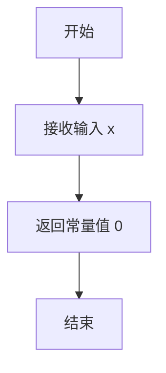

#### 带注释源码

```python
def _g0(x): return 0
"""
Gnuplot调色板辅助函数 - 恒定函数
参数:
    x: 输入值，可以是单个浮点数或numpy数组
返回:
    始终返回0，用于创建全零通道的调色板数据
该函数是gfunc字典中37个Gnuplot调色板生成函数之一，
用于组合构建不同的colormap配置。
"""
```

### 相关上下文信息

#### 关键组件

- **gfunc 字典**：包含37个（_g0到_g36）调色板生成函数的字典，用于动态构建各种Gnuplot风格的颜色映射
- **_gnuplot_data**：使用gfunc函数组合成的Gnuplot默认调色板数据

#### 技术债务与优化空间

1. **代码可读性**：函数采用单行lambda风格定义（`def _g0(x): return 0`），虽然简洁但缺乏文档注释
2. **重复模式**：多个简单函数（_g0到_g36）存在大量相似模式，可考虑使用工厂函数或 functools.partial 生成
3. **全局变量依赖**：gfunc字典使用`globals()[f"_g{i}"]`动态构建，这种魔法方式降低了代码可维护性

#### 数据流说明

此函数作为调色板数据生成流水线的基础组件：

1. 输入：归一化值x（0-1范围）
2. 处理：通过简单数学变换生成颜色通道值
3. 输出：作为RGB通道的某个分量值，最终被`_gnuplot_data`等字典组合成完整调色板


### `_g1`

这是一个简单的常量函数，用于Gnuplot调色板生成。无论输入值如何，均返回固定值0.5。

参数：

- `x`：`float` 或 `numpy.ndarray`，输入值，通常为0到1之间的归一化值

返回值：`float` 或 `numpy.ndarray`，返回常量值0.5

#### 流程图

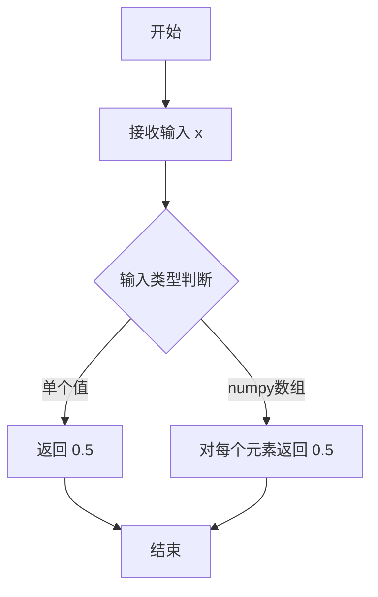

#### 带注释源码

```python
def _g1(x):
    """
    Gnuplot调色板常量函数 - 始终返回0.5
    
    该函数是Gnuplot调色板生成系统的一部分（_g0到_g36系列函数），
    用于定义颜色映射中的红色通道值。在这个特定的函数中，
    它返回固定的0.5，不考虑输入值的变化。
    
    Parameters
    ----------
    x : float or numpy.ndarray
        输入值，通常为0到1之间的归一化值（表示颜色映射中的位置）
    
    Returns
    -------
    float or numpy.ndarray
        返回常量值0.5
    
    Examples
    --------
    >>> _g1(0.0)
    0.5
    >>> _g1(0.5)
    0.5
    >>> _g1(1.0)
    0.5
    """
    return 0.5
```


### `_g2`

这是一个简单的 GNUPlot 调色板辅助函数，用于返回常数 1。

参数：

-  `x`：`float` 或 `numpy.ndarray`，输入值（通常为 0 到 1 之间的归一化值）

返回值：`float` 或 `int` 或 `numpy.ndarray`，返回常数 1

#### 流程图

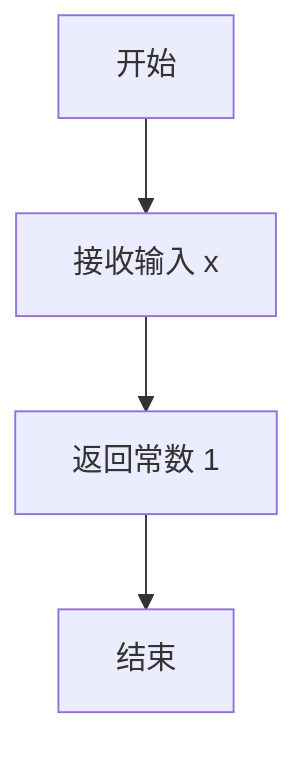

#### 带注释源码

```python
def _g2(x):
    """
    GNUPlot 调色板辅助函数，返回常数 1。
    
    此函数是 gfunc 字典中定义的一系列调色板函数之一（索引为 2），
    用于生成 GNUPlot 风格的颜色映射。通过返回常数 1，该函数
    可以在颜色映射中创建平坦的颜色段。
    
    参数
    ----------
    x : float 或 numpy.ndarray
        输入值，通常为 0 到 1 之间的归一化数值。
        该值在此函数中未被使用。
    
    返回
    ------
    int 或 numpy.ndarray
        返回常数 1。如果输入是 numpy 数组，则返回同形状的全 1 数组。
    """
    return 1
```


### `_g3`

该函数是Gnuplot调色板函数集中的恒等函数，直接返回输入值x，不进行任何变换。

参数：

- `x`：`float` 或 `numpy.ndarray`，输入的归一化值（通常在0到1之间）

返回值：`float` 或 `numpy.ndarray`，返回与输入相同的值

#### 流程图

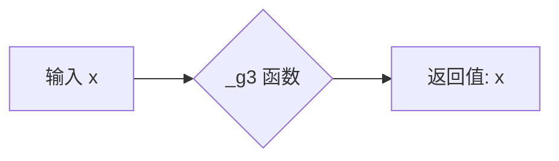

#### 带注释源码

```python
def _g3(x):
    """
    Gnuplot调色板恒等函数。
    
    该函数是Gnuplot调色板函数集中的第4个函数（索引为3），
    直接返回输入值，不进行任何变换。
    在创建LinearSegmentedColormap时用作红色通道的映射函数。
    
    Parameters
    ----------
    x : float or numpy.ndarray
        归一化的输入值，通常在0到1之间
    
    Returns
    -------
    float or numpy.ndarray
        返回与输入相同的值
    """
    return x
```


### `_g4`

该函数是 GNUplot 调色板生成函数集中的成员之一，接收一个数值 `x` 并返回其平方值 (`x²`)，常用于构建线性分段颜色映射的蓝色通道数据。

参数：

- `x`：`float` 或 `numpy.ndarray`，输入值，通常为归一化到 [0, 1] 区间的数值

返回值：`float` 或 `numpy.ndarray`，输入值的平方

#### 流程图

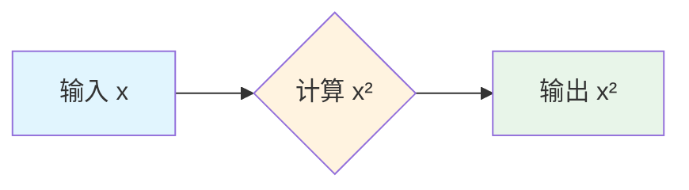

#### 带注释源码

```python
def _g4(x):
    """
    GNUplot 调色板辅助函数 - 平方函数
    
    该函数是 GNUplot 调色板函数集合 (gfunc) 的一部分,
    用于生成非线性颜色映射。具体用途见 _gnuplot_data 字典定义。
    
    Parameters
    ----------
    x : float or numpy.ndarray
        输入的归一化数值 (通常在 0 到 1 之间)
    
    Returns
    -------
    float or numpy.ndarray
        输入值的平方 (x²)
    
    Examples
    --------
    >>> _g4(0.5)
    0.25
    >>> _g4([0, 0.5, 1])
    array([0.  , 0.25, 1.  ])
    """
    return x ** 2
```


### `_g5`

该函数是 Gnuplot 调色板函数之一，计算输入值的立方（即 x³），用于生成非线性颜色映射。

参数：

- `x`：`float` 或 `numpy.ndarray`，输入值，通常在 0 到 1 之间

返回值：`float` 或 `numpy.ndarray`，输入值的立方结果

#### 流程图

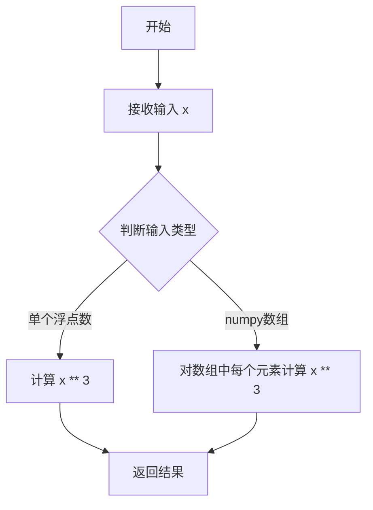

#### 带注释源码

```python
def _g5(x):
    """
    Gnuplot 调色板函数：计算输入值的立方
    
    Parameters
    ----------
    x : float or numpy.ndarray
        输入值，通常在 0 到 1 范围内
    
    Returns
    -------
    float or numpy.ndarray
        输入值的立方 (x³)
    
    Notes
    -----
    此函数是 gfunc 字典中定义的 37 个调色板函数之一（索引为 5）。
    用于生成非线性颜色映射，通过立方运算增强低值区域的颜色变化。
    """
    return x ** 3
```


### _g6

这是一个Gnuplot调色板函数，用于对输入值进行四次方变换，常用于生成非线性的颜色映射。

参数：

- `x`：float 或 numpy array，输入值，通常在0到1之间

返回值：float 或 numpy array，输入值的四次方（x⁴）

#### 流程图

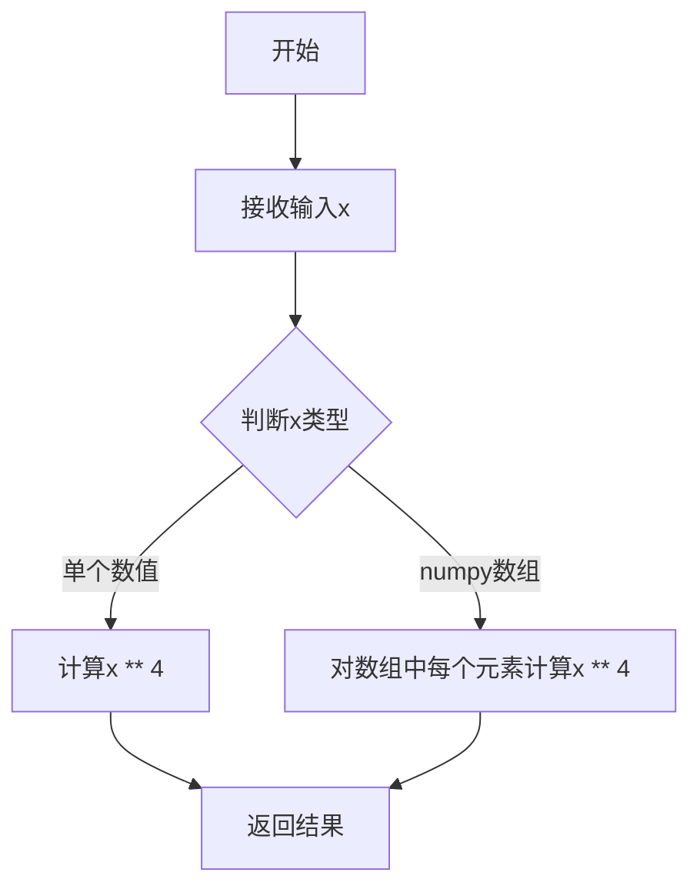

#### 带注释源码

```python
def _g6(x): return x ** 4
"""
Gnuplot调色板函数 - 四次方变换

参数:
    x: float或numpy array，输入值，通常在0到1之间
    
返回:
    float或numpy array，输入值的四次方
    
用途:
    用于生成非线性的颜色映射，使较低值的变化更加细腻
    常见于科学可视化的颜色渐变设计中
"""
```


### `_g7`

该函数是一个简单的数学函数，计算输入值的平方根。

参数：

- `x`：`float` 或 `numpy.ndarray`，输入值（通常为0到1之间的数值）

返回值：`float` 或 `numpy.ndarray`，输入值的平方根

#### 流程图

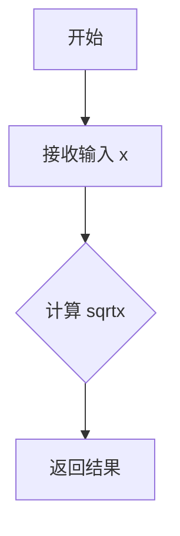

#### 带注释源码

```python
def _g7(x):
    """
    计算输入值的平方根。
    
    Parameters
    ----------
    x : float or numpy.ndarray
        输入值，通常为0到1之间的数值
    
    Returns
    -------
    float or numpy.ndarray
        输入值的平方根
    """
    return np.sqrt(x)  # 使用numpy的sqrt函数计算平方根
```


### `_g8`

该函数是一个 GNUplot 调色板辅助函数，用于计算输入值的四次方根（即平方根的平方根），在生成 colormap 时提供非线性映射。

参数：

- `x`：`float 或 numpy.ndarray`，输入值，通常为归一化的颜色强度值（0 到 1 之间）

返回值：`float 或 numpy.ndarray`，输入值的四次方根

#### 流程图

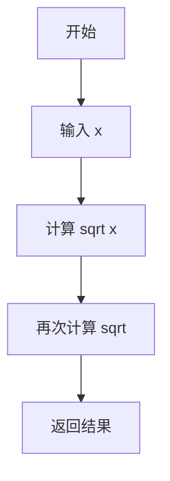

#### 带注释源码

```python
def _g8(x):
    """
    GNUplot palette function: computes the fourth root of the input.
    
    This function applies a square root transformation twice, 
    creating a smooth non-linear mapping useful for color palette
    generation. It emphasizes lower intensity values while 
    compressing the higher end of the range.
    
    Parameters
    ----------
    x : float or numpy.ndarray
        Input value(s), typically normalized between 0 and 1.
    
    Returns
    -------
    float or numpy.ndarray
        Fourth root of input: sqrt(sqrt(x))
    """
    return np.sqrt(np.sqrt(x))
```


### `_g9`

该函数是 Gnuplot 调色板函数之一，用于计算 sin(x * π / 2) 的值，常用于生成颜色映射中的红色通道数据。

参数：

- `x`：float 或 numpy.ndarray，输入值，通常在 0 到 1 之间，表示颜色映射中的位置

返回值：float 或 numpy.ndarray，返回 sin(x * π / 2) 的计算结果，值域在 0 到 1 之间

#### 流程图

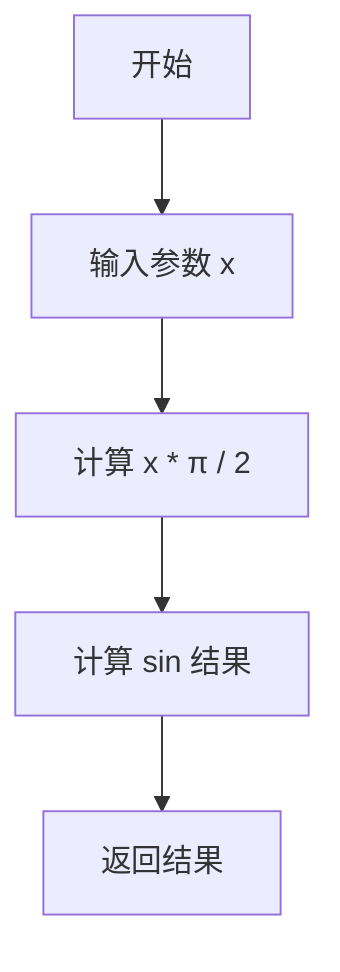

#### 带注释源码

```python
def _g9(x):
    """
    Gnuplot 调色板函数 - 计算 sin(x * π / 2)
    
    该函数是 matplotlib 中定义的 37 个 Gnuplot 调色板函数之一（_g0 到 _g36），
    用于生成颜色映射中的颜色值。具体来说，_g9 被用作 gnuplot 调色板的红色通道。
    
    参数:
        x: float 或 numpy.ndarray
            输入值，通常在 0 到 1 之间，代表颜色映射中的位置
            
    返回:
        float 或 numpy.ndarray
            sin(x * π / 2) 的结果，值域在 [0, 1] 之间
    """
    return np.sin(x * np.pi / 2)  # 计算正弦值，将输入值映射到 [0, 1] 区间
```


### `_g10`

这是一个Gnuplot调色板函数，用于生成颜色映射中的蓝色通道值。它接受一个0到1之间的归一化参数x，返回x乘以π/2后的余弦值。该函数是matplotlib颜色映射系统中的一部分，用于定义非线性颜色渐变。

参数：

- `x`：`float`，输入的归一化值，范围在0到1之间，代表颜色映射中的位置

返回值：`float`，返回余弦计算结果，范围在0到1之间

#### 流程图

```mermaid
flowchart TD
    A[开始] --> B[输入参数x<br/>类型: float<br/>范围: 0到1]
    B --> C[计算 x \* π / 2]
    C --> D[计算 cos(x \* π / 2)]
    D --> E[返回结果<br/>类型: float<br/>范围: 0到1]
    E --> F[结束]
```

#### 带注释源码

```python
def _g10(x):
    """
    Gnuplot调色板函数 - 蓝色通道生成器
    
    该函数是matplotlib中Gnuplot调色板的蓝色通道定义函数之一。
    通过余弦函数生成非线性颜色渐变，用于数据可视化中的颜色映射。
    
    参数:
        x: float类型的归一化输入值，范围0到1
        
    返回值:
        float类型的余弦计算结果，范围0到1
    """
    return np.cos(x * np.pi / 2)  # 计算x乘以π/2后的余弦值
```


### `_g11`

该函数是 Gnuplot 调色板函数之一，用于计算输入值与 0.5 的绝对差，生成一个 V 形曲线，在 x=0.5 处返回 0，向两端线性增加到 0.5。

参数：

- `x`：`float` 或 `numpy.ndarray`，输入的归一化值（通常在 0 到 1 之间）

返回值：`float` 或 `numpy.ndarray`，返回 `|x - 0.5|` 的结果

#### 流程图

```mermaid
flowchart TD
    A[开始] --> B[输入 x]
    B --> C{计算 x - 0.5}
    C --> D[取绝对值]
    D --> E[返回结果]
```

#### 带注释源码

```python
def _g11(x):
    """
    Gnuplot palette function: absolute difference from 0.5.
    
    This function creates a V-shaped curve that is 0 at x=0.5
    and increases linearly to 0.5 at the boundaries (x=0 and x=1).
    Commonly used in the gnuplot colormap for generating
    perceptually uniform color gradients.
    
    Parameters
    ----------
    x : float or ndarray
        Input value(s) in the range [0, 1]
    
    Returns
    -------
    float or ndarray
        The absolute difference between x and 0.5
    """
    return np.abs(x - 0.5)
```


### `_g12`

该函数是 Gnuplot 调色板中的一个颜色映射函数，通过二次变换 `(2x - 1)²` 将输入的归一化值（0 到 1）转换为抛物线形状的输出，常用于生成平滑的颜色渐变效果。

参数：

- `x`：float 或 array-like，输入的归一化颜色值（范围 0 到 1）

返回值：float 或 array-like，变换后的值（范围 0 到 1）

#### 流程图

```mermaid
flowchart TD
    A[输入 x] --> B{计算 2x - 1}
    B --> C[计算平方]
    C --> D[输出结果]
    
    style A fill:#e1f5fe
    style B fill:#fff3e0
    style C fill:#fff3e0
    style D fill:#e8f5e9
```

#### 带注释源码

```python
def _g12(x): 
    """
    Gnuplot palette function for color mapping.
    
    This function implements a parabolic transformation that maps
    the normalized input value to a symmetric curve. The formula
    (2*x - 1) ** 2 creates a U-shaped curve that:
    - At x=0: returns 1 (white)
    - At x=0.5: returns 0 (black/lowest value)
    - At x=1: returns 1 (white)
    
    This creates a 'V' shape color distribution commonly used
    in scientific visualization for emphasizing middle values
    or creating symmetric color patterns.
    
    Parameters
    ----------
    x : float or array-like
        Normalized input value in range [0, 1]
        
    Returns
    -------
    float or array-like
        Transformed value in range [0, 1]
    """
    return (2 * x - 1) ** 2
```


### `_g13`

该函数是GNUplot调色板的数学函数之一，用于生成非线性颜色映射。它接受0到1之间的输入值x，返回`sin(x * π)`的计算结果，常作为GNUplot风格调色板的红色通道映射函数。

参数：

- `x`：`float`或`numpy.ndarray`，输入值，通常在0到1之间，代表颜色映射的归一化位置

返回值：`float`或`numpy.ndarray`，返回`sin(x * π)`的计算结果，输出范围为[-1, 1]

#### 流程图

```mermaid
graph LR
    A[开始: 输入x] --> B[计算x * np.pi]
    B --> C[计算sin(x * np.pi)]
    C --> D[返回结果]
```

#### 带注释源码

```python
def _g13(x): 
    """
    GNUplot调色板函数 - 正弦函数映射
    
    该函数是GNUplot调色板的一部分，用于生成非线性的颜色渐变。
    它计算输入值x与π的乘积的正弦值，产生一个周期性的波形输出。
    
    参数:
        x: 输入值，通常为0到1之间的浮点数或numpy数组
        
    返回:
        sin(x * π): 正弦计算结果，范围在[-1, 1]之间
    """
    return np.sin(x * np.pi)
```


### `_g14`

该函数是 Gnuplot 调色板（Gnuplot palette）生成函数之一，用于计算输入值的绝对余弦值，常作为颜色映射表中的非线性变换函数。

参数：

-  `x`：`float` 或 `numpy.ndarray`，输入的归一化数值（通常在 0 到 1 之间），表示颜色映射中的位置。

返回值：`float` 或 `numpy.ndarray`，返回 `|cos(π * x)|` 的计算结果。

#### 流程图

```mermaid
graph LR
    A[输入 x] --> B[计算 x * π]
    B --> C[计算 cos(x * π)]
    C --> D[计算绝对值 |cos(x * π)|]
    D --> E[返回结果]
```

#### 带注释源码

```python
def _g14(x): 
    """
    Gnuplot 调色板辅助函数。
    计算输入 x 的绝对余弦值，常用于生成周期性的颜色波动效果。
    
    参数:
        x (float or np.ndarray): 归一化输入值 (0~1)。
        
    返回:
        np.ndarray or float: 绝对余弦计算结果。
    """
    return np.abs(np.cos(x * np.pi))
```


### `_g15`

这是一个Gnuplot调色板函数，用于生成正弦波形数据，常用于创建周期性的颜色映射。

参数：

- `x`：`float` 或 `numpy.ndarray`，输入值，通常在0到1之间，表示颜色映射中的位置

返回值：`float` 或 `numpy.ndarray`，返回正弦波形的值，范围在-1到1之间

#### 流程图

```mermaid
graph TD
    A[开始] --> B[接收输入x]
    B --> C[计算x * 2 * π]
    C --> D[计算sin值]
    D --> E[返回结果]
```

#### 带注释源码

```python
def _g15(x):
    """
    Gnuplot调色板函数 - 正弦函数
    
    生成一个完整的正弦周期波形，用于颜色映射。
    当x从0变化到1时，输出从0变化到1再回到0（因为sin(2π) = 0）。
    
    Parameters
    ----------
    x : float or numpy.ndarray
        输入值，通常在0到1之间
        
    Returns
    -------
    float or numpy.ndarray
        正弦值，范围在-1到1之间
    """
    return np.sin(x * 2 * np.pi)  # 计算2π乘以x的正弦值
```


### `_g16`

该函数是Gnuplot调色板函数之一，计算输入值x的余弦值（乘以2π），用于生成调色板数据。

参数：

-  `x`：`float` 或 `array-like`，输入值，通常在[0, 1]范围内

返回值：`float` 或 `numpy.ndarray`，返回 `cos(2π * x)` 的值

#### 流程图

```mermaid
graph TD
    A[开始] --> B[输入 x]
    B --> C[计算 2π * x]
    C --> D[计算 cos(2π * x)]
    D --> E[返回结果]
```

#### 带注释源码

```python
def _g16(x): 
    """
    Gnuplot palette function g16.
    
    Parameters
    ----------
    x : float or array-like
        Input value, typically in the range [0, 1].
    
    Returns
    -------
    float or numpy.ndarray
        Cosine of 2*pi*x.
    
    Notes
    -----
    This function is part of the gnuplot palette functions (g0-g36).
    It returns cos(2*pi*x), which produces a periodic waveform
    that goes from 1 to -1 over the interval [0, 1].
    """
    return np.cos(x * 2 * np.pi)
```


### `_g17`

该函数是Gnuplot调色板的颜色映射函数之一，通过对输入值乘以2π后取正弦的绝对值，生成周期性的波形输出，常用于创建平滑的颜色过渡效果。

参数：

- `x`：`float` 或 `numpy.ndarray`，输入值，通常在0到1之间，代表颜色映射的位置

返回值：`float` 或 `numpy.ndarray`，返回经过 `|sin(2πx)|` 变换后的值，范围在0到1之间

#### 流程图

```mermaid
flowchart TD
    A[开始] --> B[输入x值]
    B --> C[计算 x * 2 * π]
    C --> D[计算 sin(x * 2 * π)]
    D --> E[计算绝对值 np.abs]
    E --> F[返回结果]
```

#### 带注释源码

```python
def _g17(x):
    """
    Gnuplot调色板函数 - 生成周期性波形颜色映射
    
    该函数计算 |sin(2πx)|，产生一个周期性的波形，
    在0到1的范围内完整循环一次。
    
    参数:
        x: 输入值，通常在[0, 1]区间内
        
    返回:
        绝对值正弦结果，范围在[0, 1]之间
    """
    return np.abs(np.sin(x * 2 * np.pi))
```


### `_g18`

该函数是Gnuplot调色板函数之一，用于计算归一化输入值x的余弦绝对值，生成对称的波形输出，常用于创建平滑的颜色渐变映射。

参数：

- `x`：`float` 或 `numpy.ndarray`，归一化输入值，通常在0到1之间

返回值：`float` 或 `numpy.ndarray`，返回余弦绝对值，范围在0到1之间

#### 流程图

```mermaid
graph TD
    A[输入 x] --> B[计算 x * 2π]
    B --> C[计算 cos x*2π]
    C --> D[计算绝对值]
    D --> E[返回结果]
```

#### 带注释源码

```python
def _g18(x):
    """
    Gnuplot调色板函数 - 计算余弦绝对值
    
    该函数是matplotlib中Gnuplot调色板的组成部分，用于生成颜色映射数据。
    函数生成一个对称的波形，周期为1，在0到1之间波动。
    
    参数:
        x: 归一化输入值，通常在0到1之间
        
    返回:
        余弦绝对值，范围在0到1之间
    """
    return np.abs(np.cos(x * 2 * np.pi))
```


### `_g19`

`_g19` 是一个Gnuplot调色板函数，接收归一化输入值x（通常在[0,1]范围内），返回|x·sin(4πx)|的绝对值，用于生成具有两个完整周期的波形调色板数据。

参数：

- `x`：`float` 或 `numpy.ndarray`，归一化的输入值，通常在[0,1]范围内

返回值：`float` 或 `numpy.ndarray`，返回输入值乘以4π后的正弦波的绝对值

#### 流程图

```mermaid
flowchart TD
    A[开始: 输入x] --> B{检查x类型}
    B -->|单个浮点数| C[计算 sin&#40;x \* 4π&#41;]
    B -->|numpy数组| D[逐元素计算 sin&#40;x \* 4π&#41;]
    C --> E[取绝对值: np.abs&#40;sin&#40;x \* 4π&#41;&#41;]
    D --> E
    E --> F[返回结果]
```

#### 带注释源码

```python
def _g19(x):
    """
    Gnuplot调色板函数 - 生成绝对值正弦波（4π周期）
    
    该函数创建一个具有两个完整周期的波形，
    常用于Gnuplot调色板的蓝色通道生成。
    
    参数:
        x: 归一化输入值，通常在[0,1]范围内
           可以是单个浮点数或numpy数组
    
    返回:
        float或numpy.ndarray: 正弦波绝对值，范围在[0,1]之间
    """
    # 计算 x * 4 * π 的正弦值，然后取绝对值
    # 4π 意味着在x从0到1的范围内完成2个完整周期
    return np.abs(np.sin(x * 4 * np.pi))
```

#### 在gfunc字典中的使用

```python
# _g19 被添加到 gfunc 字典中，用于构建调色板数据
gfunc = {i: globals()[f"_g{i}"] for i in range(37)}

# 示例：将 _g19 映射到特定调色板
# _g19 在某些调色板中可能被使用
```

#### 关键特性说明

| 特性 | 描述 |
|------|------|
| 函数类型 | 调色板生成函数（palette function） |
| 周期 | 2个完整周期（4π） |
| 输出范围 | [0, 1] |
| 典型用途 | Gnuplot系列调色板的蓝色/绿色通道 |

#### 技术债务与优化空间

1. **缺少文档字符串**：虽然模块顶部有注释说明这些是Gnuplot调色板函数，但具体每个函数的数学含义和用途缺乏详细文档
2. **动态函数构建**：使用`globals()[f"_g{i}"]`动态构建gfunc字典不是最佳实践，可读性较差
3. **类型提示缺失**：建议添加类型提示以提高代码可维护性


### `_g20`

这是一个Gnuplot调色板函数，用于生成颜色映射中的蓝色通道值。该函数通过计算 `|cos(4πx)|` 来返回一个周期性波形，常用于创建具有周期性变化的颜色渐变。

参数：

-  `x`：`float` 或 `numpy.ndarray`，输入值，通常在0到1之间，表示颜色映射中的位置

返回值：`float` 或 `numpy.ndarray`，返回计算后的蓝色通道值，范围在0到1之间

#### 流程图

```mermaid
flowchart TD
    A[开始: 输入x] --> B{输入类型判断}
    B -->|单个浮点数| C[计算: cos x * 4 * π]
    B -->|numpy数组| D[向量化计算: cos x * 4 * π]
    C --> E[取绝对值: abs result]
    D --> E
    E --> F[返回结果]
```

#### 带注释源码

```python
def _g20(x):
    """
    Gnuplot调色板函数 - 蓝色通道生成器
    
    该函数是Gnuplot调色板的第20个基础函数，用于生成颜色映射中的蓝色分量。
    通过计算 |cos(4πx)| 生成周期性的波形，周期为0.5（因为4π的周期是2π/4π=0.5）。
    
    参数:
        x: float或numpy数组，输入值，通常在[0, 1]范围内
        
    返回:
        float或numpy数组，计算结果，范围在[0, 1]之间
    """
    # 计算 cos(4πx)，然后取绝对值确保结果在 [0, 1] 范围内
    # 4π = 12.566370614359172
    return np.abs(np.cos(x * 4 * np.pi))
```


### _g21

这是一个用于 Gnuplot 调色板的线性函数，将输入的数值 `x` 按 3 倍放大后返回，常作为调色板（colormap）红色、绿色或蓝色通道的映射函数。

参数：

- `x`：`float` 或 `numpy.ndarray`，输入值，通常在 \([0,1]\) 范围内，表示在调色板中的位置。

返回值：`float` 或 `numpy.ndarray`，返回 `3 * x`，即对输入值进行线性放大，用于生成调色板的红、绿、蓝通道。

#### 流程图

```mermaid
graph LR
    A[输入 x] --> B[计算 3 * x]
    B --> C[返回 3*x]
```

#### 带注释源码

```python
def _g21(x):
    """
    Gnuplot palette function: 返回 3 * x。

    参数
    ----------
    x : float 或 numpy.ndarray
        输入值，通常在 [0, 1] 范围内，表示在调色板中的位置。

    返回
    -------
    float 或 numpy.ndarray
        输入值的 3 倍，用于生成调色板的红色、绿色或蓝色通道。
    """
    return 3 * x
```


### `_g22`

**描述**  
该函数是 Gnuplot 调色板（palette）中的一个基础映射函数，实现线性变换 `y = 3 * x - 1`，用于在颜色映射的生成过程中计算红色通道的数值。输入 `x` 通常是归一化到 `[0, 1]` 区间的浮点数或数组，输出会线性映射到 `[-1, 2]` 区间。

---

#### 参数

- **`x`**：`float` 或 `array‑like`  
  输入的归一化值（0 ≤ x ≤ 1），可以是单个标量或 NumPy 数组。

---

#### 返回值

- **`float` 或 `numpy.ndarray`**  
  计算结果 `3 * x - 1`。若 `x` 为数组，则返回同形状的数组。

---

#### 流程图

```mermaid
flowchart LR
    A[输入 x] --> B{计算 3 * x - 1}
    B --> C[返回结果]
```

---

#### 带注释源码

```python
def _g22(x):
    """
    Gnuplot 调色板函数：返回线性映射 3 * x - 1。

    参数
    ----------
    x : float 或 array‑like
        归一化的输入值，通常在 [0, 1] 区间。

    返回
    -------
    float 或 numpy.ndarray
        计算结果 3 * x - 1。
    """
    # 直接执行线性变换：乘以 3 再减 1
    return 3 * x - 1
```

---

#### 关键组件信息

- **名称**：`_g22`  
- **一句话描述**：实现 `y = 3 * x - 1` 线性映射的 Gnuplot 调色板函数。

---

#### 潜在的技术债务或优化空间

1. **缺少输入校验**：函数未对 `x` 的取值范围进行检查，若传入超出 `[0, 1]` 的值，可能导致颜色映射出现不可预期的负值或大于 1 的值。可以考虑在函数入口添加范围检查（如 `np.clip(x, 0, 1)`）或显式抛出异常。
2. **文档可增强**：虽然已有简短的文档字符串，但缺少对 **使用场景**、**数值范围**、**与其它调色板函数的关系** 的说明，容易导致后续维护者误解。
3. **全局函数注册方式**：`gfunc = {i: globals()[f"_g{i}"] for i in range(37)}` 使用 `globals()` 动态构造映射表，这种方式不易于静态分析且在极端情况下（如函数名冲突）可能产生副作用。可以改为显式字典或使用装饰器注册。
4. **性能**：对于大规模数组输入，函数本身已足够简洁（单步线性运算），但若后续在大量彩色映射渲染时出现瓶颈，可考虑使用 NumPy 向量化或 JIT 编译（如 Numba）进行加速。

---

#### 其它项目

- **设计目标**：为 Gnuplot 系列颜色映射提供统一的、基于简单数学函数的红色通道生成方式。
- **约束**：输入必须是归一化的 0‑1 范围；输出范围不受限制（可超出 0‑1）。
- **错误处理**：当前未实现，调用方需自行保证输入合法。
- **外部依赖**：仅依赖 `numpy`，符合项目轻量化需求。


### _g23

该函数是GNUPlot调色板生成函数之一，接收一个输入值x，计算并返回3*x - 2的结果，用于生成特定的颜色映射曲线。

参数：

- `x`：`float` 或 `numpy.ndarray`，输入值，通常在0到1之间，表示颜色映射中的位置

返回值：`float` 或 `numpy.ndarray`，计算结果，等于3*x - 2

#### 流程图

```mermaid
graph TD
    A[开始] --> B[输入参数x]
    B --> C[计算表达式: 3 * x - 2]
    C --> D[返回计算结果]
    D --> E[结束]
```

#### 带注释源码

```python
def _g23(x):
    """
    GNUPlot palette function that computes 3*x - 2.
    
    This function is part of the gfunc dictionary used to generate
    GNUPlot-style colormaps. It maps the input value x (typically
    in the range [0, 1]) to a transformed value using the linear
    equation 3*x - 2.
    
    Parameters
    ----------
    x : float or numpy.ndarray
        Input value, typically in the range [0, 1], representing
        a position along the colormap.
    
    Returns
    -------
    float or numpy.ndarray
        The transformed value equal to 3*x - 2.
    """
    return 3 * x - 2
```


### `_g24`

该函数是 Gnuplot 调色板函数之一，计算输入值 x 的线性变换后取绝对值，即返回 |3*x - 1|，用于生成特定的颜色渐变效果。

参数：

- `x`：`float` 或 `numpy.ndarray`，输入值，通常在 0 到 1 之间

返回值：`float` 或 `numpy.ndarray`，返回 |3*x - 1| 的值

#### 流程图

```mermaid
graph TD
    A[开始] --> B[输入 x]
    B --> C[计算 3 * x]
    C --> D[计算 3 * x - 1]
    D --> E[计算绝对值 np.abs3 * x - 1]
    E --> F[返回结果]
```

#### 带注释源码

```python
def _g24(x):
    """
    Gnuplot 调色板函数，计算 |3*x - 1|。
    
    Parameters
    ----------
    x : float or numpy.ndarray
        输入值，通常在 0 到 1 之间
    
    Returns
    -------
    float or numpy.ndarray
        返回 |3*x - 1| 的值
    """
    return np.abs(3 * x - 1)
```


### `_g25`

这是 Gnuplot 调色板函数之一，用于生成颜色映射数据。该函数计算 `|3*x - 2|` 的值，常用于构建特定的颜色渐变。

参数：

- `x`：`float` 或 `numpy.ndarray`，输入值，通常在 0 到 1 之间，表示颜色映射的位置

返回值：`float` 或 `numpy.ndarray`，返回 `|3*x - 2|` 的值，范围在 [0, 2] 之间

#### 流程图

```mermaid
flowchart TD
    A[开始] --> B[输入 x]
    B --> C{计算 3*x - 2}
    C --> D{取绝对值}
    D --> E[输出 |3*x - 2|]
    E --> F[结束]
```

#### 带注释源码

```python
def _g25(x):
    """
    Gnuplot palette function: computes |3*x - 2|.
    
    This function is part of a set of Gnuplot palette functions (gfunc)
    used to generate color mapping data for visualization.
    
    Parameters
    ----------
    x : float or numpy.ndarray
        Input value, typically in the range [0, 1], representing 
        the position along the color gradient.
    
    Returns
    -------
    float or numpy.ndarray
        The absolute value of (3*x - 2), producing values in range [0, 2].
        This creates a V-shaped curve commonly used in scientific 
        visualization color maps.
    
    Example
    -------
    >>> import numpy as np
    >>> _g25(0.0)
    2.0
    >>> _g25(0.5)
    0.5
    >>> _g25(1.0)
    1.0
    >>> _g25(np.array([0.0, 0.5, 1.0]))
    array([2. , 0.5, 1. ])
    """
    return np.abs(3 * x - 2)
```


### `_g26`

这是一个Gnuplot调色板函数，用于将输入值x进行线性变换 `(3x - 1) / 2`，是Matplotlib中Gnuplot系列colormap的生成函数之一，属于datadict的一部分，用于生成LinearSegmentedColormap。

参数：

- `x`：`float` 或 `numpy.ndarray`，输入的归一化值（通常在0到1之间）

返回值：`float` 或 `numpy.ndarray`，线性变换后的输出值

#### 流程图

```mermaid
graph LR
    A[输入 x] --> B[计算 3x]
    B --> C[计算 3x - 1]
    C --> D[计算 (3x - 1) / 2]
    D --> E[输出结果]
```

#### 带注释源码

```python
def _g26(x):
    """
    Gnuplot palette function for generating colormap values.
    
    该函数实现线性变换: f(x) = (3*x - 1) / 2
    将输入值x从[0,1]区间映射到[-0.5,1]区间
    
    Parameters
    ----------
    x : float or numpy.ndarray
        输入的归一化值，范围通常在0到1之间
    
    Returns
    -------
    float or numpy.ndarray
        变换后的值，范围在-0.5到1之间
    """
    return (3 * x - 1) / 2
```


### `_g27`

该函数是Gnuplot调色板函数之一，实现了一个线性变换 `(3 * x - 2) / 2`，用于将输入值x从[0,1]区间映射到[-1, 0.5]区间，是Gnuplot调色板数据生成的一部分。

参数：

- `x`：`float` 或 `numpy.ndarray`，输入值，通常在[0,1]区间内

返回值：`float` 或 `numpy.ndarray`，线性变换后的值

#### 流程图

```mermaid
flowchart TD
    A[开始] --> B[输入 x]
    B --> C{判断输入类型}
    C -->|单个数值| D[计算 3*x - 2]
    C -->|numpy数组| E[对数组每个元素计算 3*x - 2]
    D --> F[结果除以2]
    E --> F
    F --> G[返回结果]
```

#### 带注释源码

```python
def _g27(x):
    """
    Gnuplot调色板函数 - 线性变换函数
    
    将输入值x从[0,1]区间映射到[-1, 0.5]区间
    变换公式: (3*x - 2) / 2
    
    参数:
        x: float或numpy.ndarray, 输入值, 通常在[0,1]区间内
        
    返回:
        float或numpy.ndarray, 线性变换后的值
    """
    # 步骤1: 计算 3*x - 2
    # 步骤2: 结果除以2
    return (3 * x - 2) / 2
```


### `_g28`

这是一个Gnuplot调色板函数，计算 `|(3*x - 1) / 2|` 的绝对值，用于生成颜色映射中的绿色通道数据。

参数：

- `x`：`float` 或 `np.ndarray`，输入值，通常在0到1之间

返回值：`float` 或 `np.ndarray`，返回 `|(3*x - 1) / 2|` 的计算结果

#### 流程图

```mermaid
graph TD
    A[输入 x] --> B[计算 3*x - 1]
    B --> C[除以 2]
    C --> D[取绝对值]
    D --> E[返回结果]
```

#### 带注释源码

```python
def _g28(x):
    """
    Gnuplot调色板函数 - 计算 |(3*x - 1) / 2| 的绝对值。
    
    这是一个用于生成颜色映射的数学函数，属于Gnuplot调色板函数系列(gfunc)之一。
    在代码中，此函数被用作 _gnuplot_data 字典中 'green' 通道的映射函数。
    
    参数:
        x: float或np.ndarray，输入值，通常在0到1之间
        
    返回:
        float或np.ndarray，|(3*x - 1) / 2| 的绝对值结果
    """
    return np.abs((3 * x - 1) / 2)
```


### `_g29`

Gnuplot 调色板函数，用于将输入的归一化值 x 映射为绝对值形式的输出，常用于生成颜色映射的绿色通道。

参数：

-  `x`：`float` 或 `numpy.ndarray`，归一化值，通常在 0 到 1 之间

返回值：`float` 或 `numpy.ndarray`，计算后的绝对值结果

#### 流程图

```mermaid
flowchart TD
    A[输入 x] --> B{计算 3*x - 2}
    B --> C{除以 2}
    C --> D{计算绝对值 np.abs}
    D --> E[返回结果]
```

#### 带注释源码

```python
def _g29(x):
    """
    Gnuplot 调色板函数 - 计算绝对值的线性映射
    
    该函数是 matplotlib 中 gnuplot2 调色板的绿色通道生成函数。
    实现公式: |(3x - 2) / 2|，用于生成从深绿到浅绿的颜色渐变。
    
    参数:
        x: 归一化输入值，范围通常为 [0, 1]
    
    返回:
        绝对值处理后的输出值，范围 [0, 1]
    """
    return np.abs((3 * x - 2) / 2)
```


### `_g30`

这是 Gnuplot 调色板的数学转换函数之一，用于将输入值 x 线性映射到特定的输出范围，作为调色板颜色生成的辅助函数。

**参数：**

- `x`：`float` 或 `numpy.ndarray`，输入值，通常在 0 到 1 之间，表示颜色映射的归一化位置

**返回值：**`float` 或 `numpy.ndarray`，线性变换后的输出值

#### 流程图

```mermaid
graph TD
    A[开始] --> B[输入 x]
    B --> C{计算 x / 0.32}
    C --> D[计算 result - 0.78125]
    D --> E[返回结果]
```

#### 带注释源码

```python
def _g30(x):
    """
    Gnuplot 调色板函数 - 线性映射变换
    
    将输入值 x 通过线性变换映射到目标范围：
    y = x / 0.32 - 0.78125
    
    这相当于将输入值乘以约 3.125，然后减去 0.78125。
    用于 Gnuplot 调色板中 red 通道的颜色插值。
    
    Parameters
    ----------
    x : float or numpy.ndarray
        输入值，通常在 0-1 范围内
        
    Returns
    -------
    float or numpy.ndarray
        变换后的输出值
    """
    return x / 0.32 - 0.78125
```


### `_g31`

这是一个Gnuplot调色板函数，用于生成颜色映射的绿色通道值，实现简单的线性变换 `y = 2 * x - 0.84`。

参数：

- `x`：`float` 或 `numpy.ndarray`，输入的归一化值（通常在0到1之间）

返回值：`float` 或 `numpy.ndarray`，线性变换后的绿色通道值（范围约为-0.84到0.16）

#### 流程图

```mermaid
graph TD
    A[开始] --> B[输入 x]
    B --> C{计算 y = 2 * x - 0.84}
    C --> D[返回 y]
    D --> E[结束]
```

#### 带注释源码

```python
def _g31(x):
    """
    Gnuplot2调色板的绿色通道函数。
    
    这是一个简单的线性函数，将输入值x（0到1之间）映射到绿色通道。
    变换公式: y = 2 * x - 0.84
    
    参数:
        x: 输入的归一化值，可以是单个浮点数或numpy数组
        
    返回:
        线性变换后的值，范围约在-0.84到0.16之间
    """
    return 2 * x - 0.84
```


### `_g32`

这是一个 Gnuplot 调色板函数，用于生成非线性颜色映射的蓝色通道值。该函数通过分段线性变换将归一化输入值 `[0,1]` 转换为特定的颜色强度曲线，是 GNUPlot2 调色板（`_gnuplot2_data`）的蓝色分量函数。

参数：

- `x`：`numpy.ndarray`，归一化的输入值，范围通常在 [0, 1] 之间

返回值：`numpy.ndarray`，变换后的颜色强度值，与输入数组长度相同

#### 流程图

```mermaid
flowchart TD
    A[开始: 输入数组 x] --> B[创建零数组 ret]
    B --> C{检查条件 x < 0.25}
    C -->|是| D[计算: ret = 4 * x]
    D --> E{检查条件 0.25 ≤ x < 0.92}
    C -->|否| E
    E -->|是| F[计算: ret = -2 * x + 1.84]
    F --> G{检查条件 x ≥ 0.92}
    E -->|否| G
    G -->|是| H[计算: ret = x / 0.08 - 11.5]
    G -->|否| I[返回 ret]
    H --> I
```

#### 带注释源码

```python
def _g32(x):
    """
    Gnuplot 调色板函数 - 蓝色通道
    
    实现一个分段线性变换，将归一化输入值映射为特定的颜色强度曲线。
    该函数是 GNUPlot2 调色板的蓝色分量，用于数据可视化中的颜色映射。
    
    参数:
        x: numpy.ndarray, 归一化的输入值数组，值域通常在 [0, 1]
    
    返回:
        numpy.ndarray, 变换后的颜色强度值数组
    """
    # 步骤1: 初始化输出数组，创建一个与输入长度相同的零数组
    ret = np.zeros(len(x))
    
    # 步骤2: 第一段变换 - 线性上升段 (x < 0.25)
    # 当输入值在 [0, 0.25) 区间时，输出值从 0 线性增加到 1
    m = (x < 0.25)
    ret[m] = 4 * x[m]
    
    # 步骤3: 第二段变换 - 线性下降段 (0.25 ≤ x < 0.92)
    # 当输入值在 [0.25, 0.92) 区间时，输出值从 1 线性下降到 0
    m = (x >= 0.25) & (x < 0.92)
    ret[m] = -2 * x[m] + 1.84
    
    # 步骤4: 第三段变换 - 线性上升段 (x ≥ 0.92)
    # 当输入值在 [0.92, 1] 区间时，输出值从 0 线性增加到 1
    m = (x >= 0.92)
    ret[m] = x[m] / 0.08 - 11.5
    
    # 步骤5: 返回变换后的数组
    return ret
```

#### 关键信息

| 项目 | 描述 |
|------|------|
| **函数类型** | 模块级全局函数 |
| **所属模块** | `_gnuplot2_data` 调色板定义 |
| **颜色通道** | 蓝色 (blue) |
| **调用来源** | `gfunc` 字典，通过 `globals()[f"_g{i}"]` 动态生成 |
| **实际用途** | 作为 `_gnuplot2_data['blue']` 构建 GNUPlot2 颜色映射 |

#### 技术债务与优化空间

1. **魔法数字**：函数中使用了多个硬编码的数值（0.25, 0.92, 4, 1.84, 0.08, 11.5），建议提取为可配置的常量或参数。
2. **重复计算**：每次调用都会创建多个布尔掩码，可以考虑优化内存使用。
3. **文档缺失**：原始代码中该函数没有文档字符串，建议添加说明其数学含义。


### `_g33`

这是一个Gnuplot调色板函数，用于生成颜色映射数据。该函数计算 `|2x - 0.5|`，是Gnuplot调色板中常用的数学转换函数之一，常用于科学可视化中的颜色渐变计算。

参数：

- `x`：`float` 或 `np.ndarray`，输入值，通常为归一化的数值（0到1之间），代表颜色映射的位置

返回值：`float` 或 `np.ndarray`，返回计算结果 `|2x - 0.5|`，用于生成彩虹色映射（rainbow colormap）的红色通道数据

#### 流程图

```mermaid
graph TD
    A[开始] --> B[接收输入 x]
    B --> C[计算 2 * x]
    C --> D[计算 2 * x - 0.5]
    D --> E[计算绝对值 np.abs2 * x - 0.5]
    E --> F[返回结果]
```

#### 带注释源码

```python
def _g33(x):
    """
    Gnuplot调色板函数 - 用于生成彩虹色映射的红色通道数据。
    
    该函数实现数学变换 |2x - 0.5|，是Gnuplot调色板中的标准函数之一。
    在matplotlib的彩虹色映射(rainbow colormap)中，_g33函数负责生成红色通道值，
    配合_g13(绿色)和_g10(蓝色)共同构成完整的彩虹渐变效果。
    
    参数:
        x: float或np.ndarray，输入的归一化值(通常在0-1范围内)
        
    返回值:
        float或np.ndarray，计算结果 |2x - 0.5|
    """
    return np.abs(2 * x - 0.5)  # 计算2x-0.5的绝对值
```


### `_g34`

该函数是GNUplot调色板中的线性映射函数之一，将输入值乘以2，实现最简单的线性变换。

参数：

- `x`：`float`或`numpy.ndarray`，输入值，通常为0到1之间的标准化颜色坐标

返回值：`float`或`numpy.ndarray`，输入值的2倍

#### 流程图

```mermaid
flowchart TD
    A[开始] --> B[输入参数 x]
    B --> C{计算 2 * x}
    C --> D[返回结果]
    D --> E[结束]
```

#### 带注释源码

```python
def _g34(x): 
    """
    GNUplot调色板函数 - 线性放大函数
    
    这是一个简单的线性映射函数，将输入值乘以2。
    在GNUplot调色板定义中用于生成颜色映射的红色通道。
    
    Parameters
    ----------
    x : float or numpy.ndarray
        输入的标准化值，通常在[0, 1]范围内
    
    Returns
    -------
    float or numpy.ndarray
        输入值的两倍，如果输入为0.5则返回1.0
    """
    return 2 * x
```


### `_g35`

该函数是 Gnuplot 调色板生成函数之一，用于将输入值 x 线性映射到 [ -0.5, 1.5 ] 区间，实现调色板颜色的非线性变换。

参数：
- `x`：`float` 或 `array-like`，输入值，通常为 0 到 1 之间的归一化数值

返回值：`float` 或 `ndarray`，线性变换后的输出值

#### 流程图

```mermaid
graph LR
    A[输入 x] --> B{计算 2 * x - 0.5}
    B --> C[返回结果]
```

#### 带注释源码

```python
def _g35(x):
    """
    Gnuplot 调色板映射函数。
    
    将输入值 x 线性变换为 2*x - 0.5，用于生成特定的颜色渐变效果。
    该函数是 gfunc 字典中的元素之一，用于构建 Gnuplot 系列调色板。
    
    参数:
        x: 输入的归一化数值，通常范围在 [0, 1]
    
    返回:
        变换后的数值，范围约为 [-0.5, 1.5]
    """
    return 2 * x - 0.5
```


### `_g36`

该函数是 GNUPlot 调色板函数系列中的第36号函数，实现了一个简单的线性变换 `f(x) = 2x - 1`，用于将输入值 `x`（通常在 0 到 1 范围内）映射到 -1 到 1 的范围内。这是 matplotlib 中用于生成 colormap 的辅助函数，属于 `_gfunc` 字典中的一系列全局函数之一。

参数：

- `x`：`float` 或 `numpy array`，输入的归一化值（通常在 [0, 1] 范围内）

返回值：`float` 或 `numpy array`，线性变换后的值，范围在 [-1, 1] 之间

#### 流程图

```mermaid
graph LR
    A[开始] --> B[输入 x]
    B --> C[计算 2 * x]
    C --> D[计算 2 * x - 1]
    D --> E[返回结果]
```

#### 带注释源码

```python
def _g36(x): 
    """
    GNUPlot palette function #36.
    
    该函数实现线性变换 f(x) = 2x - 1，将输入值 x（通常在 [0,1] 范围）
    映射到 [-1, 1] 范围。常用于生成 colormap 的蓝色通道数据。
    
    参数:
        x: float 或 numpy array，输入的归一化值
        
    返回:
        float 或 numpy array，线性变换后的值
    """
    return 2 * x - 1  # 线性映射：将 [0,1] 映射到 [-1,1]
```

#### 关键组件信息

| 名称 | 一句话描述 |
|------|----------|
| `_g36` | GNUPlot 调色板函数，实现 `f(x) = 2x - 1` 的线性变换 |
| `gfunc` | 包含 `_g0` 到 `_g36` 所有函数的字典，用于 colormap 注册 |
| `_gnuplot_data` | 使用部分 `gfunc` 函数作为值的 GNUPlot 调色板数据字典 |

#### 潜在技术债务或优化空间

1. **缺乏类型提示**：该函数没有类型注解（type hints），建议添加如 `def _g36(x: float) -> float:` 以提高代码可读性和 IDE 支持
2. **文档字符串缺失**：虽然有简单的 docstring，但未说明该函数在 colormap 中的具体用途
3. **函数命名不够直观**：`_g36` 这样的数字命名方式缺乏语义信息，建议添加更描述性的名称或常量映射

#### 其它说明

- **设计目标**：作为 GNUPlot 调色板的蓝色通道生成函数之一，用于创建特定的颜色渐变效果
- **错误处理**：未对输入值范围进行校验，当输入超出 [0,1] 范围时，返回值也会相应超出 [-1,1] 范围
- **外部依赖**：仅依赖 `numpy` 库，但函数本身也支持纯 Python 数值类型
- **使用场景**：该函数通过 `gfunc` 字典被 `_afmhot_data` 等 colormap 数据引用，用于生成 matplotlib 的颜色映射表


### `_gist_heat_red`

该函数是 gist_heat 颜色方案中用于计算红色通道值的简单线性函数，通过将输入值乘以 1.5 来生成对应的红色强度。

参数：

- `x`：`float`，输入值，通常为 0 到 1 之间的归一化值，表示颜色映射中的位置

返回值：`float`，计算后的红色通道值，范围通常在 0 到 1.5 之间

#### 流程图

```mermaid
graph TD
    A[开始] --> B[输入 x]
    B --> C[计算 1.5 * x]
    C --> D[返回结果]
    D --> E[结束]
```

#### 带注释源码

```python
def _gist_heat_red(x): 
    """
    计算 gist_heat 颜色方案中红色通道的值。
    
    这是一个简单的线性函数，将输入值乘以 1.5。
    用于生成从黑色到红色的渐变中的红色通道强度。
    
    参数:
        x: 输入的归一化值（0到1之间的浮点数）
    
    返回:
        红色通道的强度值（0到1.5之间的浮点数）
    """
    return 1.5 * x
```


### `_gist_heat_green`

这是一个定义 gist_heat 配色方案的绿色通道的函数，通过线性变换 `2 * x - 1` 将输入值映射到绿色通道值。

参数：

- `x`：`float` 或 `numpy.ndarray`，输入的归一化值（通常在 0 到 1 之间），表示颜色映射中的位置

返回值：`float` 或 `numpy.ndarray`，绿色通道的输出值（范围约为 -1 到 1）

#### 流程图

```mermaid
flowchart TD
    A[输入 x] --> B{计算 2*x - 1}
    B --> C[返回绿色通道值]
```

#### 带注释源码

```python
def _gist_heat_green(x): return 2 * x - 1
```

**说明：**
- 该函数是 gist_heat 配色方案的绿色通道映射函数
- 采用线性变换：`2 * x - 1`
- 当输入 x=0 时，输出为 -1（无绿色）
- 当输入 x=0.5 时，输出为 0（中等绿色）
- 当输入 x=1 时，输出为 1（最大绿色）
- 此函数与 `_gist_heat_red`（`1.5 * x`）和 `_gist_heat_blue`（`4 * x - 3`）共同构成完整的 gist_heat 配色方案数据字典 `_gist_heat_data`


### `_gist_heat_blue`

该函数是 gist_heat 颜色映射的蓝色通道生成函数，通过线性变换 `4 * x - 3` 将输入值映射为蓝色通道的强度值。

参数：

- `x`：`float` 或 `numpy.ndarray`，输入值，通常在 0 到 1 之间

返回值：`float` 或 `numpy.ndarray`，蓝色通道的强度值

#### 流程图

```mermaid
flowchart TD
    A[开始] --> B[输入 x]
    B --> C{计算 4*x - 3}
    C --> D[输出结果]
    D --> E[结束]
```

#### 带注释源码

```python
def _gist_heat_blue(x): 
    """
    生成 gist_heat 颜色映射的蓝色通道值。
    
    这是一个线性函数，用于将输入值 x 映射到蓝色通道。
    当 x 从 0 到 1 变化时，蓝色通道值从 -3 变化到 1。
    （在实际应用中会被裁剪到有效范围 [0, 1]）
    
    参数:
        x: 输入值，类型为 float 或 numpy.ndarray
        
    返回:
        4*x - 3 的计算结果
    """
    return 4 * x - 3
```


### `_gist_yarg`

该函数是一个简单的数值反转函数，用于创建gist_yarg颜色映射。它接收一个[0,1]范围内的输入值x，返回1-x作为输出，从而实现灰度值的反转（从黑到白变为从白到黑）。

参数：

- `x`：`float`或`array-like`，输入的颜色值，范围在0到1之间

返回值：`float`或`array-like`，反转后的颜色值（1 - x）

#### 流程图

```mermaid
graph TD
    A[开始] --> B{输入x}
    B --> C[计算 1 - x]
    C --> D[返回结果]
    D --> E[结束]
```

#### 带注释源码

```python
def _gist_yarg(x):
    """
    反转输入值，用于创建反转的灰度颜色映射（gist_yarg）。
    
    该函数是gist_yarg颜色映射的核心，它将输入值x反转。
    当x=0时返回1（白色），当x=1时返回0（黑色），实现从白到黑的渐变。
    
    Parameters
    ----------
    x : float or array-like
        输入的颜色值，范围在0到1之间
    
    Returns
    -------
    float or array-like
        反转后的颜色值，范围在0到1之间
    """
    return 1 - x
```

## 关键组件


### datad

主颜色映射注册字典，包含所有预定义颜色映射的集合，通过名称索引访问各个颜色方案的数据。

### cubehelix

生成可定制cubehelix颜色方案的函数，返回包含red、green、blue三个通道转换函数的字典，支持gamma、saturation、rotation和hue参数调整。

### _ch_helper

cubehelix颜色方案的辅助计算函数，根据gamma因子和极坐标参数生成单调递增的感知亮度颜色，用于实现平滑过渡的螺旋颜色效果。

### _flag_red, _flag_green, _flag_blue

美国国旗颜色方案的RGB通道生成函数，使用正弦函数生成周期性颜色波动模式。

### _prism_red, _prism_green, _prism_blue

棱镜颜色方案的RGB通道生成函数，通过不同相位的正弦函数创造光谱分离效果。

### gfunc (包含_g0至_g36)

GNUPlot调色板的37个基础颜色函数集合，涵盖线性、二次、三次、平方根、三角函数等多种数学变换，用于构建各种GNUPlot风格的颜色映射。

### _gist_heat_red, _gist_heat_green, _gist_heat_blue

Gist热力图颜色方案的RGB通道生成函数，使用分段线性变换实现从黑到红的热力渐变。

### _gist_yarg

Gist灰度反转函数，返回1-x实现灰度值的黑白反转。

### LinearSegmentedColormap数据

使用分段线性插值定义的颜色数据，包括binary、bone、cool、copper、gray、hot、hsv、jet、pink等传统Matplotlib颜色映射。

### ListedColormap数据

离散颜色列表数据，用于定性可视化，包括Accent、Dark2、Paired、Pastel1、Set1、Set2、Set3、tab10、tab20等颜色集合。

### ColorBrewer数据

来自ColorBrewer配色方案的序列颜色映射，包括Blues、BrBG、BuGn、BuPu、Greens、Greys、Oranges、OrRd、PiYG、PRGn、PuBu、PuOr、RdBu、RdGy、RdPu、RdYlBu、RdYlGn、Reds、Spectral等diverging和sequential配色方案。

### _coolwarm_data

基于Kenneth Moreland发散颜色映射研究的coolwarm双极颜色方案，提供科学可视化用的蓝红渐变。

### _CMRmap_data

Carey Rappaport的CMRmap颜色映射实现，专门为黑白打印优化设计的颜色到灰度转换。

### Petroff颜色方案

Matthew A. Petroff的可访问性颜色序列数据（_petroff6_data、_petroff8_data、_petroff10_data），为数据可视化提供色盲友好的调色板。

### Okabe-Ito颜色方案

无障碍定性调色板，由Masataka Okabe和Kei Ito开发，确保色盲用户也能区分不同颜色类别。


## 问题及建议


### 已知问题

-   **命名风格不一致**：颜色映射数据变量命名混乱，部分使用 CamelCase（如 `_Blues_data`、`_BrBG_data`），部分使用 snake_case（如 `_afmhot_data`、`_gray_data`），函数命名也未统一（`cubehelix` 小写，`_flag_red` 带下划线前缀）。
-   **全局命名空间污染**：定义了约 70+ 个全局变量（`_xxx_data`），极易与其他模块冲突，且难以追踪依赖关系。
-   **不安全的动态全局查找**：`gfunc = {i: globals()[f"_g{i}"] for i in range(37)}` 依赖 `globals()` 字典动态查找，违反封装原则，且在模块导入顺序变化时可能产生意外行为。
-   **魔法数字缺乏解释**：`_flag_red` 中的 `31.5`、`_prism_red` 中的 `20.9`、`cubehelix` 中的 `-0.14861`、`1.78277` 等数值无注释说明来源或含义。
-   **数据冗余**：`_pink_data` 包含约 120 个几乎线性递增的 RGB 元组，可通过算法生成或使用更紧凑的插值方式。
-   **缺乏类型注解**：所有函数和变量均无类型注解，降低了代码的可读性和 IDE 支持。
-   **部分颜色值未归一化**：某些数据（如 `_pink_data`）的 RGB 值在 0-1 范围内，但 `_Blues_data` 等 ColorBrewer 数据已除以 255，格式不统一。
-   **文档不完整**：模块级 docstring 提到 "Please update this with the purpose and type of your colormap if you add data for one here"，但大多数颜色映射数据无用途说明。

### 优化建议

-   **统一命名规范**：采用 snake_case 命名所有颜色映射数据变量，将 `_Blues_data` 改为 `blues_data` 等，并建立内部约定区分私有数据（如加单下划线）。
-   **重构全局变量**：使用类或字典封装颜色映射数据，将所有 `_xxx_data` 放入 `ColormapData` 类或 `_COLORMAP_DATA` 字典中，减少全局命名空间污染。
-   **消除动态全局查找**：直接定义 `gfunc` 字典或使用显式函数引用，移除对 `globals()` 的依赖，例如 `gfunc = {_g0: lambda x: 0, ...}` 或在文件顶部预定义。
-   **提取魔法数字**：为关键数值定义具名常量，如 `FLAG_CYCLES = 31.5`、`PRISM_CYCLES = 20.9`、`CUBEHELIX_COS_COEFF = -0.14861` 等，并在注释中说明其物理意义或来源。
-   **压缩冗余数据**：使用算法生成 `_pink_data`，或采用分段线性插值减少存储，例如使用 `numpy.interp` 或定义起始/结束点及步长。
-   **添加类型注解**：为 `cubehelix()`、`_ch_helper()` 等函数添加参数和返回值类型注解，并使用 `typing.Dict` / `typing.Tuple` 等明确数据结构类型。
-   **统一数据格式**：确保所有 RGB 值均归一化到 [0, 1]，或明确区分归一化与非归一化数据集，并在 docstring 中说明。
-   **完善文档**：为每个颜色映射数据添加一行 docstring 说明其用途（如 "Greys: sequential blue-purple colormap"）和类型（"sequential" / "diverging" / "qualitative"）。


## 其它


### 设计目标与约束

本模块的核心目标是提供预定义的颜色映射数据，供Matplotlib的`LinearSegmentedColormap`和`ListedColormap`使用。设计约束包括：颜色数据必须符合Matplotlib的颜色规范（RGB值在0-1范围内）；数据格式需支持线性分段和函数式两种定义方式；需兼容Python的pickle序列化机制；颜色方案需覆盖科学可视化的多种场景（离散、连续、发散、定性等）。

### 错误处理与异常设计

由于本模块主要是静态数据定义，运行时错误处理较少。潜在错误场景包括：1) 数据格式错误（如RGB值超出[0,1]范围）；2) 函数定义错误（如gfunc索引越界）；3) 参数范围错误（如cubehelix的gamma参数为负）。这些错误主要在数据定义阶段被发现，建议在数据定义时进行静态检查，并提供验证函数。

### 数据流与状态机

本模块不涉及复杂的状态机。数据流较为简单：数据定义 → 数据字典（datad）→ 上层调用者（pyplot.colormaps()）。数据字典datad是整个模块的核心出口，包含约80+个颜色映射的完整定义。颜色数据流向：原始定义 → gfunc函数映射 → 最终颜色映射对象。

### 外部依赖与接口契约

主要依赖：1) numpy库（用于数值计算和数组操作）；2) functools.partial（用于创建cubehelix的偏函数）。接口契约：datad字典是唯一公开接口，每个颜色映射数据需符合特定格式（线性分段需包含'red'/'green'/'blue'键，定性映射需包含'listed'键）。

### 性能考虑

模块性能关键点：1) gfunc字典通过globals()动态生成，可能影响加载性能；2) cubehelix使用partial创建函数对象，每次调用可能存在额外开销；3) 大量静态颜色数据可能导致内存占用较高。建议：考虑延迟加载不常用的颜色映射；gfunc可改为静态定义而非动态生成。

### 安全性考虑

本模块不涉及用户输入或网络交互，安全性风险较低。主要安全考量：1) 防止通过globals()访问非预期的全局变量（已通过白名单_g{i}格式控制）；2) 确保颜色数据值在合法范围内（0-1），避免潜在的数值计算错误。

### 版本兼容性

需注意：1) Python 2/3兼容性（print语句vs函数，dict顺序）；2) numpy版本兼容性（某些numpy函数可能弃用或行为改变）；3) Matplotlib内部API变化（如ColormapRegistry接口）。建议添加版本检测和条件分支。

### 测试策略

建议测试覆盖：1) 数据格式验证（RGB值范围、键完整性）；2) gfunc函数正确性验证；3) cubehelix参数边界测试；4) datad字典完整性检查（所有颜色映射是否存在）；5) 与Matplotlib ColormapRegistry的集成测试。

### 使用示例

```python
import matplotlib.pyplot as plt
import matplotlib.cm as cm
import numpy as np

# 使用内置颜色映射
x = np.linspace(0, 1, 100).reshape(10, 10)
plt.imshow(x, cmap='viridis')
plt.colorbar()

# 使用cubehelix自定义颜色映射
from matplotlib.colors import LinearSegmentedColormap
custom_cmap = LinearSegmentedColormap.from_list('custom', ['red', 'blue'])
```

### 维护建议

1. 添加数据验证函数，在模块加载时检查数据完整性；2. 考虑将颜色数据分离到单独文件（JSON/YAML），提高可维护性；3. 为新增颜色映射添加文档注释，说明设计意图和适用场景；4. 建立颜色映射分类体系（连续/离散/发散/定性），便于用户选择；5. 考虑添加颜色映射预览功能，帮助用户直观选择。

### 关键组件信息

- **datad**: 核心数据字典，包含所有颜色映射定义，是模块的主要出口点
- **_cubehelix_data**: CubeHelix颜色方案的默认参数版本
- **gfunc**: Gnuplot调色板函数集合，包含37个预定义颜色映射函数
- **cubehelix()**: 生成可定制CubeHelix颜色映射的工厂函数
- **_ch_helper**: CubeHelix算法的内部辅助函数，实现核心颜色计算逻辑

### 潜在的技术债务与优化空间

1. gfunc动态生成方式不够直观，建议改为显式定义；2. 颜色数据重复性较高（如_pink_data的冗长定义），可考虑压缩或程序化生成；3. 缺乏统一的颜色映射分类和元数据管理；4. 文档字符串不够完整，部分颜色映射缺少用途说明；5. 测试覆盖不足，缺乏边界条件和异常情况测试。

    