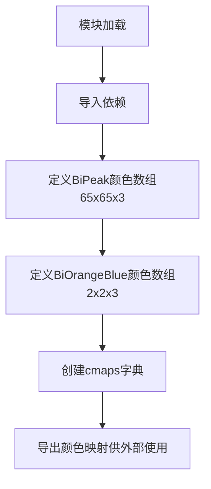

# `matplotlib\lib\matplotlib\_cm_bivar.py` 详细设计文档

该文件定义了双变量颜色映射（bivariate colormaps），用于matplotlib数据可视化。通过SegmentedBivarColormap创建了BiPeak、BiOrangeBlue和BiCone三种颜色映射方案，包含预计算的颜色数组和映射配置。

## 整体流程



## 类结构

```
模块级代码（无类定义）
└── 全局变量: BiPeak, BiOrangeBlue, cmaps
└── 导入: numpy, SegmentedBivarColormap
```

## 全局变量及字段


### `BiPeak`
    
双峰双变量颜色映射的预计算颜色数据，形状(65,65,3)

类型：`numpy.ndarray`
    


### `BiOrangeBlue`
    
橙蓝双变量颜色映射的预计算颜色数据，形状(2,2,3)

类型：`numpy.ndarray`
    


### `cmaps`
    
包含三种双变量颜色映射的字典对象

类型：`dict`
    


    

## 全局函数及方法


## 关键组件


### BiPeak

双峰颜色映射数据数组，一个65x65x3的RGB值矩阵，定义了复杂的双变量颜色渐变，用于可视化两个相关变量的联合分布。

### BiOrangeBlue

橙蓝双色映射数据数组，一个2x2x3的简单RGB矩阵，提供从橙色到蓝色的双色调映射。

### SegmentedBivarColormap

matplotlib.colors库中的类，用于创建双变量分段颜色映射，支持自定义颜色节点数量、插值方法（square/circle）和中心点位置。

### cmaps字典

存储所有定义的颜色映射的容器，包含BiPeak、BiOrangeBlue和BiCone三个已注册的双变量颜色映射。

### BiCone

基于BiPeak数据但使用圆形（circle）插值方法的颜色映射，通过改变几何形状参数提供不同的可视化效果。


## 问题及建议


### 已知问题
- 代码缺乏文档说明，未解释BiPeak数组数据的来源、用途和设计意图
- 使用大量硬编码的魔法数字（如256、0.5、0.5等）而未提供解释
- 数组形状(65,65,3)和参数选择缺乏说明，可读性差
- 没有输入验证或错误处理机制
- 缺少单元测试或验证代码来确保colormap正确性
- BiPeak数据重复使用在BiPeak和BiCone中，可能存在冗余
- 没有版本依赖说明或requirements文件

### 优化建议
- 为类和全局变量添加docstring，说明BiPeak数据的含义和colormap的设计目的
- 将魔法数字提取为具名常量（如SAMPLE_COUNT = 256, DEFAULT_POSITION = (0.5, 0.5)）
- 考虑将BiPeak数组数据分离到单独的数据文件或配置中
- 添加类型注解提高代码可读性
- 添加基本的单元测试验证colormap的创建和属性
- 考虑添加版本检查或依赖说明


## 其它


### 设计目标与约束

本模块旨在提供一组预定义的二变量分段颜色映射（SegmentedBivarColormap），用于在可视化中同时表示两个变量的分布。设计约束包括：仅支持RGB三通道颜色空间，颜色数据必须为浮点数且范围在[0,1]之间，映射维度固定为65x65。

### 错误处理与异常设计

由于本代码仅为数据定义文件，不涉及运行时错误处理。若颜色值超出[0,1]范围或形状不符合要求，将在创建SegmenteBivarColormap对象时由底层Matplotlib库抛出ValueError或异常。

### 外部依赖与接口契约

本模块依赖numpy和matplotlib.colors.SegmentedBivarColormap。cmaps字典提供对外接口，使用方可通过cmaps["BiPeak"]、cmaps["BiOrangeBlue"]、cmaps["BiCone"]获取对应的Colormap对象。BiPeak数组形状必须为(65,65,3)，BiOrangeBlue数组形状必须为(2,2,3)。

### 性能考虑

BiPeak数组包含65×65×3=12,675个浮点数值，在模块导入时即加载至内存。若在大型项目中频繁导入，建议优化为延迟加载或使用内存映射方式。

### 兼容性说明

本代码兼容Python 3.x环境，需安装numpy和matplotlib。建议numpy版本≥1.20，matplotlib版本≥3.4以确保SegmentedBivarColormap类的完整功能。


    