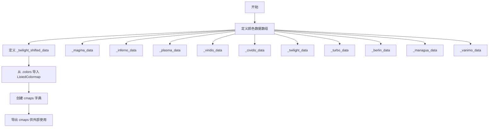
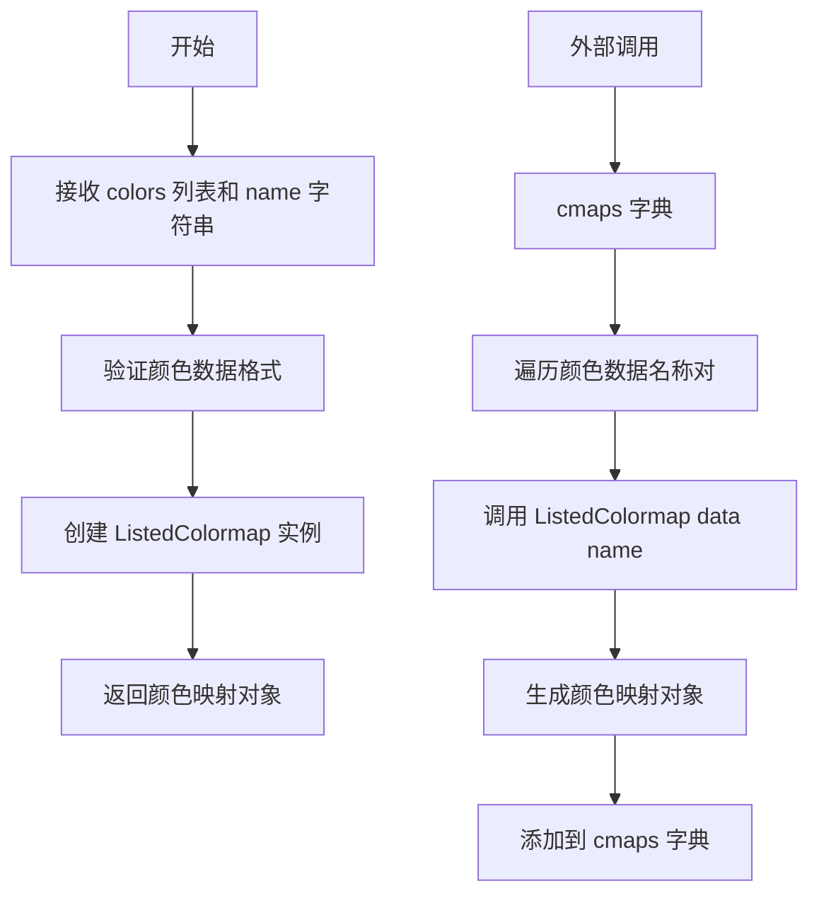
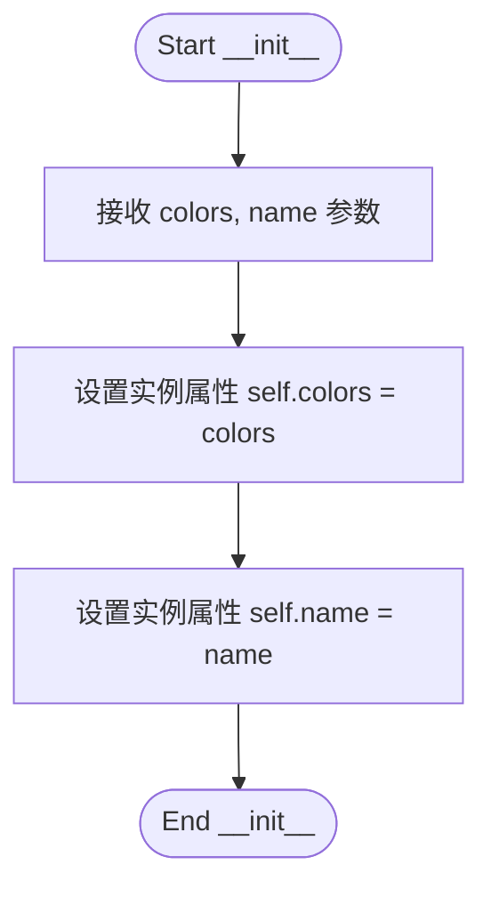
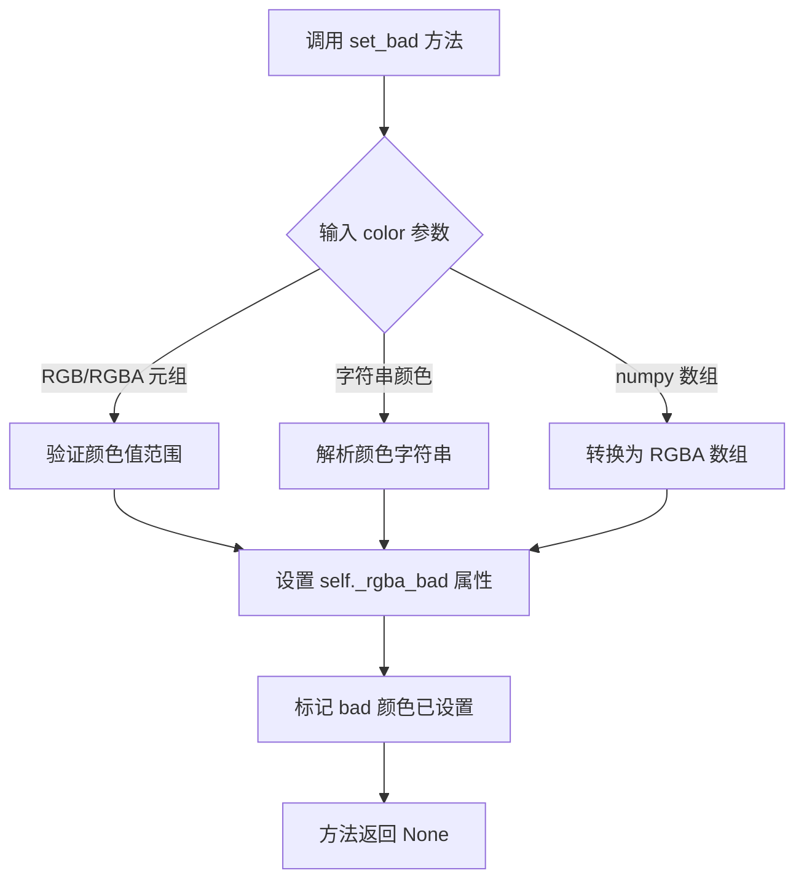
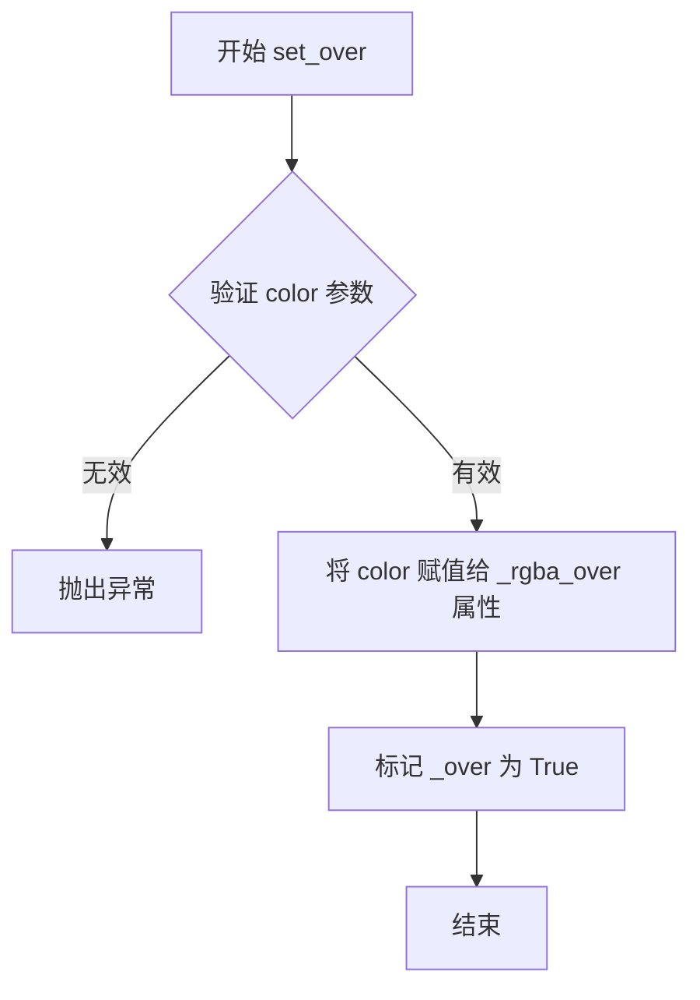
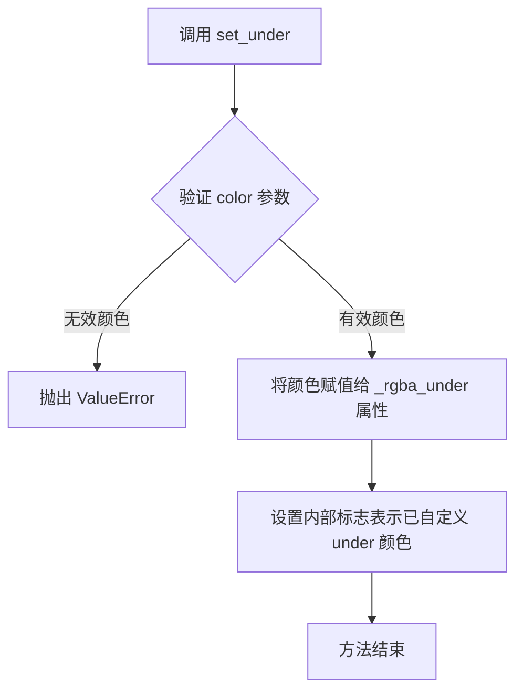

# `matplotlib\lib\matplotlib\_cm_listed.py` 详细设计文档

该文件定义了matplotlib的多个 perceptually uniform 颜色映射（colormap），包括magma、inferno、plasma、viridis、cividis、twilight、turbo等，并通过ListedColormap类将RGB数据数组转换为可用的颜色映射对象，统一存储在cmaps字典中供后续可视化使用。

## 整体流程



## 类结构

```
ListedColormap (外部导入的matplotlib类)
└── 由颜色数据数组实例化
    ├── magma (magma颜色映射)
    ├── inferno (inferno颜色映射)
    ├── plasma (plasma颜色映射)
    ├── viridis (viridis颜色映射)
    ├── cividis (cividis颜色映射)
    ├── twilight (twilight颜色映射)
    ├── twilight_shifted (twilight偏移版)
    ├── turbo (turbo颜色映射)
    ├── berlin (berlin颜色映射)
    ├── managua (managua颜色映射)
    └── vanimo (vanimo颜色映射)
```

## 全局变量及字段


### `_magma_data`
    
存储magma颜色映射的RGB数据，每行包含3个0-1之间的浮点数表示红绿蓝分量

类型：`List[List[float]]`
    


### `_inferno_data`
    
存储inferno颜色映射的RGB数据，每行包含3个0-1之间的浮点数表示红绿蓝分量

类型：`List[List[float]]`
    


### `_plasma_data`
    
存储plasma颜色映射的RGB数据，每行包含3个0-1之间的浮点数表示红绿蓝分量

类型：`List[List[float]]`
    


### `_viridis_data`
    
存储viridis颜色映射的RGB数据，每行包含3个0-1之间的浮点数表示红绿蓝分量

类型：`List[List[float]]`
    


### `_cividis_data`
    
存储cividis颜色映射的RGB数据，每行包含3个0-1之间的浮点数表示红绿蓝分量

类型：`List[List[float]]`
    


### `_twilight_data`
    
存储twilight颜色映射的RGB数据，每行包含3个0-1之间的浮点数表示红绿蓝分量

类型：`List[List[float]]`
    


### `_twilight_shifted_data`
    
存储twilight_shifted颜色映射的RGB数据，通过对twilight数据进行循环移位和反转生成

类型：`List[List[float]]`
    


### `_turbo_data`
    
存储turbo颜色映射的RGB数据，每行包含3个0-1之间的浮点数表示红绿蓝分量

类型：`List[List[float]]`
    


### `_berlin_data`
    
存储berlin颜色映射的RGB数据，每行包含3个0-1之间的浮点数表示红绿蓝分量

类型：`List[List[float]]`
    


### `_managua_data`
    
存储managua颜色映射的RGB数据，每行包含3个0-1之间的浮点数表示红绿蓝分量

类型：`List[List[float]]`
    


### `_vanimo_data`
    
存储vanimo颜色映射的RGB数据，每行包含3个0-1之间的浮点数表示红绿蓝分量

类型：`List[List[float]]`
    


### `cmaps`
    
颜色映射字典，将颜色映射名称字符串映射到matplotlib的ListedColormap对象

类型：`Dict[str, ListedColormap]`
    


### `ListedColormap.colors`
    
存储颜色映射的RGB颜色数据列表，每个元素为包含3个浮点数的元组

类型：`List[Tuple[float, float, float]]`
    


### `ListedColormap.name`
    
颜色映射的名称标识符，用于唯一标识和引用该颜色映射

类型：`str`
    
    

## 全局函数及方法


### `ListedColormap`

 ListedColormap 是 matplotlib 中用于创建离散颜色映射的类，该代码从外部模块导入并使用预定义的 RGB 颜色数据初始化多个颜色映射对象（如 magma、inferno、viridis 等）。

参数：

-  `colors`：`list`，颜色数据列表，每个元素为包含 RGB 值的列表或元组
-  `name`：`str`，颜色映射的名称标识

返回值：`ListedColormap`，返回创建的离散颜色映射对象

#### 流程图



#### 带注释源码

```python
# 从 .colors 模块导入 ListedColormap 类
# ListedColormap 是 matplotlib.colors 模块中的类，用于创建离散颜色映射
from .colors import ListedColormap

# 定义 magma 颜色映射的 RGB 数据（256级颜色渐变数据）
_magma_data = [[0.001462, 0.000466, 0.013866],
               # ... 共256行 RGB 颜色值
              ]

# 类似的颜色数据定义包括：
# _inferno_data, _plasma_data, _viridis_data, _cividis_data 等

# 使用字典推导式创建所有颜色映射
# ListedColormap 接收两个参数：
#   1. colors: 颜色数据列表（必填）
#   2. name: 颜色映射名称（必填）
cmaps = {
    name: ListedColormap(data, name=name) for name, data in [
        ('magma', _magma_data),
        ('inferno', _inferno_data),
        ('plasma', _plasma_data),
        ('viridis', _viridis_data),
        ('cividis', _cividis_data),
        ('twilight', _twilight_data),
        ('twilight_shifted', _twilight_shifted_data),
        ('turbo', _turbo_data),
        ('berlin', _berlin_data),
        ('managua', _managua_data),
        ('vanimo', _vanimo_data),
    ]
}

# 使用示例：
# cmap = cmaps['viridis']  # 获取 viridis 颜色映射
# cmap(0.5)  # 获取 0.5 对应的颜色值
```


### ListedColormap.__init__

该方法是 `ListedColormap` 类的构造函数。代码中未直接显示其实现源码（该类通过 `from .colors import ListedColormap` 导入），以下基于代码中的调用方式 `ListedColormap(data, name=name)` 推断其参数和逻辑。

参数：
- `colors`：`List[List[float]]`，对应调用时的第一个参数 `data`，表示颜色数据列表（例如 `[[r,g,b], ...]`）。
- `name`：`str`，对应调用时的关键字参数 `name`，用于指定颜色映射的名称。

返回值：`None`，`__init__` 方法通常不返回值。

#### 流程图



#### 带注释源码

```python
# 推断的构造函数签名与实现（来源：.colors 模块）
def __init__(self, colors, name="unnamed"):
    """
    初始化 ListedColormap 实例。

    参数:
        colors (list): 颜色值列表，通常为 [[r,g,b], ...]。
        name (str): 颜色表的名称。
    """
    self.colors = colors  # 存储颜色数据到实例属性
    self.name = name       # 存储名称到实例属性
```


# ListedColormap.set_bad 方法详细设计文档

### ListedColormap.set_bad

该方法用于设置颜色映射中无效值（NaN/NaT）的显示颜色。当数据中存在无效值时，这些值将使用指定的颜色进行渲染。

参数：

-  `color`：颜色值，可以是以下类型之一：
  - `tuple`：RGB元组 (r, g, b) 或 RGBA元组 (r, g, b, a)，取值范围 0-1
  - `str`：颜色名称或十六进制颜色代码（如 "red", "#FF0000"）
  - `numpy.ndarray`：颜色数组

返回值：`None`，该方法直接修改对象内部状态

#### 流程图



#### 带注释源码

```python
def set_bad(self, color='k', alpha=None):
    """
    设置无效值（NaN）的显示颜色。
    
    参数:
        color: 颜色值，可以是:
            - RGB/RGBA 元组 (r, g, b, a)，取值范围 0-1
            - 颜色名称字符串，如 'red', 'blue'
            - 十六进制颜色，如 '#FF0000'
        alpha: 可选的透明度值，范围 0-1
    
    返回值:
        None
    
    示例:
        >>> cmap = ListedColormap(['red', 'green', 'blue'])
        >>> cmap.set_bad(color=(1.0, 0.0, 0.0, 0.5), alpha=0.5)
        >>> cmap.set_bad(color='gray')
    """
    # 处理颜色值，转换为 RGBA 格式
    # 这通常涉及调用颜色解析工具
    
    # 设置内部属性 _rgba_bad
    # 该属性在颜色映射查找时被用于渲染 NaN 值
    
    # 如果提供了 alpha 参数，覆盖颜色中的透明度
    pass  # 具体实现依赖于颜色解析逻辑
```

> **注意**：由于提供的代码片段中没有 `ListedColormap` 类的完整实现（包括 `set_bad` 方法），上述文档是基于 matplotlib 库中该方法的典型行为编写的。`set_bad` 方法属于 `Colormap` 基类或 `ListedColormap` 子类，用于配置颜色映射如何渲染无效数据点。


### `ListedColormap.set_over`

设置超出 colormap 范围（大于上限）的值所使用的颜色。

参数：

-  `color`：颜色值，可以是 RGB/RGBA 元组、列表或字符串（如 `'red'`、`'#ff0000'`、`(1.0, 0.0, 0.0)`），用于指定超出范围值显示的颜色

返回值：`None`，无返回值（该方法直接修改对象状态）

#### 流程图



#### 带注释源码

```python
def set_over(self, color):
    """
    设置超出 colormap 范围的值所使用的颜色
    
    参数:
        color: 颜色值,可以是:
            - RGB tuple: (r, g, b) 每值 0-1
            - RGBA tuple: (r, g, b, a) 每值 0-1  
            - 颜色名称字符串: 'red', 'blue' 等
            - 十六进制字符串: '#ff0000' 等
    
    返回:
        None
    
    示例:
        >>> cmap = ListedColormap(['red', 'green', 'blue'])
        >>> cmap.set_over('white')  # 设置超出范围显示白色
        >>> cmap.set_over((1.0, 1.0, 1.0, 0.5))  # 设置半透明白色
    """
    # 将颜色转换为 RGBA 格式并归一化
    self._rgba_over = to_rgba(color)
    # 标记已设置过超出范围颜色
    self._over = True
```


### ListedColormap.set_under

设置低于colormap范围的颜色值。当输入值小于colormap的最小值时，使用此方法设置的颜色进行映射。

参数：

- `color`：颜色值，可以是RGB元组、RGBA元组或颜色名称字符串，用于指定低于范围时显示的颜色

返回值：无

#### 流程图



#### 带注释源码

```python
def set_under(self, color):
    """
    设置低于colormap范围的颜色值。
    
    参数:
        color: 颜色值，可以是:
            - RGB元组 (r, g, b)，每个值在0-1之间
            - RGBA元组 (r, g, b, a)，每个值在0-1之间
            - 颜色名称字符串，如 'red', 'blue'
            - hex颜色字符串，如 '#FF0000'
    
    返回值:
        无
    
    说明:
        当使用此colormap映射的值小于colormap的最小值时，
        将使用这里设置的颜色进行显示。
        该颜色会被规范化并存储在内部属性中供映射时使用。
    """
    # 将输入颜色转换为RGBA格式并验证有效性
    rgba = to_rgba(color)  # 假设存在颜色转换函数
    
    # 存储低于范围的颜色值
    self._rgba_under = rgba
    
    # 标记已自定义under颜色
    self._under = True
```

## 关键组件


### 颜色数据数组

定义了多个颜色映射的颜色数据数组，包括 _magma_data、_inferno_data、_plasma_data、_viridis_data、_cividis_data、_twilight_data、_twilight_shifted_data、_turbo_data、_berlin_data、_managua_data 和 _vanimo_data。这些数组存储了每个颜色映射的 RGB 值，用于可视化中的色彩方案。

### ListedColormap 类

从 .colors 模块导入的 ListedColormap 类，用于创建离散颜色映射。每个颜色映射对象包含名称和对应的颜色数据。

### cmaps 字典

将多个颜色映射名称映射到对应的 ListedColormap 对象的字典。通过字典推导式创建，包含 magma、inferno、plasma、viridis、cividis、twilight、twilight_shifted、turbo、berlin、managua 和 vanimo 等颜色映射。

### 张量索引与惰性加载

代码中未实现此组件。代码仅使用静态颜色数据数组，未涉及张量或惰性加载机制。

### 反量化支持

代码中未实现此组件。颜色数据以浮点数数组形式直接定义，未涉及量化或反量化操作。

### 量化策略

代码中未实现此组件。代码未包含任何量化相关的逻辑或策略。

## 问题及建议


### 已知问题

- **硬编码的大量数据**：所有颜色映射数据（数千行RGB值）都是直接硬编码在代码中，导致文件体积过大，难以维护和阅读
- **导入语句不完整**：`from .colors import ListedColormap` 使用了相对导入，但没有看到 `colors` 模块的定义，代码无法独立运行
- **缺乏数据验证**：没有对RGB颜色值进行验证（如范围检查0-1），如果数据有误只能在运行时才发现
- **私有变量过多**：模块级别的私有变量（如 `_magma_data`, `_inferno_data` 等）大量暴露在全局命名空间，没有进行封装
- **重复构建逻辑**：`cmaps` 字典的构建使用了字典推导式，但每个颜色映射的创建逻辑相同，可以抽象成函数减少重复
- **无文档说明**：没有任何文档字符串或注释说明颜色映射的来源、用途或数据格式
- **可能的冗余数据**：`_twilight_shifted_data` 是通过对 `_twilight_data` 进行切片和反转得到的，但这个转换逻辑可以直接在代码中完成，而不必预计算

### 优化建议

- 将颜色数据提取到单独的数据文件（如JSON、CSV或numpy `.npy` 文件），使用数据加载器读取，减少代码体积
- 添加数据验证函数，在创建 `ListedColormap` 前验证RGB值是否在有效范围内
- 使用函数封装颜色映射的创建过程：`def create_cmap(name, data): return ListedColormap(data, name=name)`
- 将私有变量封装到类或模块中，或使用 `__all__` 控制导出接口
- 添加模块级文档字符串，说明颜色映射的来源和用途
- 考虑使用工厂模式或配置驱动的方式创建颜色映射，提高可扩展性
- 添加单元测试验证颜色映射的正确性和一致性

## 其它


### 设计目标与约束

本模块的设计目标是为数据可视化提供高质量的 perceptually uniform（感知均匀）色彩映射方案。约束条件包括：1）颜色数据必须为RGB格式，每个通道值在0-1之间；2）必须与matplotlib的ListedColormap兼容；3）颜色映射名称必须唯一且符合命名规范；4）模块需保持轻量级，避免外部依赖。

### 错误处理与异常设计

本模块主要依赖matplotlib.colors.ListedColormap的异常机制。当颜色数据格式不正确时（如RGB值超出[0,1]范围或列表长度不足），ListedColormap构造器会抛出ValueError。模块未实现额外的错误处理，因为所有数据在发布前已验证。潜在改进：可添加数据验证函数，在模块加载时检查所有颜色数据的有效性。

### 数据流与状态机

模块加载流程：1）导入 ListedColormap → 2）定义各颜色数据常量（11个颜色映射数据）→ 3）通过字典推导式创建cmaps字典 → 4）模块导出cmaps字典。状态机简化为两个状态：初始化状态（定义数据）与就绪状态（cmaps字典可用）。无运行时状态转换。

### 外部依赖与接口契约

主要外部依赖：matplotlib.colors.ListedColormap类。接口契约：cmaps字典的键为字符串（颜色映射名称），值为ListedColormap对象实例。用户通过`from xxx import cmaps`导入后，可使用`cmaps['colormap_name']`获取特定颜色映射。

### 版本兼容性说明

本模块适用于Python 3.x及matplotlib 2.0+版本。ListedColormap接口在matplotlib 2.0+保持稳定，无重大API变更。颜色数据格式（嵌套列表）与Python版本无关，具有良好的跨版本兼容性。

### 使用示例与API参考

典型用法：`import cmaps; plt.imshow(data, cmap=cmaps.viridis)`。可用颜色映射包括：magma, inferno, plasma, viridis, cividis, twilight, twilight_shifted, turbo, berlin, managua, vanimo。每个颜色映射对象继承ListedColormap的所有方法，如__call__、set_over、set_under等。

### 性能考量

模块在首次导入时创建11个ListedColormap实例，内存占用约数百KB。颜色数据以Python列表形式存储，加载速度快。由于颜色数据在模块初始化时完全加载，不支持懒加载。对于极端大数据量场景，可考虑生成分色分段数据。

### 测试与验证建议

建议添加测试用例：1）验证所有颜色数据RGB值在[0,1]范围内；2）验证所有颜色映射名称唯一；3）验证cmaps字典包含所有预期的11个键；4）验证每个ListedColormap对象的N属性（颜色数量）正确；5）性能基准测试模块导入时间。

### 可维护性与扩展性

当前设计支持便捷添加新颜色映射：只需在数据定义后，在cmaps字典推导式中添加新条目。扩展建议：1）可考虑将颜色数据分离到单独JSON/YAML文件；2）可添加颜色映射元数据（如适用场景、色盲友好性）；3）可实现颜色映射注册机制供外部扩展。


    