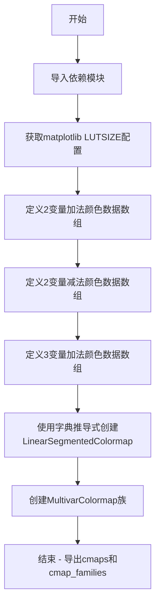

# `matplotlib\lib\matplotlib\_cm_multivar.py` 详细设计文档

该文件是一个自动生成的多变量颜色映射库，通过预定义的RGB颜色数据数组创建LinearSegmentedColormap和MultivarColormap对象，用于科学可视化和数据呈现中的多变量颜色映射。

## 整体流程



## 类结构

```
无类层次结构（纯数据模块）
├── 全局变量区
│   ├── 数据数组（7个）
│   ├── cmaps字典
│   └── cmap_families字典
```

## 全局变量及字段


### `_LUTSIZE`
    
Lookup table size for image colormaps, retrieved from matplotlib's rcParams configuration

类型：`int`
    


### `_2VarAddA0_data`
    
RGB color data (19 entries) for 2-variable additive colormap variant A0, representing color gradient from black to cyan-tinted endpoints

类型：`list[list[float]]`
    


### `_2VarAddA1_data`
    
RGB color data (19 entries) for 2-variable additive colormap variant A1, representing color gradient from black to magenta-tinted endpoints

类型：`list[list[float]]`
    


### `_2VarSubA0_data`
    
RGB color data (19 entries) for 2-variable subtractive colormap variant A0, representing color gradient from white to blue-tinted dark endpoints

类型：`list[list[float]]`
    


### `_2VarSubA1_data`
    
RGB color data (19 entries) for 2-variable subtractive colormap variant A1, representing color gradient from white to green-tinted dark endpoints

类型：`list[list[float]]`
    


### `_3VarAddA0_data`
    
RGB color data (19 entries) for 3-variable additive colormap variant A0, representing color gradient from black with increasing blue component

类型：`list[list[float]]`
    


### `_3VarAddA1_data`
    
RGB color data (19 entries) for 3-variable additive colormap variant A1, representing color gradient from black with increasing green component

类型：`list[list[float]]`
    


### `_3VarAddA2_data`
    
RGB color data (19 entries) for 3-variable additive colormap variant A2, representing color gradient from black with increasing red component

类型：`list[list[float]]`
    


### `cmaps`
    
Dictionary mapping colormap names to LinearSegmentedColormap objects, created from the predefined color data arrays using the configured LUT size

类型：`dict[str, LinearSegmentedColormap]`
    


### `cmap_families`
    
Dictionary mapping colormap family names to MultivarColormap objects, grouping related colormap variants for multivariate visualization

类型：`dict[str, MultivarColormap]`
    


    

## 全局函数及方法


## 关键组件


### 颜色数据数组

包含多个二维和三维变量的加法与减法操作的RGB颜色值数组，每个数组包含19个颜色节点，定义从暗到亮或从亮到暗的渐变过程。

### LinearSegmentedColormap

matplotlib.colors模块中的分段线性色彩映射类，用于从预定义的RGB颜色列表创建连续的色彩映射表，通过_LUTSIZE参数控制查找表大小。

### MultivarColormap

自定义多变量色彩映射类（来自colors模块），用于组合多个基础色彩映射以实现多变量数据的可视化，支持加法（sRGB_add）和减法（sRGB_sub）混合模式。

### cmaps字典

存储所有独立色彩映射对象的字典，键为色彩映射名称，值为对应的LinearSegmentedColormap对象，包括2VarAddA0、2VarAddA1、2VarSubA0、2VarSubA1、3VarAddA0、3VarAddA1、3VarAddA2共7个。

### cmap_families字典

将相关色彩映射分组为家族的字典，每个家族使用MultivarColormap将多个基础色彩映射组合在一起，提供2VarAddA、2VarSubA、3VarAddA三个色彩映射家族。

### _LUTSIZE全局变量

从matplotlib的rcParams中获取图像查找表大小，用于控制色彩映射的分辨率和平滑度，确保与matplotlib全局设置一致。

### 色彩映射家族命名约定

使用前缀标识变量数量（2Var表示二维，3Var表示三维）和操作类型（Add表示加法，Sub表示减法），后缀A0、A1、A2表示不同的色彩通道或变体。

## 问题及建议


### 已知问题

-   颜色数据硬编码在全局变量中，导致代码冗长且难以维护，数据更新需要直接修改代码。
-   大量全局变量（以`_data`结尾的列表）缺乏封装，可能被意外修改，影响模块稳定性。
-   代码缺少错误处理，例如导入`.colors`模块失败、获取`_LUTSIZE`配置失败或颜色数据格式错误时，程序会直接崩溃。
-   颜色数据点数量固定为19个，但`_LUTSIZE`来自matplotlib配置，两者可能不匹配，导致颜色映射插值不符合预期。
-   代码没有文档字符串或注释，难以理解各颜色映射的用途、依赖关系和使用方法。
-   文件头部标注为自动生成，直接修改此文件可能导致后续更新被覆盖，应修改生成脚本。

### 优化建议

-   将颜色数据外部化到独立的数据文件（如JSON或CSV），使用加载函数读取，实现数据与逻辑分离。
-   封装创建逻辑：将`cmaps`和`cmap_families`的创建过程封装为函数，减少全局变量暴露，并避免重复代码。
-   添加错误处理：使用`try-except`捕获导入异常、配置获取异常和数据验证错误，提供明确错误信息。
-   增加数据验证：检查RGB值是否在[0,1]范围内，确保颜色数据点数量与`_LUTSIZE`兼容或在文档中说明。
-   编写文档：添加模块级文档字符串，说明功能、依赖项（如matplotlib版本）和使用示例。
-   使用常量管理名称：定义颜色映射名称和家族名称的常量，避免字符串硬编码和拼写错误。
-   建议通过版本控制管理生成脚本，而非直接编辑此自动生成的文件。


## 其它


### 设计目标与约束

本模块的设计目标是为多变量数据可视化提供高质量的颜色映射解决方案。约束条件包括：必须依赖matplotlib生态系统，必须支持sRGB色彩空间，颜色数据点数量固定为19个（覆盖0-100%范围的10个关键点加中间插值点），必须使用LinearSegmentedColormap保证颜色过渡的连续性。颜色映射家族命名遵循"{变量数}{操作类型}{系列标识}"的命名规范。

### 错误处理与异常设计

代码本身未包含显式的错误处理逻辑，但依赖于下游调用者正确使用。主要风险点包括：1) 如果matplotlib的'image.lut'配置项不存在会导致KeyError；2) 如果colors模块中缺少LinearSegmentedColormap或MultivarColormap会导致ImportError；3) 颜色数据数组维度不匹配（应为Nx3的RGB值）会导致colormap创建失败。建议在调用前验证数据完整性和模块依赖。

### 数据流与状态机

数据流从静态颜色数据数组（_2VarAddA0_data等）开始，经过LinearSegmentedColormap.from_list()转换为colormap对象，存储在cmaps字典中，然后MultivarColormap将多个colormap组合成颜色映射家族。状态机方面，模块加载时执行一次性初始化，不涉及运行时状态转换。

### 外部依赖与接口契约

外部依赖包括：1) matplotlib包（必须），提供mpl.rcParams和LinearSegmentedColormap类；2) colors模块（必须），提供MultivarColormap类。接口契约方面：cmaps字典的键为colormap名称（如'2VarAddA0'），值为LinearSegmentedColormap对象；cmap_families字典的键为家族名称（如'2VarAddA'），值为MultivarColormap对象。调用者应通过cmaps['name']或cmap_families['family_name']获取colormap实例。

### 配置与可扩展性

_LUTSIZE从matplotlib配置动态获取，允许通过matplotlib.rcParams修改查找表大小。可扩展性方面：1) 添加新颜色映射只需在对应_data数组中添加RGB三点组，并在cmaps字典推导式中添加条目；2) 创建新颜色映射家族只需在cmap_families中添加新条目，指定对应的colormap列表、操作类型和名称。

### 性能考虑

模块在导入时执行所有colormap的创建操作，内存中保存所有颜色数据（约7个colormap对象）。对于大型应用，可考虑延迟加载（lazy loading）策略。LinearSegmentedColormap.from_list()的性能取决于LUTSIZE大小，默认值通常足够。

### 版本兼容性

代码注释表明由https://github.com/trygvrad/multivariate_colormaps自动生成，生成日期为2024-05-28。需要确保使用的matplotlib版本支持LinearSegmentedColormap.from_list()方法（matplotlib 3.7+），colors模块中的MultivarColormap需与本模块版本匹配。

### 使用示例与文档

典型用法示例：from multivariate_colormap import cmaps, cmap_families; import matplotlib.pyplot as plt; plt.imshow(data, cmap=cmaps['2VarAddA0']); 或使用家族：plt.imshow(data2d, cmap=cmap_families['2VarAddA'])。2Var系列适用于双变量数据可视化，3Var系列适用于三变量数据可视化；Add表示加法混合模式，Sub表示减法混合模式。

    